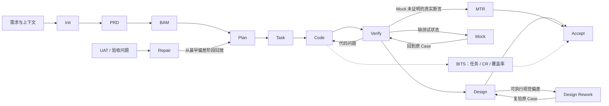

# AI 研发工作流工作汇报

> 项目：运营平台_内容活动_激励管控线上化  
> Meego 工作项：`7306602080`  
> 汇报角色：前端研发 / AI 研发工作流实践者  
> 汇报口径：截至 `2026-07-17` 的 `.trae` 状态、阶段产物与交付记录  
> 当前结论：核心功能实现、代码质量检查与设计闭环已完成；最终 `/delivery:accept` 仍为 `BLOCKED / NOT_READY_FOR_DELIVERY`，待补真实样本、DA/UV 平台证据并重新验收

## 一、汇报摘要

我在这个项目中的工作，不只是使用 AI 完成前端编码，而是把一个跨需求、设计、接口、代码、测试、评审和验收的复杂需求，放进一套可追踪、可回退、可审计的 AI 研发工作流中执行。

我的核心思路是：让 AI 承担高上下文的信息处理和重复执行，让人负责需求判断、风险决策和最终放行；用阶段状态、标准产物、质量门禁和运行证据约束 AI，避免“代码生成完成”等同于“需求已经交付”。

本次实践取得了以下阶段性结果：

| 维度 | 结果 | 说明 |
| --- | ---: | --- |
| 需求工程 | `17` 条原子需求全部建立实现与测试映射 | Task 阶段基线为 AR-001～AR-017，无 PRD Coverage Gap |
| 接口同步 | `4` 个新增接口、`1` 个字段变更接口 | 通过 BAM 同步生成方法和类型，减少手写接口合同偏差 |
| 任务执行 | `8` 个主体 Task、交付记录中的 `45/45` 个实施步骤完成 | 每个 Task 独立实现、检查、审查和留档 |
| 测试设计 | 初版 `32` 个 Case，当前矩阵演进为 `34` 个 Case | Repair 与后续补证后增加用例，正向、负向、视觉和证据要求均可追踪 |
| 设计质量 | `13` 个 Design Case 全部归档 | 通过 `7` 组 Design Rework 关闭 `10` 项可执行 UI Blocker |
| 代码评审 | `38/38` 条评论线程关闭，`9/9` 项代码检查通过 | 对评论逐条判断成立性，不以“清空评论”代替技术判断 |
| 覆盖率 | `44.25% → 97.03%` | 提升 `52.78` 个百分点，超过最终 `96%` 门槛 |
| 真实环境复测 | DOU+币、DOU+券真实只读链路取得非空数据 | DOU+币真实返回 6 条，DOU+券真实返回 3 条；写接口按安全边界拦截 |
| 最终门禁 | `BLOCKED / NOT_READY_FOR_DELIVERY` | 未把 Mock 通过、前端分支通过或评论关闭包装成全量真实交付 |

这套工作的价值主要体现在三点：

1. 将需求理解、实现和验收建立成可追踪链路，降低复杂需求遗漏和口径漂移。
2. 在后端未完全就绪时，通过受控 Mock 推进前端，但始终保留 Mock 与真实环境的证据边界。
3. 把代码质量、视觉质量和交付风险量化，使“是否可交付”由证据决定，而不是由主观进度决定。

## 二、项目背景与我的职责

### 2.1 业务背景

内容活动的奖励发放涉及 DOU+币、DOU+券、人工提报和批量上传等多条链路。原有流程依赖运营人工识别违规作品或账号，存在三类问题：

- 处罚状态识别晚，运营在发奖阶段才发现异常，处理成本高。
- 命中不激励规则的作品或账号可能被误发奖励，带来资金和合规风险。
- 剔除原因、操作记录和后续查询缺少统一线上入口，追溯效率低。

本次需求需要完成四类能力：

- 在奖励配置阶段前置透出“不激励”规则及规则入口。
- 在发奖前进行治理校验，对命中项阻断或剔除，并处理超时、异常和空名单。
- 在人工提报中展示命中原因、汇总问题作品、支持一键移除和导出，并在问题项未处理前禁止提交。
- 新增 DOU+币、DOU+券“剔除明细”查询与埋点。

### 2.2 项目难点

这个需求的难点不在某一个页面，而在跨环节一致性：

| 难点 | 具体表现 | 如果处理不当的后果 |
| --- | --- | --- |
| 需求信息分散 | PRD、评论、技术文档、Figma、Meego 信息分布在多个来源 | 开发容易漏掉评论结论或使用过期口径 |
| 多业务分支 | 币/券、作品/账号、手动输入/批量上传、处罚/解除/超时/异常 | 主流程可用但边界分支缺失 |
| 前后端节奏不一致 | 部分真实接口或特定数据样本未就绪 | 前端等待后端，或用业务代码造假数据 |
| UI 精度要求高 | 同一页面存在 Figma 精确还原和运行态基线复用两种模式 | 功能完成但结构、文案、字号、列顺序不一致 |
| 写操作风险高 | 发奖、导出、保存等操作会产生真实副作用 | 为验证功能误触线上数据 |
| 验收口径会演进 | UAT 可能暴露 Plan 和 Test Case 的共同误读 | 只改代码会导致文档、测试与实现继续不一致 |

### 2.3 我的职责定位

我承担的是“业务研发 + AI 工作流编排 + 质量门禁”三重职责：

- 业务上，理解奖励配置、发奖前治理、人工提报和剔除明细的完整用户链路。
- 技术上，完成前端页面、Store、Service、BAM 接口、异常分支和埋点的落地。
- 流程上，维护阶段状态，组织需求、计划、任务、代码、验证、设计和验收产物。
- 质量上，审查 AI 输出，判断证据是否足以放行，并对 P0/P1/P2 风险做分级。
- 协作上，通过 Ask First 与产品确认关键口径，通过 Repair 把验收问题回放到最早偏差阶段。

我把自己的角色定义为“对结果负责的主 Agent”：专业 Agent 可以处理长文档、代码、日志或设计数据，但阶段推进和最终结论必须由我基于证据作出。

## 三、我采用的 AI 研发工作流

### 3.1 工作流不是提示词集合，而是交付状态机

当前 `.trae` 将研发过程定义为一套有入口、有状态、有产物、有门禁、有暂停恢复机制的状态机。标准主链路为：

```text
meego-init-workspace（前置上下文准备）
  -> /delivery:init
  -> /delivery:prd
  -> /delivery:bam
  -> /delivery:plan
  -> /delivery:task
  -> /delivery:code
  -> /delivery:verify
  -> /delivery:design
  -> /delivery:accept
```

其中 `/delivery:mock`、`/delivery:repair`、`/delivery:verify --mtr` 和 `/delivery:bits` 是按条件进入的支线，不替代主流程门禁。



本次交付记录早期曾将 BAM 排在 PRD 之前；当前 `.trae` 规范已统一为 `PRD → BAM → Plan`。在本汇报中，我以当前规范作为方法论口径，以交付记录作为当时执行事实，避免把版本差异混写成同一条规则。

### 3.2 五项核心约束

#### 1. 事实优先

结论必须来自 PRD、用户确认、Figma、技术文档、仓库代码、命令结果或运行证据。推测只能进入不确定性清单，不能写成已完成事实。

#### 2. 状态优先

每个阶段开始前读取 `DELIVERY_STATE.md`，确认当前 Workspace、分支、阶段和恢复点。状态不一致时，即使代码看起来完整，也不能直接进入最终验收。

#### 3. 产物优先

阶段结论必须落到 `artifacts/<task>/`，不能只保存在聊天上下文。这样可以跨会话恢复，也便于人工审计和问题回放。

#### 4. 门禁优先

每个阶段都要给出 `PASS / AUTO_FIX_REQUIRED / BLOCKED / NEEDS_TARGETED_REVIEW`。P0 问题必须暂停，P1 风险可以继续但必须登记，P2 作为普通注意事项保留。

#### 5. 人机分工

AI 负责高 token 输入、结构化取证和受限执行；我负责阶段编排、关键决策、风险审查和最终放行。任何自动生成的 `PASS` 都不能替代证据审查。

### 3.3 工作流中的职责分层

| 层级 | 职责 | 在本项目中的作用 |
| --- | --- | --- |
| `commands/` | 入口、路由、前置条件检查 | 确保阶段按状态执行，避免直接跳到编码 |
| `skills/` | 定义阶段步骤、产物、Gate 和暂停策略 | 让 PRD、Plan、Verify、Design 使用统一合同 |
| `agents/` | 处理长上下文和专业任务 | 分别承担需求拆解、技术规划、代码实现、运行验证和设计核对 |
| `scripts/` | 执行确定性检查 | 检查工作区、阶段产物、构建、调试代码和变更范围 |
| `artifacts/` | 保存权威交付产物和证据 | 支撑跨阶段追踪、验收和 Repair 回放 |
| `DELIVERY_STATE.md` | 保存当前阶段和恢复点 | 防止使用错误 Workspace、旧分支或旧产物做验收 |

## 四、工作流在本项目中的落地

### 4.1 需求阶段：把模糊需求变成可验收合同

我首先将 PRD 中复合描述拆成原子需求。以“人工提报命中不激励规则”为例，原文同时包含校验、展示、操作、导出和提交限制，我把它拆成：

- 命中项保留在列表，系统只提示，不自动删除。
- 展示作品总数和问题作品数。
- 一键移除只影响问题作品，正常作品必须保留。
- 导出只包含已移除记录，并明确原因字段来源。
- 问题作品未移除前禁止提交；移除后恢复原提交链路。

这一步的专业价值，是把“接一个治理接口”转换为可验证的用户行为和负向约束，避免开发只完成主路径。

对于 PRD 和 Figma 无法回答的问题，我没有让 AI自行推断，而是通过 Ask First 向产品或用户确认。三个关键决策包括：

| 问题 | 确认结论 | 对实现的影响 |
| --- | --- | --- |
| 批量上传命中态是否单独设计 | 复用手动输入命中态 | 统一汇总、行态、移除和提交保护，减少重复实现 |
| 导出范围和原因字段 | 只导出已剔除记录；移除原因限定两类；处罚原因来自接口 | 固定请求范围、字段枚举和验收方式 |
| 本期是否提供申诉入口 | 本期不做 | 避免 AI 根据评论自行扩展产品范围 |

### 4.2 接口阶段：用生成合同替代手写猜测

技术方案确认目标服务为 `ecom.buyin.admin_api`、目标分支为 `feat_bujili`。我通过 BAM 同步了 4 个新增接口和 1 个字段变更接口，并检查配置差异和生成代码范围。

这一步把接口方法和类型变成前端可直接消费的合同，Plan 和 Code 不需要手写路径或字段，也避免将接口生成成功误认为真实业务行为已经验证。接口同步只关闭“合同一致性”，运行结果仍由 Verify 和 MTR 负责。

### 4.3 规划阶段：把需求、设计和代码落点统一起来

Plan 阶段我围绕三个问题形成技术方案：

1. 需求落在哪些页面、组件、Store 和 Service。
2. Figma 中哪些区域必须新增、保留、复用或禁止出现。
3. 哪些动作是本地状态变化，哪些必须调用真实接口，失败时有哪些副作用禁止发生。

以人工提报为例：

- `manuallySubmitVideoStore.ts` 负责命中判断、统计和已移除记录。
- Form 组件负责汇总提示、按钮和行级红色状态。
- Drawer 负责提交保护和底部操作区。
- 导出只消费 preserved removed records，不能把尚未移除的候选直接导出。
- 问题项存在时不得进入二次确认，也不得发送发奖请求。

由于后端与真实样本尚未完全就绪，我选择 `MOCK_PREVIEW` 模式继续推进。这个决策不是降低质量要求，而是把验证拆成两层：先证明前端按合同请求并消费数据，再通过 MTR 回收 Mock 无法证明的真实接口、权限和外部系统断言。

### 4.4 Task 阶段：建立“需求—任务—用例—证据”追踪矩阵

主体工作被拆成 8 个 Task：

| Task | 主要范围 |
| --- | --- |
| TASK-001 / 002 | 配置页“全部用户 / 仅限预埋用户”不激励提示与规则入口 |
| TASK-003 / 004 | DOU+币 / DOU+券剔除明细 Tab、筛选、表格和分页 |
| TASK-005 | 人工提报手动输入命中态、移除、导出和提交保护 |
| TASK-006 | 批量上传命中态复用 |
| TASK-007 | 发奖前治理阻断、解除、超时、异常和空名单 |
| TASK-008 | 配置、人工提报和剔除明细埋点 |

Task 阶段的重点不是把需求平均切成若干开发项，而是按代码边界和完整用户链路组织工作。例如，人工提报的汇总、移除、导出和提交保护共享同一份列表状态，因此放在同一个 Task 中更容易保证状态一致；币和券的剔除明细虽然复用框架，但接口和首列数据结构不同，因此拆成两个 Task，避免跨奖励类型字段残留。

每个 Test Case 同时记录：

- 前置条件和自然 UI 操作。
- 正向断言与负向断言。
- 视觉正向与负向断言。
- 所需 DOM、截图、Network、console 或样式证据。
- 对应 Task、接口、BAM Rule 和真实环境复测边界。

交付记录中的 Task 初版为 32 个 Case；当前矩阵经过 Repair 和补证演进为 34 个 Case。数量变化不是统计错误，而是工作流允许验收反馈反向补全用例的结果。

### 4.5 Code 阶段：受限执行、逐 Task 审查

代码阶段按 Task 串行执行。每个 Task 在开始前固定需求、Figma、Test Case、允许修改范围和禁止路径，完成后执行构建、差异检查、禁用模式扫描和独立审查，通过后才进入下一项。

在 UI 实现上，我使用两种策略：

- `F2C_REQUIRED`：对有明确 Figma 节点的新区域，读取结构化节点信息，按结构、文案和样式实现，再做 Code-to-Design 校验。
- `RUNTIME_BASELINE_ALLOWED`：对成熟页面上的局部能力，复用现有组件和页面结构，只修改需求涉及区域，同时保留 Figma 的可见合同。

业务代码始终保持 `page -> store -> service -> BAM` 的真实调用链。Mock 只存在于受控 BAM Runtime 或测试 fixture 中，没有为了演示效果在 component、store、service 或 adapter 里写假数据、fallback 或 fake success。

### 4.6 Verify 阶段：逐 Case 证明，而不是给出笼统 PASS

Verify 的执行单元是 Case，而不是页面。每次只激活一个 `active_case_id`，执行自然页面操作，并将每条断言映射到对应证据。

我采用以下证据组合：

| 断言类型 | 主要证据 |
| --- | --- |
| 功能正向 | 页面变化、目标接口请求、响应被页面消费的结果 |
| 功能负向 | 禁止弹窗未出现、错误接口未发送、正常数据未被误删 |
| 视觉断言 | 完整截图、DOM 顺序、显隐状态、computed style |
| 数据与接口 | Network 参数、响应摘要、BAM Rule 命中记录 |
| 安全边界 | 请求被浏览器层拦截、`backend_write=not_sent`、无成功态 |

一个典型例子是“问题作品未移除前禁止提交”：

1. 构造 3 条候选，其中 2 条为问题作品、1 条正常作品。
2. 确认页面显示“共 3 个作品，其中问题作品 2 个”和两行红色原因。
3. 点击“提交并投放”，捕获完整阻断提示。
4. 确认 Drawer 未关闭、列表未变化、二次确认弹窗未出现。
5. 检查 Network，确认没有发送币或券发奖请求。

只有“页面阻断”和“请求未发送”同时成立，才能证明这个负向业务合同真正闭合。


### 4.7 Mock 与 MTR：并行推进，但不混淆证据边界

当真实接口无法提供某个 Case 所需状态时，Verify 或 Design 会定向进入 `/delivery:mock`。Mock 只补当前 Case 的最小数据条件，规则审查通过后立即回到原 Case，不新建一个替代用例。

我坚持四个边界：

- Rule 使用 `apiName + 自然业务请求字段` 精确匹配，不能从响应反推测试选择器。
- Mock 只证明前端请求和消费逻辑，不能证明真实后端事务、权限或数据口径。
- 写接口的 Mock 成功不能表述为真实持久化成功。
- 后端就绪后通过 MTR 清理 Mock 参数，使用真实 Request、Response 和页面结果复测。

在 MTR 中，真实 DOU+币剔除明细默认读取返回 6 条记录，DOU+券默认读取返回 3 条记录，页面字段可以与接口返回对应。对于发奖、导出和保存等高风险写操作，我在浏览器层拦截，证明前端请求分支和安全边界，但明确标记为未验证真实副作用。

这体现了我对 AI 研发可信度的理解：能够继续推进不等于可以放宽结论，Mock 解决效率问题，MTR 解决真实性问题。

### 4.8 Design 阶段：让视觉差异可测量、可返修

Design 阶段不是“看起来差不多”，而是对 Figma 与同一运行状态做逐项比较。当前 `.trae` 对核心区域采用 Basic Pixel Fit：文案、控件和顺序必须一致，主容器位置、尺寸和间距原则上控制在 4px 内，字号和行高偏差不超过 1px，圆角和边框偏差不超过 2px。

本项目共执行 13 个 Design Case，通过 7 组 Design Rework 关闭 10 项可执行 Blocker。两个代表性问题是：

1. 配置提示最初多了 Figma 中没有的问号图标，字号为 14px 而设计为 12px，链接颜色和下划线也不一致。返修后删除多余图标，并将间距、字号、颜色和下划线对齐。
2. DOU+币剔除明细的输入提示和表头顺序与设计不一致。返修后将占位文案改为“支持批量输入，用逗号间隔”“请选择”，并把“剔除发奖时间”调整到“剔除发奖原因”之前。

| Figma 目标 | Code 首次运行 | Design 返修后 |
| --- | --- | --- |
|  |  |  |

### 4.9 Repair 阶段：修复共同误读，而不只是修代码

UAT 发现“一键移除后提报汇总栏和按钮整体消失”，表面上看是一个 UI Bug，但根因并不只在代码：Plan 没有要求移除后继续保留完整操作区，Task 和 Test Case 也沿用了同样口径。

我通过 Repair 从最早偏差阶段开始回放：

```text
Plan -> Task -> Code -> Verify -> Design
```

修复后，问题作品数更新为 0，正常作品保留，“一键移除”保留为禁用状态，“导出剔除明细”仍可使用。这样需求、计划、测试、实现和证据重新一致，避免只改代码后旧 Test Case 继续输出错误结论。

| Repair 前 | Repair 后 |
| --- | --- |
|  |  |

### 4.10 BITS 收尾：评审与覆盖率闭环

在评审阶段，我没有把 AI 评论当作必须执行的指令，而是逐条与需求、接口合同和实际代码链路核对：

- CodeGuard 指出成功响应可能只有 `st: 0`、没有 `code`，原逻辑可能误判失败。核对接口后确认成立，修改为兼容可选 `code` 的判断。
- Aime 建议修改 DOU+券分页 IDL，但该类型由 BAM 生成，接口合同明确使用 `page/page_num`。我没有手改生成类型，只在调用点说明特殊约定。

最终 38/38 条评论线程关闭，9/9 项代码检查和生产构建通过。这里体现的不是“听从 AI”，而是能够验证 AI 建议、接受正确意见并有依据地拒绝错误意见。

覆盖率优化从 44.25% 提升到 97.03%。优化过程优先删除不可达或过度防护逻辑，再通过真实页面操作覆盖可达分支；高风险写接口继续采用安全拦截，没有为了数字编写无业务价值的实现分支。

## 五、重点亮点

### 5.1 从“AI 生成代码”升级为“AI 参与受控交付”

我没有把工作流设计成一次性 Prompt，而是用状态机、阶段产物和 Gate 管理 AI。这样即使上下文很长、任务跨会话执行，仍然可以从权威状态和落盘证据恢复，不依赖模型记忆。

### 5.2 建立端到端可追踪性

每条需求都可以追踪到 Task、Test Case、代码、接口 Rule、运行证据、设计 Case 和最终验收结论。出现问题时，可以定位最早偏差阶段，而不是在代码层盲目试错。

### 5.3 重视负向断言和“不发生”的证明

复杂业务的风险往往来自错误副作用。我的验证不仅检查“页面出现了什么”，还检查：

- 不应出现的字段和入口是否缺失。
- 不应打开的弹窗是否未打开。
- 不应发送的发奖、移除、导出请求是否没有发送。
- 错误或超时后是否停止成功流程。
- 一键移除是否保留正常作品。

这使测试从页面截图升级为业务安全证明。

### 5.4 明确 Mock、真实环境和安全验证边界

我用 Mock 解开前后端串行依赖，但没有用 Mock 替代真实验收。所有 Case 都说明 Mock 能证明什么、不能证明什么、何时需要 MTR；高风险写接口采用浏览器安全拦截，既覆盖前端分支，又避免对线上产生副作用。

### 5.5 将 UI 对齐变成工程闭环

通过 Figma 节点、结构化 D2C 数据、运行截图、DOM 和 computed style，我把视觉问题转换为可定位的结构、文案、顺序和样式差异。Design Blocker 在原 Case 中返修和复验，不以新截图覆盖旧问题。

### 5.6 让验收问题反哺流程资产

Repair 不仅修复业务代码，还修正 Plan、Task 和 Test Case。这样一次 UAT 问题会沉淀为更准确的上游合同和回归用例，降低同类问题重复出现的概率。

## 六、工作价值

### 6.1 业务价值

- 将“不激励”规则前置到奖励配置和发奖流程，降低运营误操作和错误发奖风险。
- 支持问题作品或账号的提示、移除、导出和查询，提升运营处理效率和可追溯性。
- 对超时、异常、空名单和处罚解除等边界做显式处理，避免失败场景进入伪成功状态。

由于真实写入事务和数仓核算尚未全部闭合，本汇报不虚构节省工时或资金损失金额；现有证据能够证明前端业务控制和多数只读链路已经成立，最终业务收益仍需上线数据验证。

### 6.2 工程价值

- 通过 BAM 生成合同，减少接口字段手写错误和类型漂移。
- 通过任务边界和独立审查控制改动范围，避免 AI 在长任务中越界修改。
- 通过统一 artifacts 保存需求、计划、实现、验证和设计证据，提升交接和审计效率。
- 通过 Mock detour 与 MTR 将“前端并行开发”和“真实环境可信验证”解耦。

### 6.3 质量价值

- 13 个 Design Case 全部归档，关闭 10 项可执行 UI Blocker。
- 38 条评审线程全部闭环，生产构建和 9 项代码检查通过。
- 覆盖率提高 52.78 个百分点，达到 97.03%。
- Verify 使用 UI、DOM、Network、console 和样式多类证据，降低单一截图或静态代码判断带来的误判。

### 6.4 组织价值

- 将个人使用 AI 的经验沉淀为可复用的 command、skill、agent、script 和 Gate 规范。
- 让产品决策、技术判断、AI 输出和人工审查各自有明确责任边界。
- 为其他复杂前端需求提供可以复用的端到端交付范式，而不是一次性项目经验。

## 七、专业能力证明

| 能力 | 本项目中的证据 |
| --- | --- |
| 需求分析 | 将复合需求拆成原子需求；通过 Ask First 关闭批量上传、导出字段和申诉范围等歧义 |
| 技术方案 | 将需求映射到 Page、Store、Service、BAM，明确本地状态、接口动作和失败副作用 |
| 前端工程 | 完成配置提示、币/券剔除明细、人工提报、发奖治理和埋点等多模块改造 |
| 测试设计 | 建立多层 Test Case Matrix，覆盖正向、负向、视觉、Network 和安全边界 |
| 设计工程 | 使用 Figma/F2C、DOM 和 computed style 关闭 10 项 UI Blocker |
| 调试能力 | Verify 中定位治理超时提示缺失，受限修复后回到原 Case 复验 |
| 风险控制 | 区分 Mock、真实接口和写入副作用；在证据不足时保持最终 Gate 阻塞 |
| 代码审查 | 能够判断 AI 评论是否成立，既修复真实问题，也拒绝错误的 IDL 修改建议 |
| 流程设计 | 用状态、产物、门禁、暂停恢复和 Repair 构建可持续的 AI 交付流程 |
| 跨角色协作 | 将产品确认、设计依据、接口合同、开发任务和验收结果放入同一追踪链路 |

## 八、当前状态、风险与下一步

### 8.1 当前状态

当前 `.trae/DELIVERY_STATE.md` 的结论为：

- `current_phase=accept`
- `result=BLOCKED`
- `readiness=NOT_READY_FOR_DELIVERY`
- Design 阶段没有未归档 Blocker。
- 业务仓库当前工作区已复查为 clean。
- 仍不能升级为 `REAL_ENV_VERIFIED`。

### 8.2 尚未闭合的证据

| 风险 | 当前证据 | 尚需补充 |
| --- | --- | --- |
| DOU+币多页分页、交互排序 | 真实非空默认读取和 Mock 多页状态已覆盖 | `has_more=true` 的真实多页样本与排序证据 |
| 人工提报真实不激励字段 | Mock 已覆盖 `if_not_incentive/not_incentive_reason` 前端消费 | 真实后端命中样本 |
| 完整 reward config 阻断提示 | 前端保护和部分真实链路已覆盖 | 完整真实配置下的最新浏览器复验 |
| 埋点入库 | 前端 logger 绑定、参数和去重已验证 | DA/UV 平台事件入库截图或查询结果 |
| 高风险写入副作用 | 浏览器拦截证明请求路径和 `backend_write=not_sent` | 经授权的真实事务、导出文件、持久化和回滚证据 |
| 最终验收 | 旧 reviewer Gate 仍为 BLOCKED | 补证后重新执行 `/delivery:accept` |

### 8.3 下一步计划

1. 准备真实多页、真实不激励命中和完整 reward config 样本。
2. 通过 `/delivery:verify --mtr` 定向补齐开放断言，不重复已闭合 Case。
3. 在 DA 平台核对点击与曝光事件入库。
4. 对需要真实写入的场景取得明确授权，并在隔离数据范围内验证；如无法授权，继续保留 `PASS_WITH_NOTES`。
5. 更新 Verify 与 Delivery State 后重新执行 `/delivery:accept`，由最新 reviewer Gate 给出最终结论。

这部分体现了我的交付原则：阶段成果可以充分展示，但最终状态必须按证据如实汇报。保持 Gate 阻塞不是项目失败，而是质量体系在证据不足时发挥作用。

## 九、复盘与改进

### 9.1 做得好的部分

- 通过原子需求和追踪矩阵控制了跨模块需求遗漏。
- 在后端未完全就绪的情况下，没有停滞，也没有向业务代码注入 Mock。
- 对 AI 输出保持独立技术判断，没有把自动 `PASS` 或 CR 建议当作权威事实。
- 将 Verify、Design 和 Repair 连接成闭环，问题修复后能够回到原 Case 复验。
- 对尚未证明的真实事务和数据平台结果保持克制，没有过度承诺。

### 9.2 可以继续改进的部分

1. 更早冻结真实环境样本计划。Mock Preview 提升了前期并行效率，但多页数据、处罚命中样本和 DA 证据直到验收阶段仍不完整。后续应在 Plan 阶段就明确样本 Owner、准备时间和回收方式。
2. 统一版本化统计口径。交付记录初版为 32 个 Case，当前矩阵为 34 个 Case；后续应在报告中自动区分 baseline、repair-added 和 current-total，避免人工对账。
3. 提前校验 Delivery State。首次 Accept 曾因 Workspace/Execution State 不一致被阻断。后续可在进入 Accept 前增加状态与实际目录、分支、HEAD 的一致性预检。
4. 加强关键 Test Case 人工评审。Repair-005 说明 Plan 和 Case 可能共同误读需求。后续应在 Task Gate 增加产品关键状态的人工抽查，尤其关注操作后的持续显示和恢复条件。
5. 建立效率指标。当前结果主要证明质量和闭环程度，下一步应采集各阶段耗时、返工次数、人工介入点和 AI 采纳率，进一步量化工作流对交付周期的贡献。

## 十、面试口述版（约 3 分钟）

我想汇报一个我参与落地的端到端 AI 研发工作流项目。业务需求是“内容活动激励管控线上化”，核心目标是在奖励配置和发奖过程中识别命中“不激励”规则的作品或账号，完成提示、剔除、导出、查询和提交保护，降低人工筛查和错误发奖风险。

这个项目的难点不只是页面开发。需求信息分散在 PRD、评论、技术文档和 Figma 中，同时包含币和券、作品和账号、手动和批量、处罚和解除、超时和异常等多条分支；部分后端接口和真实数据样本又没有完全就绪。

我的做法是把 AI Coding 变成一套受控交付状态机，而不是让 AI 一次性生成代码。流程从 Init、PRD、BAM、Plan、Task、Code、Verify、Design 到 Accept，每个阶段都有明确输入、落盘产物和 Gate。AI 负责长上下文分析和受限执行，我负责需求决策、风险判断和最终放行。

在需求阶段，我把 17 条原子需求映射到 8 个主体 Task，并建立 Test Case Matrix。每个 Case 不只写预期结果，还包含正向、负向、视觉和证据要求。比如“问题作品未移除前禁止提交”，我不仅验证提示出现，还验证 Drawer 没有关闭、二次确认没有打开、发奖请求没有发送。

后端未完全就绪时，我使用 BAM Mock 推进前端，但业务代码仍然走真实的 Page、Store、Service、BAM 链路。Mock 只证明前端分支，真实接口和权限由 MTR 回收。对于发奖、导出等高风险写操作，我在浏览器层安全拦截，明确记录没有真实写入，避免为了测试制造线上副作用。

在设计质量上，我用 Figma 节点、结构化数据、运行截图和 DOM 做逐 Case 对齐。13 个 Design Case 全部归档，通过 7 组返修关闭了 10 个 UI Blocker。代码评审阶段关闭了 38 条评论线程，9 项检查和生产构建通过，覆盖率从 44.25% 提升到 97.03%。

我认为这项工作的亮点，是建立了从需求到证据的可追踪链路，也保持了对 AI 输出的独立判断。当前最终验收仍然是 BLOCKED，因为真实多页样本、真实不激励字段和 DA/UV 入库证据还没有全部闭合。我没有把 Mock 通过或评论关闭描述成已经全量交付。这说明这套工作流不仅能提效，也能在证据不足时主动阻止错误放行。

## 十一、面试追问准备

### 11.1 为什么不直接让 AI 从 PRD 生成代码？

因为复杂需求的主要风险不是代码语法，而是需求误读、范围漂移和证据不足。直接生成代码会把这些问题延后到验收阶段。阶段化工作流先固定事实和合同，再执行实现，能更早暴露高成本问题。

### 11.2 Mock 会不会让验证结果失真？

会，所以我把 Mock 结论限制在前端请求和消费分支，不允许它证明真实后端、权限和事务。每个 Mock Case 都有 Mock/Real Boundary，并在 MTR 中清理 Mock 后回收真实断言。

### 11.3 如何防止 AI 越界修改？

每个 Task 都有固定输入包、允许与禁止路径、停止条件和独立审查。代码问题、Mock 问题和设计问题走不同的定向返修路径，完成后只回到原 Case，不顺手扩大范围。

### 11.4 为什么最终仍是 BLOCKED，还能证明工作价值吗？

能。核心实现、设计、代码质量和多数运行证据已经闭合；阻塞项来自真实样本和外部平台证据不足。工作流准确识别了“前端完成”和“真实环境可交付”的差异，并阻止过度承诺。这本身就是专业交付能力的体现。

### 11.5 如果再做一次，最优先优化什么？

我会在 Plan 阶段同步建立真实环境样本和外部平台证据计划，明确每项证据的 Owner、时间和安全授权；同时在 Accept 前增加 Delivery State 一致性预检，并自动统计 baseline、Repair 新增和当前 Test Case 总量。

## 十二、材料索引

1. [当前 AI 研发工作流总规范](../.trae/AGENTS.md)
2. [当前交付框架流程图](../.trae/docs/delivery-framework-flow.md)
3. [当前交付状态](../.trae/DELIVERY_STATE.md)
4. [原始 AI 交付过程记录](<history/report__聚星台Agent和AI%20Coding工作流记录__AI交付记录-运营平台内容活动激励管控线上化交付过程记录%20%28copy%29.md>)
5. [PRD 分析产物](../artifacts/7306602080-incentive-control-online/03-prd-analysis.md)
6. [技术计划](../artifacts/7306602080-incentive-control-online/04-tech-plan.md)
7. [任务与 Test Case Matrix](../artifacts/7306602080-incentive-control-online/09-test-case-matrix.md)
8. [代码实施记录](../artifacts/7306602080-incentive-control-online/05-implementation-log.md)
9. [运行验证记录](../artifacts/7306602080-incentive-control-online/06-debug-verification.md)
10. [设计对齐记录](../artifacts/7306602080-incentive-control-online/07-design-alignment.md)
11. [最终验收报告](../artifacts/7306602080-incentive-control-online/08-acceptance-report.md)
