# 实习生转正答辩

## 一、基本信息

### 1.1 个人信息

| 项目 | 信息 |
| --- | --- |
| 姓名 | 陈相 |
| 教育经历 | 中国地质大学（武汉），电子信息专业硕士在读<br>武汉科技大学，信息安全专业本科 |
| 入职时间 | 2026 年 4 月 20 日 |
| 实习出勤天数 | 78 天 |
| Mentor | 杨帆 |
| Leader | 周力 |
| 工作职责 | 在字节跳动电商内容运营大前端团队实习，参与电商联盟运营平台建设，独立完成头达敏感数据权限管控需求，并参与 AI Coding 研发工作流的设计 |

### 1.2 实习经历

| 公司 | 时间 | 岗位 / 团队 | 工作地点 |
| --- | --- | --- | --- |
| 字节跳动 | 2026 年 4 月 20 日至今 | 技术实习生 / 电商内容运营大前端团队 | 上海 |
| 缔零智源科技有限公司 | 2026 年 1 月至 2026 年 4 月 | 前端研发实习生 / Web 前端研发组 | 武汉 |

---

## 二、业务方向与实习概览

### 2.1 业务概述

#### 电商联盟运营平台

在内容电商业务中，商家提供商品和佣金计划，作者通过短视频、直播介绍商品并带来成交。随着作者、内容和商品规模扩大，运营工作也从单次撮合延伸到作者成长、内容质量、活动执行、经营治理和效果复盘。电商联盟运营平台承载这些日常运营工作，为运营人员提供统一的查询、配置和处置入口。


平台从具体运营工作向下分为三层：

- 业务运营层直接面向运营人员，按对象分为作者运营、内容运营、商品/商家运营、活动运营和服务商/机构运营。
- 平台能力层支撑各类运营工作，提供撮合与计划、等级与成长、内容治理、数据看板、触达与工单等通用能力。
- 数据与基础设施层汇总作者、内容、商品订单、风控审核和经营分析数据，为上层页面和运营动作提供依据。

其中，作者和内容是带货经营中的两个核心对象：作者负责持续创作和经营，内容承接商品推广并触达消费者。

> **演讲概括：** 电商联盟运营平台是运营人员处理作者、内容、商品、活动和服务商业务的统一后台。研发人员负责建设对应的页面、公共组件和接口链路，让运营可以查询数据、配置策略、触达目标人群、处理治理任务并查看结果。

#### 作者运营

作者进入平台后，会经历入驻、成长、稳定经营和治理等不同阶段。运营人员需要先了解作者的经营情况，再判断其所处阶段和存在的问题，决定后续的扶持、触达或治理动作。作者运营围绕这一过程建设，以作者档案为入口，汇总基础信息、等级、赛道、成长情况、经营指标和违规记录，具体分为四类工作：

- 作者分层：按照 L0—L6、S 等级及头部、中腰部、新人等层级划分作者，确定资源分配和运营介入方式。
- 赛道运营：按美食、时尚、三农、科技等内容赛道管理作者，配置对应的内容方向、货品策略和运营动作。
- 成长体系：根据经营、视频、直播、组货等能力诊断结果，下发成长任务并跟踪完成情况。
- 治理与风控：处理违规营销、信用、舆情和权限问题，并将处置结果回写到作者档案。


作者运营形成了“查看数据与诊断问题—分层圈选—策略扶持—触达跟进—治理或复盘”的工作闭环。后台既要呈现作者整体经营情况，也要支持继续下钻到具体经营数据、内容表现和风险记录。

> **演讲概括：** 作者运营管理达人从入驻、成长到稳定经营和风险治理的全过程。研发人员负责建设作者档案、经营数据、分层圈选、成长任务和风险处置等后台功能，让运营能够判断作者当前的情况，并执行相应的扶持或治理动作。

#### 内容运营

作者的经营最终通过短视频、直播等内容落地。内容一端连接作者和商品，另一端承接用户触达与成交；内容质量会直接影响分发效果和经营结果。内容运营围绕内容从发布到分发的全过程展开，包括审核治理、质量分级、分发激励和效果诊断，后台主要覆盖以下工作：

- 内容标准：将内容质量要求整理为可检查的维度，用于判断内容质量和后续分发方式。
- 治理与规范：识别虚假宣传、违规营销、内容与商品不匹配等问题，并完成审核、处置和结果记录。
- 激励与诊断：为符合要求的内容配置流量或权益激励，同时向运营提供质量结果、问题原因和改进建议。


> **演讲概括：** 内容运营管理短视频、直播等带货内容从发布、审核到分发和激励的全过程。研发人员负责建设内容标准配置、质量结果查询、违规审核处置、激励配置和效果诊断等后台功能，让运营能够按统一标准治理内容，并跟进内容质量和经营表现。


### 2.2 工作里程碑

实习期间作为业务前端开发，参与作者运营的经营数据与治理后台建设，以及内容运营的质量治理与激励后台建设，承担相关需求的方案设计、开发联调和上线交付。

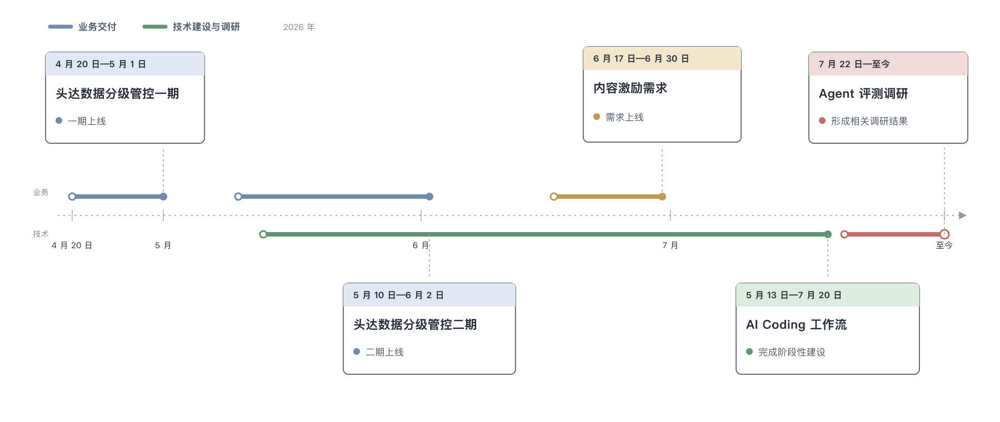

## 三、重点工作

### 3.1 《运营平台\_作者运营\_头达数据分级管控&监控预警》

#### 3.1.1 业务介绍

##### 背景

一次外部舆情事件中，媒体持续引用和传播平台头部达人的销量、销售额等交易数据。这说明现有链路在查询权限、导出限制和访问记录方面仍不够完善，存在敏感数据被非必要查看、对外传播后又难以追溯的问题。因此，平台启动头达数据分级管控专项，对敏感数据实行分级授权，并补齐查看记录和异常访问预警能力。

##### 业务目标

- 对头达敏感数据进行 L4、L4+ 分级，限制非相关人员查看和导出。
- 用户没有数据权限时隐藏真实数据，同时提供对应的数据权限申请入口。
- 查看 L4+ 数据前先判断作者协作关系，非协作人需要先申请成为协作人。
- 用户已有数据权限时也不主动展示高敏数据，需要通过小眼睛确认查看；确认后七天内可以直接查看。
- 记录高敏数据的查看行为，用于后续溯源、频次统计和异常访问预警。

##### 技术目标

- 服务端在原业务接口返回前完成权限判断和脱敏，避免真实数据先下发到浏览器。
- 前端统一处理字段级和模块级权限，接入数据权限申请、协作人申请和小眼睛查看。

##### 项目职能

前端开发（独立交付）。

##### 分期范围

需求分两期推进：

| 阶段 | 解决的问题 | 主要内容 |
| --- | --- | --- |
| 一期 | 没有数据权限时，页面如何隐藏敏感数据并提供申请入口 | 建立字段级和模块级数据权限管控；无权限字段返回占位值，模块整体隐藏；前端统一展示 `****` 并接入对应的数据权限申请；导出链路不返回无权限数据 |
| 二期 | 有数据权限后，什么时候可以看到真实数据；查看 L4+ 数据还需要满足什么条件 | 增加作者协作关系判断和小眼睛查看；非协作人先申请协作，有权限但七天内未确认查看时默认隐藏；点击查看后记录“操作人 × 作者”，七天内再次访问可直接查看 |

##### 最终访问决策

需求访问决策链如下：

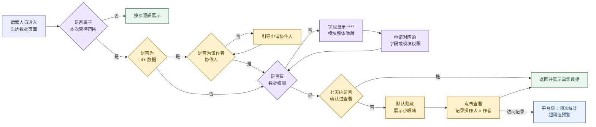

图中紫色表示一期能力，黄色表示二期新增能力，绿色是最终展示结果，蓝色是平台侧监控链路。


#### 3.1.2 技术方案

##### 1. 从需求问题推导方案

这项需求先要解决数据安全，再考虑页面如何展示和申请权限。字段和模块的承载方式不同，不能使用一套完全相同的返回协议。

| 需求问题 | 设计判断 | 方案结果 |
| --- | --- | --- |
| 未通过权限校验时，真实敏感数据不能下发到浏览器 | 前端不能先拿到真实数据再决定是否隐藏 | 后端负责权限判断和字段脱敏；前端只根据返回结果识别状态并提供权限操作入口 |
| 权限分布在多个页面，既有字段权限，也有整块模块权限 | 字段已有业务接口和返回值；模块没有统一的业务字段可以携带权限信息 | 字段复用原业务接口并修改字段值；模块使用独立的权限查询接口，确认可查看后再请求业务数据 |
| 页面需要区分多种权限状态 | “无权限”不能覆盖协作关系不足、数据权限不足和需要确认查看三种情况 | 字段通过 payload 区分状态；模块通过独立状态字段返回，前端最终统一成四种页面状态 |
| 作者交易数据、违规作品等受控对象不同 | 每个受控字段或模块都需要独立标识，不能共用一个权限 key | 为每个权限对象定义稳定的 `front_key`，例如字段标识或 `user_info`、`new_violation_tab` 等模块标识 |
| 权限申请和模块查询使用不同的平台 code | `front_key` 只是业务标识，不能直接代替聚星台申请 code 和系统权限 code | TCC 维护 `front_key` 到 `auth_code`、`permission_code` 的映射，页面和业务协议不直接写平台 code |

由此形成两条查询链路：字段权限复用业务接口，模块权限先查权限状态。两条链路最后都得到四种页面状态：可以查看、没有数据权限、没有协作关系、需要确认查看。

##### 2. 字段与模块如何得到权限状态

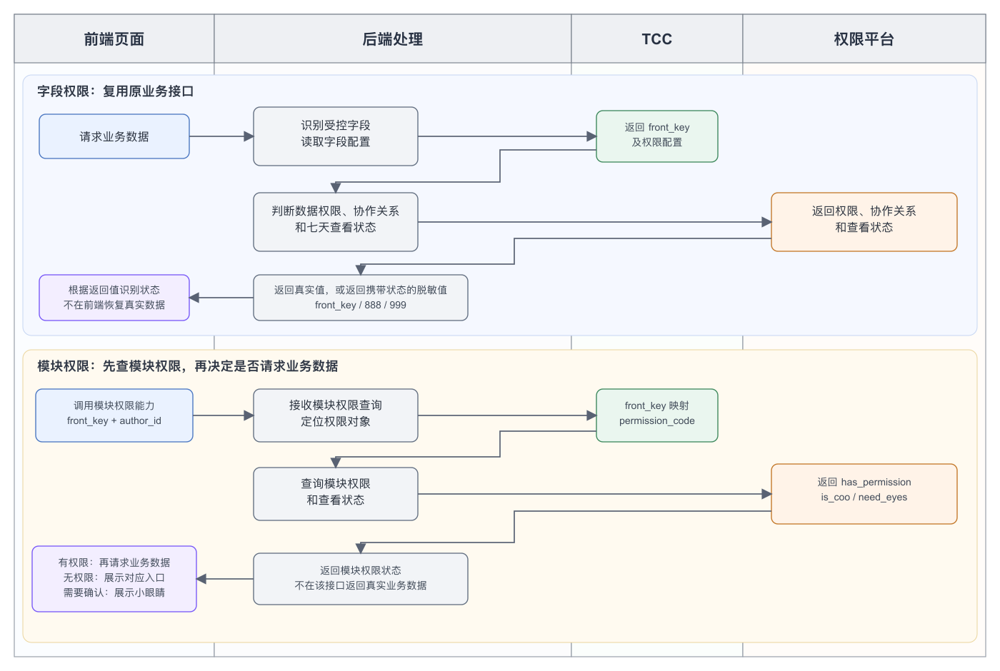

- 字段链路中，前端正常请求业务数据。后端完成权限判断：允许查看时返回原值；不允许直接查看时返回脱敏值。前端只解析返回值，不在浏览器中恢复真实数据。
- 模块链路中，前端先按模块 `front_key` 查询权限。只有模块状态为“可以查看”时，才继续请求和展示业务数据；其他状态直接进入对应的权限操作。

##### 3. TCC 映射设计

不同权限对象使用不同的 `front_key`。`front_key` 用于业务协议和页面识别，平台真正执行申请或查询时仍需要对应的 code：

```text
受控字段或模块
      ↓
   front_key
      ↓
indicator_auth_config
      ├─ auth_code：打开聚星台数据权限申请
      └─ permission_code：查询模块是否有权限
```

没有直接把平台 code 放进页面或脱敏值，主要有两个原因：同一个权限对象在“申请权限”和“查询权限”时使用的 code 不同；平台配置调整后，如果 code 分散在多个页面和接口协议中，需要逐页修改。使用稳定的 `front_key` 后，只需更新 TCC 映射。

| TCC 字段 | 用途 |
| --- | --- |
| `indicator_key` | 标识后端需要处理的业务指标 |
| `front_key` | 字段或模块在业务侧使用的稳定标识 |
| `auth_level` | 记录 L4、L4+ 等数据等级 |
| `auth_code` | 发起聚星台数据权限申请时使用 |
| `permission_code` | 调用模块权限接口时使用 |

前端权限公共层通过 `apiGetTccValue` 获取 `indicator_auth_config`，按 `front_key` 查找所需 code。TCC 只负责标识映射，用户最终是否有权限仍由后端和权限平台判断。

##### 4. 字段级返回协议

字段权限直接复用原业务接口。后端在返回前把受控字段转换为正常值或脱敏值，因此不需要给每个页面增加一套权限接口。

字段方案对比了两种传输方式：

| 方案 | 返回方式 | 对多页面、多组件传递的影响 |
| --- | --- | --- |
| `value` 与标识分开 | `value="****"`，另加 `front_key` 字段 | 表格、提示框和业务组件都要同时传递两个字段，中间组件漏传或传错后无法发起正确的权限申请 |
| 固定前缀与标识合并 | `value="****<front_key>"` | 原有链路继续只传递 `value`，脱敏状态和字段标识不会分离；最终采用该方案 |

脱敏值由固定前缀和 payload 组成。固定前缀与原字段类型匹配，payload 表示权限对象或当前状态。

| 原字段类型 | 没有数据权限 | 没有协作关系 | 需要确认查看 | 可以查看 |
| --- | --- | --- | --- | --- |
| 字符串 | `****<front_key>` | `****888` | `****999` | 返回原字符串 |
| 整数 | `-99999<front_key>` | `-99999888` | `-99999999` | 返回原整数 |
| 浮点数 | `-99999.<front_key>` | `-99999.888` | `-99999.999` | 返回原浮点数 |

例如，字段标识为 `1` 时，整数占位值为 `-999991`，浮点数占位值为 `-99999.1`。前端不会直接展示这些值，而是统一显示 `****`，再根据 payload 决定操作：

- 普通 `front_key`：从 TCC 取得 `auth_code`，进入数据权限申请；
- `888`：进入协作人申请；
- `999`：展示小眼睛，等待用户确认查看；
- 正常值：沿用原页面展示逻辑。

##### 5. 模块级权限协议

模块权限控制的是一整块内容，没有单一字段可以承载 `****<front_key>`。因此模块使用独立的权限查询接口，在业务模块加载前判断当前状态。

```text
模块 front_key + author_id
  → apiGetTccValue 获取 indicator_auth_config
  → front_key 映射为 permission_code
  → apiEmployeePermission({
       permission_keys: [permission_code],
       author_id,
       author_id_for_eye_check: author_id
     })
  → has_permission / need_eyes / is_coo
```

接口只返回权限状态，不返回模块的真实业务数据：

| 返回字段 | 含义 |
| --- | --- |
| `has_permission[permission_code]` | 当前用户是否拥有该模块的数据权限 |
| `need_eyes` | 当前作者的数据是否需要再次确认查看 |
| `is_coo` | 当前用户是否为该作者的协作人 |

前端按以下规则得到模块状态：

| 条件 | 页面状态 | 后续处理 |
| --- | --- | --- |
| `has_permission=true` 且 `need_eyes=false` | 可以查看 | 加载并展示模块业务数据 |
| `has_permission=true` 且 `need_eyes=true` | 需要确认查看 | 展示小眼睛，不展示真实模块内容 |
| `has_permission=false` 且 `is_coo=true` | 没有数据权限 | 展示数据权限申请入口 |
| `has_permission=false` 且 `is_coo=false` | 没有协作关系 | 展示协作人申请入口 |

##### 6. 权限操作与数据刷新

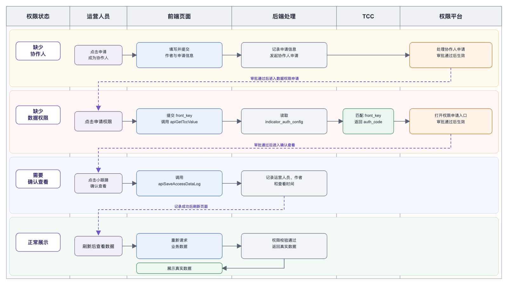

- 数据权限和协作人申请需要等待审批。审批通过后，页面重新请求数据，由后端按最新权限状态决定返回真实值还是脱敏值。
- 点击小眼睛时，前端调用 `apiSaveAccessDataLog`，后端记录当前运营、作者和查看时间。记录成功后刷新当前列表或页签；七天内再次请求时，后端按“已确认查看”返回真实数据。
- 前端不会在本地把状态直接改成“可以查看”。所有操作最终都回到权限判断链路，以后端最新结果为准。

#### 3.1.3 关键

##### 关键技术一：权限状态判断与统一

> **技术目标**：建立字段级和模块级两条权限判断链路，使两类返回都能得到明确、唯一的权限状态。
>
> **关键挑战**：字段级和模块级没有统一的权限判断输入。字段级需要从业务值中识别权限标记，模块级需要组合多个权限字段；需要为两类输入建立结果唯一的判断规则，并保证最终四种权限状态的边界一致。

###### 字段级权限判断链路

字段级权限由 `parseSensitiveFieldState` 从业务字段值中解析，处理过程分为三层：

1. `parseSensitiveFieldState` 接收字段原始值，将占位值交给 `parseSensitiveMask` 识别；没有命中占位协议时返回 `undefined`，对应“可以查看”。
2. `parseSensitiveMask` 根据数据类型识别占位前缀：字符串使用 `****`，数值使用 `-99999.` 或 `-99999`。数值先判断浮点前缀，避免被整数前缀提前截断。
3. `resolveMaskedPayload` 解析前缀后的 payload：`888` 表示“不是协作人”，`999` 表示“需要确认查看”，其他值作为 `front_key`，表示“没有数据权限”。

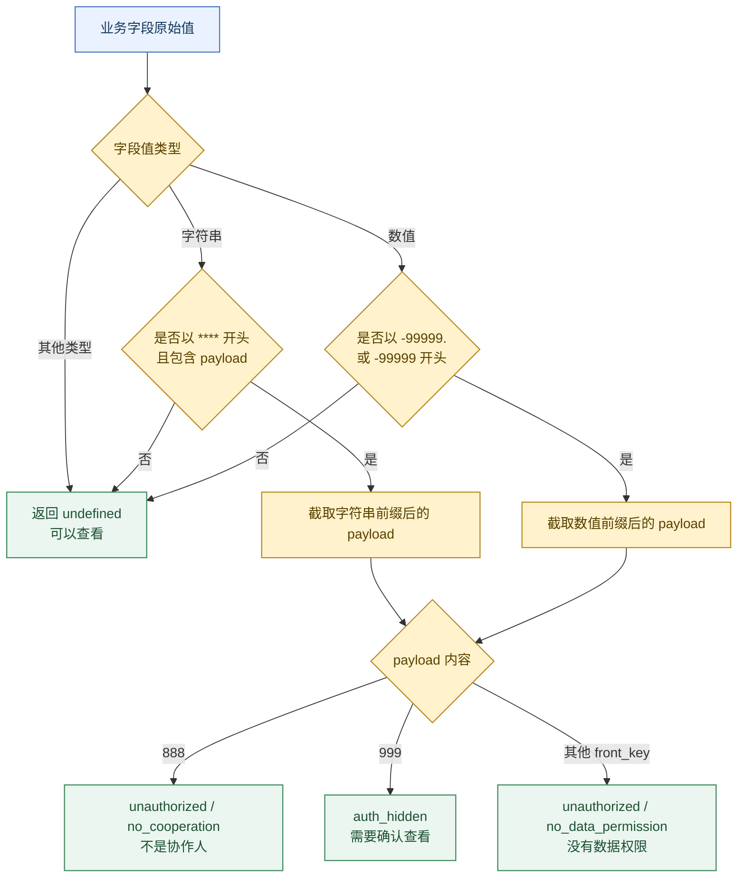

```ts
function resolveMaskedPayload(rawPayload) {
  const payload = rawPayload.trim();

  if (payload === '888') {
    return { type: 'unauthorized', reason: 'no_cooperation' };
  }
  if (payload === '999') {
    return { type: 'auth_hidden' };
  }
  return {
    type: 'unauthorized',
    reason: 'no_data_permission',
    fieldKey: payload,
  };
}

function parseSensitiveMask(value) {
  if (typeof value === 'string') {
    if (value.startsWith('****') && value.length > 4) {
      return resolveMaskedPayload(value.slice(4));
    }
  }

  if (typeof value === 'number') {
    const normalized = String(value);
    if (normalized.startsWith('-99999.') && normalized.length > 7) {
      return resolveMaskedPayload(normalized.slice(7));
    }
    if (normalized.startsWith('-99999') && normalized.length > 6) {
      return resolveMaskedPayload(normalized.slice(6));
    }
  }

  return undefined;
}

function parseSensitiveFieldState(value) {
  return parseSensitiveMask(value);
}
```

###### 模块级权限判断链路

模块级权限由 `getSensitiveModulePermissionState` 直接解析结构化权限结果：

1. `hasPermission=true` 时继续判断 `needEyes`：不需要确认查看时为 `viewable`，需要确认查看时为 `view_permission_required`。
2. `hasPermission=false` 时继续判断 `isCoo`：已经是协作人时为 `no_data_permission`，不是协作人时为 `no_cooperation`。
3. 权限结果尚未返回时为 `loading`，仅表示判断过程中的过渡状态，不计入最终四种权限状态。

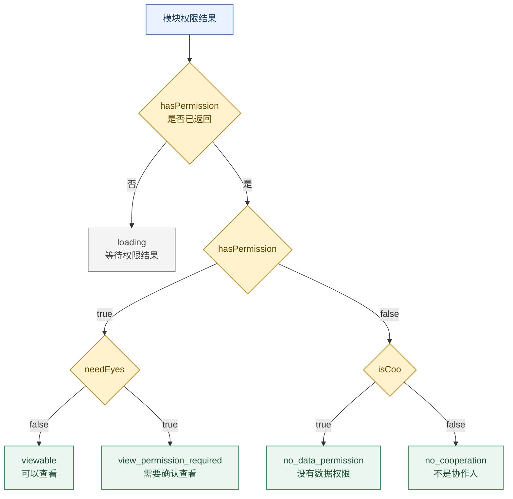

```ts
function getSensitiveModulePermissionState(permission) {
  if (permission?.hasPermission === undefined) {
    return 'loading';
  }

  if (permission.hasPermission) {
    return permission.needEyes
      ? 'view_permission_required'
      : 'viewable';
  }

  return permission.isCoo
    ? 'no_data_permission'
    : 'no_cooperation';
}
```

###### 四种权限语义

字段级通过占位值解析权限，模块级通过结构化状态判断权限。两条链路的技术返回不同，但最终都对应四种相同的业务语义。

1. **可以查看**：字段值未命中占位协议，解析结果为 `undefined`；模块级判断结果为 `viewable`。
2. **没有数据权限**：字段级解析结果为 `unauthorized / no_data_permission`；模块级判断结果为 `no_data_permission`。
3. **不是协作人**：字段级解析结果为 `unauthorized / no_cooperation`；模块级判断结果为 `no_cooperation`。
4. **需要确认查看**：字段级解析结果为 `auth_hidden`；模块级判断结果为 `view_permission_required`。

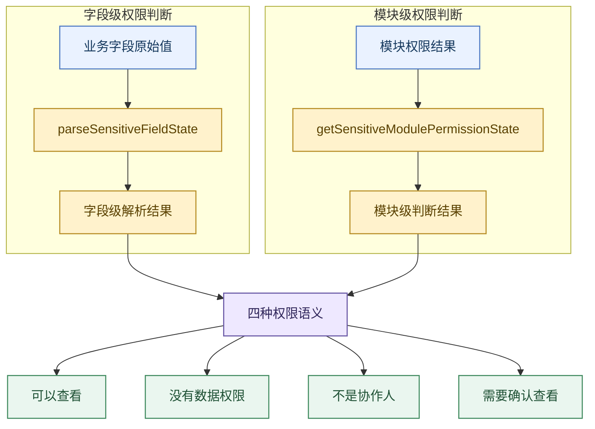

##### 关键技术二：权限状态下的页面渲染

> **技术目标：**将权限判断结果实现页面渲染，在不展示敏感数据的前提下，保留清晰的内容结构和对应的权限操作入口。
>
> **关键挑战**：判断出无权限后，不同页面需要隐藏的内容范围不同。字段只需要隐藏一个值，模块需要隐藏整个内容区域，图表需要隐藏真实数据但保留原有图形结构。如何针对这三类内容渲染正确的无权限状态，是页面渲染的核心难点。

###### 字段级渲染：隐藏单个敏感值

字段无权限时不改变原有表格、卡片和详情布局，只替换当前字段的展示内容。公共组件 `MaskedTooltip` 负责字段遮罩和权限入口：

1. 字段显示统一替换为 `****`，不再进入普通数值或文本展示。
2. `no_data_permission` 展示数据权限说明和申请入口，`no_cooperation` 展示协作人申请入口。
3. `auth_hidden` 在 `****` 后展示小眼睛，点击后进入确认查看链路。
4. 组件支持包裹已有节点，并阻止点击事件继续冒泡，避免在列表中同时触发行跳转；Tooltip 挂载到 `document.body`，避免被表格或卡片容器裁剪。

```tsx
function MaskedTooltip({ children, maskedValue, fieldKey, authCode, authorId, onApply }) {
  const state = parseSensitiveFieldState(maskedValue);
  const displayValue =
    state?.type === 'unauthorized' && children !== undefined
      ? children
      : '****'; // 默认隐藏字段值，也支持包裹已有节点

  // 已有数据权限，但需要点击小眼睛确认查看
  if (state?.type === 'auth_hidden') {
    return (
      <span>
        {displayValue}
        <button onClick={(event) => {
          event.stopPropagation();
          requestSensitiveViewPermission(authorId);
        }}>
          <EyeToggleIcon active={false} />
        </button>
      </span>
    );
  }

  const isNoCooperation =
    state?.type === 'unauthorized' && state.reason === 'no_cooperation';
  const effectiveFieldKey = fieldKey ?? extractSensitiveFieldKey(maskedValue);
  const applyArg = authCode ? { authCode } : effectiveFieldKey;

  // Tooltip 内根据状态进入协作人申请或数据权限申请
  function handleApply(event) {
    event.stopPropagation(); // 避免同时触发表格行跳转
    if (isNoCooperation) {
      onApply?.();
    } else if (applyArg) {
      applySensitivePermission(applyArg);
    } else {
      onApply?.();
    }
  }

  const actionText = isNoCooperation ? '申请协作人' : '立即申请';
  const canApply = isNoCooperation ? Boolean(onApply) : Boolean(onApply || applyArg);
  if (!canApply) return <span>{displayValue}</span>; // 无申请参数时只展示遮罩

  return (
    <Tooltip title={<a onClick={handleApply}>{actionText}</a>}
             getPopupContainer={() => document.body}>
      <span>{displayValue}</span>
    </Tooltip>
  );
}
```

###### 模块级渲染：替换整个内容区域

完整模块无权限时，字段级遮罩无法说明受限范围。公共组件 `SensitiveNoPermission` 直接替换模块内容区域，并统一展示无权限状态：

1. 根据权限状态切换标题和按钮，分别提供数据权限申请、协作人申请和确认查看入口。
2. 保留原模块占位区域，避免内容消失后页面结构发生大幅变化。
3. 使用 `ResizeObserver` 读取容器尺寸：高度不足时切换紧凑布局，空间足够时展示插图，使同一个组件可以覆盖完整模块、卡片和图表区域。

```ts
function SensitiveNoPermission({ maskedValue, fieldKey, authCode, onApply }) {
  const containerRef = useRef();
  const state = parseSensitiveFieldState(maskedValue);

  // 将权限状态转换为模块文案和操作类型
  const viewConfig = state?.type === 'auth_hidden'
    ? {
        title: '该模块为敏感信息，请勿分享',
        actionText: '继续查看',
        action: 'request_view_permission',
      }
    : state?.type === 'unauthorized' && state.reason === 'no_cooperation'
    ? {
        title: '该模块为敏感信息，请先申请为作者的协作人',
        actionText: '申请协作人',
        action: 'apply_manage',
      }
    : {
        title: '该模块为敏感信息，需申请相关数据权限才可查看',
        actionText: '立即申请',
        action: 'apply_permission',
      };

  // 点击后分别进入小眼睛、协作人或数据权限链路
  function handleApply() {
    if (viewConfig.action === 'request_view_permission')
      return requestSensitiveViewPermission();
    if (viewConfig.action === 'apply_manage')
      return onApply?.();
    const resolvedFieldKey = fieldKey ?? extractSensitiveFieldKey(maskedValue);
    const applyArg = authCode ? { authCode } : resolvedFieldKey;
    return applyArg ? applySensitivePermission(applyArg) : onApply?.();
  }

  // useContainerSize 内部通过 ResizeObserver 监听容器变化
  const { width, height } = useContainerSize(containerRef);
  const isCompactLayout = height < 80;
  const showImage = !isCompactLayout && width >= 350 && height >= 200;

  return (
    <div ref={containerRef}>
      {showImage && <SmallerImage />}
      {isCompactLayout ? (
        <span>{viewConfig.title} <a onClick={handleApply}>{viewConfig.actionText}</a></span>
      ) : (
        <>
          <div>{viewConfig.title}</div>
          <Button onClick={handleApply}>{viewConfig.actionText}</Button>
        </>
      )}
    </div>
  );
}
```

###### 图表渲染：隐藏真实数据并保留图形结构

图表无权限时不能直接使用敏感占位值绘制坐标，也不能简单返回空数据。渲染链路将真实指标值与预览几何分开处理：

1. 根据当前指标状态判断图表是否可以展示。
2. 无权限时只保留时间范围、序列名称等非敏感结构；
3. 使用稳定 seed 生成不包含真实指标值的安全预览曲线，同一查询条件下结果保持稳定，不表达真实趋势。
4. 在预览图表上方叠加 `SensitiveNoPermission`，由覆盖层说明权限状态并提供操作入口。

```ts
function buildChartRenderData({ currentIndicator, trendData, pointData, dateRange }) {
  // 1. 当前指标值决定整张图表能否展示真实数据
  const hasChartPermission = !isSensitiveMaskedValue(currentIndicator.value);
  if (hasChartPermission) {
    return { hasChartPermission: true, displayTrendData: trendData };
  }

  // 2. 没有趋势数据时生成兜底时间轴，保证图表结构完整
  const fallbackTrendData = buildUnauthorizedFallbackTrendData({
    pointData,
    dateRange,
    metricKey: currentIndicator.key,
    maskedValue: currentIndicator.value,
  });
  const previewSourceTrendData = selectTrendDataByGranularity({
    trendData,
    fallbackTrendData,
  });

  // 3. 使用稳定 seed 生成不包含真实指标值的安全预览曲线
  const displayTrendData = buildUnauthorizedPreviewTrendData(
    previewSourceTrendData,
    { metricKey: currentIndicator.key, dateRange },
  );

  return {
    hasChartPermission: false,
    displayTrendData,
    maskedValue: currentIndicator.value,
  };
}

function PermissionTrendChart(props) {
  const chartRenderData = buildChartRenderData(props);

  return (
    <div className="chart-container">
      {/* 4. 无权限时仍绘制安全预览曲线 */}
      <MultiViewTimeline data={chartRenderData.displayTrendData} />

      {/* 5. 在预览曲线上方覆盖权限说明和操作入口 */}
      {!chartRenderData.hasChartPermission && (
        <SensitiveNoPermission
          maskedValue={chartRenderData.maskedValue}
          onApply={props.onApplyManage}
        />
      )}
    </div>
  );
}
```

##### 关键技术三：权限操作与页面刷新链路

**技术目标**：从字段和模块的无权限入口出发，分别打通数据权限申请、协作人申请和确认查看链路；操作完成后重新获取当前页面数据，使页面按最新权限状态展示。

**关键挑战**：三类操作都从 `MaskedTooltip` 或 `SensitiveNoPermission` 触发，但后续依赖不同能力：数据权限需要平台弹窗，协作人需要作者运营审批组件，确认查看还需要按当前页面恢复数据和位置。需要让公共权限组件保持通用，同时把不同操作准确交给平台能力、业务组件和页面刷新逻辑处理。

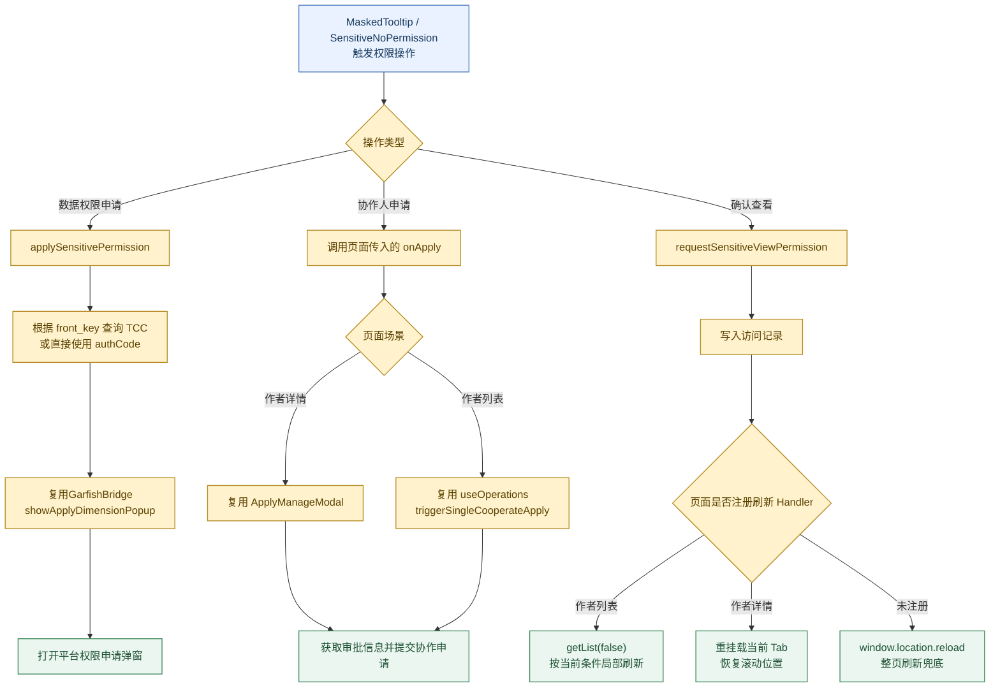

###### 数据权限申请

数据权限申请复用宿主平台已有的权限弹窗。公共权限组件只传递稳定的 `front_key`，运行时 Handler 负责查找真实权限点并调用平台能力：

1. `Layout` 挂载时注册 `permissionApplyHandler`，字段和模块组件通过 `applySensitivePermission` 发出统一操作。
2. 普通字段根据 `front_key` 从 TCC 获取 `auth_code`；泳道等已经返回 `auth_code` 的场景可以直接传入，避免重复查询。
3. 最终调用 `GarfishBridge.actionBridge.showApplyDimensionPopup`，以 `auth_code` 作为 `dimension_type` 打开平台权限申请弹窗。

```ts
function applySensitivePermission(arg) {
  // 公共组件只触发运行时 Handler，不依赖宿主平台
  permissionApplyHandler?.(arg);
}

async function handleSensitivePermissionApply(arg) {
  const authCode = isExplicitAuthCode(arg)
    ? arg.authCode
    : await resolveSensitiveAuthCode(arg); // front_key -> TCC auth_code

  if (!authCode) {
    return message.info('当前字段暂无可申请的权限配置');
  }

  const showApplyPopup =
    window.GarfishBridge?.actionBridge?.showApplyDimensionPopup;
  if (!showApplyPopup) {
    return message.info('当前环境暂不支持权限申请');
  }

  showApplyPopup({
    dimension_type: authCode,
    afterApplyCallback: () => message.success('已发起权限申请'),
  });
}
```

###### 协作人申请

不是协作人时，公共权限组件通过 `onApply` 将操作交还给当前页面，不在权限组件内部重新实现协作审批：

1. 作者详情复用 `ApplyManageModal`。弹窗打开后先查询审批人、赛道和认领信息，再校验协作天数与申请原因，最后通过 `AuthorOperateType.Cooperate` 提交。
2. 作者列表复用 `useOperations.triggerSingleCooperateApply`，继续使用列表原有的单作者协作流程。
3. 两个场景共用作者运营已有审批能力，权限组件只负责识别状态和触发回调。

```ts
function handleNoCooperation(pageContext, author) {
  // 权限组件统一调用页面传入的 onApply
  if (pageContext.type === 'detail') {
    pageContext.setApplyModalVisible(true); // 复用 ApplyManageModal
  } else {
    pageContext.triggerSingleCooperateApply(author); // 复用列表 useOperations
  }
}

function ApplyManageModal({ visible, authorId, onSuccess }) {
  useEffect(() => {
    if (visible) {
      apiAuthorOperate({
        authorId: [authorId],
        authorOperateType: AuthorOperateType.GetCooperationApproveInfo,
      });
    }
  }, [visible, authorId]);

  async function handleSubmit(formValues) {
    const result = await apiAuthorOperate({
      authorId: [authorId],
      authorOperateType: AuthorOperateType.Cooperate,
      ...formValues,
    });
    if (result.code === 0) onSuccess?.();
  }
}
```

###### 确认查看与页面刷新

确认查看不是直接把前端缓存中的 `****` 替换为旧值，而是先写入访问记录，再重新请求原业务数据。公共运行时负责确认动作，当前页面负责刷新范围：

1. 点击小眼睛后调用 `apiSaveAccessDataLog` 写入当前作者的访问记录，写入失败时保留原无权限状态。
2. 写入成功后执行当前页面注册的 `viewPermissionSuccessHandler`。
3. 作者列表复用 `getList(false)`，保留现有筛选和排序条件，只刷新列表数据。
4. 作者详情保存当前 Tab 和滚动位置，按需刷新公共数据，再通过 `refreshVersion` 重挂载当前 Tab，完成后恢复滚动位置。
5. 页面没有注册 Handler 时使用 `window.location.reload()` 兜底，避免页面停留在旧权限状态。

```ts
async function handleSensitiveViewPermission(authorId) {
  // 先写访问记录，成功后才允许页面重新取数
  const saved = await postSensitiveAccessDataLog(authorId);
  if (!saved) return false;

  const handled = await runSensitiveViewPermissionSuccessHandler(authorId);
  if (!handled) window.location.reload(); // 页面未处理时整页刷新兜底
  return true;
}

// 作者列表：复用当前查询条件局部刷新
setSensitiveViewPermissionSuccessHandler(async () => {
  await getList(false);
  return true;
});

// 作者详情：恢复当前 Tab 和滚动上下文
setSensitiveViewPermissionSuccessHandler(async () => {
  const currentTab = selectTab as TabKey;
  const scrollElement = getScrollElement();
  const scrollTop = scrollElement?.scrollTop ?? window.scrollY;

  if (currentTab === TabKey.AuthorProfile) {
    await Promise.all([handleFetchBase(), getGrowthDetail()]);
  }
  await forceRefreshTab(currentTab); // refreshVersion + 1，重挂载当前 Tab
  restoreScrollPosition(scrollTop);
  return true;
});
```

##### 关键技术四：将重复交付工作沉淀为 Skill

权限需求覆盖页面多、状态组合多，联调和质量检查中存在大量重复操作。将输入、执行规则和输出结果固定为 Skill，使状态切换和覆盖率检查按统一规则执行，减少反复手工处理。

###### Mock Skill：批量切换权限状态

**核心目标**：通过一次状态输入，批量生成各受控接口的本地响应，使字段、模块、图表和环比在同一轮调试中保持一致的权限状态。

**解决的问题**：

1. 受控数据分布在多个页面和接口中，手动修改单个响应只能覆盖局部页面。
2. 每次切换状态都需要重新查找接口、JSON 路径和字段标识，耗时且容易遗漏。
3. 同一权限状态涉及字段级和模块级两类返回，逐项修改容易出现状态不一致。

**Skill 规范设计**：

1. **输入约束**：只接收正常展示、无数据权限、不是协作人和待确认查看四种权限状态。接口规则统一记录请求信息、本地响应文件、字段或模块的改写位置。
2. **执行规则**：先校验输入状态，再读取接口规则并调用固定脚本。脚本只改写规则声明的路径，按目标类型生成对应的字段值或模块状态，最后写入 Chrome Local Overrides 关联目录。
3. **输出结果**：输出本轮权限状态 Mock 数据及 Overrides 目录。


###### 前端增量覆盖率 Skill：自动定位覆盖缺口

**核心目标**：自动完成增量覆盖率报告拉取、缺口定位和报告刷新，并按 90% 阈值选择每轮最需要处理的文件，减少重复查看和比较报告的时间。

**解决的问题**：

1. 权限改动分散在多个页面和公共组件中，需要反复查看文件覆盖率和未覆盖代码行。
2. 人工选择目标文件时，容易把时间花在没有新增代码、生成代码或已经处理过的文件上。
3. 页面操作完成后仍需重新拉取报告并判断是否达标，多轮处理时步骤重复。

**Skill 规范设计**：

1. **输入约束**：输入代码仓库、基准分支、需求分支、覆盖率阈值和最大执行轮数；默认阈值为 90%，最多执行三轮。
2. **执行规则**：调用华佗 `branch/files` 获取变更文件覆盖率，再通过 `branch/code` 定位未覆盖行。未达到阈值时，过滤无新增代码和生成代码，按未覆盖行数选择缺口最大的文件；结合验收项设计真实页面操作，查询接口保持真实请求，写接口使用浏览器网络层 Mock。
3. **输出结果**：保存本轮汇总报告、未覆盖文件清单、逐文件明细和每轮处理结果。每轮页面操作后刷新报告，达到 90% 时结束；三轮后仍未达标则记录剩余未覆盖原因。

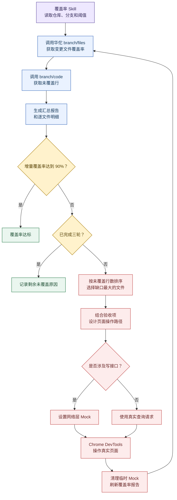

#### 3.1.4 项目总结

##### 项目成果

1. **交付结果**：一期、二期均完成上线，运行期间无明显问题。
2. **覆盖结果**：根据 PRD 信息分级表的风控安全评级统计，共包含 58 个 L3、51 个 L4 和 13 个 L4+ 数据项；本项目覆盖其中 64 个 L4/L4+ 敏感数据项，涉及 16 个接口和 12 个页面/模块，敏感数据项覆盖率为 100%。
3. **使用结果**：小眼睛查看链路上线后累计生成 **4,486 条访问记录**；数据权限申请链路能够拦截无权限访问并引导用户发起审批，线上已产生实际审批记录。
4. **技术成果**：沉淀权限 Mock Skill 和前端增量覆盖率 Skill，分别用于批量切换四种权限状态，以及自动获取覆盖率、定位未覆盖代码并刷新结果；

##### 个人成果

###### 做得好（收获经验）

1. **复杂需求需要先读完整调用链**：先确认现有组件、接口调用、状态来源和页面刷新方式，再决定复用或新增，避免重复实现已有能力。
2. **学会沉淀可复用的技术**：将多页面共用的权限判断和展示逻辑整理为公共组件，将反复执行的 Mock 和覆盖率检查整理为 Skill，不只解决当前页面的问题。

###### 做得不足（待改进）

1. **代码审查不够仔细**：部分问题在测试阶段才暴露，导致返工。后续在提测前集中核对需求、接口和主要页面链路。
2. **扩展设计过多**：部分参数和判断没有实际使用。后续以当前需求和实际调用方为边界，不提前实现没有明确场景的逻辑。

### 3.2 AI Coding 工作流搭建与业务实践

#### 3.2.1 产品介绍与建设目标

前端交付 Agent 工作流是一套面向电商前端业务需求的端到端 AI Coding 流程。工作流以 Meego 需求链接为入口，读取关联的需求文档、Figma 设计和代码仓库信息，依次完成需求分析、任务规划、代码实现、浏览器验收和任务交付。


团队在学习和使用 AI Coding 的过程中，调研并实践了 [Spec Kit](https://github.com/github/spec-kit)、[OpenSpec](https://github.com/Fission-AI/OpenSpec) 和 [Superpowers](https://github.com/obra/superpowers)等通用方案。这些公开通用方案采用规范驱动和分阶段执行的思路，为工作流设计提供了参考。但在具体的电商前端需求交付中效果不佳，存在以下不足：

1. **无法直接接入内部工具**

   现有公开通用方案没有提供 Meego、Lark CLI、Figma MCP / F2C、vmok 等内部工具的现成接入能力。需求资料、设计数据和页面运行环境需要另外配置，无法直接串入开发流程。

2. **缺少前后端并行开发所需的数据 Mock**

   后端接口尚未完成，或者测试环境暂时没有满足需求的数据时，现有方案缺少根据接口定义和测试项构造响应数据的固定流程，前端开发和初步验证仍会受到后端进度与环境数据限制。

3. **缺少浏览器主动验收环节**

   现有方案主要通过代码检查和自动化测试判断任务是否完成，缺少由浏览器主动打开业务页面，执行点击、输入、切换和提交等操作，检查页面展示与接口请求的前端验收过程。

4. **需求与设计分析不够深入**

   现有公开通用方案主要基于已经整理的需求描述开展规划，缺少对原始需求文档和 Figma 的完整读取与分析，难以在开发前明确页面范围、交互状态和设计要求，容易造成 Agent 对需求和设计的理解偏差。

基于上述问题，团队保留规范驱动和分阶段执行的思路，结合电商前端需求交付过程中沉淀的实践经验，并接入内部工具、MCP 和 CLI，形成能够适配业务需求的端到端 AI Coding 工作流。工作流的建设效果最终从三个方面衡量：

- **交付时间**：缩短整体交付周期。
- **交付质量**：提高交付结果的完整性和稳定性。
- **人工参与**：减少开发过程中的人工参与。

#### 3.2.2 整体设计与工作重点

##### 整体设计

| 建设目标 | 考虑方向 |
| --- | --- |
| 缩短交付时间 | 可自动化处理和重复执行的工作原则上由 AI 完成。<br>Mock 减少等待接口和目标数据的时间；BITS 减少交付前的重复操作 |
| 提高交付质量 | Task 记录需求来源和修改范围；Test Case 明确验收断言；Verify 为每条断言记录结果和证据；Repair 修改 Verify、测试或联调发现的问题，并重新验证相关 Case |
| 减少人工参与 | 人工主要审查 Test Case、Verify 结果和测试联调结果，并确认提交和发布；需求分析、任务规划、代码实现、页面操作和问题修复由 AI 执行 |

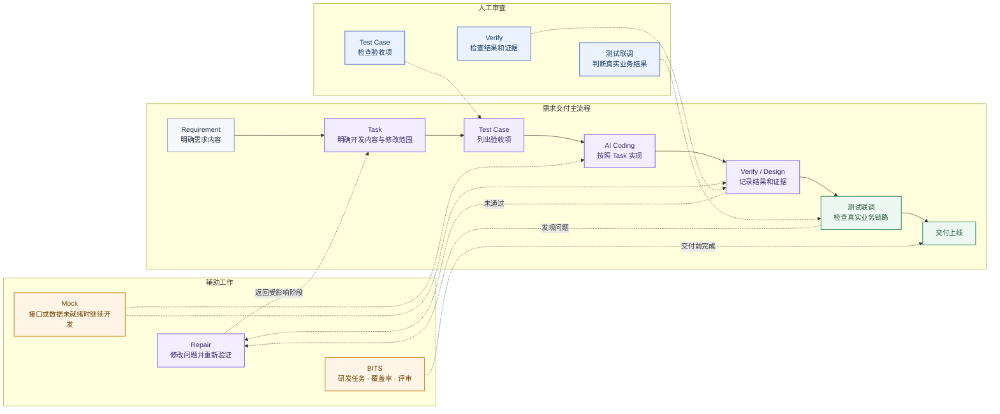

| 工作重点 | 核心目标 | 解决问题 | 解决方法 |
| --- | --- | --- | --- |
| 按 Test Case 规划并构建 Mock 规则 | 缩短交付时间 / 减少人工参与 | 缺少稳定依据来确定需要准备哪些响应规则，规则也难以与后续自动化验收准确匹配 | 在测试矩阵中声明 Case 与规则的对应关系，由 Verify / Design 按当前 Case 构建和使用规则 |
| 将 Verify 证据与 Test Case 对齐 | 提高交付质量 | Verify 结果没有逐条对应 Test Case 断言，无法确认是否完整验收 | 为每条断言记录实际结果和证据，存在缺项时不能通过 |
| 根据验收问题执行 Repair 并复验 | 提高交付质量 | 测试和联调发现问题后，只修改代码但没有重新验证 | 返回受影响环节完成修改，并重新执行相关 Case |
| 通过 BITS 完成交付前检查 | 缩短交付时间 / 减少人工参与 | 研发任务、覆盖率和评审处理需要人工反复操作 | AI 执行重复步骤，人工审查处理结果并确认提交和发布 |

##### 工作重点一：按 Test Case 规划 Mock 规则

**核心目标**

前后端并行开发时，接口或目标数据可能尚未就绪。此时需要准备可被页面请求命中的 Mock 响应，使前端开发和自动化验收能够继续进行。

**关键问题**

同一个接口可能服务多个测试场景，所需 Mock 规则的数量并不等于接口数量。如果只根据接口定义批量构建规则，无法判断哪些响应会被后续自动化验收使用，也无法保证页面请求能够准确命中。

以作品列表接口为例，同一个接口需要支持两种测试场景：

```text
作品列表接口
├─ Case A：验证列表正常展示 → R-LIST-NORMAL
└─ Case B：验证列表空态展示 → R-LIST-EMPTY
```

两个 Case 使用同一个接口，但需要不同的返回数据。只按接口准备一条规则，后续验收无法确定应该返回列表数据还是空数据。**<u>因此，需要建立 Mock 规则与 Test Case 的对应关系，让每条规则都有明确的测试来源和使用场景</u>**。

**规范设计**

1. **建立规则映射。** 构建 Test Case Matrix 时，为每个依赖响应数据的 Case 填写 `apiName` 和 `ruleId`。`apiName` 标识目标接口，`ruleId` 标识当前场景需要的响应规则；不依赖响应数据的 Case 将 `ruleId` 标记为 `N/A`。

2. **约束映射关系。** 同一接口需要不同响应时，分别配置不同的 `ruleId`。一个验收目标需要多种响应时，拆分成多个 Test Case；多个 Case 使用相同的请求条件和响应内容时，可以复用同一条规则。

3. **按 Case 补齐规则。** Verify / Design 执行当前 Case 时读取映射。规则可用时直接加载；规则缺失或与接口响应不一致时，暂停当前 Case，完成规则的新增、修复和校验，再返回同一个 Case 继续验收并保存证据。

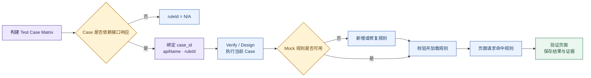

**结果沉淀**

```text
commands/
├── delivery:task.md                 # 生成 Task 和 Test Case Matrix，建立 Case 与 Mock 规则的映射
└── delivery:mock.md                 # 按当前 Case 构建或修复 Mock，完成后返回原验证流程

skills/
├── 10-test-case-planning/
│   ├── SKILL.md                     # 定义 Test Case、接口和 ruleId 的映射规范
│   └── test-case-matrix-template.md # 固定测试矩阵和 Mock 规则映射字段
└── bam-mock-runtime-generator/
    ├── SKILL.md                     # 定义 Mock 规则生成、命中、校验和清理流程
    ├── references/
    │   ├── mock-rule-design.md      # Mock 规则的拆分与复用方式
    │   ├── matching-algorithm.md    # 请求条件与 ruleId 的匹配规则
    │   ├── manifest-schema.md       # Mock Manifest 的字段约束
    │   └── gate-closure.md          # Mock 规则完成条件和失败处理
    └── scripts/
        ├── init-bam-mock.mjs        # 初始化 Mock 目录和基础结构
        ├── manifest-gates.mjs       # 检查规则、字段和状态是否完整
        ├── reapply-bam-mocks.mjs    # 重新应用已有 Mock 规则
        └── verify-bam-mock.mjs      # 校验规则能否被页面请求正确命中
```


##### 工作重点二：将 Verify 证据与 Test Case 对齐

**核心目标**

这项工作的目标是让 Verify 的验证结果可信。一个 Test Case 通常包含多条功能或视觉断言，每条断言都要有实际结果和对应证据，只要存在断言未执行、结果未记录或证据缺失，当前 Case 就不能通过 Gate。Verify 的结论必须能够回到具体断言和证据文件，不能只保留一条总体的 `PASS`。

**关键问题**

Skill 中的流程和规范大多以自然语言描述，本质上仍是软约束。即使文件已经明确要求逐条验收和保存证据，Agent 在长任务中仍可能遗漏某项要求、用其他动作替代规定步骤，或者在记录不完整时直接判断任务完成。**<u>因此，设计重点是如何让 Agent 稳定执行 Skill</u>**。

**调研结论**

1. **Gate 是任务型 Skill 的关键环节**

Gate 负责控制任务是否完成。检查不通过时，需要拒绝放行，并返回失败规则、失败原因、补充位置和重新检查的位置。

**理由。** Agent 即使在执行中遗漏了某条规范，只要 Gate 没有被绕过，缺失的状态或证据仍会使检查失败。具体的失败信息可以把 Agent 拉回对应规则，减少重新查找问题的范围。

**调研依据。** [Claude Code Hooks 官方文档](https://code.claude.com/docs/en/hooks)给出了 `TaskCompleted` 的阻断示例：固定事件触发测试，退出码为 `2` 时任务不能完成。[Formal Skill](https://arxiv.org/abs/2605.19604) 在运行状态中保存验证结果、必需产物和失败原因，检查失败后返回修复阶段。[ACL 2024 的错误定位研究](https://aclanthology.org/2024.findings-acl.826/)还发现，直接提供正确的错误位置后，模型在五类推理任务中的修正结果均有提升。

```yaml
Gate状态:
  PASS:
    条件: 所有检查项和证据完整
    动作: 允许完成
  FAILED:
    rule_id: ASSERTION-02
    failure_reason: 缺少截图证据
    repair_from: 当前断言
    recheck_from: 当前 Case
```

2. **按可检查程度拆分 Skill 规范**

固定字段和状态放入模板、JSON 或 XML；重复且结果确定的检查交给脚本；需要理解上下文和判断业务语义的内容保留在自然语言中。

**理由。** 长篇自然语言需要 Agent 在每次执行时重新解释，字段、状态和完成条件容易被遗漏。模板和结构化字段可以固定产物形态，脚本可以检查字段和文件是否齐全。证据能否支持业务断言仍需要结合上下文判断，保留自然语言更合适。

**调研依据。** [OpenAI Skill Creator](https://github.com/openai/skills/blob/main/skills/.system/skill-creator/SKILL.md) 按任务自由度选择自然语言、参数化脚本或固定脚本，并用模板生成固定产物。[From Skill Text to Skill Structure](https://arxiv.org/abs/2604.24026) 将 Skill 的调用条件、执行阶段、工具动作和资源影响整理为结构化字段，便于检索和检查。[Let Me Speak Freely?](https://arxiv.org/abs/2408.02442) 则表明，严格格式可能影响复杂推理，因此判断过程和结构化记录需要分开。

```yaml
Verify证据验收Skill:
  结构化字段:
    - Test Case编号
    - 验收断言
    - 实际结果
    - 证据路径
    - 验收状态
  脚本检查:
    - 必填字段是否完整
    - 证据文件是否存在
    - 是否仍有未完成状态
  自然语言判断:
    - 证据是否支持断言
    - 未关闭问题是否影响结论
```

3. **执行产物随任务进度更新**

任务开始时先初始化全部检查项。每完成一个任务单元，立即写入当前结果、证据和状态，不能等到最后统一补写。

**理由。** 长任务结束后再补产物，需要依赖上下文回忆，容易漏掉中间步骤，也容易把尚未完成的内容写成已完成。增量记录保留了当前进度；任务中断后，可以从第一个未完成项继续。

**调研依据。** [Anthropic 长任务 Agent Harness](https://www.anthropic.com/engineering/effective-harnesses-for-long-running-agents) 会先把功能清单初始化为未通过，每次只处理一个功能，测试完成后立即更新功能状态和进度文件。新的执行轮次直接读取已有记录，不需要在任务末尾回忆前面的过程。

```yaml
验证任务: 敏感字段权限展示
初始状态:
  待执行: [TC-01, TC-02, TC-03]
第一次更新:
  已完成: [TC-01_无权限时显示脱敏值]
  证据: [TC-01.png]
  待执行: [TC-02, TC-03]
第二次更新:
  已完成: [TC-01, TC-02_申请入口正常打开]
  待执行: [TC-03]
第三次更新:
  已完成: [TC-01, TC-02, TC-03_获得权限后刷新数据]
  待执行: []
```

**规范设计**

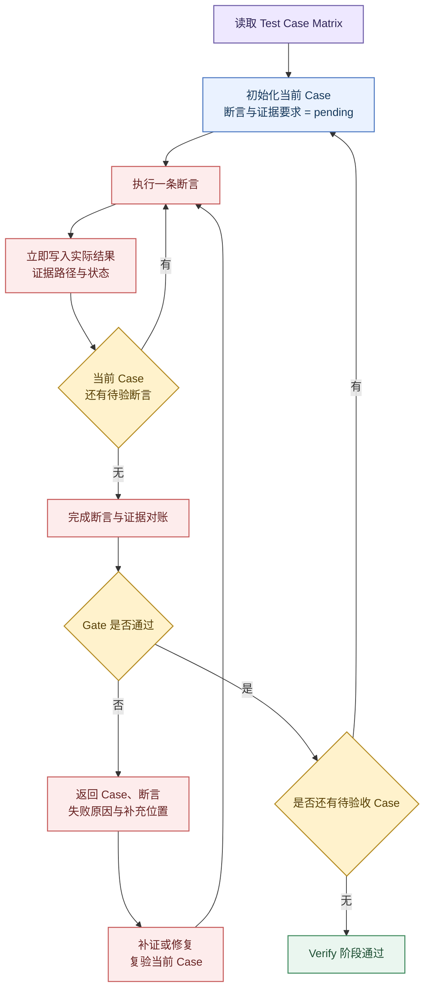

1. **初始化结构化验收记录**

Verify 根据 Test Case Matrix 建立执行队列。每个 Case 开始前生成独立验收记录，并写入正向功能断言、反向功能断言、正向视觉断言、反向视觉断言和证据要求，初始状态统一为待执行。一条断言包含多个判断条件时，需要拆成可以独立验证的验收项；模板仍有占位内容时不能开始验收。

2. **逐条验证并增量记录**

Agent 按验收记录逐条执行。每完成一条断言，立即写入实际观察结果、验证动作、证据类型、证据文件位置和当前状态。截图、DOM、Network 和日志需要保存到任务目录；聊天图片、浏览器临时记录和“符合预期”等文字不能单独作为验收证据。

3. **完成断言与证据对账**

每条断言通过稳定标识关联实际结果和证据：

> **Test Case → Assertion → Observed Result → Evidence → Conclusion**

当前 Case 的每条断言都要有执行状态、实际结果和证据路径。记录没有闭合前，Agent 不能进入下一个 Case；执行中断后，从第一个未完成项继续。

4. **执行 Gate 并回收缺项**

- 断言未执行时，返回对应验收点补做验证。
- 已执行但没有记录时，补充记录或重新取证。
- 证据文件缺失或类型不匹配时，重新保存符合要求的证据。
- 实际结果不符合断言时，修复问题并复验当前 Case。
- 单 Case 记录与全局审计不一致时，重新完成证据对账。

Gate 未通过时，需要返回 `case_id`、`assertion_ref`、失败原因、补充位置和重新检查点。全部验收项完成、证据文件存在且记录一致后，当前 Case 才能通过；所有 Case 闭合后，Verify 阶段才能进入下一阶段。

**结果沉淀**

```text
commands/
└── delivery:verify.md                              # 组织 Case 队列、页面验证、证据对账和阶段 Gate

skills/
└── 06-debug-verification/
    ├── SKILL.md                                    # 定义 Verify 的逐 Case 执行和证据闭合规范
    ├── debug-verification-case-result.template.md  # 固定单 Case 的断言、结果和证据记录
    ├── debug-verification-report.template.md       # 固定 Verify 汇总、索引和全局审计结构
    └── browser-verify-runbook.template.json        # 保存可复跑的浏览器操作和证据目标
```

##### 工作重点三：根据验收问题执行 Repair 并复验

**核心目标**

不能期望 Agent 通过一轮执行完成全部交付。测试、联调或验收发现问题后，需要支持二次修正，并重新执行受影响的开发和验证环节，直到验收通过。

**核心问题**

返修不能只修改代码，相关的工作区产物也需要同步更新。否则需求、任务、Test Case 和验证记录仍停留在旧状态，无法代表当前代码的实际情况。

**规范设计**


1. **接收问题并保存快照**

读取验收问题，并在修改前保存当前工作区产物、代码和执行状态。后续修正、恢复和结果对比都以这份快照为基准。

2. **定位受影响阶段与产物**

逐项分析问题，确定最早受到影响的阶段，并列出需要更新的需求、方案、Task、Test Case、代码或验证记录。问题不能直接默认归入代码阶段。

3. **原位更新相关产物**

在现有工作区中更新受影响的阶段产物和代码，保留原有 Requirement、Task 和 Test Case 的对应关系，不另建一套平行记录。

4. **重新执行并验收**

从定位出的阶段开始重新执行后续流程，重跑受影响的 Test Case，并更新实际结果和验证证据。相关阶段 Gate 和 Repair 检查全部通过后，本轮修正才算完成。

5. **验收通过后写回结果**

整理问题、调整内容、解决结果和验收步骤，写回原验收问题。接收人可以按照写回的步骤直接完成复验。

**结果沉淀**

```text
commands/
└── delivery:repair.md                    # 编排快照、阶段回放、恢复和结果写回

skills/
└── delivery-acceptance-repair/
    ├── SKILL.md                          # 定义问题归因、原位更新、重新执行和闭环规则
    ├── repair-plan-template.md           # 固定影响分析、更新位置和阶段重跑计划
    └── scripts/
        ├── create-repair-snapshot.sh     # 修改前保存工作区和代码快照
        ├── resolve-repair-run.mjs        # 识别并复用同一问题的 Repair 记录
        ├── validate-repair-artifacts.mjs # 检查相关产物、阶段状态和验收结果
        └── rollback-repair-snapshot.sh   # 需要时恢复到 Repair 前状态
```

##### 工作重点四：通过 BITS 完成交付前检查

**核心目标**

在建立覆盖率自动化能力的基础上，继续把自动化范围扩展到评审评论的分析和处理，减少交付周期和人工参与成本。

**核心问题**

自动处理评审评论可以节省时间，但评审建议和 AI 的处理结果都可能存在偏差。为保证交付质量，人工审查需要保留为最后的 Review 节点；原评论、处理结果和回复内容确认后，才允许提交代码并关闭评论。

**规范设计**

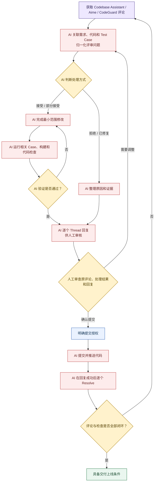

1. **分析并判断评论**

AI 拉取 Codebase Assistant、Aime 和 CodeGuard 评论，对照需求、代码和 Test Case 判断问题属于接受、部分接受、拒绝或已修复，并保存每条判断的依据。

2. **完成修改和验证**

需要处理的问题由 AI 完成最小范围修改，并运行相关 Case、构建和代码检查。验证未通过时继续修正，不进入回复和提交阶段。

3. **逐条回复评审意见**

AI 针对每个 Thread 分别回复处理方式、原因和验证结果。拒绝或已修复的问题同样需要说明依据，不能使用一条汇总回复替代全部评论。

4. **人工审查并完成关闭**

人工统一审查原评论、AI 的处理判断、代码修改、验证结果和回复内容。需要调整时返回评论分析环节；确认后再由 AI 提交和推送代码，并逐个 Resolve 已成功回复的 Thread。

**结果沉淀**

```text
commands/
└── delivery:bits.md                            # 编排覆盖率优化、评审评论处理和授权边界

skills/
└── bits-dev-flow/
    ├── SKILL.md                                # 定义覆盖率和评审评论的自动处理流程
    ├── cr-modification-closure.template.json   # 记录评论判断、代码修改、验证和关闭状态
    ├── coverage-optimization-state.template.json      # 记录覆盖率优化轮次和当前状态
    ├── coverage-optimization-plan-round.template.md   # 固定每轮未覆盖代码分析和处理计划
    ├── coverage-exclusion-log.template.json    # 记录已处理文件及对应代码版本
    └── scripts/
        └── collect-huatuo-branch-coverage.js   # 获取华佗覆盖率和未覆盖代码明细
```

#### 3.2.3 已有成果与后续规划

##### 1. 已有成果

内容激励需求首次使用完整工作流进行交付，覆盖需求理解、任务规划、代码实现、验收、测试联调和发布。整个需求经过一轮完整工作流和两轮 Repair 完成上线，验证了当前方案能够支撑一个中小型前端需求的端到端交付。

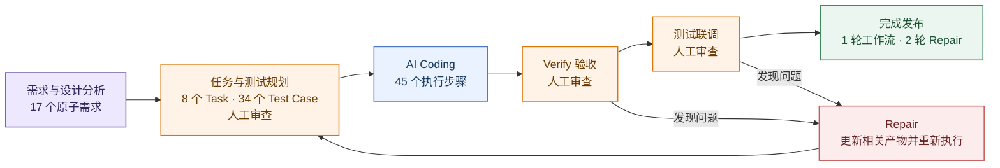

建设结果按实际交付环节对比：

| 提效环节 | 提效目标 | 原处理方式 | 工作流处理方式 | 提效结果 |
| --- | --- | --- | --- | --- |
| 需求分析和任务拆分 | 缩短交付时间 / 减少人工参与 | 研发人员阅读需求文档、设计稿和代码，逐项整理功能、页面状态、开发任务和验收条件 | 工作流读取需求文档、设计稿和代码，生成功能拆分、开发任务和验收项；人工检查是否遗漏、任务边界是否合理 | 减少需求分析和任务规划阶段的人工操作及处理时间，人工由逐项整理改为集中审查 |
| 代码实现 | 缩短交付时间 / 减少人工参与 | 研发人员按照任务逐项编写代码、检查构建结果并记录进度；测试发现问题后继续人工修改 | 人工确认开发任务和验收条件后，工作流按照任务修改代码、执行代码检查并更新完成状态；人工保留代码审查和最终验收 | 减少代码实现阶段的人工投入 |
| 功能验收 | 缩短交付时间 / 减少人工参与 / 提高交付质量 | 研发人员手动操作页面并阅读代码，判断各项功能是否完成；发现问题后修改代码，再重新复现整个操作过程 | 工作流按照验收条件操作页面，记录实际结果和截图；结果不符合要求时保存失败位置，修改后重新执行相同场景，人工检查证据和验收结论 | 人工由逐项操作和阅读代码改为审查证据及结论，减少验收时间并降低功能遗漏风险 |
| 页面验收 | 缩短交付时间 / 减少人工参与 / 提高交付质量 | 页面开发完成后，研发人员逐项对照设计稿和实际页面；发现差异后，再检查组件和样式代码，修改并重新打开页面确认 | 工作流自动打开页面，把实际截图与设计稿对应区域进行核对；发现问题后修改代码并重新验收，人工检查修改前后的证据和最终结论 | 减少人工对照设计、检查代码和重复验收的时间； |
| Mock 与页面验收 | 缩短交付时间 / 减少人工参与 | 接口或目标数据未就绪时，研发人员手动构造返回数据，或者等待后端提供可用接口和测试数据；切换场景时需要再次修改 | 工作流根据测试场景生成并加载对应的 Mock 数据，再操作页面完成验收；真实接口留到联调阶段确认 | 缩短数据准备和页面调试时间，减少逐接口修改 Mock 数据的人工操作； |
| 测试问题定位和修复 | 缩短交付时间 / 减少人工参与 / 提高交付质量 | 测试发现问题后，研发人员重新复现，再从需求、接口请求和代码中逐步查找原因；代码修改完成后，相关任务和验收记录需要人工同步 | 工作流根据失败的验收项、请求记录和已有证据缩小问题范围，修改受影响的需求说明、任务、代码和验收项，再重新执行对应场景 | 缩短接口问题的定位和返修时间，减少人工逐层排查；接口约束、代码和验收项同步修正，问题通过复验并在上线前关闭 |
| 覆盖率与评审评论 | 缩短交付时间 / 减少人工参与 / 提高交付质量 | 研发人员手动查看覆盖率报告、定位未覆盖代码并操作页面；随后逐条分析评审评论，修改代码、验证并回复 | 工作流自动获取覆盖率和未覆盖代码，通过浏览器操作补齐覆盖；同时逐条判断评审评论，完成必要修改、验证和回复，人工最后统一审查 | 头达需求的覆盖率补齐和评审评论均由人工处理，共使用约 3 PD；内容激励使用工作流完成相同的交付前检查，使用约 4 小时，处理时间缩短约 83%； |
| 整体交付周期 | 缩短交付时间 / 减少人工参与 / 提高交付质量 | 需求分析、任务拆分、编码、验收、问题修复和交付前检查主要由研发人员逐项完成 | 工作流执行需求分析、任务拆分、代码实现、页面验收、问题修复以及交付前检查；人工负责审查关键结果、真实接口联调和发布确认 | 内容激励需求原人工开发方式预计需要 4 PD，实际使用工作流完成交付使用 2 PD，交付时间缩短 50% |

##### 2. 后续规划

当前工作流还存在以下不足：

1. **目前只覆盖前端开发。** 服务端的代码实现、接口验证和数据处理还没有接入工作流。
2. **验收场景覆盖不充足。** 当前工作流只在少量前端需求中完成了验证，还需要在不同类型、不同复杂度的需求中继续测试，确认各阶段在更多场景下都能稳定执行。
3. **前后端之间仍依靠人工衔接。** 接口调整、任务依赖和联调中发现的问题，需要人工分别通知前后端处理。
4. **还没有经过全栈需求验证。** 当前成果证明了工作流可以完成前端交付，但还不能证明它能够支撑前后端一体化开发。

根据团队当前规划，下一阶段将把已经验证的前端交付能力扩展到前后端协同开发，使需求分析、方案设计、前后端实现、联调、测试和发布能够在同一套 AI Coding 工作流中衔接。

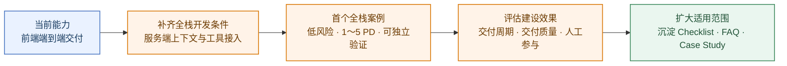

下一阶段按照图中的四个步骤推进：

1. **补齐全栈开发条件。** 整理服务端项目的开发方式、接口和数据限制、测试要求、发布及回滚流程，让工作流能够理解并执行服务端任务。
2. **完成首个全栈需求。** 选择一个低风险、1～5 PD、能够独立验证的需求，完整执行需求分析、前后端开发、联调、测试和发布。
3. **检查实际效果。** 对比交付时间、问题数量和人工投入，确认哪些工作能够由 AI 执行，哪些环节仍需人工审查。
4. **继续完善和扩展。** 修正首个案例中发现的问题，整理 Checklist、FAQ 和 Case Study，再逐步用于更多业务需求。

---

## 四、团队贡献与影响力

实习期间，我将需求交付和技术调研中的经验整理为工作流和分享材料。

1. **参与 AI Coding 工作流建设，并用真实需求完成验证**

   | 工作内容 | 产出结果 | 团队影响 |
   | --- | --- | --- |
   | 参与前端交付 AI Coding 工作流建设，并在内容激励需求中完成实际验证。 | 验证了当前工作流能够支持一个中小型需求的完整交付；完成内部分享材料[《代码写完，为什么需求还不能交付？》](https://bytedance.larkoffice.com/wiki/ONDCwBB3QirVThkuXTyccMhKnxb)。 | 当前工作流已经为团队使用 AI Coding 交付中小型需求提供了一套经过业务验证的参考流程；团队可以在此基础上继续完善前端交付能力，并逐步扩展为全栈端到端工作流。 |

2. **发布《企业 Agent 任务评分思路》，整理团队可直接阅读的评测方法**

   | 工作内容 | 产出结果 | 团队影响 |
   | --- | --- | --- |
   | 调研企业 Agent 的任务评分问题，并将调研结论整理为分享文章。 | 完成[《企业 Agent 任务评分思路》](https://bytetech.info/articles/7668640230937837578#SgSjdPZGpoXhnCxRDahcvb0znNI)，并发布到 ByteTech。 | 团队在讨论自建 Agent 的评测方案时，可以参考报告中的思路，设计适合自身任务的评测计分器和逻辑框架。 |

3. **完成 Benchmark 评测降本调研，补充评测实施阶段的参考**

   | 工作内容 | 产出结果 | 团队影响 |
   | --- | --- | --- |
   | 调研 Agent Benchmark 的成本来源和可行的降本方向。 | 总结了控制评测成本的思路，并完成调研报告[《Agent 评测如何降低 Benchmark 运行成本》](https://bytedance.larkoffice.com/wiki/ZqUVwC1iTiY5cekY81cc1Rtynsf)。 | 团队规划 Agent 评测时，可以参考报告中的降本思路，根据实际评测目标控制运行范围和评分投入，避免不必要的评测消耗。 |

4. **发布可靠 Skill 设计方法，补充团队 Skill 编写参考**

   | 工作内容 | 产出结果 | 团队影响 |
   | --- | --- | --- |
   | 针对 Agent 执行 Skill 时可能遗漏规定步骤、绕过检查或提前判断完成的问题，调研规范拆分、规则落地、Gate 和失败回溯的设计方法。 | 完成[《如何编写让 Agent 可靠执行的 Skill》](../如何让Agent可靠执行Skill-汇报分享.md)，并发表到 ByteTech。 | 团队编写任务型 Skill 时，可以据此区分哪些规则保留为自然语言，哪些要求需要落到模板、结构化合同和校验脚本中；通过 Gate 检查完成条件，并在失败时返回具体的修复位置。 |


---

## 五、自我复盘

我从业务需求交付、技术沉淀与研发提效、团队知识交流三个方面回看自己的能力。前两项说明目前已经具备的能力，第三项关注个人积累是否真正进入团队。

### 5.1 业务需求交付能力

完整的需求交付不只是完成代码，还包括需求评审、方案选择、开发验证、发布以及上线后的问题处理。

| 阶段 | 需要具备的能力 | 当前情况 |
| --- | --- | --- |
| 需求评审 | 讨论需求为什么做、解决什么问题，并确认范围和预期结果 | 能够完成范围澄清，但对业务价值的讨论还不够深入 |
| 技术评审 | 从改造成本、兼容性、风险和协作成本等方面比较方案，说明最终选择 | 已在实际需求中完成方案对比和协议确认 |
| 开发实现 | 使用 AI Coding 完成编码、验证和修复，人工负责审查需求理解、改动范围、代码和验收证据 | 已在敏感权限和内容激励需求中按这一方式完成开发 |
| 发布与冲突处理 | 完成发布检查，并处理研发分支与发布分支、发布分支与主分支之间的冲突 | 能够完成常规发布，复杂冲突的处理经验仍需积累 |
| 线上问题处理 | 定位问题，并根据影响决定修复、重新发布或回滚 | 已具备基本判断思路，实际处理经验较少 |

目前最需要补足的，一是需求评审中对业务价值的判断，二是复杂代码问题、分支冲突和线上故障的处理经验。

### 5.2 技术沉淀与研发提效

这部分不以文档或工具数量衡量，重点是能否把调研结论和个人经验转化为可复用的方法。

| 能力 | 具体表现 | 实践 |
| --- | --- | --- |
| 技术调研与学习 | 明确调研问题，核对资料，比较不同方案并形成结论 | 调研 Agent 评测趋势、计分方式和 Benchmark，按评测对象、任务数据、运行环境、评分方式和维护现状进行比较 |
| AI 研发提效 | 识别重复工作，设计适合研发流程的工作流和 Skill | 整理 AI Coding 交付流程，并为 Mock、验证和修复等环节建设配套工具 |

当前已经形成调研方法和 AI 工作流实践，但技术结论仍以文档调研和少量需求验证为主，在更多项目和不同任务类型中的适用性还需要继续验证。

### 5.3 团队影响力与知识交流

| 能力 | 当前情况 |
| --- | --- |
| 资料整理 | 已整理 AI Coding 工作流和 Agent 调研材料 |
| 技术讨论 | 能够在需求和技术评审中表达判断，讨论方案取舍 |
| 知识分享 | 较多内容仍停留在个人资料中，正式的团队分享不足 |
| 反馈迭代 | 还没有形成“分享—试用—反馈—修订”的稳定循环 |

团队影响力是当前比较明显的不足。下一步需要把个人资料整理成团队成员看得懂、能讨论、能实际使用的内容，并通过反馈持续修订。

---

## 六、未来规划

### 6.1 团队业务规划

作者运营需要根据达人情况调整诊断策略，选择达人或人群，确认触达内容，并整理达人回复。目前这些操作分散在不同系统中，主要有三个问题：

1. 不同运营需要维护各自的账号诊断 Skill，不能共同修改同一个线上版本，否则容易互相覆盖。
2. Skill 修改后需要先经过小应仿真和人工确认，评测版本不能直接影响线上触达。
3. 触达消息、Skill 版本和达人回复需要建立关联，否则出现问题时无法确认当时使用的版本，也无法根据反馈继续调整 Skill。

团队计划先建设一条半自动的运营链路，让运营能够完成“修改 Skill—仿真—确认—发布—触达—回收”。运营负责选择目标、判断结果和确认发布，系统负责版本处理、仿真调用、批量执行和记录关联。首期目标是让这条链路能够被运营实际使用，不追求无人参与的自动运营。

### 6.2 运营 Agent 建设规划

运营 Agent 的初版方案由四条业务链路组成：


| 业务链路 | 运营操作 | 系统处理 | 结果 |
| --- | --- | --- | --- |
| 修改 Skill 与调试 | 用自然语言提出修改要求，选择 UID 或人群包进行测试，确认仿真结果 | `skillCreator` 处理修改意图，`legoOperationSkill` 管理运营专属版本，小应执行仿真 | 生成经过运营确认的 online 版本 |
| 触达与下发 | 单 UID 场景复制文案后自行发送；批量场景确认目标人群和下发内容 | AIME 返回单 UID 文案；小应拆分人群包或 UID 数组任务，并通过企微批量发送 | 留下实际使用的 Skill 版本和发送结果 |
| 定时反馈给达人 | 创建反馈任务，设置反馈对象和执行周期 | AIME 按小时触发 `replyRecycle`，通过数据获取 CLI 查询并聚合本周期数据 | 有数据时发送给达人；无数据时只记录本次执行 |
| 离线分析与 Skill 优化 | 查看达人回复和 badcase，决定下一轮调整内容 | 关联触达消息、Skill 版本、调试 Trace 和达人信息，并完成离线清洗 | 形成正负样本和典型 badcase，供下一版 Skill 使用 |

首期不做自动发布或无人确认的批量触达。Skill 发布和批量下发必须经过运营确认，单 UID 仍由运营复制文案后发送。复杂人群权限、企微端到端预览、基础评测集服务和知识库自动写入暂不纳入 MVP。

### 6.3 个人规划

**1. 参与内容**

参与 `skillCreator` 的设计与开发。`skillCreator` 是运营修改账号诊断 Skill 的入口，负责接收 AIME 转发的修改要求，准备当前运营的专属 Skill，维护多轮修改内容，并在运营提出测试要求时组织评测参数，将当前草稿交给 `skillEvaluator`。

**2. `skillCreator` 工作链路**

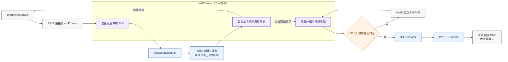

**3. 具体职责**

1. **设计对话流程和状态流转。** 明确 `skillCreator` 接收的运营身份、修改要求、Skill 内容和评测对象，定义 `not_created`、`loaded`、`editing`、`evaluating`、`approved`、`online` 等状态及各状态允许的操作。运营继续修改、发起测试或确认结果时，能够进入对应分支，不会把草稿修改和 online 发布混在一起。
2. **管理运营专属 Skill。** `skillCreator` 使用当前运营身份调用 `legoOperationSkill`，按照 `账号诊断_{运营uid}` 查询 Lego：已存在时拉取当前内容，不存在时先创建专属 Skill。返回的 Skill 名称、内容和版本写入当前 AIME 上下文，后续修改始终基于该运营自己的版本。
3. **维护多轮修改上下文。** 每轮对话都基于最新草稿继续修改，并保留 `operator_uid`、`skill_name`、当前版本和修改结果。这样可以避免下一轮重新读取旧版本，也能防止不同运营的修改进入同一个 Skill。草稿只在当前调试链路中更新，运营确认前不会作为 online 版本使用。
4. **组织仿真评测请求。** 识别“试一试”“测试一下”等意图，检查 UID、UID 列表或人群包 ID 是否齐全；缺少参数时通过 AIME 动态交互卡补齐。参数完整后，将 Skill 草稿、运营 UID 和评测对象交给 `skillEvaluator`，并接收评测版本、PPE、小应仿真结果、失败原因和输出文案，返回 AIME 供运营继续修改或确认。

**4. 参与目标**

完成 `skillCreator` 的核心链路，使运营能够在 AIME 中用自然语言修改自己的账号诊断 Skill，并将修改结果送入仿真评测。个人能力将从前端需求交付和面向研发提效的 AI Coding 工作流建设，扩展到面向真实业务的 Agent 应用开发，开始处理运营意图、多轮上下文、Skill 版本以及线上系统之间的调用关系。

---

## 七、致谢


