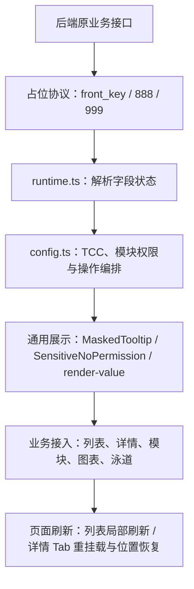
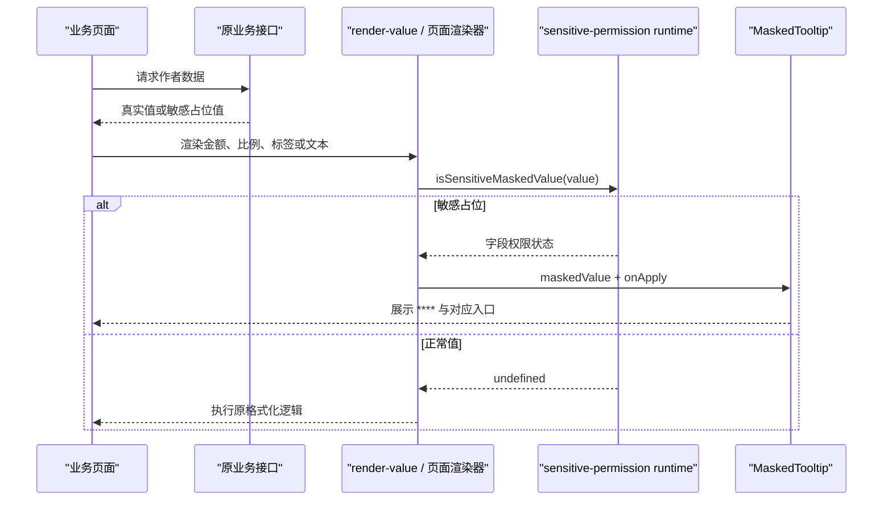
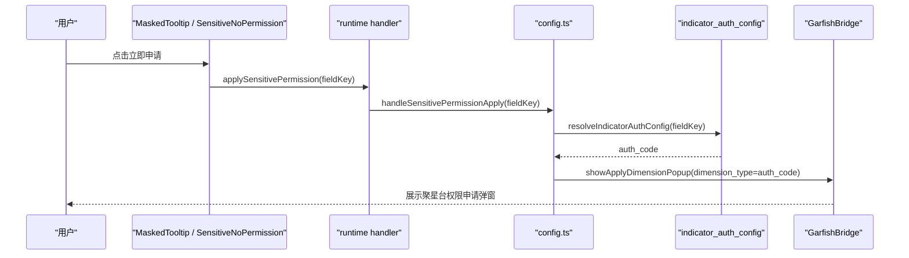
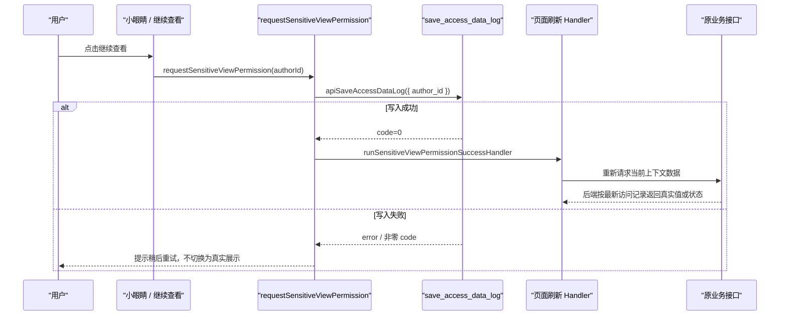

# 头达数据权限管控——前端核心技术实现详解

> 文档定位：用于完整说明我在“头达数据分级管控与监控预警”需求中的前端实现，不替代原 PRD、后端技术方案或转正答辩正文。  
> 代码仓库：`alliance-operation-mono`  
> 当前分析基线：`master@3bff60c27b116bfc11b6fd2750d765397443d192`  
> 一期提交：`d3ff1c5ccac000d9576cbe48d815aa2cdde21de8`，2026-05-07，陈相  
> 二期提交：`7664593dde57a609cd8497e29629bfd4e53e8e52`，2026-06-02，陈相  
> 主要应用：`apps/alliance-operation-daren`

## 1. 文档范围与代码依据

### 1.1 本文要回答的问题

这份文档不只说明“页面增加了权限遮罩”，而是回答以下实现问题：

1. 后端返回的敏感占位值如何在前端被识别为具体权限状态？
2. 字段权限、模块权限、协作人关系和小眼睛查看权限如何形成统一状态模型？
3. 点击“立即申请”“申请协作人”“继续查看”后，分别如何打通现有平台链路？
4. 小眼睛写入访问记录后，列表页和详情页如何刷新，同时避免用户丢失当前页签和滚动位置？
5. 金额、比例、标签、表格、趋势图、泳道等不同形态的数据如何复用公共能力？
6. 一期基础遮罩如何演进为二期包含 `888`、`999`、模块门禁和图表预览的完整方案？
7. 在大范围页面接入中，我如何把重复 Mock 和增量覆盖率工作沉淀为可复用 Skill？

### 1.2 事实来源

本文基于以下资料交叉核对：

- [PRD：运营平台_作者运营_头达数据分级管控与监控预警](./01-PRD-运营平台_作者运营_头达数据分级管控与监控预警.md)
- [技术文档：运营平台_作者运营_头达数据分级管控与监控预警](./02-技术文档-运营平台_作者运营_头达数据分级管控与监控预警.md)
- [信息分级表](03-信息分级表-LPCCoO.md)
- 一期、二期提交及当前 `master` 的实际前端代码
- 项目本地的 BAM Mock 与 BITS 增量覆盖率 Skill 说明

通过当前代码检索，至少有 40 个前端源文件直接使用敏感字段解析、模块权限查询、无权限组件或查看权限刷新能力。本文不把这些文件逐个描述成孤立改动，而是还原它们共享的设计和调用链。

### 1.3 前后端责任边界

我在前端承担的核心职责是：消费安全占位协议、管理权限交互状态、接入既有申请链路、控制业务模块的请求或挂载时机，以及保障各种展示形态不误处理敏感值。

前端不能替代后端数据安全。真实敏感值是否下发、七天查看期是否有效、导出字段是否裁剪、访问频率是否触发告警，最终由后端或数据平台负责。本文提到这些内容时，只把它们作为前端依赖的协议和业务上下文，不归入我的前端实现产出。

## 2. 需求背景与前端职责

### 2.1 业务问题

头部作者的 GMV、佣金、违规、风险等信息具有较高敏感等级。原页面中的这些信息分散在作者列表、作者详情、直播分析、作品分析、商品分析、违规处罚和趋势泳道等多个区域，展示形态包括普通文本、金额、比例、标签、表格单元格、折线图和模块级卡片。

需求要求的不只是“把数字显示成星号”，而是建立完整闭环：

- 未授权用户拿不到真实值；
- 协作人但没有数据权限时，可以申请对应数据权限；
- 非协作人必须先进入现有协作申请链路；
- 已有权限但七天内未确认查看时，需要点击小眼睛并留下访问记录；
- 权限状态变化后，页面应重新获取数据并保持当前操作上下文；
- 字段级、模块级和复杂图表都要保持一致的权限语义。

### 2.2 前端难点不是一个组件，而是多条链路的一致性

如果每个页面自行写 `value === '****'`、自行请求权限、再自行刷新，会出现四类问题：

1. 金额和比例会先执行 `Number()`、除以 100 或格式化，敏感占位可能被算成异常数值。
2. `888`、`999` 和普通 `front_key` 都显示为 `****`，但背后的动作完全不同。
3. 字段、模块和图表各自维护状态，容易出现文案、按钮和实际申请链路不一致。
4. 小眼睛成功后直接整页刷新，会丢失当前页签、筛选条件和滚动位置。

因此我的实现核心不是堆叠页面判断，而是先抽象协议、状态和动作，再让不同页面选择适合自己的接入方式。

## 3. 前后端权限协议

### 3.1 为什么使用原字段占位协议

安全方案要求后端在原业务响应中就裁掉真实值，而不是额外返回一个“需要遮罩的字段列表”。这样可以避免真实值已经到达浏览器、前端只用 CSS 或 DOM 将其隐藏的风险。

前端收到的是“正常业务值”或“带权限语义的占位值”。占位值同时携带两类信息：

- 这是敏感数据，不能继续走普通格式化和计算；
- 当前应该引导用户申请哪一种权限。

### 3.2 占位值编码

当前运行时代码位于：

`apps/alliance-operation-daren/src/components/sensitive-permission/runtime.ts`

| 原字段类型 | 协议前缀 | payload | 前端解释 |
| --- | --- | --- | --- |
| 字符串 | `****` | 普通 `front_key` | 协作人无对应数据权限 |
| 整数 | `-99999` | 普通 `front_key` | 协作人无对应数据权限 |
| 浮点数 | `-99999.` | 普通 `front_key` | 协作人无对应数据权限 |
| 字符串/数值占位 | 对应前缀 | `888` | 当前用户不是作者协作人 |
| 字符串/数值占位 | 对应前缀 | `999` | 已有数据权限，但本次需要确认查看 |
| 正常业务值 | 无敏感前缀 | 无 | 直接进入原渲染链路 |

例如：

```text
****live_pay_amt      -> 无直播数据权限，front_key=live_pay_amt
-999991234            -> 整数占位，front_key=1234
-99999.999            -> 浮点占位，需要点击小眼睛继续查看
****888               -> 先申请成为协作人
正常数值或文本          -> 继续按原业务逻辑展示
```

数值占位在 JavaScript 运行时必须仍是 `number`，因此普通 payload 只能编码为数字字符串；`888`、`999` 则是数值和字符串协议共同保留的状态码。页面最终统一显示 `****`，但代码会保留 payload 对应的内部状态，避免把三个操作入口混为一谈。

### 3.3 TCC 配置把页面字段与平台权限解耦

后端占位中的 payload 使用前端可识别的 `front_key`。前端再通过 TCC `indicator_auth_config` 将它映射到平台权限点：

```json
[
  {
    "indicator_key": "live_pay_amt",
    "front_key": "live_pay_amt",
    "auth_level": "L4",
    "auth_code": "Dm12604220000501",
    "permission_code": "author_live_data.view"
  }
]
```

| 配置字段 | 在前端实现中的作用 |
| --- | --- |
| `front_key` | 作为 Map key，与占位 payload、组件 `fieldKey` 对齐 |
| `auth_code` | 调起聚星台权限申请弹窗时作为 `dimension_type` |
| `permission_code` | 查询模块权限时传入 `employee_permission` |
| `indicator_key`、`auth_level` | 保留业务配置含义，当前前端不直接用其做状态判断 |

我在 `config.ts` 中把 TCC 读取封装为 `getIndicatorAuthConfigMap`：

1. 调用 `apiGetTccValue({ keys: ['indicator_auth_config'] })` 获取配置；
2. 兼容根数组以及 `{ configs }`、`{ data }`、`{ list }` 三种容器；
3. 解析为 `Map<front_key, IndicatorAuthConfigRecord>`；
4. 用 Promise 缓存避免多个页面同时重复请求；
5. 查询不到字段时强制刷新一次，兼容配置刚更新但本地仍持有旧缓存的情况；
6. 配置或权限接口异常时按无权限关闭，不让异常状态穿透到敏感模块。

这一层使业务页面只依赖稳定的 `front_key`，不需要在几十个页面中硬编码平台 `auth_code` 和系统 `permission_code`。

## 4. 前端整体架构

### 4.1 五层实现



这五层分别解决：

1. 协议层：把不同类型的占位值还原为统一状态。
2. 配置层：把 `front_key` 转成真正可申请、可查询的权限点。
3. 运行时层：把组件与页面级副作用解耦。
4. 组件层：统一字段和模块无权限样式及动作。
5. 页面层：决定业务数据是否请求、组件是否挂载、成功后刷新什么。

### 4.2 为什么使用运行时 Handler，而不是在每个组件中直接引用页面逻辑

`runtime.ts` 保存三个运行时处理器：

```ts
let permissionApplyHandler;
let viewPermissionHandler;
let viewPermissionSuccessHandler;
```

对应能力是：

- `permissionApplyHandler`：执行数据权限申请；
- `viewPermissionHandler`：写入小眼睛访问记录；
- `viewPermissionSuccessHandler`：由当前页面决定成功后如何刷新。

应用 `Layout` 挂载时统一注册前两个全局动作，卸载时重置。作者列表或作者详情再按页面上下文注册第三个刷新动作。

这样设计的原因是，`MaskedTooltip` 和 `SensitiveNoPermission` 可以出现在任何层级。如果它们直接依赖列表 Store、详情 Tab 或路由对象，就会变成无法复用的业务组件。Handler 把“点击发生在哪里”和“页面如何恢复”分开：组件只发出统一动作，页面负责执行与自己状态相关的副作用。

## 5. 权限状态模型实现

### 5.1 字段级状态

`parseSensitiveFieldState` 先判断值类型，再截取对应前缀，最后交给 `resolveMaskedPayload` 解析 payload：

```text
原始值
  -> string / number 类型判断
  -> 匹配 **** / -99999 / -99999.
  -> 截取 payload
  -> 888 / 999 / 普通 front_key
  -> SensitiveFieldState
```

核心状态是：

```ts
type SensitiveFieldState =
  | { type: 'unauthorized'; reason: 'no_cooperation' }
  | { type: 'unauthorized'; reason: 'no_data_permission'; fieldKey: SensitiveApplyKey }
  | { type: 'auth_hidden' }
  | { type: 'revealed' };
```

当前解析器对正常值返回 `undefined`，业务组件据此继续原渲染逻辑。`revealed` 保留在类型中，但不是普通值的实际返回结果。

### 5.2 模块级状态

模块权限不能只看某一个字段值，因此我将 `employee_permission` 的结果转换为独立状态机：

```ts
type SensitiveModulePermissionState =
  | 'loading'
  | 'viewable'
  | 'view_permission_required'
  | 'no_data_permission'
  | 'no_cooperation';
```

状态转移规则如下：

| `hasPermission` | `needEyes` | `isCoo` | 模块状态 | 动作 |
| --- | --- | --- | --- | --- |
| `undefined` | 任意 | 任意 | `loading` | 等待权限结果 |
| `true` | `false` | 任意 | `viewable` | 展示或请求真实模块 |
| `true` | `true` | 任意 | `view_permission_required` | 继续查看 |
| `false` | 任意 | `true` | `no_data_permission` | 申请数据权限 |
| `false` | 任意 | `false` | `no_cooperation` | 申请协作人 |

`buildSensitiveModuleNoPermissionViewModel` 会把模块状态合成为统一占位值：

- `view_permission_required` -> `****999`
- `no_cooperation` -> `****888`
- `no_data_permission` -> `****${fieldKey}`

这样字段组件和模块组件消费的是同一套协议解析结果，不需要分别维护两套文案与点击逻辑。

### 5.3 状态管理分层

实现中没有把所有权限状态塞入一个全局 Store，而是按生命周期分层：

| 状态 | 存放位置 | 原因 |
| --- | --- | --- |
| TCC 配置 Map | `config.ts` 模块级 Promise 缓存 | 跨页面复用、减少重复请求 |
| 申请/查看 Handler | `runtime.ts` 模块级注册器 | 让通用组件与页面解耦 |
| 单模块 `permissionMeta` | 业务组件本地 `useState` | 随作者、模块挂载周期变化 |
| 当前列表筛选和数据 | 原列表 Store/Hook | 复用原业务状态，不新建权限副本 |
| 当前详情 Tab 与刷新版本 | 详情页本地 state/ref | 精确重挂载当前 Tab 并恢复位置 |

这个分层避免了两个极端：每个叶子组件都发请求会重复且难以统一；所有状态都放入全局 Store又会把一次性页面状态长期化，增加清理和串作者风险。

## 6. 权限获取与数据访问链路

### 6.1 字段级链路：业务接口本身就是状态来源

字段级权限不再额外请求“字段权限列表”。业务接口返回真实值或占位值，公共渲染入口先识别占位，再决定是否格式化。



这里最重要的顺序是“先判断权限，再做业务格式化”。例如 `renderMoney`、`renderExtMoney` 和 `renderPercent` 都在 `Number()`、除以 100、拼接单位之前调用 `isSensitiveMaskedValue`。这避免 `-99999...` 被当成真实负数，也避免 `****key` 被格式化为 `NaN`。

### 6.2 模块级链路：先由 TCC 找权限点，再查询作者维度权限

`requestSensitiveModulePermission({ fieldKey, authorId })` 的实际调用链是：

```text
fieldKey
  -> normalizeSensitiveFieldKeys
  -> resolveIndicatorAuthConfig
  -> getIndicatorAuthConfigMap
  -> TCC 查到 permission_code
  -> apiEmployeePermission({
       permission_keys: [permissionCode],
       author_id,
       author_id_for_eye_check: authorId
     })
  -> { hasPermission, needEyes, isCoo, permissionCode }
  -> 模块状态机
```

同一个 `authorId` 同时传给普通权限判断和小眼睛检查，确保模块状态与当前作者绑定。异常时返回关闭状态而不是乐观放行，保证敏感模块不会因权限接口失败被渲染。

### 6.3 三种模块接入模式

不同业务接口的安全合同和页面结构不同，因此我没有强行用一种请求模式覆盖所有模块，而是实现了三种可解释的接入方式。

#### 模式一：权限先行，再请求业务数据

代表模块：`BusinessOverview`（体裁经营概览）。

实现流程：

1. 组件挂载后先查询 `genre_gmv_overview` 模块权限；
2. 业务请求 `apiGetGenreGmvOverview` 配置为 `auto: false`；
3. 只有 `hasPermission === true && !needEyes` 且日期参数完整时才执行 `runOverview`；
4. 无权限时展示保持结构的脱敏流程图，不请求真实概览数据；
5. 标题区域根据状态展示申请数据权限或小眼睛。

这种方式适用于整个接口都属于敏感模块、可以在前端安全地延迟请求的场景。

#### 模式二：业务响应控制展示，权限接口补充动作语义

代表模块：`UserInfoTable`（用户画像）。

实现流程：

1. `apiCustomerInfo` 与 `requestSensitiveModulePermission` 并行请求，降低等待时间；
2. 用户画像接口自己的 `authorized` 决定表格是否展示；
3. `employee_permission` 的 `hasPermission / needEyes / isCoo` 决定无权限时应该显示哪个动作；
4. `authorized === false` 时用 `buildSensitiveModuleNoPermissionViewModel` 生成占位状态；
5. 继续查看走小眼睛，非协作人走既有 `applyManage` 回调。

这里不能写成“权限接口先拦截用户画像请求”，因为真实代码是并行请求。业务接口自身的 `authorized` 是展示门禁，模块权限接口负责补全操作链路。

#### 模式三：权限结果控制敏感子树是否挂载

代表模块：`HasPermission`（违规处罚 Tab）。

实现流程：

1. 先请求 `new_violation_tab` 模块权限；
2. `hasPermission` 未返回前显示 Loading；
3. 只有 `hasPermission === true && !needEyes` 时才挂载 `currentTab.component`；
4. 其余状态挂载 `SensitiveNoPermission`，敏感处罚、舆情、人设和诉讼子组件都不会进入渲染树；
5. 非协作人点击后打开复用的 `ApplyManageModal`。

这种方式适合一个 Tab 下包含多接口、多子组件的场景。把门禁放在父级可以避免每个子组件重复判断，也避免无权限时子组件自然发起请求。

## 7. 三类权限操作链路

### 7.1 申请数据权限

触发条件：状态为 `no_data_permission`，即占位 payload 是普通 `front_key`。



组件也支持直接传入 `{ authCode }`。这用于泳道接口已经直接返回 `auth_code` 的情况，避免再查一次 TCC。

### 7.2 申请协作人

触发条件：字段占位为 `888`，或模块权限结果为 `hasPermission=false && isCoo=false`。

这条链路没有另造一个“敏感权限协作弹窗”，而是复用作者运营已有协作能力：

- 作者详情中复用 `ApplyManageModal`；
- 弹窗打开时通过 `AuthorOperateType.GetCooperationApproveInfo` 获取审批人、赛道和认领信息；
- 用户填写协作天数和原因后，通过 `AuthorOperateType.Cooperate` 提交申请；
- 作者列表中复用 `useOperations` 的 `triggerSingleCooperateApply`，最终仍进入 `handleOperate(AuthorOperateType.Cooperate, author)`。

公共敏感组件只暴露 `onApply`，不直接依赖作者运营弹窗。页面把已有协作回调传入，因此权限组件保持通用，业务审批规则也只有一套事实来源。

### 7.3 小眼睛继续查看

触发条件：占位 payload 为 `999`，或模块权限结果是 `hasPermission=true && needEyes=true`。



前端不会在点击后自行把 `****` 替换成旧缓存值。它只写访问记录并重新调用原接口，真实数据是否可以返回仍由后端重新判断。

## 8. 小眼睛确认后的刷新机制

### 8.1 为什么不能统一使用 `window.location.reload()`

整页刷新虽然简单，但会带来明显体验问题：

- 作者列表的当前筛选、排序、选中项可能丢失；
- 作者详情会回到默认 Tab；
- 长页面会回到顶部；
- 与当前权限无关的模块也被重复请求。

因此我把刷新设计为“页面注册局部恢复策略，运行时提供整页刷新兜底”。

### 8.2 作者列表：复用现有查询状态局部刷新

作者列表挂载时注册：

```ts
setSensitiveViewPermissionSuccessHandler(async () => {
  await getList(false);
  return true;
});
```

`getList(false)` 复用当前 Store 中的筛选和排序条件，只重新拉取列表数据。Handler 返回 `true`，表示页面已经处理刷新，运行时不再执行整页 reload。

### 8.3 作者详情：刷新当前 Tab，并恢复滚动上下文

详情页的处理更复杂，完整逻辑是：

1. 记录当前 `selectTab`；
2. 找到详情页滚动容器，保存当前 `scrollTop`；
3. 如果当前是作者主页，先并行刷新头部基础信息和成长信息；
4. 通过 `tabRefreshVersionMap[currentTab] + 1` 强制重挂载当前 Tab；
5. 子页面渲染完成后，由 `markTabRefreshRendered` 在两个 animation frame 后 resolve；
6. 重新计算内容高度和吸顶头部高度；
7. 最多尝试 24 帧，连续 3 帧高度稳定后停止恢复，避免异步模块加载导致位置再次跳动。

```text
点击小眼睛
  -> 保存当前 Tab + scrollTop
  -> 刷新头部公共数据（按需）
  -> currentTab 的 refreshVersion + 1
  -> 当前 Tab 重挂载并重新请求
  -> 等待内容高度稳定
  -> scrollTop - stickyHeaderOffset
```

这段实现解决的不是单纯“刷新接口”，而是权限状态变化后的页面状态恢复问题。

### 8.4 兜底策略

如果当前页面没有注册成功处理器，或处理器显式返回 `false`，`config.ts` 执行 `window.location.reload()`。这样新增页面即使尚未实现局部刷新，也不会出现访问记录已写入但页面一直停留在旧遮罩状态的问题。

## 9. 通用组件与公共能力实现

### 9.1 `MaskedTooltip`：字段级统一组件

`MaskedTooltip` 负责把字段状态转换为可交互的 `****`：

- 普通 `front_key`：展示申请数据权限提示；
- `888`：使用页面传入的 `onApply` 进入协作人申请；
- `999`：展示闭眼图标，点击后请求查看权限；
- 支持显式 `fieldKey`、显式 `authCode` 和从 `maskedValue` 自动提取三种定位方式；
- 点击时阻止事件冒泡，避免列表单元格同时触发行跳转；
- Tooltip 容器挂载到 `document.body`，避免表格和复杂容器裁剪浮层。

组件有无 children 两种形态：既可以直接渲染遮罩，也可以包裹图表或已有节点，把整个区域变成权限提示入口。

### 9.2 `SensitiveNoPermission`：模块级统一组件

模块无权限场景需要更完整的缺省态。该组件统一处理标题、插图、按钮和动作：

| 状态 | 标题语义 | 按钮 |
| --- | --- | --- |
| `no_data_permission` | 需申请相关数据权限 | 立即申请 |
| `no_cooperation` | 先申请为作者协作人 | 申请协作人 |
| `auth_hidden` | 敏感信息，请勿分享 | 继续查看 |

为了适配不同尺寸的卡片和图表遮罩，我加入 `ResizeObserver`：

- 高度小于 80px 时切换紧凑布局；
- 宽度至少 350px 且高度至少 200px 时展示插图；
- 同时监听窗口 resize 作为补充；
- 通过 `contentClassName` 支持趋势图等业务容器定制覆盖层样式。

这使同一个组件既能覆盖完整模块，也能放在较矮的卡片和图表覆盖层中，不需要各页面复制一套无权限布局。

### 9.3 `render-value`：把敏感判断前置到通用格式化入口

列表和详情中大量字段通过 `render-value/index.tsx` 格式化。我的处理是将权限判断接到这些高复用入口：

- 百分比 `renderPercent`；
- 大数 `renderBigNum`；
- 金额 `renderMoney`、`renderExtMoney`；
- 标签、布尔、时长、数组字符串和彩色标签；
- 日期时间、作者类型等常用格式。

核心原则是：

```ts
if (isSensitiveMaskedValue(value)) {
  return <MaskedTooltip maskedValue={value} />;
}

// 只有正常值才能继续 Number、除法、单位换算或趋势计算
```

通过公共入口接入，新增加的列表列和详情指标只要复用既有 renderer，就自然具备敏感占位识别能力，降低漏改概率。

### 9.4 复合指标的原始值保留

环比指标通常同时需要展示数值和计算箭头方向。`buildSensitiveCompareMetric` 除展示值外保留 `rawValue`，下游 `getTrendValuePresentation` 会再次判断原始值：

- 原始值是敏感占位时，只展示裸 `****`；
- 不渲染上涨/下降箭头；
- 不拼接百分号；
- 正常值才转换为 number 并展示趋势方向。

这样避免了“主值已遮罩，但旁边的箭头或百分比仍泄露相对变化”的问题。

## 10. 特殊页面与复杂图表适配

### 10.1 直播核心指标：卡片与趋势图使用同一个权限来源

直播数据页的当前指标既驱动顶部指标卡，也驱动下方趋势图：

1. 指标卡发现 `item.value` 是敏感占位时，使用 `MaskedTooltip`；
2. 同比、环比和同赛道比较值通过 `rawValue` 判断，敏感时移除箭头和数值格式；
3. `shouldBlockLiveTrendChart(currentIndicator.value)` 判断当前图表是否可见；
4. 不可见时不直接把占位值送入图表计算，而是渲染 `SensitiveNoPermission` 覆盖层。

关键是让“当前选中指标”成为卡片和图表共同的权限事实，避免卡片已遮罩而趋势图仍展示曲线。

### 10.2 商品列表趋势：对点级混合数据做净化

商品分析中的“订单数趋势”不是单值，而是一组 `trend_points`。实际响应可能出现部分点被遮罩、部分点正常的混合状态。

`renderOrderTrendChartCell` 的处理步骤是：

1. 扫描全部趋势点，找到第一个敏感占位作为权限动作来源；
2. 如果首点就是敏感占位，直接渲染 `MaskedTooltip`；
3. 否则将每个敏感点的 `value` 转成 `null`，避免图表库把占位解释成真实坐标；
4. 正常点继续绘制，保持表格布局；
5. 只要存在任意敏感点，就用该占位值包裹整张迷你图，提供统一申请入口。

这个处理保证复杂结构中不会因某一个点漏判而把 `-99999...` 绘制成异常低谷。

### 10.3 作者表现趋势：在不泄露真实数据的前提下保持图表结构

作者表现趋势同时包含指标卡、折线图、Tooltip、Y 轴和泳道。如果无权限时简单返回空数据，页面结构会大幅跳变，用户也难以理解权限对应的是哪个功能区域。

我将“权限数据”和“预览几何”分离：

1. `hasChartPermission` 由当前选中指标的原始值决定；
2. 优先使用接口返回的日期点，只把敏感 `y_value` 置为 0，并把原始占位保存在 `masked_value`；
3. 如果接口没有趋势点，则根据泳道时间轴或当前日期范围生成 fallback timeline；
4. `buildPreviewSeries` 使用稳定 hash 生成确定性预览曲线，不使用任何真实敏感值；
5. 数值范围按指标类型选择，前后点通过平滑因子连接，避免每次渲染随机抖动；
6. 图表上方覆盖 `SensitiveNoPermission`，真正的 Tooltip 和轴标签遇到 `masked_value` 时仍显示 `****`。

预览曲线的目的只是保留图表形态和权限区域，不表达真实趋势。稳定 seed 使同一查询条件下预览结果可复现，也避免 React 重渲染造成视觉跳动。

### 10.4 违规泳道：与主趋势图分开判断权限

泳道接口返回 `swimlane_auth_code_map` 和 `is_coo`。我没有用主指标权限直接控制违规泳道，而是单独维护泳道权限：

- map 中不存在某泳道 key：该泳道正常展示；
- value 为普通 `auth_code`：隐藏点位并申请对应数据权限；
- value 为 `999`：隐藏点位并进入小眼睛链路；
- 非协作人：隐藏点位并进入协作申请；
- 操作泳道与违规泳道仍保留各自的点击和禁用逻辑。

```text
主趋势指标权限 -> 控制折线图及指标卡
swimlane_auth_code_map -> 控制具体泳道
is_coo -> 决定普通泳道无权限时是申请数据权限还是申请协作人
```

将两类权限拆开后，可以支持“趋势数据可见但违规泳道不可见”或“某一泳道需要小眼睛”的细粒度场景。

### 10.5 体裁经营概览：无权限时保留业务信息架构

体裁经营概览使用流程图表达支付、发货和结算关系。无权限时我没有返回空白卡片，而是提供固定的展示几何和 `displayMetrics: '****'`：

- 图形宽度、阶段节点和流向保持稳定；
- 所有指标文案为 `****`；
- 真实业务接口在未满足查看条件时不会执行；
- 标题区域单独提供申请权限或小眼睛入口。

这类处理体现的是前端对复杂业务组件的适配能力：权限方案不仅要安全，还要兼容原组件的数据结构和布局逻辑。

## 11. 一期与二期代码演进

### 11.1 一期：建立协议解析和字段级公共能力

一期提交 `d3ff1c5cc` 的主要前端目标是先打通基础闭环：

- 新增 `sensitive-permission/runtime.ts`，识别字符串和数值占位；
- 新增 `config.ts`，读取 TCC 并通过 Garfish Bridge 申请数据权限；
- 新增 `MaskedTooltip` 和 `SensitiveNoPermission`；
- 将敏感识别接入 `render-value`；
- 在作者列表、基础信息、表现趋势、直播、作品、商品和违规等页面完成第一批接入；
- 对泳道权限增加独立处理。

这一阶段解决的是“同一字段在不同页面如何稳定识别并申请对应权限”。

### 11.2 二期：从二元遮罩扩展为完整状态机

二期提交 `7664593dd` 在一期基础上补齐：

- `888` 非协作人状态；
- `999` 小眼睛查看状态；
- 查看日志写入与成功后刷新 Handler；
- `employee_permission` 模块权限查询；
- `module-permission.ts` 的五态模型；
- 违规 Tab、体裁经营概览、用户画像等模块级接入；
- 详情页局部刷新与滚动位置恢复；
- 趋势图、直播比较值、商品迷你图和泳道的复杂权限适配；
- 更多列表列、基础信息和详情模块的覆盖。

设计上最大的演进，是从一期“是否为敏感值”的二元判断，升级为二期“当前为什么不可见、用户下一步应该做什么、成功后怎样恢复页面”的状态与动作模型。

### 11.3 当前代码基线的使用原则

本文用两个需求提交确认我的实现范围，用当前 `master` 还原最终调用链。原因是后续代码可能对原实现做过整理、扩展或修复。如果答辩中展示具体代码，应以当前仓库为准；如果说明个人产出范围，则以一期和二期提交为证据，二者不能混为同一种口径。

## 12. 前端交付提效：将重复工作沉淀为 Skill

这一部分属于前端需求交付能力的延伸，不把它展开为独立的 AI Coding 工作重点。核心是我在大范围权限联调中识别出重复劳动，并将其转成可重复执行的工程流程。

### 12.1 Mock Skill：统一生成和切换权限状态

#### 问题

权限需求至少需要覆盖正常值、无数据权限、非协作人、小眼睛、模块权限和不同泳道权限。若每次联调都手动修改 BAM 返回、查找字段、重启页面并恢复规则，会产生大量重复工作：

- 多接口规则容易遗漏或相互覆盖；
- 手写全量假响应可能偏离真实接口结构；
- BAM 更新后临时改动容易丢失；
- 某条 Mock 对应哪个验收用例缺乏记录；
- 权限组合验证被接口数据和账号状态阻塞。

#### 目标

将“寻找接口—采集真实响应—定义字段级改写—注入 BAM—验证 UI—恢复规则”交给可复用 Skill 管理，让开发者只维护权限用例和预期状态。

#### 设计与实现流程


关键设计是：

- 每个接口的 `manifest.json` 是完整事实源；
- `rule-map.json` 只保存跨接口最小索引，负责检查重复、缺失和过期规则；
- 每次修改前先记录 `mock-log.md`，形成可追溯调整记录；
- Runtime 不伪造整份业务数据，而是在真实响应上做最小字段改写；
- `caseIds` 将 Mock 规则和权限验收场景对应；
- BAM 更新后可根据 manifest 重新注入，减少人工 mark 和规则恢复。

#### 产出价值

这项沉淀将权限联调从“临时改代码”变为“按用例维护权限状态”，尤其适合 `front_key / 888 / 999` 和模块权限组合的重复回归。

### 12.2 增量覆盖率 Skill：自动定位剩余高收益文件

#### 问题

权限改动横跨大量页面和公共组件。手动查看增量覆盖率、逐文件比较未覆盖行、挑选下一轮目标、重新打开页面触发分支，会拉长交付周期；同时容易在生成 BAM 文件或没有新增行的文件上浪费时间。

#### 目标

建立“拉取真实分支覆盖率—阈值判断—选择目标文件—真实 UI 覆盖—刷新报告”的闭环，让重复的报告更新和候选筛选由 Skill 完成。

#### 设计与实现流程

```text
解析 workspace / repo / fromBranch / toBranch
  -> 在已登录 Huatuo 页面发真实请求并拉取最新分支报告
  -> 读取整体 coverRatio，执行 90% Gate
  -> 未达标时选择 effectiveUncoveredInsertedRows 最大的候选文件
  -> 过滤 insertLines=0、BAM 生成文件和已处理同版本文件
  -> 通过真实 UI 覆盖只读链路；写接口在浏览器侧拦截并 Mock
  -> 刷新 latest.json / report.md / uncovered-list.*
  -> 最多执行三轮并记录每轮结论
```

其中 `coverage-exclusion-log.json` 按 `fileCoverageVersion` 记录已经处理的文件。版本不变时避免重复劳动，版本变化时旧记录进入 `SUPERSEDED`，文件可以重新成为候选。

#### 产出价值

这项沉淀减少了“人工打开报告—计算剩余行—反复选择文件”的机械工作，同时让覆盖率优化基于真实线上 UI 路径，而不是只为了数字编写脱离业务场景的测试动作。

## 13. 完整端到端调用链

### 13.1 字段无数据权限

```text
原业务接口返回 ****<front_key> / -99999<front_key> / -99999.<front_key>
  -> render-value 或业务组件先调用 isSensitiveMaskedValue
  -> parseSensitiveMask 截取 payload
  -> resolveMaskedPayload 返回 unauthorized/no_data_permission
  -> MaskedTooltip 显示 **** + 立即申请
  -> applySensitivePermission(front_key)
  -> Layout 注册的 handleSensitivePermissionApply
  -> resolveIndicatorAuthConfig(front_key)
  -> TCC indicator_auth_config 找到 auth_code
  -> GarfishBridge.actionBridge.showApplyDimensionPopup
```

### 13.2 非协作人

```text
字段 ****888，或模块权限 hasPermission=false/isCoo=false
  -> 字段/模块状态转换为 no_cooperation
  -> MaskedTooltip 或 SensitiveNoPermission 显示申请协作人
  -> 页面传入 onApply/onApplyManage
  -> 详情 ApplyManageModal，或列表 triggerSingleCooperateApply
  -> 获取协作审批信息
  -> apiAuthorOperate(AuthorOperateType.Cooperate)
```

### 13.3 小眼睛查看

```text
字段 ****999，或模块权限 hasPermission=true/needEyes=true
  -> 状态转换为 auth_hidden / view_permission_required
  -> 点击闭眼图标或继续查看
  -> requestSensitiveViewPermission(authorId)
  -> apiSaveAccessDataLog({ author_id })
  -> runSensitiveViewPermissionSuccessHandler
  -> 列表 getList(false)
     或详情刷新当前 Tab + 恢复 scrollTop
  -> 原业务接口按后端最新判断返回真实值或新权限状态
```

### 13.4 模块权限

```text
页面 fieldKey + authorId
  -> requestSensitiveModulePermission
  -> TCC front_key -> permission_code
  -> apiEmployeePermission
  -> hasPermission / needEyes / isCoo
  -> getSensitiveModulePermissionState
  -> viewable / view_permission_required / no_data_permission / no_cooperation
  -> 请求业务数据、挂载子树或展示模块缺省态
```

### 13.5 违规泳道权限

```text
swimlane 接口
  -> swimlane_auth_code_map + is_coo
  -> 标准化并过滤空 code
  -> MultiViewTimeline 根据泳道 key 判断是否替换内容
  -> code=999：小眼睛
  -> 普通 code + is_coo=true：直接按 auth_code 申请权限
  -> 普通 code + is_coo=false：申请协作人
```

## 14. 页面与代码接入矩阵

### 14.1 业务页面矩阵

| 业务区域 | 主要敏感内容 | 前端接入方式 | 关键实现位置 |
| --- | --- | --- | --- |
| 作者列表 | 近 30 天 GMV、订单、直播/视频/橱窗指标 | `render-value`、列级 `MaskedTooltip`、列表局部刷新 | `author-list/components/columns`、`author-list/index.tsx` |
| 作者基础信息 | GMV、结算等级、安全/生态/舆情等 | 通用值组件与字段遮罩 | `basic-info/AccountInfo.tsx`、`Growth.tsx`、`account-info-value.tsx` |
| 作者表现趋势 | 指标卡、趋势图、Tooltip、泳道 | 字段状态、预览曲线、模块覆盖层、泳道权限 map | `author-data-trend/**` |
| 体裁经营概览 | 支付/发货/结算 GMV 流程 | 权限先行、延迟请求、脱敏流程图 | `business-overview/index.tsx` |
| 用户画像 | 性别、年龄、城市、策略人群等整表 | 业务 `authorized` 门禁 + 并行模块权限动作 | `user-info/user-info-table.tsx` |
| 直播分析 | GMV、GPM、比较值、趋势图 | 指标卡遮罩、比较值净化、图表级门禁 | `live-analysis/live-data/**` |
| 作品分析 | 支付/发货/退款、全域成交、佣金 | 公共 renderer、指标卡和模块接入 | `work-analysis/**` |
| 商品分析 | 成交金额、订单数、订单趋势 | 单元格先判敏感、趋势点净化、图表包裹 | `product-analysis/components/product-table/index.tsx` |
| 违规处罚 | 近期处罚、处罚概览、处罚明细及风险子页 | 父级模块门禁，未授权不挂载子树 | `violation/has-permission/has-permission.tsx` |
| 作品/直播列表 | 违规标签及敏感指标 | 标签和卡片字段遮罩 | `work-analysis`、`live_list/live-card` |
| 达人等级与里程碑 | 结算 GMV、等级进度 | 公共格式化与专用 fallback | `daren-level-detail/**`、`milestone/**` |

### 14.2 公共代码索引

| 能力 | 源码位置 | 关键符号 |
| --- | --- | --- |
| 占位协议与运行时 Handler | `components/sensitive-permission/runtime.ts` | `parseSensitiveFieldState`、`requestSensitiveViewPermission` |
| TCC、申请、查看、模块查询 | `components/sensitive-permission/config.ts` | `resolveIndicatorAuthConfig`、`requestSensitiveModulePermission` |
| 模块状态机 | `components/sensitive-permission/module-permission.ts` | `getSensitiveModulePermissionState`、`buildSensitiveModuleNoPermissionViewModel` |
| 字段遮罩 | `components/sensitive-permission/components/masked-tooltip/index.tsx` | `MaskedTooltip` |
| 模块无权限态 | `components/sensitive-permission/components/sensitive-no-permission/index.tsx` | `SensitiveNoPermission` |
| 通用格式化接入 | `components/render-value/index.tsx` | `isSensitiveMaskedValue`、`getSensitiveMaskContent` |
| 全局 Handler 注册 | `routes/layout.tsx` | `registerSensitivePermissionApplyHandler` |
| 列表刷新 | `author-list/index.tsx` | `setSensitiveViewPermissionSuccessHandler` |
| 详情刷新与位置恢复 | `author-detail/index.tsx` | `forceRefreshTab`、`restoreScrollPosition` |
| 协作申请复用 | `apply-manage-modal/index.tsx`、列表 `operations/index.tsx` | `AuthorOperateType.Cooperate` |

### 14.3 主要权限接口

| 接口/包装函数 | 前端用途 |
| --- | --- |
| `apiGetTccValue` | 获取 `indicator_auth_config` |
| `apiEmployeePermission` | 查询模块 `has_permission / need_eyes / is_coo` |
| `apiSaveAccessDataLog` | 点击小眼睛后记录本次作者访问 |
| `GarfishBridge.actionBridge.showApplyDimensionPopup` | 打开聚星台权限申请弹窗 |
| `apiAuthorOperate` | 获取协作审批信息并提交协作申请 |
| 原业务接口 | 返回真实值或带权限语义的占位值 |

## 15. 实现总结与答辩表达

### 15.1 我的核心实现产出

从代码角度，我完成的不是单点 UI，而是以下前端能力：

1. 建立字符串、整数、浮点占位的统一解析，并将 `front_key / 888 / 999` 转成明确权限状态。
2. 通过 TCC 将业务字段与平台权限点解耦，打通 Garfish Bridge 数据权限申请。
3. 建立模块五态模型，将 `employee_permission` 返回转成统一状态和动作。
4. 复用作者运营原协作能力，打通非协作人到审批申请的完整链路。
5. 实现小眼睛访问记录、页面级刷新 Handler、详情 Tab 重挂载和滚动恢复。
6. 沉淀 `MaskedTooltip`、`SensitiveNoPermission`、模块状态 ViewModel 和通用格式化入口。
7. 分别适配列表、普通字段、整模块、表格趋势、直播比较、折线图预览和违规泳道。
8. 将重复的权限 Mock 和增量覆盖率更新沉淀为 Skill，降低大范围前端交付中的机械成本。

### 15.2 答辩时应强调的设计判断

- 安全边界：真实值是否返回由后端决定，前端不把视觉隐藏当数据安全。
- 统一协议：不同页面不直接判断字符串，而是共享解析器、状态和动作。
- 状态分层：TCC 和 Handler 跨页面复用，模块状态留在本地，避免不必要的全局耦合。
- 接入策略：根据接口合同选择“权限先行”“响应门禁”或“父级挂载门禁”，不虚构统一流程。
- 体验恢复：小眼睛后重新请求原接口，并精确恢复列表和详情上下文。
- 复杂展示：所有格式化和图表计算前先识别敏感值，防止占位参与数值计算。
- 工程沉淀：组件与 Skill 都来源于重复问题，而不是为了抽象而抽象。

## 16. 关键技术方案的分层结构

以下结构保留为转正答辩“关键技术方案”的最终分类。四个大类分别对应产品链路中的权限识别、权限操作、页面展示和工程交付；每类只保留两个核心挑战，便于后续压缩进答辩正文。

### 第一类：权限状态识别与数据访问控制

#### 挑战一：多种权限协议的统一解析

同一敏感语义可能以字符串、整数或浮点占位出现，payload 又包含普通 `front_key`、`888` 和 `999`。需要统一解析成明确状态，防止各页面自行判断导致分支不一致。

我的方案是建立 `runtime.ts` 协议解析层，并用判别联合类型统一表达无协作关系、无数据权限和需确认查看三种状态。

#### 挑战二：权限状态与数据请求的一致性

字段、整模块和多子组件 Tab 的数据合同不同。如果只在渲染层遮罩，可能出现敏感请求提前执行或状态文案与业务响应不一致。

我的方案是按模块选择权限先行、业务响应门禁或父级挂载门禁，并通过模块状态机统一最终 UI 状态。

### 第二类：权限申请与查看闭环

#### 挑战一：三类权限操作链路的统一编排

申请数据权限需要 TCC 和 Garfish Bridge，申请协作人需要复用作者运营审批，小眼睛需要写访问日志。三条链路入口相似，但依赖和结果不同。

我的方案是让公共组件只识别状态和发出动作，通过运行时 Handler、页面回调和 TCC 映射分别接入三条既有链路。

#### 挑战二：权限变化后的局部刷新与状态恢复

小眼睛成功后必须重新请求数据，但整页刷新会丢失列表条件、详情 Tab 和滚动位置。

我的方案是由页面注册刷新 Handler：列表复用当前查询局部刷新；详情刷新当前 Tab、等待布局稳定并恢复滚动；没有页面策略时再整页刷新兜底。

### 第三类：多形态权限展示与组件化接入

#### 挑战一：字段级和模块级场景的统一展示

敏感数据分布在金额、比例、标签、表格单元格和整块卡片中，单一 UI 形态无法覆盖全部场景。

我的方案是沉淀字段级 `MaskedTooltip`、模块级 `SensitiveNoPermission`、模块状态 ViewModel，并把敏感判断前置到 `render-value` 公共格式化入口。

#### 挑战二：图表及复合指标的权限适配

趋势点、环比箭头、Tooltip、Y 轴和泳道都会间接使用敏感值，简单替换主数值仍可能产生异常图形或侧面信息泄露。

我的方案是净化敏感趋势点、保留原始占位供二次判断、禁用趋势方向、生成不含真实数据的稳定预览几何，并将主图与泳道权限分开控制。

### 第四类：前端交付提效与质量保障

#### 挑战一：权限状态 Mock 的重复工作

大量接口需要反复切换正常、无权限、非协作人和小眼睛状态，手动修改 BAM 和恢复规则耗时且容易遗漏。

我的方案是沉淀 BAM Mock Skill，以单接口 manifest 为事实源、rule-map 为索引、mock-log 为变更记录，在真实响应上执行最小字段 patch，并将规则与验收 Case 对齐。

#### 挑战二：增量覆盖率更新的重复工作

大范围页面改动需要多轮拉取报告、筛选未覆盖行最多的文件并执行真实 UI 覆盖，人工处理会反复消耗交付时间。

我的方案是沉淀增量覆盖率 Skill，自动完成 Huatuo 报告拉取、90% Gate、候选筛选、最多三轮优化、版本化排除记录和报告刷新。
