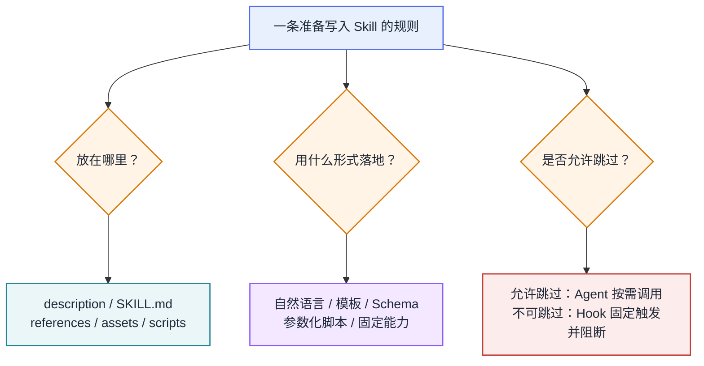
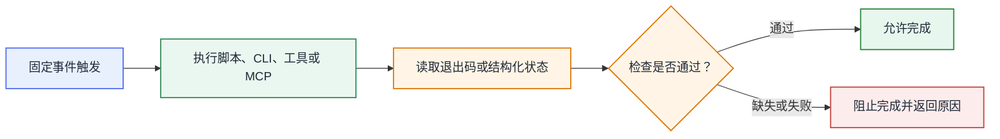
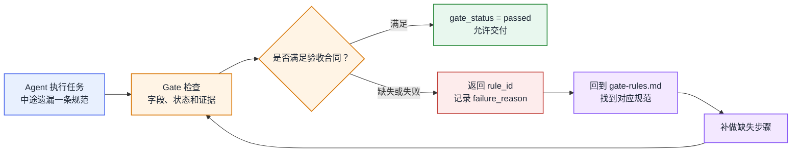
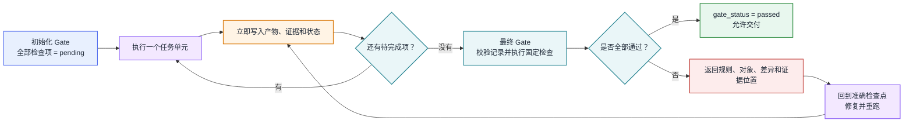
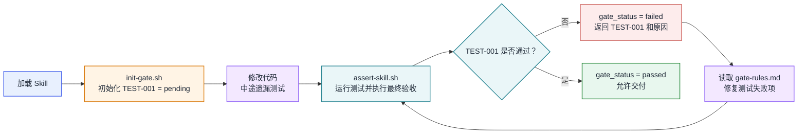

# 如何编写让 Agent 可靠执行的 Skill


## 摘要

本文针对 Skill 规范仍被 Agent 绕过的问题，分析规则从触发到完成判断的失效路径，归纳渐进式拆分、脚本校验、结构化合同、增量证据与 Gate 回溯等实践，说明可靠 Skill 的设计思路。

## 1. 为什么规范写了仍会被绕过

一个简单的例子。Skill 写道：

```text
完成代码修改后，必须运行全部相关测试；测试未通过时不得交付。
```

在实际执行中：

```text
Skill 要求
├─ 必须执行：运行全部相关测试
└─ 完成条件：测试全部通过

Agent 实际执行
├─ 已执行：阅读代码、运行类型检查
├─ 未执行：相关测试
└─ 给出结论：任务已经完成

追问 Agent
├─ 是否理解原规则：是
└─ 为什么没有执行：根据代码判断可以省略
```

规则已经写进 Skill，Agent 也能复述，但它仍然跳过测试并宣布完成。它并不是没有看到规范，而是在下一步行动选择中，使用了自己的任务判断替代 Skill 中的流程要求。这类问题至少包含五个不同环节：

| 环节 | 可能发生的问题 |
|---|---|
| Skill 触发 | 没有加载正确的 Skill，或者加载得太晚 [[1]](https://agentskills.io/specification) |
| 规则理解 | 关键要求埋在长文本里，适用条件没有说清楚 [[1]](https://agentskills.io/specification) |
| 动作选择 | Agent 用代码阅读、类型检查等替代了规定动作 [[2]](https://code.claude.com/docs/en/slash-commands) |
| 状态保持 | 尚未完成的步骤只留在对话里，任务变长后被遗漏 [[3]](https://arxiv.org/abs/2605.19604) [[4]](https://www.anthropic.com/engineering/effective-harnesses-for-long-running-agents) |
| 完成判断 | Agent 没有执行规定步骤，仍然可以自行宣布完成 [[2]](https://code.claude.com/docs/en/slash-commands) [[3]](https://arxiv.org/abs/2605.19604) |

Formal Skill 论文将类似问题概括为三类：同一段自然语言流程在每次执行时都要由模型重新解释；顺序、安全和完成条件只是软指令；任务状态分散在对话记录中，运行时无法直接检查。[[3]](https://arxiv.org/abs/2605.19604) Claude Code 官方文档也说明，Skill 内容即使仍在上下文中，模型也可能选择其他工具或路径；需要确定性约束时，可以使用 Hook 强制执行。[[2]](https://code.claude.com/docs/en/slash-commands)

因此，编写 Skill 时需要回答：

> 一条写进 Skill 的规则，怎样才能在 Agent 执行时真正生效，而不是只被读到、理解了，最后仍然被跳过？

## 2. 如何处理 Skill 中的软约束

这里的软约束，是指规则已经进入上下文，但是否执行、怎样执行以及何时算完成仍由 Agent 判断。多写几次“必须”不会改变这一点。写一条 Skill 规则时，需要先回答三个问题：它应该放在哪里，用什么形式落地，是否允许 Agent 跳过。



图 1　第二章对每条规则分别做三个判断：内容位置决定 Agent 能否找到规则，落地形式决定 Agent 有多少解释空间，触发方式决定关键动作能否被跳过。

### 2.1 Skill 中的内容应该放在哪里？

Agent Skills 规范采用渐进式加载：会话开始时只加载 `name` 和 `description`；Skill 触发后加载 `SKILL.md`；脚本、参考资料和模板在需要时再读取或执行。[[1]](https://agentskills.io/specification) OpenAI Skill Creator 要求主文件只保留必要流程和选择条件，把详细资料、示例和固定资源拆到对应目录。[[5]](https://github.com/openai/skills/blob/main/skills/.system/skill-creator/SKILL.md)

```text
skill-name/
├── SKILL.md      #（必要流程、选择条件和资源入口）
├── scripts/      #（重复且需要确定结果的程序）
├── references/   #（按需读取的说明、示例和领域资料）
└── assets/       #（直接复制或修改的模板、静态资源）
```

不同内容的放置方式如下：

| 内容 | 放置位置 | 原因 |
|---|---|---|
| 触发场景和适用边界 | `description` | 这是 Agent 判断是否加载 Skill 的入口 |
| 必要流程和选择条件 | `SKILL.md` | Skill 触发后需要立即看到 |
| 详细说明、框架差异和示例 | `references/` | 只在对应场景下读取 |
| 直接复用的产物骨架 | `assets/` | 直接复制或填充，不必现场重写 |
| 确定且重复的动作 | `scripts/` | 由程序执行，避免反复生成同一段逻辑 |

OpenAI Skill Creator 分别给出三类示例：PDF 旋转逻辑放入 `scripts/rotate_pdf.py`，前端项目骨架放入 `assets/hello-world/`，BigQuery 表结构放入 `references/schema.md`。[[5]](https://github.com/openai/skills/blob/main/skills/.system/skill-creator/SKILL.md)

回到第一章的测试案例，“代码修改后必须运行相关测试”属于主流程，应保留在 `SKILL.md`；不同语言和测试框架的选择方法放入 `references/`；确定的测试入口放入 `scripts/`。运行时再生成 `test-result.json`，记录这次测试实际做了什么。


图 2　测试 Skill 的一次执行过程。图中只说明 Skill 如何使用主流程、参考资料和脚本，不包含完成门禁。

`description` 需要覆盖代码修改、缺陷修复和重构等触发场景。Skill 被选中后，`SKILL.md` 直接给出不可省略的主流程：识别改动范围、选择相关测试、调用统一入口、保存执行结果。这里不展开 Jest、Pytest、Go Test 等框架细节，否则主流程会被大量分支冲淡。

这样拆分后，主流程会在 Skill 触发时加载，框架细节只在需要时读取，重复动作由脚本执行。它**<u>仍然没有解决一个问题：调用脚本的决定还在 Agent 手中，Agent 依然可能绕开这个入口。</u>**

### 2.2 规则应该以什么形式落地？

OpenAI Skill Creator 按任务的变化范围和出错风险划分自由度：多种方案都合理时使用自然语言；存在推荐路径但允许调整时使用伪代码或参数化脚本；顺序容易出错、结果必须一致时使用参数少的固定脚本。[[5]](https://github.com/openai/skills/blob/main/skills/.system/skill-creator/SKILL.md)

一条规则采用哪种形式，可以按下表判断：

| 规则特点 | 落地形式 | Agent 负责什么 |
|---|---|---|
| 需要结合现场信息权衡 | 自然语言和少量示例 | 理解任务并作出判断 |
| 有推荐路径，但参数会变化 | 伪代码或参数化脚本 | 选择参数和适用分支 |
| 输入输出字段固定 | 模板或 Schema | 填写合法字段 |
| 执行过程和结果固定 | 固定脚本、CLI、工具或 MCP | 发起调用并处理结果 |

模板固定产物骨架，Schema 固定字段、类型和必填项；它们本身不会执行动作。脚本、CLI、工具和 MCP 才负责真实操作。

OpenAI Skill Creator 将需求判断保留为自然语言，把目录初始化交给参数化脚本，用模板固定产物结构，再由固定程序检查格式。[[5]](https://github.com/openai/skills/blob/main/skills/.system/skill-creator/SKILL.md)


图 3　OpenAI Skill Creator 的官方流程：需要判断的部分保留给 Agent，能够固定的部分交给模板和脚本。

初始化命令保留了必要参数：

```bash
scripts/init_skill.py <skill-name> \
  --path <output-directory> \
  --resources scripts,references
```

其中，`<skill-name>`（Skill 名称）、`--path`（生成目录）和 `--resources`（需要创建的资源目录）由 Agent 根据任务填写；目录结构、Frontmatter 和占位内容由脚本生成，不再现场手写。

内容完成后，官方流程要求运行固定校验程序：

```bash
scripts/quick_validate.py <path/to/skill-folder>
```

Agent 只提供 Skill 路径。程序按固定规则检查 YAML Frontmatter、必填字段和命名格式。这里没有单独使用 JSON Schema，固定结构由初始化模板提供，格式约束由校验程序执行。

自由度不是按整个 Skill 统一设置的。需求理解允许 Agent 判断，初始化只开放少量参数，产物结构和基础校验不再交给 Agent 解释。Agent 是否会主动运行校验程序，仍要看 2.3 的触发和门禁设计。

SSL 论文提到，文本型 Skill 往往把调用条件、执行阶段、工具动作和资源副作用写在同一段文字中。系统要检索 Skill 或检查风险时，只能反复解析全文。论文提出 Scheduling–Structural–Logical（SSL）表示，将同一份 Skill 整理成三层 JSON 图：[[6]](https://arxiv.org/abs/2604.24026)

| SSL 结构 | 记录内容 | 主要字段 |
|---|---|---|
| Scheduling | Skill 解决什么问题、何时调用、需要什么输入、返回什么结果 | `skill_goal`、`intent_signature`、`expected_inputs`、`expected_outputs`、`dependencies` |
| Structural | Skill 包含哪些执行阶段，各阶段如何进入、退出和转换 | `scene_goal`、`entry_conditions`、`exit_conditions`、`next_scene_rules` |
| Logical | 每个阶段包含哪些原子动作，动作使用什么参数、产生什么结果、访问什么资源 | `act_type`、`input_args`、`effects`、`resource_scope`、`resource_target` |

SSL 解决的是规则如何被检索和检查，不能保证规则一定执行。关键步骤是否可以被跳过，仍要看触发和门禁设计。

### 2.3 关键步骤怎样做到不可跳过？

把检查程序放进 `scripts/`，不等于形成门禁。在 `SKILL.md` 中写“完成前检查测试状态”，也只是增加了一条自然语言要求。门禁要生效，需要由固定事件触发检查，读取真实结果，并在结果缺失或失败时阻止任务完成。



图 4　不可跳过的检查必须完整执行。只要触发、判断或阻断仍由 Agent 根据文字自行决定，规则仍可能失效。

Claude Code 允许在 Skill 的 Frontmatter 中用<u>**固定结构声明 Hook**</u>。Skill 激活后，Hook 在该 Skill 的生命周期内生效；后续由运行时事件触发，不依赖 Agent 再次阅读并执行一句自然语言。`TaskCompleted` 是其中一个完成事件。它在任务准备标记为完成时触发，官方输入中与本例直接相关的字段如下：[[7]](https://code.claude.com/docs/en/hooks)

```jsonc
{
  "hook_event_name": "TaskCompleted",             //（任务完成事件）
  "task_id": "task-001",                         //（当前任务标识）
  "task_subject": "Implement user authentication" //（当前任务内容）
}
```

Claude Code 官方文档给出的检查脚本会直接运行测试。测试失败时返回退出码 `2`，任务不会被标记为完成：[[7]](https://code.claude.com/docs/en/hooks)

```bash
#!/bin/bash
INPUT=$(cat) #（读取 Hook 输入）
TASK_SUBJECT=$(echo "$INPUT" | jq -r '.task_subject') #（取得当前任务内容）

if ! npm test 2>&1; then #（运行项目测试）
  echo "Tests not passing. Fix failing tests before completing: $TASK_SUBJECT" >&2
  exit 2 #（阻止任务标记为完成）
fi

exit 0 #（测试通过，允许任务完成）
```

`TaskCompleted` 只适用于进入 Claude Code 任务状态管理的流程，不会在每次普通回复结束时触发；普通会话需要选择 `Stop` 等对应事件。这个例子可以复用三点：**<u>固定事件触发、执行真实检查、失败后阻断</u>**。Formal Skill 论文也把动作 Schema、执行器、Hook 和 Skill 内部状态组合成运行时协议。[[3]](https://arxiv.org/abs/2605.19604)

## 3. 如何编写 Skill 的 Gate

Gate 适用于有明确产物、执行流程或外部副作用的任务型 Skill。支持 Hook 的平台可以在运行时自动触发检查，并在检查失败时阻止完成。Hook 不是 Agent Skills 规范中的通用能力；无法配置 Hook 时，只能在 Skill 内设计软约束，通过固定合同和校验脚本降低门禁被绕过的概率。[[1]](https://agentskills.io/specification) [[7]](https://code.claude.com/docs/en/hooks)

### 3.1 Gate 的作用及重要性

对任务型 Skill，Gate 是最重要的一部分，因为它直接决定任务能否交付。第一章示例中的问题不是 Agent 不理解“修改后必须测试”，而是这条规则在执行过程中丢失后，没有任何结果能够阻止它宣布完成。Gate 改的是最后一步：完成判断要同时检查规定字段和验收证据。

Gate 不需要把整份规范重新塞回上下文。检查失败时返回规则编号和失败原因，Agent 再按编号回到对应规则补做。即使中间步骤被遗忘，最后的缺口仍然可见。



图 5　Gate 发现缺口后，通过规则编号把 Agent 拉回对应流程。

Formal Skill 的 CodeRepairOps 使用了同样的控制思路。它把 `verification_passed`、`required_artifacts`、`produced_artifacts` 和 `gate_fail_reasons` 保存在 Skill 状态中；验证失败时回到修改阶段，验证通过且必需产物齐全后才进入完成阶段。[[3]](https://arxiv.org/html/2605.19604)

### 3.2 Gate 的完整设计

一个完整的 Gate 需要四类内容：`SKILL.md` 声明入口和完成条件，Markdown 文件归集验收规则，JSON 或 XML 保存本次任务的验收状态，脚本负责初始化和最终检查。

```text
skill-name/
├── SKILL.md                         #（Gate 入口和完成条件）
├── references/
│   └── gate-rules.md                #（rule_id 对应的规则说明）
├── assets/
│   └── gate-contract.json           #（固定的验收合同模板）
└── scripts/
    ├── init-gate.sh                 #（初始化本次任务的合同）
    └── assert-skill.sh              #（执行检查并计算门禁状态）

.skill-state/
└── gate-contract.json               #（本次任务的状态和证据）
```

`SKILL.md` 开头只保留最短的执行要求，让 Agent 在加载 Skill 时先看到 Gate：

```markdown
## Gate

1. 开始任务时，先运行 `scripts/init-gate.sh` 初始化验收合同。
2. 每完成一个检查项，立即将结果与证据写入已有合同字段。
3. 交付前，运行 `scripts/assert-skill.sh .skill-state/gate-contract.json`。
4. 只有脚本输出 `gate_status: passed` 时，任务才算完成。
```

`references/gate-rules.md` 保存完整规则。每条规则都有固定的 `rule_id`，同时写明适用条件、通过标准、所需证据和失败后的处理方式。运行态合同保存结构化检查项、状态和证据，不重复整段规则说明。

**<u>合同必须在任务开始时从模板初始化，不能等到验收阶段再由 Agent 临时设计</u>**。初始化只生成字段骨架，状态统一为 `pending`；Agent 每完成一个检查项，再向已有字段填写结果和证据：

```jsonc
{
  "contract_version": "1.0",       //（验收合同版本）
  "task_id": "task-001",          //（本次任务标识）
  "artifact_version": "a1b2c3d",  //（待验收的产物版本）
  "gate_status": "pending",        //（门禁状态：pending、passed 或 failed）
  "required_rule_ids": ["RULE-001"], //（本次门禁必须包含的规则）
  "failed_rule_ids": [],            //（未通过的规则编号）
  "checks": [
    {
      "rule_id": "RULE-001",       //（对应 gate-rules.md 中的规则）
      "check_type": "command",     //（检查类型：command 或 evidence）
      "executor": "scripts/check-rule.sh", //（由门禁调用的检查程序）
      "expected": { "exit_code": 0 },      //（通过条件）
      "status": "pending",         //（单项状态：pending、passed 或 failed）
      "evidence": [],               //（命令结果、文件路径或评审记录）
      "failure_reason": "",        //（未通过原因）
      "repair_from": null,          //（返回哪个阶段修复）
      "recheck_from": null          //（修复后重新检查的位置）
    }
  ],
  "validated_at": null              //（最后一次校验时间）
}
```

**<u>JSON、XML 不会让 Agent 天然更懂规则，它们的价值是把验收项拆成可枚举的字段</u>**。字段缺失、类型错误或状态值非法时，Schema 和脚本可以直接识别并拒绝。SSL 论文将文本型 Skill 转成显式字段后，Skill 检索和风险检查都优于只使用原始文本，说明结构化表示更适合显式列出调用条件、阶段关系、工具动作和资源影响。[[6]](https://arxiv.org/abs/2604.24026)

| 载体 | 在 Gate 中负责什么 |
|---|---|
| Markdown | 保存人和 Agent 能够阅读的完整验收规则，并用 `rule_id` 提供回溯入口 |
| JSON Schema | 定义必填字段、字段类型、状态值和允许出现的结构 |
| 校验脚本 | 检查字段是否齐全、证据是否存在，并执行能够自动完成的验收动作 |

只要求 Agent 输出 JSON 还不够。OpenAI 官方文档说明，普通 JSON 模式只保证结果可以解析；使用 JSON Schema 并设置 `strict: true`，才能约束输出符合指定结构。[[9]](https://openai.com/index/introducing-structured-outputs-in-the-api/) 这说明 Schema 必须由程序实际校验，不能只作为说明文件存在。在本地 Skill 中，`assert-skill.sh` 先核对合同版本、必填字段和 `required_rule_ids`，缺少整条规则时直接失败，然后再执行 `command` 类型的检查。`evidence` 类型由 Agent 填写判断结果，脚本检查字段是否齐全、引用的文件是否存在。`gate_status` 和各项 `status` 均由脚本更新，不由 Agent 直接宣告。

```text
存在未通过的项目                 → gate_status = failed
没有失败，但存在尚未检查的项目   → gate_status = pending
全部项目通过                     → gate_status = passed
```

执行顺序也要分开：Agent 先依据 Markdown 规则完成判断，再把结论填入固定合同，最后由脚本验收。《Let Me Speak Freely?》发现，JSON、XML、YAML 等格式限制对复杂推理的影响因模型和任务而异，严格 Schema 还可能降低推理表现。[[8]](https://arxiv.org/abs/2408.02442) 把判断和格式填写分开，可以避免 Agent 一边推理，一边承受严格格式约束；合同字段是否完整则交给脚本处理。

### 3.3 长任务中的 Gate：增量留痕与准确回溯

长任务如果把产物和验收证据留到最后补写，只能依靠上下文回忆，容易漏字段，也容易为了通过 Gate 临时拼凑。Gate 如果只返回“检查失败”，Agent 还要重新定位问题，后续修复也容易改错位置。

**<u>产物和证据应随过程增量写入</u>**。任务开始时先初始化全部检查项；每完成一个任务单元，立即写入该阶段的产物、证据和状态。最终 Gate 可以执行固定检查并记录结果，但不能补造缺失的阶段产物和过程证据。只要仍有 `pending`，任务就不能通过。

Anthropic 的长任务 Harness 将功能清单中的项目全部初始化为未通过。后续会话一次处理一个功能，测试通过后才修改状态，并同步更新进度文件和 Git 记录。新会话可以从已有记录继续，不需要在任务末尾回忆之前做过什么。[[4]](https://www.anthropic.com/engineering/effective-harnesses-for-long-running-agents)

```jsonc
{
  "step_id": "STEP-003",                         //（当前完成的任务单元）
  "status": "passed",                           //（该任务单元的验收状态）
  "artifact_ref": "reports/part-03.md",          //（本阶段新增或更新的产物）
  "evidence_ref": ".skill-state/STEP-003.json", //（本阶段的验收证据）
  "recorded_at": "2026-08-01T18:30:00+08:00"    //（记录写入时间）
}
```

**<u>Gate 失败时必须返回可以直接回溯的信息</u>**。失败结果要说明违反了哪条规则、哪个对象不符合要求、预期和实际分别是什么、证据在哪里，以及从哪个阶段修复、从哪个检查点重新验证。Formal Skill 的 CodeRepairOps 会保存 `gate_fail_reasons`，验证失败后回到修改阶段。[[3]](https://arxiv.org/html/2605.19604) ACL 2024 的一项研究也发现，**模型不擅长稳定找出推理错误；给出真实错误位置后，五类任务的修正表现都有提升**。[[10]](https://aclanthology.org/2024.findings-acl.826/)

```jsonc
{
  "gate_status": "failed",                         //（当前不能交付）
  "rule_id": "TEST-001",                          //（违反的验收规则）
  "failed_object": "price.test.ts / coupon case", //（发生问题的对象）
  "expected": "total = 90",                       //（规则要求的结果）
  "actual": "total = 100",                        //（检查得到的结果）
  "evidence_ref": ".skill-state/test-result.json", //（失败证据位置）
  "failure_reason": "coupon case：期望 total=90，实际 total=100", //（检查器确认的失败事实）
  "repair_from": "patch",                        //（返回哪个阶段修复）
  "recheck_from": "verify"                       //（修复后重新检查的位置）
}
```

`failure_reason` 应记录检查器能够确认的事实，不能只写“结果不正确”，也不能把未经验证的判断当成根因。Agent 先按 `rule_id` 和 `failed_object` 找到问题，再根据证据修复；修复完成后，只重跑受影响的检查项，并写入新的结果。



图 6　长任务按阶段留下产物和证据；Gate 失败后回到准确位置修复。

### 3.4 测试 Skill 示例

回到第一章的案例，`gate-rules.md` 中固定一条验收规则：

```markdown
## TEST-001 运行相关测试

- 适用条件：任务修改了代码。
- 通过标准：相关测试已经执行，退出码为 0，测试结果对应当前代码版本。
- 所需证据：测试命令、退出码、代码版本和测试完成时间。
- 失败处理：根据失败结果修复代码，重新执行测试和门禁校验。
```

任务开始时，`init-gate.sh` 从模板生成合同，并将 `TEST-001` 设为 `pending`。即使 Agent 修改代码后忘记运行测试，交付前的固定入口仍会读取合同，并通过 `TEST-001` 配置的执行器启动测试。这里运行的是最终检查，不是在验收阶段补写过程产物：

```bash
scripts/assert-skill.sh .skill-state/gate-contract.json
```

第一次校验发现测试失败，脚本记录命令、退出码和代码版本，并返回：

```jsonc
{
  "gate_status": "failed",          //（当前不能交付）
  "failed_rule_ids": ["TEST-001"],  //（需要回溯的规则）
  "checks": [
    {
      "rule_id": "TEST-001",       //（未通过的验收规则）
      "status": "failed",          //（单项验收状态）
      "failed_object": "price.test.ts / coupon case", //（失败的测试用例）
      "expected": "total = 90",    //（测试期望值）
      "actual": "total = 100",     //（测试实际值）
      "evidence": [
        {
          "command": "npm test",   //（实际执行的测试命令）
          "exit_code": 1,           //（测试退出码）
          "artifact_version": "a1b2c3d" //（测试对应的代码版本）
        }
      ],
      "failure_reason": "coupon case：期望 total=90，实际 total=100", //（检查器确认的失败事实）
      "repair_from": "patch",      //（返回修改阶段修复）
      "recheck_from": "verify"     //（修复后重新运行测试）
    }
  ]
}
```

Agent 根据 `TEST-001` 回到 `gate-rules.md`，修复测试失败项，再次运行 `assert-skill.sh`。脚本确认测试退出码为 0、证据字段齐全且代码版本一致后，将状态更新为 `passed`。



图 7　测试规则被遗忘后，固定合同和校验结果把 Agent 拉回 TEST-001。

这仍是软约束，因为 `init-gate.sh` 和 `assert-skill.sh` 都要由 Agent 调用。但固定入口、固定合同和 `passed` 状态减少了 Agent 自行解释完成条件的空间。

## 4. 总结：可靠 Skill 的编写原则

可靠执行不能只靠反复强调规范。对有明确产物、执行流程或外部副作用的任务型 Skill，可以按六条原则处理：

1. **先定义 Gate。** 写清楚任务通过条件、必需产物和验收证据。没有通过 Gate，任务不能交付。
2. **按渐进式披露拆分 Skill。** 触发条件放在 `description`，主流程和选择条件放在 `SKILL.md`，详细说明与示例放在 `references/`，固定产物骨架放在 `assets/`，确定动作放在 `scripts/`。
3. **能用脚本检查的，优先使用脚本。** 固定命令、字段校验和结果判断不再交给 Agent 重复推理。
4. **无法完全脚本化的规则，拆成结构化字段。** 用 JSON Schema 或 XML Schema 固定必填项、类型和状态值，让脚本能够枚举、匹配和拒绝不完整结果。
5. **验收合同先初始化，再增量填写。** 任务开始时生成固定模板，执行过程中持续写入产物、证据和状态，不能等到最终验收时一次性拼装。
6. **失败结果必须能够回溯。** Gate 未通过时，返回失败规则、对象、预期、实际、证据、当前状态、修复阶段和重新检查点，让 Agent 从准确位置修复并重新检查。

最终完成条件只有一个：Gate 输出 `passed`，而不是 Agent 在回复中宣告任务已经完成。

## 参考文献

[1] Agent Skills. [Agent Skills Specification](https://agentskills.io/specification).

[2] Anthropic. [Extend Claude with skills — Claude Code Docs](https://code.claude.com/docs/en/slash-commands).

[3] Zhang, X., Gao, M., Zhao, Y., et al. [Formal Skill: Programmable Runtime Skills for Efficient and Accurate LLM Agents](https://arxiv.org/abs/2605.19604). arXiv:2605.19604, 2026.

[4] Anthropic. [Effective Harnesses for Long-Running Agents](https://www.anthropic.com/engineering/effective-harnesses-for-long-running-agents).

[5] OpenAI. [Skill Creator — OpenAI Skills Repository](https://github.com/openai/skills/blob/main/skills/.system/skill-creator/SKILL.md).

[6] Liang, Q., Wang, H., Liang, Z., & Liu, Y. [From Skill Text to Skill Structure: The Scheduling-Structural-Logical Representation for Agent Skills](https://arxiv.org/abs/2604.24026). arXiv:2604.24026, 2026.

[7] Anthropic. [Hooks Reference — Claude Code Docs](https://code.claude.com/docs/en/hooks).

[8] Tam, Z. R., Wu, C.-K., Tsai, Y.-L., Lin, C.-Y., Lee, H.-y., & Chen, Y.-N. [Let Me Speak Freely? A Study on the Impact of Format Restrictions on Performance of Large Language Models](https://arxiv.org/abs/2408.02442). arXiv:2408.02442, 2024.

[9] OpenAI. [Introducing Structured Outputs in the API](https://openai.com/index/introducing-structured-outputs-in-the-api/), 2024.

[10] Tyen, G., Mansoor, H., Cărbune, V., Chen, P., & Mak, T. [LLMs Cannot Find Reasoning Errors, but Can Correct Them Given the Error Location](https://aclanthology.org/2024.findings-acl.826/). Findings of ACL 2024.
