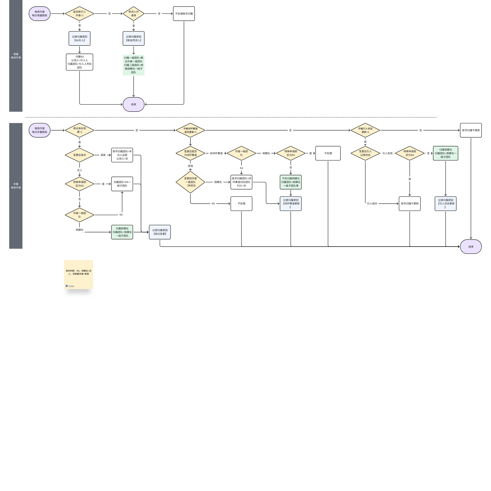
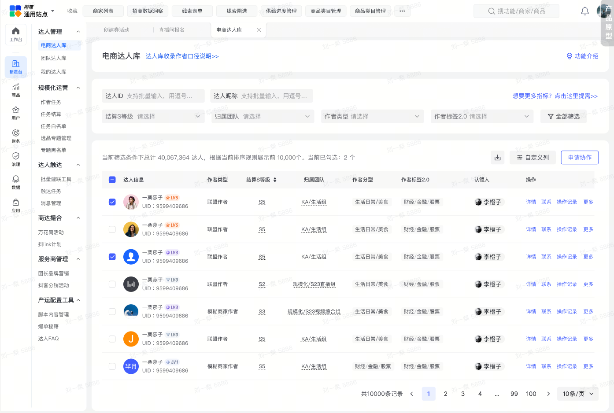
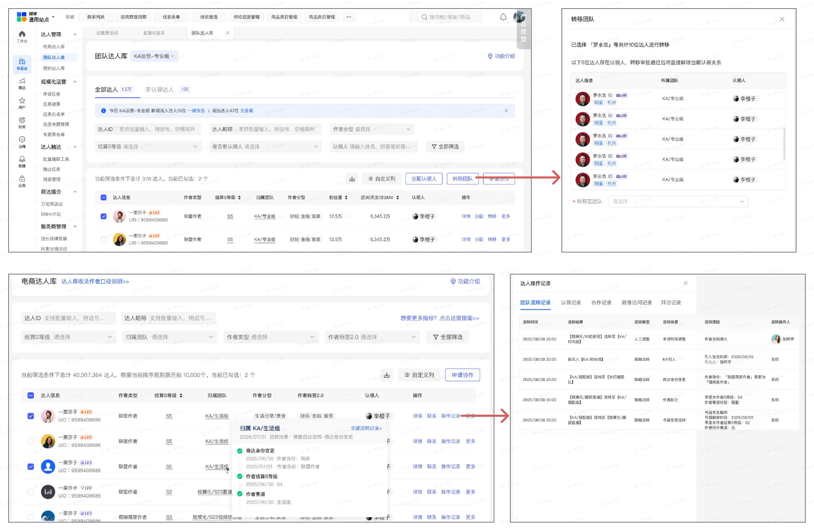
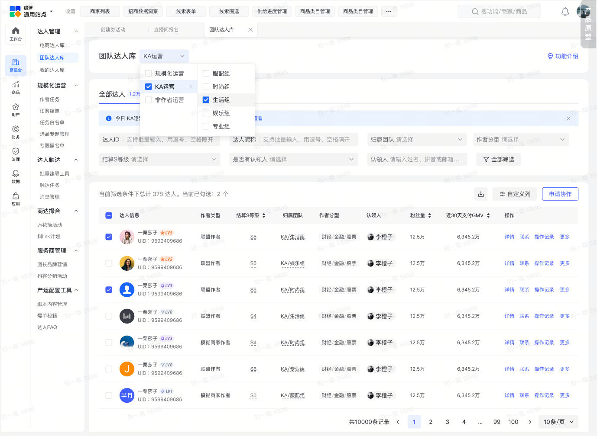
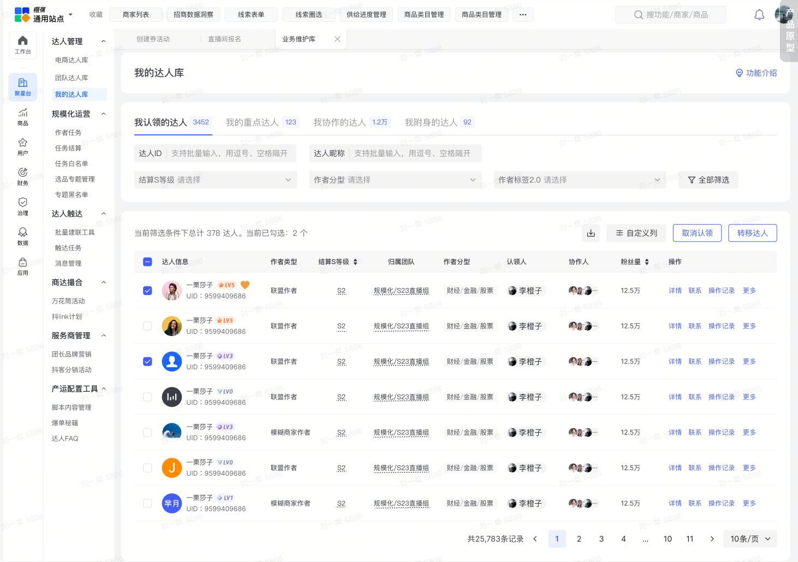
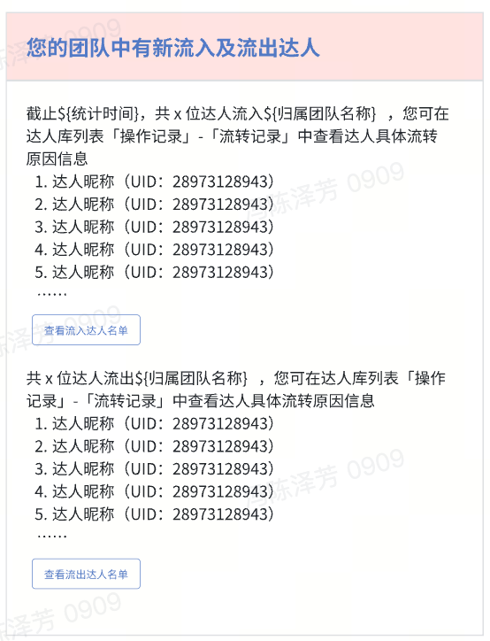

# 电商内容生态达人库白皮书

- **来源**：https://bytedance.larkoffice.com/docx/TqCed4vtaobOQxx4RpecatLOnkg

> ###### **【达人库】**是平台产品提供的用于作者运营管理电商达人的核心工具，通过自动化规则实现达人在不同运营团队间的归属流转与高效协作。

---

## 🌟达人库**重点能力一览**

| **团队与个人管理** | • **团队达人库**：达人按归属团队流转进各个团队的达人库，运营可在团队达人库里进行认领等操作。 团队管理员（各团队leader）可给自己团队下的达人分配认领人、转移达人所属赛道，管理未认领达人。• **我的达人库**：运营管理自己的认领达人、协作达人、引入中的达人。支持标记重点达人，[**管理达人号簇关系**](https://bytedance.larkoffice.com/docx/PsJLdB9iPo1bpUxPYNYcvlh2nJh?chunked=false)，提升效率。 |
| --- | --- |
| **达人归属团队自动化流转** | **流入流出机制【2026.02.11变更后】**• **自动流转**新电商作者归属变更• 存量电商作者归属review变更• **人工调整KA内部转移：转移团队**（leader可以把自己赛道内的达人转出去/策略转移团队）• **KA内部转移：申请转移至我的团队**（leader申请把别的赛道内的达人转进来）• **特殊申请：从规模化转移至KA**（KA团队leader申请转移至我的团队） |
| **消息提醒** | • 通过飞书实时通知分配任务，确保关键动作及时响应。• 新流入流出团队的达人日度通知团队leader |

## 达人库自动流转机制

> 注：原飞书表格含合并单元格，Markdown 中已按阅读顺序展开，空白格表示原合并区域。

| **流转机制详解** |  |  |
| --- | --- | --- |
| **达人库基于新团队分工自动化流转规则，实现达人跨团队高效流转，释放运营人力。**• **减少手动切户，关键流程线上化，运营权流转效率提升80%**• ** 明确团队边界，统一归属标准，减少管理摩擦**【2026.02.11变更后】头肩腰达人分层、潜力认领培养下线，新的分工基于结算S等级及闭环赛道信息等 |  |  |
| **自动流转规则** | • **新电商作者归属变更**• **处理周期**：每天• **处理流程**：step1：判断是否是新引入作者，是，则流转场景记录为*「KA引入」*• 否，跳转step2• step2：判断是否是新开通电商权限或粉丝数新涨到1万+，是则账号*流转至规模化团队*，待确认规模化团队作者分工规则• **存量电商作者归属review变更**• **处理周期**：每天• **处理流程**：step1：判断作者身份是否更新，是则**流转场景记录为「商达变更」**商家：更新作者归属一级团队为「非联盟作者运营」（作者一级团队），认领人更新为空• 作者-判断是否有特殊申请记录有记录：归属KA，作者归属一级团队=KA运营，作者归属二级团队=KA一级子团队• 无记录-根据作者一级团队划分• 否：跳转step2• step2：判断作者闭环赛道是否更新，是则**流转场景记录为「闭环赛道变更」**非闭环赛道-判断作者一级团队「数仓字段」KA-判断当前作者归属一级团队「系统信息」规模化运营or非达人运营：归属KA，作者归属一级团队=KA运营，作者归属二级团队=KA一级子团队• KA运营：不处理归属变更• 规模化-特殊申请锁定KA是：不处理归属变更• 否归属规模化团队，作者归属一级团队=规模化运营，作者归属二级团队=规模化一级子团队• 其他-判断当前作者一级团队规模化运营or非达人运营：按照闭环赛道更新作者归属（KA）团队• KA运营：不处理归属变更• 否：跳转step3• step3：判断作者引入状态是否更新，是则**流转场景记录为「引入记录状态更新」**引入成功：不处理归属流转，账号保留在KA• 引入失败-特殊申请锁定KA是：不处理归属变更• 否：归属规模化团队，作者归属一级团队=规模化运营，作者归属二级团队=规模化一级子团队• 否：结束流程 |  |

**自动流转规则白板**（原位于上表“自动流转规则”的图示列）

白板源文件：[SVG](assets/电商内容生态达人库白皮书.assets__whiteboards__whiteboard-001-Rs2tw165QhmInObuacBcGZ1jnif.svg) | [原始节点 JSON](history/电商内容生态达人库白皮书.assets__whiteboards__whiteboard-001-Rs2tw165QhmInObuacBcGZ1jnif.raw.json)

---

## **功能使用指南**

| **核心能力模块** | **图示讲解** |
| --- | --- |
| **【电商达人库】**1️⃣ **功能定位**全量电商达人信息2️⃣ **核心能力** -**查看达人各项信息、联系达人、协作达人、附身百应/罗盘等**• **NEW归属团队字段信息**一级团队：KA运营、规模化运营、非联盟作者• 二级团队：KA运营-专业/服配/时尚/娱乐/生活/作者公海• 规模化运营-S1拉新/S2+直播组/S2+视频综合组• ***可查看达人历史的流转情况***• **附身百应/罗盘**点击更多可选择附身达人百应或者罗盘账号，查看数据• [达人百应&罗盘附身规范 2025.12](https://bytedance.larkoffice.com/wiki/MSrKwTfTbiVQ6FkPregclgn9nwf) |  |
| **【团队达人库】**1️⃣ **功能定位**KA运营团队、规模化运营团队核心阵地，可查看本团队以及其他团队认领的达人情况，支持赛道内分配、认领及跨赛道转移达人2️⃣ **核心能力**查看各个团队的达人情况，分配、转移、认领达人• **KA内部转移：转移团队**（leader把自己赛道内的达人转出去/策略转移团队）• **KA内部转移：申请转移至我的团队**（leader申请把别的团队内的达人转进来）• **特殊申请：从规模化转移至KA**（KA团队leader申请转移至我的团队）3️⃣ **操作权限** • **团队管理员**：分配达人：选择目标达人，指定认领人，可批量分配，实时生效• 转移团队：选择达人&目标团队，提交后审批通过完成转移。• 查看操作记录• **本团队运营**：认领达人、申请协作、取消认领（仅认领人）、转移达人（仅认领人）等 |  |
| **【我的达人库】**1️⃣ **功能定位**运营个人管理的核心工具，支持认领达人管理与重点运营。2️⃣ **核心能力** -**分组管理**： • **我认领的达人**：展示名下所有认领达人，支持筛选与导出。• **我的重点达人**：手动标记高优先级达人，独立分组管理。• **我协作的达人：**申请了协作权限的达人• **我附身的达人：**附身查看过后台的达人• 达人号簇关系：[运营平台-号簇关系及管理](https://bytedance.larkoffice.com/docx/PsJLdB9iPo1bpUxPYNYcvlh2nJh)3️⃣ **操作功能**• 取消认领：取消当前对达人的认领• 转移至其他运营• 批量导出• 设置重点标签：单人或批量标记，图标点亮即生效。 达人流转后标记自动清除 |  |
| **【消息通知】【2026.02.11变更后】** 以下场景将通过飞书每天11点提醒（以下信息会在同一条飞书提示上）• 通知对象：KA团队leader• 通知内容：**流入达人数量**，及达人信息；点击【查看流入达人名单】可跳转团队达人库查看原因详情• **流出达人数量**，及达人信息；点击【查看流出达人名单】可跳转团队达人库查看原因详情 |  |

---

**附录：术语表**

- **分型赛道**：按达人内容属性划分的运营团队（如时尚潮流、娱乐休闲）
- **S等级**：达人成长等级（S1-S5），S4/S5为高价值分层。
- **公海池**：未认领达人的公共资源池。

---

## 需求对接与oncall

- **提需&使用相关咨询请对接：产品@陈樊骏@冯陈泽芳，产品运营@周安琪**
- 如有人员跨赛道流动/新员工入职，与**产品@陈樊骏@冯陈泽芳对接进行功能权限变更/开通**
