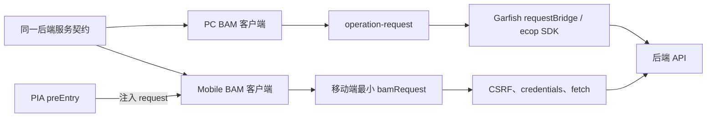
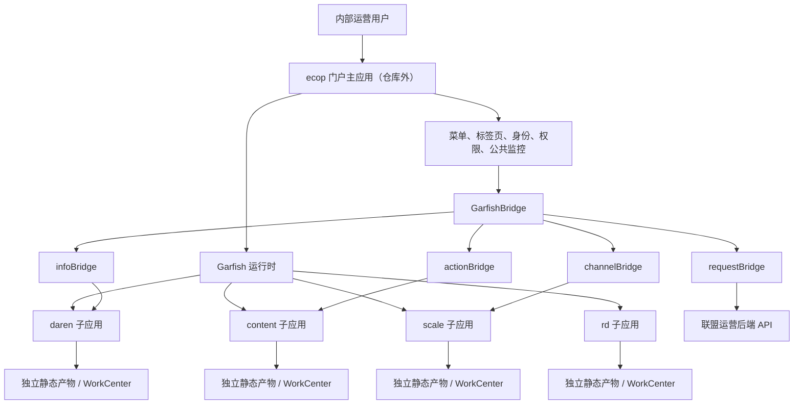

# 联盟运营平台前端仓库技术架构总览

> **文档定位**：本文是 `ecom/alliance-operation-mono` 仓库的技术总览，面向需要理解、维护或扩展该仓库的前端与全栈研发人员。重点解释仓库的工程结构、多端与微前端架构、应用内分层、接口链路、公共能力、构建部署和设计思想。业务内容只用于说明代码边界，不展开介绍运营业务本身。
>
> **分析边界**：本文深入分析当前前端仓库，并说明它与 ecop 门户、后端服务、监控和发布平台之间的集成关系；仓库外的门户实现和后端服务内部架构不在分析范围内。
>
> **代码基线**：`master` 分支，提交 `3bff60c27b116bfc11b6fd2750d765397443d192`，分析日期为 2026 年 8 月 16 日。文中所说的“当前”均指这一代码基线。

## 阅读导航

- 如果只想快速建立整体认知，建议阅读第一、二、三、十三和十五章。
- 如果重点关注工程结构，建议阅读第四、七、八、九章。
- 如果重点关注多端与微前端，建议阅读第五、六章。
- 如果准备实际开发或排障，建议继续阅读第十、十一和十四章。

## 一、先给出整体结论

`alliance-operation-mono` 不是一个单体后台，也不只是把几个 React 项目放进同一个目录。它是一套围绕联盟运营场景建设的**前端应用平台型 Monorepo**：

- 在业务边界上，按作者运营、内容运营、规模化运营、研发与 AI 工具拆成四个 PC 子应用，另有一个移动端应用承接外勤场景。
- 在运行架构上，四个 PC 应用使用 EdenX 和 Garfish 构建为微前端子应用，由仓库外部的 ecop 门户负责装载、菜单、用户身份和公共动作；移动端使用 PIA 多页面架构独立运行。
- 在工程管理上，使用 Eden Monorepo（`emo`）和 pnpm 工作区统一管理应用、源码共享库、可发布业务包与工程基础设施。
- 在应用内部，以 EdenX 文件路由和业务功能目录为主要组织方式，页面、组件、状态和接口围绕业务域就近放置，而不是强制套用完全相同的传统 MVC 分层。
- 在数据链路上，以 BAM 生成的 TypeScript 客户端作为接口契约边界，再通过统一请求包适配门户 Bridge、权限处理、错误提示和日志上报。
- 在公共能力上，同时存在“仓库内源码复用”和“可发布 NPM 包复用”两种模式，以适应不同的复用半径与发布节奏。
- 在质量保障上，将异常监控、行为日志、白屏监控、覆盖率、安全扫描和 Source Map 上传放入应用根布局或构建配置，而不是完全依赖业务页面自行接入。

可以把仓库概括为五个层次：

| 层次 | 主要内容 | 解决的问题 |
|---|---|---|
| 产品形态层 | 四个 PC 微应用 + 一个 PIA 移动端应用 | 不同业务域和不同终端如何独立演进 |
| 应用开发层 | React、TypeScript、EdenX 文件路由、MobX / Hooks、Auxo | 页面和复杂运营功能如何实现 |
| 契约与集成层 | BAM、Ferry、`operation-request`、`GarfishBridge` | 前端如何稳定接入门户与后端 |
| 共享能力层 | `libs/`、`packages/` | 组件、请求、日志和业务模块如何复用 |
| 工程基础设施层 | Eden Monorepo、pnpm、Rspack / Webpack、发布插件、监控与安全插件 | 多应用如何被统一开发、构建、发布和治理 |

## 二、仓库的总体结构

### 2.1 整体拓扑

```mermaid
flowchart TB
    Repo["alliance-operation-mono"]

    Repo --> Apps["apps：可运行应用"]
    Repo --> Libs["libs：仓库内源码共享"]
    Repo --> Packages["packages：可发布或独立构建的共享包"]
    Repo --> Infra["infra：Monorepo 基建与自定义命令"]
    Repo --> Scripts["scripts：辅助脚本与工程工具"]

    Apps --> Content["content：内容运营 PC"]
    Apps --> Daren["daren：作者运营 PC"]
    Apps --> Scale["scale：规模化运营 PC"]
    Apps --> RD["rd：研发与 AI 工具 PC"]
    Apps --> Mobile["mobile：PIA 移动端"]

    Libs --> Components["components：共享业务组件"]
    Libs --> Ferry["ferry：历史接口客户端"]
    Libs --> Utils["utils / logger / style：轻量源码能力"]

    Packages --> Request["operation-request：统一请求"]
    Packages --> Logger["operation-logger：行为日志"]
    Packages --> Slardar["operation-slardar：异常与性能监控"]
    Packages --> BizPackages["AI 素材、搜索表单等业务包"]

    Infra --> Emo["Eden Monorepo + pnpm"]
    Infra --> Plugins["创建应用、BAM、文档、部署插件"]
```



这个结构同时表达了两种分解方式：

1. `apps/` 按**可独立运行和部署的产品边界**拆分。
2. `libs/` 与 `packages/` 按**跨应用复用的技术或业务能力**拆分。

因此，应用目录是纵向业务切片，共享目录是横向能力切片。两者组合后，既避免所有业务堆进一个 SPA，也避免每个子应用重复实现请求、日志、监控和公共组件。

### 2.2 顶层目录职责

| 目录或文件 | 职责 | 当前实现特点 |
|---|---|---|
| `apps/` | 五个终端应用 | 四个 EdenX PC 微应用，一个 PIA 移动端应用 |
| `libs/` | 仓库内共享源码 | 通常不独立构建，由应用构建器直接编译源码；部分能力通过相对路径直接引用 |
| `packages/` | 可独立构建或发布的模块 | 使用 EdenX Module Tools 输出 `dist/lib`、`dist/es` 和类型声明，部分包发布到内部 NPM |
| `infra/` | Monorepo 工具链与依赖底座 | 保存 pnpm 锁文件、ESLint 等开发依赖、自定义 `emo` 插件和 Git Hooks |
| `eden.monorepo.json` | 工作区主配置 | 声明包路径、是否发布、pnpm 和 Eden Monorepo 版本、自定义插件 |
| `eden.mono.pipeline.json` | 流水线入口配置 | 描述 SCM 场景下的构建入口 |
| `scm_build.sh` | CI 构建入口 | 安装指定版本 Eden Monorepo CLI 后执行 `emo scm` |
| `scripts/` | 独立辅助脚本 | 包含评测、节点检查、数据处理等仓库级工具 |

需要注意，`eden.monorepo.json` 才是 Monorepo 的有效包清单。仓库中可能存在尚未注册到该清单的工具目录或历史目录，因此“物理上位于 `packages/`”不等于“已经进入 Eden Monorepo 的统一发布图”。

## 三、主要技术栈与五个应用

### 3.1 技术栈总览

| 领域 | 主要技术 | 在仓库中的作用 |
|---|---|---|
| 语言与视图 | TypeScript、React 18 | 五个应用的主要开发语言和 UI 运行时 |
| PC 应用框架 | EdenX Runtime、EdenX App Tools | 文件路由、应用运行时和构建配置 |
| PC 构建器 | Rspack | 四个 PC 应用的开发和生产构建 |
| 微前端 | Garfish、`@edenx/plugin-garfish` | 将四个 PC 应用构建为 ecop 门户可装载的子应用 |
| 移动端框架 | PIA、Webpack 5 | 多页面移动端构建、容器参数和性能优化 |
| UI 组件 | Auxo、Auxo Mobile、部分业务组件包 | PC 与移动端统一的电商设计语言和交互组件 |
| 状态管理 | MobX、React Hooks / Context | 复杂业务状态和轻量页面状态；实际使用以 MobX 与 Hooks 为主 |
| 接口契约 | BAM，少量历史 Ferry | 从服务定义生成请求函数和 TypeScript 类型 |
| 请求接入 | `@ecom/operation-request`、门户 `requestBridge` | 统一请求、权限、错误、上传和日志行为 |
| 日志监控 | `operation-logger`、`operation-slardar`、Tea、Mera | 行为日志、异常、白屏、性能和核心链路监控 |
| Monorepo | Eden Monorepo、pnpm | 多项目依赖安装、过滤执行、构建和发布编排 |
| 质量与安全 | ESLint、Prettier、Stylelint、lint-staged、Argus、覆盖率插件 | 提交前检查、产物安全扫描、覆盖率和 Source Map 管理 |

### 3.2 五个应用的技术定位

| 应用 | 业务边界 | 技术形态 | 本地入口 | 代码组织特点 |
|---|---|---|---|---|
| `alliance-operation-daren` | 作者运营、达人库、拜访、触达、引入 | EdenX + Rspack + Garfish | `/alliance-operation-daren`，端口 `8079` | 体量大，MobX 与 Hooks 并存，达人详情和拜访等领域组件较深 |
| `alliance-operation-content` | 视频、直播、热点、内容活动与分成策略 | EdenX + Rspack + Garfish | `/alliance-operation-content`，端口 `8083` | 以路由业务域拆分，活动和策略模块包含较多表单及状态对象 |
| `alliance-operation-scale` | BPO、任务、触达、人群、社群与发奖 | EdenX + Rspack + Garfish | `/alliance-operation-scale`，端口 `8081` | 复杂流程和图形能力多，保留部分历史请求与嵌套模块结构 |
| `alliance-operation-rd` | AI Agent、AIGC、灵感、热点与案例工具 | EdenX + Rspack + Garfish | `/alliance-operation-rd`，端口 `8082` | 试验性业务多，直接引用业务包源码，开发环境接入源码定位工具 |
| `alliance-operation-mobile` | 移动端主页与达人拜访 | PIA + Webpack 5，多页面 | `/alliance-operation-mobile` | 使用移动组件库和独立页面入口，通过 `preEntry` 注入移动请求实现 |

四个 PC 应用的基础技术栈高度一致，但它们不是同一个应用中的四组菜单。每个应用都有自己的：

- `package.json` 与依赖版本；
- `edenx.config.ts`；
- 开发端口和 `baseUrl`；
- `dist` 产物目录；
- Slardar `bid`；
- WorkCenter 发布标识；
- BAM 服务清单；
- 根布局与业务路由。

这正是它们能够独立开发、构建和部署的工程基础。

### 3.3 前端所连接的后端契约边界

仓库不包含后端实现，但各应用的 `bam.config.js` 明确声明了前端依赖的服务契约。按当前配置可看到：

| 应用 | 主要服务契约 |
|---|---|
| content | `ecom.buyin.admin_api`、`ecom.buyin.content_operate_api` |
| daren | `ecom.buyin.admin_api`、`ecom.buyin.multistar`、`cmp.ecom.projectop` |
| mobile | `ecom.buyin.admin_api` |
| rd | `ecom.buyin.admin_api`、`ecom.buyin.content_operate_api`、`ecom.alliance.ai_api`、`ecom.kol.square_api` |
| scale | `ecom.buyin.admin_api`、`ecom.buyin.content_operate_api`、`cmp.ecom.ecop`、`ecom.buyin.multistar`、`cmp.ecom.alliance_background` |

这些服务名描述的是**前端契约边界**，不能据此推断后端服务内部的数据库、领域分层或调用拓扑。本文后续所说的“全链路”，终点是前端请求进入这些服务接口，而不是继续推演仓库外实现。

## 四、Monorepo 工程设计

### 4.1 为什么需要 Monorepo

联盟运营平台有多个业务域，但它们共享门户、UI 规范、用户身份、接口协议、日志监控和发布体系。如果完全拆成多个互不关联的仓库，会产生公共能力版本不一致、重复建设和跨仓联调成本；如果全部合并为一个 SPA，又会让构建、发布和业务变更互相牵连。

当前架构采用中间方案：

- 用 `apps/` 保留应用级边界和独立产物；
- 用 Monorepo 统一依赖安装、代码规范和工程命令；
- 用 `libs/` 和 `packages/` 沉淀共享能力；
- 用微前端在运行时把多个 PC 应用重新组合为统一门户体验。

这使“代码管理在一起”和“应用运行在一起”成为两个可以独立设计的问题。

### 4.2 Eden Monorepo 的管理方式

根配置 `eden.monorepo.json` 指定了：

- `strictNodeModules: true`：约束依赖解析，降低应用误用未声明依赖的概率；
- pnpm `7.33.7`：统一工作区包管理器版本；
- Eden Monorepo `3.5.1`：统一 CLI 行为；
- `infraDir: "infra"`：把工具链依赖和锁文件集中到 `infra/`；
- `scriptName`：声明 `test`、`build`、`start`、`ferry` 等可由 Monorepo 编排的脚本；
- `plugins`：加载创建应用、部署、BAM 和文档等仓库自定义命令。

仓库根目录没有普通项目常见的根 `package.json`，基础设施依赖由 `infra/package.json` 和 `infra/pnpm-lock.yaml` 承接。这种结构把“业务包依赖”与“Monorepo 管理工具依赖”分开，根目录更接近工程编排层。

### 4.3 按业务域拆应用，而不是按技术层拆应用

五个应用都能独立提供一组完整功能，而不是把“所有页面”“所有接口”“所有状态”拆成不同项目。这种纵向切分有三个直接收益：

1. 一个业务需求通常只修改一个应用及其局部共享能力。
2. 应用可以按自己的业务复杂度选择状态和组件组织方式。
3. 发布失败或回滚的影响面可以限制在一个子应用。

代价是多个应用会保留相似的根布局和构建配置。例如四份 `edenx.config.ts` 都配置了 CDN、Garfish、Slardar、Argus 和 Rspack。这种重复不是纯粹的疏忽，它换取了应用配置的独立性；但当基础配置频繁统一升级时，也会增加同步成本。

### 4.4 两种共享模式：`libs` 与 `packages`

这是仓库最重要的工程设计之一。

#### `libs/`：仓库内源码级复用

`libs/components`、`libs/utils`、`libs/ferry` 等包的 `main` 或 `source` 直接指向 `src`，构建脚本也明确表示不需要独立构建。PC 应用在 `edenx.config.ts` 中通过 `source.include` 把 `../../libs` 纳入 Rspack 编译范围。

这一模式适合：

- 只在当前 Monorepo 内使用；
- 希望修改后立即被应用编译；
- 不需要维护独立发布版本；
- 与仓库当前 React、TypeScript 环境强绑定的能力。

典型内容包括共享业务组件、敏感权限展示、内容播放器、达人选择器、自动埋点辅助和全局样式。

#### `packages/`：构建和版本化复用

`operation-request`、`operation-logger`、`operation-slardar`、`operation-ai-material`、`operation-case-search-form` 等包使用 EdenX Module Tools 构建，输出 CommonJS、ES Module 和类型声明，并配置内部 NPM 发布地址。

这一模式适合：

- 需要在当前仓库外复用；
- 需要明确版本和发布节奏；
- 希望向使用方暴露稳定 API；
- 需要独立文档或构建产物的基础能力、业务模块。

两种模式共同形成“近距离源码复用 + 远距离版本化复用”的双层共享体系。其边界并非完全机械：部分应用会用 TypeScript alias 直接指向 `packages` 源码，以获得 Monorepo 内联调效率；这也意味着开发态与发布态都需要被验证。

### 4.5 应用内部采用功能域就近组织

四个 PC 应用的典型结构如下：

```text
src/
├── routes/                 # 文件路由和业务功能域
│   └── <feature>/
│       ├── page.tsx        # 路由入口
│       ├── components/     # 该功能专用组件
│       ├── stores/         # 该功能状态（按需要存在）
│       ├── hooks/          # 该功能 Hooks（按需要存在）
│       ├── utils/          # 该功能辅助逻辑
│       └── types / constant
├── components/             # 应用级公共组件
├── hooks/                  # 应用级公共 Hooks
├── utils/                  # 应用级工具和门户适配
├── stores/                 # 跨路由状态（部分应用存在）
├── types/                  # 应用级类型
└── bam/                    # 自动生成的服务客户端与类型
```

它不是严格的“视图层—服务层—数据层”横向目录，而是以业务功能为主轴，再在功能内部做局部分层。这种方式能够提高功能内聚性：修改“达人拜访”时，页面、列表组件、筛选状态和业务常量都集中在 `routes/daren-visit`，不需要在多个顶层技术目录之间来回跳转。

它的适用前提是公共能力必须及时上收。如果多个功能复制同一组件或请求逻辑，而没有提升到应用级 `components` 或仓库级 `libs/packages`，功能域结构仍然会发生重复。

### 4.6 生成代码与手写代码分离

每个应用都将 BAM 产物固定输出到 `src/bam`。生成文件带有 `eslint-disable`、`ts-nocheck` 和服务文档链接，并由 `bam.config.js` 控制接口范围、命名转换、`i64` 类型映射及请求实例注入。

仓库通过目录边界表达所有权：

- `bam.config.js` 是研发维护的契约选择和生成配置；
- `src/bam/` 是工具维护的生成结果；
- 页面和 Store 只消费生成结果，不直接修改生成客户端。

`.bytedev/codelines.yaml` 也排除了 `src/bam/`、Ferry 产物和锁文件，说明生成代码在代码量统计与人工改动上被视为独立类别。

### 4.7 基础设施也被代码化

`infra/plugins` 不只是配置文件，还实现了仓库级 CLI：

| 命令能力 | 实现 | 作用 |
|---|---|---|
| 创建应用 | `infra/plugins/cli` | 询问应用名、发布形式、Slardar ID，创建发布资源与子项目模板 |
| 批量 BAM | `infra/plugins/bam` | 从 Monorepo 清单选择项目，按过滤器批量运行接口生成 |
| 选择性部署 | `infra/plugins/deploy` | 为当前分支记录 PPE 与子项目列表，触发对应 WorkCenter |
| 文档生成 | `infra/plugins/doc` | 提供仓库内文档辅助能力 |

这体现了“平台约束进入工具，而不是只停留在 README”这一设计：新应用的命名、发布资源和构建方式尽量由生成流程固化。

## 五、多端开发架构

### 5.1 多端不是一套 UI 强行响应式适配

仓库的多端策略是**共享业务契约和基础能力，分离终端 UI 与运行时**：

| 维度 | PC 端 | 移动端 |
|---|---|---|
| 应用框架 | EdenX | PIA |
| 构建器 | Rspack | Webpack 5 |
| 路由/页面 | 文件路由，`routes/**/page.tsx` | 多页面入口，`pages` 配置显式声明 |
| 组件库 | `@ecom/auxo` | `@ecom/auxo-mobile`、`@ecom/auxo-mobile-alliance` |
| 容器 | ecop 门户中的 Garfish 子应用 | Webcast WebView / PIA 容器 |
| 状态 | MobX + Hooks 为主 | Hooks / Context，局部 Store |
| 网络环境 | 门户 `requestBridge` 优先，SDK 兜底 | PIA 页面中注入移动端 `bamRequest` |
| 发布产物 | 微前端子应用静态资源 | 独立移动页面资源，当前配置使用 GOOFY 资源前缀 |

这样设计的原因是 PC 和移动端的交互密度、容器能力、组件体系和网络环境差异很大。共享一套页面组件并不能自动降低复杂度，反而容易形成大量终端条件分支。当前仓库选择共享“协议与能力”，而不是共享完整视图。

### 5.2 PIA 多页面模型

移动端 `pia.config.ts` 显式声明四个入口：

- `home`；
- `daren-visit`；
- `visit-create`；
- `visit-detail`。

每个页面都有独立入口，PIA 配置统一注入容器 Schema、资源前缀、预执行脚本、SCSS 主题和性能策略。`chunkSplit: split-by-experience` 用于拆包，正式环境可移除部分控制台输出，并为 WebView 配置导航栏、状态栏、预热 Worker 等参数。

多页面模型的特点是单个业务入口更轻、页面间故障隔离更直接，但页面间共享状态不能自然依赖一个长期存活的 SPA Runtime，需要更多依赖 URL、接口或会话缓存。

### 5.3 PC 与移动端共享同一个业务契约

“达人拜访”同时存在于 `alliance-operation-daren` 和 `alliance-operation-mobile`。两端各自生成 `ecom.buyin.admin_api` 的拜访接口和类型，使用相同的 `visit/list`、`visit/detail`、`visit/save` 等服务契约，但分别实现 PC 表格/日历交互和移动表单/卡片交互。

这是一种契约级复用：

- 后端字段和接口语义一致；
- TypeScript 类型由同一服务定义生成；
- 端侧组件、布局和状态生命周期独立；
- 两端可以按终端需求分别演进，而不会把响应式判断扩散到所有组件。

### 5.4 请求注入体现依赖倒置

PC 端生成的 BAM 客户端默认导入 `@ecom/operation-request` 中的 `bamRequest`。移动端虽然也使用 BAM 生成代码，但在 `src/preEntry/index.ts` 中调用 `initialEcomBuyinAdminApiOptions`，把默认请求器替换为移动端的最小 `bamRequest`。



BAM 客户端只依赖一个请求函数签名，不绑定具体容器。这使同一套生成协议能够运行在 Garfish 门户和 PIA WebView 中，是多端架构中较有价值的设计。

### 5.5 多端方案的优势与复杂度

**优势：**

- 终端 UI 不互相妥协，PC 和移动端可以选择合适的组件库与页面模型。
- 后端契约保持一致，字段类型和接口变更仍由生成工具约束。
- 移动端只替换请求适配，不需要复制整套接口封装。
- 同一业务可以在 PC 完成管理，在移动端完成现场操作，形成跨端业务闭环。

**复杂度：**

- 两端各自生成 BAM 产物，升级接口时要确保两端配置同步。
- 两种构建体系并存，需要分别理解 EdenX/Rspack 和 PIA/Webpack。
- 移动容器的登录、CSRF、资源前缀和 WebView 参数与 PC 门户不同。
- 共享的是契约而非全部业务逻辑，复杂表单校验仍可能在两端分别实现。

## 六、微前端技术架构

### 6.1 使用的技术框架

四个 PC 应用的微前端技术组合是：

- **EdenX**：应用框架和运行时，提供文件路由及构建配置；
- **Rspack**：实际打包器；
- **`@edenx/plugin-garfish`**：把 EdenX 应用接入 Garfish 生命周期与产物规范；
- **Garfish**：ecop 门户侧的微前端运行时；
- **`@ecom/ecop-op-subsystem-sdk`**：子系统访问门户请求和用户能力的 SDK 兜底；
- **`GarfishBridge`**：门户在运行时注入的请求、用户、动作和通道能力。

四份 `edenx.config.ts` 都有三个关键声明：

```ts
runtime: { router: true },
deploy: { microFrontend: true },
plugins: [appTools({ bundler: 'rspack' }), garfishPlugin()]
```

这些配置说明它们不是仅仅“被 iframe 打开”的普通页面，而是按 Garfish 子应用方式构建和部署。

仓库没有在业务源码中为每个应用手写一套 `mount`、`unmount` 等生命周期适配，而是将这部分框架集成交给 EdenX 的 Garfish 插件。业务代码仍按普通 React 文件路由应用开发，构建阶段再生成符合微前端运行时要求的产物，这降低了业务模块对微前端生命周期细节的感知。

### 6.2 主应用不在当前仓库

当前仓库包含四个业务子应用，不包含 ecop 门户主应用源码。主应用负责的能力只能通过子应用使用到的 Bridge 合约观察，不能从本仓库完整分析其实现。



图中的连接用于表达职责，不表示只有某一个子应用能使用某一类 Bridge。实际上多个应用都可以按需访问这些能力。

### 6.3 子应用的构建与路由契约

每个 PC 子应用通过自己的 `server.baseUrl` 占据独立 URL 前缀：

| 子应用 | `baseUrl` | 本地端口 | 根容器 |
|---|---:|---:|---|
| daren | `/alliance-operation-daren` | 8079 | `#alliance-operation-daren-root` |
| content | `/alliance-operation-content` | 8083 | `#alliance-operation-content-root` |
| scale | `/alliance-operation-scale` | 8081 | `#alliance-operation-scale-root` |
| rd | `/alliance-operation-rd` | 8082 | `#alliance-operation-rd-root` |

独立前缀解决了三件事：

1. 子应用内部路由不会互相冲突。
2. 门户可以根据菜单路径选择需要装载的子应用。
3. 本地开发时可以只启动一个子应用，并让其资源来自独立端口。

生产构建中，各应用也把 JS、CSS、图片和字体输出到自己的应用名目录，并根据 `BUILD_TYPE` 选择内外网 CDN 前缀。为了避免微前端页面加载多份不一致的 React 实例，配置显式将 `react` 和 `react-dom` alias 到各应用自己的依赖位置。

### 6.4 Bridge 是主子应用之间的运行时协议

从当前仓库的使用情况看，Bridge 至少承担四类职责：

| Bridge | 子应用中的用途 | 典型代码位置 |
|---|---|---|
| `requestBridge` | 使用门户提供的 `fetchApi`，统一登录态、权限和请求环境 | `packages/operation-request/src/index.ts` |
| `infoBridge` | 获取当前用户信息 | content / daren 的 `src/utils/index.ts` |
| `actionBridge` | 打开或关闭门户标签、改面包屑、弹出权限申请 | `packages/operation-ai-material/src/apis/ecopApi.ts`、敏感权限组件 |
| `channelBridge` | 感知门户菜单路径切换 | `packages/operation-logger/src/ecop-event-adaptor.ts` |

此外，`window.Garfish.setGlobalValue` 和 `getGlobalObject` 被用于跨子应用共享少量全局状态，例如自动埋点实例和播放器倍速。

统一请求包采用“Bridge 优先、NPM SDK 兜底”的策略：

```ts
const { requestBridge } = window.GarfishBridge || {};
const fetchApi = requestBridge?.fetchApi || EcopFetchApi;
```

这个设计让子应用在新旧门户能力、独立环境或 Bridge 暂不可用时仍有回退路径，提高了运行环境兼容性。

### 6.5 独立开发和独立部署如何实现

**独立开发：**

- 每个应用都有 `pnpm dev`，由自己的 EdenX 配置启动；
- 各应用端口和静态资源前缀分离；
- `DEV_ASSET_PREFIX` 等配置允许将门户页面指向本地子应用资源；
- VMock、Locator、源码检查器等能力按应用接入，不要求启动整个仓库。

**独立构建：**

- 每个应用都有 `edenx build`；
- Eden Monorepo 可以按应用过滤执行；
- 产物目录和 Slardar `bid` 相互独立。

**独立部署：**

- 四个 PC 应用各有一个 `alliance.deploy.json` 和独立 WorkCenter ID；
- 自定义 `emo deploy` 流程可以为当前分支选择一个或多个子项目；
- 发布插件按子项目触发对应 WorkCenter，而不是要求五个应用整体发布。

独立并不代表完全无依赖。共享包变更、门户 Bridge 协议变更或 React / Auxo 基础版本升级仍可能同时影响多个应用，Monorepo 的价值正是在提交阶段能够看到这些跨应用关系。

### 6.6 微前端的优势、特点与运行复杂度

#### 优势和特点

- **业务隔离**：应用边界和运营业务边界基本一致，团队可以在单个领域内迭代。
- **发布隔离**：一个应用可以单独构建、灰度和回滚。
- **统一体验**：门户提供菜单、身份和标签页，用户仍在同一运营平台内工作。
- **渐进演进**：不同应用可以在不一次性重写整个平台的情况下升级内部实现。
- **公共能力集中**：请求、用户、权限申请和导航动作由门户 Bridge 提供，避免每个应用直接对接底层平台。

#### 运行复杂度

- 主应用与子应用之间存在全局 Bridge 协议，类型目前多处以 `any` 或 Window 扩展表达，协议升级需要兼容治理。
- 路由同时涉及门户路径和子应用内部文件路由，页面访问问题需要判断发生在哪一层。
- 子应用独立依赖可能带来 React、Auxo、请求包等版本差异。
- 全局事件和跨应用共享状态必须防止重复注册；日志适配器因此通过全局 Keeper 保证只初始化一次。
- 本地独立运行缺少完整门户上下文时，需要 SDK 兜底或 Mock，不能假设所有 Bridge 永远存在。
- 监控需要区分门户错误和子应用错误，因此每个应用使用独立 `bid`、根选择器和 Source Map。

## 七、应用内部分层与运行机制

### 7.1 文件路由是页面骨架

四个 PC 应用都开启 `runtime.router: true`。EdenX 根据 `src/routes` 目录生成路由：

- `layout.tsx` 定义布局并通过 `<Outlet />` 渲染子路由；
- `page.tsx` 是页面入口；
- 业务目录名形成 URL 路径；
- 页面内部再按组件、Store、Hooks 和工具拆分。

路由入口通常保持较薄，例如 daren 的 `routes/daren-visit/page.tsx` 只负责挂载 `VisitList`。这让路由声明与业务实现解耦，业务组件也可以被达人详情抽屉等其他场景复用。

### 7.2 根布局承担横切能力

四个 PC 应用都把横切能力集中在根 `layout.tsx`，再按各自需要选择初始化项。这些能力包括：

- Auxo `ConfigProvider` 与中文语言包；
- Slardar / Mera 监控；
- Tea 行为日志；
- AOT 页面和点击适配（content、daren、scale 已在根布局显式初始化）；
- Error Boundary；
- 白屏监控根节点；
- PPE 环境信息；
- 体验反馈与开发定位工具；
- 部分应用的敏感字段权限申请处理器。

这是一种“横切能力在应用边界注入”的设计。业务页面默认处于可观测、可兜底和统一主题环境中，不需要每个页面重复初始化。

### 7.3 状态管理采用混合策略

仓库没有强制所有页面使用同一种状态管理方式，实际模式包括：

- **MobX Store**：适合复杂筛选、表格、流程表单和多个组件共享的可变状态；
- **React Hooks**：适合页面内局部状态、异步请求和简单交互；
- **React Context**：用于向局部组件树注入 Store 或页面上下文；
- **外部轻量 Store / 业务 SDK**：在个别历史或专项模块中使用。

从当前源码使用情况看，content、daren、scale 都有大量 MobX 与 Hooks 代码；mobile 主要使用 Hooks / Context；rd 的依赖中包含 Zustand，但当前主要源码仍以 Hooks 和 MobX 模式为主。因此更准确的描述是“按复杂度选用状态模式”，而不是“全仓统一 MobX”或“已经统一 Zustand”。

混合策略给予业务模块灵活性，但也提高了阅读成本。新功能应优先沿用所在领域已有模式，不宜只因为个人偏好再引入新的状态范式。

### 7.4 UI 与样式体系

PC 端以 `@ecom/auxo` 为基础，移动端使用 Auxo Mobile。仓库中同时存在：

- 应用内 `src/components`：只服务一个应用的通用组件；
- 功能内 `routes/<feature>/components`：只服务一个业务功能；
- `libs/components`：跨多个应用共享的业务组件；
- 独立 `packages`：可版本化发布的大型业务模块。

样式以 SCSS / CSS Modules 为主，部分历史模块保留 Less 和普通 CSS。构建配置开启 CSS Module 类型声明，但部分应用关闭构建时 TypeScript Checker，因此类型声明生成和独立类型检查仍需要配合工程流程理解，不能把一次 Rspack 构建等同于完整类型验证。

### 7.5 代表性链路：PC 端达人拜访列表

达人拜访能同时体现路由、状态、接口生成、统一请求和日志能力：

```text
routes/daren-visit/page.tsx
  → VisitList
  → StoreContext / MobX Store
  → SearchStore.fetchVisitList()
  → apiVisitList(searchFilter)
  → BAM 生成客户端
  → @ecom/operation-request.bamRequest
  → Garfish requestBridge（门户环境）或 ecop SDK（兜底）
  → ecom.buyin.admin_api
  → runInAction 更新列表、总数和 loading
  → observer 组件重新渲染
```

其中：

- `page.tsx` 只做路由挂载；
- `SearchStore` 保存筛选条件、分页、加载状态和结果；
- 请求前发送 `list_request_sent` 自定义事件；
- `apiVisitList` 及请求/响应类型由 BAM 生成；
- `operation-request` 处理容器差异、错误分类、权限和 Toast；
- MobX `runInAction` 在请求成功后原子更新状态。

这条链路说明仓库的“分层”不是依赖固定目录名实现，而是通过清晰的职责边界实现：路由负责入口，组件负责展示与交互，Store 负责业务状态，生成客户端负责契约，请求包负责基础设施适配。

## 八、接口生成与统一请求架构

### 8.1 BAM 是主接口方案

各应用的 `bam.config.js` 主要完成以下配置：

1. 指定服务 PSM 与分支；
2. 使用 `include` 精确选择需要的接口；
3. 输出到 `src/bam`；
4. 将下划线接口名转换为 `apiXxx` 函数名；
5. 将 Thrift `i64` 映射为前端 `number`；
6. 生成请求函数和完整类型；
7. 注入 `@ecom/operation-request` 的 `bamRequest`。

例如生成后的 `apiVisitList` 会负责：

- 固定 URL 与 HTTP Method；
- 把 TypeScript 请求对象转换为 `params` 或 `data`；
- 返回明确的响应类型；
- 保留对应 BAM 接口文档地址。

业务代码不需要手写 URL、Method 和大段请求/响应类型，从而降低接口字段漂移和复制错误。

### 8.2 接口更新流程

典型流程是：

```text
后端服务定义变更
  → 修改应用 bam.config.js 的 include
  → 运行 pnpm bam 或 emo 的 BAM 选择命令
  → 重新生成 src/bam
  → 业务页面消费新的函数和类型
```

仓库自定义 BAM 插件可以从 Monorepo 包清单中多选项目，并通过 `emo run bam --filter ...` 批量更新，适合一个服务契约同时影响多个端或多个应用的情况。

### 8.3 统一请求包的职责

`packages/operation-request` 不只是对 `fetch` 的薄封装，它集中处理：

- 判断当前是否运行在 Garfish 子应用环境；
- 优先使用门户 `requestBridge.fetchApi`，以 SDK 为兜底；
- 自动处理 `/api/buyin` 前缀；
- GET、JSON、Form、FormData 等序列化；
- 上传场景的 Axios 调用；
- 成功、跳转、客户端错误、服务端错误、业务错误和未知错误分类；
- 401 / 403 与门户权限逻辑；
- 全局 Toast；
- 请求结果和 `log_id` 上报；
- 为 BAM 和 Ferry 提供兼容请求器；
- 暴露用户信息获取能力。

请求返回被规整为 `SuccessResponse | ErrorResponse`。统一的 `responseEffects` 决定是否跳转、提示和上报，页面因此不必重复实现相同的错误分支。

这一层的价值在于隔离两种变化：上层 BAM 客户端不关心门户如何发请求，业务页面也不关心每个 HTTP 状态如何转化为交互反馈。

### 8.4 Bridge 优先与独立运行兜底

门户环境中的请求通常需要统一登录态、权限和网关逻辑，因此优先使用 `requestBridge`。同时保留 `@ecom/ecop-op-subsystem-sdk` 兜底，使子应用在 Bridge 能力切换或部分独立环境中仍有请求路径。

这种兼容层提高了迁移弹性，但也意味着请求问题不能只看浏览器 `fetch`：需要同时确认当前是否被识别为 Garfish 子应用、Bridge 是否注入、SDK 版本和接口自身返回。

### 8.5 Ferry 的定位

`libs/ferry` 仍保留历史生成客户端，并通过 `ferryRequest` 接入统一请求包；其 `src/index.ts` 已注明“老仓库迁移使用，不推荐使用”。因此当前架构应理解为：

- BAM 是新增和主要接口方案；
- Ferry 用于兼容历史模块；
- 两者共享请求基础设施，但不代表两套生成方案具有同等优先级。

## 九、共享能力设计

### 9.1 共享组件库

`libs/components` 包含的不是纯视觉原子组件，而是具有联盟运营语义的业务组件和横切工具，例如：

- 达人等级、达人标签与达人选择；
- 内容播放器和直播表格；
- 企业微信群选择；
- 敏感字段权限展示与申请；
- 多视图时间线；
- 自动点击/输入失焦辅助；
- 体验反馈初始化。

基础按钮、表单、弹窗等原子能力由 Auxo 提供，`libs/components` 再在其上沉淀业务共性。这避免仓库自己维护一套通用设计系统，也避免各应用重复拼装相同业务组件。

### 9.2 请求、日志、监控三个基础包

三个包形成一组相互配合的基础设施：

| 包 | 核心职责 | 与其他层的关系 |
|---|---|---|
| `operation-request` | 门户请求适配、响应规整、用户信息 | 被 BAM、Ferry、日志和业务代码使用 |
| `operation-logger` | Tea 初始化、页面/模块/元素事件、AOT 适配 | 读取用户信息，并监听 Garfish 路径切换 |
| `operation-slardar` | Slardar / Mera、错误边界、白屏、核心链路 | 在应用根布局注册，构建时配合 Source Map 上传 |

它们把技术治理从单个业务应用中提取出来，使新应用能够通过统一包快速获得平台级能力。

### 9.3 业务级可发布包

`operation-ai-material` 和 `operation-case-search-form` 代表另一类共享：它们不是通用基础设施，而是可以跨页面甚至跨应用复用的完整业务模块。

这种模块通常：

- 有自己的组件、类型、请求和状态；
- 使用 EdenX Module Tools 构建；
- 声明 React 为 Peer Dependency；
- 通过 `sideEffects` 保留样式；
- 在 Monorepo 内可以 alias 到源码联调，对外则使用发布版本。

这是一种介于“复制页面代码”和“拆独立微应用”之间的复用粒度。

### 9.4 共享能力的边界与风险

共享并非越多越好：

- 进入 `libs/components` 的组件会同时影响多个应用，需要控制 API 稳定性；
- 直接从 `@operation/components/src/...` 引用内部文件提高了使用灵活性，但弱化了统一出口约束；
- 发布包在不同应用中可能使用不同版本，修复是否生效需要检查具体依赖；
- 源码 alias 能提升联调效率，但构建器必须明确把外部源码目录加入编译范围；
- 公共包依赖门户全局对象时，必须提供缺失能力的处理或兜底。

因此仓库采用“局部逻辑留在功能域，稳定共性再逐级上收”的方式，比一开始把所有代码抽成公共包更合适。

## 十、构建、环境与部署

### 10.1 PC 构建配置

四个 PC 应用的标准命令基本一致：

```bash
pnpm dev
pnpm build
pnpm start
pnpm serve
pnpm bam
```

EdenX 配置根据环境变量处理：

- `BUILD_TYPE`：区分 `offline`、`test`、`online`；
- `CDN_INNER_CN` / `CDN_OUTER_CN`：选择内外网资源域名；
- `CDN_PATH_PREFIX`：确定本次构建资源目录；
- `BUILD_VERSION`：注入监控发布版本；
- `BUILD_BASE_COMMIT_HASH`、分支等：提供版本与诊断上下文；
- ImageX 密钥：在满足条件时上传和转换图片资源。

应用产物使用独立应用名作为资源目录，同时输出嵌套 HTML 结构，适配微前端部署和 CDN 加载。

### 10.2 按环境启用工程能力

构建能力不是在所有环境中一刀切：

- 本地或非正式环境可注入代码覆盖率和源码定位信息；
- 正式构建上传 Source Map 到对应 Slardar `bid`；
- 非开发构建启用 Argus 安全插件；
- ImageX 只有在生产构建且密钥完整时启用上传；
- scale 只有在 `RSDOCTOR=true` 时加载 Rsdoctor，避免日常构建承担分析成本；
- rd 只在开发环境启用 Code Inspector；
- content、daren、rd 接入 VMock 插件，scale 保留自己的调试与历史兼容方式。

这种按环境和按应用启用的策略兼顾了可诊断性与构建性能。

### 10.3 独立发布机制

四个 PC 应用拥有不同的 WorkCenter 配置。自定义部署流程先记录：

- 当前 Git 分支；
- PPE 环境标识；
- 本次要部署的子项目列表。

随后逐个读取应用的 `alliance.deploy.json` 并触发对应 WorkCenter。一次操作可以只部署一个应用，也可以选择多个应用，但它们仍然是多个独立流水线目标。

CI 总入口 `scm_build.sh` 安装指定 Eden Monorepo CLI 后运行 `emo scm`，由 Monorepo 流水线配置决定构建入口。这表明本地的选择性发布插件和正式 SCM 构建属于两个层次：前者服务研发联调/PPE，后者服务仓库正式流水线。

### 10.4 移动端构建

移动端通过 `pia build` 构建，`pia.config.ts` 单独管理：

- 多页面入口；
- GOOFY / GECKO 资源映射；
- WebView 容器 Schema；
- 移动端主题和 SCSS 注入；
- PIA Worker 预热；
- 分包和控制台清理；
- Slardar HTML 参数；
- Argus 安全构建插件。

当前常量 `PUBLISH_TYPE` 为 `GOOFY`，同时代码中保留 GECKO 测试与线上资源前缀，因此应区分“当前发布选择”和“配置支持的发布能力”。

## 十一、可观测性、安全与工程质量

### 11.1 运行时可观测性

`operation-slardar` 的默认配置包含：

- History 路由 Page View；
- JS Error 采集与已知噪声过滤；
- Ajax 异常 URL 过滤；
- 指定子应用根节点的白屏检测；
- 白屏截图；
- 用户 ID 与发布环境上下文；
- Mera 插件和核心链路事件。

每个 PC 应用在根布局中等待门户 `SlardarWeb` 初始化，再动态注册应用插件和配置。这样可以复用门户监控实例，同时保留子应用自己的 `bid`、路由和白屏根节点。

### 11.2 行为日志

`operation-logger` 建立了页面、模块、元素和自定义事件模型：

- `initTea` 注入员工 ID、部门、邮箱等公共属性；
- `sendPageShowLog` 管理当前页面上下文；
- 模块和元素事件自动补充父级页面/模块信息；
- `EcopEventAdaptor` 监听文档点击和门户路径变化；
- AOT 元数据允许在 DOM 上描述页面、模块和元素，减少散落的手写事件参数。

门户切换菜单时，子应用不一定发生传统浏览器刷新，因此适配器专门监听 `channelBridge.onPathChange`，补发页面展示与隐藏事件。这是微前端环境下日志设计与普通 SPA 的一个重要差异。

### 11.3 请求错误闭环

统一请求层把请求路径、页面路径、返回码、`log_id`、环境和错误内容写入事件，再决定是否显示 Toast。这样一条线上错误能够同时具备：

- 用户看到的反馈；
- 前端当前页面；
- 调用的接口；
- 服务端日志 ID；
- PPE / 线上环境信息。

这比页面只写 `catch + message.error` 更容易形成排障闭环。

### 11.4 构建期安全与诊断

PC 构建配置普遍接入：

- Argus XSS 与产物过滤；
- 自动异常上报 Babel 插件；
- 非正式环境覆盖率采集和上传；
- 正式环境 Slardar Source Map 上传；
- ImageX 资源处理；
- Locator JSX 注入和开发源码定位。

这些能力在构建配置中统一启用，因此不依赖业务研发逐页记住安全和诊断步骤。

### 11.5 提交前质量控制

仓库根级规范包括：

- ESLint：继承电商与 React / TypeScript 规范；
- Prettier：统一 110 字符宽度、单引号等格式；
- Stylelint：约束样式代码；
- lint-staged：提交前格式化并检查 JS / TS / JSX / TSX；
- commitlint：校验提交信息；
- Husky：安装 `pre-commit` 与 `commit-msg` Hooks。

当前测试资产包含少量业务单测、BAM 配置测试和 `packages/operator-e2e` 下的 Playwright 视觉/页面回归脚本。仓库具备测试工具和覆盖率采集能力，但从已提交测试文件数量看，质量保障目前更依赖类型、Lint、监控、覆盖率和重点链路回归，而不是全仓高密度单元测试。这个判断描述的是当前代码资产，不代表所有线上验证流程都存放在本仓库中。

## 十二、关键设计思想

### 12.1 业务边界与部署边界尽量一致

作者、内容、规模化和研发工具分别形成应用，业务变化通常可以限制在一个部署单元内。这个设计比单纯按页面数量拆包更稳定，因为业务职责通常比具体页面长期。

### 12.2 编译时共享，运行时组合

Monorepo、`libs` 和 `packages` 解决编译时的代码共享；Garfish 和 ecop 门户解决运行时的应用组合。两者职责分开后，既能统一工程能力，又能保持应用独立发布。

### 12.3 门户能力通过适配层下沉

请求、用户、导航、权限和路径事件不是散落在页面中直接访问，而是尽量通过 `operation-request`、日志适配器或业务包中的 ecop 适配模块使用 Bridge。这样主应用协议发生变化时，可以优先在适配层收敛修改。

当前仍有部分页面直接访问 `window.GarfishBridge`，说明这一思想已经存在，但还不是完全封闭的强类型端口。它带来的启示是：全局协议越重要，越值得进一步形成集中类型和稳定 Facade。

### 12.4 契约生成替代手写接口胶水

BAM 把后端服务定义转化为请求函数和类型，并允许注入不同请求实现。它同时解决“类型一致性”和“运行环境适配”两个问题，是前后端边界最清晰的一层。

### 12.5 多端共享能力，不强求共享视图

PC 与移动端复用接口语义、生成协议和部分基础包，但分别使用适合终端的组件库与构建体系。这种方案接受一定的页面代码重复，以换取终端体验和运行环境的清晰边界。

### 12.6 横切能力在根布局和构建器中默认开启

监控、日志、错误边界、主题、安全和覆盖率被放在应用根布局或构建配置中。其思想是让应用“默认可观测、默认受治理”，而不是等线上问题发生后再逐页补接。

### 12.7 按复用半径选择抽象级别

功能内逻辑留在路由域，应用共性放入应用级目录，仓库共性进入 `libs`，稳定跨仓能力进入可发布 `packages`。这构成一条逐级上收路径，避免过早抽象，也避免长期复制。

### 12.8 独立性与一致性之间保持张力

子应用拥有自己的依赖、配置和发布目标，这是独立性的来源；统一的框架、公共包、Lint 和生成工具则提供一致性。仓库没有试图消除所有差异，而是在关键协议处统一，在业务实现处保留弹性。

## 十三、架构优势与边界汇总

| 设计 | 主要收益 | 需要承担的复杂度 |
|---|---|---|
| 业务域拆分的多应用 | 变更、构建、发布和回滚影响面较小 | 多份配置与依赖需要同步治理 |
| Garfish 微前端 | 门户体验统一，子应用独立交付 | 路由、全局对象、生命周期和 Bridge 调试更复杂 |
| Eden Monorepo | 一处管理多应用和共享包 | 工作区包、源码包与发布包边界需要理解 |
| BAM 代码生成 | 前后端类型与接口定义一致 | 生成配置和产物必须由工具维护，多端需同步更新 |
| Bridge + SDK 兜底 | 兼容门户与部分独立环境 | 实际请求路径存在分支，排障需要识别运行上下文 |
| PC / Mobile 双运行时 | 终端体验和性能模型更合适 | 两套构建与部分业务逻辑并存 |
| 根布局注入横切能力 | 页面默认具备日志、监控和错误兜底 | 初始化顺序、重复注册和全局状态需要谨慎处理 |
| `libs` + `packages` 双层复用 | 同时支持快速源码联调和稳定版本发布 | 直接源码引用、包版本和构建入口可能形成差异 |

整体来看，这套架构优先解决的是一个持续扩张的内部运营平台如何保持业务隔离、统一体验和工程复用。它不是追求所有应用代码形式完全一致，而是将一致性集中在以下关键契约上：

- 应用由 Monorepo 登记和编排；
- PC 应用遵循 EdenX / Garfish 子应用规范；
- 页面入口遵循文件路由约定；
- 后端接口通过 BAM 生成；
- 请求、日志和监控通过公共包接入；
- 构建与发布由统一环境变量和平台工具治理。

## 十四、建议的代码阅读顺序

如果第一次进入仓库，建议按以下顺序阅读，而不是直接从体量最大的页面开始：

1. `eden.monorepo.json`：先理解哪些目录是真正的应用和工作区包。
2. 一个 PC 应用的 `package.json` 与 `edenx.config.ts`：理解运行时、微前端、CDN 和构建插件。
3. 该应用的 `src/routes/layout.tsx`：理解全局主题、日志、监控和错误边界。
4. `src/routes/<feature>/page.tsx`：定位一个业务功能入口。
5. 功能内 `components`、`stores` 和 `hooks`：理解页面内部职责划分。
6. `bam.config.js` 与生成后的 `src/bam/<service>/index.ts`：理解接口从哪里来。
7. `packages/operation-request/src/index.ts`：理解请求实际如何进入门户和后端。
8. `packages/operation-logger`、`packages/operation-slardar`：理解可观测性。
9. `libs/components` 与业务 `packages`：理解哪些能力是跨应用共享的。
10. `infra/plugins` 与 `scm_build.sh`：最后理解应用创建、批量生成和发布流程。

如果要理解多端，达人拜访是最合适的样例：同时对照 daren 的 `src/routes/daren-visit`、mobile 的 `src/pages/daren-visit` 和两端 `src/bam/ecom.buyin.admin_api`，可以看到同一契约如何适配不同终端。

## 十五、总结

`alliance-operation-mono` 的核心不是某一个前端框架，而是围绕“多个运营业务域、多个终端、统一门户和统一工程治理”形成的一组架构组合：

- 用 Monorepo 管理代码与依赖；
- 用业务域划分可独立交付的应用；
- 用 Garfish 在 PC 门户运行时组合应用；
- 用 PIA 为移动端提供独立的多页面运行模型；
- 用 BAM 把后端服务定义变成前端类型契约；
- 用请求适配层屏蔽门户和终端差异；
- 用 `libs` 与 `packages` 控制不同半径的复用；
- 用根布局和构建插件把监控、安全与质量能力内建到工程中。

从设计角度看，它最值得复用的思路是：**把变化频率不同的部分放在不同边界中。**业务页面留在应用内，稳定共性进入共享层，后端变化由生成契约承接，门户差异由 Bridge 适配，多端差异由运行时隔离。这样既保留各业务快速迭代的自由度，也为一个大型运营平台提供必要的一致性和治理能力。

## 附录：主要代码依据

| 主题 | 代码位置 |
|---|---|
| Monorepo 包清单与插件 | `eden.monorepo.json` |
| SCM 构建入口 | `scm_build.sh`、`eden.mono.pipeline.json` |
| PC 微前端配置 | `apps/alliance-operation-*/edenx.config.ts` |
| 移动端 PIA 配置 | `apps/alliance-operation-mobile/pia.config.ts` |
| PC 根布局 | `apps/alliance-operation-{daren,content,scale,rd}/src/routes/layout.tsx` |
| 统一请求层 | `packages/operation-request/src/index.ts` |
| 行为日志 | `packages/operation-logger/src/index.ts`、`packages/operation-logger/src/ecop-event-adaptor.ts` |
| 异常与性能监控 | `packages/operation-slardar/src` |
| BAM 配置 | `apps/*/bam.config.js` |
| BAM 生成客户端 | `apps/*/src/bam` |
| 共享业务组件 | `libs/components/src` |
| 自定义 Monorepo 命令 | `infra/plugins` |
| 独立部署配置 | `apps/*/alliance.deploy.json`、`infra/plugins/deploy` |
| PC 达人拜访样例 | `apps/alliance-operation-daren/src/routes/daren-visit` |
| 移动端达人拜访样例 | `apps/alliance-operation-mobile/src/pages/daren-visit` |
| 移动请求注入 | `apps/alliance-operation-mobile/src/preEntry/index.ts`、`apps/alliance-operation-mobile/src/common/operation-request` |
