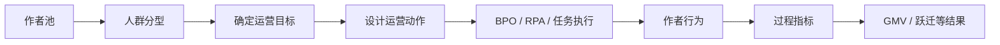
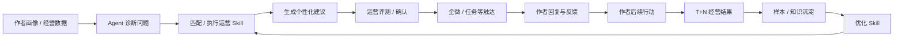

# 转正答辩问题与回答总汇

> 整理日期：2026 年 10 月 7 日。
> 范围：仅合并 9 份明确的问答文档。共归并 473 条原题记录，整理为 149 道题。
> 阅读顺序：先看“一句话结论”，再沿“回答路径”展开；具体案例、实现取舍和追问保留在标准回答及补充细节中。

同义问题归入同一题，原样嵌套的业务题库只保留一份内容。不同场景、独有追问和回答雷区保留，来源保留为历史文件名与原文行号。已合并的 9 份问答原文件于 2026 年 10 月 7 日按要求删除；以本总汇作为统一问答入口。

答案中的“当前”“已经”“未来”沿用原稿记录阶段，不能直接视为 2026 年 10 月 7 日重新核验的项目状态。成果数字和已实现能力有口径差异时，见题内说明与文末“口径待核对”。

## 目录


- [一、业务理解与运营 Agent（63 题）](#section-1)

- [二、头达数据分级管控（23 题）](#section-2)

- [三、AI Coding 与研发工作流（26 题）](#section-3)

- [四、Agent 架构与工程化（24 题）](#section-4)

- [五、综合工程能力与个人成长（13 题）](#section-5)

- [来源与合并说明](#sources)
- [口径待核对](#pending)

<a id="section-1"></a>

## 一、业务理解与运营 Agent

- [Q001：你如何理解当前团队的业务定位和未来方向？](#q001)
- [Q002：运营平台在联盟业务中扮演什么角色？](#q002)
- [Q003：什么是运营？](#q003)
- [Q004：什么是产品？](#q004)
- [Q005：产品和运营有什么区别？](#q005)
- [Q006：你如何理解作者运营和内容运营？](#q006)
- [Q007：什么是作者运营，它主要包含哪些业务？](#q007)
- [Q008：达人库的作用是什么？](#q008)
- [Q009：达人为什么需要在不同运营团队之间流转？](#q009)
- [Q010：作者和达人的区别是什么？](#q010)
- [Q011：什么是 KA 作者，和规模化作者有什么区别？](#q011)
- [Q012：什么是作者的 S 等级？](#q012)
- [Q013：作者运营的核心指标有哪些，覆盖上升却没有成长时如何定位？](#q013)
- [Q014：什么叫商达撮合？](#q014)
- [Q015：什么叫动销？](#q015)
- [Q016：什么是内容运营，它主要包含哪些业务？](#q016)
- [Q017：内容运营的核心指标有哪些？](#q017)
- [Q018：什么是内容活动？](#q018)
- [Q019：内容活动的完整流程是什么？](#q019)
- [Q020：什么是 DOU+，为什么内容活动会使用它？](#q020)
- [Q021：什么是规模化运营，为什么需要它，现有模式有哪些局限？](#q021)
- [Q022：规模化运营具体如何开展，当前有哪些核心模块？](#q022)
- [Q023：什么是 BPO？](#q023)
- [Q024：什么是 RPA？](#q024)
- [Q025：BPO、RPA 和 Agent 有什么区别？](#q025)
- [Q026：运营 Agent 解决什么业务问题，如何处理规模化和个性化之间的矛盾？](#q026)
- [Q027：运营 Agent 与运营平台、BPO 和 RPA 是什么关系，为什么不能只做聊天机器人？](#q027)
- [Q028：运营 Agent 的完整业务闭环是什么？](#q028)
- [Q029：运营 Agent 落地的前提是什么？](#q029)
- [Q030：为什么运营 Agent 在生成策略前必须先做诊断？](#q030)
- [Q031：运营 Agent 为什么要使用 Skill？](#q031)
- [Q032：为什么不同运营需要专属 Skill，并由运营自己调整？](#q032)
- [Q033：运营人员如何修改 Skill？](#q033)
- [Q034：什么是 AIME，它在运营 Agent 中承担什么角色？](#q034)
- [Q035：什么是 skillEvaluator？](#q035)
- [Q036：运营 Agent 中的人群绑定是什么？](#q036)
- [Q037：UID 和人群包分别是什么？](#q037)
- [Q038：运营 Agent 如何实现个性化触达？](#q038)
- [Q039：运营 Agent 的 1v1 和批量场景有什么区别？](#q039)
- [Q040：为什么要回收达人回复？](#q040)
- [Q041：什么是 badcase？](#q041)
- [Q042：运营 Agent 为什么要进行效果回收？](#q042)
- [Q043：T+1、T+7 和 T+30 分别表示什么？](#q043)
- [Q044：为什么要单独沉淀运营经验，如何避免只复用历史话术和无效策略？](#q044)
- [Q045：知识库和样本库分别解决什么问题？](#q045)
- [Q046：如何证明某个运营策略真的有效，而不是巧合？](#q046)
- [Q047：如何评价运营 Agent 的实际业务价值，为什么不能只看模型效果和回复率？](#q047)
- [Q048：运营 Agent 的第一个落地场景应该如何选择？](#q048)
- [Q049：为什么第一期不能直接让运营 Agent 自动批量发送？](#q049)
- [Q050：如何验证和发布运营 Agent 新版本，避免直接影响线上作者？](#q050)
- [Q051：运营 Agent 为什么分阶段建设，各阶段分别解决什么问题？](#q051)
- [Q052：现阶段的运营 Agent 已经能自动经营作者了吗？](#q052)
- [Q053：长期运营和 Agent 的职责如何划分？](#q053)
- [Q054：运营 Agent 和“小应”是什么关系？](#q054)
- [Q055：新增“风险识别”或“策略审核”能力时，Agent 架构如何扩展？](#q055)
- [Q056：除了规模化运营，还有哪些方向可以接入 Agent？](#q056)
- [Q057：内容运营最值得优先接入 Agent 的场景是什么？](#q057)
- [Q058：如何判断一个现有业务是否适合升级为 Agent？](#q058)
- [Q059：运营 Agent 解决什么业务问题，它和 AI Coding 工作流是什么关系？](#q059)
- [Q060：什么是 GMV？](#q060)
- [Q061：PV、VV 和 Load 分别表示什么？](#q061)
- [Q062：什么是 UGC？](#q062)
- [Q063：什么是 POC？](#q063)

<a id="q001"></a>

### Q001：你如何理解当前团队的业务定位和未来方向？

**一句话结论：** 团队的基本盘是建设作者运营和内容运营平台，提升运营效率并帮助达人成长；未来是在现有平台能力上引入 Agent，补足规模化运营中的个性化分析和判断。

**回答路径：**

1. **电商联盟平台的本质**  
   本质是连接商家和达人的撮合平台：商家提供商品和佣金计划，达人通过短视频、直播等方式帮助商家带货并赚取佣金，联盟负责连接双方并管理整个生态。

2. **联盟平台的六个业务方向**  
   达人、商家、撮合、内容、基建与生态、运营平台。

3. **当前团队的核心职责**  
   围绕运营平台进行建设，重点支撑作者运营和内容运营，提高运营效率，并进一步帮助达人成长、实现等级跃迁。

4. **团队未来的业务发展方向**  
   运营平台逐渐从传统工具平台向 **Agent 辅助运营** 演进，引入 Agent 能力帮助运营提效，并解决规模化运营、个性化诊断等真实业务痛点。

**标准回答：**

如果让我介绍当前团队的业务方向，我会先从整个电商联盟平台的业务定位开始。

**我理解电商联盟平台的本质是一个连接商家和达人的撮合平台。**

商家把商品和佣金计划放到联盟中，达人通过短视频、直播等方式帮助商家销售商品并赚取佣金，联盟平台负责连接商家和达人，并围绕双方的经营、撮合、内容以及整个交易生态提供相应的产品能力。

从目前整个联盟的业务划分来看，主要有 **六个方向：达人、商家、撮合、内容、基建与生态、运营平台**。

**第一个是达人方向。**  
核心是帮助达人提升经营能力和经营表现。平台一方面给达人提供直播、短视频、图文、橱窗等经营工具，另一方面通过成长体系、等级和任务机制牵引达人持续成长，最终希望增加优质达人规模，提高达人的经营活跃度和交易表现。

**第二个是商家方向。**  
核心是提高商家在联盟中的经营效率和经营体验。要让更多商家愿意把商品放到联盟中，设置合理的佣金和推广计划，同时帮助商家找到合适的达人完成带货，最终提高商品通过联盟渠道产生的交易金额。

**第三个是撮合方向。**  
核心是提高商家和达人之间的匹配效率。一方面帮助达人从大量商品中找到适合自己的商品，另一方面帮助商家找到合适的达人，也可以通过平台派单等方式主动完成商达匹配。最终关注的是双方能不能更高效地建立合作并产生交易。

**第四个是内容方向。**  
因为达人主要通过短视频和直播完成带货，所以内容本身也是联盟非常重要的一部分。这个方向既要通过创作工具、内容标准和激励机制帮助达人生产更多优质内容，也需要治理低质和违规内容，保证整个电商内容生态健康，最终提高内容的交易转化能力。

**第五个是基建与生态方向。**  
它解决的是整个联盟交易能不能安全、可信、稳定运行的问题，包括账号和资质、佣金结算、营销能力、治理处罚以及风险管控等。这些能力是整个商达交易和业务增长的底层保障。

**第六个就是运营平台。**  
运营平台主要面向内部运营人员，通过作者运营、内容运营、策略运营以及 AI 相关能力，把原来大量依赖人工、Excel 或线下方式完成的运营工作搬到系统中，帮助运营实现线上化和规模化，提高运营效率。

在这六个方向里面，**我们当前团队的核心职责就是围绕运营平台进行建设，重点支撑作者运营和内容运营。**

作者运营主要帮助运营完成从达人分析诊断、制定策略、触达到后续持续跟进的运营闭环；内容运营则围绕内容标准、内容激励、治理和诊断等能力展开。

所以虽然我们直接建设的是一个内部运营平台，但最终目标不是单纯建设更多后台功能，而是 **提高运营人员的工作效率和服务达人规模，并进一步帮助达人改善经营表现、实现成长和等级跃迁。**

在这个基础上，**我理解目前团队未来比较重要的业务发展趋势，是运营平台开始从传统的工具平台向 Agent 辅助运营方向演进。**

过去传统运营平台更多是给运营提供工具，由运营自己完成数据查询、分析判断、策略配置和操作执行。引入 Agent 之后，希望让 Agent 进一步参与一些原本比较依赖人工的工作，比如读取达人数据、辅助诊断问题、生成运营建议，甚至帮助完成后续部分运营动作。

这里并不是为了使用 Agent 而使用 Agent，最终还是围绕两个业务目标：**一是提高运营效率，二是解决现有运营模式中真实存在的业务痛点。**

例如当前规模化运营已经能够通过人群、任务、BPO、RPA 等方式覆盖大量达人，但依然很难像精细化运营一样，对每一个达人分别分析问题并给出个性化建议。Agent 的价值就是在现有运营平台能力基础上，进一步补充这种大规模场景下的分析和判断能力。

因此，我对当前团队业务方向的理解是：

> **基本盘仍然是持续建设运营平台，重点支撑作者运营和内容运营，提高运营效率并帮助达人成长；未来则是在现有运营平台基础上逐步引入 Agent 辅助运营，通过 Agent 进一步提升运营效率，并解决规模化运营中的个性化诊断等业务问题。**

**补充细节与场景：**

**你如何理解当前团队的业务定位和未来方向？ #**

*补充来源：`答辩问题与收敛回答.md:471`*

- 团队当前的业务定位是建设运营平台，服务作者运营和内容运营，把运营工作线上化、规模化。
- 平台通过达人库、任务触达、线上拜访等能力帮助运营管理作者并执行策略。
- 业务目标是帮助作者成长和等级跃迁，增加优质作者数量，进而改善联盟交易表现和生态健康。
- 未来不是替换运营平台，而是在平台的复杂判断节点接入 Agent，从 **工具提效** 进一步走向智能辅助运营。

**高频关键词：**

电商联盟、商达撮合、六个方向、运营平台、作者运营、内容运营、Agent 辅助运营。

**易追问：**

- 六个业务方向分别怎样贡献联盟增长？
- 为什么运营平台可以单独成为一个业务方向？
- Agent 对传统运营平台的增量价值是什么？

**回答雷区：**

- 只讲技术平台，不讲商家、达人和交易生态。
- 把团队目标说成建设更多后台功能。
- 把未来方向表述成 Agent 替代运营人员或运营平台。

**来源：** `答辩问题与收敛回答.md:471`；`答辩问题记录.md:4497`；`头达数据分级管控_答辩问题整理.md:1824`；`业务发展_答辩问题记录.md:3`；`面试回答要点映射.md:1545`

<a id="q002"></a>

### Q002：运营平台在联盟业务中扮演什么角色？

**一句话结论：** 运营平台负责把运营方法变成可线上执行、可复用、可规模化的系统能力；Agent 会在平台已有数据和执行能力上补充复杂分析与个性化判断。

**题目背景：**

整个联盟有达人、商家、撮合、内容、基建与生态、运营平台六个业务方向。

请站在整个联盟业务视角说明：

1. 运营平台在六个业务方向中的核心定位是什么？
2. 它为什么需要作为一个独立的业务方向存在？
3. 它如何支撑作者运营和内容运营真正在线上完成业务工作？
4. 应该通过哪些指标衡量运营平台是否真正产生价值？
5. 未来引入 Agent 之后，你认为运营平台的角色会发生什么变化？

**回答路径：**

1. **运营平台的核心定位**
   - 面向内部运营人员，把作者运营、内容运营等业务工作线上化、标准化和规模化，提高运营效率。

2. **运营平台如何承载业务执行**
   - 作者运营可以通过达人库、诊断、作者任务、RPA 触达、达人拜访和后续跟进形成线上闭环。
   - 内容运营可以通过内容活动、内容筛选、优质内容评选、热点、发奖和数据复盘完成线上化运营。

3. **运营平台为什么是独立业务方向**
   - 它解决的不是某一个具体达人或某一条内容的问题，而是让大量运营工作能够稳定、标准、高效地在线上执行和复用。

4. **运营平台的价值指标**
   - 线上化率、工具使用率、触达率、数据覆盖率、单运营管理达人数等。
   - 最终再作用到有效运营作者数、达人跃迁、优质内容数量和交易表现等业务结果。

5. **未来向 Agent 辅助运营演进**
   - 传统模式是“平台提供工具，运营自己分析、判断和操作”。
   - 未来在现有数据、人群、任务、触达等平台能力基础上，引入 Agent 辅助完成复杂分析、个性化诊断和运营建议，进一步提升运营效率。

**标准回答：**

我理解运营平台在联盟六个业务方向里面，核心定位是：

> **把作者运营、内容运营等业务方向里的运营工作线上化、标准化和规模化，帮助运营人员提高工作效率。**

作者、内容等方向解决的是具体业务问题。

比如作者运营关注怎么帮助达人改善经营状态、实现成长跃迁；内容运营关注怎么增加优质内容供给、提高内容质量和交易效率。

而运营平台解决的是：

> **这些运营方法如何真正通过系统被执行起来。**

所以它虽然面向内部运营，但并不是一个单纯的后台工具集合，而是承载运营业务执行的线上化平台。

比如在作者运营里，一条完整链路可以从达人库开始。

运营先在达人库里查看和筛选达人，通过达人详情和直播诊断分析他的经营状态；诊断完成以后，可以通过作者任务配置经营任务和奖励，也可以针对 KA 和高潜达人安排线下拜访；需要规模化触达时，可以通过 RPA 批量发送消息。触达以后，再通过作者任务、达人详情和拜访待办持续查看任务完成情况和经营数据变化，判断达人有没有改善并进入下一轮运营。

所以运营平台实际上把原来：

> **看数据 → 做诊断 → 制定策略 → 触达 → 跟进**

这些依赖人工和多个线下工具完成的工作逐渐搬到了同一个线上系统里。

内容运营也是类似。

运营可以在平台里配置内容活动和激励规则，通过视频、直播和图文管理筛选内容，通过好内容、好作者评选沉淀优质样本，再通过热点、推荐等方式放大优质内容，最后完成奖励结算，并通过内容播放、质量、成交和转化数据做复盘，再反哺下一轮策略。

所以我理解运营平台之所以能够单独作为一个业务方向，是因为它解决的并不是某一个具体作者或者某一条内容的问题，而是：

> **怎么让大量运营工作能够以更稳定、更标准、更高效的方式在线上执行和复用。**

衡量运营平台有没有价值，也不能只看上线了多少功能。

首先可以看**线上化率**，也就是原来多少依赖 Excel、微信群和人工处理的运营工作已经迁移到系统。

其次看**工具使用率**，平台上线之后运营是否真的愿意使用。

再往下可以看**触达率、数据覆盖率和单个运营可以管理的达人数量**，这些指标能够比较直接地反映平台有没有提高运营效率和规模化服务能力。

最后这些平台能力才会进一步作用到作者运营和内容运营的业务结果，比如有效运营作者数、达人跃迁、优质内容数量和最终交易表现。

未来引入 Agent 以后，我认为运营平台的角色还会继续演进。

传统运营平台主要是：

> **平台提供工具，运营自己分析、判断和操作。**

未来可能逐渐变成：

> **平台继续提供数据、人群、任务、触达等稳定能力，同时 Agent 调用这些能力，帮助运营完成一部分原来依赖人工的分析和判断。**

例如现有 RPA 已经可以解决批量发消息的问题，但一批“最近没有开播”的达人背后原因可能不同。Agent 可以进一步读取每个达人的经营数据，判断他到底是选品、内容、流量还是经营意愿存在问题，为不同达人生成不同的运营建议，然后再调用现有任务和触达能力完成执行。

因此，我理解未来并不是“Agent 替代运营平台”，而是：

> **运营平台从给人使用的工具平台，进一步演进成既服务运营人员、又能够为 Agent 提供业务能力的运营基础设施；Agent 重点补充复杂判断和个性化决策，原来的平台能力继续负责稳定、确定性的业务执行。**

**补充细节与场景：**

**运营平台在联盟业务中扮演什么角色？#**

*补充来源：`答辩问题与收敛回答.md:485`*

- 联盟连接商家和达人，业务涉及作者、商家、撮合、内容、基础设施和运营平台等方向。
- 运营平台不是独立业务终点，而是为作者运营、内容运营等具体业务提供数据、任务、触达和管理工具。
- 平台把运营动作线上化、规模化，Agent 再调用这些能力处理诊断、策略生成等复杂任务。
- 演进方向是 **平台提供数据与执行，Agent 提供理解与决策**。

**高频关键词：**

线上化、标准化、规模化、运营闭环、平台指标、稳定执行、Agent 判断。

**易追问：**

- 运营平台为什么不是普通后台工具集合？
- 平台指标和最终业务指标如何建立因果链？
- Agent 接入后哪些能力仍应由传统系统负责？

**回答雷区：**

- 用上线功能数量衡量平台价值。
- 只讲内部提效，不说明对达人和内容业务的最终影响。
- 认为 Agent 会重新实现人群、任务和触达系统。

**来源：** `答辩问题与收敛回答.md:485`；`答辩问题记录.md:4673`；`头达数据分级管控_答辩问题整理.md:2000`；`业务发展_答辩问题记录.md:179`；`面试回答要点映射.md:1613`；`陈相实习生转正答辩手册.md:331`

<a id="q003"></a>

### Q003：什么是运营？

**一句话结论：** 运营围绕业务目标持续分析、制定策略、推动执行，并根据实际结果调整下一轮动作。

**标准回答：**

运营可以理解为：**围绕一个明确的业务目标，持续分析现状、选择目标对象、设计策略、推动执行，再根据结果调整下一轮动作。**

它不是简单地“发消息”“做活动”或者“看数据”，这些都只是运营动作。完整的运营过程通常是：

```text
明确目标
→ 找到目标人群 / 内容
→ 判断当前问题
→ 设计运营策略
→ 推动执行
→ 看过程数据和结果
→ 调整下一轮策略
```

例如，目标是“让一批近 7 天没有开播、但过去有成交的作者重新经营”，运营需要先找到这批人，再判断他们为什么不播，然后选择开播激励、货品推荐、经营建议等不同策略，最后观察作者有没有重新开播、有没有成交。

所以一句话概括：

> **运营负责让业务目标真正发生，通过持续的策略和执行改变用户、作者或内容的行为。**

**来源：** `电商运营业务与运营Agent答辩问答手册.md:36`

<a id="q004"></a>

### Q004：什么是产品？

**一句话结论：** 产品把业务中的问题和流程抽象成稳定、可重复使用的系统能力。

**标准回答：**

产品主要负责：**把业务中的问题和流程抽象成稳定、可重复使用的系统能力。**

例如，运营过去通过表格记录“哪些达人由谁负责”，产品发现这个动作长期存在，而且涉及大量人和团队，就可以建设“达人库”，把达人归属、认领、协作和流转做成线上能力。

因此，产品更关注：

- 用户是谁；
- 用户有什么问题；
- 哪些流程值得系统化；
- 系统应该提供什么功能；
- 规则、交互和数据如何组织；
- 功能上线后是否真正解决问题。

一句话概括：

> **运营更多是在使用策略推动业务结果，产品更多是在建设工具和机制，让这些业务动作能够更高效、稳定地执行。**

**来源：** `电商运营业务与运营Agent答辩问答手册.md:62`

<a id="q005"></a>

### Q005：产品和运营有什么区别？

**一句话结论：** 产品和运营可以共同服务业务增长，但运营主要制定和执行增长策略，产品把需要系统承接的部分转化为稳定、可持续的产品能力。

**回答路径：**

1. **目标可以一致**：例如都服务 GMV 增长。
2. **产品手段**：通过产品功能、流程和用户体验设计解决问题。
3. **运营手段**：通过内容、活动、用户运营、策略等方式推动业务增长。
4. **协作关系**：运营提出业务策略，产品把需要系统能力承接的部分设计成可执行产品方案。

**标准回答：**

我理解产品和运营很多时候目标是一致的，比如在电商业务中都可能希望提升 GMV，但两者实现目标的手段不同。

产品主要通过产品功能来实现目标。一个产品功能从设计到上线，需要考虑用户体验、业务流程和技术落地可行性，并经过设计、研发、测试和发布。

运营实现目标的手段更加丰富，比如内容运营通过内容影响用户决策，活动运营通过活动促进购买，用户运营通过拉新、召回和留存扩大用户生命周期价值。

所以虽然目标可能一样，但产品更多是通过“产品能力”解决问题，运营则更多通过“运营策略和动作”推动业务增长。

但两者也需要紧密协作，因为很多运营方案最终需要产品能力承接。

比如运营希望通过优惠券拉新，就不仅是提出“发优惠券”，还需要进一步设计用户在哪里看到优惠券、怎么领取、怎么使用、怎么核销。这些具体的系统能力就需要产品和研发共同落地。

所以可以理解为：

> **运营更多决定“用什么策略推动业务”，产品负责把需要系统承接的策略转化成可落地、可持续的产品能力。**

**补充细节与场景：**

**产品和运营到底有什么区别？**

*补充来源：`实习生转正答辩-QA (copy).md:100`*

首先，产品和运营的目标通常是一致的。比如在电商业务中，产品和运营可能都希望提升整个电商平台的 GMV。

但是，两者最大的区别在于实现目标的手段不同：

1. **产品的手段**

产品主要依靠产品功能实现目标。设计一个产品功能时，需要考虑用户体验和方案落地的可行性，并与研发沟通，经过完整的设计、开发、测试和发布流程后才能上线。

2. **运营的手段**

运营实现目标的手段更加丰富：

- **内容运营**：通过内容吸引用户、影响用户的消费决策。
   - **活动运营**：例如策划双十一活动，吸引消费者购买。
   - **用户运营**：通过拉新、召回流失用户等方式扩大用户规模，并延长用户的生命周期。

这些手段都可以促进业务增长。因此，虽然产品和运营的目标可能相同，但实现目标的方式并不一样。

不过，产品和运营之间也存在紧密的协作关系，因为部分运营方案需要产品能力配合才能真正落地。比如，运营希望通过发放优惠券吸引新用户，就需要进一步考虑优惠券应该如何设计。

对应的业务流程和产品设计包括：

1. 用户从哪里看到并点击优惠券；
2. 用户应该如何使用和核销优惠券。

这些具体的功能和操作流程，需要由产品完成方案设计，并配合研发实现，最终帮助运营方案落地。

**运营和产品最核心的区别是什么？**

*补充来源：`电商运营业务与运营Agent答辩问答手册.md:85`*

可以从“策略”和“能力”两个角度理解：

| 对比项 | 运营 | 产品 |
| --- | --- | --- |
| 主要关注 | 怎么把业务目标做出来 | 怎么把业务问题做成系统能力 |
| 常见工作 | 分人群、定策略、做活动、触达、复盘 | 设计功能、流程、规则、权限、数据能力 |
| 典型产出 | 运营方案、人群策略、活动、执行结果 | PRD、产品功能、平台能力 |
| 时间尺度 | 可能随业务目标不断变化 | 更强调长期、稳定、可复用 |
| 例子 | 选择一批 S2 作者做开播召回 | 建设人群管理、BPO 任务、RPA 触达系统 |

但是二者不是割裂的。

例如规模化运营中：

```text
运营：
定义“什么作者需要被运营、应该做什么”

产品：
把“人群管理、任务分配、批量触达、效果回收”做成平台能力
```

所以答辩中可以说：

> **运营负责定义“做什么、为什么做”，产品负责把高频、稳定的运营方式沉淀成“怎么高效地做”。**

**产品和运营有什么区别？**

*补充来源：`答辩问题与收敛回答.md:627`*

- 产品主要通过系统功能解决问题，需要把业务目标转成可持续的产品流程和能力。
- 运营通过内容、活动、用户触达和策略动作推动业务指标。
- 两者目标可能一致，但手段不同；运营提出策略后，涉及系统承接的部分仍需要产品和研发落地。
- 可以概括为：**运营决定用什么策略推动业务，产品把策略转成可复用的系统能力**。

**高频关键词：**

产品能力、运营策略、业务增长、用户体验、系统承接、协作落地。

**易追问：**

- 运营策略什么时候值得产品化？
- 产品和运营意见冲突时怎样决策？
- 怎样判断一个运营功能上线后是否有效？

**回答雷区：**

- 把产品理解成写需求、运营理解成做活动。
- 认为产品和运营目标天然不同。
- 只讲分工，不说明策略如何转化为系统能力。

**来源：** `答辩问题与收敛回答.md:627`；`答辩问题记录.md:6241`；`头达数据分级管控_答辩问题整理.md:3568`；`业务发展_答辩问题记录.md:1747`；`面试回答要点映射.md:2266`；`实习生转正答辩-QA (copy).md:100`；`电商运营业务与运营Agent答辩问答手册.md:85`；`陈相实习生转正答辩手册.md:338`

<a id="q006"></a>

### Q006：你如何理解作者运营和内容运营？

**一句话结论：** 作者运营解决“达人应该怎样经营”，内容运营解决“达人怎样生产更好的内容”，两者分别提升经营能力和内容能力，最终共同服务达人成长、生态健康和交易结果。

**回答路径：**

1. **作者运营：围绕达人经营和成长**
   - 服务联盟达人，通过“经营数据分析 → 问题诊断 → 制定策略 → 触达达人 → 持续跟进”帮助达人改善经营表现、实现成长和等级跃迁。
   - 根据达人规模和价值，可分为精细化运营和规模化运营。

2. **精细化运营和规模化运营的区别**
   - 精细化运营：主要面向头部、高潜或 KA 达人，一对一深度诊断、拜访和持续跟进。
   - 规模化运营：主要面向中腰部和长尾达人，通过人群圈选、任务、BPO、RPA 等方式扩大运营覆盖；当前主要采用相对标准化的运营策略，未来 Agent 希望进一步补充个性化诊断能力。

3. **内容运营：围绕内容生态和内容质量**
   - 主要包括“定标准 → 做激励 → 抓治理 → 帮诊断”四个方向。
   - 核心目标是增加优质内容供给、保证内容生态健康，并提升内容分发和交易转化能力。

4. **作者运营和内容运营的关系**
   - 作者运营关注“这个达人应该怎么经营”，内容运营关注“这个达人应该怎样生产更好的内容”。
   - 两者分别从经营能力和内容能力帮助达人改善经营状态，最终共同服务于达人成长和等级跃迁，并进一步贡献交易结果。

**标准回答：**

作者运营和内容运营是我们当前团队重点支撑的两个业务方向，但它们解决的问题不同。

**首先是作者运营。**

作者运营服务的核心对象是联盟里的达人，也就是通过帮助商家推广商品来赚取佣金的这部分达人。

作者运营的核心目标，是通过运营手段帮助达人改善经营状态，提高经营活跃度和交易表现，并进一步帮助达人实现成长和等级跃迁。

它比较完整的一条工作链路是：

> **经营数据分析 → 问题诊断 → 制定运营策略 → 触达达人 → 持续跟进 → 查看经营结果。**

比如运营先看一个达人近期的开播、投稿、流量、成交、选品等经营数据，判断当前主要问题是什么，再给出对应的运营建议。建议触达之后，还需要继续跟踪达人有没有采纳、有没有产生对应的经营动作，以及后续经营数据有没有改善。

根据达人规模和价值不同，作者运营又可以分成**精细化运营和规模化运营**。

精细化运营主要面向头部、高潜或者 KA 达人。因为这类达人数量相对少、价值高，所以运营可以投入更多人工，通过一对一沟通、线下拜访和持续跟进，为达人制定更加个性化的成长方案。

规模化运营主要面向数量更大的中腰部和长尾达人。对于这类达人，不可能完全依赖人工逐个分析和服务，所以通常会先按照达人等级、经营状态或者某类业务问题圈选人群，再针对这一类人制定相对标准化的运营策略，通过任务、BPO、RPA 等方式扩大触达和服务范围。

它解决的核心问题是：

> **在有限运营人力下，怎么样有效服务更多达人。**

但当前这种模式也存在一个问题，就是虽然人群特征相似，但具体到每一个达人，背后的问题原因仍然可能不同，所以这也是未来运营 Agent 希望进一步解决的个性化诊断问题。

**第二个是内容运营。**

我理解内容运营核心服务的是整个电商内容生态。

因为达人最终主要通过短视频和直播完成带货，所以除了达人本身的经营能力之外，内容质量也会直接影响流量、用户体验和最终交易结果。

内容运营主要可以分成四件事。

**第一是定标准。**  
明确什么样的内容是平台鼓励的优质内容，通过多个维度建立内容标准，让达人知道什么样的内容值得生产，同时也为后续内容评价和激励提供依据。

**第二是做激励。**  
对于符合优质标准的内容，通过流量扶持、活动奖励或者其他权益激励，让达人生产优质内容能够获得正向反馈，从而持续扩大优质内容供给。

**第三是抓治理。**  
对于低质、违规、虚假宣传或者内容与商品不匹配等问题，需要通过治理手段进行识别和处置，防止劣质内容影响用户体验和整个内容生态。

**第四是帮诊断。**  
对于内容质量较差或者经营效果不好的达人，可以进一步告诉他内容具体存在什么问题、应该怎么改，并通过创意、脚本、素材等工具降低他的创作门槛。

所以内容运营最终关注的是：

> **优质内容能不能持续增加、优质内容能不能得到更多有效分发，以及这些内容最终能不能产生更好的交易结果。**

从指标上看，也可以按照**内容质量 → 内容分发 → 内容转化**这三层去理解。

**作者运营和内容运营虽然解决的问题不同，但两者不是割裂的。**

作者运营更关注的是：

> **这个达人当前经营得怎么样，他下一步应该怎么经营。**

内容运营更关注的是：

> **这个达人生产的内容质量怎么样，他应该怎样生产更好的内容。**

但达人最终很多经营行为都是通过直播和短视频体现出来的，所以内容表现本身也是判断达人经营状态的重要依据。

比如一个达人虽然每天正常开播和投稿，但是优质内容占比很低、内容转化也比较差，这个时候不能简单判断成“达人不活跃”。

从作者运营角度，需要先判断这个达人整体经营状态和问题到底在哪里，是选品、流量、内容还是转化出现问题，再决定应该给什么经营策略。

如果进一步发现核心问题确实在内容质量，那么内容运营就需要介入，分析内容为什么不优质，是表达方式、商品呈现、内容结构还是其他原因，再通过内容标准、诊断建议或者创作工具帮助达人改善。

所以两者形成的是：

> **作者运营发现和解决达人整体经营问题，内容运营解决其中与内容生产和内容质量有关的问题。**

最终在我们团队层面，两条业务会汇聚到同一个目标：

> **通过提升达人的经营能力和内容能力，帮助达人持续改善经营表现、实现成长和等级跃迁，并进一步为联盟交易增长和内容生态健康贡献价值。**

**补充细节与场景：**

**你如何理解作者运营和内容运营？#**

*补充来源：`答辩问题与收敛回答.md:478`*

- 作者运营围绕作者经营数据开展诊断、策略制定、触达和效果追踪，目标是提升活跃度、交易表现和等级跃迁。
- S0—S3 等长尾作者更适合规模化运营，通过圈选、批量诊断和系统触达覆盖；KA 或 S4+ 作者更偏向一对一的精细化运营。
- 内容运营负责维护内容生态，主要包括制定优质内容标准、治理违规和低质内容、给予优质内容激励、向作者反馈诊断和改进建议。
- 两者最终都服务于 **优质作者增长、内容供给改善和联盟交易增长**，因此都是团队重点支撑方向。

**高频关键词：**

作者运营、内容运营、精细化运营、规模化运营、内容标准、经营诊断、等级跃迁。

**易追问：**

- 精细化运营和规模化运营的适用对象有什么不同？
- 如何判断达人问题来自内容而不是选品或流量？
- 两类运营分别看哪些指标？

**回答雷区：**

- 把作者运营简化成发消息，把内容运营简化成审核内容。
- 认为正常开播投稿就代表达人经营没有问题。
- 把两条业务讲成互不关联的独立链路。

**来源：** `答辩问题与收敛回答.md:478`；`答辩问题记录.md:4565`；`头达数据分级管控_答辩问题整理.md:1892`；`业务发展_答辩问题记录.md:71`；`面试回答要点映射.md:1578`

<a id="q007"></a>

### Q007：什么是作者运营，它主要包含哪些业务？

**一句话结论：** 作者运营通过管理、触达、任务、撮合和诊断，推动作者持续经营、改善交易表现并实现成长。

**回答路径：**

1. **运营对象**：联盟作者，也就是通过电商内容帮助商家带货赚取佣金的作者。
2. **核心动作**：读取经营数据、分析问题、给出个性化诊断和运营建议。
3. **持续跟进**：观察作者是否开播、投稿、成交以及经营数据是否改善。
4. **最终目标**：帮助作者成长、提升经营表现并实现等级跃迁，扩大优质作者规模。

**标准回答：**

作者运营围绕电商作者，特指联盟作者的日常经营展开。

运营首先会通过作者的经营数据了解他当前的经营状态，比如开播、投稿、成交、选品等情况，然后分析作者目前存在的问题，并给出一些个性化的诊断意见，比如流量扶持、商品选品、经营方向调整等，帮助作者提升经营活跃度和交易表现。

但作者运营并不是把建议发出去就结束了，还需要持续跟踪作者后续有没有采取行动，比如有没有重新开播、投稿、调整选品，以及这些动作之后经营数据有没有改善。

所以作者运营最终关注的是：这些运营策略是否真正帮助作者成长，是否能够推动作者实现等级跃迁，并逐步成为高质量、优质的联盟作者。

**补充细节与场景：**

**什么是作者运营？**

*补充来源：`实习生转正答辩-QA (copy).md:3`*

作者运营围绕电商作者，特指联盟作者的日常经营展开。运营通过对作者的经营数据进行分析，然后给出一些个性化的诊断意见，比如流量扶持、商品选品，来帮助作者提升他们的经营活跃度和交易表现。通过后续的持续追踪，判断并分析这些运营策略是否能够帮助作者进行成长和等级跃迁，成为高质量的优质作者。

**什么是作者运营？**

*补充来源：`电商运营业务与运营Agent答辩问答手册.md:119`*

作者运营主要围绕电商作者的经营周期开展，通过**建联触达、任务牵引、货品撮合、咨询服务等运营动作**，推动作者持续产生有效经营行为，提升内容供给、流量转化和交易贡献。

可以把作者经营简单拆成几个关键动作：

```text
进入电商
→ 开始经营
→ 开播 / 投稿
→ 选择合适商品
→ 获得流量
→ 产生成交
→ 持续经营并成长
```

作者运营要做的，就是在作者经营过程中发现卡点并提供对应帮助。

- 新作者开通电商权限后一直没有成交，可以通过任务或选品帮助其完成第一次动销；
- 一个历史成交不错的作者最近没有开播，需要判断是经营意愿下降、没有合适货品，还是其他原因；
- 一个作者有流量但成交较差，可以进一步分析选品、转化等问题。

因此，作者运营不等于“联系作者”。

> **作者运营是找到合适的作者，判断其经营问题，提供对应运营动作，并持续观察作者有没有经营和成长。**

**资料依据：**《规模化运营 onepage》《实习生转正答辩》。

**作者运营主要有哪些业务内容？**

*补充来源：`电商运营业务与运营Agent答辩问答手册.md:153`*

从当前资料看，可以将作者运营理解为以下几类核心工作。

#### 1. 作者管理

先解决：

> 哪些作者属于哪个团队？由谁负责？

这部分包括达人归属、认领、协作、跨团队流转等，主要由达人库承载。

#### 2. 建联和触达

需要建立运营和作者之间的联系，例如企微建联，并通过消息、任务等方式把运营动作传递给作者。

#### 3. 任务牵引

根据作者当前阶段，让作者完成某个明确动作，例如：

- 参加活动；
- 开播；
- 投稿；
- 领取任务；
- 完成某个经营目标。

#### 4. 货品撮合

帮助作者找到更合适的商品、商家或货盘，提高“有商品可卖”和“商品适合作者”的概率。

#### 5. 经营诊断和成长

根据作者数据判断问题，例如：

```text
GMV下降
→ 是供给减少？
→ 还是流量下降？
→ 还是转化下降？
```

再匹配对应的运营方法。

#### 6. 咨询和服务

作者经营过程中还会产生规则、权限、商品、内容等问题，需要运营或服务团队承接。

因此可以用一句话总结作者运营：

> **先管理好作者关系，再围绕作者的经营问题，通过触达、任务、货品、咨询和诊断等方式推动作者持续经营和成长。**

**高频关键词：**

联盟达人、经营数据、问题诊断、运营建议、持续跟进、等级跃迁。

**易追问：**

- 作者运营与用户运营有什么区别？
- 一条完整作者运营链路包含哪些环节？
- 怎样判断一次触达是否真正有效？

**回答雷区：**

- 把作者运营定义成消息触达或任务下发。
- 建议发出后不追踪行动和结果。
- 只讲 GMV，不讲作者成长和长期经营。

**来源：** `答辩问题记录.md:6021`；`头达数据分级管控_答辩问题整理.md:3348`；`业务发展_答辩问题记录.md:1527`；`面试回答要点映射.md:2035`；`实习生转正答辩-QA (copy).md:3`；`电商运营业务与运营Agent答辩问答手册.md:119`；`电商运营业务与运营Agent答辩问答手册.md:153`

<a id="q008"></a>

### Q008：达人库的作用是什么？

**一句话结论：** 达人库统一管理达人信息和运营归属，为后续经营诊断、分层策略、责任人跟进和差异化运营提供基础。

**回答路径：**

1. **信息管理**：统一管理达人基本信息、经营数据、违规处罚、所属团队和赛道。
2. **运营关系管理**：明确达人由哪个团队、哪个运营人员负责。
3. **提供诊断基础**：后续运营策略需要结合达人经营情况和运营归属。
4. **支撑差异化运营**：规模化运营、KA 精细化运营对应的诊断和触达方式不同。

**标准回答：**

达人库的核心作用是管理达人的基本信息和运营关系，包括经营数据、违规处罚数据、所属团队和所属赛道等。

除了信息本身，更重要的是通过达人库建立运营归属关系，也就是明确每个达人属于哪个运营团队、由哪个运营人员负责跟进。这样后续做作者诊断时，运营就能知道这个达人当前是什么经营状态、属于什么类型，以及应该采用什么样的运营方式。

比如，一个达人属于规模化运营还是 KA 运营，对应的运营策略是不一样的。规模化运营可能通过 BPO、RPA、任务等方式批量触达；而 KA 运营则更偏向精细化运营，需要运营人员深入分析单个达人的问题，给出更有针对性的建议，并持续追踪后续结果。

所以达人库解决的核心问题，就是统一管理达人的信息和运营归属，为后续诊断、策略制定和运营执行提供基础。

**补充细节与场景：**

**达人库的作用是什么？**

*补充来源：`实习生转正答辩-QA (copy).md:9`*

达人库的核心作用是管理达人的基本信息和他们的运营关系，包括经营数据、违规处罚数据、所属团队和所属赛道。每个作者归属于哪个运营团队管理，由哪个运营人员跟进，通过达人库进行统一管理和建立归属关系，可以为后续运营对达人进行分析诊断提供信息基础。

比如，一个达人属于规模化运营还是KA运营，所对应的运营诊断和策略是不一样的。规模化运营可能通过BPO或RPA进行批量触达，而KA运营则需要精细化运营，通过运营对达人进行深入的诊断分析，然后给出更加具有个性化针对性的诊断意见，并进行后续的持续追踪。所以达人库解决的是达人的信息和运营归属问题。

**什么是达人库？**

*补充来源：`电商运营业务与运营Agent答辩问答手册.md:208`*

达人库是作者运营中**管理达人及其运营归属关系的核心工具**。

平台作者数量非常大，而且不同作者可能由不同团队负责。如果没有统一系统，很容易出现：

- 这个作者到底归哪个团队？
- 谁正在负责？
- 谁可以协作？
- 作者等级或赛道变化后该转给谁？
- 过去为什么发生过团队变化？

达人库就是为了解决这类问题。

它统一管理：

```text
达人
↕
运营人员
↕
运营团队
```

并通过规则和人工操作完成达人在不同运营团队之间的归属和流转。

一句话概括：

> **达人库首先解决的不是“怎么经营作者”，而是“作者归谁管、谁来服务、关系怎么流转”。**

**资料依据：**《电商内容生态达人库白皮书》。

**达人库具体包含哪些部分？**

*补充来源：`电商运营业务与运营Agent答辩问答手册.md:244`*

当前达人库主要可以分成三个层次。

#### 1. 电商达人库

用于查看**全量电商达人**。

可以查看达人信息、当前归属团队、历史流转等，是全局的达人查看入口。

#### 2. 团队达人库

面向 KA、规模化运营等团队。

团队管理员可以：

- 查看团队达人；
- 给运营分配达人；
- 认领达人；
- 在团队或赛道之间转移达人；
- 处理跨团队申请。

#### 3. 我的达人库

面向单个运营人员。

用于管理：

- 我认领的达人；
- 我的重点达人；
- 我协作的达人；
- 我查看或管理过的达人。

所以它们的关系可以理解为：

```text
电商达人库：平台视角看全部达人
        ↓
团队达人库：团队视角管理本团队达人
        ↓
我的达人库：运营个人管理自己负责的达人
```

**达人库的作用是什么？**

*补充来源：`答辩问题与收敛回答.md:608`*

- 达人库统一管理作者基本信息、经营数据、违规处罚、所属团队和赛道。
- 它建立达人与运营团队、负责人的归属关系，明确谁负责后续诊断和跟进。
- 运营根据达人类型选择规模化或精细化方式，因此达人库是 **诊断、策略制定和运营执行的数据基础**。

**高频关键词：**

达人库、信息管理、运营归属、经营诊断、达人分层、差异化运营。

**易追问：**

- 达人库需要沉淀哪些核心数据？
- 运营归属变更如何影响历史跟进记录？
- 达人库和人群圈选能力是什么关系？

**回答雷区：**

- 把达人库说成简单的查询列表。
- 只讲数据展示，不讲责任关系和后续运营执行。
- 所有达人使用同一套诊断和触达方式。

**来源：** `答辩问题与收敛回答.md:608`；`答辩问题记录.md:6046`；`头达数据分级管控_答辩问题整理.md:3373`；`业务发展_答辩问题记录.md:1552`；`面试回答要点映射.md:2068`；`实习生转正答辩-QA (copy).md:9`；`电商运营业务与运营Agent答辩问答手册.md:208`；`电商运营业务与运营Agent答辩问答手册.md:244`

<a id="q009"></a>

### Q009：达人为什么需要在不同运营团队之间流转？

**一句话结论：** 作者等级、身份、赛道和经营价值变化后，应调整运营归属，让作者进入适合其当前状态的服务体系。

**标准回答：**

因为作者不是固定不变的。

随着经营变化，作者的：

- 身份；
- S 等级；
- 所属赛道；
- 引入状态；
- 业务价值

都可能变化。

例如，一个原来由规模化团队服务的作者，成长为更高价值作者后，可能需要转入 KA 团队进行更精细的服务。

达人库通过规则判断作者变化，并支持自动或人工调整归属。

因此所谓“达人流转”，本质上是：

> **作者发生变化以后，让负责他的运营团队也跟着变化。**

这样才能保证作者一直进入合适的运营体系。

**来源：** `电商运营业务与运营Agent答辩问答手册.md:291`

<a id="q010"></a>

### Q010：作者和达人的区别是什么？

**一句话结论：** 作者是通过电商内容带货的更大范围概念，达人是其中能够帮助其他商家带货赚佣金的非商家型作者；联盟作者运营重点服务后者。

**回答路径：**

1. **作者范围更大**：通过电商内容实现带货的人，都可以理解为电商作者。
2. **达人是非商家型作者**：达人除了可能销售自己店铺商品，也可以帮助其他商家带货赚佣金。
3. **联盟作者/联盟达人**：重点指帮助其他商家带货赚取佣金的达人。
4. **联盟平台定位**：商家提供商品和佣金，达人选品并带货，平台负责撮合和结算。

**标准回答：**

我理解作者和达人最大的区别在于范围不同。

作者是一个更大的概念，指通过电商内容实现带货的人。按照经营方式，可以进一步分成商家型作者和达人型作者。

商家型作者主要销售自己授权店铺中的商品，而达人型作者除了可能给自己的店铺带货以外，还可以帮助其他商家销售商品并赚取佣金。

在联盟业务中，我们重点关注的是联盟达人，也可以理解为联盟作者，也就是帮助其他商家带货赚取佣金的这部分达人。如果只是销售自己店铺的商品，就不属于联盟作者运营的核心范围。

这和联盟平台本身的定位有关。联盟是连接商家和达人的撮合平台，商家把商品放到联盟里并设置佣金，达人从联盟中选品并通过短视频、直播等方式帮助商家销售，平台负责中间的撮合和结算。

所以作者运营最终重点服务的是联盟达人。

**补充细节与场景：**

**作者和达人的区别是什么？**

*补充来源：`实习生转正答辩-QA (copy).md:17`*

- 达人特指非商家作者，作者指的是通过电商内容实现带货的人，根据经营方式，作者可以分为商家型作者和达人型作者。
- 商家型作者是指专门销售自己授权店的商品，而达人型作者除了可能为自己的店带货以外，还帮助其他商家带货赚取佣金。
- 达人库负责对达人进行管理和运营归属，而运营最终服务的是联盟达人。
- 联盟达人或者说联盟作者，是指专门为商家带货赚取佣金的这一部分达人，如果达人销售自己店的商品，则不属于作者运营的范围。
- 联盟平台本身是连接商品和达人的一个撮合平台。商家将商品投放到联盟中设置佣金，然后推广者或达人从联盟中选择商品帮助商家进行销售来赚取佣金。平台负责中间的撮合和结算。

**作者和达人的区别是什么？**

*补充来源：`答辩问题与收敛回答.md:614`*

- 作者是更大的概念，指通过电商内容带货的人，可以分为商家型作者和达人型作者。
- 商家型作者主要销售自己店铺的商品；达人型作者还可以帮助其他商家带货并获得佣金。
- 联盟作者运营重点服务帮助其他商家带货的联盟达人，材料中的“作者”和“达人”多数指这一范围。

**高频关键词：**

电商作者、商家型作者、达人型作者、联盟达人、商达撮合、佣金。

**易追问：**

- 达人销售自己店铺商品时是否仍属于联盟业务？
- 联盟平台在商家和达人之间提供哪些能力？
- 为什么业务中有时混用作者和达人？

**回答雷区：**

- 认为作者和达人完全是两个互斥群体。
- 忽略“是否帮助其他商家带货赚佣金”这一联盟边界。
- 把所有平台作者都当成联盟作者运营对象。

**来源：** `答辩问题与收敛回答.md:614`；`答辩问题记录.md:6071`；`头达数据分级管控_答辩问题整理.md:3398`；`业务发展_答辩问题记录.md:1577`；`面试回答要点映射.md:2101`；`实习生转正答辩-QA (copy).md:17`

<a id="q011"></a>

### Q011：什么是 KA 作者，和规模化作者有什么区别？

**一句话结论：** KA / 头部作者更强调高价值个体的深度服务，规模化作者更强调分层、批量覆盖和自动化。

**标准回答：**

从当前业务资料可以明确的是：

- 规模化运营主要面向 S0-S3 这一大批中腰尾、成长和拉新作者；
- S4+ 作者数量更少，但单个作者交易价值更高；
- S4+ 更偏向 KA / 头部作者的精细化运营。

可以理解为：

```text
S4+ / KA 作者
数量少、单体价值高
→ 更适合深度 1v1、资源协调、长期经营规划

S0-S3 规模化作者
数量非常大
→ 更强调分层、批量服务、自动化能力
```

需要注意：当前资料并没有完整定义所有 S4+ 作者的组织归属，所以答辩时不要自行扩大为“所有 S4+ 一定属于某个固定团队”。

**来源：** `电商运营业务与运营Agent答辩问答手册.md:319`

<a id="q012"></a>

### Q012：什么是作者的 S 等级？

**一句话结论：** S 等级表示作者经营阶段或价值分层，用于决定运营分工与服务方式，具体算法以业务规则为准。

**标准回答：**

S 等级是业务中用于表示作者成长或经营价值分层的一套等级体系，例如 S1、S2、S3、S4、S5。

当前达人库资料明确提到：

- S4 / S5 属于较高价值分层；
- 规模化运营重点覆盖 S0-S3；
- 不同等级会影响作者分工和运营方式。

在答辩中不需要自行解释具体算法，因为当前提供的资料没有完整给出 S 等级计算公式。

可以只回答：

> **S 等级是作者经营分层，用于帮助业务区分不同经营阶段和价值的作者，并决定采用什么样的运营方式。**

**来源：** `电商运营业务与运营Agent答辩问答手册.md:345`

<a id="q013"></a>

### Q013：作者运营的核心指标有哪些，覆盖上升却没有成长时如何定位？

**一句话结论：** 作者运营要沿“有效覆盖—实际行动—经营改善—等级跃迁—规模与留存”看完整链路；覆盖变高只是前置条件，不能直接等同于运营有效。

**题目背景：**

作者运营的目标不是单纯“触达更多达人”，而是帮助达人改善经营状态、提升交易表现，并最终实现成长和等级跃迁。

假设现在出现这样一种情况：

> **有效运营作者数和触达率都明显提升了，但是一个月以后，达人等级跃迁率、活跃度和交易表现并没有明显改善。**

请说明作者运营最核心的指标应该怎么看、各个指标之间是什么关系，以及为什么“覆盖提高”不一定代表运营真正有效。

**回答路径：**

1. **作者规模**
   - 优质作者数、高质量作者数。
   - 反映长期来看平台是否形成了更大规模的高质量作者供给。

2. **作者成长**
   - 等级跃迁人数、跃迁率。
   - 反映一个周期内运营是否真正帮助作者改善经营状态并实现成长。

3. **有效运营覆盖**
   - 有效运营作者数、有效运营率。
   - 不能只看消息是否发送，而要看作者是否回复、领取任务或产生实际交互。

4. **活跃和留存**
   - 月活作者数、作者留存率、流失召回等。
   - 反映作者是否持续在联盟经营，而不是只被运营一次。

5. **指标之间要形成链路**
   - 可以按“有效运营覆盖 → 作者产生实际行动 → 经营状态改善 → 等级跃迁 → 优质作者规模扩大和长期留存”来理解。
   - 如果覆盖提升但成长没有提升，需要继续拆解问题出在采纳、行动、策略效果还是结果滞后，而不能直接判断运营无效。

**标准回答：**

我理解作者运营的指标不能只看一个结果，而应该从**作者规模、作者成长、有效运营和活跃留存**几个维度一起判断。

**第一是作者规模。**

比较核心的指标包括优质作者数、高质量作者数。

作者运营最终希望通过持续运营，让更多作者从普通作者成长为经营能力更强的优质作者，所以优质作者规模能够比较直接地反映长期运营结果。

但我不会只看这个指标，因为它更多是一个结果指标，还需要继续往前看这个结果是怎么产生的。

**第二是作者成长。**

主要可以看作者等级跃迁人数和跃迁率，也就是一个周期内有多少作者从低等级成长到了更高等级，以及占被运营作者的比例。

这个指标能够比较直接地判断：

> **运营有没有真正帮助作者改善经营状态并实现成长。**

**第三是有效运营覆盖。**

主要看有效运营作者数和有效运营率。

尤其在规模化运营中，运营可能通过系统、BPO、RPA 等方式一次覆盖大量作者，所以不能只看“消息发出去了多少”，而要判断有没有真正产生有效交互。

比如作者有没有回复、有没有领取任务、有没有进一步参与运营动作，这些才能说明运营真正触达到作者。

**第四是作者的活跃和留存。**

可以看月活作者数、作者留存率以及流失作者召回等指标。

因为作者运营不是完成一次触达就结束，最终希望作者能够持续在联盟中经营。

如果一个作者经过一次运营之后短期活跃了，但很快又流失了，也不能认为运营取得了长期效果。

所以我理解这几个指标实际上可以形成一条链路：

> **有效运营覆盖 → 作者产生实际行动 → 经营状态改善 → 等级跃迁 → 优质作者规模扩大和长期留存。**

也正因为存在这条链路，所以当出现“有效运营作者数提升了，但是作者跃迁没有提升”时，我不会马上认为运营策略一定有问题，而是会继续往中间拆。

首先看**有效运营是不是真的产生了行动**。

达人虽然回复了或者领取了任务，但有没有真正采纳建议，比如有没有重新开播、增加投稿、调整选品。

如果没有行动，说明问题可能出在建议的可执行性、激励或者触达后的跟进上。

如果作者已经采取了对应行动，但是经营指标没有改善，就要继续判断：

> **当前运营策略是不是判断错了问题，或者给出的策略本身没有效果。**

如果短期经营指标已经改善，但是等级跃迁还没有发生，还需要考虑等级统计周期或者成长本身存在时间滞后，不能只通过短周期结果直接下结论。

所以我认为作者运营之所以需要多个指标，不是为了指标越多越好，而是因为：

> **不同指标对应运营链路的不同阶段，通过它们可以判断问题究竟发生在覆盖、采纳、行动、经营改善还是最终成长阶段。**

最终再把这些指标综合起来，判断作者运营有没有真正帮助更多达人改善经营表现、实现成长和等级跃迁。

**补充细节与场景：**

**作者运营的核心指标有哪些？**

*补充来源：`头达数据分级管控_答辩问题整理.md:3427`*

我理解作者运营的指标可以从规模、成长、覆盖和留存四个方向来看。

第一是作者规模。核心包括优质作者数量、高质量作者数量，也就是在一个周期内能够达到优质或者高质量标准的作者规模。优质作者越多，通常代表整个作者生态越健康，最终也更有机会带动更高的成交结果。

第二是作者成长。主要关注作者从低等级向高等级提升的数量或者占比，也就是运营有没有真正帮助作者成长和完成等级跃迁。这个指标更能反映运营策略是否产生了实际效果。

第三是运营覆盖。可以看有效运营作者数或者有效运营率。这里的“有效”不能只是把消息发送出去，而应该是真正产生了互动，比如作者回复、沟通轮次超过一轮、领取了任务或者产生了后续行动。

第四是作者留存。包括月活作者数、作者留存以及流失召回率。它反映作者能不能长期在平台保持活跃，以及对已经流失的作者是否有能力重新召回。

所以作者运营不能只看“触达了多少人”，而要看从覆盖到行动、成长、留存的完整结果，最终帮助平台扩大优质作者规模并服务业务增长。

**作者运营的指标有哪些？**

*补充来源：`实习生转正答辩-QA (copy).md:27`*

- 从作者规模的角度看，核心指标包括优质作者数量、高质量作者数量，也就是在一个周期内能够达到优质标准或高质量标准的作者数量，它反映了平台是否具备足够优质作者或高质量作者的规模，通常这类作者数量越多，整个平台就越健康，最终产生的商品成交额指标就越高。
- 从成长角度来说，主要关注的是作者的月签人数或月签度，它反映了在一个周期内作者能够从低等级提升到高等级的数量或占比，这体现了运营工作是否真正能够帮助作者成长，扶持他们实现等级提升，以及运营策略是否真正起到作用。
- 从运营覆盖的角度来看，有效运营作者数或有效运营率统计的是运营真正有效触达了多少规模的作者，为他们提供建议并帮助他们成长。这里有效触达是指真正触达并产生交互的注册规模，比如说与作者的沟通轮次超过一轮，作者进行了回复或者领取了作者任务，而不是仅仅把运营建议下发给作者就结束了。
- 从作者留存度来看，包括月活作者数，作者留存数，还有流失召回率，也就是作者能否持续在平台创作的比例，它反映了作者能否长期留存，也能够反映整个平台的生态健康。这个指标要求运营能够让作者长期保持活跃，并且有办法让已经流失的作者重新回到平台，让他们的活跃度重新提起来。

**作者运营的核心指标有哪些？#**

*补充来源：`答辩问题与收敛回答.md:492`*

- 作者规模看优质作者数量和占比，反映作者生态的整体质量。
- 作者成长看活跃度、月签、等级跃迁和降级情况，判断作者是否真正改善经营。
- 运营过程看有效运营作者数、有效运营率、策略采纳和任务完成情况。
- 作者留存看月活、留存和流失召回，最终再观察 GMV 和生态健康。
- 如果覆盖提高但作者没有成长，要继续追查 **策略是否被采纳、是否产生行动、行动后经营数据是否改善**，不能只看触达量。

**高频关键词：**

有效运营、作者行动、经营改善、等级跃迁、优质作者、留存、指标链路。

优质作者、等级跃迁、有效运营率、作者月活、留存、流失召回。

**易追问：**

- 什么样的互动才算有效运营？
- 如何区分策略无效和结果滞后？
- 作者规模和等级跃迁哪个更重要？

- 有效运营作者的口径怎样定义？
- 作者跃迁存在周期时怎样评价短期运营？
- 规模、成长和留存指标冲突时如何取舍？

**回答雷区：**

- 把消息发送量当成有效覆盖。
- 看到跃迁没增长就直接判断运营策略无效。
- 罗列指标但说不清各指标对应运营链路的哪一段。

- 只看触达人数或消息发送量。
- 把一次回复直接等同于经营改善。
- 只列最终指标，不建立过程指标。

**来源：** `答辩问题与收敛回答.md:492`；`答辩问题记录.md:4773`；`答辩问题记录.md:6100`；`头达数据分级管控_答辩问题整理.md:2100`；`头达数据分级管控_答辩问题整理.md:3427`；`业务发展_答辩问题记录.md:279`；`业务发展_答辩问题记录.md:1606`；`面试回答要点映射.md:1654`；`面试回答要点映射.md:2134`；`实习生转正答辩-QA (copy).md:27`

<a id="q014"></a>

### Q014：什么叫商达撮合？

**一句话结论：** 商达撮合让合适的作者与合适的商品、商家建立匹配，并关注合作是否形成实际交易。

**标准回答：**

撮合就是：

> **让合适的作者和合适的商品、商家建立匹配。**

因为作者有流量，不代表随便选一个商品都能卖得好。

例如：

```text
美妆作者
+
适合其粉丝人群的美妆商品
→ 更有可能产生交易
```

所以撮合关注的不只是“有没有商品”，还要关注：

- 商品是否适合这个作者；
- 商品佣金和竞争力如何；
- 作者是否愿意推广；
- 最终是否产生动销。

**来源：** `电商运营业务与运营Agent答辩问答手册.md:365`

<a id="q015"></a>

### Q015：什么叫动销？

**一句话结论：** 动销是商品或作者真正产生交易，开通权限和挂商品本身不等于动销。

**标准回答：**

动销指的是商品或作者**真正产生交易**。

例如：

```text
作者开通电商权限
≠ 已经动销

作者挂了商品
≠ 已经动销

作者产生真实订单 / GMV
= 发生动销
```

因此在新作者成长中常见的一条路径是：

```text
有权限
→ 有经营
→ 能动销
→ 持续增长
```

**来源：** `电商运营业务与运营Agent答辩问答手册.md:393`

<a id="q016"></a>

### Q016：什么是内容运营，它主要包含哪些业务？

**一句话结论：** 内容运营通过定标准、治理、激励和诊断，扩大优质内容供给并改善内容生态与交易表现。

**回答路径：**

1. **核心目标**：提升内容生态健康度和优质内容供给。
2. **定标准**：把“真实、专业、可信、有趣”等主张转成可衡量的内容质量标准。
3. **做治理**：识别和处理虚假宣传、违规营销、内容商品不匹配等问题。
4. **给激励**：通过流量、权益、活动等方式让优质内容获得更多回报。
5. **做诊断**：向作者解释问题并给出改进建议，降低创作门槛。
6. **最终结果**：提升优质内容供给、曝光和成交价值。

**标准回答：**

我理解内容运营的核心，是管理内容生态的健康度，持续扩大优质内容供给。

具体来说，我会把内容运营拆成四条主线。

第一是定标准。平台会有“真实、专业、可信、有趣”等内容主张，需要进一步拆成可以衡量的质量维度，比如信息量、画风、商品价值等，并形成内容质量判断标准，作为后续分发和权益分配的依据。

第二是做治理。这是内容生态的底线，通过机审和人审识别虚假宣传、违规营销、内容和商品不匹配等问题，该治理的治理，保证生态健康。

第三是给激励。对于优质内容，通过流量倾斜、权益加成、周选月选、活动发奖等方式，让作者做好内容以后能够真正获得收益，形成正向循环。

第四是做诊断。把内容质量问题、违规点和改进建议反馈给作者，让作者知道内容差在哪里、应该怎么改，同时通过 AI 脚本、混剪工具等方式降低创作门槛。

所以内容运营最终不是单纯管理内容，而是持续提升优质内容供给，让好内容获得更多流量，并进一步带动内容消费和交易增长。

**补充细节与场景：**

**什么是内容运营？**

*补充来源：`实习生转正答辩-QA (copy).md:36`*

我理解的内容运营，核心是**管内容生态的健康度**。

- 核心目标是制定好的内容，治理坏的内容，然后激励好的内容，给坏的内容进行诊断。

具体来说，内容运营围绕四条主线展开：

**第一条是定标准。** 平台有 "真实、专业、可信、有趣" 的内容主张，我们把它拆解成可计算的质量维度，比如信息量、画风、商品价值，工程化成内容质量分，作为流量分发和权益分配的依据。

**第二条是做治理。** 这是底线工作，通过机审加人审识别虚假宣传、违规营销、内容和商品不匹配这些问题，该封禁封禁，保证内容生态的健康。

**第三条是给激励。** 对优质内容给流量倾斜、权益加成，让做好内容的作者有回报，形成正向循环。比如好内容周选月选、内容活动发奖这些都是激励手段。

**第四条是做诊断。** 把质量分、违规点、改进建议透传给作者，让他知道自己的内容差在哪、怎么改，同时提供 AI 脚本、混剪工具降低创作门槛。

最终目标是**持续提升优质内容供给，带动电商内容的曝光和 GMV 增长**。衡量的指标不只是转化率，还包括优质内容占比、内容 Load、全域成交价值这些。

**什么是内容运营？**

*补充来源：`电商运营业务与运营Agent答辩问答手册.md:425`*

内容运营主要围绕**电商内容供给和内容质量**开展。

当前电商内容希望围绕“真实、丰富、发现”的内容心智改善平台内容生态，因此内容运营需要先明确什么是有价值的电商内容，再通过内容识别、评级、运营干预和创作牵引，让平台产生更多优质内容。

可以简单理解成两件事：

- 当前有多少电商视频；
- 哪些是优质内容；
- 哪些内容质量较差；
- 内容带来了多少播放、种草或交易价值。

- 通过内容评级和流量策略“扶优打差”；
- 通过热点运营引导作者参与话题；
- 通过内容活动和 DOU+ 奖励鼓励作者投稿。

所以一句话概括：

> **作者运营关注“把作者经营好”，内容运营关注“让平台产生更多符合目标的优质电商内容”。**

**资料依据：**《内容运营 OnePage》。

**内容运营主要包含哪些业务？**

*补充来源：`电商运营业务与运营Agent答辩问答手册.md:460`*

当前资料中重点包括三类能力：

#### 1. 视频管理

帮助运营查看平台内容供给和数据表现，例如视频数据、价值、处罚和评级结果。

#### 2. 内容评级

建立内容标准，对视频进行机审、人审和运营修正，并根据评级结果进行后续应用。

典型链路是：

```text
制定优质标准
→ 内容评级
→ 内容打标
→ 流量 / 策略应用
→ 向作者透传
→ 验证价值
```

#### 3. 热点运营

运营查看热点、分析热点与作者的匹配关系，然后定向触达作者，牵引其围绕热点投稿。

因此内容运营并不是单纯“审核内容”，而是：

> **通过标准、评级和运营手段调整整个电商内容供给结构。**

**高频关键词：**

内容标准、生态治理、内容激励、内容诊断、优质内容供给、分发、交易转化。

**易追问：**

- 内容标准怎样避免过于主观？
- 治理和激励如何共同作用？
- AI 可以在哪些内容运营节点发挥作用？

**回答雷区：**

- 把内容运营等同于内容审核。
- 只强调曝光和成交，忽略生态健康。
- 定了标准却没有激励、诊断和结果反馈。

**来源：** `答辩问题记录.md:6130`；`头达数据分级管控_答辩问题整理.md:3457`；`业务发展_答辩问题记录.md:1636`；`面试回答要点映射.md:2167`；`实习生转正答辩-QA (copy).md:36`；`电商运营业务与运营Agent答辩问答手册.md:425`；`电商运营业务与运营Agent答辩问答手册.md:460`

<a id="q017"></a>

### Q017：内容运营的核心指标有哪些？

**一句话结论：** 内容运营指标形成“质量—分发—转化”递进链路：先有优质内容，再让好内容被看到，最后衡量它是否产生交易价值。

**回答路径：**

1. **内容质量层**：优质内容数、优质内容 VV 占比。
2. **内容分发层**：内容 Load，观察内容是否真正获得曝光和消费。
3. **内容转化层**：内容 GMV / 全域成交价值、GPM。
4. **指标关系**：质量是基础，分发是桥梁，转化是最终结果。

**标准回答：**

我理解内容运营的核心指标可以分成三层，而且是一个递进关系：

> **先有好内容，然后好内容要被看到，最后被看到以后要能产生交易。**

第一层是内容质量。核心看优质内容数和优质内容 VV 占比。优质内容数反映平台到底生产了多少好内容，优质内容 VV 占比则反映这些好内容有没有真正拿到更多播放和流量。这两个指标合起来既看供给规模，也看优质内容是否被有效分发。

第二层是内容分发。核心可以看内容 Load，也就是整体内容曝光和播放规模。它反映内容策略、活动和热点运营有没有真正把内容消费盘子做大。如果内容质量很好但 Load 上不去，说明好内容没有被有效分发出去。

第三层是内容转化。核心看内容 GMV，更准确地说是全域成交价值，以及 GPM。全域成交价值不仅包括视频挂车带来的直接 GMV，还应该包括看完内容以后去搜索、商城下单等间接成交，以及内容种草带来的相关成交。GPM 则衡量每一千次播放能够产生多少成交金额。

所以这三层指标的关系是：质量是基础，分发是桥梁，转化是最终结果。内容运营的本质就是让好内容被更多人看到，并且最终产生更高的交易价值。

**补充细节与场景：**

**内容运营的核心指标有哪些？**

*补充来源：`实习生转正答辩-QA (copy).md:56`*

内容运营的核心指标，我理解可以分成三层，是一个递进关系：**先有好内容，然后好内容要被看到，最后看到了要能产生交易。**

**第一层是内容质量。** 核心看两个指标：一个是**优质内容数**，也就是平台每天产生了多少条达到优质标准的内容；另一个是**优质内容 VV 占比**，就是优质内容的播放量占大盘总播放量的比例。这两个指标合起来看，既能看出优质内容的供给规模，也能看出优质内容有没有真正拿到更多的流量扶持。因为内容运营的底层逻辑就是让好内容获得更多流量，所以优质 VV 占比这个指标尤其重要，它直接反映了内容生态的健康度。

**第二层是内容分发。** 核心看**内容 Load**，也就是内容的总曝光量、总播放量。这个指标反映的是整个内容场的流量盘子有多大，我们做的内容策略、活动牵引、热点运营，最终有没有把内容的消费规模拉起来。如果质量很好但 Load 上不去，说明内容没有被有效分发出去，用户看不到。

**第三层是内容转化。** 核心看两个指标：一个是**内容 GMV**，更准确地说是**全域成交价值**，包括直接通过视频挂车链接下单的直接 GMV，看了视频后去搜索或商城下单的间接 GMV，以及看了视频后被种草买了其他相关商品的种草 GMV，这三类加起来才是内容真正带来的商业价值；另一个是**GPM**，也就是每一千次播放产生的成交金额，用来衡量内容的交易转换能力

这三层指标是有因果关系的：质量是基础，没有好内容，分发和转化都无从谈起；分发是桥梁，好内容只有被用户看到才有价值；转化是最终结果，内容运营的一切动作最终都要落到能不能带动交易增长上。所以内容运营的本质就是：**让好内容被更多人看到，并且看到之后能产生更高的交易结果。**

**内容运营的核心指标有哪些？**

*补充来源：`答辩问题与收敛回答.md:620`*

- 内容质量看优质内容数和优质内容 VV 占比，分别反映优质供给规模和流量分配。
- 内容分发看 Load 等曝光、播放指标，判断好内容是否被有效分发。
- 内容转化看内容 GMV、全域成交价值和 GPM，判断每千次播放带来的交易价值。
- 指标关系是 **质量是供给基础，分发扩大消费，转化检验业务结果**。

**高频关键词：**

优质内容数、VV 占比、内容 Load、全域成交价值、GPM、质量分发转化。

**易追问：**

- 优质内容 VV 占比和内容 Load 有什么区别？
- 为什么要看全域成交而不只看挂车 GMV？
- 高播放低转化时怎样定位问题？

**回答雷区：**

- 把播放量直接等同于内容价值。
- 只看 GMV，不看内容质量和分发过程。
- 罗列指标却说不清三层之间的递进关系。

**来源：** `答辩问题与收敛回答.md:620`；`答辩问题记录.md:6163`；`头达数据分级管控_答辩问题整理.md:3490`；`业务发展_答辩问题记录.md:1669`；`面试回答要点映射.md:2200`；`实习生转正答辩-QA (copy).md:56`

<a id="q018"></a>

### Q018：什么是内容活动？

**一句话结论：** 内容活动把内容目标转成参与条件、内容要求和奖励规则，用资源激励作者生产目标内容。

**标准回答：**

内容活动是内容运营中用于**牵引作者投稿和优质内容生产**的一种运营手段。

运营会先设定活动目标，例如：

- 促投稿；
- 促全域成交价值；
- 鼓励买家秀；
- 鼓励某类优质 UGC 内容。

然后定义：

```text
哪些作者 / 内容可以参加
→ 满足什么条件可以获奖
→ 奖励什么
→ 怎么下发奖励
```

当前内容活动主要使用 DOU+ 资源作为激励。

例如：

> 运营想增加“春季好物开箱”类内容，可以创建一个活动，只允许目标作者参与，要求作品满足指定话题或内容评级，再对符合条件的作品发放 DOU+ 流量资源。

所以一句话概括：

> **内容活动就是把内容运营目标设计成一套“参与条件 + 内容要求 + 奖励规则”，用资源激励作者完成目标内容生产。**

**资料依据：**《运营平台_内容活动使用指南》。

**来源：** `电商运营业务与运营Agent答辩问答手册.md:495`

<a id="q019"></a>

### Q019：内容活动的完整流程是什么？

**一句话结论：** 内容活动经过活动和奖励配置、触达关联、审批、投稿筛选、奖励投放以及结果回收。

**标准回答：**

当前平台整体流程可以概括为：

```text
活动配置
→ 奖励配置
→ 关联触达渠道
→ 活动审批
→ 作者投稿 / 产生内容
→ 筛选符合条件的作品或作者
→ 奖励投放
→ 数据查看
→ 后续数据回收
```

其中活动创建重点解决三个问题：

#### 1. 活动要做什么？

配置：

- 活动名称；
- 活动目标；
- 活动周期；
- 关联项目和预算。

#### 2. 谁能够获得奖励？

配置准入门槛，例如：

- 指定作者人群；
- 买家秀；
- 标记；
- 好物清单；
- 内容评级；
- 关联话题；
- 电商意图。

#### 3. 奖励怎么发？

可以根据：

- 指定条件；
- 权重排名；
- 人工提报

等方式决定奖励对象。

**来源：** `电商运营业务与运营Agent答辩问答手册.md:531`

<a id="q020"></a>

### Q020：什么是 DOU+，为什么内容活动会使用它？

**一句话结论：** DOU+ 是流量扶持资源，内容活动用币或券激励符合规则的内容和作者。

**标准回答：**

DOU+ 是可以为创作者短视频或直播提供流量扶持的工具。

当前内容活动中主要有：

- **DOU+ 币**：直接投放到具体作品；
- **DOU+ 券**：发给作者，由作者后续使用。

内容运营的目标之一是增加目标内容供给，因此可以使用流量资源作为激励：

```text
作者生产目标内容
→ 满足活动规则
→ 获得 DOU+ 奖励
→ 内容获得更多流量支持
```

它本质上是一种运营资源。

**来源：** `电商运营业务与运营Agent答辩问答手册.md:584`

<a id="q021"></a>

### Q021：什么是规模化运营，为什么需要它，现有模式有哪些局限？

**一句话结论：** 规模化运营用分层人群和标准化策略服务大量作者，个体原因不同和精细化成本高是现有模式的主要局限。

**回答路径：**

1. **规模化运营目标**：用有限人力覆盖大量作者。
2. **现有方式**：按等级、经营状态、问题类型进行人群划分，再通过 BPO、RPA、任务等批量执行。
3. **现有问题**：同一人群内部不同作者的真实问题可能不同，统一策略难以做到个性化诊断。
4. **精细化运营问题**：诊断深，但高度依赖人工，难以规模化。
5. **Agent 价值**：在大规模覆盖下，对每个作者分别读取数据、诊断问题并生成个性化建议。
6. **反馈闭环**：回收回复、采纳、行为和经营结果，用于验证策略并沉淀经验。

**标准回答：**

规模化运营简单来说，就是当运营面对大规模作者时，如何用有限的人力对大量作者进行批量管理和经营。

如果只运营一个作者，运营可以仔细查看他的经营数据，分析问题，给出策略，再持续跟踪有没有开播、投稿、成交以及经营数据有没有改善。这个过程放在 KA 作者身上可以做得很深，但面对 S0-S3 这类数量很大的长尾作者时，不可能依赖运营逐个分析和持续跟进，所以需要规模化运营。

当前规模化运营通常会按照作者等级、经营状态或者问题类型划分人群，对一类具有相似特征的作者使用相对标准化的策略，再通过 BPO、RPA、任务等方式批量执行。

但这里有一个问题：**人群可以批量划分，但每个作者背后的真实原因可能并不一样。**

比如同样是一批近 7 天没有开播的作者，有的人可能是缺商品，有的人是经营意愿下降，还有的人是不知道下一步怎么做。表面标签相同，但真正应该采取的运营策略并不一样。

另一边，精细化运营虽然可以深入分析单个作者，但人工成本很高，很难扩大到大规模作者。

所以运营 Agent 想解决的，就是在这两者之间找到新的方式：

> **既保留规模化运营的覆盖能力，又尽可能具备精细化运营的个性化诊断能力。**

具体来说，运营先圈选目标作者，Agent 再读取每个作者自己的经营数据，根据相应的诊断 Skill 分别分析问题并生成建议。这样虽然处理的是同一批人，但每个人最终得到的策略可以不同。

触达之后，还需要继续回收作者有没有回复、有没有采纳、有没有开播投稿，以及 T+N 的经营数据和 GMV 有没有改善，用这些结果判断当前策略是否有效。

因此运营 Agent 最终解决两个问题：

第一是运营提效，把“看数据—做诊断—给建议—触达—跟结果”逐步变成可以批量执行的流程。

第二是运营经验沉淀，把经过业务结果验证的方法，以“什么作者、什么问题、什么策略、什么结果”的方式沉淀下来，供后续运营和 Agent 复用。

所以可以概括成：

> **规模化运营解决“怎么覆盖更多作者”，精细化运营解决“怎么把单个作者分析得更深”，运营 Agent 希望做到“在大规模覆盖下实现个性化诊断，并通过结果回收持续沉淀运营经验”。**

**补充细节与场景：**

**什么是规模化运营？为什么还需要运营 Agent？**

*补充来源：`实习生转正答辩-QA (copy).md:70`*

如果只运营一个作者，运营可以先查看这个作者当前的经营数据，分析他现在存在什么问题，再给出对应的诊断和运营策略；策略执行以后，还可以持续跟踪作者后续有没有开播、投稿、成交，以及经营数据有没有提升。这个过程放在KA作者身上是可以做得很细的，  但是当对于大规模的S0到S3的长尾作者，运营不可能再对每一个作者都进行一对一分析和持续追踪，所以需要通过规模化运营的方式扩大作者服务的覆盖范围。

针对不同层级的作者，规模化运营会采用不同的方式。对于 S0-S3 这类数量较大的规模化作者，通常会先按照作者等级、经营状态或者当前问题划分人群，对一类具有相似特征的作者制定相对标准化的运营策略，再通过 BPO、RPA、任务等方式批量触达。比如对于 S2.5+ 或部分高潜作者，可以由 BPO 持续跟进和深度服务；对于数量更大的长尾作者，则更多通过 RPA 完成批量建联和触达，从而提高有效运营作者数。

但这种方式也有一个明显的问题：**人群可以批量划分，具体到每一个作者时，问题原因仍然可能不同。**比如我们圈出一批“近 7 天没有开播”的作者，从表面上看他们的问题一样，但背后的原因可能完全不同。有的作者是因为缺少合适的商品，有的作者可能是经营意愿下降，还有的可能是不知道下一步该怎么经营。如果是经营意愿不足，可以通过任务、流量资源或者其他激励方式进行牵引；如果真正的问题是缺少合适商品，那么更合理的策略应该是帮助作者选品或者进行商达撮合。因此，现有规模化运营虽然能够做到批量覆盖，但很难像人工精细化运营一样，对每个作者分别分析原因并制定个性化策略。

另一种方式就是精细化运营。精细化运营可以由运营人员深入查看单个作者的数据，结合作者自己的经营情况做更加准确的诊断和持续跟进，但它的问题也很明显：**分析深度高，但依赖大量人工，很难扩大到大规模作者。**

所以运营 Agent 想解决的核心问题，就是在这两者之间找到一个新的方式：**既保留规模化运营的覆盖能力，又尽可能具备精细化运营的个性化诊断能力。**

具体来说，运营先圈选出一部分目标作者，运营 Agent 再读取每个作者各自的经营数据和信息，根据同一套运营方法分别分析这些作者的问题，为他们生成对应的诊断结果和运营建议。这样虽然处理的是同一个人群，但最终给作者的建议并不一定相同。确认策略可用以后，再通过企微等渠道批量触达作者，从而实现从“批量发送统一策略”向“批量生成个性化策略”的转变。

触达之后，Agent 还需要继续回收结果。比如作者有没有回复、有没有采纳建议、后续有没有重新开播或投稿，以及 T+N 的经营数据和 GMV 有没有改善。通过这些结果可以判断当前诊断是否有效：如果有效，就说明这套运营方法对这类作者具有一定参考价值；如果效果不好，就需要继续分析 badcase，调整当前运营策略或者对应的 Skill，再进入下一轮验证。

因此，运营 Agent 最终希望解决两个问题。

**第一是运营提效。**把原来需要运营逐个完成的“看数据—做诊断—给建议—触达—跟结果”，逐步变成 Agent 可以批量执行的流程，在扩大覆盖范围的同时提高每个作者的诊断颗粒度。

**第二是运营经验沉淀。**优秀运营在实际工作中可能会发现，某类作者出现某种问题时，采用某种诊断和策略效果比较好。如果后续数据也证明这套方法确实带来了作者行为或者经营结果的改善，就可以把“什么样的作者、出现了什么问题、采用了什么策略、最后效果怎么样”沉淀为可复用的案例和知识。后续新的运营，或者小应等 Agent 助手，在遇到相似问题时就可以参考这些已经验证过的经验，而不是每次都重新从零判断。

所以可以用一句话概括：

**规模化运营解决的是“怎么覆盖更多作者”，精细化运营解决的是“怎么把单个作者分析得更深”，而运营 Agent 希望进一步做到“在大规模覆盖的基础上，为不同作者提供个性化诊断，并通过结果回收持续沉淀和优化运营经验”。**

**什么是规模化运营？**

*补充来源：`电商运营业务与运营Agent答辩问答手册.md:610`*

规模化运营不是和作者运营完全独立的另一项业务。

它仍然是作者运营，只是解决的是：

> **当作者数量达到百万甚至千万量级时，怎么让有限的运营人员同时覆盖更多作者。**

当前规模化运营主要面向 S0-S3 的腰尾、成长和拉新作者，希望通过产品化和自动化能力扩大作者服务规模，并推动作者成长。

可以直接对比：

```text
作者运营：
怎么让一个作者经营得更好？

规模化运营：
怎么让大量作者同时经营得更好？
```

因此可以写成：

> **规模化运营 = 作者运营 × 分层分群 × 标准化策略 × 批量执行 × 数据复盘。**

**资料依据：**《规模化运营 onepage》。

**为什么需要规模化运营？**

*补充来源：`电商运营业务与运营Agent答辩问答手册.md:640`*

因为作者数量和人工运营能力之间存在非常明显的矛盾。

资料中提到：

- S1-S3 作者超过 300 万；
- S0 作者超过 8000 万；
- 过去主要依赖 40+ 运营和 120+ BPO；
- S2.5+ 作者运营渗透约 50%；
- S2 约 27.39%；
- S1 不足 5%。

这说明：

> **即使人工运营对单个作者很有效，也不可能靠人工逐个覆盖如此大的作者池。**

因此规模化运营要解决的是：

```text
作者数量非常大
+
运营 / BPO 人力有限
↓
必须通过分层、工具和自动化扩大服务覆盖
```

**规模化运营主要解决哪些问题？**

*补充来源：`电商运营业务与运营Agent答辩问答手册.md:671`*

从早期建设看，主要解决三类基础问题。

#### 1. 运营谁、谁负责？

以前作者分群和归属缺少统一线上口径。

因此建设**运营人群管理**，建立：

```text
作者人群
→ 运营 POC
→ BPO 小组
```

的权责关系。

#### 2. 重点作者怎么持续深度服务？

S2.5+ 等重点作者需要 BPO 长期跟进，但任务、记录和复盘过去比较依赖线下。

因此建设**BPO 任务系统**，把：

```text
任务创建
→ 分配
→ 执行
→ 跟进
→ 完成判定
→ 结果回收
```

线上化。

#### 3. 长尾作者怎么扩大覆盖？

靠 BPO 逐个企微建联、逐个发送消息无法扩大规模。

因此建设**企微 RPA**，完成：

- 批量建联；
- 批量触达；
- 会话承接；
- 自动化执行。

**高频关键词：**

规模化运营、精细化运营、人群策略、BPO、RPA、个性化诊断、结果回收。

**易追问：**

- 规模化运营和精细化运营如何划分人群？
- Agent 怎样批量处理又保持个性化？
- 结果回收应该观察多长时间？

**回答雷区：**

- 把规模化运营理解成单纯群发消息。
- 认为同一人群一定适用同一策略。
- 只生成建议，不回收达人行动和经营结果。

**来源：** `答辩问题记录.md:6192`；`头达数据分级管控_答辩问题整理.md:3519`；`业务发展_答辩问题记录.md:1698`；`面试回答要点映射.md:2233`；`实习生转正答辩-QA (copy).md:70`；`电商运营业务与运营Agent答辩问答手册.md:610`；`电商运营业务与运营Agent答辩问答手册.md:640`；`电商运营业务与运营Agent答辩问答手册.md:671`

<a id="q022"></a>

### Q022：规模化运营具体如何开展，当前有哪些核心模块？

**一句话结论：** 规模化运营先管理作者归属，再圈选人群、配置策略并通过 BPO、RPA 或任务执行，最后观察结果。

**标准回答：**

可以用下面的链路理解：



例如，对“S2 视频作者”可以做：

```text
找到产能和 GMV 较高的人群
→ 判断需要提升投稿还是动销
→ 通过任务、社群服务、撮合、内容范式等动作牵引
→ 看挂车投稿、动销和作者跃迁
```

Q3 OKR 中使用过一个很典型的表达：

> **人群分型 → 运营动作 → 成长因子过程指标牵引 → 结果指标提升。**

这基本就是规模化运营的工作逻辑。

**补充细节与场景：**

**规模化运营当前有哪些核心模块？**

*补充来源：`电商运营业务与运营Agent答辩问答手册.md:758`*

当前可以重点记三个模块。

#### 1. 运营人群管理

目的：解决“运营谁、谁负责、效果怎么样”。

主要能力：

- 按标签和规则划分人群；
- 明确人群对应的运营 POC；
- 继续拆分细分人群；
- 查看人群指标和人群变化。

#### 2. BPO 任务系统

目的：让重点作者的人工深度运营变得可管理、可跟踪。

- 创建任务；
- 分配 BPO；
- 提供作者上下文；
- 记录跟进；
- 查看完成情况；
- 回收业务指标。

#### 3. 企微 RPA

目的：扩大建联和触达规模。

- 托管企微账号；
- 大批量建联作者；
- 批量群发；
- 同步消息；
- 承接标准咨询；
- 复杂问题再交给 BPO。

**来源：** `电商运营业务与运营Agent答辩问答手册.md:721`；`电商运营业务与运营Agent答辩问答手册.md:758`

<a id="q023"></a>

### Q023：什么是 BPO？

**一句话结论：** BPO 是业务流程外包，在运营中由外包团队按标准流程承接作者服务和运营执行。

**标准回答：**

BPO 是 **Business Process Outsourcing，业务流程外包**。

在这里可以简单理解为：

> **由外包服务团队按照运营制定的规则和任务，实际跟进和服务作者。**

运营和 BPO 的职责不一样：

```text
运营：
决定目标、人群、策略、任务和效果判断

BPO：
按任务和 SOP 执行作者沟通、跟进和反馈
```

例如：

> 运营决定“这批 S2.5+ 作者需要做开播召回”，BPO 负责联系具体作者，了解情况、给出信息、持续跟进并记录结果。

所以一句话：

> **运营负责想怎么运营，BPO 负责把需要人工执行的运营动作做下去。**

**来源：** `电商运营业务与运营Agent答辩问答手册.md:803`

<a id="q024"></a>

### Q024：什么是 RPA？

**一句话结论：** RPA 用自动化程序执行规则明确、重复性强的业务操作。

**标准回答：**

RPA 是 **Robotic Process Automation，机器人流程自动化**。

这里的“机器人”不是物理机器人，而是用程序按照固定规则自动完成重复操作。

规模化运营中的企微 RPA 主要用于：

- 批量建联作者；
- 批量发送消息；
- 群发任务；
- 消息同步；
- 固定流程执行。

例如：

```text
给 10 万作者发送活动提醒
```

如果让 BPO 一个人一个人发，成本很高。

RPA 可以根据规则自动批量执行。

所以一句话：

> **RPA 解决“重复动作怎么自动做”，它擅长执行，但本身不擅长复杂判断。**

**来源：** `电商运营业务与运营Agent答辩问答手册.md:833`

<a id="q025"></a>

### Q025：BPO、RPA 和 Agent 有什么区别？

**一句话结论：** BPO 依赖人和 SOP，RPA 执行固定规则，Agent 处理需要上下文理解和推理的诊断与策略。

**标准回答：**

可以用“理解能力”和“执行规模”来区分。

| 方式 | 优点 | 局限 |
| --- | --- | --- |
| BPO | 能理解复杂情况、可以深入沟通 | 人力有限，成本高 |
| RPA | 可批量执行，速度快，成本低 | 更依赖固定规则，不擅长个性化判断 |
| Agent | 能结合数据和上下文进行诊断、选择策略、生成个性化内容 | 需要控制质量、风险和效果 |

一个最直观的例子：

> 1 万个作者近 7 天没有开播。

RPA 更适合：

```text
给 1 万人批量发送统一提醒
```

BPO 更适合：

```text
挑出其中 100 个重点作者逐个沟通原因
```

运营 Agent 想做到：

```text
先分析每位作者的数据
→ 判断各自为什么没播
→ 不同问题匹配不同建议
→ 再批量触达
```

**来源：** `电商运营业务与运营Agent答辩问答手册.md:865`

<a id="q026"></a>

### Q026：运营 Agent 解决什么业务问题，如何处理规模化和个性化之间的矛盾？

**一句话结论：** 在大规模覆盖下实现个性化诊断和策略生成，并通过结果回收沉淀有效运营经验。

**题目背景：**

当前规模化运营已经具备人群圈选、任务下发、BPO、RPA 批量触达等能力，理论上已经可以用有限的人力覆盖大量达人。

那么为什么团队还要继续建设运营 Agent？

请从现有规模化运营模式的业务瓶颈出发说明：

1. 传统规模化运营已经解决了什么问题？
2. 还有哪些问题没有解决？
3. 运营 Agent 相比现有 BPO、RPA 和规则化运营，真正新增的业务价值是什么？
4. 为什么运营 Agent 还需要承担运营经验沉淀和复用的作用？

可以结合“最近 7 天没有开播”的达人场景说明：同样属于一类人群，但不同达人背后的真实原因可能并不一样。

**回答路径：**

1. **现有规模化运营已经解决“覆盖规模”问题**
   - 通过人群圈选、任务、BPO、RPA 等方式，让有限运营人员覆盖更多中腰部和长尾达人。
   - 当前主要是基于一类人群的整体特征制定相对标准化的运营策略，再进行批量执行。

2. **现有模式缺少达人级个性化诊断**
   - 同一人群表面问题相似，但具体到每个达人，真实原因可能不同。
   - 人工很难对大规模人群逐个读取数据、诊断原因并生成个性化策略。

3. **Agent 的核心价值是“批量个性化运营”**
   - 不是重新做一次批量发送，RPA 已经能够解决批量执行。
   - Agent 更适合逐个读取达人数据、诊断真实问题、生成对应运营建议，再通过现有任务和触达能力执行。

4. **回收反馈形成运营闭环**
   - 回收达人是否回复、是否领取任务、是否采取行动，以及后续经营数据是否改善。
   - 用结果反向判断当前诊断和运营策略是否有效。

5. **沉淀并复用优秀运营经验**
   - 将“达人特征 → 判断依据 → 运营建议 → 实际行动 → 经营结果”中经过验证的有效方法沉淀到知识库或 Skill。
   - 供后续运营人员和 Agent 处理类似问题时复用。

**标准回答：**

我理解团队引入运营 Agent，核心希望解决两个问题。

**第一个是运营提效，在规模化运营的基础上进一步实现批量个性化运营。**

目前规模化运营其实已经解决了一个很重要的问题，就是：

> **怎么让有限的运营人员覆盖更多达人。**

现有方式通常是先按照达人等级、经营状态或者某一类业务问题圈选出一批达人，再结合这批人群的整体特征制定相对标准化的运营策略，然后通过任务、BPO、RPA 等方式进行批量触达和持续跟进。

这个模式能够很好地解决**规模问题**，但是还存在一个明显不足：

> **人群特征可能相似，但具体到每一个达人，背后的真实问题并不一定相同。**

比如我们圈出一批“最近 7 天没有开播”的达人。

从结果来看，他们的问题都是“没有开播”，但背后的原因可能完全不同。

有的达人可能缺少适合自己的商品，那么更合理的策略应该是帮助他做选品和商达撮合。

有的达人可能本身经营意愿比较低，那么更适合通过任务、奖励或者其他激励方式重新提升经营活跃度。

还有一些达人可能不是缺商品或者缺意愿，而是以前开播以后流量或者转化效果不好，所以真正应该解决的是直播内容或者转化问题。

所以如果还是对这一整批达人采用同一套运营策略，就很难做到真正有效的运营。

这也是我理解运营 Agent 最核心的价值：

> **不是重新做一次批量发送，而是在现有规模化运营基础上，把原来的人群级运营进一步细化到达人级。**

也就是运营先确定目标人群和基本的诊断方法，Agent 再分别读取每一个达人的经营数据，判断每个人真正存在的问题，并针对不同问题生成对应的运营建议。

最终形成：

> **批量圈人 → 个体数据分析 → 个性化诊断 → 个性化建议 → 批量执行。**

这样就可以把过去“规模化运营覆盖范围大，但个性化程度低”，进一步升级成：

> **既能够覆盖大量达人，又尽可能保留精细化运营的个性化诊断能力。**

**第二个目标，是把优秀运营经验真正沉淀下来，让这些经验能够被复用。**

现在很多运营判断比较依赖个人经验。

比如一个资深运营可能知道：

> 什么类型的达人出现什么经营问题时，应该重点看哪些指标，又应该采取什么策略。

但是这些判断往往存在个人经验、沟通记录或者零散案例中，很难被其他运营人员直接复用。

所以运营 Agent 的第二个方向，就是把一次运营的完整过程和最终结果连接起来。

例如记录：

> **什么类型的达人 → 出现了什么问题 → 为什么做出这个判断 → 给出了什么策略 → 达人有没有采纳 → 有没有实际行动 → 最后的经营数据有没有改善。**

如果经过多次真实业务验证以后发现，这套诊断方法确实能够帮助类似达人改善经营表现，那么这才是一条值得沉淀的优秀运营经验。

这些经验可以进一步进入知识库或者形成可复用的诊断 Skill。

这样后续新的运营人员遇到类似问题时，可以直接参考这些已经验证过的方法；Agent 在处理类似达人时，也能够使用这些已有经验，而不是每一次都从零开始判断。

更进一步，我认为这里应该形成一个持续循环：

> **Agent 诊断 → 运营执行 → 回收达人反馈和经营结果 → 判断策略是否有效 → 调整诊断方法 → 沉淀优秀经验 → 下一轮继续使用。**

所以最终运营 Agent 想解决的不只是一次性的自动化，而是两个长期问题：

> **第一，通过批量个性化诊断提高规模化运营效率和运营质量；第二，通过结果反馈把优秀运营方法沉淀为可以被人和 Agent 持续复用的业务经验。**

**补充细节与场景：**

**规模化运营已经有 BPO 和 RPA，为什么还不够？**

*补充来源：`电商运营业务与运营Agent答辩问答手册.md:904`*

因为早期规模化运营主要解决的是：

> **“能不能覆盖更多作者。”**

但扩大规模之后，会暴露新的问题：

#### 问题一：批量运营不够个性化

一批人可以使用同一个策略，但同一人群里的作者真实问题仍然不同。

例如都是“7 天未开播”：

- A 作者可能没有合适货；
- B 作者可能经营意愿降低；
- C 作者可能刚入驻不会操作；
- D 作者可能过去 GMV 很高，但最近遇到特殊问题。

如果全部发同一句话，虽然触达规模很大，但效果未必好。

#### 问题二：运营经验难复用

资深运营知道“看到什么数据应该怎么判断”，但经验可能存在：

- 人脑中；
- 聊天记录里；
- 会议纪要里；
- 零散案例里。

新人很难直接复用。

#### 问题三：运营效果没有真正闭环

发送成功不代表运营有效。

还需要继续回答：

```text
作者看了吗？
→ 回复了吗？
→ 采纳了吗？
→ 执行了吗？
→ 开播 / 投稿了吗？
→ GMV 改善了吗？
```

这些数据如果散在不同系统中，就很难判断一次运营到底有没有价值。

**运营 Agent 最核心想解决什么问题？**

*补充来源：`电商运营业务与运营Agent答辩问答手册.md:959`*

运营 Agent 的核心目标不是简单“给运营写文案”，而是：

> **让规模化运营从“规模化触达”进一步升级为“规模化的个性化作者成长服务”。**

它主要针对规模化运营的三个问题：

```text
问题1：批量策略不够个性化
→ Agent 对每位作者进行诊断

问题2：运营经验难复用
→ 把方法沉淀为 Skill 和案例

问题3：效果难判断
→ 打通触达、反馈和后验经营结果
```

最终希望做到：

```text
作者数据
→ 诊断
→ 策略
→ 触达
→ 反馈
→ 行为结果
→ 判断策略效果
→ 优化策略
```

**运营 Agent 的设计思想是什么？**

*补充来源：`电商运营业务与运营Agent答辩问答手册.md:995`*

可以概括为三点。

#### 1. 不直接追求“全自动”，先建立人机协作

运营方法会被批量应用到很多作者。

如果 Skill 或诊断有问题，影响可能被快速放大。

因此当前思路是：

```text
Agent 生成
→ 运营试运行和审核
→ 确认后再批量执行
```

而不是一开始就完全放开。

#### 2. 不只自动执行，要让运营可以修改方法

不同业务人群的方法不同，因此系统不是只提供一个固定 Agent。

运营可以针对自己负责的人群调整诊断 Skill。

#### 3. 不只看输出，要看后续真实效果

Agent 给出的建议好不好，不能只看文案是否合理，还要看：

```text
达人是否采纳
→ 是否行动
→ 行动是否有效
→ 是否带来 GMV / 跃迁
```

所以它必须是一条长期的数据闭环。

**为什么不用 RPA 继续扩展，而一定需要 Agent？**

*补充来源：`电商运营业务与运营Agent答辩问答手册.md:2059`*

RPA 擅长：

> **“规则确定以后，重复执行。”**

但运营中的关键问题经常不是固定流程，而是：

> **“这个作者现在到底是什么问题，应该使用哪一种策略？”**

例如两个作者都 7 天未播：

- 一个缺商品；
- 一个没有经营意愿。

RPA 可以给两个人发消息，但它本身不擅长通过多维数据判断应该发什么。

```text
RPA：扩大执行规模
Agent：提高判断和个性化能力
```

二者不是互相替代，而是可以组合。

**既然 BPO 能做精细运营，为什么不多招 BPO？**

*补充来源：`电商运营业务与运营Agent答辩问答手册.md:2089`*

因为作者池规模远大于人工服务能力。

资料中 S1-S3 作者已经超过 300 万，S0 更大。

即使增加 BPO，人效仍然受：

- 工作时间；
- 培训成本；
- 服务一致性；
- 人员变化；
- 管理成本

限制。

所以重点不是完全取消人工，而是：

> **把大量标准化工作交给系统和 Agent，让 BPO 集中处理真正需要人工判断的重点和复杂问题。**

**运营 Agent 主要想解决哪两个业务问题？#**

*补充来源：`答辩问题与收敛回答.md:500`*

- 通过 **批量个性化运营**，在规模化覆盖下为不同作者提供不同诊断和策略。
- 通过 **优秀经验沉淀**，把经过业务效果验证的方法保存下来，供运营和 Agent 复用。
- 最终同时提高运营效率和策略针对性，让有效经验可以长期积累。

**运营 Agent 要解决“规模化”和“个性化”之间的什么矛盾？#**

*补充来源：`答辩问题与收敛回答.md:506`*

- 传统规模化运营通过圈选相似人群和标准动作实现批量覆盖，效率高，但容易忽略同一表象背后的不同原因。
- 例如同样是近七天未直播，可能因为缺少合适商品，也可能因为经营活跃度下降，不能使用同一套策略。
- Agent 对每个作者分别诊断、生成针对性策略，再调用已有平台批量执行，实现 **规模化覆盖与个性化决策**。

**高频关键词：**

规模化运营、批量个性化、达人级诊断、RPA、BPO、反馈闭环、经验沉淀。

**易追问：**

- Agent 与规则化人群策略的分界是什么？
- 如何避免个性化建议不可执行？
- 什么样的运营经验值得沉淀为 Skill？

**回答雷区：**

- 把 Agent 价值说成生成更多消息或更好看的话术。
- 忽略现有人群、任务和触达能力的复用。
- 未经业务结果验证就把模型输出当成优秀经验。

**来源：** `答辩问题与收敛回答.md:500`；`答辩问题与收敛回答.md:506`；`答辩问题记录.md:4873`；`头达数据分级管控_答辩问题整理.md:2200`；`业务发展_答辩问题记录.md:379`；`面试回答要点映射.md:1693`；`电商运营业务与运营Agent答辩问答手册.md:904`；`电商运营业务与运营Agent答辩问答手册.md:959`；`电商运营业务与运营Agent答辩问答手册.md:995`；`电商运营业务与运营Agent答辩问答手册.md:2059`；`电商运营业务与运营Agent答辩问答手册.md:2089`

<a id="q027"></a>

### Q027：运营 Agent 与运营平台、BPO 和 RPA 是什么关系，为什么不能只做聊天机器人？

**一句话结论：** ChatBot 停在问答和建议，运营 Agent 必须嵌入“读数据—做判断—调工具—执行—收结果”的业务闭环；平台提供数据和稳定执行，Agent 补充复杂分析。

**题目背景：**

未来团队希望从传统运营工具平台逐步向 Agent 辅助运营演进。

如果已经有了大模型能力，为什么不能直接给运营做一个 ChatBot：

> 运营把达人 UID 或问题输进去，Agent 给出诊断和建议，运营自己再去其他系统执行。

请说明：

1. 一个真正能够落地的运营 Agent，应该和现有运营平台形成什么关系？
2. 如果只是“聊天 + 给建议”，它还缺少什么？
3. 为什么运营 Agent 需要和现有达人库、人群、任务、RPA/BPO、触达、经营数据等平台能力深度结合？
4. 运营 Agent 和普通 ChatBot 的本质区别是什么？

**回答路径：**

1. **ChatBot 主要解决问答和信息获取**
   - 可以基于运营平台数据回答达人经营状态、GMV、开播情况等问题。
   - 但通常输出停留在“答案或建议”，不会继续进入真实业务执行链路。

2. **运营 Agent 要参与完整业务链路**
   - 至少包括“读取数据 → 诊断分析 → 生成建议 → 调用工具执行 → 回收反馈 → 查看经营结果”。
   - 它不是单独的模型或聊天工具，而是由业务流程、Skill、工具/API、数据链路和反馈机制共同组成。

3. **现有运营平台是 Agent 的数据和执行基础**
   - 达人库提供达人数据和上下文。
   - 人群能力负责圈选目标达人。
   - 任务、BPO、RPA、触达等能力承接 Agent 的诊断结果。
   - Agent 不需要重新建设这些稳定、确定性的业务能力。

4. **Agent 重点补充复杂分析和判断**
   - 传统平台擅长规则、流程和稳定执行。
   - Agent 更适合综合达人上下文，判断真实问题并生成个性化策略。
   - 可以概括为“平台负责稳定执行，Agent 补充复杂判断”。

5. **反馈必须重新回到业务闭环**
   - 需要继续知道达人是否回复、是否采纳、是否行动，以及后续经营结果是否改善。
   - 通过结果判断当前诊断 Skill 是否有效，并由运营持续优化、评测和发布，而不是让 Agent 无约束地自动修改 Skill。

**标准回答：**

我认为运营 Agent 和普通聊天机器人的核心区别，不只是交互形式不同，而是：

> **聊天机器人主要解决信息获取和问答，运营 Agent 则真正参与一条完整的运营业务链路。**

比如一个聊天机器人可以接入现有运营平台的数据。

运营输入一个达人 UID，询问这个达人的近期 GMV、开播情况或者经营状态，ChatBot 可以读取相关数据并快速回答。

这种能力确实能够帮助运营提高信息查询效率，但是它的任务通常到：

> **“给出答案或者建议”**

这里就结束了。

而运营 Agent 的目标不是单纯回答运营的问题。

它需要参与实际的规模化运营流程。

比如我们现在希望实现批量个性化运营，完整链路应该是：

> **圈选目标达人 → 读取每个达人的经营数据 → 个性化诊断 → 生成运营建议 → 执行触达 → 回收达人反馈和后续行动 → 查看经营结果。**

所以 Agent 不只是告诉运营：

> “这个达人可能存在什么问题。”

而是进一步参与后面的业务动作，让一次诊断真正进入运营流程并形成结果闭环。

同时，我认为运营 Agent 也不是要重新建设一套运营平台。

现有运营平台已经沉淀了大量稳定的业务能力。

比如达人库能够提供达人数据，人群模块能够完成圈人，BPO 和 RPA 能够完成任务执行和批量触达，系统也已经具备触达结果、奖励和任务进度等能力。

所以更合理的关系是：

> **现有运营平台提供数据和稳定的业务执行能力，Agent 在这些能力之上增加分析、判断和流程编排能力。**

比如传统 RPA 已经可以很好地完成：

> “给这一批达人发送消息。”

这个动作本身没有必要让 Agent 重新实现。

Agent 真正应该补充的是前面的判断：

> **为什么这个达人没有开播？真正的问题是什么？应该给他什么建议？**

完成判断以后，再调用现有 RPA、任务、BPO 等平台能力执行。

因此可以理解成：

> **平台负责稳定执行，Agent 补充复杂判断，两者组合成完整运营链路。**

另外，Agent 还需要把执行结果重新收回来。

因为如果 Agent 只是生成建议，却不知道：

> 达人有没有收到、有没有采纳、有没有真正行动，以及后续经营数据有没有改善，

那么它仍然无法知道自己的诊断到底有没有价值。

所以还需要继续形成：

> **诊断 → 执行 → 反馈 → 经营结果 → 优化诊断方法**

这样的闭环。

如果某一种诊断方法经过真实业务结果验证确实有效，就可以将达人特征、判断依据、运营建议和实际结果沉淀成公共经验，进一步供运营人员和其他 Agent 复用。

这里我不会把它理解成 Agent 自动修改自己的 Skill。

更准确的是：

> **系统回收反馈和经营结果，帮助运营判断当前 Skill 是否有效，并持续调整和优化 Skill；经过评测和验证以后再发布使用。**

所以最终我理解，未来运营 Agent 并不是在现有运营平台旁边再做一个独立的 AI ChatBot，而是：

> **把 Agent 的分析和判断能力嵌入现有运营平台，让它能够读取真实业务数据、调用已有平台工具完成执行，再通过真实业务结果持续优化运营方法。**

**补充细节与场景：**

**为什么运营 Agent 不只是“知识库 + 大模型”？**

*补充来源：`电商运营业务与运营Agent答辩问答手册.md:1628`*

因为知识库只能回答：

> **过去有哪些经验。**

但运营 Agent 还必须完成真实业务动作：

```text
读取作者数据
→ 判断问题
→ 选择策略
→ 调业务工具
→ 触达
→ 回收回复
→ 跟踪结果
```

因此它不是简单问答系统。

知识库只是其中的一个输入和沉淀层。

**运营 Agent 为什么不能替代运营平台、BPO 和 RPA？#**

*补充来源：`答辩问题与收敛回答.md:527`*

- 运营 Agent 替代的是运营人员的一部分复杂和重复工作，不是已有业务基础设施。
- 运营平台继续提供作者数据、任务管理和触达能力，Agent 通过 API 或 Tool 调用。
- BPO、RPA 等能力继续承担批量触达和确定性执行，Agent 负责诊断、决策和策略生成。
- 分工是 **Agent 做智能判断，平台和自动化系统提供数据与执行能力**，因此也不适合只做成脱离业务系统的聊天机器人。

**高频关键词：**

ChatBot、业务闭环、平台能力、Tool/API、复杂判断、反馈回流、Skill 评测。

**易追问：**

- 一个只生成建议的系统能否称为 Agent？
- Agent 调用现有平台能力时如何做权限控制？
- 为什么不允许 Agent 自动修改并上线 Skill？

**回答雷区：**

- 用是否有聊天界面区分 ChatBot 和 Agent。
- 让 Agent 重新实现已有任务、触达和数据系统。
- 只有输出，没有执行和结果反馈闭环。

**来源：** `答辩问题与收敛回答.md:527`；`答辩问题记录.md:5244`；`头达数据分级管控_答辩问题整理.md:2571`；`业务发展_答辩问题记录.md:750`；`面试回答要点映射.md:1831`；`电商运营业务与运营Agent答辩问答手册.md:1628`

<a id="q028"></a>

### Q028：运营 Agent 的完整业务闭环是什么？

**一句话结论：** 圈选作者、读取数据、诊断问题、生成策略、执行触达、回收结果并沉淀有效经验，形成运营闭环。

**标准回答：**

可以用这张图理解：



这里最重要的不是某一个节点，而是最后：

```text
结果
→ 重新影响下一轮策略
```

所以才叫“闭环”。

**补充细节与场景：**

**这四个环节分别是什么？**

*补充来源：`电商运营业务与运营Agent答辩问答手册.md:1656`*

#### 1. 诊断

判断作者当前问题。

> 最近 GMV 下降主要因为开播减少。

#### 2. 触达

把对应运营建议真正传给作者。

> 通过企微发送恢复开播和商品建议。

#### 3. 反馈

作者如何回应。

> “最近没有合适商品。”

#### 4. 效果回收

继续观察作者后来有没有行动，以及业务结果有没有变化。

```text
是否选品
→ 是否重新开播
→ 是否成交
→ GMV 是否提升
```

**为什么一定要叫“闭环”？**

*补充来源：`电商运营业务与运营Agent答辩问答手册.md:1699`*

因为结果必须回到下一轮决策里。

```text
诊断
→ 触达
→ 回复
→ 行为
→ 经营结果
→ 判断策略是否有效
→ 修改 Skill
→ 下一轮继续使用
```

如果只有：

```text
诊断 → 生成文案
```

那只是 AI 助手。

```text
生成 → 批量发送
```

那更像智能 RPA。

只有当：

> **真实结果能够反过来调整下一次运营方法**

才构成真正的运营闭环。

**运营 Agent 的完整业务闭环是什么？#**

*补充来源：`答辩问题与收敛回答.md:512`*

- 圈选目标作者并读取经营数据，为诊断准备输入。
- 根据数据识别每个作者的问题，形成可追溯的诊断结果。
- 围绕诊断问题生成个性化策略，再调用运营平台、BPO 或 RPA 完成触达和执行。
- 回收策略采纳、任务完成和后续经营数据，判断策略是否生效。
- 只把经过效果验证的策略沉淀下来，形成 **圈选—诊断—策略—执行—反馈—沉淀** 的闭环。

**来源：** `答辩问题与收敛回答.md:512`；`电商运营业务与运营Agent答辩问答手册.md:1038`；`电商运营业务与运营Agent答辩问答手册.md:1656`；`电商运营业务与运营Agent答辩问答手册.md:1699`

<a id="q029"></a>

### Q029：运营 Agent 落地的前提是什么？

**一句话结论：** 先具备真实可用的数据、诊断、策略、触达和追踪链路，再引入 Agent 提升其中的复杂判断能力。

**标准回答：**

- 原有业务链路要先打通，圈选、诊断、策略、触达和后续追踪本身能够正常运行。
- 数据、触达和业务系统需要提供可调用接口，让 Agent 能够读取信息并执行动作。
- 确定性任务继续复用原系统，Agent 只接入需要复杂理解和判断的节点。
- 必须有明确指标衡量运营提效和业务改善，保证 **效果可验证**。

**来源：** `答辩问题与收敛回答.md:520`

<a id="q030"></a>

### Q030：为什么运营 Agent 在生成策略前必须先做诊断？

**一句话结论：** 先用作者数据定位真实经营卡点，再匹配策略，避免对表面相同的人群统一生成不适合的建议。

**标准回答：**

诊断就是：

> **读取作者数据，判断作者当前经营卡点是什么。**

例如一个作者：

```text
近 7 天开播时长下降 50%
进房率基本正常
转化率基本正常
历史 GMV 较高
```

那么问题可能主要在：

> **供给减少 / 没有持续开播**

而不是流量和转化。

Agent 可以进一步输出：

```text
问题：近期直播供给明显下降
判断依据：开播时长下降，但流量和转化相对稳定
建议：优先恢复开播频次
```

#### 解决的问题

过去运营需要逐个打开多个页面看数据。

Agent 希望先承担大量基础的数据读取和初步判断。

**补充细节与场景：**

**为什么运营 Agent 在生成策略前必须先做诊断？**

*补充来源：`答辩问题与收敛回答.md:534`*

- 诊断先明确作者当前的问题和原因，再生成对应策略，避免模型在缺少事实依据时给出泛化建议。
- 诊断结果是显式中间产物，可以检查策略是否基于正确问题。
- 策略没有生效时，可以沿着 **诊断 → 策略 → 执行结果** 追溯，判断偏差来自哪个环节。

**来源：** `答辩问题与收敛回答.md:534`；`电商运营业务与运营Agent答辩问答手册.md:1074`

<a id="q031"></a>

### Q031：运营 Agent 为什么要使用 Skill？

**一句话结论：** Skill 把运营方法变成可重复执行、可修改、可评测和可发布的规则与流程。

**标准回答：**

Skill 可以理解成：

> **把某一类运营方法整理成 Agent 可以执行的规则和流程。**

例如“账号诊断 Skill”可以规定：

```text
先看哪些作者指标
→ 如何判断主要问题
→ 不同问题对应哪些建议
→ 输出格式是什么
```

为什么不能只让模型自由回答？

因为业务运营要求稳定。

同样一批作者，不能每次都依赖模型临时发挥。

Skill 的作用就是把运营方法沉淀下来，让它：

- 可复用；
- 可修改；
- 可评测；
- 可发布；
- 可版本管理。

**来源：** `电商运营业务与运营Agent答辩问答手册.md:1113`

<a id="q032"></a>

### Q032：为什么不同运营需要专属 Skill，并由运营自己调整？

**一句话结论：** 运营对象与方法不同，需要专属 Skill；运营用自然语言调整策略，研发提供工具、评测和发布保障。

**标准回答：**

因为不同运营负责的：

- 人群；
- 赛道；
- 体裁；
- 经营目标

可能不同。

例如：

```text
运营 A：负责美妆直播
运营 B：负责服饰短视频
```

两个人对作者的诊断重点可能不同。

因此当前设计允许运营拥有自己的 `账号诊断_{运营uid}` 版本，而不是所有运营共同修改同一份线上 Skill。

#### 解决的问题

1. 避免多人修改互相覆盖；
2. 允许不同人群使用差异化方法；
3. 便于试验和对比不同版本。

**补充细节与场景：**

**为什么要让运营自己调 Skill，而不是研发维护一个统一 Skill？**

*补充来源：`电商运营业务与运营Agent答辩问答手册.md:2141`*

因为运营方法变化快，而且不同人群方法不同。

如果所有策略变化都需要研发：

```text
运营发现问题
→ 提需求
→ 排期
→ 研发修改
→ 上线
```

迭代速度会非常慢。

让运营能够在安全范围内自己调 Skill，可以把高频业务策略变化从研发需求中释放出来。

但仍然需要：

- 版本控制；
- 评测；
- 人工确认；
- 发布门禁。

**来源：** `电商运营业务与运营Agent答辩问答手册.md:1146`；`电商运营业务与运营Agent答辩问答手册.md:2141`

<a id="q033"></a>

### Q033：运营人员如何修改 Skill？

**一句话结论：** 运营通过 AIME 描述修改意图，由 skillCreator 读取专属 Skill 并修改草稿，再进入评测与发布流程。

**标准回答：**

当前方案通过 AIME 承接运营交互。

运营可以直接用自然语言提出修改，例如：

> “对于历史 GMV 高、近 7 天没有开播的作者，先判断是否缺少合适货品，再判断开播意愿。”

系统通过 `skillCreator`：

```text
找到当前运营的专属 Skill
→ 读取原内容
→ 理解运营修改要求
→ 修改当前草稿
```

所以运营不需要直接写代码或手动改复杂配置。

#### 解决的问题

把过去：

```text
运营发现方法需要改
→ 提需求
→ 产品 / 研发修改
```

逐渐变成：

```text
运营自己描述策略
→ Agent 帮助修改 Skill
```

**来源：** `电商运营业务与运营Agent答辩问答手册.md:1178`

<a id="q034"></a>

### Q034：什么是 AIME，它在运营 Agent 中承担什么角色？

**一句话结论：** AIME 是运营交互和 Skill 编排入口，负责理解意图并把修改、评测等任务交给对应能力。

**标准回答：**

在当前方案中，可以把 AIME 理解成：

> **运营与 Agent 交互、理解意图并编排不同 Skill 的入口。**

例如运营说：

> “修改账号诊断 Skill。”

AIME 负责识别这是一个“修改 Skill”的任务，再交给 `skillCreator`。

运营说：

> “试一下这个效果。”

则继续进入评测流程。

因此：

```text
AIME
= 运营交互入口 + Skill 编排入口

小应
= 实际业务诊断 / 运行链路的一部分
```

二者不要混成同一个东西。

**来源：** `电商运营业务与运营Agent答辩问答手册.md:1218`

<a id="q035"></a>

### Q035：什么是 skillEvaluator？

**一句话结论：** skillEvaluator 承接修改后的测试、PPE 仿真、反馈确认和 online 发布。

**标准回答：**

`skillEvaluator` 主要承接 Skill 修改后的：

- 评测；
- 测试版本生成；
- PPE 部署；
- 仿真结果回传；
- 满意后的 online 发布；
- 批量下发。

可以记成：

```text
skillCreator
负责“怎么改”

skillEvaluator
负责“改完以后怎么试、怎么确认、怎么发布”
```

**来源：** `电商运营业务与运营Agent答辩问答手册.md:1291`

<a id="q036"></a>

### Q036：运营 Agent 中的人群绑定是什么？

**一句话结论：** 人群绑定把已验证的 Skill 和目标 UID 或人群包关联，明确策略作用于哪些作者。

**标准回答：**

人群绑定就是明确：

> **这个 Skill 应该应用到哪些作者。**

当前 MVP 简化为：

- 人群包；
- UID；
- UID 数组。

例如：

```text
Skill：S2 视频作者召回诊断
绑定人群：
“历史有成交、近 7 天未开播”的作者人群包
```

这样小应在执行时就知道这批作者应该使用哪个运营版本。

#### 解决的问题

避免：

> 一个运营策略无差别作用到所有作者。

**来源：** `电商运营业务与运营Agent答辩问答手册.md:1316`

<a id="q037"></a>

### Q037：UID 和人群包分别是什么？

**一句话结论：** UID 标识单个作者，人群包是一组满足筛选条件的作者集合，用于批量运营。

**标准回答：**

#### UID

作者的唯一标识。

可以理解成系统识别一个作者的 ID。

#### 人群包

根据某些条件提前圈出来的一批作者。

例如：

```text
条件：
近 7 天未开播
AND
历史 30 天有成交
AND
S2 作者
```

满足条件的作者集合就可以形成一个人群包。

**来源：** `电商运营业务与运营Agent答辩问答手册.md:1348`

<a id="q038"></a>

### Q038：运营 Agent 如何实现个性化触达？

**一句话结论：** Agent 读取每个作者的数据并按 Skill 生成对应建议，再通过具体触达链路执行与回收反馈。

**标准回答：**

传统批量触达更像：

```text
1 万作者
→ 同一段消息
```

Agent 希望变成：

```text
同一人群
↓
每个作者先诊断
↓
按各自问题生成建议
↓
再批量发送
```

例如，同样属于“近 7 天未开播”：

```text
作者 A：
缺少合适商品
→ 推荐选品 / 撮合

作者 B：
开播频次下降
→ 开播恢复建议

作者 C：
有经营行为但转化变差
→ 转化问题诊断
```

#### 解决的问题

> **让“批量”不再等于“所有人说同一句话”。**

**来源：** `电商运营业务与运营Agent答辩问答手册.md:1377`

<a id="q039"></a>

### Q039：运营 Agent 的 1v1 和批量场景有什么区别？

**一句话结论：** 原稿 MVP 的 1v1 由运营复制内容后发送，批量场景则在评测和 online 发布后进入下发链路。

**标准回答：**

按照 MVP 当前口径：

#### 1v1 场景

系统生成可复制的内容，但**不直接代替运营发送**。

流程：

```text
Agent 生成
→ AIME 展示
→ 运营复制
→ 运营自己到企微发送
```

#### 批量场景

人群包或 UID 数组对应的 Skill 经过评测并发布 online 后，可以进入批量下发链路。

因此要明确：

> **当前 MVP 还不是所有场景完全自动发送。**

**来源：** `电商运营业务与运营Agent答辩问答手册.md:1422`

<a id="q040"></a>

### Q040：为什么要回收达人回复？

**一句话结论：** 达人回复反映理解、接受与真实需求，是识别 badcase、优化策略和形成运营闭环的输入。

**标准回答：**

因为“消息发出去”并不能说明诊断正确。

例如：

```text
Agent：
“建议你增加开播频率。”

作者：
“最近不是不想播，是一直没有适合我的货。”
```

这个回复说明：

> 原来的问题判断可能错了。

下一步应该从“开播激励”切换到“选品 / 撮合”。

所以回复可以帮助运营发现：

- 诊断错误；
- 建议不适用；
- 作者新的需求；
- 线上 badcase。

#### 解决的问题

让运营从：

```text
单向推消息
```

变成：

```text
触达
→ 作者反馈
→ 调整判断
```

**来源：** `电商运营业务与运营Agent答辩问答手册.md:1451`

<a id="q041"></a>

### Q041：什么是 badcase？

**一句话结论：** badcase 是 Agent 输出或执行不符合预期的具体失败案例，应保留输入、过程、反馈和结果用于修复。

**标准回答：**

badcase 就是：

> **Agent 输出或执行结果不符合业务预期的案例。**

例如：

- 诊断错了；
- 使用了不适合的人群策略；
- 文案表达有问题；
- 忽略了作者的重要数据；
- 推荐了作者无法执行的动作。

badcase 不是只记录“失败”，更重要的是分析：

> **为什么失败，以及 Skill 应该在哪里改。**

**来源：** `电商运营业务与运营Agent答辩问答手册.md:1498`

<a id="q042"></a>

### Q042：运营 Agent 为什么要进行效果回收？

**一句话结论：** 回复和采纳只是过程信号，还要回收后续经营行为与交易结果，判断运营策略是否产生价值。

**标准回答：**

因为回复也不是最终结果。

作者可能回复：

> “好的，我知道了。”

但他最后什么都没做。

所以真正要继续看：

```text
是否触达
→ 是否回复
→ 是否采纳
→ 是否执行
→ 行动有没有效果
```

例如一个“恢复开播”建议：

```text
T+1：是否重新开播
T+7：开播次数 / 时长是否增加
T+30：GMV 是否改善
```

这才可以判断运营动作是不是有效。

#### 解决的问题

从：

> “消息发出去了”

升级到：

> **“这个运营动作到底有没有改变作者经营。”**

**来源：** `电商运营业务与运营Agent答辩问答手册.md:1520`

<a id="q043"></a>

### Q043：T+1、T+7 和 T+30 分别表示什么？

**一句话结论：** T+1、T+7、T+30 表示某次动作后不同时间窗口的结果，用于观察短期反馈和持续经营效果。

**标准回答：**

T 表示某个运营动作发生的时间点。

- T+1：动作发生 1 天后；
- T+7：7 天后；
- T+30：30 天后。

因为作者经营结果可能不会马上出现，所以需要在不同时间窗口观察。

例如今天发了选品建议：

```text
当天：
作者回复

T+1：
是否选品

T+7：
是否开播 / 投稿

T+30：
GMV 是否持续变化
```

**来源：** `电商运营业务与运营Agent答辩问答手册.md:1564`

<a id="q044"></a>

### Q044：为什么要单独沉淀运营经验，如何避免只复用历史话术和无效策略？

**一句话结论：** 沉淀“作者特征—问题—策略—结果”的可验证经验，避免把未经验证的历史话术反复复制。

**标准回答：**

- 通用模型缺少企业领域知识和经过验证的运营经验。
- 经验沉淀阶段把有效策略、适用条件和效果结果保存到知识库，供后续运营和 Agent 复用。
- 复用经过验证的经验可以减少无依据生成，让通用 Agent 逐步形成解决作者运营问题的专业能力。

**补充细节与场景：**

**经验沉淀做不好会带来什么问题？**

*补充来源：`答辩问题与收敛回答.md:546`*

- 偶然有效或实际无效的策略可能被当成最佳实践，形成无效经验。
- 不同策略可能互相冲突，低质量内容持续积累会造成知识污染。
- 后续 Agent 基于错误经验生成更差的建议，问题会被不断复用和放大。
- 经验入库前必须设置 **效果门槛**，并保留适用条件、来源和验证结果。

**为什么不能只把历史话术和策略放到知识库里检索？**

*补充来源：`答辩问题与收敛回答.md:553`*

- 历史话术只记录过去做过什么，通常没有说明为什么有效、适用于谁以及效果如何。
- 缺少执行反馈和经营结果，就无法判断策略是真正有效还是偶然相关。
- 需要打通诊断、策略、执行、反馈和业务结果，只沉淀 **被数据证明有效且具有复用价值** 的策略。

**来源：** `答辩问题与收敛回答.md:540`；`答辩问题与收敛回答.md:546`；`答辩问题与收敛回答.md:553`

<a id="q045"></a>

### Q045：知识库和样本库分别解决什么问题？

**一句话结论：** 知识库沉淀业务规则和成熟经验，样本库保存输入、执行、人工反馈与结果，支持评测和优化。

**标准回答：**

两者在当前方案中作用有所不同。

#### 知识库

更强调：

- 可查阅的业务知识；
- 成熟经验；
- 规则；
- 案例。

#### 样本库

更强调具体实例：

```text
输入是什么
→ Agent 怎么处理
→ 人工反馈是什么
→ 最终结果是什么
```

可用于：

- Skill 优化；
- Agent 评测；
- badcase 分析；
- 模型优化。

**补充细节与场景：**

**工作九——知识库 / 样本库是干什么的？**

*补充来源：`电商运营业务与运营Agent答辩问答手册.md:1594`*

它的作用是把每一次服务过程真正保存下来。

例如记录：

```text
这个作者当时是什么画像
→ 用了哪个 Skill 版本
→ Agent 给了什么建议
→ 作者怎么回复
→ 运营是否采纳
→ 后来做了什么
→ 最终结果怎么样
```

这些数据经过清洗后，可以形成：

- 正样本；
- 负样本；
- badcase；
- 有效运营案例；
- 典型作者特征。

再用于：

- 改 Skill；
- 做 Agent 评测；
- 提炼公共运营经验。

**来源：** `电商运营业务与运营Agent答辩问答手册.md:1594`；`电商运营业务与运营Agent答辩问答手册.md:2402`

<a id="q046"></a>

### Q046：如何证明某个运营策略真的有效，而不是巧合？

**一句话结论：** 归因不能只看最终 GMV，要先串联“建议—触达—采纳—行动—结果”，再通过相似人群、基线或对照组排除个体和大盘波动。

**回答路径：**

1. **不能只看最终 GMV**：需要看从触达到执行的过程链路。
2. **关键过程指标**：是否触达、是否回复、是否采纳、是否产生对应行动。
3. **观察群体一致性**：相似达人是否出现相对一致的行为和结果改善。
4. **进一步验证**：通过基线、对照组或相似人群对比增强归因可信度。

**标准回答：**

判断 Agent 策略是否有效，不能只看 GMV 等最终业务指标，而应该看策略从触达到执行的完整过程。

首先要确认运营建议有没有成功触达达人；其次看达人有没有回复、有没有采纳；再进一步看达人采纳以后有没有产生和建议对应的实际行为，比如重新开播、投稿、调整选品等。

只有当“建议—采纳—行动—经营结果”能够串起来，才有更充分的依据说明后面的指标变化可能和这次运营策略有关。

同时还要看一批相似达人是不是出现相对一致的效果。如果只有一两个达人 GMV 提升，而大部分达人没有变化，那么这更可能是个体自然波动，不能说明策略有效。相反，如果一批相似达人在采纳建议后都出现了对应行为变化，并且经营指标整体改善，那么这套策略的有效性会更可信。

如果需要进一步做严格归因，还应该引入基线、对照组或者相似人群对比，尽量把平台大盘波动和达人自身成长因素剔除。

所以我会把归因链路理解成：

> **Agent 建议 → 成功触达 → 达人采纳 → 行为发生变化 → 经营结果改善 → 对照验证。**

**补充细节与场景：**

**怎么证明指标提升来自 Agent 的策略，而不是达人自身成长或平台波动？**

*补充来源：`实习生转正答辩-QA (copy).md:580`*

判断策略是否有效时，不能只看 GMV 等最终业务指标，还要看策略从触达到执行的完整过程。例如：

1. 运营建议是否成功触达达人。
2. 达人是否回复。
3. 达人是否采纳了相关建议。
4. 达人采纳建议后，是否按照建议采取了对应行动，也就是他的实际行为变化能不能和运营建议对应起来。

如果运营建议确实有效，理论上应该能够在一批相似达人中看到相对一致的效果。

比如，只有一两个达人的指标和成交结果有所提升，而其他大部分达人都没有明显变化，那么这部分提升更可能来自达人自身变化，不足以说明当前策略有效。相反，如果大部分达人在采纳建议后都出现了对应的行为变化，经营指标也有所改善，就可以初步判断这套运营策略是有效的。

**怎么证明一条运营建议真的有效，而不是作者本来就会增长？**

*补充来源：`电商运营业务与运营Agent答辩问答手册.md:2170`*

这属于后验效果评估问题。

最基础可以看：

```text
动作前后的行为和经营变化
```

更严格时还需要：

- 对照人群；
- AB 实验；
- 同类作者对比；
- 控制时间窗口和其他运营动作。

因此“建议后 GMV 上升”只是相关性证据，不一定能完全证明因果。

答辩中可以说：

> **当前闭环首先解决数据可追溯，后续更严格的策略有效性判断还需要结合实验和对照机制。**

**如何证明某个运营策略真的有效，而不是巧合？**

*补充来源：`答辩问题与收敛回答.md:559`*

- 成功生成策略只能证明系统可用，不能证明策略有效。
- 先看建议是否成功触达、作者是否采纳、是否产生对应行动，再观察交易表现和活跃度是否改善。
- 一批相似作者采纳后出现一致变化，比单个作者的偶然增长更可信。
- 进一步通过 **对照实验或相似人群比较** 排除平台波动和自然成长，判断策略是否带来增量效果。

**高频关键词：**

因果归因、过程指标、策略采纳、行为变化、相似人群、实验对照、大盘波动。

**易追问：**

- 对照组怎样避免人群质量差异？
- 无法做严格实验时如何提高归因可信度？
- 观察窗口应该怎样确定？

**回答雷区：**

- 达人 GMV 上升就直接归因于 Agent。
- 只看一两个成功案例。
- 有对照组但没有控制人群和活动差异。

**来源：** `答辩问题与收敛回答.md:559`；`答辩问题记录.md:6274`；`头达数据分级管控_答辩问题整理.md:3601`；`业务发展_答辩问题记录.md:1780`；`面试回答要点映射.md:2299`；`实习生转正答辩-QA (copy).md:580`；`电商运营业务与运营Agent答辩问答手册.md:2170`

<a id="q047"></a>

### Q047：如何评价运营 Agent 的实际业务价值，为什么不能只看模型效果和回复率？

**一句话结论：** 运营 Agent 要沿“效率—采纳—行动—结果—经验复用”评估，并通过实验组和传统运营对照，证明同等成本下结果更好或同等结果下成本更低。

**题目背景：**

前面已经明确，运营 Agent 希望把传统的“批量统一运营”升级成“批量个性化运营”。

但从业务角度来看，用了 Agent 本身并不代表产生了价值。

假设团队已经上线第一版运营 Agent：

> 同样圈选 1 万个目标达人，一部分继续使用传统规则 + RPA/BPO 运营，另一部分使用 Agent 做个性化诊断和建议。

请说明：

1. 应该通过哪些指标判断运营 Agent 有没有价值？
2. 怎么区分“Agent 生成得很好”和“真正产生业务效果”？
3. 为什么一定需要和传统规模化运营建立基线或对照？
4. 运营经验沉淀这一部分应该如何评估？

**回答路径：**

1. **运营效率与覆盖**
   - 单运营可服务达人数量。
   - 同样运营人力下的有效运营作者数。
   - 完成诊断、建议生成等工作的人工耗时。
   - 先证明 Agent 是否真的带来提效。

2. **策略采纳与行动**
   - 建议采纳率、任务领取率、任务完成率。
   - 不能只看 Agent 生成了多少建议，而要看建议是否真正可执行，并转化成达人行动。

3. **作者经营结果**
   - 作者活跃度、等级跃迁、优质作者数量、作者留存、GMV 等。
   - 这些是最终业务结果，但不能直接把结果提升全部归因给 Agent。

4. **必须建立对照**
   - 和传统规则 + RPA/BPO 模式进行实验组 / 对照组比较。
   - 判断 Agent 是否能在相同成本下获得更好的业务结果，或者在相同业务结果下降低运营成本。

5. **经验沉淀质量**
   - 服务记录完整度、有效案例覆盖度、方法提炼准确度。
   - 看经过验证的经验能否在类似达人上继续复用并获得稳定结果，而不是只看沉淀了多少案例或 Skill。

**标准回答：**

我认为运营 Agent 上线以后，不能因为“用了 Agent”就认为它比传统规模化运营更有价值，而应该从几个层面去验证。

**第一层是运营效率和覆盖。**

首先要看 Agent 有没有真正帮助运营提效。

比如同样一个运营人员，在使用 Agent 以后可以服务多少达人；完成一批达人诊断和建议生成需要多少人工时间；在相同运营人力下，有效运营作者数有没有提高。

这一层主要回答：

> **Agent 有没有真正扩大运营覆盖，或者降低运营人员的人工成本。**

**第二层是策略有没有真正被达人接受。**

不能只看 Agent 生成了多少诊断和建议，因为“生成出来”本身没有业务价值。

还需要继续看：

> **建议采纳率、任务领取率、任务完成率。**

这些指标能够判断 Agent 给出的建议是不是达人能够理解、接受并真正执行的。

如果 Agent 一天可以生成十万条建议，但是达人都不采纳，那说明它只是提高了内容生成效率，并没有真正提高运营质量。

所以这一层主要回答：

> **Agent 的建议有没有从系统输出真正转化成作者行动。**

**第三层是作者经营结果。**

再往后需要看作者采取行动以后，经营结果有没有真正改善。

比如可以看：

- 作者活跃度；
- 等级跃迁；
- 优质作者数量；
- 作者留存；
- 最终交易表现和 GMV。

这一层才是判断 Agent 有没有产生最终业务价值的重要结果指标。

但是这里需要注意：

> **GMV 或达人跃迁提升，不能直接说明一定是 Agent 带来的。**

因为业务结果同时会受到活动、大盘、人群质量和其他策略等很多因素影响。

所以如果要真正证明 Agent 比传统规模化运营更有效，我认为一定需要建立**基线或者实验对照**。

比如选择两批特征相近的达人：

> 一批继续采用传统的人群策略 + BPO/RPA 模式，另一批使用 Agent 做个性化诊断和建议。

然后比较两组在相同周期内的：

> **运营成本、建议采纳率、行动完成率、达人跃迁和经营结果。**

最终真正要证明的是：

> **在相同运营成本下，Agent 能不能获得更好的业务结果；或者在达到相同业务结果时，Agent 能不能显著降低人工成本。**

**第四层是运营经验有没有真正沉淀下来。**

运营 Agent 还有一个重要目标，是把优秀运营经验沉淀成后续可以复用的方法。

所以不能只看知识库里存了多少案例或者创建了多少 Skill。

还需要看：

> **服务记录是否完整、有效案例覆盖度是否提高、提炼出来的方法是否准确，以及这些方法在类似达人上再次使用时是否仍然有效。**

所以我会把运营 Agent 的评估理解成一条完整链路：

> **运营提效 → 建议被采纳 → 作者产生行动 → 经营结果改善 → 有效经验继续沉淀和复用。**

而且整个评估必须和传统规模化运营建立对照。

最终判断 Agent 有没有价值，不是看模型生成得好不好，而是看：

> **它是否能够以更低的运营成本，或者更高的运营质量，带来比原来传统模式更好的作者成长和经营结果。**

**补充细节与场景：**

**不能只看模型效果，那应该看什么？**

*补充来源：`电商运营业务与运营Agent答辩问答手册.md:2012`*

可以分四个层次。

#### 1. 运营效率和覆盖

看：

- 能服务多少作者；
- 一个运营能管理多少作者；
- 人工耗时是否下降。

- 服务记录是否完整；
- 有效案例是否沉淀；
- Skill 是否能够复用。

- 建议采纳率；
- 作者行动完成率；
- badcase 率。

- 运营动作有效率；
- 作者跃迁；
- GMV 增量；
- 服务池和对照人群是否产生差异。

> **Agent 输出得像不像人不是最终目标，真正目标是作者是否行动、经营是否改善。**

**为什么不仅看达人回复率？**

*补充来源：`电商运营业务与运营Agent答辩问答手册.md:2197`*

因为回复率只是沟通过程指标。

一个作者回复：

> “收到。”

不代表：

- 他接受建议；
- 他实际执行；
- 经营结果改善。

所以应该逐层观察：

```text
曝光 / 触达
→ 回复
→ 采纳
→ 行动
→ 行动有效
→ GMV / 跃迁
```

越往后越接近真实业务价值。

**运营 Agent 应该重点看哪些效果指标？**

*补充来源：`答辩问题与收敛回答.md:566`*

- 运营提效看单个运营服务作者数、有效运营作者数、处理时间和人工投入。
- 策略使用看触达率、作者采纳率和任务完成率，判断建议是否真正转成行动。
- 业务结果看经营数据、交易表现、活跃度和等级跃迁等变化。
- 评价时既要证明 **更省人**，也要证明 **效果更好**。

**高频关键词：**

运营效率、采纳率、行动率、经营结果、实验对照、成本收益、经验复用。

**易追问：**

- 怎样设计特征相近的实验组和对照组？
- GMV 提升如何排除大盘和活动影响？
- 运营经验复用的稳定性怎样衡量？

**回答雷区：**

- 用生成量、调用量证明 Agent 有价值。
- 只看最终 GMV，不看建议到行动的过程。
- 没有基线就宣称效果全部来自 Agent。

**来源：** `答辩问题与收敛回答.md:566`；`答辩问题记录.md:4990`；`头达数据分级管控_答辩问题整理.md:2317`；`业务发展_答辩问题记录.md:496`；`面试回答要点映射.md:1737`；`电商运营业务与运营Agent答辩问答手册.md:2012`；`电商运营业务与运营Agent答辩问答手册.md:2197`

<a id="q048"></a>

### Q048：运营 Agent 的第一个落地场景应该如何选择？

**一句话结论：** 第一期应选择业务痛点明确、结果可衡量、规则难以解决且数据执行链路已经具备的场景，从人机协同开始，而不是直接追求端到端自动化。

**题目背景：**

运营 Agent 的方向已经比较明确，但真正落地时不可能一开始就把作者运营全链路都 Agent 化。

假设现在有几个候选方向：

- 达人经营诊断
- 个性化运营建议生成
- 达人触达话术生成
- 达人回复自动处理
- 运营经验沉淀
- 任务自动创建和执行

如果让你负责第一期建设，你会怎么判断：

1. 哪个场景应该优先做？
2. 你会用什么标准判断一个业务场景适不适合 Agent，而不是继续用规则、RPA 或人工？
3. 为什么第一期不能直接追求端到端全自动运营？

**回答路径：**

1. **先看业务目标和业务价值**
   - 第一阶段不应该优先做“最容易接 AI”的功能，而应该先明确要解决哪个真实业务问题。
   - 当前可以优先选择“批量个性化运营”，因为它直接对应现有规模化运营个性化不足的业务痛点。

2. **看建设结果能不能衡量**
   - 有效运营作者数、建议采纳率、任务完成率、单运营服务人数、达人跃迁和经营表现等。
   - 第一批场景应该优先选择结果链路比较清晰、能够验证业务价值的场景。

3. **判断这个问题是否真的适合 Agent**
   - 如果规则明确、输入输出确定，比如固定人群和固定话术的批量发送，继续使用规则、Workflow 或 RPA 即可。
   - 如果需要综合多项达人数据和上下文进行复杂判断，而且规则难以穷举，更适合 Agent。

4. **看数据和执行链路是否准备好**
   - 至少要能够形成“读取达人数据 → 分析诊断 → 生成建议 → 执行触达 → 回收反馈 → 查看经营结果”的完整链路。
   - 如果只能生成建议，但数据、触达和结果回收没有打通，就很难形成真实业务价值。

5. **第一期先做人机协同，不直接全自动**
   - 运营建议会真实影响达人经营，第一版 Agent 的判断质量和策略效果还没有充分验证。
   - 更合理的是“Agent 生成 → 运营审核 → 小范围执行 → 回收结果 → 再逐步扩大自动化程度”。

**标准回答：**

如果运营 Agent 第一阶段不能覆盖所有场景，我认为不应该先从“哪个功能最容易做”开始，而应该先明确：

> **第一期到底要解决哪个业务问题，以及这个问题能不能形成一条可验证的业务闭环。**

比如当前运营 Agent，我会优先考虑**批量个性化运营**这条链路。

因为当前规模化运营其实已经能够通过人群圈选、任务、BPO、RPA 等方式覆盖大量达人，已经解决了“怎么服务更多达人”的问题。

但它还存在一个比较明确的瓶颈：

> **同一批人通常使用相对标准化的运营策略，很难针对每一个达人分别分析真实问题并生成个性化建议。**

所以如果第一期做运营 Agent，我会先把目标定义成：

> **帮助运营在规模化覆盖的同时，提高达人级个性化诊断和运营建议能力。**

第一步是看**业务价值是不是明确**。

也就是这个问题是不是当前真实存在的业务痛点，做完以后能不能直接改善运营效率或者运营质量。

当前批量个性化运营就是一个比较明确的场景，因为它直接解决现有规模化运营个性化不足的问题。

第二步是看**建设结果能不能衡量**。

第一期场景一定要有比较清晰的指标，否则 Agent 上线以后很难判断到底有没有价值。

比如这条链路可以看：

> **有效运营作者数、建议采纳率、任务完成率、单运营服务人数，以及后续达人跃迁和经营表现。**

也就是说不仅要看 Agent 能不能生成建议，还要继续看：

> **建议有没有被采纳 → 达人有没有实际行动 → 最终经营结果有没有改善。**

第三步是看**这个问题本身是不是适合 Agent**。

如果一个场景的规则非常明确、输入输出固定，比如已经确定人群和话术，只需要批量发送消息，那么继续用规则、Workflow 或 RPA 就可以，没有必要引入 Agent。

而个性化诊断不同。

它需要综合每个达人的经营数据和上下文，判断：

> **这个达人真正的问题是什么，以及应该采取什么运营策略。**

这种判断很难完全通过固定规则穷举，所以 Agent 在这里才具有真正的增量价值。

第四步是看**整条数据和执行链路是否准备好**。

Agent 要完成个性化运营，至少需要形成：

> **读取达人数据 → 分析诊断 → 生成运营建议 → 执行触达 → 回收达人反馈 → 查看后续经营结果。**

如果只能做到中间的“生成建议”，但前面的数据不完整，或者后面的触达和结果回收没有打通，那最终就只是一个 AI 功能，而不是一个真正的业务 Agent。

第一期我也不会直接追求端到端全自动。

因为运营建议最终会真实影响达人经营，而第一版 Agent 的诊断质量和策略效果还没有经过足够真实业务验证。

所以更合理的方式应该是：

> **Agent 先生成诊断和建议 → 运营审核 → 小范围触达 → 回收达人反馈和经营结果 → 再判断是否扩大使用范围。**

只有当后续数据证明 Agent 的判断比较稳定、建议能够被采纳，并且能持续带来经营结果改善以后，才逐步降低人工审核比例，提高自动化程度。

所以我认为第一期 Agent 场景选择可以概括成四个判断：

> **业务价值明确、结果能够衡量、问题确实需要 Agent 判断、数据和执行链路已经具备。**

满足这几个条件以后，再从小范围、人机协同开始验证，而不是一开始就追求端到端自动化。

**补充细节与场景：**

**运营 Agent 的第一个落地场景应该如何选择？**

*补充来源：`答辩问题与收敛回答.md:580`*

- 先看业务价值，优先解决影响范围大、人工成本高或现有方案效果差的问题。
- 再判断任务是否真的需要 Agent：多维数据理解、个性化诊断和规则难以穷举的任务适合 Agent，确定性触达继续复用原系统。
- 第一阶段适合从 **个性化诊断和策略生成** 入手，并提前定义采纳率、任务完成率和经营改善等指标。
- 材料中的业务案例显示，BPO、RPA 和系统触达链路打通后，任务采纳或完成率由约 20% 提升到约 40%，说明智能决策建设前也要先保证执行链路完整。

**高频关键词：**

场景选择、业务价值、可衡量、Agent 必要性、完整链路、人机协同、小范围试跑。

**易追问：**

- 为什么不先做最容易展示的触达话术生成？
- 哪些指标达到后可以降低人工审核比例？
- 数据链路不完整时能否先做 PoC？

**回答雷区：**

- 按模型能力或演示效果选择首个场景。
- 把所有步骤都交给 Agent，忽略已有确定性能力。
- 第一版未经验证就直接批量触达达人。

**来源：** `答辩问题与收敛回答.md:580`；`答辩问题记录.md:5123`；`头达数据分级管控_答辩问题整理.md:2450`；`业务发展_答辩问题记录.md:629`；`面试回答要点映射.md:1783`

<a id="q049"></a>

### Q049：为什么第一期不能直接让运营 Agent 自动批量发送？

**一句话结论：** 第一期先由运营审核和小范围试跑，控制错误建议与批量触达风险，验证稳定后再提高自动化。

**标准回答：**

因为运营策略会被批量放大。

如果：

- 数据读取错；
- Skill 规则错；
- 生成内容不合适；

一个错误可能同时影响大量作者。

因此早期需要：

```text
版本隔离
→ 仿真
→ 样本检查
→ 人工确认
→ 再发布
```

这是批量 Agent 场景中的风险控制。

**来源：** `电商运营业务与运营Agent答辩问答手册.md:2113`

<a id="q050"></a>

### Q050：如何验证和发布运营 Agent 新版本，避免直接影响线上作者？

**一句话结论：** Skill 修改必须经过版本隔离、PPE 仿真、固定样本新旧对比、小流量只生成不触达、人工审核和可回退发布，不能让自然语言修改直接覆盖线上版本。

**回答路径：**

1. **版本隔离**：基于稳定 online 版本创建草稿和评测版本。
2. **PPE 仿真**：先在与真实触达隔离的环境测试。
3. **固定样本评测**：覆盖正常、优秀、历史 badcase 和边界样本，新旧版本对比。
4. **少量达人试跑**：只生成结果，不直接真实触达。
5. **人工审核**：未通过评测和审核不能上线。
6. **发布、绑定、触达分离**：避免一次动作直接影响大范围达人。
7. **日志和回退**：保留 Skill 版本、人群范围和执行记录，支持快速回退。

**标准回答：**

这个问题的核心是：运营通过自然语言修改 Skill 的门槛比较低，但真实触达的影响范围比较大。如果修改后的 Skill 有问题，错误建议可能被批量发送给达人，所以新版本不能直接覆盖线上版本。

我会按照类似代码发布的思路，设计版本隔离、测试、审核、发布和回退。

第一，基于当前稳定 online 版本创建新的草稿和评测版本，所有修改只发生在新版本上，不直接影响线上。

第二，把评测版本部署到运营专属 PPE 环境进行仿真测试，确保评测和真实触达链路隔离。

第三，用固定样本做评测。样本覆盖正常案例、优秀案例、历史 badcase 和边界案例，并用同一批样本分别运行新旧版本，对比新版本是否真正解决原问题，同时有没有出现能力退化。

第四，固定样本通过以后，再选择少量目标达人进行试跑，但这一步只生成诊断和建议，不真正触达，由运营人工审核结果。

第五，如果发现问题，就继续修改 Skill、生成新评测版本并重新测试。在评测和人工审核通过前，不能进入线上触达。

第六，把发布、绑定人群和真实触达三个动作拆开。评测通过以后，先发布新的 online 版本，再绑定到明确的人群包或 UID 范围，最后由运营单独确认是否真实触达。

第七，线上运行要保留完整记录，包括实际使用的 Skill 版本、对应人群和执行结果。如果新版本出问题，可以暂停触达、切回上一稳定版本，并根据记录定位受影响范围。

完整链路可以概括为：

> **稳定版本创建草稿 → 生成评测版本 → PPE 仿真 → 固定样本对比 → 少量达人试跑 → 人工审核 → 发布 online → 绑定人群 → 确认触达 → 持续监控与版本回退。**

这部分属于后续规划，需要结合真实运营案例继续完善样本、指标和发布能力。

**补充细节与场景：**

**你准备如何验证和发布新版本，避免修改后直接影响线上达人？**

*补充来源：`实习生转正答辩-QA (copy).md:595`*

这个问题的核心是：运营通过自然语言修改 Skill 的门槛比较低，但真实触达的影响范围比较大。如果修改后的 Skill 存在问题，错误的运营建议就可能被批量发送给达人。因此，Skill 修改完成后不能直接覆盖线上版本，而要按照类似代码开发和发布的思路，经过版本隔离、测试、审核、发布和回退。

具体可以分为以下七步。

1. **创建评测版本。** 整体思路类似代码的分支开发，但实际使用的是 Skill 版本隔离。系统基于当前稳定的 online 版本生成新的草稿和评测版本，所有修改都在新版本上完成，不直接影响线上版本。

2. **部署到 PPE 环境。** 修改完成后，将评测版本部署到运营专属的 PPE 环境进行仿真测试，确保测试过程与真实触达链路隔离。

3. **使用固定样本评测。** 样本要覆盖正常案例、优秀案例、历史 badcase 和边界案例。使用同一批样本分别运行新旧版本，对比两边生成的运营建议，判断新版本是否解决了原有问题，以及是否造成能力退化。

4. **选择少量目标达人试跑。** 固定样本评测通过后，再从目标人群中选择少量达人，由新版本生成运营建议，交给运营审核。这里的试跑只生成结果，不会真正向达人发送消息。

5. **根据结果循环调整。** 如果发现问题，就继续修改 Skill、生成新的评测版本并重新测试。在评测和人工审核通过前，不能进入线上触达。

6. **分别确认发布、绑定和触达。** 评测通过后，先由运营确认发布新的 online 版本，再绑定到确定的人群包或 UID 范围，最后由运营确认是否真实触达。这三个动作相互独立，避免版本发布后直接向不确定的人群批量发送。

7. **保留记录和回退能力。** 线上运行时需要记录实际使用的 Skill 版本和对应人群。如果新版本出现问题，可以暂停相关触达、切回上一个稳定版本，并根据记录确认受影响的达人范围。

所以，完整的安全链路可以概括为：

这部分在当前答辩报告中属于后续规划。当前已经明确了整体设计，后续还需要结合真实运营案例继续建设评测样本、业务指标和发布能力。

**工作四——Skill 改完以后为什么不能直接上线？**

*补充来源：`电商运营业务与运营Agent答辩问答手册.md:1252`*

因为这个 Skill 可能会应用到一大批作者。

一旦错误批量放大，风险很高。

所以当前设计增加：

```text
修改
→ 试运行
→ 看样本
→ 运营确认
→ 发布
```

运营先选择几个 UID 或一个人群包进行仿真。

系统使用和线上相近的模型、调度和 Skill 执行链路跑出结果，例如：

```text
作者 A：诊断 + 建议
作者 B：诊断 + 建议
作者 C：诊断 + 建议
```

运营看完以后：

- 满意 → 发布；
- 不满意 → 回去继续改 Skill。

#### 解决的问题

> **防止一个未经验证的运营方法直接影响整批作者。**

**如何验证和发布运营 Agent 新版本，避免直接影响线上作者？**

*补充来源：`答辩问题与收敛回答.md:634`*

- 基于稳定线上版本创建草稿和评测版本，先在与真实触达隔离的 PPE 仿真环境测试。
- 使用固定样本覆盖正常案例、优秀案例、历史 Badcase 和边界场景，进行新旧版本对比。
- 小范围试跑时只生成结果，不直接触达作者，结果经过人工审核后再决定是否发布。
- 发布版本、绑定人群和执行触达分离，避免一次操作影响大范围作者。
- 保留 Skill 版本、人群范围、执行日志和回退能力，出现问题时可以快速恢复。

**高频关键词：**

Skill 版本、PPE、固定样本、badcase、新旧对比、小流量、人工审核、回退。

**易追问：**

- 固定评测样本如何持续更新？
- 新版本通过率达到多少才能上线？
- 线上问题发生后如何确定受影响达人？

**回答雷区：**

- 运营修改 Skill 后直接覆盖 online。
- 只测成功案例，不做旧能力回归。
- 把发布、绑定人群和真实触达合成一次不可逆操作。

**来源：** `答辩问题与收敛回答.md:634`；`答辩问题记录.md:6305`；`头达数据分级管控_答辩问题整理.md:3632`；`业务发展_答辩问题记录.md:1811`；`面试回答要点映射.md:2332`；`实习生转正答辩-QA (copy).md:595`；`电商运营业务与运营Agent答辩问答手册.md:1252`

<a id="q051"></a>

### Q051：运营 Agent 为什么分阶段建设，各阶段分别解决什么问题？

**一句话结论：** 先建设数据，再沉淀运营方法和验证有效动作，逐步走向 Agent 主动运营及作者全周期成长服务。

**回答路径：**

1. 先说明数据与方法验证为什么先于自主执行。
2. 按五个阶段说明目标，再区分 MVP 与长期规划。

**标准回答：**

因为“Agent 自主运营作者”需要很多基础条件：

- 要有完整数据；
- 要先沉淀运营方法；
- 要知道方法是否有效；
- 要能安全批量执行；
- 最后才能逐步减少人工确认。

所以不能直接从人工运营跳到完全自动 Agent。

整体可以理解为五个阶段：

```text
阶段 1：先留下数据
阶段 2：沉淀运营方法
阶段 3：找到真正有效的方法
阶段 4：让 Agent 主动运营
阶段 5：让 Agent 长期经营作者
```

**补充细节与场景：**

**第一阶段——数据基建期解决什么？**

*补充来源：`电商运营业务与运营Agent答辩问答手册.md:1768`*

目标是：

> **把原来没有稳定记录的运营动作和结果留痕。**

需要记录：

- 谁服务了谁；
- 做了什么运营动作；
- 作者怎么反馈；
- 最后有什么结果。

为什么先做这个？

因为：

> **没有数据，就无法判断策略有效性，更谈不上让 Agent 学习。**

```text
第一阶段先回答：
“过去到底发生了什么？”
```

**第二阶段——运营模式沉淀期解决什么？**

*补充来源：`电商运营业务与运营Agent答辩问答手册.md:1798`*

> **把“运营怎么做”从人的经验变成可执行的 Skill。**

运营开始从：

```text
自己看数据
→ 自己想
→ 自己写
```

变成：

```text
Agent 生成
→ 运营微调
→ 采纳 / 不采纳
```

这一阶段重点不是让 Agent 自主运营，而是先让标准化方法可复用。

回答的问题是：

> **“遇到这种作者问题，一般应该怎么做？”**

**第三阶段——有效动作提炼期解决什么？**

*补充来源：`电商运营业务与运营Agent答辩问答手册.md:1830`*

前面已经积累很多：

```text
作者
×
运营动作
×
结果
```

这时候开始判断：

> **什么作者使用什么方法效果最好？**

```text
历史高 GMV + 最近断播
+
先解决货品问题
→ 恢复开播率明显更高
```

这就可能成为一个值得扩大使用的策略。

> **“哪些方法真的有效？”**

**第四阶段——Agent 主动运营期是什么？**

*补充来源：`电商运营业务与运营Agent答辩问答手册.md:1865`*

这是从“人驱动机器”转向“机器主动发现”的阶段。

以前：

```text
运营扫池子
→ 发现问题
→ 调 Agent
```

以后：

```text
Agent 自动看数据
→ 发现风险 / 机会
→ 生成诊断和动作
→ 标准场景直接推进
```

运营主要：

- review Agent 的动作；
- 处理难例；
- 处理风险场景；
- 调整策略。

可以理解为：

> **人主机辅 → 机主人辅。**

**第五阶段——个性化成长服务是什么？**

*补充来源：`电商运营业务与运营Agent答辩问答手册.md:1901`*

最终目标不是给作者“一次建议”，而是长期经营作者。

```text
作者当前处于 S1
↓
先帮助完成首次动销
↓
再提高投稿 / 开播频率
↓
再优化选品和转化
↓
根据结果继续调整
↓
推动成长和跃迁
```

Agent 根据每个作者的状态制定成长路线，并根据实时反馈调整下一步。

所以最终从：

> **Agent 单点干预**

升级成：

> **Agent 全周期成长规划。**

**阶段说明：** 以下五阶段是原资料的建设路线。阶段目标不等于已完成能力；原稿 MVP 边界见 Q052。

**来源：** `电商运营业务与运营Agent答辩问答手册.md:1742`；`电商运营业务与运营Agent答辩问答手册.md:1768`；`电商运营业务与运营Agent答辩问答手册.md:1798`；`电商运营业务与运营Agent答辩问答手册.md:1830`；`电商运营业务与运营Agent答辩问答手册.md:1865`；`电商运营业务与运营Agent答辩问答手册.md:1901`

<a id="q052"></a>

### Q052：现阶段的运营 Agent 已经能自动经营作者了吗？

**一句话结论：** 按原稿阶段，MVP 重点是运营试用和跑通链路，不能把长期自主运营规划说成已全部落地。

**标准回答：**

不能这么说。

当前 MVP 的重点是：

> **运营试用 + 把链路跑通。**

当前主要做的是：

```text
运营修改 Skill
→ 选择样本 / 人群
→ 仿真评测
→ 人工确认
→ 发布
→ 批量触达
→ 回收回复
→ 沉淀数据
```

并且：

- 1v1 当前仍由运营自己复制到企微发送；
- 基础评测集服务本期不是完整建设范围；
- 自动写入正式知识库也不是本期完整能力；
- 复杂权限和部分平台化能力仍属于后续。

所以答辩时一定要区分：

> **“当前正在建设什么”** 和 **“长期最终想达到什么”。**

**时间说明：** 本题“当前”指原问答材料记录时的 MVP 阶段，本次整理日期不代表业务系统状态已重新核验。

**来源：** `电商运营业务与运营Agent答辩问答手册.md:1937`

<a id="q053"></a>

### Q053：长期运营和 Agent 的职责如何划分？

**一句话结论：** Agent 承接诊断、标准动作和记录，运营负责目标、策略、难例与质量管理，自动化比例随验证逐步提高。

**标准回答：**

长期希望发生以下变化。

#### Agent

更多承担：

- 扫描作者状态；
- 发现问题；
- 数据诊断；
- 标准化策略执行；
- 个性化沟通；
- 跟进；
- 数据记录。

- 定义业务目标；
- 调整 Skill；
- 判断策略有效性；
- 处理难例和高风险场景；
- 做服务质量控制；
- 优化运营方法。

因此运营不会简单“被 Agent 替代”。

更准确地说：

> **运营从大量重复执行中释放出来，工作重心向策略、判断和质量管理移动。**

**来源：** `电商运营业务与运营Agent答辩问答手册.md:1973`

<a id="q054"></a>

### Q054：运营 Agent 和“小应”是什么关系？

**一句话结论：** 运营 Agent 建设策略生产、调试和迭代闭环，小应承担部分业务执行能力，长期规划逐步融合。

**标准回答：**

从当前方案可以理解成：

- **运营 Agent**：面向运营侧的策略生产、调试、评测、发布和闭环建设；
- **小应**：已有的 AI 业务能力和执行链路，可以承接实际账号诊断、批量下发等；
- **长期规划**：两者逐步融合，由 AI 小应更多直接承接作者服务，运营主要调试和优化成长策略 Skill。

所以不要简单说：

> “运营 Agent 就是小应。”

更准确的是：

> **当前运营 Agent 重点建设运营如何定义、验证和迭代 Agent 策略，而小应承担实际业务能力执行的一部分；长期会逐步形成统一的作者服务 Agent。**

**来源：** `电商运营业务与运营Agent答辩问答手册.md:2228`

<a id="q055"></a>

### Q055：新增“风险识别”或“策略审核”能力时，Agent 架构如何扩展？

**一句话结论：** 把新能力以明确输入输出、职责和 Gate 接入阶段编排，版本化配置与产物并保留兼容和回退路径。

**标准回答：**

- 把新能力定义为独立阶段，明确输入、输出、职责和 Gate 条件。
- 调整阶段完成后的调度和流转配置，不把新逻辑散落到其他节点中。
- 新能力通过插件或可替换模块接入，异常时可以移除、绕过或回退。
- 工作流配置和产物需要版本化，支持 **向后兼容和平滑回退**。

**来源：** `答辩问题与收敛回答.md:573`

<a id="q056"></a>

### Q056：除了规模化运营，还有哪些方向可以接入 Agent？

**一句话结论：** 运营平台 Agent 化不是给每个模块加聊天框，而是由 RD 提供横向 AI 能力，Agent 按业务目标嵌入作者、内容、BPO、撮合和达人经营链路。

**题目背景：**

当前运营 Agent 主要服务规模化运营，目标是帮助运营实现批量个性化运营，并沉淀经过验证的优秀运营经验。

那么从整个运营平台来看：

1. 除了规模化运营以外，还有哪些业务方向适合进一步接入 Agent 能力？
2. `alliance-operation-rd` 在整个运营平台里是什么定位？
3. Agent 能力应该怎样和 daren、content、scale、mobile 等现有业务模块结合？
4. 未来“运营平台 Agent 化”应该怎么理解？

**回答路径：**

1. **先明确 RD 的定位**
   - `alliance-operation-rd` 是研发与 AI 工具的横向支撑应用。
   - 它不独立承载具体运营业务链路，而是向 daren、content、scale 等应用提供 Agent、AIGC、灵感中心、A/B 实验、案例分析等横向能力。

2. **作者运营可以接入 Agent**
   - Agent 可以辅助 KA、高潜达人做经营诊断、拜访前信息整理、问题分析、拜访后总结和待办提取。
   - 重点提升精细化运营的分析效率和服务质量。

3. **内容运营可以接入 Agent**
   - 做内容诊断，分析内容为什么表现好或不好。
   - 从优质内容中提炼共同特征和运营经验，形成可复用的方法。

4. **BPO / Scale 可以进一步 Agent 化**
   - 在现有智能回复基础上，进一步辅助 BPO 理解达人背景、历史沟通、当前问题和任务目标。
   - 沟通后自动整理反馈和后续待办，提高服务效率和一致性。

5. **撮合和达人侧也可以探索 Agent**
   - 撮合 Agent：理解达人和商品双方特征，辅助商达匹配和后续撮合。
   - 达人 Agent：直接面向达人提供经营诊断、选品、内容和活动建议。

6. **整体方向不是“每个模块加聊天框”**
   - 原有平台继续承载达人、人群、任务、内容、触达、拜访、发奖等稳定业务能力。
   - RD 提供横向 AI 能力。
   - Agent 根据不同业务目标嵌入现有业务链路，补充复杂分析、判断和个性化运营能力。

**标准回答：**

我认为，运营 Agent 不应该只理解成一个服务规模化运营的单点能力，而应该把它看成**运营平台逐步 Agent 化的第一步**。

当前规模化运营 Agent 主要解决两个问题：

> **第一，在大规模覆盖达人的同时，实现更个性化的诊断和运营建议；第二，把经过业务结果验证的优秀运营经验沉淀下来，供后续运营和 Agent 复用。**

但从整个运营平台来看，Agent 能力其实还可以继续进入其他业务场景。

首先要先理解 **RD** 的定位。

RD，也就是 `alliance-operation-rd`，本质上是一个**研发与 AI 工具的横向支撑应用**。它不像 daren、content、scale 那样直接承载一条具体运营业务链路，而是给这些业务模块提供 Agent、AIGC、灵感中心、A/B 实验、案例分析等横向能力。

所以我理解未来不是每个业务模块自己重新建设一套 Agent，而是：

> **RD 提供通用的 AI 和 Agent 能力，daren、content、scale、mobile 等业务模块根据自己的业务场景去接入和使用。**

除了规模化运营以外，我认为至少还有几个比较有价值的方向。

**第一是作者运营。**

作者运营本身已经有达人库、诊断、任务、触达、拜访和持续跟进等完整链路。未来 Agent 可以重点帮助运营做更复杂的分析和辅助决策。

比如运营准备拜访一个 KA 或高潜达人之前，Agent 可以自动读取他的经营数据、历史沟通记录和近期表现，整理出：

> **这个达人最近发生了什么变化、当前可能有什么问题、这次拜访应该重点讨论什么。**

拜访结束以后，也可以辅助把沟通内容整理成问题、结论和后续待办。

这样 Agent 解决的不是“替运营发消息”，而是帮助精细化运营提高分析和服务质量。

**第二是内容运营。**

内容运营当前本身有内容活动、视频直播图文管理、好内容好作者评选、热点、发奖和数据复盘等链路。

Agent 可以进一步帮助运营做两类事情。

一类是**内容诊断**，比如分析一条内容为什么表现不好，是内容结构、商品表达、转化还是其他问题，并给出改进建议。

另一类是**优秀内容经验提炼**，把大量优质内容中的共同特征总结出来，沉淀成后续可以给运营和达人参考的方法。

所以未来可以进一步从：

> **展示优秀案例**

升级成：

> **Agent 自动理解优秀案例，并形成可复用的内容方法。**

**第三是 BPO 和触达场景。**

现在规模化运营中，BPO 和 RPA 已经承担了大量批量触达工作，也已经存在企微智能回复等 Agent 场景。

未来还可以进一步变成 BPO 的工作助手。

比如 BPO 在联系一个达人之前，Agent 自动整理：

> **这个达人是谁、历史联系过什么、当前有什么问题、本次任务目标是什么、建议怎么沟通。**

沟通完成后，再辅助总结反馈和后续待办。

这样可以帮助 BPO 提升服务效率，同时减少不同人员之间服务质量差异。

**第四是撮合方向。**

未来可以让 Agent 综合达人历史带货表现、内容特点、粉丝情况以及商品特征，辅助判断：

> **什么商品更适合这个达人，为什么适合，以及后续应该怎样撮合。**

也就是说，从简单的“搜索和筛选”进一步向“理解双方需求并给出撮合建议”演进。

**第五是达人 Agent。**

这个方向和运营 Agent 不一样。

运营 Agent 是：

> **Agent 帮助运营，再由运营服务达人。**

达人 Agent 则是：

> **Agent 直接服务达人。**

比如直接告诉达人：

> **最近经营表现为什么下降、今天适合做什么、应该参加哪些活动、有哪些商品或优质内容可以参考。**

所以整体来看，我认为未来运营平台的演进不是：

> **每个模块加一个聊天框。**

而是：

> **现有运营平台继续负责达人、人群、任务、内容、触达、拜访、发奖等稳定业务能力；RD 提供横向 AI 和 Agent 能力；Agent 再根据不同业务场景嵌入作者运营、内容运营、规模化运营、BPO、撮合以及达人经营等链路。**

规模化运营 Agent 只是一个比较明确的第一批场景，因为它当前的业务痛点最清晰，也比较容易衡量效果。

**补充细节与场景：**

**除了规模化运营，还有哪些方向可以接入 Agent？**

*补充来源：`答辩问题与收敛回答.md:587`*

- 内容诊断需要结合播放、交易、互动和内容质量等多维信息分析问题，适合由 Agent 辅助判断。
- 线下拜访前可以根据作者历史表现、同类作者对比和核心问题自动生成拜访提案。
- 判断标准不是“能否接入 AI”，而是任务是否存在 **复杂理解、动态判断和明确业务价值**。

**高频关键词：**

RD、横向 AI 能力、作者 Agent、内容诊断、BPO 助手、撮合 Agent、达人 Agent。

**易追问：**

- RD 与业务 App、AIME 分别是什么关系？
- 哪个方向最适合作为规模化运营后的下一场景？
- 横向能力和业务专属 Skill 如何划分？

**回答雷区：**

- 把所有 AI 功能都放进 RD 并让其承载业务链路。
- 把 Agent 化理解成每个页面增加聊天框。
- 只列场景，不说明现有业务能力如何承接执行。

**来源：** `答辩问题与收敛回答.md:587`；`答辩问题记录.md:5374`；`头达数据分级管控_答辩问题整理.md:2701`；`业务发展_答辩问题记录.md:880`；`面试回答要点映射.md:1875`

<a id="q057"></a>

### Q057：内容运营最值得优先接入 Agent 的场景是什么？

**一句话结论：** 第一阶段优先做内容质量诊断 Agent：规则和算法继续负责确定性筛选，Agent 重点解释内容为什么好或不好、应该怎样改，并用后续内容结果验证价值。

**题目背景：**

当前内容运营已经有比较完整的链路：

> **内容活动 → 视频/直播/图文管理 → 好内容/好作者评选 → 内容分发 → 激励结算 → 数据复盘。**

如果团队希望下一步把 Agent 能力进一步接入内容运营，但第一期只能选择一个核心场景，请回答：

1. 你会优先选择哪个内容运营场景接入 Agent？
2. 它当前解决的业务问题是什么？
3. 为什么这个问题适合 Agent，而不是继续用规则、算法筛选或者人工？
4. 最后通过什么指标证明它有价值？

**回答路径：**

1. **第一期优先做内容质量诊断 Agent**
   - 不把第一期目标定义成“让 Agent 自动筛选所有优质内容”。
   - 重点解决“为什么这个内容好/不好，以及应该怎么优化”。

2. **规则和算法继续负责确定性筛选**
   - 播放量、成交金额、质量评级、阈值等明确指标继续通过规则和算法处理。
   - Agent 不需要重复建设已经成熟的筛选能力。

3. **Agent 负责复杂内容理解和诊断**
   - 综合内容表达、商品卖点、达人特征、播放互动转化数据、同赛道优秀案例等上下文。
   - 判断问题发生在哪个环节，并生成针对性的优化建议。

4. **形成完整业务闭环**
   - “读取内容和经营数据 → Agent 诊断 → 给出建议 → 运营审核 → 达人调整内容 → 回收后续内容表现”。
   - 第一阶段保持人工审核，不直接自动进入好内容周或好作者选。

5. **后续沉淀优秀内容经验**
   - 把经过真实结果验证的优秀案例沉淀成“内容特征 → 判断依据 → 优化建议 → 实际结果”。
   - 后续可以供运营、达人和其他 Agent 复用。

6. **通过三层指标评估**
   - 运营效率：单条内容诊断耗时、可覆盖内容量。
   - 建议质量：运营/达人采纳率、建议执行率。
   - 业务结果：优质内容率、播放、互动、转化和成交表现是否改善。

**标准回答：**

如果内容运营第一期只能选择一个 Agent 场景，我会优先选择：

> **内容质量诊断 Agent。**

原因是当前内容运营已经具备比较成熟的内容筛选和管理能力。

比如视频、直播、图文管理已经可以根据达人、赛道、时间、质量评级、成交价值等维度筛选内容；好内容和好作者评选也已经存在算法初筛和运营人工评审。

所以如果只是让 Agent 再判断一次：

> **“这条内容是不是优质内容？”**

我认为它的增量价值并不大，因为规则和算法本身已经能够解决相当一部分识别和筛选问题。

Agent 更有价值的地方应该是：

> **进一步解释一条内容为什么表现好、为什么表现不好，以及应该怎么优化。**

比如某一条带货视频转化表现不好。

传统的数据和规则可能告诉运营：

> **播放量正常，但是转化率偏低。**

而内容诊断 Agent 可以进一步结合：

- 内容本身的表达方式；
- 商品卖点；
- 达人历史内容表现；
- 播放、互动和转化数据；
- 同赛道优秀内容；

去判断：

> **问题到底发生在哪一个环节，并给出对应的内容优化建议。**

这样就可以形成一条比较明确的业务链路：

> **读取内容和经营数据 → Agent 分析内容问题 → 给出优化建议 → 运营审核并反馈给达人 → 达人调整内容 → 回收后续内容表现。**

我认为这个场景适合 Agent，核心原因就在于：

> **它不是一个简单规则判断问题，而是需要综合内容、达人、商品和经营数据进行上下文分析。**

对于明确的指标筛选，比如播放量、成交金额、质量评级达到某个阈值，继续用规则或者算法就可以。

但是要解释：

> **为什么这个内容效果不好，以及应该怎么改，**

这种开放性的诊断问题更适合 Agent。

第一期我也不会让 Agent 自动把内容直接选入“好内容周”或者“好作者选”。

因为当前这类优质内容评选本身还有运营人工评审。更合理的方式是：

> **Agent 辅助分析和推荐，最终由运营确认。**

如果后续验证发现 Agent 的诊断比较稳定，还可以进一步做第二步：

> **把经过真实内容结果验证的优秀案例沉淀成可复用的内容经验。**

比如保存：

> **什么类型的内容 → 有什么特征 → 为什么判断它好 → 对应的播放、转化和成交结果怎么样。**

这样以后不仅能够在灵感中心展示优秀案例，还可以进一步告诉达人：

> **这个案例为什么值得学习，以及哪些方法适合自己。**

最后在效果评估上，我会看三层指标。

第一是**运营效率**，比如单条内容诊断耗时、一个运营可以分析多少内容。

第二是**建议质量**，比如运营采纳率、达人采纳率以及优化建议实际执行率。

第三是**内容业务结果**，比如达人调整以后，优质内容率、播放、互动、转化和成交表现有没有改善。

因此第一期的目标不是：

> **让 Agent 自动判断所有好内容。**

而应该先证明：

> **Agent 能不能帮助运营更快、更准确地解释内容问题，并且这些建议最终能够改善内容表现。**

**补充细节与场景：**

**内容运营最值得优先接入 Agent 的场景是什么？**

*补充来源：`答辩问题与收敛回答.md:593`*

- 第一期优先做 **内容质量诊断 Agent**，回答内容为什么好或不好、应该如何改，而不是替代成熟规则筛选全部内容。
- 播放量、成交额、质量评级和阈值等确定性筛选继续交给规则和算法。
- Agent 综合内容表达、商品卖点、作者特征和经营数据生成建议，第一阶段由运营审核后再反馈给作者。
- 通过诊断耗时、建议采纳率、执行率以及内容播放和转化改善评估效果。

**高频关键词：**

内容质量诊断、规则筛选、上下文分析、运营审核、建议采纳、内容结果。

**易追问：**

- 为什么不先做优质内容自动评选？
- 内容诊断需要哪些输入数据？
- 如何证明内容改善来自建议而不是自然波动？

**回答雷区：**

- 让 Agent 重复已有规则和算法的筛选工作。
- 只看诊断文案质量，不看达人是否执行和结果是否改善。
- 第一版未经验证就自动决定优质内容和资源分配。

**来源：** `答辩问题与收敛回答.md:593`；`答辩问题记录.md:5518`；`头达数据分级管控_答辩问题整理.md:2845`；`业务发展_答辩问题记录.md:1024`；`面试回答要点映射.md:1915`

<a id="q058"></a>

### Q058：如何判断一个现有业务是否适合升级为 Agent？

**一句话结论：** 先判断业务增量价值、问题是否真的需要智能判断、效果是否可衡量和闭环是否具备；适合后再让固定流程控主干、Agent 做复杂节点、Tool/API 复用现有能力。

**题目背景：**

假设现在有一个已经稳定运行的传统业务，原有链路主要通过人工、规则、Workflow、RPA 或普通系统能力完成。

现在希望引入 AI / Agent。

如果由你负责这个方向，你会如何判断：

> **这个业务到底适不适合升级成 Agent？如果适合，应该从哪些方面完成业务规划和技术落地？**

**回答路径：**

1. **先看业务价值**
   - 当前业务到底存在什么痛点？
   - 引入 Agent 是为了提效，还是解决传统方案难以解决的业务问题？
   - Agent 应该带来明确的增量价值，而不是单纯替换原有技术实现。

2. **判断这个问题是不是真的需要 Agent**
   - 明确区分确定性问题和复杂判断问题。
   - 规则明确、输入输出固定的问题继续用规则、Workflow、RPA 或普通服务。
   - 多源数据理解、上下文分析、规则难以穷举、需要个性化判断的问题更适合 Agent。

3. **建设之前定义清楚效果指标**
   - 效率指标：人工耗时、单人服务规模、任务处理时间等。
   - Agent 输出质量：人工审核通过率、建议采纳率、策略执行率等。
   - 最终业务结果：用户行动、经营改善、跃迁、交易结果等。
   - 最终要形成“Agent 输出 → 采纳 → 行动 → 业务结果”的指标链。

4. **判断现有业务链路是否完整，并设计 Agent 如何嵌入原有系统**
   - 先梳理现有业务 SOP，再判断哪些节点需要 Agent。
   - 可以采用“外层固定 Workflow / SOP + 内部关键节点使用 Agent”的方式。
   - Agent 负责复杂理解、判断和个性化策略生成；确定性能力继续复用原有系统。
   - 通过 API / Tool 复用数据查询、人群管理、任务、RPA/BPO、触达、权限等已有能力。
   - 同时检查“数据 → 判断 → 执行 → 反馈”链路是否完整。
   - 对高风险业务动作加入人工审核、权限、日志、监控和回退机制。

**标准回答：**

我认为，判断一个现有业务是否应该升级成 Agent，不能先从“模型能不能实现”出发，而应该从四个方面判断：

> **业务价值、Agent 必要性、效果是否可衡量，以及现有业务链路是否具备 Agent 化条件。**

首先是看**业务价值**。

最重要的是先明确当前业务到底存在什么问题，引入 Agent 能产生什么新的价值。

这个价值通常有两类。

第一类是**效率提升**。

比如原来需要运营逐个查看达人数据、逐个分析经营问题，如果 Agent 能自动完成大量分析，就可以减少人工耗时，提高单个运营可以服务的达人数量。

第二类是**解决传统方案无法很好解决的业务问题**。

比如现在规模化运营已经能够批量圈人、下发任务和触达达人，但很难针对每个达人分别分析问题并生成个性化建议。

所以运营 Agent 的增量价值，不是重新做一次批量触达，而是在规模化覆盖的基础上实现：

> **批量个性化运营。**

也就是针对不同达人的经营数据分别诊断问题、生成对应建议，同时把经过实际业务结果验证的优秀经验沉淀下来。

所以第一步一定是明确：

> **Agent 是单纯替换原来的技术实现，还是能够真正带来新的效率或者业务能力。**

如果没有明确的增量价值，就没有必要为了 Agent 而 Agent。

第二步是判断：

> **这个问题是不是真的需要 Agent。**

我会先区分确定性问题和复杂判断问题。

如果一个业务的规则非常明确，比如：

> 满足条件 A → 创建任务 B → 发送消息 C，

这种流程通过规则、Workflow、RPA 或普通服务就能够稳定实现，没有必要引入 Agent。

因为 Agent 更适合：

> **围绕一个目标，根据当前环境和上下文进行理解和推理，再动态决定下一步行为。**

例如运营诊断，需要综合一个达人的：

> GMV、直播表现、内容表现、历史运营记录以及当前经营阶段，

再判断：

> **这个达人当前真正的问题是什么，以及应该采取什么运营策略。**

这类问题通常具有几个特点：

> 数据来源比较多、需要上下文理解、判断规则很难完全提前穷举，而且不同对象需要得到不同结果。

这种情况下 Agent 才能产生明显价值。

所以我会用一句话判断：

> **确定性执行继续交给传统系统，复杂理解、判断和个性化决策才交给 Agent。**

第三步是在建设之前就定义清楚：

> **怎么证明 Agent 有价值。**

Agent 上线以后不能只看调用次数或者生成了多少建议，而应该提前定义建设目标和核心指标。

一般可以从三个层面看。

第一层是**效率指标**。

比如：

> 单运营能够服务多少达人、人工诊断耗时下降多少、一个任务的处理时间有没有缩短。

第二层是**Agent 输出质量**。

> 诊断的人工审核通过率、建议采纳率、运营策略执行率。

第三层是**最终业务结果**。

> 达人有没有采取实际行动、经营状态有没有改善、是否发生等级跃迁以及交易表现有没有提升。

最终应该形成：

> **Agent 输出 → 运营采纳 → 达人行动 → 业务结果**

这样的指标链。

这样才能证明 Agent 不只是“生成得不错”，而是真的产生了业务价值。

第四步是判断**现有业务链路是否完整，并设计 Agent 怎样嵌入原有系统。**

这里首先不是重新设计一套完全由 Agent 驱动的业务，而是先梳理清楚原有业务 SOP。

然后判断：

> **哪些节点应该交给 Agent，哪些节点继续复用原来的业务系统。**

一种比较合理的架构是：

> **外层固定业务 Workflow / SOP + 内部关键节点使用 Agent。**

业务主流程本身仍然保持相对稳定。

例如规模化运营仍然可以是：

> 圈选达人 → 经营诊断 → 生成策略 → 运营确认 → 执行触达 → 回收反馈 → 复盘经营结果。

其中：

> **多维数据分析、达人问题判断、个性化诊断、个性化策略生成**

这些需要复杂理解和动态判断的节点，可以交给 Agent。

而原来已经比较成熟的确定性能力，比如：

> 人群管理、数据查询、任务创建、BPO/RPA 触达、权限校验、消息发送，

没有必要重新通过模型实现，而应该继续复用现有业务系统，通过：

> **API / Tool**

开放给 Agent 或 Workflow 调用。

所以整体可以理解成：

> **Workflow 控制业务主流程 → Agent 负责复杂判断节点 → Agent 调用已有 Tool / API → 原业务系统负责确定性执行。**

同时还需要检查整条业务链路是否完整：

> **数据能不能拿到 → Agent 能不能分析 → 结果能不能执行 → 执行结果能不能重新回收。**

例如运营 Agent 应该形成：

> 达人经营数据 → Agent 个性化诊断 → 个性化运营建议 → 运营审核 → 调用现有任务 / RPA / BPO 能力 → 达人回复和实际行动 → 回收后续经营数据 → 复盘诊断效果。

只有形成这样的闭环，Agent 才真正进入业务，而不是停留在一个 AI 问答或者建议工具。

最后还需要把**风险控制**放进整个 Workflow 设计里。

因为 Agent 存在一定非确定性，所以不同业务节点要根据风险决定自动化程度。

例如内部生成一份诊断建议，风险相对较低；但如果 Agent 要直接批量触达达人、修改策略或者产生真实业务影响，风险就更高。

因此第一阶段可以采用：

> **Agent 生成 → 人工审核 → 现有系统执行。**

后续等评测和真实业务结果证明 Agent 足够稳定以后，再逐步降低人工审核比例，提高自动化程度。

**补充细节与场景：**

**什么类型的业务适合使用 Agent？**

*补充来源：`综合工程能力.md:652`*

判断一个业务场景是否适合升级为 Agent，我认为应该按照递进逻辑判断。

首先看**业务价值**。

引入 Agent 的目的不是为了使用 AI，而是希望解决实际业务问题，主要包括两个方面：

第一，提升效率，例如减少大量重复人工工作，提高处理速度。

第二，解决原有流程无法解决的问题，例如依赖人工经验判断、需要结合大量信息分析、无法通过固定规则覆盖的问题。

如果引入 Agent 不能带来效率提升或者解决业务痛点，就没有必要进行 Agent 化。

其次，在确认有业务价值以后，需要判断这个问题是否适合 Agent。

Agent 更适合处理复杂、非确定性的任务，例如需要理解上下文、结合多种信息进行分析和推理的问题。

而对于规则明确、流程固定的问题，例如固定计算、简单查询、标准审批，更适合使用 API 或 Workflow 实现，不需要引入 Agent。

最后，即使业务适合 Agent，也不是整个业务链路全部 Agent 化。

通常应该按照能力边界拆分：

- 固定流程部分继续使用 Workflow；
- 需要理解、判断和策略生成的节点引入 Agent；
- 高风险决策节点保留 Human-in-the-loop。

例如运营场景中：

数据获取可以通过 API 完成，作者诊断和策略生成交给 Agent，最终高风险策略可以由人工审核。

所以判断一个业务是否适合 Agent，核心逻辑是：

> **先看是否有业务价值，再判断问题是否适合 Agent，最后在业务链路中选择真正需要 Agent 的节点，而不是整体替换原有系统。**

**如何判断一个现有业务是否适合升级为 Agent？**

*补充来源：`答辩问题与收敛回答.md:600`*

- 先确认业务痛点和增量价值，是减少人工耗时，还是解决传统规则无法覆盖的问题。
- 规则明确、输入输出固定的任务继续使用规则、Workflow、RPA 或普通服务。
- 需要多源信息理解、上下文分析、个性化判断且路径难以枚举的节点更适合 Agent。
- 建设前定义效率、输出质量和最终业务指标，形成 **Agent 输出 → 采纳 → 行动 → 业务结果** 的指标链。
- Agent 通过 API 和 Tool 嵌入现有 SOP，高风险动作增加权限、日志、人工审核和回退。

**高频关键词：**

业务增量、Agent 必要性、可衡量、SOP、Workflow、Tool/API、人机审核、闭环。

**易追问：**

- 规则难以穷举的判断如何识别？
- 外层固定 Workflow 会不会限制 Agent？
- 高风险业务动作怎样逐步提高自动化？

**回答雷区：**

- 因为模型能实现就决定 Agent 化。
- 把所有业务节点都交给 Agent。
- 只做诊断建议，不打通执行和结果反馈。

**来源：** `答辩问题与收敛回答.md:600`；`答辩问题记录.md:5654`；`头达数据分级管控_答辩问题整理.md:2981`；`业务发展_答辩问题记录.md:1160`；`综合工程能力.md:652`；`面试回答要点映射.md:1957`

<a id="q059"></a>

### Q059：运营 Agent 解决什么业务问题，它和 AI Coding 工作流是什么关系？

**一句话结论：** 运营 Agent 服务作者诊断和运营闭环，AI Coding 服务研发交付，两者复用规范、评测和可恢复工作流的工程方法。

**标准回答：**

未来规划中的运营 Agent，主要是为了解决规模化运营中的两个问题。

第一个问题是，现有方式虽然能够批量触达达人，但很难针对每个达人分别分析问题、生成个性化的运营建议。第二个问题是，优秀运营的判断方法和成功经验通常停留在个人手中，很难沉淀和复用。

因此，运营 Agent 一方面要提升运营效率，为一批达人分别生成个性化的运营建议；另一方面要回收达人反馈和后续经营结果，把经过验证的有效经验沉淀到知识库，供其他运营和 AI 助手复用。

从实现上看，运营 Agent 不是单独的一个模型或者聊天工具，而是由业务流程编排、诊断 Skill、工具和接口调用、数据链路以及反馈回收机制共同组成的。

这一点与 AI Coding 工作流有一定共通性。AI Coding 工作流也是通过 Command、Skill 和工具调用，把需求分析、代码实现、验收和修复串联起来。因此，两者都需要考虑以下问题：

1. Skill 的输入、输出和能力边界应该如何定义；
2. 如何设计执行流程，让 Agent 稳定地按照规范完成任务；
3. 如何通过 Gate、证据和人工确认判断 Skill 是否执行正确；
4. Skill 出现问题后，如何完成评测、修复和重新验证。

所以，AI Coding 工作流和运营 Agent 解决的业务问题不同，但底层的 Skill 设计、流程编排和可靠性建设方法是相通的。AI Coding 工作流的实践，为后续参与运营 Agent 的 Skill 设计和评测提供了方法基础。

**来源：** `实习生转正答辩-QA (copy).md:623`

<a id="q060"></a>

### Q060：什么是 GMV？

**一句话结论：** GMV 是商品交易总额，运营评价中仍须区分它的具体统计口径。

**标准回答：**

GMV（Gross Merchandise Volume）通常指一定时间内产生的商品交易总额，是电商业务最常见的交易规模指标之一。

在当前业务中，它常用来观察：

- 作者交易贡献；
- 运营动作是否带来成交；
- 作者是否成长。

**来源：** `电商运营业务与运营Agent答辩问答手册.md:2250`

<a id="q061"></a>

### Q061：PV、VV 和 Load 分别表示什么？

**一句话结论：** PV、VV 和 Load 分别用于访问或曝光、视频播放及内容分发相关分析，公式以对应业务看板为准。

**标准回答：**

在内容和流量场景中：

- **PV**：页面 / 内容曝光或访问次数，具体口径以业务数据定义为准；
- **VV**：Video View，视频播放量；
- **Load**：业务中常用于描述内容加载 / 分发占比或流量指标，具体计算口径需要以对应看板定义为准。

答辩中如果评委继续追问具体公式，应以内部看板口径回答，不建议自行推测。

**来源：** `电商运营业务与运营Agent答辩问答手册.md:2264`

<a id="q062"></a>

### Q062：什么是 UGC？

**一句话结论：** UGC 是用户生产的内容，在电商场景中可包括作者或用户创作的相关内容。

**标准回答：**

UGC 是 **User Generated Content，用户生产内容**。

例如用户或作者自行创作的：

- 视频；
- 图文；
- 买家秀

都可以属于 UGC。

**来源：** `电商运营业务与运营Agent答辩问答手册.md:2278`

<a id="q063"></a>

### Q063：什么是 POC？

**一句话结论：** POC 是概念验证，通过小范围试验判断方案是否可行，再决定是否扩大建设。

**标准回答：**

POC 在组织协作语境里常指 **Point of Contact，主要对接人 / 负责人**。

例如：

> 某个人群对应一个运营 POC。

意思是：

> 这批作者由这个运营作为主要责任人。

**来源：** `电商运营业务与运营Agent答辩问答手册.md:2294`

<a id="section-2"></a>

## 二、头达数据分级管控

- [Q064：为什么要做头部达人数据分级管控？](#q064)
- [Q065：敏感数据的范围是如何定义的？](#q065)
- [Q066：权限改造上线后，如何证明机制有效？](#q066)
- [Q067：头达权限项目中最大的工程挑战和能力提升是什么？](#q067)
- [Q068：你如何判断权限需求已经可以上线？](#q068)
- [Q069：头达数据分级管控需求评审中提出了哪些修改意见？](#q069)
- [Q070：头达权限技术方案讨论如何确定安全边界和实现方式？](#q070)
- [Q071：头达权限项目哪些问题直到测试才暴露，如何前移发现？](#q071)
- [Q072：头达权限需求中如何发现同一敏感数据在不同页面的漏管？](#q072)
- [Q073：字段级权限为什么编码在原字段值中，而不是新增独立权限字段？](#q073)
- [Q074：如何确定头达权限公共层的抽象边界，组件设计的难点是什么？](#q074)
- [Q075：权限确认成功后，为什么采用局部刷新而不是刷新整个页面？](#q075)
- [Q076：为什么前端依赖稳定的 `front_key`，把权限映射放到 TCC？](#q076)
- [Q077：头达权限接口未返回、请求失败或 TCC 配置异常时，页面应分别如何处理？](#q077)
- [Q078：`SensitiveNoPermission` 为什么用 `ResizeObserver` 监听容器尺寸？](#q078)
- [Q079：为什么数据权限申请可以收口，协作人申请仍复用各页面的存量实现？](#q079)
- [Q080：为什么把权限 Mock 操作沉淀成 Skill，而不是只写固定脚本？](#q080)
- [Q081：复杂存量权限需求为什么必须先读清完整调用链？](#q081)
- [Q082：为什么代码覆盖率达到 90% 仍不能证明测试完成？](#q082)
- [Q083：已有数据权限后，为什么还要通过“小眼睛”确认查看？](#q083)
- [Q084：为什么查询请求保持真实，而写操作使用网络层 Mock？](#q084)
- [Q085：头达权限实现中哪些参数和判断没有实际使用，如何避免过度设计？](#q085)
- [Q086：多页面或多个详情实例注册刷新回调时，如何避免相互覆盖？](#q086)

<a id="q064"></a>

### Q064：为什么要做头部达人数据分级管控？

**一句话结论：** 用分级管控落实最小权限原则，降低头部达人敏感数据被非必要查看和传播的风险。

**标准回答：**

- 头部达人数据敏感，原有权限体系存在非必要查看、传播和数据泄露风险。
- 通过分级管控落实 **最小权限原则**，运营只能访问职责范围内真正需要的数据。

**来源：** `答辩问题与收敛回答.md:5`

<a id="q065"></a>

### Q065：敏感数据的范围是如何定义的？

**一句话结论：** 敏感范围由产品、运营和风控共同定义，研发按确认的等级、字段和展示入口实现管控。

**标准回答：**

- 敏感数据范围由 **产品、运营和风控共同确定**，研发负责实现，不自行判断业务敏感性。
- 当前主要包括经营和经济指标、风险处罚等隐私数据，以及 **L4 和 L4+** 达人相关数据。

**来源：** `答辩问题与收敛回答.md:10`

<a id="q066"></a>

### Q066：权限改造上线后，如何证明机制有效？

**一句话结论：** 用链路覆盖、访问与申请留痕及异常检查验证机制；原稿中的记录类型和数量需要核对。

**回答路径：**

1. 先说明如何覆盖权限状态、申请、确认查看和异常场景。
2. 再说明上线后检查哪些真实记录与异常，并保留统计口径。

**标准回答：**

我会从上线前的链路验证和上线后的真实使用两方面说明。

上线前，按页面、接口和敏感字段建立覆盖清单，验证协作关系、数据权限申请、确认查看、无权限和异常状态，确认敏感数据不会因展示入口遗漏而暴露。

上线后，查看确认查看和权限申请是否产生真实留痕，并持续检查是否出现已知的误展示或越权问题。记录持续产生，可以说明链路在真实业务中被使用；但它本身不能证明所有安全边界都已覆盖。

具体成果数字先核对记录类型和统计时间。审批记录衡量申请流程，访问记录衡量确认查看行为，两者不能合并。

**口径待核对：**《答辩问题与收敛回答》写“4000 多条审批记录”，《陈相实习生转正答辩手册》开场写“近 5000 条访问记录”。审批与访问是不同事件；确认记录类型、统计时间和来源后再使用具体数字。“未出现已知异常”也不能直接证明全部攻击场景均已覆盖。

**来源：** `答辩问题与收敛回答.md:15`；`陈相实习生转正答辩手册.md:27`

<a id="q067"></a>

### Q067：头达权限项目中最大的工程挑战和能力提升是什么？

**一句话结论：** 在复杂存量代码中接入统一权限能力，同时控制改造范围、兼容现有功能并保证安全与可维护性。

**标准回答：**

- 最大挑战是在 **尽量不破坏存量代码** 的前提下接入统一权限管控，同时兼容现有功能并复用已有能力。
- 开发前先梳理存量实现、依赖关系和全局能力，再通过抽象、封装和最小改动接入新能力，减少大范围重构带来的回归风险。
- 这次项目让我形成了在存量系统约束下进行 **兼容式演进** 的工程思路。

**来源：** `答辩问题与收敛回答.md:21`；`陈相实习生转正答辩手册.md:619`

<a id="q068"></a>

### Q068：你如何判断权限需求已经可以上线？

**一句话结论：** 以需求行为覆盖、权限安全状态和工程检查共同判断能否上线，不能只看功能表面可用。

**标准回答：**

- 所有敏感数据相关的权限行为都满足需求并完成验收，保证 **功能正确性**。
- 不能出现明显越权或敏感信息暴露，保证 **安全边界**。
- 公共能力完成模块化封装，并通过前端代码覆盖率和相关测试检查，保证工程质量。

**来源：** `答辩问题与收敛回答.md:27`

<a id="q069"></a>

### Q069：头达数据分级管控需求评审中提出了哪些修改意见？

**一句话结论：** 我在需求评审中主要补了两个缺口：一是敏感数据的多页面、多接口覆盖范围，二是无权限图表不能被误解为真实数据为 0。

**回答路径：**

#### 1. 是否能主动发现需求覆盖范围的问题

不能只回答“参与了评审”，要说明如何沿着敏感数据的展示位置、页面入口和接口来源检查需求范围，并发现同一数据在不同页面由不同接口返回、原需求只覆盖其中一条链路的问题。

#### 2. 是否能把数据安全要求转化为清晰的产品表现

除了接口管控，还要说明无权限状态下如何避免把“不可见”错误展示成“业务数据为 0”，并给出用户能够理解的占位、遮罩和申请入口。

**标准回答：**

有，我主要从敏感数据的覆盖范围和无权限状态下的图表展示两个方面提出了修改意见。

第一，敏感数据的覆盖范围不够完整。

作者等级和当前结算金额会同时展示在达人库列表和作者详情页中，但两个页面的数据来源不同：达人库列表通过作者搜索接口获取数据，作者详情页则通过作者等级详情接口获取数据。

最初的需求文档只要求管控作者搜索接口中的敏感字段，没有覆盖作者详情页使用的接口。这就可能导致列表中的结算金额已经脱敏，但进入作者详情页后仍然可以看到。因此，我提出不能只按照单个接口梳理敏感字段，还要检查敏感数据在各个页面中的展示位置，保证所有入口都被完整覆盖。

第二，无数据权限时，图表应该如何展示。

如果没有对图表进行单独处理，无权限的数据点可能会被统一处理成 0，最终显示成一条全零的折线。这样不仅视觉效果不好，还容易让用户误以为真实业务数据就是 0，而不是当前没有查看权限。

最终的方案是生成一条与真实数据无关的占位曲线，保留图表的基本结构；同时在图表上增加毛玻璃遮罩、无权限插图和权限申请入口，让用户能够明确区分“数据为 0”和“没有查看权限”这两种状态。

**补充细节与场景：**

**在需求评审中，你提出了哪些修改意见？**

*补充来源：`答辩问题与收敛回答.md:33`*

- 原需求没有覆盖同一敏感数据在不同页面、不同接口中的全部返回位置，需要建立字段、页面和接口清单，保证 **敏感数据覆盖率达到 100%**。
- 原需求没有规定图表在无权限状态下如何展示。最终使用与真实业务无关的占位数据保留图表结构，并在上层展示无权限说明和申请入口，避免空图表或直线图造成误解。
- 两项修改分别解决 **漏管风险** 和无权限状态下的页面展示问题。

**高频关键词：**

需求评审、多入口、多接口、敏感数据覆盖、无权限状态、交互语义。

**易追问：**

- 如何从一个敏感字段反查所有页面和接口？
- 为什么选择占位曲线，而不是直接隐藏图表？
- 这些修改意见最后是否被产品和服务端采纳？

**回答雷区：**

- 只说“发现 PRD 有遗漏”，不说明发现过程和具体链路。
- 把全零折线说成纯视觉问题，忽略它会传递错误业务含义。
- 把需求评审说成被动确认，没有体现主动补范围。

**来源：** `答辩问题与收敛回答.md:33`；`答辩问题记录.md:2815`；`头达数据分级管控_答辩问题整理.md:144`；`面试回答要点映射.md:804`；`实习生转正答辩-QA (copy).md:133`

<a id="q070"></a>

### Q070：头达权限技术方案讨论如何确定安全边界和实现方式？

**一句话结论：** 我参与的核心决策有三项：服务端不向无权限用户下发真实数据、权限标识随字段值传递，以及明确前端权限结果被主动篡改时的风险覆盖边界。

**回答路径：**

#### 1. 是否真正参与了关键技术决策

回答要落到三个具体决策：真实敏感数据是否下发浏览器、字段权限如何随业务值传递、前端权限结果被篡改时系统是否继续请求真实数据。

#### 2. 是否能区分安全底线、工程取舍和风险接受范围

服务端不下发真实数据是安全底线；字段加标识是降低存量改造成本的工程取舍；是否防范登录用户主动篡改前端权限结果，则需要结合威胁模型明确当前系统的覆盖边界。

**标准回答：**

我主要参与了三个方面的讨论。

第一，明确安全边界。

对于没有查看权限的用户，服务端不应该把真实数据下发到浏览器。这样即使用户通过抓包工具查看接口响应，也无法获得真实的敏感数据。这个原则在方案讨论中比较容易达成共识。

第二，讨论字段权限的返回方式。

方案没有新增单独的权限字段，而是通过在字段值中增加标识来判断该字段是否有权限。这样一方面可以复用原有的数据结构，减少接口改造成本；另一方面，字段在前端多个组件之间传递时，也能降低单独传递权限字段时被遗漏的风险。

第三，提出模块权限可能被绕过的问题。

按照当时的设计，前端会先调用权限查询接口，确认用户有权限后，再请求真实的业务数据。但如果用户通过 Mock 工具把权限接口的结果修改为“有权限”，前端就可能继续请求真实数据。我当时向 Server 端和产品提出了这个风险。不过，经过讨论，大家认为当前的安全边界不需要覆盖具有平台登录态、并且主动使用抓包或 Mock 工具篡改接口结果的场景，因此没有进一步调整这部分方案。

**补充细节与场景：**

**技术方案讨论如何确定权限安全边界和实现方式？**

*补充来源：`答辩问题与收敛回答.md:39`*

- 敏感数据权限必须在后端校验，未通过校验时不能把真实数据下发到浏览器，避免前端抓包导致泄露。
- 字段级权限使用“特殊前缀 + 权限标识”替代真实字段值，减少接口改造，也降低权限字段在多层组件传递中漏传、误传的风险。
- 模块权限方案中识别出了直接请求真实业务接口的主动越权风险。讨论后将其明确为需要登录态和技术工具才能触发的残余风险，不纳入本次需求范围。
- 技术评审的重点是把 **必须解决的风险、实现方案和本次需求边界** 说清楚。

**高频关键词：**

安全边界、服务端脱敏、字段标识、最小改造、威胁模型、风险接受。

**易追问：**

- 字段值携带权限标识有什么缺点？
- 为什么前端 Mock 风险最终没有继续处理？
- 如果安全等级提高，方案应该怎样升级？

**回答雷区：**

- 把前端不展示数据等同于服务端没有泄露数据。
- 只罗列参与会议，不说明自己提出的判断和最终取舍。
- 把未覆盖的攻击场景说成不存在风险。

**适用边界：** 原问答记录曾讨论拥有平台登录态、主动使用抓包或 Mock 篡改权限结果的场景，并说明未继续调整相关方案。回答应区分本次已实现的展示与审计机制、当时接受的残余风险，以及后续需要补齐的服务端授权能力。

**来源：** `答辩问题与收敛回答.md:39`；`答辩问题记录.md:2855`；`头达数据分级管控_答辩问题整理.md:184`；`面试回答要点映射.md:837`；`实习生转正答辩-QA (copy).md:153`

<a id="q071"></a>

### Q071：头达权限项目哪些问题直到测试才暴露，如何前移发现？

**一句话结论：** 返工来自新增权限改造误伤了存量入口，而开发、审查和验收只关注新增功能，没有把“不应变化的功能”纳入显式回归范围。

**回答路径：**

#### 1. 是否能准确说明真实问题和根因

问题不是新增权限功能没有实现，而是改造作者详情页时误删了“作者等级变更记录”入口。根因也不能只归结为粗心，而是开发、审查和验收都把注意力集中在新增功能上，没有建立存量功能基线。

#### 2. 是否能把问题前移到开发流程

要说明如何在需求分析时识别受影响的存量入口，在 Test Case 中加入回归项，并在 Diff Review 和页面验收时检查“本次不应变化”的功能。

**标准回答：**

主要是误改了存量代码中的已有功能。

例如，在改造作者详情页时，误删了“作者等级变更记录”的入口，导致用户无法查看作者等级的历史变更。这个入口不属于本次需求的改造范围，因此在开发和代码审查阶段，主要关注的是新增权限功能是否符合预期，没有对相关存量功能进行完整的回归测试。这个问题直到测试阶段才被发现，最后需要恢复入口并重新验证相关功能，因此产生了返工。

这也是使用 AI 开发时比较常见、同时不容易发现的一类问题。AI 在验收时通常会重点关注当前需求新增或修改的测试项。如果没有进行回归测试，或者回归测试覆盖不够完整，一些被意外修改的存量功能就很难被及时发现。

**补充细节与场景：**

**哪些问题直到测试阶段才暴露，后续如何前移发现？**

*补充来源：`答辩问题与收敛回答.md:46`*

- 测试阶段暴露的问题主要来自对存量代码的非预期修改：新增功能通过了，但已有功能被破坏。
- 原验收只关注新增功能和视觉效果，没有审查需求范围外的改动，因此问题直到人工联调才被发现。
- 任务规划阶段要为每项任务建立 **允许修改的文件范围**；编码后通过 Git Diff 检查不可解释的改动，并增加反向断言和回归测试。
- AI 检查仍有不确定性，影响全局状态或核心链路的改动还需要人工审查。

**高频关键词：**

存量功能基线、回归测试、影响分析、Diff Review、误伤存量、测试返工。

**易追问：**

- 怎样识别页面上所有“不应变化”的功能？
- AI Coding 为什么更容易出现这类问题？
- 哪些检查适合自动化，哪些必须人工验收？

**回答雷区：**

- 只归因于“开发粗心”或“AI 不稳定”。
- 只说增加测试，不说明测试项从哪里产生。
- 把恢复入口等同于问题结束，忽略重新验证成本。

**来源：** `答辩问题与收敛回答.md:46`；`答辩问题记录.md:2893`；`头达数据分级管控_答辩问题整理.md:222`；`面试回答要点映射.md:870`；`实习生转正答辩-QA (copy).md:278`

<a id="q072"></a>

### Q072：头达权限需求中如何发现同一敏感数据在不同页面的漏管？

**一句话结论：** 这类遗漏要在开发前通过“业务目标理解、需求澄清、代码链路交叉分析、影响范围确认”主动发现，而不是等测试兜底。

**回答路径：**

#### 1. 如何发现这次具体的需求遗漏

这一部分先回答这次实际发生的问题是怎么发现的。

重点讲清楚：在正式进行技术设计之前，先借助 AI 对需求文档进行分析和需求澄清，并结合现有代码做交叉检查。在这个过程中发现，同一个业务上的敏感数据可能出现在不同页面，但不同页面由不同接口、不同字段返回，而原始需求只覆盖了其中一部分。

这一层重点体现的是实际工作过程：不是等到开发或测试阶段偶然发现问题，而是在开发前主动通过需求澄清和代码分析去发现需求边界中的遗漏。

#### 2. 从这次经历总结后续做需求分析的整体思路

第二层再从这次具体问题上升到通用的需求分析方法。

回答可以按照下面的顺序展开：

- 先理解业务背景和业务目标，判断这个需求真正要解决什么问题，以及技术设计应该重点关注安全性、扩展性还是其他方面；
- 再做需求澄清，把需求中不明确、有歧义或者可能遗漏的地方提前确认清楚；
- 最后分析功能影响范围，既确认本次新增和修改的功能，也判断它可能影响哪些存量页面、组件和功能，并把这个范围继续带到后续开发和回归测试中。

这一层重点体现的是：需求分析不只是读 PRD，而是要建立从业务目标、需求边界到功能影响范围的一套完整分析过程。

**标准回答：**

**这个遗漏是在我正式做技术设计之前，进行需求分析和需求澄清的时候发现的。**

当时我拿到需求以后，没有直接开始开发，而是先让 AI 辅助分析需求文档，并结合现有代码做需求澄清。在这个过程中发现，同一个业务上的敏感数据可能会出现在不同页面里，而不同页面背后使用的接口和字段又不完全一样，但是原始需求只管控了其中一部分。

比如作者等级和当前结算金额，在达人库列表和作者详情页都会展示，但是两个页面走的是不同接口。原需求只覆盖了列表侧使用的接口，如果完全按照需求文档实现，就可能出现列表已经做了权限管控，但进入详情页以后仍然能够看到同一类敏感数据的问题。

发现这个问题以后，我又让 AI 进一步分析其他敏感字段分别出现在哪些页面、由哪些接口提供，去检查需求文档是不是还存在类似的遗漏。这里 AI 主要帮我提升代码检索和交叉分析的效率，最终的影响范围还是要结合实际页面和代码链路进行确认。

**从这次需求往外总结，我现在拿到一个需求时，通常会重点做三件事。**

第一，先理解它的**业务背景和业务目标**。我要先知道这个需求为什么做、真正想解决什么问题，因为这个判断会直接影响后面的技术设计重点。

比如头达数据管控的核心问题是敏感数据安全，那做方案时关注的就不能只是页面怎么展示，还要考虑无权限情况下真实数据能不能到达浏览器，以及是否存在其他入口绕过管控。

同时，理解业务背景也能帮助我判断这个需求后续有没有持续演进的可能。比如它是一次性的页面修改，还是后面可能继续扩展更多权限状态、页面和数据类型。如果后续扩展概率比较高，就需要在公共能力和扩展性上多考虑；如果核心目标是安全，就要更重视安全边界和异常兜底。

第二，是做**需求澄清**。把需求文档里不明确、有歧义或者可能遗漏的地方提前找出来，确认最终到底需要实现哪些功能。像这次不同页面使用不同接口返回同类敏感数据，就是在需求澄清阶段发现的问题。

第三，是分析**功能影响范围**。不仅要知道本次新增或者修改了哪些功能，还要知道这些改动可能影响哪些已有页面、组件和存量功能。

这个影响范围后面还会直接变成测试范围：一方面验证新增功能是否正确，另一方面做必要的回归，保证这次改动没有破坏原来的功能。这样需求分析就不只是开发前的一次文档阅读，而是会继续影响后面的方案设计、开发和测试。

**补充细节与场景：**

**如何发现同一敏感数据在不同页面存在漏管？**

*补充来源：`答辩问题与收敛回答.md:53`*

- 从敏感数据的最终展示位置反查页面、接口和字段，而不是只按原需求列出的页面开发。
- 使用 AI 辅助扫描页面和代码，统计每项敏感数据出现的位置和对应字段，再建立 **敏感数据—页面—接口—字段** 的覆盖矩阵。
- 对不明确或冲突的需求先与产品、研发和测试澄清，再转成可执行的 Test Case，作为开发和验收标准。

**高频关键词：**

业务目标、需求澄清、代码交叉分析、多入口、影响范围、回归范围。

**易追问：**

- AI 在需求分析中负责什么，哪些判断必须人工确认？
- 如何从一个敏感字段反查所有展示入口？
- 影响范围如何落到 Task 和 Test Case？

**回答雷区：**

- 说成测试阶段偶然发现，弱化开发前主动分析。
- 只讲“让 AI 搜代码”，不讲业务目标和人工确认。
- 发现列表遗漏后就停止，没有继续检查其他字段和页面。

**来源：** `答辩问题与收敛回答.md:53`；`答辩问题记录.md:2957`；`头达数据分级管控_答辩问题整理.md:286`；`面试回答要点映射.md:936`

<a id="q073"></a>

### Q073：字段级权限为什么编码在原字段值中，而不是新增独立权限字段？

**一句话结论：** “特殊前缀 + 权限标识”主要用于缩小存量改造范围，并让业务值和权限信息在多层组件链路中始终一起传递。

**题目背景：**

在头达数据分级管控里，字段级权限没有让后端额外返回一个独立的 `hasPermission` 或 `front_key` 字段，而是采用特殊前缀加权限标识的方式，例如 `**** + payload`、`-99999 + payload`。

**你们当时为什么要这样设计？这个方案主要是在解决什么实际工程问题？**

**回答路径：**

#### 1. 为什么要尽量减少对存量代码的改造

第一层先回答为什么没有为字段级权限单独增加新的权限字段。

重点不是简单说“少改代码”，而是说明：当前敏感字段已经存在于大量业务接口、类型定义、列表配置和业务组件中，如果新增独立权限字段，前后端已有数据结构和组件调用链都可能需要同步调整。

因此，在能够满足需求的前提下，希望尽量保持原有字段使用方式不变，把新增权限能力收敛在后端协议和前端统一解析这一层，减少需求对无关存量代码的影响，也降低因为改动范围过大而带来的回归风险。

#### 2. 为什么要保证敏感字段值和权限信息始终一起传递

第二层再回答前端多层组件传递带来的实际问题。

一个字段从接口返回以后，可能会经过 Store、列表 Column、`renderValue`、业务组件等多层链路，最后才进入真正负责权限展示的组件。

如果把敏感字段值和权限标识拆成两个独立参数，那么中间每一层组件都需要同时维护和传递两个字段。只要其中某一层漏传权限字段，后续组件就无法判断当前字段对应的权限状态。

因此，把权限标识编码在原字段值中，可以让业务值和权限信息始终一起沿着原有链路传递，减少组件多层传参过程中漏传、错传的风险。

**标准回答：**

**我们当时采用特殊前缀加权限标识的方式，核心主要考虑两个问题：一方面是尽量减少对存量前后端代码的改造，另一方面是保证敏感字段值和它对应的权限信息能够始终一起传递，降低中间组件漏传权限信息的风险。**

第一，是**尽量减少存量代码的改造范围**。

因为这次权限管控涉及的敏感字段已经存在于很多业务接口和页面组件里。如果为了增加权限能力，再给每个字段单独增加一个 `hasPermission` 或者 `front_key`，那么后端接口结构需要调整，前端对应的类型、组件参数以及中间的数据处理逻辑也可能需要跟着修改。

所以当时我们的考虑是，尽量保持原来的字段使用方式不变，只是在字段进入敏感状态以后，由后端按照约定返回一个特殊值，例如 `**** + payload` 或者 `-99999 + payload`，前端再统一解析。

这样做的价值不是单纯为了“少写代码”，而是因为这是一个已经存在大量存量功能的系统，**在能够满足需求的情况下，我会倾向于尽量缩小这次需求影响到的代码范围，减少因为修改过多存量链路而带来的回归风险。**

这种考虑也符合成熟工程中对小范围、聚焦变更的重视。Google 的工程实践指出，小而集中的代码变更更容易被充分理解和 Review，也更容易判断修改对整体代码质量的影响。[[1]](https://google.github.io/eng-practices/review/developer/small-cls.html)

第二，是**减少字段在多层组件传递过程中漏传的问题**。

一个敏感字段从接口返回以后，可能会经过 Store、列表 Column、`renderValue`、业务组件，最后才传到真正负责权限展示的组件。

如果后端返回的是两个独立字段，比如一个 `value`，再加一个 `front_key`，那么前端后面的每一层都需要同时传这两个参数。

只要中间某一个组件只传了 `value`，忘记把 `front_key` 继续往下传，那么最下面的权限组件虽然知道这个字段被隐藏了，但是不知道它到底属于哪一种权限，也就没有办法继续完成申请权限或者查看确认的操作。

所以我们才把权限标识直接放在原字段里面。这样不管字段经过多少层组件，只要最终的字段值还在，它对应的权限信息就不会因为中间某一层忘记传参数而丢掉。

React 官方文档也提到，当数据需要经过很多层组件不断通过 props 向下传递时，代码会变得比较繁琐。[[2]](https://react.dev/learn/passing-data-deeply-with-context) React 在状态结构设计中也建议，如果两份信息总是需要一起变化，应尽量避免由开发者手工维护两份信息的同步关系。[[3]](https://react.dev/learn/choosing-the-state-structure)

所以这个方案对我来说，并不是说“特殊前缀”这种实现方式本身有多高级，而是我在设计的时候会考虑两个比较实际的工程问题：

**这次新增能力会不会让大量存量代码都跟着修改，以及这个方案在真实的多层组件链路里是不是容易因为开发人员漏传参数而出错。**

**补充细节与场景：**

**字段级权限为什么采用“特殊前缀 + 权限标识”编码在原字段值中？**

*补充来源：`答辩问题与收敛回答.md:59`*

- 直接复用原业务字段可以减少接口和存量代码改造，不需要为每个敏感字段新增一套权限字段。
- 真实值不会下发，前端根据特殊前缀解析权限状态，再进入对应的申请或确认链路。
- 数据值和权限状态绑定在同一个字段中，避免两个参数在多层组件传递时出现 **漏传、误传或状态不一致**。

**高频关键词：**

特殊前缀、最小改造、信息绑定、多层传参、统一解析、协议约定。

**易追问：**

- 特殊值与真实业务值冲突时怎么处理？
- 为什么不用 Context 或全局 Store 传权限信息？
- 这套协议怎样做版本兼容？

**回答雷区：**

- 只回答“为了少写代码”。
- 忽略后端脱敏才是安全底线。
- 把特殊前缀方案说成通用最佳实践。

**来源：** `答辩问题与收敛回答.md:59`；`答辩问题记录.md:3018`；`头达数据分级管控_答辩问题整理.md:347`；`面试回答要点映射.md:971`

<a id="q074"></a>

### Q074：如何确定头达权限公共层的抽象边界，组件设计的难点是什么？

**一句话结论：** 先统一稳定的权限状态、展示与申请能力，页面保留业务回调，以真实调用链确定公共接口和复用边界。

**回答路径：**

#### 1. 先回答为什么需要公共层：统一多页面的权限处理规则

公共层的核心价值不是简单减少几行重复代码，而是把多个页面共同依赖的权限规则收口到一个地方。

这次需求中，同一种权限状态在多个页面里都要完成类似处理：

```text
识别当前权限状态
→ 判断是无协作人 / 无数据权限 / 待确认查看
→ 展示对应提示
→ 进入对应申请或确认查看链路
```

如果这些逻辑都留在页面里，每个页面自己实现，就容易出现：

- 不同页面对同一种状态判断不一致；
- 某个页面漏掉某个权限分支；
- 相同申请或确认逻辑被重复实现；
- 后续验收时需要对每个页面分别验证。

因此，通用权限规则适合放到公共层统一管理，让不同页面消费同一套判断和操作逻辑。

#### 2. 再回答公共层对后续维护和扩展的价值

当权限判断规则、展示文案或者操作链路发生变化时，如果逻辑散落在多个页面中，就需要：

```text
找到所有页面
→ 一个个修改
→ 一个个回归
→ 防止漏改和误改
```

而如果这些稳定、通用的规则已经收口到公共组件或公共方法中：

```text
修改公共层
→ 所有已接入页面统一生效
```

这样可以减少重复修改、漏改和重复验收。

但公共层也不能无限扩张。

合理的边界是：

> **通用、稳定、多个页面都会使用的权限逻辑放公共层；强依赖页面自身状态和存量实现的能力继续留在页面。**

例如协作人申请在列表页和详情页原本就有各自的弹窗和状态管理，因此公共组件只统一决定“什么时候触发协作人申请”，具体页面内部如何打开弹窗、如何提交，仍由页面自己负责。

**标准回答：**

**我把权限判断和通用操作提取到公共层，核心目的就是统一管理多个页面的权限处理逻辑，保证同一种权限状态在不同页面上的判断、展示和后续操作是一致的。**

这次头达权限涉及多个页面，而且同一种权限状态会反复出现。

比如无协作人、无数据权限、待确认查看，这些状态在不同页面里最终都需要：

```text
判断当前权限状态
→ 展示对应提示
→ 提供对应操作入口
→ 进入协作人申请、数据权限申请或者确认查看链路
```

如果这些逻辑都由每个页面自己实现，一方面会产生大量重复代码，另一方面更大的问题是容易出现处理不一致。

比如某个页面漏掉了一个状态，或者两个页面对同一个状态用了不同的判断逻辑，那么同一个权限规则在不同页面上的表现就会不一样。

所以我的处理方式是把**通用的权限状态判断、状态映射、展示和操作触发收口到公共层**。

页面本身只需要提供当前业务数据，以及少量页面特有的能力。

这样做有两个主要价值。

第一，**保证多个页面处理一致**。

同一种权限状态只在公共层定义一次，各个页面复用同一套规则，就不会出现这个页面是这样判断、另一个页面又是另外一套逻辑的问题。

第二，**降低后续维护和扩展成本**。

如果后续权限判断规则、展示文案或者操作链路发生变化，只需要修改公共方法或者公共组件，所有已经接入的页面都可以统一更新。

如果这些逻辑散落在十几个页面里，就需要逐个查找、逐个修改、逐个回归，很容易出现漏改或者误改，也会增加大量重复验收工作。

当然，公共层也不是把所有页面逻辑都收进去。

我的原则是：

> **通用、稳定、多个页面都需要的逻辑放公共层；强依赖页面已有状态和业务实现的逻辑继续留在页面。**

比如协作人申请在列表页和详情页本来就有各自的弹窗和状态管理，所以我没有强行把这些实现也收进公共层，而是由页面把 `onApply` 回调传给公共组件。

公共组件统一决定“什么时候触发协作人申请”，但具体弹窗怎么打开、怎么提交，仍然由页面自己负责。

所以公共层真正解决的不是简单的代码复用，而是：

> **把跨页面稳定的权限规则统一收口，让多个页面使用同一套判断和操作逻辑，同时保留页面自身的业务实现边界。**

**补充细节与场景：**

**头达权限管控中，如何判断哪些逻辑应该抽到公共层、哪些必须留在业务页面？公共组件抽象过度会有什么问题？**

*补充来源：`头达数据分级管控_答辩问题整理.md:411`*

**我当时判断一个逻辑要不要抽到公共层，主要看两个方面：第一，它是不是会被多个页面真正复用；第二，这部分逻辑本身是不是足够稳定和通用。**

首先，从当前这个项目来看，公共能力主要分成两类。

一类是**权限状态解析的公共方法**。

字段级权限虽然是从原业务字段里解析特殊值，模块级权限是从独立权限接口里解析，但是同一类型的页面都会重复做对应的权限状态判断，所以这些解析逻辑没有必要散落在每个页面里。

另一类是**公共权限组件**。

比如模块级权限最终都会面对几种比较稳定的状态：无协作人、无数据权限、待确认查看和正常展示，同时还会有申请协作人、申请数据权限、查看确认这些比较统一的操作。

这些逻辑会被多个页面重复使用，所以比较适合放到公共层。

**但是在抽公共能力的时候，我也会比较注意不要为了复用，把特殊业务逻辑全部塞进去。**

比如一些普通模块，无权限时可能就是整块内容遮挡，再提供权限申请入口，这种逻辑比较通用，可以交给公共组件处理。

但图表场景就不一样。

像趋势图在无权限时，不只是简单盖一个遮罩，还可能涉及曲线怎么展示、Tooltip 怎么处理、是否保留坐标轴、占位曲线怎么生成等问题。

这些逻辑只服务于具体图表，而且和当前页面的数据结构、交互方式高度相关。如果为了统一，把这些特殊判断不断塞到公共组件里，最后公共组件里面就会出现大量页面判断和条件分支，反而越来越难维护。

所以这种场景我会把权限状态和基础操作继续复用公共能力，但是图表具体怎么表现，留在业务页面自己实现。

因此我判断公共能力的时候，不是简单看“这段代码能不能抽出来”，而是看：

**它是不是被多个地方真正复用，以及抽出来以后是不是仍然是一套稳定、通用的规则。**

如果只是某一个页面自己的特殊逻辑，我宁愿保留在业务内部，也不会为了减少几行重复代码强行抽到公共层。

**将各页面重复的权限处理逻辑提取成公共能力，它的技术难点是什么？**

*补充来源：`实习生转正答辩-QA (copy).md:171`*

这部分的技术难点，主要在于如何划分公共能力和页面能力的边界。

最大的技术难点是**合理划分公共能力与页面能力的边界**—— 既要把通用逻辑沉淀下来、减少重复代码，又不能为了兼容所有特例把公共层做得过于臃肿，反而降低稳定性和可维护性。

具体处理的时候，我主要遵循三个原则：

第一，判断来源不同的链路不强行合并。字段级权限是从业务字段值里解析状态，模块级权限是从独立接口里获取状态，两者的判断入口完全不一样。所以公共层保留了两条独立的判断链路，各自做状态解析；只是把后续的状态映射、展示样式、操作入口统一收敛到对应的公共组件里。这样既统一了管控逻辑，也没有违背两种权限的原生设计。

第二，存量功能优先复用、最小改造。比如协作人申请弹窗，作者列表和详情页本来就有各自的实现和状态管理，没法统一收口成全局方法。我就没有强行重构存量逻辑，而是在公共组件里定义统一的触发入口，由页面把 “打开弹窗” 的方法作为回调传进来。公共组件只负责在 “缺少协作人” 的状态下调用这个回调，不关心页面内部弹窗怎么渲染、怎么提交。这样接入成本最低，也不会破坏原有功能的稳定性。

第三，特殊场景不强行塞入公共组件。比如作者经营体裁的图表模块，虽然也在管控范围内，但它需要对图表里每个数据点单独做脱敏，不是整块替换成无权限组件的模式。这种特例我就放在页面层单独处理，没有为了这一个场景在公共组件里额外加分支判断。否则公共组件会越来越臃肿。

整体的思路就是：通用逻辑坚决下沉，差异化逻辑保留在页面侧，平衡好复用性和复杂度，不让公共能力因为过度兼容变得难用。

**公共组件设计过程中的难点是什么？**

*补充来源：`实习生转正答辩-QA (copy).md:189`*

这部分的主要难点是保证公共组件的稳定性。

公共组件会被多个页面复用，一旦组件逻辑出现问题，所有接入页面的权限判断和页面展示都可能受到影响，问题的影响范围比较大。

因此，每次修改公共组件后，都需要对所有接入页面进行回归验证，检查不同权限状态下的页面展示、原有数据渲染和后续操作是否正常，避免公共组件的改动导致存量功能出现能力退化。

**如何判断哪些权限逻辑应该抽到公共层？**

*补充来源：`答辩问题与收敛回答.md:65`*

- 多页面一致复用的权限解析、无权限遮盖、申请入口和确认查看能力适合放到公共层统一管理。
- 页面自己的数据请求、局部刷新和已有协作人弹窗属于业务实现，通过回调或注册方式接入公共能力，不强行收口。
- 抽象边界以 **稳定、通用、可复用** 为标准。为了兼容所有页面而堆积大量分支，会让公共组件更难维护。

**高频关键词：**

权限公共层、状态映射、跨页面一致性、统一操作、onApply、维护成本。

真实复用、稳定规则、公共层、业务层、图表场景、抽象边界。

**易追问：**

- 公共层修改后如何保证所有页面兼容？
- 公共组件与权限状态机如何测试？
- 哪些页面差异应该通过配置，哪些通过回调？

- 两个页面代码相似到什么程度才值得抽象？
- 公共组件如何给业务页面保留扩展点？
- 怎样发现公共组件已经抽象过度？

**回答雷区：**

- 只强调减少重复代码，不讲规则一致性。
- 把页面所有弹窗、状态和特殊展示都收进公共层。
- 认为改公共层后不需要做跨页面回归。

- 以减少代码行数作为唯一抽象依据。
- 把所有特殊页面逻辑塞进公共组件。
- 只说“高内聚低耦合”，不结合实际权限场景。

**来源：** `答辩问题与收敛回答.md:65`；`答辩问题记录.md:3083`；`答辩问题记录.md:4378`；`头达数据分级管控_答辩问题整理.md:411`；`头达数据分级管控_答辩问题整理.md:1705`；`面试回答要点映射.md:1006`；`面试回答要点映射.md:1505`；`实习生转正答辩-QA (copy).md:171`；`实习生转正答辩-QA (copy).md:189`

<a id="q075"></a>

### Q075：权限确认成功后，为什么采用局部刷新而不是刷新整个页面？

**一句话结论：** 权限变化只影响局部业务数据，公共层应统一发出刷新通知，具体刷新和页面状态保持由列表、详情等页面自行决定。

**题目背景：**

在头达数据分级管控里，用户完成“待确认查看”以后，需要重新获取真实业务数据。

最简单的方式其实是直接执行：

```js
window.location.reload()
```

但实际实现中，列表页和详情页采用了不同的局部刷新方式：列表页重新请求当前列表，详情页重新挂载当前 Tab，并尽量保留用户当前的页面状态。

**为什么当时没有统一使用整页刷新？你是怎么考虑“数据重新获取”和“用户当前页面状态保持”之间关系的？**

**回答路径：**

#### 1. 先回答为什么整页刷新虽然简单，但在运营平台场景里的代价比较高

这一层先从当前真实页面出发说明：

`window.location.reload()` 会重新加载整个标签页，而用户完成一次权限确认以后，真正需要更新的通常只是当前列表或当前详情 Tab 中受权限影响的数据。

如果直接整页刷新，不仅会重新请求与本次权限变化无关的数据，还可能打断用户已经建立的页面状态，例如筛选条件、分页、排序、当前 Tab 和滚动位置。

因此，这一层重点不是简单回答“为了用户体验”，而是说明为什么运营平台这种包含大量筛选、列表、Tab 和长页面状态的场景，更适合做局部刷新。

#### 2. 再回答为什么列表和详情需要各自决定自己的刷新方式

列表页和详情页的页面结构、状态和已有请求方式不同，因此没有办法由公共权限组件统一规定一种局部刷新实现。

作者列表本身已经有 `getList(false)` 这样的存量刷新入口，可以复用当前筛选、排序、页码等查询状态重新请求列表数据。

作者详情则由多个 Tab 组成，因此通过更新当前 Tab 的 `key` 让当前 Tab 重新挂载，使内部原有的数据请求重新执行；同时还需要考虑当前 Tab 和滚动位置等页面状态的保持。

因此公共层只提供统一的“刷新通知入口”，具体怎么刷新由当前页面自己注册。这样公共权限组件不需要依赖列表 Store、详情 Tab 等具体业务实现。

**标准回答：**

**当时没有直接统一使用 `window.location.reload()`，主要是因为整页刷新的范围太大，而这次权限状态变化实际上只需要重新获取当前页面里受影响的数据，所以我们更希望做局部刷新。**

比如在作者列表里，用户完成查看确认以后，真正需要的是让当前列表重新请求一次，拿到后端最新的权限结果。

如果直接整页刷新，当前页面其他无关的数据也会重新请求，而且用户之前的分页、筛选和排序等操作状态也可能受到影响。

所以列表页直接复用了存量的 `getList(false)`。这个方法本身会根据当前查询条件重新请求列表数据，同时可以尽量保持用户已经建立的列表状态。

**作者详情的刷新方式又不一样。**

详情页里面有多个 Tab，我们不希望用户在一个 Tab 里完成查看确认以后，把整个作者详情重新加载一遍。

所以详情页会给当前 Tab 维护一个刷新版本号，权限确认成功后更新当前 Tab 的版本号。这个版本号参与 React `key`，`key` 发生变化以后，当前 Tab 会重新挂载，里面原来的数据请求也会重新执行。

完整实现里还会考虑当前 Tab 和滚动位置的保存与恢复，避免长页面重新加载后用户直接回到顶部。

所以这里其实产生了一个问题：

> **列表和详情的刷新方式完全不同，公共权限组件不可能提前知道当前页面应该怎么刷新。**

因此我们的做法是提供一个统一的刷新入口，但是**具体刷新方法由页面自己注册**。

比如列表进入以后，把自己的列表刷新方法注册进去；详情页则注册自己的 Tab 刷新逻辑。

这样公共权限组件在用户确认查看成功以后，只需要通知“当前权限状态已经变化，需要重新获取数据”，它不需要知道当前是列表还是详情，也不需要直接依赖列表 Store、详情 Tab 等业务代码。具体怎么恢复页面，由页面自己处理。

如果页面没有注册局部刷新逻辑，再使用 `window.location.reload()` 作为兜底，这样至少不会出现权限已经变化，但页面还一直停留在旧脱敏状态的问题。

当前列表和详情注册的刷新方法不会互相覆盖，是因为作者详情通过 `window.open` 打开，列表和详情属于独立页面实例，各自拥有独立的 JavaScript 运行环境，所以各自维护自己的刷新 Handler。

如果未来改成 SPA 路由，并且多个页面共享同一个 JavaScript Runtime，就需要重新处理 Handler 的生命周期。例如页面挂载时注册、卸载时清理；如果多个页面需要同时保持挂载，则需要让不同页面拥有各自独立的刷新上下文，避免共用同一个全局 Handler 互相覆盖。

**补充细节与场景：**

**权限确认成功后，为什么采用局部刷新而不是刷新整个页面？**

*补充来源：`答辩问题与收敛回答.md:71`*

- 列表页只需重新请求列表，详情页只需刷新当前 Tab；整页刷新会让菜单和无关数据一起重新加载，等待时间和视觉跳动更明显。
- 各页面把自己的刷新方法注册给公共组件，公共组件只负责在权限确认后统一触发。
- 这种设计兼顾 **统一调用入口** 和各页面不同的数据更新方式。

**高频关键词：**

局部刷新、状态保持、getList、React key、刷新 Handler、整页兜底。

**易追问：**

- 用 React `key` 重挂载有什么副作用？
- 多个页面共享 Runtime 时 Handler 如何隔离？
- 局部刷新失败后如何兜底？

**回答雷区：**

- 只说“局部刷新体验更好”。
- 让公共权限组件直接依赖列表 Store 或详情 Tab。
- 忽略刷新 Handler 的生命周期和覆盖问题。

**来源：** `答辩问题与收敛回答.md:71`；`答辩问题记录.md:3159`；`头达数据分级管控_答辩问题整理.md:486`；`面试回答要点映射.md:1041`

<a id="q076"></a>

### Q076：为什么前端依赖稳定的 `front_key`，把权限映射放到 TCC？

**一句话结论：** front_key 是稳定业务标识，易变化的 auth_code、permission_code 应收敛到配置；只有管控对象或交互语义变化时才改前端代码。

**题目背景：**

在头达数据分级管控里，前端和权限协议使用相对稳定的 `front_key`，而真正申请数据权限或查询模块权限时，还需要使用平台侧的 `auth_code`、`permission_code`。

你们通过 TCC 的 `indicator_auth_config` 来维护 `front_key` 和具体权限 code 之间的映射关系。

**为什么当时要通过 TCC 配置来维护这层映射？什么情况下只需要改配置，什么情况下才真正需要修改前端业务代码？**

**回答路径：**

#### 1. 先回答为什么权限 code 的变化应该尽量通过配置解决

这一层重点说明：权限 code 本身属于可能随着权限平台或业务配置调整而发生变化的信息，因此不希望每次 code 变化都进入业务代码修改流程。

当前页面和前后端协议使用相对稳定的 `front_key`，真正进行权限申请或模块权限查询时，再通过 TCC 找到对应的 `auth_code` 或 `permission_code`。

这样当权限 code 发生变化时，只需要更新 TCC 中 `front_key → auth_code / permission_code` 的映射关系，原来的业务字段标识和权限处理链路可以保持不变。

#### 2. 再回答什么时候才真正需要修改前端代码

第二层重点区分“配置变化”和“业务能力变化”。

如果只是某个权限 code 的值发生变化，优先通过 TCC 更新配置解决。

真正需要修改前端代码的情况主要有两类：

- 新增了新的敏感数据或新的敏感字段，需要把这些数据接入现有的敏感值解析、公共组件展示和权限操作链路；
- 新增了现有系统没有处理过的权限状态或交互方式，需要扩展公共状态解析和公共组件的展示、操作分支。

如果只是新增一个新的权限等级，但前端最终仍然落到已有的“无数据权限”等状态，并没有新的页面状态或交互方式，则不一定需要修改公共组件。

**标准回答：**

**我们使用 TCC 配置，主要是为了把可能发生变化的权限 code 从业务代码里抽出来，通过配置维护 `front_key` 和具体权限 code 之间的映射关系。**

当前页面和权限协议使用的是相对稳定的 `front_key`，真正申请数据权限的时候需要 `auth_code`，查询模块权限的时候需要 `permission_code`。

所以我们通过 TCC 的 `indicator_auth_config` 建立：

```text
front_key
   ↓
TCC
   ↓
auth_code / permission_code
```

这样如果后续因为权限平台或者业务配置调整，某个权限 code 发生变化，只需要修改 TCC 中对应的映射关系，原来的业务字段标识和权限处理链路不需要跟着修改。

**什么时候才真正需要修改前端业务代码？我认为主要是两种情况。**

第一种是**权限管控的数据范围发生变化**。

比如新增了一批敏感字段或者新的敏感指标，那么这些新的数据就需要接入现有权限管控链路，包括敏感值解析、公共组件展示，以及申请权限、查看确认等后续操作。

也就是说：

> **权限 code 变化更多属于配置变化；新增需要管控的数据，则属于业务能力变化，需要代码接入。**

第二种是**权限状态或者交互方式本身发生变化**。

目前公共能力主要处理无协作权限、无数据权限、待确认查看和正常展示几种状态。

如果未来只是新增一个新的权限等级，但前端最终仍然表现为现有的“无数据权限”，那公共组件不一定需要修改。

但如果新的权限等级同时引入了一种现有系统没有的页面状态或者操作方式，例如新的审批流程、新的确认方式，那么公共状态解析和公共组件就需要增加新的处理分支。

所以我会把**配置变化和业务逻辑变化分开处理**：能通过 TCC 调整的权限 code 变化尽量不进入业务代码；只有新增管控数据，或者权限状态、交互链路本身发生变化时，才修改前端实现。

**补充细节与场景：**

**为什么前端只依赖稳定的 front_key，把权限映射放到 TCC 配置中？**

*补充来源：`答辩问题与收敛回答.md:77`*

- 前端只识别稳定的 `front_key`，`auth_code`、`permission_code` 等易变化的业务标识由 TCC 配置维护。
- 权限标识变化时只调整配置和映射，不必修改前端并重新发布。
- 只有权限交互规则发生变化，或者新增敏感字段需要接入管控时，才需要修改前端代码。
- 这是一种 **稳定标识与易变规则分离** 的设计。

**高频关键词：**

front_key、TCC、indicator_auth_config、配置解耦、权限 code、状态语义。

**易追问：**

- TCC 配置错误如何发现和回滚？
- 配置与前端版本不兼容怎么办？
- 为什么不直接把平台 code 当稳定字段？

**回答雷区：**

- 认为所有权限变化都可以只改配置。
- 不区分 code 数值变化与业务状态变化。
- 忽略配置校验、缓存和异常兜底。

**来源：** `答辩问题与收敛回答.md:77`；`答辩问题记录.md:3237`；`头达数据分级管控_答辩问题整理.md:564`；`面试回答要点映射.md:1085`

<a id="q077"></a>

### Q077：头达权限接口未返回、请求失败或 TCC 配置异常时，页面应分别如何处理？

**一句话结论：** 请求未返回时用独立 loading 阻断展示，失败或配置不完整时默认不放行，不能把未知状态当成确定的无权限。

**题目背景：**

在头达数据分级管控里，前端需要依赖 TCC 配置和 `employee_permission` 等权限接口判断当前状态。

实际实现中还考虑了异常情况，例如：

- 根据 `front_key` 没找到 TCC 配置；
- TCC 配置请求失败；
- 权限接口请求异常。

**为什么这些异常情况下要优先按照“无权限”处理，而不是为了保证页面可用性先展示数据？你们又是怎么避免因为配置刚更新、缓存没刷新而把正常用户误判成无权限的？**

**回答路径：**

1. 区分请求未完成、请求失败、配置缺失和确定无权限。
2. 分别说明展示策略、安全默认值和后续状态收敛。

**标准回答：**

**从安全性的角度考虑，权限配置或者权限接口发生异常时，首先要保证不会因为权限判断失败，反而把真实敏感数据展示出来。所以权限状态没有明确校验通过之前，不能默认放行。**

这里字段级权限和模块级权限的处理方式不太一样。

首先是**字段级权限**。

字段级真正的权限判断和数据脱敏是在后端完成的。有权限时后端返回真实业务值，没有权限时后端返回 `****<front_key>`、`-99999...` 这种脱敏值，前端本身不会拿到无权限用户的真实数据。

前端再根据这个原始值解析当前属于无协作权限、无数据权限还是待确认查看。

如果前端没有识别到脱敏协议，解析方法会返回 `undefined`，按照普通业务数据继续走原来的渲染逻辑。

但是从安全性上来说，底线仍然是在后端。即使前端状态解析出现异常，只要后端已经正确完成脱敏，真实敏感数据就没有进入浏览器，所以不能因为前端解析问题直接造成真实数据泄露。

第二是**模块级权限**。

模块级在加载敏感内容之前，需要先通过 TCC 找到对应的 `permission_code`，再调用 `employee_permission` 判断当前用户是否能够查看。

这种情况下，如果配置或者权限接口异常，不能理解成：

> “接口失败了，那就先当成有权限展示。”

而是要让模块继续保持关闭状态，不进入 `viewable`，也不因为异常去加载或者挂载敏感内容。

这里我也会区分**异常状态和真实的无协作人状态**。`hasPermission` 还没有明确返回时，状态机会先保持 `loading`；只有得到明确的权限结果以后，才会继续区分无数据权限、无协作人或者正常展示。

另外，安全兜底也不能简单地“一查不到配置就永久判无权限”。

TCC 本身有缓存，如果某个 `front_key` 第一次查不到对应配置，我们会再强制刷新一次 TCC，兼容配置刚更新、当前页面还持有旧缓存的情况；只有重新获取以后仍然无法得到有效配置，或者权限接口最终异常，才继续保持关闭状态。

所以整体原则就是：**先尽量排除缓存、配置更新这类正常异常，但在最终权限状态不能确认的情况下，仍然以不暴露敏感数据为优先。**

**补充细节与场景：**

**模块权限接口尚未返回时，为什么要单独使用 loading 状态，而不能提前按某一种无权限状态处理？**

*补充来源：`头达数据分级管控_答辩问题整理.md:1588`*

**模块权限单独设计 `loading` 状态，主要是因为权限接口还没有返回时，当前用户的权限状态实际上是未知的。**

在这个阶段，前端首先不能展示真实敏感数据，因为还无法确认用户是否具备查看权限。

但同时，也不能为了实现简单，就把这个未知状态直接解释成某一种确定的权限状态，比如“无数据权限”“非协作人”或者“待确认查看”。

因为这些状态都会对应具体的用户操作：

```text
无协作人
→ 申请协作人

无数据权限
→ 申请数据权限

待确认查看
→ 点击小眼睛确认查看
```

而权限接口还没返回时，我们实际上还不知道用户到底属于哪一种情况。

比如如果接口返回之前默认成“无数据权限”，页面就会先展示数据权限申请入口。

但真实结果回来以后，可能发现这个用户本身已经有数据权限，只是接口刚才还没有加载完成。

这时前面展示的申请入口就是错误的，用户甚至可能重复进入权限申请链路，产生没有必要的申请操作。

所以这里单独设计 `loading`，本质上是在权限结果未知期间**暂停业务状态判断和后续操作**。

整个过程是：

```text
权限接口请求中
→ loading
→ 不展示真实数据
→ 不展示具体的无权限结论
→ 不允许进入申请或确认查看链路

权限接口返回
→ 再根据 hasPermission / needEyes / isCoo
→ 得到真实权限状态
→ 展示对应内容和操作
```

页面在这个阶段可以展示 Loading 或 Skeleton，让用户知道权限信息仍在加载，而不是提前给出一个错误的权限结论。

**TCC 配置或权限接口尚未返回时，页面应该如何处理？**

*补充来源：`答辩问题与收敛回答.md:84`*

- 这类情况既不能直接放行，也不应提前显示某一种无权限状态，而是保持 **loading**。
- 字段级接口没有返回时，页面既拿不到脱敏值，也拿不到真实值，因此不会展示敏感数据。
- 模块权限接口返回后再更新权限状态，并决定是否请求真实业务数据。
- 提前显示无权限状态会让本来有权限的用户误触申请链路，产生冗余请求和统计偏差。

**高频关键词：**

loading、权限未知、状态机、Skeleton、操作门禁、hasPermission / needEyes / isCoo。

fail closed、后端脱敏、模块关闭、TCC 缓存刷新、安全兜底、异常可观测。

**易追问：**

- loading、error 和 no_permission 如何区分？
- 如何防止 Loading 闪烁？
- 请求超时后页面应该展示什么？

- fail closed 会不会影响可用性？
- 前端解析不了特殊值时是否存在泄露风险？
- 配置刷新和权限接口分别应该重试几次？

**回答雷区：**

- 把 loading 直接当成无权限。
- 只隐藏数据，却提前展示具体申请入口。
- 权限异常后无限 loading，没有错误状态和重试机制。

- 为保证页面可用性在异常时默认展示敏感数据。
- 把安全性完全归功于前端遮罩。
- 一查不到配置就永久判无权限，不做缓存刷新和错误区分。

**来源：** `答辩问题与收敛回答.md:84`；`答辩问题记录.md:3314`；`答辩问题记录.md:4261`；`头达数据分级管控_答辩问题整理.md:641`；`头达数据分级管控_答辩问题整理.md:1588`；`面试回答要点映射.md:1122`；`面试回答要点映射.md:1467`

<a id="q078"></a>

### Q078：`SensitiveNoPermission` 为什么用 `ResizeObserver` 监听容器尺寸？

**一句话结论：** 公共组件真正可用的空间由自身容器决定，ResizeObserver 能感知窗口不变时的内部布局变化，比监听 window.resize 更符合组件级响应式需求。

**题目背景：**

模块级无权限组件 `SensitiveNoPermission` 会被复用在不同大小的业务区域里：有的模块空间比较大，可以展示插图、提示文案和按钮；有的卡片或图表区域高度很小，只能展示紧凑版提示。

实际实现中，组件会根据自身容器尺寸调整展示：

- 高度较小时切换成紧凑布局；
- 空间足够时展示正常按钮；
- 宽高都达到一定条件后再展示插图。

**为什么这里选择使用 `ResizeObserver` 监听组件所在容器，而不是简单监听 `window.resize`，或者只通过页面宽度做响应式判断？**

**回答路径：**

#### 1. 先回答为什么公共组件需要根据“自身容器尺寸”调整布局

`SensitiveNoPermission` 是模块级公共权限组件，会被复用在完整业务模块、卡片、图表遮罩等不同大小的区域中。

不同页面虽然复用了同一个组件，但真正可用的空间并不一致。

例如违规处置中的部分区域高度很小，如果仍然展示完整插图、提示文案和按钮，内容就无法正常放下。因此公共组件需要根据当前容器实际宽高选择不同展示形式：

- 高度小于 80px 时，使用紧凑模式，只保留提示文案和文字形式的权限操作入口；
- 空间足够时，展示提示文案和正常按钮；
- 当宽度至少 350px 且高度至少 200px 时，再进一步展示无权限插图。

核心目标是让同一个公共组件可以稳定适配不同尺寸的业务模块，而不需要每个页面重新实现一套无权限布局。

#### 2. 再回答为什么使用 `ResizeObserver`，而不是只监听 `window.resize`

真正决定组件应该怎么展示的是**组件所在容器的实际尺寸**，而不是浏览器窗口本身的尺寸。

即使浏览器窗口没有变化，父级布局、Tab 切换、内容展开收起、区域比例调整等情况，也可能让组件实际可用的宽高发生变化。

如果只监听 `window.resize`，这类容器内部尺寸变化不一定能够被感知。

因此这里直接使用 `ResizeObserver` 监听组件容器本身。当容器尺寸变化后，再重新判断当前应该使用紧凑模式、普通模式还是完整插图模式。

**标准回答：**

**这里使用 `ResizeObserver`，主要是因为模块权限公共组件会被放到不同大小的业务区域里，所以它需要根据自己所在容器的实际空间决定应该用哪一种展示形式。**

比如有些业务模块空间比较大，可以完整展示插图、提示文案和权限申请按钮。

但是也有一些模块本身高度非常小。像违规处置里的部分区域，可用空间比较有限，如果仍然强行展示完整的插图和按钮，内容就会放不下。

所以在公共组件里，我们根据容器尺寸做了不同的展示。

高度小于 80px 时，使用紧凑模式，只保留提示文案和文字形式的权限操作入口；空间足够以后再展示正常按钮；当宽度至少 350px、同时高度至少 200px 时，才进一步展示无权限插图。

**这里之所以用 `ResizeObserver`，而不是只监听浏览器的 `window.resize`，是因为真正决定组件怎么展示的是它自己的容器大小，而不是整个浏览器窗口大小。**

即使浏览器窗口没有变化，父级组件因为 Tab 切换、布局调整或者内容变化，也可能导致当前模块的宽高发生变化。

如果只监听 `window.resize`，这种容器内部的尺寸变化不一定能够感知到。

所以我们直接用 `ResizeObserver` 监听组件所在容器。当容器尺寸变化以后，再重新判断当前应该使用紧凑模式、普通模式还是完整插图模式。

这样做以后，同一个 `SensitiveNoPermission` 就既可以放在比较大的完整业务模块里，也可以放到高度很小的卡片或者图表遮罩中，不需要每个页面再单独实现一套无权限样式。

**补充细节与场景：**

**公共组件 SensitiveNoPermission 使用 ResizeObserver 读取容器尺寸是什么作用？**

*补充来源：`实习生转正答辩-QA (copy).md:199`*

这里使用的是 `ResizeObserver`。具体实现可以分成两层：公共组件根据容器尺寸调整内部布局。

如果整个模块没有权限，把原来的内容区域替换成无权限组件。组件会读取容器尺寸：

- 高度小于 80 像素时，使用紧凑布局，只显示提示文案和文字形式的申请入口；
- 高度足够时，使用普通布局，展示提示文案和申请按钮；
- 宽度不小于 350 像素且高度不小于 200 像素时，再额外展示无权限插图。

那么效果其实在3.1.3的第一张图里是可以看到的。这里违规处置这里其实是模块权限，用的是模块的公共组件，但它没有显示图片和按钮，就直接使用的提示文案和文案形式的一个申请入口。

**SensitiveNoPermission 为什么使用 ResizeObserver 监听容器尺寸？**

*补充来源：`答辩问题与收敛回答.md:91`*

- 无权限组件覆盖的是业务模块，不同模块尺寸差异很大，浏览器窗口大小不能代表组件可用空间。
- 组件根据容器高度自适应：小于 80px 时使用文案和文字链接，80—200px 时使用文案和按钮，超过 200px 时再展示插图。
- `ResizeObserver` 直接监听目标容器，可以在布局、Tab 或父级尺寸变化时及时更新展示。

**高频关键词：**

SensitiveNoPermission、ResizeObserver、容器查询、紧凑布局、组件复用、window.resize。

**易追问：**

- 如何避免 ResizeObserver 高频回调或循环警告？
- 阈值 80、350、200 如何确定？
- 是否可以用 CSS Container Queries 替代？

**回答雷区：**

- 只回答“为了响应式”。
- 把窗口大小等同于组件容器大小。
- 忽略监听清理和布局抖动问题。

**来源：** `答辩问题与收敛回答.md:91`；`答辩问题记录.md:3390`；`头达数据分级管控_答辩问题整理.md:717`；`面试回答要点映射.md:1164`；`实习生转正答辩-QA (copy).md:199`

<a id="q079"></a>

### Q079：为什么数据权限申请可以收口，协作人申请仍复用各页面的存量实现？

**一句话结论：** 数据权限申请依赖统一宿主能力，适合全局收口；协作人申请强依赖页面既有弹窗和状态，只统一触发入口更符合最小改造原则。

**题目背景：**

在头达数据分级管控里，三类权限操作依赖的存量能力并不一样：

- 数据权限申请依赖宿主平台提供的统一权限申请弹窗；
- 协作人申请复用作者列表、作者详情页原本各自已有的申请弹窗；
- 公共权限组件在识别到“缺少协作人”时，只通过 `onApply` 通知当前页面打开自己的弹窗。

**既然已经在做公共权限能力，为什么不把“协作人申请”也像“数据权限申请”一样彻底封装成一个全局公共方法？当时是怎么判断哪些能力应该收进公共层，哪些能力应该继续留在页面里的？**

**回答路径：**

#### 1. 先结合实际实现解释两种操作为什么边界不同

数据权限申请依赖的是宿主平台已经统一提供的能力，前端只需要传入对应的权限标识，再通过宿主提供的 Bridge 方法调起统一权限申请弹窗。

这个过程和具体页面内部状态关系比较弱，因此适合由公共层统一处理。

而协作人申请在这次需求之前，作者列表和作者详情页已经分别维护了自己的申请弹窗和状态管理。如果为了这次权限需求强行把两套存量逻辑重新改造成一套全局能力，改造范围会比较大，也容易影响原有功能。

因此这里选择的是复用存量能力、最小改造：页面把“打开当前页面协作人申请弹窗”的方法作为 `onApply` 回调传给公共权限组件，公共组件只负责在对应权限状态下触发这个回调。

#### 2. 再回答公共能力和页面能力的抽象边界

公共能力不是抽得越多越好。

当一段逻辑本身稳定、通用，并且不依赖具体页面内部状态时，可以收敛到公共层统一处理。

如果一段能力虽然多个页面都会使用，但具体实现强依赖各页面已经存在的状态、弹窗和业务流程，那么更合理的方式是统一“触发入口”，而不是为了抽象把页面内部实现一起重构。

如果未来作者列表和详情页的协作人申请本身已经统一成一套公共能力，那么再进一步调整这层边界会更合理。

**标准回答：**

**这里没有把数据权限申请和协作人申请都统一成全局方法，主要是因为它们依赖的存量能力不一样。**

数据权限申请依赖的是宿主平台已经提供的统一权限申请能力。

前端只需要根据当前字段拿到对应的权限 `authCode`，再通过宿主提供的 `GarfishBridge` 调用权限申请弹窗。这个过程和具体页面内部的状态、组件结构关系比较弱，所以比较适合由公共层统一处理。

但是协作人申请不一样。

作者列表和作者详情页在这次需求之前，就已经分别实现了自己的协作人申请弹窗和对应的状态管理，而且弹窗本身也是在各自页面中维护和渲染的。

如果为了这次权限管控强行把两套已有逻辑重构成一个全局协作人申请方法，改造范围会比较大，也容易影响已经稳定运行的存量功能。

所以当时选择的是**最小改造**。

公共权限组件只定义一个统一的协作人申请入口，当识别到“无协作人权限”时调用 `onApply`；真正怎么打开弹窗、弹窗里维护什么状态、最后怎么提交，仍然由当前页面自己负责。

也就是说，这里统一的是：

```text
“什么时候触发协作人申请”
```

而没有强行统一：

```text
“页面内部怎么实现协作人申请”
```

我当时判断公共能力边界的原则也是这个思路：**稳定、通用、和具体页面无关的逻辑放到公共层；强依赖页面存量状态和实现方式的逻辑继续留在页面侧。**

如果以后作者列表和详情的协作人申请本身已经统一成一套公共能力，那到时候再把这一层进一步收口会更合理，而不是为了当前这一个需求提前重构。

**补充细节与场景：**

**为什么数据权限申请可以收口，协作人申请仍复用各页面的存量实现？**

*补充来源：`答辩问题与收敛回答.md:97`*

- 数据权限申请已经有统一平台接口，可以由公共组件直接调用并打开申请弹窗。
- 协作人弹窗已经分别存在于列表页和详情页，页面只需要把“打开弹窗”的回调传给公共组件。
- 这样既统一了入口，又避免为了形式统一而重写稳定的存量逻辑，符合 **最小改造原则**。

**高频关键词：**

GarfishBridge、onApply、宿主能力、存量复用、最小改造、统一触发入口。

**易追问：**

- 页面忘记传 `onApply` 时如何处理？
- 数据权限申请为何不也使用页面回调？
- 未来统一协作人申请需要什么前提？

**回答雷区：**

- 认为公共能力抽得越多越好。
- 忽略列表和详情已有弹窗及状态管理。
- 把统一触发入口误说成已经统一了整个申请实现。

**来源：** `答辩问题与收敛回答.md:97`；`答辩问题记录.md:3458`；`头达数据分级管控_答辩问题整理.md:785`；`面试回答要点映射.md:1205`

<a id="q080"></a>

### Q080：为什么把权限 Mock 操作沉淀成 Skill，而不是只写固定脚本？

**一句话结论：** Script 负责确定性执行，Skill 进一步封装权限状态、接口范围和使用规则，让 AI 能从自然语言目标完成整套 Mock 切换。

**题目背景：**

在头达数据分级管控的联调过程中，同一种权限状态往往需要同时修改多个接口中的字段级和模块级返回。人工 Mock 时，需要逐个找到接口响应、修改对应字段，再检查是否遗漏；每次切换状态都要重新处理。

因此，最终将这套重复操作沉淀成了权限 Mock Skill。

**为什么这里选择沉淀成 Skill，而不是只写一个普通脚本？你认为这种能力沉淀在 AI / Agent 研发过程中有什么价值？**

**回答路径：**

#### 1. 先回答为什么要沉淀 Mock Skill

这道题首先不是比较 Skill 和 Script 的概念，而是解释为什么要做这项能力沉淀。

核心问题是：权限联调中存在大量重复人工操作。一次切换权限状态，需要同时处理多个接口、多个字段，以及字段级和模块级的状态一致性。

目标是把原来需要开发者反复查找、修改和检查的过程，变成一种可以通过自然语言直接让 AI 执行的能力。

理想使用方式是：

```text
“把当前权限状态切换成无数据权限”
        ↓
       AI
        ↓
   调用 Mock Skill
        ↓
根据已经沉淀好的接口位置和状态规则统一修改
        ↓
      刷新页面
```

这样开发者不再需要每次手工逐个修改 Mock 数据。

#### 2. 再回答为什么以 Skill 的形式向 AI 暴露，以及这种能力沉淀的价值

Skill 的底层仍然可以调用脚本完成确定性的文件修改和数据转换。

区别在于，如果只是直接提供一个底层脚本，开发者仍然需要自己判断什么时候运行、目标是什么状态、涉及哪些接口，以及不同接口采用什么修改规则。

而 Skill 可以进一步把这项任务的使用规则沉淀下来，包括：

- 有哪些权限状态；
- 不同状态对应什么改写规则；
- 哪些接口和字段需要处理；
- 字段级和模块级如何保持一致；
- 如何完成一次完整的 Mock 切换。

因此，Skill 不是为了替代脚本，而是把脚本等底层执行能力进一步封装成 AI 可以直接理解和复用的任务能力。

进一步看，这也是 AI / Agent 研发中的一种工程化思路：不仅完成当前业务需求，还要识别研发过程中稳定、重复、可复用的能力，并根据场景沉淀成 Skill、Tool、CLI、SDK 等，让后续 Agent 开发可以直接复用，而不是每次重新实现。

**标准回答：**

**我沉淀这个 Mock Skill，最直接的原因是想解决权限联调过程中大量重复的人工 Mock 操作。**

这次权限管控涉及多个接口，而且同时存在字段级和模块级权限，还有正常展示、无数据权限、非协作人、待确认查看等多种状态。

如果完全人工处理，每次切换权限状态，都需要重新找到相关接口和字段，修改对应 Mock 数据，再检查字段级和模块级是不是处在同一种权限状态，这个过程比较重复，也容易遗漏。

所以我最后希望做到的效果是：

> 我只需要通过自然语言告诉 AI，比如“把当前页面切换成无数据权限状态”，AI 就能够调用这个 Mock Skill，根据里面已经沉淀好的接口位置和状态转换规则，把所有相关响应统一切换到这一种权限状态。

修改完成以后，浏览器刷新一次，就可以直接验证整个页面在这个权限状态下的表现，而不用开发者再逐个接口手动 Mock。

**为什么没有只是提供一个脚本让开发者自己执行？**

实际上 Skill 的底层仍然可以调用脚本，脚本很适合完成确定性的文件修改和数据转换。

但如果只是把底层脚本直接暴露给开发者，在这个场景里，开发者仍然需要自己判断什么时候运行、目标是什么状态、哪些接口需要处理，以及不同接口应该采用什么修改规则。

而我希望进一步把这些任务知识也沉淀下来。

所以 Mock Skill 里面不仅有具体执行能力，还包含了：

```text
有哪些权限状态
→ 每种状态对应什么规则
→ 哪些接口和字段需要修改
→ 字段级和模块级如何统一
→ 最后如何完成整个 Mock 切换
```

这样 AI 接收到自然语言目标以后，就可以自己选择并调用底层能力完成整个过程。

所以这里并不是 **Skill 替代 Script**，而是：

> **Script 可以作为底层确定性的执行工具，Skill 再把这项能力的使用方式、规则和上下文封装起来，让 AI 能够直接复用。**

我在这次项目里也形成了一个比较重要的研发习惯：**做 AI 研发时，不只是完成当前需求，还要识别研发过程中有哪些能力是稳定、重复、可以复用的，然后把它们继续沉淀成 Skill、Tool、CLI、SDK 等工具能力。**

这样后续再开发 Agent 或其他 AI 工作流时，就不需要让 AI 每次重新理解和实现一遍，而是可以直接组合已有能力。

这也是为什么这次除了完成权限业务本身，我还把反复执行的权限 Mock 和覆盖率检查进一步沉淀成了可复用能力。

**补充细节与场景：**

**为什么把权限 Mock 操作沉淀成 Skill，而不是只写固定脚本？**

*补充来源：`答辩问题与收敛回答.md:103`*

- 固定脚本适合执行明确参数下的确定性操作，但调用者需要提前判断当前权限状态和所需参数。
- Skill 仍然复用底层脚本，同时让 Agent 根据当前页面和 Mock 状态选择参数、组合步骤并完成校验。
- 需要推理和多步处理时用 Skill；单一、确定的动作保留为脚本或 Tool。

**高频关键词：**

Mock Skill、Script、任务语义、自然语言调用、权限状态一致性、能力沉淀。

**易追问：**

- 哪些逻辑放 Skill，哪些放脚本？
- 新增接口后如何保证 Skill 不漏更新？
- 怎样验证一次状态切换真的完整？

**回答雷区：**

- 把 Skill 和 Script 说成互相替代。
- 只讲“自然语言更方便”，不讲规则和上下文封装。
- 把一次性业务操作包装成 Skill，却没有复用边界。

**来源：** `答辩问题与收敛回答.md:103`；`答辩问题记录.md:3532`；`头达数据分级管控_答辩问题整理.md:859`；`面试回答要点映射.md:1245`

<a id="q081"></a>

### Q081：复杂存量权限需求为什么必须先读清完整调用链？

**一句话结论：** 完整调用链同时回答“真实影响范围是什么”和“怎样基于存量能力最小改造”，是 Task、测试和方案设计的共同依据。

**回答路径：**

#### 1. 先回答为什么要通过调用链确定需求的真实影响范围

复杂需求不能只根据 PRD 中直接列出的页面或接口判断改造范围。

需要先从需求对应的页面入口出发，继续沿着真实代码链路确认：

```text
页面入口
→ 业务组件
→ 数据接口
→ 状态来源
→ 页面展示
→ 用户操作
→ 后续刷新 / 状态更新
```

只有把这条链路看完整，才能真正知道：

- 当前需求涉及哪些页面和业务模块；
- 哪些代码需要修改；
- 开发任务应该怎么拆；
- 新增功能需要构建哪些测试项；
- 哪些存量链路可能受到影响，需要进入回归测试范围。

头达权限里就有一个典型情况：同一个敏感数据会同时出现在达人列表和作者详情，但两个页面的数据来源不同。如果只根据需求文档中列出的单个接口处理，就可能出现一个页面已经完成管控，而另一个入口仍然暴露敏感数据。

所以先读调用链，本质上是为了建立完整的需求影响面，为后续任务规划和测试范围提供依据。

#### 2. 再回答为什么读清存量实现以后，才能设计最小改造方案

这是一个已经运行的存量系统，新需求接入时不能为了新增功能大范围重构已有代码。

因此，需要先理解原来的功能逻辑，再判断：

```text
已有能力能否直接复用
→ 是否只需要做小范围扩展
→ 什么时候才真正需要新增能力
```

头达权限中，无协作人、无数据权限和确认查看三类操作的依赖方式并不一样。

- 无协作人：作者列表和作者详情原本已经存在各自的协作人申请弹窗和状态管理，因此优先复用原有 `onApply` 链路；
- 无数据权限：依赖宿主平台统一提供的数据权限申请能力，可以由公共方法统一处理；
- 确认查看：记录查看行为以后还需要重新获取业务数据，因此需要理解列表和详情原有的刷新逻辑，再接入新的权限确认流程。

所以读完整调用链不仅是为了知道“改哪里”，也是为了知道“应该怎么改”，在保证新增功能实现的同时尽量减少对存量代码的影响。

**标准回答：**

**我认为复杂的存量需求在做方案设计之前，一定要先把完整调用链读清楚，主要有两个原因：一个是确定需求的真实影响范围，一个是保证新增逻辑能够基于存量代码做最小改造。**

第一，先通过完整调用链确定这个需求到底会改到哪里。

拿到需求以后，我会先确定对应的页面入口，再继续往下看它涉及哪些组件、调用哪些接口、状态从哪里来、最终在哪里展示，以及用户操作以后还会触发哪些刷新或者状态更新逻辑。

只有把这条链路看完整，才能真正判断这个需求涉及哪些页面和业务模块。

这个结果会直接影响后续的任务规划和测试设计。

比如在任务规划时，我需要知道每个任务具体修改哪个模块、实现什么逻辑；在构建 Test Case 时，也要知道新增功能需要覆盖哪些场景，同时哪些原有功能可能因为这次修改受到影响，需要加入回归测试，保证存量功能不会被破坏。

这次头达权限里就有一个很典型的例子。

同一个敏感数据会同时出现在达人列表和作者详情，但是两个页面的数据来源不同。如果只按照 PRD 中列出的单个接口去开发，就可能出现列表已经完成权限管控，但是详情页仍然能够看到敏感数据的问题。

所以复杂需求不能只看需求文档表面列出的页面，而要沿着真实业务调用链确认完整影响范围。

第二，读完整调用链也是为了确定新增逻辑应该怎么接入存量代码。

因为这是一个已经运行的业务系统，我在实现新需求的时候，会尽量避免为了新增功能去大范围修改原来的代码。

所以首先要知道已有功能本身是怎么实现的，再判断哪些能力可以直接复用，哪些需要扩展，哪些确实需要新增。

比如这次三种权限操作的实现方式其实并不一样。

**无协作人权限**时，作者列表和作者详情原本已经有各自的协作人申请弹窗和状态管理，所以没有重新实现一套，而是继续复用原来的 `onApply` 申请链路。

**无数据权限**时，数据权限申请依赖宿主平台提供的统一能力，所以这一部分适合收口成公共方法。

**确认查看**以后，又需要重新获取业务数据，因此还要继续理解列表和详情页原来各自的数据刷新逻辑，再把新的权限确认流程接进去。

所以我现在做这种复杂存量需求时，会先把**页面入口、接口、状态来源、组件关系和后续刷新链路**读完整，再开始设计。

这样一方面能够明确完整影响范围，为任务拆解、测试项和回归范围提供依据；另一方面能够基于已有能力做最小改造，减少因为新增需求破坏存量功能的风险。

**补充细节与场景：**

**为什么方案设计前必须读清完整调用链？**

*补充来源：`答辩问题与收敛回答.md:109`*

- 页面入口、接口、状态来源和刷新方式共同决定一个需求真正会修改哪些模块和文件。
- 调用链梳理结果会形成任务的 **代码修改范围清单**，编码阶段原则上只修改清单内文件。
- 如果不了解完整链路，容易漏掉数据入口，也可能误改全局状态或公共逻辑，增加存量回归风险。

**高频关键词：**

页面入口、完整调用链、状态来源、刷新链路、影响分析、最小改造。

**易追问：**

- 多大范围才算“完整调用链”？
- 如何把调用链结果沉淀到 Task Plan？
- 调用链复杂时 AI 和人工如何分工？

**回答雷区：**

- 拿到 PRD 就按关键词修改组件。
- 只分析数据获取，不分析操作后的状态和刷新。
- 读清链路后仍然无视存量能力做大范围重构。

**来源：** `答辩问题与收敛回答.md:109`；`答辩问题记录.md:3636`；`头达数据分级管控_答辩问题整理.md:963`；`面试回答要点映射.md:1283`

<a id="q082"></a>

### Q082：为什么代码覆盖率达到 90% 仍不能证明测试完成？

**一句话结论：** 覆盖率证明新增代码被执行过，Test Case 和浏览器验收才证明需求行为正确；90% 是辅助目标，不是交付结论。

**回答路径：**

#### 1. 先回答代码覆盖率到底解决什么问题

前端增量覆盖率主要解决的是：

**本次新增代码有没有在真实测试过程中被执行到，尤其是不同代码分支有没有被覆盖。**

例如权限代码中新增了：

```text
无协作人分支
无数据权限分支
待确认查看分支
正常展示分支
```

覆盖率可以帮助判断这些新增分支有没有真正通过页面操作被执行。

如果某个分支始终没有覆盖，需要进一步判断：

- 是测试场景遗漏了；
- 是实现路径存在问题；
- 还是当前需求中确实存在没有实际使用场景的冗余逻辑。

因此，覆盖率是发现测试缺口和可疑代码路径的一种辅助信号。

#### 2. 再回答为什么覆盖率不能替代功能验收

代码被执行过，并不等于业务逻辑一定正确。

例如“确认查看”分支已经被执行，覆盖率会上升，但它并不能证明：

```text
页面展示是否正确
→ 点击以后是否正确记录访问行为
→ 权限状态是否正确变化
→ 是否重新请求真实数据
→ 原有功能是否受到影响
```

这些仍然需要通过 Test Case 和浏览器实际验收来判断。

因此，两者解决的是不同层次的问题：

```text
代码覆盖率
→ 检查新增代码有没有被执行到

浏览器验收 / Test Case
→ 检查需求有没有被正确实现
```

所以 90% 只是代码覆盖率目标，不是需求验收完成的唯一标准。

即使已经达到 90%，如果核心验收项还没有验证完成，仍然需要继续测试；反过来，剩余未覆盖代码如果属于生成代码、防御性代码或者和本次新增逻辑无关，也不能为了数字机械地刷覆盖率。

**标准回答：**

**我认为代码覆盖率和功能验收解决的是两个不同的问题，所以不能单纯把覆盖率刷到 90% 就认为这个需求已经测试完成。**

前端增量覆盖率首先解决的是：**本次新增代码有没有在真实测试过程中被执行到，尤其是不同的代码分支有没有被覆盖。**

这次权限需求涉及多个页面和公共组件，还有无协作人、无数据权限、确认查看、正常展示等不同状态。

所以通过增量覆盖率，可以定位本次变更中还有哪些代码没有执行，再让 AI 根据未覆盖代码找到对应页面操作，把这些分支实际跑起来。

它可以帮助我发现两类问题。

一类是**测试场景可能漏了**。

比如新增了“待确认查看”的处理分支，但是整个测试过程中一次都没有进入，那就说明这个权限状态可能还没有被真正测试。

另一类是**代码本身可能需要重新检查**。

如果某段新增业务逻辑在正常需求场景下始终没有办法触发，就需要判断是测试遗漏、实现路径有问题，还是确实提前写了当前需求并不需要的逻辑。

但是，**代码被执行过并不能证明这个功能就是正确的。**

例如“小眼睛”的代码分支已经被执行，覆盖率可以增加，但它不能证明：

```text
页面展示是否正确
→ 点击以后是否正确记录访问日志
→ 权限状态是否正确更新
→ 是否重新请求真实数据
→ 原有功能是否受到影响
```

这些仍然需要通过 Test Case 和浏览器实际验收来判断。

所以我会把两者看成两个层次：

> **覆盖率用来检查“新增代码有没有被执行到”，浏览器验收用来检查“需求有没有被正确实现”。**

这也是为什么增量覆盖率 Skill 在定位未覆盖代码以后，不是单纯为了执行这一行代码，而是要结合需求验收项判断应该操作哪个页面、进入哪个业务场景。

因此，90% 是一个代码覆盖率目标，但不是需求验收完成的唯一标准。

即使已经达到 90%，如果核心验收项还没有验证，比如无协作人申请、数据权限申请或者确认查看后的数据刷新链路没有完成，那么这个需求仍然不能认为验收结束。

**补充细节与场景：**

**为什么代码覆盖率达到 90% 仍不能证明测试完成？**

*补充来源：`答辩问题与收敛回答.md:115`*

- 需求验收验证功能、边界和预期结果是否满足，解决的是 **做得对不对**。
- 增量覆盖率反映新增或修改代码是否被执行，可以帮助发现永远无法进入的分支和冗余实现，但不能证明业务需求已经完整覆盖。
- 代码覆盖率和 Test Case 需要结合：前者检查代码执行情况，后者检查需求实现和交付质量。

**高频关键词：**

增量覆盖率、分支覆盖、业务验收、Test Case、未覆盖代码、90% 阈值。

**易追问：**

- 低于 90% 是否一定不能交付？
- 如何识别无法触发的冗余代码？
- 覆盖率数据怎样映射到浏览器操作？

**回答雷区：**

- 把覆盖率等同于功能正确率。
- 为达到数字执行无意义路径或编造场景。
- 只看总覆盖率，不定位新增分支和业务验收项。

**来源：** `答辩问题与收敛回答.md:115`；`答辩问题记录.md:3738`；`头达数据分级管控_答辩问题整理.md:1065`；`面试回答要点映射.md:1319`

<a id="q083"></a>

### Q083：已有数据权限后，为什么还要通过“小眼睛”确认查看？

**一句话结论：** 权限控制解决“谁有资格看”，确认查看和审计解决“谁实际看过什么”，从而支持事后追溯和异常访问监控。

**回答路径：**

#### 1. 先说明确认查看和小眼睛的直接目标：实现访问确认和访问审计

这里的“小眼睛”不是为了再做一次权限校验。

数据权限已经解决了：

> 这个人有没有资格查看这类敏感数据。

确认查看和小眼睛解决的是另外一个问题：

> 即使这个人本身有权限，系统也需要知道他这一次是否真正查看过某个作者的敏感数据，并把这次实际访问行为记录下来。

因此，这一层的核心目标是把一次敏感数据访问变成明确、可记录的访问事件。

#### 2. 再说明访问确认和审计的安全价值：可追溯 + 异常监控

访问确认和审计主要有两个安全价值。

第一，**支持事后追溯**。

如果只有权限控制，发生敏感数据泄露以后，只能知道哪些人拥有查看资格，但无法准确知道哪些人真正查看过相关作者的数据。

有了实际访问记录以后，就可以进一步追溯：

```text
谁
→ 在什么时间
→ 查看了哪个作者的敏感数据
```

从而缩小安全事件的排查范围。

第二，**支持异常访问监控**。

一个人有合法权限，不代表他的所有访问行为都一定正常。

如果某个运营人员在短时间内连续查看大量头部作者的敏感数据，单次权限判断看起来每一次都是合法访问。

但如果每次实际查看都有访问记录，平台就可以进一步统计访问频率、访问作者数量等行为特征，并对超过阈值的异常访问进行预警。

所以两层能力解决的是不同问题：

```text
数据权限
→ 控制谁有资格访问

确认查看 + 访问审计
→ 记录有权限的人实际访问了什么
→ 支持事后追溯
→ 支持异常访问监控
```

**标准回答：**

**当前增加“确认查看”和“小眼睛”，核心目的就是实现敏感数据的访问确认和访问审计。**

访问确认和审计的作用，不是再次判断用户有没有权限，而是解决这样一个问题：

> **即使用户本身有权限，系统也需要知道他是否真正查看过这份敏感数据，并把这次访问行为记录下来。**

它主要有两个安全价值。

第一，**支持事后追溯**。

单纯的数据权限只能告诉我们“哪些人有资格查看”，但不能说明“哪些人实际上查看过”。

如果后续发生敏感数据泄露，只有权限控制的话，我们只能从所有有权限的人里面排查，范围会非常大。

而有了确认查看和访问记录之后，就可以进一步知道：

```text
谁
→ 在什么时间
→ 查看了哪个作者的敏感数据
```

这样发生安全事件时，就能够根据实际访问记录缩小排查范围。

这次头达数据管控的背景里，本身就存在敏感数据被外部传播以后难以追溯的问题，所以除了做分级授权，还需要补齐实际访问记录。

第二，**支持异常访问监控**。

有权限并不代表访问行为一定正常。

比如一个运营人员确实有头达数据权限，但是他短时间连续查看了大量头部作者的敏感数据。

如果只有权限校验，那么每一次请求单独来看都是合法的：

```text
有权限
→ 允许访问
```

系统很难发现这里存在异常。

但是有了每一次真实查看的访问记录以后，平台就可以继续统计：

```text
某个人
→ 一段时间查看了多少作者
→ 查看频率是否异常
→ 是否超过安全阈值
```

达到一定阈值之后，就可以进行异常访问预警。

所以这次为什么不能只有权限控制？

因为**权限控制解决的是访问资格问题，而访问确认和审计解决的是访问行为本身的安全问题。**

整个安全链路实际上是：

```text
权限控制
→ 判断这个人有没有资格看

确认查看
→ 明确这个人这一次确实要看

访问审计
→ 记录实际查看行为

访问记录
→ 支持事后追溯
→ 支持异常访问监控
```

因此，“小眼睛”本身不是为了再增加一道权限门槛，而是为了产生一个明确的敏感数据访问事件，并把它沉淀成可以追溯和监控的记录。

**补充细节与场景：**

**已有数据权限后，为什么还要通过“小眼睛”确认查看？**

*补充来源：`答辩问题与收敛回答.md:121`*

- “小眼睛”把查看敏感数据变成一次明确操作，并记录谁在什么时间查看了哪些数据，实现 **访问可追溯、可回溯、可审计**。
- 数据泄露或异常访问发生后，可以利用审计记录缩小排查范围。
- 访问频率等审计数据也可以作为后续异常检测依据，但材料中未说明该自动预警能力已经上线。

**高频关键词：**

小眼睛、访问确认、访问审计、事后追溯、异常访问、最小暴露。

**易追问：**

- 为什么确认有效期是七天？
- 审计记录需要保存哪些字段、保存多久？
- 如何避免“小眼睛”给用户带来过多操作成本？

**回答雷区：**

- 把小眼睛说成重复的权限校验。
- 只讲留日志，不讲追溯和异常行为分析。
- 认为有合法权限的所有访问天然安全。

**来源：** `答辩问题与收敛回答.md:121`；`答辩问题记录.md:3853`；`头达数据分级管控_答辩问题整理.md:1180`；`面试回答要点映射.md:1355`；`陈相实习生转正答辩手册.md:613`

<a id="q084"></a>

### Q084：为什么查询请求保持真实，而写操作使用网络层 Mock？

**一句话结论：** 查询链路尽量真实以保留业务状态和联动，写请求在网络边界隔离以避免副作用，从而兼顾真实性、安全性和可重复执行。

**回答路径：**

#### 1. 先回答为什么查询链路尽量保持真实

增量覆盖率测试不是单纯为了让某几行代码执行一次，而是希望 AI 在真实页面和真实业务状态下，通过真实点击、切换等操作进入对应代码分支。

因此查询接口尽量保持真实，可以保留：

```text
真实数据结构
→ 真实业务状态
→ 真实接口联动
→ 真实页面表现
```

如果把查询接口全部 Mock 掉，虽然也可以人为构造页面状态，但测试运行在一套人工准备的数据链路中，和用户真实使用页面时的环境会存在差异，测试真实性会下降。

#### 2. 再回答为什么有副作用的写操作需要隔离

写操作和查询操作最大的区别，是它会改变后端状态。

例如：

```text
提交申请
→ 创建记录
→ 修改业务状态
→ 写入数据库
```

增量覆盖率 Skill 为了触发不同分支，可能会反复执行这些页面操作。如果每一次都真正请求后端，就可能产生测试数据、改变已有业务状态，甚至影响其他人的联调和测试。

因此这里保留真实的页面操作和前端请求触发过程，但在浏览器网络层拦截真正的写请求并返回 Mock 响应。

整个设计原则是：

```text
能安全真实执行的链路
→ 尽量保持真实

会产生业务副作用的链路
→ 在边界处 Mock / 隔离
```

最终同时保证测试的真实性、安全性和可重复执行。

**标准回答：**

**这里把查询请求保持真实、把写操作通过 Mock 隔离，核心是为了同时保证测试的真实性和测试环境的安全性。**

首先，**查询接口尽量保持真实，是为了让增量覆盖率测试运行在真实的页面和业务数据链路上。**

增量覆盖率测试不是单纯为了把某几行代码执行一遍，而是希望 AI 在真实页面上，通过真实的点击、切换等操作进入对应代码分支。

所以查询接口继续请求真实环境，这样页面拿到的数据结构、业务状态以及接口之间的联动都是真实的，测试结果也更接近用户实际使用页面时的情况。

如果把所有查询接口都 Mock 掉，虽然也可以人为构造出某个页面状态，但是整个测试实际上运行在一套人为准备的数据链路上，真实性会下降。

第二，**写操作必须隔离，是因为它会对后端状态产生真实副作用。**

比如某个页面操作会：

```text
提交申请
→ 创建记录
→ 修改业务状态
→ 写入数据库
```

增量覆盖率 Skill 又可能为了触发不同代码分支反复执行这些操作。

如果每次都真正请求后端，就可能产生大量测试数据、修改现有业务状态，甚至影响其他人的联调和测试环境。

所以对于这种有副作用的写请求，我会保留前端真实的页面操作和请求触发过程，但在浏览器网络层拦截请求并返回 Mock 响应，不让它真正写入后端。

因此整个设计实际上是在做一个取舍：

```text
页面操作
→ 真实

查询请求
→ 真实

写请求的前端触发过程
→ 真实

真正写入后端
→ Mock 隔离
```

这样既能够让 AI 在尽可能真实的业务环境中触发代码分支，又不会因为自动化反复执行写操作而产生真实业务副作用，同时也保证这套覆盖率测试可以安全、重复地执行。

**补充细节与场景：**

**为什么查询请求保持真实，而写操作使用网络层 Mock？**

*补充来源：`答辩问题与收敛回答.md:127`*

- 增量覆盖率测试需要在真实页面和真实查询数据下运行，才能验证页面、请求和代码分支是否真正走通。
- 写接口、非幂等接口会改变服务端状态，重复执行可能污染测试环境或业务数据。
- 对写操作在网络层拦截并返回 Mock 响应，可以兼顾 **真实链路验证** 和数据安全。

**高频关键词：**

真实查询、写操作、副作用、网络层 Mock、环境隔离、可重复执行。

**易追问：**

- 如何区分查询和实际有副作用的接口？
- Mock Response 与真实返回不一致怎么办？
- 哪些写操作应该在专用测试环境真实执行？

**回答雷区：**

- 为方便把所有接口都 Mock，忽略测试真实性。
- 让自动化直接反复写真实业务环境。
- 只拦请求却不验证前端是否真的发起了正确写操作。

**来源：** `答辩问题与收敛回答.md:127`；`答辩问题记录.md:4000`；`头达数据分级管控_答辩问题整理.md:1327`；`面试回答要点映射.md:1393`

<a id="q085"></a>

### Q085：头达权限实现中哪些参数和判断没有实际使用，如何避免过度设计？

**一句话结论：** 公共组件只保留有真实调用场景的参数，避免未使用的 fieldKey、authCode 等扩展误导后续开发和 AI。

**回答路径：**

#### 1. 是否能说明冗余设计的具体表现

`MaskedTooltip` 曾提供 `fieldKey`、`authCode` 等可选参数，但 `fieldKey` 实际可以从 `value` 中由公共方法解析，页面没有必要重复传入，因此对应参数和分支没有真实使用场景。

#### 2. 是否理解过度设计对 AI Coding 的放大效应

多余参数不只是增加几行代码，还会给后续开发者和 Agent 传递错误信号，诱导它们猜测并补全本不需要的字段，甚至让错误参数覆盖可靠的统一解析结果。

**标准回答：**

主要问题是在设计方法时设置了过多的可选参数，但这些参数在后续接入中并没有实际使用。

例如，`MaskedTooltip` 提供了字段标识 `fieldKey` 和权限编码 `authCode` 等可选参数及其判断逻辑。但实际上，`fieldKey` 可以通过公共权限判断方法直接从 `value` 中解析出来，不需要由页面单独传入，因此相关的参数和判断逻辑没有被使用。

在使用 AI 开发时，AI 可能会考虑过多未来的接入方式，提前增加一些扩展参数。虽然这些参数不会直接影响当前功能，但会增加不必要的判断分支，也会干扰后续的二次开发。

例如，原本只需要传入一个 `maskedValue`，AI 看到方法中存在多个可选参数后，可能会尝试补全所有参数。即使页面没有提供明确的 `fieldKey`，AI 也可能从接口返回结果中选择一个相似字段作为 `fieldKey`。

如果后续逻辑是“传入了 `fieldKey` 就优先使用，不再从 `value` 中解析”，那么一旦 AI 传入了错误的 `fieldKey`，整个权限判断链路就会出错。

**高频关键词：**

过度设计、可选参数、真实调用方、统一解析、错误信号、公共接口边界。

**易追问：**

- 如何判断一个扩展点现在就应该保留？
- 删除公共参数前如何确认没有存量调用？
- 默认解析和显式传参的优先级应该怎么设计？

**回答雷区：**

- 认为可选参数不影响现有功能，所以保留也没有成本。
- 只强调少写代码，不说明错误语义和维护风险。
- 把所有未来扩展都拒绝掉，而不是以真实场景判断。

**来源：** `答辩问题记录.md:2923`；`头达数据分级管控_答辩问题整理.md:252`；`面试回答要点映射.md:903`；`实习生转正答辩-QA (copy).md:290`

<a id="q086"></a>

### Q086：多页面或多个详情实例注册刷新回调时，如何避免相互覆盖？

**一句话结论：** 独立浏览器标签具有独立运行环境；同页并存实例需要各自的回调或 Context，不能无条件共用一个全局刷新方法。

**回答路径：**

1. 先解释独立浏览器标签为何拥有独立全局环境。
2. 再说明同页多个挂载实例的隔离方式，并区分实例回调与活跃页注册的限制。

**标准回答：**

当前的页面注册的刷新方法只有两类，一类是在作者列表下的刷新，另一种是在作者详情页的页面中注册的刷新方法，它们之间并不会相互影响，是因为作者详情页通过 `window.open` 打开新的业务标签页，不是在当前单页应用中直接进行路由跳转。作者列表、不同的作者详情页分别运行在独立的页面实例中，各自拥有独立的 JavaScript 运行环境和全局变量。

因此，作者列表和多个作者详情页可以同时存在，并分别维护自己的刷新方法。它们的全局方法并不共享，所以不会出现一个详情页的注册操作覆盖作者列表或另一个详情页刷新方法的情况。

#### 追问：既然申请协作人权限可以通过参数传入，为什么刷新方法不也通过参数传递？

从代码可靠性来看，通过参数传递刷新方法会更明确。哪个组件发起权限申请，就执行这个组件传入的刷新方法，不需要依赖模块级变量，也不存在刷新方法被其他组件覆盖的问题。

但是，当前权限入口分布在列表字段、详情模块和 Tooltip 等多层组件中。如果通过参数传递，就需要把 `getList` 或详情页的刷新方法**从页面顶层逐层传入所有权限组件，不仅改造范围比较大，后续新增权限入口时也容易漏传。**

因此，当前方案选择由页面统一注册刷新方法。作者列表页只需要注册一次 `getList`，作者详情页只需要注册一次当前详情模块的刷新方法，内部权限组件不需要关心具体应该刷新哪个页面。

#### 追问：既然刷新方法采用了全局注册，为什么协作人申请没有使用同样的方式？

协作人申请并不是本次字段脱敏需求新增的功能。作者列表页原本就有 `triggerSingleCooperateApply`，作者详情页也已经有 `handleApplyManage`、申请弹窗以及完整的申请流程。这些存量能力通过 `applyManage`、`onApply` 等回调参数在组件之间传递。

本次接入公共权限组件时，AI 继续复用了这条存量链路：也就是将 onApply 方法作为回调参数传递给公共组件，再由作者列表页或作者详情页执行原来的申请逻辑。这样不需要重新改造申请弹窗、作者参数和页面状态的处理方式。

所以，这里没有使用全局注册，并不是因为全局方式无法实现，而是 AI 在分析现有代码后，选择了改动更小的兼容方案：保留原有的 `onApply` 回调链路，只让公共权限组件接入并调用它。

#### 追问：如果多个详情页也不是独立的浏览器标签页，如何保证刷新方法不会相互覆盖？

最简单的方式就是通过全参来为每个详情页提供独立的回调方法，更合适的方案是为每个详情页 提供独立的 Context：

```
详情页 A
└── Context：refreshHandler = 刷新列表
    └── 公共组件 A

详情页 B
└── Context：refreshHandler = 刷新作者详情
    └── 公共组件 B
```

公共组件只会读取离自己最近的 Context，因此：

- 公共组件 A 只会刷新列表；
- 公共组件 B 只会刷新作者详情；
- 即使两个 Tab 同时挂载，刷新方法也不会相互覆盖；
- Tab 关闭以后，它对应的 Context 和刷新方法会一起销毁。

另一种方式是继续使用全局刷新方法，但不在每个页面或组件初始化时进行注册，而是在页面切换时更新当前的刷新方法。

具体来说，可以监听 Tab 的切换事件。当用户切换到某个详情页时，通过 `activeIndex` 记录当前处于激活状态的页面。`useEffect` 监听 `activeIndex` 的变化：活跃页面发生切换后，先清除上一个页面注册的刷新方法，再注册当前页面对应的刷新方法。

整体流程如下：

```
用户切换 Tab
→ 更新 activeIndex
→ useEffect 监听到活跃页面变化
→ 清除上一个页面的刷新方法
→ 注册当前页面的刷新方法
```

这样即使多个详情页同时处于挂载状态，全局也只会保留当前活跃页面的刷新方法，从而避免调用到非活跃页面的旧刷新逻辑。

**并发边界：** 原稿区分了独立浏览器标签与同页多个实例，并提出实例 Context 和按活跃 Tab 更新注册两种后续方案。前者按实例隔离，后者按当前活跃页面切换；它们是不同的扩展选择，不应写成当前已经同时落地。

**来源：** `实习生转正答辩-QA (copy).md:213`

<a id="section-3"></a>

## 三、AI Coding 与研发工作流

- [Q087：你如何理解 AI Coding 的完整工程闭环？](#q087)
- [Q088：是否调研过内部 AI 工作流工具，为什么还要搭建这套工作流？](#q088)
- [Q089：AI Coding 工作流已经取得哪些成果，后续如何演进？](#q089)
- [Q090：AI Coding 中最容易被低估但风险最大的环节是什么？](#q090)
- [Q091：需求被共同误读而代码和测试都通过时，第一责任门禁在哪里？](#q091)
- [Q092：为什么 Test Case 要在 Coding 之前形成，它承担什么门禁职责？](#q092)
- [Q093：如何判断 Test Case 是否合格？](#q093)
- [Q094：Test Case 中为什么要设计正向、视觉和反向三类断言？](#q094)
- [Q095：AI Coding 长任务为什么要拆分，按什么标准划分子任务？](#q095)
- [Q096：某个子任务执行失败时，如何保证系统可恢复？](#q096)
- [Q097：业务方临时新增需求时，AI Coding 工作流如何响应又保证质量？](#q097)
- [Q098：Task Planning 如何确定“最小但完整”的代码修改范围？](#q098)
- [Q099：PRD、Figma 和现有代码发生冲突时应该怎么处理？](#q099)
- [Q100：为什么 Mock 要和 Test Case 绑定，具体如何构建规则并扩展到全栈？](#q100)
- [Q101：为什么当前选择代码级 BAM Mock，未来如何避免技术绑定？](#q101)
- [Q102：Verify 如何形成 Assertion–Evidence 闭环，避免部分断言通过就给 PASS？](#q102)
- [Q103：AI 完成代码生成后，如何设计测试和验收保证代码真正可用？](#q103)
- [Q104：Human-in-the-loop 的人工门禁应该放在哪些节点？](#q104)
- [Q105：为什么不能每一步都让人工审核？](#q105)
- [Q106：为什么要单独设计 Repair？](#q106)
- [Q107：BITS 为什么不是“让 AI 再 Review 一遍代码”？](#q107)
- [Q108：Browser Verification 与传统 E2E Test 是什么关系？](#q108)
- [Q109：如何评价 AI Coding Workflow 是否真正实现研发提效？](#q109)
- [Q110：Design Verification 如何判断页面是否真正与 Figma 对齐？](#q110)
- [Q111：子任务和跨 Stage 如何传递上下文，保证衔接正确并避免信息丢失？](#q111)
- [Q112：如何判断 Agent 实现了新需求且没有破坏存量功能？](#q112)

<a id="q087"></a>

### Q087：你如何理解 AI Coding 的完整工程闭环？

**一句话结论：** 把需求澄清、任务和用例规划、代码实现、自动验证及交付门禁连成可追溯的工程闭环。

**标准回答：**

- 完整链路是 **需求澄清 → 任务规划 → 代码实现 → 自动化验证 → 交付**。
- AI 承担分析、规划、编码和验证等执行工作，人工在高风险节点和质量门禁进行审查。
- 目标是在提高研发自动化程度的同时，保证结果可验证、质量可控。

**来源：** `答辩问题与收敛回答.md:135`

<a id="q088"></a>

### Q088：是否调研过内部 AI 工作流工具，为什么还要搭建这套工作流？

**一句话结论：** 在已有通用工具之上补齐内部工程规范、Mock、设计对齐和证据验收，形成电商前端可执行的交付流程。

**标准回答：**

有。我主要实践过 TTADK，也实践过 Spec Kit、OpenSpec 和 Superpowers 等通用 AI Coding 方案。

这些工具主要提供通用的研发能力，但团队希望搭建的是一套面向电商前端垂直场景、能够真正执行和验证的 AI Coding 工作流。我们对这些通用方案都做过尝试，但直接用于电商前端需求交付时，效果并不理想。因为它们不会默认加载具体工程规范和内部工具，功能上也无法直接解决数据 Mock、设计稿对齐和验收证据校验等问题。

因此，团队把实际交付中积累的经验中逐步整理成一套面向电商前端的 AI Coding 工作流。例如，把 Figma 设计节点与需求拆分结果对应起来；通过浏览器逐项验证功能和视觉效果；在后端接口尚未完成时，由 AI 根据 Test Case 生成 Mock 数据，支持前端继续完成开发和验证。

这套工作流建立在现有通用工具和前端交付经验之上，并不是重新建设一套通用研发平台。它已经在“内容激励”需求中完成了端到端实践，证明能够在真实的电商前端需求中跑通交付流程，并取得提效效果。

后续，团队希望把这套前端 AI Coding 工作流扩展为面向内容电商业务的全栈 AI Coding 工作流，补充后端仓库、接口和数据链路，并接入前端物料及电商业务知识库，让 AI 能够理解并交付更完整的业务链路。

**来源：** `实习生转正答辩-QA (copy).md:562`

<a id="q089"></a>

### Q089：AI Coding 工作流已经取得哪些成果，后续如何演进？

**一句话结论：** 问答记录已完成内容激励需求实践并沉淀 Skill，后续补齐全栈工程知识，再从单个 Case 扩展到多类需求。

**标准回答：**

当前这套前端 AI Coding 工作流已经在“内容激励”需求中得到了完整实践，并且完成了真实的需求交付。这个需求原本预计需要 3 PD，实际通过工作流用了 2 PD，这说明它不只是流程设计，而是已经具备辅助完成中小型前端需求的能力。

后续团队希望把提效范围从前端扩大到全栈，因此相关成果已经交接给全栈 AI Coding 团队统一建设。团队在前期已经把  工作流的相关内容沉淀成了 Skill 和文档。这些成果可以作为全栈工作流的前端基础，  来帮助他们进行全栈 Ai Coding 开发

后续是在当前前端工作流已经验证有效的基础上，把能力进一步后端开发。最终持续观察平均研发投入是否降低、交付质量是否稳定，以及这些经验能否被团队复用。

根据[全栈规划](https://bytedance.larkoffice.com/wiki/PUcvwPYw3iV2P4k1b9zc3pgPnyg)，后续主要分为三个阶段。

后续的三个阶段，其实是在把当前前端工作流已经走通的路径，进一步复制到全栈开发中。

第一阶段是做好 AI-friendly 的工程准备。通俗来说，就是把原来分散在代码、文档和个人经验里的工程知识，整理成 AI 能找到、能理解、也能按照要求执行的规则。例如，前后端仓库入口在哪里、项目怎么启动和调试、核心业务是什么、接口和数据怎么使用，以及开发完成后需要满足哪些质量要求。

这和当前前端工作流的建设方式是相似的。当前工作流已经通过 Skill 提前告诉 AI 前端需求应该怎么开发、接口未完成时怎么 Mock、完成后怎么验收。全栈工作流需要在这个基础上，再补充后端仓库、接口、数据和权限等内容，让 AI 和跨栈研发不需要依赖其他同学反复讲解，也能快速理解项目。

第二阶段是跑通一个全栈 Case。也就是选择一个风险较低、能够独立验收的真实需求，让一名研发在 AI 的辅助下完成前端、后端、联调、测试和上线的完整流程。这个阶段主要是验证现有规则是否真的可用，同时发现全栈工作流还缺少哪些能力。

第三阶段是扩大到更多 Case。一个 Case 跑通只能说明这套方法在当前需求中可用，还不能说明它适用于其他类型的需求。因此，需要继续用不同类型的需求进行验证，再把反复出现的问题和有效做法沉淀下来。

其中，Skill 是可以让 AI 重复执行的标准流程；FAQ 就是常见问题和对应的解决方法；Checklist 就是必须逐项确认的检查清单。

之所以要把实践经验沉淀成 Checklist，是因为很多问题并不是不会开发，而是在执行过程中漏掉了某个步骤。例如忘记确认接口权限、忘记验证存量功能，或者上线前没有完成回归测试。如果这些经验只写在复盘文档里，下一名研发或 AI 执行时仍然可能遗漏；把它们变成 Checklist，就可以在开发、测试和上线等关键节点逐项检查，避免相同问题重复发生。

**成果口径：** 本题原问答记载“预计 3 PD、实际 2 PD”，属于一个需求的实践记录。后续全栈阶段与扩大 Case 是规划；不能由单个样本直接推出长期平均提效比例。

**来源：** `实习生转正答辩-QA (copy).md:534`

<a id="q090"></a>

### Q090：AI Coding 中最容易被低估但风险最大的环节是什么？

**一句话结论：** Test Case 构建与验收最容易被低估，它决定需求理解能否被准确转成实现前的验收合同。

**标准回答：**

- 最容易被低估的环节是 **Test Case 的构建与验收**。没有可执行、结构化的 Test Case，后续自动审查和验收就缺少统一标准。
- Test Case 的准确性和完整性可以暴露需求分析、任务规划中的理解偏差，避免问题进入代码实现后造成大量返工。
- 每个验收项都要与需求、执行结果和证据对应，才能证明需求覆盖完整、验收结论可信。
- 根据内部统计，代码生成只占开发时间的 **百分之十几**，需求澄清和 Test Case 构建约占 **57%**，其余三成多用于执行 Test Case 和验收。

**统计口径：** 手册中的“需求澄清和 Test Case 构建约占 57%”“代码生成占百分之十几”是原稿转述的内部统计，未给出样本量和统计周期，应作为该材料的背景说明。

**来源：** `答辩问题与收敛回答.md:141`；`陈相实习生转正答辩手册.md:629`

<a id="q091"></a>

### Q091：需求被共同误读而代码和测试都通过时，第一责任门禁在哪里？

**一句话结论：** 首先回到需求澄清门禁纠正理解，再同步修订任务和测试，不能用共同误读后的测试通过证明需求正确。

**标准回答：**

- 第一责任门禁是 **需求澄清**。产品和研发共同明确目标、冲突和不清晰项，不能让 AI 根据主观判断直接进入实现。
- 如果需求已澄清但模型仍理解错误，需要通过下一道门禁继续发现。
- 第二道关键门禁是 **Test Case 验收**。需求点和验收项的映射可以检查 AI 的需求分析、任务规划是否符合预期。

**来源：** `答辩问题与收敛回答.md:148`

<a id="q092"></a>

### Q092：为什么 Test Case 要在 Coding 之前形成，它承担什么门禁职责？

**一句话结论：** Test Case 要先于实现确定验收标准，既校验前序需求理解，也避免测试反向迎合已经生成的代码。

**题目背景：**

在当前 AI Coding Workflow 里，流程不是 Requirement → Coding → Test，而是先经过 Requirement、Task Planning 和 Test Case，再进入 Coding。

那么：

**为什么要在 Coding 之前先生成 Test Case？它和传统“代码写完以后再补测试”有什么本质区别？如果 Requirement 已经拆成原子需求，Task 也已经告诉 Agent 要修改哪些代码，Test Case 在整个 Workflow 里到底承担了什么不可替代的职责？**

**回答路径：**

这道题主要沿着三个方向回答。

#### 1. Test Case 是前序需求理解的校验

AI 做完 Requirement 和 Task Planning 后，不能直接认为它已经正确理解需求。

Test Case 需要基于原子需求生成，并检查：

- 每条原子需求是否都有对应 Test Case；
- 每个 Test Case 的场景、操作和断言是否准确；
- 是否同时覆盖正向、反向 / 回归和视觉结果。

因此 Test Case 在 Coding 前提供了一次显式的人机 Review 点，用来发现需求分析和任务规划是否已经跑偏。

#### 2. Test Case 必须独立于代码实现

Test Case 应该回答的是：

> **按照原始需求，正确结果应该是什么。**

所以它应该由 Requirement 驱动，而不是由已经生成的代码反向驱动。

如果先生成代码，再让 AI 基于代码补 Test Case，测试标准可能会迎合已有实现，从而遗漏代码本身没有实现的需求。

因此需要：

**Requirement → Test Case → Coding → Verify**

让验收标准先于实现确定。 Playwright 当前的 Test Agents 也把 planner 和 generator 分成不同职责：planner 先形成测试计划，再由 generator 根据计划生成测试资产。[[17]](https://playwright.dev/docs/test-agents)

#### 3. Test Case 是后续多个环节的统一验收基准

Test Case 不只是测试文档。

它前面连接原子需求，后面又会成为 Mock、Verify 和 Repair 的索引：

- Mock：为了让某个 Test Case 在数据条件不足时仍然可执行；
- Verify：根据 Test Case 的断言生成 Observed Result、Evidence 和 Conclusion；
- Repair：问题修复以后重新执行受影响的 Test Case。

所以 Test Case 实际上承担的是需求和实现之间的统一验收契约。

**标准回答：**

我把 Test Case 放在 Coding 之前，主要有两个原因。

#### 第一，Test Case 是对前面 Requirement 和 Task Planning 的一次校验

AI 做完需求分析和任务规划以后，我们不能直接认为它对需求的理解一定是正确的。

所以在 Coding 之前，我会先基于已经拆出来的**原子需求**生成 Test Case，然后人工审查这些 Test Case。

这里主要检查两件事：

> **每一条原子需求有没有对应的 Test Case，以及 Test Case 对需求的理解是不是准确。**

一个 Test Case 不能只是写一句“验证某功能正常”，而应该明确：

> **在什么场景下 → 做什么操作 → 应该得到什么结果。**

并且这里的结果不仅包括正向功能，也包括必要的反向和回归约束，以及视觉上的预期。

比如一个需求要求新增一个按钮，不只是验证“按钮出现并且可以点击”，还可能需要验证：

> 什么条件下应该出现、什么条件下不应该出现、点击后应该产生什么结果，以及原来页面上的相关功能不能因此被破坏。

这样，当每个原子需求都能够映射到对应的 Test Case，并且断言与原始需求一致时，相当于在真正写代码之前，先检查了一遍：

> **AI 前面的需求理解和任务规划有没有跑偏。**

所以 Test Case 也是一个重要的人工 Review 节点。规范可以约束 AI 生成测试点，但 AI 仍然可能理解错需求或者遗漏场景，因此需要人工对照原始需求检查验收范围。

#### 第二，Test Case 必须独立于代码生成，否则验收标准会被实现结果反向影响

这是我把 Test Case 放在 Coding 前面更重要的原因。

Test Case 应该回答的是：

> **按照原始需求，这个功能正确的结果应该是什么。**

所以它的来源应该是原子需求，而不是已经生成出来的代码。

如果先 Coding，再让同一个 AI 根据代码生成 Test Case，就会有一个风险：

> **测试标准可能开始迎合当前代码实现。**

例如需求原本要求 A+B+C 三种行为，但 AI 实际只实现了 A+B。

如果测试是在代码完成以后再生成，它有可能基于当前实现主要生成 A、B 的验证项，反而把真正漏掉的 C 一起遗漏掉。

那就会变成：

> **用实现结果定义验收标准，再用这个标准证明实现是正确的。**

这个闭环是不可靠的。

所以我的做法是：

> **先根据 Requirement 定义 Test Case，再根据 Task 去 Coding，最后拿之前已经确定的 Test Case 去 Verify。**

这样 Test Case 和 Coding 之间保持一定的独立性：

> **需求决定应该怎么验收，而不是代码决定应该怎么验收。**

#### Test Case 在整个 Workflow 里承担什么职责？

因此 Test Case 在我的 Workflow 里不只是一个测试文档，它实际上是**连接需求和最终验收的中间基准**。

前面它和原子需求建立映射，用来检查需求覆盖和理解是否准确；后面 Coding 完成以后，Verify 又按照同一批 Test Case 去执行浏览器验收并记录证据。

而 Mock、Repair 也都是围绕这个基准继续工作：

> **Mock** 是为了让某个 Test Case 在数据条件不足时仍然能够继续执行；  
> **Verify** 是证明这个 Test Case 的断言到底有没有成立；  
> **Repair** 修复问题以后，则重新执行受影响的 Test Case。

所以它实际上把：

> **Requirement → Coding → Verify**

串成了一条能够追踪的链路。

#### 一句话总结

> **我把 Test Case 放在 Coding 前面，一方面是用它校验 AI 对 Requirement 和 Task 的理解有没有跑偏；另一方面是让验收标准独立于代码实现，避免测试反过来迎合已经生成的代码。这样 Test Case 就不只是测试文档，而是整个 Workflow 里连接原子需求、Coding、Mock、Verify 和 Repair 的统一验收基准。**

**补充细节与场景：**

**为什么 Test Case 要在代码生成之前形成？**

*补充来源：`答辩问题与收敛回答.md:154`*

- Test Case 前置可以避免测试标准受到已生成代码的影响，防止按照现有实现反向编写测试并掩盖需求偏差。
- Test Case 应直接基于需求规范建立 **需求点与测试项的映射**，把需求转换成可执行、可验收的测试矩阵。
- 测试矩阵要覆盖全部需求点、重要场景和边界条件，明确代码实现的验收边界。

**Test Case 为什么是 AI Coding 中的重要门禁？**

*补充来源：`答辩问题与收敛回答.md:160`*

- Test Case 把需求转化为 **可执行、可验收的标准**，AI 后续按照这些标准逐条执行和验收。
- Test Case 的准确性和完整性直接影响验收质量，也能检查前期需求分析和任务规划有没有跑偏。
- 因此，Test Case 既是自动化验收依据，也是需要人工审查的质量门禁。

**高频关键词：**

验收前置、实现独立性、原子需求、统一验收契约、正反向断言、人工 Review。

**易追问：**

- 为什么 Task Plan 不能替代 Test Case？
- Test Case 应细化到操作步骤还是只定义目标？
- 如何防止生成 Case 的 Agent 与 Coding Agent 形成同源偏差？

**回答雷区：**

- 把 Test Case 仅仅理解为开发完成后的测试记录。
- 让代码实现反向决定应该验证哪些需求。
- 只关注正向功能，不考虑约束、回归和视觉结果。

**来源：** `答辩问题与收敛回答.md:154`；`答辩问题与收敛回答.md:160`；`答辩问题记录.md:817`；`面试回答要点映射.md:297`

<a id="q093"></a>

### Q093：如何判断 Test Case 是否合格？

**一句话结论：** 人工应沿 PRD 需求点 → 原子需求 → Test Case → Assertion 双向审查，分别解决“有没有漏”和“有没有测错”。

**题目背景：**

在当前 AI Coding Workflow 里，Test Case 会在 Coding 前生成，并作为后续 Mock、Verify、Repair 的统一验收基准。

那么：

**人工在审查 Test Case 时，怎么判断它是否真正覆盖了 PRD 中的全部需求？如何避免 AI 在“PRD → 原子需求”或者“原子需求 → Test Case”两个阶段发生遗漏？**

**回答路径：**

这道题的核心不是“人工怎么逐条看 Test Case”，而是能不能建立一条明确的覆盖链：

> **PRD 需求点 → 原子需求 → Test Case → Assertion**

要保证最终 Test Case 覆盖完整，需要分两个阶段检查。

#### 1. PRD 是否被完整拆成原子需求

首先按照 PRD 的功能模块检查，每一个功能模块、每一个明确需求点都必须至少有对应原子需求。

在此基础上，再从开发和验收角度继续拆分。如果一个需求需要独立实现或者独立验证，就应该拆成独立原子需求。

重点包括页面不同、交互或预期结果不同、业务状态不同，以及明确的约束性要求。

#### 2. 原子需求是否被完整拆成 Test Case 和 Assertion

每条原子需求再按照类似 Given / When / Then 的行为方式生成 Test Case：

> **在什么前置条件下 → 执行什么操作 → 应该得到什么结果。**

如果前置条件、操作路径或者预期结果不同，就应该拆成不同 Test Case。

每个 Case 再根据需求检查正向功能、反向 / 约束 / 回归和视觉断言。

人工 Review 时也沿着这条映射双向检查：先检查“有没有漏”，再检查“有没有测错”。

**标准回答：**

要保证最终生成的 Test Case 能够覆盖 PRD 里的所有需求点，我认为要分成两个阶段来看。

#### 第一阶段：先保证 PRD 被完整拆成原子需求

第一步不是直接生成 Test Case，而是先把 PRD 中的需求拆成可以独立开发、独立验收的原子需求。

拆分时，首先按照 PRD 本身的**功能模块**检查：

> **PRD 中每一个功能模块、每一个明确的需求点，都必须至少能够对应到一条原子需求。**

这是最基础的覆盖保证，先防止 AI 在需求分析阶段直接把某个模块或者需求点漏掉。

然后再进一步判断：

> **这个需求在开发和验收时，是否需要被分别实现、分别验证？**

如果需要，就继续拆成更细的原子需求。

我主要会从几个维度判断。

比如**页面不同**。同一个功能如果分别出现在两个页面，它们实际对应的代码位置和验收路径可能不同，那么就应该拆成两条原子需求，而不是因为业务描述相似就合成一条。

再比如**交互或者预期结果不同**。如果不同操作会进入不同代码链路，或者最终结果不同，也应该分别拆，因为它们实际上是两个独立的实现和验收目标。

还有**业务状态不同**。例如有权限和无权限可能进入不同的业务分支，那么它们也应该被明确拆开。

除此之外，PRD 中一些明确的**约束性要求**也不能因为它不是“新增功能”就被忽略。

例如：

> 无权限情况下不能展示敏感数据。

“不能展示”本身就是一条需要独立验证的需求约束，也应该进入原子需求。

所以原子需求拆分的核心标准可以概括成一句：

> **从开发和验收角度看，如果需要独立实现或者独立验证，就应该拆成独立的原子需求。**

这样第一阶段解决的是：

> **PRD 有没有被完整理解和拆解。**

#### 第二阶段：把每条原子需求继续拆成可执行的 Test Case

有了原子需求以后，第二步才是生成 Test Case。

这里我会按照一种类似 **Given / When / Then** 的行为描述方式来拆：

> **在什么前置条件下  
> → 执行什么操作  
> → 应该得到什么结果。**

也就是说，一个 Test Case 必须是一个能够被独立执行和独立判断结果的测试场景。

如果同一个原子需求的前置条件不同、操作路径不同，或者最终应该得到的结果不同，那么就应该继续拆成多个 Test Case，而不是全部塞在一个 Case 里。

例如同一个“数据展示”需求：

> 有权限时展示完整数据；  
> 无权限时展示脱敏数据。

虽然来自同一块业务能力，但因为前置业务状态和预期结果都不同，就应该拆成两个测试场景。

**基于 RTM（需求追踪矩阵）**

#### 每个 Test Case 的断言再从三个维度检查

Test Case 确定以后，我还会检查它的结果断言是否完整，主要包括三个维度。

**第一是正向断言。**

也就是这个需求要求新增或者改变的功能到底有没有发生。

**第二是反向 / 约束断言。**

也就是：

> **什么不应该发生。**

这一部分既包含需求本身的限制，也承担回归验证的作用，避免为了实现新需求破坏已有功能。

**第三是视觉断言。**

如果需求涉及 UI，还要判断最终样式、布局、文案或者展示状态是否符合设计预期。

所以第二阶段实际上是在解决：

> **每条原子需求有没有被转换成完整、可执行、可判断的验收场景。**

#### 人工 Review 时也是沿着这两层反向检查

因此人工 Review Test Case 时，我不会只看最后生成的 Case 写得对不对，而是按照同一套链路去审。

第一层检查：

> **PRD → 原子需求**

看 PRD 中每一个功能模块和需求点有没有对应原子需求，以及页面、交互、业务状态、约束等需要独立开发和验收的场景有没有被错误合并。

第二层检查：

> **原子需求 → Test Case**

检查每条原子需求是否都有对应的测试场景；不同前置条件、操作和结果有没有拆开；每个 Case 的正向、反向和视觉断言是否符合原需求。

所以最终不是简单地说：

> “每条 Requirement 至少有一个 Test Case 就算覆盖。”

而应该形成一条完整的覆盖链：

> **PRD 需求点  
> → 原子需求  
> → Test Case  
> → Assertion**

只有这几层都能对应起来，才能比较有把握地说明最终 Test Case 没有漏掉 PRD 中的重要需求。 OpenAI 的 Agent Skill Evals 也强调把任务拆成明确、可观察、可检查的评测项，而不是只依赖对最终结果的主观判断。[[6]](https://developers.openai.com/blog/eval-skills)

#### 一句话总结

> **我会通过两阶段保证 Test Case 覆盖完整：第一阶段把 PRD 按功能模块以及页面、交互、业务状态和约束拆成可以独立开发和验收的原子需求；第二阶段再把每条原子需求按照 Given / When / Then 拆成可执行 Test Case，并从正向、反向和视觉三个维度定义断言。人工 Review 时也沿着 PRD → 原子需求 → Test Case → Assertion 这条链路逐层检查，从而同时保证“没有漏需求”和“没有测错需求”。**

**补充细节与场景：**

**如何判断一套 Test Case 是否真正覆盖了全部需求，而不是“看起来测得很多”？**

*补充来源：`综合工程能力.md:176`*

我认为判断 Test Case 能不能覆盖所有需求点，核心不能依赖 AI 自由生成，而是要先给 AI 建立一套明确的 Test Case 生成规范。

在当前这套 Workflow 里，我们采用的是类似 BDD 的行为驱动方式。

简单来说，一条 Test Case 应该描述：

> **在某一种明确的场景或者前置状态下，执行某一个操作，最终应该得到什么结果。**

也就是类似 Given / When / Then：

> **Given：当前是什么场景或前置状态；
> When：用户执行什么操作；
> Then：最终应该出现什么结果。**

基于这套规范，在做需求分析的时候，我不会直接让 AI 根据 PRD 自由生成 Test Case，而是先把需求中的**业务场景和状态**列出来。

然后针对每一种场景，再分析：

> 当前用户可以执行哪些关键操作；
> 每一种操作在这个场景下应该得到什么结果。

最后，把业务上有效的：

> **场景 / 状态 × 操作 × 结果**

组合起来，构建一张 Test Case 矩阵。

这里不是简单地把所有维度做全排列，而是识别业务上真实成立的组合。通过这张矩阵，可以系统地检查某一个场景有没有遗漏、这个场景下的关键操作有没有对应 Case，以及每个操作应该产生什么结果。

有了这个矩阵以后，就可以建立：

> **需求点 / 场景 → 操作 → Test Case**

之间的明确映射关系，而不是只看最终生成了多少条 Case。

在结果这一层，我还会继续把 Assertion 分成三个主要维度。

第一是**正向断言**，也就是需求要求新增或者改变的功能有没有真正发生。

第二是**视觉断言**，如果需求涉及页面，还要检查样式、布局、文案和展示状态是不是符合预期。

第三是**反向或者回归断言**，也就是哪些事情不应该发生，比如无权限时不能展示真实敏感数据，或者新增功能不能破坏原来的存量能力。材料里也是按照正向、视觉和反向三类断言组织验收。答辩问题与收敛回答\_最新完善版.mdMD

这样最后得到的其实不是一批零散的 Test Case，而是一张结构化的测试矩阵：

> **场景 / 状态 → 操作 → 预期结果 → Assertion**

人工 Review 的时候也可以按照同一套规范反向检查：

> 所有业务场景是不是都列出来了；
> 每个场景下的关键操作是不是都有 Case；
> 每个 Case 的正向、视觉和反向结果是不是完整。

材料中也明确强调，Case 要按照前置条件、操作和预期结果组织，而且不同的前置状态、操作路径和结果应该拆成独立 Case。M-面试回答要点映射.md

所以这套方法的核心价值不是说能数学意义上保证百分百覆盖，而是：

> **通过统一的 BDD 生成规范和场景—操作—结果矩阵，把需求覆盖从 AI 的自由生成变成一种可检查、可追踪的结构化过程，从而尽可能降低漏测概率。**

**如何根据需求生成 Test Case？主要需要从哪些方面考虑？**

*补充来源：`实习生转正答辩-QA (copy).md:347`*

生成 Test Case 时，需要根据需求拆分不同的业务场景，**一个 test case 的划分并明确每个场景的前置条件、操作步骤和预期结果**。

例如，投达数据权限需求包含四种状态：无数据权限、无协作人权限、确认查看和真实数据展示。这四种状态的触发条件和页面结果都不同，因此需要分别拆成四个 Test Case 进行验收，不能合并成一个测试项。

我主要从两个方面考虑：一是新增功能是否正确，二是存量功能是否受到影响。

新增功能测试还要分为两类：

- 功能验收：验证权限判断、按钮点击、接口调用和后续操作是否符合预期。
- 视觉验收：验证操作后的页面变化是否正确。例如点击按钮后应该出现什么弹窗，接口加载完成后列表应该展示哪些列，以及每一列的名称和内容是否符合设计。

其次是回归测试。回归测试主要验证本次代码改动是否破坏了原有功能，尤其要检查改动文件、公共组件及其关联页面中已有的交互和展示是否仍然正常。

**AI Coding 工作流里的 Task 和 Test Case 也是 AI 生成的，你怎么保证它没有理解错需求，或者漏掉验收场景？**

*补充来源：`实习生转正答辩-QA (copy).md:386`*

首先，工作流规范要求生成 Test Case 时必须回读 PRD 和技术方案，并保证每一个原子需求都有对应的测试验收点。这样可以通过需求和 Test Case 的映射关系，检查有没有需求未被覆盖。

但是规范本身只是一层约束，AI 在执行过程中仍然可能理解错需求，或者漏掉某些验收场景。所以 Test Case 是人工审查的一个重要节点。人工需要对照需求文档检查测试点，判断 AI 对需求的理解有没有偏差，验收范围是否完整。

如果这一阶段没有发现遗漏，问题也可能在后面的测试联调中暴露。发现问题后，再通过 Repair 阶段回到对应的需求、Task 或 Test Case 进行补充和修复，然后重新执行验证。

所以，这套工作流并不是完全依赖 AI 自己检查自己。AI 负责需求拆解、用例生成和后续执行，人工负责审查关键 Test Case 和验收结果。人工审查仍然是不可缺少的一部分。

**如何判断 Test Case 是否合格？**

*补充来源：`答辩问题与收敛回答.md:166`*

- 前置条件、操作行为和预期结果要与需求严格对应，保证 **准确性**。
- 测试项要覆盖全部功能点、重要场景和边界条件，保证 **完整性**。
- 可以使用 **BDD / Given-When-Then** 组织测试行为，并明确每条 Test Case 对应的需求点，保证需求与验收可追溯。

**高频关键词：**

覆盖链、原子需求、Given / When / Then、正向断言、反向回归、视觉断言。

**易追问：**

- 什么粒度才算“原子需求”？
- 一条原子需求能否对应多个 Test Case？
- 如何量化覆盖完整度？

**回答雷区：**

- 认为“每条 Requirement 至少一个 Case”就一定完整。
- 只审查 Case 文案，不回到 PRD 和原子需求映射。
- 忽略业务状态、约束条件和视觉要求。

**来源：** `答辩问题与收敛回答.md:166`；`答辩问题记录.md:956`；`综合工程能力.md:176`；`面试回答要点映射.md:335`；`实习生转正答辩-QA (copy).md:347`；`实习生转正答辩-QA (copy).md:386`

<a id="q094"></a>

### Q094：Test Case 中为什么要设计正向、视觉和反向三类断言？

**一句话结论：** 正向验证功能、视觉验证设计效果、反向验证不应发生的行为，三类断言共同覆盖新功能和存量回归。

**标准回答：**

- 正向断言验证需求要求的功能是否真正实现。
- 视觉断言验证页面样式和交互效果是否符合设计。
- 反向断言验证不应该发生的行为没有出现，用于覆盖回归风险。
- 三类断言共同覆盖 **功能、视觉和存量回归**，避免只验证正常路径。

**来源：** `答辩问题与收敛回答.md:172`

<a id="q095"></a>

### Q095：AI Coding 长任务为什么要拆分，按什么标准划分子任务？

**一句话结论：** 按目标、输入输出、验收标准和恢复边界拆分长任务，让每个子任务都能独立验证并局部重试。

**标准回答：**

我的理解是，长任务不能简单一次性交给 Agent 执行，而应该先进行任务规划，把它拆成多个能够独立完成和验证的子任务。

这样做最核心的目的，是提高长任务执行的**稳定性和可恢复性**。如果整个任务是一个很大的执行单元，中间某一步失败，可能很难判断失败发生在哪里，也可能需要整个任务从头执行；拆成多个阶段以后，每个阶段都可以独立保存状态、独立验收，失败时只需要从对应阶段继续。

至于**怎么确定子任务的边界**，我首先会看它们的**目标是否一致**。

因为目标实际上会进一步影响这个阶段的验收标准、需要的上下文以及完成任务所依赖的 Skill、Tool，甚至可能影响使用什么模型或者是否需要独立 Agent。

比如在我的 AI Coding 工作流里，Coding 和 Browser Verification 就应该拆开。Coding 的目标是完成代码实现，它最终关注代码是否正确实现需求；而 Verification 的目标是按照 Test Case 去验证真实页面行为并采集证据。两者的目标、产物和评测方式都不同，所以应该成为两个独立的任务阶段。

但目标不是唯一标准。我还会继续看两点：

**第一，能不能产生明确的独立产物。**
一个子任务完成以后，应该能留下明确结果，例如 Task Plan、代码修改或者 Verification Evidence，而不是只留下一个模糊的“执行过”。

**第二，能不能独立判断完成与失败。**
也就是这个子任务要有明确的验收标准和 Gate。只有这样，一个阶段失败以后，系统才能知道应该在哪个阶段恢复，而不是整个 Workflow 从头执行。

所以我认为比较合适的任务粒度就是：

> **目标相对独立、产物明确，并且能够单独验收和恢复。**

再继续往下拆，如果已经不能形成新的独立目标和验收标准，就会导致 Stage 数量过多、状态传递和调度成本增加；而拆得太粗，又会导致上下文过大、失败难定位和无法局部重试。这个也是材料中对子任务粒度的最终原则。

**补充细节与场景：**

**AI Coding 中的长任务为什么要拆成多个子任务？**

*补充来源：`答辩问题与收敛回答.md:206`*

- 长任务拆分可以提高执行过程的 **稳定性和可恢复性**。每个子任务都要有独立目标和验收标准。
- 每个子任务完成后输出关键产物并持久化，避免结果只保留在临时上下文中。
- 结构化状态记录任务进度、输入输出和检查结果，使执行过程可追溯、可审查。
- 失败或中断时，可以从最近的有效状态恢复，不必重新执行整个长任务。

**长任务应该按照什么标准拆分子任务？**

*补充来源：`答辩问题与收敛回答.md:213`*

- 核心判断标准是 **子任务目标是否一致**。目标决定所需能力、工具、Skill 和验收标准，必要时也决定是否使用不同 Agent。
- Code 阶段的目标是实现高质量代码，Review 阶段的目标是依据 Test Case 完成验收并生成证据，两者需要的能力不同。
- 每个子任务都应有独立输入、输出、门禁和持久化产物，成为可单独验证、重试和恢复的执行单元。

**来源：** `答辩问题与收敛回答.md:206`；`答辩问题与收敛回答.md:213`；`综合工程能力.md:1`

<a id="q096"></a>

### Q096：某个子任务执行失败时，如何保证系统可恢复？

**一句话结论：** 持久化子任务状态与产物，按失败类型定位最早偏差，再局部修复、重试或回退并重新验收。

**标准回答：**

Agent Workflow 中的错误处理不能简单依赖重试，而应该根据失败原因选择不同恢复策略。

首先，当 Agent 执行失败以后，需要进行有限次数 Retry。

目的不是解决所有问题，而是判断当前失败是否属于：

- 环境波动；
- 临时 Tool 异常；
- 网络问题。

如果重试以后仍然失败，需要进一步分析失败原因。

第二步是进行错误定位。

需要结合：

- 当前 Stage 状态；
- 中间产物；
- Tool 调用记录；
- 执行日志；

判断问题来源。

如果是当前阶段执行错误，则修复当前阶段。

如果发现是前置阶段产生的问题，则需要回溯到对应 Stage，例如：

- 需求理解错误；
- 任务规划错误；
- 输入数据错误。

修复以后重新进入执行流程。

如果经过回溯和修复仍然无法解决，或者属于高风险节点，则需要进入 Human-in-the-loop，由人工分析产物和执行过程，确认问题原因。

所以一个成熟 Agent Workflow 的错误恢复机制应该包括：

1. **Retry：处理偶发性失败；**
2. **Fallback / Recovery：调整输入或切换策略；**
3. **Rollback：回退到错误来源阶段重新执行；**
4. **Human Review：处理复杂和高风险问题。**

核心原则是：

> **失败不是简单重新执行，而是需要定位失败原因，根据错误类型选择对应恢复路径。**

**补充细节与场景：**

**某个子任务执行失败时，如何保证系统可恢复？**

*补充来源：`答辩问题与收敛回答.md:219`*

- 系统通过 **状态管理和持久化产物** 判断当前子任务执行到哪一步、哪些步骤已经完成。
- 恢复时重新读取需求、计划、代码和测试结果等产物，从最近的有效状态继续。
- 先用有限重试处理网络、环境或 Tool 临时异常；重试无效后再根据日志和产物定位当前阶段或前置阶段的问题。
- Gate 记录失败原因并作为后续输入；回溯修复仍失败或风险较高时，再引入人工。

**来源：** `答辩问题与收敛回答.md:219`；`综合工程能力.md:1051`；`陈相实习生转正答辩手册.md:636`

<a id="q097"></a>

### Q097：业务方临时新增需求时，AI Coding 工作流如何响应又保证质量？

**一句话结论：** 先分析新增需求的影响范围，再同步需求、任务、用例与实现，并重新完成受影响的质量门禁。

**标准回答：**

- 新需求和联调问题都视为对现有需求、产物和代码的增量修复。
- 通常在当前子任务结束后保存 **工作区快照**，再基于已有产物修改，避免破坏正在执行的状态。
- 需求变化后先定位影响范围，修订需求，再同步调整计划和 Test Case，坚持测试标准先于代码修改。
- 修复完成后重新执行受影响的 Test Case 和必要回归测试，验收通过后把结论写回原问题。

**来源：** `答辩问题与收敛回答.md:226`

<a id="q098"></a>

### Q098：Task Planning 如何确定“最小但完整”的代码修改范围？

**一句话结论：** Task Planning 应沿真实代码调用链找到“最小完整实现范围”，但这个范围是可校正的预期边界，不是禁止扩展的硬边界。

**回答路径：**

这道题重点不是解释为什么需要 Task Planning，而是考察：

1. 怎么从原子需求定位到真实代码链路；
2. 怎么判断哪些代码是真正需要修改的，而不是把所有相关文件都纳入范围；
3. 怎么处理 Planning 不可能一次完全准确的问题。

核心思路是：

> **先通过需求定位业务入口，再沿真实代码调用链找到实现当前需求所需要的最小完整代码范围；这个范围是预期范围，而不是不可突破的硬边界。**

**标准回答：**

Task Planning 的核心作用，是把前面已经拆好的**原子需求进一步映射到具体代码实现范围**。

原子需求描述的是业务上要实现什么，而真正进入 Coding 之前，还需要回答：

> **这个需求在当前代码库里应该改哪里、会经过哪些代码链路、哪些文件是当前实现真正需要关注的。**

所以我在做 Task Planning 时，重点不是根据需求描述直接猜几个文件，而是结合当前 Codebase 做一次代码影响范围分析。

#### 第一，先从需求对应的业务入口定位代码

首先根据原子需求明确它发生在哪里。

比如一个需求是：

> “在达人详情页，无数据权限时展示脱敏信息。”

那首先可以确定几个比较明确的业务信息：

- 发生在哪个页面；
- 涉及什么功能模块；
- 涉及什么数据或者接口；
- 触发这个需求的业务状态是什么。

然后从这些入口去代码库里定位对应实现，例如沿着：

> **页面入口 → 页面组件 → 子组件 → 状态 / Hook → 请求接口 → 公共业务逻辑**

这条真实代码调用链向下分析。

这样最后找到的不是“和需求关键词相关的文件”，而是：

> **当前需求真正经过的代码执行链路。**

#### 第二，根据代码链路判断哪些地方真正需要修改

找到相关代码以后，还不能把所有相关文件都放进修改范围。

需要继续判断：

> **需求最终应该在哪一层实现。**

例如同样是权限展示问题，如果权限逻辑已经在一个公共组件中统一实现，那么更合理的修改点可能是公共组件，而不是每个页面分别增加判断。

反过来，如果两个页面看起来功能相似，但实际使用了不同组件、不同数据链路，那它们就应该分别进入修改范围。

所以这里比较重要的原则是：

> **找到实现当前原子需求所需要的“最小完整代码链路”。**

“最小”是避免把无关模块带进来，扩大修改范围；

“完整”是保证不能只找到最终 UI 文件，却漏掉真正决定这个业务行为的状态、接口或者公共逻辑。

因此 Task 中最终记录的是**预计修改范围**，包括预计修改的文件、接口和功能模块。

#### 第三，Task Planning 的修改范围是预期范围，不是绝对边界

这一点非常重要。

Task Planning 是在 Coding 之前通过需求和代码分析得到的，所以：

> **不能要求它百分之百提前找出所有最终需要修改的文件。**

实际 Coding 时可能会发现新的依赖。

例如原本 Task 判断只需要修改页面组件 A，但真正开始实现以后发现：

> A 使用的公共 Hook 中缺少当前需求需要的信息，

那就必须继续修改 Hook B。

这种情况下不能因为 B 不在最初的 Task Plan 里，就强行禁止修改，否则 Planning 本身反而会限制正确实现。

所以我的处理方式是：

> **Task Plan 先确定预期修改范围；Coding 如果发现必须修改范围外代码，需要先说明新的代码依赖以及为什么当前需求必须修改它，然后更新 Task Plan，再继续实现。**

也就是说：

> **允许范围扩展，但扩展必须有需求和代码依赖依据，而且要同步回写 Task。**

这样既避免 Agent 随着 Coding 任意扩大修改范围，也不会把最初 Planning 的判断当成不可修改的硬边界。

#### 整个过程可以概括成

> **原子需求  
> → 定位业务入口  
> → 沿代码调用链分析  
> → 找到最小完整实现范围  
> → 形成 Task Plan  
> → Coding 发现新依赖  
> → 有依据地更新 Task Plan  
> → 再继续实现。**

所以 Task Planning 本身并不是为了证明： Anthropic 的 Context Engineering 同样强调，应围绕当前任务保留最相关的信息，并允许随着新证据动态补充上下文，而不是一开始就固定所有可能的上下文。[[9]](https://www.anthropic.com/engineering/effective-context-engineering-for-ai-agents)

> “我已经百分之百找到了所有要改的文件。”

而是先建立一个**有依据、可追踪的预期修改范围**，后续 Coding 再根据真实代码依赖继续校正。

#### 一句话总结

> **我根据原子需求确定代码范围时，会先从页面、功能和业务状态定位入口，再沿真实代码调用链找到实现需求所需要的最小完整代码链路，形成预计修改范围。但 Task Planning 不可能保证第一次就覆盖所有文件，所以这个范围不是硬边界；Coding 过程中如果发现新的真实依赖，可以在说明原因并更新 Task Plan 后扩展修改范围。**

**补充细节与场景：**

**Task Planning 阶段如何确定“最小但完整”的代码修改范围？如果 Coding 过程中发现 Planning 漏了文件，应该怎么办？**

*补充来源：`综合工程能力.md:289`*

Task Planning 的核心，是把原子需求映射成**最小但完整的代码修改范围**。

具体做法不是根据 PRD 关键词去猜文件，而是先找到需求对应的业务入口，再沿真实代码链路分析，比如：

> 页面 → 组件 → 状态 / Hook → 接口 → 公共逻辑

找到完整链路后，再判断真正应该在哪一层实现，避免把所有相关文件都纳入修改范围。

所以这里的“最小”是避免需求外修改，“完整”是保证真正需要改的链路不能遗漏。

Task Plan 里记录的是一个**预计修改范围**，不是绝对不能突破的硬边界。

如果 Coding 过程中发现确实遗漏了真实依赖，可以扩展范围，但要说明这个文件为什么和当前需求相关，并同步更新 Task Plan，再继续修改。

**Task Planning 如何确定“最小但完整”的代码修改范围？**

*补充来源：`答辩问题与收敛回答.md:312`*

- 需求分析阶段结合代码仓库找到页面入口、完整调用链、业务模块和相关源文件。
- 每个任务在 Task Plan 中绑定 **允许修改的文件清单**，Coding 原则上只改清单内文件。
- 如果编码时发现遗漏，必须说明原因并把文件补入清单，再继续修改。
- 清单需要随发现更新，目标不是绝对禁止变化，而是让每项改动都有需求依据。

**高频关键词：**

业务入口、真实调用链、最小完整范围、预计边界、影响分析、计划回写。

**易追问：**

- 如何识别公共组件修改会影响哪些页面？
- 范围外修改由谁批准？
- Task Plan 更新后是否需要补 Test Case？

**回答雷区：**

- 根据 PRD 关键词直接猜几个文件。
- 把 Planning 范围当作绝对不可突破的边界。
- 允许 Agent 无依据扩大修改范围且不回写 Task。

**来源：** `答辩问题与收敛回答.md:312`；`答辩问题记录.md:1119`；`综合工程能力.md:289`；`面试回答要点映射.md:373`

<a id="q099"></a>

### Q099：PRD、Figma 和现有代码发生冲突时应该怎么处理？

**一句话结论：** 冲突意味着需求输入还不可靠，AI 应整理差异并暂停后续流程，由拥有业务决策权的人确认后再继续。

**题目背景：**

在 Requirement 阶段，AI 不只是读取 PRD，还会结合 Figma 设计稿和现有代码理解当前需求。

那么：

**如果 PRD、Figma 和现有代码之间的信息并不一致，AI 应该以谁为准？Requirement 阶段应该怎么识别和处理这种冲突，避免 AI 自己做需求判断后继续进入 Task Planning 和 Coding？**

例如：

> PRD 说按钮只在 A 状态展示；  
> Figma 中 A、B 两种状态都有这个按钮；  
> 当前代码又只有 B 状态存在。

这种情况下应该怎么处理？

**回答路径：**

这道题的重点不是设计一套“PRD、Figma、代码谁优先”的权重规则，而是判断：

> **需求输入是否已经明确到足以进入后续开发流程。**

核心考察三个方面：

1. AI 是否能够识别需求冲突和不确定项；
2. 是否避免让 AI 自己替产品做业务决策；
3. 是否把“需求明确且可靠”作为进入 Task Planning / Coding 的前置 Gate。

**标准回答：**

如果 PRD、Figma 或现有实现之间出现明显冲突，我会把它定义成一个典型的**需求不明确问题**。

因为正常情况下，PRD 描述业务需求，Figma 描述对应的交互和视觉结果，两者在最终进入开发时应该能够相互对应。

如果出现：

> PRD 说 A 状态展示按钮，  
> Figma 却在 A、B 两种状态都展示，

这时候最危险的做法不是 AI 判断错了，而是：

> **AI 自己选择一个它认为合理的解释，然后继续往后做。**

因为一旦 Requirement 阶段的解释错了，后面的 Task、Test Case、Coding 和 Verify 都可能基于同一个错误前提继续执行。整个 Workflow 反而会把这个错误稳定地放大。

所以我的核心原则是：

> **进入 Task Planning 和 Coding 之前，需求必须是明确且可靠的。**

#### Requirement 阶段首先要识别不确定项

AI 在读取 PRD、Figma 和现有代码时，不只是提取需求，还需要识别其中是否存在：

- PRD 和 Figma 描述冲突；
- 同一个需求前后表述不一致；
- 关键业务状态没有定义；
- 交互结果不明确；
- 现有代码行为与需求描述存在明显差异，但无法判断这是新需求还是历史逻辑。

一旦出现这种情况，就不能把 AI 的推测直接写成确定需求。

而应该把它明确记录成：

> **待确认需求点 / Requirement Ambiguity。**

#### 冲突以后，不由 AI 自己决定谁对

比如：

> PRD：只有 A 状态展示按钮。  
> Figma：A、B 状态都展示按钮。  
> 现有代码：只有 B 状态有按钮。

这时候 AI 可以做的是把冲突整理清楚：

> PRD 的定义是什么；  
> Figma 的表现是什么；  
> 当前代码是什么行为；  
> 三者具体冲突在哪里。

但是它不应该直接推断：

> “Figma 比较新，所以按 Figma 做。”

或者：

> “线上代码已经这么实现，所以代码才是正确答案。”

因为这已经从**需求分析**变成了**替产品做需求决策**。

所以当前工作流里的处理方式是：

> **收集所有存在冲突或不明确的需求点，暂停后续规划，通过协作渠道向研发或产品发起确认。** Microsoft Agent Framework 的 Human-in-the-loop 机制支持在 Workflow 中暂停执行、等待人工输入后再恢复。[[14]](https://learn.microsoft.com/en-us/agent-framework/workflows/human-in-the-loop)

等产品或相关负责人给出明确答案以后，再把确认结果写回 Requirement 产物，然后才能继续进入 Task Planning、Test Case 和 Coding。

#### 所以这里实际上是一个 Requirement Gate

整个逻辑可以概括成：

> **读取 PRD / Figma / Codebase  
> → 提取需求  
> → 检查冲突和不确定项  
> → 如果需求明确，进入 Task Planning  
> → 如果存在关键冲突，收集问题并人工确认  
> → 回写明确结论  
> → 再继续后续 Workflow。**

所以这个 Gate 判断的并不是：

> “AI 有没有成功生成一份 Requirement 文档。”

而是：

> **这份 Requirement 是否已经明确到足以支撑后面的开发和验收。**

因为 AI Coding Workflow 要提高自动化程度，但自动化的前提不是“尽量少问人”，而是：

> **能自动确定的事情自动完成；涉及业务意图且信息本身存在冲突的地方，必须让真正拥有需求决策权的人确认。**

#### 一句话总结

> **PRD、Figma 和现有代码发生冲突时，我不会让 AI 自己判断谁优先，而是把它识别成需求不明确。Requirement 阶段必须先把冲突项收集出来，通过人工向产品或研发确认，并把确认结果回写以后才能进入 Task Planning 和 Coding。因为这套 Workflow 最重要的前置门禁就是保证需求输入可靠，否则后面的自动化越稳定，只会把错误执行得越稳定。**

**补充细节与场景：**

**PRD、Figma 和现有代码发生冲突时应该怎么处理？**

*补充来源：`答辩问题与收敛回答.md:319`*

- Agent 在 Requirement 阶段收集不明确、矛盾和无法同时满足的需求点，形成澄清清单。
- 产品负责确认业务目标和交互取舍，研发结合现有代码和技术约束说明实现影响。
- 冲突未澄清前不进入实现，避免 Agent 根据主观判断选择一个版本后把偏差带入后续阶段。
- 最终结论写回需求和 Test Case，成为后续执行的 **统一事实来源**。

**高频关键词：**

Requirement Ambiguity、Source of Truth、需求决策权、暂停恢复、Requirement Gate、结论回写。

**易追问：**

- 哪些冲突必须阻塞，哪些可以记录假设后继续？
- 如果产品短期无法确认怎么办？
- 如何记录确认人和确认依据？

**回答雷区：**

- 机械规定 PRD、Figma、代码的固定优先级。
- 让 AI 自己选择最合理解释并继续开发。
- 只记录冲突但不阻断后续流程。

**来源：** `答辩问题与收敛回答.md:319`；`答辩问题记录.md:1249`；`面试回答要点映射.md:411`

<a id="q100"></a>

### Q100：为什么 Mock 要和 Test Case 绑定，具体如何构建规则并扩展到全栈？

**一句话结论：** Mock 应围绕 Test Case 和真实 Request 按需建立；扩展到全栈后，核心能力应升级为“Test Case 驱动测试状态准备”。

**题目背景：**

当前工作流没有按照接口提前批量生成 Mock，而是把 Mock 作为 Verify 中按需进入的辅助环节，并建立：

**Test Case → Rule ID → Request Condition → Mock Response**

之间的映射。

那么：

**为什么 Mock 不能简单按照接口提前批量生成，而要和 Test Case 绑定？这套设计是怎么从人工 Mock 的 SOP 演进成 Agent 自动化验收流程的？如果后续工作流扩展到全栈，这套思想还能如何继续发挥作用？**

**回答路径：**

这道题按照回答路径，主要考察三个方面。

#### 1. 为什么 Mock 的粒度要跟 Test Case 对齐

同一个接口可能服务多个测试场景，不同 Test Case 需要它返回不同的数据，所以接口本身不能决定应该命中哪条 Mock Rule。 Playwright 的网络 Mock 也是围绕实际请求进行拦截、匹配和响应替换，而不是只根据接口名称静态决定结果。[[18]](https://playwright.dev/docs/mock)真正能够区分场景的是当前页面实际产生的请求条件，而这些请求字段和值在 AI 真正执行页面之前不一定能够提前准确确定。

#### 2. 人工 Mock SOP 是怎么被自动化的

这部分是当前工作的核心。

人工通常也是先明确测试场景、操作真实页面、观察真实 Request，再根据当前场景配置 Mock，然后重新执行页面验证是否命中。

当前工作流把这套 SOP 放进 Verify，让 Agent 能够：

**先执行 Case → 发现数据条件不足 → 获取真实 Request → 建立 Mock Rule → Re-run → 验证 Rule Hit 和页面结果。**

重点不是“AI 会生成 Mock 文件”，而是把原来人工完成的请求观察、规则配置和重新验收变成了自动闭环。

#### 3. 这套思想如何扩展到全栈

如果后端进入工作流，正常场景会更多使用真实 Backend 和测试数据库，但仍然需要解决一个问题：

> **如何保证 Browser Agent 实际产生的请求能够使用当前 Test Case 所准备的测试状态？**

因此当前“围绕 Test Case、结合真实运行结果按需准备条件、重新验收”的思想仍然有价值。全栈以后可以进一步抽象成：

**Test Case 驱动测试状态准备。**

**标准回答：**

我的结论是：**Mock 不能简单按照接口提前批量生成，而应该围绕 Test Case，在 Verify 真正执行当前测试场景时，根据真实页面请求按需建立 Mock Rule。**

原因是，一个接口往往会服务多个 Test Case。

比如同一个作品列表接口：

- 验证正常列表时，需要返回正常数据；
- 验证空态时，需要返回空数组。

所以“接口名称”本身不能决定应该命中哪一条 Mock Rule。真正能够区分场景的是页面实际发出的请求条件，比如某些请求字段和字段值。

但这里又会有第二个问题：

> **在 AI 自动化验收真正运行之前，我们很难完全确定当前 Test Case 最终会由页面产生什么真实请求，以及哪些字段和值能够作为稳定的 Mock 命中条件。**

这也是为什么我没有选择在开发开始前，按照接口定义批量生成所有 Mock。

#### 我实际上是把人工 Mock 的 SOP 搬进了 AI Workflow

这个设计最开始来自人工开发时做 Mock 的过程。

如果是研发人员手工验收一个场景，通常不会看到接口文档以后，就提前把所有接口的 Mock 全部生成出来。

更常见的过程是：

> **先明确当前要验证哪个功能  
> → 操作真实页面  
> → 看页面实际发送了哪个接口  
> → 看真实请求携带了哪些字段和值  
> → 根据当前测试场景构造需要的响应  
> → 配置 Mock  
> → 再次操作页面确认规则是否命中，并检查页面结果。**

我做的事情，本质上就是把这套人工 SOP 固化到 AI Coding Workflow 中，让 Agent 自己完成。

所以 Mock 没有被设计成一个完全独立、提前执行的阶段，而是作为 Verify 过程中**按需进入的辅助环节**。

Agent 执行当前 Test Case 时，首先还是按照真实用户路径操作页面。

如果发现当前 Case 依赖某个接口响应，但是接口还没有实现，或者当前环境没有能够支撑这个测试场景的数据，就暂停当前 Case，进入 Mock 数据准备。

整个执行链路是：

> **执行 Test Case  
> → 发现当前 Case 的数据条件不足  
> → 暂停当前验收  
> → 操作真实页面获取真实 Request  
> → 提取能够区分当前场景的请求字段和值  
> → 根据 Test Case 要求构造 Response  
> → 建立 Mock Rule  
> → 回到原来的 Test Case  
> → 再次执行真实页面操作  
> → 验证真实 Request 是否命中 Rule  
> → 检查页面结果并保存证据。**

这里最终建立的不是简单的：

> 接口 → Response

而是一条完整的映射：

> **Test Case → Rule ID → Request Condition → Mock Response**

这样每一条 Mock Rule 都能够回答三个问题：

> **它为什么存在、什么真实请求会命中它、命中以后应该证明哪个 Test Case。**

规则真正命中以后，还会在浏览器 Console 中输出对应的 HIT 日志。

这条日志很重要，因为 Agent 不只是看到“页面最后变成了预期状态”，还能够证明：

> 当前页面确实发送了对应的真实请求，并且这个请求确实命中了当前 Test Case 对应的 Mock Rule。

所以 Mock HIT 日志也会进入 Verify 的证据链，和页面结果、截图或者 DOM 等证据一起支撑最终的验收结论。

#### 这项设计真正解决了什么

它的核心价值并不是“AI 能够自动生成一个 Mock 文件”。

真正解决的问题是：

> **当后端接口或者目标数据还没有准备好时，前端 Agent 不需要停下来等待后端，而是可以自己完成数据准备，再继续完成浏览器自动化验收。**

同时，Mock 不再是一批和实际测试场景脱节的数据，而是直接和 Test Case 建立对应关系。

原来研发人员需要人工完成的：

> 看请求 → 配 Mock → 重跑页面 → 判断是否命中

现在可以被 Agent 自动执行，并且最后留下完整的证据。

所以 Mock 也从一个开发过程中的临时辅助工具，变成了整个自动化验收闭环中的一部分。

#### 如果后续扩展到全栈 Workflow

如果后端也进入 AI Coding Workflow，我认为当前这套设计真正值得保留的，不只是 Mock 本身，而是：

> **Test Case 驱动测试条件准备，并通过真实执行和重新验收形成闭环。**

在全栈场景下，正常业务状态可以更多通过真实 Backend 和测试数据库来构造。

例如要验证“无数据权限时页面展示脱敏数据”，可以先根据 Test Case 准备对应的用户、达人和权限关系，再让 Browser Agent 走真实页面、调用真实 Backend，由后端查询测试数据库返回真实结果。 Playwright 的 API Testing 也支持在浏览器测试前后通过 API 准备或校验服务端状态，这类能力可以作为未来全栈测试状态准备的基础设施参考。[[20]](https://playwright.dev/docs/api-testing)

但这里仍然要解决一个核心问题：

> **怎么保证 Browser Agent 实际执行页面时，真的访问到了为当前 Test Case 准备的数据？**

传统程序化 E2E 测试通常会把测试数据和测试路径一起设计；而 Browser Agent 的页面操作具有一定动态性，所以提前准备的数据不一定百分之百能够和实际 Request 对上。

因此全栈 Workflow 中仍然需要保留当前 Mock 方案里的**运行时检查和补齐机制**：

> **根据 Test Case 准备测试状态  
> → Browser Agent 执行真实页面  
> → 检查实际 Request、Response 和页面结果  
> → 如果真实请求没有使用预期测试状态，定位实际实体  
> → 确认属于测试环境问题后补充或调整测试数据  
> → 重新执行同一个 Test Case。**

例如提前准备了达人 A 的无权限状态，但 Browser 实际进入的是达人 B。如果确认只是测试数据和真实执行路径没有对齐，就可以根据实际 Request 为达人 B 补充当前 Test Case 所要求的权限状态，再重新验收。

这里还需要 Gate 防止 Agent 为了让测试通过而不断修改测试环境。如果数据库状态本身正确，但 Backend 或页面没有正确返回结果，就应该进入 Repair，而不是继续补测试数据。

而像第三方服务超时、异常响应这类真实数据库很难稳定构造的情况，Mock 仍然有价值。

所以从前端扩展到全栈以后，可以把当前的：

> **Test Case 驱动 Mock**

进一步抽象成：

> **Test Case 驱动测试状态准备。**

正常业务状态主要通过真实测试数据完成；Browser 实际执行后发现数据不匹配，可以根据真实运行信息按需补齐；难以真实构造的异常和外部依赖，则继续使用 Mock。

**补充细节与场景：**

**按照 Test Case 构建 Mock 规则，具体目标是什么？**

*补充来源：`实习生转正答辩-QA (copy).md:366`*

按照 Test Case 构建 Mock 规则，最终目标是：**在后端接口尚未实现的情况下，让前端 AI 仍然能够继续完成前端开发和浏览器验收。**

具体来说，就是让 AI 在进行自动化验收时，能够根据当前 Test Case 的要求自动构建 Mock 数据，并确保页面请求能够命中对应的 Mock 规则。

- 那么这里需要强调的一点就是mock不是通过提前批量一次性生成的，而是在验收的时候根据验收项的需求去实时生成mock

**AI 验收某个 Test Case 时，如果真实接口无法返回所需数据，AI 就会为当前 Test Case 构建对应的 Mock 规则。会先操作真实页面**，获取页面实际调用的接口、请求字段和字段值，同时根据 Test Case 明确期望的响应结果，建立规则文件。

规则文件主要记录以下映射关系：

> Test Case → 接口及请求条件 → Mock 响应

这套流程不是提前批量生成 Mock，而是在逐条验收时按需构建。AI 会尽量获取真实的请求和响应结构，把真实的请求字段和字段值作为规则的命中条件，再对响应内容做最小修改，使它符合当前 Test Case 的预期。

这样，每条 Mock 规则都有明确对应的验收场景。AI 再次操作页面时，真实请求可以准确命中规则；命中后，控制台会输出相应日志，作为本次自动化验收的证据。

**如何根据 Test Case 构建 Mock 规则的**

*补充来源：`实习生转正答辩-QA (copy).md:412`*

这个流程首先要解决一个问题：在自动化验收时，AI 不能通过 Test Case ID 或 Rule ID 直接命中 Mock 规则，只能通过真实请求中的接口名称、请求字段和字段值进行匹配。

#### 第一步：建立 Test Case、请求条件和 Mock 规则之间的映射

整体映射关系是：

> Test Case → Rule ID → 接口名称和请求条件 → Mock 响应 → 验收结果

不同的 Mock 响应必须通过不同的请求字段或字段值进行区分。

例如，需要分别验证“无数据权限”和“无协作人权限”两个场景。我们可以配置作者 A 返回无数据权限，作者 B 返回无协作人权限。这样，不同的作者 ID 就会命中不同的 Mock 规则，并返回对应的响应。

每个 Test Case 都有对应的 Rule ID。AI 执行“无数据权限”用例时，会使用作者 A 进入页面，页面发出的真实请求会携带作者 A 的 ID，从而命中第一条规则；执行“无协作人权限”用例时，则使用作者 B，命中第二条规则。

所以，验收映射不能只包含 Test Case ID 和 Rule ID，还必须把请求字段和 Mock 响应关联起来。

#### 第二步：获取真实的请求和响应

构建 Mock 规则时，需要尽可能基于页面真实发送的请求和接口的真实响应。

获取真实请求，是因为 Test Case 使用的请求字段必须能够由页面实际发出。否则，即使规则本身没有问题，浏览器验收时也无法构造对应的请求，自然无法命中规则。

获取真实响应，是为了确认页面真正依赖的数据结构。如果完全由 AI 随机生成响应，很容易出现字段缺失、字段类型错误或数据结构不完整等问题。即使请求命中了 Mock 规则，页面也可能无法正常渲染。

因此，Mock 规则不会全部提前生成。在 Verify 阶段验收某个测试项时，如果该用例需要 Mock 数据，工作流会先暂停验收，构建并加载对应的 Mock 规则，完成后再继续验收。

#### 第三步：集中记录 Mock 规则

为了保证规则生成的稳定性，每条 Mock 规则都需要记录在统一的规则清单中。清单采用简化的结构，主要记录：

- 对应的 Test Case 和 Rule ID；
- 调用的接口；
- 用于匹配的请求字段；
- 命中后返回的 Mock 响应；
- 页面预期呈现的结果。

工作流会根据这份清单生成并加载真正运行的 Mock 规则，避免请求条件、响应数据和验收标准分散在不同位置，导致相互对不上。

#### 第四步：验证规则是否真正命中

规则生成后会写入 Mock 规则文件。页面请求命中规则时，控制台会输出对应的 `HIT` 日志，记录命中的接口、Rule ID、请求字段和 Mock 响应。

这条日志一方面可以帮助我们判断请求是否命中了预期规则；另一方面也是 AI Agent 验收时的一项证据，用来证明页面确实调用了对应接口，并获得了预期响应。

#### 主要难点和重点

第一个难点是如何让 AI 在执行 Test Case 时，知道应该使用什么请求字段，才能准确命中对应的 Mock 规则。

第二个难点是保证 Mock Skill 的稳定性。每条规则都要基于真实页面获取请求和响应，并建立 Test Case、Rule ID、请求条件和 Mock 响应之间的完整映射。

第三个难点是处理不稳定情况。例如，一个 Test Case 同时命中多条规则时，需要直接报错；如果遇到无法正常请求的写接口，则需要通过兜底方案生成对应的响应和模板规则。

**为什么 Mock 要与 Test Case 绑定？**

*补充来源：`答辩问题与收敛回答.md:291`*

- 每条 Mock 规则都要服务于明确的验收场景，保证 AI 执行 Test Case 时能够稳定命中所需数据。
- Agent 可以先根据 Case 在真实页面发起请求，获取接口、参数和响应结构，再把请求条件作为 Match 规则并构造预期响应。
- 回到浏览器验收后，同一 Case 再次发起请求即可命中对应 Mock，形成 **Test Case—请求条件—Mock 响应** 的映射。
- 扩展到全栈后可以直接调用真实接口，但仍应固定验收目标和断言，由 Agent 根据运行时页面选择操作路径和测试数据。

**高频关键词：**

Test Case 驱动、真实 Request、Rule ID、Rule Hit、按需 Mock、测试状态准备。

**易追问：**

- 如何选择稳定的 Request Condition？
- 怎样防止 Agent 为了通过测试随意修改测试数据？
- 全栈场景中 Mock 和真实测试数据库如何分工？

**回答雷区：**

- 简化为“按接口提前生成一批假数据”。
- 只讲 Mock 文件生成，不讲真实请求、重跑和证据闭环。
- 把全栈演进理解成完全取消 Mock。

**来源：** `答辩问题与收敛回答.md:291`；`答辩问题记录.md:376`；`面试回答要点映射.md:179`；`实习生转正答辩-QA (copy).md:366`；`实习生转正答辩-QA (copy).md:412`

<a id="q101"></a>

### Q101：为什么当前选择代码级 BAM Mock，未来如何避免技术绑定？

**一句话结论：** BAM 是当前项目链路最短、证据最容易闭合的实现方式；长期资产应是统一 Mock 能力和 Test Case 驱动的规则模型，而不是 BAM 本身。

**回答路径：**

这道题重点考察两个层面。

第一，是不是能够讲清楚当前技术选型为什么合理：

> 当前 Mock 的核心是围绕 Test Case 建立  
> **Test Case → Rule ID → Request Condition → Mock Response**  
> 的映射，并在 Browser Verify 中证明真实请求确实命中了对应 Rule。

因此代码级 Mock 的优势主要在于：

- 更直接地读取真实 Request / Response；
- 更容易根据 Test Case 构造请求匹配条件；
- 更容易输出 Rule Hit 日志并进入 Verify Evidence；
- 当前项目接入成本更低。

第二，是不是能够区分：

> **当前项目的具体实现方式**

和

> **未来可复用的 Workflow 能力。**

真正应该沉淀的不是 BAM 本身，而是 Test Case 驱动的 Mock Rule 模型。未来可以通过 Mock Adapter 屏蔽 BAM、网络代理或其他 Mock 方案之间的差异。

**标准回答：**

我当时选择代码级 BAM Mock，主要不是因为网络层 Mock 做不到，而是因为：

> **在当前 AI Coding Workflow 里，代码级 Mock 和 Test Case、Browser Verify、证据校验之间的链路更短，接入成本也更低。**

当前 Mock 的核心并不是“造一个假 Response”，而是要完成：

> **Test Case → Rule ID → Request Condition → Mock Response**

这条映射，并且在 Verify 中证明真实页面请求确实命中了当前 Test Case 对应的规则。

#### 第一，代码级 Mock 更容易拿到真实 Request 和 Response

代码级 Mock 直接接在当前接口处理链路中，所以可以比较直接地拿到：

> 接口名称、真实请求对象以及真实 Response。

这样 Agent 在执行 Test Case 时，可以先通过真实页面拿到当前请求，再从里面找到能够区分当前场景的字段和值。

如果真实 Response 已经存在，也不需要重新构造整份数据，而是可以：

> **以真实 Response 为基准，只修改当前 Test Case 真正需要变化的字段。**

这样 Mock 数据会更接近真实接口结构，也能减少 AI 自己构造完整 Response 带来的数据结构偏差。

#### 第二，它更容易和当前 Browser Verify 形成证据闭环

规则命中以后，代码级 Mock 可以直接输出对应的命中日志，其中包含：

> 接口、Rule ID、请求字段以及 Mock Response。

所以 Agent 在同一次 Browser Verification 里就可以完成：

> 检查真实请求  
> → 检查 Mock Rule 是否命中  
> → 检查页面最终结果  
> → 保存 Evidence。

网络代理层 Mock 同样能够实现规则匹配，但往往需要额外从代理系统中获取流量和命中记录，再和当前 Test Case 建立对应关系。

所以不是网络层 Mock 能力不足，而是：

> **当前代码级方案的链路更短，更容易直接接入 AI Workflow。**

#### 第三，这个方案也有明显局限

代码级 Mock 最大的问题是：

> **它和当前项目、当前接口接入方式绑定得比较深。**

如果换一个项目，不使用 BAM，或者某些请求不经过这一层，那么现有实现就不能直接复用。

而网络代理层 Mock 的优势恰好是： Playwright 也把网络 Mock 作为独立于业务实现的浏览器测试能力提供，可以对请求进行拦截和响应替换。[[18]](https://playwright.dev/docs/mock)

> 对业务代码侵入更小，跨项目、跨技术栈更容易统一。

所以我不会把：

> “BAM Mock”

本身当成这项工作的核心资产。

真正应该保留下来的，是前面这套 Mock 设计模型：

> **Test Case  
> → 获取真实 Request  
> → 确定 Request Condition  
> → 构造 Mock Response  
> → 加载规则  
> → 验证 Rule Hit  
> → 回到 Test Case 完成验收。**

#### 如果未来扩展到更多项目，我会抽象 Mock Adapter

也就是说，上层 Workflow 不直接依赖 BAM，而是定义一套统一的 Mock 能力，例如概念上：

```text
Mock Adapter
├─ captureRequest()
├─ getRealResponse()
├─ applyRule()
├─ verifyHit()
└─ cleanup()
```

然后不同项目根据自己的基础设施实现：

```text
BAM Adapter
Proxy Adapter
MSW Adapter
Other Mock Adapter
```

上层 Test Case 和 Verify 不需要知道底层到底使用哪一种 Mock 技术。

它只关心：

> 当前 Case 需要什么状态；  
> 哪个 Request Condition 能够命中；  
> Rule 是否真正生效；  
> 最终页面结果是否符合预期。

这样就能够把：

> **当前技术选择**

和：

> **长期可复用的 Workflow 能力**

分开。

#### 一句话总结

> **我当时选择代码级 BAM Mock，是因为它能够直接拿到真实 Request 和 Response，并且可以在同一次 Browser Verify 中通过 HIT 日志完成规则命中和页面结果的证据闭环，所以对当前项目来说接入成本最低。但 BAM 只是当前实现方式，真正可复用的核心是 Test Case 驱动的 Mock Rule 模型；如果未来跨项目扩展，我会把底层 Mock 能力抽成 Adapter，让 BAM、网络代理或其他 Mock 方案都能接到同一套 Workflow 上。**

**补充细节与场景：**

**为什么没有选择内部已有的一些 Mock 工具？**

*补充来源：`实习生转正答辩-QA (copy).md:468`*

我调研了 BAM Mock 和 Bifrost 等网络层 Mock 工具，最后选择了代码级 Mock。

主要原因是，代码级 Mock 直接以 BAM 接口为处理入口，可以直接拿到接口名称、请求对象和真实响应。命中规则后，不需要重新构造整份响应，只需要在真实响应的基础上修改当前 Test Case 需要的字段。规则生成、命中验证和验收后的清理，也可以放在同一套 AI Coding 工作流中完成。相比重新适配一套外部代理环境，这种方式在当前项目中的接入成本更低。

在 Mock Skill 的设计中，我更关注的是 Mock 规则与 Test Case 之间的映射关系。也就是要解决两个问题：第一，AI 在浏览器中执行某个 Test Case 时，怎样通过真实请求中的字段稳定命中对应规则；第二，怎样基于真实接口响应做最小修改，使 Mock 响应尽量接近真实数据结构。

这套设计并不只适用于代码级 Mock。如果换成 Bifrost 等网络层 Mock，整体流程仍然类似：

```
Test Case
→ 确定请求字段
→ 浏览器发出真实请求
→ 获取真实响应作为基准
→ 对响应做最小修改
→ 写入网络层 Mock 规则
→ 执行页面验收
```

两者真正的区别主要在命中验证的位置。

网络层 Mock 并不是不能判断规则是否命中。例如，Bifrost 可以通过流量记录查询命中的规则。但这些证据保存在代理工具中，AI 需要额外查询代理流量，再把流量记录与当前 Test Case 对应起来。

当前的代码级 Mock 会直接在浏览器控制台输出 `[BAM_MOCK_HIT]` 日志，其中包含接口名称、Rule ID、请求字段和 Mock 响应。AI 可以在同一次浏览器验收中读取日志并检查页面结果，验证链路更短，也更容易接入工作流门禁。

所以，最终选择代码级 Mock，并不是因为网络层 Mock 做不到，而是代码级 Mock更容易与当前的 Test Case、浏览器验收和证据校验形成一套完整流程。

**为什么当前选择代码级 BAM Mock，未来如何避免技术绑定？**

*补充来源：`答辩问题与收敛回答.md:340`*

- 代码级 Mock 可以直接在工作区配置规则，接入成本低，也方便结合代码判断规则是否生效。
- 具体 Mock 技术不是工作流的核心，可以为不同实现编写 Adapter，并向上暴露统一的创建、启用和校验接口。
- 真正需要沉淀的是 **Mock 与 Test Case 的绑定和自动命中流程**，而不是某一种工具。

**高频关键词：**

BAM、代码级 Mock、Rule Hit、真实 Response、Mock Adapter、跨项目复用。

**易追问：**

- Mock Adapter 的统一输入输出是什么？
- 网络代理层相比 BAM 有什么优势？
- 如何确保规则清理和 Case 隔离？

**回答雷区：**

- 说成“BAM 能做、网络层做不到”。
- 把当前技术选型包装成长期唯一方案。
- 只抽象接口名，不说明上层稳定的规则模型。

**来源：** `答辩问题与收敛回答.md:340`；`答辩问题记录.md:1681`；`面试回答要点映射.md:533`；`实习生转正答辩-QA (copy).md:468`

<a id="q102"></a>

### Q102：Verify 如何形成 Assertion–Evidence 闭环，避免部分断言通过就给 PASS？

**一句话结论：** Verify 不能以“操作过页面”作为完成标准，必须让每个 Assertion 都形成 Observed Result、Evidence 和 Conclusion 的闭环。

**题目背景：**

在 Verify 阶段，不是简单让 Agent 操作页面然后给出 PASS，而是要求：

**Test Case → Assertion → Observed Result → Evidence → Conclusion**

逐层闭合。

假设实际运行时出现这样一个问题：

> Agent 执行某个 Test Case，页面看起来符合预期，也保存了一张截图，于是直接把 Case 标记成 PASS。  
> 但这个 Test Case 实际有三个断言：页面展示正确、接口请求参数正确、Mock 规则正确命中。Agent 只验证了第一个。

如果这是实际工作流里发生的问题，你会怎么定位它为什么会发生？又会怎么解决？

**回答路径：**

这道题按照回答路径，主要考察两个方面。

#### 1. 是否真正理解 Verify 的目标

回答首先应该讲清楚：**Verify 的目标是保证验收结论可信，而不是证明 Agent 操作过页面。**

因此不能只保存一张截图就给出 PASS，而是要让每个 Assertion 都有对应的实际观察结果和证据。不同类型的断言需要匹配不同类型的证据，比如页面展示看截图或 DOM，接口行为看 Network，Mock 命中看对应日志。

#### 2. 如何让 Agent 更稳定地执行任务型 Skill

第二层再回答为什么规范写清楚以后 Agent 仍然可能漏执行，以及如何提高稳定性。

核心思路是：

1. Skill 中的自然语言本质上仍然是软约束；
2. 把关键完成条件转成结构化验收状态；
3. 用模板、脚本和 Gate 检查确定性条件；
4. 对长任务采用增量记录，避免最后依赖上下文一次性补写。

如果未来需要让 Gate 真正不可绕过，再进一步把检查提升到 Hook、Workflow 或 Runtime 层。这属于后续工程化思路，不是当前工作流已经具备的底层编排能力。

**标准回答：**

我会先从 Verify 的目标来看这个问题。

**Verify 最重要的不是让 Agent 操作一遍页面，而是保证最后的验收结论可信。**

所以一个 Test Case 不能只留下一个 PASS，而应该把每个 Assertion 和实际结果、证据对应起来：

**Assertion → Observed Result → Evidence → Conclusion**

例如页面展示是否正确，可以看截图或 DOM；接口请求是否符合预期，要看 Network；Mock 是否真正命中，则要看对应日志。

如果 Agent 只拿到一张页面截图就把整个 Case 判断为 PASS，本质上说明它只完成了部分验收，没有把所有 Assertion 闭合。

接下来才是第二个问题：**规范已经写在 Skill 里了，为什么 Agent 还会漏？**

我的理解是，Skill 里的自然语言规范本质上还是软约束。 OpenAI 当前的 Skill 文档也把 Skill 设计为 instructions、scripts、references、assets 等组合，并建议在需要确定性行为时使用脚本，而不是只依赖自然语言说明。[[5]](https://developers.openai.com/codex/build-skills)Agent 在长任务里可能遗漏步骤，也可能根据局部结果提前判断任务完成。所以不能只是继续把 Skill 写得更长，而要把完成条件尽量变成可检查的状态。

当前 Verify 实际采用的是 SOP 型的 Command + Skill + 模板 + 脚本。

在执行一个 Test Case 前，会先初始化结构化验收记录，把当前 Case 的 Assertion 提前列出来。Agent 每完成一项，就增量写入实际结果、证据和状态。

任务结束前再通过 Gate 检查最关键的几项：

- 是否还有未完成的 Assertion；
- 必填结果和证据是否完整；
- 证据文件和类型是否符合要求；
- 是否还有失败状态。

如果检查失败，就返回具体的 Case、Assertion 和失败原因，让 Agent 回到对应位置补验，而不是直接放行。

另外，长任务的产物要随着进度持续更新，不能等整个任务结束后再一次性生成。 Anthropic 的长任务 Agent Harness 同样通过持久化 progress / feature 状态，让 Agent 在多轮执行和上下文切换后仍能继续工作。[[8]](https://www.anthropic.com/engineering/effective-harnesses-for-long-running-agents)否则多轮执行以后上下文被压缩，中间操作和证据容易丢失。

当前这套方案主要是在 Skill / Command 的 SOP 内提高执行稳定性。如果以后需要进一步做到 Gate 不可绕过，我会考虑把 Gate 提升到 Hook 或 Workflow Runtime，让系统层保证“Gate 不通过就不能结束或进入下一阶段”。

**补充细节与场景：**

**怎么避免 AI 只保存一份证据，就直接把当前 Test Case 判断为通过？**

*补充来源：`实习生转正答辩-QA (copy).md:500`*

首先，Verify 并不是把“有没有截图”作为唯一的验收标准。不同的 Test Case 和验收断言，需要的证据类型并不一样。比如验证页面展示时，可以使用截图或者 DOM；验证接口请求时，需要查看 Network 记录；验证 Mock 规则是否命中时，则需要查看控制台日志。因此，证据必须和当前要验证的内容相匹配，不能用一张页面截图证明所有结果。

其次，验收文档除了保存证据，还要求用自然语言记录实际观察结果，也就是说明执行了什么操作，以及页面、接口或者数据实际发生了什么。这样人工在审查时，不需要只依赖一张截图去猜测当时的验证过程。

最后，AI 需要把验收断言、实际观察结果和对应证据放在一起进行判断，再得出最终的验收结论。不能因为存在一张截图或一份日志，就直接判断当前 Test Case 通过。

所以，一个 Test Case 的完整验收关系是：

> 验收断言 → 实际观察结果 → 对应证据 → 验收结论

只有实际结果符合验收断言，并且证据能够支持这个结果时，当前 Test Case 才能通过。只要观察结果、证据或验收结论之间没有对齐，就需要重新验证或者补充证据。

**为什么 Test Case 还需要 Assertion-Evidence 闭环？**

*补充来源：`答辩问题与收敛回答.md:179`*

- Assertion-Evidence 闭环的目标是保证 **验收结论可信**。每个 Case 都要有明确的预期结果和验收清单。
- 验收需要记录实际观察结果，并判断是否与预期一致。
- 截图、Network 日志和操作步骤日志等证据要与断言、观察结果一一对应，不能只给出“通过”。
- AI 自动验收和人工复核共用一套 **断言—观察—证据—结论** 链路。

**Verify 阶段如何避免只验证部分断言就直接 PASS？**

*补充来源：`答辩问题与收敛回答.md:270`*

- 验收开始前生成结构化清单，每条断言都必须填写预期结果、实际观察和对应 Evidence。
- 使用脚本检查必填字段、取值范围、格式和证据是否齐全，把可确定判断的规则从自然语言下沉为 **机器可验证的门禁**。
- 只有全部断言通过，Test Case 才能 PASS；缺项或失败项要返回具体原因并重新执行。
- Skill 本身是软约束。真正不能绕过的 Gate 应通过 Hook 或显式流程节点实现，确保阶段结束前一定执行检查。

**高频关键词：**

Assertion 闭环、Evidence 类型、结构化验收、增量持久化、Validation Script、硬 Gate。

**易追问：**

- 不同 Assertion 应分别采集什么证据？
- Gate 返回哪些错误，Agent 才能局部补验？
- 怎样防止 Agent 跳过 Validation Script？

**回答雷区：**

- 把一张截图等同于整条 Case 已通过。
- 只说“把 Prompt 写得更严格”，不说明结构化状态和 Gate。
- 把尚未实现的 Runtime 硬约束说成当前已经落地。

**来源：** `答辩问题与收敛回答.md:179`；`答辩问题与收敛回答.md:270`；`答辩问题记录.md:3`；`面试回答要点映射.md:7`；`实习生转正答辩-QA (copy).md:500`

<a id="q103"></a>

### Q103：AI 完成代码生成后，如何设计测试和验收保证代码真正可用？

**一句话结论：** 以编码前形成的需求和 Test Case 为基准，结合工程检查、浏览器证据和回归验收判断代码是否可交付。

**标准回答：**

- 编码前完成 Test Case，并建立测试标准与需求点的对应关系。
- 代码生成后逐条执行 Test Case，收集实际观察结果以及截图、日志等证据。
- 每条断言都要与执行结果和证据对齐，保证验收覆盖和结论可追溯。
- 人工重点复核关键页面、交互效果和证据可信度。
- 最终要证明 **“需求实现了”**，不只是“代码生成了”。

**来源：** `答辩问题与收敛回答.md:186`

<a id="q104"></a>

### Q104：Human-in-the-loop 的人工门禁应该放在哪些节点？

**一句话结论：** 人工应放在业务语义不明确、错误会显著向后传播或需要独立质量确认的节点，其余可确定性验证的执行环节尽量自动化。

**题目背景：**

当前 AI Coding Workflow 并不是完全无人化，而是在 Requirement、Test Case、Verify / Design、最终 Review 等关键位置保留人工参与，同时尽量让 Coding、Mock、Repair 等执行过程由 AI 自动完成。

那么：

**Human-in-the-loop 应该放在哪些节点？判断一个 Stage 是否需要人工介入的标准是什么？如果人工 Gate 太多，会不会让 Workflow 又退化成人工流程？你是怎么在自动化程度和最终交付可信度之间做平衡的？**

**回答路径：**

这道题重点不是 Human-in-the-loop 的概念本身，而是：

1. 为什么人工不能参与每一个 Stage；
2. 哪些节点属于业务不明确或高风险决策点；
3. 哪些执行环节可以放心交给 AI；
4. 如何避免 AI 自己判断、自己修改、再自己宣布结果正确。

核心原则是：

> **AI 负责大部分执行工作，人工主要出现在业务语义不明确、错误会显著向后传播、或者需要最终质量确认的关键节点。**

**标准回答：**

我在设计 Human-in-the-loop 时，核心考虑的是两个目标之间的平衡：

> **一方面尽可能提高 AI 自动化程度，另一方面又要保证最终交付结果是可信的。**

如果人工参与太多，每个 Stage 都要等人确认，那么 Workflow 最后还是会退化成人工驱动流程，AI 只是执行工具。 AWS 的 AI-DLC 也强调 AI 主导大量执行工作，同时在人类判断和监督必要的位置保留 Human Oversight。[[21]](https://aws.amazon.com/blogs/devops/ai-driven-development-life-cycle/)AWS 的 AI-DLC 也强调 AI 主导执行、人在关键决策和监督位置保留控制，而不是把每一步都变成人工审批。

但如果完全没有人工参与，一些业务语义不明确或者高风险判断全部交给 AI，又容易把错误一直传递到后面的 Coding 和交付阶段。

所以我不会按照“每个 Stage 都需要人工 Review”来设计，而是主要看：

> **当前这个决策如果判断错了，会不会对后续任务造成比较大的影响，以及这个判断 AI 是否能够通过确定性信息可靠完成。**

#### 第一类是业务语义不明确的节点

比如 Requirement 阶段发现：

> PRD 和 Figma 冲突，或者某个业务规则本身描述不明确。

这种问题不能让 AI 自己猜，因为一旦需求理解错误，后面的 Task、Test Case、Coding 和 Verify 都可能沿着错误方向继续执行。

所以这种情况下必须暂停 Workflow，让产品或者研发明确需求以后再继续。 Microsoft Agent Framework 的 Human-in-the-loop 和 LangGraph Interrupts 都支持在关键节点暂停 Agent / Workflow，等待人工输入后恢复执行。[[14]](https://learn.microsoft.com/en-us/agent-framework/workflows/human-in-the-loop) [[12]](https://docs.langchain.com/oss/python/langgraph/interrupts)LangGraph Interrupts 和 Microsoft Agent Framework 的 HITL 都支持把执行中断在关键节点，等待人工输入后再恢复。

#### 第二类是后续影响比较大的验收节点

例如 Test Case Review。

Test Case 是后续 Coding 和 Verify 的统一验收基准。如果 Test Case 本身遗漏需求或者理解错需求，后面的代码即使完全按照它实现和验收，也可能得到一个“错误但自洽”的结果。

所以这里需要人工检查：

> 原子需求有没有被完整覆盖，Assertion 是否真正符合原始需求。

同样，Verify / Design 阶段也需要人工 Review。

Agent 可以自动完成页面操作、DOM / Network / Screenshot Evidence 收集以及初步判断，但最终人工还需要确认：

> Evidence 是否真的能够证明 Test Case，以及整体视觉结果是否符合预期。

最终 Review Comment 也是一样。AI 可以完成评论分析、代码修改和回复准备，但最后仍然需要人工作为质量 Gate，避免 AI 自己判断问题、自己修改、再自己宣布修复正确。

#### 哪些环节不需要人工介入？

像：

> Coding、Mock Rule 构建、Repair 执行、静态检查、结构化 Gate

这些如果输入已经明确，并且结果可以通过代码、Test Case 或确定性规则进行验证，我会尽量让 Agent 自动完成。

也就是说，我不会因为某一步“比较复杂”就加人工，而是看：

> **它是不是一个必须依赖业务判断、风险较高，并且错误会向后传播的关键决策点。**

所以整个 Workflow 更接近：

> **AI 负责执行，人在关键决策和最终质量节点负责确认。**

#### 一句话总结

> **我设计 Human-in-the-loop 的原则，不是每个 Stage 都让人确认，而是把人工放在业务不明确或者错误会显著影响后续结果的高风险节点，例如 Requirement 澄清、Test Case Review、Verify / Design Review 和最终代码 Review；其他可以通过明确输入和确定性结果验证的执行过程则尽量交给 AI 自动完成，从而在自动化程度和交付可信度之间取得平衡。**

**补充细节与场景：**

**Human-in-the-loop 应该放在哪些节点？为什么？**

*补充来源：`综合工程能力.md:243`*

我认为 Human-in-the-loop 的设计目标，不是让人工参与每一个 Stage，而是在尽可能保持自动化的前提下，把人工放在真正影响质量和业务决策的关键节点。

判断一个节点是否需要人工审查，我主要看两个方面。

第一，**当前节点如果出错，错误会不会在后续持续传播和放大。**

如果一个节点的结果会成为后面很多阶段的基础，那么这个节点一旦出错，后续即使都执行成功，最终结果也可能还是错的。

比如需求澄清就是典型场景。

如果 PRD 和设计稿存在冲突，AI 可以识别差异、整理问题，但不能自己主观选择哪一个版本是正确需求。这个时候必须由产品或者研发人工确认，否则需求理解一旦跑偏，后面的实现都会建立在错误基础上。

Test Case 也是类似。

Test Case 是后续 Coding 和 Verify 的统一验收标准。如果 Test Case 本身遗漏需求或者理解错误，那么后面的代码即使全部“通过测试”，也不能证明真正满足需求。所以 Test Case 需要人工 Review，重点检查准确性、完整性以及和需求之间的映射。

第二，**当前节点是不是业务决策或者最终质量责任节点。**

比如证据对齐和最终验收阶段，需要人工确认 Assertion、Observed Result 和 Evidence 是否真的能够支撑最终 PASS；上线或者交付之前，也需要人工对关键功能和高风险结果做最后确认。材料中同样把证据对齐、最终验收和质量门禁列为 Human-in-the-loop 的关键节点。答辩问题与收敛回答\_最新完善版.mdMD

但不能因此每个 Stage 都加人工 Review。

因为如果每一步都需要人确认，整个 Agent Workflow 最后就会退化成“AI 做一点、人确认一点”，自动化带来的效率收益会被大量人工等待和切换成本抵消。

所以对于一些**错误可以被后续自动验证、失败后可以自动修复的节点**，我会尽量保持自动化。

比如 Coding 阶段可以主要让 Agent 自动完成，因为后面还有 Test Case、Verify、Repair 和最终 Review 来发现代码实现问题，并不需要 Agent 每修改一个文件都让人工确认。

所以整体原则是：

> **人工集中在错误传播成本高、涉及业务决策、或者承担最终质量责任的节点；其他低风险且可以自动验证和恢复的步骤尽量保持自动化。**

**Human-in-the-loop 的作用是什么？**

*补充来源：`综合工程能力.md:919`*

Agent Workflow 中的 Human-in-the-loop 不应该作为人工兜底，而应该放在关键风险节点，用来保证自动化效率和交付质量之间的平衡。

判断一个节点是否需要人工介入，主要看两个方面。

第一类是：

> **当前节点错误是否会影响后续大量流程，甚至导致返工。**

例如需求澄清。

需求是整个开发流程的基础，如果 Agent 对需求理解存在偏差，后续任务规划、代码实现、测试验收即使执行正确，也可能是在错误目标下完成，因此需要人工确认。

再比如 Test Case。

Test Case 是后续自动化验收的标准，如果 Test Case 本身存在遗漏或者错误，那么后续即使验收通过，也不能证明真实质量，因此需要人工审查。

第二类是：

> **当前节点是否属于最终质量交付和风险放行节点。**

- 验收证据对齐；
- 测试链路确认；
- 上线前质量门禁；
- 高风险变更审核。

这些节点需要人工判断 Agent 输出的结果是否可信，并进行最终放行。

所以 Human-in-the-loop 的设计原则是：

> **让 Agent 自动完成低风险、重复性的执行任务，把人工集中在影响后续决策、影响最终质量的关键节点。**

这样既能发挥 Agent 自动化优势，又能保证交付质量可控。

一句话总结

> **Human-in-the-loop 不是替代 Agent，而是在错误会放大和质量需要负责的关键节点设置人工 Gate，让自动化效率和交付可靠性达到平衡。**

**Human-in-the-loop 的人工门禁应该放在哪些节点？**

*补充来源：`答辩问题与收敛回答.md:194`*

- 人工门禁应放在 **错误会被后续流程持续放大的节点**。需求目标、冲突和不清晰项必须由产品和研发确认。
- 人工门禁也应放在 **最终质量判断节点**。Test Case、验收结果、证据可信度和上线前质量检查需要人工放行。
- 人工审查只覆盖高风险和高不确定性环节，在保留自动化效率的同时保证交付质量。

**高频关键词：**

Human-in-the-loop、高风险节点、错误传播、独立质量 Gate、暂停恢复、自动化边界。

**易追问：**

- 如何量化“高风险节点”？
- 人工长时间不响应时 Workflow 怎么处理？
- 是否可以对低风险需求减少人工 Gate？

**回答雷区：**

- 每个 Stage 都要求人工确认。
- 为追求无人化取消所有独立质量门禁。
- 因为任务“复杂”就加人工，而不分析决策风险和可验证性。

**来源：** `答辩问题与收敛回答.md:194`；`答辩问题记录.md:2096`；`综合工程能力.md:243`；`综合工程能力.md:919`；`面试回答要点映射.md:647`

<a id="q105"></a>

### Q105：为什么不能每一步都让人工审核？

**一句话结论：** 人工审查的作用是在自动化过程中控制高风险，而不是替代自动化；审核过多会直接降低 AI 工作流的效率价值。

**标准回答：**

- 人工审查的作用是在自动化过程中控制高风险，而不是替代自动化；审核过多会直接降低 AI 工作流的效率价值。
- 低风险、结果确定的环节可以通过脚本自动验收。
- 只有高风险、低置信度或自动验收结论不够可信的节点，才需要 **人工介入**。

**来源：** `答辩问题与收敛回答.md:200`

<a id="q106"></a>

### Q106：为什么要单独设计 Repair？

**一句话结论：** Repair 不只是改 Bug，而是沿产物映射做局部修复和局部复验，保证 Requirement、Task、Test Case、Verify 记录与当前代码同步演进。

**题目背景：**

在当前 AI Coding Workflow 里，测试联调以后如果发现问题，并不是让 Coding Agent 只修改代码，而是进入 Repair，对问题相关的工作流产物和代码一起做修复。

那么：

**为什么要单独设计 Repair，而不是发现问题以后直接修改代码？Repair 怎么定位当前问题影响了哪些 Requirement、Task、Test Case 和 Verify 记录？又怎么保证修复以后整个工作区仍然能够反映当前代码的最新状态？**

**回答路径：**

这道题主要沿着三个方向回答。

#### 1. Repair 的核心职责是什么

Repair 的第一目标当然是解决测试联调阶段发现的问题，但它还有一个非常重要的目标：

> **保证工作区里的需求、任务、测试、验收记录和当前代码状态保持一致。**

工作流里的这些产物不是一次性的中间文件，而是后续人工审查、继续迭代和 Agent 再次执行的重要上下文。 Anthropic 的长任务 Harness 和 LangGraph Persistence 都把外部持久化状态作为长任务持续执行的重要基础。[[8]](https://www.anthropic.com/engineering/effective-harnesses-for-long-running-agents) [[11]](https://docs.langchain.com/oss/python/langgraph/persistence)

所以如果只改代码，不更新产物，后续 Agent 或人工就可能继续依据旧状态做判断。

#### 2. Repair 怎么知道应该修改哪些产物

当前工作流在前面生成产物时，已经建立了 Requirement、Task、Test Case、Verify 之间的映射关系。

例如：

**原子需求 → Task → 修改代码范围 → Test Case → Verify Evidence / Conclusion**

因此 Repair 不需要每次重新从头判断“问题属于哪一层”，而是先定位问题对应的原子需求，再利用已有映射反向找到当前问题关联的任务、测试项、验收记录和代码范围。

#### 3. Repair 怎么形成闭环

Repair 不是重新执行整个 Workflow，而是针对当前问题做局部修复。

核心链路是：

**发现问题 → 定位原子需求 → 根据映射定位受影响产物和代码 → 更新相关产物 → 修复代码 → 重新执行相关 Test Case → 更新验收结果 → 写回原问题。**

这样修复完成以后，工作区仍然能够准确描述当前代码状态。

**标准回答：**

我设计 Repair 的核心目标其实有两个：

> **第一是把测试联调阶段发现的问题修掉；第二是修复以后，保证整个工作区里的产物仍然能够反映当前代码的最新状态。**

因为在这个 Workflow 里，Requirement、Task、Test Case、Verify 这些产物不是一次性的中间文件，它们实际上共同描述了当前需求是怎么理解的、代码应该怎么实现、应该怎么测试，以及最终验收结果是什么。

所以测试联调以后如果发现问题，不能只是把代码改掉。

比如一个问题最终发现是某条需求理解有偏差。如果我只修改代码，但是原来的 Task、Test Case 或者验收记录还保留着错误的信息，那么整个工作区就会出现：

> **代码是新的，产物还是旧的。**

这样后面无论是人工 Review，还是 Agent 基于当前工作区继续做下一轮迭代，都可能重新按照旧产物理解需求，甚至把已经修正确的代码再次改回错误状态。

所以 Repair 真正要维护的是：

> **代码状态和工作流产物状态的一致性。**

#### Repair 怎么定位需要修改哪些产物？

这里我不是让 Repair 每次重新从头分析“这个问题到底属于 Requirement、Task 还是 Test Case”。

因为在前面的工作流执行过程中，已经建立了这些产物之间的映射关系。

例如：

> **原子需求 → Task → 修改代码范围 → Test Case → Verify Evidence / Conclusion**

Task 会记录它对应哪条原子需求、涉及哪些代码范围以及关联哪些测试项；Test Case 又会和需求、任务建立关联；Verify 则会记录每个 Test Case 对应的证据和验收结论。

所以测试联调发现问题以后，Repair 可以先定位：

> **这个问题对应哪一个原子需求。**

再通过已有映射找到这个需求对应的 Task、Test Case、验收记录以及相关代码范围。

这样就不需要重新扫描整个工作区，而是只针对当前问题真正影响到的部分进行修复。

#### 整个 Repair 的执行过程

Repair 的完整过程可以概括成：

> **发现问题  
> → 定位对应的原子需求  
> → 根据已有映射找到受影响的 Task / Test Case / Verify 记录和代码  
> → 更新存在问题的工作流产物  
> → 修改代码  
> → 重新执行与当前问题相关的 Test Case  
> → 更新验收证据和结论  
> → 将最终结果写回原问题。**

这里一个很重要的点是：

> **Repair 不是重新跑一遍整个 Workflow，而是针对当前问题做局部修复和局部重新验收。**

如果只是某个实现细节有问题，而需求和 Test Case 本身没有问题，那么就没有必要重新生成 Requirement 和 Task。

但如果问题来自需求理解偏差，那么就要沿着映射，把对应需求、Task、Test Case 以及后续验收结果一起修正。

因此修复范围是由**当前问题关联的产物链路**决定的，而不是每次全部重建。

#### Repair 的价值

所以我认为 Repair 最大的价值，不只是提高了“修 Bug”的自动化程度。

更重要的是，它让整个 AI Coding Workflow 具备了一个持续保持状态正确的能力。

因为真实开发不是 Requirement → Coding → Verify 跑完一次就结束，后面一定会有测试反馈、联调问题和后续修改。

Repair 解决的就是：

> **发生修改以后，怎么让需求、任务、测试、验收记录和代码一起演进，而不是只有代码发生变化。**

这样后续无论是人工 Review，还是 Agent 继续基于这个工作区做新的需求和优化，都能够相信这些产物描述的是**当前代码的真实状态**。

**补充细节与场景：**

**为什么要单独设计 Repair？**

*补充来源：`答辩问题与收敛回答.md:298`*

- Repair 用于处理联调问题、评审意见和需求变化，保留原工作区，在已有产物基础上增量修复，而不是从头执行。
- 修复顺序是 **需求 → Task Plan → Test Case → 代码 → 重新验证**，不能只改代码。
- 工作区矩阵维护需求、计划、测试、代码范围和验收结果的映射，用于定位受影响的产物和回归范围。
- 每轮修复保留版本和快照，使代码与工作流产物始终一致。

**高频关键词：**

产物一致性、反向映射、局部修复、局部复验、增量更新、Source of State。

**易追问：**

- 如何判断问题需要回溯到哪一层产物？
- Repair 和 Orchestrator 的错误分支有什么区别？
- 多个问题同时修改同一产物时如何处理冲突？

**回答雷区：**

- 把 Repair 说成普通的“再次 Coding”。
- 每次出错都重跑整个 Workflow。
- 只修改代码，不更新受影响的测试和验收记录。

**来源：** `答辩问题与收敛回答.md:298`；`答辩问题记录.md:563`；`面试回答要点映射.md:221`

<a id="q107"></a>

### Q107：BITS 为什么不是“让 AI 再 Review 一遍代码”？

**一句话结论：** BITS 自动化的是 Review Comment 的分析、修复、验证和回写流程，而不是再生成一轮泛化代码审查；人工仍保留最终质量判断权。

**回答路径：**

这道题主要考察三个方面。

#### 1. BITS 真正想自动化的是什么

它不是简单增加一次 AI Code Review，而是自动化原来研发人员逐条处理 Review Comment 的过程：

**拉取评论 → 定位代码 → 判断评论是否成立 → 必要时修复 → 验证 → 回复评论。**

真正降低的是大量重复的评论分析和修复成本。

#### 2. 为什么不能看到 Review Comment 就直接修改

实际评审评论不一定都正确。

有些评论可能属于过度防御，有些和当前需求范围无关，甚至按照评论修改以后可能破坏当前已经正确的功能。 因此自动化 Code Review 也需要显式规则来约束审查范围；OpenAI Codex 当前支持为 Code Review 配置自定义规则。[[23]](https://developers.openai.com/blog/custom-code-review-rules-for-codex)

所以 AI 首先需要结合当前源码以及 Workflow 已经沉淀的 Requirement、Task、Test Case、Verify 等上下文，判断评论是否真正成立。

只有确认是有效问题以后，才进入修复流程。

#### 3. 为什么最后仍然需要人工 Gate

AI 可以批量完成分析、修复、测试和回复，但不能让 AI 自己完成从问题判断到修改再到关闭评论的全部质量决策。

人工最终 Review 的价值是保留独立质量门禁，确认：

- AI 对评论是否成立的判断是否正确；
- 代码修复是否正确；
- 不修改的理由是否合理。

人工确认以后，再让 AI 完成代码提交、评论回复和关闭。

**标准回答：**

BITS 这一块最开始想解决的问题，是**代码提交以后大量评审评论的处理成本**。

以前代码进入评审以后，会产生很多 Review Comment。研发需要逐条去看评论、定位对应代码，然后判断这个评论到底是不是合理的。

这里不能简单认为：

> **只要评审提出问题，就一定要按照评论去修改。**

因为实际评审里有些评论是有效问题，有些可能属于过度防御，有些和当前需求范围无关，甚至如果直接按照评论修改，还可能影响当前已经正确的功能。

所以人工处理一个 Review Comment，实际上至少包含两步：

> **先判断评论是否成立，再决定是否修复。**

当评论数量比较多时，这个过程会非常耗时。

因此我在 BITS 里真正想自动化的，不是简单让 AI 再做一次代码 Review，而是让 AI 去接管这部分**重复但又需要结合上下文判断的评论处理流程**。

整个过程大致是：

> **拉取 Review Comment  
> → 定位评论对应的代码  
> → 结合当前源码和工作流已经沉淀的 Requirement、Task、Test Case、Verify 等产物判断评论是否成立  
> → 如果需要修改，进入问题修复  
> → 同步更新代码和受影响的工作流产物  
> → 重新验证相关 Test Case  
> → 把处理结果回复到对应 Review Comment。**

这里比较重要的一点是：

> **AI 判断一个评论要不要修改时，不应该只看这一条评论和局部代码，而应该结合当前需求上下文。**

例如一个 Review Comment 建议增加额外的保护逻辑，但如果这个逻辑并不属于当前需求，或者会改变当前已经验收通过的业务行为，那么 AI 应该能够判断它没有必要修改，并说明原因，而不是为了“消灭 Review Comment”机械地改代码。

如果评论确实指出了问题，就可以复用前面的 Repair 思路，把它作为一个新的问题处理。

也就是说，不只是修改代码，而是通过已有映射定位受影响的需求、Task、Test Case 和验收记录，完成修复以后再重新验证相关测试项，保证工作区产物和代码仍然保持一致。

#### 为什么最后还必须有人 Review？

虽然前面的评论分析、代码修改、测试验证和回复都可以交给 AI 自动执行，但是**最终的评审门禁不能完全交给 AI 自己关闭**。

因为这里本身存在两层 AI 判断：

> AI 要先判断 Review Comment 是否合理；  
> 如果修改了代码，还要判断自己的修改是否正确。

如果整个流程从“提出问题”到“判断问题”再到“修改并关闭问题”全部由 AI 自己完成，那么原本 Review 作为独立质量门禁的意义就会被削弱。

所以我的设计是：

> **AI 负责批量处理和形成处理结果，人工负责最终确认。**

人工不需要再从头逐条完成定位、分析和修复，而主要检查 AI 对评论有效性的判断是否正确、需要修改的评论是否修复正确、不修改的评论给出的理由是否合理。

人工确认以后，再让 AI 完成最后的代码提交、评论回复和 Review Comment 关闭。

所以这里人与 AI 的分工并不是“AI Review 一遍，人再 Review 一遍”，而是：

> **AI 把大量重复性的评论分析和修复工作做完，人工保留最终质量判断权。**

#### 这项工作的价值

BITS 真正减少的是研发在交付阶段大量重复的：

> **找代码 → 看评论 → 判断 → 修改 → 验证 → 回复**

这部分工作。

但它又没有为了自动化把原来的质量门禁直接取消，而是把人工从“执行者”变成了“最终审核者”。

**补充细节与场景：**

**BITS 为什么不是“让 AI 再 Review 一遍代码”？**

*补充来源：`答辩问题与收敛回答.md:305`*

- BITS 解决的是 **评审评论的自动处理闭环**，不是重复做一次泛化代码审查。
- AI 拉取评论后判断是否有效；无效评论说明原因并回复，有效评论进入分析和修复。
- 修复时同步更新需求、计划和测试项，修改代码后重新验证，并把处理结果写回原评论。
- 评审评论属于交付质量门禁，最终仍由人工审查并决定是否放行。

**高频关键词：**

Review Comment、有效性判断、Repair 复用、结果回写、人工 Gate、质量独立性。

**易追问：**

- AI 如何判断评论属于过度防御或需求外建议？
- BITS 和普通 Code Review Agent 有什么不同？
- 人工最终主要审查哪些内容？

**回答雷区：**

- 把所有 Review Comment 都当成必须修复的问题。
- 把 BITS 描述成单纯增加一次 AI Code Review。
- 让 AI 独立关闭全部评论，不保留人工质量门禁。

**来源：** `答辩问题与收敛回答.md:305`；`答辩问题记录.md:691`；`面试回答要点映射.md:259`

<a id="q108"></a>

### Q108：Browser Verification 与传统 E2E Test 是什么关系？

**一句话结论：** Browser Verification 不是新的测试层级，而是一种 Agentic E2E 验收：固定目标和断言，把具体操作路径交给 Agent 在真实页面中动态完成。

**题目背景：**

在 Coding 阶段，可以通过静态检查、Unit Test 和 Integration Test 分别验证工程质量、局部逻辑以及多个模块之间的协作。

那么：

**如果要验证完整业务链路，为什么还需要进入 E2E 层？当前 Workflow 里的 Browser Verification 和传统通过固定 Playwright Script 执行的 E2E Test 有什么区别？为什么这里更希望把验收过程交给 Agent，而不是提前把所有测试输入和执行步骤固化成脚本？**

**回答路径：**

这道题需要先区分两个维度：

1. **Unit / Integration / E2E** 描述的是测试覆盖范围；
2. **Browser Verification** 描述的是在真实浏览器里如何完成验收。

因此 Browser Verification 并不是和 E2E 并列的另一种测试层级。

当 Browser Verification 通过真实页面贯穿完整业务链路时，它本身就是一种 **Agentic E2E 验收**。

重点要回答：

- Coding 阶段的静态检查、Unit Test、Integration Test 分别能解决什么；
- 为什么完整业务链路仍然需要 E2E；
- 固定脚本式 E2E 和 Agentic Browser Verification 的区别在哪里；
- 为什么新需求验收阶段不一定适合提前把测试输入和路径完全固化。

**标准回答：**

在 Coding 阶段，我主要通过不同层级的检查保证代码实现本身的质量。

首先是**静态检查**，比如类型检查、Lint、Build，主要验证代码在工程层面是不是合法，有没有类型、依赖或者规范上的问题。

然后可以通过 **Unit Test** 验证局部逻辑，比如某个函数、Hook 或者相对独立的模块，在给定输入下是不是能够得到正确结果。

如果一个功能涉及多个模块之间的协作，还可以进一步通过 **Integration Test** 验证组件、状态、接口调用等模块组合以后是不是能够正常工作。

但是这些测试主要解决的是：

> **代码本身和局部模块是否正确。**

如果要进一步证明：

> **用户从真实页面入口开始操作以后，整个业务链路最终是不是能够按照需求正常工作，**

就需要进入 E2E 这一层。

#### 为什么我的 Workflow 里采用 Browser Verification？

我的 Browser Verification 实际上也是一种 **E2E 级别的业务验收**。

它同样会通过真实 Browser：

> 操作页面  
> → 触发前端逻辑  
> → 发起真实请求  
> → 获取业务结果  
> → 检查最终页面状态。

所以它和 E2E 并不是两个互斥的测试层级。

真正的区别在于：

> **这条 E2E 验收是怎么执行的。**

传统的 E2E 测试更常见的方式，是提前把测试过程固化成一个确定性的测试脚本。

例如提前规定：

> 使用哪个测试账号  
> → 输入什么数据  
> → 点击哪个按钮  
> → 进入哪个页面  
> → 最后检查什么结果。

测试真正运行时，就是按照这个提前定义好的路径重复执行。

而我在当前 Workflow 里更希望把这一部分的**验收主动权交给 Agent**。 Playwright 目前也提供 Test Agents，包括 planner、generator 和 healer，说明 Browser Testing 本身已经在向 Agentic 规划、生成和修复演进。[[17]](https://playwright.dev/docs/test-agents)

Test Case 不需要把每一步页面操作全部写死，而是重点告诉 Agent：

> **当前要验证什么场景，以及最终必须满足哪些 Assertion。**

Agent 真正进入页面以后，再根据当前真实页面状态自主判断：

> 下一步应该点击哪里；  
> 应该输入什么；  
> 当前页面应该走哪条操作路径；  
> 需要观察什么 Network 或页面状态；  
> 当前 Assertion 应该收集 Screenshot、DOM、Network 还是其他 Evidence。

最后再根据这些真实执行结果，判断当前功能链路是不是符合 Test Case 的预期。

#### 为什么这一点在当前 AI Coding Workflow 中有价值？

一个很现实的问题就是：

> **在新需求刚完成 Coding 的时候，我们不一定能够提前确定真实页面中的测试输入和操作路径。**

比如我要验证：

> “无权限达人应该展示脱敏数据。”

如果提前写固定 E2E Script，就可能先指定：

> 搜索达人 A → 点击 A → 查看详情。

但真实页面运行以后，达人 A 可能根本不存在，或者当前页面没有按照预期提供搜索入口。

这时候问题不一定是业务功能有 Bug，而可能只是：

> **提前固化的测试输入和当前真实页面状态不匹配。**

Browser Verification 的处理方式不是要求 Agent 必须找到达人 A。

它真正要完成的目标是：

> **找到一个能够验证“无权限达人数据脱敏”这个 Test Case 的真实业务场景。**

所以 Agent 可以根据当前页面：

> 查看真实存在的数据  
> → 选择当前可操作的达人  
> → 进入详情页  
> → 查看真实 Request 和业务状态  
> → 判断当前数据能不能支撑这个 Test Case。

如果发现当前真实数据条件不满足，再进入前面设计的测试数据或者 Mock 准备机制，补齐测试条件以后重新执行当前 Case。

因此它把原来的：

> **“按照预先定义好的测试步骤执行”**

变成：

> **“根据 Test Case 的验收目标，在真实页面中自主完成测试步骤”。**

#### 所以两者的核心区别

我不会简单说 Browser Verification 比传统 E2E 多了 Screenshot、DOM 或 Network 能力，因为固定的 Playwright E2E 同样可以收集这些证据。 Playwright 的 Trace Viewer 可以查看 DOM snapshot、Network、Console 等运行信息。[[19]](https://playwright.dev/docs/trace-viewer-intro)

真正的区别是：

> **传统固定 E2E 把测试数据、执行步骤和操作路径主要在运行前确定；Browser Verification 则把 Test Case 的目标和断言固定下来，但把具体怎么完成验收的部分交给 Agent，在真实页面运行过程中动态决定。**

所以 Browser Verification 的核心价值，是解决新需求验收阶段：

> **测试目标是明确的，但真实测试数据、页面状态和实际执行路径不一定能够提前完全确定**

这个问题。

#### 一句话总结

> **Coding 阶段通过静态检查、Unit Test 和 Integration Test 保证代码工程质量和局部模块正确；到了完整业务链路，需要进行 E2E 级别的验收。我的 Workflow 采用的 Browser Verification 本质上是一种 Agentic E2E 验收：Test Case 固定验收目标和 Assertion，但不提前把所有测试输入和步骤固化成脚本，而是由 Agent 根据真实页面状态自主完成操作、选择证据并判断整个业务链路是否达到预期。**

**补充细节与场景：**

**Browser Verification 与传统 E2E Test 的区别是什么？**

*补充来源：`综合工程能力.md:342`*

传统 E2E 会提前固定测试账号、测试数据和操作步骤，再由自动化测试工具重复执行。

这种方式稳定、可重复，比较适合长期 Regression，但问题是：

> **测试输入和操作路径可能与运行时真实页面状态不匹配。**

比如脚本指定一个 UID，但当前环境里这个 UID 不存在，这时候脚本失败并不能证明业务功能有问题，也可能只是测试数据失效。

所以 Browser Verification 不会把所有操作提前写死，而是固定：

> **Test Case 的验收目标和 Assertion。**

具体选择哪个测试对象、走什么页面路径、采集什么 Evidence，由 Agent 根据运行时真实页面状态动态决定；如果真实数据无法支撑当前 Case，再进入测试数据或者 Mock 准备。

它仍然属于 E2E，因为最终仍然是从真实页面入口出发，贯穿前端逻辑、请求和业务结果来验证完整链路。AI*Agent*答辩问题记录.mdMD

两种方式其实可以结合：

> **稳定、高频的回归场景继续沉淀成固定 E2E Script；新需求或者数据、路径不稳定的场景先交给 Agentic Browser Verification。**

如果固定脚本因为页面变化失效，也可以进一步让 AI 做脚本自愈，但这是在固定 E2E 基础上的增强，和直接由 Agent 动态执行 Browser Verification 是两个不同层次。

**Browser Verification 与传统 E2E Test 是什么关系？**

*补充来源：`答辩问题与收敛回答.md:326`*

- 传统 E2E 固定测试数据、操作步骤和脚本，稳定且可重复，适合成熟、高频的回归场景。
- Agentic Browser Verification 固定 Test Case 的目标和断言，由 Agent 根据真实页面状态选择测试对象和操作路径。
- 当测试数据或页面路径变化时，Agent 可以更换输入或路径；多次尝试失败后再判断代码、Mock 或环境问题。
- 两者可以结合：新需求和不稳定场景先用 Agent 验收，稳定场景再沉淀为固定 E2E Script。

**高频关键词：**

Agentic E2E、测试范围、动态路径、固定 Assertion、真实页面、Evidence。

**易追问：**

- Agentic Browser Verification 能否替代固定 E2E 回归脚本？
- 如何保证每次动态路径仍然验证同一业务语义？
- 什么时候应把稳定 Agent 路径沉淀成固定脚本？

**回答雷区：**

- 把 Browser Verification 与 E2E 说成并列层级。
- 认为 Screenshot、DOM、Network 是 Agentic 方式独有。
- 允许 Agent 同时改变测试步骤和验收目标。

**来源：** `答辩问题与收敛回答.md:326`；`答辩问题记录.md:1376`；`综合工程能力.md:342`；`面试回答要点映射.md:457`

<a id="q109"></a>

### Q109：如何评价 AI Coding Workflow 是否真正实现研发提效？

**一句话结论：** 只有 Delivery Lead Time 和 Human Touch Time 同时下降，且 Bug、有效 Review Issue 和返工没有上升，才能证明是真提效。

**回答路径：**

这道题核心不是看“AI 自动完成了多少步骤”，而是看 Workflow 最终有没有改善真实研发交付结果。

可以从三个一级指标评价：

1. **交付周期**：完整研发和验收周期是否缩短；
2. **人工参与成本**：研发人员真正需要主动投入的时间是否减少；
3. **交付质量**：提效以后 Bug、有效 Review Issue 和返工成本是否保持稳定或下降。

只有效率和人工成本下降，同时质量没有被牺牲，才能说明 Workflow 真正产生了价值。 当前 Agent Eval 的工程实践也强调不能只用单一成功率判断系统，而需要结合任务结果、失败类型和多维度评测来分析 Agent 的真实表现。[[6]](https://developers.openai.com/blog/eval-skills) [[24]](https://www.anthropic.com/engineering/demystifying-evals-for-ai-agents)

**标准回答：**

我评价这套 AI Coding Workflow 是否真正有效，主要会从三个方面来看：

> **交付周期、人工参与成本和交付质量。**

#### 第一，交付周期有没有缩短

最直接的指标就是：

> **一个完整需求从开始开发到最终能够交付，整体需要多少时间。**

在真实业务实践里，内容激励需求完整跑通了 Requirement、Task Planning、Test Case、Coding、Verify、Repair 和交付前检查。

原来人工方式预计需要大约 **4 PD**，实际通过 Workflow 大约使用了 **2 PD**，整体研发周期明显缩短。

另外一个更明显的提效点是交付前的 Coverage 和 Review Comment 处理。

之前头达敏感权限管控需求中，这部分主要依赖研发人工逐条分析和修复，大约花了 **3 PD**。

通过 AI 自动完成代码覆盖分析、评审评论判断、问题修复和结果回写以后，同类工作大约 **4 小时**就能够完成。

所以从当前实践来看，Workflow 已经能够在：

> **需求开发周期**

以及：

> **交付前验证和 Review 处理周期**

两个环节体现出比较明显的时间收益。

#### 第二，人工参与成本有没有降低

第二个指标不是看整个过程中“有没有人参与”，因为这套 Workflow 本身就保留了人工 Gate。

真正要看的是：

> **人工是不是从大量执行工作中退出，更多只保留关键判断和最终审核。**

当前主流程里的需求分析、任务规划、代码实现、Browser Verify、Repair、Coverage 处理以及 Review Comment 处理，主要都由 AI 自动执行。

人工参与主要集中在几个关键节点：

> Test Case Review、验收结果和 Evidence Review，以及最终 Review / 发布确认。

所以人的角色逐渐从：

> **自己完成大量开发、验收和评论处理**

转变成：

> **审核 AI 已经完成的关键产物和最终结果。**

因此如果以后把这套 Workflow 进一步规模化，我会重点观察一个指标：

> **Human Touch Time**

也就是一个需求真正需要研发人员主动投入多少时间，而不仅仅看 Workflow 从开始到结束经历了多久。

如果整个交付时间缩短，同时研发人员真正投入的主动操作时间也明显下降，才能证明 AI 不是简单地把工作换了一种形式重新交还给人工。

#### 第三，交付质量有没有被牺牲

这一点非常重要。

如果研发周期从 4 PD 缩短到 2 PD，但最终 Bug、返工和 Review 问题明显变多，那不能认为是真正提效。

所以质量方面，我目前主要从两个角度看。

第一是：

> **测试阶段最终发现的真实前端 Bug 数量。**

在内容激励需求的测试过程中，最终暴露出的前端问题比较少，其中一个明确问题是“一键移除”操作完成以后按钮状态处理存在问题；其他较多测试问题来自后端接口以及数据链路不稳定、超时等环境问题。

这能够帮助区分：

> 到底是 AI 代码实现质量有问题，还是测试环境 / 后端链路导致的问题。

第二是：

> **Review Comment 中真正有价值、需要修改代码的问题数量。**

因为 Review Comment 总数本身不能直接代表代码质量。

实际评审中，有些评论属于过度防御，有些和当前需求无关，甚至有些不应该修改。

所以真正有价值的是：

> **最终被判断为有效，并确实需要修改代码的问题有多少。**

在目前真实实践的两组需求数据里，**内容激励需求使用 AI Coding Workflow 实现，最终有 33 条有效评审评论；投达权限分级管控需求主要由人工实现、未使用这套 Workflow，有效评审评论达到 99+ 条。**

这组数据可以作为质量观察依据，但**两个需求的复杂度不一样**，因此不能简单只比较绝对数量。

如果后续希望做更严格的团队级评价，可以进一步结合：

> **有效 Review Issue / 代码修改规模、测试阶段 Frontend Bug 数、Repair 次数以及上线后的逃逸缺陷**

一起判断。

这样才能看出：

> Workflow 是真的提高了代码质量，还是只是把问题从 Coding 阶段推迟到了测试和 Review 阶段。

#### 最终评价方式

所以我不会只用一个“4 PD → 2 PD”来证明 Workflow 有价值，而是同时看三组指标：

> **效率：Delivery Lead Time 是否下降；**  
> **人力：Human Touch Time 是否下降；**  
> **质量：Bug、有效 Review Issue 和返工成本是否没有上升。**

只有：

> 交付周期缩短，  
> 人工参与成本下降，  
> 同时交付质量没有被牺牲，

才能证明这套 Workflow 真正提升了研发交付能力，而不是仅仅让开发过程看起来更加自动化。

#### 一句话总结

> **我评价 AI Coding Workflow 主要看三个方面：交付周期、人工参与成本和交付质量。当前实践已经看到研发周期和 Coverage / Review Comment 处理时间明显缩短，同时大量执行性工作由 AI 接管；后续再通过前端 Bug、有效 Review Issue、Repair 和上线缺陷持续观察质量。只有时间和人工成本下降、质量又没有变差，才能说明这套 Workflow 真正实现了研发提效。**

**补充细节与场景：**

**怎么证明它是在提效，而不是把开发过程变得更复杂？**

*补充来源：`实习生转正答辩-QA (copy).md:516`*

首先要明确 AI Coding 工作流的定位。它主要用于完整前端需求的端到端交付。如果只是修改一个按钮样式或者调整一个简单组件，就没有必要使用整套工作流，否则确实会增加额外成本。

对于完整的业务需求，我们把交付过程拆成需求分析、任务规划、代码实现、结果验收和最终交付几个阶段。这些环节本来就是标准研发流程中需要完成的，工作流只是把它们串联起来，并明确每个阶段的输入、输出和通过条件。

判断工作流是否提效，可以看三个方面。

第一是交付周期。比如，传统开发一个需求可能需要 3 PD，使用 AI Coding 工作流后，如果能够缩短到 2 PD，就说明整体交付时间得到了压缩。

第二是人工参与成本。传统开发中，需求拆解、Mock 数据准备、增量覆盖率检查和问题修复都包含大量重复操作。把这些固定流程沉淀成 Skill 后，可以由 AI 执行，人工主要负责审查 Test Case、验收证据和最终代码。发现问题后，也可以让 AI 回到对应阶段继续修复，减少人工重复处理的时间。

第三是交付质量。除了检查功能是否实现，还要看验收结果有没有对应证据，以及上线前后的回归测试是否通过。工作流会执行本地验收、测试联调和发布前回归。如果发现问题，可以根据前面保存的 Test Case 和验收证据，快速定位到对应需求和代码位置，减少重新排查和修复的成本。

因此，这套工作流的价值不只是让 AI 写代码更快，而是减少端到端交付中的重复操作，并降低问题定位和修复成本。内容激励需求也实际跑通了这套流程，验证了它在完整业务需求中的提效价值。

**如何评价 AI Coding Workflow 是否真正实现研发提效？**

*补充来源：`答辩问题与收敛回答.md:346`*

- 交付效率看需求分析、研发和测试周期是否缩短。
- 交付质量看测试阶段 Bug、有效评审评论和回归问题是否减少。
- 自动化程度看人工从哪些执行环节退出，以及人工审查时间是否下降。
- 最终要在真实项目中与原流程建立基线对比，不能只用 Demo 或单次成功证明提效。

**高频关键词：**

Delivery Lead Time、Human Touch Time、质量守恒、有效 Review Issue、Repair、逃逸缺陷。

**易追问：**

- 如何统计 Human Touch Time？
- 两个需求复杂度不同，怎样做公平比较？
- Workflow 自身维护成本如何计入收益？

**回答雷区：**

- 只用“4 PD 变 2 PD”证明全部价值。
- 把 Review Comment 总数直接当代码质量。
- 忽略 AI 错误处理、Workflow 维护和人工复核成本。

**统计口径：** 区分完整需求投入、Mock / 验收 / 评审等局部阶段投入，以及人工干预次数；只有同类需求、同一阶段和相同质量标准的比较才可合并。

**来源：** `答辩问题与收敛回答.md:346`；`答辩问题记录.md:1838`；`面试回答要点映射.md:571`；`实习生转正答辩-QA (copy).md:516`

<a id="q110"></a>

### Q110：Design Verification 如何判断页面是否真正与 Figma 对齐？

**一句话结论：** 视觉验收应同时检查 Figma 到 Code、Figma 到 Browser DOM / CSS、以及设计稿到 Screenshot，分别解决实现参数、运行结果和整体观感。

**回答路径：**

这道题重点考察视觉验收是不是已经从“肉眼看起来差不多”，进一步变成可定位、可复核的工程化验证。

核心思路是把视觉对齐拆成三层：

1. **Figma 结构化设计数据 → Code**：在 Coding 阶段检查实现样式；
2. **Figma 结构化设计数据 → Browser DOM / CSS**：在真实页面运行后检查最终生效样式；
3. **Figma Design → Browser Screenshot**：提供给人工做整体视觉复核。

前两层尽量把问题定位到具体节点和样式属性，截图则解决整体视觉效果的人工判断。

**标准回答：**

我在做视觉对齐时，并不是简单把页面截图和 Figma 设计稿交给 AI 做一次主观图片对比。

因为只依赖截图会有一个问题：

> **它能够发现“看起来不一样”，但很难稳定判断到底是哪一个节点、哪一个样式属性产生了偏差。**

所以我的设计是把视觉对齐拆成几个层次。

#### 第一层，在 Coding 阶段先做结构化样式对齐

通过 Figma MCP，可以把设计稿中的节点信息读取出来，并以结构化形式保存到本地。

这里面会包含设计节点对应的：

> 布局、尺寸、间距、字体、颜色等样式信息。

所以 Coding 阶段 Agent 在实现页面时，不是只根据设计稿截图凭视觉去写 CSS，而是可以直接根据这些结构化设计数据和当前代码样式进行比对。

这一层主要解决的是：

> **在代码实现阶段尽量把设计参数本身写准确。**

#### 第二层，在 Design / Browser Verify 阶段检查真实运行结果

但代码里的 CSS 写对了，并不代表页面运行以后一定对。

因为真实页面最终还会受到：

> DOM 结构、父子布局、继承样式、响应式布局以及运行时状态

等因素影响。

所以到了 Design 验收阶段，我不会只重新检查源码，而是让 Browser 真正打开页面，获取实际 DOM 节点以及最终生效的 CSS 样式。 Playwright Trace Viewer 能够保存 DOM snapshot 和运行时信息，可以作为这类 Browser Runtime Evidence 的基础能力参考。[[19]](https://playwright.dev/docs/trace-viewer-intro)Playwright 的 Trace Viewer 也能够保留 DOM snapshot 和运行时信息，说明浏览器运行态证据本身是可以被结构化采集的。

然后把：

> **Figma 结构化设计节点**

和：

> **Browser 中真实 DOM / CSS**

进行对应检查。

这样验证的是：

> **设计稿要求的样式，最终有没有真正作用到浏览器页面上。**

所以这两层实际上分别验证：

> **Figma → Code 是否实现正确；**

以及：

> **Code → Browser 最终呈现是否正确。**

#### 第三层，截图主要作为人工视觉 Review 的证据

截图仍然非常重要，但它承担的是另一种职责。

人工 Review 时，很难让人直接拿 Figma XML 和几十个 DOM CSS 属性逐项比较。

对人工来说最直观的还是：

> **Figma 设计稿 ↔ Browser Screenshot**

直接检查页面整体的视觉效果。

比如：

> 布局是否协调、整体层级是否正确、组件位置是否异常，以及页面整体是不是和设计稿一致。

所以这里形成了三种互补的校验：

> **Figma 结构化数据 ↔ Code**：检查实现参数；  
> **Figma 结构化数据 ↔ Browser DOM / CSS**：检查最终运行样式；  
> **Figma 设计稿 ↔ Browser Screenshot**：供人工做整体视觉复核。

这比单纯让 AI 根据两张图片判断“是否一致”更稳定，因为前两层能够把视觉问题进一步定位到具体节点和具体样式属性，而截图又保留了整体视觉判断能力。

#### 一句话总结

> **我的 Design Verification 不是单纯做截图相似度比较，而是把视觉验收分成“设计数据到代码、设计数据到浏览器真实 DOM/CSS、最终截图到人工视觉 Review”三层。前两层尽可能把视觉问题结构化、可定位，截图则作为人工最直观的最终复核证据，从而让视觉验收既有工程指标，也保留整体视觉判断。**

**补充细节与场景：**

**Design Verification 如何判断页面是否真正与 Figma 对齐？**

*补充来源：`综合工程能力.md:431`*

Design Verification 不能只把 Browser Screenshot 和 Figma 截图做图片相似度比较，因为即使发现不一致，也很难定位具体是哪一个节点、哪一个 CSS 属性出了问题。

所以我会把视觉验收分成三层。

第一层是 **Figma → Code**。通过 Figma MCP 或 F2C 获取设计节点的结构化数据，比如布局、尺寸、间距、字体、颜色等，在 Coding 阶段直接和代码样式进行对齐。

第二层是 **Figma → Browser DOM / CSS**。因为源码里的 CSS 还可能受到继承、父子布局、响应式和运行时状态影响，所以页面运行以后，还需要读取真实 DOM 和最终生效的 computed CSS，再和 Figma 结构化数据比较，确认设计样式最终真的作用到了页面上。

第三层再保留：

> **Figma Design → Browser Screenshot**

给人工做最终视觉 Review，判断整体层级、空间关系、布局协调和难以结构化的视觉效果。

**Design Verification 如何判断页面是否真正与 Figma 对齐？**

*补充来源：`答辩问题与收敛回答.md:353`*

- 不能只做 Figma 截图和浏览器截图的相似度比较，否则发现差异后难以定位具体节点和属性。
- 第一层通过 Figma MCP 或 F2C 获取布局、尺寸、间距、字体和颜色等结构化数据，与代码样式对齐。
- 第二层读取浏览器中真实 DOM 和最终生效的 CSS，与设计数据比较，排除继承、布局和运行时状态影响。
- 第三层由人工对照设计稿和浏览器截图，判断整体层级、空间关系和难以结构化的视觉效果。

**高频关键词：**

Figma MCP、结构化设计数据、computed CSS、DOM、Screenshot、人工视觉 Review。

**易追问：**

- Figma 节点如何映射到 Browser DOM？
- 响应式页面的视觉容差怎么定义？
- 哪些视觉差异必须人工判断？

**回答雷区：**

- 把视觉验收简化成截图相似度。
- 只检查源码 CSS，不验证浏览器最终生效结果。
- 声称 AI 可以完全替代最终视觉 Review。

**来源：** `答辩问题与收敛回答.md:353`；`答辩问题记录.md:1987`；`综合工程能力.md:431`；`面试回答要点映射.md:609`

<a id="q111"></a>

### Q111：子任务和跨 Stage 如何传递上下文，保证衔接正确并避免信息丢失？

**一句话结论：** 以持久化阶段产物传递已确认事实、决策、版本、状态和未决问题，让下游回读合同而不是依赖聊天记忆。

**题目背景：**

在 Requirement、Task、Test Case、Coding、Verify 等阶段之间，会不断产生新的工作区产物。

那么：

**后一个 Stage 到底应该读取多少前序上下文？原始 PRD、Figma 截图、技术文档和仓库代码，与 Requirement、Task Plan、Test Case 等中间产物之间应该是什么关系？如何避免 Context 越来越大，同时又避免多轮摘要导致信息不断丢失、最终让 AI 实现跑偏？**

**回答路径：**

这道题重点考察三件事：

1. 是否把原始资料和中间产物区分开；
2. 是否理解中间产物更多承担结构化、索引和 Stage 间任务传递作用，而不是替代原文；
3. 是否能够根据不同 Stage 的目标动态组装 Context，而不是把整个 Workspace 全部塞给 Agent。

核心原则是：

> **原始资料始终是 Source of Truth，中间产物负责结构化和收敛范围，每个 Stage 再根据自己的任务动态组装 Context。**

**标准回答：**

我在设计 Workflow 的跨阶段 Context 时，核心有三个原则。

#### 第一，原始资料永远是 Source of Truth，不能被中间产物替代

像：

> **PRD、Figma 截图、技术文档、仓库代码**

这些都是原始信息，应该始终作为 Source of Truth 保留下来。

因为 Workflow 中生成的 Requirement、原子需求、Task Plan 等，本质上都经过了 AI 的理解和信息压缩。

比如一条原子需求通常只是 PRD 某一部分需求的结构化、摘要性表达，它能够告诉后面的 Agent：

> 当前需要解决什么问题。

但它不一定保留 PRD 中所有业务背景、边界条件和实现细节。

如果后面的 Stage 不再读取原始资料，而只是：

> PRD  
> → 原子需求摘要  
> → Task 摘要  
> → Test Case 摘要  
> → Coding

经过多轮信息传递以后，内容会不断被压缩，一旦前面某一步遗漏或者理解错误，后面就很容易沿着这个偏差继续执行。

所以我的原则是：

> **中间产物可以帮助理解和定位，但不能取代原始 Source of Truth。**

#### 第二，中间产物主要承担两种职责：索引和阶段输入

中间产物主要有两个作用。

第一个是**索引和收敛范围**。

比如原子需求可以告诉 Task Planning 或 Test Case Agent：

> 当前重点处理的是 PRD 中哪个需求点；

同时也可以帮助它进一步定位：

> 当前需求可能涉及 Codebase 中哪个页面、哪个业务模块，再继续向下分析。

所以它的作用不是：

> “不用再看 PRD 了。”

而是：

> **告诉 Agent 应该重点回到 PRD、技术文档和 Codebase 的哪里继续读取。**

第二个作用是：

> **某些中间产物会成为下一 Stage 的主要消费对象。**

例如：

> **Task Plan 是 Coding Stage 的主要输入；**

因为它已经描述了当前任务要实现什么、预计修改哪些代码以及实现范围。

而：

> **Test Case 是 Verify Stage 的主要输入；**

因为 Verify 最核心的任务就是按照 Test Case 的场景和 Assertion 去判断当前功能是否通过，并收集对应 Evidence。

所以中间产物既承担了信息索引，也承担了 Stage 之间明确的任务契约。

#### 第三，Context 应该按照 Stage 动态组装，而不是把整个 Workspace 全部塞进去

每个 Stage 真正需要的信息是不一样的，所以 Context 应该根据当前 Stage 的目标动态构建。 OpenAI Agents SDK 将应用运行 Context 与实际传给模型的上下文区分开；Anthropic 的 Context Engineering 也强调围绕当前任务选择和组织最相关的信息。[[4]](https://openai.github.io/openai-agents-python/context/) [[9]](https://www.anthropic.com/engineering/effective-context-engineering-for-ai-agents)OpenAI Agents SDK 将应用侧 Context 与真正发送给模型的上下文区分开，Anthropic 的 Context Engineering 也强调围绕当前任务选择和组织最相关信息。

例如 **Task Planning**：

> 原子需求是入口和索引，但还必须重新读取 PRD、技术文档，并结合相关仓库代码分析真实实现范围。

**Test Case** 也是一样：

> 不能只根据原子需求生成，而要重新回读 PRD 和技术文档，必要时结合 Figma 截图，保证测试标准没有因为前一步摘要而丢失需求细节。

到了 **Coding Stage**：

> Task Plan 是主要消费产物，同时读取当前 Task 对应的原子需求、必要的 PRD / 技术文档以及相关代码。

没有必要默认把整个 PRD、所有 Test Case、所有历史执行记录都塞给 Coding Agent；如果 Coding 过程中发现上下文不足，再动态读取对应 Source。

而到了 **Verify Stage**：

> Test Case 是主要消费对象，再根据当前 Case 按需读取对应原始需求、Figma 信息、Mock Rule 以及 Browser Runtime Evidence。

也就是说：

> **每个 Stage 有自己的 Primary Context，其他信息按需动态读取。**

#### 一句话总结

> **我的 Context Engineering 原则是：PRD、Figma 截图、技术文档和 Codebase 永远作为 Source of Truth，中间产物不替代原文，而是承担结构化、索引和 Stage 间任务传递的作用；真正运行时，再按照 Stage 动态组装 Context——Task Planning 和 Test Case 必须重新回读原始需求，Coding 主要消费 Task Plan，Verify 主要消费 Test Case，其他信息根据当前任务按需读取。这样既控制 Context 大小，也能够减少多轮摘要导致的信息丢失和错误传播。**

**补充细节与场景：**

**子任务之间应该如何传递信息，避免拆分之后上下文丢失？**

*补充来源：`综合工程能力.md:32`*

我的理解是，长任务拆成多个子任务以后，最重要的不是让这些任务共享同一段对话上下文，而是通过**明确的输入输出契约和持久化产物**完成任务之间的衔接。

首先，每个子任务都应该明确规定：

> **它消费什么输入，以及执行完成以后必须产生什么输出。**

但是只有持久化还不够。

因为上一个阶段即使产生了 Output，这个 Output 也可能是错误的。所以在真正进入下一个阶段之前，还需要经过一个 **Gate**：

> **Stage 执行 → 产生 Output → Gate 判断 → Orchestrator 路由。**

只有当前阶段的产物满足完成标准以后，才能作为可信输入交给下游；如果 Gate 判断当前阶段失败，就应该停留在当前阶段、重新执行，或者回到前置阶段修正，而不能让错误结果无条件继续传播。

最后，阶段之间的流程推进由 Workflow 的调度规则负责。

比如：

- `PASS → Next Stage`
- `IMPLEMENTATION_ERROR → Repair`
- `INSUFFICIENT_EVIDENCE → Reverify`
- `UNCERTAIN → Human Review`

所以 Orchestrator 不需要重新理解整个业务，而是根据当前 Stage 的结构化结果和预定义规则决定下一步应该进入哪个阶段。

**Workflow Stage 的 Context Engineering 应该如何设计？**

*补充来源：`综合工程能力.md:456`*

跨 Stage 的 Context Engineering，我主要遵循三个原则。

第一，**原始资料永远是 Source of Truth**。

PRD、Figma、技术文档和 Codebase 都不能被 Requirement、原子需求或者 Task Plan 完全替代，因为这些中间产物本质上都经过了 AI 的理解和压缩。如果后面的 Stage 只消费前一个 Stage 的摘要，经过多轮传递以后，很容易出现信息逐步丢失和错误累积。

第二，**中间产物主要承担索引和 Stage 契约的作用**。

比如原子需求告诉 Task Planning 和 Test Case 当前应该重点处理 PRD 的哪部分；Task Plan 是 Coding 的主要输入；Test Case 是 Verify 的主要输入。中间产物帮助 Agent 收敛任务范围，但不能代替原始资料。

第三，**每个 Stage 动态组装最小充分 Context**。

比如 Task Planning 和 Test Case 要重新回读 PRD 和技术文档；Coding 主要读取 Task Plan、当前原子需求和相关代码；Verify 主要读取 Test Case，再根据当前 Case 按需补充 Figma、Mock Rule 和 Browser Evidence。

不需要默认把整个 PRD、所有 Test Case 和全部历史记录都塞进 Context，发现信息不足时再回到对应 Source 动态读取。

**多个子任务之间如何保证正确衔接？**

*补充来源：`答辩问题与收敛回答.md:264`*

- 子任务之间通过 **输入输出契约** 和 **持久化产物** 传递信息，避免只依赖临时对话上下文。
- Gate 根据契约检查上游输出，阻止错误或不完整结果继续传播。
- Orchestrator 根据结构化状态完成阶段调度，明确每个子任务使用的产物版本和执行状态。

**跨 Stage 的 Context Engineering 应该怎么设计？**

*补充来源：`答辩问题与收敛回答.md:360`*

- PRD、Figma、技术文档和代码仓库是 **Source of Truth**，不能被经过模型压缩的中间摘要完全替代。
- 中间产物承担索引和阶段契约作用：Task Plan 是 Coding 的主要标准，Test Case 是 Verify 的主要标准。
- 每个阶段动态组装最小充分上下文，信息不足时再回到原始资料读取，避免默认塞入全部历史内容。
- 关键产物要持续持久化，避免多轮压缩后丢失重要细节。

**高频关键词：**

Source of Truth、Primary Context、动态组装、索引、阶段契约、最小充分上下文。

**易追问：**

- 如何判断 Context 已经“充分”？
- 中间产物如何保存对原文的引用位置？
- Context 压缩后怎样恢复关键细节？

**回答雷区：**

- 把所有 Workspace 内容一次性塞给每个 Agent。
- 让中间摘要完全替代 PRD、Figma 和代码。
- 所有 Stage 使用同一套固定 Context。

**来源：** `答辩问题与收敛回答.md:264`；`答辩问题与收敛回答.md:360`；`答辩问题记录.md:2182`；`综合工程能力.md:32`；`综合工程能力.md:456`；`面试回答要点映射.md:685`；`陈相实习生转正答辩手册.md:655`

<a id="q112"></a>

### Q112：如何判断 Agent 实现了新需求且没有破坏存量功能？

**一句话结论：** Planning 和 Git Diff 控制修改边界，Verify 证明新功能正确，Regression 证明受影响存量能力没有被破坏。

**题目背景：**

在头达数据分级管控项目复盘中，你提到过一个明显的问题：部分问题直到测试阶段才暴露，导致返工。

其中一个具体案例是，在改造作者详情页时误删了原有的“作者等级变更记录”入口。这个入口并不属于本次权限需求的修改范围，因此在开发、Code Review 和新增功能验收阶段都没有被重点检查，直到测试联调时才发现并恢复。

**为什么这种问题会漏到测试阶段？它的根因只是 Code Review 不仔细吗？如果再做一次，你会怎么在开发阶段就避免 AI 或开发者误伤需求范围外的存量功能？**

**回答路径：**

#### 1. 先说明根因不是简单“粗心”，而是缺少对存量功能的显式约束和回归

这次问题的本质不是新增权限功能本身做错了，而是：

> 开发和验收主要关注“新增功能有没有做对”，但没有同时验证“需求范围之外的存量功能有没有被误改”。

当一个需求发生在已有页面中时，只验证新增功能是不够的。

因为实际代码修改可能会影响到同一个页面里的其他存量功能。如果这些功能没有进入回归范围，就很容易出现：

```text
新增功能正确
+
存量功能被误删或破坏
```

但开发阶段仍然认为需求已经完成。

#### 2. 再回答怎么把问题前移到 Plan、Test Case 和 Diff Review

可以从三个阶段进行约束。

第一，**任务规划阶段限制修改范围**。

需求分析以后，先明确：

```text
当前需求涉及哪些页面和模块
→ 每个任务允许修改哪些代码范围
→ 哪些存量逻辑应该保持不变
```

建立需求和任务之间的映射，避免为了完成局部需求顺带修改需求外逻辑。

第二，**测试项中增加反向断言**。

除了验证新增功能，还要显式验证：

```text
正向断言
→ 新增功能应该发生什么

反向断言
→ 原有功能不应该受到什么影响

视觉断言
→ 页面样式是否符合预期
```

反向断言的作用，就是验证这次需求“不应该影响的行为仍然保持不变”。

第三，**提交前做需求 / Plan / Diff 对齐**。

不只是看代码语法和实现是否合理，还要检查：

```text
需求要求修改什么
↕
Plan 允许修改什么
↕
Git Diff 实际修改了什么
```

如果 Diff 中出现了需求和 Plan 都没有涉及的删除或逻辑调整，就需要重点审查。

**标准回答：**

**这次有些问题直到测试阶段才暴露，主要不是新增权限功能本身实现错了，而是修改过程中误伤了需求范围之外的存量功能。**

一个比较典型的例子是在改造作者详情页的时候，误删了原来已有的“作者等级变更记录”入口。

这个按钮并不属于本次权限需求的修改范围，所以当时开发和 Code Review 的注意力主要集中在新增的权限判断、权限展示和申请链路上；功能验收也主要验证本次新增功能是否正确，没有对被修改页面原有功能做完整回归。

因此这个问题一直到测试联调阶段才被发现，最后需要把入口恢复，再重新验证相关功能，产生了返工。

所以我后来复盘认为，这个问题真正要解决的是：

> **怎么在开发过程中保证新增需求的修改范围可控，同时证明存量功能没有因为这次修改被破坏。**

这个问题也影响了我后面对 AI Coding Workflow 的设计，我主要从三个阶段去做约束。

第一是在**任务规划阶段控制修改范围**。

在需求分析以后，先明确当前需求涉及哪些页面、模块和代码链路，再在 Plan 中明确每一个任务：

```text
要实现什么
→ 允许修改哪些模块
→ 哪些存量逻辑应该保持不变
```

这样建立需求和任务之间的映射关系，避免 AI 为了完成一个局部需求，顺手重构或者删除需求范围之外的代码。

第二是在**测试项设计阶段增加反向验证**。

以前测试容易只关注：

> 新增功能有没有实现。

后来我会把一个 Test Case 拆成三类检查：

```text
正向断言
→ 新增功能应该发生什么

反向断言
→ 原有功能不应该受到什么影响

视觉断言
→ 页面样式和交互是否符合预期
```

比如这次作者详情页，如果除了验证权限遮罩正确显示之外，再增加一个反向断言：

> “作者等级变更记录入口仍然存在并可以正常使用。”

那么这个问题就有机会在开发验收阶段，而不是测试联调阶段被发现。

第三是在**代码提交前再做一次 Diff Review**。

不只是检查代码有没有语法或者实现问题，而是把实际代码变更和需求、Plan 对齐：

```text
需求要求修改什么
↕
Plan 允许修改什么
↕
Git Diff 实际修改了什么
```

如果 Diff 中出现了一个需求和 Plan 都没有涉及的功能删除或者逻辑修改，就应该作为异常变更重新检查。

所以这次返工给我的启发不是简单地“以后 Code Review 仔细一点”，而是要把**修改范围约束、存量功能回归和最终 Diff 审查**都放进研发流程里。

尤其是在 AI Coding 场景下，AI 很容易为了完成当前目标顺带调整周边代码，因此不能只验证“新增功能做对了”，还要显式验证“需求之外的功能没有被破坏”。

**补充细节与场景：**

**怎么判断 Agent 既实现了新需求，又没有破坏存量功能？**

*补充来源：`答辩问题记录.md:2309`*

AI Coding 完成以后，我主要关注两个问题：

> **新增需求有没有正确实现，以及修改过程中有没有破坏已有功能。**

这两个问题不能只靠最终 Browser Verify 判断，而需要从任务规划、代码变更审查和测试几个阶段共同保证。

#### 第一，在 Task Planning 阶段先约束修改范围

在任务规划阶段，会建立：

> **原子需求 → Task → 预计代码修改范围 → Test Case**

之间的映射。

每个 Task 都明确它是在实现哪一条原子需求、预计会修改哪些文件和业务模块，并通过规范要求 Agent 尽量不要修改与当前需求无关的逻辑。

这一步主要是从 Coding 前尽可能降低 Agent 产生需求外修改的风险。

但它只是一个**预期范围和软约束**，不能假设 Planning 一定能提前找到所有最终需要修改的文件。

#### 第二，Coding 完成后通过 Git Diff 检查实际修改

代码实现完成以后，再以真实的 Git Diff 为准。

这时候主要检查两个方向：

> **每一处实际修改能不能对应到当前原子需求；  
> 有没有出现无法被当前需求解释的额外修改。**

这个过程可以交给 AI，结合 Requirement、Task Plan 和实际 Diff 做代码影响分析。 OpenAI Codex 当前支持通过自定义 Code Review Rules 约束自动代码审查时需要重点检查的内容。[[23]](https://developers.openai.com/blog/custom-code-review-rules-for-codex)OpenAI Codex 的自定义 Code Review 规则说明，代码审查约束也可以被结构化地提供给 Coding Agent，用于检查 Diff 是否符合预期。

如果某个范围外文件确实是 Coding 过程中发现的新依赖，那么它可以保留，同时应该同步更新 Task Plan。

但如果一处修改无法对应到任何需求，也没有明确的代码依赖依据，就应该被视为潜在的需求外改动，需要进一步检查甚至回退。

所以这里实际上是：

> **Task Plan 定义预期边界，Git Diff 检查真实边界。**

#### 第三，通过 Verify 证明新增需求确实实现

修改范围合理并不代表功能一定正确。

所以后面还要按照 Coding 前已经确定的 Test Case，在真实页面中完成 Browser Verification。

通过：

> Test Case → Assertion → Browser Execution → Evidence → Conclusion

来证明当前新增或修改的需求是否真正达到预期。

因此这一部分主要回答：

> **“该做的功能到底有没有做出来？”**

#### 第四，通过 Regression 检查有没有破坏已有功能

另一半则是：

> **“做新功能的时候有没有把原来正确的东西改坏？”**

这就需要回归测试。

我认为完整的回归范围应该包括两部分：

> **一部分是当前代码修改直接影响到的存量功能；  
> 另一部分是系统中的核心业务链路。**

例如如果修改了一个公共权限组件，就不能只验证当前新增页面，而应该把所有主要使用这个公共组件的存量页面纳入影响分析，再重新验证它们原有的权限展示和交互是否正常。

#### 但这里要明确当前实现的边界

**当前这套 Workflow 还没有真正建立一套完整的“存量功能回归测试库”。**

现在对已有功能的保护，主要还是在 Test Case 阶段通过**反向 / 约束断言**完成。

也就是除了验证：

> 新功能应该发生什么，

还会定义：

> **这次修改不应该改变什么、不应该破坏什么。**

这种方式能够覆盖与当前需求直接相关的一部分回归风险，但它还不能替代完整的存量 Regression Suite。

所以如果后续继续完善这套 Workflow，我认为比较重要的一步就是：

> **根据代码修改范围识别受影响的存量业务能力，并逐步沉淀存量功能 Test Case 库。**

这样以后 Agent 修改公共组件时，可以根据 Git Diff 和依赖关系自动选择需要执行的存量 Case，再加上核心业务链路的固定回归测试。 Playwright Test Agents 提供 planner、generator 和 healer，可作为未来自动生成、维护和修复回归测试资产的参考。[[17]](https://playwright.dev/docs/test-agents)Playwright Test Agents 已经提供 planner / generator / healer 这类测试资产自动化能力，可作为未来自动生成和维护回归资产的参考。

#### 一句话总结

> **我主要从“需求有没有正确实现”和“存量功能有没有被破坏”两个方向控制代码质量：Planning 先限定预计修改范围，Coding 后通过 Git Diff 检查实际修改是否都能对应需求，Verify 用 Test Case 证明新增功能正确，Regression 再检查受影响的存量功能和核心链路。当前 Workflow 主要通过 Test Case 的反向断言做局部回归，还没有建立完整的存量功能测试库，这也是后续需要继续补强的一项能力。**

**AI Coding 完成后，如何判断它有没有“顺手改坏”需求之外的代码？**

*补充来源：`综合工程能力.md:310`*

AI Coding 要避免破坏存量功能，我主要从**事前约束和事后验证**两个阶段控制。

第一，在 Task Planning 阶段，先建立：

> **原子需求 → Task → 预计代码修改范围**

明确每个需求预计修改哪些模块和文件，尽量限制 Agent 不去修改需求之外的逻辑。

第二，Coding 完成以后做两类检查。

一类是 **Git Diff 审查**，检查每一处真实代码修改是否都能对应当前需求，有没有无法解释的额外修改。

另一类是**功能和回归验收**。Test Case 不只验证新增功能和视觉结果，还通过反向断言检查“不应该发生什么”，避免实现新需求时破坏已有能力。

所以整体就是：

> **Coding 前控制修改范围，Coding 后通过 Diff 检查需求外改动，再通过正向、视觉和反向断言验证新增功能和回归风险。**

**在实际开发中，怎么控制需求外改动，并确认已有功能没有被破坏？**

*补充来源：`实习生转正答辩-QA (copy).md:398`*

首先，在**任务规划阶段**，每个 Task 都会关联对应的需求，以及预计修改的代码文件、接口和功能范围。规范也会明确要求，不能修改与当前 Task 无关的业务逻辑。

但规范属于软约束，AI 在实际编码过程中不一定能够完全遵守，仍然可能出现需求外改动。所以代码完成后，还需要通过 **Git Diff 审查实际变更**：一方面确认修改是否在本次需求范围内，另一方面确认这些修改是否真正实现了对应需求。

最后再通过**回归测试检查**已有功能有没有被破坏。回归范围主要包括两部分：一部分是与当前修改直接相关的存量功能，另一部分是系统的核心业务链路。

比如修改了头达数据权限的公共组件，所有接入这个组件的主要页面都需要重新验收，确认原有的权限判断、遮盖展示和操作流程没有受到影响。同时还要检查进入达人库、打开作者详情页、切换相关页面等核心流程能否正常使用。

在本地开发阶段，重点回归与当前改动直接相关的功能；在发布前，再通过完整的回归测试用例检查核心业务链路。整个控制过程可以概括为：先用 Task 限定修改范围，再通过 Git Diff 检查实际改动，最后用回归测试确认存量功能没有被破坏。

**如何判断 Agent 实现了新需求且没有破坏存量功能？**

*补充来源：`答辩问题与收敛回答.md:367`*

- 编码前通过修改范围清单限制非必要改动。
- 提交前检查 Git Diff，识别无法解释或超出需求范围的修改。
- Test Case 同时包含功能、视觉和反向断言，验证新增能力以及不应发生的回归。
- 核心链路和受影响功能还要执行回归测试，最终由人工联调和代码审查消除 AI 判断的不确定性。

**高频关键词：**

预计边界、真实 Git Diff、需求追踪、Browser Verify、Regression Suite、反向断言。

存量回归、反向断言、修改范围、Git Diff、需求对齐、误删入口。

**易追问：**

- 如何从 Diff 自动识别受影响的存量功能？
- 公共组件修改的回归范围怎么确定？
- 什么时候应该回退范围外修改？

- 如何自动识别 Diff 中的需求外修改？
- 每个存量功能都写回归 Case 会不会成本过高？
- 公共组件改动如何扩大回归范围？

**回答雷区：**

- 只验证新增功能，不讨论存量回归。
- 把 Task Plan 当作真实修改结果，不检查 Git Diff。
- 把尚未建立的完整回归测试库说成当前已落地。

- 把原因归结为开发或 Reviewer 粗心。
- 只增加 Code Review，不改 Planning 和测试机制。
- 只验证新增权限功能，不验证同页面存量入口。

**来源：** `答辩问题与收敛回答.md:367`；`答辩问题记录.md:2309`；`答辩问题记录.md:4107`；`头达数据分级管控_答辩问题整理.md:1434`；`综合工程能力.md:310`；`面试回答要点映射.md:723`；`面试回答要点映射.md:1429`；`实习生转正答辩-QA (copy).md:398`

<a id="section-4"></a>

## 四、Agent 架构与工程化

- [Q113：为什么要使用 SDT？](#q113)
- [Q114：如何设计一个让 Agent 稳定执行的 Skill？](#q114)
- [Q115：如何判断一个任务应该使用 Workflow，还是交给 Agent 自主决策？](#q115)
- [Q116：如何设计一个稳定的 Agent Workflow？](#q116)
- [Q117：SOP Skill 如何演进成真正的 Business Workflow？](#q117)
- [Q118：Skill 是什么，与 Tool 有什么区别？](#q118)
- [Q119：什么是 SOP？](#q119)
- [Q120：Agent、Workflow 和传统自动化系统如何划分边界？](#q120)
- [Q121：如何判断一个系统到底是单 Agent 还是多 Agent？](#q121)
- [Q122：如何判断 Agent 的职责边界，什么时候应该拆成多个 Agent？](#q122)
- [Q123：对严格串行的 AI Coding 工作流，有必要使用多 Agent 吗？](#q123)
- [Q124：多 Agent 相比单 Agent，最大的性能和工程开销在哪里？](#q124)
- [Q125：什么叫多 Agent 的“独立演进”？](#q125)
- [Q126：AI Coding 主流程为什么更适合 Orchestrator，而不是 Supervisor？](#q126)
- [Q127：AI Gate 的结论应该直接决定下一阶段吗？](#q127)
- [Q128：如何保证 Agent 的执行结果可信？](#q128)
- [Q129：如何评测 Agent Workflow？](#q129)
- [Q130：如何设计 Agent 的权限与安全机制？](#q130)
- [Q131：为什么 Agent 需要知识库？](#q131)
- [Q132：MCP 在 Agent 架构中的作用是什么？](#q132)
- [Q133：Agent Harness 的作用是什么？](#q133)
- [Q134：如何设计 Agent 的记忆系统？](#q134)
- [Q135：什么是 trace？](#q135)
- [Q136：PPE 和 online 版本是什么？](#q136)

<a id="q113"></a>

### Q113：为什么要使用 SDT？

**一句话结论：** SDT（规范驱动测试）让需求规范直接形成测试规范和验收执行，避免测试反向迎合已生成代码。

**标准回答：**

> **传统测试过度依赖代码实现，而不是业务规范，导致测试容易受实现影响，无法保证真正覆盖需求。SDT 希望建立“需求规范 → 测试规范 → 测试执行”的链路，让测试成为需求的可验证表达。**

核心目标：

> **让测试与需求建立直接映射关系，而不是与代码实现绑定。**

转变为：

```
Specification（需求规范）
        ↓
Test Specification（测试规范）
        ↓
Test Execution（测试执行）
```

也就是说：

代码不是测试产生的依据，规范才是。

- 让 AI 能够可靠生成测试。
- 保证测试覆盖需求，而不是只覆盖代码。
- 防止测试被实现污染。

**补充细节与场景：**

**为什么要使用 SDT？**

*补充来源：`答辩问题与收敛回答.md:374`*

- 本文中的 SDT 指 **Specification-Driven Testing，规范驱动测试**，测试依据来自需求规范，不是已生成代码。
- 基本链路是“需求规范 → 测试规范 → 测试执行”，让每条需求都有对应的可验证表达。
- Test Case 与需求直接映射，可以减少测试迎合实现、需求漏测和 AI 理解偏差。
- SDT 与测试左移的目标一致：在编码前明确验收标准，把问题尽量暴露在前置阶段。

**来源：** `答辩问题与收敛回答.md:374`；`综合工程能力.md:542`

<a id="q114"></a>

### Q114：如何设计一个让 Agent 稳定执行的 Skill？

**一句话结论：** 稳定 Skill 的关键不是继续加长 Prompt，而是用 Gate 定义完成条件、把确定性规则下沉到结构和脚本，并对长任务增量持久化。

**题目背景：**

在业务需求交付和 AI Coding Workflow 建设过程中，会沉淀大量 Skill。

那么：

**Skill 主要依赖自然语言描述，本质上属于软约束。Agent 在执行长任务时可能遗漏规范、跳过检查步骤，甚至在任务没有真正完成时提前结束。你认为设计一个能够让 Agent 稳定执行的 Skill，最大的难题是什么？你是怎么提高 Skill 执行稳定性的？**

**回答路径：**

这道题重点不是“Prompt 怎么写得更详细”，而是考察是否能够把 Skill 从纯自然语言规范逐步工程化。

核心可以归纳成三点：

1. **Gate**：任务是否真正完成，不能只由 Agent 自己判断；
2. **确定性约束**：能够通过结构化字段、模板和脚本固定的规则，不继续只写在自然语言里；
3. **增量持久化**：长任务的状态和产物要随着执行过程持续写入，而不是最后一次性补齐。

同时还要明确当前边界：

> 如果“是否执行 Gate”本身仍然由 Skill 自然语言要求，Gate 依然只是软约束；真正的硬约束需要进入 Hook 或 Workflow Runtime。

**标准回答：**

我在设计 Skill 时遇到的最大难题，是：

> **怎么让 Agent 在长任务里稳定遵守一套执行规范，而不是只在 Prompt 里“知道应该怎么做”。**

因为 Skill 的主体仍然是自然语言，它本质上属于软约束。

当任务比较长时，Agent 可能随着上下文增加遗漏前面的要求、跳过检查步骤，甚至在部分任务还没有真正完成时就提前判断任务结束。

所以我后来没有继续通过增加更多自然语言要求来解决，而是把 Skill 的稳定性设计拆成三个方面。

#### 第一，任务型 Skill 必须有 Gate

对于任务型 Skill，我认为最重要的是：

> **Agent 不能自己说“完成了”就算完成，而必须通过最终 Gate。**

即使执行过程中遗漏了某个要求，只要最终验收没有通过，就不能进入完成状态。

而且 Gate 不能只返回一个简单的 PASS / FAIL。OpenAI Agents SDK 的 Guardrails 也把输入 / 输出约束作为独立检查机制，用于在 Agent 执行边界上做校验。

更重要的是要返回：

> **哪一个验收项失败、缺少什么信息、为什么失败。**

这样 Agent 才能根据失败结果回到对应环节继续补充，而不是重新把整个任务执行一遍。

所以 Gate 实际上承担的是：

> **把“任务是否完成”从 Agent 的主观判断变成一个明确的验收条件。**

#### 第二，把能够确定性表达的规范从自然语言下沉到结构化字段、模板和脚本

并不是所有规则都需要继续写成 Prompt。

我会把规范分成两类。

需要结合上下文判断的，比如：

> 当前证据是否真正能够证明这个 Test Case；
> 当前 Review Comment 是否合理；

这类仍然交给模型判断。

但是像：

> 必填字段是否存在；
> 字段格式是否正确；
> Evidence 文件是否存在；
> 是否还有未完成的验收项；

这类结果明确、可以程序化判断的规则，就没有必要反复依赖自然语言提醒 Agent。

更合适的方式是通过：

> **结构化字段 + 模板 + Validation Script**

固定下来。

OpenAI 当前的 Skill 官方实践也是类似的思路：Skill 可以由 instructions、scripts、references 和 assets 组成；默认优先使用 instructions，而需要确定性行为时再使用 scripts。[[5]](https://developers.openai.com/codex/build-skills)工程实践中也建议把解释、比较等上下文相关判断留给模型，把确定性、重复性的机械操作放进脚本。

#### 第三，长任务产物必须随着进度增量更新

另一个常见问题是：

> Agent 做了很长时间以后，最后才尝试根据上下文一次性补齐所有执行记录。

这样很容易因为上下文压缩、中断或者遗漏，导致最终记录和真实执行过程不一致。

所以我会让 Agent 在任务开始时先初始化一份**结构化验收合同**。

其中每个字段对应一个验收项，例如：

> Assertion  
> Observed Result  
> Evidence  
> Status。

Agent 每完成一项，就立即把当前结果写进去，而不是等任务结束以后统一生成。

Anthropic 在长任务 Agent Harness 的实践里也采用了类似思路：先建立结构化 feature list 和 progress file，再让 Agent 每次只推进一部分任务，并把状态和进度持久化下来，避免跨上下文执行时丢失任务状态。[[8]](https://www.anthropic.com/engineering/effective-harnesses-for-long-running-agents)

#### 最后通过验收合同 + Validation Script 形成闭环

所以一个任务型 Skill 最终可以形成这样的执行方式：

> **初始化验收合同  
> → Agent 按任务逐项执行  
> → 每完成一项立即更新结果和 Evidence  
> → 任务结束前运行 Validation Script  
> → Gate 检查所有验收项  
> → 有失败项则返回具体问题  
> → Agent 修复以后重新验收  
> → Gate 全部通过后才能完成。**

这样 Skill 本身就不需要不断重复：

> “一定不要漏掉这个步骤”“一定要记得检查那个字段”。

因为很多要求已经从自然语言变成了结构化状态和确定性检查。

#### 当前方案的边界

不过这里也有一个明确的边界。

如果 Skill 里只是用自然语言告诉 Agent：

> “结束之前一定要运行验收脚本。”

那么 Agent 仍然可能跳过这一步。

所以：

> **Skill + Validation Script 能降低绕过 Gate 的概率，但还不能形成真正的系统级硬约束。**

如果未来产品化，我会把 Gate 进一步接入 Hook 或 Business Workflow Runtime。 对长周期 Coding Agent，OpenAI 也在工程实践中强调通过外部运行机制持续管理长任务，而不是只依赖单轮上下文。[[26]](https://developers.openai.com/blog/run-long-horizon-tasks-with-codex)OpenAI 对 long-horizon Codex tasks 的工程实践也强调通过外部运行机制持续管理长任务，而不是只依赖单轮 Prompt。

具体可以形成：

> Stage 执行结束  
> → 系统自动触发 Gate  
> → Gate 不通过  
> → Runtime 不允许进入下一 Stage。

这样“是否执行 Gate”就不再由 Agent 决定，而是由系统控制。

#### 实际实践

这套方法也在拜访 Skill 优化中做过实践。

优化前主要依赖大量自然语言规范，最终生成的拜访提案格式容易出现不一致。

优化以后，把：

> **验收合同、Validation Script 和文档模板**

一起放进 Skill，用结构化产物固定输出格式，再通过脚本做最终检查，生成结果的稳定性明显提高，基本能够和预期模板保持一致。

所以这个实践也验证了一个结论：

> **稳定的 Skill 不能只靠更详细的 Prompt，而应该逐步把任务规范变成结构化产物、增量状态和确定性 Gate。**

#### 一句话总结

> **我认为设计稳定 Skill 最大的难题，是自然语言本身只是软约束。我的解决思路是三层：用 Gate 控制任务完成条件，把能够确定性判断的规则下沉到结构化字段、模板和脚本，再通过增量持久化避免长任务状态丢失。当前这些手段可以明显提高 Skill 稳定性；如果要形成真正的硬约束，则需要进一步把 Gate 接入 Hook 或 Workflow Runtime，由系统决定是否允许进入下一阶段。**

**补充细节与场景：**

**如何设计一个让 Agent 稳定执行的 Skill？**

*补充来源：`综合工程能力.md:479`*

设计一个让 Agent 稳定执行的 Skill，最大的难题不是 Prompt 怎么写得更长，而是：

> **Skill 本质上是自然语言软约束，Agent 在长任务里可能漏规范、跳步骤，甚至提前认为任务已经完成。**

我主要从三个方面提高稳定性。

第一，**任务型 Skill 必须设计 Gate**。

Agent 不能自己判断“任务已经完成”，最终必须经过验收门禁。即使执行过程中漏掉了某一步，只要 Gate 能够输出具体失败项，就可以让 Agent 根据失败原因回到对应步骤继续修复。

第二，**把能够确定性判断的规则从自然语言下沉到结构化数据和脚本**。

比如任务初始化时根据模板生成一份 JSON 验收合同，每个字段对应一个验收项；Agent 执行过程中持续更新 `Status`、`Observed Result`、`Evidence` 等字段。

任务结束以后，再运行 Validation Script 检查必填字段是否完整、字段格式是否正确、必要证据是否存在。这样就把原来“请确保所有步骤都完成”这种软要求，变成了机器可以确定执行的规则。

第三，**长任务要增量持久化**。

每完成一个子任务，就及时写入状态和关键产物，而不是等整个任务结束以后一次性补结果。这样既可以减少长 Context 下的信息遗忘，也方便任务中断以后从未完成项继续执行。

但这里还有一个边界：

> **Skill 本身始终还是软约束。**

如果“是否运行 Validation Script”仍然只是写在 Skill 里要求 Agent 自觉执行，就无法百分之百避免绕过。

真正产品化以后，我会把 Gate 提升成代码层硬约束，例如通过 Hook，或者在 Business Workflow 中显式设计：

> **Stage 执行 → Gate 检查 → Gate Result → Orchestrator 根据结果调度下一 Stage。**

只有 Gate 通过，Workflow 才允许继续推进。

**如何设计让 Agent 稳定执行的 Skill？（你遇到的最大难题是什么？）**

*补充来源：`实习生转正答辩-QA (copy).md:310`*

最大的难题，是如何设计一套能够让 Agent 稳定执行的 Skill。无论是业务需求交付，还是 AI Coding 工作流建设，都会沉淀大量 Skill。但 Skill 主要由自然语言描述，本质上属于软约束。Agent 在执行长任务时，可能遗漏部分规范、跳过检查步骤，甚至在任务没有真正完成时提前结束。

通过对长任务 Agent 的调研，我总结出三个结论：

1. **Gate 是任务型 Skill 的关键环节。**

即使 Agent 在执行过程中遗漏了部分要求，只要最终 Gate 没有通过，就不能判定任务完成。Gate 还需要返回具体的失败项和失败原因，引导 Agent 回到对应环节定位并修复问题。

2. **用脚本、结构化字段和模板替代部分自然语言做确定性规范。**

固定的输入、输出、状态和完成条件，可以写入模板或结构化字段；结果明确、可以自动检查的规则，则交给脚本处理；需要结合上下文判断的内容，继续保留自然语言。

OpenAI 的 Skill Creator 也建议确定性规范选择自然语言、参数化脚本或固定脚本。 可以让AI的执行更稳定

3. **执行产物要随着任务进度增量更新。**

不能等到任务全部结束后，再依赖上下文一次性补充所有记录。Anthropic 的长任务 Agent Harness 也强调，要把关键状态持久化保存，并在完成每个任务单元后及时更新，从而避免上下文压缩或任务中断造成信息丢失。

在具体设计中，我会先让 Agent 初始化一份结构化的验收合同。验收合同中的每个字段对应一个验收项，Agent 每完成一项，就立即填写实际结果、证据和状态。

任务完成前，再通过脚本检查：

- 必填字段是否完整；
-  通过正则化的方式去判断字段格式或字段值是否符合要求；
- 证据文件是否存在；
- 是否还有未完成或失败的验收项。

只要存在缺失项，Gate 就会返回失败，并指出具体需要修复的位置。这样，Skill 中不需要反复用大量自然语言强调同一套规范，只需要明确说明：任务开始时初始化验收合同，执行过程中持续更新，任务结束前运行验收脚本，只有 Gate 通过才能完成任务。

不过，这种方案只能降低 Agent 绕过门禁的概率，不能完全杜绝。因为如果“是否运行脚本”仍由自然语言要求，门禁本身依然属于软约束。要形成真正的硬约束，就需要把检查接入 Hook 或底层工作流节点：验收失败时，系统不允许进入下一个阶段。

这套方法也在 拜访 Skill 优化中进行了实践。优化前，Skill 主要依赖大量自然语言规范，生成的拜访提案格式不稳定；优化后，通过验收合同、验收脚本和文档模板固定产物结构，生成结果基本能够与模板保持一致。这个案例说明，结构化产物、增量记录和 Gate 检查能够提高 Skill 执行结果的一致性。因此，后续设计其他 Skill 时，我也会继续沿用这些原则。

**如何设计一个让 Agent 稳定执行的 Skill？**

*补充来源：`答辩问题与收敛回答.md:383`*

- Skill 是自然语言软约束，Agent 在长任务中可能漏步骤或提前判断完成，因此任务型 Skill 必须定义明确的 **完成条件和 Gate**。
- 能确定判断的要求应转成结构化清单和脚本，例如检查状态、实际结果、证据和必填字段是否完整。
- 每完成一个子任务就增量保存状态和产物，避免任务结束后一次性补写导致信息丢失。
- 如果某个 Gate 绝不能绕过，应下沉到 Hook 或代码流程中，不能只要求 Agent 自觉执行。

**高频关键词：**

软约束、验收合同、Gate、Validation Script、增量持久化、Hook、Workflow Runtime。

**易追问：**

- 哪些规则适合脚本，哪些必须由模型判断？
- Gate 如何支持局部修复而不是整条任务重跑？
- Skill 的稳定性应该如何做 Eval？

**回答雷区：**

- 认为 Prompt 写得足够详细就能保证稳定执行。
- Gate 只返回 PASS / FAIL，无法指导补救。
- 把 Skill 内“记得执行脚本”说成系统级硬约束。

**来源：** `答辩问题与收敛回答.md:383`；`答辩问题记录.md:2430`；`综合工程能力.md:479`；`面试回答要点映射.md:763`；`实习生转正答辩-QA (copy).md:310`

<a id="q115"></a>

### Q115：如何判断一个任务应该使用 Workflow，还是交给 Agent 自主决策？

**一句话结论：** 固定路径交给 Workflow，难以提前穷举、需要上下文理解和动态判断的节点交给受约束的 Agent。

**标准回答：**

判断一个任务应该使用 Workflow，还是交给 Agent 自主决策，核心看：

> **任务的执行路径是否可以提前定义。**

如果一个任务具有稳定的 SOP，可以提前定义：

- 有哪些阶段；
- 每个阶段输入输出是什么；
- 什么条件进入下一阶段；

那么更适合使用 Workflow 编排。

例如 AI Coding Workflow 中：

Requirement → Planning → Coding → Verify → Repair

这些阶段本身比较稳定，可以通过 Workflow 定义阶段之间的状态转移。

由 Orchestrator 根据当前状态和 Gate Result 推进流程，例如：

```
Verify通过 → 进入完成
Verify失败 → 进入Repair
```

而对于一些无法提前枚举下一步的问题，比如复杂根因分析、多方案探索，就更适合交给 Agent 自主决策，由 Agent 根据当前环境动态规划下一步动作。

这种情况下可以采用 Supervisor 模式，由 Supervisor 根据任务状态选择不同 Agent 或能力。

所以实际工程中通常不是二选一，而是：

> **外层使用 Workflow 保证业务流程稳定，内部复杂节点交给 Agent 自主决策。**

同时，对于需求澄清、质量验收等高风险节点，需要加入 Human-in-the-loop，通过人工 Gate 保证最终质量。

**补充细节与场景：**

**如何判断一个任务应该使用 Workflow，还是交给 Agent 自主决策？**

*补充来源：`答辩问题与收敛回答.md:390`*

- 执行路径、阶段和状态转移能够提前定义时，适合使用 **Workflow** 保证流程稳定。
- 下一步无法提前枚举，需要根据环境、数据或中间结果动态判断时，适合交给 Agent 推理。
- 实际工程通常组合使用：外层 Workflow 规定稳定流程，内部复杂节点交给 Agent，高风险节点保留人工 Gate。

**来源：** `答辩问题与收敛回答.md:390`；`综合工程能力.md:610`

<a id="q116"></a>

### Q116：如何设计一个稳定的 Agent Workflow？

**一句话结论：** 外层用 Workflow 与 Orchestrator 控制阶段、状态和门禁，内层允许 Agent 按观察执行并反馈修复。

**标准回答：**

一个长任务 Agent Workflow 要保证稳定执行，核心不是让一个 Agent 一直运行，而是通过工程化方式拆分任务和管理状态。

首先，需要对长任务进行规划和拆分。

将一个复杂任务拆成多个 Stage，每个 Stage 都应该有明确的：

- 任务目标；
- 输入输出；
- 验收标准；
- 完成门禁。

这样每个阶段都是一个独立可验证的执行单元，避免一个 Agent 承担过长链路导致上下文膨胀和状态丢失。

其次，在执行过程中需要持续进行状态管理和产物持久化。

每个 Stage 完成以后，将关键结果保存为 Artifact，并记录当前 Workflow State。

这样即使任务因为环境问题中断，也可以根据当前状态快速定位到未完成阶段，而不是重新执行整个任务。

在整体架构上，比较常见的是：

> **外层 Workflow + Orchestrator，内层 Agent 执行 Stage。**

外层 Workflow 负责定义阶段之间的流程。

如果任务具有稳定 SOP，可以通过规则 Workflow 和 Orchestrator，根据 Stage 输出状态和 Gate Result 进行路由。

如果下一步无法提前枚举，需要根据环境动态判断，则可以采用 Supervisor 模式，由 Agent 动态决定下一步调用哪个能力或者 Agent。

而具体 Stage 内部，由 Agent 根据当前上下文、工具和 Skill 自主完成任务，通过 Agent Loop 进行：

> 推理 → 调用工具 → 获取反馈 → 再推理

直到满足验收门禁。

最后，还需要 Runtime 层负责：

- 状态持久化；
- Checkpoint；
- Retry；
- Pause / Resume。

这样才能保证整个长任务不仅能够完成，而且能够稳定恢复。

**补充细节与场景：**

**如何设计一个稳定的 Agent Workflow？**

*补充来源：`答辩问题与收敛回答.md:396`*

- 把长任务拆成多个 Stage，每个 Stage 都有明确目标、输入输出、验收标准和完成门禁。
- 每个 Stage 完成后保存状态和 Artifact，建立 Checkpoint，使任务中断后可以从未完成阶段恢复。
- 稳定 SOP 由 Orchestrator 按规则路由；无法枚举的局部路径再由 Agent 或 Supervisor 动态判断。
- 运行基础设施负责有限重试、暂停恢复、失败回溯和幂等，避免把可靠性全部交给模型。

**来源：** `答辩问题与收敛回答.md:396`；`综合工程能力.md:694`

<a id="q117"></a>

### Q117：SOP Skill 如何演进成真正的 Business Workflow？

**一句话结论：** 产品化要把 Stage、Gate 和状态转移显式建模，并由 Runtime 持久化执行状态；Skill 继续只负责单个 Stage 内“怎么做”。

**题目背景：**

当前这套 AI Coding Workflow 主要还是通过 SOP、Skill / Command 和工作区产物来串联 Requirement、Task、Test Case、Coding、Verify、Repair、BITS 等阶段。

那么：

**如果未来要把它产品化成一个真正可长期运行的 Business Workflow，如何解决中断恢复、状态推进和阶段编排？Skill、Workflow、Orchestrator 和 Runtime 之间应该分别承担什么职责？**

**回答路径：**

这道题重点考察三个方面。

#### 1. 当前 SOP 如何处理中断恢复

当前已经可以通过：

> **状态记录 + 产物增量持久化**

实现轻量恢复。

Stage 完成或阻塞时记录当前状态；Stage 内部的长任务则以子任务为粒度持续写入产物，例如 Browser Verify 每完成一个 Test Case 就记录 Evidence 和 Conclusion。

恢复以后，根据当前状态和已经持久化的产物继续执行，而不是重新跑完整个 Workflow。

#### 2. 如果产品化，怎么从 SOP 升级成 Business Workflow

到 2026 年，**外层 Workflow 控制稳定业务流程、内层 Agent 负责具体 Stage**，已经是一条比较明确的 Agent 工程化路线。 Microsoft Agent Framework、LangGraph 和 Google ADK 都已经提供显式 Workflow / Graph / Workflow Agent 能力，用于把稳定流程与具体执行节点分开组织。[[13]](https://learn.microsoft.com/en-us/agent-framework/journey/workflows) [[10]](https://docs.langchain.com/oss/python/langgraph/overview) [[16]](https://google.github.io/adk-docs/agents/workflow-agents/)

因此未来不会简单把所有 Skill 再包装成一个更大的 Prompt，而是把 Stage 和状态转移显式建模。

Stage 执行完成后由 Gate 判断结果，再由 Orchestrator 根据预定义的状态映射决定下一阶段。

#### 3. Skill、Workflow 和 Runtime 的职责怎么区分

- Skill：解决当前 Stage 具体怎么做；
- Workflow：定义不同 Stage 之间怎么流转；
- Orchestrator：根据 Gate Result 推进下一阶段；
- Runtime：负责 Checkpoint、Pause / Resume、Retry、失败恢复和幂等。

**标准回答：**

我当前这套 AI Coding Workflow，本质上还是以 **SOP + Skill / Command + 工作区产物** 为主，还没有真正实现一个独立的 Business Workflow Engine。

但当前已经考虑了基本的**中断恢复机制**，核心是：

> **状态记录 + 产物增量持久化。**

每个 Stage 完成或者因为阻塞而中断时，都会记录当前最新状态。恢复以后，根据状态判断应该从哪个 Stage 继续，而不是重新执行整个 Workflow。

Stage 内部的长任务则进一步通过增量写入恢复。

比如 Browser Verify 有多个 Test Case，每完成一个 Case，就立即把它的 Evidence 和 Conclusion 写回验收产物。

如果执行到一半中断，恢复以后就可以读取当前产物，知道：

> 哪些 Test Case 已经完成，哪些还没有完成，

然后直接从未完成的 Case 继续。

所以当前实际上有两层恢复：

> **Stage 级通过状态恢复；Stage 内通过子任务产物的增量持久化恢复。**

#### 如果进一步产品化，我会把 SOP 升级成真正的 Business Workflow

这里的一个前提判断是：

> **到 2026 年，“外层 Workflow 控制稳定业务流程、内层 Agent 负责具体 Stage”的模式已经是一条比较明确的 Agent 工程化路线。**

所以如果继续往下做，我不会把现在所有 Skill 再包装成一个更大的 Prompt，而是把：

> Requirement → Task → Test Case → Coding → Verify → Repair → BITS

显式建模成 Business Workflow。

每个 Stage 都有明确的输入和输出状态，例如：

> `PASS`、`BLOCKED`、`REQUIREMENT_AMBIGUOUS`、`CODE_ERROR`、`TEST_DATA_MISSING`、`WAIT_HUMAN`。

Stage 执行完成后进入 Gate。

Gate 负责判断当前结果，可以同时包含确定性检查和 AI 语义判断，最终输出一个结构化状态。

然后由 Orchestrator 根据预先定义好的状态映射决定下一步：

> `PASS → Next Stage`  
> `CODE_ERROR → Repair`  
> `REQUIREMENT_AMBIGUOUS → Requirement / Human Confirm`  
> `WAIT_HUMAN → Suspend`

所以职责上就是：

> **Stage 负责执行；Gate 负责判断；Orchestrator 负责推进流程。**

#### 每个 Stage 内部再由 Agent 完成具体任务

Workflow 只决定：

> **现在应该做什么。**

进入某个 Stage 后，再通过：

> **Agent + 当前 Stage 对应的 Skill + Tool**

完成具体任务。

例如：

> Requirement → Agent + Requirement Skill  
> Coding → Coding Agent + Coding Tool  
> Verify → Agent + Browser Skill / MCP  
> Repair → Coding Agent + Repair Skill

这里也不需要每个 Stage 都拆成独立 Agent。如果模型、权限、上下文和工具差异不大，完全可以复用同一个 Agent Harness，通过不同 Skill 和 Tool 完成不同阶段。

#### Runtime 再负责“这一趟任务怎么可靠地跑完”

真正产品化以后，我还会把**工作流运行状态**和**业务产物**分开。

Requirement、Task、Test Case、Verify 文档描述的是业务产物；

Runtime State 则记录：

> 当前 Run、当前 Stage、Checkpoint、阻塞原因、待人工操作、已完成子任务等。

由 Runtime 统一负责：

> **Checkpoint、Pause / Resume、Retry、失败恢复以及幂等。**

这样 Skill 解决的是：

> **这个阶段具体怎么做。**

Workflow 解决的是：

> **不同阶段之间怎么走。**

Runtime 解决的是：

> **这一整趟长任务怎么可靠地跑完。**

#### 一句话总结

> **当前我的 SOP 已经通过状态记录和产物增量写入实现了轻量的中断恢复；如果进一步产品化，我会沿着“外层 Workflow + 内层 Agent Stage”这条 Agent 工程化路线，把 Stage 和状态转移显式化，由 Gate 判断、Orchestrator 推进，Runtime 负责 Checkpoint、Resume 和 Retry，而每个 Stage 内继续复用 Agent + Skill + Tool 完成具体工作。**

**补充细节与场景：**

**SOP Skill 进一步产品化时，应该如何演进成真正的 Business Workflow？**

*补充来源：`综合工程能力.md:370`*

> **SOP + Skill / Command + Workspace 状态和持久化产物。**

它已经可以通过状态和产物判断当前执行到哪个阶段，并在任务中断后从对应阶段继续执行，但还没有真正形成独立的 Business Workflow Engine。

如果进一步产品化，我会采用：

> **外层 Workflow + Orchestrator 编排，内层 Agent + Skill 执行**

的模式。

外层 Workflow 先把 Stage 显式定义出来，并预先定义状态路由规则。

每个 Stage 执行完成以后，由 Gate 输出结构化状态，比如：

> `PASS`、`CODE_ERROR`、`WAIT_HUMAN`

然后由 **Orchestrator** 根据当前 Workflow State 和 Gate Result，按照预定义的路由规则决定下一步进入哪个 Stage，并完成任务调度。

而真正进入某个 Stage 以后，再交给内层 Agent 自主执行。

这里不一定要一个 Stage 拆一个 Agent，可以复用同一个 Agent，通过加载不同的 **Skill、Tool 和上下文** 来完成不同阶段；如果后续某些阶段需要独立运行或独立演进，再拆成独立 Agent。

同时再由 Runtime 负责 Checkpoint、Pause / Resume、Retry、失败恢复和幂等，保证整条长任务能够可靠运行。

所以最终架构就是：

> **外层 Workflow 定义稳定流程，Orchestrator 负责阶段编排和调度，内层 Agent + Skill 负责每个 Stage 的自主执行，Runtime 负责整个 Workflow 的可靠运行。**

**SOP Skill 如何演进成真正的 Business Workflow？**

*补充来源：`答辩问题与收敛回答.md:333`*

- 外层显式定义 Stage、输入输出、Gate 和状态路由，由 Orchestrator 按结构化结果调度。
- 每个 Stage 内由 Agent 加载对应 Skill、Tool 和上下文，自主完成具体任务。
- 执行底座保存状态和 **Checkpoint（可恢复执行点）**，支持暂停、恢复、有限重试和失败回溯。
- 输入输出、Tool 调用和关键产物都要可追溯，才能支撑多业务复用和生产环境排障。

**高频关键词：**

Business Workflow、Stage、Gate、Orchestrator、Runtime State、Checkpoint、幂等。

**易追问：**

- 哪些状态属于业务产物，哪些属于 Runtime？
- Retry 是由 Stage、Orchestrator 还是 Runtime 决定？
- 如何恢复一个被人工暂停的 Workflow？

**回答雷区：**

- 把 Skill、Workflow、Orchestrator 和 Runtime 混成同一层。
- 把当前 SOP 描述成已经上线的 Workflow Engine。
- 只谈流程图，不说明状态、恢复和幂等。

**来源：** `答辩问题与收敛回答.md:333`；`答辩问题记录.md:1533`；`综合工程能力.md:370`；`面试回答要点映射.md:495`

<a id="q118"></a>

### Q118：Skill 是什么，与 Tool 有什么区别？

**一句话结论：** Skill 定义一类任务怎样完成，Tool 提供查询、操作等具体执行能力，两者分别承担方法和动作。

**标准回答：**

Tool 和 Skill 解决的是不同层次的问题。

Tool 解决的是：

> **Agent 能够执行什么动作。**

它通常是一个原子能力，例如：

- 查询数据；
- 搜索资料；
- 操作浏览器；
- 读取 Figma；
- 修改文件。

Tool 本身只提供能力，不负责完整任务流程。

而 Skill 解决的是：

> **Agent 如何完成某一类任务。**

Skill 通常会把多个 Tool、MCP 或 CLI 能力按照一定规范组合起来，形成一个可复用的方法。

例如 Browser Verify Skill，不只是调用浏览器 Tool，而是定义：

- 如何读取 Test Case；
- 如何执行页面操作；
- 如何收集 Evidence；
- 如何判断验收结果。

所以二者关系可以理解为：

```
Agent
 ↓
Skill（任务能力封装）
 ↓
Tool（原子执行能力）
```

在工程设计中，如果一个能力只是单一动作，应该设计成 Tool；如果它包含稳定的方法流程、输入输出规范和验收标准，可以进一步沉淀成 Skill。

如果全部暴露成 Tool，会导致 Agent 需要自己组合大量基础能力，增加决策复杂度。

如果全部封装成 Skill，又会导致能力粒度过粗，复用困难。

所以合理方式是：

> **底层用 Tool 提供基础能力，上层用 Skill 沉淀解决问题的方法，Agent 根据任务选择合适的 Skill 和 Tool。**

**补充细节与场景：**

**什么是 Skill？**

*补充来源：`电商运营业务与运营Agent答辩问答手册.md:2329`*

在当前运营 Agent 语境里，Skill 可以理解为：

> **把某一类运营能力和执行方法组织成 Agent 可以重复执行的模块。**

- 账号诊断 Skill；
- 作者成长策略 Skill。

它通常会约束：

- 输入什么数据；
- 怎么判断；
- 调哪些工具；
- 输出什么结果。

**Skill 和 Tool 的区别是什么？**

*补充来源：`答辩问题与收敛回答.md:403`*

- Tool 解决 **“Agent 能执行什么动作”**，通常是查询数据、操作浏览器、读取设计稿或修改文件等原子能力。
- Skill 解决 **“Agent 如何完成一类任务”**，会组合多个 Tool、MCP 或脚本，并规定流程、输入输出和验收标准。
- 单一、确定的动作适合做 Tool；具有稳定方法和复用价值的多步任务适合沉淀成 Skill。
- Tool 粒度过细会增加模型组合成本，Skill 粒度过粗也会降低复用性，需要按任务边界划分。

**来源：** `答辩问题与收敛回答.md:403`；`综合工程能力.md:747`；`电商运营业务与运营Agent答辩问答手册.md:2329`

<a id="q119"></a>

### Q119：什么是 SOP？

**一句话结论：** SOP 是标准作业流程，明确适用场景、步骤和完成标准。

**标准回答：**

SOP 是 **Standard Operating Procedure，标准作业流程**。

它用于明确：

```text
什么情况下
→ 做什么
→ 按什么顺序
→ 做到什么程度算完成
```

例如 BPO 运营重点作者时，可以按照统一 SOP 进行沟通和跟进。

**来源：** `电商运营业务与运营Agent答辩问答手册.md:2310`

<a id="q120"></a>

### Q120：Agent、Workflow 和传统自动化系统如何划分边界？

**一句话结论：** 规则明确的动作用传统自动化，稳定阶段用 Workflow 编排，复杂判断由受约束的 Agent 承担。

**标准回答：**

Agent、Workflow 和传统自动化系统的边界，核心看：

> **任务是否具有确定性，以及是否需要动态推理。**

Agent 主要解决：

- 输入复杂；
- 环境变化；
- 无法提前枚举所有路径；
- 需要理解和推理的问题。

Agent 根据目标和当前状态动态决定下一步动作。

例如：

业务诊断、复杂问题分析、代码修复等。

Workflow 主要解决：

- 流程稳定；
- 阶段明确；
- 状态转移可以提前定义的问题。

订单流程、审批流程、研发交付流程。

Workflow 负责：

- 阶段编排；
- 状态管理；
- 任务调度。

传统自动化系统则解决更加确定性的单点能力，例如：

- API 调用；
- 数据查询；
- 脚本执行；
- 规则计算。

所以三者不是替代关系，而是组合关系：

```
业务 Workflow

确定流程节点
    ↓
API / Rule / Script

复杂决策节点
    ↓
Agent

高风险节点
    ↓
Human Review
```

实际工程中，不应该把所有问题都升级为 Agent，而应该：

> **让确定性的事情交给确定性系统，让需要理解和判断的事情交给 Agent。**

一句话总结

> **传统系统负责确定动作，Workflow 负责确定流程，Agent 负责不确定决策；成熟的 Agent 系统通常是三者组合，而不是全部 Agent 化。**

**补充细节与场景：**

**Agent、Workflow 和传统自动化系统如何划分边界？**

*补充来源：`答辩问题与收敛回答.md:454`*

- 传统脚本、API 和规则适合输入输出明确、动作确定的单点任务。
- Workflow 适合阶段稳定、状态转移可以提前定义的业务流程，负责流程编排和任务调度。
- Agent 适合输入复杂、环境变化、路径难以枚举且需要动态理解和判断的任务。
- 三者通常组合使用：**传统系统执行确定动作，Workflow 管理确定流程，Agent 处理不确定决策**。

**来源：** `答辩问题与收敛回答.md:454`；`综合工程能力.md:1493`；`陈相实习生转正答辩手册.md:661`

<a id="q121"></a>

### Q121：如何判断一个系统到底是单 Agent 还是多 Agent？

**一句话结论：** 看系统是否存在独立决策单位，而不是按工作流阶段、角色名称或 Tool 数量判断 Agent 数量。

**标准回答：**

- 判断标准是系统中有几个 **独立决策单位**，而不是 Workflow 中有多少阶段或 Tool。
- 如果不同阶段都由同一个 Agent 推理决策，只是动态加载不同工具和 Skill，它仍然是单 Agent。
- 如果每个阶段分别由独立 Agent 负责，并能互不影响地运行或独立演进，就是多 Agent。

**来源：** `答辩问题与收敛回答.md:233`；`陈相实习生转正答辩手册.md:643`

<a id="q122"></a>

### Q122：如何判断 Agent 的职责边界，什么时候应该拆成多个 Agent？

**一句话结论：** Agent 的边界首先是稳定的目标和职责边界，再用上下文、能力、权限、配置和评测边界判断是否需要独立。

**题目背景：**

假设一个 Workflow 中存在多个 Stage，例如代码实现、代码修复、浏览器验收等。

这些 Stage 底层可能使用同一个模型、同一个 Agent SDK 或同一套 Agent Harness，只是在不同阶段加载不同的 Skill、Tool 或 MCP。

那么：

**应该怎样判断一个 Agent 的边界？什么时候多个 Stage 可以复用同一个 Agent，什么时候应该拆成不同 Agent？**

**回答路径：**

这道题按照回答路径，主要考察两个方面。

#### 1. 是否真正理解 Agent 的边界首先来自目标和职责

回答首先要明确 Agent 是一个**以目标为导向的执行单元**。

判断是否应该划分成不同 Agent，第一层不是看模型是否相同，也不是看 Workflow 有几个 Stage，而是看：

> **它们是不是在解决同一类问题、承担同一种稳定职责。**

不同目标通常会需要不同的能力组合，同时评测目标也会不同。因此这一层是在考察是否真正把 Agent 和模型、SDK、Stage 区分开。

#### 2. 是否能进一步用工程边界判断是否需要拆 Agent

在目标和职责基础上，再看几个核心工程边界：

- 上下文和能力组合是否相近；
- 权限与运行环境是否一致；
- 版本和配置是否需要独立管理；
- Agent 的评测方式是否相同。

这一点需要结合当前 AI Coding Workflow 来回答：如果未来真正做 Workflow 编排，Coding 和 Repair 是否可以复用同一个 Coding Agent，而 Coding 与 Browser Verification 是否应该拆成两个 Agent。

**标准回答：**

我认为判断一个 Agent 的边界，**首先看它的目标和职责，再看它的工程边界。**

Agent 本身是一个以目标为导向的执行单元。 OpenAI 对 Agent 的工程定义同样强调：Agent 围绕目标运行，并结合 instructions、tools 等能力自主完成任务。[[1]](https://openai.com/business/guides-and-resources/a-practical-guide-to-building-ai-agents/) [[2]](https://openai.github.io/openai-agents-python/agents/)它接收到任务以后，会结合当前上下文和环境进行判断，通过模型决定下一步动作、调用工具，再根据反馈不断调整，最终完成目标。

所以在划分不同 Agent 时，第一层我会先看：

> **它们是不是在解决同一类问题、承担同一种稳定职责。**

因为不同目标通常会需要不同的 Skill、Tool 或 MCP，甚至可能使用不同模型；同时，对 Agent 的评测方式也会发生变化。

所以我不会根据“是不是用了同一个模型”或者“是不是同一个 Agent SDK”来判断是不是同一个 Agent。两个 Agent 完全可以共享同一套模型和 Harness，只是在职责和配置上不同。

第二层再看工程边界，重点关注四个方面：

- 上下文和能力组合；
- 权限与运行环境；
- 版本和配置；
- 评测方式。

这个问题会直接影响我现在这套 AI Coding Workflow 如果以后真正做 Workflow 编排时应该怎么拆 Agent。

比如 **代码实现和代码修复**。

虽然它们是两个 Stage，但目标比较接近，本质上都围绕代码实现和修改；使用的能力也相近，都会涉及代码检索、修改、构建和测试；评测时也都会关注功能正确性、测试结果和是否引入回归。

所以 Coding 和 Repair 可以考虑复用同一个 **Coding Agent**，只是在不同 Stage 加载不同 Skill。

但是 **代码实现和浏览器验收** 就不一样。

Coding Agent 的目标是产出正确代码；Browser Verification Agent 的目标是根据 Test Case 操作页面、采集证据并判断结果是否符合预期。

两者不只是工具不同，评测方法也不同。Coding Agent 更关注代码任务成功率、测试和代码质量；Browser Verification Agent 更关注浏览器操作稳定性、证据完整性和最终验收判断准确率。

所以如果后续把这套 Workflow 真正工程化，我会更倾向于把这两类职责拆成不同 Agent。

因此我最终的判断方式是：

> **大的层面先看目标和职责是不是同一类；具体工程上，再看能力、权限、配置和评测是否属于同一个边界。**

如果目标和工程边界都比较接近，可以复用同一个 Agent，通过不同 Skill 适配不同 Stage；如果已经明显不同，就应该考虑拆成独立 Agent。

最后可以把三者区分为：

- **Stage**：当前流程走到哪里、现在要完成什么；
- **Skill**：这一类任务应该怎么做；
- **Agent**：由谁长期承担这一类目标和职责。

**补充细节与场景：**

**一个复杂工作流中，应该复用同一个 Agent，还是拆成多个 Agent？**

*补充来源：`综合工程能力.md:91`*

我理解这个问题首先要区分 **Agent Workflow 中两种不同的架构方式**。

第一种是**复用同一个 Agent**。

也就是整个 Workflow 主要由一个 Agent 承担执行，只是在不同 Stage，根据当前任务动态加载不同的 Skill、Tool、MCP，甚至使用不同的上下文配置。

比如进入 Coding 阶段时加载代码相关能力，进入 Browser Verification 阶段时再加载浏览器等能力。

这种方式本质上还是：

> **一个 Agent，在不同阶段组合不同能力完成不同任务。**

第二种是**拆成多个 Agent**。

多个 Agent 底层完全可以共享同一套 Agent Harness、Agent SDK，甚至使用同一个模型，但每个 Agent 有自己相对独立的职责、上下文和能力配置。

所以，**是否要从一个 Agent 拆成多个 Agent，我主要看两个方面：是否需要独立并行执行，以及是否需要独立演进。**

#### 第一，是否需要独立并行执行

如果多个任务本质上可以串行完成，而且同一个 Agent 只需要在不同 Stage 切换不同 Skill 和 Tool，就能够稳定完成任务，那么没有必要为了多 Agent 而拆分。

但如果两个任务需要作为**两个相对独立的执行主体长期协作**，尤其需要保持独立上下文甚至并行工作，那么拆成多个 Agent 会更合适。

比如未来可以设计一个 **Execution Agent 和 Review Agent**。

Execution Agent 专门负责执行当前 Stage 的任务并产生结果；Review Agent 不参与执行过程，只读取 Execution Agent 已经持久化的产物，对结果进行独立审查。

这样做有两个价值。

一个是**上下文隔离**。Review Agent 不需要继承 Execution Agent 完整的执行过程，避免执行过程中形成的判断影响后续审查。

另一个是**独立运行**。Execution Agent 可以继续处理其他任务，Review Agent 可以独立对已经产生的结果进行检查，两类任务之间不需要共享同一个执行上下文。

需要注意，并不是“只要并行就必须拆 Agent”。同一种 Coding Agent 本身也可以启动多个独立 Session 并行处理不同 Coding Task。这里真正关注的是：

> **不同职责是否需要作为独立的执行主体，分别持有自己的上下文并相互协作。**

#### 第二，是否需要独立演进

这是我认为判断是否拆 Agent 的另一个很重要的标准。

在任务比较简单的时候，一个通用 Agent 通过动态组合不同 Skill 和 Tool，完全可以完成多个阶段的任务。

比如早期 Browser Verification 可能只是：

> 打开页面 → 执行操作 → 检查结果。

这种情况下，没有必要专门建立一个 Verification Agent，给通用 Agent 加载 Browser Skill 就可以完成。

但是随着这个阶段越来越复杂，它可能逐渐演进成：

> **Test Case → Assertion → Browser 操作 → Network 检查 → Mock → Evidence → Conclusion**

这时候它开始需要自己独立的：

- Skill 和 Tool 组合；
- Prompt 和上下文管理方式；
- 模型或配置；
- 权限和运行环境；
- 评价集和质量指标。

比如 Coding Agent 关注的是代码实现正确率、任务完成率；Verification Agent 关注的可能是 Assertion 覆盖率、Evidence 完整性、漏验率和误判率。

这时候即使一个通用 Agent **技术上仍然能够完成这些任务**，继续放在同一个 Agent 里，也会导致两类能力无法很好地分别优化、评测和迭代。

因此把它拆成独立的 Verification Agent，真正的价值是：

> **让这套能力能够独立配置、独立评测、独立优化和独立演进。**

材料里提到的上下文、能力组合、权限、配置和评测等工程边界，本质上也都可以归到这种“是否已经需要独立演进”的判断中。M-面试回答要点映射.md

所以我不会按照“一个 Stage 一个 Agent”的方式机械拆分，也不会因为两个 Stage 使用的 Tool 不一样，就认为必须是两个 Agent。

如果当前 Workflow 还比较简单，一个 Agent 动态加载不同 Skill 和 Tool 就能稳定完成所有 Stage，同时不同任务也没有明显的独立运行和独立演进需求，那么复用一个 Agent 反而更简单，通信、状态同步和维护成本也更低。

只有当某类任务开始需要**作为独立执行主体运行**，或者开始形成自己独立的能力、配置和评测体系，需要**独立演进**时，我才会考虑把它从通用 Agent 中拆出来。

**什么时候应该拆成多个 Agent？**

*补充来源：`综合工程能力.md:804`*

在 Agent Workflow 设计中，通常有两种方式：

也就是：

> 一个通用 Agent，通过动态组合不同 Skill、Tool 或 MCP 能力，完成不同阶段任务。

这种方式适合不同阶段虽然职责不同，但是：

- 任务复杂度可控；
- 能力差异不大；
- 不需要独立优化。

第二种是拆分多个 Agent。

> 为不同职责设计专门 Agent，每个 Agent 负责自己的任务目标。

判断是否需要拆 Agent，主要看是否需要形成独立工程边界。

第一是看是否需要职责和上下文隔离。

例如执行 Agent 负责生成代码，Review Agent 负责质量审查。

如果使用同一个 Agent，容易出现自己执行、自己判断的问题；拆分以后可以保证审查过程具有独立性。

第二是看是否需要独立演进。

如果两个任务虽然属于同一个 Workflow，但是：

- 能力要求差异很大；
- 优化方向不同；
- 评测指标不同。

那么应该拆成独立 Agent。

例如 Coding Agent 关注代码生成和修复能力，而 Verify Agent 关注浏览器操作、测试执行和 Evidence 收集能力，它们的优化方向和评测体系不同。

所以最终判断标准不是“阶段不同就拆 Agent”，而是：

> **当不同阶段需要独立的职责边界、独立上下文、独立演进和独立评测时，才需要拆成多个 Agent；否则复用一个 Agent，通过 Skill 和 Tool 扩展能力即可。**

**什么时候才真正需要使用多 Agent？**

*补充来源：`答辩问题与收敛回答.md:252`*

- 需要执行和审查并行、上下文相互隔离时，适合拆成不同 Agent。
- 某些阶段需要专门的工具组合、提示、状态或评测体系，并且要长期独立优化时，适合构建专用 Agent。
- 判断重点是 **独立运行、职责隔离和独立演进**，不是阶段数量。

**高频关键词：**

目标职责、工程边界、Agent / Stage / Skill、能力组合、权限、评测。

**易追问：**

- 同一个 Agent 如何在不同 Stage 切换 Skill 和权限？
- 多 Agent 会增加哪些运维和上下文传递成本？
- Browser Verification 为什么不能只是 Coding Agent 的一个 Tool？

**回答雷区：**

- 按“一个 Stage 一个 Agent”机械拆分。
- 把模型、Agent、SDK 和 Harness 混为一谈。
- 只谈工具不同，不谈目标和评测边界。

**来源：** `答辩问题与收敛回答.md:252`；`答辩问题记录.md:170`；`综合工程能力.md:91`；`综合工程能力.md:804`；`面试回答要点映射.md:94`；`陈相实习生转正答辩手册.md:649`

<a id="q123"></a>

### Q123：对严格串行的 AI Coding 工作流，有必要使用多 Agent 吗？

**一句话结论：** 严格串行不等于一定要使用多 Agent，关键仍是阶段之间是否存在明确职责边界和独立演进需求。

**标准回答：**

- 严格串行不等于一定要使用多 Agent，关键仍是阶段之间是否存在明确职责边界和独立演进需求。
- 如果一个通用 Agent 通过动态组合不同工具和 Skill 就能稳定完成全部阶段，没有必要增加多个决策单位。
- 如果不同阶段存在明显能力边界，一个 Agent 无法同时做好，才需要配置专用 Agent。

**来源：** `答辩问题与收敛回答.md:246`

<a id="q124"></a>

### Q124：多 Agent 相比单 Agent，最大的性能和工程开销在哪里？

**一句话结论：** 多 Agent 会增加模型调用、重复上下文、信息传递和协调成本，收益要与并行性和职责隔离价值一起评估。

**标准回答：**

- 多个 Agent 会增加独立模型调用次数，也可能重复读取和理解相同信息。
- Agent 之间需要同步上下文、任务状态和关键产物，处理传递丢失或版本不一致。
- 系统需要额外调度、结果对齐和异常定位。
- 只有这些成本能换来明显的能力边界、隔离性或并行收益时，才值得采用 **多 Agent**。

**来源：** `答辩问题与收敛回答.md:239`

<a id="q125"></a>

### Q125：什么叫多 Agent 的“独立演进”？

**一句话结论：** 独立演进是各 Agent 围绕自己的目标和验收标准调整模型、Prompt、工具和策略，减少相互牵连。

**标准回答：**

- 每个 Agent 围绕自己负责的任务单独优化模型、Prompt、工具和执行策略，形成解决该阶段问题的专用能力。
- 因为目标和验收标准不同，需要使用 **不同的评测方法、指标和优化目标**。
- 一个 Agent 的升级不应强迫其他 Agent 同步改造，各阶段可以按照自身问题和数据持续迭代。

**来源：** `答辩问题与收敛回答.md:258`

<a id="q126"></a>

### Q126：AI Coding 主流程为什么更适合 Orchestrator，而不是 Supervisor？

**一句话结论：** 下一步可以提前定义的稳定 SOP 应由 Orchestrator 控制；只有局部开放任务才适合让 Supervisor 根据运行时证据动态路由。

**题目背景：**

你现在这套 AI Coding 流程本身已经有比较明确的 SOP：

**Requirement → Task → Test Case → Coding → Verify → Repair / 交付**

假设后续要把它真正做成自动化的 Agent Workflow，有两种方案：

- 用 **Business Orchestrator** 按预定义 Stage 和规则推进；
- 用 **Supervisor Agent** 根据当前任务状态动态决定下一步调用哪个 Agent。

那么：

**你会怎么选择？为什么这套 AI Coding 主流程更适合 Orchestrator 还是 Supervisor？哪些局部环节反而适合使用 Supervisor？**

**回答路径：**

这道题按照回答路径，主要考察两个方面。

#### 1. 是否理解 Orchestrator 和 Supervisor 的核心区别

回答首先要判断：

> **下一步是否能够提前定义。**

如果 Workflow 的 Stage、Gate 结果以及下一阶段之间的映射关系比较稳定，可以提前写成规则，就更适合由 Orchestrator 控制。 Microsoft Agent Framework 和 Google ADK 都提供了显式 Workflow / Workflow Agent，用于编排确定性的顺序、分支、并行或循环执行。[[13]](https://learn.microsoft.com/en-us/agent-framework/journey/workflows) [[16]](https://google.github.io/adk-docs/agents/workflow-agents/)

如果下一步必须根据运行时不断出现的新证据进行动态判断，无法提前建立稳定的路由关系，则更适合 Supervisor。

这里真正考察的是**业务流程控制权由规则还是模型掌握**。

#### 2. 是否能理解两种控制方式可以组合，而不是只能二选一

当前 AI Coding 的业务主干是比较稳定的 SOP，因此更适合由 Orchestrator 控制。

但某些 Stage 内部可能是开放式问题，例如复杂根因分析。此时可以在这个局部 Stage 中使用 Supervisor 动态调用多个专业 Agent，最后把统一结果交回 Gate，再由外层 Orchestrator 继续推进。

因此回答时要体现：

> **外层稳定 SOP 用 Orchestrator，局部开放任务可以使用 Supervisor。**

**标准回答：**

我的结论是：**对于当前这套 AI Coding 主流程，我更倾向于使用 Business Orchestrator，而不是 Supervisor 来控制业务主干。**

原因是这套工作流本身已经有比较明确的 SOP。

像 Requirement、Task、Coding、Verify、Repair 这些阶段，大部分都可以提前定义：

- 当前 Stage 要完成什么；
- 什么条件算通过；
- 不同验收结果应该进入哪个下一阶段。

所以在 Workflow 设计阶段，就可以先建立明确的状态转移规则。

比如 Verify 完成以后，可以提前定义：

```text
PASS                  → next_stage
INSUFFICIENT_EVIDENCE → reverify
IMPLEMENTATION_ERROR  → repair
UNCERTAIN             → human_review
```

运行过程中并不需要模型重新决定整个业务流程下一步应该去哪。

更准确的控制链应该是：

> **Stage 执行 → Gate 检查 → 返回结构化结果 → Orchestrator 查规则 → 推进下一 Stage。**

这里 Gate 本身可以同时包含确定性检查和 AI 检查。

确定性 Gate 可以检查测试结果、字段完整性、证据文件等明确条件；AI Gate 可以判断证据是否真的能够支持当前结论。

但不管 Gate 内部是否用了模型，**下一阶段仍然由 Orchestrator 根据预定义 Workflow 规则推进。**

所以像这种已经有稳定 SOP 的业务流程，没有必要把整个业务主干的控制权交给 Supervisor。

Supervisor 更适合另一类任务：

> **下一步依赖运行时不断出现的新证据，而且无法提前把完整执行路径写成稳定规则。**

比如复杂问题排查。

假设页面保存数据失败，最开始并不知道问题是在前端请求、服务端逻辑还是数据库。

可能先查 Network，看到请求正常以后再查服务端日志；日志又发现数据库异常，再继续调用数据库相关 Agent。

每一步要调用谁，是根据前一步得到的新证据动态决定的，很难提前写出一张完整稳定的路由表。

这种情况下，就更适合让 Supervisor 保留任务上下文，持续判断下一步调用哪个专业 Agent。

所以我判断 Orchestrator 和 Supervisor，最核心的标准就是：

> **下一步能不能提前定义。**

如果业务阶段和转移规则比较稳定，就使用 Orchestrator。

如果任务是开放式的，需要根据实时证据不断补信息、调整计划和选择执行者，就更适合 Supervisor。 Anthropic 在 agent / workflow 的工程实践中也区分了预定义 workflow 与由模型动态控制流程的 agentic 模式。[[7]](https://www.anthropic.com/engineering/building-effective-agents)

两者也不是只能二选一。

对于当前 AI Coding Workflow，我会让 **Orchestrator 控制外层业务主干**；如果某个 Stage 本身是开放式任务，例如复杂根因分析，可以在这个 Stage 内部使用 **Supervisor 动态调用多个专业 Agent**，最后返回统一结果，再交给 Gate 和外层 Orchestrator。

**补充细节与场景：**

**在 Agent Workflow 中，什么时候应该使用规则驱动的 Orchestrator，什么时候应该让 Supervisor Agent 动态决定下一步？**

*补充来源：`综合工程能力.md:64`*

我的判断标准比较简单：

> **主要看下一步的状态转移能不能提前定义。**

如果一个 Workflow 的 Stage 和转移条件比较稳定，可以提前建立状态和规则路由，那么更适合由 Orchestrator 根据预定义规则直接完成调度。没有必要再让模型每次动态判断下一步

而 Supervisor 更适合另外一类问题：

> **下一步不能提前穷举，需要根据运行过程中不断产生的新证据动态决定下一步由谁处理。**

- 比如说某个页面一直加载失败的问题需要去进行排查，通常我们会根据以下步骤来进行：

1. 首先进行抓包。
2. 根据抓包的响应来判断应该做怎样的问题诊断，比如是由于权限问题还是由于数据库的问题。

这时候它的返回就会有很多种，根据不同的响应词就会有很多种可能。这个时候就没有必要去枚举一张大量分支、大量条件组合的规则表，而是直接交由 Agent 去根据返回的响应动态地判断。

如果状态转移本身已经确定，再引入模型判断只会增加不确定性、调用成本和调试复杂度。工程上更合理的原则是：

> **确定性的事情交给规则，开放性的事情交给 Agent。**

**AI Coding 主流程为什么更适合 Orchestrator，而不是 Supervisor？**

*补充来源：`答辩问题与收敛回答.md:284`*

- AI Coding 的需求分析、任务规划、编码、验收和交付是一套相对稳定的 SOP，阶段和状态转移能够提前枚举。
- Orchestrator 可以按规则和 Gate 状态确定下一阶段，执行更稳定、成本也更低。
- Supervisor 适合无法提前枚举路径、必须根据实时产物动态选择能力或 Agent 的任务。
- 因此主流程用 **规则驱动的 Orchestrator**，阶段内部的复杂任务再交给 Agent 自主执行。

**高频关键词：**

稳定 SOP、规则路由、模型路由、Orchestrator、Supervisor、局部组合。

**易追问：**

- 哪些状态应该预先写入路由表？
- Supervisor 如何避免无限调用 Agent？
- Orchestrator 与 Main Agent 调度 Sub-agent 有什么区别？

**回答雷区：**

- 把 Orchestrator 和 Supervisor 当作两个产品名比较。
- 因为“Supervisor 更智能”就把主流程控制权交给模型。
- 只说二选一，不说明外层与局部可以组合。

**来源：** `答辩问题与收敛回答.md:284`；`答辩问题记录.md:263`；`综合工程能力.md:64`；`面试回答要点映射.md:134`

<a id="q127"></a>

### Q127：AI Gate 的结论应该直接决定下一阶段吗？

**一句话结论：** AI Gate 有判断权，但没有业务流程控制权；下一阶段由 Orchestrator 根据结构化结果和预定义规则决定。

**题目背景：**

假设 Verify 的确定性检查已经确认每个 Assertion 都有 Observed Result，证据文件也存在。

但是进一步通过模型检查这些证据时，模型认为：

> 证据虽然存在，但不足以证明这个断言成立。

那么：

**AI Gate 的结论应该直接决定 Workflow 是 PASS 还是 FAIL、以及下一阶段去哪吗？如果不是，AI Gate、Orchestrator 和人工 Review 的关系应该怎么设计？**

**回答路径：**

这道题按照回答路径，主要考察两个方面。

#### 1. AI Gate 应该输出什么，以及失败后怎样形成闭环

AI Gate 不能只返回 PASS / FAIL，还应该返回**失败原因和对应证据**。

只有原因明确，后续才能判断是证据采集不足、代码实现问题、Mock 问题，还是模型自己无法确定。对于单纯证据不足，可以先在 Verify 内有限次数重新取证，而不是立即把整个流程打回。

#### 2. 谁拥有业务流程的控制权

第二层才是核心架构问题：

> **AI Gate 可以判断，但不应该直接决定和执行下一业务 Stage。**

如果模型只输出结构化判断，再由预定义 Workflow 规则决定下一阶段，它仍然是 Gate；如果模型开始持续选择下一阶段和下一执行者，控制方式就更接近 Supervisor。

人工 Review 用于模型多轮仍无法收敛、判断不确定或风险较高的场景。

**标准回答：**

我的结论是：**AI Gate 可以负责判断，但不应该直接掌握业务 Workflow 的调度权。**

首先，AI Gate 在验收失败时不能只返回一个 FAIL，还应该给出具体原因，例如：

```yaml
result: FAIL
reason: INSUFFICIENT_EVIDENCE
assertion_ref: ASSERTION-02
detail: 当前 Network 记录不足以证明请求参数符合预期
```

这样后续才知道应该补什么。

如果只是证据采集不足，可以先在 Verify 阶段内部做一次或有限次数的重新取证。AI Gate 指出缺失项，Verify Agent 只重新执行当前 Assertion，然后再检查。这样避免因为一个证据缺失就重跑整个流程。

如果多次仍然没有通过，就需要进一步区分原因，例如证据问题、Mock 问题、代码问题或者无法确定。

这里最关键的是控制权。

我认为 AI Gate 可以输出**结论、原因和建议方向**，但不应该自己去调用 Mock、Repair 或下一个 Stage。

如果它判断是代码问题以后直接调用 Coding Agent，拿到结果后又继续决定下一步，那流程控制已经逐渐交给模型，更接近 Supervisor。

对于这种已经有明确 SOP 的研发流程，我更倾向于：

**Stage 完成 → Gate 给出结构化判断 → Orchestrator 按预定义规则推进。** Microsoft Agent Framework 的 Workflow 也是由显式工作流定义执行节点和转移关系，而不是让单个 Agent 自由掌握整个业务流程。[[13]](https://learn.microsoft.com/en-us/agent-framework/journey/workflows)

例如：

```text
PASS                  → next_stage
INSUFFICIENT_EVIDENCE → reverify
IMPLEMENTATION_ERROR  → repair
UNCERTAIN             → human_review
```

这样模型参与语义判断，但业务主干仍然由 Workflow 规则控制。

如果经过有限次数的重新验收和修复仍无法收敛，或者 AI Gate 自己无法可靠判断，再进入人工 Review。 这种在关键节点暂停自动执行并转交人工的模式，也对应当前 Agent Workflow 中常见的 Human-in-the-loop 设计。[[14]](https://learn.microsoft.com/en-us/agent-framework/workflows/human-in-the-loop)人工重点查看原始 Assertion、实际结果、证据和 AI 的失败原因，再给出最终诊断。

当前 AI Coding 工作流还没有真正实现独立 AI Gate + Orchestrator 的 Workflow Engine；这是我基于现有 Verify 实践进一步梳理 Agent Workflow 后得到的工程化设计思路。

**补充细节与场景：**

**AI Gate 的结论应该直接决定下一阶段吗？**

*补充来源：`答辩问题与收敛回答.md:277`*

- 是否可以直接路由取决于 **Gate 的可信度**。
- 脚本、类型检查和结构化字段校验等确定性 Gate，有明确通过标准，可以直接驱动流程。
- 依赖模型理解自然语言给出的开放性判断不够稳定，不宜单独决定高风险流转。
- 必须依赖模型验收的高风险节点，要补充证据并由人工放行。

**高频关键词：**

判断权、控制权、结构化结果、规则路由、有限重试、Human Review、Supervisor。

**易追问：**

- AI Gate 的结果结构应该包含哪些字段？
- 什么情况在阶段内重试，什么情况进入 Repair？
- AI Gate 和 Supervisor 的分界点是什么？

**回答雷区：**

- 让模型直接决定并调用下一业务 Stage。
- Gate 只返回 PASS / FAIL，没有原因和证据关联。
- 不区分当前实践与未来 Workflow Engine 设计。

**来源：** `答辩问题与收敛回答.md:277`；`答辩问题记录.md:85`；`面试回答要点映射.md:52`

<a id="q128"></a>

### Q128：如何保证 Agent 的执行结果可信？

**一句话结论：** Agent 的结果可信性来自“可观测过程 + 可验证证据 + 质量门禁”，而不是来自 Agent 自己的自我判断。

**标准回答：**

Agent 的执行结果不能直接相信 Agent 自己的判断，因为 Agent 本身具有一定的不确定性，可能出现错误推理、遗漏步骤或者错误认为任务已经完成。

因此需要建立一套外部验证机制。

首先，需要让 Agent 输出可验证的 Evidence，而不是只有最终结论。

例如：

- 中间产物；
- Tool 调用记录；
- 执行日志；
- 环境状态变化；
- 最终结果数据。

通过这些证据，可以判断 Agent 是否真的完成任务。

其次，需要通过 Gate 机制对结果进行验证。

在 AI Coding Workflow 中，不是 Agent 说代码完成就结束，而是需要检查：

- 修改范围是否符合要求；
- Test Case 是否通过；
- 浏览器验收是否有 Evidence；
- 是否存在回归问题。

只有满足门禁条件，Workflow 才进入下一阶段。

最后，对于高风险或者质量关键节点，需要引入 Human-in-the-loop。

- 需求澄清；
- 最终质量验收；
- 上线前审核。

人工的作用不是替代 Agent 执行，而是在关键节点判断 Agent 输出是否可信。

所以总结来说：

> **Agent 的结果可信性来自“可观测过程 + 可验证证据 + 质量门禁”，而不是来自 Agent 自己的自我判断。**

一句话总结

> **不要相信 Agent 说自己完成了任务，要通过产物、状态、工具调用和验收门禁验证它是否真的完成；高风险节点再引入人工审核保证质量。**

**补充细节与场景：**

**如何保证 Agent 的执行结果可信？**

*补充来源：`答辩问题与收敛回答.md:410`*

- Agent 不能只输出结论，还要保留中间产物、Tool 调用、执行日志、环境变化和最终 Evidence。
- Gate 根据可验证产物检查完成条件，不能由 Agent 自己宣布任务完成。
- 确定性结果优先使用脚本检查，开放性结果可以由模型辅助判断，高风险结论由人工复核。
- 可信性来自 **可观测过程、可验证证据和外部质量门禁**，不是模型的自我评价。

**来源：** `答辩问题与收敛回答.md:410`；`综合工程能力.md:862`

<a id="q129"></a>

### Q129：如何评测 Agent Workflow？

**一句话结论：** Agent 评测需要同时关注结果、过程和风险，通过 Benchmark、指标体系和多种评测方法，判断 Agent 是否能够稳定、低成本、安全地完成真实任务。

**标准回答：**

设计 Agent 的评测体系，首先需要建立 Benchmark 和评测指标，不能只通过 Demo 或人工体验判断 Agent 是否有效。

评测指标主要包括几个方面。

第一是**任务完成能力**。

也就是 Agent 是否能够端到端完成目标，包括最终结果是否满足要求，是否通过验收标准。

第二是**效率和成本**。

需要评估：

- 执行时间；
- Token 消耗；
- 人工参与成本。

如果 Agent 完成任务的成本高于人工，就无法体现业务价值。

第三是**执行稳定性**。

由于 Agent 具有一定的不确定性，需要通过多次运行评估：

- 同类任务成功率；
- 执行结果稳定性。

第四是**安全性**。

需要评估 Agent 是否存在：

- 高风险操作；
- 越权行为；
- 不可控影响。

除了最终结果，还需要关注 Agent 的执行过程。

因为 Agent 不是固定程序，需要通过：

- Tool 调用记录；
- 中间产物；
- 状态变化；
- 最终 Evidence；

判断任务为什么成功或者失败，提高可观测性和可追溯性。

在评测标准设计上，可以通过 Rubric 建立评分规则。

对于一个任务拆分多个评价项：

- 可以要求所有关键项满足；
- 也可以通过权重进行综合评分。

在评测方法上：

- 确定性的结果，可以使用脚本自动评分；
- 开放性结果，可以使用模型评分；
- 高风险任务，需要人工审核。

如果需要优化 Agent，也不能只看单次效果，而应该基于固定 Benchmark 对新旧版本进行对比，通过指标变化验证能力是否真实提升。

总结来说：

> **Agent 评测需要同时关注结果、过程和风险，通过 Benchmark、指标体系和多种评测方法，判断 Agent 是否能够稳定、低成本、安全地完成真实任务。**

**补充细节与场景：**

**如何评测 Agent Workflow？**

*补充来源：`答辩问题与收敛回答.md:417`*

- 先建立固定 Benchmark，覆盖正常样本、历史 Badcase、边界场景和高风险任务，再比较新旧版本。
- 指标至少包括任务完成能力、执行稳定性、时间和 Token 成本、人工参与成本以及安全性。
- 既看最终结果，也看 Tool 调用、中间状态、产物和失败原因，保证评测可解释。
- 确定性结果用脚本评分，开放性结果使用模型或人工评分；Rubric 是把评价目标拆成具体评分规则。

**来源：** `答辩问题与收敛回答.md:417`；`综合工程能力.md:972`

<a id="q130"></a>

### Q130：如何设计 Agent 的权限与安全机制？

**一句话结论：** 按最小权限授权，限制可访问数据和可执行动作，对高风险操作保留审查、记录和可追溯边界。

**标准回答：**

Agent 的权限和安全控制，核心原则是：

> **让 Agent 具备完成任务所需要的最小权限，同时通过工程机制限制它的行为边界。**

不能简单地给 Agent 开放所有工具和系统权限，因为 Agent 具有自主规划和执行能力，如果权限过大，可能会造成：

- 数据泄露；
- 越权访问；
- 错误修改；
- 不可逆操作。

首先，需要进行**权限隔离和最小权限设计**。

Agent 不应该拥有超过当前任务需要的能力。

例如：

- 代码生成 Agent 可以访问代码仓库，但不应该直接拥有生产发布权限；
- 数据分析 Agent 可以查询数据，但不应该拥有修改业务数据的权限。

通过不同 Agent、不同 Tool 配置不同权限范围，限制它能够执行的动作。

第二，需要对 Agent 的工具调用进行控制。

Tool 是 Agent 执行业务动作的入口，因此需要在 Tool 层进行安全约束。

- 限制可以调用哪些 Tool；
- 限制 Tool 的参数范围；
- 对敏感操作增加额外校验。

不能只依赖 Prompt 告诉 Agent：

> “不要执行危险操作。”

因为 Prompt 属于软约束，Agent 可能因为上下文变化或者错误推理而绕过。

应该通过代码层面的权限校验保证：

即使 Agent 想调用，也无法执行超出权限范围的操作。

第三，需要对高风险操作设计人工审核机制。

对于一些不可逆或者影响范围大的操作：

- 修改生产数据；
- 发布上线；
- 权限变更；

不能直接由 Agent 自动完成。

应该增加 Human-in-the-loop：

```
Agent 提出方案
        ↓
人工审核
        ↓
执行操作
```

让人工负责最终决策。

第四，需要建立执行过程的审计和可追溯机制。

Agent 的操作不能是黑盒。

需要记录：

- Agent 的任务目标；
- 调用了哪些 Tool；
- 修改了哪些资源；
- 产生了哪些结果。

这样当出现问题时，可以定位：

- 是 Agent 判断错误；
- 是 Tool 执行错误；
- 还是权限配置问题。

所以 Agent 安全设计不是限制 Agent 使用能力，而是在能力和风险之间建立边界：

- 底层通过权限和 Tool 控制能力范围；
- 中间通过 Workflow 和 Gate 控制流程；
- 高风险节点通过 Human Review 控制最终决策。

最终目标是：

> **让 Agent 在授权范围内自主执行，在超出边界时能够被系统拦截。**

一句话总结

> **Agent 安全控制的核心是最小权限、工具约束、流程门禁和人工审核，让 Agent 具备完成任务的能力，同时保证它无法突破职责边界。**

**补充细节与场景：**

**如何设计 Agent 的权限与安全机制？**

*补充来源：`答辩问题与收敛回答.md:424`*

- Agent 只获得完成当前任务所需的 **最小权限**，不同 Agent 和 Tool 配置不同资源范围。
- Tool 是实际动作入口，需要在代码层检查调用权限、参数范围和敏感操作，不能只用 Prompt 提醒。
- 修改生产数据、发布上线、权限变更等不可逆或影响面大的操作必须经过人工审核。
- 记录任务目标、Tool 调用、资源修改和执行结果，保证所有操作可审计、可追溯。

**来源：** `答辩问题与收敛回答.md:424`；`综合工程能力.md:1109`

<a id="q131"></a>

### Q131：为什么 Agent 需要知识库？

**一句话结论：** 知识库让 Agent 使用可维护、可追溯的业务规则和经验，检索机制帮助它按任务获取相关知识。

**回答路径：**

1. **模型知识有限**：模型本身不了解企业内部业务规则和运营经验。
2. **知识沉淀**：知识库用于保存业务规则、案例和优秀运营经验。
3. **LLM Wiki**：适合人编写、阅读、维护，也是业务知识原始载体。
4. **向量 RAG**：适合模型按语义检索相关知识。
5. **组合关系**：Wiki 作为原始知识源，RAG 作为模型检索方式。

**标准回答：**

Agent 仅靠模型本身无法了解企业内部业务知识，而运营 Agent 又需要大量垂直领域信息，比如业务规则、诊断方法和经过验证的优秀运营经验，所以知识库是很重要的一部分。

比如某类达人出现经营下降以后，资深运营可能已经总结出一套有效判断方法。如果这些经验只停留在个人脑子里或者聊天记录中，其他运营和 Agent 都很难直接复用。把这些经验沉淀到知识库以后，就可以成为后续诊断的重要参考。

我目前重点关注两类知识库形式。

第一类是 LLM Wiki。它以文档形式组织知识，更适合人编写、阅读和维护。运营经验可以先沉淀到 Wiki 中，既方便新运营学习，也可以作为 Agent 的原始知识来源。

第二类是向量 RAG。它会把文档拆分并转成向量，让 Agent 可以根据当前问题的语义检索到相关知识。向量索引本身不适合人直接阅读和编辑，所以它更像模型侧的检索机制，而不是知识的最终维护载体。

所以我理解二者不是替代关系，而是：

> **Wiki 负责沉淀和维护知识，RAG 负责帮助 Agent 按需找到和使用知识。**

**补充细节与场景：**

**为什么需要为 Agent 搭建知识库？**

*补充来源：`综合工程能力.md:568`*

Agent 需要搭建知识库，是因为大模型本身主要解决的是**理解、推理和生成问题**，但它并不具备某个企业或领域内部的专业知识。

比如一个通用 Agent 可以理解任务目标、分析问题、调用工具，但它不知道：

- 企业内部的业务规则；
- 历史处理经验；
- 专业领域最佳实践；
- 团队沉淀的方法论。

这些知识通常需要通过知识库进行补充。

相比搜索引擎这类工具，知识库主要解决的是**企业内部领域知识获取的问题**。

搜索工具帮助 Agent 获取外部公开信息，而知识库沉淀的是组织内部长期积累的专业经验，让 Agent 在执行任务时能够检索相关知识，并结合当前上下文进行推理。

所以知识库的作用，本质是：

> **通过 RAG 等方式，把企业领域知识注入 Agent，让 Agent 从通用能力演进为具备领域经验的专业 Agent。**

同时，知识库和其他 Agent 能力需要区分：

- Workflow 负责任务流程编排；
- Skill 负责具体能力执行；
- Tool 负责调用外部系统；
- Knowledge Base 负责提供决策所需的领域知识。

最终形成：

> **模型提供推理能力，知识库提供专业知识，工具提供执行能力，Workflow 负责组织整个任务流程。**

一句话总结

> **Agent 需要知识库，是因为模型有通用推理能力，但缺少企业领域知识；知识库通过沉淀和检索专业经验，让 Agent 具备稳定的领域决策能力。**

**Agent 知识库的作用是什么？**

*补充来源：`综合工程能力.md:1228`*

知识库在 Agent 系统中的作用主要有三个方面。

第一，**提供领域知识补充模型能力。**

Agent 在执行任务时，可以通过检索知识库获取相关信息。

运营 Agent 在分析作者问题时，可以查询：

- 作者运营规则；
- 历史优秀案例；
- 策略经验。

然后结合当前数据生成诊断建议。

第二，**降低模型幻觉，提高结果准确性。**

通过 RAG（Retrieval-Augmented Generation）方式：

```
用户任务
 ↓
检索相关知识
 ↓
结合知识和模型推理
 ↓
生成结果
```

让 Agent 不只是依赖自身记忆，而是基于企业真实资料进行回答和决策。

第三，**沉淀企业经验，实现能力复用。**

很多业务经验原本依赖人工：

- 某类问题应该如何处理；
- 某种场景应该采取什么策略。

通过知识库沉淀以后，Agent 可以复用这些经验，提高业务规模化能力。

为了保证知识库有效，需要关注几个方面。

第一，保证知识来源可靠。

知识库中的内容应该来自：

- 官方文档；
- 业务规范；
- 已确认的经验资料。

不能把未经验证的信息直接作为 Agent 判断依据。

第二，需要保证知识的时效性。

企业业务会不断变化，需要：

- 定期更新知识；
- 删除过期内容；
- 标记知识版本。

避免 Agent 使用旧规则。

第三，需要结合权限控制。

不同用户或者 Agent 可能只能访问不同范围的数据。

- 普通运营只能查看运营知识；
- 管理人员才能查看敏感业务数据。

知识库检索也需要遵守权限边界。

**为什么要掌握知识库能力？**

*补充来源：`实习生转正答辩-QA (copy).md:656`*

- Agent 仅靠模型本身无法了解内部的业务知识，而知识库可以沉淀垂直领域的业务规则和优秀经验。例如，运营 Agent 可以复用优秀运营经验，优化达人诊断和运营建议。
- 如果要学习如何让 Agent 接入知识库，首先需要了解不同的知识库形式，主要包括 LLM Wiki 和向量 RAG。
- LLM Wiki 以文档形式组织和管理知识，更方便人编写、阅读和维护。运营经验可以先沉淀到 Wiki 中，既方便新运营学习，也可以作为 Agent 的知识来源。
- 向量 RAG 是一种面向模型的检索方式。它会将文档拆分并转换成向量，帮助 Agent 根据语义找到相关知识。向量索引本身不适合人直接阅读和编写，因此通常仍需要以 Wiki 等原始文档作为知识来源。

**为什么 Agent 需要知识库？**

*补充来源：`答辩问题与收敛回答.md:431`*

- 模型提供通用理解和推理能力，但不了解企业内部规则、历史经验和领域方法。
- 知识库通过 RAG 等方式按需提供可信资料，让 Agent 基于真实业务知识完成判断，减少无依据生成。
- Wiki 更适合人编写、阅读和维护原始知识，向量索引负责帮助模型按语义检索，两者不是替代关系。
- 知识需要记录来源、版本和适用条件，及时清理过期内容，并遵守访问权限。
- 知识库负责 **共享领域知识**，Memory 负责保存用户或 Agent 的历史经验，两者边界不同。

**高频关键词：**

企业知识、运营经验、LLM Wiki、向量 RAG、原始知识源、语义检索、知识治理。

**易追问：**

- 哪些运营记录值得进入知识库？
- Wiki 更新后怎样同步 RAG 索引？
- 如何避免检索到过期或错误知识？

**回答雷区：**

- 把 Wiki 和 RAG 当成互相替代的两套知识库。
- 将所有聊天记录未经验证直接入库。
- 只讲检索技术，不讲知识维护、审核和版本。

**来源：** `答辩问题与收敛回答.md:431`；`答辩问题记录.md:6376`；`头达数据分级管控_答辩问题整理.md:3703`；`业务发展_答辩问题记录.md:1882`；`综合工程能力.md:568`；`综合工程能力.md:1228`；`面试回答要点映射.md:2398`；`实习生转正答辩-QA (copy).md:656`

<a id="q132"></a>

### Q132：MCP 在 Agent 架构中的作用是什么？

**一句话结论：** MCP 用标准协议连接 Agent 与外部工具和资源，统一能力接入方式。

**标准回答：**

MCP（Model Context Protocol）的核心作用是：

> **通过标准协议，让 Agent 能够以统一方式接入和调用外部能力。**

首先需要明确，MCP 本身不是工具，而是一种能力接入协议。

具体能力，例如：

- 查询数据库；
- 操作文件；
- 访问 GitHub；
- 获取 Figma 信息；

这些仍然由具体 Tool 或 MCP Server 提供。

传统方式中，如果 Agent 需要接入不同系统，通常需要针对每个系统开发独立 Adapter。

例如：

```
Agent
 ↓
Custom Adapter
 ↓
Figma
```

再接入 GitHub 又需要另一套 Adapter。

MCP 的作用就是提供统一标准：

```
Agent
 ↓
MCP Client
 ↓
MCP Server
 ↓
外部系统
```

这样不同 Agent 可以通过相同协议发现和调用不同能力，提高能力复用和生态扩展能力。

从 Agent 推理角度看，Tool 和 MCP 提供的能力最终都会被模型视为可调用工具。

模型关注的是：

- 工具描述；
- 输入参数；
- 返回结果。

而不会关心这个能力是本地 Tool，还是通过 MCP 接入的外部能力。

在 Agent 系统中：

- Tool 负责提供具体执行能力；
- MCP 负责标准化能力接入；
- Harness / Runtime 负责管理 Agent 生命周期和工具调用流程。

所以 MCP 的价值不是增加一个新的工具，而是：

> **建立 Agent 与外部能力之间的统一连接方式，让能力可以像插件一样被发现、接入和复用。**

**补充细节与场景：**

**MCP 在 Agent 架构中的作用是什么？**

*补充来源：`答辩问题与收敛回答.md:439`*

- MCP 是 **Model Context Protocol**，通过标准协议让 Agent 发现和调用外部能力；它本身不是某个具体 Tool。
- 外部系统由 MCP Server 提供能力，Agent 侧通过 MCP Client 以统一方式接入，减少为每个系统重复开发适配器。
- 模型看到的是工具名称、描述、参数和返回结果，不需要区分本地 Tool 与 MCP 接入的 Tool。
- Harness 负责能力注册和调用流程，MCP 负责标准化连接，具体 Tool 负责执行动作。

**来源：** `答辩问题与收敛回答.md:439`；`综合工程能力.md:1330`

<a id="q133"></a>

### Q133：Agent Harness 的作用是什么？

**一句话结论：** Agent Harness 提供执行约束、上下文、工具、状态和验收机制，让模型能够持续可靠地完成任务。

**标准回答：**

Harness 可以理解为 Agent 的运行底座，也就是除了模型本身之外，支撑 Agent 完成自主执行所需要的工程能力。

模型主要负责：

- 理解任务；
- 推理规划；
- 生成下一步动作。

而 Harness 负责让这些动作真正能够稳定执行。

主要包括几个方面。

第一是 **Context 管理**。

Agent 的输入不仅包含用户问题，还包括：

- 当前任务状态；
- 历史信息；
- Memory；
- 知识库内容；
- Tool 返回结果。

Harness 负责收集、整理和压缩这些信息，构建模型需要的上下文。

第二是 **能力管理和工具调用**。

Harness 负责：

- Tool 注册；
- Skill 管理；
- MCP 接入；
- 工具调用执行。

模型决定调用什么能力，而 Harness 负责真正执行，并把结果反馈给模型。

第三是 **Agent Loop 管理**。

Agent Loop 定义 Agent 如何：

- 推理；
- 规划；
- 执行动作；
- 获取反馈；
- 继续循环。

不同 Loop 模式决定 Agent 的行为方式。

第四是 **状态管理和可靠性保证**。

对于长任务，需要：

- 保存中间状态；
- 持久化 Artifact；
- 支持暂停恢复；
- 失败重试。

第五是 **安全和治理能力**。

包括：

- 权限控制；
- Tool 调用限制；
- 高风险操作审核；
- Human-in-the-loop。

所以 Harness 的核心价值是：

> **让模型具备从“会推理”到“能够稳定、安全、持续执行任务”的能力。**

一句话总结

> **模型负责思考，Harness 负责让思考变成可靠执行；它通过上下文管理、能力管理、Agent Loop、状态管理和安全控制，构成 Agent 工程化运行底座。**

**补充细节与场景：**

**Agent Harness 的作用是什么？**

*补充来源：`答辩问题与收敛回答.md:446`*

- Agent Harness 是模型以外支撑 Agent 运行的工程体系；模型负责理解、推理和决定下一步，Harness 负责把动作可靠地执行。
- Harness 管理模型上下文、任务状态、历史信息、知识库内容和 Tool 返回结果。
- 它负责 Tool 注册、Skill 管理、MCP 接入，以及“推理—行动—观察—再推理”的 Agent Loop。
- 长任务所需的状态持久化、Checkpoint、重试和恢复也由 Harness 承担。
- 权限控制、高风险 Tool 审核和 Human-in-the-loop 共同保证 **安全、持续、可控地执行**。

**来源：** `答辩问题与收敛回答.md:446`；`综合工程能力.md:1404`

<a id="q134"></a>

### Q134：如何设计 Agent 的记忆系统？

**一句话结论：** 短期记忆承接当前任务与状态，长期记忆沉淀可复用知识和经验，并通过更新与筛选保持可靠。

**标准回答：**

Agent 需要 Memory，主要是为了让 Agent 在多轮交互和长期任务中保持连续性。

但是 Memory 不是简单保存所有历史信息，而是保存未来任务仍然有价值的信息。

通常可以分为短期记忆和长期记忆。

第一是**短期记忆（Short-term Memory）**。

它主要服务当前任务执行。

例如：

- 当前任务状态；
- 已完成步骤；
- 最近工具调用结果。

它解决的问题是：

当一个长任务被暂停或者上下文窗口发生变化时，Agent 可以恢复之前的执行状态，而不用重新开始。

第二是**长期记忆（Long-term Memory）**。

它用于跨任务、跨会话复用信息。

- 用户偏好；
- 稳定业务经验；
- 历史解决方案。

它帮助 Agent 在未来任务中提供更加个性化和准确的结果。

同时，需要区分 Memory 和 Context。

Context 是一次模型推理时的输入集合，包括：

- 当前 Prompt；
- Memory；
- 知识库信息；
- Tool 返回结果；
- 当前状态。

而 Memory 是 Context 的来源之一。

不能把所有信息都直接放入 Context，因为会导致：

- 上下文膨胀；
- 无关信息干扰；
- 关键内容被压缩丢失。

所以需要设计 Memory 管理机制：

- 只保存高价值信息；
- 定期清理过期内容；
- 处理信息冲突；
- 记录来源和可信度；
- 控制访问权限。

同时，Memory 和知识库也需要区分：

- 知识库提供企业共享知识；
- Memory 保存用户和 Agent 的历史经验。

所以 Memory 的核心作用是：

> **让 Agent 具备连续性和经验积累能力，同时通过有效治理保证记忆可靠，而不是无限积累历史信息。**

一句话总结

> **Memory 让 Agent 能记住过去，但不是保存所有过去；短期记忆保证任务连续，长期记忆沉淀经验，而 Context 负责当前推理，三者需要分层管理。**

**补充细节与场景：**

**如何设计 Agent 的记忆系统？**

*补充来源：`答辩问题与收敛回答.md:461`*

- 短期记忆服务当前任务，保存执行状态、已完成步骤和近期 Tool 结果，用于保持连续性和恢复任务。
- 长期记忆跨任务、跨会话保存仍有复用价值的信息，例如用户偏好、稳定经验和历史解决方案。
- Context 是一次模型调用的输入集合，除 Memory 外还包括 Prompt、知识库、当前状态和 Tool 结果；Memory 只是 Context 的来源之一。
- 记忆不能无限积累，需要筛选高价值内容、清理过期信息、处理冲突并记录来源。
- 记忆访问同样受权限控制，避免跨用户或跨职责泄露信息。

**来源：** `答辩问题与收敛回答.md:461`；`综合工程能力.md:1566`；`陈相实习生转正答辩手册.md:668`

<a id="q135"></a>

### Q135：什么是 trace？

**一句话结论：** trace 是一次 Agent 执行的过程记录，用于追踪输入、Skill 版本、工具调用、结果和失败原因。

**标准回答：**

trace 可以理解为：

> **一次 Agent 执行过程中留下的过程记录。**

例如：

```text
收到了什么输入
→ 使用哪个 Skill 版本
→ 调用了什么能力
→ 中间结果是什么
→ 最后输出什么
```

它用于：

- 定位 badcase；
- 复盘 Agent 为什么这样判断；
- 做评测和质量分析。

**来源：** `电商运营业务与运营Agent答辩问答手册.md:2351`

<a id="q136"></a>

### Q136：PPE 和 online 版本是什么？

**一句话结论：** PPE 用于预发布测试和仿真，online 是正式业务版本，两者隔离试验与真实触达。

**标准回答：**

在当前 Skill 发布流程中：

- **PPE**：用于测试或仿真的预发布环境；
- **online**：真正允许线上业务使用的正式版本。

这样可以把：

```text
试一试
```

和：

```text
真正发给作者
```

隔离开。

**来源：** `电商运营业务与运营Agent答辩问答手册.md:2377`

<a id="section-5"></a>

## 五、综合工程能力与个人成长

- [Q137：代码生成后，如何保证后续可维护，而不是成为一次性代码？](#q137)
- [Q138：除了抽象和封装，还有哪些工程思想有利于维护？](#q138)
- [Q139：Monorepo 新增模块应该放在业务 App、libs、packages 还是 RD？](#q139)
- [Q140：产品经理和后端工程师理解不一致时，如何推动达成共识？](#q140)
- [Q141：如何把一种方法论推广给团队其他成员？](#q141)
- [Q142：为什么要提升全栈交付能力？](#q142)
- [Q143：你实习期间最大的成长是什么？](#q143)
- [Q144：和正式员工相比，你有哪些不足，如何改进？](#q144)
- [Q145：这段实习经历让你的工程思维发生了什么变化？](#q145)
- [Q146：如果让你负责一项工作，你会如何推进？](#q146)
- [Q147：线上出现 Bug 时应该怎么处理？](#q147)
- [Q148：如何定位线上 Bug 的根因？](#q148)
- [Q149：面对紧急上线需求，如何权衡交付效率和质量风险？](#q149)

<a id="q137"></a>

### Q137：代码生成后，如何保证后续可维护，而不是成为一次性代码？

**一句话结论：** 把真正共用且稳定的逻辑统一管理，控制抽象边界，降低后续漏改、不一致和回归成本。

**标准回答：**

- 把多个页面或模块真正共用的逻辑抽到公共层，避免相同能力重复实现。
- 共享能力统一管理，后续修改只调整公共实现，降低漏改和不一致风险。
- 不为形式上的复用过度抽象，公共层只承载稳定、通用的逻辑。
- 通过 **合理抽象、统一管理和控制抽象边界** 降低修改成本与回归风险。

**来源：** `答辩问题与收敛回答.md:644`

<a id="q138"></a>

### Q138：除了抽象和封装，还有哪些工程思想有利于维护？

**一句话结论：** 通过配置化、日志、自动化测试和清晰模块依赖，让行为易调整、问题可定位、改动范围可控。

**标准回答：**

- 将容易变化的业务规则做 **配置化管理**，减少散落在代码中的写死判断。
- 建立必要日志，保留关键执行信息，方便定位线上问题。
- 补充自动化测试和回归验证，降低修改已有能力时的风险。
- 保持清晰的模块边界和依赖关系，让问题能够快速定位、改动范围可控。

**来源：** `答辩问题与收敛回答.md:651`

<a id="q139"></a>

### Q139：Monorepo 新增模块应该放在业务 App、libs、packages 还是 RD？

**一句话结论：** 按业务归属和真实复用半径放置模块：单业务留 App，仓库内共享用 libs，独立版本化能力进入 packages。

**题目背景：**

当前运营平台是一个 Monorepo，既有 `daren`、`content`、`scale`、`rd` 等业务应用，也有 `libs` 和 `packages` 两种共享能力。

如果现在需要新增一个业务模块或者公共能力，你会如何判断：

> **它应该直接放在某个业务 App 中，还是抽到 `libs`、`packages`，或者放到 `rd`？**

同时，在已有存量代码的情况下，你会如何控制改造范围，避免为了复用而过度设计，或者影响原有业务功能？

**回答路径：**

1. **先理解现有工程边界**
   - `apps`：承载完整业务功能。
   - `libs`：当前 Monorepo 内部源码级共享。
   - `packages`：需要独立构建、稳定 API、版本管理，甚至跨项目复用的能力。
   - `rd`：独立业务应用，主要聚合研发和 AI 工具入口，不等于公共代码层或 Agent Runtime。

2. **先基于存量代码做最小改动**
   - 先判断需求属于哪条已有业务链路。
   - 第一版优先放在原业务模块中，保证原有功能不被破坏。
   - 不因为“未来可能复用”就提前大范围抽象。

3. **根据复用范围逐层上收**
   - 单一业务场景使用 → 对应 App。
   - 当前 Monorepo 内多个业务稳定复用 → `libs`。
   - 需要独立版本、稳定 API 或外部项目复用 → `packages`。

4. **用现有实例说明**
   - 达人拜访 → `daren`，因为是完整作者运营业务。
   - 敏感权限展示 → `libs/components`，因为多个内部业务复用同一套前端逻辑。
   - `operation-request` → `packages`，因为需要提供稳定请求 API、独立构建和版本化。
   - 运营 Agent → 运行在 AIME；RD 即使提供入口，也不代表 Agent 本身运行在 RD。

**标准回答：**

我理解这个问题的核心不是“代码应该放哪个目录”，而是：

> **先保证存量业务稳定，再根据这个能力的业务归属和复用半径，决定它应该停留在业务 App、上收到 `libs`，还是进一步沉淀成 `packages`。**

当前 Monorepo 的设计，本质上可以分成两类：

> **`apps` 做纵向业务划分，`libs/packages` 做横向能力复用。**

所以新增一个模块时，我会分几步判断。

首先，我会先判断它属于哪个现有业务，优先在原业务范围内修改。

最先要看的是：

> **这个需求解决的是谁的问题，它属于哪条现有业务链路？**

比如达人拜访属于作者运营，所以它应该放在 `daren` 的对应业务目录，而不是直接抽成公共模块。

如果新增的是内容诊断，它解决的是内容运营问题，那么第一版就应该优先进入 `content` 的业务 feature 中，而不是因为以后可能被其他地方使用，就提前抽公共能力。

因为在存量系统里做需求，我认为首先要保证：

> **新功能不能破坏原来的业务链路，改动范围尽可能小。**

所以在设计之前，我会先确认原来的接口和组件能不能复用、新逻辑会影响哪些已有页面，以及新能力异常时原功能是否还能正常运行。

也就是说：

> **先在原业务里把功能做对，再考虑是否值得抽象。**

第二，如果一个能力只服务一个业务场景，就继续留在对应 App。

例如内容诊断结果里面包含视频表现、内容质量、商品信息、内容优化建议等明显属于内容运营的逻辑，那么即使代码比较多，它仍然应该留在 `content`。

所以第一层判断就是：

> **单一业务使用，就留在业务 App。**

第三，如果多个内部业务已经稳定复用同一份能力，再考虑上收到 `libs`。

`libs` 解决的是当前 Monorepo 内多个业务应用需要共用同一份源码的问题。

例如敏感权限展示能力，可能同时被 `daren`、`content`、`scale` 使用，而且它们需要的是同一套权限状态判断、无权限展示和申请提示。

如果每个 App 都自己实现一份，不仅重复，而且后续权限逻辑变化时容易出现不同页面行为不一致。

所以这种：

> **多个内部业务已经真实使用、逻辑基本一致，并且只服务当前运营平台**

的能力，就适合进入 `libs/components`。

因此可以概括为：

> **多个内部业务稳定复用 → `libs`。**

但我不会因为“未来可能复用”就立即抽 `libs`，而是要等真实出现第二个甚至更多使用场景后，再判断共同部分是否真的稳定，避免过度设计。

第四，如果一个共享能力需要更大的复用范围，就再考虑进入 `packages`。

`packages` 和 `libs` 都解决复用问题，但 `packages` 更强调：

> **独立构建、稳定 API、版本管理，以及跨项目复用能力。**

例如当前的 `operation-request`，它解决的是整个运营平台统一请求后端的问题，而不是某一个页面里的工具函数。

它需要对使用方提供稳定的调用方式，同时具备独立构建、类型声明和版本管理能力，所以更适合作为 `packages/operation-request`。

因此我会把两者简单区分成：

> **`libs` 是仓库内部的源码共享，`packages` 是已经独立模块化、版本化的共享能力。**

也就是：

> **内部多个业务复用 → `libs`；  
> 需要稳定 API、独立版本或者外部项目复用 → `packages`。**

最后，`rd` 需要单独理解，它和 `libs/packages` 不是同一种东西。

`alliance-operation-rd` 本身仍然是一个独立运行的 App，它不是公共代码目录。

当前 RD 虽然聚合了 Agent、AIGC、实验以及其他研发和 AI 工具，但结合实际情况，其中部分能力只是提供一个入口或者跳转，真正的能力运行在其他平台。

所以不能简单理解成：

> **“只要是 AI 功能，就应该放到 RD。”**

比如当前运营 Agent 最终没有直接运行在运营平台里，而是接入 AIME，作为运营助手。

那么真正的 Agent Runtime、Workflow、Skill 等能力是在 AIME 对应的 Agent 体系中运行。

RD 即使以后提供一个运营 Agent 入口，也只是入口，并不代表运营 Agent 本身应该开发或者运行在 RD。

运营平台更重要的是继续提供达人数据、内容数据、任务、BPO、RPA、触达等业务 API 和 Tool，供运营 Agent 调用。

所以最终我会用一个简单的三级判断：

> **第一，只服务一个业务吗？**

如果是，就放对应 App。

> **第二，当前运营平台多个业务都真实使用吗？**

如果是，而且只在当前 Monorepo 内复用，就放 `libs`。

> **第三，这个能力是否需要独立构建、独立版本或者被外部项目使用？**

如果是，就放 `packages`。

所以整体复用范围可以概括成：

> **单业务 → 内部多业务 → 跨项目**

对应：

> **App → libs → packages**

而整个过程中都要遵循一个前提：

> **先基于存量代码最小范围接入，保证已有业务不受影响，再根据真实出现的复用需求逐步上收，而不是提前为了所谓“通用性”做大范围重构。**

**高频关键词：**

Monorepo、App、libs、packages、RD、复用半径、最小改造、AIME。

**易追问：**

- 第二个调用方出现时是否一定要抽 `libs`？
- `libs` 和 `packages` 的发布与依赖方式有什么区别？
- RD 提供 Agent 入口时业务能力应该放在哪里？

**回答雷区：**

- 为未来可能复用提前做大范围公共抽象。
- 把 `libs`、`packages` 和 RD 当成同一种共享层。
- 因为功能与 AI 有关就默认开发或运行在 RD。

**来源：** `答辩问题记录.md:5858`；`头达数据分级管控_答辩问题整理.md:3185`；`业务发展_答辩问题记录.md:1364`；`面试回答要点映射.md:1996`

<a id="q140"></a>

### Q140：产品经理和后端工程师理解不一致时，如何推动达成共识？

**一句话结论：** 先对齐业务目标，再用代码和接口事实比较成本、风险与取舍，最后形成明确责任和动作的可执行决策。

**标准回答：**

先回到业务目标，把分歧点拆成清晰的问题清单，明确需求究竟要解决什么业务问题。具体可以从以下几个方面推进：

1. 明确需求取舍
   1. 明确哪些需求点必须实现，哪些可以取舍，或者放到后续阶段实现。

2. 对齐事实与依据
   1. 观点要建立在事实之上。例如判断需求能否落地时，应结合当前代码、数据流和接口能力给出依据，不能只依赖主观判断。
   2. 分析方案时，应把方案放到可比较的维度中，例如开发成本、风险、对存量系统的影响和可扩展性，让讨论落到可验证的依据上。
   3. 例如在数据权限管控中，我们最终选择用“特殊前缀 + 权限标识”代替新增独立权限字段，主要考虑了对存量代码的最小改造，以及权限信息在多层传递过程中的稳定性，避免漏传、误传。

所以，推动产品和研发达成共识，应该先对齐业务目标与客观事实，再用可验证的标准做取舍，让决策真正落地，而不是停留在争论阶段。

**补充细节与场景：**

**产品经理和后端工程师理解不一致时，如何推动达成共识？**

*补充来源：`答辩问题与收敛回答.md:658`*

- 先回到业务目标，把分歧拆成明确的问题清单，区分必须实现、可以取舍和可以延期的内容。
- 方案讨论要基于当前代码、数据流和接口能力等事实，不能停留在主观判断。
- 把方案放到开发成本、风险、存量影响和可扩展性等维度中比较。
- 结论写入需求或技术方案，明确责任人和后续动作，使讨论形成 **可执行决策**。

**来源：** `答辩问题与收敛回答.md:658`；`综合工程能力.md:517`

<a id="q141"></a>

### Q141：如何把一种方法论推广给团队其他成员？

**一句话结论：** 方法论要落地，既要经得起实践验证、讲得清理论，也要形成可复制的工程标准。只有这样，才能真正被团队认可和采用。

**标准回答：**

我认为方法论能否推广，关键不在于它有多复杂，而在于团队是否认可它的价值。我总结为四点：

- 第一，先证明它有效，用真实项目验证提效，而不是只依赖个人经验说服。
- 第二，给出理论和工程依据。例如 Test Case 前置是为了避免测试受实现偏差影响，对应测试左移的工程思想。
- 第三，把经验沉淀成可复用的标准，例如 SOP、模板和清单，降低对个人能力的依赖。
- 第四，小范围试点，持续收集数据和反馈，在看到实际收益后再逐步推广到更多业务场景。

**补充细节与场景：**

**如何把一种方法论推广给团队其他成员？**

*补充来源：`答辩问题与收敛回答.md:665`*

- 先在真实项目中证明方法有效，用交付周期、质量或人工成本变化说明价值。
- 说明背后的工程依据，让团队知道为什么采用，而不是只接受个人经验。
- 把方法沉淀成 SOP、模板、清单和工具，降低使用门槛和对个人能力的依赖。
- 先小范围试点，收集数据和反馈，确认收益后再逐步推广。

**来源：** `答辩问题与收敛回答.md:665`；`综合工程能力.md:531`

<a id="q142"></a>

### Q142：为什么要提升全栈交付能力？

**一句话结论：** 团队正在向“全栈 + AI”交付演进，而真实 Agent 业务依赖前端、服务端、数据和工具调用闭环，因此需要补齐服务端能力，形成端到端交付能力。

**回答路径：**

1. **团队方向**：整体向“全栈 + AI”研发模式转型。
2. **业务需要**：真实需求越来越跨前端、后端和 AI 能力。
3. **个人短板**：当前能力主要集中在前端，需要补齐 Go 和内部服务端框架。
4. **学习方式**：从真实服务端需求入手，完整经历开发、联调、测试和上线。

**标准回答：**

我把全栈交付能力作为后续重点提升方向，主要有两个原因。

第一，团队整体正在向“全栈 + AI”的研发模式转型。现在很多业务需求已经不是单纯的前端页面开发，而是会同时涉及前端、服务端接口、数据链路以及 Agent 能力。

第二，后续运营 Agent 要真正完成业务闭环，也需要依赖后端能力。比如 Agent 要读取达人经营数据、查询内容信息、创建任务或者调用其他业务服务，这些都离不开服务端接口和数据能力。

我目前的能力主要集中在前端，所以后续需要补齐 Go、内部服务端框架以及服务端开发流程。

具体学习方式上，我希望从一个基础的真实服务端需求入手，完整经历接口设计、代码开发、前后端联调、测试和上线，先真正跑通一次全栈交付闭环，而不是只停留在看文档或者理解概念。

**补充细节与场景：**

**为什么要提升全栈交付能力？**

*补充来源：`实习生转正答辩-QA (copy).md:644`*

- 目前，整个团队都在向“全栈 + AI”的研发模式转型。业务需求不仅涉及前后端的完整链路，也在逐步接入 AI 能力。

- 作为前端开发，我需要补齐 Go 语言、内部服务端框架等后端基础知识和开发能力，这是后续需要重点提升的方向。

- 目前团队正在开展前后端全栈培训，后续我会系统学习相关培训材料。

- 同时，我也会加强与服务端同学的沟通，了解服务端需求从开发到上线的完整流程。

- 最后，我希望从一个基础的服务端需求入手，完整经历开发、联调、测试和上线，真正跑通一次全栈交付闭环。

**为什么要提升全栈交付能力？**

*补充来源：`答辩问题与收敛回答.md:672`*

- 团队正在向“全栈 + AI”转型，很多需求同时涉及前端、服务端接口、数据链路和 Agent 能力。
- 运营 Agent 要读取经营数据、创建任务和调用业务服务，只有前端能力无法完成端到端闭环。
- 当前需要补齐 Go、内部服务端框架和服务端开发流程。
- 学习方式应从真实的小型服务端需求开始，完整经历 **接口设计、开发、联调、测试和上线**，而不是只读文档。

**高频关键词：**

全栈交付、全栈 + AI、Go、服务端框架、Agent 工具调用、端到端闭环。

**易追问：**

- 第一类服务端需求准备选择什么？
- 怎样保证学习服务端不削弱前端优势？
- Agent 业务为什么更需要全栈能力？

**回答雷区：**

- 只说团队要求，没有个人判断和行动计划。
- 把全栈理解成会写几种语言。
- 学习计划停留在看文档，没有真实交付闭环。

**来源：** `答辩问题与收敛回答.md:672`；`答辩问题记录.md:6349`；`头达数据分级管控_答辩问题整理.md:3676`；`业务发展_答辩问题记录.md:1855`；`面试回答要点映射.md:2365`；`实习生转正答辩-QA (copy).md:644`

<a id="q143"></a>

### Q143：你实习期间最大的成长是什么？

**一句话结论：** 最大成长是形成“分析问题—调研方案—验证解决—沉淀复用”的稳定方法，让同类问题不再每次从零开始。

**回答路径：**

1. **核心成长**：形成“分析问题 → 调研 → 解决 → 沉淀”的方法。
2. **覆盖率案例**：调研华佗 API 和浏览器自动化，最后沉淀增量覆盖率 Skill。
3. **评审评论案例**：调研 bytecli 拉取评论，再沉淀为 Skill。
4. **长期价值**：同类问题不再从零解决，方法可以复用。

**标准回答：**

我觉得实习期间最大的成长，是逐渐形成了一套比较稳定的解决问题的方法：

> **先分析问题，再调研解决方案，最后把有效方法沉淀下来。**

比如在解决代码覆盖率问题时，原来的方式需要人工点击页面去触发不同代码分支，不仅耗时，而且很多分支很难进入。

后来我先和负责华佗覆盖率的同学沟通，了解如何通过 API 获取覆盖率报告，再把这个能力和浏览器自动化结合起来，让 AI 自动获取覆盖率、定位未覆盖分支并操作页面完成验证，最后把整个过程沉淀成增量覆盖率 Skill。

处理评审评论也是类似的。人工逐条查看评论和处理比较耗时，所以我先调研了相关工具，了解 bytecli 怎么拉取评审评论，再把这套流程沉淀成 Skill，让 AI 自动读取和处理评论，人工主要做最终审核。

所以我最大的收获，不只是学会了某一个工具，而是形成了一套方法：先理解问题和底层原理，再通过调研以及和有经验的同学沟通找到解决方式，最后把可以复用的方法沉淀下来。这样下一次遇到同类问题时，就不需要再从头解决。

**补充细节与场景：**

**你实习期间最大的成长是什么？**

*补充来源：`实习生转正答辩-QA (copy).md:665`*

我觉得实习期间最大的成长，是逐渐形成了一个习惯：遇到问题以后，先分析问题，再调研再解决问题， 最后把相关的经验沉淀下来。

在解决代码覆盖率问题时，原来的方式需要人工点击页面，逐步触发不同的代码分支，不仅耗时，而且部分分支很难进入。  所以后面需要和负责华佗覆盖率相关的同学沟通，了解如何调用API来获取覆盖率报告；然后和浏览器自动化工具结合起来，让 AI 自动获取覆盖率、定位未覆盖分支，再操作页面完成验证，最后把这套过程沉淀成了增量覆盖率 Skill。

处理评审评论也是类似的。人工逐条查看和处理评论比较耗时，因此我调研了相关工具， 最后bytecli ，了解它如何拉取评审评论，之后又把这套过程沉淀成 Skill，让 AI 自动读取和处理评论，人工主要负责最终审核。

所以我最大的收获，而是形成了一套解决问题的方法：先理解问题和底层原理，再通过调研和与有经验的同学沟通，考虑解决方法，并最后把一些方法沉淀下来。这样下一次遇到同类问题时，就不需要再从头解决。

**你实习期间最大的成长是什么？**

*补充来源：`答辩问题与收敛回答.md:679`*

- 最大成长是形成了 **发现问题—调研分析—解决问题—沉淀方法** 的工作习惯，不再只满足于完成需求。
- 前端增量覆盖率测试原来需要约 3 PD，通过覆盖率数据、浏览器自动化和网络 Mock 组合成 Skill 后，材料记录中一次需求可在约 4 小时内完成。
- 处理评审评论和 Agent 执行不稳定问题时，也沿用同样方法，把一次性解决方案沉淀成可复用的流程和规范。
- 这套习惯也延伸到业务理解：发现技术痛点之外，还要识别业务链路中真正值得解决的问题。

**高频关键词：**

问题分析、方案调研、内部协作、真实验证、Skill 沉淀、方法复用。

**易追问：**

- 哪个案例最能证明这套方法带来了效率提升？
- 如何判断一套流程值得沉淀成 Skill？
- 调研走弯路时怎样快速校正？

**回答雷区：**

- 只罗列学会了哪些工具。
- 把所有一次性操作都包装成 Skill。
- 只讲个人探索，不体现向团队学习和真实验证。

**来源：** `答辩问题与收敛回答.md:679`；`答辩问题记录.md:6408`；`头达数据分级管控_答辩问题整理.md:3735`；`业务发展_答辩问题记录.md:1914`；`面试回答要点映射.md:2431`；`实习生转正答辩-QA (copy).md:665`；`陈相实习生转正答辩手册.md:143`

<a id="q144"></a>

### Q144：和正式员工相比，你有哪些不足，如何改进？

**一句话结论：** 当前主要不足是对内部工具停留在使用层、对业务目标理解不够深入；改进方向是补原理和边界、加强业务沟通，并在真实实践中持续验证和沉淀。

**回答路径：**

1. **技术不足**：对内部工具更多停留在使用层，对底层原理和能力边界理解不深。
2. **具体案例**：浏览器自动化中因不了解 vmok 原理，前期在工具选型上走了弯路。
3. **业务不足**：需求分析更多关注实现，对业务目标和团队阶段性重点理解还不够。
4. **改进方式**：阅读内部文档、主动向产品运营和技术同学学习、结合真实实践沉淀经验。

**标准回答：**

我认为自己目前主要有两方面不足。

第一，对内部工具的学习还比较偏使用层，对背后的原理和能力边界理解得不够深入。这会影响我对工具适用场景的判断，也会增加选型的试错成本。

比如在浏览器自动化验收时，我最初希望使用内置浏览器，但当时需要解决登录态复用以及如何在真实平台环境中运行本地代码的问题。因为我不了解 vmok 的工作原理，也没有深入理解代理和资源加载机制，所以误以为内置浏览器不能解决这个问题。

因此我又尝试了 Playwright 和 Chrome DevTools MCP，希望通过接管本地 Chrome 来复用登录态和本地开发环境，但这些方案不够稳定，经常出现连接中断。

后来团队进一步调研后发现，vmok 可以把页面中的线上业务代码替换成本地正在开发的代码，这样就可以直接使用更稳定的内置浏览器完成自动化验收。

这件事让我意识到，如果只知道一个工具“怎么用”，但不了解它为什么能用、边界在哪里，就容易在工具选型和问题分析上产生盲区。

第二，对团队业务背景的理解还不够深入。

目前我做需求分析时，更多关注怎么实现需求、怎么解决技术问题，但对需求背后的业务目标、团队当前阶段性重点理解得还不够。所以在判断需求价值、参与业务讨论或者理解团队后续规划时，我的判断还不够成熟。

这两方面都需要长期积累。

一方面，我会继续阅读团队内部业务文档和技术经验沉淀，建立更系统的认识；另一方面，我会加强和团队的交流，业务方面主动向产品和运营了解需求背后的目标，技术方面多和有经验的同学讨论工具原理和选型依据，吸收已有实践，避免只依靠自己反复试错。

同时我也会继续把学习和实践中的经验沉淀下来，逐步提升自己的业务判断能力和技术深度。

**补充细节与场景：**

**和正式员工相比，你有什么不足，如何解决？**

*补充来源：`实习生转正答辩-QA (copy).md:677`*

我认为自己目前主要有两方面的不足。

第一，对内部工具的学习还停留在使用层面，对工具背后的原理了解得不够深入。这会影响我对工具能力边界和适用场景的判断，也会增加工具选型的试错成本。

这件事反映出，我在工具的原理分析方面还有不足。调研工具时，如果只了解怎么使用，而不了解它的底层原理和能力边界，就容易在选型和后续分析方向上出现盲区。

目前我在做需求分析时，主要关注的是如何实现需求、如何解决技术问题，但对需求背后的业务目标、团队当前的阶段性重点，，了解得还不够深入。因此，当需要判断需求价值、参与业务讨论或者理解团队后续规划时，我的判断还不够清晰。

这两方面的不足都需要通过长期学习和积累来改善。

一方面，我会持续阅读团队内部的业务文档和经验沉淀，逐步建立对业务和内部工具的系统认识。另一方面，我会加强与团队的交流：业务方面主动向产品和运营了解需求背后的目标；技术方面主动与有经验的同学讨论工具原理和选型依据，吸收团队已有的实践经验，避免只依靠自己反复试错。

同时，我也会把学习和实践中的经验沉淀下来。逐步提升自己的业务判断能力，以及对技术上的能力。

**和正式员工相比，你有哪些不足，如何改进？**

*补充来源：`答辩问题与收敛回答.md:686`*

- 对内部工具的理解仍偏使用层，对原理和能力边界掌握不深，容易在工具选型时增加试错。
- 浏览器自动化方案选型中，最初没有理解 vmok 的资源替换能力，尝试了稳定性较差的其他方案，后来才发现内置浏览器可以复用真实环境和本地代码。
- 对团队业务目标和阶段重点理解还不够深入，需求分析时容易更关注技术实现而忽略业务价值。
- 改进方式是系统阅读内部资料，并主动向产品、运营和有经验的研发了解 **业务目标、工具原理和选型依据**，再通过真实项目验证。

**高频关键词：**

工具原理、能力边界、vmok、选型判断、业务理解、主动沟通、实践沉淀。

**易追问：**

- vmok 案例之后你的工具选型方法发生了什么变化？
- 怎样具体提升业务判断能力？
- 下一阶段希望用什么结果证明改进有效？

**回答雷区：**

- 用“经验不足”笼统概括，没有具体案例。
- 只讲缺点，不给可执行的改进方式。
- 把问题归因于工具不好用或信息不足。

**来源：** `答辩问题与收敛回答.md:686`；`答辩问题记录.md:6437`；`头达数据分级管控_答辩问题整理.md:3764`；`业务发展_答辩问题记录.md:1943`；`面试回答要点映射.md:2464`；`实习生转正答辩-QA (copy).md:677`；`陈相实习生转正答辩手册.md:150`

<a id="q145"></a>

### Q145：这段实习经历让你的工程思维发生了什么变化？

**一句话结论：** 这段实习让我意识到，工程师不仅要把功能做出来，还要理解业务价值，主动推动协作，并对最终交付结果负责。

**标准回答：**

这段实习对我最大的改变，是让我逐渐从学生思维转变为工程师思维。

以前以学生思维做项目时，我更关注功能能不能实现，但对业务目标、协作方式和交付结果考虑得不够完整。经过这段实习，我主要有三个方面的转变。

第一，从只关心需求时的功能实现，转变为要考虑代码交付质量。

一方面是在拿到需求以后，不能直接思考代码的设计，而是要根据当前业务问题和想实现目标，来决定实现重点。要从功能可用性、安全性、维护性以及对存量功能的影响等多个维度，去考虑代码的交付质量。

另一方面是要按照严格需求交付流程，确保整个需求交付过程是可验收、可回溯、可审查的，从而保证交付质量。具体的开发流程包括：
1. 需求分析评审
2. 技术方案设计
3. 任务规划
4. 代码实现
5. 验收和通过门禁检查

第二，从被动接受需求，转变为带着问题和方案主动沟通。

以前遇到不清楚的问题时，我可能只是向产品经理或服务端研发提问，希望对方直接给出答案。现在我会先分析问题，形成自己的判断或初步方案，再带着方案与对方沟通。例如，我会说明自己对需求的理解、当前可选的实现方式，以及不同方案的成本和风险。这样沟通不只是获取答案，也是共同完成方案决策。

第三，从模糊汇报进度，转变为对交付结果负责。

在汇报工作时，不能只说“正在做”或者“应该快完成了”，而要给出明确的信息，包括当前进度、预计交付时间、存在的问题和风险，以及下一步的处理计划。同时，说明正常情况下的交付目标、最晚交付时间和对应的应对方案，让项目进度保持透明、可预期。

**补充细节与场景：**

**这段实习经历让你的工程思维发生了什么变化？**

*补充来源：`答辩问题与收敛回答.md:693`*

- 从“功能做完”转向 **高质量交付**，同时考虑业务价值、安全性、可维护性和存量影响。
- 从零散实现转向流程化交付，按照需求分析、评审、规划、编码、验收和 CI/CD 管理质量。
- 从被动提问转向带着分析和方案参与讨论，提高沟通效率和决策质量。
- 对结果负责，主动管理进度、风险、依赖、预计交付时间和异常情况下的备选方案。

**如果总结这段实习经历，你的工程思维发生了什么变化？**

*补充来源：`面试回答要点映射.md:2495`*

第一，从只关注功能实现，转变为从业务背景出发思考需求。

拿到一个需求后，我不会再直接思考代码应该怎么写，而是先理解它要解决什么业务问题、希望达到什么目标，以及这个目标决定了哪些实现重点。在具体设计中，除了保证功能可用，我还会考虑安全性、可维护性、可扩展性，以及改动对存量功能的影响。

**来源：** `答辩问题与收敛回答.md:693`；`答辩问题记录.md:6476`；`面试回答要点映射.md:2495`；`陈相实习生转正答辩手册.md:157`

<a id="q146"></a>

### Q146：如果让你负责一项工作，你会如何推进？

**一句话结论：** 先定义正确的问题和目标，再通过明确责任、拆解方案和指标验证，保证最终解决的是业务真正的问题。

**标准回答：**

如果让我负责推进一个问题或者任务，我通常会按照几个阶段推进。

第一步是**明确问题和目标**。

首先需要梳理：

- 当前问题是什么；
- 影响范围是什么；
- 产生原因是什么；
- 希望解决到什么程度。

同时需要定义衡量成功的指标，明确解决这个问题能够带来的价值。

第二步是**对齐相关人员和推进目标**。

根据问题影响范围，拉取相关角色一起确认：

- 目标是否一致；
- 优先级是否明确；
- 责任边界如何划分。

避免不同角色对问题理解不一致。

第三步是**制定最小可行方案并拆解任务**。

不会一开始追求完整方案，而是先找到能够验证价值的最小方案，然后拆分：

- 具体任务；
- Owner；
- 时间节点；
- 依赖关系。

第四步是在执行过程中进行跟进和风险管理。

持续关注：

- 当前进度；
- 是否存在阻塞；
- 是否需要调整方案。

如果出现偏差，需要及时调整。

最后，在任务完成以后，需要通过之前定义的指标进行复盘，判断：

- 问题是否真正解决；
- 是否达到预期价值；
- 是否还有后续优化空间。

所以推进问题的核心不是简单推动执行，而是：

> **先定义正确的问题和目标，再通过明确责任、拆解方案和指标验证，保证最终解决的是业务真正的问题。**

**补充细节与场景：**

**如果让你负责一项工作，你会如何推进？**

*补充来源：`答辩问题与收敛回答.md:700`*

- 先明确业务背景、问题范围、目标和成功指标，确认这项工作值得推进。
- 拉齐相关角色对目标、优先级和责任边界的理解。
- 设计能够验证价值的最小方案，拆出任务、Owner、时间节点和依赖关系。
- 执行过程中持续跟踪进度、阻塞和风险，必要时调整方案并及时同步。
- 完成后用既定指标复盘结果，判断问题是否真正解决，并沉淀可以复用的经验。

**来源：** `答辩问题与收敛回答.md:700`；`综合工程能力.md:1653`；`陈相实习生转正答辩手册.md:164`

<a id="q147"></a>

### Q147：线上出现 Bug 时应该怎么处理？

**一句话结论：** 先止损并保留现场，再依据真实证据定位、修复和验证，最后补充回归用例与复盘。

**标准回答：**

当线上出现 Bug 时，我通常会先做两件事：**控制影响和收集现场证据**，而不是马上开始改代码。

首先确认问题的影响范围，比如：

- 哪些用户、页面和功能受到影响；
- 是全量问题还是部分用户问题；
- 是否影响核心链路；
- 是否需要先降级、关闭开关或者回滚版本。

如果影响比较严重，第一优先级是止损。

第二步是**还原线上现场**。

我会收集：

- 用户操作路径；
- 前端报错和 Console；
- Network Request / Response；
- 服务端日志和 Trace；
- 用户账号、数据状态；
- 当前线上版本和配置。

先回答一个问题：

> **到底是哪一步开始和预期不一致。**

第三步再做**生产环境和 PPE 的差异对比**。

因为 PPE 已经测试通过，所以线上出现问题时，环境差异确实是一个重点排查方向，比如：

- 真实用户操作走到了测试没有覆盖的路径；
- 线上数据存在 PPE 没有覆盖的边界状态；
- 配置、Feature Flag 或权限不同；
- 网络和外部依赖异常；
- 高并发、大流量、大数据量触发了性能或时序问题；
- 实际发布版本与测试版本存在差异。

但同时也不能排除代码本身的缺陷，因为这些线上条件可能只是**把原本隐藏的代码问题触发出来了**。

定位到具体层级以后，再决定处理方式：

> 环境或配置问题就修配置，数据问题就修数据链路，代码问题就 Hotfix；如果影响严重，则优先回滚，再继续做根因分析。

最后，问题修复后还需要把这个线上场景沉淀成新的 Test Case 或回归 Case，补回 PPE 验收范围，避免同类问题再次发生。

一句话总结

> **线上 Bug 定位不是先假设“代码没问题、是线上环境问题”，而是先止损和保留现场，再从真实 Evidence 找到第一个异常点，对比线上与 PPE 的代码、数据、配置、流量和用户路径差异，最后把线上 Badcase 反哺到测试体系。**

**补充细节与场景：**

**线上出现 Bug 时应该怎么处理？**

*补充来源：`答辩问题与收敛回答.md:708`*

- 第一目标是 **控制影响**。影响范围大或仍在扩散时，先回退稳定版本、关闭开关或隔离问题链路。
- 保存用户操作、前端报错、请求响应、服务端日志、数据状态、版本和配置等现场证据。
- 明确影响用户、功能和时间范围，再安排定位、修复、验证和对外同步。
- 修复上线后继续观察监控和错误率，并补充 Test Case、告警或回归测试，形成闭环。

**来源：** `答辩问题与收敛回答.md:708`；`综合工程能力.md:1715`；`陈相实习生转正答辩手册.md:172`

<a id="q148"></a>

### Q148：如何定位线上 Bug 的根因？

**一句话结论：** 沿用户操作、状态、请求、服务端和响应找到第一个异常点，再用对照和最小复现验证根因。

**标准回答：**

#### 第一，先还原线上问题的完整链路

先收集能够还原现场的信息，包括**用户操作记录、前端日志、Request / Response、服务端日志和 Trace、数据状态以及系统监控**。

把它们按照时间顺序串起来：

> 用户做了什么 → 前端发生什么 → 发出了什么请求 → 服务端如何处理 → 返回什么结果 → 页面最终为什么异常。

这一步的重点不是马上判断原因，而是先确定：

> **问题到底从哪一步开始出现。**

比如最终表现是页面白屏，但往前追可能发现是接口返回字段异常；再继续追发现是服务端查询失败。

所以首先要找的是**第一个异常点**，而不是只看最终报错。

#### 第二，根据第一个异常点提出原因假设

| 第一个异常点                  | 优先怀疑什么                     | 重点看什么证据                                             | 怎么进一步确认                           |
| ----------------------------- | -------------------------------- | ---------------------------------------------------------- | ---------------------------------------- |
| 用户操作顺序开始和预期不同    | 测试 Case 未覆盖真实路径         | 埋点、Session Replay、点击顺序、路由变化、页面状态         | 用相同操作路径重新执行，能否稳定复现     |
| 前端状态异常，但请求还没发出  | 前端状态管理、边界状态、代码问题 | Console Error、前端日志、组件状态、用户操作序列            | 相同数据下改变操作顺序，看是否复现       |
| Request 参数和预期不同        | 特殊用户状态、数据、前端逻辑     | Network Request、请求参数、用户账号/权限/数据              | 对比正常用户和异常用户的请求差异         |
| Request 正确，但请求失败/超时 | 网络、网关、下游服务、环境异常   | HTTP 状态码、DNS/TCP/TLS 时间、502/504、服务端是否收到请求 | 同时间是否大量请求一起失败；PPE/线上对比 |
| 服务端收到请求，但响应很慢    | 高并发、资源瓶颈、慢查询、锁竞争 | QPS、P95/P99、CPU、内存、GC、线程池、连接池、DB 延迟       | 看错误率是否随负载升高；压测能否触发     |
| 服务端正常处理，但结果错误    | 数据、配置、业务逻辑、代码       | Trace、服务日志、DB 数据、配置、Feature Flag、版本         | 对比正常/异常请求的输入和数据状态        |
| Response 正确，但页面展示异常 | 前端渲染、状态更新、兼容问题     | Response、Console、DOM、浏览器版本、运行时状态             | 相同 Response 在不同浏览器/操作路径复现  |

**怎么判断是网络或环境异常？**

这类问题通常有一个明显特点：

> **业务输入没有明显特殊性，但同一时间出现大量随机失败。**

可以重点看：

- `502 / 503 / 504`
- Timeout
- Connection Reset

**怎么判断是高并发导致？**

高并发不能只看“当时流量很大”，需要看**错误率和系统负载是否同步变化**。

例如时间线上出现：

```
QPS ↑ → DB 连接池使用率 ↑ → P99 ↑ → Timeout ↑ → Error Rate ↑
```

QPS 是“每秒查询数”(Queries Per Second),表示系统每秒能处理的请求数量

这就是比较强的证据链。

#### 第三，通过对照实验验证

最关键的是：

> **每次尽量只改变一个变量。**

如果改变某一个变量后，Bug 能够稳定出现或消失，就能逐步证明这个变量与问题存在因果关系。

所以线上问题定位实际上是：

> **现象 → 第一个异常点 → 原因假设 → 证据对比 → 最小复现 → 根因。**

#### 第四，定位以后形成闭环

找到根因以后，不只是把问题修掉，还要判断为什么之前没有发现。

比如是新的用户路径，就补充 Test Case；是特殊数据，就补充边界数据测试；是高并发，就补充性能和容量测试；是环境差异，就完善 PPE 与线上环境的一致性检查。

这样线上 Badcase 才能真正反哺测试和研发流程。

#### 一句话总结

> **线上 Bug 定位的核心不是猜原因，而是先通过日志、请求、Trace、用户行为和监控找到第一个异常点，再通过单变量对照和最小复现验证用户路径、环境、数据或并发等假设，最终形成从现象到根因的完整证据链。**

**补充细节与场景：**

**如何定位线上 Bug 的根因？**

*补充来源：`答辩问题与收敛回答.md:715`*

- 按时间顺序串起 **用户操作 → 前端状态 → 请求 → 服务端处理 → 响应 → 页面结果**，找到实际行为第一次偏离预期的位置。
- 根据第一个异常点提出假设：可能来自用户路径、前端状态、请求参数、网络、服务负载、数据、配置或浏览器环境。
- 用正常与异常用户、PPE 与线上、低负载与高负载等对照缩小范围，每次尽量只改变一个变量。
- 网络问题关注 502、503、504、Timeout 和 Connection Reset；并发问题要验证 QPS、资源使用率、P99、超时和错误率是否同步变化。
- 通过最小复现或对照实验验证假设，形成 **现象—异常点—假设—证据—根因** 的完整链路。

**来源：** `答辩问题与收敛回答.md:715`；`综合工程能力.md:1791`；`陈相实习生转正答辩手册.md:179`

<a id="q149"></a>

### Q149：面对紧急上线需求，如何权衡交付效率和质量风险？

**一句话结论：** 流程本身不是目的，流程的作用是控制风险。可以根据风险简化流程，但不能因为时间紧就取消必要的质量门禁。

**标准回答：**

面对紧急上线需求，我不会简单判断“流程能不能省”，而是会先判断**这次改动的风险是否允许简化流程**。

核心原则是：

> **流程本身不是目的，流程的作用是控制风险。可以根据风险简化流程，但不能因为时间紧就取消必要的质量门禁。**

首先，我会判断改动范围和潜在影响。

如果只是低风险修改，比如文案、样式、非核心展示逻辑这种情况下可以适当简化流程。例如不重新生成完整 Test Case，而是针对本次影响范围做最小必要验收，包括视觉检查。

但如果需求涉及：

- 核心业务逻辑；
- 数据写入或状态变化；
- 权限、安全、资金等高风险能力；
- 公共组件或影响范围较大的改动；
- 一旦出错难以快速恢复的操作；

那么即使时间很紧，也不能直接跳过必要的质量流程。

至少要保证：

> **需求和影响范围明确 → 有针对性的 Test Case / 验收标准 → 完成代码修改 → 根据 Test Case 验证 → 通过必要质量门禁 → 再发布。**

因为这种情况下，省掉的并不是“流程成本”，而是在把原本可控的质量风险转移到线上。

如果业务确实无法等待，我会和产品一起调整方案，而不是在“今天上线”和“完整流程”之间二选一。

例如可以：

- 缩小本次发布范围；
- 先发布低风险部分；
- 通过 Feature Flag 灰度；
- 分阶段上线；
- 将高风险能力延后。

这样既回应业务的紧急诉求，又把风险控制在可以接受的范围内。

**补充细节与场景：**

**面对紧急上线需求，如何权衡交付效率和质量风险？**

*补充来源：`答辩问题与收敛回答.md:723`*

- 先判断修改范围、影响面和可回退性。文案、颜色等低风险调整可以简化部分流程，但仍要完成必要验收。
- 涉及核心业务逻辑、数据、权限或大范围重构时，不能跳过 Test Case、代码审查和质量门禁。
- 时间不足时拆分 P0、P1，只交付当前必须上线的最小范围，其余内容后续补齐。
- 提前准备灰度、监控和回退方案；无法把风险降到可接受范围时，应选择延期，而不是带着不可控风险上线。

**来源：** `答辩问题与收敛回答.md:723`；`综合工程能力.md:1875`

<a id="sources"></a>

## 来源与合并说明

以下文件名与行号是合并时的历史来源标注，原文件已删除。题目内容、来源关系和合并处理说明保留在本总汇中。

| 问答文档 | 提取原题记录 | 涉及合并后题目 | 合并处理 |
| --- | ---: | ---: | --- |

| `答辩问题与收敛回答.md` | 107 | 100 | 用作五大主题骨架；去掉末尾编辑提示。 |

| `答辩问题记录.md` | 67 | 63 | 拆出 AI Coding、头达权限、业务与成长题；保留不规范标题末题。 |

| `头达数据分级管控_答辩问题整理.md` | 46 | 43 | 拆出头达 20 题；与业务原稿完全重复的 26 题不再次拼接。 |

| `业务发展_答辩问题记录.md` | 26 | 25 | 业务题库的独立来源；两份汇总中的嵌套副本一并关联来源。 |

| `综合工程能力.md` | 36 | 32 | 保留实际 36 题；修复重复编号和缺冒号标题，不丢失末尾四题。 |

| `面试回答要点映射.md` | 67 | 63 | 保留结论、回答路径、关键词、追问和雷区；关联原题详细回答。 |

| `实习生转正答辩-QA (copy).md` | 34 | 31 | 保留 34 题及刷新回调等具体追问；不因 copy 文件名而排除。 |

| `电商运营业务与运营Agent答辩问答手册.md` | 73 | 53 | 保留业务概念、运营机制、建设阶段及术语；相同知识点归并。 |

| `陈相实习生转正答辩手册.md` | 17 | 17 | 抽取 17 个明确问答；开场、演讲段落与反问材料不重复展开。 |

各来源的“涉及合并后题目”有交叉，不能相加作为总题数。每道原题都有对应的合并位置；原题重复编号已改为全篇连续的 Q001–Q149。

按确认范围，本次未从答辩正文、演讲稿、业务/技术方案或工作报告中新增题目。问答原稿已有的外部参考链接随回答保留，本次没有新增外部检索结论。

<a id="pending"></a>

## 口径待核对

| 项目 | 原问答中的表述 | 使用原则 |
| --- | --- | --- |
| 权限成果记录 | 收敛回答：4000 多条审批记录；个人手册开场：近 5000 条访问记录。 | 审批与访问分开说明，核对统计截止时间和数据来源；见 [Q066](#q066)。 |
| AI Coding 提效 | QA 记录：内容激励需求预计 3 PD，实际 2 PD。个人手册另提覆盖率相关约 3 PD 到约 4 小时。 | 完整需求与局部检查阶段分别比较，保留样本范围，不合成统一提效比例；见 [Q089](#q089)、[Q109](#q109)。 |
| 研发投入比例 | 个人手册转述需求澄清和 Test Case 构建约 57%，代码生成占百分之十几。 | 仅作材料中内部统计的背景，统计周期与样本量尚未给出；见 [Q090](#q090)。 |
| 安全与工程能力 | 问答区分当前 SOP 内的脚本 Gate 与后续 Runtime 硬门禁；模块接口主动篡改场景曾被接受为残余风险。 | 已实现机制、适用前提和规划分开回答；见 [Q070](#q070)、[Q102](#q102)、[Q114](#q114)。 |
| 运营 Agent 阶段 | MVP 跑通试用和闭环；主动运营、完整评测集、正式知识库自动沉淀等存在后续建设边界。 | 说明原材料阶段，避免将长期路线等同于已全部落地；见 [Q051](#q051)、[Q052](#q052)。 |
