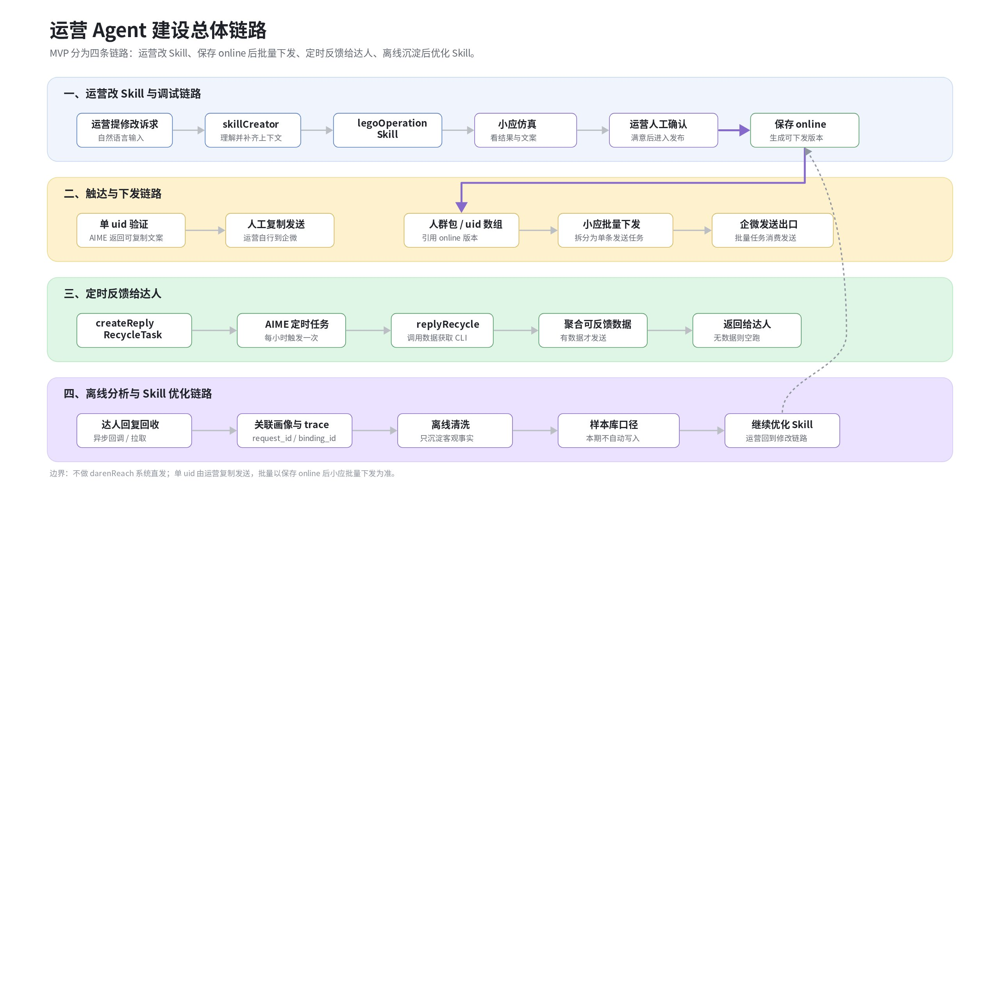
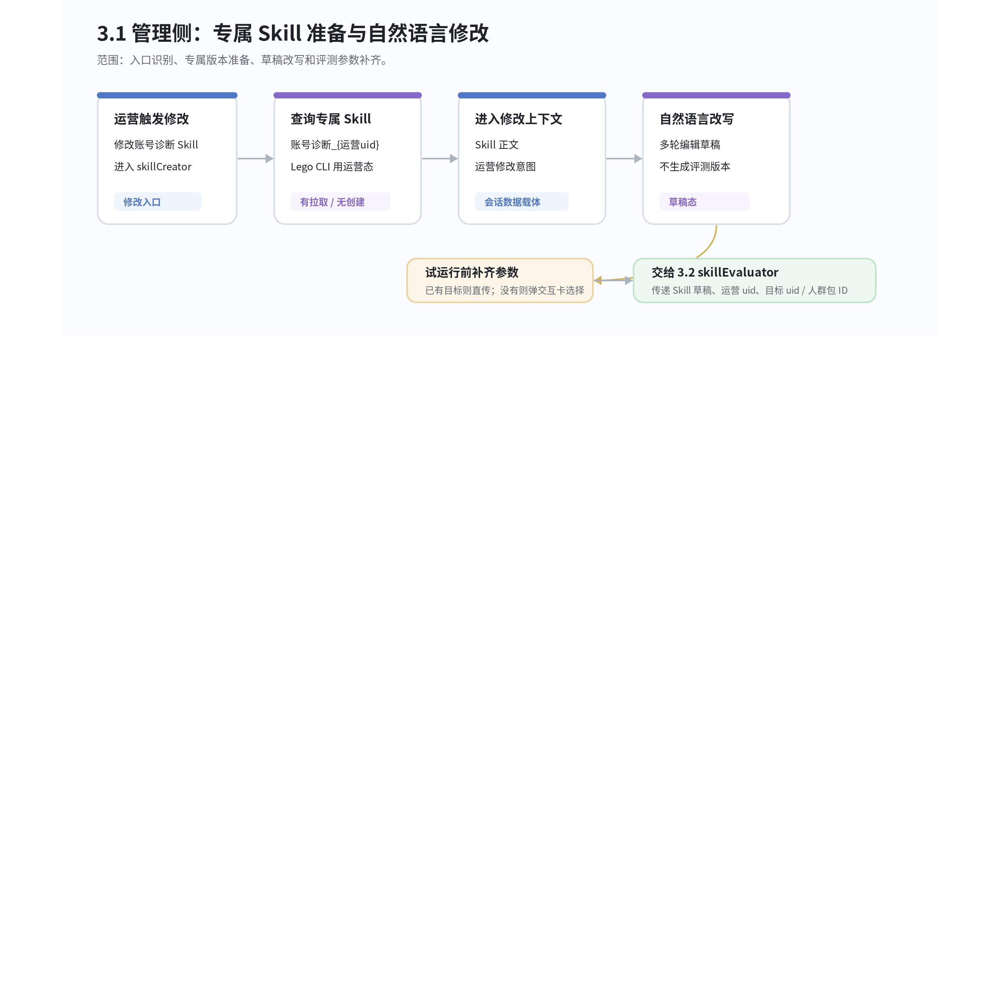
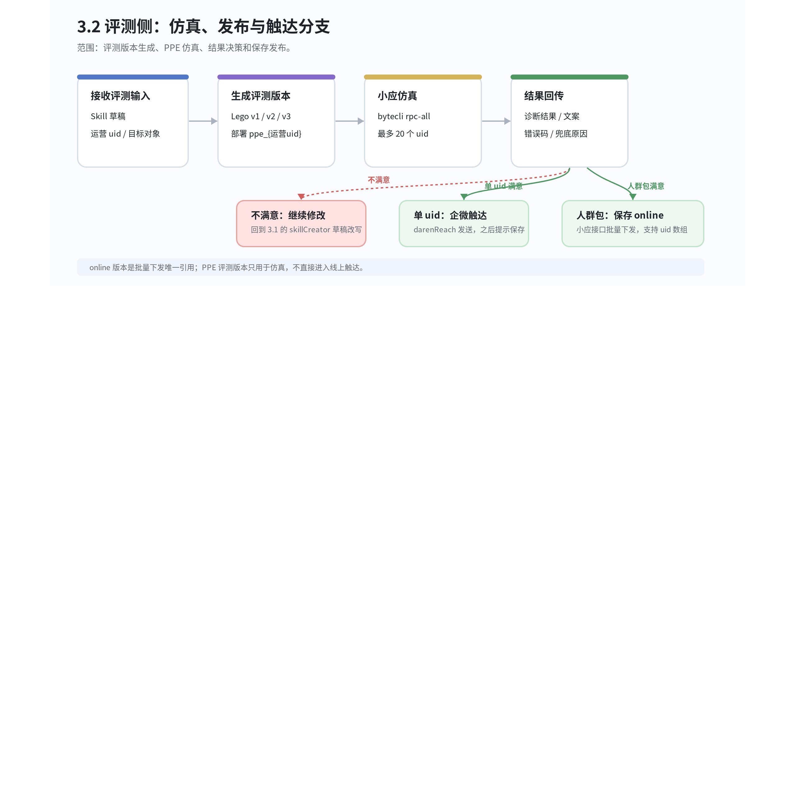
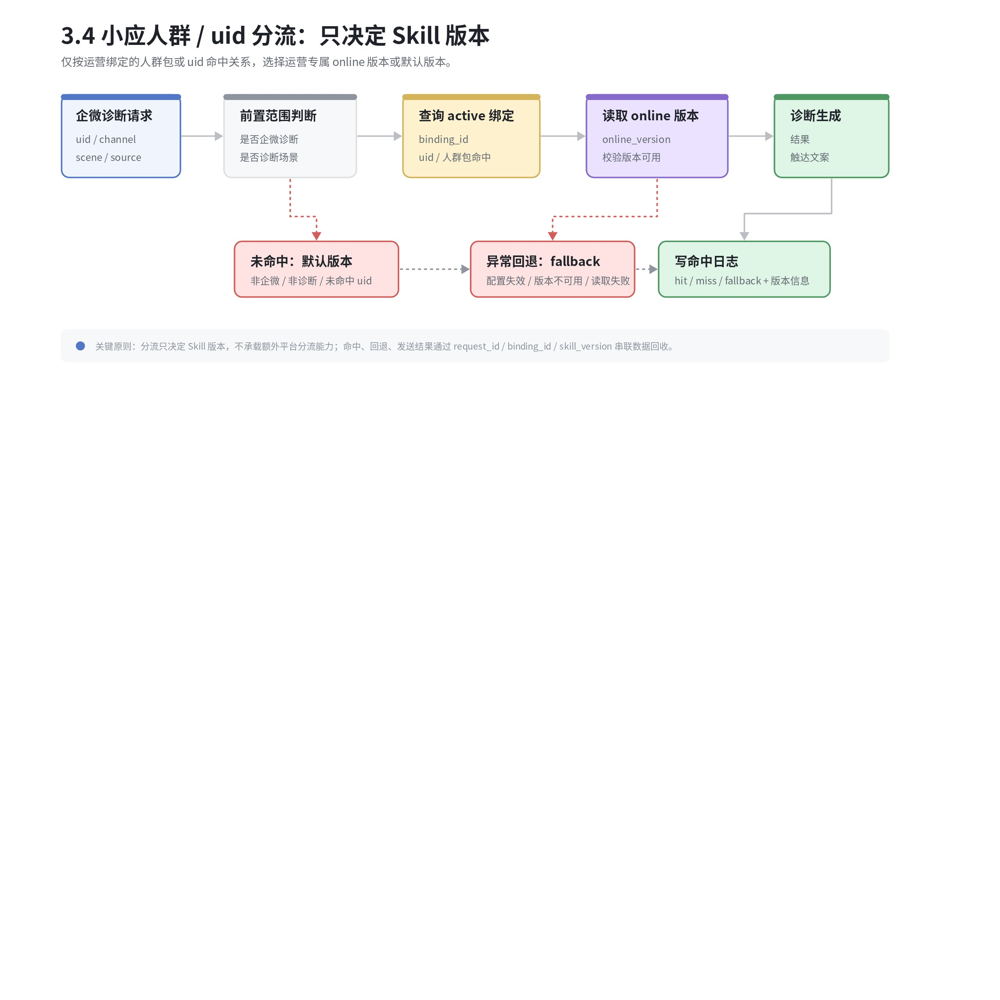
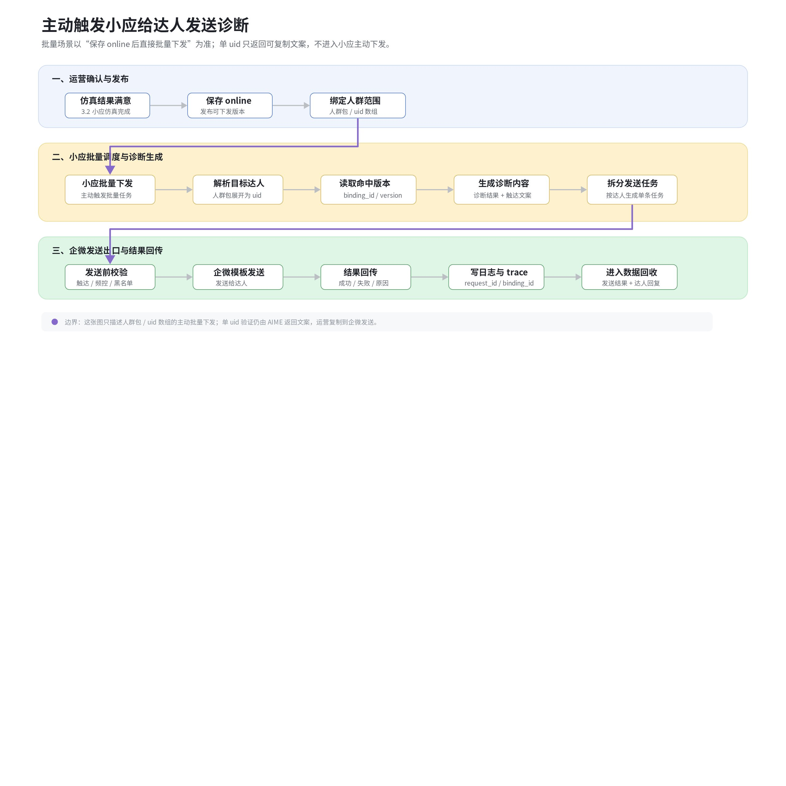
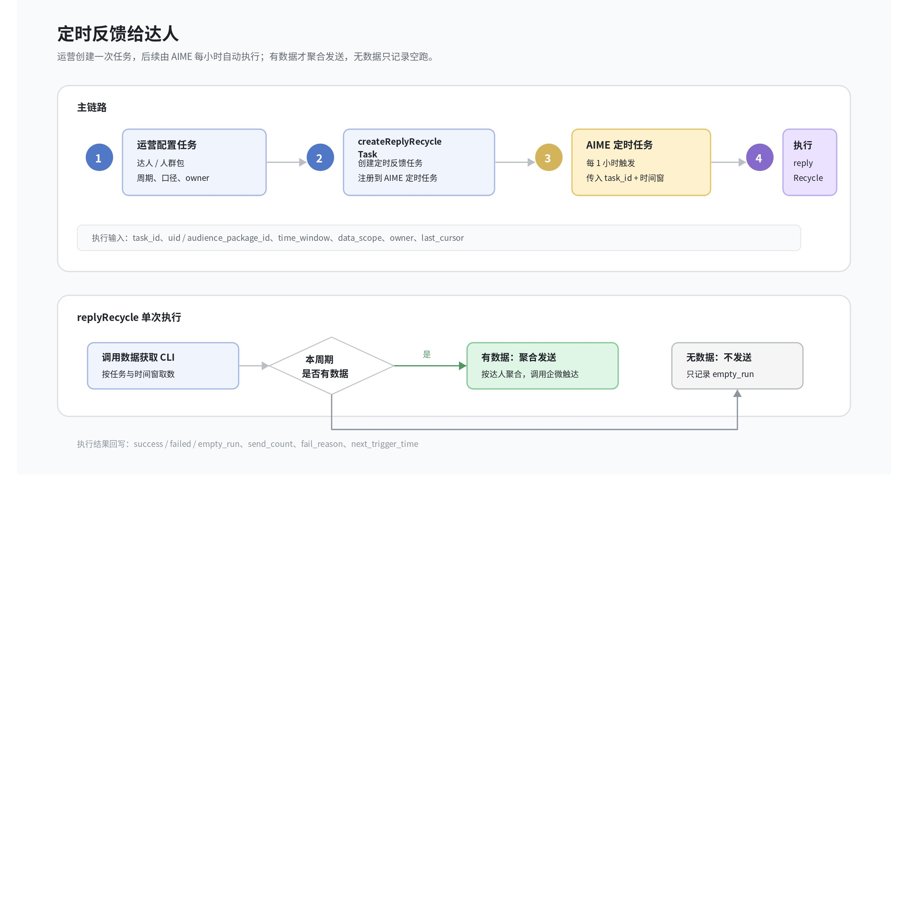
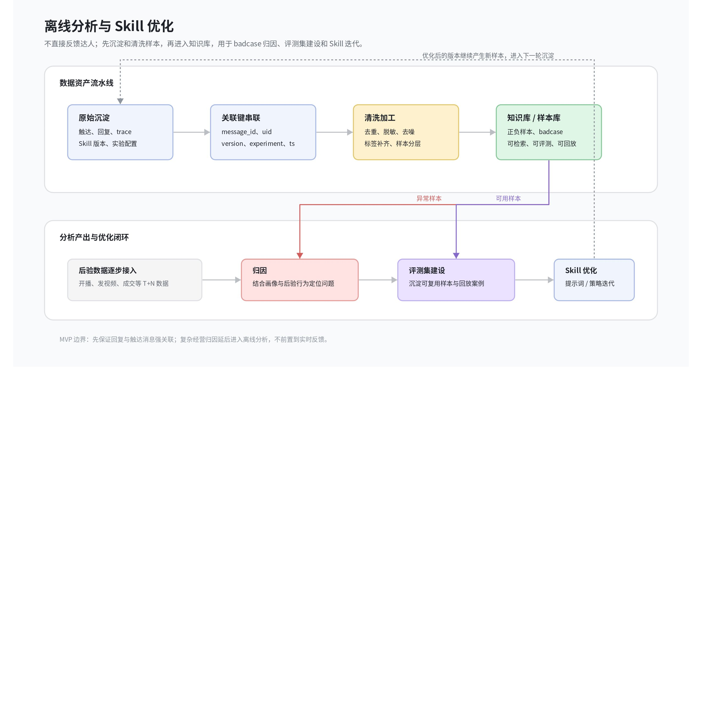

# 运营Agent建设技术方案初版

> 版本：v0.1 草案
> 来源：飞书文档《智能纪要：运营自定义Skill落地对齐会 2026年7月27日》及其关联文字记录。
> 适用阶段：产品 / 技术方案对齐、MVP 范围评审、跨团队依赖确认。

## 背景

**PRD：**[【达人成长】数据 & 知识库建设规划OnePage_V1](https://bytedance.larkoffice.com/wiki/OkPOw9hwHiqg0ak9f7AcYNa9ncb)

**运营Agent的需求范围：**MVP 范围包含企微批量触达、达人反馈数据回收、运营对话内调试、运营调试 trace 记录、数据回收、知识库 / 样本库和定时反馈；8.20 MVP 以运营试用和链路闭环为目标

1. 【P0】打通企微达人 agent 触达，支持运营通过 Skill 对绑定人群包或 uid 批量发送个性化服务消息；达人回复异步回收，供运营继续优化 Skill，不要求在线实时承接对话
2. 【P0】拉取企微达人反馈数据，帮运营做好达人反馈梳理和归类，归因线上badcase，用于skill优化
3. 【P0】支持运营在对话框内完成 Skill 调试、反馈打标和测评，比如「采纳并发送 / 不采纳并调整」；批量场景调整 Skill 后重新生成达人诊断并下发，1v1 场景本期改为运营复制内容后自行到企微发送。
4. 【P0】上报运营调试trace记录。
5. 运营反馈和skill调试记录，应用于模型优化，替换企微线上的通用skill，实现托管运营
6. 达人后验数据归因，如：

   1. 直接 - 在企微调用多个skills完成建议动作
   2. 直接 - 结合作者任务做自动领取+完成监控
   3. 间接 - 归因有效回复后T+N的达人行为数据

待确认 @周雨潇、@程可歆：

1. 【MVP口径已定】1v1 不做系统直发；AIME 生成可复制内容，运营自行到企微发送。
2. 【本期不实现】企微端到端预览。
3. 【功能待定】运营修改的skill分支如何做版本管理
4. 【本期简化】运营只绑定人群包或 uid 做分流；复杂圈人、批量 UID 权限校验和 RBAC 权限管理本期不实现。
5. 【前置需求待定】小应整体链路迁移时间结构确认

### 需求拆解

1. 平台提供AI能力，通过对话方式修改Skill
2. 支持运营创建 / 编辑某个基础 Skill 的运营专属版本，可完成多轮调试。
3. 调试链路接入Lego / 小应仿真环境，保证底层模型、调度、Skill 执行链路与线上一致。
4. 支持将 online Skill 版本绑定到运营选择的人群包或 uid；小应只按人群包 / uid 绑定关系做版本选择，不引入额外分流平台。
5. 发布前提供小应仿真与运营人工确认；基础评测集服务本期先不实现。
6. 建立触达消息、Skill 版本、达人、发送时间、用户回复之间的可追溯数据链路；样本先进入数据回收和知识库建设流程，正式知识库写入接口本期先不实现。

## 总体方案

> 白板源数据：[whiteboard-01.raw.json](history/运营Agent建设技术方案初版_assets__whiteboard-01.raw.json)

## 分模块设计

整体方案基于 AIME 承接运营交互和 Skill 编排，核心链路围绕“修改、评测、发布、触达、回收”展开。

### 3.1 Skill 管理 + 调试

Skill 修改链路以定制 Skill `skillCreator` 作为入口。运营发起“修改账号诊断 Skill”后，系统不直接改线上账号诊断 Skill，而是先定位当前运营的专属版本，再把该版本放入 AIME 上下文中，由 `skillCreator` 负责理解自然语言修改意图、改写 Skill 内容，并在运营要求“试一试”时触发仿真评测。

**版本隔离原则。** 每个运营使用独立的账号诊断 Skill，命名建议为 `账号诊断_{运营uid}`。LEGO 操作 Skill 调用 Lego 时应使用当前运营的登录态，保证创建、拉取、推送和发布都归属到实际操作人，避免多人共用同一个运营版本导致覆盖或误发。

管理侧链路（画板）：

> 白板源数据：[whiteboard-02.raw.json](history/运营Agent建设技术方案初版_assets__whiteboard-02.raw.json)

职责范围：Skill 修改入口、专属版本准备、自然语言改写和评测参数补齐；仿真执行、PPE 部署、online 发布和触达分支由 3.2 承接。

管理侧整体操作动线：

1. 运营触发“修改账号诊断 Skill”，AIME 路由到定制 Skill `skillCreator`。
2. `skillCreator` 调用 LEGO 操作 Skill，使用当前运营登录态查询 Lego 中是否已有 `账号诊断_{运营uid}`。
3. 如果专属 Skill 已存在，LEGO 操作 Skill 从 Lego 拉取该 Skill，并把结果交回 `skillCreator` 放入本轮 AIME 上下文；如果不存在，则先在 Lego 创建专属 Skill，再把新建结果放入上下文。
4. 运营通过自然语言描述修改诉求，`skillCreator` 基于上下文中的 Skill 内容完成改写，并保留当前草稿。
5. 运营表达“试一试”“测试一下”“看看效果”等意图时，`skillCreator` 先判断是否已给出 uid 或人群包 ID；未给出时通过动态交互卡补齐评测对象。
6. 评测对象补齐后，`skillCreator` 将 Skill 草稿、运营 uid、目标 uid / 人群包 ID 交给 3.2 的 `skillEvaluator` 执行仿真与发布链路。

关键能力与职责（按类型区分）：

| 能力 / 资源 | 类型 | 职责 | 职责边界 |
|-|-|-|-|
| `skillCreator` | AIME Skill + LEGO 操作 Skill 编排 | 承接“修改账号诊断 Skill”入口，理解运营自然语言修改意图，组织专属 Skill 的查询、创建、拉取和草稿改写。 | 不执行仿真评测，不发送企微消息，不触发批量下发。 |
| LEGO 操作 Skill | AIME Skill + Lego CLI 封装 | 在当前运营登录态下查询、创建、拉取 `账号诊断_{运营uid}`，并把 Skill 内容交给 `skillCreator` 进入修改上下文。 | 评测版本推送、PPE 部署和 online 发布由 3.2 链路调用。 |
| `账号诊断_{运营uid}` | Lego Skill 资源 / 版本实体 | 作为当前运营的专属账号诊断 Skill，承载被拉取、修改和后续评测的 Skill 正文。 | 版本发布策略、评测版本和 online 版本的区别放到 3.2 展开。 |
| 动态交互卡 | AIME UI 样式 / 参数补齐组件 | 当运营没有明确 uid 或人群包 ID 时，提供人群包 / uid 选择入口，补齐交给 `skillEvaluator` 的评测参数。 | 只做参数补齐；实际评测、抽样和结果回传放到 3.2。 |

建议状态流转：

| 状态 | 进入条件 | 允许动作 |
|-|-|-|
| not_created | Lego 中不存在 `账号诊断_{运营uid}`。 | 创建运营专属 Skill。 |
| loaded | 专属 Skill 已拉入 AIME 上下文。 | 自然语言修改、查看当前 Skill 内容。 |
| editing | 运营正在通过自然语言修改 Skill。 | 保存草稿、继续修改、触发试运行。 |
| evaluating | 已选择 uid 或人群包，并交给 `skillEvaluator`。 | 等待仿真结果、查看样本输出。 |
| approved | 运营认可仿真结果。 | 单 uid 企微触达，或保存 online 版本并触发人群包发送。 |
| online | Skill 已在 Lego 发布 online 版本。 | 触发人群包 / uid 数组诊断信息自动下发，或作为后续修改基线。 |

### 3.2 SkillEvaluator 仿真评测与保存发布

仿真与发布链路（画板）：

> 白板源数据：[whiteboard-03.raw.json](history/运营Agent建设技术方案初版_assets__whiteboard-03.raw.json)

`skillEvaluator` 承接“试运行”之后的评测、版本生成、PPE 部署、结果回传和满意后的保存发布。运营修改意图和修改入口由 3.1 的 `skillCreator` 处理；评测侧围绕草稿生成可评测版本；评测满意后，单 uid 场景输出可复制文案由运营自行发送，人群包或 uid 数组批量场景保存 online 后直接批量下发。

**评测版本生成。** 每次评测前，`skillEvaluator` 先把当前草稿推送到 Lego，生成 `账号诊断_{运营uid}` 的新版本，例如 v1、v2、v3。该版本部署到运营专属 PPE，命名建议为 `ppe_{运营uid}`。评测版本和 online 版本要分开，避免“试一试”误影响线上触达。

仿真评测链路：

1. 接收 `skillCreator` 传入的 Skill 草稿、运营 uid、目标 uid 列表或人群包 ID。
2. 将草稿推送到 Lego，生成运营专属 Skill 的新评测版本。
3. 把新版本部署到 `ppe_{运营uid}`。
4. 确定评测对象：如果是单 uid，直接评测；如果是 uid 数组或人群包，单次最多选择 20 个 uid，超过上限时抽样。
5. 通过 `bytecli rpc-all alliance-ai` 调用小应仿真链路，获取诊断结果和触达文案。
6. 把样本输入、Skill 版本、PPE、RPC 调用结果、失败原因和输出文案回传给 `skillCreator` 展示。

评测输入输出：

| 对象 | 字段 | 说明 |
|-|-|-|
| Skill 版本 | skill_name、operator_uid、lego_version、ppe_lane | 定位本次评测使用的专属 Skill 版本和 PPE。 |
| 评测对象 | uid、uid_list、audience_package_id | 三者按用户输入决定；人群包和 uid 数组需要抽样，单次最多 20 个 uid。 |
| 调用方式 | `bytecli rpc-all alliance-ai` | 小应仿真链路调用入口，用于模拟真实诊断输出。 |
| 评测结果 | diagnosis_result、reach_message、error_code、fallback_reason | 同时展示可发送文案和异常信息，方便运营判断是否继续修改。 |
| 人工决策 | satisfied、continue_edit、copy_to_wecom、save_online | 决定后续回到修改、单 uid 复制到企微发送，或保存 online 版本进入批量下发。 |

满意后的分支：

| 目标类型 | 后续动作 | 说明 |
|-|-|-|
| 单个 uid | AIME 展示可复制的诊断内容和企微发送文案，运营自行复制到企微发送；本期不新增系统直发能力。 | 适合单点验证或人工挑选达人；系统只保留内容生成、复制动作和后续异步回收所需记录。 |
| 人群包 | 触发保存 Skill，把当前版本在 Lego 发布为 online 版本；发布成功后直接调用小应批量下发接口，对绑定人群包自动下发诊断信息。 | 人群包发送以“存 online 后直接批量下发”为准；本期不接实验平台，仅按运营绑定的人群包或 uid 决定下发范围。 |
| uid 数组 | 如果作为小规模人工验证，按单 uid 复制文案处理；如果作为批量下发，走与人群包一致的保存 online + 小应批量下发接口。 | 交互入口需要明确本次是“人工复制验证”还是“批量下发”。 |

保存 Skill 的含义是把当前运营专属 Skill 在 Lego 上发布一个 online 版本。online 版本是后续人群包或 uid 数组批量下发的唯一引用版本；评测版本只能用于 PPE 仿真，不允许被小应线上批量发送链路直接引用。

待确认接口包括：查询 / 创建 `账号诊断_{运营uid}` 的 LEGO 操作 Skill 能力，推送新版本并部署 `ppe_{运营uid}` 的命令，`bytecli rpc-all alliance-ai` 的请求参数，小应触发人群包或 uid 数组自动下发的接口协议，以及小应触发人群包或 uid 数组自动下发的接口协议。

### 3.3 人群包 / uid 绑定模块

人群包 / uid 绑定模块将已保存为 online 的运营专属 Skill 版本绑定到明确的人群包或 uid 范围上，需要鉴定运营拥有该人群的数据权限（协作人、认领人、规模化管理人群）。该模块产出可被小应读取的绑定配置快照，供 3.4 在批量下发或诊断请求进入时判断是否命中运营版本。

**配置边界。** 只有通过 3.2 保存后的 online 版本才能绑定人群包或 uid。PPE 评测版本、草稿版本和未确认的人群选择都不能直接进入批量下发。这样可以保证批量触达时有稳定版本、明确 owner 和可回滚基线。

配置整体操作动线：

1. 运营选择一个已 online 的 `账号诊断_{运营uid}` 版本，作为本次绑定版本。
2. 选择目标范围，可以是橙蕉人群包、运营已绑定人群，也可以是经过确认的小规模 uid 数组。
3. 系统做基础范围校验：版本必须为 online，目标范围必须是运营明确选择的人群包或 uid；复杂权限校验本期先不实现。
4. 生成绑定配置，记录默认回退版本，并把配置状态置为 draft 或 active。
5. 配置 active 后同步给 3.4 小应人群 / uid 分流模块，形成运行时可读取的绑定快照。
6. 运营可暂停、结束或回滚配置；状态变化需要同步给分流模块，并保留操作记录。

建议配置模型：

| 字段 | 类型 | 说明 |
|-|-|-|
| `binding_id` | 配置主键 | 一次 Skill 人群 / uid 绑定的唯一标识，用于状态流转、日志回查和回滚。 |
| `operator_uid` | 运营身份 | 专属 Skill 的归属人，也用于约束 LEGO 操作 Skill 和人群包操作权限。 |
| `skill_name` | Skill 名称 | 固定指向 `账号诊断_{运营uid}`，避免误绑定其他运营的版本。 |
| `online_version` | Lego online 版本 | 本次人群 / uid 绑定实际生效的版本；只允许绑定 online，不允许绑定 draft 或 PPE 评测版本。 |
| `fallback_version` | 回退版本 | 命中判定失败、版本不可用或绑定暂停时使用的线上默认 Skill 版本。 |
| `audience_source` | 人群来源 | 标记来自橙蕉人群包、运营绑定人群或手动 uid 数组。 |
| `audience_package_id` / `uid_list_snapshot` | 人群范围 | 人群包场景记录包 ID；uid 数组场景记录当时确认的快照，避免后续人群变化导致口径不一致。 |
| `effective_channel` | 生效链路 | MVP 固定为企微诊断链路；后续扩展其他渠道时需明确隔离。 |
| `status` | 配置状态 | `draft`、`active`、`paused`、`ended`。只有 active 会被 3.4 分流读取。 |
| `sync_status` | 同步状态 | 记录配置是否已同步到小应分流侧，建议包含 `pending`、`synced`、`failed`。 |
| `created_at` / `updated_at` | 审计字段 | 用于排查“为什么没有命中运营版本”和“何时回滚”等问题。 |

校验规则建议：

| 校验点 | 通过条件 | 失败处理 |
|-|-|-|
| 版本状态 | 目标版本已在 Lego 发布为 online。 | 阻断激活，提示先完成 3.2 保存发布。 |
| 人群权限 | 当前运营有权限使用该人群包或 uid 范围。 | 保持 draft，并展示不可用人群原因。 |
| 渠道范围 | MVP 只允许绑定企微诊断链路。 | 拒绝写入非企微渠道，避免影响其他链路。 |
| 回退配置 | 存在可用的线上默认版本。 | 阻断 active，防止分流异常时没有兜底。 |

### 3.4 小应人群 / uid 分流模块

小应人群 / uid 分流模块在运行时读取 3.3 同步的 active 配置，决定本次请求使用运营专属 Skill 版本还是线上默认版本。本期不接实验平台，仅按运营绑定的人群包或 uid 决定下发范围；模块输出版本选择结果、命中日志和必要的回退原因，供诊断生成与后续数据回收使用。

**分流边界。** 分流只在企微诊断触达链路生效。非企微链路、非诊断场景、未命中 active 配置的 uid，都必须继续使用线上默认 Skill，避免人群绑定配置外溢到其他业务链路。

人群 / uid 命中判定链路（画板）：

> 白板源数据：[whiteboard-04.raw.json](history/运营Agent建设技术方案初版_assets__whiteboard-04.raw.json)

人群 / uid 命中判定顺序：

1. 接收企微诊断请求，读取 `uid`、渠道、诊断场景和请求来源。
2. 先判断是否属于企微诊断链路；不属于时直接走线上默认 Skill。
3. 查询 3.3 同步的 active 人群绑定配置，按 uid 或人群包命中关系判断是否使用运营专属版本。
4. 命中后读取 `online_version`，并校验版本可用性；不可用时回退 `fallback_version`。
5. 调用账号诊断生成逻辑，产出诊断结果和触达文案。
6. 记录命中日志，至少包含 binding_id、Skill 版本、是否命中、回退原因和请求链路。

命中日志字段建议：

| 字段 | 记录内容 | 用途 |
|-|-|-|
| `request_id` | 单次诊断请求 ID | 串联企微发送、小应诊断和后续数据回收。 |
| `uid` | 被诊断达人 uid | 判断是否命中人群包或 uid 快照。 |
| `binding_id` | 命中的人群绑定配置 ID | 排查运营配置是否生效，以及后续按人群绑定配置聚合效果。 |
| `hit_status` | `hit` / `miss` / `fallback` | 区分命中、未命中和异常回退。 |
| `skill_version` | 实际使用的 Skill 版本 | 确认最终执行的是运营 online 版本还是默认版本。 |
| `fallback_reason` | 配置失效、版本不可用、读取失败等 | 帮助运营理解“配置 active 但没有生效”的原因。 |

兜底规则需要保持简单明确：配置不存在、配置非 active、版本读取失败、运营版本不可用、人群命中关系无法确认时，一律回退线上默认 Skill；回退必须写日志，但不能阻断诊断链路本身。

### 3.5 企微发送出口：单 uid 人工复制，批量通过小应下发

企微发送出口模块处理已生成诊断内容的交付方式。单 uid 场景本期不做系统直发，AIME 只展示可复制内容，由运营自行到企微发送；人群包或 uid 数组批量场景在保存 online 后，由小应批量接口直接下发。

**能力边界。** 单 uid 场景不新增系统直发能力；人群包和 uid 数组批量下发由小应侧批量接口触发。企微发送链路保持独立，Skill 发布、人群绑定配置和批量调度分别由前置模块处理。

交付链路：

主动触发小应给达人发送诊断链路（画板）：

> 白板源数据：[whiteboard-05.raw.json](history/运营Agent建设技术方案初版_assets__whiteboard-05.raw.json)

1. 接收上游传入的 uid、诊断结果、触达文案、Skill 版本、来源场景和操作人。
2. 按场景执行交付前校验：单 uid 只校验可复制文案和必要记录；批量场景校验达人可触达性、企微绑定状态、频控、黑名单和文案空值。
3. 按企微消息模板组装交付内容，保留诊断结论、建议动作和必要的来源标识。
4. 单 uid 场景只返回可复制文案；批量场景由小应批量接口拆分任务后调用企微发送能力，并记录成功、失败或部分失败状态。
5. 把复制记录或批量发送结果回传给 AIME / 小应链路，供运营看到“可复制 / 已发送 / 未发送 / 失败原因”。

入口与处理方式：

| 入口 | 触发条件 | 处理方式 |
|-|-|-|
| 单 uid 即时发送 | 3.2 仿真结果满意，运营选择立即触达。 | AIME 展示可复制诊断文案，运营自行复制到企微发送；系统不调用企微直发接口。 |
| 绑定人群在线发送 | 3.4 已选择运营版本或默认版本，并生成诊断文案。 | 按实际命中的 Skill 版本发送，并记录分流日志与发送日志的关联 ID。 |
| 人群包批量下发 | 3.2 保存 online 后，运营选择对人群包自动下发。 | 不逐个走单 uid 即时发送入口，由小应批量接口调度；企微发送侧只消费拆分后的单条发送任务。 |

发送入参与回传结果建议：

| 对象 | 字段 | 说明 |
|-|-|-|
| 发送对象 | `uid`、`wecom_contact_id` | uid 用于业务追踪；企微联系人 ID 用于实际触达。 |
| 消息内容 | `diagnosis_result`、`reach_message`、`template_id` | 诊断结果和触达文案来自上游，企微侧只做模板化组装和发送。 |
| 版本信息 | `skill_name`、`skill_version`、`binding_id` | 用于确认本次发送使用的是哪个 Skill 版本，以及是否命中人群包 / uid 绑定。 |
| 发送结果 | `send_status`、`send_time`、`fail_reason` | 回传给运营侧和数据回收链路，支撑后续效果统计与失败排查。 |

异常处理上，发送失败不能反向修改 Skill 版本或人群绑定配置；只能记录失败原因并把结果回传给上游。常见失败包括达人不可触达、企微未绑定、频控命中、消息模板渲染失败和企微接口异常。

### 3.6 数据回收

数据回收拆成两条链路处理：一条是面向达人的定时反馈链路，只负责把已生成或已沉淀的数据按固定节奏返回给达人；另一条是面向 Skill 优化的离线分析链路，先把触达、反馈、达人画像和后验行为等信息沉淀下来，经过清洗后进入知识库 / 样本库，再用于后续 Skill 迭代。两条链路共享基础关联键，但目标、时效和处理方式不同，不应合并成同一条“主动收集触发给到达人”链路。

#### 链路一：定时反馈给达人

定时反馈链路比较直接，核心目标是把诊断结果、阶段性数据或运营确认后的服务信息返回给达人。该链路不承担复杂归因和样本清洗，只需要保证数据口径稳定、触达记录可追溯、重复发送可控制。

**定时任务入口。** 定时反馈给达人需要单独做成 Skill 链路。运营通过 `createReplyRecycleTask` 创建定时反馈任务，该 Skill 负责收集反馈对象、反馈周期、数据范围、发送渠道和任务 owner，并调用 AIME 定时任务能力注册任务。任务创建后不由运营手动反复触发，而是由 AIME 定时任务按固定节奏执行。

**小时级执行逻辑。** 定时任务默认每 1 小时执行一次 `replyRecycle` Skill。`replyRecycle` 每次执行时通过数据获取 CLI 拉取本周期内可反馈给达人的数据；如果有数据，则按达人维度聚合后调用企微触达能力发送给对应达人；如果没有数据，则记录一次空跑结果，不发送消息，避免无意义打扰达人。

| 能力 | 职责 | 边界 |
|-|-|-|
| `createReplyRecycleTask` | 面向运营创建定时反馈任务，补齐 uid / 人群包、反馈周期、数据口径、发送渠道、任务 owner 和生效时间，并注册到 AIME 定时任务。 | 只负责创建和管理任务，不直接拉取数据或发送达人消息。 |
| AIME 定时任务 | 按配置每小时触发一次任务，传入任务 ID、时间窗口、目标范围和执行上下文。 | 只负责调度和执行状态记录，不处理业务数据聚合。 |
| `replyRecycle` | 执行单次回收与反馈：调用数据获取 CLI，判断是否有可反馈数据，有数据则聚合并发送，无数据则跳过发送。 | 不创建定时任务，不修改 Skill 版本，不承担离线样本清洗。 |
| 数据获取 CLI | 按任务 ID、uid / 人群包、时间窗口和数据口径查询可反馈数据，并返回结构化结果。 | 只提供数据读取能力；聚合文案和发送动作由 `replyRecycle` 编排。 |

定时反馈执行流程图：

> 白板源数据：[whiteboard-06.raw.json](history/运营Agent建设技术方案初版_assets__whiteboard-06.raw.json)

| 环节 | 处理内容 | 首版要求 |
|-|-|-|
| 触发 | 由 AIME 定时任务按配置触发，生成周期性达人反馈任务；运营确认发送和在线批量下发属于 3.5，不直接进入本链路。 | 只要求明确 uid、反馈内容、Skill 版本、发送场景和发送时间。 |
| 发送 | 调用企微触达能力，把数据或诊断反馈返回给达人。 | 同步或异步返回发送状态，失败时记录原因并支持重试。 |
| 记录 | 记录 message_id、uid、skill_version_id、send_ts、feedback_content、trigger_scene。 | 用于查账、频控、幂等和后续回复关联，不在该链路内做复杂分析。 |

**幂等与频控。** 同一达人、同一 Skill 版本、同一反馈场景在一个频控窗口内只生成一条有效反馈任务。幂等键建议使用 `uid + skill_version_id + trigger_scene + feedback_period`；命中幂等时直接返回已有任务状态，避免重复给达人发送相同反馈。

#### 链路二：离线分析与 Skill 优化

分析链路是离线链路，不直接面向达人实时返回结果。它把触达记录、达人回复、运营调试 trace、Skill 版本、达人画像、达人后验行为等信息先按统一关联键沉淀下来，再经过清洗、去噪、打标和样本化处理，落到知识库 / 样本库中，供后续 Skill 优化、评测集构建和 badcase 归因使用。

| 阶段 | 输入 | 产出 |
|-|-|-|
| 原始沉淀 | 触达消息、达人回复、运营采纳 / 不采纳反馈、AIME trace、Skill 版本、人群绑定配置、达人画像和后验行为数据。 | 按 message_id、uid、skill_version_id、binding_id、send_ts 等关联键存储原始数据。 |
| 清洗加工 | 原始文本、结构化字段、画像字段、行为指标和人工反馈。 | 完成去重、脱敏、噪声过滤、口径对齐、标签补齐和样本分层。 |
| 知识沉淀 | 清洗后的正负样本、典型 badcase、有效回复样本、画像特征和行为变化结果。 | 写入知识库 / 样本库，形成可检索、可评测、可回放的数据资产。 |
| Skill 优化 | 知识库样本、badcase 归因、评测集和运营修改记录。 | 用于优化账号诊断 Skill、补充评测集、调整提示词或策略，并支撑后续版本评测。 |

离线分析与 Skill 优化流程图：

> 白板源数据：[whiteboard-07.raw.json](history/运营Agent建设技术方案初版_assets__whiteboard-07.raw.json)

**首版范围。** MVP 首版优先保证用户回复与触达消息的强关联，以及运营调试 trace、Skill 版本和达人基础画像能够被离线串联。开播、发视频、成交等经营动作归因可以作为 T+N 后验分析延后接入，避免把复杂归因前置到实时反馈链路中。

**核心关联键。** 两条链路都需要保留 `message_id`、`uid`、`skill_id`、`skill_version_id`、`send_ts`、`trigger_scene`、`binding_id` 和 `audience_package_id`。其中 `message_id` 优先用于关联达人回复；如果企微回调只返回会话维度信息，再用 `uid + wecom_contact_id + send_ts` 做窗口内兜底匹配，并记录匹配方式，避免强关联和推断关联混用。

### 3.7 知识库 / 样本库

MVP 覆盖知识库 / 样本库建设口径与数据沉淀链路，但不实现自动写入知识库接口。本期先沉淀触达消息、达人回复、Skill 版本、人群绑定配置、达人画像快照和数据源标识等客观事实，离线清洗后形成可用于 Skill 优化的样本；正式知识库写入方案后续需要和@荆雷确认。

MVP 可存：

- 触达消息内容。
- 用户回复内容。
- Skill ID、Skill 版本、人群绑定配置。
- 达人 ID、发送时间、回复时间。
- 当前 Skill 使用到的基础达人画像字段快照。
- 后续可回溯的数据分区 / 数据源标识。

后续可扩展：

- 产品定义正样本因子：回复意愿、经营意愿、开播勤奋度、内容稳定性等。
- 扩展行为归因窗口：如 T+1 / T+7 / T+30 的开播、发视频、GMV 或互动变化。
- 建立策略系统，而非简单知识库：多样本统计、因子结构化、人工复核、模型训练。

## Skill、后端能力依赖清单

### Skill 清单页

Skill 清单页用于统一展示本链路涉及的 AIME Skill 与 Lego Skill 资源。该页面只管理 Skill 资产和编排职责，不把 Skill 本身计入下游后端能力；每个 Skill 依赖的外部接口会在后端能力依赖清单中单独列出。

| Skill / 资源 | 类型 | 触发入口 | 核心职责 | 关联下游接口能力 |
|-|-|-|-|-|
| `skillCreator` | AIME Skill / 修改入口编排 | 运营发起“修改账号诊断 Skill” | 承接自然语言修改、维护会话上下文、组织评测参数补齐，并把需要操作 Lego 的动作交给 LEGO 操作 Skill 执行。 | 人群包或 uid 解析；间接依赖 Lego 查询 / 创建 / 拉取。 |
| `legoOperationSkill`（LEGO 操作 Skill） | AIME Skill + Lego CLI 封装 | `skillCreator` 或 `skillEvaluator` 发起 Lego 操作 | 统一封装当前运营登录态下的 Lego CLI 调用，包括专属 Skill 查询、创建、拉取、版本推送、PPE 部署和 online 发布。 | Lego 查询 / 创建 / 拉取；Lego 版本推送 / PPE 部署 / online 发布。 |
| `skillEvaluator` | AIME Skill + bytecli 编排 | 运营触发“试一试”或确认进入评测 | 组织评测输入、调用 LEGO 操作 Skill 生成评测版本并部署 PPE，调用小应仿真链路；评测满意后推动 online 发布和人群包 / uid 数组批量下发。 | Lego 版本推送 / PPE 部署 / online 发布；小应仿真；小应批量下发。 |
| `账号诊断_{运营uid}` | Lego Skill 资源 / 运营专属版本实体 | 由 LEGO 操作 Skill 查询或创建 | 承载当前运营的账号诊断 Skill 正文，支持草稿修改、评测版本、online 版本和后续人群包 / uid 绑定。 | Lego 版本管理；小应诊断执行链路。 |

 定时反馈链路新增两个 AIME Skill，并依赖 AIME 定时任务承接小时级触发。

| Skill / 资源 | 类型 | 触发入口 | 核心职责 | 关联下游接口能力 |
|-|-|-|-|-|
| `createReplyRecycleTask` | AIME Skill / 定时任务创建编排 | 运营发起“创建达人定时反馈任务” | 收集目标达人或人群包、反馈周期、数据口径、发送渠道和任务 owner，调用 AIME 定时任务能力创建每小时执行的反馈任务。 | AIME 定时任务创建 / 更新；任务配置存储；人群包或 uid 解析。 |
| `replyRecycle` | AIME Skill / 定时反馈执行编排 | AIME 定时任务每小时触发 | 按任务配置调用数据获取 CLI，判断本周期是否有可反馈数据；有数据则按达人聚合后发送，没有数据则只记录空跑结果。 | 数据获取 CLI；企微触达发送；任务执行日志回写。 |

清单页建议支持按运营 uid、Skill 名称、版本状态和最近更新时间筛选。每一行可以展示当前状态，例如未创建、已加载、编辑中、评测中、已发布 online；同时提供查看版本、继续修改、发起评测和查看依赖接口的入口。

### 后端能力依赖清单

本链路以 AIME Skill 作为意图理解、流程编排和上下文传递的入口。skillCreator、skillEvaluator、createReplyRecycleTask 和 replyRecycle 属于编排方，不计入下游后端能力；它们在执行过程中调用的外部接口、平台服务和后端链路，才作为下游依赖统计。

按系统归类，当前链路依赖 Lego / Skill 平台后端、小应 / alliance-ai 后端、人群包 / 橙蕉 / 运营人群能力、企微 / 达人触达后端、AIME 定时任务平台、数据回收 / 反馈数据服务。按具体接口能力拆分，基础链路至少有 8 个能力点，定时反馈链路新增 3 个能力点。

| 下游系统 | 接口 / 能力点 | 调用方 / 编排方 | 用途 |
|-|-|-|-|
| Lego / Skill 平台后端 | 查询 / 创建 / 拉取 `账号诊断_{运营uid}` | `legoOperationSkill` | 在运营修改前准备专属 Skill，保证不同运营之间版本隔离。 |
| Lego / Skill 平台后端 | 推送评测版本、部署 `ppe_{运营uid}` | `legoOperationSkill` | 把当前草稿变成可仿真的评测版本，并部署到运营专属 PPE。 |
| Lego / Skill 平台后端 | 发布 online 版本 | `legoOperationSkill` | 保存 Skill 的最终动作；人群包或 uid 数组批量下发只能引用 online 版本。 |
| 小应 / alliance-ai 后端 | 小应仿真评测接口 | `skillEvaluator` | 通过 `bytecli rpc-all alliance-ai` 获取诊断结果、触达文案、错误码和兜底原因。 |
| 人群包 / 橙蕉 / 运营人群能力 | 人群包 / uid 数组解析与抽样 | `skillCreator`、`skillEvaluator`、人群绑定配置模块 | 把运营选择的人群包或 uid 数组转成可评测、可配置、可下发的 uid 范围。 |
| 小应 / alliance-ai 后端 | 人群绑定配置同步与运行时读取 | 人群绑定配置模块、小应人群 / uid 分流模块 | 让 active 配置在小应运行时可被读取，用于判断请求是否命中运营版本。 |
| 小应 / alliance-ai 后端 | 人群包 / uid 数组批量下发接口 | `skillEvaluator` 发布分支、小应批量调度链路 | online 版本发布后，对人群包或 uid 数组触发诊断信息自动下发。 |
| 企微 / 达人触达后端 | 企微触达发送接口 | `小应批量调度链路` | 完成达人可触达性校验、企微联系人识别、频控、消息发送和发送结果回传。 |

**本期新增依赖与后置项说明。** 企微回复回调是本期需要补齐的依赖，用于异步回收达人回复，供运营继续优化 Skill。MVP 需要保留 trace 关联字段和问题追踪口径，但不新增独立 trace 上报平台能力；知识库 / 样本库本期覆盖数据沉淀与离线清洗口径，但不实现自动写入知识库接口。基础评测集服务、复杂权限校验和企微端到端预览本期先不实现。

| 下游系统 | 接口 / 能力点 | 调用方 / 编排方 | 用途 |
|-|-|-|-|
| 企微 / 达人消息后端 | 达人回复回调 / 拉取能力 | 数据回收链路、`replyRecycle`、离线分析链路 | 异步获取达人回复，与触达消息、Skill 版本和达人画像做关联，供运营继续优化 Skill；不要求在线实时承接对话。 |
| AIME / 评测 / 知识库相关能力 | 基础评测集、独立 trace 上报、自动知识库写入、复杂权限校验、企微预览 | 本期不实现 | 文档保留后续方向；本期只保留 trace 关联字段和知识库 / 样本库沉淀口径，不把这些平台化接口计入 MVP 实现范围和依赖排期。 |

**定时反馈新增后端依赖。** 定时反馈链路需要补充 AIME 定时任务和数据获取 CLI 两类能力，企微发送能力复用既有达人触达后端。

| 下游系统 | 接口 / 能力点 | 调用方 / 编排方 | 用途 |
|-|-|-|-|
| AIME 定时任务平台 | 创建 / 更新 / 停用定时任务 | `createReplyRecycleTask` | 运营主动创建达人定时反馈任务，配置每小时触发 `replyRecycle` 的执行计划。 |
| AIME 定时任务平台 | 小时级任务触发与执行状态记录 | AIME 定时任务、`replyRecycle` | 每小时拉起一次 `replyRecycle`，并记录本次执行成功、失败、空跑或发送结果。 |
| 数据回收 / 反馈数据服务 | 数据获取 CLI | `replyRecycle` | 按 task_id、uid / 人群包、时间窗口和数据口径拉取可反馈给达人的结构化数据；无数据时返回空结果，由 `replyRecycle` 跳过发送。 |

依赖口径上，AIME Skill 不作为下游后端能力统计；Lego、小应、人群包、企微、AIME 定时任务平台和数据回收 / 反馈数据服务等被 Skill 调用的接口能力才计入下游依赖。后续评审时可以围绕基础链路 8 个能力点和定时反馈新增 3 个能力点逐项确认接口 owner、入参出参、失败兜底和联调环境。

## 4. 确认事项和估时

前置依赖：[【PRD】AI应用_账号诊断能力接入企微一期](https://bytedance.larkoffice.com/wiki/DDUnwONIbi2AJBkSrqacOQkQnwe)

关联项目：

- @荆雷推进知识库建设，运营动作与达人反馈需要沉淀到知识库。
- @曾昭瑜、@丁平推进评测项目，与当前项目的关系可以拆成两类：评测项目偏自动优化，当前项目偏运营半自动优化。

> 原飞书表格 1 含 HTML/合并单元格或复杂单元格，已按行列展开为 Markdown。

| 行 | 列 1 | 列 2 | 列 3 | 列 4 | 列 5 | 列 6 | 列 7 | 列 8 | 列 9 |
| --- | --- | --- | --- | --- | --- | --- | --- | --- | --- |
| 1 | 模块 | 模块（同左） | 人力预估 - 仅供参考 | 人力预估 - 仅供参考（同左） | 人力预估 - 仅供参考（同左） |  |  |  |  |
| 2 | 模块 | 模块（同左） | 自建 + 飞书机器人 | AIME + 飞书机器人 | 自建 + PC |  |  |  |  |
| 3 | 前端样式/卡片 | 前端样式/卡片（同左） | 2 | 2 | 4 |  |  |  |  |
| 4 | AI基座 | AI基座（同左） | 10 | 2 | 10 |  |  |  |  |
| 5 | 后端 + 对应的skill/cli封装 | Skill 管理 + Skill调试：8d | 16 | 16 | 16 |  |  |  |  |
| 6 | 后端 + 对应的skill/cli封装 | 人群 / uid 绑定与分流：4d | 16 | 16 | 16 |  |  |  |  |
| 7 | 后端 + 对应的skill/cli封装 | 链路发送：2d | 16 | 16 | 16 |  |  |  |  |
| 8 | 后端 + 对应的skill/cli封装 | 链路发送：2d | 16 | 16 | 16 | 数据回收 ：2d |  |  |  |
| 9 | 后端 + 对应的skill/cli封装 | 总计 | 16 | 16 | 16 |  | 28 | 22 | 30 |

方案优缺点：

> 原飞书表格 2 含 HTML/合并单元格或复杂单元格，已按行列展开为 Markdown。

| 行 | 列 1 | 列 2 | 列 3 | 列 4 |
| --- | --- | --- | --- | --- |
| 1 | 方案 | 估时-仅供参考（完整需求后确认） | 优点 | 风险 |
| 2 | Web AIME / 自带飞书机器人 | 22pd | - 前期能快速搭建；- AIME 链路功能稳定，适配运营工作习惯；- 功能稳定性强 | - 自建链路需要额外维护性能、质量；- 数据回收依赖定时任务 |
| 3 | Web 自建 / 通知飞书机器人 | 30pd | - 扩展性强，Web 表达能力强 | - Web 平台能提供更多交互方式，后续运营优化多 Skill 场景会更清晰便利；- 额外的维护成本 |
