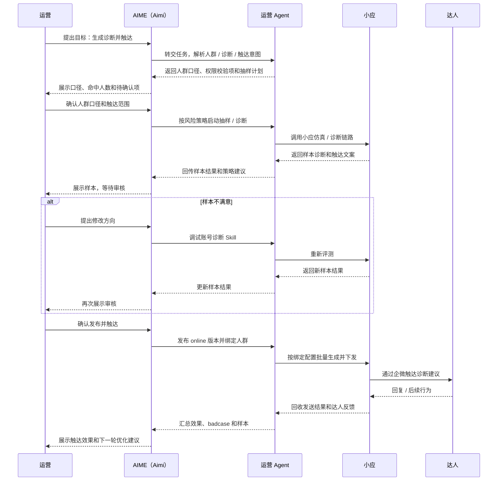

# 运营 Agent 建设技术方案解读说明

## 先说结论：运营 Agent 建设的作用是什么

运营 Agent 建设的作用，可以先用一句话理解：

> 把运营服务达人这件事，从「运营人工判断、人工写话术、人工触达、人工记录反馈」，升级成「系统辅助判断、自动生成建议、批量触达、自动回收反馈、持续优化策略」。

也就是说，它的价值不是「做一个会聊天的 Agent」，而是把运营日常工作里最耗时、最难规模化、最依赖个人经验的部分，变成一套可以复用的业务系统。

## 1. 它帮运营解决什么实际问题

运营面对达人时，通常要做很多重复但又不能完全机械化的工作：

- 判断这个达人当前有什么问题。
- 给达人生成合适的诊断结论和经营建议。
- 根据不同达人、人群包、运营策略调整话术。
- 把建议通过企微等渠道触达给达人。
- 观察达人是否回复、是否采纳、后续行为有没有变化。
- 根据反馈继续调整运营策略和账号诊断 Skill。

如果完全靠人做，会有几个问题：

| 问题 | 影响 |
| --- | --- |
| 人工判断成本高 | 每个达人都要运营自己看数据、写建议，效率低。 |
| 话术质量不稳定 | 不同运营经验不同，输出质量容易波动。 |
| 批量触达困难 | 人群包规模一大，人工逐个处理不可持续。 |
| 反馈难沉淀 | 达人回复、运营判断、后验效果容易散落在聊天记录里。 |
| 策略难迭代 | 不知道哪类话术有效、哪类 Skill 版本更好。 |

运营 Agent 要解决的正是这些问题。它不是替代运营，而是把运营的判断、调试、触达和反馈回收流程系统化，让运营从「逐个手工处理」转成「设计策略、审核效果、管理版本」。

## 2. 它具体能带来什么能力

运营 Agent 建设后，系统可以逐步具备 5 类能力。

| 能力 | 具体含义 |
| --- | --- |
| 诊断生成 | 根据达人数据和账号情况，生成诊断结论、建议动作和触达文案。 |
| Skill 调试 | 运营可以用自然语言调整账号诊断 Skill，而不是直接改代码或复杂配置。 |
| 仿真评测 | 修改后的 Skill 先在样本上试跑，看结果是否符合预期。 |
| 人群触达 | 对指定达人、人群包或 uid 列表批量生成并下发诊断信息。 |
| 反馈闭环 | 回收达人回复、运营反馈和后验行为，用于继续优化 Skill。 |

这 5 类能力连起来，才叫「运营 Agent」。如果只做到生成文案，那只是 AI 写作工具；如果只做到批量发送，那只是触达系统；如果只做到回收数据，那只是数据看板。运营 Agent 的关键是把它们串成闭环。

## 3. 对运营的价值是什么

对运营来说，它的价值主要有 4 点。

### 1. 降低重复劳动

过去运营需要手动看达人数据、整理问题、写建议、复制发送。运营 Agent 可以把这些动作半自动化，运营只需要确认策略和结果。

### 2. 提高触达规模

人工适合处理少量重点达人，但不适合处理大规模人群包。运营 Agent 可以按人群包或 uid 列表批量生成诊断结果，并通过小应或企微链路触达。

### 3. 稳定服务质量

通过 Skill 固化运营经验，可以让不同运营、不同批次触达的诊断口径更一致，减少完全依赖个人经验带来的波动。

### 4. 形成持续优化闭环

达人回复、运营采纳、不采纳、后验行为数据会被沉淀下来。后续可以基于这些数据分析哪类建议有效，继续优化账号诊断 Skill。

## 4. 对业务的价值是什么

从业务角度看，运营 Agent 建设不是单纯提升内部效率，它最终服务的是达人经营效果。

它希望推动的业务结果包括：

- 更多达人收到更及时、更个性化的经营建议。
- 运营可以更快发现达人经营问题。
- 优质运营经验可以沉淀为 Skill，而不是只存在个人脑子里。
- 达人回复和后验行为可以反向证明运营策略是否有效。
- 后续可以持续优化账号诊断、触达策略和样本库。

所以，这件事本质上是把「达人运营经验」产品化、系统化、可规模化。

## 5. 一个简单例子

可以用一个具体场景理解。

没有运营 Agent 时：

1. 运营打开达人数据。
2. 人工判断达人最近为什么表现不好。
3. 手写一段建议话术。
4. 复制到企微发给达人。
5. 达人有没有回复，运营自己看。
6. 这次建议有没有效果，很难沉淀成系统经验。

有运营 Agent 后：

1. 系统识别达人数据和经营问题。
2. 账号诊断 Skill 生成诊断结论和建议话术。
3. 运营先在 AIME 里试跑和调整 Skill。
4. 满意后绑定到指定人群包或 uid。
5. 小应按绑定关系批量生成并触达。
6. 系统回收达人回复、发送结果和后验行为。
7. 这些数据继续用于优化下一版 Skill。

两者的差别是：前者是一次性的人工操作，后者是一条可复制、可追踪、可迭代的运营链路。

## 6. 具体场景：针对「近 7 天未开播但历史有成交」人群生成诊断并触达

假设运营在 AIME 里输入：

> 帮我针对「近 7 天未开播但历史有成交」的人群，生成账号诊断建议，并触达达人。

这句话背后的完整链路不是「Agent 直接给所有达人发消息」，而是一个有确认、有抽样、有审核、有发布、有绑定、有回收的流程。

这句话可以拆成 3 件事：先找出「近 7 天未开播」且「历史有成交」的达人，再判断这些达人分别遇到了什么经营问题，最后在运营确认后通过企微或小应链路触达。Agent 要做的不是简单写一段通用话术，而是把这 3 件事串成一条可确认、可追踪、可回收的完整链路。

交互关系可以先看这张图：



第 1 步，运营先提出业务目标。运营在 AIME 里输入这句话，本质上是在告诉系统：我想找一批有历史经营价值、但最近没有开播的达人，希望给他们生成账号诊断建议，并推动他们恢复经营。这里的关键是运营先定义业务目标，而不是让系统自己决定要触达谁。

第 2 步，Agent 理解任务。Agent 会把这句话拆成 3 个动作：筛人群、做账号诊断、触达达人。这样做是为了避免误解，比如把任务误解成「只写一段文案」，或者直接对全量达人发送消息。

第 3 步，Agent 和运营一起确认人群口径。因为「近 7 天未开播」和「历史有成交」都需要明确口径：近 7 天是按自然日还是滚动 7 天，历史有成交是否需要成交金额门槛，是否只看直播成交，是否排除已经流失或不可触达的达人。Agent 可以展示默认口径，运营确认或调整。

第 4 步，Agent 拉取候选人群。口径确认后，Agent 调用人群包或数据能力，找出符合条件的达人 uid 或生成人群包，并展示命中人数。此时还不是发送消息，只是确认目标范围，避免默认诊断所有达人。

第 5 步，系统校验权限和触达范围。系统要确认当前运营是否有权限操作这批达人，例如这些达人是否属于该运营负责范围，是否在可触达渠道内，是否命中黑名单或频控。运营也要确认这批人确实符合自己的运营目标。校验通过后，才进入诊断。

第 6 步，Agent 帮运营选择账号诊断 Skill 版本。系统会查找可用的账号诊断 Skill，例如默认版本、当前运营的专属 online 版本，或者之前已经绑定到某类人群的版本。运营确认本次使用哪个版本。这个步骤很重要，因为同一个运营可能有多个 Skill 版本，不同人群可能使用不同诊断策略。

第 7 步，Agent 按风险策略决定是否先抽样。对于新人群、新改过的 Skill、大规模外发或真实触达场景，系统应该先从目标人群里抽样一小批达人，例如最多 20 个 uid，用选定的账号诊断 Skill 生成诊断结论、建议动作和触达文案。这样运营可以先看效果，避免一开始就全量误发。如果是单 uid 诊断、内部草稿生成，或者已验证 online Skill 按既有绑定配置稳定运行，则可以不重复抽样。

第 8 步，运营审核样本结果。运营查看样本里的诊断原因、建议动作和话术，判断它是否准确、是否符合运营策略、是否适合直接发给达人。比如系统可能生成「建议恢复固定开播节奏」，运营需要判断这句话是否太泛，是否应该补充「最近一次开播时间」「历史成交能力」「建议本周恢复 2 场直播」等信息。

第 9 步，如果样本效果不好，运营提出修改，Agent 调试 Skill。运营可以用自然语言告诉 Agent 怎么改，例如「这类达人要强调历史成交能力，不要只说未开播」「建议里加上具体恢复开播节奏」。Agent 根据这些要求生成 Skill 草稿，推送评测版本，部署到 PPE，再重新抽样试跑。只有在诊断策略不满足当前人群时，才需要改 Skill。

第 10 步，如果改过 Skill 且试跑满意，运营确认发布 online 版本。评测版本只能用于 PPE 试跑，不能直接线上生效。运营确认后，系统才把评测通过的版本发布成 online 版本。这个版本后续才可以绑定人群并用于真实触达。

第 11 步，运营确认绑定人群，Agent 创建绑定配置。发布 Skill 只是产生了一个可线上使用的版本，但它还不知道要服务谁。运营需要确认这个版本是否服务「近 7 天未开播但历史有成交」这批达人。系统据此创建绑定配置，把 online Skill 版本和目标人群包或 uid 列表关联起来。

第 12 步，Agent 批量生成个性化触达内容。绑定关系明确后，系统对目标人群逐个生成诊断建议和触达文案。这里不应该只发同一段通用话术，因为每个达人未开播的原因、历史成交能力、建议动作可能不同。

第 13 步，运营做最后触达确认。触达是真实业务动作，不能只由 Agent 自己决定。运营可以确认全量触达，也可以先触达一部分人群，或者暂停发送继续调整策略。

第 14 步，Agent 执行触达。运营确认后，系统通过小应或企微链路下发诊断建议，并记录每个达人的发送状态、发送时间、失败原因和对应的 Skill 版本。这样后续才能追溯某个达人收到的是哪一版诊断内容。

第 15 步，Agent 回收反馈，运营查看效果。触达后，系统回收达人回复、发送状态和后验行为数据，例如达人是否回复、是否恢复开播、是否领取任务。运营查看这些反馈，判断这次触达是否有效，也可以标记典型 badcase。

第 16 步，运营决定是否继续优化，Agent 沉淀样本。运营根据反馈决定是否继续调整账号诊断策略。系统把有效样本、无效样本、达人回复和 badcase 沉淀到知识库 / 样本库，作为下一轮优化 Skill 的依据。

所以在这条链路里，运营主要负责业务判断和关键确认：确认人群、确认样本效果、确认是否改 Skill、确认是否发布、确认是否触达。Agent 主要负责把运营目标拆成可执行步骤，并完成筛人群、跑诊断、生成文案、调试版本、创建绑定、执行触达和沉淀反馈这些重复且可系统化的动作。

这里有几个边界需要记住：不会默认诊断所有达人，只处理运营选择且有权限的人群；高风险真实触达场景不会一上来全量发送，需要先抽样让运营审核；不会每次诊断都发布新 Skill，只有修改了 Skill 且试跑满意才发布；评测版本不能直接线上生效，必须发布 online 后才能绑定人群；同一个达人不能同时命中多个冲突版本，需要有优先级和默认兜底版本。

这个场景的本质是：

> 运营提出「我要触达哪类达人」，Agent 帮运营筛出人群、生成诊断、抽样试跑、辅助改 Skill、发布绑定、批量触达，并把达人反馈沉淀回来，用于下一轮优化。

## 7. 关键概念问答汇总

下面把前面几个容易混淆的问题集中说明，后续读方案时可以先按这里的口径理解。

### 问题 1：AIME 和运营 Agent 的区别是什么

AIME 是平台入口，运营 Agent 是跑在 AIME 里的业务编排能力。

可以这样理解：

```text
AIME = 工作台 / 对话入口 / 交互承载平台
运营 Agent = 工作台里的账号诊断业务助手
```

AIME 负责接收运营输入、展示对话和卡片、承接确认动作、管理会话上下文，并把任务路由给对应的 Agent 或 Skill。运营 Agent 负责理解运营目标、拆解业务流程、调用下游 Skill / CLI / API，并在关键节点让运营确认。

所以二者不是同一层东西。AIME 解决「运营在哪里操作、怎么交互」的问题；运营 Agent 解决「这件运营业务具体怎么理解、怎么拆解、怎么执行」的问题。

### 问题 2：运营 Agent 本质上是一组 Skill 和脚本工具吗

运营 Agent 的落地形态可以是一组 Skill、脚本工具、CLI 和 API，但它的本质不是简单的工具集合，而是业务流程编排者。

更准确的表达是：

```text
运营 Agent = 业务意图理解 + 流程编排 + Skill 能力 + 工具 / CLI / API + 状态记录
```

比如它可能调用 `skillCreator` 修改账号诊断 Skill，调用 `skillEvaluator` 做抽样评测，调用 Lego 工具发布 Skill 版本，调用小应生成诊断结果，调用人群包工具筛人，调用企微链路触达达人，调用数据回收能力沉淀反馈。

如果只有这些工具，但没有「先做什么、后做什么、什么时候让运营确认、什么时候不能全量发送、什么时候需要发布 online 版本」这套编排逻辑，就还不能算完整的运营 Agent。

### 问题 3：online Skill 是多个版本共存吗

是。Skill 资产层可以有多个版本共存，但一次真实运行只能命中一个确定版本。

可以分成两层理解：

```text
Skill 资产层：允许多个版本共存，用于评测、上线、回滚和追溯。
运行命中层：一次达人诊断请求只能选择一个版本执行。
```

例如同一个账号诊断能力里，可能存在平台默认 online 版本、运营 A 针对未开播达人发布的 online 版本、运营 A 针对高粉低转化达人发布的 online 版本、运营 B 的专属 online 版本，以及若干历史版本。这些版本可以共存，但某个达人请求进来时，系统必须根据规则选出唯一版本，不能同时执行多个冲突版本。

### 问题 4：如何根据运营需求找到对应的 Skill

不是靠自然语言临时乱找，而是按映射关系命中。

推荐理解为：

```text
运营身份 + 业务场景 + 人群包 / uid + Skill 类型 → 具体 Skill 版本
```

比如运营提出「针对近 7 天未开播但历史有成交的人群生成诊断并触达」，系统会先判断这是账号诊断场景，再确认当前操作人是谁，然后根据人群包或 uid 绑定关系查找对应 online Skill。

推荐的命中优先级是：

```text
uid 精确绑定版本
> 人群包绑定版本
> 运营专属默认版本
> 平台默认账号诊断版本
```

如果命中不到运营专属版本，就回退默认版本。这样既能支持个性化运营策略，也能保证链路有兜底。

### 问题 5：不同运营之间的 Skill 是否独立

原则上应该独立。原方案里建议类似 `账号诊断_{运营uid}` 的命名，就是为了避免一个运营修改 Skill 时影响另一个运营。

例如：

```text
账号诊断_运营A
  - v1
  - v2
  - v3：绑定未开播达人

账号诊断_运营B
  - v1
  - v2：绑定新手达人
```

运营 A 调整未开播达人策略，不应该覆盖运营 B 的新手达人策略。共享的可以是平台默认版本、基础模板和底层能力，但运营自己的 online 版本、绑定配置和调试记录应当隔离。

### 问题 6：一个运营可以有多个 Skill 版本，对应不同人群包吗

可以。一个运营可以围绕不同运营策略维护多个 online Skill 版本，并分别绑定到不同人群包。

例如运营 A 可以有：

- 一个版本服务「近 7 天未开播但历史有成交」达人，重点判断开播频次和恢复节奏。
- 一个版本服务「高粉低转化」达人，重点判断货盘、直播脚本和转化链路。
- 一个版本服务「新手达人」，重点判断基础任务、冷启动动作和内容发布节奏。

关键限制是：同一个达人如果同时命中多个包，系统必须有优先级规则，最终只能选择一个确定版本执行。

### 问题 7：人群包和 online Skill 是一一对应吗

不是严格一一对应。更准确的关系是：一个绑定配置会指向一个 online Skill 版本，但同一个 online Skill 版本可以被多个不同人群包复用。

可以这样理解：

```text
Skill = 能力本体
Skill 版本 = 某一次发布出来的具体诊断逻辑
人群包绑定 = 让某个版本对某批达人生效
```

同一个版本可以服务多个相似人群包；但同一个人群包在同一时间最好只 active 一个版本，否则运行时会出现冲突。

### 问题 8：每一次账号诊断都需要发布新 Skill 和绑定人群吗

不需要。只有运营修改了诊断策略、判断逻辑或触达话术，并且抽样试跑满意后，才需要发布新的 online 版本。

如果只是用已有版本诊断一批达人，不需要每次都发布。如果只是换一批达人，但诊断逻辑不变，也不需要发布新版本。

发布 Skill 和绑定人群也不是一回事：

```text
发布 Skill = 产出一个可线上使用的版本
绑定人群 = 指定这个版本对哪些达人生效
```

发布后不绑定人群，不会自动影响所有达人。

### 问题 9：最开始用账号诊断 Skill 判断的是所有达人吗

不是。最开始诊断的是运营选择且有权限的人群范围，例如某个 uid、一批 uid、一个人群包，或者「近 7 天未开播但历史有成交」这类筛选人群。

在评测阶段，通常还会先抽样，例如最多 20 个 uid，让运营先看诊断结果是否合理。确认满意后，才进入发布、绑定和批量触达。

### 问题 10：Agent 获取到 online Skill 后，是放到 AIME 里吗

可以说会把必要信息放进 AIME 当前会话上下文里，但不是把完整 online Skill 全量复制进 AIME 执行。

AIME 里主要放展示和确认信息，例如：

```text
本次使用：账号诊断_运营A
online 版本：v3
绑定人群：近 7 天未开播但历史有成交
用途：生成账号诊断建议和触达文案
```

真正执行时，Agent 和小应使用的是结构化标识，例如 `skill_id`、`skill_name`、`online_version`、`operator_uid`、`audience_package_id` 或 `uid_list`。AIME 承载交互和上下文，Agent 负责查找和编排 online Skill，小应按版本标识执行具体诊断。

### 问题 11：online Skill 的消费者是谁

online Skill 的直接消费者是小应的诊断执行链路，不是 AIME。

角色关系可以这样看：

```text
AIME：交互入口，负责展示和确认
运营 Agent：编排方，负责选择、绑定和触发
Lego / Skill 平台：保存 online Skill 版本
小应：运行时消费者，负责执行诊断和生成触达文案
企微：触达出口
达人：最终接收方
```

一次真实触达时，运营在 AIME 发起需求，运营 Agent 判断命中哪个 online Skill，把版本标识和绑定关系传给小应；小应加载并执行这个 online Skill，生成账号诊断结果和触达文案，再通过企微链路发给达人。

一句话总结：online Skill 是给小应运行时诊断链路消费的；AIME 和运营 Agent 只是帮助运营选择、确认、绑定和触发它。

### 问题 12：一开始一定要先抽样吗，是否由运营决定

不一定所有场景都必须先抽样，但在真实外发、首次配置或高风险批量触达场景里，系统应该默认先抽样。

更准确的口径是：

```text
系统根据风险判断是否必须抽样；
运营可以确认抽样结果、调整抽样范围；
但高风险外发场景不应允许运营随意跳过抽样。
```

应该强制抽样的场景包括：

- 新人群包首次触达。
- 新发布或刚修改过的 Skill。
- 大规模批量触达。
- 诊断结果会真实外发给达人。
- 当前人群和历史验证样本差异很大。
- 命中多个版本或分流规则不清晰。

运营可以决定或调整的是抽样数量、抽样方式、是否继续扩大样本、样本结果是否通过，以及通过后是否进入完整生成和触达。

系统可以允许不重复抽样的场景包括：

- 已验证的 online Skill。
- 已绑定且稳定运行的人群包。
- 只是生成内部草稿，不触达达人。
- 单 uid 诊断。
- 定时任务按既有配置运行。

所以抽样不是运营随意开关，而是系统的风险控制机制。运营参与确认和调节，但不能在高风险真实外发场景里绕过抽样。

### 问题 13：Skill 资产层存在哪里，Agent 每次会拷贝一份 online Skill 吗

Skill 资产层一般存在 Lego / Skill 平台，不存在 AIME，也不直接存在运营 Agent 里。

可以这样分层：

```text
Lego / Skill 平台
= 存 Skill 正文、版本、online 状态、历史版本、owner、发布记录

人群绑定配置 / 分流配置
= 存某个 online Skill 版本绑定到哪些人群包 / uid

AIME
= 展示给运营看，承接确认，保存会话上下文

运营 Agent
= 查找、选择、编排、传参

小应
= 按 skill_id / version 执行 online Skill
```

Agent 日常执行时不会每次拷贝一份 online Skill。真实执行更像是引用版本：

```text
Agent 查到本次应使用：账号诊断_运营A / online v3
→ Agent 把 skill_id + version + 人群信息传给小应
→ 小应按这个版本加载并执行 Skill
```

只有进入修改链路时，Agent 才可能把当前 online 版本拉取出来作为草稿基线。这个动作不是直接修改 online，而是生成新的草稿和评测版本：

```text
online v3
→ 拉取内容作为 draft
→ 运营修改
→ 生成 evaluating 版本
→ 试跑
→ 满意后发布成 online v4
```

所以可以总结为：online Skill 资产存 Lego / Skill 平台；Agent 执行时引用版本，不复制；只有修改时才基于当前版本生成草稿或新版本。

### 问题 14：修改后试跑，发给小应的是什么

修改后试跑时，发给小应的不是旧的 online Skill，也不是临时散落的草稿文本，而是「评测版本引用 + 评测对象 + 调用上下文」。

完整流转是：

```text
修改后的 Skill 草稿
→ 推送到 Lego / Skill 平台，生成评测版本
→ 部署到运营专属 PPE
→ Agent 把评测版本信息和样本 uid 传给小应
→ 小应在 PPE / 仿真链路里按这个版本执行诊断
→ 小应返回样本诊断结果、触达文案和失败原因
```

发给小应的核心数据结构可以按下面理解：

```text
skill_name：账号诊断_运营A
eval_version：v4_eval 或某个评测版本号
ppe_lane：ppe_运营A
operator_uid：运营 A
uid_list：抽样达人 uid 列表
audience_package_id：如果来自人群包，则带上人群包 ID
trace_id / request_id：用于串联本次调试记录
```

小应拿到这些信息后，知道本次试跑要用哪个 Skill 评测版本、在哪个 PPE 环境跑、对哪些达人跑、由哪个运营发起。这样可以保证试跑和线上隔离，每次试跑可追溯，失败时能定位到具体版本。

运营满意后，才会把评测版本发布成 online 版本。发布前，评测版本不能被真实线上批量触达链路直接消费。

## 一、这份方案到底在解决什么问题

这份技术方案讨论的是：如何把「运营人员调试账号诊断 Skill、选择达人或人群、触达达人、回收反馈、持续优化 Skill」这一整条链路，做成一个可试用、可追踪、可扩展的运营 Agent MVP。

换句话说，它不是单纯做一个聊天机器人，也不是只做一个 Skill 编辑器，而是要让运营能在 AIME 对话环境里完成一组连续动作：

1. 运营提出想修改账号诊断 Skill。
2. 系统为该运营准备一个独立的专属 Skill 版本。
3. 运营用自然语言修改 Skill。
4. 系统用真实或仿真的小应链路跑一批样本，生成诊断结果和触达文案。
5. 运营确认效果。
6. 系统把确认后的版本发布为 online 版本。
7. 系统将 online 版本绑定到指定达人、人群包或 uid 范围。
8. 小应在运行时按绑定关系选择对应 Skill 版本。
9. 触达结果、达人回复、运营反馈、后验行为数据被沉淀下来，用于后续继续优化 Skill。

这条链路的核心目标是让运营从「手工改提示词、人工试效果、人工记录反馈」变成「通过 Agent 半自动完成调试、评测、发布、触达和反馈回收」。

## 二、为什么需要这套链路

原文里提到的 MVP 范围包括企微触达、达人反馈回收、运营调试、trace 记录、知识库和样本库建设。它们看起来很多，但背后其实围绕一个问题：账号诊断 Skill 要想真正服务运营，需要形成闭环。

如果只解决「生成文案」，链路是不完整的。因为运营还会遇到这些问题：

- 不同运营可能有不同的触达策略，不能共用同一个 Skill 草稿。
- 运营修改后的 Skill 不能直接影响线上，需要先评测。
- 评测版本和线上版本必须隔离，避免「试一试」误发给真实达人。
- 一次触达之后，达人有没有回复、是否采纳建议、后续行为有没有变化，都需要回收。
- 回收的数据要能反向支持 Skill 优化，而不是散落在聊天记录和人工表格里。

因此，这份方案把问题拆成了「修改、评测、发布、绑定、分流、发送、回收、沉淀」几个环节。每个环节各自解决一个明确问题，最后串成完整闭环。

## 三、整体链路可以怎么理解

可以把整套方案理解成 4 层：

| 层级 | 负责内容 | 对应模块 |
| --- | --- | --- |
| 运营交互层 | 运营通过 AIME 对话发起修改、试运行、确认发布等动作。 | `skillCreator`、`skillEvaluator`、动态交互卡 |
| Skill 版本层 | 查询、创建、拉取、修改、评测、发布运营专属 Skill。 | LEGO 操作 Skill、`账号诊断_{运营uid}` |
| 运行分发层 | 决定某个达人或人群请求应该使用运营专属版本，还是默认版本。 | 人群包 / uid 绑定模块、小应分流模块 |
| 数据闭环层 | 记录触达、回复、trace、画像、后验行为，并沉淀到知识库 / 样本库。 | 企微发送出口、数据回收、知识库 / 样本库 |

这 4 层的关系是：

1. 运营先在交互层表达意图。
2. Skill 版本层把意图变成可评测、可发布的 Skill 版本。
3. 运行分发层把版本和目标达人范围绑定起来。
4. 数据闭环层记录真实效果，再反哺下一轮修改。

## 四、各模块具体在做什么

### 1. Skill 管理与调试

这一部分解决的是「运营想改 Skill 时，系统应该改谁的 Skill、怎么改、怎么避免互相覆盖」。

原方案建议每个运营都有一个独立的账号诊断 Skill，例如：

```text
账号诊断_{运营uid}
```

这样做的原因很直接：

- 运营 A 的修改不会覆盖运营 B 的版本。
- 每个运营的版本可以单独评测、单独发布、单独回滚。
- 出问题时可以定位到具体运营、具体版本、具体操作记录。

在这条链路里，`skillCreator` 是运营的入口。它负责理解运营的自然语言修改诉求，并协调 LEGO 操作 Skill 去查询、创建、拉取对应的专属 Skill。

需要注意的是，`skillCreator` 不负责评测和发送。它只负责「准备 Skill、理解修改、产出草稿」。这样职责比较清晰。

### 2. SkillEvaluator 仿真评测与发布

这一部分解决的是「改完 Skill 后，怎么确认它有效，怎么安全地进入线上」。

方案强调评测版本和 online 版本必须分开：

- 评测版本部署到运营专属 PPE，例如 `ppe_{运营uid}`。
- online 版本才允许进入真实批量触达链路。

这样设计是为了避免一个常见风险：运营点了「试一试」，结果实验版本直接影响真实达人触达。

`skillEvaluator` 的工作可以拆成 6 步：

1. 接收 `skillCreator` 传来的 Skill 草稿和评测对象。
2. 把草稿推送到 Lego，生成一个新评测版本。
3. 把评测版本部署到运营专属 PPE。
4. 根据 uid、人群包或 uid 数组选择评测样本。
5. 调用小应仿真链路，生成诊断结果和触达文案。
6. 把样本、结果、错误和失败原因返回给运营看。

运营满意后，才会进入「保存 online 版本」或「复制文案去企微发送」等后续动作。

### 3. 人群包 / uid 绑定模块

这一部分解决的是「一个 online Skill 版本应该对哪些达人或人群生效」。

只有已经发布为 online 的版本才能绑定人群包或 uid。草稿版本、PPE 评测版本、未确认版本都不能直接绑定。

绑定配置里最重要的是这些信息：

| 字段 | 作用 |
| --- | --- |
| `operator_uid` | 标识这个版本属于哪个运营。 |
| `skill_name` | 指向 `账号诊断_{运营uid}`。 |
| `online_version` | 真正生效的线上版本。 |
| `audience_package_id` / `uid_list_snapshot` | 记录生效范围。 |
| `fallback_version` | 运行失败时回退到默认版本。 |
| `status` | 判断配置是否可被运行时读取。 |

这部分的关键不是「配置一个关系」这么简单，而是要保证运行时有明确版本、有明确人群、有明确回退。

### 4. 小应人群 / uid 分流模块

这一部分解决的是「请求来了以后，小应怎么判断该用哪个 Skill 版本」。

运行时逻辑可以理解为一组判断：

1. 这是不是企微诊断链路？
2. 当前 uid 是否命中某个 active 绑定配置？
3. 命中的运营专属版本是否可用？
4. 如果不可用，是否能回退默认版本？
5. 最终使用哪个版本生成诊断结果？

这部分非常重要，因为它直接决定线上请求是否会命中运营专属版本。

方案里的兜底策略也很明确：

- 配置不存在，走默认 Skill。
- 配置不是 active，走默认 Skill。
- 版本读取失败，走默认 Skill。
- 人群命中关系无法确认，走默认 Skill。

这说明 MVP 阶段的优先级是「不能影响主链路稳定性」。运营版本可以不命中，但不能阻断诊断链路。

### 5. 企微发送出口

这一部分解决的是「诊断内容生成后，怎么交付给达人」。

方案把发送分成两类：

| 场景 | 处理方式 |
| --- | --- |
| 单 uid | AIME 展示可复制文案，运营自行复制到企微发送。 |
| 人群包或批量 uid | 保存 online 后，由小应批量接口触发下发。 |

这也是一个重要边界：MVP 不做单 uid 系统直发，也不做企微端到端预览。这样可以降低首版复杂度，把核心放在 Skill 调试、评测、发布和批量链路闭环上。

发送出口需要记录这些信息：

- 发送对象：uid、企微联系人 ID。
- 消息内容：诊断结果、触达文案、模板 ID。
- 版本信息：Skill 名称、Skill 版本、绑定配置 ID。
- 发送结果：成功、失败、发送时间、失败原因。

这些记录后续会进入数据回收和效果分析。

### 6. 数据回收

数据回收是这份方案里最容易被忽略、但最关键的一部分。它把链路从「一次性触达」变成「可持续优化」。

方案把数据回收拆成两条链路。

第一条是面向达人的定时反馈链路。它负责定期把诊断结果、阶段性数据或运营确认后的信息反馈给达人。

核心组件包括：

| 能力 | 作用 |
| --- | --- |
| `createReplyRecycleTask` | 创建定时反馈任务。 |
| AIME 定时任务 | 每小时触发一次任务。 |
| `replyRecycle` | 拉取数据、聚合内容、决定是否发送。 |
| 数据获取 CLI | 提供结构化数据读取能力。 |

第二条是离线分析与 Skill 优化链路。它不直接面向达人，而是沉淀触达记录、达人回复、运营反馈、Skill 版本、达人画像和后验行为，用于构建样本、分析 badcase、优化 Skill。

两条链路都依赖一组核心关联键：

```text
message_id
uid
skill_id
skill_version_id
send_ts
trigger_scene
binding_id
audience_package_id
```

这些字段的意义是让后续问题可以被追踪。例如：

- 某条达人回复对应哪一次触达？
- 这次触达用了哪个 Skill 版本？
- 是否命中了运营专属版本？
- 发送失败是版本问题、人群问题，还是企微触达问题？
- 后验行为变化能否归因到某次触达？

### 7. 知识库 / 样本库

这一部分解决的是「回收的数据最终放在哪里、怎么用于后续优化」。

MVP 不实现自动写入知识库接口，但要先把数据沉淀口径设计好。首版可以存：

- 触达消息内容。
- 用户回复内容。
- Skill ID、Skill 版本、人群绑定配置。
- 达人 ID、发送时间、回复时间。
- 基础达人画像字段快照。
- 后续可回溯的数据分区或数据源标识。

后续再扩展正负样本因子、T+N 后验行为归因、策略系统、人工复核和模型训练。

这里的关键理解是：知识库 / 样本库不是一个简单存储位置，而是后续 Skill 优化和评测体系的基础。

## 五、这份方案的主线

这份方案的主线可以压缩成一句话：

> 先让运营安全地修改自己的专属 Skill，再通过仿真评测确认效果，确认后发布 online 并绑定人群，最后把触达和反馈数据沉淀下来，反向支持下一轮 Skill 优化。

如果用流程表达，就是：

```text
运营提出修改
  → 准备运营专属 Skill
  → 自然语言修改草稿
  → 生成评测版本
  → PPE 仿真评测
  → 运营确认
  → 发布 online 版本
  → 绑定人群包 / uid
  → 小应运行时分流
  → 企微触达
  → 达人回复与后验数据回收
  → 样本库 / 知识库沉淀
  → 继续优化 Skill
```

## 六、为什么模块要这样拆

这套拆法主要是为了控制 4 类风险。

### 1. 控制版本风险

运营改 Skill 是高风险动作。如果所有运营共用一个 Skill，或者草稿版本直接进入线上，就容易出现误覆盖、误发、难回滚等问题。

因此方案提出：

- 每个运营有独立 Skill。
- 草稿、评测版本、online 版本分离。
- 只有 online 版本能绑定人群。
- 运行失败时回退默认版本。

### 2. 控制触达风险

达人触达属于真实业务动作，不能随意自动化。方案把单 uid 场景先降级为「运营复制文案自行发送」，只在人群包和批量 uid 场景走小应批量下发。

这样可以先把核心链路打通，同时减少首版对企微直发、权限、预览和风控的依赖。

### 3. 控制数据风险

达人回复、运营反馈和后验行为如果没有统一关联键，后续就很难做分析。方案提前要求记录 `message_id`、`skill_version_id`、`binding_id` 等字段，是为了保证后续能追查和归因。

### 4. 控制范围风险

原文多次强调「本期不实现」：

- 不做 1v1 系统直发。
- 不做企微端到端预览。
- 不做基础评测集服务。
- 不做复杂权限校验。
- 不做自动知识库写入。
- 不新增独立 trace 上报平台。

这些不是遗漏，而是 MVP 范围控制。首版先打通运营试用和链路闭环，平台化能力后续再补。

## 七、需要重点关注的待确认事项

原方案里有不少待确认接口和边界，评审时建议重点问清楚。

| 问题 | 为什么重要 |
| --- | --- |
| LEGO 查询 / 创建 / 拉取专属 Skill 的接口是否已有？ | 决定 `skillCreator` 能否真正准备运营专属版本。 |
| 评测版本推送和 PPE 部署命令是否稳定？ | 决定「试一试」是否能和线上隔离。 |
| `bytecli rpc-all alliance-ai` 的入参出参是什么？ | 决定仿真评测结果能否结构化展示。 |
| 小应批量下发接口协议是什么？ | 决定人群包和 uid 数组能否自动触达。 |
| 人群包 / uid 权限校验首版做到什么程度？ | 决定是否存在越权触达风险。 |
| 企微回复如何回调或拉取？ | 决定数据回收链路能否闭环。 |
| 知识库建设 owner 和写入方案是谁负责？ | 决定沉淀数据后能否真正反哺 Skill。 |
| 运营修改分支如何管理？ | 决定多轮修改、回滚和版本对比能力。 |
| 小应整体链路迁移时间如何安排？ | 决定 MVP 联调和上线节奏。 |

## 八、人力估时怎么理解

原文给了 3 种方案：

| 方案 | 估时 | 理解 |
| --- | --- | --- |
| Web AIME + 飞书机器人 | 22 pd | 复用 AIME 能力，搭建较快，适合作为 MVP 首选。 |
| Web 自建 + 飞书机器人 | 30 pd | 表达能力更强，但平台建设和维护成本更高。 |
| 自建 + PC | 30 pd | 前端样式和 AI 基座投入更大，首版成本最高。 |

从方案描述看，当前更倾向于「Web AIME + 飞书机器人」。原因是它能复用 AIME 的对话、调度和 Skill 编排能力，首版更容易快速验证运营流程。

但是这个估时只适合粗略参考。真正排期还要确认：

- Lego / Skill 平台接口是否现成。
- 小应仿真和批量下发接口是否可用。
- 人群包解析和权限能力是否可复用。
- 企微回复回收链路是否已有。
- AIME 定时任务是否支持当前任务形态。

## 九、阅读这份方案时容易误解的点

### 1. 这不是一个单纯的聊天机器人

AIME 只是交互入口。真正的核心是 Skill 版本管理、仿真评测、运行分流、企微触达和数据回收。

### 2. 「保存 Skill」不是保存草稿

原文里的保存 Skill 指的是把当前运营专属 Skill 发布为 online 版本。只有 online 版本才能进入人群绑定和批量触达。

### 3. PPE 评测版本不能直接用于线上

评测版本只用于仿真。线上批量发送必须引用 online 版本。

### 4. 单 uid 和人群包不是同一条发送路径

单 uid 首版让运营复制文案，自行到企微发送。人群包或 uid 数组批量场景才走小应批量下发。

### 5. 数据回收不是简单收集回复

数据回收包含触达记录、达人回复、运营反馈、Skill 版本、达人画像和后验行为。它的目标是支撑后续 Skill 优化，而不只是做消息留存。

## 十、可以怎样向别人讲清楚这份方案

如果需要在评审或答辩里解释，可以按下面这段话讲：

> 这份方案要建设的是一个面向运营的账号诊断 Agent MVP。运营可以在 AIME 里用自然语言修改自己的专属账号诊断 Skill，系统先把修改生成评测版本并部署到运营专属 PPE，通过小应仿真链路验证效果。运营确认后，再把版本发布为 online，并绑定到指定人群包或 uid。小应运行时按绑定关系决定使用运营专属版本还是默认版本。触达后，系统继续回收达人回复、运营反馈、trace、画像和后验行为数据，沉淀到知识库和样本库，形成下一轮 Skill 优化依据。首版重点是打通链路闭环，暂不做单 uid 系统直发、复杂权限、企微预览、基础评测集和自动知识库写入。

这段话基本覆盖了方案的目标、核心流程、模块边界和 MVP 范围。
