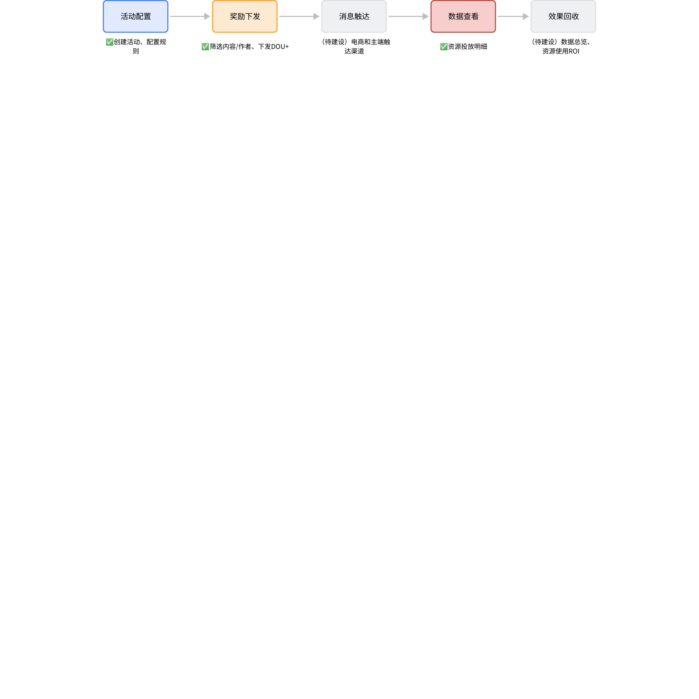
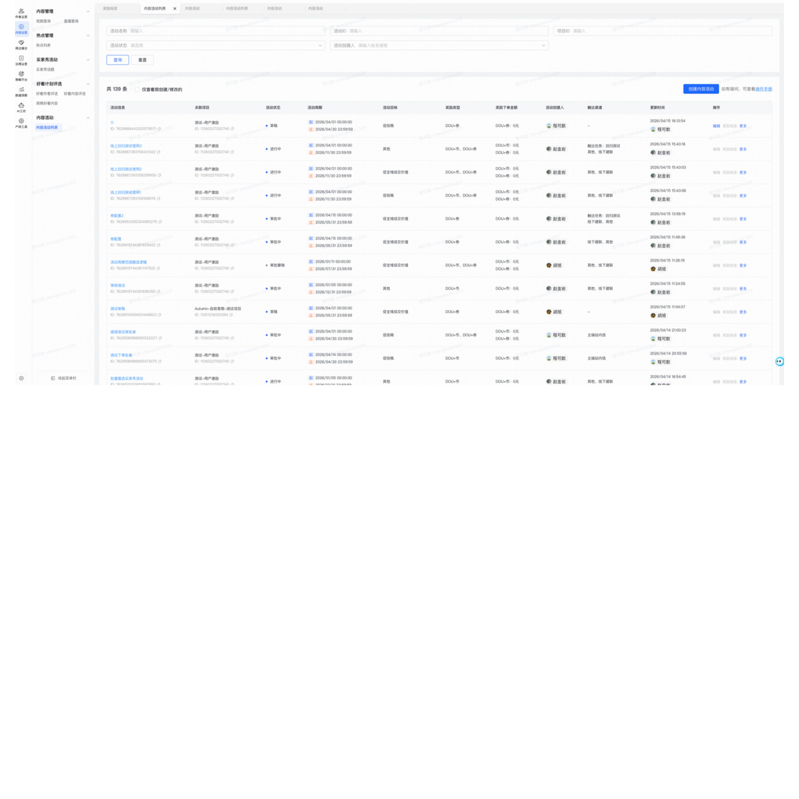
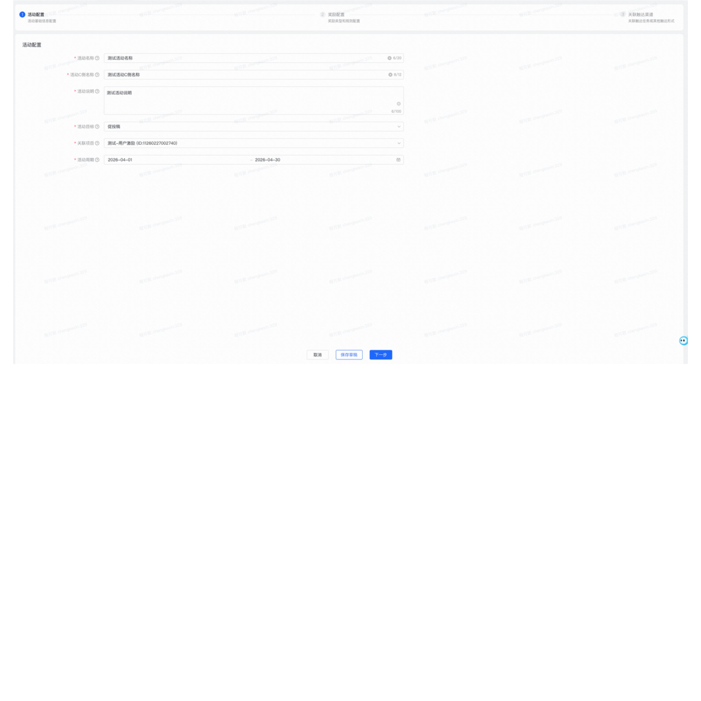
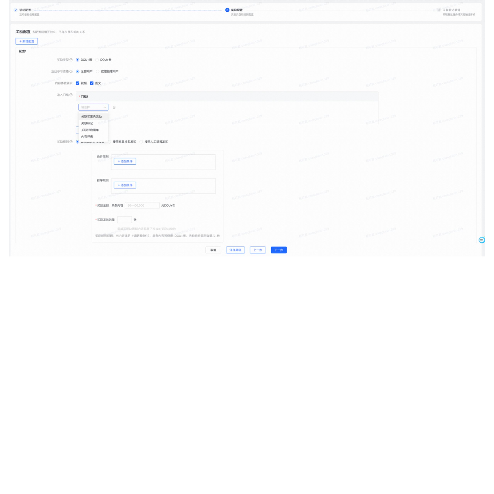
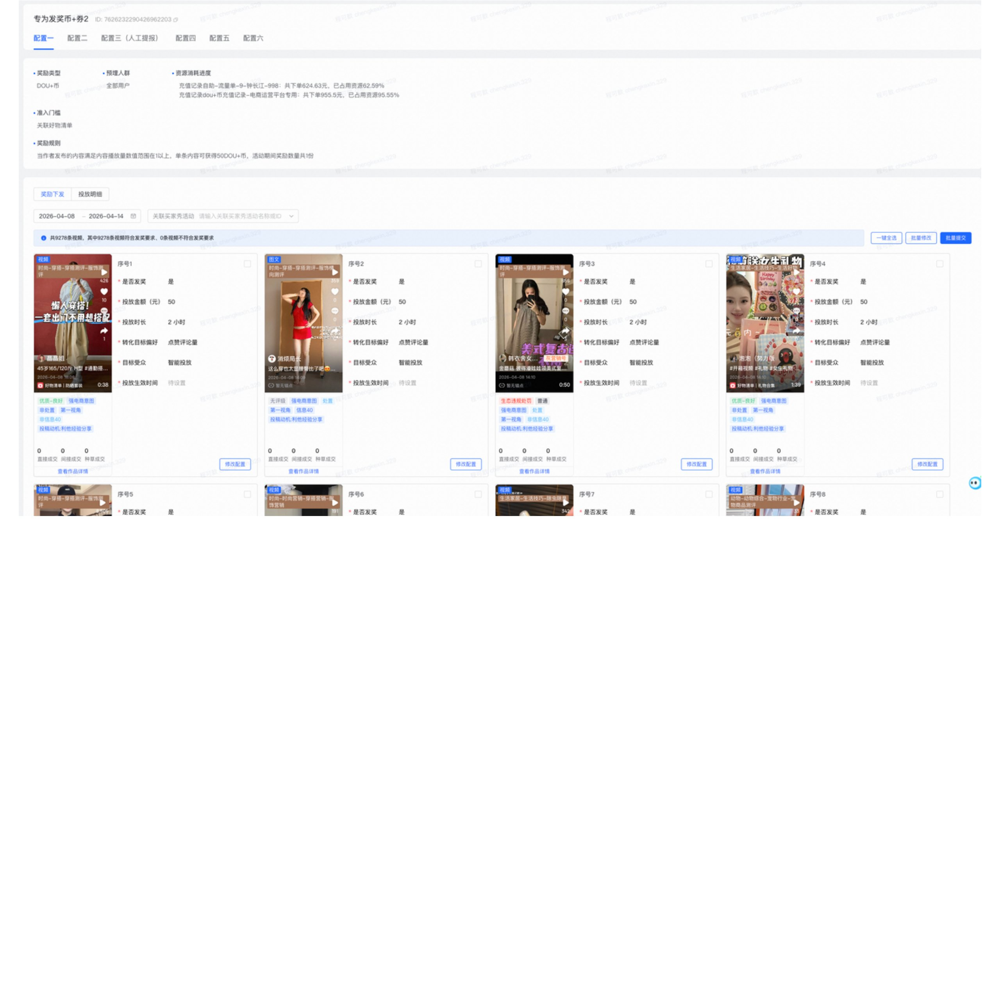
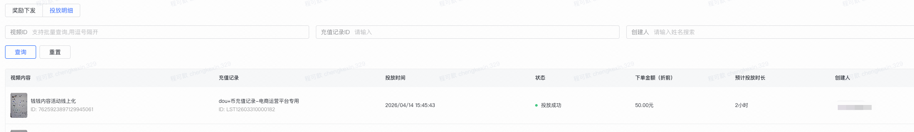
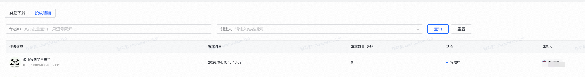

# 🌳「欢迎翻阅」运营平台_内容活动使用指南

> 来源：[飞书文档](https://bytedance.larkoffice.com/wiki/MNp5wtdBWixrfwk5bKncIKMwn5f?from=from_parent_docx)  
> 飞书版本：revision 3351

“可放心食用，虽然一开始用了 Aime，但已被我人工彻头彻尾地改过了🧵”

> 本文档旨在帮助大家快速上手、正确使用内容活动后台。如有使用疑问未在文档中注明，可直接评论提问。  
> 平台指路：橙蕉内容生态运营-内容运营-内容活动，[一键触达](https://ecop.bytedance.net/alliance-operation-content/content-activity/list?cjSiteCode=St12502250000001)。

## 平台提供哪些能力

整体流程围绕以下环节展开：

活动配置 -> 奖励下发 -> 消息触达（待建设）-> 数据查看 -> 数据回收（待建设）

[内容活动整体流程原始节点 JSON](history/运营平台_内容活动使用指南_assets__whiteboard-01-capability-flow.json)

**适用场景：**

本功能适用于内容运营团队需要通过发放 DOU+ 资源（含 DOU+ 币和 DOU+ 券）来激励作者、提升内容热度的业务场景，例如：

- **标记/好物清单/买家秀活动：**激励用户产出优质 UGC 内容，提升内容数量与质量。
- **其他内容激励项目：**任何涉及对优质内容或满足电商业务导向的作者进行 DOU+ 流量奖励的场景。
- 若当前能力未完全满足业务使用诉求，可根据[找人地图](https://bytedance.larkoffice.com/docx/T1GUd48luoldXBxAsctcUzG8nZf#share-KJL3dc4YMo5d6Vx83QRcjHxHnNg)指引和产品提需沟通。

**名词解释：**

- DOU+ 是可以为创作者短视频/直播间提供流量扶持的工具，如增加播放量、粉丝量、直播间热度等。
  - DOU+ 币是内部投放的奖励，可直接投放给指定内容，如视频/图文或直播间。
  - DOU+ 券是对外发放的奖励，主要面向作者账号。发放成功后，作者可自行投放 DOU+。
- 请注意，挂车和部分锚点的场景不可使用 DOU+ 资源。

> **温馨提示**
>
> - 目前内容活动**仅支持下发 DOU+ 资源**（含 DOU+ 币和 DOU+ 券），且需要先在橙蕉项目管理平台立项通过后才可创建活动；在完成充值记录（需选择「电商运营平台」）后才可下发奖励。
> - 2026 年 7 月 9 日上线 DOU+ 券发放成功后自动下发站内信的功能。DOU+ 币，即给作品下发的场景，尚未支持。

---

## 一、内容活动列表

> 内容活动列表展示全部已创建的活动。可以在这里筛选、查看、搜索所有活动，并进行快捷操作。

[内容活动列表原始节点 JSON](history/运营平台_内容活动使用指南_assets__whiteboard-02-activity-list.json)

> **权限说明**
>
> - 默认情况下，列表会展示全部已创建的活动，包括**你创建的及别人创建的**活动，支持查看列表内的任意活动。
> - 但仅支持对**自己有权限（自己创建）**的活动进行编辑、奖励投放、撤销审批、下线活动等操作。

### 页面功能说明

#### 1. 筛选功能

| 筛选字段 | 说明 |
| --- | --- |
| 活动名称 | 创建活动时设置的活动名称，用于平台识别。 |
| 活动 ID | 根据创建的活动，平台自增的活动 ID，具有唯一标识能力。 |
| 项目 ID | 活动所绑定的[橙蕉项目](https://ecop.bytedance.net/activityManage/project/list?cjSiteCode=St12403140000002) ID，是活动预算和资源的来源。 |
| 活动状态 | 活动当前所处的生命周期阶段，例如“进行中”“已结束”等。 |
| 活动创建人 | 活动的创建人。 |

#### 2. 列表字段说明

| 列表字段 | 说明 |
| --- | --- |
| 活动信息（活动名称、活动 ID） | 创建活动时设置的活动名称和平台自增的活动 ID，用于平台识别。 |
| 关联项目（项目名称、项目 ID） | 活动所绑定的橙蕉项目，是活动预算和资源的来源。 |
| 活动状态 | 活动当前所处的生命周期阶段，例如“进行中”“已结束”等。 |
| 活动周期 | 创建活动时设置的活动开始与结束时间。 |
| 活动目标 | 创建时选择的活动目标，例如“促投稿”“促全域成交价值”等。 |
| 奖励类型 | 创建活动时在奖励配置中选择的奖励类型，包含 DOU+ 币、DOU+ 券。 |
| 奖励下单金额 | 该活动下已经下发的奖励总金额，单位为元。这里指 DOU+ 券和 DOU+ 币的下单金额，和实际消耗无关。 |
| 活动创建人 | 创建该活动的用户信息。 |
| 触达渠道 | 创建活动时关联的触达渠道，如站内信、企微等。这里仅做关联，不能实际影响下发行为。 |
| 更新时间 | 活动最近一次更新的时间和操作人。 |

#### 3. 操作项

> **关于活动修改与下线的重要提示**
>
> - **目前仅支持【准入门槛】的修改：**一旦活动进入“待开始”或“进行中”状态，除准入门槛外，其他所有配置项将被锁定，**不可修改**。如需调整，唯一办法是**下线当前活动，然后复制并创建一个新活动**。
> - **下线操作影响：**下线是不可逆操作，会立即中止活动。这可能导致活动周期与预期不符，并增加重复发奖或漏发奖的风险，请务必谨慎。

每条活动记录后方都有一系列快捷操作按钮，其可用性取决于活动权限和活动状态：

| 操作项 | 功能说明 | 可用状态 |
| --- | --- | --- |
| 编辑 | 修改活动配置；仅**活动创建人**可点击。 | 草稿中、审批撤销、审批不通过 |
| 奖励投放 | 进入该活动的奖励下发页面，审核获奖作品/作者并执行奖励投放；仅**活动创建人**可点击。 | 进行中 |
| 复制 | 复制一份全新的活动配置，方便快速创建相似活动；能看到该活动的用户都可以操作。 | 所有状态 |
| 查看审批流 | 跳转查看活动的审批进度和节点；能看到该活动的用户都可以操作。 | 审批中、审批通过、审批不通过 |
| 撤销审批 | 撤回正在审批中的活动；仅**活动创建人**可点击。 | 审批中 |
| 下线活动 | 强制中止正在进行中的活动，请务必谨慎；仅**活动创建人**可点击。 | 进行中 |

---

## 二、如何创建内容活动

> 创建活动是整个链路的起点。活动创建涉及三个步骤：**活动配置 -> 奖励配置 -> 触达渠道。**

### 步骤一：活动基础配置

> STEP1 活动配置：用于定义活动的基本信息和目标等基础配置项。

[活动基础配置原始节点 JSON](history/运营平台_内容活动使用指南_assets__whiteboard-03-basic-config.json)

| 配置项 | 填写说明与示例 |
| --- | --- |
| 活动名称 | **必填。**平台内部识别的名称，限制 20 字以内，**不对创作者展示**。示例：3 月买家秀投稿激励活动。 |
| 活动 C 侧名称 | **必填。**用于发送给创作者的站内信中展示的活动名称，限制 12 字以内。示例：春日好物开箱。奖励下发成功后自动下发站内信的功能还没实现，如有通知作者的需求，**仍需手动下发站内信**。 |
| 活动说明 | **必填。**活动的内部简介，便于团队成员理解活动背景，限制 100 字以内。 |
| 活动目标 | **必填，单选。**从“促投稿”“促全域成交价值”“其他”中选择，明确活动核心目的。 |
| 关联项目 | **必填。**从下拉框中选择一个橙蕉项目，这是活动预算的来源。系统会自动拉取你在橙蕉平台有权限且在有效期内的项目列表。如没有可选项目，请先到[橙蕉项目管理平台](https://ecop.bytedance.net/activityManage/project/list?btm_ppre=a41971.b0.c0.d0&btm_pre=a41971.b0.c0.d0&btm_show_id=c1f4071d-3c3a-4679-92ae-fabcdddb43ec&cjSiteCode=St12403140000002)立项。 |
| 活动周期 | **必填。**设置活动的开始与结束时间。活动周期必须在所选关联项目的有效期内。 |

> **关于“关联项目”的权限说明**
>
> - 你可以关联**你是其团队成员**的橙蕉项目。
> - 根据最新规则，如果你**有权限支配某个项目下的预算单**，即使你不是项目成员，也可以关联该项目。这个设计是为了更贴合实际资源使用场景，并通过后续审批流控制风险。

### 步骤二：奖励与准入配置

> STEP2 奖励配置：这是活动创建的核心，需要在这里定义“什么样的内容/作者可以获奖”以及“奖励什么”。

[奖励与准入配置原始节点 JSON](history/运营平台_内容活动使用指南_assets__whiteboard-04-reward-config.json)

#### 1. 准入门槛配置

> 准入门槛定义了内容/作者进入奖励候选池的**基本资格。各配置项间相互独立，没有「或」或「且」的关系。**

| 配置项 | 填写说明与示例 |
| --- | --- |
| 奖励类型 | 每个配置项下为单选，可选择 DOU+ 币或 DOU+ 券。DOU+ 币下发给满足配置条件的作品；DOU+ 券下发给发布了满足配置条件作品的作者。 |
| 活动参与资格 | 只有符合活动参与资格的用户投稿的作品才有机会获奖。如果不限制参与活动的作品/作者，选择「全部用户」；如果限制只有指定作者或指定作者发布的作品才可获奖，选择「预埋用户」，这里使用塔阁人群包能力。 |
| 内容体裁要求 | 如果不限制可获奖作品类型，可以全选。若限制仅某个体裁的作品获奖，可以选择视频或图文。口径为 `MediaType` 字段，和运营平台作品卡左上角的体裁类型取数口径一致。 |
| 准入门槛 | 满足准入门槛要求的作品，或发布了满足准入门槛要求作品的作者，才有获得奖励的资格。 |
| 奖励规则 | 见下方 DOU+ 币和 DOU+ 券的奖励规则配置说明。 |

准入门槛目前支持：

- **买家秀活动：**仅支持关联在活动周期内的买家秀活动，否则搜索不到。
  - 如需查看买家秀活动有效期，可到内容运营_买家秀活动_买家秀话题中查看。
  - 批量上传场景请务必按照飞书表格内的说明操作。
- **标记：**目前仅支持全部挂载了标记的场景，无法指定 SPU 进行关联。
- **好物清单：**目前仅支持全部挂载了标记的场景，无法指定 SPU 进行关联。
- **内容评级：**支持多选。
- **关联话题：**支持手动输入和飞书表格上传两种形式，上限均为 500 条。
  - 若活动期间修改或增删话题，在修改飞书表格内容后，务必在活动配置页再次重新上传飞书表格链接，即使链接与之前一致也要重新上传并提交。
- **电商意图：**支持多选，包括强电商意图、弱电商意图。
- **UGC 内容类型：**UGC 目标内容。
- 同一准入门槛下，各条件间关系为「且」。
- 不同准入门槛下，各门槛间关系为「或」。

> **重要提示**
>
> - 进行奖励投放时，会严格按照 STEP2 奖励配置的准入门槛准入作品/作者，并按照奖励规则对需要下发的奖励进行自动匹配。
> - 系统会自动**剔除所有挂车作品**，确保 DOU+ 投放的合规性。

#### 2. 奖励规则配置（DOU+ 币）

> 当奖励类型为 **DOU+ 币**时，可以根据不同策略配置发奖规则。**DOU+ 币的发奖对象为作品。**

##### 按指定条件发奖

为满足特定数据表现的作品设置固定奖励。

- **条件限制：非必选**
  - 设置内容播放量、全域成交价值、账号粉丝量等指标的阈值。
  - 若不设置上限，可不填右侧输入框。
  - 各条件间关系为「且」。
- **排序规则：非必选**
  - 在满足条件的内容中，按内容播放量或全域成交价值排名，筛选出 Top N。
  - 内容播放量和全域成交价值仅支持二选一配置。
- **奖励金额：必填**
  - 为符合条件的单条内容设置固定 DOU+ 币金额，需为 10 的倍数，范围为 50～400,000。
- **奖励发放数量：必填**
  - 需填写活动周期内该配置下发放的奖励总份数。
- **预估奖励金额：平台自动计算**
  - 计算公式：`∑（奖励金额 × 奖励发放数量）`。

##### 按权重排名发奖

综合多个指标的表现，计算加权总分并按排名发奖。

- **权重配置：必填**
  - 为内容播放量、全域成交价值等指标分配权重，总和为 100%。
  - 计算公式：`∑（各条件设置的权重 × 达人条件完成值）`。
- **奖励配置：必填**
  - 为不同排名区间的作品设置不同的奖励金额。

##### 按人工提报发奖

> 谨慎使用该场景，人工提报的作品需要注明提报理由。

运营手动提交内容列表进行发奖，适用于特殊场景。

- **提报方式：**在奖励投放环节（活动进行中）支持手动输入或通过表格批量上传，单次上限均为 50 条。
- **奖励配置：**为提报的内容设置一个固定的奖励金额范围。

#### 3. 奖励规则配置（DOU+ 券）

> 当奖励类型为 **DOU+ 券**时，配置分为“券的配置信息”和“获得券的条件”。**DOU+ 券的发奖对象为作者。**

##### 3.1 券的配置

**满赠券**

| 配置项 | 配置说明 |
| --- | --- |
| 使用门槛 | 优惠券使用门槛，不可超过 200,000。 |
| 赠送金额 | 满赠金额，不可超过 10,000。 |
| 总券数 | 该配置预计下发的 DOU+ 券总数，可以填写多一些。 |
| 单用户领取限制 | 每位用户最多可以收到的张数，尽量填 1，后续资管也会约束发奖行为。 |
| 用户身份限制 | 可获得该 DOU+ 券的用户身份限制。 |
| 苹果支付限制 | 除部分满赠券场景外，满减券和折扣券均无法在 IAP 场景下使用。 |
| 自代投限制 | 全部、仅限自投、仅限代投。 |
| 视频和直播限制 | 全部、仅限视频、仅限直播。 |
| 券对外展示名称 | 会透传到 C 侧，请谨慎填写。 |

**折扣券**

| 配置项 | 配置说明 |
| --- | --- |
| 使用门槛 | 优惠券使用门槛，不可超过 200,000。 |
| 折扣比例 | 限制 0.01～9.99 的数字，支持两位小数。 |
| 总券数 | 该配置预计下发的 DOU+ 券总数，可以填写多一些。 |
| 最高使用金额 | 使用该折扣券时限制的最大可用金额，超出该金额的部分不支持折扣。 |
| 单用户领取限制 | 每位用户最多可以收到的张数，尽量填 1，后续资管也会约束发奖行为。 |
| 用户身份限制 | 可获得该 DOU+ 券的用户身份限制。 |
| 苹果支付限制 | 不支持苹果支付。除部分满赠券场景外，满减券和折扣券均无法在 IAP 场景下使用。 |
| 自代投限制 | 全部、仅限自投、仅限代投。 |
| 视频和直播限制 | 全部、仅限视频、仅限直播。 |
| 券对外展示名称 | 会透传到 C 侧，请谨慎填写。 |

**满减券**

| 配置项 | 配置说明 |
| --- | --- |
| 使用门槛 | 优惠券使用门槛，范围为 1～10,000。 |
| 优惠金额 | 需要小于使用门槛。 |
| 总券数 | 该配置预计下发的 DOU+ 券总数，可以填写多一些。 |
| 单用户领取限制 | 每位用户最多可以收到的张数，尽量填 1，后续资管也会约束发奖行为。 |
| 用户身份限制 | 可获得该 DOU+ 券的用户身份限制。 |
| 苹果支付限制 | 不支持苹果支付。除部分满赠券场景外，满减券和折扣券均无法在 IAP 场景下使用。 |
| 自代投限制 | 全部、仅限自投、仅限代投。 |
| 视频和直播限制 | 全部、仅限视频、仅限直播。 |
| 券对外展示名称 | 会透传到 C 侧，请谨慎填写。 |

##### 3.2 准入门槛配置

满足**发布了满足准入门槛要求作品的作者**才有获得奖励的资格。

- 目前支持买家秀活动、标记、好物清单、内容评级。
- 买家秀活动仅支持关联在活动周期内的活动，否则搜索不到。
  - 如需查看活动有效期，可到内容运营_买家秀活动_买家秀话题中查看。
  - 批量上传场景请务必按照飞书表格内说明操作。
- 标记和好物清单目前仅支持全部挂载场景，无法指定 SPU。
- 内容评级支持多选。
- 同一准入门槛下，各条件间关系为「且」。
- 不同准入门槛下，各门槛间关系为「或」。

##### 3.3 奖励规则配置

**按指定条件发奖**

为发布了特定数据表现作品的作者设置固定奖励。

- **条件限制：非必选**
  - 设置发布内容量、内容播放量、全域成交价值、账号粉丝量等指标的阈值。
  - 账号粉丝量目前用的是服务端粉丝数，和 C 侧个人页看到的数值会有些出入，发奖时请谨慎。
  - 若不设置上限，可不填右侧输入框。
  - 各条件间关系为「且」。
- **排序规则：非必选**
  - 在满足条件的内容中，按发布内容量、内容播放量或全域成交价值排名，筛选出 Top N。
  - 发布内容量、内容播放量和全域成交价值仅支持三选一配置。
- **奖励金额：平台自动回显**
  - 自动回显该配置下的 DOU+ 券类型。
- **奖励发放数量：必填**
  - 需填写活动周期内该配置下发放的奖励总份数。如发奖周期为周维度，奖励总份数需要乘以活动周期内的周数。
- **发奖频率：必填，务必谨慎选择**
  - 活动期间发放 DOU+ 券的频率。只能根据发奖频率进行发奖，活动提交后不可更改。
  - 奖励投放时只能根据所选的每日/每周/每双周频率发奖。
  - 数仓会前置根据所选发奖频率统计奖池作者名单。
- **预估奖励金额：平台自动计算**
  - 计算公式：`∑（赠送金额/优惠金额/最高折扣金额 × 奖励发放数量）`。
  - 折扣券示例：`最高使用金额 ×（1 - 折扣比例/10）× 奖励发放数量`。

**按权重排名发奖**

综合多个指标的表现，计算加权总分并按排名发奖。

- **权重配置：必填**
  - 为发布内容量、内容播放量、全域成交价值等指标分配权重，总和为 100%。
  - 发布内容量仅统计满足该配置准入门槛的作品数。
  - 计算公式：`∑（各条件设置的权重 × 达人条件完成值）`。
- **奖励数量配置：必填**
  - 根据权重计算出的总分排名配置奖励数量。
  - 需填写活动周期内该配置下发放的奖励总份数。如发奖周期为周维度，奖励总份数需要乘以活动周期内的周数。

部分 DOU+ 资源下发异常或问题可查看：[盖亚-运营 DOU+（币/券）资源介绍、配置说明、投放被拒等常见问题解决办法](https://bytedance.larkoffice.com/wiki/Nui1wu77Vi39KLkQDIYc13hCn9c)。

### 步骤三：关联触达渠道

> STEP3 关联触达渠道：本期平台只支持关联已经创建好的触达任务（运营平台的触达任务）或主端已有渠道等，**仅做关联，并不影响实际触达行为。实际触达行为需要到目前支持的平台或产品模块进行操作。**

| 配置项 | 填写说明与示例 |
| --- | --- |
| 关联触达渠道 | **必填。**可关联[运营平台_作者运营_达人触达_触达任务（新）模块](https://ecop.bytedance.net/alliance-operation-scale/notice/list?cjSiteCode=St12502250000001)已创建好的任务；如无现成任务可新建，但任务需要走审批流程，可先保存活动草稿，待审批通过后再关联。也可关联主端或线下等其他触达形式。 |

#### 完成所有步骤并点击「提交」按钮后，活动将进入审批流程。审批通过后，活动不可再修改

- **活动创建审批**
  - 审批节点：活动创建后，需要经过**平台产品 -> 活动创建人 +1 -> 关联的橙蕉项目立项发起人**三级审批。
  - 特殊情况：如果创建人与项目立项发起人是同一人，则后者节点会自动跳过。
- **奖励下发审批**
  - 无需审批：为提升运营效率，DOU+ 币和 DOU+ 券的下发均**无需审批**，操作后直接执行。请务必在提交前仔细核对投放列表和金额。

## 三、如何下发奖励

> 奖励投放：当活动审核通过并进入「进行中」状态后，就可以通过“奖励投放”页面执行奖励下发。

[奖励投放流程原始节点 JSON](history/运营平台_内容活动使用指南_assets__whiteboard-05-reward-delivery.json)

> **重要提示**
>
> - 进行奖励投放时，会严格按照 STEP2 奖励配置的准入门槛准入作品/作者，并按照奖励规则自动匹配需下发的奖励。
> - 系统会自动**剔除所有挂车作品**，确保 DOU+ 投放合规。
> - 在橙蕉平台充值资源时，请务必选择「下单/制券场景」为「电商运营平台」，否则无法在运营平台发奖。

### 奖励投放

进入奖励投放页后，会看到以下核心区域：

1. 二级标题：该活动下全部的奖励配置。
2. 顶部奖励配置区。
3. 下方奖励下发和投放明细区。

#### 顶部区域

顶部展示当前活动配置的核心信息，包括奖励类型、准入门槛、奖励规则等。

| 展示项 | 展示说明 |
| --- | --- |
| 奖励类型 | DOU+ 券或 DOU+ 币。 |
| 预埋人群 | 全部人群或预埋人群关联的塔阁人群包。 |
| 资源消耗进度 | 展示该配置下使用过的充值记录。下单金额指该配置下使用该充值记录下单的总金额；占用比例指总下单金额/充值记录内总金额。这里不是资源实际消耗金额，目前平台未展示实际消耗金额，需要去盖亚查看。 |
| 准入门槛 | 该配置下的准入门槛。 |
| 奖励规则 | 该配置下的奖励规则。 |

#### 奖励下发

##### 2.1 DOU+ 币投放操作

> 每次仅支持给 50 条作品下发奖励，列表每个分页最多展示 50 条作品。某作品在该活动配置下已被投放过时，会在作品卡内标注提示。

**根据指定条件或按照权重发奖**

时间周期默认为**活动周期**，可以灵活选择周期内任意时间段筛选内容。统计的是发布时间在所选周期内的作品。

1. **提示说明**
   - 默认提示条包含满足当前配置准入门槛的作品数，以及当前列表所有分页合计展示的作品数。
   - 存在排名规则时：
     - 当满足准入门槛数 >= 排名数，列表展示排名数。
     - 当满足准入门槛数 < 排名数，列表展示门槛数。
     - 点击「补位」后，列表展示补位后的总作品数。
   - 不存在排名规则时，默认展示全部满足准入门槛的作品。
2. **筛选与检查**
   - 列表默认展示所有满足**准入门槛**和**奖励规则**的作品。
   - 可按买家秀活动、内容发布时间等进行二次筛选。
   - 每个内容卡片展示核心数据及根据规则预计算的“建议投放金额”。
   - 在当前活动任意配置下已投放成功或正常投放中的作品，会提示「已被投放过」。
3. **修改与配置**
   - 单条修改：可对单个视频的投放金额、投放时长、目标受众等微调。列表内投放金额按活动创建时的奖励规则自动回显。
   - 批量修改：勾选多个视频后统一设置投放参数。
4. **提交投放**
   - 勾选确认要投放的作品。
   - 点击“批量提交”。
   - 在弹窗中从活动关联的橙蕉项目中选择有效的 DOU+ 资源充值记录，系统会校验余额是否充足。
5. **特殊说明**
   - 未指定排序规则时，按作品发布时间倒排。
   - 按排名发奖时，如有部分内容不符合发奖要求，可在最后一个内容卡点击「点此补位」，补齐不满足条件的视频数。

**人工提报发奖**

- 奖励规则为“按人工提报发奖”时，点击“新增提报”，通过手动输入或上传表格提交视频列表。
- 提报后系统校验视频是否满足准入门槛，不满足的视频无法投放。
- 单次最多支持 50 条。
- 提报方式：手动输入、批量上传；批量上传时务必按照飞书表格说明填写。
- 奖励配置需填写所有必填项；列表内存在不满足发奖条件的作品时，不允许提交投放。

##### 2.2 DOU+ 券投放操作

> DOU+ 券的投放流程与 DOU+ 币类似，但核心操作对象是**作者**。每次仅支持给 50 位作者下发奖励，列表每个分页最多展示 50 位作者。某位作者在该活动配置下已被投放过时，会在作者卡内标注提示。

时间周期严格按照奖励配置中设置的**发奖频率**（每日/每周/每双周）限定。统计的是在所选周期内发布了满足准入门槛作品的作者。

1. **提示说明**
   - 默认提示条包含满足当前配置准入门槛的作者数，以及当前列表所有分页合计展示的作者数。
   - 存在排名规则时：
     - 当满足准入门槛数 >= 排名数，列表展示作者数。
     - 当满足准入门槛数 < 排名数，列表展示门槛数。
     - 点击「补位」后，列表展示补位后的总作者数。
   - 不存在排名规则时，默认展示全部满足准入门槛的作者。
2. **筛选与检查**
   - 列表默认展示所有满足**准入门槛**和**奖励规则**的作者。
   - 每个内容卡片展示作者信息及其满足准入门槛的作品，最多展示 3 条满足门槛的作品。
   - 在当前活动任意配置下已投放成功或正常投放中的作者，会提示「已被投放过」。
3. **修改与配置**
   - 单条修改：配置单个作者的领取有效期和使用有效期类型。
   - 批量修改：勾选多位作者后统一设置投放参数。单次提交的多位作者，领取有效期必须一致、使用有效期必须一致，推荐使用批量修改。
4. **提交投放**
   - 勾选确认要投放的作者。
   - 点击“批量提交”。
   - 在弹窗中从活动关联的橙蕉项目中选择有效的 DOU+ 资源充值记录，系统会校验余额是否充足。
5. **特殊说明**
   - 未指定排序规则时，按作者发布的满足准入门槛作品的总 VV 倒排展示。
   - 按排名发奖时，如有部分作者不符合发奖要求，可在最后一个作者卡点击「点此补位」，补齐不满足条件的作者数。

> **DOU+ 券制券失败风险**
>
> - DOU+ 券创建（制券）过程偶尔会失败，系统设置了自动通知机制。
> - 一旦制券失败，系统会立刻通过飞书向操作人发送紧急通知，提醒重新提交。
> - 可根据通知指引回到发奖页面，对失败批次重新投放。

### 投放明细

| 奖励类型 | 字段展示 |
| --- | --- |
| DOU+ 币 | 展示该配置下被投放过的作品明细。DOU+ 币存在投放失败或投放到一半被中止的情况，目前该场景不会在运营平台展示，需要到盖亚查看。 |
| DOU+ 券 | 展示该配置下被投放过的作者明细。如需查看券下发后的使用情况，需要到盖亚查看。 |

---

## 四、注意事项与风险提示

> **投放合规性**
>
> - **DOU+ 不适用于挂车视频：**系统在筛选奖励内容时，会自动剔除所有挂车作品。
> - **部分锚点限制：**除挂车外，部分特殊锚点（如小程序等）也可能不支持 DOU+ 投放，请在策划时注意规避。

> **数据时效性**
>
> - **人群包数据：**手动更新的人群包，最远只能圈选到**最近 180 天**内的数据。取数任务通常在**当天上午 08:00**完成，在此之后更新的人群信息需要次日才能生效。

> **活动中途修改风险**
>
> - **当前版本不支持进行中活动修改：**为保证数据一致性和资金安全，一旦活动审核通过，所有配置将被锁定。
> - **应对策略：**如确需调整，请**下线**当前活动，并通过“复制”功能创建一个新活动进行修改和重新审批。
> - **潜在影响：**下线再新建可能导致活动周期断裂，或在处理跨周期数据时出现重复发奖/漏发奖，需人工重点关注。

---

## 五、常见问题（FAQ）

**Q1：为什么在“关联项目”的下拉列表里找不到想关联的橙蕉项目？**

请检查：

1. 是否是该橙蕉项目的**团队成员**，或者是否有该项目下**预算单的使用权限**。
2. 该项目是否已经**立项成功**。
3. 该项目当前是否在**有效期内**。

**Q2：想添加一位同事一起管理活动，应该如何操作？**

目前暂不支持该操作。

**Q3：活动提交后发现配置错了，可以撤回吗？**

可以。只要活动状态处于“**审批中**”，可以在“内容活动列表”页找到该活动，点击“更多”，选择“**撤销审批**”。撤销后活动状态将变为“审批撤销”，可以重新编辑后再次提交。

**Q4：为什么奖励投放时提示“充值记录余额不足”？**

这说明所选橙蕉项目关联的 DOU+ 充值记录中，剩余可用金额已少于本次计划投放金额。可以：

1. 更换余额充足的充值记录。
2. 点击“**点此充值**”链接，跳转橙蕉平台为该项目申请新的资源。

部分 DOU+ 资源下发问题可查看：[盖亚-运营 DOU+（币/券）资源介绍、配置说明、投放被拒等常见问题解决办法](https://bytedance.larkoffice.com/wiki/Nui1wu77Vi39KLkQDIYc13hCn9c)。

---

## 六、版本与上线信息

| 日期 | 版本 | 核心变更内容 |
| --- | --- | --- |
| 2026-04-16 | V1.0 | **【内容活动线上化 MVP 版本上线】**支持活动创建 -> 奖励下发 -> 查看奖励下发明细。 |

## 七、找人地图

| 职能角色 | 联系人 |
| --- | --- |
| 平台产品 | 程可歆（有任何使用问题请先找产品） |
| 前端 | 张佳 |
| 后端 | 发奖：阎智超；活动创建：胡旭 |
| 数仓 | 姚子叶 |
