# 陈相实习生转正答辩

> **来源：** [飞书 Wiki](https://bytedance.larkoffice.com/wiki/U3F6wax76i66QtkXZYNcazidnsb)  
> **飞书版本：** 1

> **答辩人**：陈相　|　**入职时间**：2026 年 4 月 20 日　|　**实习出勤**：78 天
>
> **Mentor**：杨帆　|　**Leader**：周力　|　**团队**：电商内容运营大前端

## 基本信息

> **表格说明：** 原表包含合并单元格或复杂块内容，已按行列顺序展开；正文、代码、图片和白板均保留。

**姓名**

陈相

**入职时间**

2026 年 4 月 20 日

**实习出勤**

78 天

**Mentor**

杨帆

**Leader**

周力

**工作职责**

电商联盟运营平台作者运营

- 完成头达敏感数据权限管控需求
- 参与 AI Coding 研发工作流设计

**教育经历**

- 中国地质大学（武汉），计算机技术专业硕士在读
- 武汉科技大学，信息安全专业本科

**实习经历**

- 字节跳动 / 2026 年 4 月 20 日至今 / 技术实习生 / 电商内容运营大前端团队 / 上海
- 缔零智源科技有限公司 / 2026 年 1 月至 2026 年 4 月 / 前端研发实习生 / Web 前端研发组 / 武汉

---

## 业务方向与实习概览

### 业务概述

#### 作者运营 - 达人库

> [电商内容生态达人库白皮书](https://bytedance.larkoffice.com/docx/TqCed4vtaobOQxx4RpecatLOnkg)

**作者运营主要围绕电商作者的日常经营展开**，通过建联触达、任务牵引、货品撮合、咨询服务等方式，**帮助作者提升经营活跃度和交易表现**。由于平台作者数量多，不同作者所处的经营阶段、所属赛道和运营价值不同，因此作者运营不仅要解决“怎么服务作者”，还需要先明确“哪些作者由哪个团队、哪个运营负责”。

**达人库是作者运营中负责管理达人及其运营归属关系的核心工具**。它将达人、运营人员和运营团队之间的关系统一在线上管理，解决达人归属不清、跨团队流转依赖人工维护等问题。当达人的作者身份、所属赛道、引入状态等发生变化时，系统可以按照规则调整其运营归属，并支持 KA 运营、规模化运营等团队之间的转移和协作，让达人始终能够进入对应的运营团队继续跟进。

**在具体产品上，达人库包括电商达人库、团队达人库和我的达人库三个主要部分**。电商达人库用于查看全量电商达人信息、当前归属和历史流转情况；团队达人库用于团队内达人的分配、认领和跨团队转移；我的达人库则用于运营管理自己负责、重点关注和协作的达人。通过这套能力，运营能够清楚知道自己需要服务哪些达人，也为后续的重点作者跟进、规模化运营以及 Agent 服务提供统一的达人管理基础。

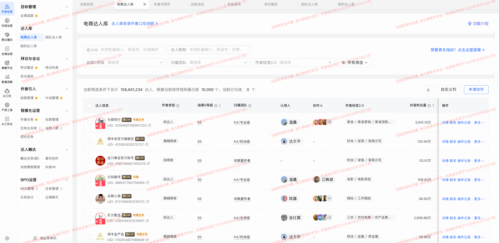

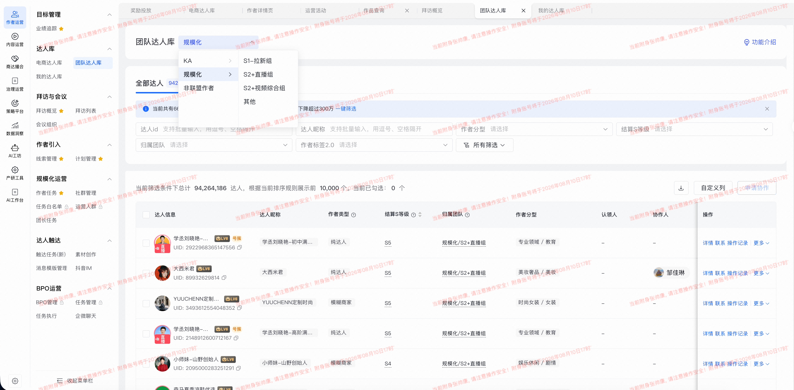

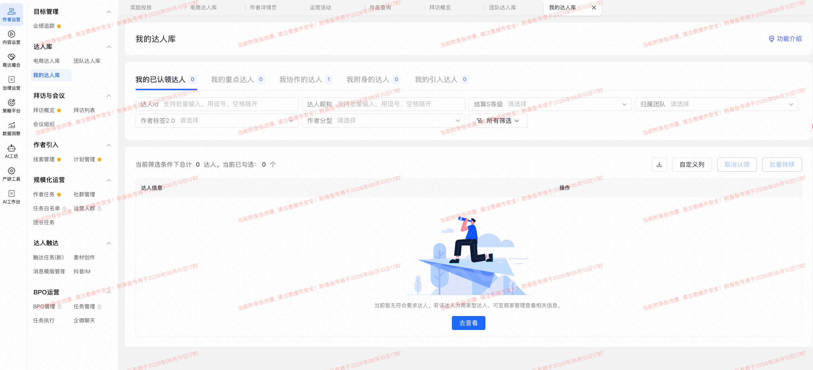

#### 内容运营 - 内容活动

> [🌳「欢迎翻阅」运营平台_内容活动使用指南](https://bytedance.larkoffice.com/wiki/MNp5wtdBWixrfwk5bKncIKMwn5f)

**内容运营主要围绕电商内容供给和内容质量开展**，通过明确内容标准，对平台上的电商内容进行识别、评级和运营牵引，持续提升优质内容供给，并带动内容消费和交易增长。当前内容运营的重点包括视频管理、内容评级和热点运营等能力，**一方面帮助运营看清平台内容供给和质量情况，另一方面通过流量、活动等方式引导作者生产更多符合电商内容标准的作品**。

**内容活动是内容运营中用于进一步激励作者投稿和优质内容生产的重要运营手段。**运营可以围绕促投稿、促全域成交价值等目标设计活动，通过设置参与人群、内容准入条件和奖励规则，将 DOU+ 等流量资源投放给符合要求的作品或作者，从而激励作者参与活动、持续投稿，并提升优质内容的数量和热度。当前主要应用于标记、好物清单、买家秀等内容激励场景。

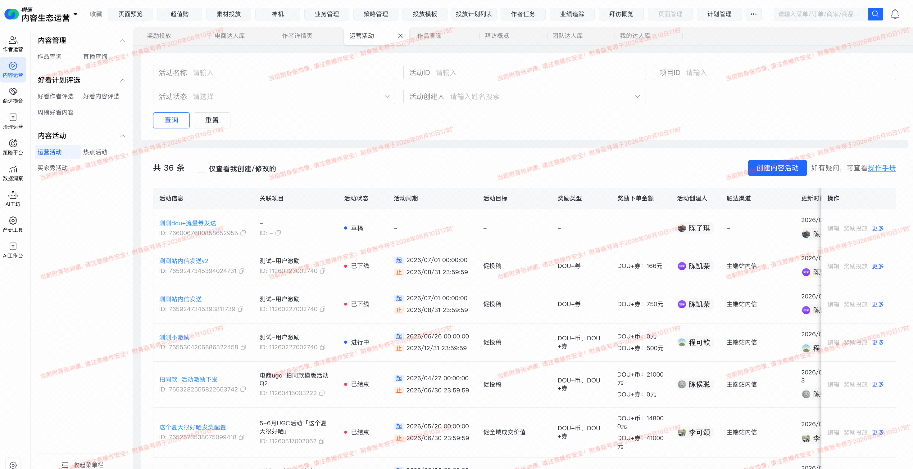

### 工作里程碑

实习期间参与作者运营的达人库建设，以及内容运营的运营活动建设，承担相关需求的方案设计、开发联调和上线交付， 并在技术上针对电商业务需求研发参与 AI Coding 研发工作流的设计。

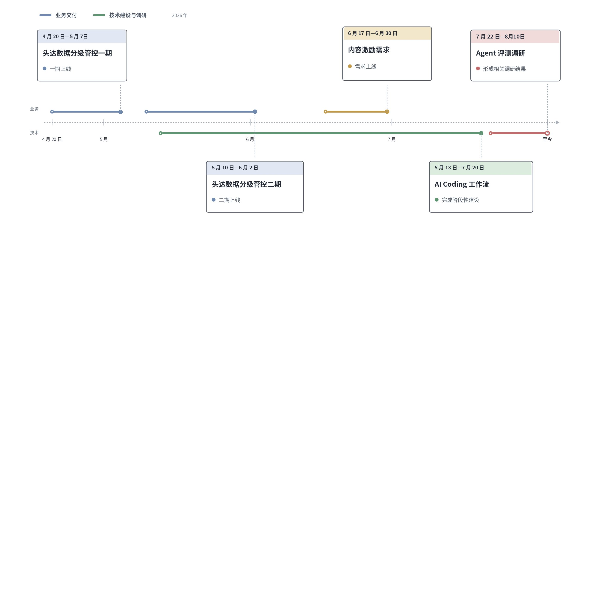

[白板 05 原始节点数据](history/陈相实习生转正答辩.assets__005_whiteboard_UseBwQtI_nodes.json)

> **表格说明：** 原表包含合并单元格或复杂块内容，已按行列顺序展开；正文、代码、图片和白板均保留。

**记录 1**

**工作**

**头达数据分级管控一期**

**时间周期**

- FE开发：4 PD（4 月 22 日至 4 月 27 日）；
- 联调：4 PD（4 月 28 日）；
- 测试：3 PD（4 月 28 日, 自测 0 Bug）；

**记录 2**

**工作**

**头达数据分级管控二期**

**时间周期**

- FE 开发：5 PD（5 月 12 日至 5 月 18 日）；
- 联调：6 PD（5 月 19 日至 5 月 20 日）；
- 测试：1 PD（5 月 21 日， 自测 0 Bug）；

**记录 3**

**工作**

**内容激励需求**

**时间周期**

- FE开发：3 PD（6 月 18 日至 6 月 23 日）；
- 联调：4PD （6 月 24 日至 6 月 25日）；
- 测试：1 PD（6 月 26日， 自测 0 Bug）；

**记录 4**

**工作**

**AI Coding 工作流**

**时间周期**

5 月 13 日 - 7 月 20 日

**记录 5**

**工作**

**Agent 评测调研**

**时间周期**

7 月 22 日 - 8 月 10 日

---

## 重点工作

### 运营平台_作者运营_头达数据分级管控&监控预警

| **业务方向** | **需求介绍** | **实现目标** | **Meego** | **研发人员** |
| --- | --- | --- | --- | --- |
| **作者运营** | 头部达人交易数据被持续引用和传播，暴露出敏感数据在查询、导出和访问追溯上的风险 | 限制非相关人员查看和导出头达敏感数据，记录关键访问行为，为异常访问追溯和预警提供依据 | [[需求]【运营平台】基建_头达数据分级管控&监控预警](https://meego.larkoffice.com/e-commerce/story/detail/7112607004?parentUrl=%2Fe-commerce%2Fstory%2Fhomepage&openScene=4) [[需求]【运营平台】基建_头达数据分级管控&监控预警_2期](https://meego.larkoffice.com/e-commerce/story/detail/7305546530?parentUrl=%2Fe-commerce%2Fstory%2Fhomepage&openScene=2) | FE：陈相 Server:李家鑫、赵银、张心怡 |

#### 需求背景

一次外部舆情事件中，媒体持续引用和传播平台头部达人的销量、销售额等交易数据。这说明现有链路在查询权限、导出限制和访问记录方面仍不够完善，**存在敏感数据被非必要查看、对外传播后又难以追溯的问题**。因此，**平台启动头达数据分级管控专项，对敏感数据实行分级授权**，并补齐查看记录和异常访问预警能力。

> [【PRD】运营平台_作者运营_头达数据分级管控&监控预警](https://bytedance.larkoffice.com/wiki/KpiAwCO8qimIlGkYw5kc5ldMn2f)

##### **业务目标**

本次管控的核心目标是**根据访问者身份和数据权限，控制头达敏感数据的可见范围**。页面将敏感数据的访问与展示分为四种状态：非协作人、无数据权限、待确认查看和展示真实数据。

1. **非协作人**：L4+ 数据需先申请协作人

> 访问 L4+ 数据时，如果当前人员不是该作者的协作人，页面不展示真实数据，并提供“申请协作人”入口。

> **表格说明：** 原表包含合并单元格或复杂块内容，已按行列顺序展开；正文、代码、图片和白板均保留。

**记录 1**

**字段粒度**

敏感值显示为 ****，鼠标移入后说明暂无查看权限，并提供"申请协作人"入口。

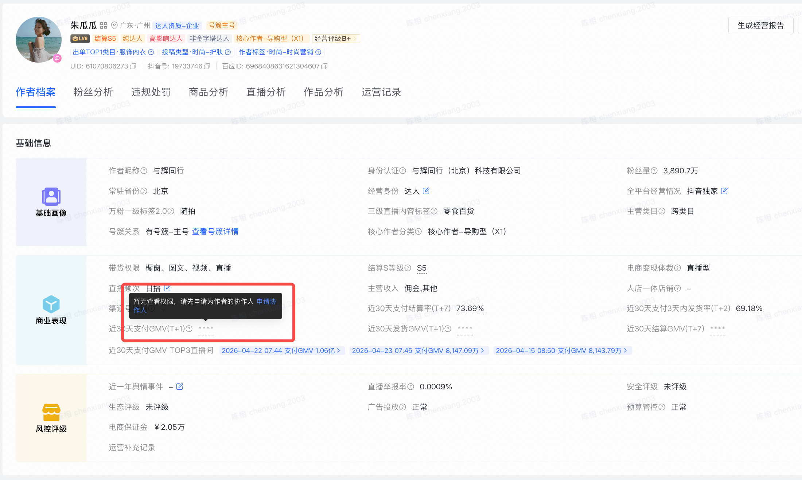

**模块粒度**

整个模块不展示真实内容，页面保留模块区域，并提供"申请协作人"按钮。

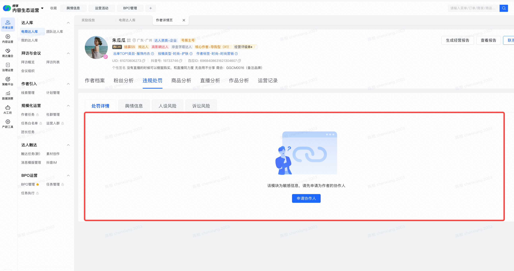

1. **无数据权限**：需先申请对应权限

> 当前人员没有对应的数据权限时，页面不展示真实数据，并提供权限申请入口。

> **表格说明：** 原表包含合并单元格或复杂块内容，已按行列顺序展开；正文、代码、图片和白板均保留。

**记录 1**

**字段粒度**

敏感值显示为 ****，鼠标移入后提示该字段为敏感信息，并提供"立即申请"入口。


**模块粒度**

整个模块使用无权限页面覆盖，用户可在模块内直接发起权限申请。

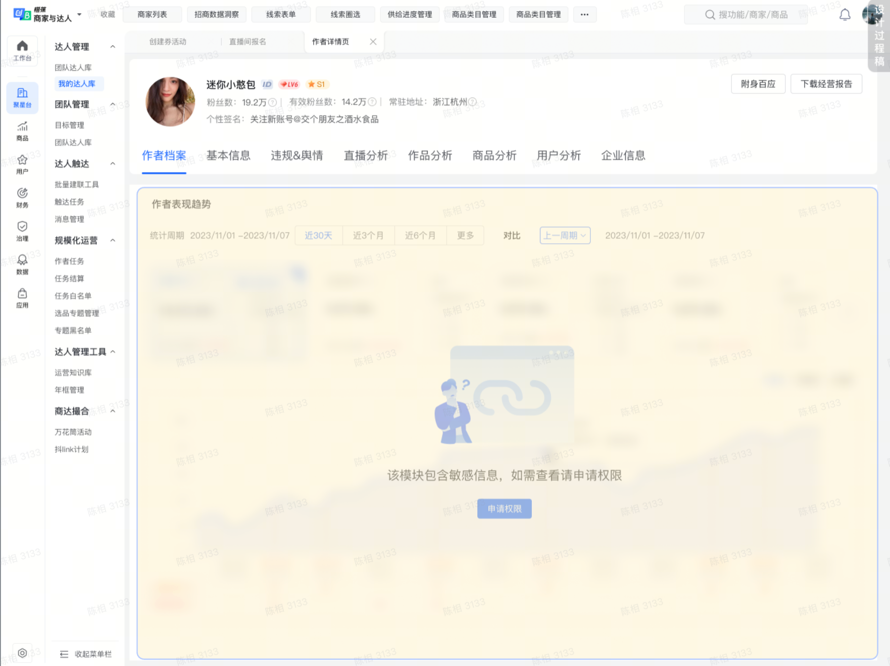

1. **已有数据权限**：待主动确认查看

> 当前人员已有数据权限，但近 7 天没有主动确认过查看时，真实数据仍默认隐藏。确认查看后，页面展示真实数据，并记录本次查看行为。

> **表格说明：** 原表包含合并单元格或复杂块内容，已按行列顺序展开；正文、代码、图片和白板均保留。

**记录 1**

**字段粒度**

敏感值显示为 ****，用户点击小眼睛后查看真实值。

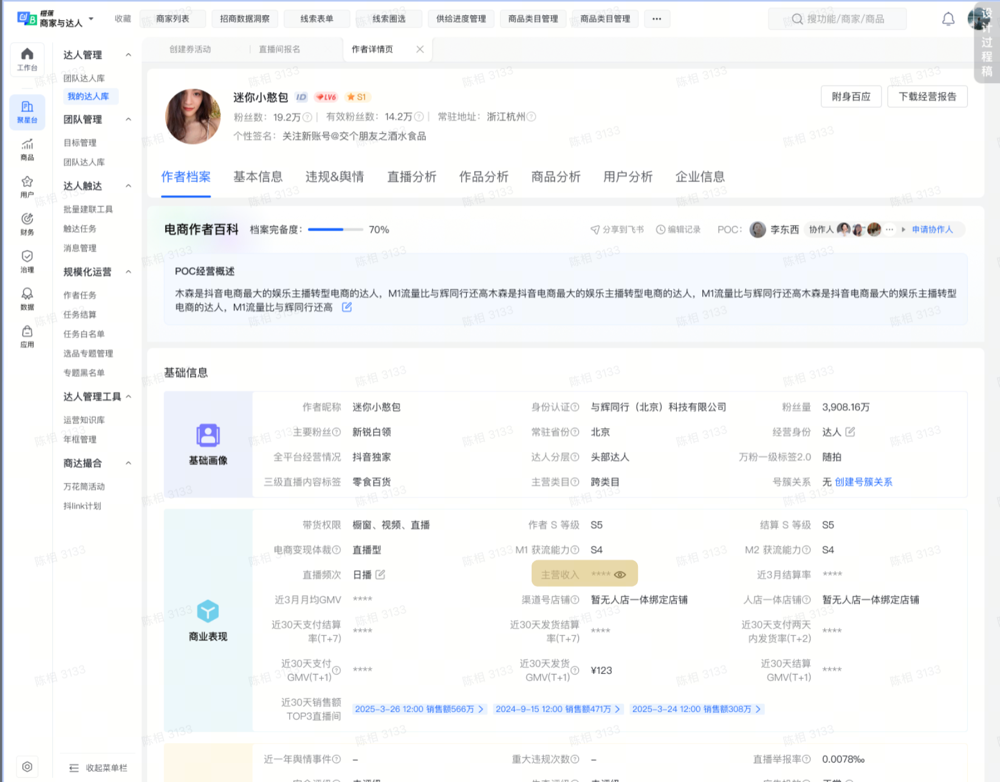

**模块粒度**

模块保留原有页面结构，并用遮罩覆盖敏感内容；用户点击"继续查看"后展示真实数据。


1. **需求链路：**运营人员进入页面后，按照页面数据“是否属于管控范围 —> 是否为 L4+ 数据 —> 是否为作者协作人 —> 是否拥有数据权限 —> 近七天是否确认查看”的顺序完成访问。

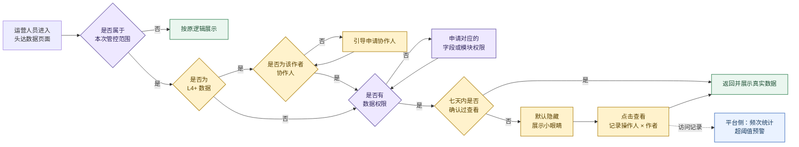
```mermaid
flowchart LR
    U["运营人员进入<br/>头达数据页面"] --> S{"是否属于<br/>本次管控范围"}
    S -- "否" --> N["按原逻辑展示"]
    S -- "是" --> L{"是否为<br/>L4+ 数据"}

    L -- "是" --> C{"是否为该作者<br/>协作人"}
    C -- "否" --> CA["引导申请协作人"]
    CA --> C
    C -- "是" --> P
    L -- "否" --> P{"是否有<br/>数据权限"}

    P -- "否" --> M["申请对应的<br/>字段或模块权限"]
    M --> P

    P -- "是" --> E{"七天内是否<br/>确认过查看"}
    E -- "是" --> D["返回并展示真实数据"]
    E -- "否" --> H["默认隐藏<br/>展示小眼睛"]
    H --> R["点击查看<br/>记录操作人 × 作者"]
    R --> D
    R -. "访问记录" .-> W["平台侧：频次统计<br/>超阈值预警"]

    classDef phase1 fill:#EEE8FF,stroke:#6D5CA8,color:#30265A,stroke-width:1.4px;
    classDef phase2 fill:#FFF2CC,stroke:#B58B22,color:#5A4100,stroke-width:1.4px;
    classDef result fill:#EAF6EF,stroke:#3F8A5E,color:#1F5135,stroke-width:1.4px;
    classDef platform fill:#EAF2FF,stroke:#4C78C2,color:#173A5E,stroke-width:1.4px;

    class S,P,M phase1;
    class L,C,CA,E,H,R phase2;
    class N,D result;
    class W platform;
```

#### 技术方案

##### **安全边界：真实数据必须在后端进行权限校验**

> **核心问题：如何保证真实数据的安全性？**
>
> 如果后端先返回真实数据，再由前端隐藏，仍然可以通过抓包或浏览器调试工具获取，页面上的遮罩无法解决数据泄露风险。

**设计方案：**后端负责权限判断和字段脱敏。权限校验通过时返回真实数据；未通过时只返回脱敏结果和权限状态。**需要脱敏的数据未通过权限校验时，真实值不能下发到浏览器。前端不接触无权限的真实值，只负责识别返回状态、展示结果并提供后续操作入口。**

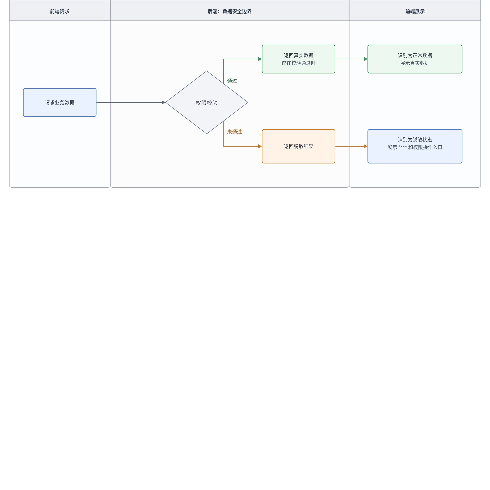

[白板 12 原始节点数据](history/陈相实习生转正答辩.assets__012_whiteboard_C2rGwzTe_nodes.json)

##### **权限复杂度：字段级权限和模块级权限的协议设计**

> **核心问题： 后端返回协议如何设计？**
>
> 权限管控包含两种管控粒度、四种权限状态和多类数据维度。 字段级权限控制分散在各页面中的单个指标或标签，模块级权限控制整块业务内容。两种粒度都可能出现正常展示、需要点击查看、缺少数据权限和缺少协作人四种状态；缺少数据权限时，还要继续确定对应的数据维度权限。同一个页面可能包含多个数据维度，同一个数据维度也可能分布在多个页面中。

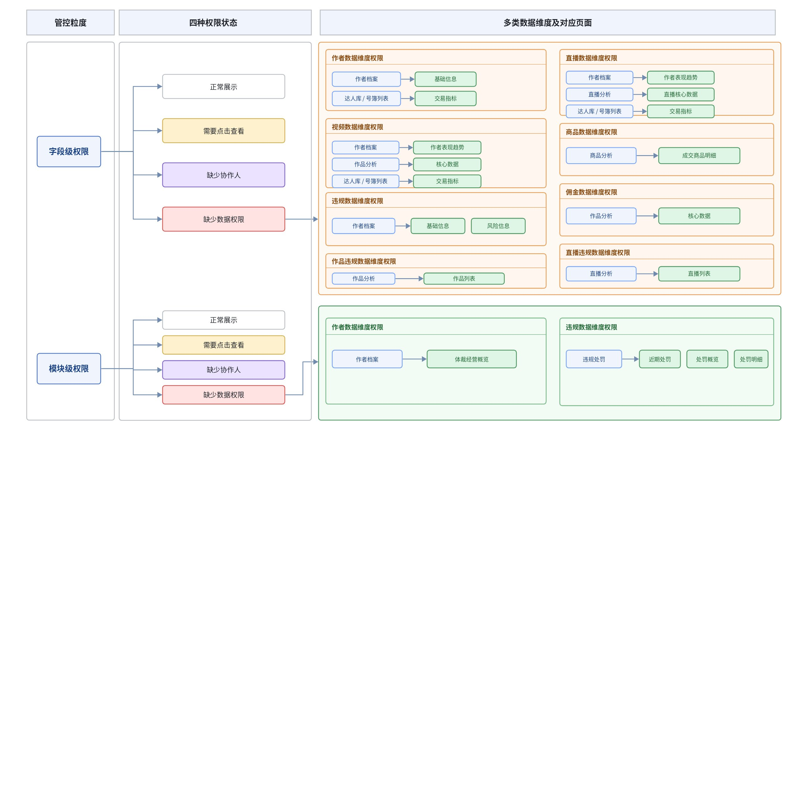

[白板 13 原始节点数据](history/陈相实习生转正答辩.assets__013_whiteboard_PE0CwR1Z_nodes.json)

**设计方案：字段复用业务接口，模块先查询权限**

- 原业务接口字段本身可以通过修改字段值来表示权限信息，因此继续复用原业务接口。**后端在返回前直接将管控字段转换为正常值或脱敏值，前端直接从字段值中识别状态。**
- 模块没有可以承载状态的单一字段，因此在加载业务数据前，先调用 `employee_permission` 查询模块权限。

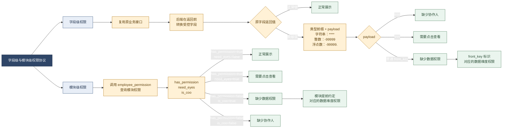
```mermaid
flowchart LR
    A["字段级与模块级权限协议"] --> F["字段级权限"]
    A --> M["模块级权限"]

    F --> F1["复用原业务接口"]
    F1 --> F2["后端在返回前<br/>转换受控字段"]
    F2 --> F3{"原字段返回值"}
    F3 -- "正常值" --> F4["正常展示"]
    F3 -- "脱敏值" --> F5["类型前缀 + payload<br/>字符串：****<br/>整数：-99999<br/>浮点数：-99999."]
    F5 --> F6{"payload"}
    F6 -- "888" --> F7["缺少协作人"]
    F6 -- "999" --> F8["需要点击查看"]
    F6 -- "普通 front_key" --> F9["缺少数据权限"]
    F9 --> F10["front_key 标识<br/>对应的数据维度权限"]

    M --> M2["调用 employee_permission<br/>查询模块权限"]
    M2 --> M3["has_permission<br/>need_eyes<br/>is_coo"]
    M3 -- "has_permission=true<br/>need_eyes=false" --> M4["正常展示"]
    M3 -- "has_permission=true<br/>need_eyes=true" --> M5["需要点击查看"]
    M3 -- "has_permission=false<br/>is_coo=true" --> M6["缺少数据权限"]
    M6 --> M8["模块提前约定<br/>对应的数据维度权限"]
    M3 -- "has_permission=false<br/>is_coo=false" --> M7["缺少协作人"]

    classDef root fill:#2F4668,stroke:#20344F,color:#FFFFFF,stroke-width:1.5px;
    classDef scope fill:#E8EEF7,stroke:#617A9B,color:#22344E,stroke-width:1.4px;
    classDef process fill:#FFF1D6,stroke:#B98328,color:#60430F,stroke-width:1.2px;
    classDef result fill:#EAF5EE,stroke:#5E8B6D,color:#294C34,stroke-width:1.2px;

    class A root;
    class F,M scope;
    class F1,F2,F3,F5,F6,M2,M3 process;
    class F4,F7,F8,F9,F10,M4,M5,M6,M7,M8 result;
```

1. **字段级返回协议**

由于**一个字段从接口返回到最终展示，会经过多层组件**。以作者详情页“直播支付 GMV”为例：

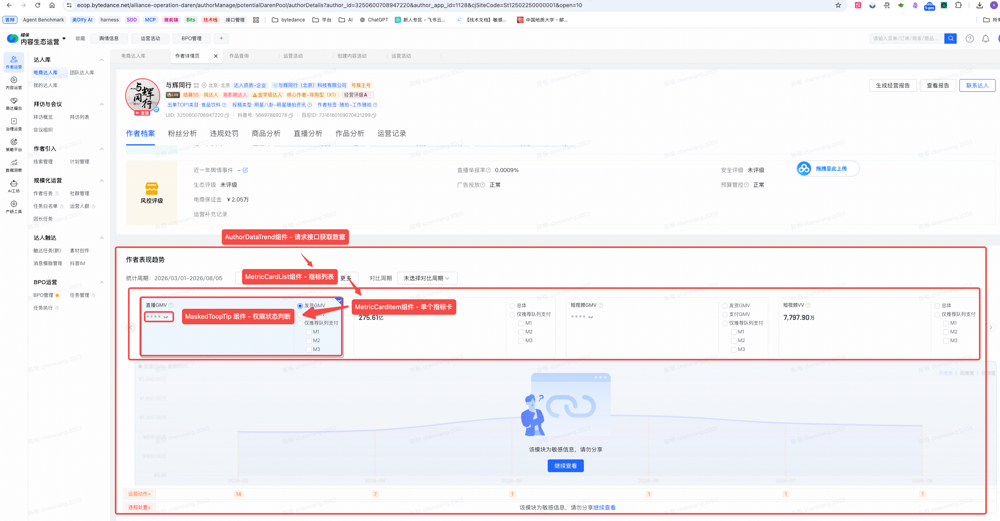

```text
接口数据进入页面后
  → 作者表现趋势（AuthorDataTrend）
  → 指标列表（MetricCardList）
  → 单个指标卡（MetricCardItem）
  → 权限提示组件（MaskedTooltip）
```

如果将脱敏值与 `front_key` 分成两个字段，每层组件都要同时传递两项内容，任何一层漏传都会丢失字段标识：

```text
分开传递：value="****"，front_key="live_pay_amt"
合并传递：value="****live_pay_amt"
```

脱敏值由“**固定前缀 + 字段标识**”组成。固定前缀用于区分字符串、整数和浮点数，后半部分用于告诉前端当前字段为什么不能直接展示。

| 原字段类型 | 一期：没有数据权限 | 二期：没有协作关系 | 二期：需要确认查看 | 可以直接查看 |
| --- | --- | --- | --- | --- |
| **字符串** | `****<front_key>` | `****888` | `****999` | 返回原字符串 |
| **整数** | `-99999<数字字段标识>` | `-99999888` | `-99999999` | 返回原整数 |
| **浮点数** | `-99999.<数字字段标识>` | `-99999.888` | `-99999.999` | 返回原浮点数 |

1. **模块级权限协议**

模块权限控制的是一整块内容，没有单一字段可以承载 `****<front_key>`，**因此在业务数据加载前先调用独立的权限查询接口**。

```text
【接口请求】

接口：employee_permission

参数：
- permission_keys：[permission_code]  // 当前模块对应的权限点
- author_id：author_id                // 当前作者
- author_id_for_eye_check：author_id  // 用于判断是否需要点击查看

【接口返回】

- has_permission[permission_code]：true / false  // 当前用户是否拥有该模块的数据权限
- need_eyes：true / false  // 当前作者的数据是否需要点击查看
- is_coo：true / false  // 当前用户是否为该作者的协作人
```

前端根据三个字段的组合确定页面状态，再决定是否加载模块数据。

| 接口字段组合 | 页面状态 | 后续处理 |
| --- | --- | --- |
| `has_permission=true` 且 `need_eyes=false` | 正常展示 | 加载并展示模块业务数据 |
| `has_permission=true` 且 `need_eyes=true` | 需要点击查看 | 不加载真实模块内容 |
| `has_permission=false` 且 `is_coo=true` | 缺少数据权限 | 不加载真实模块内容 |
| `has_permission=false` 且 `is_coo=false` | 缺少协作人 | 不加载真实模块内容 |

当模块状态为“缺少数据权限”时，不需要再从接口返回值中解析数据维度。模块在接入时已经约定对应的数据维度权限，例如体裁经营概览对应作者数据维度权限，违规处罚页面对应违规数据维度权限。

##### **配置维护：权限 code 调整时无需修改代码**

> **核心问题：权限 code 调整后，如何避免需要修改代码？**
>
> 页面需要一个标识来确定字段或模块对应的数据权限。如果直接使用权限平台的 code 作为页面标识，code 发生调整后，页面传参、字段协议和权限组件都需要修改，并重新发布代码。因此，

**设计方案：**页面和前后端协议统一使用稳定的 `front_key`。平台 code 不直接写入页面，而是通过 TCC 的 `indicator_auth_config` 维护与 `front_key` 的对应关系：

```text
接口：apiGetTccValue
请求：keys = ["indicator_auth_config"]
返回：data["indicator_auth_config"]

页面传入 front_key
  → apiGetTccValue 获取 indicator_auth_config
  → 按 front_key 匹配配置
  → 申请权限时使用 auth_code
  → 查询模块权限时使用 permission_code
```

| **TCC 字段** | **用途** |
| --- | --- |
| `indicator_key` | 标识后端需要脱敏的业务指标 |
| `front_key` | 前端识别字段或模块使用的稳定 key |
| `auth_level` | 记录 L4、L4+ 等数据等级 |
| `auth_code` | 打开聚星台数据权限申请弹窗时使用的权限 code |
| `permission_code` | 调用 `apiEmployeePermission` 查询模块权限时使用的权限 key |

这样，页面只依赖稳定的 `front_key`。平台 code 发生变化时，只需要更新 TCC 配置，不需要修改和重新发布前端代码。

```text
调整前：front_key → 原平台 code
调整后：front_key → 新平台 code
```

##### 权限操作：构建获取真实数据的完整链路

> **核心问题：权限状态确定后，前端如何完成后续操作并最终展示真实数据？**

**设计方案：**四种状态按照“缺少协作人—缺少数据权限—需要确认查看—正常展示”的顺序展示。

1. **缺少协作人：**运营人员点击申请成为协作人，前端提交作者和申请信息，后端记录申请信息并发起协作人申请。权限平台审批通过后，页面刷新并重新判断权限状态。
2. **缺少数据权限：**运营人员点击申请数据权限，前端提交 `front_key` 并调用 `apiGetTccValue`。后端返回 `indicator_auth_config`，获取对应的 `auth_code`，前端根据 `auth_code` 申请数据权限。审批通过后，页面再次刷新并重新判断。
3. **需要确认查看：**运营人员点击小眼睛，前端调用 `apiSaveAccessDataLog`，后端记录运营人员、作者和查看时间。记录成功后，前端刷新页面并重新请求业务数据。
4. **正常展示：**后端确认当前权限状态后返回真实数据，前端直接展示。

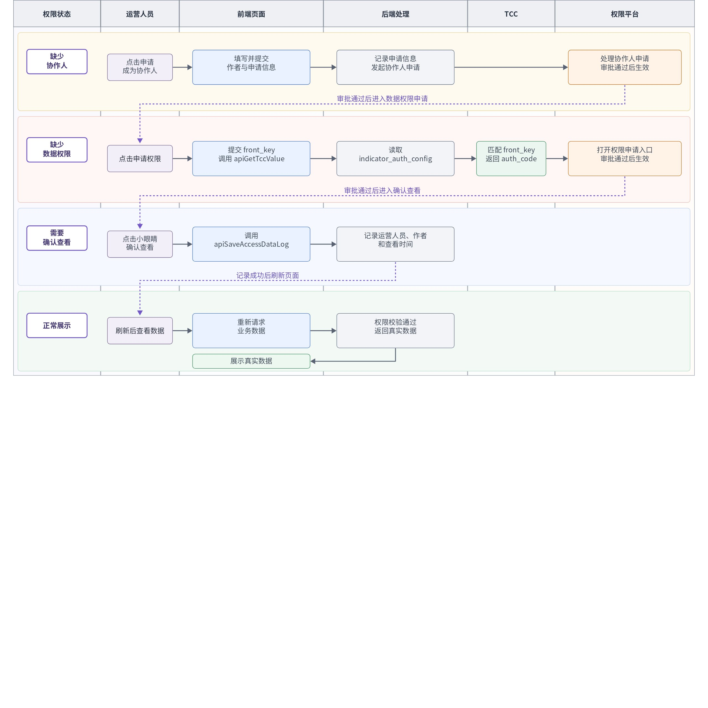

[白板 15 原始节点数据](history/陈相实习生转正答辩.assets__015_whiteboard_OjsZwQSm_nodes.json)

#### 实现要点

##### **要点一：将各页面重复的权限处理提取为公共能力**

> **核心问题：权限管控覆盖范围广。**需求横跨多个页面，分布在表格、指标卡、详情项和整块业务模块中，同时包含字段级和模块级两种管控方式。如果由页面分别实现，每个位置都要重复处理状态判断和权限管控，**因此，如何实现页面不同位置的权限统一管控？**。
>
> 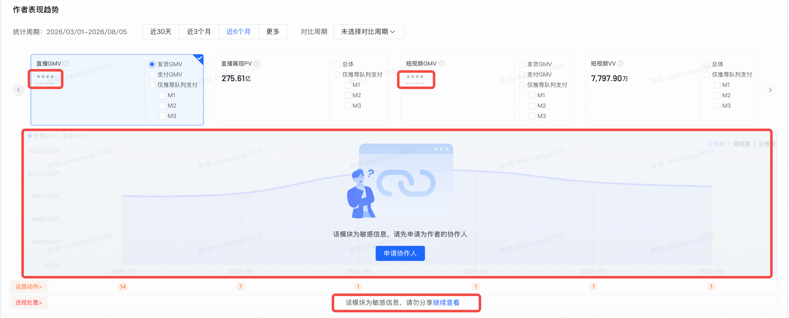
>
> 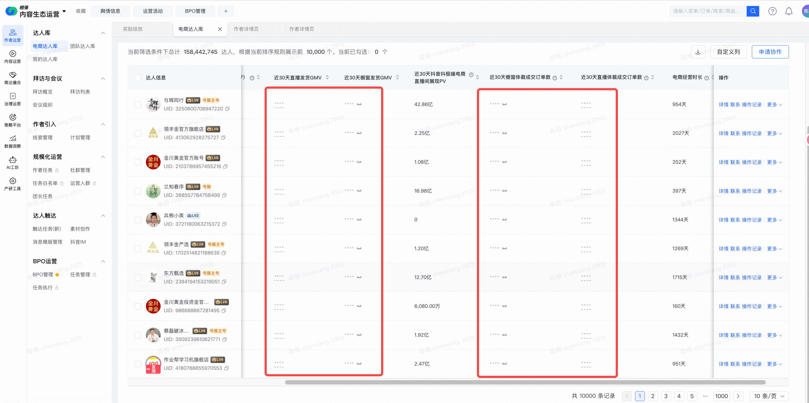
>
> 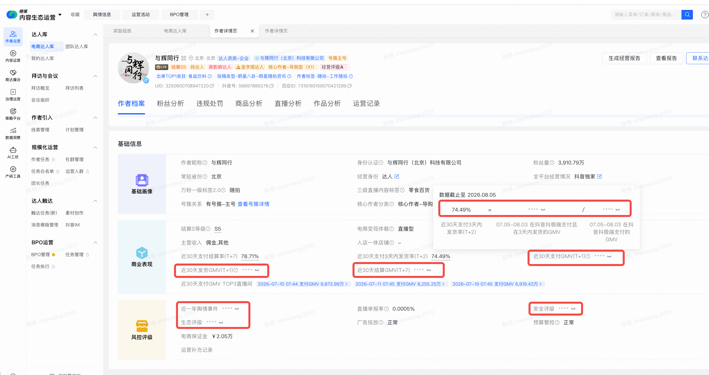
>
> 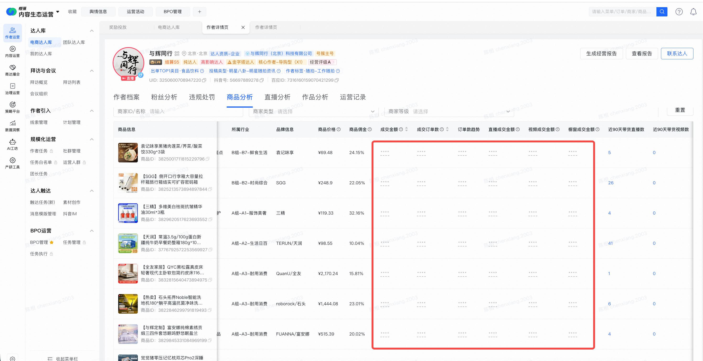

**设计框架**

- **判断来源不同，保留两条链路。**字段级从业务字段原始值中解析状态；模块级根据权限接口结果判断状态。
- **管控逻辑相同，统一放到公共层。**两条链路的判断来源不同，但后续管控逻辑一致，因此由公共方法和公共组件统一处理。
- **页面只负责传入业务数据。**字段传入原始值，模块传入 `fieldKey` 和 `authorId`，权限判断和处理由公共层完成。

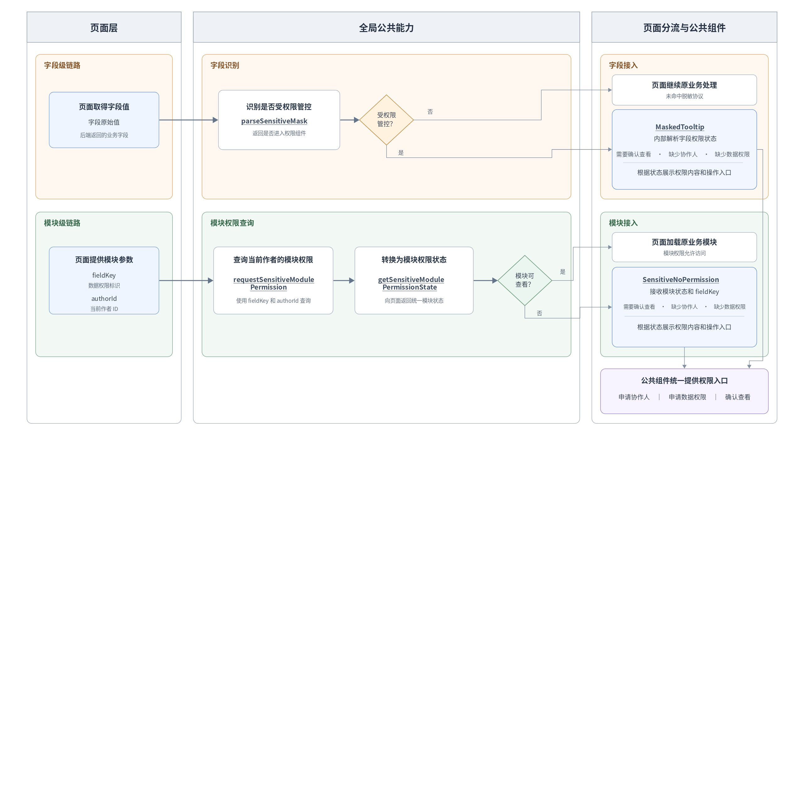

[白板 20 原始节点数据](history/陈相实习生转正答辩.assets__020_whiteboard_HWlXwTpD_nodes.json)

> **表格说明：** 原表包含合并单元格或复杂块内容，已按行列顺序展开；正文、代码、图片和白板均保留。

**记录 1**

**实现重点**

**字段级权限判断链路**

**具体实现**

**字段级权限由 `parseSensitiveMask` 从业务字段值中解析**，处理过程分为三层：

1. `parseSensitiveMask 识别没有命中占位协议时返回 undefined，对应“可以查看”。`
2. `parseSensitiveMask` 根据数据类型识别占位前缀：字符串使用 `****`，数值使用 `-99999.` 或 `-99999`。数值先判断浮点前缀，避免被整数前缀提前截断。
3. `resolveMaskedPayload` 解析前缀后的 payload：`888` 表示"不是协作人"，`999` 表示"需要确认查看"，其他值作为 `front_key`，表示"没有数据权限"。

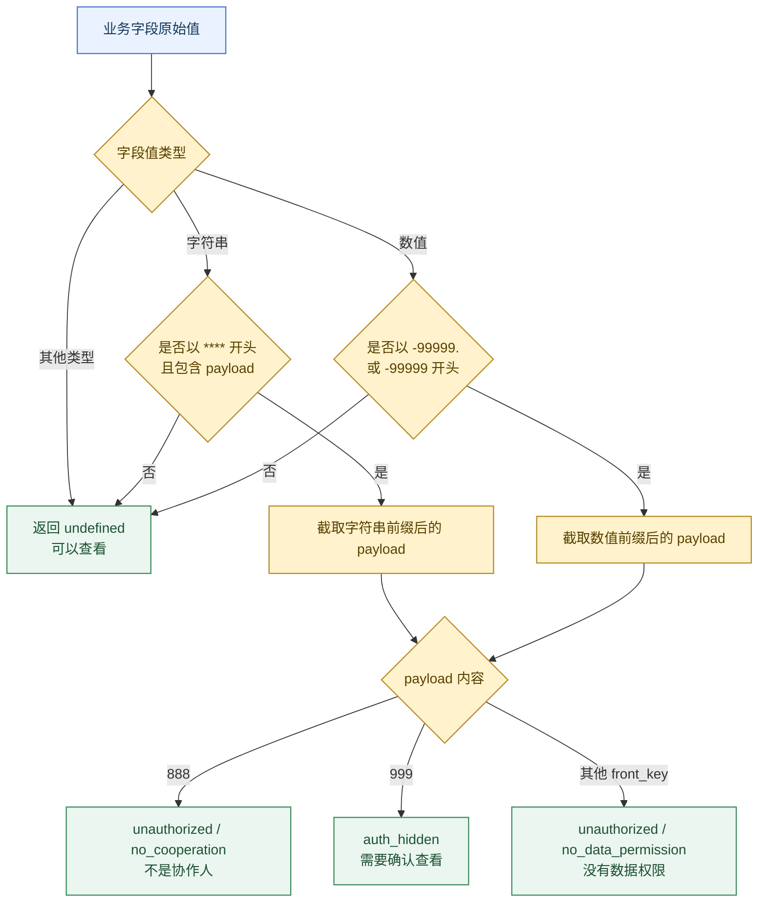
```mermaid
flowchart TB
    A["业务字段原始值"] --> B{"字段值类型"}
    B -- "字符串" --> C{"是否以 **** 开头
且包含 payload"}
    B -- "数值" --> D{"是否以 -99999.
或 -99999 开头"}
    B -- "其他类型" --> E["返回 undefined
可以查看"]

    C -- "否" --> E
    D -- "否" --> E
    C -- "是" --> F["截取字符串前缀后的 payload"]
    D -- "是" --> G["截取数值前缀后的 payload"]
    F --> H{"payload 内容"}
    G --> H

    H -- "888" --> I["unauthorized / no_cooperation
不是协作人"]
    H -- "999" --> J["auth_hidden
需要确认查看"]
    H -- "其他 front_key" --> K["unauthorized / no_data_permission
没有数据权限"]

    classDef source fill:#EAF2FF,stroke:#4C78C2,color:#173A5E,stroke-width:1.3px;
    classDef process fill:#FFF2CC,stroke:#B58B22,color:#5A4100,stroke-width:1.3px;
    classDef result fill:#EAF6EF,stroke:#3F8A5E,color:#1F5135,stroke-width:1.3px;

    class A source;
    class B,C,D,F,G,H process;
    class E,I,J,K result;
```

**列 3**

```ts
function resolveMaskedPayload(rawPayload) {
  const payload = rawPayload.trim();

  if (payload === '888') {
    return { type: 'unauthorized', reason: 'no_cooperation' };
  }
  if (payload === '999') {
    return { type: 'auth_hidden' };
  }
  return {
    type: 'unauthorized',
    reason: 'no_data_permission',
    fieldKey: payload,
  };
}

function parseSensitiveMask(value) {
  if (typeof value === 'string') {
    if (value.startsWith('****') && value.length > 4) {
      return resolveMaskedPayload(value.slice(4));
    }
  }

  if (typeof value === 'number') {
    const normalized = String(value);
    if (normalized.startsWith('-99999.') && normalized.length > 7) {
      return resolveMaskedPayload(normalized.slice(7));
    }
    if (normalized.startsWith('-99999') && normalized.length > 6) {
      return resolveMaskedPayload(normalized.slice(6));
    }
  }

  return undefined;
}
```

**记录 2**

**实现重点**

**模块级权限判断链路**

**具体实现**

**模块级权限由 `getSensitiveModulePermissionState` 直接解析结构化权限结果**：

1. `hasPermission=true` 时继续判断 `needEyes`：不需要确认查看时为 `viewable`，需要确认查看时为 `view_permission_required`。
2. `hasPermission=false` 时继续判断 `isCoo`：已经是协作人时为 `no_data_permission`，不是协作人时为 `no_cooperation`。
3. 权限结果尚未返回时为 `loading`，仅表示判断过程中的过渡状态，不计入最终四种权限状态。

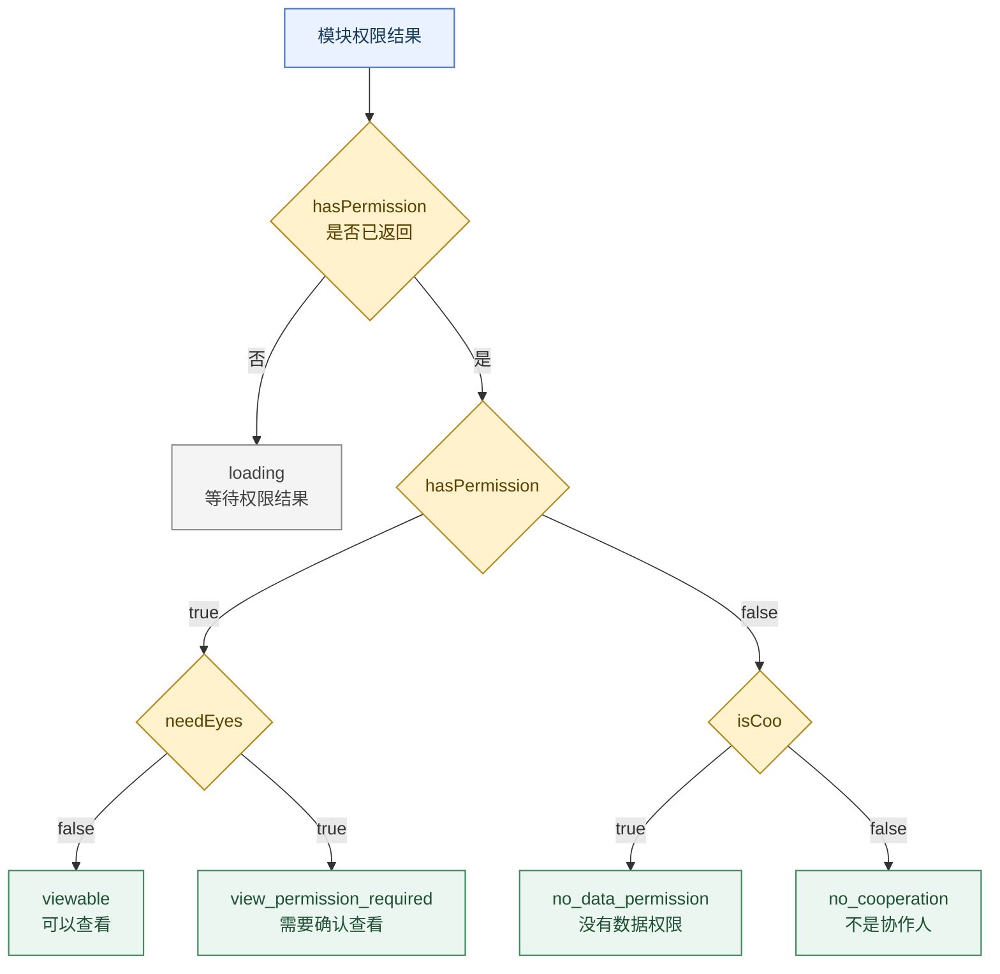
```mermaid
flowchart TB
    A["模块权限结果"] --> B{"hasPermission
是否已返回"}
    B -- "否" --> C["loading
等待权限结果"]
    B -- "是" --> D{"hasPermission"}

    D -- "true" --> E{"needEyes"}
    E -- "false" --> F["viewable
可以查看"]
    E -- "true" --> G["view_permission_required
需要确认查看"]

    D -- "false" --> H{"isCoo"}
    H -- "true" --> I["no_data_permission
没有数据权限"]
    H -- "false" --> J["no_cooperation
不是协作人"]

    classDef source fill:#EAF2FF,stroke:#4C78C2,color:#173A5E,stroke-width:1.3px;
    classDef process fill:#FFF2CC,stroke:#B58B22,color:#5A4100,stroke-width:1.3px;
    classDef pending fill:#F4F4F4,stroke:#8A8A8A,color:#424242,stroke-width:1.2px;
    classDef result fill:#EAF6EF,stroke:#3F8A5E,color:#1F5135,stroke-width:1.3px;

    class A source;
    class B,D,E,H process;
    class C pending;
    class F,G,I,J result;
```

**列 3**

```ts
function getSensitiveModulePermissionState(permission) {
  if (permission?.hasPermission === undefined) {
    return 'loading';
  }

  if (permission.hasPermission) {
    return permission.needEyes
      ? 'view_permission_required'
      : 'viewable';
  }

  return permission.isCoo
    ? 'no_data_permission'
    : 'no_cooperation';
}
```

##### **要点二：用公共组件统一权限展示和操作**

> **核心问题：同一个字段或模块需要处理多种状态**，每种状态对应不同的权限内容和后续操作。如果为每种状态分别编写判断和组件，调用方需要自行选择处理方式，逻辑会被拆散，也会增加重复代码。**因此，如何统一处理不同权限状态？**

**设计框架：**

> - **只替换需要权限管控的内容。**字段需要权限处理时，将原字段值替换为 `MaskedTooltip`；模块需要权限处理时，将原业务模块替换为 `SensitiveNoPermission`，页面其他内容保持不变。
> - **在公共组件内部统一处理权限状态。**组件根据当前状态选择对应的权限内容和操作入口，统一处理确认查看、协作人申请和数据权限申请。

1. **字段级渲染：隐藏单个敏感值**

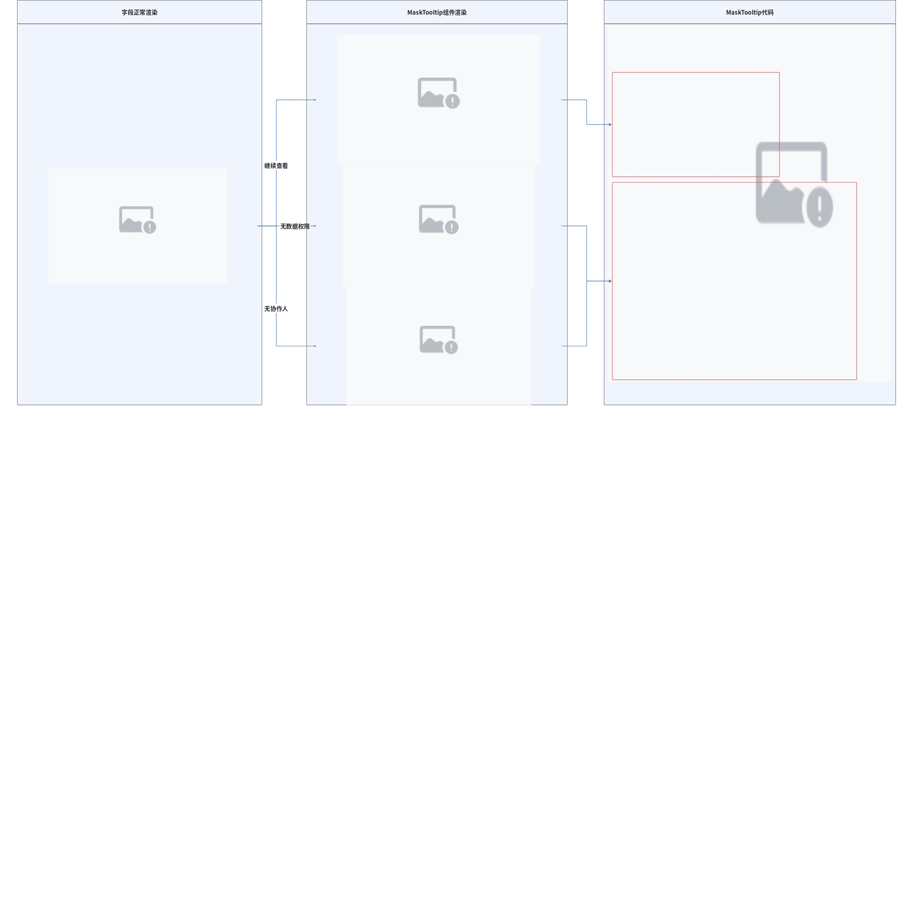

[白板 21 原始节点数据](history/陈相实习生转正答辩.assets__021_whiteboard_H6GiwwKd_nodes.json)

字段无权限时不改变原有表格、卡片和详情布局，只替换当前字段的展示内容。**设计公共组件 `MaskedTooltip` 负责字段遮罩和权限入口**：

- 字段显示统一替换为 `****`，不再进入普通数值或文本展示。
- `no_data_permission` 展示数据权限说明和申请入口，`no_cooperation` 展示协作人申请入口。
- `auth_hidden` 在 `****` 后展示小眼睛，点击后进入确认查看链路。
- 组件支持包裹已有节点，并阻止点击事件继续冒泡，避免在列表中同时触发行跳转；Tooltip 挂载到 `document.body`，避免被表格或卡片容器裁剪。

1. **模块级渲染：替换整个内容区域**

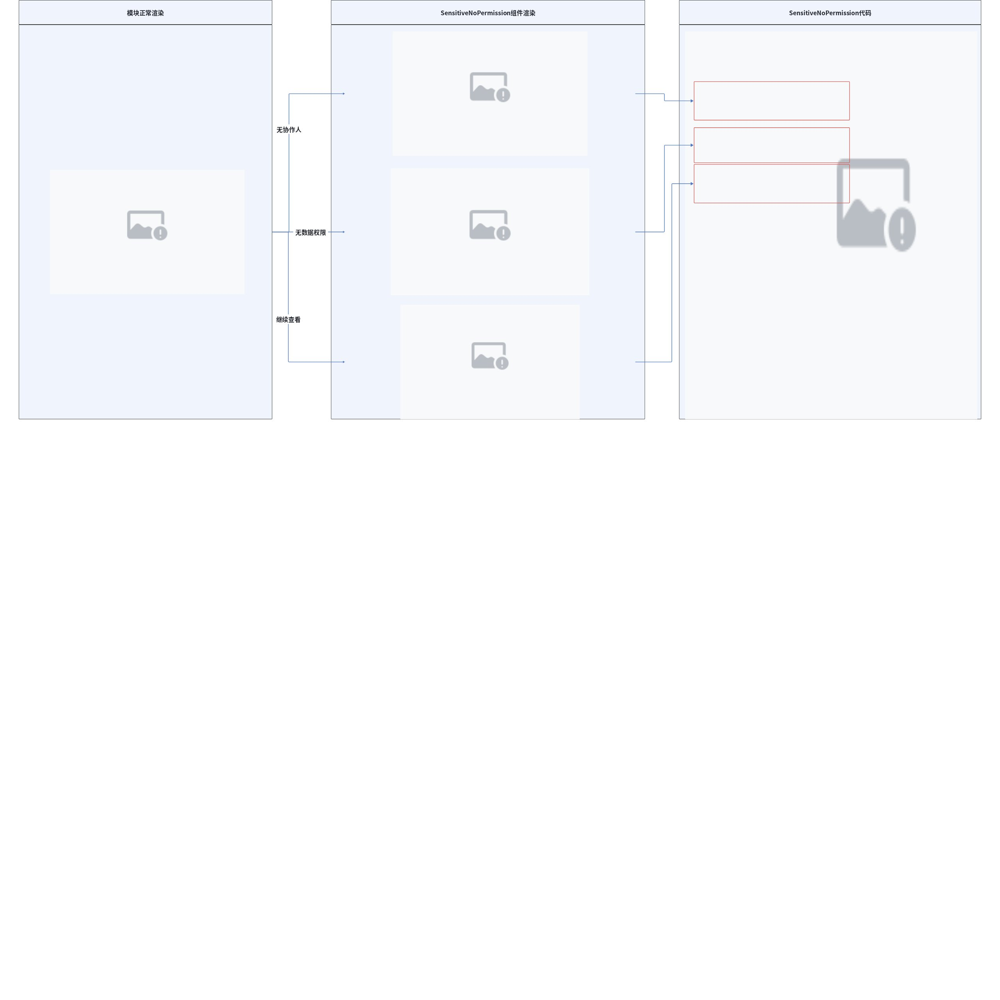

[白板 22 原始节点数据](history/陈相实习生转正答辩.assets__022_whiteboard_S10mwmyZ_nodes.json)

完整模块无权限时，字段级遮罩无法说明受限范围。**设计公共组件 `SensitiveNoPermission` 直接替换模块内容区域**，并统一展示无权限状态：

- 根据权限状态切换标题和按钮，分别提供数据权限申请、协作人申请和确认查看入口。
- 保留原模块占位区域，避免内容消失后页面结构发生大幅变化。
- 使用 `ResizeObserver` 读取容器尺寸：高度不足时切换紧凑布局，空间足够时展示插图，使同一个组件可以覆盖完整模块、卡片和图表区域。

##### **要点三：在存量代码基础上实现三类权限操作**

> **核心问题：三类权限操作依赖的能力不同。**数据权限申请依赖权限平台弹窗，协作人申请依赖页面内的申请弹窗，确认查看后还需要更新当前页面的数据。**因此，如何分别实现三类权限操作？**

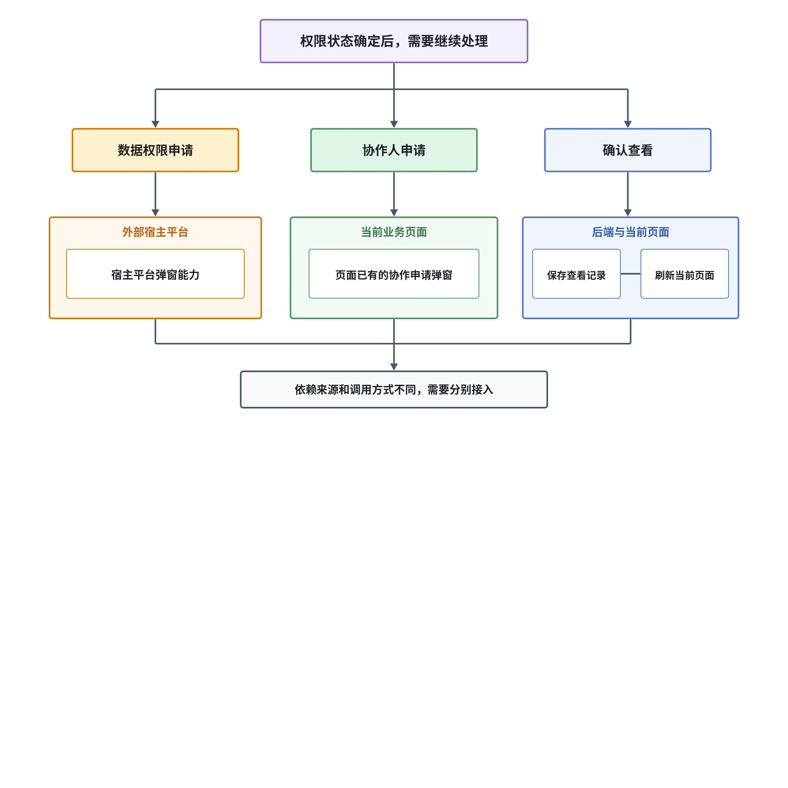

[白板 23 原始节点数据](history/陈相实习生转正答辩.assets__023_whiteboard_YvVFwPlY_nodes.json)

1. **数据权限申请：调用宿主平台弹窗**

> **表格说明：** 原表包含合并单元格或复杂块内容，已按行列顺序展开；正文、代码、图片和白板均保留。

**记录 1**

**列 1**

数据权限申请弹窗由宿主平台提供，不是当前项目渲染的 React 组件。**宿主平台通过 `window.GarfishBridge.actionBridge.showApplyDimensionPopup` 开放调用入口**，因此页面不需要放置弹窗，也不需要维护弹窗的显示状态。

1. 公共组件调用 `applySensitivePermission`，传入字段权限标识 `fieldKey`；已有 `authCode` 的场景可以直接传入。
2. 全局方法通过 TCC 将 `fieldKey` 转换为权限平台使用的 `authCode`。
3. `GarfishBridge` 将 `authCode` 作为权限类型传给宿主平台，由宿主平台打开并处理数据权限申请弹窗。

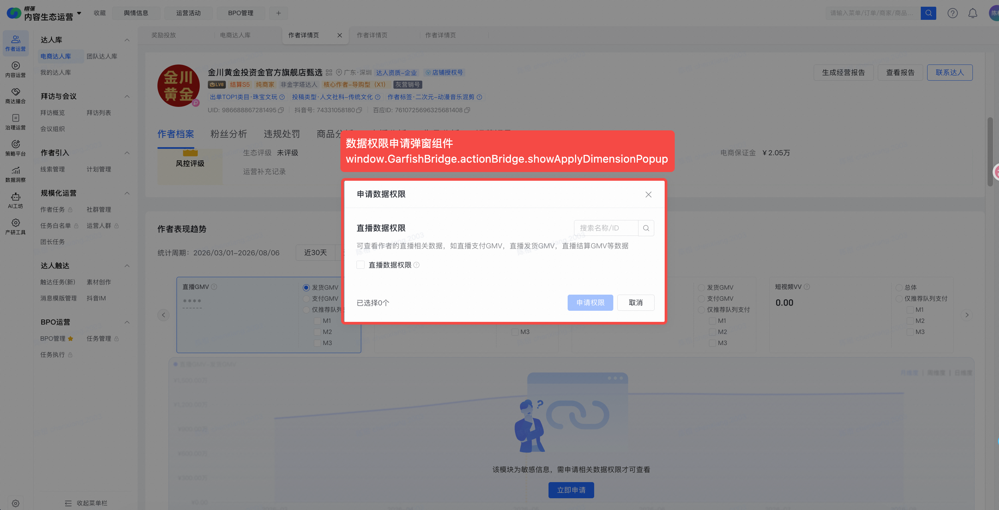

**列 2**

```ts
function applySensitivePermission(arg) {
  // 公共组件只触发运行时 Handler，不依赖宿主平台
  permissionApplyHandler?.(arg);
}

async function handleSensitivePermissionApply(arg) {
  const authCode = isExplicitAuthCode(arg)
    ? arg.authCode
    : await resolveSensitiveAuthCode(arg);
    // front_key -> TCC auth_code

  if (!authCode) {
    return message.info('当前字段暂无可申请的权限配置');
  }

  const showApplyPopup =
    window.GarfishBridge?.actionBridge?.showApplyDimensionPopup;
  if (!showApplyPopup) {
    return message.info('当前环境暂不支持权限申请');
  }

  showApplyPopup({
    dimension_type: authCode,
    afterApplyCallback: () => message.success('已发起权限申请'),
  });
}
```

1. **协作人申请：由当前页面打开申请弹窗**

作者列表和作者详情分别维护自己的协作申请弹窗，因此本次需求无需重新实现一套弹窗，而是复用两处页面原有的申请能力。页面把“打开当前弹窗”的方法统一作为 `onApply` 传给公共权限组件；公共组件识别到“缺少协作人”后只调用 `onApply()`，不关心页面使用哪一种弹窗。

```TypeScript
<MaskedTooltip onApply={onApply} />
<SensitiveNoPermission onApply={onApply} />
```

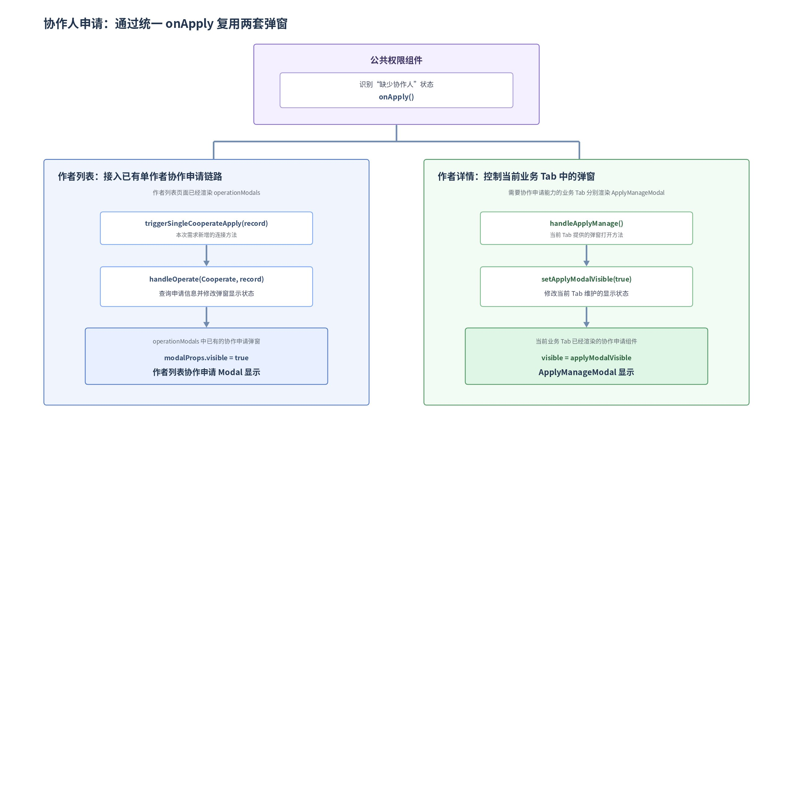

[白板 25 原始节点数据](history/陈相实习生转正答辩.assets__025_whiteboard_UIkgwElA_nodes.json)

> **表格说明：** 原表包含合并单元格或复杂块内容，已按行列顺序展开；正文、代码、图片和白板均保留。

**记录 1**

**页面**

**作者列表**

**具体实现**

**作者列表页面已经渲染 `operationModals`，其中包含协作申请弹窗。**

```TypeScript
// operationModals 已经渲染在作者列表页面中
{operationModals}
```

**作者列表通过 `handleOperate` 控制列表弹窗，**本次需求新增 `triggerSingleCooperateApply` 作为连接方法，作为 `onApply` 传给公共权限组件。，将当前行的达人信息交给存量 `handleOperate`。`handleOperate` 可以修改弹窗状态，使 `operationModals` 中已有的协作申请弹窗显示出来。

```JavaScript
const onApply = () => triggerSingleCooperateApply(record);

triggerSingleCooperateApply: author => {
  void handleOperate(AuthorOperateType.Cooperate, author);
};

// 简化伪代码：handleOperate 修改已有弹窗的显示状态
handleOperate(AuthorOperateType.Cooperate, author) {
  查询协作申请信息(author);
  setModalProps({
    visible: true,
    operateType: AuthorOperateType.Cooperate,
  });
}
```

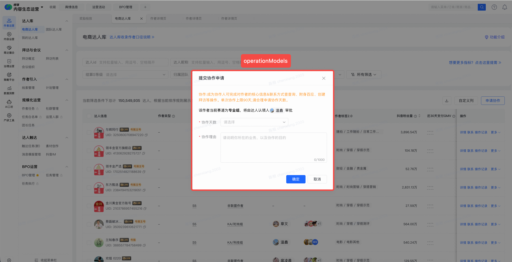

**记录 2**

**页面**

**作者详情**

**具体实现**

**控制当前业务 Tab 中的 `ApplyManageModal`。**

`ApplyManageModal` 由需要协作申请能力的业务 Tab 分别渲染。每个 Tab 使用自己的 `applyModalVisible` 管理显示状态，并将修改该状态的方法作为 `onApply` 传给公共权限组件。

```JavaScript
const [applyModalVisible, setApplyModalVisible] = useState(false);

const onApply = () => handleApplyManage();

const handleApplyManage = () => {
  setApplyModalVisible(true);
};

<ApplyManageModal
  author_id={authorId}
  visible={applyModalVisible}
  onClose={() => setApplyModalVisible(false)}
/>
```

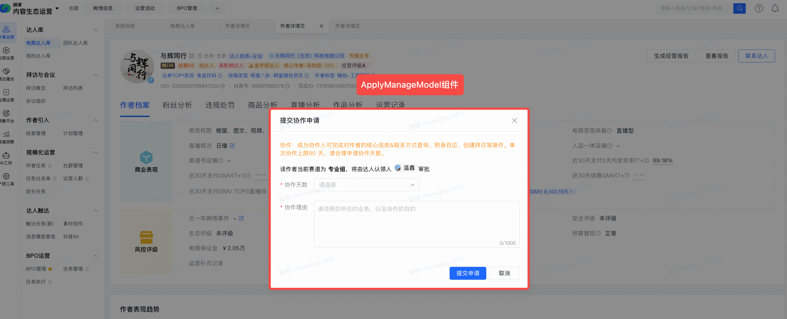

1. **确认查看：记录操作并刷新当前页面**

确认查看的链路分为两步：

- 前端先调用 `apiSaveAccessDataLog` 保存“操作人查看当前作者”的记录；
- 保存成功后，执行当前页面预先注册的刷新方法，重新请求后端数据。记录失败时不进入刷新链路，页面继续保持脱敏状态。

```TypeScript
const success = await apiSaveAccessDataLog({ author_id: authorId });
if (!success) return;

const handled = await runSensitiveViewPermissionSuccessHandler(authorId);
if (!handled) window.location.reload();
```

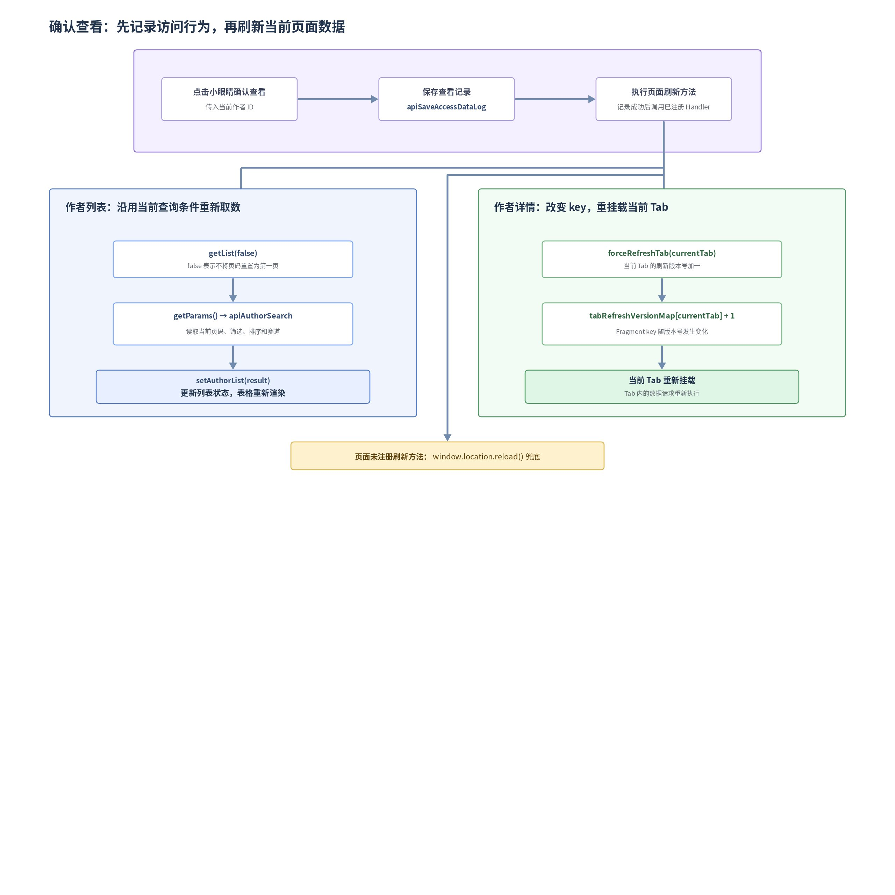

[白板 28 原始节点数据](history/陈相实习生转正答辩.assets__028_whiteboard_XedXwOJo_nodes.json)

> **表格说明：** 原表包含合并单元格或复杂块内容，已按行列顺序展开；正文、代码、图片和白板均保留。

**记录 1**

**页面**

**作者列表**

**具体实现**

**目标： 只刷新列表，不需要刷新整个页面  —— 通过 `getList(false)` 重新查询当前列表**

`getList` 是作者列表原有的取数方法，会调用 `apiAuthorSearch` 重新查询列表数据，并用返回结果更新 `authorList`。列表状态变化后，表格随之重新渲染。传入 `false` 表示不将页码重置为第一页，从而保留当前查询位置。

```JavaScript
setSensitiveViewPermissionSuccessHandler(async () => {
  await getList(false);
  return true;
});

// 简化伪代码
getList(reload = true) {
  if (reload) pageNo = 1;
  const result = await apiAuthorSearch(getParams());
  setAuthorList(result);
}
```

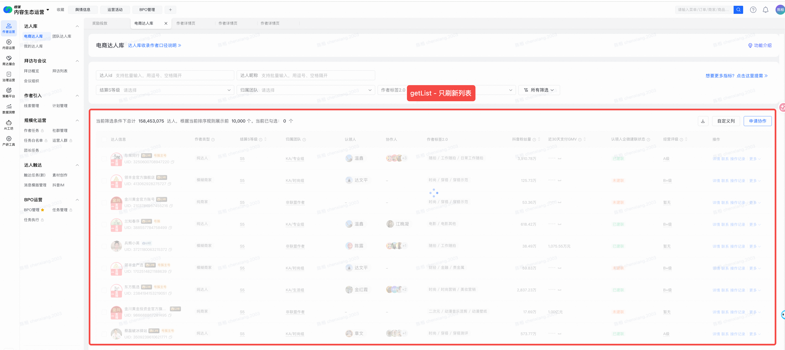

**记录 2**

**页面**

**作者详情**

**具体实现**

**目标： 只刷新当前Tab，不需要更新整个页面  —— 通过 `forceRefreshTab` 重挂载当前 Tab**

`forceRefreshTab` 将当前 Tab 在 `tabRefreshVersionMap` 中的版本号加一。版本号参与 Tab 外层 `Fragment` 的 `key`；版本号变化后 `key` 也会变化，React 会重新挂载当前 Tab，Tab 内原有的数据请求随之重新执行。

```JavaScript
const forceRefreshTab = currentTab => {
  setTabRefreshVersionMap(prev => ({
    ...prev,
    [currentTab]: (prev[currentTab] ?? 0) + 1,
  }));
};

const version = tabRefreshVersionMap[currentTab] ?? 0;

<Fragment key={`${currentTab}-${version}`}>
  {RenderTabContent}
</Fragment>
```

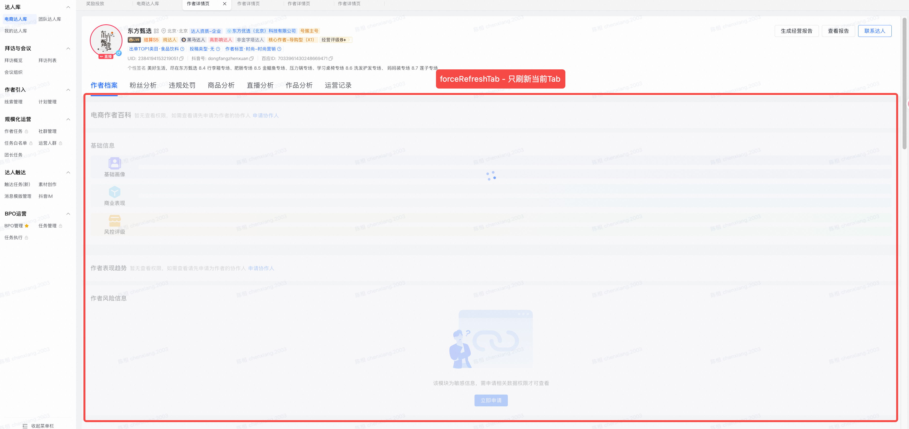

##### 要点四：将重复交付工作沉淀为 Skill

> 功能完成后，需求进入联调和交付。本次改动涉及 16 个接口、12 个页面或模块，以及多种权限状态。调试时需要反复修改接口响应，交付前还要反复查看增量覆盖率、定位未覆盖代码。继续手动处理会花费大量时间，因此将**这两类重复工作分别整理为 Mock Skill 和前端增量覆盖率 Skill，交由 AI 按固定规则执行**。

> **表格说明：** 原表包含合并单元格或复杂块内容，已按行列顺序展开；正文、代码、图片和白板均保留。

**记录 1**

**实现重点**

**Mock Skill**

> **批量切换权限状态数据权限申请**

**实现内容**

**解决的问题**：

- 本次需求涉及多个接口和大量管控字段。人工 Mock 时，需要逐个找到接口响应、修改对应字段；每次切换状态都要重新处理，消耗大量时间和人力成本。

**核心目标**：

- 指定一种权限状态，由 AI 按统一规则批量修改所有接口的本地响应，使同一轮调试中的字段和模块使用相同的权限状态。

**Skill 规范设计**：

- **Chrome Local Overrides 可以读取本地目录中的响应文件**，并用本地响应替换原接口返回。基于这一能力，每个接口统一记录响应文件的改写位置，以及正常展示、无数据权限、非协作人和待确认查看四种状态的改写规则。
- 切换状态时，Skill 读取这些规则，由 AI 批量修改并替换 Overrides 关联目录中的响应文件。刷新页面后，Chrome 直接加载修改后的响应。接口规则和状态映射集中维护，Skill 负责统一修改和替换，Chrome Local Overrides 负责加载文件。

**使用结果：**


[白板 31 原始节点数据](history/陈相实习生转正答辩.assets__031_whiteboard_J0RrwUND_nodes.json)

**记录 2**

**实现重点**

**前端增量覆盖率 Skill**

> **自动定位未覆盖代码**

**实现内容**

**解决的问题**：

- 权限改动分散在多个页面和公共组件中。手动检查覆盖率时，需要反复打开文件报告、查找未覆盖代码行，再回到页面操作对应功能，步骤重复且容易漏掉分支。

**核心目标**：

- 让 AI 自动定位未覆盖代码行，再**通过 Chrome DevTools MCP 自动化工具操作真实页面，触发未覆盖的代码分支并刷新覆盖率结果**。

**Skill 规范设计**：

- Skill 先调用华佗 `branch/files` 获取变更文件覆盖率，再通过 `branch/code` 定位未覆盖行。覆盖率未达到 90% 时，过滤没有新增代码的文件和生成代码，选择未覆盖行最多的文件。AI 根据未覆盖代码和验收项确定页面操作路径，再调用 Chrome DevTools MCP 在真实页面完成点击、切换和提交等操作。
- 查询接口保持真实请求；涉及数据写入时，在浏览器网络层返回 Mock 响应，避免产生真实业务数据。页面操作完成后重新获取华佗报告，继续处理下一个覆盖缺口，达到 90% 后结束。

**使用结果：**

- 第 1 次运行覆盖率： `44.25% → 74.62% → 82.18% → 85.15%`

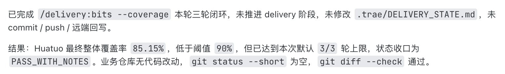

- 第 2 次运行覆盖率：`85.15% → 88.60% → 88.60% → 89.56%`

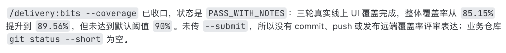

- 第 3 次运行覆盖率：`89.56% → 91.28%`，达到当次 90% 门槛

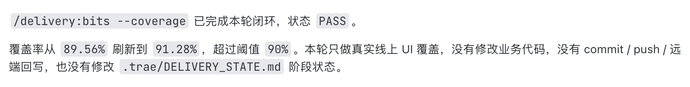

#### 项目总结

##### 项目成果

> **表格说明：** 原表包含合并单元格或复杂块内容，已按行列顺序展开；正文、代码、图片和白板均保留。

**记录 1**

**结果**

1. **交付结果**：一期、二期均完成上线，运行期间无 敏感数据误展示的问题。
2. **覆盖结果**：共覆盖 **16** 个接口和**51 个 L4 和 13 个 L4+ 敏感数据项**， 敏感数据项覆盖率 **100%**。
3. **上线结果**：截止8月5日，小眼睛查看链路上线后累计生成 **4,486 条访问记录**；数据权限申请链路能够拦截无权限访问并引导用户发起审批，**线上产生实际审批记录**。
4. **技术成果**：沉淀权限 Mock Skill 和前端增量覆盖率 Skill，分别用于批量切换四种权限状态，以及自动获取覆盖率、定位未覆盖代码并刷新结果；

**记录**

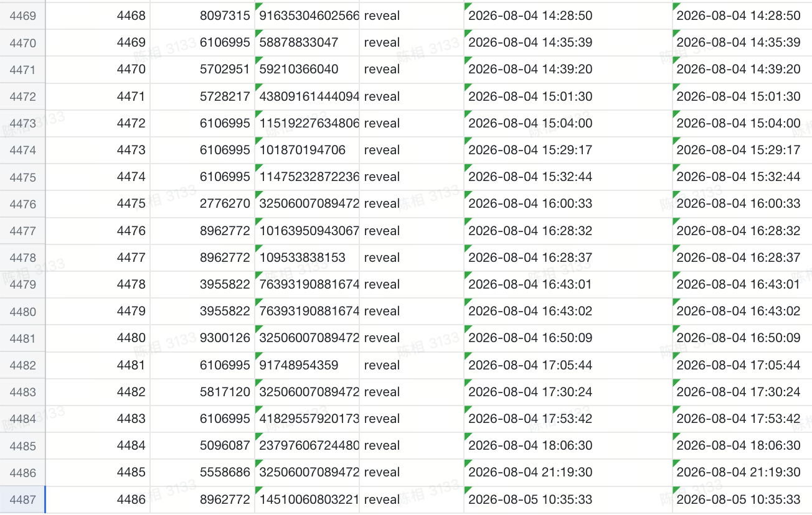


##### 个人成果

> **表格说明：** 原表包含合并单元格或复杂块内容，已按行列顺序展开；正文、代码、图片和白板均保留。

**记录 1**

**做得好（收获经验）**

1. **复杂需求需要先读完整调用链**：先确认现有组件、接口调用、状态来源和页面刷新方式，再决定复用或新增，避免重复实现已有能力。
2. **学会沉淀可复用的技术**：将多页面共用的权限判断和展示逻辑整理为公共组件，将反复执行的 Mock 和覆盖率检查整理为 Skill，不只解决当前页面的问题。

**做得不足（待改进）**

1. **代码审查不够仔细**：部分问题在测试阶段才暴露，例如对存量代码已有功能误改，导致返工。后续在提测前集中核对需求、接口和主要页面链路。
2. **扩展设计过多**：部分参数和判断没有实际使用。后续以当前需求和实际调用方为边界，不提前实现没有明确场景的逻辑。

### AI Coding 工作流搭建与业务实践

#### 产品介绍与建设目标

> **总体目标**：前端交付 Agent 工作流是一套面向电商前端业务需求的端到端 AI Coding 流程。工作流以 Meego 需求链接为入口，读取关联的需求文档、Figma 设计和代码仓库信息，依次完成需求分析、任务规划、代码实现、浏览器验收和任务交付。

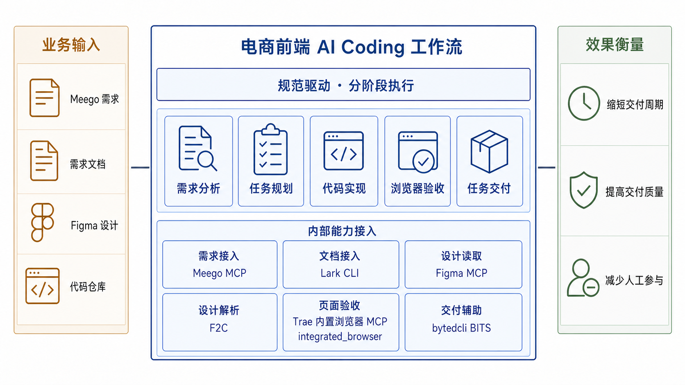

团队在学习和使用 AI Coding 的过程中，调研并实践了 [Spec Kit](https://github.com/github/spec-kit)、[OpenSpec](https://github.com/Fission-AI/OpenSpec) 和 [Superpowers](https://github.com/obra/superpowers) 等通用方案。这些公开通用方案采用规范驱动和分阶段执行的思路，为工作流设计提供了参考，但在具体的电商前端需求交付中效果不佳，存在以下不足：

1. **无法直接接入内部工具。**现有公开通用方案没有提供 Meego、Lark CLI、Figma MCP / F2C、vmok 等内部工具的现成接入能力。需求资料、设计数据和页面运行环境需要另外配置，无法直接串入开发流程。
2. **缺少前后端并行开发所需的数据 Mock。**后端接口尚未完成，或者测试环境暂时没有满足需求的数据时，现有方案缺少根据接口定义和测试项构造响应数据的固定流程，前端开发和初步验证仍会受到后端进度与环境数据限制。
3. **缺少浏览器主动验收环节。**现有方案主要通过代码检查和自动化测试判断任务是否完成，缺少由浏览器主动打开业务页面，执行点击、输入、切换和提交等操作，检查页面展示与接口请求的前端验收过程。
4. **需求与设计分析不够深入。**现有公开通用方案主要基于已经整理的需求描述开展规划，缺少对原始需求文档和 Figma 的完整读取与分析，难以在开发前明确页面范围、交互状态和设计要求，容易造成 Agent 对需求和设计的理解偏差。

基于上述问题，团队保留规范驱动和分阶段执行的思路，结合电商前端需求交付过程中沉淀的实践经验，并接入内部工具、MCP 和 CLI，形成能够适配业务需求的端到端 AI Coding 工作流。工作流的建设效果最终从三个方面衡量：

- **交付时间：**缩短整体交付周期。
- **交付质量：**提高交付结果的完整性和稳定性。
- **人工参与：**减少开发过程中的人工参与。

#### 工作流结构与工作重点

##### 整体设计

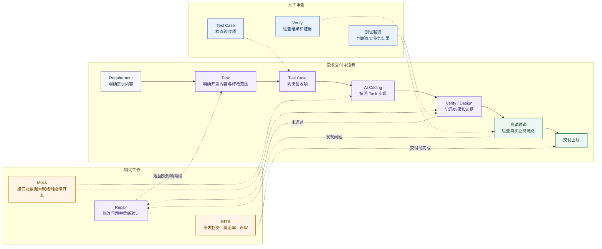
```mermaid
flowchart LR
    subgraph SUPPORT["辅助工作"]
        direction TB
        M["Mock
接口或数据未就绪时继续开发"]
        X["Repair
修改问题并重新验证"]
        B["BITS
研发任务 · 覆盖率 · 评审"]
        M ~~~ X
        X ~~~ B
    end

    subgraph MAIN["需求交付主流程"]
        direction TB
        I["Requirement
明确需求内容"] --> P["Task
明确开发内容与修改范围"]
        P --> T["Test Case
列出验收项"]
        T --> C["AI Coding
按照 Task 实现"]
        C --> V["Verify / Design
记录结果和证据"]
        V --> J["测试联调
检查真实业务链路"]
        J --> A["交付上线"]
    end

    subgraph REVIEW["人工审查"]
        direction TB
        H1["Test Case
检查验收项"]
        H2["Verify
检查结果和证据"]
        H3["测试联调
判断真实业务结果"]
        H1 ~~~ H2
        H2 ~~~ H3
    end

    M -.-> C
    M -.-> V
    V -. 未通过 .-> X
    J -. 发现问题 .-> X
    X -. 返回受影响阶段 .-> P
    B -. 交付前完成 .-> A
    H1 -.-> T
    H2 -.-> V
    H3 -.-> J

    classDef source fill:#F5F7FA,stroke:#7B8794,color:#273142,stroke-width:1.2px;
    classDef ai fill:#F3EEFF,stroke:#7A5AF8,color:#3D2C6E,stroke-width:1.5px;
    classDef human fill:#EAF2FF,stroke:#4C78C2,color:#173A5E,stroke-width:1.5px;
    classDef support fill:#FFF4E5,stroke:#C98218,color:#6B4100,stroke-width:1.5px;
    classDef result fill:#ECF8F1,stroke:#3A8D5D,color:#1F5135,stroke-width:1.5px;

    class I source;
    class P,T,C,V,X ai;
    class H1,H2,H3 human;
    class M,B support;
    class J,A result;
```

| **建设目标** | **考虑方向** |
| --- | --- |
| **缩短交付时间** | 可自动化处理和重复执行的工作原则上由 AI 完成。Mock 减少等待接口和目标数据的时间；BITS 减少交付前的重复操作。 |
| **提高交付质量** | Task 记录需求来源和修改范围；Test Case 明确验收断言；Verify 为每条断言记录结果和证据；Repair 修改 Verify、测试或联调发现的问题，并重新验证相关 Case。 |
| **减少人工参与** | 人工主要审查 Test Case、Verify 结果和测试联调结果，并确认提交和发布；需求分析、任务规划、代码实现、页面操作和问题修复由 AI 执行。 |

##### 工作重点一：按 Test Case 构建 Mock 规则

> **核心目标：**前后端并行开发时，接口或目标数据可能尚未就绪。此时需要准备可被页面请求命中的 Mock 响应，使前端开发和自动化验收能够继续进行。

**关键问题**

同一个接口可能服务多个测试场景，所需 Mock 规则的数量并不等于接口数量。如果只根据接口定义批量构建规则，无法判断哪些响应会被后续自动化验收使用，也无法保证页面请求能够准确命中规则。

以作品列表接口为例，同一个接口需要支持两种测试场景：

```text
作品列表接口
├─ Case A：验证列表正常展示 → R-LIST-NORMAL
└─ Case B：验证列表空态展示 → R-LIST-EMPTY
```

两个 Case 使用同一个接口，但需要不同的返回数据。只按接口准备一条规则，后续验收无法确定应该返回列表数据还是空数据。**因此，需要建立 Mock 规则与 Test Case 的对应关系，让每条规则都有明确的测试来源和使用场景。**

**规范设计**

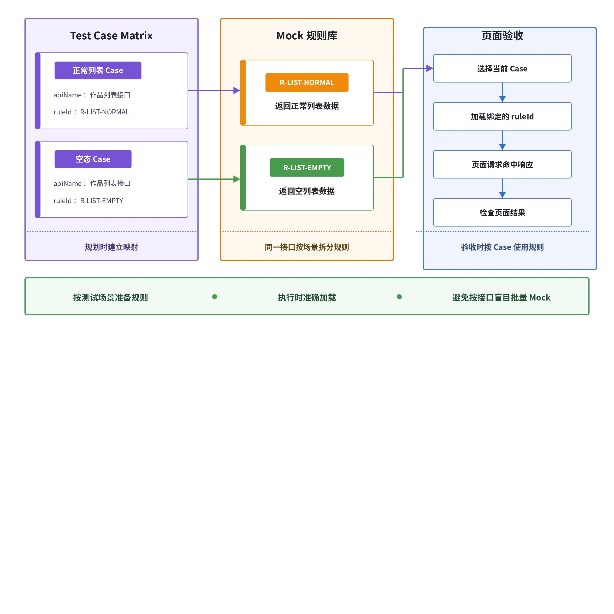

[白板 39 原始节点数据](history/陈相实习生转正答辩.assets__039_whiteboard_UK0jwazr_nodes.json)

> **表格说明：** 原表包含合并单元格或复杂块内容，已按行列顺序展开；正文、代码、图片和白板均保留。

**记录 1**

**规范步骤**

1. **建立规则映射。**构建 Test Case Matrix 时，为每个依赖响应数据的 Case 填写 `apiName` 和 `ruleId`。`apiName` 标识目标接口，`ruleId` 标识当前场景需要的响应规则；不依赖响应数据的 Case 将 `ruleId` 标记为 `N/A`。
2. **约束映射关系。**同一接口需要不同响应时，分别配置不同的 `ruleId`。一个验收目标需要多种响应时，拆分成多个 Test Case；多个 Case 使用相同的请求条件和响应内容时，可以复用同一条规则。
3. **按 Case 补齐规则。**Verify / Design 执行当前 Case 时读取映射。规则可用时直接加载；规则缺失或与接口响应不一致时，暂停当前 Case，完成规则的新增、修复和校验，再返回同一个 Case 继续验收并保存证据。

**完成标准**

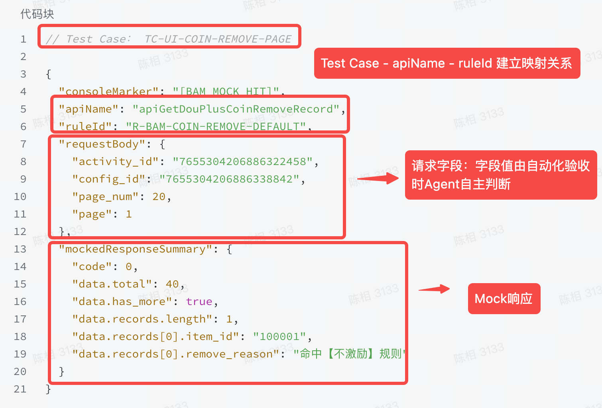

**记录 2**

**规范步骤**

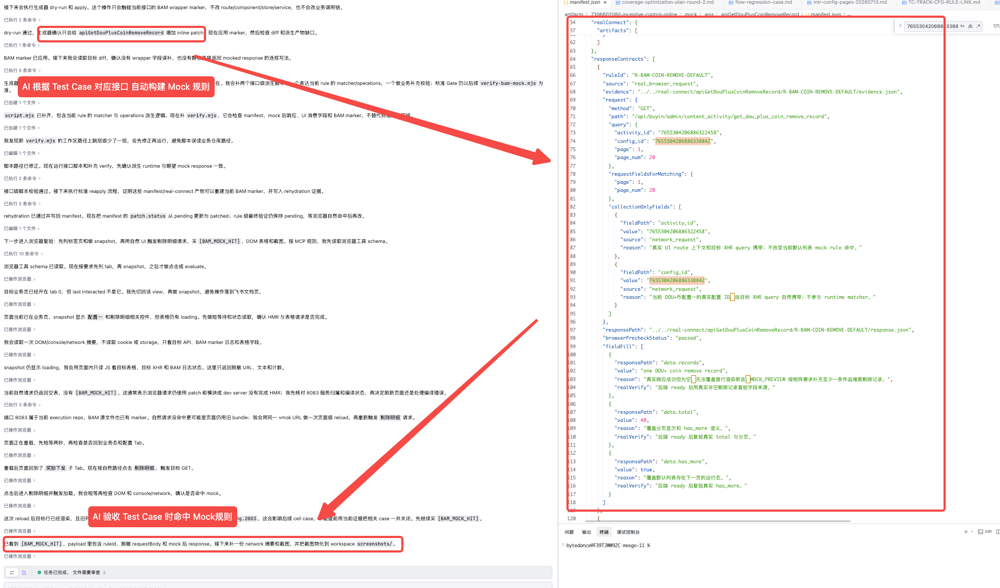

**结果沉淀**

> **产物总结：**这组产物固定了 Test Case、接口和 Mock 规则之间的对应关系。接口或目标数据未就绪时，Agent 可以按当前 Test Case 准备并加载需要的响应，让前端开发和页面验收继续进行，减少人工逐个配置 Mock 的时间。
>
> [[需求]运营平台_达人库/BPO工作台_TR 调控政策运营侧及BPO侧透传二期](https://meego.larkoffice.com/e-commerce/story/detail/7329579007?super_app=1&open_type=open_in_page&target_width=700&min_width=550&is_nearest_order=1)

```text
commands/
├── delivery:task.md                 # 生成 Task 和 Test Case Matrix，建立 Case 与 Mock 规则的映射
└── delivery:mock.md                 # 按当前 Case 构建或修复 Mock，完成后返回原验证流程

skills/
├── 10-test-case-planning/
│   ├── SKILL.md                     # 定义 Test Case、接口和 ruleId 的映射规范
│   └── test-case-matrix-template.md # 固定测试矩阵和 Mock 规则映射字段
└── bam-mock-runtime-generator/
    ├── SKILL.md                     # 定义 Mock 规则生成、命中、校验和清理流程
    ├── references/
    │   ├── mock-rule-design.md      # Mock 规则的拆分与复用方式
    │   ├── matching-algorithm.md    # 请求条件与 ruleId 的匹配规则
    │   ├── manifest-schema.md       # Mock Manifest 的字段约束
    │   └── gate-closure.md          # Mock 规则完成条件和失败处理
    └── scripts/
        ├── init-bam-mock.mjs        # 初始化 Mock 目录和基础结构
        ├── manifest-gates.mjs       # 检查规则、字段和状态是否完整
        ├── reapply-bam-mocks.mjs    # 重新应用已有 Mock 规则
        └── verify-bam-mock.mjs      # 校验规则能否被页面请求正确命中
```

##### 工作重点二：将 Verify 证据与 Test Case 对齐

> **核心目标：让 Verify 验证结果可信**。一个 Test Case 通常包含多条功能或视觉断言，每条断言都要有实际结果和对应证据，只要存在断言未执行、结果未记录或证据缺失，当前 Case 就不能通过 Gate。Verify 的结论必须能够回到具体断言和证据文件，不能只保留一条总体的 `PASS`。

**关键问题**

Skill 中的流程和规范大多以自然语言描述，本质上仍是软约束。即使文件已经明确要求逐条验收和保存证据，Agent 在长任务中仍可能遗漏某项要求、用其他动作替代规定步骤，或者在记录不完整时直接判断任务完成。**因此，设计重点是如何让 Agent 稳定执行 Skill。**

**调研结论**

> [拜访提案 Skill 优化复盘](https://bytedance.larkoffice.com/docx/RLX5dMdQCoDw5PxUgwgc2GyBnih)
>
> [产品验收新范式：Agentbuddy团队实践](https://bytedance.larkoffice.com/docx/Q5m9dPhXBoHncDx9IiVcfTFRnwf)

> **表格说明：** 原表包含合并单元格或复杂块内容，已按行列顺序展开；正文、代码、图片和白板均保留。

**记录 1**

**结论**

**结论一：Gate 是任务型 Skill 的关键环节。**

> Gate 负责控制任务是否完成。检查不通过时，需要拒绝放行，并返回失败规则、失败原因、补充位置和重新检查的位置。

**相关调研**

**理由。**Agent 即使在执行中遗漏了某条规范，只要 Gate 没有被绕过，缺失的状态或证据仍会使检查失败。具体的失败信息可以把 Agent 拉回对应规则，减少重新查找问题的范围。

**调研依据。**[Claude Code Hooks 官方文档](https://code.claude.com/docs/en/hooks)给出了 `TaskCompleted` 的阻断示例：固定事件触发测试，退出码为 `2` 时任务不能完成。[Formal Skill](https://arxiv.org/abs/2605.19604) 在运行状态中保存验证结果、必需产物和失败原因，检查失败后返回修复阶段。[ACL 2024 的错误定位研究](https://aclanthology.org/2024.findings-acl.826/)还发现，直接提供正确的错误位置后，模型在五类推理任务中的修正结果均有提升。

**示例**

```yaml
Gate状态:
  PASS:
    条件: 所有检查项和证据完整
    动作: 允许完成
  FAILED:
    rule_id: ASSERTION-02
    failure_reason: 缺少截图证据
    repair_from: 当前断言
    recheck_from: 当前 Case
```

**记录 2**

**结论**

**结论二：按可检查程度拆分 Skill 规范。**

> 固定字段和状态放入模板、JSON 或 XML；重复且结果确定的检查交给脚本；需要理解上下文和判断业务语义的内容保留在自然语言中。

**相关调研**

**理由。**长篇自然语言需要 Agent 在每次执行时重新解释，字段、状态和完成条件容易被遗漏。**模板和结构化字段可以固定产物形态，脚本可以检查字段和文件是否齐全。**证据能否支持业务断言仍需要结合上下文判断，保留自然语言更合适。

**调研依据。**[OpenAI Skill Creator](https://github.com/openai/skills/blob/main/skills/.system/skill-creator/SKILL.md) 按任务自由度选择自然语言、参数化脚本或固定脚本，并用模板生成固定产物，对于固定、重复、可校验的步骤，使用脚本和结构化字段；对于不能遗漏的门禁，再通过 Hook 等机制强制执行。[From Skill Text to Skill Structure](https://arxiv.org/abs/2604.24026) 在**6,184个Skill**上的实验表明，将Skill的调用条件、执行阶段和工具动作结构化后，Skill检索指标提升约**12.3%**；将结构化信息与原文结合，风险识别指标提升约**24.4%**。

**示例**

```yaml
Verify证据验收Skill:
  结构化字段:
    - Test Case编号
    - 验收断言
    - 实际结果
    - 证据路径
    - 验收状态
  脚本检查:
    - 必填字段是否完整
    - 证据文件是否存在
    - 是否仍有未完成状态
  自然语言判断:
    - 证据是否支持断言
    - 未关闭问题是否影响结论
```

**记录 3**

**结论**

**结论三：执行产物随任务进度更新**

> 任务开始时先初始化全部检查项。每完成一个任务单元，立即写入当前结果、证据和状态，不能等到最后统一补写。

**相关调研**

**理由。**长任务结束后再补产物，需要依赖上下文回忆，容易漏掉中间步骤，也容易把尚未完成的内容写成已完成。增量记录保留了当前进度；任务中断后，可以从第一个未完成项继续。

**调研依据。**[Anthropic 长任务 Agent Harness](https://www.anthropic.com/engineering/effective-harnesses-for-long-running-agents) 会先把功能清单初始化为未通过，每次只处理一个功能，测试完成后立即更新功能状态和进度文件。新的执行轮次直接读取已有记录，不需要在任务末尾回忆前面的过程。

**示例**

```yaml
验证任务: 敏感字段权限展示
初始状态:
  待执行: [TC-01, TC-02, TC-03]
第一次更新:
  已完成: [TC-01_无权限时显示脱敏值]
  证据: [TC-01.png]
  待执行: [TC-02, TC-03]
第二次更新:
  已完成: [TC-01, TC-02_申请入口正常打开]
  待执行: [TC-03]
第三次更新:
  已完成: [TC-01, TC-02, TC-03_获得权限后刷新数据]
  待执行: []
```

**规范设计**

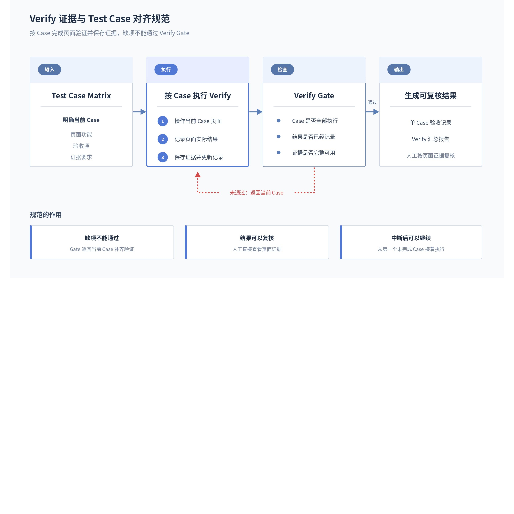

[白板 42 原始节点数据](history/陈相实习生转正答辩.assets__042_whiteboard_OlaKw3P5_nodes.json)

> **表格说明：** 原表包含合并单元格或复杂块内容，已按行列顺序展开；正文、代码、图片和白板均保留。

**规范步骤**

1. **初始化结构化验收记录。**Verify 根据 Test Case Matrix 建立执行队列。每个 Case 开始前生成独立验收记录，并写入正向功能断言、反向功能断言、正向视觉断言、反向视觉断言和证据要求，初始状态统一为待执行。一条断言包含多个判断条件时，需要拆成可以独立验证的验收项；模板仍有占位内容时不能开始验收。

**记录 1**

**列 1**

1. **逐条验证并增量记录。**Agent 按验收记录逐条执行。每完成一条断言，立即写入实际观察结果、验证动作、证据类型、证据文件位置和当前状态。截图、DOM、Network 和日志需要保存到任务目录；聊天图片、浏览器临时记录和"符合预期"等文字不能单独作为验收证据。

**记录 2**

**列 1**

1. **完成断言与证据对账。**每条断言通过稳定标识关联实际结果和证据：

> **Test Case → Assertion → Observed Result → Evidence → Conclusion**

当前 Case 的每条断言都要有执行状态、实际结果和证据路径。记录没有闭合前，Agent 不能进入下一个 Case；执行中断后，从第一个未完成项继续。

**记录 3**

**列 1**

1. **执行 Gate 并回收缺项。**

- 断言未执行时，返回对应验收点补做验证。
- 已执行但没有记录时，补充记录或重新取证。
- 证据文件缺失或类型不匹配时，重新保存符合要求的证据。
- 实际结果不符合断言时，修复问题并复验当前 Case。
- 单 Case 记录与全局审计不一致时，重新完成证据对账。

Gate 未通过时，需要返回 `case_id`、`assertion_ref`、失败原因、补充位置和重新检查点。全部验收项完成、证据文件存在且记录一致后，当前 Case 才能通过；所有 Case 闭合后，Verify 阶段才能进入下一阶段。

**完成标准**

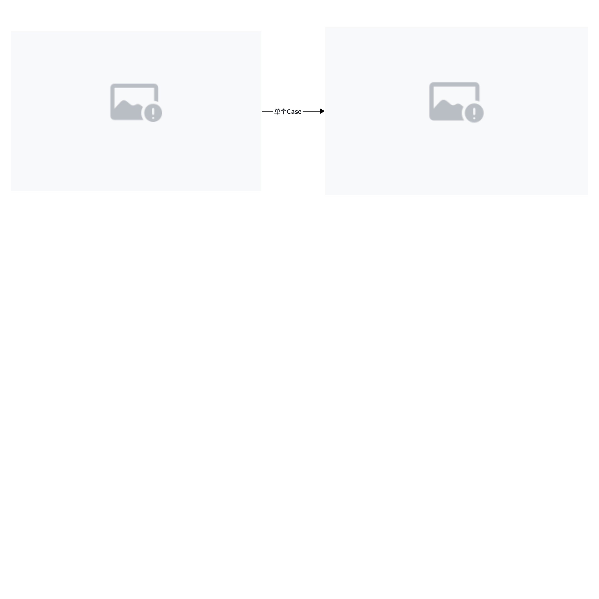

[白板 43 原始节点数据](history/陈相实习生转正答辩.assets__043_whiteboard_Kx0owyf3_nodes.json)

**结果沉淀**

> **产物总结：**这组产物要求 Agent 按 Test Case 逐项操作页面并保存证据，任何一项没有检查都不能通过 Verify。Verify 不再只给出“通过”结论，而是能够证明页面功能是否按需求完成，人工可以直接根据证据进行复核。

```text
commands/
└── delivery:verify.md                              # 组织 Case 队列、页面验证、证据对账和阶段 Gate

skills/
└── 06-debug-verification/
    ├── SKILL.md                                    # 定义 Verify 的逐 Case 执行和证据闭合规范
    ├── debug-verification-case-result.template.md  # 固定单 Case 的断言、结果和证据记录
    ├── debug-verification-report.template.md       # 固定 Verify 汇总、索引和全局审计结构
    └── browser-verify-runbook.template.json        # 保存可复跑的浏览器操作和证据目标
```

##### 工作重点三：根据验收问题执行 Repair 并复验

> **核心目标：**不能期望 Agent 通过一轮执行完成全部交付。测试、联调或验收发现问题后，需要支持二次修正，并重新执行受影响的开发和验证环节，直到验收通过。

**关键问题**

返修不能只修改代码，相关的工作区产物也需要同步更新。否则需求、任务、Test Case 和验证记录仍停留在旧状态，无法代表当前代码的实际情况。因此，**Repair 不是一次性的代码修补，而是从验收问题来源出发，定位能够修正问题的最小回退阶段，并闭环回原问题。**

**规范设计**

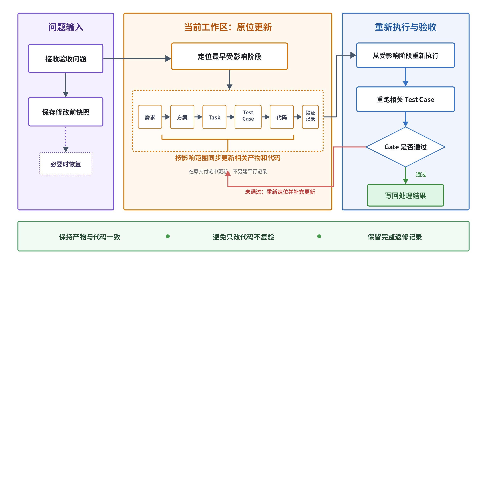

[白板 44 原始节点数据](history/陈相实习生转正答辩.assets__044_whiteboard_Lch6w2qt_nodes.json)

> **表格说明：** 原表包含合并单元格或复杂块内容，已按行列顺序展开；正文、代码、图片和白板均保留。

**规范步骤**

1. **接收问题并保存快照。**读取验收问题，并在修改前保存当前工作区产物、代码和执行状态。后续修正、恢复和结果对比都以这份快照为基准。
2. **定位受影响阶段与产物。**逐项分析问题，确定最早受到影响的阶段，并列出需要更新的需求、方案、Task、Test Case、代码或验证记录。问题不能直接默认归入代码阶段。
3. **更新相关产物。**在现有工作区中更新受影响的阶段产物和代码，保留原有 Requirement、Task 和 Test Case 的对应关系，不另建一套平行记录。
4. **重新执行并验收。**从定位出的阶段开始重新执行后续流程，重跑受影响的 Test Case，并更新实际结果和验证证据。相关阶段 Gate 和 Repair 检查全部通过后，本轮修正才算完成。
5. **验收通过后写回结果。**整理问题、调整内容、解决结果和验收步骤，写回原验收问题。接收人可以按照写回的步骤直接完成复验。

**完成标准**

[剔除名单与导出剔除明细验收记录](https://bytedance.larkoffice.com/docx/NQxTdRPPQoM9GPxcuAjcqvMCnkg)

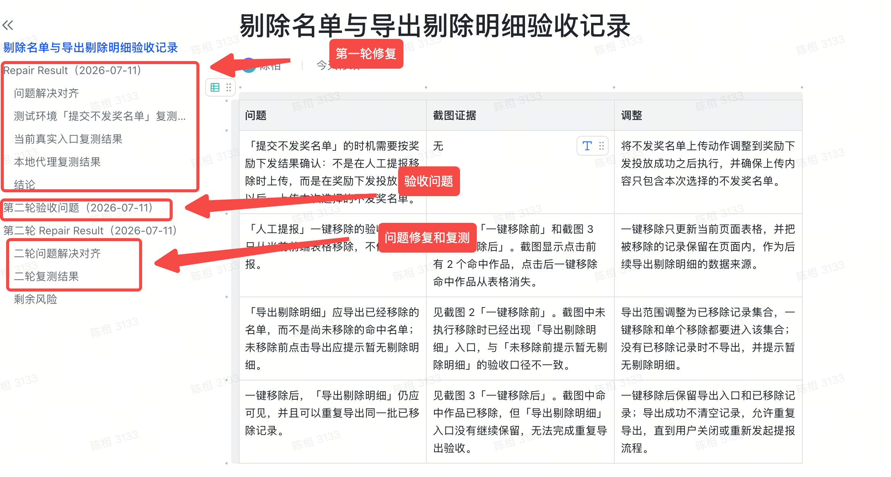

**结果沉淀**

> **产物总结：**这组产物把测试和联调问题统一送回 Repair 流程。Agent 修改问题后必须重新执行受影响的 Test Case，验证通过后才能结束；修改失败时可以恢复到返修前的状态。这样可以避免只改代码、不做复验，也让每次返修都有明确结果。

```text
commands/
└── delivery:repair.md                    # 编排快照、阶段回放、恢复和结果写回

skills/
└── delivery-acceptance-repair/
    ├── SKILL.md                          # 定义问题归因、原位更新、重新执行和闭环规则
    ├── repair-plan-template.md           # 固定影响分析、更新位置和阶段重跑计划
    └── scripts/
        ├── create-repair-snapshot.sh     # 修改前保存工作区和代码快照
        ├── resolve-repair-run.mjs        # 识别并复用同一问题的 Repair 记录
        ├── validate-repair-artifacts.mjs # 检查相关产物、阶段状态和验收结果
        └── rollback-repair-snapshot.sh   # 需要时恢复到 Repair 前状态
```

##### 工作重点四：通过 BITS 完成交付前检查

> **核心目标：**在建立覆盖率自动化能力的基础上，继续把自动化范围扩展到评审评论的分析和处理，减少交付周期和人工参与成本。

**关键问题**

自动处理评审评论可以节省时间，但评审建议和 AI 的处理结果都可能存在偏差。为保证交付质量，**因此，人工审查需要保留为最后的 Review 节点**；原评论、处理结果和回复内容确认后，才允许提交代码并关闭评论。

**规范设计**

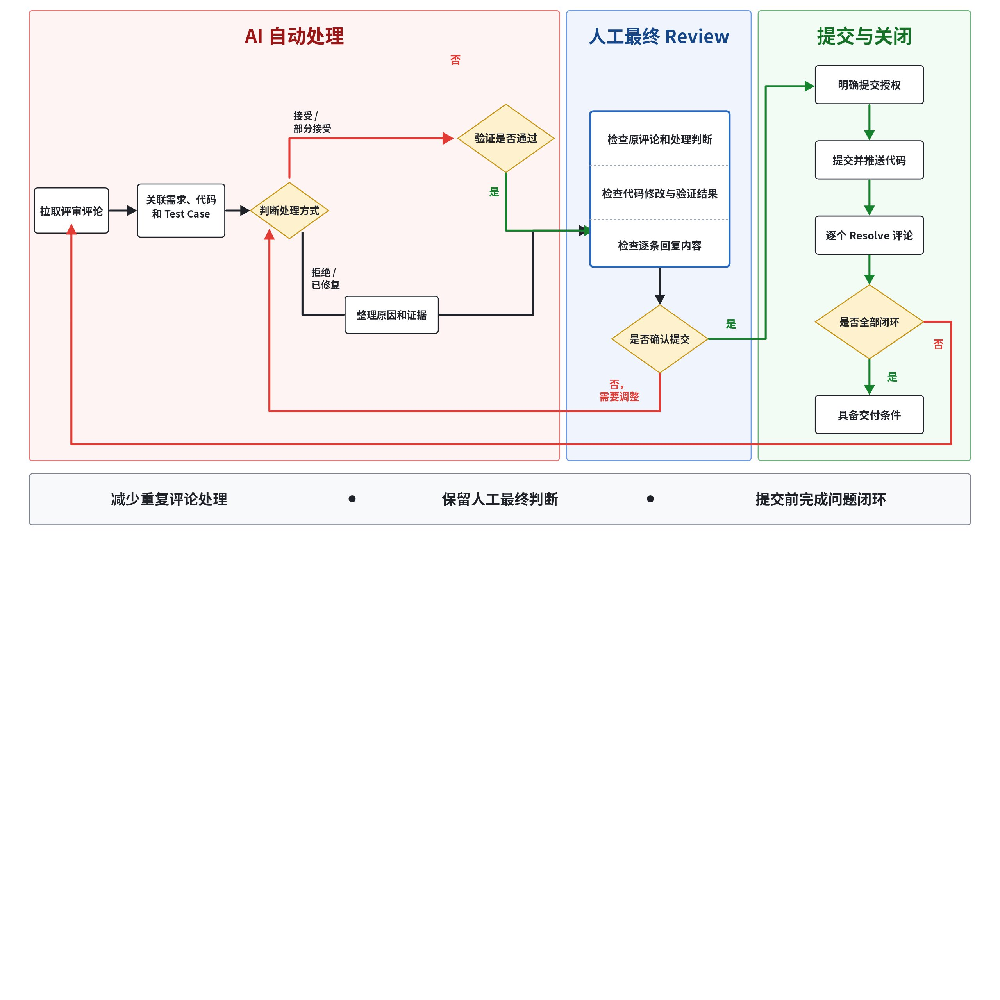

[白板 46 原始节点数据](history/陈相实习生转正答辩.assets__046_whiteboard_DoYCwoli_nodes.json)

> **表格说明：** 原表包含合并单元格或复杂块内容，已按行列顺序展开；正文、代码、图片和白板均保留。

**规范步骤**

1. **分析并判断评论。**AI 拉取 Codebase Assistant、Aime 和 CodeGuard 评论，对照需求、代码和 Test Case 判断问题属于接受、部分接受、拒绝或已修复，并保存每条判断的依据。
2. **完成修改和验证。**需要处理的问题由 AI 完成最小范围修改，并运行相关 Case、构建和代码检查。验证未通过时继续修正，不进入回复和提交阶段。
3. **逐条回复评审意见。**AI 针对每个 Thread 分别回复处理方式、原因和验证结果。拒绝或已修复的问题同样需要说明依据，不能使用一条汇总回复替代全部评论。
4. **人工审查并完成关闭。**人工统一审查原评论、AI 的处理判断、代码修改、验证结果和回复内容。需要调整时返回评论分析环节；确认后再由 AI 提交和推送代码，并逐个 Resolve 已成功回复的 Thread。

**记录 1**

**列 1**

**完成标准**

**列 2**

1. **评论不成立，直接拒绝**

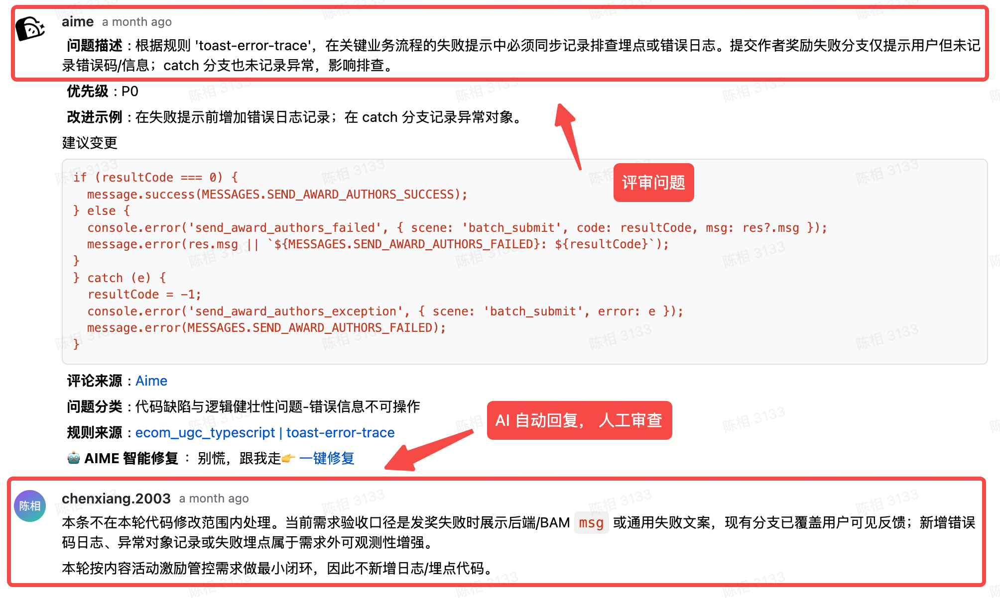

**列 3**

1. **评论成立，按评论处理**

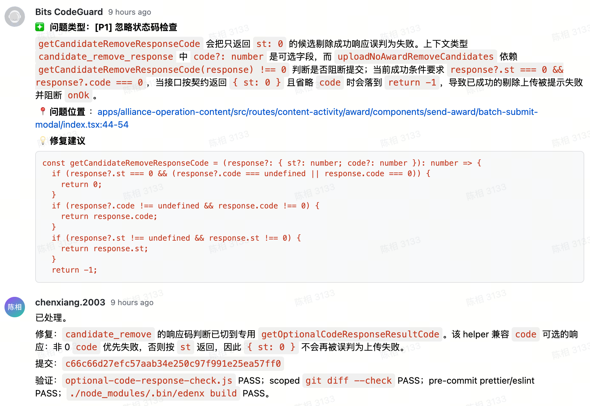

**结果沉淀**

> **内容激励需求中 使用 delivery:bits.md  自动处理 38 条评论。**

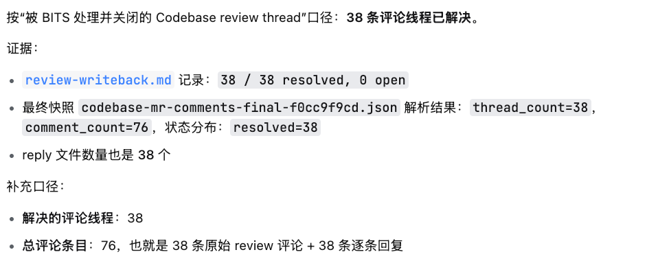

```text
commands/
└── delivery:bits.md                            # 编排覆盖率优化、评审评论处理和授权边界

skills/
└── bits-dev-flow/
    ├── SKILL.md                                # 定义覆盖率和评审评论的自动处理流程
    ├── cr-modification-closure.template.json   # 记录评论判断、代码修改、验证和关闭状态
    ├── coverage-optimization-state.template.json      # 记录覆盖率优化轮次和当前状态
    ├── coverage-optimization-plan-round.template.md   # 固定每轮未覆盖代码分析和处理计划
    ├── coverage-exclusion-log.template.json    # 记录已处理文件及对应代码版本
    └── scripts/
        └── collect-huatuo-branch-coverage.js   # 获取华佗覆盖率和未覆盖代码明细
```

#### 已有成果与后续规划

##### 已有成果

**内容激励需求使用完整工作流进行交付**，覆盖需求理解、任务规划、代码实现、验收、测试联调和发布。整个需求经过一轮完整工作流和两轮 Repair 完成上线。

> **表格说明：** 原表包含合并单元格或复杂块内容，已按行列顺序展开；正文、代码、图片和白板均保留。

**记录 1**

**需求介绍**

**内容激励管控**

[【PRD】运营平台_内容活动_激励管控线上化](https://bytedance.larkoffice.com/wiki/RQFqwENe8iiLqTkWk7ScWfIznwt)
奖励配置和发放链路对不激励内容、异常作品的提示和拦截不完整，存在不符合规则的作品进入发奖的风险

**Meego：**

[[需求]运营平台_内容活动_激励管控线上化](https://meego.larkoffice.com/e-commerce/story/detail/7306602080?parentUrl=%2Fe-commerce%2Fstory%2Fhomepage&openScene=2)

**研发人员：**

FE：陈相

Server:阎智超

**实现目标**

识别并拦截不激励或异常作品，支持运营处理问题作品和查看剔除明细，减少错发奖励和人工排查

**工作流记录**

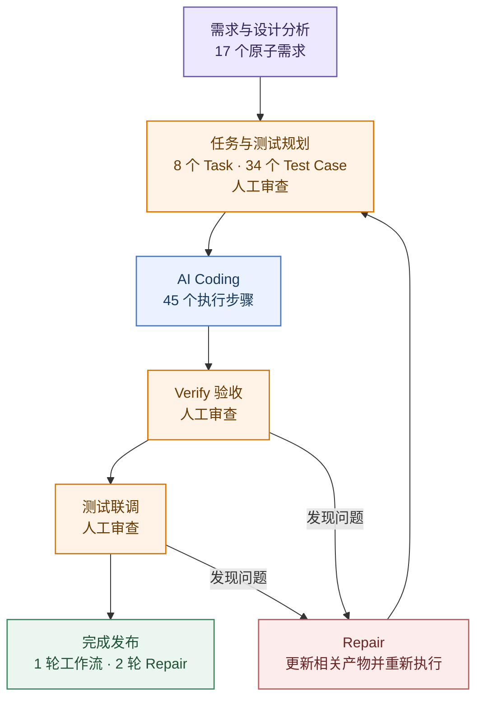
```mermaid
flowchart TB
    A["需求与设计分析
17 个原子需求"] --> B["任务与测试规划
8 个 Task · 34 个 Test Case
人工审查"]
    B --> C["AI Coding
45 个执行步骤"]
    C --> D["Verify 验收
人工审查"]
    D --> E["测试联调
人工审查"]
    E --> F["完成发布
1 轮工作流 · 2 轮 Repair"]

    D -->|发现问题| R["Repair
更新相关产物并重新执行"]
    E -->|发现问题| R
    R --> B

    classDef source fill:#EEE8FF,stroke:#6D5CA8,color:#30265A,stroke-width:1.4px;
    classDef workflow fill:#EAF2FF,stroke:#4C78C2,color:#173A5E,stroke-width:1.4px;
    classDef review fill:#FFF3E8,stroke:#D97706,color:#6B3A00,stroke-width:1.4px;
    classDef repair fill:#FDECEC,stroke:#C65A5A,color:#6A2424,stroke-width:1.4px;
    classDef result fill:#EAF6EF,stroke:#3F8A5E,color:#1F5135,stroke-width:1.4px;

    class A source;
    class C workflow;
    class B,D,E review;
    class R repair;
    class F result;
```

**工作流提效结果：**

> [AI交付记录-运营平台内容活动激励管控线上化交付过程记录](https://bytedance.larkoffice.com/docx/Ukd3dWSSco8emrxeqaDcABIlnid)

| **提效环节** | **原处理方式** | **工作流处理方式** | **提效结果** |
| --- | --- | --- | --- |
| 覆盖率与评审评论 | 研发人员手动查看覆盖率报告、定位未覆盖代码并操作页面；随后逐条分析评审评论，修改代码、验证并回复 | 工作流自动获取覆盖率和未覆盖代码，通过浏览器操作补齐覆盖；同时逐条判断评审评论，完成必要修改、验证和回复，人工最后统一审查 | 头达需求的覆盖率补齐和评审评论均由人工处理，共使用约 3 PD；内容激励使用工作流完成相同的交付前检查，使用约 4 小时，**处理时间缩短约 83%**； |
| 整体交付周期 | 需求分析、任务拆分、编码、验收、问题修复和交付前检查主要由研发人员逐项完成 | 工作流执行需求分析、任务拆分、代码实现、页面验收、问题修复以及交付前检查；人工负责审查关键结果、真实接口联调和发布确认 | 内容激励需求原人工开发方式预计需要 3 PD，实际使用工作流完成交付使用 2 PD，**交付时间缩短 33%** |
| 代码实现 | 研发人员按照任务逐项编写代码、检查构建结果并记录进度；测试发现问题后继续人工修改 | 人工确认开发任务和验收条件后，工作流按照任务修改代码、执行代码检查并更新完成状态；人工保留代码审查和最终验收 | **减少代码实现阶段的人工投入** |
| 功能验收 | 研发人员手动操作页面并阅读代码，判断各项功能是否完成；发现问题后修改代码，再重新复现整个操作过程 | 工作流按照验收条件操作页面，记录实际结果和截图；结果不符合要求时保存失败位置，修改后重新执行相同场景，人工检查证据和验收结论 | 人工由逐项操作和阅读代码改为审查证据及结论，**减少验收时间并降低功能遗漏风险** |
| 页面验收 | 页面开发完成后，研发人员逐项对照设计稿和实际页面；发现差异后，再检查组件和样式代码，修改并重新打开页面确认 | 工作流自动打开页面，把实际截图与设计稿对应区域进行核对；发现问题后修改代码并重新验收，人工检查修改前后的证据和最终结论 | **减少人工对照设计、检查代码和重复验收的时间；** |
| Mock 数据 | 接口或目标数据未就绪时，研发人员手动构造返回数据，或者等待后端提供可用接口和测试数据；切换场景时需要再次修改 | 工作流根据测试场景生成并加载对应的 Mock 数据，再操作页面完成验收；真实接口留到联调阶段确认 | **缩短数据准备和页面调试时间，减少逐接口修改 Mock 数据的人工操作** |
| 测试问题定位和修复 | 测试发现问题后，研发人员重新复现，再从需求、接口请求和代码中逐步查找原因；代码修改完成后，相关任务和验收记录需要人工同步 | 工作流根据失败的验收项、请求记录和已有证据缩小问题范围，修改受影响的需求说明、任务、代码和验收项，再重新执行对应场景 | **缩短接口问题的定位和返修时间，减少人工逐层排查**；接口约束、代码和验收项同步修正，问题通过复验并在上线前关闭 |

##### 后续规划

> **表格说明：** 原表包含合并单元格或复杂块内容，已按行列顺序展开；正文、代码、图片和白板均保留。

**记录 1**

**当前不足**

1. **目前只覆盖前端开发。**服务端的代码实现、接口验证和数据处理还没有接入工作流。
2. **验收场景覆盖不充足。**当前工作流只在少量前端需求中完成了验证，还需要在不同类型、不同复杂度的需求中继续测试，确认各阶段在更多场景下都能稳定执行。
3. **前后端之间仍依靠人工衔接。**接口调整、任务依赖和联调中发现的问题，需要人工分别通知前后端处理。
4. **还没有经过全栈需求验证。**当前成果证明了工作流可以完成前端交付，但还不能证明它能够支撑前后端一体化开发。

**推进步骤**

根据团队当前规划，**下一阶段将把已经验证的前端交付能力扩展到前后端协同开发**，使需求分析、方案设计、前后端实现、联调、测试和发布能够在同一套 AI Coding 工作流中衔接。

[运营方向 AI Coding 全栈推进方案](https://bytedance.larkoffice.com/wiki/PUcvwPYw3iV2P4k1b9zc3pgPnyg)

1. **补齐全栈开发条件。**整理服务端项目的开发方式、接口和数据限制、测试要求、发布及回滚流程，让工作流能够理解并执行服务端任务。
2. **完成首个全栈需求。**选择一个低风险、1～5 PD、能够独立验证的需求，完整执行需求分析、前后端开发、联调、测试和发布。
3. **检查实际效果。**对比交付时间、问题数量和人工投入，确认哪些工作能够由 AI 执行，哪些环节仍需人工审查。
4. **继续完善和扩展。**修正首个案例中发现的问题，整理 Checklist、FAQ 和 Case Study，再逐步用于更多业务需求。

**列 3**

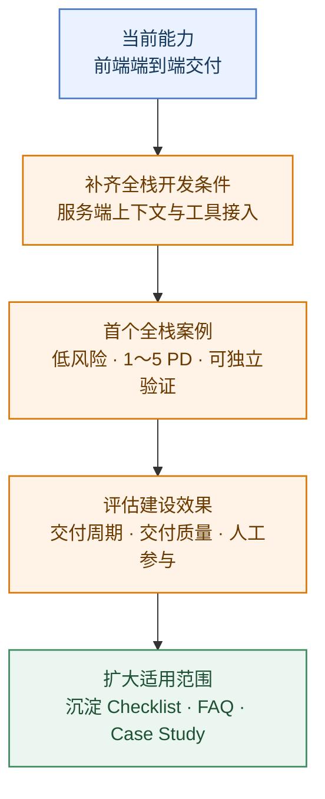
```mermaid
flowchart TB
    A["当前能力
前端端到端交付"] --> B["补齐全栈开发条件
服务端上下文与工具接入"]
    B --> C["首个全栈案例
低风险 · 1～5 PD · 可独立验证"]
    C --> D["评估建设效果
交付周期 · 交付质量 · 人工参与"]
    D --> E["扩大适用范围
沉淀 Checklist · FAQ · Case Study"]

    classDef current fill:#EAF2FF,stroke:#4C78C2,color:#173A5E,stroke-width:1.4px;
    classDef action fill:#FFF3E8,stroke:#D97706,color:#6B3A00,stroke-width:1.4px;
    classDef target fill:#EAF6EF,stroke:#3F8A5E,color:#1F5135,stroke-width:1.4px;

    class A current;
    class B,C,D action;
    class E target;
```

---

## 团队贡献与影响力

实习期间，将需求交付和技术调研中的经验整理为**工作流**和**分享材料**，覆盖研发交付提效与评测建设提效两个方向。

1. **参与 AI Coding 工作流建设，为团队研发提效和AI Coding建设提供基础。**

> **表格说明：** 原表包含合并单元格或复杂块内容，已按行列顺序展开；正文、代码、图片和白板均保留。

**记录 1**

**工作内容**

**沉淀AI Coding 工作流相关skill**

> 参与前端交付 AI Coding 工作流建设，并在内容激励需求中完成实际验证。

**产出结果**

验证了当前工作流能够支持一个中小型需求的完整交付；完成内部分享材料

[前端交付Agent工作流分享](https://bytedance.larkoffice.com/wiki/ONDCwBB3QirVThkuXTyccMhKnxb)。

**团队影响**

当前工作流已经为团队使用 AI Coding 交付中小型需求提供了一套经过业务验证的参考流程，帮助团队交付需求提效；团队可以在此基础上继续完善前端交付能力，为扩展全栈端到端工作流作为基础。

**记录 2**

**工作内容**

**总结《如何编写让 Agent 可靠执行的 Skill》**

> 调研总结如何编写让 Agent 可靠执行的 Skill

**产出结果**

总结可靠 Skill 的编写原则

[bytetech.info](https://bytetech.info/articles/7669096667777335323)

**团队影响**

团队编写任务型 Skill 时，可以据此设计能够让 Agent 可靠执行的 Skill。

1. **参与 Agent Benchmark 评测调研 ，整理团队可参考的评测方法。**

> **表格说明：** 原表包含合并单元格或复杂块内容，已按行列顺序展开；正文、代码、图片和白板均保留。

**记录 1**

**工作内容**

**总结《企业 Agent 任务评分思路》**

> 调研企业 Agent 的任务评分问题，并将调研结论整理为分享文章。

**产出结果**

完成 **《企业 Agent 任务评分思路》**，并分享到 ByteTech。

[bytetech.info](https://bytetech.info/articles/7668640230937837578#MI5Ndw70uoJkPIxy2vxcorEnnFb)

**团队影响**

团队在讨论自建 Agent 的评测方案时，可以参考报告中的思路，设计适合自身任务的评测计分器和逻辑框架。

**记录 2**

**工作内容**

**总结《Agent 评测如何降低 Benchmark 运行成本》**

> 调研 Agent Benchmark 的成本来源和可行的降本方向。

**产出结果**

总结了控制评测成本的思路，并完成调研报告

[Agent 评测如何降低 Benchmark 运行成本](https://bytedance.larkoffice.com/wiki/ZqUVwC1iTiY5cekY81cc1Rtynsf)。

**团队影响**

团队规划 Agent 评测时，可以参考报告中的降本思路，根据实际评测目标控制运行范围和评分投入，避免不必要的评测消耗。

## 自我复盘

从业务需求交付、技术沉淀与研发提效、团队知识交流三个方面回看自己的能力。

### 业务需求交付能力

完整的需求交付不只是完成代码，还包括需求评审、方案选择、开发验证、发布以及上线后的问题处理。

| 阶段 | 需要具备的能力 | 当前情况 |
| --- | --- | --- |
| **需求评审** | 讨论需求为什么做、解决什么问题，并确认范围和预期结果 | 能够完成范围澄清，但**对业务价值的讨论还不够深入** |
| **技术评审** | 从改造成本、兼容性、风险和协作成本等方面比较方案，说明最终选择 | 已在实际需求中完成方案对比和协议确认 |
| **开发实现** | 使用 AI Coding 完成编码、验证和修复，人工负责审查需求理解、改动范围、代码和验收证据 | 已在敏感权限和内容激励需求中按这一方式完成开发 |
| **发布与冲突处理** | 完成发布检查，并处理研发分支与发布分支、发布分支与主分支之间的冲突 | 能够完成常规发布，复杂冲突的处理经验仍需积累 |
| **线上问题处理** | 定位问题，并根据影响决定修复、重新发布或回滚 | 已具备基本判断思路，实际处理经验较少 |

> 目前最需要补足的：一是**需求评审中对业务价值的判断**，二是**复杂代码问题、分支冲突和线上故障的处理经验**。

### 技术沉淀与研发提效

这部分不以文档或工具数量衡量，重点是能否把调研结论和个人经验转化为可复用的方法。

| 能力 | 具体表现 | 实践 |
| --- | --- | --- |
| **技术调研与学习** | 明确调研问题，核对资料，比较不同方案并形成结论 | 调研 Agent 评测趋势、计分方式和 Benchmark，按评测对象、任务数据、运行环境、评分方式和维护现状进行比较 |
| **AI 研发提效** | 识别重复工作，设计适合研发流程的工作流和 Skill | 整理 AI Coding 交付流程，并为 Mock、验证和修复等环节建设配套工具 |

> 当前已经形成调研方法和 AI 工作流实践，但技术结论仍以文档调研和少量需求验证为主，在更多项目和不同任务类型中的适用性还需要继续验证。

### 团队影响力与知识交流

| 项目 | 说明 |
| --- | --- |
| **资料整理** | 已整理 AI Coding 工作流和 Agent 调研材料 |
| **技术讨论** | 能够在需求和技术评审中表达判断，讨论方案取舍 |
| **知识分享** | 较多内容仍停留在个人资料中，**正式的团队分享不足** |
| **反馈迭代** | 还没有形成“分享—试用—反馈—修订”的稳定循环 |

> 团队影响力是当前比较明显的不足。下一步需要把个人资料整理成团队成员看得懂、能讨论、能实际使用的内容，并通过反馈持续修订。

---

## 未来规划

---

### 团队规划：建设面向规模化运营的运营 Agent

#### 当前模式与问题

当前规模化运营已经具备批量能力。运营先圈选人群并拆分任务，根据人群整体数据制定运营策略；需要深入处理时，再查看重点达人或异常情况。触达环节由 BPO 或 RPA 批量执行，运营继续跟进达人并查看结果。

随着服务人群扩大，当前模式主要暴露出这些问题：

1. **批量运营缺少差异化处理能力。** 现有方式可以批量圈人、下发任务和发送消息，但通常按一类人群使用统一策略和相近话术。运营可以针对少量重点达人深入分析，却很难为人群中的每位达人分别诊断问题和编写建议。
2. **运营方法难以在团队内复用。** 面对相似的达人问题，不同运营的判断和处理方式并不一致。资深运营的诊断依据和处理经验往往停留在个人判断、沟通记录或案例文档中，其他人难以直接使用。
3. **一次运营是否有效难以直接判断。** 消息发送、达人回复、后续行动和经营数据分散在不同环节。例如向达人提出开播建议后，运营很难连续确认建议是否送达、达人是否采纳、是否实际开播，以及开播后经营数据是否改善。

#### 建设目标

团队计划在现有批量运营方式中引入运营 Agent。运营可以针对不同人群定制对应的诊断 Skill，由 Agent 批量生成诊断和建议；触达后的反馈用于继续调整该人群的 Skill，经过验证的优秀诊断则沉淀为公共经验。

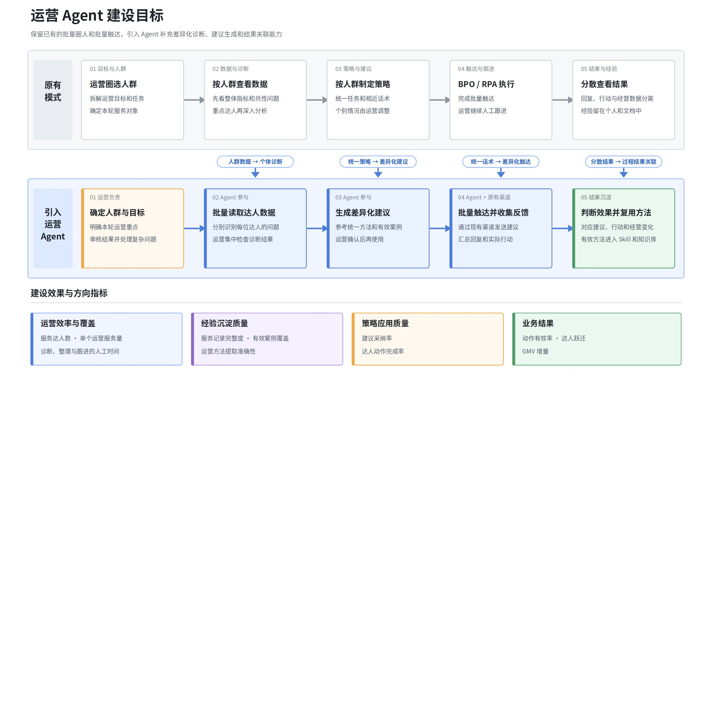

[白板 50 原始节点数据](history/陈相实习生转正答辩.assets__050_whiteboard_EbeKwCBl_nodes.json)

#### 规划方案

1. **批量诊断和建议生成。** 运营针对不同人群选择或定制相应的诊断 Skill。Agent 根据每位达人的数据批量执行诊断，为同一人群中的不同达人生成对应的运营建议，运营抽查确认后再进行触达。
2. **根据人群反馈调整诊断 Skill。** 触达后回收该人群的达人回复、采纳情况和运营反馈，检查当前诊断方式存在的问题，并继续调整这个人群使用的诊断 Skill。
3. **将优秀诊断沉淀为公共经验。** 将经过验证的优秀诊断连同达人特征、判断依据、运营建议和实际结果保存到公共经验库，供其他运营查询参考，也为其他 Agent 助手处理相似问题提供数据。

建设效果从四个方向观察：

| 方向 | 主要指标 | 对应的建设内容 |
| --- | --- | --- |
| 运营效率与覆盖 | 服务达人数量、单个运营服务人数、人工耗时 | 批量完成数据读取、初步诊断、建议生成和信息整理 |
| 经验沉淀质量 | 服务记录完整度、有效案例覆盖度、方法提炼准确度 | 将处理过程、判断依据和实际结果整理为 Skill 与知识库内容 |
| 策略应用质量 | 建议采纳率、达人行动完成率 | 关联建议、达人反馈和后续行动，判断建议是否可执行 |
| 业务结果 | 行动有效率、达人跃迁、GMV 增量 | 对照行动前后的经营数据，判断运营动作是否产生实际效果 |

### 个人规划：围绕运营 Agent 建设补齐相关能力

运营 Agent 要完成一条真实的业务链路：运营选择达人，Agent 读取数据并生成建议，运营审核后完成触达，系统再收集达人回复、后续行动和经营结果。个人规划围绕这条链路中的两个技术难点展开。

#### 提升全栈业务交付能力

| 项目 | 说明 |
| --- | --- |
| **业务难点** | Agent 要为不同达人生成诊断和建议，诊断过程、执行结果和后续反馈还需要通过服务端连接起来，才能形成完整的业务链路。当前个人能力主要集中在前端，还需要补充服务端接口的开发能力。 |
| **能力规划** | 能够看懂服务端项目的基本结构和接口调用链路，并独立完成一个范围明确的服务端需求。 |
| **学习内容** | 结合一个真实业务需求学习 Go 和内部服务端框架，完整经历接口设计、代码实现、联调验证和上线过程，先建立对内部服务端项目开发流程的基本认识。 |

#### 掌握 Agent 知识库接入与检索方法

| 项目 | 说明 |
| --- | --- |
| **业务难点** | 优秀诊断案例进入公共经验库后，不能只作为文档保存，还需要让 Agent 在处理相似达人时能够找到并正确使用。 |
| **能力规划** | 能够设计运营经验的组织方式，并将知识库接入 Agent，使 Agent 可以根据当前达人特征检索对应的诊断依据和建议。 |
| **学习内容** | 学习不同知识库的组织和检索方式，理解 LLM Wiki、结构化数据库和向量 RAG 的适用场景及优缺点；掌握知识库的接入方式，使 Agent 能够按需搜索、读取和使用其中的知识。 |

## 致谢

---

回看这段实习经历，首先想感谢 Mentor 杨帆。刚加入团队时，我对业务和企业研发流程都不熟悉，愿意花时间和我讨论需求、解释代码，也会在方案设计、代码审查和问题复盘时直接指出需要改进的地方。在前端需求交付和 AI Coding 工作流建设过程中，我学到的不只是某个功能应该怎么实现，也逐渐知道了为什么要这样设计、修改范围应该控制在哪里，以及如何验证最终结果。

也感谢 Leader 李仕益、周力给我这次实习机会，并在实习过程中给予技术指导和充分的成长空间。这段时间里，我有机会参与真实的业务需求和团队技术建设，也能够独立承担具体工作。遇到问题时，团队同学们张帅康、耿雨欣会提供必要的支持，同时也会让我先形成自己的判断并尝试解决。这样的工作方式让我在实践中积累了经验，也逐渐建立起对交付结果负责的意识。

在大家的帮助下，我的工作方式也发生了变化。刚开始时，我更关注代码能不能实现功能；随着参与的工作逐渐增多，我开始意识到，写完代码只是需求交付中的一个环节。开发前需要把需求范围和技术方案讨论清楚，开发过程中需要与产品、服务端和测试保持对齐，完成后还要继续跟进联调、测试、发布和线上结果。面对不熟悉的问题时，我也逐渐习惯先查阅代码和资料，验证自己的判断，再带着更明确的问题与团队沟通。

这段实习让我逐渐适应了企业研发的工作方式，也让我对前端业务交付和 AI 研发有了更具体的认识。感谢团队每一位同学在这段时间里的指导、帮助和包容。这里学到的工作方法和思考方式，会继续影响之后的学习和工作。
