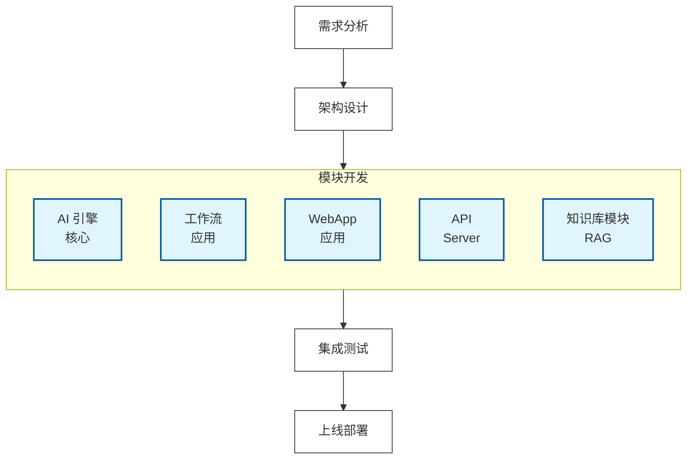
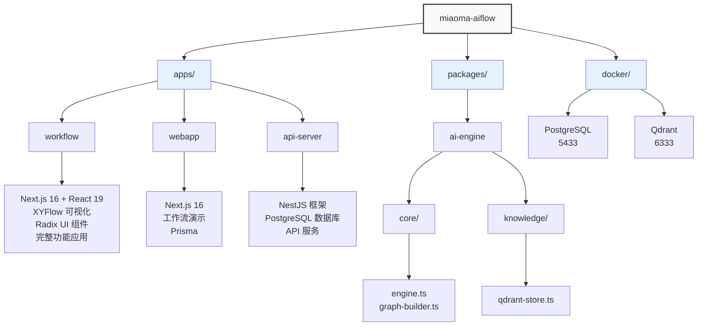
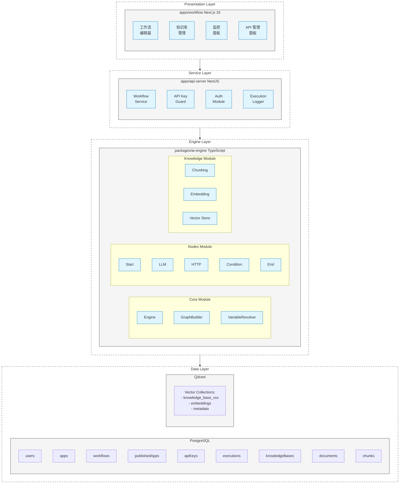
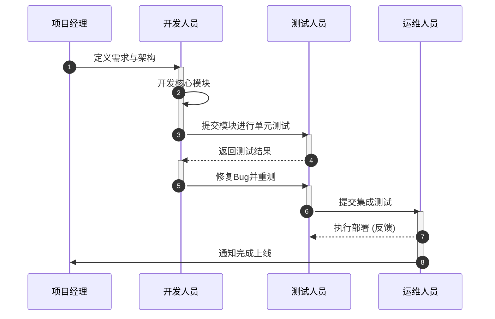
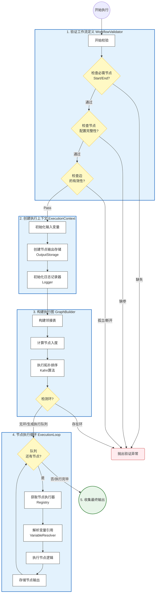
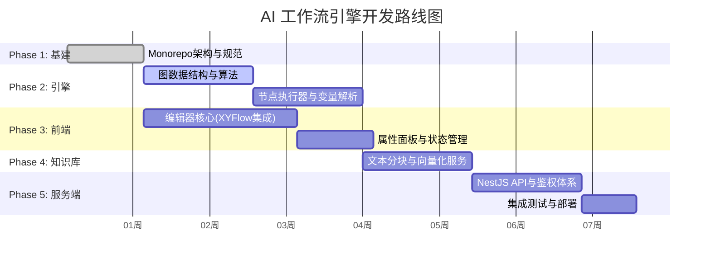

# 1.需求分析、项目架构设计与工作流引擎编辑器核心剖析

[20250720 随堂笔记与源码资料](https://u19tul1sz9g.feishu.cn/docx/BS5CdFOl4on9HExt7t7c9Mn6nVe)

# 课程目标

## 初中级
1. **AI 应用引擎项目需求分析与方案评审**

   - 能够理解企业级 AI 应用引擎的核心需求，包括工作流编排、大模型调用、RAG 知识库等
   - 掌握项目需求评审的流程，理解从需求到解决方案制定的基本思路
   - 理解 AI 应用引擎与传统 Web 应用的差异性
2. **项目架构设计与模块化分析**

   - 理解企业级 AI 应用引擎的架构设计原则
   - 掌握基于 Monorepo 的全栈项目架构组织方式
   - 理解 packages 与 apps 的职责划分
3. **工作流引擎编辑器核心架构**

   - 理解基于 XYFlow 实现的可视化工作流编辑器
   - 能够设计分析不同类型的工作流节点（如 Start、LLM、HTTP、Condition、End、Knowledge 等）
   - 理解 DAG（有向无环图）在工作流引擎中的应用

## 高级
1. **高级架构设计与模块化思想**

   - 具备从零开始设计企业级 AI 应用引擎架构的能力
   - 理解如何将工作流引擎、知识库模块、API 服务和 UI 组件库整合在项目架构中
   - 掌握性能与扩展性最佳实践
2. **工作流节点与执行器实现方案**

   - 深入理解节点注册中心（Registry）和执行器模式（Executor Pattern）
   - 分析自定义节点（如 LLM 调用、HTTP 请求、条件分支、知识库检索等）的实现原理
   - 掌握变量解析器（Variable Resolver）和上下文管理的架构设计
3. **图构建器与拓扑排序算法**

   - 理解基于邻接表和 Kahn 算法的拓扑排序实现
   - 掌握条件分支的动态路径选择机制
   - 深入了解子树排除策略在工作流执行中的应用
4. **工程化与质量控制思想**

   - 理解使用 ESLint、CSpell、Prettier、CommitLint 等工具进行代码质量控制的工程化理念
   - 掌握 Turbo + pnpm workspace 的 Monorepo 构建优化
   - 理解如何通过代码风格一致性、提交信息规范化和拼写检查来提升项目的可维护性

# 课程大纲

**文档目录**

- 初中级
- 高级
- 核心技术文档
- UI 与工程化
- 算法与数据结构
- 环境要求
- 启动步骤
- 服务端口说明
- 常见问题排查
- 需求背景
  - 项目概述
  - 业务需求
  - 技术需求
- 竞品分析
  - 竞品分析概述
  - 竞品功能对比
  - 各竞品详细分析
- 图解
  - 项目架构流程图
  - 项目架构图
  - 项目模块详细分层架构图
  - 核心功能开发流程
- 该项目目录结构说明
- 项目工程化设计
  - 根目录结构
  - apps 子目录
  - packages 子目录
- @miaoma-aiflow/ai-engine
- apps/workflow
- apps/api-server
- ESLint 配置（eslint.config.js）
- 拼写检查（cspell.json）
- Commit 信息规范（commitlint.config.js）
- Prettier 配置（.prettierrc）
- Husky 配置（.husky/pre-commit）
- 其他工程化工具
- 架构概述
- @miaoma-aiflow/ai-engine 核心功能
  - 工作流引擎（WorkflowEngine）
  - 图构建器（GraphBuilder）
  - 节点注册中心（NodeRegistry）
  - 节点执行器（Executors）
  - 变量解析器（VariableResolver）
- 知识库模块（Knowledge）
  - 文本分块（Chunking）
  - 向量嵌入（Embeddings）
  - 向量存储（Vector Store）
  - 检索器（Retriever）
- 可视化编辑器（apps/workflow）
  - XYFlow 集成
- 项目阶段详细规划书
  - 第一阶段：项目初始化与工程设计 (基石搭建)
  - 第二阶段：AI 引擎核心开发
  - 第三阶段：前端应用开发
  - 第四阶段：知识库模块开发 (大脑扩容)
  - 第五阶段：API 服务开发 (对外赋能)
- 项目进度可视化

# 补充资料

## **核心技术文档**

- **Next.js 官方文档**：https://nextjs.org/docs
- **React 19 新特性**：https://react.dev/blog/2024/12/05/react-19
- **XYFlow (ReactFlow)**：https://reactflow.dev/
- **LangChain.js**：https://js.langchain.com/docs/
- **LangGraph.js**：https://langchain-ai.github.io/langgraphjs/
- **Ollama**：https://ollama.ai/
- **Qdrant 向量数据库**：https://qdrant.tech/documentation/

## **UI 与工程化**

- **Tailwind CSS**：https://tailwindcss.com/
- **Radix UI**：https://www.radix-ui.com/
- **shadcn/ui**：https://ui.shadcn.com/
- **Prisma ORM**：https://www.prisma.io/docs
- **Turbo 构建工具**：https://turbo.build/repo/docs

## **算法与数据结构**

- **拓扑排序 - Kahn 算法**：https://en.wikipedia.org/wiki/Topological_sorting
- **DAG 有向无环图**：https://en.wikipedia.org/wiki/Directed_acyclic_graph

**实战学习方法提要**
实战课不同于基础进阶课，实战注重思维的培养，因此在每个实战项目设计之初都充分考虑了需要传达给大家的设计思想、架构、方案选型以及如何在项目中快速落地，所以大家要自顶向下去看实战项目，**先通览设计与方案，后关注代码细节**。
除了弄懂项目架构与基础开发以外，还要着重培养项目相关描述，在面试过程中这点非常重要！
代码均使用 git 管理，每次 commit 都是比较重要的更新，大家学会切换分支查看不同 commit 引入的新代码内容

相关 commit：

- feat(project): ✨ project initialization
- feat(ai-engine): ✨ core workflow engine implementation
- feat(workflow): ✨ visual workflow editor

# 相关面试真题

项目实战相关面试真题，我们单独整理在与本项目实战同级《**企业级类扣子、Dify AI 应用引擎架构设计与实践面试专项突击**》文档

# 项目启动【重要】

## **环境要求**

```TypeScript
# 基础环境
- Node.js >= 22.15.0
- pnpm >= 9.12.3
- Docker Desktop（用于运行 PostgreSQL 和 Qdrant）

# AI 服务
- Ollama（本地大模型服务）
```

## **启动步骤**

```Bash
# 1. 安装依赖
pnpm install

# 2. 构建所有子包产物（如果是初次构建，请到子包中完成）
pnpm build
# 初次
cd packages/ai-engine && pnpm build

# 3. 再次安装依赖（将子包产物安装到业务包中）
pnpm install

# 4. 启动 Docker 基础服务（PostgreSQL + Qdrant）
pnpm docker:start

# 5. 生成 Prisma 客户端
cd apps/workflow && pnpm db:generate
# 或者
cd apps/workflow && npx prisma generate # 使用 prisma 工具自动生成 orm 操作文件
# 注意，三个业务包都需要，apps/workflow apps/webapp apps/api-server

# 初次启动，还需要将 orm 对象同步至数据表
npx prisma db push

# 6. 启动开发服务
pnpm dev
```

## **服务端口说明**

| 服务 | 端口 | 说明 |
|-|-|-|
| Workflow App | 3000 | 主应用（工作流编辑器） |
| WebApp | 3001 | 工作流演示应用 |
| API Server | 3100 | RESTful API 服务 |
| PostgreSQL | 5433 | 关系型数据库 |
| Qdrant REST | 6333 | 向量数据库 REST API |
| Qdrant gRPC | 6334 | 向量数据库 gRPC |
| Ollama | 11434 | 本地大模型服务 |

## **常见问题排查**

1. **数据库连接失败**：检查 Docker 容器是否正常运行 `docker ps`

2. **Prisma 客户端报错**：确保执行了 `pnpm db:generate`

3. **Ollama 调用失败**：确保 Ollama 服务已启动且模型已下载

# 项目需求评审

## **需求背景**

### **项目概述**

本项目旨在打造一个完整的企业级 AI 应用引擎平台，类似于**扣子（Coze）**、**Dify**等产品。该平台集成了以下核心功能：

- **可视化工作流编排**：拖拽式节点编辑，支持复杂 DAG 流程
- **大模型调用**：集成 Ollama，支持本地部署的 LLM
- **知识库管理（RAG）**：文档上传、向量化、语义检索
- **API 服务化**：将工作流发布为 API，支持第三方系统调用
- **执行监控**：实时日志、Token 统计、执行历史

该项目采用全栈架构设计，支持多端（网页端）和多功能模块（AI 引擎、工作流编辑器、API 服务等）。

### **业务需求**

**背景需求**：

在企业级环境中，AI 应用的需求不断增加，市场中已有的工具如扣子、Dify、FastGPT 等应用广泛，但仍存在以下痛点：

- **功能扩展性受限**：难以自定义节点类型和执行逻辑
- **私有化部署困难**：依赖云服务，数据安全无法保障
- **知识库能力有限**：RAG 效果不理想，检索精度不高
- **监控能力不足**：缺乏详细的执行日志和 Token 消耗统计

本项目旨在带领同学们深入研究类扣子产品，从而填补这些需求空白，为企业提供一个可扩展、易集成、且支持私有化部署的 AI 应用引擎解决方案。

**核心业务需求**：

1. **可视化工作流设计**

- 拖拽式节点编辑
- 支持多种节点类型：开始、LLM、HTTP、条件、知识库、结束
- 节点间连线和数据流转
- 变量引用和模板渲染

2. **大模型集成**

- 支持 Ollama 本地模型
- System Prompt 和 User Prompt 配置
- 流式输出支持
- Token 消耗统计

3. **知识库管理（RAG）**

- 文档上传和解析
- 文本分块和向量化
- 语义搜索和混合检索
- 知识库节点集成到工作流

4. **API 服务化**

- 工作流发布为 API
- API Key 管理
- 调用统计和监控
- SSE 流式响应

5. **执行监控**

- 实时执行日志
- 执行历史记录
- Token 消耗统计
- 错误追踪和分析

### **技术需求**

1. **AI 引擎核心库（@miaoma-aiflow/ai-engine）**

   - 工作流定义和验证
   - 图构建器和拓扑排序
   - 节点注册和执行器
   - 变量解析和上下文管理
2. **知识库模块**

   - 文本分块器（Text Splitter）
   - 嵌入服务（Ollama Embedding）
   - 向量存储（Qdrant Vector Store）
   - 检索器（Vector Retriever / Hybrid Retriever）
3. **前端应用（apps/workflow）**

   - Next.js 16 + React 19
   - XYFlow 可视化编辑
   - Radix UI 组件库
   - Prisma 数据持久化
4. **API 服务（apps/api-server）**

   - NestJS 框架
   - API Key 认证
   - SSE 流式响应
   - 执行日志记录

## **竞品分析**

### **竞品分析概述**

目前市面上 AI 应用引擎类项目非常多，我们列举主要分析一些具有代表性的产品，包括：

- **扣子（Coze）** - 字节跳动
- **Dify** - 开源
- **FastGPT** - 开源
- **Flowise** - 开源
- **LangFlow** - LangChain 官方

### **竞品功能对比**

| 功能 | 扣子(Coze) | Dify | FastGPT | Flowise | 本项目 |
|-|-|-|-|-|-|
| 可视化工作流 | ✅ | ✅ | ✅ | ✅ | ✅ |
| 本地大模型 | ❌ | ✅ | ✅ | ✅ | ✅ |
| 知识库(RAG) | ✅ | ✅ | ✅ | ✅ | ✅ |
| API 服务化 | ✅ | ✅ | ✅ | ✅ | ✅ |
| 私有化部署 | ❌ | ✅ | ✅ | ✅ | ✅ |
| 源码可控 | ❌ | ✅ | ✅ | ✅ | ✅ |
| 技术栈现代化 | 未知 | Python | TypeScript | TypeScript | TypeScript |
| 学习友好度 | 低 | 中 | 中 | 中 | 高 |

### **各竞品详细分析**

| **平台名称** | **✅ 核心优势** | **❌ 主要劣势** | **🛠 技术栈 / 技术特点** |
|-|-|-|-|
| **1. 扣子 (Coze)** | • **功能强大**，生态极其丰富  <br/>• 界面 UI/UX 设计精美 | • **闭源**，完全依赖云服务  <br/>• 无法私有化，存在数据安全隐患 | 🔒 未公开 (Proprietary) |
| **2. Dify** | • **开源**，功能非常完善  <br/>• 社区活跃度高，迭代快 | • Python 后端（对纯前端团队门槛高）  <br/>• 前端代码组织复杂，**学习曲线陡峭** | 🐍 Python + ⚛️ React  <br/>Orchestration: LangChain |
| **3. FastGPT** | • **开源**，TypeScript 全栈  <br/>• 知识库（RAG）处理能力强大 | • 代码结构耦合度较高  <br/>• **二开定制难度较高** | ⚡ Next.js + MongoDB + PostgreSQL |
| **4. Flowise** | • **开源**，专注 LangChain 可视化  <br/>• 内置节点组件非常丰富 | • 界面相对简陋（UI 交互一般）  <br/>• **企业级功能不足**（权限/审计等） | ⚛️ React + Express + TypeORM |
| **5. 本项目**  <br/>**(miaoma-aiflow)** | • **技术栈最新** (Next.js 16 + React 19)  <br/>• **架构清晰**，专为教学设计，易于理解  <br/>• 配套完整课程，上手快  <br/>• 支持私有化部署 | • 功能相对简化  <br/>*(定位为教学演示与核心逻辑实现，非大而全的商业产品)* | ⚡ **Next.js 16** (Frontend)  <br/>🦁 **NestJS** (Backend)  <br/>🗄️ Prisma + LangChain |

# 项目架构设计

## 图解

### 项目架构流程图

**图示：项目架构流程图**



### 项目架构图

**图示：项目架构图**



### 项目模块详细分层架构图

**图示：项目模块详细分层架构图**



### 核心功能开发流程

**图示：核心功能开发流程**



## 该项目目录结构说明

该项目为全栈类型项目，采用 Monorepo 架构，包含：

- **packages/ai-engine** - AI 引擎核心库
- **apps/workflow** - 工作流编辑器应用（主应用）
- **apps/webapp** - 工作流演示应用
- **apps/api-server** - RESTful API 服务

## 项目工程化设计

本项目名为 **miaoma-aiflow**，是一个全栈类型的企业级 AI 应用引擎架构设计。该项目采用模块化的文件结构，包含前端、后端、核心 AI 引擎库和基础配置等内容。

### 根目录结构

```Plaintext
miaoma-aiflow
├─ .cspell/              # 拼写检查配置目录
├─ .gitignore            # Git 忽略文件配置
├─ .husky/               # Git 钩子配置
├─ .prettierignore       # Prettier 忽略文件配置
├─ .prettierrc           # Prettier 格式化配置
├─ commitlint.config.js  # Git 提交信息规范配置
├─ cspell.json           # 拼写检查工具 cspell 配置文件
├─ eslint.config.js      # ESLint 配置文件
├─ package.json          # 项目根依赖配置
├─ pnpm-lock.yaml        # pnpm 锁文件，记录依赖的版本
├─ pnpm-workspace.yaml   # pnpm 工作区配置文件
├─ tsconfig.json         # TypeScript 根配置
├─ tsconfig.client.json  # 客户端 TypeScript 配置
├─ tsconfig.server.json  # 服务端 TypeScript 配置
├─ turbo.json            # Turborepo 配置文件，用于项目编译和构建
├─ apps/                 # 应用目录
│   ├─ api-server/       # NestJS API 服务
│   ├─ webapp/           # 工作流演示应用
│   └─ workflow/         # 主应用（工作流编辑器）
├─ packages/             # 共享库目录
│   └─ ai-engine/        # AI 引擎核心库
└─ docker/               # Docker 配置
    └─ docker-compose.yml
```

### apps 子目录

#### api-server（API 服务）

```Plaintext
apps/api-server/
├─ src/
│   ├─ main.ts                    # 应用入口
│   ├─ app.module.ts              # 根模块
│   ├─ prisma/                    # Prisma 模块
│   │   ├─ prisma.module.ts
│   │   └─ prisma.service.ts
│   ├─ common/                    # 公共模块
│   │   ├─ filters/               # 异常过滤器
│   │   ├─ interceptors/          # 响应拦截器
│   │   ├─ decorators/            # 自定义装饰器
│   │   └─ guards/                # 认证守卫
│   └─ modules/
│       └─ workflow/              # 工作流模块
│           ├─ workflow.controller.ts
│           ├─ workflow.service.ts
│           ├─ workflow.module.ts
│           └─ dto/
├─ prisma/
│   └─ schema.prisma              # 数据库 Schema
├─ package.json
└─ nest-cli.json
```

此目录为项目的服务端应用，提供以下主要功能：

- **API Key 认证**：为 API 调用提供认证守卫
- **工作流执行**：调用 AI 引擎执行工作流
- **SSE 流式响应**：支持实时执行日志推送
- **执行历史记录**：记录每次 API 调用的执行结果

#### workflow（主应用）

```Plaintext
apps/workflow/
├─ app/                           # Next.js App Router
│   ├─ layout.tsx                 # 根布局
│   ├─ page.tsx                   # 首页
│   ├─ app/                       # 应用管理
│   │   ├─ layout.tsx
│   │   ├─ page.tsx
│   │   └─ [id]/
│   │       ├─ workflow/          # 工作流编辑器
│   │       ├─ api/               # API Key 管理
│   │       ├─ monitoring/        # 监控面板
│   │       └─ execution-logs/    # 执行日志
│   ├─ knowledge/                 # 知识库管理
│   │   ├─ page.tsx
│   │   └─ [id]/
│   │       ├─ settings/
│   │       ├─ search/
│   │       └─ documents/
│   └─ api/                       # API Routes
│       ├─ auth/                  # 认证 API
│       ├─ apps/                  # 应用管理 API
│       ├─ knowledge/             # 知识库 API
│       └─ run-workflow-test/     # 工作流测试
├─ components/                    # React 组件
│   ├─ ui/                        # UI 组件库（Radix UI）
│   ├─ flow/                      # 工作流编辑器组件
│   ├─ knowledge/                 # 知识库组件
│   ├─ monitoring/                # 监控组件
│   └─ api/                       # API 管理组件
├─ lib/                           # 工具库
│   ├─ auth.ts                    # 认证工具
│   ├─ prisma.ts                  # Prisma 客户端
│   ├─ services/                  # 服务层
│   ├─ contexts/                  # React Context
│   ├─ hooks/                     # 自定义 Hooks
│   └─ types/                     # 类型定义
├─ prisma/
│   └─ schema.prisma
├─ package.json
├─ next.config.ts
└─ components.json                # shadcn/ui 配置
```

此目录为项目的网页端前端应用，包含核心的工作流编辑器、知识库管理、监控面板等实现。

主要功能：

- **工作流编辑与设计**：基于 XYFlow 实现的可视化编辑功能
- **知识库管理**：文档上传、向量化、搜索测试
- **API Key 管理**：API 密钥的生成和管理
- **执行监控**：实时日志、执行历史、Token 统计
- **UI 布局**：基于 Tailwind CSS 的样式设计

### packages 子目录

#### ai-engine（AI 引擎核心库）

```Plaintext
packages/ai-engine/
├─ src/
│   ├─ index.ts                   # 导出接口
│   ├─ core/                      # 核心模块
│   │   ├─ engine.ts              # 工作流引擎
│   │   ├─ graph-builder.ts       # 图构建器
│   │   ├─ context.ts             # 执行上下文
│   │   └─ variable-resolver.ts   # 变量解析器
│   ├─ nodes/                     # 节点模块
│   │   ├─ base-executor.ts       # 基类执行器
│   │   ├─ registry.ts            # 节点注册中心
│   │   └─ executors/             # 具体执行器
│   │       ├─ start-executor.ts
│   │       ├─ llm-executor.ts
│   │       ├─ http-executor.ts
│   │       ├─ condition-executor.ts
│   │       ├─ end-executor.ts
│   │       └─ knowledge-executor.ts
│   ├─ knowledge/                 # 知识库模块
│   │   ├─ chunking/              # 文本分块
│   │   ├─ embeddings/            # 向量嵌入
│   │   ├─ store/                 # 向量存储
│   │   └─ retriever/             # 检索器
│   ├─ logger/                    # 日志模块
│   ├─ validators/                # 验证器
│   └─ types/                     # 类型定义
├─ build/                         # 编译输出
├─ package.json
├─ tsconfig.json
└─ tsup.config.ts                 # 构建配置
```

核心 AI 引擎库包含工作流执行的基本功能与逻辑，主要作用是：

- **工作流执行**：解析工作流定义，按拓扑顺序执行节点
- **图构建**：使用 Kahn 算法进行拓扑排序，检测环
- **节点执行**：为不同类型节点提供执行器实现
- **变量解析**：支持 `{{node.field}}` 语法的变量引用
- **知识库**：提供 RAG 相关功能（分块、嵌入、检索）

# 项目技术栈

## @miaoma-aiflow/ai-engine

**简介**：`@miaoma-aiflow/ai-engine` 是基于 LangChain 和 LangGraph 实现的 AI 工作流引擎核心库，旨在为项目提供工作流执行、节点管理、知识库检索等基础功能。

**核心依赖**：

```JSON
{
  "@langchain/core": "^1.0.3",
  "@langchain/langgraph": "^1.0.0",
  "@langchain/ollama": "^1.0.0",
  "@qdrant/js-client-rest": "^1.16.2",
  "zod": "^3.25.76"
}
```

**核心功能**：

1. **工作流引擎（WorkflowEngine）**

   - 工作流定义解析和验证
   - 图构建和拓扑排序
   - 节点顺序执行
   - 执行上下文管理
2. **节点注册中心（NodeRegistry）**

   - 节点类型注册
   - 执行器实例化
   - 动态节点扩展
3. **图构建器（GraphBuilder）**

   - 邻接表构建
   - 入度计算
   - Kahn 算法拓扑排序
   - 环检测
   - 子树排除
4. **知识库模块（Knowledge）**

   - TextSplitter / MarkdownSplitter - 文本分块
   - OllamaEmbeddingService - 向量嵌入
   - QdrantVectorStore - 向量存储
   - VectorRetriever / HybridRetriever - 检索器

## apps/workflow

**简介**：`apps/workflow` 是项目的主应用模块，基于 Next.js 16 和 React 19 构建，提供完整的工作流编辑、知识库管理、API 管理等功能。

**核心依赖**：

```JSON
{
  "next": "16.1.1",
  "react": "19.2.0",
  "react-dom": "19.2.0",
  "@xyflow/react": "^12.x",
  "@radix-ui/react-*": "多个组件",
  "@tanstack/react-table": "^8.x",
  "react-hook-form": "^7.x",
  "@prisma/client": "^6.x",
  "recharts": "^2.x",
  "lucide-react": "^0.x",
  "tailwindcss": "^4.x"
}
```

**主要功能模块**：

1. **工作流编辑器**

   - XYFlow 可视化设计
   - 节点拖拽和连线
   - 节点配置面板
   - 实时预览和测试
2. **知识库管理**

   - 知识库创建和配置
   - 文档上传和处理
   - 文本分块预览
   - 语义搜索测试
3. **API 管理**

   - API Key 生成
   - 调用文档
   - 使用统计
4. **执行监控**

   - 执行历史列表
   - 详细日志查看
   - Token 消耗统计
   - 图表展示

## apps/api-server

**简介**：`apps/api-server` 是项目的 API 服务模块，基于 NestJS 11 构建，提供工作流执行 API 和管理接口。

**核心依赖**：

```JSON
{
  "@nestjs/common": "^11.0.1",
  "@nestjs/core": "^11.0.1",
  "@nestjs/config": "^4.0.0",
  "@prisma/client": "^6.x",
  "class-validator": "^0.14.x",
  "class-transformer": "^0.5.x",
  "reflect-metadata": "^0.2.x",
  "rxjs": "^7.x"
}
```

**主要功能**：

1. **工作流执行 API**

   - POST `/api/v1/apps/run` - 执行工作流
   - 支持同步和 SSE 流式响应
2. **API Key 认证**

   - ApiKeyGuard 守卫
   - 密钥验证和解密
   - 请求上下文注入
3. **执行日志**

   - 执行过程记录
   - 错误追踪
   - 性能统计

# 工程化规范

## ESLint 配置（eslint.config.js）

**目的**：ESLint 用于保证代码符合最佳实践、减少潜在错误，并增强团队代码风格一致性。

**依赖**：

- `@eslint/js` 和 `globals`：提供 JavaScript 标准规则和全局变量支持
- `typescript-eslint`：增加 TypeScript 支持
- `eslint-plugin-react-hooks`：强制 React Hooks 使用规范
- `eslint-plugin-react-refresh`：集成 React 快速刷新功能
- `eslint-plugin-prettier`：将 Prettier 格式化集成到 ESLint
- `eslint-plugin-simple-import-sort`：自动排序 import 语句

**规则配置**：

- 前端规则：配置 React Hooks 和 React Refresh 的相关规则
- 后端规则：启用 Node 全局变量，配置 TypeScript 规则
- 通用规则：启用 prettier 规则，使用 simple-import-sort 自动排序

## 拼写检查（cspell.json）

**目的**：使用拼写检查工具 CSpell，确保代码和文档中没有拼写错误。

**配置**：

- 自定义词典：配置了 custom-words.txt 文件
- 忽略路径：排除 node_modules 和 dist 等目录

## Commit 信息规范（commitlint.config.js）

**目的**：规范提交信息，确保提交历史清晰、易于维护。

**配置**：

- 范围：自动提取 packages 和 apps 目录下的模块作为提交信息的范围
- 提交类型：定义了常用提交类型（feat、fix、docs 等），且增加 emoji 标识
- 提示定制：配置交互式提交提示

## Prettier 配置（.prettierrc）

**目的**：Prettier 用于代码格式化，确保代码风格一致。

**配置**：

```JSON
{
  "arrowParens": "avoid",
  "endOfLine": "lf",
  "printWidth": 140,
  "semi": false,
  "singleQuote": true
}
```

## Husky 配置（.husky/pre-commit）

**目的**：Husky 用于管理 Git hooks，在代码提交前进行质量检查。

**配置**：

- pre-commit 钩子：在每次提交前自动运行 lint 和 spellcheck

## 其他工程化工具

- **tsup**：用于 TypeScript 编译和打包，适用于 ai-engine 核心库
- **Turbo**：用于项目的多包管理和构建缓存，优化构建流程
- **pnpm**：高效的包管理工具，用于依赖管理和工作区的项目间依赖

# 工作流引擎编辑器核心架构

## 架构概述

miaoma-aiflow 项目采用模块化设计，其中核心工作流功能分布在：

- **@miaoma-aiflow/ai-engine** - 工作流执行引擎核心
- **apps/workflow** - 可视化编辑器和管理界面
- **apps/api-server** - API 服务层

核心工作流引擎基于 LangChain 和 LangGraph 实现，支持 DAG（有向无环图）执行、动态条件分支、知识库检索等功能。

## @miaoma-aiflow/ai-engine 核心功能

### 工作流引擎（WorkflowEngine）

工作流引擎是整个系统的核心，负责解析和执行工作流定义。

**核心接口**：

```TypeScript
interface WorkflowDefinition {
  id: string
  name: string
  nodes: WorkflowNode[]  // 节点数组
  edges: WorkflowEdge[]  // 连接关系
}

interface WorkflowNode {
  id: string
  kind: NodeKind  // 'start' | 'llm' | 'http' | 'condition' | 'end' | 'knowledge'
  data: NodeData
  position: { x: number; y: number }
}

interface WorkflowEdge {
  id: string
  source: string
  target: string
  sourceHandle?: string  // 用于条件分支
}
```

**执行流程**：

**图示：工作流引擎（WorkflowEngine）**



### 图构建器（GraphBuilder）

图构建器是工作流执行的关键组件，负责将节点和边转换为可执行的拓扑顺序。

**Kahn 算法实现**：

```TypeScript
// 伪代码
function topologicalSort(nodes, edges) {
  // 1. 构建邻接表和入度数组
  const adjList = new Map()
  const inDegree = new Map()

  for (const node of nodes) {
    adjList.set(node.id, [])
    inDegree.set(node.id, 0)
  }

  for (const edge of edges) {
    adjList.get(edge.source).push(edge.target)
    inDegree.set(edge.target, inDegree.get(edge.target) + 1)
  }

  // 2. 初始化队列（入度为 0 的节点）
  const queue = []
  for (const [nodeId, degree] of inDegree) {
    if (degree === 0) queue.push(nodeId)
  }

  // 3. BFS 遍历
  const result = []
  while (queue.length > 0) {
    const current = queue.shift()
    result.push(current)

    for (const neighbor of adjList.get(current)) {
      inDegree.set(neighbor, inDegree.get(neighbor) - 1)
      if (inDegree.get(neighbor) === 0) {
        queue.push(neighbor)
      }
    }
  }

  // 4. 检测环
  if (result.length !== nodes.length) {
    throw new Error('Workflow contains a cycle')
  }

  return result
}
```

**条件分支处理**：

条件节点执行后，会返回选中的分支标识（如 'true' 或 'false'），图构建器会据此排除未选中分支的子树节点。

```TypeScript
// 子树排除算法
function excludeUnselectedBranches(selectedHandle, conditionNodeId) {
  // 1. 找到所有从条件节点出发的边
  const outgoingEdges = edges.filter(e => e.source === conditionNodeId)

  // 2. 找到未选中的边
  const excludedEdges = outgoingEdges.filter(e => e.sourceHandle !== selectedHandle)

  // 3. 递归收集未选中分支的所有节点
  const excludedNodes = new Set()
  for (const edge of excludedEdges) {
    collectSubtree(edge.target, excludedNodes)
  }

  // 4. 从执行顺序中移除这些节点
  return executionOrder.filter(nodeId => !excludedNodes.has(nodeId))
}
```

### 节点注册中心（NodeRegistry）

节点注册中心采用注册模式，管理所有节点类型和对应的执行器。

**核心设计**：

```TypeScript
// 节点类型定义
type NodeKind = 'start' | 'llm' | 'http' | 'condition' | 'end' | 'knowledge'

// 注册中心
class NodeRegistry {
  private executors = new Map<NodeKind, NodeExecutor>()

  register(kind: NodeKind, executor: NodeExecutor) {
    this.executors.set(kind, executor)
  }

  getExecutor(kind: NodeKind): NodeExecutor {
    const executor = this.executors.get(kind)
    if (!executor) {
      throw new Error(`Unknown node kind: ${kind}`)
    }
    return executor
  }
}

// 默认注册
registry.register('start', new StartExecutor())
registry.register('llm', new LLMExecutor())
registry.register('http', new HTTPExecutor())
registry.register('condition', new ConditionExecutor())
registry.register('end', new EndExecutor())
registry.register('knowledge', new KnowledgeExecutor())
```

### 节点执行器（Executors）

每种节点类型都有对应的执行器实现。

**基类定义**：

```TypeScript
abstract class BaseNodeExecutor {
  abstract execute(
    node: WorkflowNode,
    context: ExecutionContext,
    logger: ExecutionLogger
  ): Promise<NodeOutput>
}
```

**各执行器功能**：

| 执行器 | 功能 | 输入 | 输出 |
|-|-|-|-|
| StartExecutor | 注入输入变量 | workflow inputs | 用户输入数据 |
| LLMExecutor | 调用大模型 | prompt, model config | AI 生成的文本 |
| HTTPExecutor | 发送 HTTP 请求 | url, method, headers, body | HTTP 响应 |
| ConditionExecutor | 条件判断 | expression | 选中的分支 |
| EndExecutor | 收集输出 | mapping config | 最终输出 |
| KnowledgeExecutor | 知识库检索 | query, knowledge base id | 相关文档片段 |

**LLM 执行器示例**：

```TypeScript
class LLMExecutor extends BaseNodeExecutor {
  async execute(node, context, logger) {
    const { model, systemPrompt, userPrompt, temperature } = node.data

    // 1. 解析变量引用
    const resolvedSystemPrompt = context.resolveVariables(systemPrompt)
    const resolvedUserPrompt = context.resolveVariables(userPrompt)

    // 2. 调用 Ollama
    const ollama = new ChatOllama({
      model: model || 'llama3.2',
      temperature: temperature || 0.7,
    })

    // 3. 执行调用
    const response = await ollama.invoke([
      { role: 'system', content: resolvedSystemPrompt },
      { role: 'user', content: resolvedUserPrompt },
    ])

    // 4. 记录日志
    logger.log({
      nodeId: node.id,
      type: 'llm',
      input: { systemPrompt: resolvedSystemPrompt, userPrompt: resolvedUserPrompt },
      output: response.content,
      tokens: response.usage,
    })

    return { content: response.content }
  }
}
```

### 变量解析器（VariableResolver）

变量解析器负责解析模板中的变量引用，支持 `{{nodeId.field}}` 语法。

**解析流程**：

```TypeScript
class VariableResolver {
  private context: ExecutionContext

  resolve(template: string): string {
    // 正则匹配 {{xxx.yyy}} 格式
    const pattern = /\{\{(\w+)\.(\w+)\}\}/g

    return template.replace(pattern, (match, nodeId, field) => {
      const nodeOutput = this.context.getNodeOutput(nodeId)
      if (!nodeOutput) {
        return match  // 未找到节点输出，保持原样
      }
      return nodeOutput[field] ?? match
    })
  }
}

// 使用示例
// 模板: "基于以下信息回答问题：{{knowledge_1.content}}"
// 解析后: "基于以下信息回答问题：[从知识库检索到的内容]"
```

## 知识库模块（Knowledge）

知识库模块提供 RAG（检索增强生成）功能，包括文档分块、向量化、存储和检索。

### 文本分块（Chunking）

```TypeScript
// 文本分块器
class TextSplitter {
  constructor(
    private chunkSize: number = 1000,
    private chunkOverlap: number = 200
  ) {}

  split(text: string): string[] {
    const chunks: string[] = []
    let start = 0

    while (start < text.length) {
      const end = Math.min(start + this.chunkSize, text.length)
      chunks.push(text.slice(start, end))
      start += this.chunkSize - this.chunkOverlap
    }

    return chunks
  }
}

// Markdown 分块器（按标题分割）
class MarkdownSplitter extends TextSplitter {
  split(text: string): string[] {
    // 先按标题分割，再按大小分割
    const sections = text.split(/^#{1,6}\s/m)
    const chunks: string[] = []

    for (const section of sections) {
      if (section.length > this.chunkSize) {
        chunks.push(...super.split(section))
      } else {
        chunks.push(section)
      }
    }

    return chunks
  }
}
```

### 向量嵌入（Embeddings）

```TypeScript
class OllamaEmbeddingService {
  private ollama: OllamaEmbeddings

  constructor(model: string = 'nomic-embed-text') {
    this.ollama = new OllamaEmbeddings({ model })
  }

  async embed(text: string): Promise<number[]> {
    return this.ollama.embedQuery(text)
  }

  async embedBatch(texts: string[]): Promise<number[][]> {
    return this.ollama.embedDocuments(texts)
  }
}
```

### 向量存储（Vector Store）

```TypeScript
class QdrantVectorStore {
  private client: QdrantClient

  constructor(url: string = 'http://localhost:6333') {
    this.client = new QdrantClient({ url })
  }

  async createCollection(name: string, vectorSize: number) {
    await this.client.createCollection(name, {
      vectors: { size: vectorSize, distance: 'Cosine' }
    })
  }

  async upsert(
    collection: string,
    vectors: number[][],
    payloads: any[],
    ids: string[]
  ) {
    await this.client.upsert(collection, {
      points: vectors.map((vector, i) => ({
        id: ids[i],
        vector,
        payload: payloads[i]
      }))
    })
  }

  async search(
    collection: string,
    queryVector: number[],
    limit: number = 5
  ) {
    return this.client.search(collection, {
      vector: queryVector,
      limit,
      with_payload: true
    })
  }
}
```

### 检索器（Retriever）

```TypeScript
// 向量检索器
class VectorRetriever {
  constructor(
    private vectorStore: QdrantVectorStore,
    private embeddingService: OllamaEmbeddingService,
    private collection: string
  ) {}

  async retrieve(query: string, topK: number = 5): Promise<Document[]> {
    // 1. 对查询进行向量化
    const queryVector = await this.embeddingService.embed(query)

    // 2. 向量搜索
    const results = await this.vectorStore.search(
      this.collection,
      queryVector,
      topK
    )

    // 3. 转换为文档格式
    return results.map(r => ({
      content: r.payload.content,
      metadata: r.payload.metadata,
      score: r.score
    }))
  }
}

// 混合检索器（向量 + 全文）
class HybridRetriever extends VectorRetriever {
  async retrieve(query: string, topK: number = 5): Promise<Document[]> {
    // 1. 向量检索
    const vectorResults = await super.retrieve(query, topK * 2)

    // 2. 全文搜索（使用 Qdrant 的 filter）
    const textResults = await this.fullTextSearch(query, topK * 2)

    // 3. 结果融合（RRF 算法）
    return this.reciprocalRankFusion(vectorResults, textResults, topK)
  }
}
```

## 可视化编辑器（apps/workflow）

### XYFlow 集成

工作流编辑器基于 XYFlow（ReactFlow）实现，提供节点拖拽、连线、缩放等功能。

**核心组件结构**：

```TypeScript
// 编辑器主组件
function WorkflowEditor({ workflow }) {
  const [nodes, setNodes] = useNodesState(workflow.nodes)
  const [edges, setEdges] = useEdgesState(workflow.edges)

  return (
    <ReactFlow
      nodes={nodes}
      edges={edges}
      nodeTypes={nodeTypes}  // 自定义节点组件
      onNodesChange={onNodesChange}
      onEdgesChange={onEdgesChange}
      onConnect={onConnect}
    >
      <Background />
      <Controls />
      <MiniMap />
    </ReactFlow>
  )
}

// 自定义节点类型
const nodeTypes = {
  start: StartNode,
  llm: LLMNode,
  http: HTTPNode,
  condition: ConditionNode,
  end: EndNode,
  knowledge: KnowledgeNode,
}
```

**节点配置面板**：

每种节点类型都有对应的配置面板，用于设置节点参数。

```TypeScript
// LLM 节点配置
function LLMNodePanel({ node, onChange }) {
  return (
    <div className="space-y-4">
      <FormField
        label="模型"
        name="model"
        value={node.data.model}
        onChange={v => onChange({ ...node.data, model: v })}
      />
      <FormField
        label="System Prompt"
        name="systemPrompt"
        type="textarea"
        value={node.data.systemPrompt}
        onChange={v => onChange({ ...node.data, systemPrompt: v })}
      />
      <FormField
        label="User Prompt"
        name="userPrompt"
        type="textarea"
        value={node.data.userPrompt}
        onChange={v => onChange({ ...node.data, userPrompt: v })}
      />
      <FormField
        label="Temperature"
        name="temperature"
        type="slider"
        min={0}
        max={2}
        step={0.1}
        value={node.data.temperature}
        onChange={v => onChange({ ...node.data, temperature: v })}
      />
    </div>
  )
}
```

# 核心开发流程

## 项目阶段详细规划书

### 第一阶段：项目初始化与工程设计 (基石搭建)

**阶段目标**：构建高可维护、可扩展的 Monorepo 代码仓库，确立团队协作规范。

| **核心模块** | **关键任务分解 (Tasks)** | **核心产出物 (Deliverables)** |
|-|-|-|
| **架构搭建** | 1. 初始化 Git 仓库与目录结构  <br/>2. 配置 pnpm-workspace.yaml 定义包边界  <br/>3. 接入 TurboRepo 优化构建缓存与任务编排 | • 可运行的 Monorepo 骨架  <br/>• turbo.json 构建配置文件 |
| **环境配置** | 1.TypeScript 分层配置：tsconfig.base.json (通用) vs tsconfig.react.json  <br/>2. 全局依赖安装与版本锁定 (Node, PNPM) | • 统一的 TS 配置文件集  <br/>• package.json 脚本命令集 |
| **规范建立** | 1.代码风格：配置 ESLint (Airbnb/Standard) + Prettier  <br/>2. 提交规范：配置 Husky (pre-commit) + CommitLint  <br/>3. 质量保障：配置 CSpell (拼写检查) 防止拼写错误导致的 Bug | • 自动化 Lint 脚本  <br/>• .husky 钩子文件  <br/>• CONTRIBUTING.md 开发指南 |

### 第二阶段：AI 引擎核心开发

**阶段目标**：实现一个与 UI 解耦的、支持 DAG（有向无环图）执行逻辑的纯 TypeScript 引擎。

| **核心模块** | **关键任务分解 (Tasks)** | **核心产出物 (Deliverables)** |
|-|-|-|
| **数据结构定义** | 1. 设计工作流 JSON Schema (Zod 定义)  <br/>2. 定义 Node (节点) 与 Edge (边) 的 TypeScript 接口  <br/>3. 设计上下文 Context 传递接口 | • @miaoma/ai-engine npm 包  <br/>• 类型定义文件 (.d.ts) |
| **图算法实现** | 1.图构建器：将 JSON 转换为内存中的图结构 (Adjacency List)  <br/>2. 拓扑排序：实现 BFS/DFS 算法确定执行顺序  <br/>3. 环检测：防止死循环流程 | • 图算法单元测试报告 (Jest/Vitest)  <br/>• 核心执行类 GraphExecutor |
| **节点执行系统** | 1. 设计 BaseNode 抽象基类  <br/>2. 实现注册中心模式 (Registry Pattern)  <br/>3. 开发变量解析器：解析 {{input.query}} 等 Mustache 语法 | • 内置节点集 (Start, LLM, Http)  <br/>• 变量解析正则表达式库 |

### 第三阶段：前端应用开发

**阶段目标**：构建所见即所得的可视化工作流编排界面，提供流畅的用户体验。

| **核心模块** | **关键任务分解 (Tasks)** | **核心产出物 (Deliverables)** |
|-|-|-|
| **画布集成** | 1. 集成 XYFlow (ReactFlow)  <br/>2. 封装自定义节点组件 (Node Component)  <br/>3. 实现连线校验与吸附交互 | • 可拖拽的编辑器组件  <br/>• 自定义节点 UI 库 |
| **配置与状态** | 1. 开发侧边属性配置面板 (Zustand/Jotai 状态管理)  <br/>2. 实现撤销/重做 (Undo/Redo) 机制 | • 属性配置 Form 表单  <br/>• 全局状态 Store |
| **调试与监控** | 1. 实时运行日志面板 (WebSocket/SSE 对接)  <br/>2. 节点运行状态高亮 (Loading/Success/Error) | • 调试控制台组件  <br/>• 执行链路可视化快照 |

### 第四阶段：知识库模块开发 (大脑扩容)

**阶段目标**：基于 RAG 技术，为 AI 提供外部知识检索能力。

| **核心模块** | **关键任务分解 (Tasks)** | **核心产出物 (Deliverables)** |
|-|-|-|
| **数据处理** | 1.ETL 管道：文件上传与文本提取 (PDF/MD/TXT)  <br/>2. 分块策略：实现 RecursiveCharacterTextSplitter | • 文本清洗与切片工具函数  <br/>• 文件解析服务 |
| **向量化** | 1. 集成 Embedding 模型接口 (OpenAI/Local)  <br/>2. 对接 Qdrant/PgVector 向量数据库 | • 向量化 Service  <br/>• 向量库 Schema 定义 |
| **检索增强** | 1. 实现相似度搜索与重排序 (Re-rank)  <br/>2. 知识库 CRUD 管理界面 | • 检索测试 API  <br/>• 知识库管理后台页面 |

### 第五阶段：API 服务开发 (对外赋能)

**阶段目标**：将 AI 引擎能力封装为标准 API，支持鉴权、流式输出与生产部署。

| **核心模块** | **关键任务分解 (Tasks)** | **核心产出物 (Deliverables)** |
|-|-|-|
| **服务架构** | 1. NestJS 模块化拆分 (Workflow/Auth/App)  <br/>2. 定义 DTO 数据传输对象与 Swagger 文档 | • OpenAPI (Swagger) 文档  <br/>• NestJS 后端服务镜像 |
| **安全与执行** | 1.API Key 系统：生成、校验、限流 (Rate Limiting)  <br/>2. 执行引擎桥接：后端调用 AI Engine 运行图 | • API 鉴权 Guard  <br/>• 数据库迁移脚本 (Prisma) |
| **流式响应** | 1. 实现 SSE (Server-Sent Events) 控制器  <br/>2. 封装流式数据协议 (事件流格式设计) | • /v1/chat/completions 兼容接口  <br/>• 实时打字机效果 Demo |

## 项目进度可视化

展示五个阶段的串行与并行关系，以及大致的时间周期。

**图示：项目进度可视化**


---

> 来源：https://u19tul1sz9g.feishu.cn/docx/ZXrRdsyYxoMKGHxyNUHcZh62nBc
> 更新时间：2026-07-03 04:46:55 UTC
> 飞书 Token：`ZXrRdsyYxoMKGHxyNUHcZh62nBc`
