# 2.大模型基础、LangChainjs 与 Langgraphjs 框架进阶

[20250720 随堂笔记与源码资料](https://u19tul1sz9g.feishu.cn/docx/BS5CdFOl4on9HExt7t7c9Mn6nVe)

# 课程目标

## 初中级

1. **大模型基础与本地部署**

   - 理解大语言模型（LLM）的核心概念和工作原理
   - 掌握 Ollama 本地部署方案，能够管理和运行开源模型
   - 理解模型参数、Token、Temperature 等核心概念
2. **LangChain.js 基础应用**

   - 掌握 LangChain.js 的基本架构和核心模块
   - 能够使用 ChatOllama 进行模型调用
   - 理解消息系统（System/Human/AI Message）的使用
3. **RAG 基础实践**

   - 理解检索增强生成（RAG）的基本原理
   - 能够实现文档加载、分割、向量化的基础流程
   - 掌握向量数据库的基本使用方法

## 高级

1. **LangChain.js 进阶开发**

   - 深入理解工具定义（Tool）与函数调用（Function Calling）机制
   - 掌握结构化输出（Structured Output）的实现方式
   - 能够开发自定义 Agent 智能代理
2. **LangGraph.js 状态图编程**

   - 理解状态图（StateGraph）编程范式
   - 掌握 Annotation 类型系统和状态管理
   - 深入理解并行执行（Fan-out/Fan-in）、循环、人机交互（Interrupt）等高级模式
   - 能够实现复杂的多节点工作流
3. **MCP 协议开发**

   - 理解 Model Context Protocol（MCP）的设计思想
   - 掌握 MCP 服务端工具注册与资源管理
   - 能够开发 MCP 客户端并集成到应用中
4. **架构设计与选型**

   - 深入对比自实现工作流引擎与 LangGraph.js 的架构差异
   - 理解 DAG 拓扑排序 vs 状态机驱动的设计取舍
   - 能够根据业务场景选择合适的技术方案

# 课程大纲

**文档目录**

- 初中级
- 高级
- 核心技术文档
  - 模型资源
  - 向量数据库
- 大语言模型概述
  - 什么是大语言模型（LLM）
  - 主流开源模型介绍
  - 多模态模型
- Ollama 本地部署
  - Ollama 简介
  - 安装与配置
  - 模型管理
  - 运行模型
  - API 使用
- 模型选择策略
  - 按场景选择
  - 硬件需求参考
- LangChain.js 概述
  - 框架定位
  - 核心包结构
- 模型基础使用
  - Hello World
  - 模型配置选项
- 多模态能力
  - 图片理解
- 结构化输出
  - 使用 Zod Schema
- 工具系统
  - 定义和绑定工具
- 消息系统
  - 消息类型
  - 消息构建示例
- Agent 智能代理（ReAct）
  - 创建基础 Agent
  - 带工具的 Agent
  - 结构化响应 Agent
  - 流式响应
- LangGraph.js 概述
  - 核心理念
  - 核心概念
- 入门示例：entrypoint 模式
  - 工具定义
  - 模型绑定
  - 使用 entrypoint 构建 Agent
- StateGraph 状态图
  - 基础状态图示例
  - Annotation 状态定义
- 并行执行
  - Fan-out/Fan-in 模式
- 循环与 Agent
  - 简单 Agent 循环
- 子图嵌套
  - Sub-Graph 模式
- 中断与检查点
  - Interrupt 与 MemorySaver
- RAG 概述
  - 什么是 RAG
  - RAG 的优势
- 文档加载
  - CSV 文档加载
  - 常用加载器
- 文本分割
  - RecursiveCharacterTextSplitter
- 向量化（Embedding）
  - 文本向量化
- 向量存储
  - MemoryVectorStore（内存存储）
  - PGVector（PostgreSQL 向量存储）
- 完整 RAG 流程
- MCP 协议概述
  - 什么是 MCP
  - MCP 核心能力
- MCP 服务端开发
  - Stdio 传输（本地进程）
  - HTTP 传输（远程服务）
- MCP 客户端开发
  - MultiServerMCPClient
- 架构概览对比
  - 我们的工作流引擎（ai-engine）

# 补充资料

## 核心技术文档

- **Ollama 官方文档**：https://ollama.com/
- **LangChain.js 官方文档**：https://js.langchain.com/docs/
- **LangGraph.js 官方文档**：https://langchain-ai.github.io/langgraphjs/
- **MCP 协议规范**：https://modelcontextprotocol.io/

### 模型资源

- **Ollama 模型库**：https://ollama.com/library
- **HuggingFace Models**：https://huggingface.co/models
- **阿里 Qwen 模型**：https://github.com/QwenLM/Qwen
- **Meta LLaMA 模型**：https://llama.meta.com/

### 向量数据库

- **Qdrant 文档**：https://qdrant.tech/documentation/
- **Chroma 文档**：https://docs.trychroma.com/
- **Pinecone 文档**：https://docs.pinecone.io/

**实战学习方法提要**
实战课不同于基础进阶课，实战注重思维的培养，因此在每个实战项目设计之初都充分考虑了需要传达给大家的设计思想、架构、方案选型以及如何在项目中快速落地，所以大家要自顶向下去看实战项目，**先通览设计与方案，后关注代码细节**。
除了弄懂项目架构与基础开发以外，还要着重培养项目相关描述，在面试过程中这点非常重要！
代码均使用 git 管理，每次 commit 都是比较重要的更新，大家学会切换分支查看不同 commit 引入的新代码内容
> 本章涉及多个 AI 开发框架，建议按照以下顺序学习：
1. **先跑通随堂讲解的示例**：使用 `langchainjs-demo` 和 `langgraphjs-demo` 目录下的示例代码
2. **理解核心概念**：重点理解 StateGraph、Annotation、Tool 等核心抽象
3. **对比分析**：将 LangGraph.js 与自实现引擎对比，理解设计取舍
4. **实战应用**：将所学应用到工作流引擎的实际开发中

相关 commit：

- `feat(rag): ✨ RAG implementation with Qdrant`
- `feat(mcp): ✨ MCP server and client implementation`

# 相关面试真题

项目实战相关面试真题，我们单独整理在与本项目实战同级《**企业级类扣子、Dify AI 应用引擎架构设计与实践面试专项突击**》文档

# 大模型初识与本地部署

## 大语言模型概述

### 什么是大语言模型（LLM）

大语言模型（Large Language Model, LLM）是一种基于深度学习的自然语言处理模型，通过在海量文本数据上进行预训练，具备了：

- **文本理解能力**：理解复杂的语义和上下文
- **文本生成能力**：生成连贯、有意义的文本内容
- **推理能力**：进行逻辑推理和问题解答
- **多任务能力**：适应翻译、摘要、问答等多种任务

### 主流开源模型介绍

| 模型系列 | 代表模型 | 特点 | 适用场景 |
|-|-|-|-|
| **Qwen** | qwen3:0.6b \~ qwen3:72b | 阿里开源，中文优化出色 | 中文对话、代码生成 |
| **LLaMA** | llama3:8b \~ llama3:70b | Meta 开源，社区活跃 | 通用对话、推理 |
| **Mistral** | mistral:7b, mixtral:8x7b | 高效架构，性价比高 | 快速推理、边缘部署 |
| **DeepSeek** | deepseek-coder | 代码专精，长上下文 | 代码生成、分析 |

### 多模态模型

除了纯文本模型，还有支持多模态输入的模型：

```Plaintext
qwen3-vl:2b     # 视觉语言模型，支持图片理解
llava:7b        # 图文多模态模型
```

## Ollama 本地部署

### Ollama 简介

Ollama 是一个开源的本地 LLM 运行时，特点包括：

- **简单易用**：一条命令即可运行模型
- **高效推理**：针对 CPU/GPU 优化的推理引擎
- **模型管理**：类似 Docker 的模型拉取和管理
- **API 兼容**：提供 OpenAI 兼容的 REST API

### 安装与配置

**macOS/Linux 安装：**

```Bash
# 使用官方脚本安装
curl -fsSL https://ollama.com/install.sh | sh

# 或 macOS 使用 Homebrew
brew install ollama
```

**Windows 安装：**

从 [ollama.com](https://ollama.com) 下载安装包。

### 模型管理

```Bash
# 拉取模型
ollama pull qwen3:0.6b

# 拉取视觉语言模型
ollama pull qwen3-vl:2b

# 拉取 Embedding 模型
ollama pull nomic-embed-text:v1.5

# 列出本地模型
ollama list

# 删除模型
ollama rm qwen3:0.6b

# 查看模型信息
ollama show qwen3:0.6b
```

### 运行模型

```Bash
# 交互式对话
ollama run qwen3:0.6b

# 指定系统提示词
ollama run qwen3:0.6b "You are a helpful assistant"

# 后台启动服务
ollama serve
```

### API 使用

Ollama 默认在 `http://localhost:11434` 提供 API：

```Bash
# 文本生成
curl http://localhost:11434/api/generate -d '{
  "model": "qwen3:0.6b",
  "prompt": "你好"
}'

# 对话模式
curl http://localhost:11434/api/chat -d '{
  "model": "qwen3:0.6b",
  "messages": [
    { "role": "user", "content": "你好" }
  ]
}'

# Embedding 向量化
curl http://localhost:11434/api/embeddings -d '{
  "model": "nomic-embed-text:v1.5",
  "prompt": "Hello World"
}'
```

## 模型选择策略

### 按场景选择

| 场景 | 推荐模型 | 参数规模 | 说明 |
|-|-|-|-|
| 开发测试 | qwen3:0.6b | 0.6B | 快速迭代，资源占用低 |
| 生产对话 | qwen3:8b | 8B | 平衡性能与效果 |
| 复杂推理 | qwen3:32b | 32B | 高质量输出 |
| 图片理解 | qwen3-vl:2b | 2B | 多模态能力 |
| 文本向量化 | nomic-embed-text:v1.5 | - | RAG 场景必备 |

### 硬件需求参考

| 模型规模 | 最低内存 | 推荐配置 |
|-|-|-|
| 0.6B | 4GB | 8GB RAM |
| 7B-8B | 8GB | 16GB RAM / GPU 8GB |
| 13B | 16GB | 32GB RAM / GPU 16GB |
| 32B+ | 32GB+ | GPU 24GB+ |

# LangChain.js 基础与进阶

## LangChain.js 概述

### 框架定位

LangChain.js 是 LangChain 框架的 JavaScript/TypeScript 实现，提供：

- **模型抽象层**：统一的模型调用接口
- **工具系统**：扩展 LLM 能力的工具机制
- **Agent 框架**：自主决策的智能代理
- **RAG 支持**：完整的检索增强生成工具链

### 核心包结构

```Plaintext
@langchain/core        # 核心抽象和接口
@langchain/ollama      # Ollama 模型集成
@langchain/community   # 社区贡献的集成
@langchain/textsplitters # 文本分割器
langchain              # 高级 API（如 createAgent）
```

## 模型基础使用

### Hello World

```TypeScript
// langchainjs-demo/src/1.hello-world/index.ts
import { ChatOllama } from "@langchain/ollama";

const llm = new ChatOllama({
  model: "qwen3:0.6b",
});

const invoke = async () => {
  const res = await llm.invoke("你好");
  console.log(res);
};

invoke();
```

**代码解析：**

1. **ChatOllama**：Ollama 模型的包装类，实现了 `BaseChatModel` 接口
2. **invoke**：同步调用模型，返回 `AIMessage` 对象
3. **模型配置**：可配置 `temperature`、`maxTokens` 等参数

**执行流程：**

```Plaintext
用户输入 → ChatOllama.invoke() → HTTP 请求到 Ollama → 模型推理 → 返回 AIMessage
```

### 模型配置选项

```TypeScript
const llm = new ChatOllama({
  model: "qwen3:0.6b",
  baseUrl: "http://localhost:11434",  // Ollama 服务地址
  temperature: 0.7,                    // 创造性（0-1）
  topK: 40,                            // Top-K 采样
  topP: 0.9,                           // Top-P 采样
  repeatPenalty: 1.1,                  // 重复惩罚
  numCtx: 4096,                        // 上下文窗口
});
```

## 多模态能力

### 图片理解

```TypeScript
// langchainjs-demo/src/2.model/2.image.ts
import { ChatOllama } from "@langchain/ollama";
import { HumanMessage } from "langchain";
import fs from "node:fs";
import path from "node:path";

const llm = new ChatOllama({
  model: "qwen3-vl:2b",  // 视觉语言模型
});

const invoke = async () => {
  const res = await llm.invoke([
    new HumanMessage({
      content: [
        {
          type: "image_url",
          image_url: {
            url:
              "data:image/jpeg;base64," +
              fs
                .readFileSync(
                  path.resolve(import.meta.dirname, "../../public/miaoma-logo.png")
                )
                .toString("base64"),
          },
        },
        {
          type: "text",
          text: "帮我看看图片里面有什么，请使用中文描述",
        },
      ],
    }),
  ]);
  console.log(res);
};

invoke();
```

**技术要点：**

1. **多模态消息**：`content` 数组支持混合 `image_url` 和 `text` 类型
2. **图片格式**：支持 Base64 编码或 URL 引用
3. **模型选择**：必须使用支持视觉的模型如 `qwen3-vl`

**消息结构图：**

```Plaintext
HumanMessage {
  content: [
    { type: "image_url", image_url: { url: "data:image/..." } },
    { type: "text", text: "描述这张图片" }
  ]
}
```

## 结构化输出

### 使用 Zod Schema

```TypeScript
// langchainjs-demo/src/2.model/3.structured-output.ts
import * as z from "zod";
import { ChatOllama } from "@langchain/ollama";

const llm = new ChatOllama({
  model: "qwen3:0.6b",
  temperature: 0,  // 结构化输出建议温度为0
});

// 定义输出结构
const User = z.object({
  name: z.string().describe("用户的姓名"),
  age: z.number().describe("用户的年龄"),
  gender: z.string().describe("用户的性别"),
});

// 绑定结构化输出
const modelWithStructure = llm.withStructuredOutput(User, {
  includeRaw: true,
  method: "function_call",  // 或 "json_mode"
});

const invoke = async () => {
  const response = await modelWithStructure.invoke(
    "我是合一，年龄是25岁，性别是男"
  );
  console.log(response);
  // 输出: { name: "合一", age: 25, gender: "男" }
};

invoke();
```

**实现原理：**

1. **Zod Schema**：定义类型安全的数据结构
2. **withStructuredOutput**：将 Schema 转换为函数调用格式
3. **function_call 模式**：模型以工具调用的形式返回结构化数据

**输出保证流程：**

```Plaintext
用户输入 → Schema 转 Function → LLM 调用 → 解析 tool_calls → 验证 Schema → 返回对象
```

## 工具系统

### 定义和绑定工具

```TypeScript
// langchainjs-demo/src/3.tools/1.model-tools.ts
import { ChatOllama } from "@langchain/ollama";
import { tool } from "langchain";
import * as z from "zod";

const llm = new ChatOllama({
  model: "qwen3:0.6b",
});

// 定义工具
const getWeather = tool(
  (input) => `${input.location}天气很好，是晴天`,
  {
    name: "get_weather",
    description: "获取给定地点的天气",
    schema: z.object({
      location: z.string().describe("要获取天气的地点"),
    }),
  }
);

// 绑定工具到模型
const modelWithTools = llm.bindTools([getWeather]);

const invoke = async () => {
  const res = await modelWithTools.invoke("北京天气怎么样？");
  console.log("🚀 ~ invoke ~ res:", res);

  // 手动执行工具调用
  if (res.tool_calls) {
    for (const tc of res.tool_calls) {
      if (tc.name === getWeather.name) {
        const weather = await getWeather.invoke(tc);
        console.log("🚀 ~ invoke ~ weather:", weather);
      }
    }
  }
};

invoke();
```

**工具定义三要素：**

| 要素 | 说明 | 示例 |
|-|-|-|
| **执行函数** | 工具的实际逻辑 | `(input) => input.location + "天气晴"` |
| **name** | 工具唯一标识 | `"get_weather"` |
| **schema** | 参数类型定义 | `z.object({ location: z.string() })` |

**工具调用流程：**

**图示：定义和绑定工具**

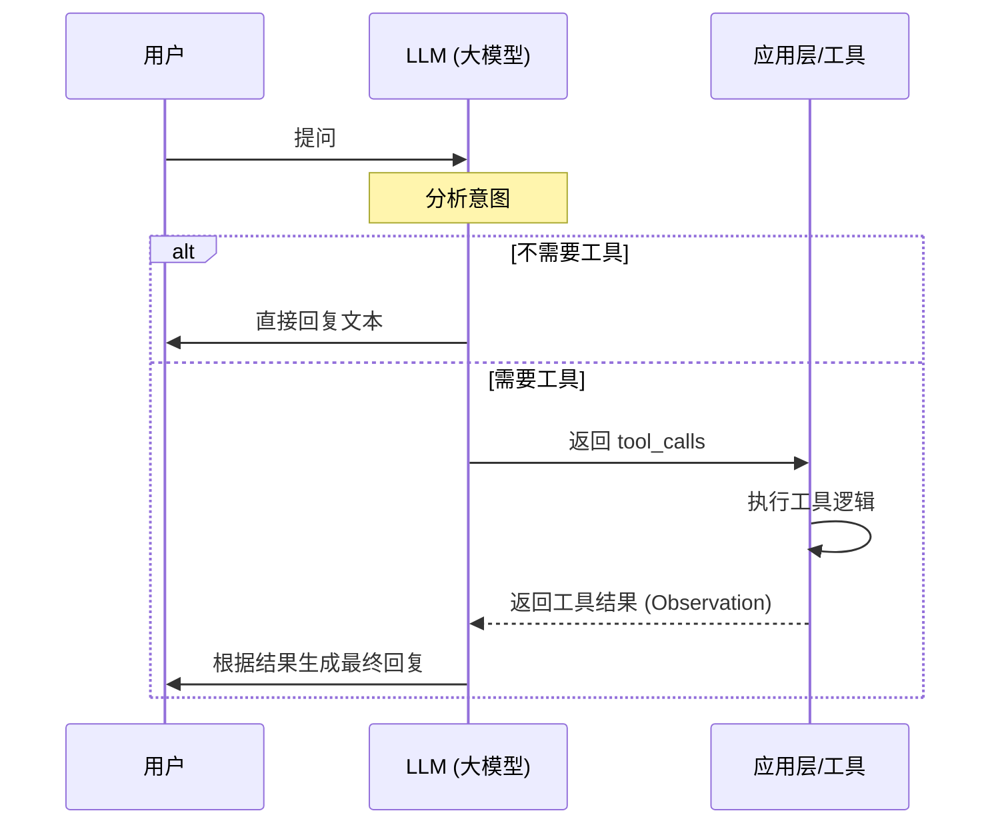

## 消息系统

### 消息类型

LangChain 定义了多种消息类型：

```TypeScript
import {
  HumanMessage,    // 用户消息
  AIMessage,       // AI 响应
  SystemMessage,   // 系统提示
  ToolMessage,     // 工具返回
} from "@langchain/core/messages";
```

### 消息构建示例

```TypeScript
// langchainjs-demo/src/4.messages/1.role.ts
import { ChatOllama } from "@langchain/ollama";
import {
  HumanMessage,
  SystemMessage
} from "@langchain/core/messages";

const llm = new ChatOllama({ model: "qwen3:0.6b" });

const messages = [
  new SystemMessage("你是一个专业的翻译助手，只负责中英互译"),
  new HumanMessage("Hello World"),
];

const response = await llm.invoke(messages);
// 输出: "你好，世界"
```

## Agent 智能代理（ReAct）

如果说 LLM (大语言模型) 是一个只有“大脑”的百科全书，那么 **Agent** 就是给这个大脑装上了“手脚” (Tools) 和“耳朵” (Sensors)。它不仅能**思考** (Reasoning)，还能**规划** (Planning) 并**执行任务** (Acting)。

- **LLM 的局限性**：模型训练完成后，知识就截止了（幻觉问题）；且模型无法直接操作现实世界（如查天气、写数据库）。
- 为了解决上述问题，引入了 **"ReAct" (Reason + Act)** 范式，即让模型在执行行动之前先进行思考推理，从而具备解决复杂问题的能力。

### 创建基础 Agent

```TypeScript
// langchainjs-demo/src/5.agent/1.basic.ts
import { ChatOllama } from "@langchain/ollama";
import { createAgent } from "langchain";

const agent = createAgent({
  model: new ChatOllama({
    model: "qwen3:0.6b",
  }),
});

const invoke = async () => {
  const res = await agent.invoke({
    messages: [
      {
        role: "user",
        content: "你好",
      },
    ],
  });
  console.log(res);
};

invoke();
```

### 带工具的 Agent

```TypeScript
// langchainjs-demo/src/5.agent/2.zod.ts
import { ChatOllama } from "@langchain/ollama";
import { createAgent, tool } from "langchain";
import * as z from "zod";

// 定义天气工具
const getWeather = tool(
  (input) => `${input.city}的天气是晴天`,
  {
    name: "get_weather",
    description: "获取给定城市的天气",
    schema: z.object({
      city: z.string().describe("要获取天气的城市"),
    }),
  }
);

// 创建带工具的 Agent
const agent = createAgent({
  model: new ChatOllama({
    model: "qwen3:0.6b",
    temperature: 0,
  }),
  tools: [getWeather],
});

const invoke = async () => {
  const res = await agent.invoke({
    messages: [{ role: "user", content: "北京天气怎么样？" }],
  });
  console.log(res);
};

invoke();
```

**Agent 工作原理：**

**图示：带工具的 Agent**

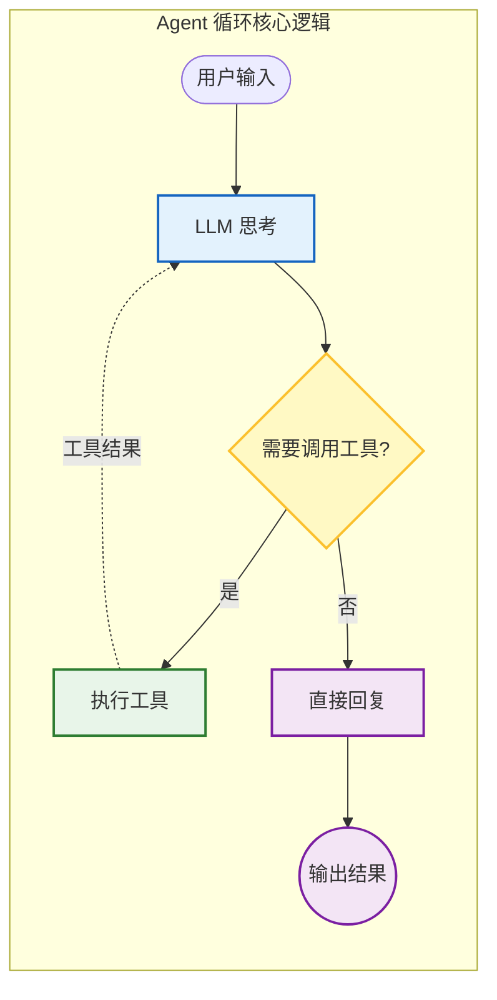

### 结构化响应 Agent

- **背景**：LLM 本质上输出的是字符串（自然语言），但程序代码（如 API 调用）需要的是严格的结构化数据（JSON）。
- **作用**：**Zod** 是一个 TypeScript 的模式声明和验证库。在 Agent 开发中，它是**连接 AI 模糊语言与程序精确代码的桥梁**。它告诉 AI：“你必须给我返回符合这个格式的数据，字段类型不能错，必填项不能少。”

```TypeScript
// langchainjs-demo/src/5.agent/3.format-res.ts
import { ChatOllama } from "@langchain/ollama";
import { createAgent } from "langchain";
import * as z from "zod";

const PersonInfo = z.object({
  name: z.string().describe("人物姓名"),
  age: z.number().describe("人物年龄"),
});

const agent = createAgent({
  model: new ChatOllama({
    model: "qwen3:0.6b",
    temperature: 0,
  }),
  responseFormat: PersonInfo,  // 指定响应格式
});

const invoke = async () => {
  const res = await agent.invoke({
    messages: [{ role: "user", content: "我是合一，我今年18岁" }],
  });
  console.log("messages ====>", res.messages);
  console.log("structuredResponse ====>", res.structuredResponse);
  // structuredResponse: { name: "合一", age: 18 }
};

invoke();
```

### 流式响应

```TypeScript
// langchainjs-demo/src/5.agent/4.streaming-res.ts
import { ChatOllama } from "@langchain/ollama";
import { createAgent, ToolCall } from "langchain";
import * as z from "zod";

const PersonInfo = z.object({
  name: z.string().describe("人物姓名"),
  age: z.number().describe("人物年龄"),
});

const agent = createAgent({
  model: new ChatOllama({
    model: "qwen3:0.6b",
    temperature: 0,
  }),
  responseFormat: PersonInfo,
});

const invoke = async () => {
  const res = await agent.stream(
    {
      messages: [{ role: "user", content: "我是合一，我今年18岁" }],
    },
    {
      streamMode: "values",  // 流式模式
    }
  );

  for await (const chunk of res) {
    const latestMessage = chunk.messages.at(-1);
    if (latestMessage?.content) {
      console.log(`Agent: ${latestMessage.content}`);
    } else if (latestMessage?.tool_calls) {
      const toolCallNames = latestMessage.tool_calls.map(
        (tc: ToolCall) => tc.name
      );
      console.log(`Calling tools: ${toolCallNames.join(", ")}`);
    }
  }
};

invoke();
```

**流式模式对比：**

| 模式 | 说明 | 适用场景 |
|-|-|-|
| `values` | 每次返回完整状态 | 状态追踪 |
| `updates` | 仅返回增量变化 | 增量更新 |
| `messages` | 流式消息块 | 实时显示 |

# LangGraph.js 基础与进阶

## LangGraph.js 概述

### 核心理念

LangGraph.js 是基于状态图（State Graph）的 AI 应用编排框架：

- **状态驱动**：以状态为核心的执行模型
- **图结构**：节点和边组成的有向图
- **可编排性**：支持条件分支、循环、并行执行
- **可观测性**：完整的执行追踪和调试支持

### 核心概念

| 概念 | 说明 | 类比 |
|-|-|-|
| **State** | 工作流状态对象 | 全局变量 |
| **Annotation** | 状态类型定义 | TypeScript 接口 |
| **Node** | 执行节点（函数） | 函数 |
| **Edge** | 节点间的连接 | 函数调用 |
| **Conditional Edge** | 条件分支 | if-else |
| **Checkpoint** | 状态快照 | 断点 |

## 入门示例：entrypoint 模式

### 工具定义

```TypeScript
// langgraphjs-demo/src/1.hello-world/1.tools.ts
import { tool } from '@langchain/core/tools'
import * as z from 'zod'

// 定义数学工具
const add = tool(({ a, b }) => a + b, {
    name: 'add',
    description: '两数之和',
    schema: z.object({
        a: z.number().describe('第一个数'),
        b: z.number().describe('第二个数')
    })
})

const multiply = tool(({ a, b }) => a * b, {
    name: 'multiply',
    description: '两数之积',
    schema: z.object({
        a: z.number().describe('第一个数'),
        b: z.number().describe('第二个数')
    })
})

const divide = tool(({ a, b }) => a / b, {
    name: 'divide',
    description: '两数相除',
    schema: z.object({
        a: z.number().describe('第一个数'),
        b: z.number().describe('第二个数')
    })
})

// 工具映射表（用于快速查找）
export const toolsByName = {
    [add.name]: add,
    [multiply.name]: multiply,
    [divide.name]: divide
}

export const tools = Object.values(toolsByName)
```

### 模型绑定

```TypeScript
// langgraphjs-demo/src/1.hello-world/2.model.ts
import { ChatOllama } from '@langchain/ollama'
import { tools } from './1.tools'

const model = new ChatOllama({
    model: 'qwen3:0.6b'
})

// 将工具绑定到模型
export const modelWithTools = model.bindTools(tools)
```

### 使用 entrypoint 构建 Agent

```TypeScript
// langgraphjs-demo/src/1.hello-world/agent.ts
import { addMessages, entrypoint } from '@langchain/langgraph'
import { type BaseMessage } from '@langchain/core/messages'
import { callLlm } from './3.model-node'
import { callTool } from './4.tool-node'

export const agent = entrypoint(
  { name: 'agent' },
  async (messages: BaseMessage[]) => {
    // 调用 LLM
    let modelResponse = await callLlm(messages)

    // Agent 循环：持续执行直到没有工具调用
    while (true) {
        if (!modelResponse.tool_calls?.length) {
            break
        }

        // 并行执行所有工具调用
        const toolResults = await Promise.all(
          modelResponse.tool_calls.map(toolCall => callTool(toolCall))
        )
        const validToolResults = toolResults.filter(result => result !== undefined)

        // 更新消息历史
        messages = addMessages(messages, [modelResponse, ...validToolResults])

        // 继续调用 LLM
        modelResponse = await callLlm(messages)
    }

    return messages
  }
)
```

**entrypoint 模式特点：**

1. **简洁**：适合简单的循环执行场景
2. **灵活**：可以在函数内自由编排逻辑
3. **局限**：不支持复杂的图结构和条件分支

**执行流程图：**

**图示：使用 entrypoint 构建 Agent**

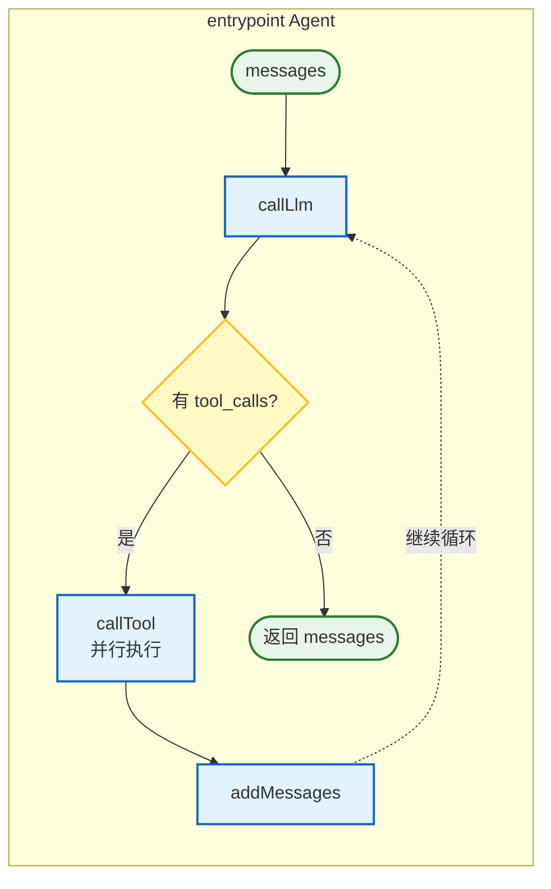

## StateGraph 状态图

### 基础状态图示例

```TypeScript
// langgraphjs-demo/src/2.graph-flow/agent.ts
import { StateGraph, Annotation } from '@langchain/langgraph'
import { ChatOllama } from '@langchain/ollama'

const llm = new ChatOllama({
    model: 'qwen3:0.6b'
})

// 1. 定义状态类型
const StateAnnotation = Annotation.Root({
    topic: Annotation<string>,
    joke: Annotation<string>,
    improvedJoke: Annotation<string>,
    finalJoke: Annotation<string>
})

// 2. 定义节点函数

// 生成初始笑话
async function generateJoke(state: typeof StateAnnotation.State) {
    const msg = await llm.invoke(`写一个关于 ${state.topic} 的笑话`)
    return { joke: msg.content }
}

// 检查笑话质量（条件函数）
function checkPunchline(state: typeof StateAnnotation.State) {
    if (state.joke?.includes('?') || state.joke?.includes('!')) {
        return 'Pass'
    }
    return 'Fail'
}

// 改进笑话
async function improveJoke(state: typeof StateAnnotation.State) {
    const msg = await llm.invoke(`使这个笑话更有趣: ${state.joke}`)
    return { improvedJoke: msg.content }
}

// 完善笑话
async function polishJoke(state: typeof StateAnnotation.State) {
    const msg = await llm.invoke(`添加一个历史典故到这个笑话: ${state.improvedJoke}`)
    return { finalJoke: msg.content }
}

// 3. 构建工作流图
export const agent = new StateGraph(StateAnnotation)
    .addNode('generateJoke', generateJoke)
    .addNode('improveJoke', improveJoke)
    .addNode('polishJoke', polishJoke)
    .addEdge('__start__', 'generateJoke')
    .addConditionalEdges('generateJoke', checkPunchline, {
        Pass: 'improveJoke',
        Fail: '__end__'
    })
    .addEdge('improveJoke', 'polishJoke')
    .addEdge('polishJoke', '__end__')
    .compile()
```

**图结构可视化：**

**图示：基础状态图示例**

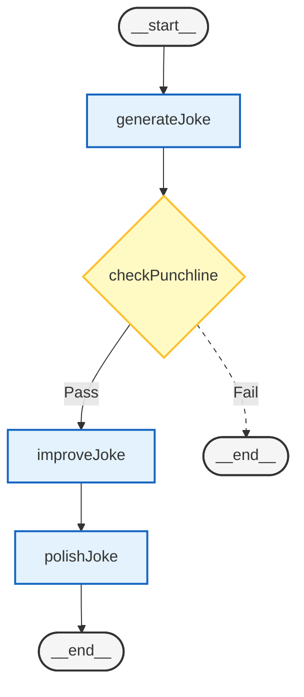

### Annotation 状态定义

```TypeScript
import { Annotation } from '@langchain/langgraph'

// 基础类型
const SimpleState = Annotation.Root({
    count: Annotation<number>,
    message: Annotation<string>,
    items: Annotation<string[]>,
})

// 带 reducer 的复杂状态（累加器模式）
const ReducerState = Annotation.Root({
    messages: Annotation<BaseMessage[]>({
        reducer: (current, update) => [...current, ...update],
        default: () => [],
    }),
})
```

**Annotation 特性：**

| 特性 | 说明 | 示例 |
|-|-|-|
| 类型定义 | 泛型指定类型 | `Annotation<string>` |
| 默认值 | 初始状态值 | `default: () => []` |
| Reducer | 状态合并策略 | `reducer: (a, b) => [...a, ...b]` |

## 并行执行

### Fan-out/Fan-in 模式

```TypeScript
// langgraphjs-demo/src/3.parallel-flow/agent.ts
import { StateGraph, Annotation } from '@langchain/langgraph'
import { ChatOllama } from '@langchain/ollama'

const llm = new ChatOllama({
    model: 'qwen3:0.6b'
})

// 状态定义
const StateAnnotation = Annotation.Root({
    topic: Annotation<string>,
    joke: Annotation<string>,
    story: Annotation<string>,
    poem: Annotation<string>,
    combinedOutput: Annotation<string>
})

// 并行节点
async function callLlm1(state: typeof StateAnnotation.State) {
    const msg = await llm.invoke(`写一个关于 ${state.topic} 主题的笑话`)
    return { joke: msg.content }
}

async function callLlm2(state: typeof StateAnnotation.State) {
    const msg = await llm.invoke(`写一个关于 ${state.topic} 主题的故事`)
    return { story: msg.content }
}

async function callLlm3(state: typeof StateAnnotation.State) {
    const msg = await llm.invoke(`写一个关于 ${state.topic} 主题的诗歌`)
    return { poem: msg.content }
}

// 聚合节点
async function aggregator(state: typeof StateAnnotation.State) {
    const combined =
        `这里有一个关于 ${state.topic} 的故事、笑话和诗歌!\n\n` +
        `故事:\n${state.story}\n\n` +
        `笑话:\n${state.joke}\n\n` +
        `诗歌:\n${state.poem}`
    return { combinedOutput: combined }
}

// 构建并行工作流
export const agent = new StateGraph(StateAnnotation)
    .addNode('callLlm1', callLlm1)
    .addNode('callLlm2', callLlm2)
    .addNode('callLlm3', callLlm3)
    .addNode('aggregator', aggregator)
    // Fan-out：从起点并行分发到三个节点
    .addEdge('__start__', 'callLlm1')
    .addEdge('__start__', 'callLlm2')
    .addEdge('__start__', 'callLlm3')
    // Fan-in：三个节点聚合到一个节点
    .addEdge('callLlm1', 'aggregator')
    .addEdge('callLlm2', 'aggregator')
    .addEdge('callLlm3', 'aggregator')
    .addEdge('aggregator', '__end__')
    .compile()
```

**并行执行流程：**

**图示：Fan-out/Fan-in 模式**

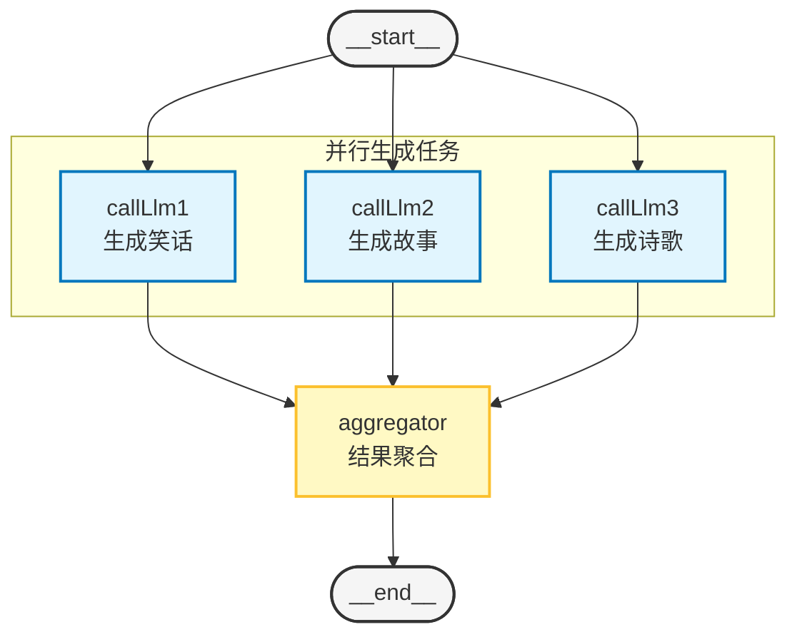
**并行执行优势：**

- 三个 LLM 调用并行执行，总耗时约等于最慢的一个
- 适合独立任务的批量处理
- 最终结果由聚合节点统一处理

## 循环与 Agent

### 简单 Agent 循环

```TypeScript
// langgraphjs-demo/src/4.simple-agent/agent.ts
import { Annotation, InMemoryStore, StateGraph } from '@langchain/langgraph'
import { ChatOllama } from '@langchain/ollama'
import { tool } from 'langchain'
import * as z from 'zod'

const store = new InMemoryStore()

const model = new ChatOllama({
    model: 'qwen3:0.6b'
})

// 定义工具
const fetchTool = tool(
    async ({ url }) => {
        const res = await fetch(url)
        return await res.text()
    },
    {
        name: 'fetch',
        description: '从URL获取内容',
        schema: z.object({
            url: z.string().describe('要获取内容的URL')
        })
    }
)

// 状态定义
const StateAnnotation = Annotation.Root({
    url: Annotation<string>,
    times: Annotation<number>
})

// 工具节点
const fetchToolNode = async (state: typeof StateAnnotation.State) => {
    await fetchTool.invoke({ url: state.url })
    console.log('🚀 ~ fetchToolNode executed')
    return { times: state.times - 1 }
}

// 模型节点
async function modelNode(state: typeof StateAnnotation.State) {
    await model.invoke(state.url)
    console.log('🚀 ~ modelNode executed')
    return { times: state.times }
}

// 条件判断
const shouldContinue = (state: typeof StateAnnotation.State) => {
    console.log('🚀 ~ remaining times:', state.times)
    if (state.times > 0) {
        return 'fetchTool'
    }
    return '__end__'
}

// 构建带循环的 Agent
export const agent = new StateGraph(StateAnnotation)
    .addNode('modelNode', modelNode)
    .addNode('fetchTool', fetchToolNode)
    .addEdge('__start__', 'modelNode')
    .addConditionalEdges('modelNode', shouldContinue, ['fetchTool', '__end__'])
    .addEdge('fetchTool', 'modelNode')  // 循环边
    .compile({ store })
```

**循环执行流程：**

**图示：简单 Agent 循环**

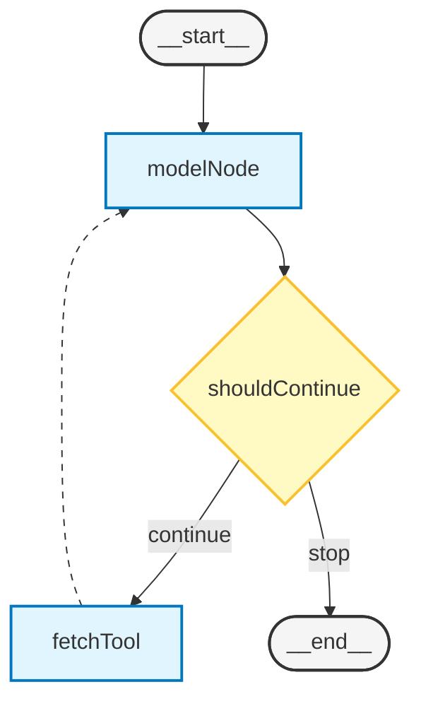

## 子图嵌套

### Sub-Graph 模式

```TypeScript
// langgraphjs-demo/src/5.sub-graph-agent/agent.ts
import { Annotation, InMemoryStore, StateGraph } from '@langchain/langgraph'
import { ChatOllama } from '@langchain/ollama'
import { tool } from 'langchain'
import * as z from 'zod'

const store = new InMemoryStore()

const model = new ChatOllama({ model: 'qwen3:0.6b' })

const fetchTool = tool(
    async ({ url }) => {
        const res = await fetch(url)
        return await res.text()
    },
    {
        name: 'fetch',
        description: '从URL获取内容',
        schema: z.object({
            url: z.string().describe('要获取内容的URL')
        })
    }
)

const StateAnnotation = Annotation.Root({
    url: Annotation<string>,
    times: Annotation<number>
})

const fetchToolNode = async (state: typeof StateAnnotation.State) => {
    await fetchTool.invoke({ url: state.url })
    return { times: state.times - 1 }
}

async function modelNode(state: typeof StateAnnotation.State) {
    await model.invoke(state.url)
    return { times: state.times }
}

const shouldContinue = (state: typeof StateAnnotation.State) => {
    if (state.times > 0) {
        return 'fetchTool'
    }
    return '__end__'
}

// 1. 定义子图
export const subAgent = new StateGraph(StateAnnotation)
    .addNode('modelNode', modelNode)
    .addNode('fetchTool', fetchToolNode)
    .addEdge('__start__', 'modelNode')
    .addConditionalEdges('modelNode', shouldContinue, ['fetchTool', '__end__'])
    .addEdge('fetchTool', 'modelNode')
    .compile({ store })

// 2. 主图节点
const mainModelNode = async (state: typeof StateAnnotation.State) => {
    await model.invoke(state.url)
    console.log('🚀 ~ mainModelNode executed')
    return { times: state.times }
}

// 3. 主图定义（嵌套子图）
export const agent = new StateGraph(StateAnnotation)
    .addNode('modelNode', mainModelNode)
    .addNode('subAgent', async state => {
        // 调用子图
        const subgraphOutput = await subAgent.invoke({
            url: state.url,
            times: state.times
        })
        return { times: subgraphOutput.times }
    })
    .addEdge('__start__', 'modelNode')
    .addEdge('modelNode', 'subAgent')
    .addEdge('subAgent', '__end__')
    .compile({ store })
```

**子图嵌套架构：**

**图示：Sub-Graph 模式**

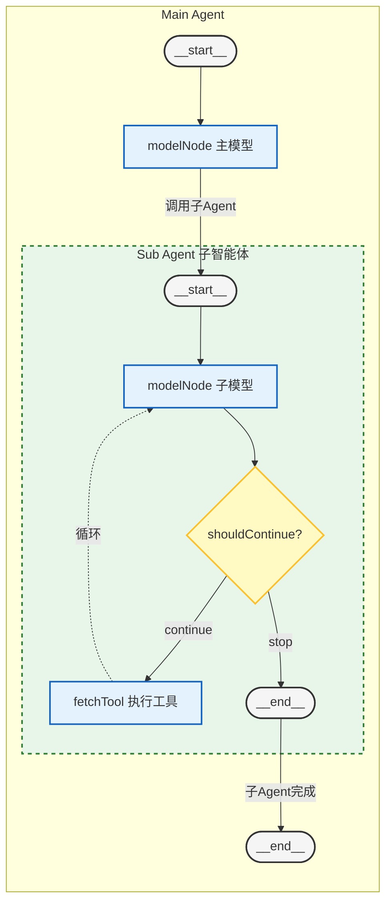

## 中断与检查点

### Interrupt 与 MemorySaver

```TypeScript
// langgraphjs-demo/src/6.interrupt/agent.ts
import {
    Annotation,
    InMemoryStore,
    interrupt,
    MemorySaver,
    StateGraph
} from '@langchain/langgraph'
import { ChatOllama } from '@langchain/ollama'
import { tool } from 'langchain'
import * as z from 'zod'

const store = new InMemoryStore()

const model = new ChatOllama({ model: 'qwen3:0.6b' })

const fetchTool = tool(
    async ({ url }) => {
        const res = await fetch(url)
        return await res.text()
    },
    {
        name: 'fetch',
        description: '从URL获取内容',
        schema: z.object({
            url: z.string().describe('要获取内容的URL')
        })
    }
)

const StateAnnotation = Annotation.Root({
    url: Annotation<string>,
    times: Annotation<number>
})

const fetchToolNode = async (state: typeof StateAnnotation.State) => {
    await fetchTool.invoke({ url: state.url })
    return { times: state.times - 1 }
}

async function modelNode(state: typeof StateAnnotation.State) {
    await model.invoke(state.url)
    return { times: state.times }
}

// 中断节点
const interruptNode = (state: typeof StateAnnotation.State) => {
    // 触发中断，等待用户确认
    const approved = interrupt('你想要暂停，稍后处理吗？')
    return { approved }
}

// 检查点存储
const checkpointer = new MemorySaver()

// 构建带中断的工作流
export const agent = new StateGraph(StateAnnotation)
    .addNode('modelNode', modelNode)
    .addNode('fetchTool', fetchToolNode)
    .addNode('interruptNode', interruptNode)
    .addEdge('__start__', 'modelNode')
    .addEdge('modelNode', 'interruptNode')
    .addEdge('interruptNode', 'fetchTool')
    .addEdge('fetchTool', '__end__')
    .compile({
        store,
        checkpointer  // 启用检查点
    })
```

**中断机制工作流程：**

**图示：Interrupt 与 MemorySaver**

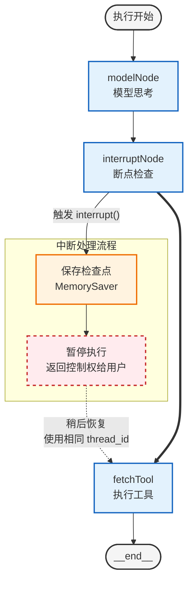
**使用场景：**

1. **人工审批**：敏感操作前等待人工确认
2. **长时间任务**：分段执行，中途可暂停
3. **调试**：在关键节点暂停查看状态

# RAG 核心与实践

## RAG 概述

### 什么是 RAG

RAG（Retrieval-Augmented Generation，检索增强生成）是一种将知识检索与文本生成相结合的技术，用来告诉 AI 你的一些专属专业内容，辅助生成内容的准确性：

**图示：什么是 RAG**

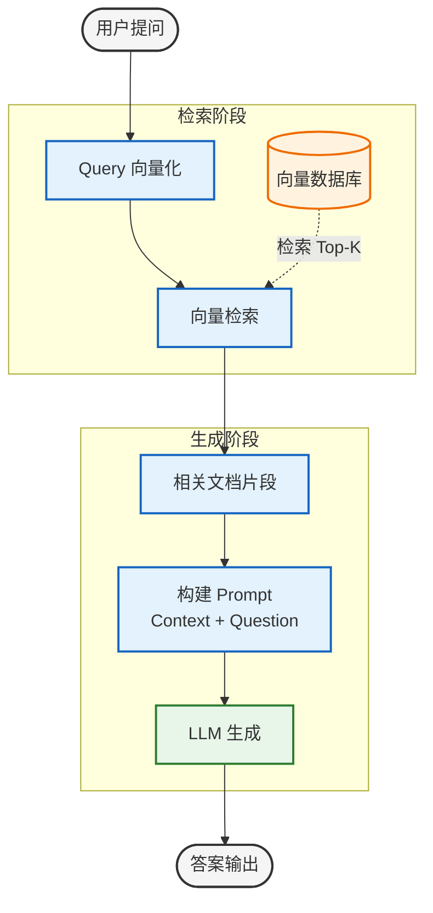

### RAG 的优势

| 优势 | 说明 |
|-|-|
| **知识更新** | 无需重新训练模型，更新向量库即可 |
| **减少幻觉** | 基于真实文档生成，降低虚假信息 |
| **可溯源** | 可以追踪答案的来源文档 |
| **领域适应** | 轻松适配特定领域知识 |

## 文档加载

### CSV 文档加载

```TypeScript
// langchainjs-demo/src/7.rag/1.csv-loader.ts
import { CSVLoader } from "@langchain/community/document_loaders/fs/csv";
import path from "node:path";

const loader = new CSVLoader(
  path.resolve(import.meta.dirname, "../../rga-document/student.csv")
);

const loadDocument = async () => {
  const data = await loader.load();
  console.log(data);
  return data;
};

loadDocument();
```

**Document 结构：**

```TypeScript
interface Document {
  pageContent: string;    // 文档内容
  metadata: {             // 元数据
    source: string;       // 来源路径
    line: number;         // 行号（CSV）
    // ...其他自定义字段
  };
}
```

### 常用加载器

| 加载器 | 用途 | 包 |
|-|-|-|
| `CSVLoader` | CSV 文件 | @langchain/community |
| `PDFLoader` | PDF 文档 | @langchain/community |
| `TextLoader` | 纯文本 | @langchain/core |
| `JSONLoader` | JSON 数据 | @langchain/community |
| `WebLoader` | 网页内容 | @langchain/community |

## 文本分割

### RecursiveCharacterTextSplitter

```TypeScript
// langchainjs-demo/src/7.rag/2.text-spliter.ts
import { RecursiveCharacterTextSplitter } from "@langchain/textsplitters";
import { Document } from "@langchain/core/documents";

const splitter = new RecursiveCharacterTextSplitter({
  chunkSize: 8,       // 每个分块的最大字符数
  chunkOverlap: 0,    // 分块之间的重叠字符数
});

const longTextDocument = new Document({
  pageContent: "heyi 成绩是多少？heyi 成绩是多少？heyi 成绩是多少？",
  metadata: {
    source: "student.csv",
  },
});

const splitText = async (document: Document) => {
  const texts = await splitter.createDocuments([document.pageContent]);
  console.log("🚀 ~ texts:", texts);
  return texts;
};

splitText(longTextDocument);
```

**分割策略对比：**

| 分割器 | 特点 | 适用场景 |
|-|-|-|
| `CharacterTextSplitter` | 按固定长度切分 | 简单文本 |
| `RecursiveCharacterTextSplitter` | 按分隔符递归切分 | 通用文档 |
| `TokenTextSplitter` | 按 Token 数切分 | 精确控制上下文 |
| `MarkdownTextSplitter` | 保留 Markdown 结构 | 技术文档 |

**分块参数调优：**

```Plaintext
┌─────────────────────────────────────────────────────────────┐
│                      分块参数影响                            │
├─────────────────────────────────────────────────────────────┤
│                                                              │
│  chunkSize 过小：                                           │
│    - 语义碎片化，检索精度下降                                 │
│    - 增加向量数量，存储和检索成本上升                          │
│                                                              │
│  chunkSize 过大：                                           │
│    - 可能超出模型上下文限制                                   │
│    - 引入不相关信息，降低生成质量                              │
│                                                              │
│  推荐值：                                                    │
│    - 通用场景：500-1000 字符                                 │
│    - 精确检索：200-500 字符                                  │
│    - chunkOverlap：约 chunkSize 的 10-20%                   │
│                                                              │
└─────────────────────────────────────────────────────────────┘
```

## 向量化（Embedding）

### 文本向量化

```TypeScript
// langchainjs-demo/src/7.rag/1.embedding.ts
import { CSVLoader } from "@langchain/community/document_loaders/fs/csv";
import path from "node:path";
import { OllamaEmbeddings } from "@langchain/ollama";

const loader = new CSVLoader(
  path.resolve(import.meta.dirname, "../../rga-document/student.csv")
);

const loadDocument = async () => {
  const data = await loader.load();
  return data;
};

// 创建 Embedding 模型
const embeddings = new OllamaEmbeddings({
  model: "nomic-embed-text:v1.5",
});

// 批量向量化文档
const embeddingDocument = async () => {
  const data = await loadDocument();
  const vectors = await embeddings.embedDocuments(
    data.map((doc) => doc.pageContent)
  );
  console.log("Vectors count:", vectors.length);
  console.log("Vector dimension:", vectors[0].length);
};

// 单条查询向量化
const invoke = async () => {
  const vector = await embeddings.embedQuery("合一");
  console.log("Query vector:", vector);
};

embeddingDocument();
invoke();
```

**Embedding 核心概念：**

```Plaintext
文本 ──► Embedding 模型 ──► 向量 (float[768] 或 float[1024])

"你好世界" ──► [0.123, -0.456, 0.789, ...]

向量特性：
- 语义相似的文本，向量距离近
- 常见维度：768（BERT）、1024（大模型）、1536（OpenAI）
```

## 向量存储

### MemoryVectorStore（内存存储）

```TypeScript
// langchainjs-demo/src/7.rag/1.memory-store.ts
import { CSVLoader } from "@langchain/community/document_loaders/fs/csv";
import { MemoryVectorStore } from "@langchain/classic/vectorstores/memory";
import path from "node:path";
import { OllamaEmbeddings } from "@langchain/ollama";

const loader = new CSVLoader(
  path.resolve(import.meta.dirname, "../../rga-document/student.csv")
);

const loadDocument = async () => {
  const data = await loader.load();
  return data;
};

const embeddings = new OllamaEmbeddings({
  model: "nomic-embed-text:v1.5",
});

// 创建内存向量存储
const embeddingStore = async () => {
  const data = await loadDocument();
  const vectorStore = await MemoryVectorStore.fromDocuments(data, embeddings);
  return vectorStore;
};

const invoke = async () => {
  const vectorStore = await embeddingStore();

  // 方式一：文本相似度搜索
  const results = await vectorStore.similaritySearchWithScore(
    "heyi 成绩是多少？",
    1  // 返回最相似的 1 条
  );
  console.log(results);

  // 方式二：向量相似度搜索
  const vector = await embeddings.embedQuery("猫");
  const vectorResults = await vectorStore.similaritySearchVectorWithScore(
    vector,
    1
  );
  console.log(vectorResults);
};

invoke();
```

### PGVector（PostgreSQL 向量存储）

```TypeScript
// langchainjs-demo/src/7.rag/1.pgvector.ts
import { CSVLoader } from "@langchain/community/document_loaders/fs/csv";
import {
  type DistanceStrategy,
  PGVectorStore,
} from "@langchain/community/vectorstores/pgvector";
import path from "node:path";
import { OllamaEmbeddings } from "@langchain/ollama";
import { PoolConfig } from "pg";

const loader = new CSVLoader(
  path.resolve(import.meta.dirname, "../../rga-document/student.csv")
);

const loadDocument = async () => {
  const data = await loader.load();
  return data;
};

const embeddings = new OllamaEmbeddings({
  model: "nomic-embed-text:v1.5",
});

const embeddingStore = async () => {
  // PostgreSQL 配置
  const config = {
    postgresConnectionOptions: {
      type: "postgres",
      host: "127.0.0.1",
      port: 5432,
      user: "postgres",
      password: "heyi",
      database: "embedding",
    } as PoolConfig,
    tableName: "heyilangchainjs",
    columns: {
      idColumnName: "id",
      vectorColumnName: "vector",
      contentColumnName: "content",
      metadataColumnName: "metadata",
    },
    // 距离策略：cosine（默认）、innerProduct、euclidean
    distanceStrategy: "cosine" as DistanceStrategy,
  };

  // 初始化向量存储
  const vectorStore = await PGVectorStore.initialize(embeddings, config);

  // 添加文档
  const data = await loadDocument();
  await vectorStore.addDocuments(data);

  return vectorStore;
};

const invoke = async () => {
  const vectorStore = await embeddingStore();
  const res = await vectorStore.similaritySearchWithScore("heyi");
  console.log(res);
};

invoke();
```

**向量存储对比：**

| 存储类型 | 特点 | 适用场景 |
|-|-|-|
| **MemoryVectorStore** | 纯内存，速度快 | 开发测试、小数据 |
| **PGVectorStore** | PostgreSQL 扩展 | 生产环境、持久化 |
| **QdrantVectorStore** | 专业向量数据库 | 大规模、高性能 |
| **ChromaDB** | 轻量级向量库 | 中小规模 |
| **Milvus** | 重量级向量数据库 | 超大规模 |

## 完整 RAG 流程

```TypeScript
// 完整 RAG 示例
import { ChatOllama } from "@langchain/ollama";
import { OllamaEmbeddings } from "@langchain/ollama";
import { MemoryVectorStore } from "@langchain/classic/vectorstores/memory";
import { CSVLoader } from "@langchain/community/document_loaders/fs/csv";
import { RecursiveCharacterTextSplitter } from "@langchain/textsplitters";

// 1. 加载文档
const loader = new CSVLoader("./data/knowledge.csv");
const docs = await loader.load();

// 2. 分割文档
const splitter = new RecursiveCharacterTextSplitter({
  chunkSize: 500,
  chunkOverlap: 50,
});
const splitDocs = await splitter.splitDocuments(docs);

// 3. 向量化并存储
const embeddings = new OllamaEmbeddings({ model: "nomic-embed-text:v1.5" });
const vectorStore = await MemoryVectorStore.fromDocuments(splitDocs, embeddings);

// 4. 检索相关文档
const query = "学生成绩是多少？";
const relevantDocs = await vectorStore.similaritySearch(query, 3);

// 5. 构建 Prompt
const context = relevantDocs.map(doc => doc.pageContent).join("\n\n");
const prompt = `基于以下上下文回答问题：

上下文：
${context}

问题：${query}

答案：`;

// 6. LLM 生成
const llm = new ChatOllama({ model: "qwen3:0.6b" });
const response = await llm.invoke(prompt);
console.log(response.content);
```

# MCP 客户端与服务端开发

## MCP 协议概述

### 什么是 MCP

MCP（Model Context Protocol，模型上下文协议）是 Anthropic 提出的标准协议，用于连接 AI 应用与外部工具/数据源：

**图示：什么是 MCP**

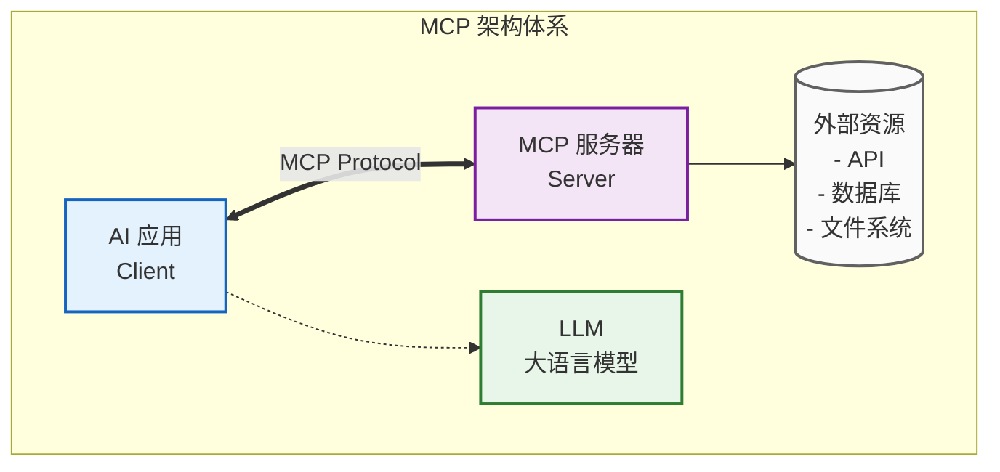

### MCP 核心能力

| 能力 | 说明 | 示例 |
|-|-|-|
| **Tools** | 可调用的函数 | 天气查询、计算器 |
| **Resources** | 可读取的资源 | 文件、数据库 |
| **Prompts** | 预定义提示模板 | 翻译模板、分析模板 |
| **Sampling** | 让服务端调用 LLM | 复杂推理任务 |

## MCP 服务端开发

### Stdio 传输（本地进程）

```TypeScript
// langchainjs-demo/src/8.mcp/1.mcp-server-math.ts
import { Server } from "@modelcontextprotocol/sdk/server/index.js";
import { StdioServerTransport } from "@modelcontextprotocol/sdk/server/stdio.js";
import {
  CallToolRequestSchema,
  ListToolsRequestSchema,
} from "@modelcontextprotocol/sdk/types.js";

// 创建 MCP 服务器
const server = new Server(
  {
    name: "math-server",
    version: "0.1.0",
  },
  {
    capabilities: {
      tools: {},  // 声明支持工具能力
    },
  }
);

// 注册工具列表处理器
server.setRequestHandler(ListToolsRequestSchema, async () => {
  return {
    tools: [
      {
        name: "add",
        description: "求两个数的和",
        inputSchema: {
          type: "object",
          properties: {
            a: { type: "number", description: "第一个数" },
            b: { type: "number", description: "第二个数" },
          },
          required: ["a", "b"],
        },
      },
      {
        name: "multiply",
        description: "求两个数的积",
        inputSchema: {
          type: "object",
          properties: {
            a: { type: "number", description: "第一个数" },
            b: { type: "number", description: "第二个数" },
          },
          required: ["a", "b"],
        },
      },
    ],
  };
});

// 注册工具调用处理器
server.setRequestHandler(CallToolRequestSchema, async (request) => {
  switch (request.params.name) {
    case "add": {
      const { a, b } = request.params.arguments as { a: number; b: number };
      return {
        content: [{ type: "text", text: String(a + b) }],
      };
    }
    case "multiply": {
      const { a, b } = request.params.arguments as { a: number; b: number };
      return {
        content: [{ type: "text", text: String(a * b) }],
      };
    }
    default:
      throw new Error(`Unknown tool: ${request.params.name}`);
  }
});

// 启动服务器（Stdio 传输）
async function main() {
  const transport = new StdioServerTransport();
  await server.connect(transport);
  console.log("Math MCP server running");
}

main();
```

### HTTP 传输（远程服务）

```TypeScript
// langchainjs-demo/src/8.mcp/1.mcp-server-weather.ts
import express from "express";
import { McpServer } from "@modelcontextprotocol/sdk/server/mcp.js";
import { randomUUID } from "node:crypto";
import { StreamableHTTPServerTransport } from "@modelcontextprotocol/sdk/server/streamableHttp.js";
import { SSEServerTransport } from "@modelcontextprotocol/sdk/server/sse.js";
import { isInitializeRequest } from "@modelcontextprotocol/sdk/types.js";
import * as z from "zod";

export async function main() {
  // 创建高级 MCP 服务器
  const server = new McpServer({
    name: "weather-server",
    version: "1.0.0",
  });

  // 使用高级 API 注册工具
  server.registerTool(
    "fetch-weather",
    {
      description: "获取城市的天气",
      inputSchema: { city: z.string() },
      outputSchema: { temperature: z.number(), conditions: z.string() },
    },
    async ({ city }) => {
      const temperature = 25;
      const conditions = "晴朗";
      return {
        content: [
          {
            type: "text",
            text: `${city}的天气还不错，温度${temperature}度，${conditions}`,
          },
        ],
        structuredContent: { temperature, conditions },
      };
    }
  );

  const app = express();
  app.use(express.json());

  // 存储会话传输
  const transports = {
    streamable: {} as Record<string, StreamableHTTPServerTransport>,
    sse: {} as Record<string, SSEServerTransport>,
  };

  // Streamable HTTP 端点
  app.post("/mcp", async (req, res) => {
    const sessionId = req.headers["mcp-session-id"] as string | undefined;
    let transport: StreamableHTTPServerTransport;

    if (sessionId && transports.streamable[sessionId]) {
      transport = transports.streamable[sessionId];
    } else if (!sessionId && isInitializeRequest(req.body)) {
      transport = new StreamableHTTPServerTransport({
        sessionIdGenerator: () => randomUUID(),
        onsessioninitialized: (sessionId) => {
          transports.streamable[sessionId] = transport;
        },
      });

      transport.onclose = () => {
        if (transport.sessionId) {
          delete transports.streamable[transport.sessionId];
        }
      };

      await server.connect(transport);
    } else {
      res.status(400).json({
        jsonrpc: "2.0",
        error: { code: -32000, message: "Bad Request" },
        id: null,
      });
      return;
    }

    await transport.handleRequest(req, res, req.body);
  });

  // 其他端点...
  app.listen(8000);
}

main().then(() => {
  console.log("Weather MCP server running on port 8000");
});
```

**传输方式对比：**

| 传输方式 | 特点 | 适用场景 |
|-|-|-|
| **Stdio** | 本地进程通信 | 桌面应用、CLI |
| **HTTP/SSE** | 网络传输 | Web 服务、远程调用 |
| **WebSocket** | 双向实时通信 | 实时应用 |

## MCP 客户端开发

### MultiServerMCPClient

```TypeScript
// langchainjs-demo/src/8.mcp/2.mcp-client.ts
import { MultiServerMCPClient } from "@langchain/mcp-adapters";
import { ChatOllama } from "@langchain/ollama";
import { createAgent } from "langchain";
import path from "node:path";

// 创建多服务器客户端
const client = new MultiServerMCPClient({
  mcpServers: {
    // Stdio 传输的本地服务
    math: {
      transport: "stdio",
      command: "node",
      args: [
        path.resolve(
          import.meta.dirname,
          "../../dist/8.mcp",
          "./1.mcp-server-math.mjs"
        ),
      ],
    },
    // HTTP 传输的远程服务
    weather: {
      url: "http://localhost:8000/mcp",
    },
  },
});

const llm = new ChatOllama({
  model: "qwen3:0.6b",
  temperature: 0,
});

const invoke = async () => {
  // 初始化所有 MCP 连接
  await client.initializeConnections();

  // 获取所有可用工具
  const tools = await client.getTools();

  // 创建带 MCP 工具的 Agent
  const agent = createAgent({
    model: llm,
    tools,
  });

  // 调用数学工具
  const mathResponse = await agent.invoke({
    messages: [{ role: "user", content: "计算(3 + 5) x 12 等于多少" }],
  });
  console.log("🚀 ~ Math Response:", mathResponse);

  // 调用天气工具
  const weatherResponse = await agent.invoke({
    messages: [{ role: "user", content: "我的城市是：北京，请获取天气" }],
  });
  console.log("🚀 ~ Weather Response:", weatherResponse);
};

invoke();
```

**MCP 调用流程：**

**图示：MultiServerMCPClient**

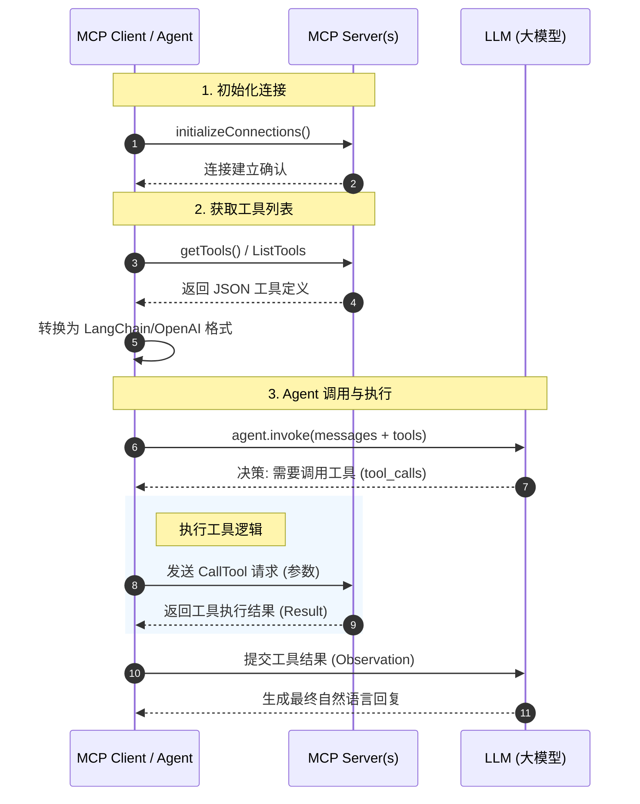

# 自实现引擎与 LangGraph.js 对比分析

## 架构概览对比

### 我们的工作流引擎（ai-engine）

```TypeScript
// packages/ai-engine/src/core/engine.ts
export class WorkflowEngine implements IWorkflowEngine {
    private registry: NodeRegistry          // 节点注册中心
    private config: Required<WorkflowEngineConfig>
    private workflowValidator: DefaultWorkflowValidator

    async execute(
        workflow: WorkflowDefinition,
        inputs: WorkflowInput,
        options?: ExecuteOptions
    ): Promise<WorkflowResult> {
        // 1. 验证工作流
        const validation = this.validate(workflow)

        // 2. 创建执行上下文
        const context = createExecutionContext(executionId, workflow, inputs)

        // 3. 构建执行图（拓扑排序）
        const graphBuilder = new GraphBuilder(workflow)
        let executionOrder = graphBuilder.getExecutionOrder()

        // 4. 按顺序执行节点
        for (const node of executionOrder) {
            const result = await this.executeNode(node, context, logger)

            // 5. 处理条件分支
            if (node.type === 'condition' && result.matchedBranch) {
                graphBuilder.selectBranch(node.id, result.matchedBranch)
                executionOrder = graphBuilder.getExecutionOrder()
            }
        }

        return result
    }
}
```

### LangGraph.js 架构

```TypeScript
// LangGraph StateGraph 示例
const agent = new StateGraph(StateAnnotation)
    .addNode('nodeA', nodeAFunction)
    .addNode('nodeB', nodeBFunction)
    .addEdge('__start__', 'nodeA')
    .addConditionalEdges('nodeA', routerFunction, {
        'optionA': 'nodeB',
        'optionB': '__end__'
    })
    .compile()
```

## 核心设计差异

### 图执行策略

| 特性 | 自实现引擎 | LangGraph.js |
|-|-|-|
| **执行模型** | 静态拓扑排序 | 动态状态驱动 |
| **图构建** | 预定义 JSON 结构 | 链式 API 构建 |
| **排序算法** | Kahn 算法 | 消息传递模型 |
| **分支处理** | 子树排除机制 | 条件边动态路由 |

**自实现引擎的 GraphBuilder：**

```TypeScript
// packages/ai-engine/src/core/graph-builder.ts
export class GraphBuilder {
    private adjacencyList: Map<string, string[]>      // 邻接表
    private reverseAdjacencyList: Map<string, string[]>  // 反向邻接表
    private inDegree: Map<string, number>              // 入度表
    private excludedNodes: Set<string>                 // 排除节点集

    // Kahn 算法实现拓扑排序
    getExecutionOrder(): WorkflowNode[] {
        const result: WorkflowNode[] = []
        const queue: string[] = []
        const inDegreeCopy = new Map(this.inDegree)

        // 找到所有入度为 0 的节点
        for (const [nodeId, degree] of inDegreeCopy) {
            if (degree === 0 && !this.excludedNodes.has(nodeId)) {
                queue.push(nodeId)
            }
        }

        while (queue.length > 0) {
            const nodeId = queue.shift()!
            const node = this.workflow.nodes.find(n => n.id === nodeId)
            if (node) result.push(node)

            // 更新后继节点入度
            const successors = this.adjacencyList.get(nodeId) || []
            for (const successor of successors) {
                const degree = inDegreeCopy.get(successor)! - 1
                inDegreeCopy.set(successor, degree)
                if (degree === 0) queue.push(successor)
            }
        }

        return result
    }

    // 条件分支选择：排除未选中分支的子树
    selectBranch(conditionNodeId: string, selectedBranchId: string): void {
        const edges = this.workflow.edges.filter(e => e.source === conditionNodeId)
        for (const edge of edges) {
            if (edge.sourceHandle !== selectedBranchId) {
                this.excludeSubtree(edge.target)
            }
        }
    }

    // 递归排除子树
    private excludeSubtree(nodeId: string): void {
        if (this.excludedNodes.has(nodeId)) return
        this.excludedNodes.add(nodeId)

        const successors = this.adjacencyList.get(nodeId) || []
        for (const successor of successors) {
            // 检查是否有其他未排除的入边
            const predecessors = this.reverseAdjacencyList.get(successor) || []
            const hasActiveInEdge = predecessors.some(p => !this.excludedNodes.has(p))
            if (!hasActiveInEdge) {
                this.excludeSubtree(successor)
            }
        }
    }

    // 检测环
    hasCycle(): boolean {
        const visited = new Set<string>()
        const inStack = new Set<string>()

        const dfs = (nodeId: string): boolean => {
            if (inStack.has(nodeId)) return true
            if (visited.has(nodeId)) return false

            visited.add(nodeId)
            inStack.add(nodeId)

            for (const successor of this.adjacencyList.get(nodeId) || []) {
                if (dfs(successor)) return true
            }

            inStack.delete(nodeId)
            return false
        }

        for (const node of this.workflow.nodes) {
            if (!visited.has(node.id) && dfs(node.id)) return true
        }
        return false
    }
}
```

**LangGraph 的状态驱动模型：**

```TypeScript
// LangGraph 内部执行模型
class StateGraph {
    // 状态是核心，节点函数接收状态、返回状态更新
    async invoke(input: State): Promise<State> {
        let state = input
        let currentNode = '__start__'

        while (currentNode !== '__end__') {
            // 执行当前节点
            if (currentNode !== '__start__') {
                const nodeFunc = this.nodes.get(currentNode)
                const update = await nodeFunc(state)
                state = this.mergeState(state, update)
            }

            // 获取下一个节点
            currentNode = this.getNextNode(currentNode, state)
        }

        return state
    }
}
```

### 状态管理对比

**自实现引擎：执行上下文**

```TypeScript
// 执行上下文设计
interface ExecutionContext {
    executionId: string
    workflow: WorkflowDefinition
    inputs: WorkflowInput
    variables: VariableStore        // 变量存储
    getUpstreamNodes(nodeId: string): string[]
    markNodeCompleted(nodeId: string): void
}

// 变量通过节点输出传递
const nodeInputs: Record<string, unknown> = {}
const upstreamNodes = context.getUpstreamNodes(node.id)
for (const upstreamId of upstreamNodes) {
    const outputs = context.variables.getNodeOutputs(upstreamId)
    Object.assign(nodeInputs, outputs)
}
```

**LangGraph：Annotation 状态**

```TypeScript
// 状态类型定义
const StateAnnotation = Annotation.Root({
    messages: Annotation<BaseMessage[]>({
        reducer: (a, b) => [...a, ...b],
        default: () => [],
    }),
    count: Annotation<number>,
})

// 节点直接返回状态更新
async function nodeA(state: typeof StateAnnotation.State) {
    return { count: state.count + 1 }  // 部分更新
}
```

## 功能特性对比

| 特性 | 自实现引擎 | LangGraph.js |
|-|-|-|
| **并行执行** | 需手动实现 | 原生支持（多边同时出发） |
| **循环支持** | 不直接支持（DAG 限制） | 原生支持（`addEdge` 回环） |
| **检查点** | 需自行实现 | 内置 `MemorySaver` |
| **中断恢复** | 不支持 | 内置 `interrupt()` |
| **子图嵌套** | 不直接支持 | 原生支持 |
| **流式输出** | 自定义回调 | 内置 `stream()` |
| **可视化** | 需自行实现 | 内置 `getGraph()` |

## 执行流程对比

### 自实现引擎执行流程

**图示：自实现引擎执行流程**

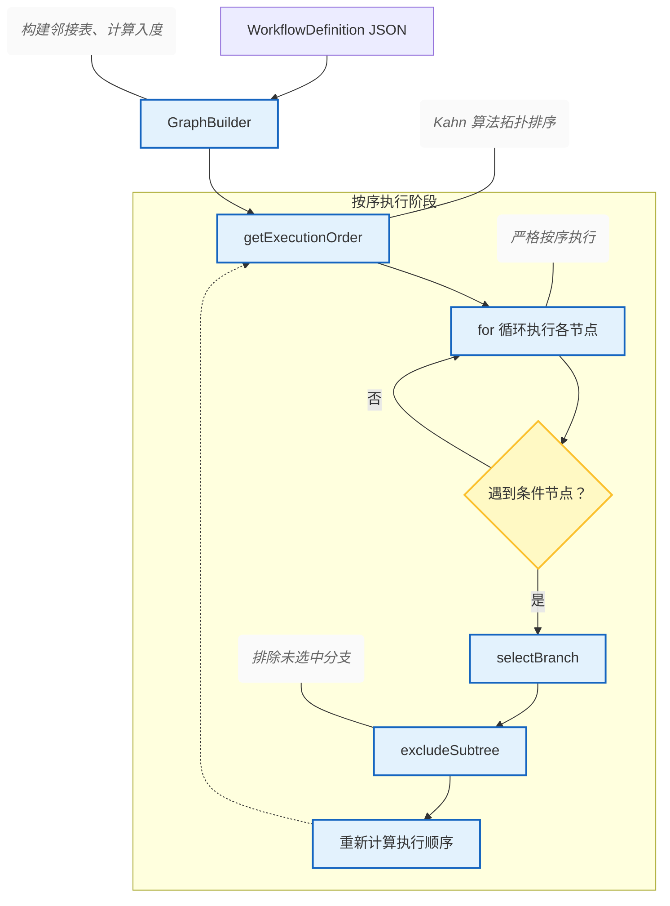

### Langgraphjs 引擎执行流程

**图示：Langgraphjs 引擎执行流程**

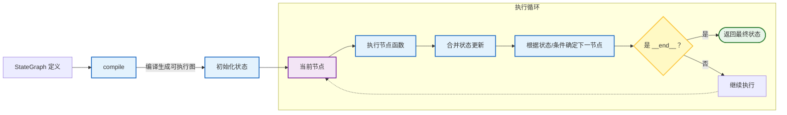

## 优劣势分析

### 自实现引擎优势

| 优势 | 说明 |
|-|-|
| **轻量级** | 无外部依赖，包体积小 |
| **可定制** | 完全掌控执行逻辑 |
| **可视化友好** | JSON 结构便于编辑器渲染 |
| **类型安全** | 严格的 TypeScript 类型 |
| **易于调试** | 清晰的执行日志和回调 |

### 自实现引擎局限

| 局限 | 说明 | 解决方案 |
|-|-|-|
| **无原生循环** | DAG 限制 | 引入迭代节点类型 |
| **无检查点** | 不支持断点续传 | 实现状态持久化 |
| **无并行执行** | 串行执行 | 识别独立分支并行 |

### LangGraph.js 优势

| 优势 | 说明 |
|-|-|
| **功能完整** | 内置循环、中断、检查点 |
| **生态丰富** | 与 LangChain 无缝集成 |
| **状态管理** | Annotation 类型安全 |
| **流式支持** | 原生流式输出 |

### LangGraph.js 局限

| 局限 | 说明 |
|-|-|
| **学习曲线** | 概念较多 |
| **黑盒执行** | 内部逻辑不透明 |
| **定制受限** | 受框架约束 |
| **依赖较重** | 包体积较大 |

---

> 来源：https://u19tul1sz9g.feishu.cn/docx/LackdM0PUofJBKx2qqec4nnEnze
> 更新时间：2026-05-30 06:05:34 UTC
> 飞书 Token：`LackdM0PUofJBKx2qqec4nnEnze`
