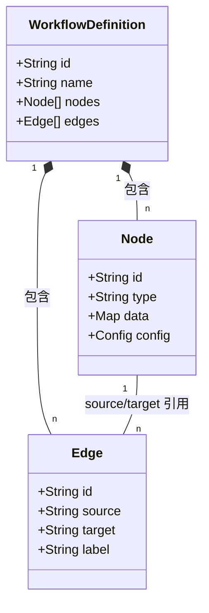
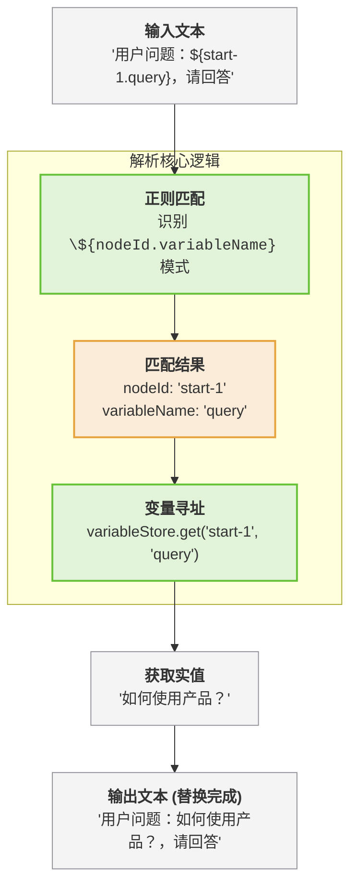
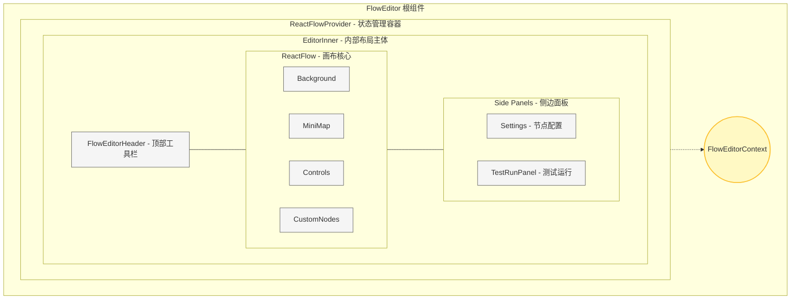
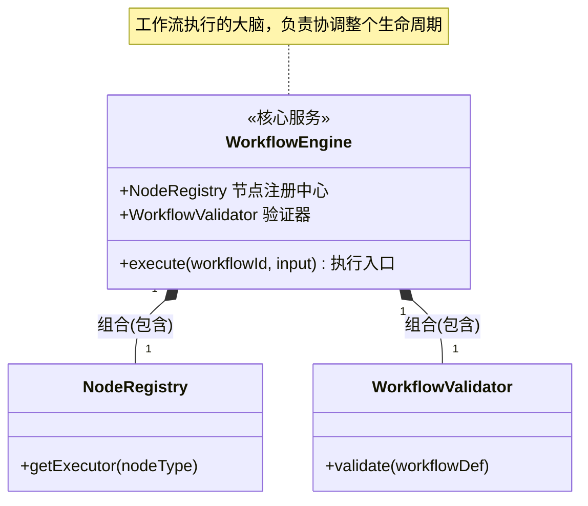
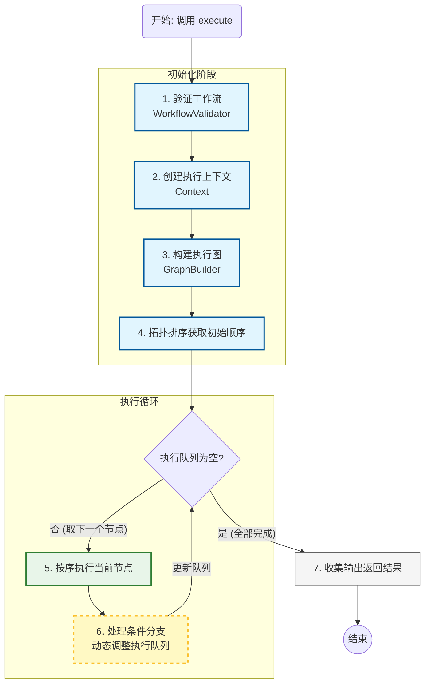
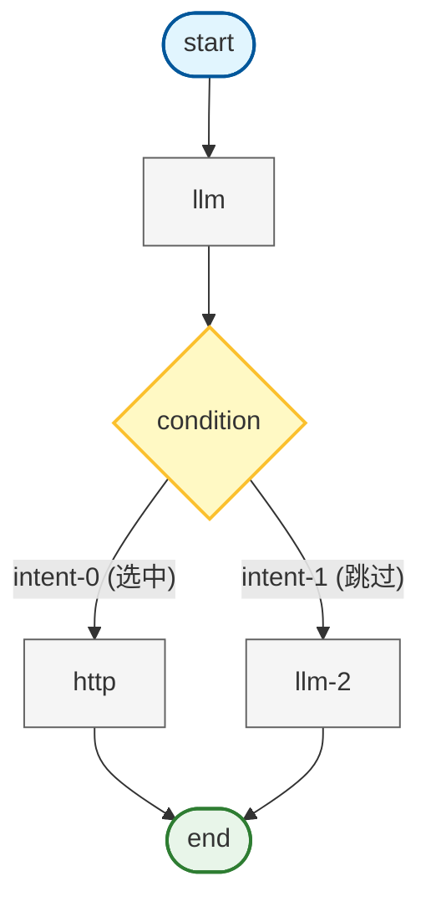
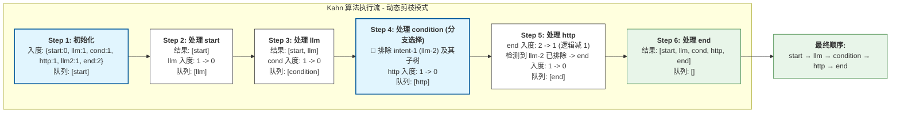
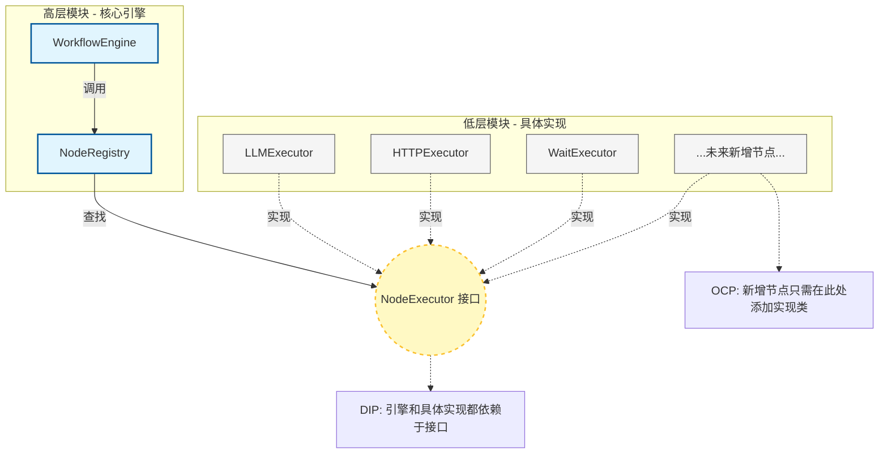
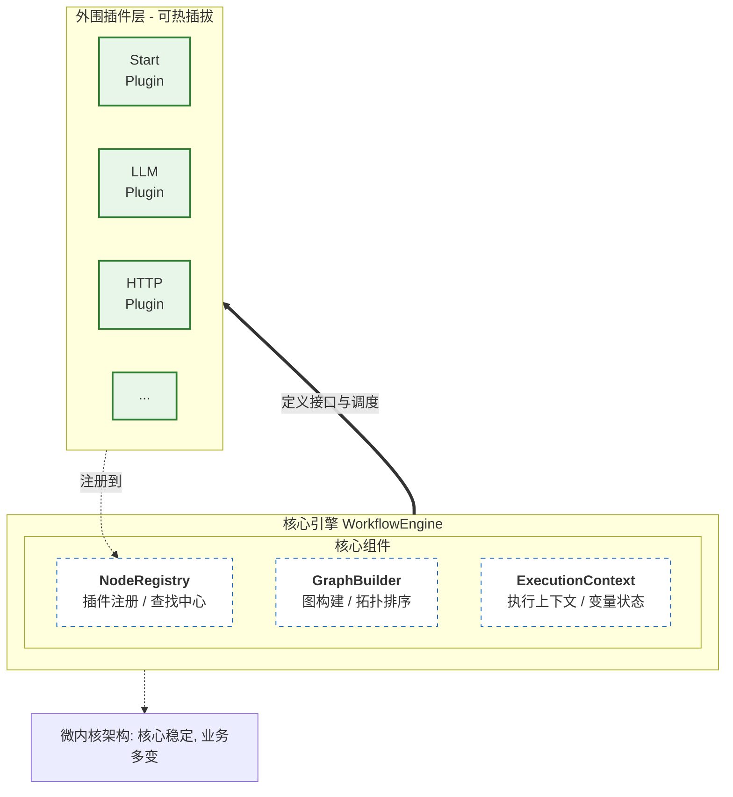

# 3.AI 工作流引擎编辑器与执行器架构设计与实践

[20250720 随堂笔记与源码资料](https://u19tul1sz9g.feishu.cn/docx/BS5CdFOl4on9HExt7t7c9Mn6nVe)

# 课程目标

## 初中级

1. **AI 应用引擎数据协议设计**

   - 理解工作流数据结构的设计原则
   - 掌握 WorkflowDefinition、WorkflowNode、WorkflowEdge 核心类型
   - 理解变量引用协议 `${nodeId.variableName}` 的设计
2. **工作流引擎编辑器开发**

   - 掌握基于 React Flow 的可视化编辑器核心架构
   - 理解节点组件与配置面板的实现
   - 能够实现基本的节点拖拽、连线功能
3. **工作流引擎执行器基础**

   - 理解 DAG（有向无环图）在工作流中的应用
   - 掌握 Kahn 算法实现拓扑排序
   - 理解节点执行顺序的确定机制

## 高级

1. **编辑器高级功能**

   - 深入理解基于 Tiptap 的变量编辑器实现
   - 掌握自动保存与防抖机制
   - 能够实现复杂的节点配置面板
2. **执行器核心机制**

   - 深入理解 WorkflowEngine 核心引擎架构
   - 掌握 ExecutionContext 执行上下文管理
   - 理解条件分支的子树排除策略
   - 能够实现环检测与异常处理
3. **插件化与微内核架构**

   - 理解 NodeRegistry 注册中心的设计思想
   - 掌握 BaseNodeExecutor 基类与模板方法模式
   - 深入理解开放封闭原则在节点系统中的应用
   - 能够开发自定义节点并集成到引擎中
4. **工程化最佳实践**

   - 理解类型驱动开发（Type-Driven Development）
   - 掌握接口隔离与依赖倒置原则
   - 能够设计可扩展的工作流引擎架构

# 课程大纲

**文档目录**

- 初中级
- 高级
- 核心技术文档
  - 算法与数据结构
  - 设计模式
- 协议设计原则
  - 设计目标
  - 核心设计理念
- 核心类型定义
  - 节点类型枚举
  - 工作流节点定义
  - 工作流边定义
  - 工作流定义
- 节点配置类型
  - 基础类型定义
  - START 节点配置
  - LLM 节点配置
  - HTTP 节点配置
  - CONDITION 节点配置
  - END 节点配置
  - KNOWLEDGE 节点配置
- 执行结果类型
  - 节点执行结果
  - 工作流执行结果
- 变量引用协议
  - 变量表达式格式
  - 变量解析器
- 编辑器技术选型
  - 核心依赖
  - React Flow 简介
- 编辑器架构设计
  - 组件层次
  - 状态管理
  - 编辑器上下文
- 节点组件实现
  - 节点类型注册
  - LLM 节点组件
  - 条件节点多输出
- 节点配置面板
  - 动态表单渲染
  - Settings 面板容器
- 变量编辑器
  - 设计目标
  - 基于 Tiptap 实现
  - 内容转换函数
- 自动保存机制
  - 防抖保存
- 执行器核心架构
  - 架构概览
  - WorkflowEngine 实现
- 图构建与拓扑排序
  - GraphBuilder 实现
  - 拓扑排序可视化
- 执行上下文
  - 上下文实现
- 插件化架构设计
  - 设计目标
  - 核心接口
- 节点注册中心
  - Registry 实现
  - 默认注册
- 基类执行器
  - BaseNodeExecutor
- 微内核架构概述
  - 架构设计
  - 核心与插件职责
- 开发自定义节点
  - 开发步骤
  - 示例：实现 LLM 节点
- 条件节点实现
- 验证器系统
  - 验证器接口
  - 工作流验证器

# 补充资料

## 核心技术文档

- **React Flow (XYFlow)**：https://reactflow.dev/
- **Tiptap 编辑器**：https://tiptap.dev/
- **Radix UI 组件**：https://www.radix-ui.com/
- **shadcn/ui**：https://ui.shadcn.com/

### 算法与数据结构

- **拓扑排序 - Kahn 算法**：https://en.wikipedia.org/wiki/Topological_sorting
- **DAG 有向无环图**：https://en.wikipedia.org/wiki/Directed_acyclic_graph
- **图论基础**：https://www.geeksforgeeks.org/graph-data-structure-and-algorithms/

### 设计模式

- **注册模式**：https://refactoring.guru/design-patterns/registry
- **模板方法模式**：https://refactoring.guru/design-patterns/template-method
- **微内核架构**：https://www.oreilly.com/library/view/software-architecture-patterns/9781491971437/

**实战学习方法提要**
实战课不同于基础进阶课，实战注重思维的培养，因此在每个实战项目设计之初都充分考虑了需要传达给大家的设计思想、架构、方案选型以及如何在项目中快速落地，所以大家要自顶向下去看实战项目，**先通览设计与方案，后关注代码细节**。
除了弄懂项目架构与基础开发以外，还要着重培养项目相关描述，在面试过程中这点非常重要！
代码均使用 git 管理，每次 commit 都是比较重要的更新，大家学会切换分支查看不同 commit 引入的新代码内容
> 本章涉及多个 AI 开发框架，建议按照以下顺序学习：
1. **理解数据模型**：先通读数据协议设计，理解 WorkflowDefinition 等核心类型
2. **运行编辑器**：实际操作工作流编辑器，理解交互流程
3. **跟踪执行流程**：通过日志跟踪工作流执行的完整流程
4. **动手扩展**：尝试开发一个自定义节点，加深对插件化架构的理解

# 相关面试真题

项目实战相关面试真题，我们单独整理在与本项目实战同级《**企业级类扣子、Dify AI 应用引擎架构设计与实践面试专项突击**》文档

# AI 应用引擎数据协议设计

## 协议设计原则

### 设计目标

工作流数据协议需要满足以下核心需求：

| 需求 | 说明 |
|-|-|
| **可序列化** | 支持 JSON 序列化，便于存储和传输 |
| **类型安全** | TypeScript 类型完备，编译时检查 |
| **可扩展** | 支持新节点类型的扩展 |
| **兼容性** | 与 React Flow 数据格式兼容 |
| **语义清晰** | 结构直观，易于理解和维护 |

### 核心设计理念

**图示：核心设计理念**



## 核心类型定义

### 节点类型枚举

```TypeScript
// packages/ai-engine/src/types/workflow.ts

/**
 * 节点类型枚举
 * 采用字符串字面量类型，便于扩展
 */
export type NodeKind = 'start' | 'llm' | 'http' | 'condition' | 'end' | 'knowledge'
```

**节点类型说明：**

| 类型 | 用途 | 输入 | 输出 |
|-|-|-|-|
| `start` | 工作流入口 | 外部输入参数 | 定义的变量 |
| `llm` | 大模型调用 | 上游变量 | 模型输出文本 |
| `http` | HTTP 请求 | 上游变量 | 响应数据 |
| `condition` | 条件分支 | 上游变量 | 匹配的意图 |
| `end` | 工作流出口 | 上游变量 | 最终输出 |
| `knowledge` | 知识库检索 | 查询文本 | 检索结果 |

当然还会有更多节点，这些节点的体系设计我们必须足够清晰、耦合度将至最低，就需要使用到后面我们介绍到的插件化体系/微内核架构思想来实现。

### 工作流节点定义

```TypeScript
// packages/ai-engine/src/types/workflow.ts

/**
 * 工作流节点定义
 */
export interface WorkflowNode {
    id: string              // 节点唯一标识
    type: NodeKind          // 节点类型
    data: {
        label?: string                    // 节点显示名称
        config?: Record<string, unknown>  // 节点配置（不同类型不同）
    }
}
```

**设计要点：**

1. **id 设计**：采用 `type-uuid` 格式，如 `llm-a1b2c3d4`
2. **type 约束**：使用枚举类型，保证类型安全
3. **data 分层**：`label` 是展示层，`config` 是业务层

### 工作流边定义

```TypeScript
/**
 * 工作流边定义
 */
export interface WorkflowEdge {
    id: string              // 边的唯一标识
    source: string          // 源节点 ID
    sourceHandle?: string   // 源节点的输出句柄（用于条件分支）
    target: string          // 目标节点 ID
}
```

**sourceHandle 设计：**

对于条件分支节点，一个节点可能有多个输出：

```Plaintext
        ┌─────────────┐
        │  condition  │
        │   node      │
        └──────┬──────┘
               │
    ┌──────────┼──────────┐
    │          │          │
  intent-0   intent-1   intent-2
    │          │          │
    ▼          ▼          ▼
  NodeA      NodeB      NodeC
```

`sourceHandle` 标识具体是从哪个意图分支出来的。

### 工作流定义

```TypeScript
/**
 * 工作流定义
 */
export interface WorkflowDefinition {
    id: string
    name: string
    nodes: WorkflowNode[]
    edges: WorkflowEdge[]
}
```

## 节点配置类型

### 基础类型定义

```TypeScript
// packages/ai-engine/src/types/node.ts

/**
 * 参数类型
 */
export type ParamType = 'string' | 'number' | 'boolean' | 'array' | 'object'

/**
 * 输入参数
 */
export interface InputParam {
    name: string              // 参数名
    type: ParamType           // 参数类型
    defaultValue?: string     // 默认值
    required?: boolean        // 是否必填
    description?: string      // 参数描述
}
```

### START 节点配置

```TypeScript
/**
 * START 节点配置
 * 定义工作流的输入参数
 */
export interface StartNodeConfig {
    inputs: InputParam[]
}

// 示例配置
const startConfig: StartNodeConfig = {
    inputs: [
        { name: 'query', type: 'string', required: true, description: '用户查询' },
        { name: 'userId', type: 'string', required: false, description: '用户ID' }
    ]
}
```

### LLM 节点配置

```TypeScript
/**
 * LLM 节点配置
 * 定义大模型调用参数
 */
export interface LLMNodeConfig {
    model: string              // 模型名称
    systemPrompt?: string      // 系统提示词
    userPrompt: string         // 用户提示词（支持变量）
    assistantPrompt?: string   // 助手预填内容
    temperature?: number       // 温度参数
    maxTokens?: number         // 最大 token 数
}

// 示例配置
const llmConfig: LLMNodeConfig = {
    model: 'qwen3:8b',
    systemPrompt: '你是一个专业的客服助手',
    userPrompt: '用户问题：${start-1.query}',  // 引用开始节点的变量
    temperature: 0.7,
    maxTokens: 2000
}
```

### HTTP 节点配置

```TypeScript
/**
 * HTTP 方法类型
 */
export type HttpMethod = 'GET' | 'POST' | 'PUT' | 'DELETE' | 'PATCH'

/**
 * Body 类型
 */
export type BodyType = 'none' | 'form-data' | 'x-www-form-urlencoded' | 'json' | 'raw' | 'binary'

/**
 * 键值对
 */
export interface KeyValuePair {
    key: string
    value: string  // 支持变量引用
}

/**
 * HTTP 节点配置
 */
export interface HttpNodeConfig {
    url: string               // 请求 URL（支持变量）
    method: HttpMethod        // 请求方法
    headers: KeyValuePair[]   // 请求头
    params: KeyValuePair[]    // URL 参数
    bodyType: BodyType        // Body 类型
    body: string              // Body 内容
    formData: KeyValuePair[]  // Form 数据
    timeout?: number          // 超时时间
}
```

### CONDITION 节点配置

```TypeScript
/**
 * 意图定义
 */
export interface Intent {
    name: string          // 意图名称（作为分支标识）
    description?: string  // 意图描述
    condition?: string    // 匹配条件
}

/**
 * CONDITION 节点配置
 * 基于 LLM 进行意图识别
 */
export interface ConditionNodeConfig {
    model: string         // 用于意图识别的模型
    intents: Intent[]     // 意图列表
}

// 示例配置
const conditionConfig: ConditionNodeConfig = {
    model: 'qwen3:8b',
    intents: [
        { name: '咨询问题', description: '用户询问产品信息' },
        { name: '投诉反馈', description: '用户表达不满或投诉' },
        { name: '其他', description: '无法归类的问题' }
    ]
}
```

### END 节点配置

```TypeScript
/**
 * 输出参数
 */
export interface OutputParam {
    name: string       // 输出变量名
    type: ParamType    // 输出类型
    value: string      // 值表达式（支持变量引用）
    description?: string
}

/**
 * END 节点配置
 */
export interface EndNodeConfig {
    outputs: OutputParam[]
}

// 示例配置
const endConfig: EndNodeConfig = {
    outputs: [
        { name: 'result', type: 'string', value: '${llm-1.output}' },
        { name: 'intent', type: 'string', value: '${condition-1.matchedIntent}' }
    ]
}
```

### KNOWLEDGE 节点配置

```TypeScript
/**
 * 知识库检索模式
 */
export type KnowledgeRetrievalMode = 'vector' | 'fulltext' | 'hybrid'

/**
 * 知识库检索输出格式
 */
export type KnowledgeOutputFormat = 'text' | 'json'

/**
 * KNOWLEDGE 节点配置
 */
export interface KnowledgeNodeConfig {
    knowledgeBaseIds: string[]          // 知识库 ID 列表
    query: string                        // 查询内容（支持变量引用）
    retrievalMode: KnowledgeRetrievalMode  // 检索模式
    topK: number                         // 返回结果数量
    threshold?: number                   // 相似度阈值 (0-1)
    outputFormat: KnowledgeOutputFormat  // 输出格式
}
```

## 执行结果类型

### 节点执行结果

```TypeScript
// packages/ai-engine/src/types/logger.ts

/**
 * 节点执行结果
 */
export interface NodeExecutionResult {
    success: boolean                       // 是否成功
    outputs: Record<string, unknown>       // 输出变量
    inputs?: Record<string, unknown>       // 输入变量（用于追踪）
    error?: Error                          // 错误信息
    matchedBranch?: string                 // 匹配的分支（条件节点）
    duration?: number                      // 执行耗时
}
```

### 工作流执行结果

```TypeScript
/**
 * 工作流执行结果
 */
export interface WorkflowResult {
    success: boolean                       // 是否成功
    outputs: Record<string, unknown>       // 最终输出
    error?: Error                          // 错误信息
    executionId: string                    // 执行 ID
    duration: number                       // 总耗时
    logs: ExecutionLogEntry[]              // 执行日志
}
```

## 变量引用协议

### 变量表达式格式

```Plaintext
${nodeId.variableName}

示例：
- ${start-1.query}        引用开始节点的 query 参数
- ${llm-1.output}         引用 LLM 节点的输出
- ${http-1.response}      引用 HTTP 节点的响应
```

### 变量解析器

```TypeScript
// packages/ai-engine/src/core/variable-resolver.ts

/**
 * 变量表达式正则
 */
const VARIABLE_REGEX = /\$\{([^.}]+)\.([^}]+)\}/g

/**
 * 变量解析器
 */
export class VariableResolver {
    /**
     * 解析单个变量表达式
     */
    resolveExpression(
        expression: string,
        variableStore: VariableStore
    ): { value: unknown; found: boolean } {
        const match = expression.match(/^\$\{([^.}]+)\.([^}]+)\}$/)

        if (!match) {
            return { value: expression, found: false }
        }

        const [, nodeId, variableName] = match
        const value = variableStore.get(nodeId, variableName)

        return { value, found: value !== undefined }
    }

    /**
     * 解析文本中的所有变量
     */
    resolveText(text: string, variableStore: VariableStore): string {
        VARIABLE_REGEX.lastIndex = 0

        return text.replace(VARIABLE_REGEX, (match, nodeId, variableName) => {
            const value = variableStore.get(nodeId, variableName)

            if (value === undefined) {
                return match  // 保留原始表达式
            }

            // 对象转 JSON
            if (typeof value === 'object') {
                return JSON.stringify(value)
            }

            return String(value)
        })
    }

    /**
     * 提取文本中的所有变量引用
     */
    extractVariables(text: string): Array<{ nodeId: string; variableName: string }> {
        const variables: Array<{ nodeId: string; variableName: string }> = []
        VARIABLE_REGEX.lastIndex = 0

        let match
        while ((match = VARIABLE_REGEX.exec(text)) !== null) {
            variables.push({
                nodeId: match[1],
                variableName: match[2],
            })
        }

        return variables
    }
}
```

**变量解析流程：**

**图示：变量解析器**



# AI 工作流引擎编辑器架构与开发

## 编辑器技术选型

### 核心依赖

| 库 | 版本 | 用途 |
|-|-|-|
| **@xyflow/react** | ^12.x | 流程图可视化核心库 |
| **@tiptap/react** | ^2.x | 富文本编辑（变量编辑器） |
| **react-hook-form** | ^7.x | 表单状态管理 |
| **zod** | ^3.x | 表单验证 |
| **uuid** | ^9.x | 唯一 ID 生成 |

### React Flow 简介

React Flow 是一个高度可定制的流程图库，核心特性：

- **节点自定义**：完全可控的节点渲染
- **边自定义**：支持自定义连接线样式
- **交互完整**：拖拽、缩放、选择、连接
- **性能优化**：虚拟化渲染，支持大规模图

## 编辑器架构设计

### 组件层次

**图示：组件层次**



### 状态管理

```TypeScript
// apps/workflow/components/flow/editor/index.tsx

function EditorInner({ appId, appName, initialNodes = [], initialEdges = [] }: FlowEditorProps) {
    // 节点和边状态
    const [nodes, setNodes] = useState<Node[]>(
        initialNodes.length > 0 ? initialNodes : defaultNodes
    )
    const [edges, setEdges] = useState<Edge[]>(
        initialEdges.length > 0 ? initialEdges : defaultEdges
    )

    // 选中节点（用于显示配置面板）
    const [selectedNode, setSelectedNode] = useState<Node | null>(null)

    // 保存状态
    const [hasUnsavedChanges, setHasUnsavedChanges] = useState(false)
    const [isSaving, setIsSaving] = useState(false)
    const [lastSavedAt, setLastSavedAt] = useState<Date | null>(null)

    // 面板状态
    const [testRunOpen, setTestRunOpen] = useState(false)
    const [selectedExecutionId, setSelectedExecutionId] = useState<string | null>(null)

    // 使用 ref 存储最新值，避免闭包陷阱
    const nodesRef = useRef(nodes)
    const edgesRef = useRef(edges)

    useEffect(() => { nodesRef.current = nodes }, [nodes])
    useEffect(() => { edgesRef.current = edges }, [edges])

    // ...
}
```

### 编辑器上下文

```TypeScript
// apps/workflow/components/flow/editor/context.tsx

export interface FlowEditorContextValue {
    onAddNode?: (type: NodeKind) => void    // 添加节点回调
    hasStartNode?: boolean                   // 是否已有开始节点
    nodes?: Array<{ id: string; data?: { label?: string } }>  // 节点列表
}

export const FlowEditorContext = createContext<FlowEditorContextValue>({})

export function useFlowEditorContext() {
    return useContext(FlowEditorContext)
}
```

## 节点组件实现

### 节点类型注册

```TypeScript
// apps/workflow/components/flow/nodes/index.ts

import { StartNode } from './start-node'
import { LLMNode } from './llm-node'
import { HTTPNode } from './http-node'
import { ConditionNode } from './condition-node'
import { EndNode } from './end-node'
import { KnowledgeNode } from './knowledge-node'

// 节点类型映射
export const nodeTypes = {
    start: StartNode,
    llm: LLMNode,
    http: HTTPNode,
    condition: ConditionNode,
    end: EndNode,
    knowledge: KnowledgeNode,
}
```

### LLM 节点组件

```TypeScript
// apps/workflow/components/flow/nodes/llm-node.tsx

import type { NodeProps } from '@xyflow/react'
import { Position } from '@xyflow/react'
import { Brain } from 'lucide-react'
import React, { useState } from 'react'

import { Handle } from '../handle'
import { ICON_MAP } from '../icon-map'

export function LLMNode({ data, selected }: NodeProps) {
    const model = (data?.config as any)?.model ?? 'qwen3:0.6b'
    const label = (data?.label as string) || '大模型'

    return (
        <div className={`
            rounded-xl border bg-white shadow-md p-3 w-64
            ${selected ? 'border-purple-700' : 'border-transparent'}
        `}>
            {/* 节点头部 */}
            <div className="flex items-center mb-3">
                <div className="mr-3 bg-purple-700 text-white rounded-lg p-2 shadow-sm">
                    <ICON_MAP.llm size={14} />
                </div>
                <span className="font-bold">{label}</span>
            </div>

            {/* 节点内容 */}
            <div className="space-y-2">
                <div className="flex items-center gap-2">
                    <span className="text-xs text-gray-600 w-12">模型</span>
                    <span className="flex-1 rounded-md py-1 text-sm bg-[#f2f4f7] px-2">
                        {model}
                    </span>
                </div>
            </div>

            {/* 连接点 */}
            <Handle type="target" position={Position.Left} />
            <Handle type="source" position={Position.Right} />
        </div>
    )
}
```

**节点组件设计要点：**

1. **Handle 组件**：定义输入/输出连接点位置
2. **选中状态**：通过 `selected` prop 高亮边框
3. **数据展示**：从 `data.config` 提取配置信息
4. **样式一致性**：使用统一的图标和颜色系统

### 条件节点多输出

```TypeScript
// apps/workflow/components/flow/nodes/condition-node.tsx

export function ConditionNode({ data, selected }: NodeProps) {
    const intents = (data?.config as any)?.intents || []

    return (
        <div className={`...`}>
            {/* ... 节点内容 ... */}

            {/* 输入连接点 */}
            <Handle type="target" position={Position.Left} />

            {/* 多个输出连接点（每个意图一个） */}
            {intents.map((intent: any, index: number) => (
                <Handle
                    key={intent.name}
                    type="source"
                    position={Position.Right}
                    id={`intent-${index}`}  // 唯一标识
                    style={{ top: `${30 + index * 30}px` }}
                />
            ))}
        </div>
    )
}
```

## 节点配置面板

### 动态表单渲染

```TypeScript
// apps/workflow/components/flow/settings/dynamic-form-renderer.tsx

import { useMemo } from 'react'
import { nodeSettingsRegistry } from './registry'
import { FlowContext, NodeKind } from './types'

interface DynamicFormRendererProps {
    node: any
    onSave: (data: any) => void
    flowContext?: FlowContext
}

/**
 * 动态表单渲染器 - 根据节点类型渲染对应的表单组件
 */
export function DynamicFormRenderer({ node, onSave, flowContext }: DynamicFormRendererProps) {
    // 从注册表获取对应的表单组件
    const FormComponent = useMemo(() => {
        return node.type ? nodeSettingsRegistry.getFormComponent(node.type as NodeKind) : null
    }, [node.type])

    if (!FormComponent) {
        return (
            <div className="text-sm text-muted-foreground text-center py-8">
                未找到该节点类型的配置表单
            </div>
        )
    }

    return <FormComponent node={node} onSave={onSave} flowContext={flowContext} />
}
```

**插件化设计：**

通过 `nodeSettingsRegistry` 注册表，实现表单组件的动态加载：

```TypeScript
// 节点设置注册表
class NodeSettingsRegistry {
    private formComponents: Map<NodeKind, React.ComponentType<any>> = new Map()

    register(type: NodeKind, component: React.ComponentType<any>) {
        this.formComponents.set(type, component)
    }

    getFormComponent(type: NodeKind) {
        return this.formComponents.get(type)
    }
}

export const nodeSettingsRegistry = new NodeSettingsRegistry()

// 注册表单组件
nodeSettingsRegistry.register('llm', LLMSettingsForm)
nodeSettingsRegistry.register('http', HTTPSettingsForm)
nodeSettingsRegistry.register('condition', ConditionSettingsForm)
// ...
```

### Settings 面板容器

```TypeScript
// apps/workflow/components/flow/settings/index.tsx

export function Settings({
    node,
    onUpdateNode,
    onUpdateNodeLabel,
    onClose,
    nodes = [],
    edges = []
}: SettingsProps) {
    const NodeIcon = node?.type && getIcon(node.type)

    const handleSave = (data: any) => {
        if (node && onUpdateNode) {
            onUpdateNode(node.id, {
                ...node.data,
                config: data,
            })
        }
    }

    const flowContext: FlowContext = { nodes, edges }

    return (
        <div className="w-[400px] flex flex-col items-end max-h-screen">
            {node && (
                <div className="w-full bg-white py-4 rounded-md shadow-md">
                    {/* 头部：图标 + 可编辑标题 */}
                    <div className="flex items-center justify-between px-4 mb-6">
                        <div className="flex items-center gap-2">
                            <div className={clsx('text-white rounded-lg p-2', getColor(node.type))}>
                                {NodeIcon}
                            </div>
                            <NodeTitleEditor
                                title={nodeTitle}
                                onTitleChange={(newLabel) => onUpdateNodeLabel?.(node.id, newLabel)}
                            />
                        </div>
                        <Button variant="ghost" size="icon-sm" onClick={onClose}>
                            <X />
                        </Button>
                    </div>

                    {/* 表单内容 */}
                    <div className="space-y-4 px-4 overflow-y-auto h-[calc(100vh-190px)]">
                        <DynamicFormRenderer
                            node={node}
                            onSave={handleSave}
                            flowContext={flowContext}
                        />
                    </div>
                </div>
            )}
        </div>
    )
}
```

## 变量编辑器

### 设计目标

变量编辑器需要实现：

1. **富文本编辑**：支持混合输入文本和变量
2. **变量标签化**：变量以可视化标签展示
3. **快捷插入**：输入 `/` 唤起变量选择菜单
4. **类型安全**：输出纯文本格式（包含 `${nodeId.variable}` 表达式）

### 基于 Tiptap 实现

```TypeScript
// apps/workflow/components/flow/settings/variable-editor/index.tsx

import { EditorContent, useEditor } from '@tiptap/react'
import StarterKit from '@tiptap/starter-kit'
import Placeholder from '@tiptap/extension-placeholder'

import { VariableMention } from './variable-mention'  // 自定义扩展
import { SlashCommand } from './slash-command'        // 斜杠命令扩展

export function VariableEditor({
    value,
    onChange,
    availableOutputs,
    placeholder = '输入内容，使用 / 插入变量...',
    ...props
}: VariableEditorProps) {

    // 将纯文本转换为 Tiptap 内容
    const initialContent = useMemo(
        () => textToContent(value, availableOutputs),
        [value, availableOutputs]
    )

    const editor = useEditor({
        extensions: [
            StarterKit.configure({
                heading: false,
                bulletList: false,
                // ... 禁用不需要的功能
            }),
            Placeholder.configure({ placeholder }),
            VariableMention,  // 变量标签扩展
            SlashCommand.configure({ availableOutputs }),  // 斜杠命令
        ],
        content: initialContent,
        onUpdate: ({ editor }) => {
            // 将 Tiptap 内容转换回纯文本
            const json = editor.getJSON()
            const text = contentToText(json)
            onChange(text)
        },
    })

    return (
        <div className="relative">
            <EditorContent editor={editor} />
            <p className="text-xs text-muted-foreground mt-1">
                输入 <kbd>/</kbd> 插入变量
            </p>
        </div>
    )
}
```

### 内容转换函数

```TypeScript
/**
 * 纯文本 → Tiptap 内容
 */
function textToContent(text: string, availableOutputs: AvailableNodeOutput[]): JSONContent {
    const content: JSONContent[] = []
    const variableRegex = /\$\{([^.]+)\.([^}]+)\}/g

    let lastIndex = 0
    let match

    while ((match = variableRegex.exec(text)) !== null) {
        // 添加变量之前的文本
        if (match.index > lastIndex) {
            content.push({ type: 'text', text: text.slice(lastIndex, match.index) })
        }

        const nodeId = match[1]
        const variableName = match[2]

        // 查找节点和变量信息
        const nodeOutput = availableOutputs.find(n => n.nodeId === nodeId)
        const variable = nodeOutput?.outputs.find(v => v.name === variableName)

        // 添加变量标签节点
        content.push({
            type: 'variableMention',
            attrs: {
                nodeId,
                nodeLabel: nodeOutput?.nodeLabel || nodeId,
                variableName,
                variableLabel: variable?.label || variableName,
            },
        })

        lastIndex = match.index + match[0].length
    }

    // 添加剩余文本
    if (lastIndex < text.length) {
        content.push({ type: 'text', text: text.slice(lastIndex) })
    }

    return {
        type: 'doc',
        content: [{ type: 'paragraph', content }],
    }
}

/**
 * Tiptap 内容 → 纯文本
 */
function contentToText(content: JSONContent): string {
    let result = ''

    const processNode = (node: JSONContent) => {
        if (node.type === 'text') {
            result += node.text || ''
        } else if (node.type === 'variableMention') {
            const { nodeId, variableName } = node.attrs || {}
            result += `\${${nodeId}.${variableName}}`  // 恢复变量表达式
        } else if (node.content) {
            node.content.forEach(processNode)
        }
    }

    content.content?.forEach(processNode)
    return result.replace(/\n$/, '')
}
```

## 自动保存机制

### 防抖保存

```TypeScript
// apps/workflow/components/flow/editor/index.tsx

const AUTO_SAVE_DELAY = 2000  // 2秒防抖

function EditorInner({ appId, ... }: FlowEditorProps) {
    const autoSaveTimerRef = useRef<NodeJS.Timeout | null>(null)

    // 保存工作流
    const saveWorkflow = useCallback(async () => {
        if (!hasUnsavedChanges) return

        setIsSaving(true)
        try {
            await workflowService.save(appId, {
                nodes: nodesRef.current,
                edges: edgesRef.current,
            })
            setHasUnsavedChanges(false)
            setLastSavedAt(new Date())
        } catch (error) {
            toast.error('保存失败')
        } finally {
            setIsSaving(false)
        }
    }, [appId, hasUnsavedChanges])

    // 触发自动保存（防抖）
    const triggerAutoSave = useCallback(() => {
        setHasUnsavedChanges(true)

        if (autoSaveTimerRef.current) {
            clearTimeout(autoSaveTimerRef.current)
        }

        autoSaveTimerRef.current = setTimeout(() => {
            saveWorkflow()
        }, AUTO_SAVE_DELAY)
    }, [saveWorkflow])

    // 清理定时器
    useEffect(() => {
        return () => {
            if (autoSaveTimerRef.current) {
                clearTimeout(autoSaveTimerRef.current)
            }
        }
    }, [])

    // 所有修改操作都调用 triggerAutoSave
    const onNodesChange = useCallback((changes: NodeChange[]) => {
        setNodes(nodes => applyNodeChanges(changes, nodes))
        triggerAutoSave()
    }, [triggerAutoSave])

    // ...
}
```

# AI 工作流引擎执行器架构与开发

## 执行器核心架构

### 架构概览

#### 组件结构图 (静态架构)

**图示：组件结构图 (静态架构)**



#### 执行流程图 (动态逻辑)

**图示：执行流程图 (动态逻辑)**



### WorkflowEngine 实现

```TypeScript
// packages/ai-engine/src/core/engine.ts

export class WorkflowEngine implements IWorkflowEngine {
    private registry: NodeRegistry
    private config: Required<WorkflowEngineConfig>
    private workflowValidator: DefaultWorkflowValidator

    constructor(config: WorkflowEngineConfig = {}) {
        this.config = {
            ollamaBaseUrl: config.ollamaBaseUrl ?? 'http://localhost:11434',
            defaultTimeout: config.defaultTimeout ?? 30000,
            verbose: config.verbose ?? false,
        }

        // 创建默认注册中心（包含所有内置节点）
        this.registry = createDefaultRegistry()
        this.workflowValidator = createDefaultWorkflowValidator()
    }

    async execute(
        workflow: WorkflowDefinition,
        inputs: WorkflowInput,
        options?: ExecuteOptions
    ): Promise<WorkflowResult> {
        const executionId = this.generateExecutionId()
        const startTime = Date.now()
        const logger = createExecutionLogger(executionId, this.config.verbose, options?.onLog)

        logger.info('Workflow execution started', {
            workflowId: workflow.id,
            workflowName: workflow.name,
            nodeCount: workflow.nodes.length,
        })

        try {
            // 1. 验证工作流
            const validation = this.validate(workflow)
            if (!validation.valid) {
                throw new Error(`Validation failed: ${validation.errors?.join(', ')}`)
            }

            // 2. 创建执行上下文
            const context = createExecutionContext(executionId, workflow, inputs)

            // 3. 构建执行图
            const graphBuilder = new GraphBuilder(workflow)

            // 检查是否有环
            if (graphBuilder.hasCycle()) {
                throw new Error('Workflow contains a cycle')
            }

            // 4. 获取拓扑排序后的执行顺序
            let executionOrder = graphBuilder.getExecutionOrder()

            logger.debug('Execution order', {
                order: executionOrder.map(n => `${n.id}(${n.type})`),
            })

            // 5. 按顺序执行节点
            let finalOutputs: Record<string, unknown> = {}
            const executedNodes = new Set<string>()

            for (const node of executionOrder) {
                if (executedNodes.has(node.id)) continue

                logger.setCurrentNode(node.id)

                // 回调：节点开始
                const nodeName = (node.data?.label as string) || node.id
                options?.onNodeStart?.(node.id, node.type, nodeName)

                // 执行节点
                const result = await this.executeNode(node, context, logger)

                // 回调：节点结束
                options?.onNodeEnd?.(node.id, result)

                if (!result.success) {
                    throw result.error || new Error(`Node ${node.id} failed`)
                }

                executedNodes.add(node.id)
                context.markNodeCompleted(node.id)

                // 收集结束节点输出
                if (node.type === 'end') {
                    finalOutputs = { ...finalOutputs, ...result.outputs }
                }

                // 6. 处理条件分支
                if (node.type === 'condition' && result.matchedBranch) {
                    graphBuilder.selectBranch(node.id, result.matchedBranch)
                    executionOrder = graphBuilder.getExecutionOrder()

                    logger.debug('Branch selected', {
                        selectedBranch: result.matchedBranch,
                        newOrder: executionOrder.map(n => `${n.id}(${n.type})`),
                    })
                }

                logger.setCurrentNode(null)
            }

            return {
                success: true,
                outputs: finalOutputs,
                executionId,
                duration: Date.now() - startTime,
                logs: logger.getEntries(),
            }
        } catch (error) {
            return {
                success: false,
                outputs: {},
                error: error instanceof Error ? error : new Error(String(error)),
                executionId,
                duration: Date.now() - startTime,
                logs: logger.getEntries(),
            }
        }
    }

    private async executeNode(
        node: WorkflowNode,
        context: ExecutionContext,
        logger: ExecutionLogger
    ): Promise<NodeExecutionResult> {
        // 从注册中心获取执行器
        const executor = this.registry.get(node.type)

        if (!executor) {
            throw new Error(`No executor for type: ${node.type}`)
        }

        // 收集上游节点输出作为输入
        const nodeInputs: Record<string, unknown> = {}
        const upstreamNodes = context.getUpstreamNodes(node.id)

        for (const upstreamId of upstreamNodes) {
            const outputs = context.variables.getNodeOutputs(upstreamId)
            if (outputs) {
                Object.assign(nodeInputs, outputs)
            }
        }

        // 开始节点特殊处理：包含工作流输入
        if (node.type === 'start') {
            Object.assign(nodeInputs, context.inputs)
        }

        // 执行节点
        const result = await executor.execute(
            node.id,
            node.data.config || {},
            context,
            logger
        )

        result.inputs = nodeInputs
        return result
    }

    private generateExecutionId(): string {
        const timestamp = Date.now().toString(36)
        const random = Math.random().toString(36).substring(2, 8)
        return `exec-${timestamp}-${random}`
    }
}
```

## 图构建与拓扑排序

### GraphBuilder 实现

```TypeScript
// packages/ai-engine/src/core/graph-builder.ts

export class GraphBuilder {
    private workflow: WorkflowDefinition
    private adjacencyList: Map<string, string[]>       // 邻接表
    private reverseAdjacencyList: Map<string, string[]> // 反向邻接表
    private inDegree: Map<string, number>               // 入度表
    private excludedNodes: Set<string>                  // 排除的节点

    constructor(workflow: WorkflowDefinition) {
        this.workflow = workflow
        this.adjacencyList = new Map()
        this.reverseAdjacencyList = new Map()
        this.inDegree = new Map()
        this.excludedNodes = new Set()

        this.buildGraph()
    }

    /**
     * 构建图结构
     */
    private buildGraph(): void {
        // 初始化所有节点
        for (const node of this.workflow.nodes) {
            this.adjacencyList.set(node.id, [])
            this.reverseAdjacencyList.set(node.id, [])
            this.inDegree.set(node.id, 0)
        }

        // 添加边
        for (const edge of this.workflow.edges) {
            // 正向邻接表
            const targets = this.adjacencyList.get(edge.source) || []
            targets.push(edge.target)
            this.adjacencyList.set(edge.source, targets)

            // 反向邻接表
            const sources = this.reverseAdjacencyList.get(edge.target) || []
            sources.push(edge.source)
            this.reverseAdjacencyList.set(edge.target, sources)

            // 更新入度
            const degree = this.inDegree.get(edge.target) || 0
            this.inDegree.set(edge.target, degree + 1)
        }
    }

    /**
     * Kahn 算法实现拓扑排序
     */
    getExecutionOrder(): WorkflowNode[] {
        const result: WorkflowNode[] = []
        const visited = new Set<string>()
        const queue: string[] = []

        // 复制入度表（避免修改原始数据）
        const inDegreeCopy = new Map(this.inDegree)

        // 找到所有入度为 0 的节点
        for (const [nodeId, degree] of inDegreeCopy) {
            if (degree === 0 && !this.excludedNodes.has(nodeId)) {
                queue.push(nodeId)
            }
        }

        while (queue.length > 0) {
            const nodeId = queue.shift()!

            if (visited.has(nodeId) || this.excludedNodes.has(nodeId)) {
                continue
            }

            visited.add(nodeId)

            const node = this.workflow.nodes.find(n => n.id === nodeId)
            if (node) {
                result.push(node)
            }

            // 更新后继节点的入度
            const successors = this.adjacencyList.get(nodeId) || []
            for (const successor of successors) {
                if (this.excludedNodes.has(successor)) continue

                const degree = inDegreeCopy.get(successor)! - 1
                inDegreeCopy.set(successor, degree)

                if (degree === 0) {
                    queue.push(successor)
                }
            }
        }

        return result
    }

    /**
     * 选择条件分支（排除未选中的分支）
     */
    selectBranch(conditionNodeId: string, selectedBranchId: string): void {
        const edges = this.workflow.edges.filter(e => e.source === conditionNodeId)

        for (const edge of edges) {
            // 排除非选中分支的所有后续节点
            if (edge.sourceHandle !== selectedBranchId) {
                this.excludeSubtree(edge.target)
            }
        }
    }

    /**
     * 递归排除子树
     */
    private excludeSubtree(nodeId: string): void {
        if (this.excludedNodes.has(nodeId)) return

        this.excludedNodes.add(nodeId)

        const successors = this.adjacencyList.get(nodeId) || []
        for (const successor of successors) {
            // 检查是否还有其他未排除的入边
            const predecessors = this.reverseAdjacencyList.get(successor) || []
            const hasActiveInEdge = predecessors.some(p => !this.excludedNodes.has(p))

            // 只有当没有其他活跃入边时才排除
            if (!hasActiveInEdge) {
                this.excludeSubtree(successor)
            }
        }
    }

    /**
     * DFS 检测环
     */
    hasCycle(): boolean {
        const visited = new Set<string>()
        const inStack = new Set<string>()

        const dfs = (nodeId: string): boolean => {
            if (inStack.has(nodeId)) return true  // 发现环
            if (visited.has(nodeId)) return false

            visited.add(nodeId)
            inStack.add(nodeId)

            for (const successor of this.adjacencyList.get(nodeId) || []) {
                if (dfs(successor)) return true
            }

            inStack.delete(nodeId)
            return false
        }

        for (const node of this.workflow.nodes) {
            if (!visited.has(node.id) && dfs(node.id)) {
                return true
            }
        }

        return false
    }

    /**
     * 获取上游节点
     */
    getUpstreamNodes(nodeId: string): string[] {
        return this.reverseAdjacencyList.get(nodeId) || []
    }
}
```

### 拓扑排序可视化

#### 工作流拓扑图

**图示：工作流拓扑图**



#### Kahn 算法执行过程（分步追踪）

**图示：Kahn 算法执行过程（分步追踪）**



## 执行上下文

### 上下文实现

```TypeScript
// packages/ai-engine/src/core/context.ts

/**
 * 变量存储实现
 */
class DefaultVariableStore implements VariableStore {
    private store: Map<string, Record<string, unknown>> = new Map()

    get(nodeId: string, variableName: string): unknown {
        return this.store.get(nodeId)?.[variableName]
    }

    set(nodeId: string, variableName: string, value: unknown): void {
        const nodeOutputs = this.store.get(nodeId) || {}
        nodeOutputs[variableName] = value
        this.store.set(nodeId, nodeOutputs)
    }

    getNodeOutputs(nodeId: string): Record<string, unknown> | undefined {
        return this.store.get(nodeId)
    }

    setNodeOutputs(nodeId: string, outputs: Record<string, unknown>): void {
        this.store.set(nodeId, outputs)
    }

    getAll(): Map<string, Record<string, unknown>> {
        return new Map(this.store)
    }
}

/**
 * 执行上下文实现
 */
class DefaultExecutionContext implements ExecutionContext {
    readonly executionId: string
    readonly workflow: WorkflowDefinition
    readonly variables: VariableStore
    readonly inputs: WorkflowInput
    readonly startTime: Date

    private completedNodes: Set<string> = new Set()
    private graphBuilder: GraphBuilder
    private variableResolver: VariableResolver

    constructor(executionId: string, workflow: WorkflowDefinition, inputs: WorkflowInput) {
        this.executionId = executionId
        this.workflow = workflow
        this.inputs = inputs
        this.startTime = new Date()
        this.variables = new DefaultVariableStore()
        this.graphBuilder = new GraphBuilder(workflow)
        this.variableResolver = new VariableResolver()
    }

    resolveVariable(expression: string): unknown {
        const { value, found } = this.variableResolver.resolveExpression(
            expression,
            this.variables
        )
        return found ? value : undefined
    }

    resolveText(text: string): string {
        return this.variableResolver.resolveText(text, this.variables)
    }

    getUpstreamNodes(nodeId: string): string[] {
        return this.graphBuilder.getUpstreamNodes(nodeId)
    }

    isNodeCompleted(nodeId: string): boolean {
        return this.completedNodes.has(nodeId)
    }

    markNodeCompleted(nodeId: string): void {
        this.completedNodes.add(nodeId)
    }
}
```

# 基于插件化设计优化引擎

## 插件化架构设计

### 设计目标

1. **开放封闭原则 (OCP - Open/Closed Principle)**

   - **对扩展开放**：新增节点类型（如：发送邮件、数据库操作）只需实现相应的执行器接口，无需修改工作流引擎核心代码。
   - **对修改封闭**：核心调度算法和执行逻辑一旦经过测试并发布，保持稳定，不因业务节点的增加而频繁改动。
2. **依赖倒置原则 (DIP - Dependency Inversion Principle)**

   - **高层不依赖低层**：`WorkflowEngine`（高层调度）不直接依赖于具体的 `LLMExecutor` 或 `HttpExecutor`（低层实现）。
   - **两者都依赖抽象**：高层和低层均通过 `NodeExecutor` 抽象接口进行交互，实现了引擎与具体业务逻辑的解耦。
3. **单一职责原则 (SRP - Single Responsibility Principle)**

   - **执行器职责单一**：每个节点执行器（NodeExecutor）只负责一种特定节点类型的执行逻辑。
   - **注册中心职责单一**：`NodeRegistry` 仅负责执行器的注册、存储和按需查找，不参与任何执行逻辑。

**图示：设计目标**



### 核心接口

```TypeScript
// packages/ai-engine/src/types/node.ts

/**
 * 节点执行器接口 - 所有节点必须实现
 */
export interface NodeExecutor<TConfig = Record<string, unknown>> {
    /** 节点类型标识 */
    readonly type: NodeKind

    /**
     * 执行节点
     */
    execute(
        nodeId: string,
        config: TConfig,
        context: ExecutionContext,
        logger: ExecutionLogger
    ): Promise<NodeExecutionResult>

    /**
     * 验证节点配置（可选）
     */
    validate?(config: TConfig): { valid: boolean; errors?: string[] }

    /**
     * 获取输出变量定义（可选）
     */
    getOutputSchema?(config: TConfig): OutputVariableSchema[]
}
```

## 节点注册中心

### Registry 实现

```TypeScript
// packages/ai-engine/src/nodes/registry.ts

/**
 * 节点注册中心
 * 实现插件化的节点类型注册机制
 */
export class NodeRegistry {
    private executors: Map<NodeKind, NodeExecutor> = new Map()

    /**
     * 注册节点执行器
     */
    register<T = Record<string, unknown>>(type: NodeKind, executor: NodeExecutor<T>): void {
        if (this.executors.has(type)) {
            console.warn(`Node executor for "${type}" is being overwritten`)
        }
        this.executors.set(type, executor as NodeExecutor)
    }

    /**
     * 获取节点执行器
     */
    get(type: NodeKind): NodeExecutor | undefined {
        return this.executors.get(type)
    }

    /**
     * 检查是否支持某节点类型
     */
    has(type: NodeKind): boolean {
        return this.executors.has(type)
    }

    /**
     * 获取所有已注册的节点类型
     */
    getRegisteredTypes(): NodeKind[] {
        return Array.from(this.executors.keys())
    }

    /**
     * 注销节点执行器
     */
    unregister(type: NodeKind): boolean {
        return this.executors.delete(type)
    }

    /**
     * 清空所有注册
     */
    clear(): void {
        this.executors.clear()
    }
}
```

### 默认注册

```TypeScript
// packages/ai-engine/src/nodes/index.ts

/**
 * 创建默认注册中心（包含所有内置节点）
 */
export function createDefaultRegistry(): NodeRegistry {
    const registry = new NodeRegistry()

    // 注册内置节点执行器
    registry.register('start', new StartExecutor())
    registry.register('llm', new LLMExecutor())
    registry.register('http', new HTTPExecutor())
    registry.register('condition', new ConditionExecutor())
    registry.register('end', new EndExecutor())
    registry.register('knowledge', new KnowledgeExecutor())

    return registry
}
```

## 基类执行器

### BaseNodeExecutor

```TypeScript
// packages/ai-engine/src/nodes/base-executor.ts

/**
 * 节点执行器基类
 * 提供通用的执行逻辑和工具方法
 */
export abstract class BaseNodeExecutor<TConfig = Record<string, unknown>>
    implements NodeExecutor<TConfig> {

    abstract readonly type: NodeKind

    /**
     * 子类实现具体执行逻辑
     */
    protected abstract doExecute(
        nodeId: string,
        config: TConfig,
        context: ExecutionContext,
        logger: ExecutionLogger
    ): Promise<NodeExecutionResult>

    /**
     * 执行节点（带错误处理和计时）
     */
    async execute(
        nodeId: string,
        config: TConfig,
        context: ExecutionContext,
        logger: ExecutionLogger
    ): Promise<NodeExecutionResult> {
        const startTime = Date.now()

        try {
            logger.nodeStart(nodeId, this.type, config)

            // 调用子类实现
            const result = await this.doExecute(nodeId, config, context, logger)

            // 存储节点输出
            if (result.success) {
                context.variables.setNodeOutputs(nodeId, result.outputs)
            }

            const finalResult = {
                ...result,
                duration: Date.now() - startTime,
            }

            logger.nodeEnd(nodeId, finalResult)
            return finalResult

        } catch (error) {
            const result: NodeExecutionResult = {
                success: false,
                outputs: {},
                error: error instanceof Error ? error : new Error(String(error)),
                duration: Date.now() - startTime,
            }

            logger.nodeEnd(nodeId, result)
            return result
        }
    }

    /**
     * 默认验证
     */
    validate(_config: TConfig): { valid: boolean; errors?: string[] } {
        return { valid: true }
    }

    /**
     * 默认输出 schema
     */
    getOutputSchema(_config: TConfig): OutputVariableSchema[] {
        return []
    }

    /**
     * 解析配置中的变量（深度解析）
     */
    protected resolveConfigVariables(
        config: TConfig,
        context: ExecutionContext,
        logger: ExecutionLogger
    ): TConfig {
        return this.deepResolve(config, context, logger)
    }

    /**
     * 深度解析对象中的变量
     */
    private deepResolve(obj: unknown, context: ExecutionContext, logger: ExecutionLogger): any {
        if (typeof obj === 'string') {
            const resolved = context.resolveText(obj)
            if (resolved !== obj) {
                logger.variableResolve(obj, obj, resolved)
            }
            return resolved
        }

        if (Array.isArray(obj)) {
            return obj.map(item => this.deepResolve(item, context, logger))
        }

        if (obj !== null && typeof obj === 'object') {
            const result: Record<string, unknown> = {}
            for (const [key, value] of Object.entries(obj)) {
                result[key] = this.deepResolve(value, context, logger)
            }
            return result
        }

        return obj
    }
}
```

# 基于微内核架构多节点开发与接入

## 微内核架构概述

### 架构设计

**图示：架构设计**



### 核心与插件职责

| 层级 | 职责 | 可变性 |
|-|-|-|
| **核心引擎** | 图构建、拓扑排序、执行调度 | 稳定 |
| **注册中心** | 插件管理、查找 | 稳定 |
| **执行上下文** | 变量存储、解析 | 稳定 |
| **节点插件** | 具体节点逻辑 | 可扩展 |

## 开发自定义节点

### 开发步骤

1. 定义节点配置类型 (types/node.ts)
2. 实现节点执行器 (nodes/executors/xxx-executor.ts)
3. 实现节点验证器 (validators/node-validators/xxx-validator.ts)
4. 注册到 NodeRegistry
5. [前端] 实现节点组件
6. [前端] 实现节点配置表单

### 示例：实现 LLM 节点

**Step 1: 定义配置类型**

```TypeScript
// packages/ai-engine/src/types/node.ts

export interface LLMNodeConfig {
    model: string
    systemPrompt?: string
    userPrompt: string
    assistantPrompt?: string
    temperature?: number
    maxTokens?: number
}
```

**Step 2: 实现执行器**

```TypeScript
// packages/ai-engine/src/nodes/executors/llm-executor.ts

import { AIMessage, HumanMessage, SystemMessage } from '@langchain/core/messages'
import { ChatOllama } from '@langchain/ollama'

import type {
    ExecutionContext,
    ExecutionLogger,
    LLMNodeConfig,
    NodeExecutionResult,
    OutputVariableSchema
} from '../../types'
import { BaseNodeExecutor } from '../base-executor'

export class LLMExecutor extends BaseNodeExecutor<LLMNodeConfig> {
    readonly type = 'llm' as const

    protected async doExecute(
        nodeId: string,
        config: LLMNodeConfig,
        context: ExecutionContext,
        logger: ExecutionLogger
    ): Promise<NodeExecutionResult> {
        // 1. 解析配置中的变量
        const resolvedConfig = this.resolveConfigVariables(config, context, logger)

        // 2. 构建消息
        const messages: Array<SystemMessage | HumanMessage | AIMessage> = []

        if (resolvedConfig.systemPrompt) {
            messages.push(new SystemMessage(resolvedConfig.systemPrompt))
        }
        if (resolvedConfig.userPrompt) {
            messages.push(new HumanMessage(resolvedConfig.userPrompt))
        }
        if (resolvedConfig.assistantPrompt) {
            messages.push(new AIMessage(resolvedConfig.assistantPrompt))
        }

        // 3. 记录请求日志
        logger.llmRequest(nodeId, {
            model: resolvedConfig.model,
            messages: messages.map(m => ({
                role: m._getType(),
                content: m.content as string,
            })),
            temperature: resolvedConfig.temperature,
            maxTokens: resolvedConfig.maxTokens,
        })

        const startTime = Date.now()

        // 4. 调用 LLM
        const llm = new ChatOllama({
            model: resolvedConfig.model,
            temperature: resolvedConfig.temperature ?? 0.7,
            numPredict: resolvedConfig.maxTokens,
        })

        const response = await llm.invoke(messages)

        const duration = Date.now() - startTime
        const content = response.content as string
        const tokens = this.estimateTokens(content)

        // 5. 记录响应日志
        logger.llmResponse(nodeId, { content, tokens, duration })

        // 6. 返回结果
        return {
            success: true,
            outputs: {
                output: content,
                tokens,
            },
            duration,
        }
    }

    private estimateTokens(text: string): number {
        const chineseChars = (text.match(/[\u4e00-\u9fa5]/g) || []).length
        const otherChars = text.length - chineseChars
        return Math.ceil(chineseChars / 1.5 + otherChars / 4)
    }

    override validate(config: LLMNodeConfig): { valid: boolean; errors?: string[] } {
        const errors: string[] = []

        if (!config.model) {
            errors.push('Model is required')
        }
        if (!config.userPrompt && !config.systemPrompt) {
            errors.push('At least one prompt is required')
        }

        return {
            valid: errors.length === 0,
            errors: errors.length > 0 ? errors : undefined,
        }
    }

    override getOutputSchema(): OutputVariableSchema[] {
        return [
            { name: 'output', type: 'string', description: 'LLM 生成的文本' },
            { name: 'tokens', type: 'number', description: '消耗的 token 数' },
        ]
    }
}
```

**Step 3: 注册节点**

```TypeScript
// packages/ai-engine/src/nodes/index.ts

import { LLMExecutor } from './executors/llm-executor'

export function createDefaultRegistry(): NodeRegistry {
    const registry = new NodeRegistry()
    registry.register('llm', new LLMExecutor())
    // ...
    return registry
}
```

## 条件节点实现

条件节点是最复杂的内置节点，演示了分支选择机制：

```TypeScript
// packages/ai-engine/src/nodes/executors/condition-executor.ts

export class ConditionExecutor extends BaseNodeExecutor<ConditionNodeConfig> {
    readonly type = 'condition' as const

    protected async doExecute(
        nodeId: string,
        config: ConditionNodeConfig,
        context: ExecutionContext,
        logger: ExecutionLogger
    ): Promise<NodeExecutionResult> {
        const resolvedConfig = this.resolveConfigVariables(config, context, logger)

        // 获取上游输入
        const upstreamNodes = context.getUpstreamNodes(nodeId)
        let inputText = ''

        for (const upstreamId of upstreamNodes) {
            const outputs = context.variables.getNodeOutputs(upstreamId)
            if (outputs?.output) {
                inputText = typeof outputs.output === 'object'
                    ? JSON.stringify(outputs.output)
                    : String(outputs.output)
                break
            }
        }

        // 构建意图识别提示词
        const intentList = resolvedConfig.intents
            .map((intent, i) => `${i + 1}. ${intent.name}: ${intent.description || ''}`)
            .join('\n')

        const systemPrompt = `你是一个意图识别助手。分析用户输入并识别其意图。
可能的意图列表：
${intentList}

请严格按照以下 JSON 格式返回：
{"intent": "意图名称", "confidence": 0.95}`

        const userPrompt = `请分析以下用户输入，判断其意图：
用户输入：${inputText}`

        // 调用 LLM 进行意图识别
        const llm = new ChatOllama({
            model: resolvedConfig.model,
            temperature: 0,
        })

        const response = await llm.invoke([
            new SystemMessage(systemPrompt),
            new HumanMessage(userPrompt)
        ])

        // 解析响应
        let matchedIntent = ''
        let confidence = 0

        try {
            const jsonMatch = (response.content as string).match(/\{[\s\S]*\}/)
            if (jsonMatch) {
                const parsed = JSON.parse(jsonMatch[0])
                matchedIntent = parsed.intent || ''
                confidence = parsed.confidence || 0
            }
        } catch {
            // 降级匹配
            for (const intent of resolvedConfig.intents) {
                if ((response.content as string).includes(intent.name)) {
                    matchedIntent = intent.name
                    confidence = 0.5
                    break
                }
            }
        }

        // 确定分支 ID
        const intentIndex = resolvedConfig.intents.findIndex(i => i.name === matchedIntent)
        const branchId = intentIndex >= 0 ? `intent-${intentIndex}` : undefined

        return {
            success: true,
            outputs: {
                matchedIntent,
                confidence,
            },
            matchedBranch: branchId,  // 关键：返回选中的分支
            duration: Date.now() - startTime,
        }
    }
}
```

## 验证器系统

### 验证器接口

```TypeScript
// packages/ai-engine/src/validators/types.ts

export interface NodeValidator {
    readonly type: string

    /**
     * 验证节点配置
     */
    validate(config: Record<string, unknown>): ValidationResult

    /**
     * 验证节点在工作流中的上下文（可选）
     */
    validateInWorkflow?(node: WorkflowNode, workflow: WorkflowDefinition): ValidationResult
}

export interface WorkflowValidator {
    validate(workflow: WorkflowDefinition): ValidationResult
}
```

### 工作流验证器

```TypeScript
// packages/ai-engine/src/validators/workflow-validator.ts

export class DefaultWorkflowValidator implements WorkflowValidator {
    private nodeValidators: Map<string, NodeValidator>

    constructor(validators: NodeValidator[]) {
        this.nodeValidators = new Map()
        for (const validator of validators) {
            this.nodeValidators.set(validator.type, validator)
        }
    }

    validate(workflow: WorkflowDefinition): ValidationResult {
        const errors: string[] = []

        // 1. 检查必须有节点
        if (!workflow.nodes || workflow.nodes.length === 0) {
            errors.push('Workflow must have at least one node')
        }

        // 2. 检查必须有开始节点（且只能有一个）
        const startNodes = workflow.nodes.filter(n => n.type === 'start')
        if (startNodes.length === 0) {
            errors.push('Workflow must have a start node')
        }
        if (startNodes.length > 1) {
            errors.push('Workflow can only have one start node')
        }

        // 3. 检查必须有结束节点
        const endNodes = workflow.nodes.filter(n => n.type === 'end')
        if (endNodes.length === 0) {
            errors.push('Workflow must have an end node')
        }

        // 4. 检查节点类型是否已注册
        for (const node of workflow.nodes) {
            if (!this.nodeValidators.has(node.type)) {
                errors.push(`Unknown node type: ${node.type}`)
            }
        }

        // 5. 检查边的有效性
        const nodeIds = new Set(workflow.nodes.map(n => n.id))
        for (const edge of workflow.edges) {
            if (!nodeIds.has(edge.source)) {
                errors.push(`Edge source not found: ${edge.source}`)
            }
            if (!nodeIds.has(edge.target)) {
                errors.push(`Edge target not found: ${edge.target}`)
            }
        }

        // 6. 验证每个节点
        for (const node of workflow.nodes) {
            const validator = this.nodeValidators.get(node.type)
            if (validator) {
                const nodeValidation = validator.validate(node.data.config || {})
                if (!nodeValidation.valid && nodeValidation.errors) {
                    errors.push(...nodeValidation.errors.map(e => `Node ${node.id}: ${e}`))
                }
            }
        }

        return {
            valid: errors.length === 0,
            errors: errors.length > 0 ? errors : undefined,
        }
    }
}
```

---

> 来源：https://u19tul1sz9g.feishu.cn/docx/AlyEdYv3uogG5hxbnbOcHi67nSh
> 更新时间：2026-01-12 07:25:41 UTC
> 飞书 Token：`AlyEdYv3uogG5hxbnbOcHi67nSh`
