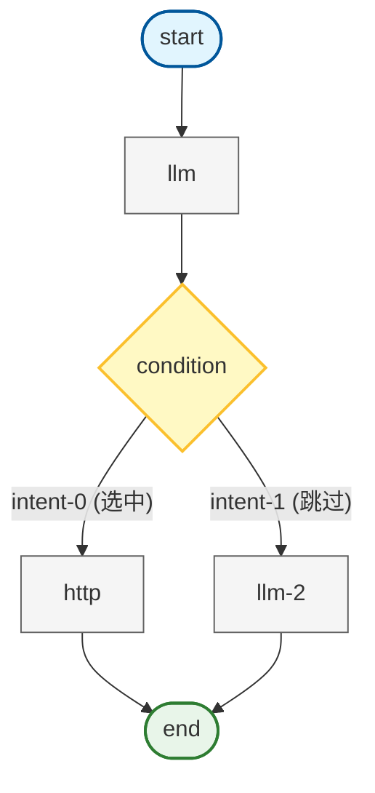

# 企业级类扣子、Dify AI 应用引擎架构设计与实践面试专项突击

# 需求背景介绍

## 需求背景

### 项目概述

本项目旨在打造一个完整与扣子（Coze）、Dify 类似、功能齐全的企业级 AI 应用引擎平台。此平台集成了可视化的工作流编排、大模型调用、RAG 知识库检索等核心功能，支持将编排好的 AI 智能体发布为 API 服务。项目采用全栈架构设计，基于 Next.js 16 和 React 19 构建前端，NestJS 构建后端服务，并支持私有化部署。

### **业务需求**

- **背景需求**：在企业级环境中，AI 应用落地的需求爆发式增长，市场中已有的工具如 Dify、FastGPT 等虽应用广泛，但在私有化部署、节点自定义扩展及深度业务集成上仍存在痛点。本项目旨在深入研究类扣子产品架构，填补企业对可扩展、易集成、且数据安全的 AI 引擎需求空白。
- **核心业务需求**：

  - **可视化工作流编排**：提供拖拽式（Drag-and-Drop）编辑器，支持复杂 DAG（有向无环图）流程设计。
  - **多模型集成**：集成 Ollama，支持本地及云端 LLM（大语言模型）调用，支持 Prompt 编排。
  - **RAG 知识库管理**：支持文档上传、分块、向量化存储及混合检索，解决模型幻觉问题。
  - **API 服务化 (BaaS)**：将编排好的工作流一键发布为标准 API，支持 SSE 流式响应，供第三方系统集成。
  - **全链路监控**：提供实时执行日志、Token 消耗统计及节点级耗时分析。

### 技术需求

- **AI 引擎核心 SDK**：

  - **自研引擎**：基于 DAG 和 Kahn 算法实现的纯 TypeScript 工作流执行引擎。
  - **LangChain/LangGraph**：集成 LangChain.js 生态，支持高级 Agent 模式（循环、中断、状态管理）。
- **可视化编辑器**：基于 XYFlow (React Flow) 实现流程图编辑，集成 Tiptap 实现支持变量引用的 Prompt 编辑器。
- **服务端架构**：基于 NestJS 实现的高性能 API 网关，支持 SSE (Server-Sent Events) 实时推送。
- **数据持久化与向量库**：使用 PostgreSQL + Prisma 存储业务数据，Qdrant 存储向量数据。
- **工程化与部署**：基于 Turborepo 的 Monorepo 架构，支持 Docker 容器化与 CI/CD 自动化部署。

# 学习成果

通过本课程的学习，学员将能够：

1. **需求分析与架构设计**

   - 理解企业级 AI 应用引擎（LLMOps）的核心业务需求与技术挑战。
   - 掌握基于 Monorepo 的全栈项目架构设计，理解 Packages 与 Apps 的职责划分。
   - 能够完成从工作流编排到执行引擎底层的全流程分析与设计。
2. **AI 引擎核心与算法实现**

   - 深入理解工作流引擎原理，掌握基于 **DAG（有向无环图）** 和 **Kahn 拓扑排序算法** 的执行调度机制。
   - 掌握 **LangChain.js** 和 **LangGraph.js** 框架，能够实现复杂 Agent（ReAct、循环、多路并行）。
   - 掌握 **RAG（检索增强生成）** 核心技术，包括文本分块、向量化（Embedding）及混合检索策略。
3. **可视化编辑器开发**

   - 基于 **Next.js 16** 和 **React 19**，结合 **XYFlow** 实现高性能可视化工作流编辑器。
   - 掌握自定义节点开发、连线校验、以及基于 **Tiptap** 的变量引用编辑器（`${node.var}`）开发。
4. **全栈服务与 API 化**

   - 熟练掌握 **NestJS** + **Prisma** + **PostgreSQL** 的后端开发技术栈。
   - 掌握 **SSE (Server-Sent Events)** 技术，实现 AI 生成内容的流式即时响应。
   - 掌握 API Key 认证、鉴权及多租户安全体系设计。
5. **工程化与运维**

   - 掌握 **Docker** 多阶段构建与 **Docker Compose** 服务编排。
   - 理解企业级日志系统设计（可观测性）与 CI/CD 自动化部署流程。

# 学习产物

学员在学习过程中将完成以下项目产物：

1. **AI 核心引擎库 (@miaoma-aiflow/ai-engine)**

   - 一个独立封装的 TypeScript 库，包含 DAG 执行引擎、图构建器、节点注册中心及变量解析器。
   - 支持自定义节点扩展（LLM、HTTP、Condition、Knowledge 等）。
2. **可视化工作流平台 (Web App)**

   - 基于 Next.js 的管理后台，支持应用创建、工作流拖拽编排、知识库管理及在线调试。
   - 集成 Shadcn/ui 的现代化界面，支持 Prompt 变量自动补全与调试。
3. **高性能 API 服务 (API Server)**

   - 基于 NestJS 的后端服务，提供工作流执行 API、用户鉴权、流式日志推送。
   - 集成 Qdrant 向量数据库服务，提供文档向量化与检索能力。
4. **知识库 RAG 系统**

   - 完整的 RAG 管道：支持文件解析 -> 文本分块 -> 向量嵌入 -> 混合检索。
5. **容器化部署方案**

   - 完整的 `docker-compose.yml` 配置，一键启动 Postgres、Qdrant、Web、API 服务。
   - 集成 Caddy 作为反向代理网关，配置自动 HTTPS 与安全头。

# 技术选型

## @miaoma-aiflow/ai-engine (核心引擎)

**简介**: 项目的核心逻辑库，负责解析工作流定义并调度执行。

- **LangChain.js**: (`@langchain/core`, `@langchain/ollama`) 提供模型抽象、Prompt 模板及基础工具调用能力。
- **LangGraph.js**: 用于构建复杂的、有状态的、循环的 Agent 流程。
- **Zod**: 用于定义节点输入输出 Schema 及运行时数据验证。
- **Qdrant Client**: 连接向量数据库，实现 RAG 检索功能。

**图示：@miaoma-aiflow/ai-engine (核心引擎)**

## apps/workflow (前端应用)

**简介**: 基于 Next.js 的全栈 Web 应用，提供编辑器 UI 和 BFF 层。

- **Next.js 16 (App Router)**: 使用最新的 React Server Components (RSC) 架构。
- **React 19**: 利用最新的 Hooks 和并发特性。
- **XYFlow (React Flow)**: 核心可视化库，实现节点拖拽、连线、缩放及自定义节点渲染。
- **Tiptap**: 无头富文本编辑器，用于实现支持 `${}` 变量高亮的 Prompt 编辑器。
- **Tailwind CSS & Shadcn/ui**: 现代化的原子类 CSS 框架及组件库，确保 UI 一致性。
- **Prisma**: ORM 框架，用于管理 PostgreSQL 数据库 Schema 及类型安全的数据库操作。
- **SWR / React Query**: 用于前端数据获取与状态管理。

## apps/api-server (后端服务)

**简介**: 提供对外 API 接口、长任务调度及安全认证。

- **NestJS**: 企业级 Node.js 框架，提供依赖注入、模块化架构。
- **RxJS**: 处理异步事件流。
- **Passport & JWT**: 实现 API Key 及 Token 认证。
- **BullMQ (Redis)**: 处理异步耗时任务（如大文件向量化）。

## 基础设施与工程化

- **Ollama**: 本地运行大模型（如 Qwen, Llama 3），降低开发成本。
- **PostgreSQL**: 关系型数据库，存储用户、应用、工作流数据。
- **Qdrant**: 高性能向量数据库，存储知识库 Embedding 数据。
- **Docker & Docker Compose**: 容器化编排。
- **TurboRepo**: Monorepo 构建工具，优化多包构建效率。
- **Husky & Commitlint**: 代码规范与提交检查。

# 简历描述

## 初级 / 中级

**AI 工作流平台前端开发**

- **技术栈**: TypeScript, React 19, Next.js, XYFlow, Tailwind CSS, Prisma
- **项目简介**: 参与开发了一款类 Dify 的可视化 AI 应用编排平台，支持用户通过拖拽节点构建 AI 工作流，并集成知识库检索功能。
- **工作内容与成果**:

  - 基于 **XYFlow (React Flow)** 实现了工作流编辑器的核心交互，包括自定义节点开发（LLM、条件判断、知识库节点）及连线校验逻辑。
  - 集成 **Tiptap** 开发了 Prompt 变量编辑器，支持通过 `/` 快捷插入变量，并实现了 `${node.var}` 格式的变量解析与高亮。
  - 使用 **Tailwind CSS** 和 **Shadcn/ui** 构建了统一的 UI 组件库，提升了开发效率与界面美观度。
  - 负责 **知识库模块** 的前端开发，实现了文件上传、分块预览及向量检索测试功能。

## 中级 / 高级

**AI 应用引擎全栈开发 / 架构设计**

- **技术栈**: TypeScript, NestJS, Next.js, LangChain.js, LangGraph, Qdrant, Docker
- **项目简介**: 设计并开发了一套企业级 AI Agent 编排引擎，支持 DAG 工作流执行、RAG 知识库检索及 API 服务化，解决了企业私有化部署大模型应用的难题。
- **工作内容与成果**:

  - **引擎架构设计**：自主设计并实现了基于 **DAG (有向无环图)** 的工作流执行引擎，利用 **Kahn 算法** 实现节点拓扑排序与循环检测，支持复杂业务逻辑编排。
  - **核心模块开发**：设计了基于 **注册模式 (Registry Pattern)** 的节点扩展系统，实现了 Start、LLM、HTTP、Condition 等核心节点的执行器，遵循开闭原则。
  - **RAG 系统构建**：基于 **LangChain** 和 **Qdrant** 搭建了 RAG 管道，实现了文本分块、向量化存储及混合检索（全文+向量），显著提升了回答准确率。
  - **高性能通信**：在 NestJS 中实现了 **SSE (Server-Sent Events)** 流式响应机制，支持打字机效果的实时 Token 推送，优化了用户体验。
  - **工程化治理**：采用 **Monorepo** 架构管理前后端代码，通过 Docker 多阶段构建优化镜像体积，实现了从开发到生产的全链路 CI/CD。

# 课程内容

## 需求分析、项目架构设计与工作流引擎编辑器核心剖析

## 初中级
1. **AI 应用引擎项目需求分析与方案评审**

   - 能够理解企业级 AI 应用引擎的核心需求，包括工作流编排、大模型调用、RAG 知识库等
   - 掌握项目需求评审的流程，理解从需求到解决方案制定的基本思路
   - 理解 AI 应用引擎与传统 Web 应用的差异性
2. **项目架构设计与模块化分析**

   - 理解企业级 AI 应用引擎的架构设计原则
   - 掌握基于 Monorepo 的全栈项目架构组织方式
   - 理解 packages 与 apps 的职责划分
3. **工作流引擎编辑器核心架构**

   - 理解基于 XYFlow 实现的可视化工作流编辑器
   - 能够设计分析不同类型的工作流节点（如 Start、LLM、HTTP、Condition、End、Knowledge 等）
   - 理解 DAG（有向无环图）在工作流引擎中的应用

## 高级
1. **高级架构设计与模块化思想**

   - 具备从零开始设计企业级 AI 应用引擎架构的能力
   - 理解如何将工作流引擎、知识库模块、API 服务和 UI 组件库整合在项目架构中
   - 掌握性能与扩展性最佳实践
2. **工作流节点与执行器实现方案**

   - 深入理解节点注册中心（Registry）和执行器模式（Executor Pattern）
   - 分析自定义节点（如 LLM 调用、HTTP 请求、条件分支、知识库检索等）的实现原理
   - 掌握变量解析器（Variable Resolver）和上下文管理的架构设计
3. **图构建器与拓扑排序算法**

   - 理解基于邻接表和 Kahn 算法的拓扑排序实现
   - 掌握条件分支的动态路径选择机制
   - 深入了解子树排除策略在工作流执行中的应用
4. **工程化与质量控制思想**

   - 理解使用 ESLint、CSpell、Prettier、CommitLint 等工具进行代码质量控制的工程化理念
   - 掌握 Turbo + pnpm workspace 的 Monorepo 构建优化
   - 理解如何通过代码风格一致性、提交信息规范化和拼写检查来提升项目的可维护性

## 大模型基础、LangChainjs 与 Langgraphjs 框架进阶

## 初中级

1. **大模型基础与本地部署**

   - 理解大语言模型（LLM）的核心概念和工作原理
   - 掌握 Ollama 本地部署方案，能够管理和运行开源模型
   - 理解模型参数、Token、Temperature 等核心概念
2. **LangChain.js 基础应用**

   - 掌握 LangChain.js 的基本架构和核心模块
   - 能够使用 ChatOllama 进行模型调用
   - 理解消息系统（System/Human/AI Message）的使用
3. **RAG 基础实践**

   - 理解检索增强生成（RAG）的基本原理
   - 能够实现文档加载、分割、向量化的基础流程
   - 掌握向量数据库的基本使用方法

## 高级

1. **LangChain.js 进阶开发**

   - 深入理解工具定义（Tool）与函数调用（Function Calling）机制
   - 掌握结构化输出（Structured Output）的实现方式
   - 能够开发自定义 Agent 智能代理
2. **LangGraph.js 状态图编程**

   - 理解状态图（StateGraph）编程范式
   - 掌握 Annotation 类型系统和状态管理
   - 深入理解并行执行（Fan-out/Fan-in）、循环、人机交互（Interrupt）等高级模式
   - 能够实现复杂的多节点工作流
3. **MCP 协议开发**

   - 理解 Model Context Protocol（MCP）的设计思想
   - 掌握 MCP 服务端工具注册与资源管理
   - 能够开发 MCP 客户端并集成到应用中
4. **架构设计与选型**

   - 深入对比自实现工作流引擎与 LangGraph.js 的架构差异
   - 理解 DAG 拓扑排序 vs 状态机驱动的设计取舍
   - 能够根据业务场景选择合适的技术方案

## AI 工作流引擎编辑器与执行器架构设计与实践

## 初中级

1. **AI 应用引擎数据协议设计**

   - 理解工作流数据结构的设计原则
   - 掌握 WorkflowDefinition、WorkflowNode、WorkflowEdge 核心类型
   - 理解变量引用协议 `${nodeId.variableName}` 的设计
2. **工作流引擎编辑器开发**

   - 掌握基于 React Flow 的可视化编辑器核心架构
   - 理解节点组件与配置面板的实现
   - 能够实现基本的节点拖拽、连线功能
3. **工作流引擎执行器基础**

   - 理解 DAG（有向无环图）在工作流中的应用
   - 掌握 Kahn 算法实现拓扑排序
   - 理解节点执行顺序的确定机制

## 高级

1. **编辑器高级功能**

   - 深入理解基于 Tiptap 的变量编辑器实现
   - 掌握自动保存与防抖机制
   - 能够实现复杂的节点配置面板
2. **执行器核心机制**

   - 深入理解 WorkflowEngine 核心引擎架构
   - 掌握 ExecutionContext 执行上下文管理
   - 理解条件分支的子树排除策略
   - 能够实现环检测与异常处理
3. **插件化与微内核架构**

   - 理解 NodeRegistry 注册中心的设计思想
   - 掌握 BaseNodeExecutor 基类与模板方法模式
   - 深入理解开放封闭原则在节点系统中的应用
   - 能够开发自定义节点并集成到引擎中
4. **工程化最佳实践**

   - 理解类型驱动开发（Type-Driven Development）
   - 掌握接口隔离与依赖倒置原则
   - 能够设计可扩展的工作流引擎架构

## AI 工作流引擎日志、AI API 服务化与 AI 应用开发部署实践

## 初中级

1. **后端规范与异常治理**

   - 理解日志系统设计原则与日志分级策略
   - 掌握错误码枚举（ErrorCode）与统一错误处理模式
   - 能够实现标准化响应格式的封装
2. **服务端架构、数据库建模与持久层开发**

   - 基于 Nextjs、Nestjs 服务端架构
   - 学会使用 Prisma ORM 进行 Schema 建模与数据关联设计
   - 掌握常用的 CRUD 操作与 Prisma Client API
   - 理解数据库迁移（Migration）的工作流程
3. **容器化技术基础**

   - 了解 Docker 容器化核心原理与 Dockerfile 编写
   - 掌握 Docker Compose 多服务编排配置
   - 能够实现开发环境的标准化容器化部署

## 高级

1. **企业级观测与实时通信**

   - 设计可追溯、可观测的企业级日志系统架构
   - 实现基于 SSE（Server-Sent Events）的实时事件推送与流式响应
   - 深入理解流式输出在 AI 场景下的应用实践
2. **安全架构与认证体系**

   - 构建基于 JWT 认证与 API Key 的多维安全体系
   - 掌握无状态认证与鉴权（RBAC）的设计思路
   - 能够处理跨域安全、身份伪造等常见安全风险
3. **自动化运维**

   - 配置 Caddy 反向代理、自动 HTTPS 证书申请与安全头增强
   - 设计生产级 CI/CD 流水线实现全自动化部署

# 面试问题

## 如何设计一个支持自定义流程的 AI 工作流引擎？核心难点是什么？

- **回答思路**：

  - **数据结构**：采用 DAG（有向无环图）来描述工作流，节点（Node）存储配置，边（Edge）代表数据流向。
  - **调度算法**：核心是**拓扑排序**（如 Kahn 算法）。引擎需要解析 JSON 图数据，构建邻接表和入度表，将所有入度为 0 的节点放入执行队列，依次执行并减少下游节点入度，直到所有节点执行完毕。
  - **核心难点**：

    1. **环检测**：必须在图构建阶段检测是否存在循环引用，防止死循环（除非显式设计了 Loop 节点）。
    2. **条件分支**：遇到 Condition 节点时，需要根据条件评估结果，动态“剪枝”，即排除掉未选中分支的所有下游节点（子树排除算法）。
    3. **上下文管理**：节点间的数据传递需要一个全局 Context，上游节点的输出需要精确映射到下游节点的输入，通常通过 `${nodeId.key}` 变量引用机制实现。

## 在 RAG（检索增强生成）系统中，如何提高检索的准确性？

- **回答思路**：

  - **分块策略 (Chunking)**：不能简单按字符切割。应根据文档结构（如 Markdown 标题）进行语义分块，保持上下文完整性。Chunk Size 和 Overlap 需要根据模型窗口进行调优。
  - **混合检索 (Hybrid Search)**：单纯的向量检索（语义匹配）可能漏掉专有名词。最佳实践是结合**关键词检索 (BM25)** 和 **向量检索 (Embedding)**，使用 RRF (Reciprocal Rank Fusion) 算法对结果进行重排序 (Re-rank)。
  - **元数据过滤**：在向量库中存储元数据（如文件来源、时间），检索时进行 Pre-filtering，缩小搜索范围。
  - **多路召回与重排序**：先召回较多文档（Top-K 较大），然后使用专门的 Re-rank 模型（如 BGE-Reranker）对结果进行精细排序。

## 如何实现大模型输出的流式响应 (Streaming) 并实时推送到前端？

- **回答思路**：

  - **后端实现**：不能使用普通的 HTTP 请求-响应模式。需要使用 **SSE (Server-Sent Events)**。在 NestJS 中，Controller 返回一个 `Observable` 或 `ReadableStream`。
  - **模型调用**：调用 LLM（如 Ollama/OpenAI）时开启 `stream: true` 模式。
  - **数据透传**：后端监听 LLM 的 `chunk` 事件，每收到一个 token，就立即封装成 SSE 格式（`data: ...\n\n`）写入响应流。
  - **前端处理**：前端使用 `fetch` 或 `EventSource` API，结合 `TextDecoder` 逐块解码数据，实现“打字机”效果。
  - **复杂场景**：在工作流引擎中，不仅要推送 LLM 的文本，还要推送“节点开始”、“节点结束”、“日志”等结构化事件，需要定义一套完整的 SSE 事件协议（Event Protocol）。

## 自研的 DAG 引擎与 LangGraph 有什么区别？为什么项目中同时涉及？

- **回答思路**：

  - **自研 DAG 引擎**：

    - **特点**：基于静态图，逻辑确定，易于理解和调试，适合线性的、确定性的工作流（Workflow）。
    - **局限**：较难实现复杂的循环（Loop）和动态路由，或者需要复杂的“黑客”手段实现。
  - **LangGraph**：

    - **特点**：基于**状态机 (State Machine)** 和 **图 (Graph)**。节点是状态转换函数，边是条件跳转。原生支持循环（Cyclic Graph）、持久化（Checkpointing）和人机交互（Interrupt）。
    - **适用场景**：适合构建复杂的 **Agent**（智能体），需要自我反思、多轮对话、工具调用的场景。
  - **结合点**：项目中通常用自研引擎处理标准的业务流程编排（可控性高），而在某些特定节点（如复杂推理节点）内部集成 LangGraph 来增强 AI 的自主能力。

## 项目中的 Prompt 变量编辑器（支持 `${}` 高亮）是如何实现的？

- **回答思路**：

  - **技术选型**：普通的 `<textarea>` 无法实现部分文本高亮。必须使用富文本编辑器，本项目选用 **Tiptap**（基于 Prosemirror）。
  - **自定义节点**：开发一个 Tiptap Extension，定义一个新的 Node 类型 `variableMention`。
  - **交互逻辑**：

    1. 监听输入，当用户输入 `/` 时，触发 `Suggestion` 插件，弹窗展示上游节点可用的变量列表。
    2. 用户选择后，插入一个 `variableMention` 节点（原子节点，不可在内部编辑）。
    3. **序列化与反序列化**：存储时，需要将 Tiptap 的 JSON 结构转换为纯文本格式（如 `你好，${start.name}`）；回显时，利用正则解析 `${...}`，将其还原为 Tiptap 的 Node 结构以显示高亮标签。

## 如何设计支持插件化扩展的节点系统？

- **回答思路**：

  - **设计模式**：采用 **注册模式 (Registry Pattern)** 和 **策略模式**。
  - **抽象基类**：定义 `BaseNodeExecutor` 抽象类，规定所有节点必须实现 `execute()` 方法，并提供通用的日志记录、变量解析、耗时统计功能。
  - **注册中心**：创建一个 `NodeRegistry` 单例，用于维护 `Map<NodeType, Executor>`。
  - **开闭原则**：当需要新增一个“发送邮件”节点时，只需：

    1. 编写 `EmailExecutor` 继承基类。
    2. 定义配置 Schema（收件人、标题、内容）。
    3. 在系统启动时调用 `registry.register('email', new EmailExecutor())`。
    4. 核心调度引擎的代码无需任何修改，实现了对扩展开放，对修改封闭。

---

> 来源：https://u19tul1sz9g.feishu.cn/docx/CfiJdvsMuo39FHx0Pccc7KESnXf
> 更新时间：2026-07-03 14:09:11 UTC
> 飞书 Token：`CfiJdvsMuo39FHx0Pccc7KESnXf`
