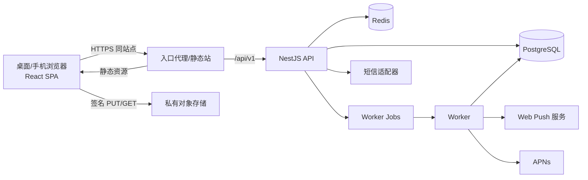

# 计划打卡 Web V1 技术方案

| 项目 | 内容 |
| --- | --- |
| 文档状态 | 方案基线；描述目标实现与现有代码缺口，不代表已交付 |
| 版本 | V1.1，2026-09-28；明确 Web 独立验收口径 |
| 目标平台 | 桌面与手机 Web；中国大陆单一区域 |
| 产品依据 | [Web PRD](./PRD-计划打卡-Web-v1.md)、[iOS PRD](./PRD-计划打卡-iOS-v1.md)、[iOS UI/UX](./UIUX-计划打卡-iOS-v1.md) |
| 现有基础 | `apps/api`、`apps/worker`、`apps/mobile`、`packages/domain`、`packages/contracts`、`packages/design-tokens` |
| 新增交付 | `apps/web`、Web 会话适配、通知与消息中心、数值项和一次性任务附件、Web 部署及验收 |

> 本文把“现有代码”和“待实现目标”分开记录。当前仓库没有 Web 客户端；本地开发检查通过不等于 Web 或生产环境验收通过。本文只设计 Web V1 必需的共享后端变更，不把 iOS 原生离线能力迁移到浏览器。

## 1. 目标、范围与验收口径

### 1.1 目标

交付可通过网址访问的个人计划打卡 Web 客户端，桌面与手机同等优先。Web 与 iOS 共用账号、计划、打卡、统计和授权数据；Web 可独立于 iOS App 发布。Web V1 覆盖账号、计划、分组、今日、日历、统计、补记修正、照片和数值、好友分享、提醒设置、社交消息、导出和账号删除。

用户通过公开注册进入产品，首期通过推广规模控制使用量。发布前必须验证真实短信、HTTPS、服务端持久化、跨端规则、权限隔离和正式浏览器矩阵。

### 1.2 边界与非目标

| 范围 | 处理方式 |
| --- | --- |
| 离线 | Web 断网不可使用；不实现本地离线写入、outbox 或离线媒体暂存 |
| 后台通知 | Web Push 链路必须实现并在受控场景验证；关闭页面后的实际送达不作为发布阻断项 |
| 安装 | 网址模式完整使用；添加到主屏幕为可选能力 |
| UI | 延续产品视觉和状态语义；桌面与手机做独立布局适配 |
| iOS | 保持既有移动端接口兼容；必要的共享后端迁移不得改变 iOS 已确认的业务口径 |
| 非目标 | 公开动态、排行榜、群组共享、实时聊天、独立管理后台、搜索引擎内容页 |

### 1.3 已确认决定

| 决定 | 执行口径 |
| --- | --- |
| 部分周 | 保留打卡，不计周达标率和连续达标周数；与 iOS PRD 和现有统计域一致 |
| 数值项 | 每计划最多一个，含名称和单位；所有计划类型可用；历史数值保留旧名称与单位，不自动换算 |
| 一次性任务附加内容 | 完成、失败、取消时均可附加备注、照片和数值 |
| 提醒规则 | 计划提醒时间/星期共享；Web 与 iOS 的计划、社交通知投递开关按渠道独立 |
| 站内消息 | 社交消息持久可回看，已读状态跨端共享；计划提醒只在网页打开时即时提示 |
| Web Push | 实现订阅、服务端发送和失效清理；外层用通用文案；后台实际送达尽力而为 |
| 会话 | 同站点入口；15 分钟访问令牌在内存，30 天轮换刷新会话在安全 Cookie |
| 浏览器 | 桌面 Chrome/Edge/Safari/Firefox、手机 Safari/Chrome 的当前及上一稳定大版本 |

### 1.4 质量目标与测量

现有 iOS 技术方案中的服务端可用性与延迟目标作为共享基础：API 月度可用性目标 ≥99.9%；核心读接口服务端 P95 <300 ms、写接口服务端 P95 <500 ms，照片二进制上传单独计量。Web 增加以下发布验收指标，均以拟发布环境实测为准：

- 桌面与手机代表性视口无横向溢出，主流程可用键盘和触屏完成。
- Web 首屏、路由切换、日历切换和提交反馈记录真实用户性能；上线前形成基线，不预设未经测量的固定秒数。
- 失败请求和未知写入结果不显示假成功；重试不产生第二条有效记录。
- 同一账号在多个 Web 浏览器中的日期、计划状态、统计、消息已读和好友可见内容一致；与 iOS 的共享一致性保留为产品目标，在独立的客户端联测中验证。
- Web Push 在受控支持场景完成订阅、发送、点击跳转、取消订阅及失效清理；系统后台实际送达记录为观察指标。

## 2. 来源映射与当前代码基线

### 2.1 业务规则映射

| 业务 | 规则来源 | 可复用代码 | Web 新增工作 |
| --- | --- | --- | --- |
| 日期/时区/部分周 | iOS 与 Web PRD | `packages/domain/src/date.ts`、`rules.ts`、`statistics.ts` | Web 日期控件、时区提示、跨端验收 |
| 计划与打卡 | 两份 PRD | `apps/api/src/plans`、`records`、`packages/contracts` | 响应式表单、在线提交和状态反馈 |
| 今日/日历/统计 | 两份 PRD | 现有 API 聚合视图 | Web 路由与交互；不重算权威统计 |
| 好友与分享 | 两份 PRD | 现有社交与授权 API | Web 页面、分享预览和撤销反馈 |
| 照片与导出 | 两份 PRD | 对象签名上传、导出 Worker | 浏览器直传、对象域 CORS、下载处理 |
| 提醒与消息 | Web PRD §5.2 | iOS 本地提醒、APNs 社交通知基础 | 渠道偏好、站内收件箱、Web Push、计划提醒 Worker |
| 会话 | Web PRD §5.4 | 短 JWT + 轮换 refresh session | Cookie 适配、Web audience、CSRF、多标签页协调 |
| 数值/一次性附件 | Web PRD §2/§3 | 循环打卡数值及媒体基础 | 计划数值配置、一次性记录内容、历史单位版本 |

### 2.2 实际代码状态

仓库目前仅有 `apps/mobile`、`apps/api`、`apps/worker`，没有 `apps/web`。根 `package.json` 的 `typecheck`、`check` 与发布检查尚未覆盖 Web。`packages/domain`、`packages/contracts` 和 `packages/design-tokens` 可复用；React Native 页面、`SecureStore`、SQLite outbox、Expo 通知及相册适配不可直接作为浏览器实现。

`apps/api/src/main.ts` 尚未启用浏览器跨域配置；本方案采用同站点代理，生产浏览器 API 请求原则上同源，但开发、对象存储签名直传及独立环境仍需明确 CORS。JWT audience 当前为 `plan-checkin-mobile`，refresh token 通过 JSON 返回和提交；浏览器不能原样沿用移动端持久化方式。现有推送注册只接受 iOS APNs；Worker 只有社交通知 APNs，没有 Web Push、Web 计划提醒和可查询的社交消息收件箱。部署清单只覆盖 API 与 Worker。

现有服务端路由覆盖主要业务。实现前需校验 `packages/contracts/src/routes.ts` 与控制器的一致性，并再生成 OpenAPI；导出相关路由统一按现有 `/api/v1/me/exports` 契约供 Web 使用。`docs/release-candidate.json` 当前仍为原生与正式验收待执行状态，因此所有能力需按 Web 发布门槛重新验收。

## 3. 总体架构



浏览器从一个 HTTPS 站点获取 HTML、静态资源及 `/api/v1`。入口代理把 API 路径转发到现有 NestJS 服务，Web 静态产物独立构建和发布。对象存储仍由服务端签发短时 URL，浏览器直接传输照片；对象域需要允许指定 Web 源的 `PUT`、`GET`、`HEAD` 和签名使用的请求头。生产 API 不开放通配跨域；若后续拆分源，按受控源列表配置 CORS，不靠 `*` 搭配凭据。

PostgreSQL 是计划、记录、会话、通知偏好及消息的权威来源；Redis 用于短时验证码、限流、队列和必要的并发协调，不保存不可丢失的业务事实。Service Worker 仅承担 Web Push 事件与点击跳转，不实现业务离线缓存。

### 3.1 技术选型

| 层 | 选择 | 原因与边界 |
| --- | --- | --- |
| Web | React + TypeScript + Vite 单页应用 | 与现有 TypeScript 包直接复用；核心页面登录后使用，不需要 SSR/SEO；构建为静态产物 |
| 路由 | React Router | 支持今日、日历、计划详情和朋友等深链接及浏览器历史 |
| 服务端缓存 | TanStack Query | API 数据缓存和失效；缓存不作为离线事实或权威统计 |
| 表单 | React Hook Form + 共享校验规则适配 | 减少复杂计划表单重渲染；服务端仍最终校验 |
| 日期与统计 | `@plan-checkin/domain` | 预览和禁用日期；服务端结果最终权威 |
| 类型与接口 | `@plan-checkin/contracts` 及 OpenAPI 生成类型 | 请求/响应和错误码统一，新增 Web 端点先改契约 |
| 设计 | `@plan-checkin/design-tokens` + Web CSS 语义映射 | 延续色彩、间距、状态含义，针对宽屏和触屏适配 |
| API 与任务 | 现有 NestJS API + Worker | 延续事务和幂等机制；新增 Web 会话、通知、数值与附件能力 |

首次脚手架时锁定当时受支持的具体依赖版本，更新 pnpm 锁文件并做类型、构建和浏览器冒烟，不把技术文档中的库名理解为当前已经安装。Vite 产物按其[官方静态部署说明](https://vite.dev/guide/static-deploy)构建；环境变量不得包含服务器秘密。

### 3.2 建议目录

```text
apps/web/
  src/app/                 # 路由、入口、全局错误边界
  src/pages/               # 今日、日历、计划、朋友、设置
  src/features/            # 计划表单、打卡、分享、通知、媒体
  src/data/                # API 客户端、查询键、会话协调
  src/components/          # 表单、状态、日历、弹层等复用组件
  src/styles/              # token 映射、响应式布局、主题
  public/                  # manifest、推送 service worker、图标
  tests/                   # 单元/组件/浏览器端到端
apps/api/                  # Web 会话、通知、数值/一次性任务扩展
apps/worker/               # Web Push 与提醒发送
packages/domain/           # 共享规则；部分周语义维持一致
packages/contracts/        # 新增端点和 DTO；生成 OpenAPI
packages/design-tokens/    # 共享视觉语义
db/migrations/             # 可回滚前向迁移
infra/deploy/              # 静态站、入口代理、环境与密钥
```

## 4. Web 客户端设计

### 4.1 路由与页面状态

建议保留稳定可分享的内部路径：`/today`、`/calendar`、`/plans`、`/plans/:id`、`/friends`、`/settings`。私人路径要求登录，未登录时记录目标路径，验证成功后回到目标页。对被撤销分享、已删除计划或过期导出链接显示明确错误，不重定向到看似正常的空页。

各页面使用统一状态模型：加载、空态、已加载、提交中、请求失败、权限不足、无网络、会话失效、冲突。仅在服务器确认后呈现“保存成功”。未知写入结果先用 idempotency key 查询或重试同一操作，不能生成新 key 后直接再次写入。Web 不做本地 outbox；断网时禁用写操作并提示联网。

### 4.2 响应式布局

| 参考宽度 | 布局原则 | 重点验证 |
| --- | --- | --- |
| 窄屏 `<768px` | 四个主入口清晰可达，单列内容，弹层不遮挡键盘 | 360/390px 手机、长名称、放大字体 |
| 中宽 `768–1199px` | 导航与内容按可用空间折叠，日历可切换简洁密度 | 平板竖屏、窗口缩放 |
| 宽屏 `≥1200px` | 侧边导航、列表与详情可并排，限制正文行长 | 1280/1440px 桌面、键盘操作 |

断点是布局策略的初值，不是设备识别；组件在内容溢出时调整。页面宽度不超过可用视口，不出现横向滚动、遮挡或屏幕外不可达控件；长内容可以纵向滚动，固定导航和提交控件不能挡住内容。所有核心操作同时可触屏和键盘完成，悬停只提供附加信息。状态文字、图标和颜色联合表达；表单错误与异步结果对屏幕阅读器可见。Web 可访问性以 [WCAG 2.2](https://www.w3.org/TR/WCAG22/) AA 作为验收参考。iOS 画板仅作视觉语言参考，Web 不使用 iOS 的逐像素阈值。

### 4.3 数据获取与错误处理

前端按实体定义查询键：`today(planDate)`、`calendar(month,group)`、`plan(id)`、`statistics(id,range)`、`shares(id)`、`inbox(cursor)`。写入成功后失效相关键；不在各页面独立计算服务端权威完成率。计划时区由 API 返回，所有业务日期以 `YYYY-MM-DD` 携带，浏览器本地时区只用于展示辅助提示。

API 客户端统一处理 `401` 会话刷新、`403` 权限变化、`409` 规则变更或记录冲突、`429` 短信/业务限流及 `5xx` 可重试错误。冲突界面展示两个版本和差异，由用户明确选择。多标签页收到退出或账号删除信号后立即清空内存访问令牌和私人查询缓存。

### 4.4 创建、打卡与媒体

创建计划向导按时间规则显示字段，保存前使用共享域包做即时预检，服务端作最终判定。数值项配置为一个名称和单位，记录值使用十进制字符串；历史记录附带所用数值配置版本，修改单位不改写旧值。一次性任务的终态记录与循环打卡共用文字、媒体和数值输入组件，但使用独立的结果状态机和 API。

照片先向 API 申请上传意图，再按签名 URL 直接上传对象存储，最后调用完成接口；删除或替换附件需要明确完成状态。现有约束为单张不超过 20 MB、每记录最多 9 张，支持 JPEG、PNG、HEIC、WebP；浏览器不支持的格式应在选择时解释。照片上传失败不得阻断无照片的结果提交；尚未完成的附件不能误显示为已保存。

## 5. 浏览器会话与认证

### 5.1 与现有认证共存

保留移动端手机号验证码接口和 JSON refresh 流程，不强制 iOS 改版。新增 Web 专用验证、刷新、查询会话和退出适配端点，内部复用现有用户、验证码、会话和撤销逻辑。Web JWT 使用独立 audience，例如 `plan-checkin-web`；鉴权层明确允许被请求端点认可的 audience，不能把 Web 凭据误当移动端令牌。现有 `x-device-id` 可由浏览器生成随机非秘密安装标识；清理站点数据后成为新设备。

### 5.2 Cookie 与令牌生命周期

短信验证成功后，Web 只把 15 分钟 access token 返回给页面并存于内存；30 天轮换 refresh token 通过同站点 `Secure`、`HttpOnly`、`SameSite=Lax`、无 `Domain` 的 Cookie 保存。Cookie 仅由服务端设置和撤销；不把 refresh token 写入 `localStorage`、`sessionStorage`、IndexedDB 或 JavaScript 可读变量。采用主机限定的 Cookie 前缀，满足 [MDN 的安全 Cookie 配置](https://developer.mozilla.org/en-US/docs/Web/Security/Practical_implementation_guides/Cookies)。

页面刷新后调用 Web 会话端点取得新 access token；临近 15 分钟到期时自动轮换 refresh。每次成功轮换后刷新会话重新获得 30 天有效期。用户主动退出仅撤销当前 Web 会话并清除 Cookie；换号和账号删除仍按现有全会话撤销行为处理。所有认证响应使用 `Cache-Control: no-store`。

### 5.3 CSRF、多标签页与失败恢复

Cookie 携带的刷新、退出及其他会话变更请求必须校验 `Origin`、CSRF token 和幂等键；`SameSite` 作为附加防线，不能独自代替 CSRF 防护，参见 [OWASP 指南](https://cheatsheetseries.owasp.org/cheatsheets/Cross-Site_Request_Forgery_Prevention_Cheat_Sheet.html)。一般业务写入使用内存中的 Bearer access token，仍执行服务端授权和幂等校验。

同一浏览器多标签页通过 `BroadcastChannel` 通知刷新开始/完成、退出与账号变更；同一轮换窗口仅一个标签发起 refresh，其余标签等待并重新取得 access token。对浏览器未提供该能力或标签被挂起的情况，服务端不得因第二个旧 token 请求清除第一个标签的新 Cookie；失败标签重新查询当前会话，必要时要求登录。轮换竞争、网络断开、重复响应和浏览器重启需有专门用例。

### 5.4 账号安全

公开注册沿用现有短信次数、号码和 IP 限流；异常流量、验证码攻击与批量注册由服务端观测并逐步加严。登录、换号、导出和删除相关操作保留审计事件，日志不写手机号明文、验证码、Cookie、access token 或 refresh token。退出后浏览器返回、前进及其他已打开标签不得继续呈现私人数据。

## 6. 共享业务模型与 API 扩展

### 6.1 计划和部分周

服务端继续使用共享 `@plan-checkin/domain` 计算合法业务日期、规则版本和统计。部分周只保留记录，不进入周达标率和连续达标周数。Web 不新增“按有效天数折算 N”的算法。计划规则次日生效、历史按旧版本计算；Web 与 iOS 对同一用户的相同日期应返回同一状态。

### 6.2 数值项版本

现有计划创建 DTO 没有数值项配置，现有循环打卡可保存数值，一次性结果 DTO 没有数值和媒体。新增计划数值配置（最多一项）：`label`、`unit`、`effectiveFrom`、`version`。打卡记录引用提交时的配置版本，并以十进制字符串保存值；历史渲染使用历史版本的名称和单位。单位修改从新生效日起使用，不转换旧数值。服务端验证值的格式、范围和与计划版本的匹配；数值不触发自动成功或失败。

### 6.3 一次性任务结果附件

扩展一次性结果创建与修正 DTO，允许 `note`、`numeric`、`mediaIds`，保留原有按时完成、迟完成、失败、取消状态机。结果记录与媒体的关联、撤销、删除、导出及可见性遵循循环打卡同等隐私规则。修改结果保留修正标记与审计记录；达到终态后不新建第二条完成记录。

### 6.4 契约与兼容

新增字段采用可选扩展并保持现有移动端请求有效。为 Web 会话、通知渠道偏好、Web Push 订阅、收件箱、数值项和一次性结果附件补充 DTO、错误码与 OpenAPI。对旧客户端读取新增字段提供可忽略的兼容响应；破坏性迁移需以显式新版本端点承载。每次变更执行 `contracts:build`、`contracts:check` 和 `contracts:compat`，并更新 [API 兼容变更记录](./API-兼容变更记录.md)。

## 7. 数据设计与迁移

### 7.1 现有表与新增表

| 数据 | 当前状态 | 目标变化 |
| --- | --- | --- |
| `sessions` | 记录设备、刷新哈希、到期和撤销 | 标识 Web 客户端来源；继续复用现有轮换与撤销语义 |
| `devices` | `platform` 仅允许 `ios/android`；APNs 专用字段 | Web Push 订阅单独建表，不将浏览器 endpoint 伪装成 APNs token |
| `reminder_settings` | 每计划一份时间/星期/提前天数 | 继续作为跨端共享提醒规则；渠道投递状态拆出 |
| `notification_preferences` | 每用户一份社交通知偏好 | 迁移为按用户和渠道的投递偏好；旧行映射为 iOS 默认值 |
| `worker_jobs` | 社交通知、导出、删除、媒体清理 | 增加 Web Push 与计划提醒任务类型和去重键 |
| `plan_rule_versions` / `checkins` | 已承载规则与循环记录 | 增加数值配置版本引用和历史快照 |
| 一次性结果 | 独立终态数据，无通用数值/照片字段 | 增加备注、数值及媒体关联；保持终态唯一性 |
| 社交事件 | 业务记录与 APNs 工作项，未形成用户收件箱 | 新增持久消息及账号级已读状态 |

新增表建议如下。字段名在迁移评审中与现有命名规范校准，但约束不可省略：

```text
channel_notification_preferences
  user_id + channel(ios|web) 唯一
  plan_enabled, friend_requests, shared_updates, encouragements
  revision, updated_at

web_push_subscriptions
  id, user_id, browser_device_id, endpoint_hash 唯一
  endpoint_ciphertext, p256dh_ciphertext, auth_ciphertext
  enabled, expires_at, last_success_at, last_failure_code, revoked_at

inbox_messages
  id, recipient_user_id, event_type, actor_user_id, subject_id
  sanitized_payload, created_at, read_at
  unique_business_event_key 唯一

plan_numeric_config_versions
  id, plan_id, label, unit, effective_from, effective_to, revision
```

Web Push endpoint 和密钥属于可识别设备的敏感配置：服务端加密存储，日志仅记录哈希或内部 ID；取消订阅、退出、账号删除时及时撤销。收件箱 payload 只包含渲染所需的最小信息，读取时仍检查好友、分享和账号状态；权限撤销后不得凭历史消息跳转读取原计划内容。

### 7.2 迁移策略

迁移采用“先扩展、后切流、再收敛”顺序：

1. 新增表和可空列，不删除旧字段；为既有计划和记录补足默认版本引用。
2. 从账号级通知偏好复制出 `ios` 渠道偏好；`web` 渠道使用产品默认值并在用户首次设置时写入。共享提醒时间不复制成两份。
3. API 双读/兼容旧客户端：旧 iOS 端点仍映射到 iOS 渠道；新 Web 端点显式操作 Web 渠道。
4. 回填历史数值的名称和单位快照；无法可靠恢复的旧记录保留原始数值并显示明确的未配置单位状态，不猜测单位。
5. 验证行数、唯一约束、查询计划及旧客户端请求后再移除临时兼容逻辑。

迁移脚本应进入 `db/migrations/manifest.json`，执行 `db:static:check`、迁移冒烟和回滚演练。数据迁移与 API 发布采用兼容窗口，避免“Web 新版本已上线但数据库未迁移”的中间状态。

## 8. 提醒、消息中心与 Web Push

### 8.1 规则与投递偏好

计划提醒时间、星期和提前天数来自共享 `reminder_settings`。用户在 Web 修改规则后，iOS 下一次同步也看到新规则；是否向 `web` 或 `ios` 投递由各渠道偏好独立控制。社交类别（好友申请、分享更新、鼓励）同样按渠道设置。关闭 Web 渠道不得覆盖 iOS 偏好，权限被系统关闭时只反映 Web 订阅不可用，不重写共享规则。

### 8.2 站内体验

社交事件在业务事务成功后产生一条按业务事件键去重的收件箱消息。Web 提供游标分页、未读数、标记已读和点击跳转；已读状态写入账号级数据，iOS 后续读取同一状态。收件箱消息可见性与分享权限二次校验，不能因为消息存在而绕过撤销分享或屏蔽。

计划提醒只在网页打开且当前会话有效时即时提示。今日页仍是应处理事项的权威入口；页面切换或提示关闭不删除待处理事项。即时提示按计划、业务日期、提醒时段去重，避免多个标签页同时弹出。Web Push 到达后如果页面已打开，应与站内提示协调，避免同一端重复打扰。

### 8.3 Web Push 流程

```text
用户在设置页主动开启
  → 浏览器权限请求
  → Service Worker 注册
  → PushSubscription 提交 API
  → 服务端绑定用户和浏览器设备
  → Worker 计算到期提醒/社交事件
  → 按 Web 渠道偏好发送
  → Service Worker 显示通用通知
  → 点击通知后登录并定位站内内容
```

使用标准 Push API、Notifications API 和 Service Worker；它们提供页面未打开时接收推送的机制，详见 [MDN Push API](https://developer.mozilla.org/en-US/docs/Web/API/Push_API)。iPhone/iPad 的 Web Push 还要求用户将网页加入主屏幕并主动授权，详见 [WebKit 说明](https://webkit.org/blog/13878/web-push-for-web-apps-on-ios-and-ipados/)；产品在普通网址模式只承诺完整业务和站内提示。

通知外层仅使用通用文案，不能包含计划名、失败原因、备注、好友留言或私人照片。点击时先做会话和权限检查；无权限或已删除内容进入安全的通知中心或今日页。推送订阅过期、服务返回永久失效或用户关闭权限时撤销订阅并显示设置状态。Worker 以业务事件键和订阅 ID 去重、指数退避重试，记录供应端接受/失败与点击，不将“供应端接受”误当“用户收到”。

### 8.4 计划提醒任务

现有 iOS 使用本地调度；Web 需要服务端 Worker 在计划所属时区计算提醒时刻。Worker 复用 `packages/domain/src/reminders.ts` 的规则判断，任务执行前重新读取计划状态、该日打卡、周目标是否达标、共享提醒规则版本及 Web 渠道开关。用户暂停、归档、当日已打卡、周目标达标或一次性任务终态后不得继续发送不适用提醒。

以 `(user, plan, businessDate, reminderSlot, channel)` 形成稳定去重键；规则改变时旧任务在执行时二次校验并跳过。跨时区、夏令时、周边界、补记和重试是专项测试对象。Worker 不把系统推送成功作为打卡成功或失败的依据。

## 9. 端点设计与契约变化

下表只列 Web 所需新增或需扩展的契约；普通计划、打卡、日历、好友、媒体和导出端点优先复用现有 `/api/v1` 路由。

| 方法与路径（建议） | 用途 | 权限/兼容要求 |
| --- | --- | --- |
| `POST /api/v1/auth/web/sms/verify` | 验证短信并设置 Web refresh Cookie | 复用验证码校验；不把 refresh 返回给 JS |
| `GET /api/v1/auth/web/session` | 页面刷新后取短 access 和用户信息 | Cookie + CSRF/Origin 策略；`no-store` |
| `POST /api/v1/auth/web/refresh` | 轮换刷新会话 | Cookie、CSRF、Origin、幂等键 |
| `POST /api/v1/auth/web/logout` | 撤销当前 Web 会话并清 Cookie | 不影响 iOS 会话 |
| `GET/PATCH /api/v1/me/notification-channels/web` | Web 计划与社交通知开关 | 不能修改 iOS 渠道 |
| `POST/DELETE /api/v1/me/web-push-subscriptions` | 订阅和取消 Web Push | 绑定当前用户与浏览器设备 |
| `GET /api/v1/me/inbox` | 社交消息、游标、未读数 | 账号级读取且逐条授权 |
| `POST /api/v1/me/inbox/{id}/read` | 标记已读 | 账号级生效、幂等 |
| `POST/PATCH /api/v1/plans/{id}/numeric-config` | 数值项配置与版本 | 最多一个；历史不重写 |
| 现有一次性结果端点 | 扩展备注、数值和媒体引用 | 老客户端请求兼容 |

API 名称在落地前以控制器、契约生成结果和兼容测试三方核对。新增写接口统一使用 `Idempotency-Key`、请求体校验、请求 ID 和结构化错误码。浏览器页面对结果未知的写请求必须保留原幂等键重试。所有私人读取接口加 `Cache-Control: no-store`；CDN 只缓存带指纹的静态资源。

## 10. 安全与隐私

### 10.1 浏览器安全边界

- 全站 HTTPS；入口配置 HSTS、`X-Content-Type-Options`、`Referrer-Policy`、合适的 `Permissions-Policy` 和禁止无授权嵌入的 `frame-ancestors`。
- 采用严格 CSP；不执行用户备注、昵称或留言中的 HTML，不在页面插入不可信脚本。构建产物避免内联脚本例外。
- refresh Cookie 由服务端设置并加 `Secure`、`HttpOnly`、`SameSite` 和主机限定前缀；access token 仅在页面内存。
- Cookie 认证端点校验 CSRF 与来源；业务端点检查 Bearer、用户状态、计划拥有者和逐计划分享权限。
- 搜索用户、好友请求、留言、短信验证、照片上传和导出实施已有或新增的限流、尺寸和频率控制；公开注册需监控短信滥用。
- 客户端错误上报、分析埋点和服务端日志不采集令牌、验证码、备注全文、照片 URL 或完整手机号。

### 10.2 分享和撤销

好友关系不授予计划访问。读取分享计划、历史记录、收件箱跳转和媒体下载每次都由服务端检查当前授权；撤销、删除好友、屏蔽或账号删除后，旧链接与缓存必须失效。私人照片和数值永不进入好友 DTO；Web 页面不通过隐藏字段代替服务端裁剪。

### 10.3 媒体与导出

上传意图限制 MIME、实际文件魔数、大小、数量、哈希与短时有效期。对象存储桶保持私有，下载经短时签名 URL；Web 直传的对象域 CORS 只允许发布站点和必需方法/请求头。导出任务、下载链接和账号删除沿用服务端生命周期；导出数据中包含私有照片和关系信息，下载页提示链接有效期并要求当前会话。

## 11. 部署、配置与运维

### 11.1 环境拓扑

沿用 `development`、`staging`、`production` 三套环境。Web 静态文件可由独立只读容器或受控静态源提供，经现有入口域名暴露 `/`；同一入口把 `/api/v1` 转到 API Service。SPA 内部路径回退到 `index.html`，但 `/api/v1`、媒体签名链接及健康检查不得被回退规则吞掉。发布静态资源使用内容哈希与长缓存；`index.html` 使用短缓存或重新验证，避免新旧脚本引用错配。

扩展 `infra/deploy/manifest.mjs` 生成 Web Deployment/Service/Ingress 路由与 TLS 配置，并将 Web 构建镜像固定到 sha256 digest，沿用现有发布 ID、回滚和部署静态检查。Web 与 API 可以分别回滚，但契约迁移先兼容旧客户端。当前清单只部署 API/Worker；新增清单应进入部署手册和恢复演练。

### 11.2 配置与密钥

| 配置 | 所在进程 | 处理要求 |
| --- | --- | --- |
| Web API base path | Web 构建/入口 | 使用相对 `/api/v1`，不在浏览器打包密钥 |
| Web 公共站点源 | API、对象存储 CORS | 明确 staging/production 允许源 |
| Cookie 名称、域、Secure/SameSite | API | 按环境显式设置；生产仅 HTTPS |
| CSRF 签名/会话配置 | API | Secret 管理，不入仓库 |
| VAPID 公私钥 | 公钥给 Web，私钥给 Worker | 轮换、备份和访问控制 |
| Push endpoint 加密密钥 | API/Worker | 与 APNs token 密钥隔离或明确版本化 |
| 对象域 CORS | 对象存储 | 仅允许发布站点和签名所需头 |

本地开发可以使用 Vite 代理到 API，生产依赖同站点入口。若实际部署必须跨站点，需重新审查 Cookie、CORS、CSRF、对象存储和浏览器隐私策略，不能只改一个环境变量。

### 11.3 监控与告警

新增 Web 静态站可用性、前端异常、API 按端来源的错误率、SMS 注册成功率、refresh 轮换冲突、CORS/CSRF 拒绝、推送订阅数、Push 接受/永久失败、计划提醒延迟、消息中心未读查询、对象直传失败及导出/删除任务指标。使用匿名或脱敏用户标识关联 requestId；对 APNs 与 Web Push 分别统计，不把“未启用浏览器通知”计为发送失败。

关键告警复用 [安全与可观测性手册](./OPS-04-安全与可观测性.md)，新增 Web 入口 5xx、登录异常、媒体跨域失败、消息投递积压和推送服务故障。发布后对开放注册阶段的短信成本与滥用率单独监控。

## 12. 测试与验收矩阵

### 12.1 代码与契约检查

根 `package.json` 的 `typecheck`、`check`、`lint` 和构建脚本纳入 `apps/web`；新增 Web 静态部署检查。共享域包继续运行日期、规则、统计和提醒单元测试。API/Worker 对新迁移、兼容 DTO、渠道偏好、消息收件箱、Push 订阅和一次性附件增加真正覆盖状态变化的用例，不只检查响应字段存在。

### 12.2 浏览器端到端

| 场景 | 核心断言 |
| --- | --- |
| 首次登录与公开注册 | 短信验证、资料填写、刷新恢复、会话到期和退出正确 |
| 三类计划 | 字段校验、时区、规则版本、今日/日历/详情一致 |
| 固定日与每周 N 天 | 非选中日不可打卡；空白日不算未记录；部分周不计达标 |
| 一次性任务 | 逾期持续可见、迟完成、失败/取消终态及附件修正 |
| 数值项 | 所有计划最多一个；改名/单位后旧记录仍用旧配置 |
| 媒体 | 直传 CORS、大小/格式/数量、失败重试、私人访问 |
| 好友分享 | 未授权不可读；预览历史备注；撤销后历史和留言立即不可用 |
| 社交消息 | 创建一次、分页、账号级已读、权限撤销后的安全跳转 |
| 提醒 | 共享时间规则、分端开关、即时提示去重、Push 订阅和通用文案 |
| 网络/冲突 | 断网不假成功；未知写入同键重试；多端冲突可选择版本 |
| 数据管理 | 导出文件与链接时效、删除撤销窗口和会话撤销 |

浏览器矩阵覆盖上线时桌面 Chrome/Edge/Safari/Firefox、手机 Safari/Chrome 的当前与上一稳定大版本。视口至少包含窄屏手机、标准手机、平板宽度和常用桌面宽度；执行键盘、屏幕阅读器、200% 缩放、长文案及深浅模式检查。所有视口禁止横向溢出和不可达操作，允许正常纵向滚动；浅色和深色均做语义、令牌与布局检查，不做逐像素差异判定。对 Web Push 限定受控设备、权限和安装状态；后台实际送达记录结果但不作为阻断项。

### 12.3 安全与故障注入

- 验证 Cookie 不能被 JS 读取；跨站表单和错误 Origin 不能刷新或退出；同站点正常请求不受阻。
- 模拟两个标签页同时 refresh、退出、换号及账号删除，确认旧会话不可继续读写。
- 模拟照片上传 URL 过期、对象域 CORS 错误、上传中断、重复完成请求和媒体被删除。
- 模拟 Web Push 订阅过期、权限拒绝、供应端限流与永久失败，确保业务打卡不受影响。
- 模拟分享撤销后已有浏览器页面、历史深链接和消息跳转，确认服务端拒绝并清除私人展示。
- 模拟 API 5xx、网络断开与重复点击，确认无重复有效打卡、导出或社交事件。

### 12.4 发布门槛

1. Web PRD 的核心业务验收在 staging 与拟发布环境通过；服务端和数据库迁移已验证。验收只包含 Web UI、共享 API 与同账号多浏览器，不把 iOS 客户端联测列为 Web 发布阻断项；跨端共享仍是产品要求。
2. 当前及上一稳定大版本浏览器的桌面和手机主流程通过，键盘与屏幕阅读器关键路径可用。
3. 公开注册、短信限流、Web 会话、CSRF、权限撤销、照片隔离、导出和删除完成安全验收。
4. Web Push 订阅和发送链路在受控支持场景通过；系统后台送达不作为阻断项。
5. 部署、回滚、静态资源缓存、API 与对象域跨域配置、监控告警和恢复演练完成。
6. 按 [Web ATDD/BDD 验收矩阵](./ATDD-BDD-计划打卡-Web-v1-验收矩阵.md)执行 136 个稳定用例 ID 和参数变体，结果遵循 [Web 结果 schema](./atdd/web/acceptance-result.schema.json)；浏览器矩阵、风险例外及回滚方案记录到 Web 发布候选。不能以 `docs/validation/local-2026-09-28` 的本地 10/10 检查代替，也不改写 iOS 验收产物。

## 13. 实施顺序与交付物

| 阶段 | 工作 | 完成标志 |
| --- | --- | --- |
| 0. 基线核对 | 修订 Web PRD、列出 API/契约与产品差异、建立 Web 验收矩阵 | 冲突规则和端点清单定稿 |
| 1. Web 骨架 | `apps/web`、路由、token、响应式框架、开发代理及 CI | 桌面/手机可登录到空态今日 |
| 2. 会话和核心闭环 | Web Cookie/CSRF、多标签页、计划/今日/打卡/日历/统计 | 跨端同数据、断网不假成功 |
| 3. 完整业务 | 分组、生命周期、补记修正、数值版本、一次性附件、媒体 | 三类计划及附加内容通过 ATDD |
| 4. 社交与提醒 | 好友分享、消息中心、渠道偏好、计划即时提示、Web Push | 权限和分端提醒验收通过 |
| 5. 数据与发布 | 导出、删除、浏览器矩阵、安全、部署与运维 | 发布门槛和回滚演练通过 |

共享后端迁移按“兼容数据库 → 兼容 API/Worker → Web 客户端 → 开启新入口”的顺序上线。每阶段更新契约、OpenAPI、API 兼容记录和测试结果；iOS 仍按原接口工作。Web 可以独立发布，但不得跳过尚未完成的后端与浏览器验收。

## 14. 主要风险与处置

| 风险 | 影响 | 处置 |
| --- | --- | --- |
| 现有账号级通知偏好覆盖另一端 | Web 修改设置影响 iOS | 增加渠道偏好，旧接口映射到 iOS；做双端回归 |
| Web Push 平台差异 | 用户关闭网页后未收到通知 | 明示权限/安装条件，站内与今日页保持可用，不把后台送达列发布门槛 |
| 会话轮换竞争 | 多标签页反复掉线 | 单轮换协调、服务端安全失败处理和专门并发测试 |
| 浏览器对象直传跨域 | 照片上传失败 | 对象域 CORS 预检、发布源白名单和真实浏览器冒烟 |
| 开放注册导致短信滥用 | 成本和服务压力 | 现有限流加指标、告警及动态加严策略 |
| 数值与一次性附件扩展 | 旧客户端/历史数据兼容 | 可选字段、版本快照、渐进迁移和兼容测试 |
| 共享规则漂移 | Web 与 iOS 状态不同 | 共用领域包和服务端权威视图，跨端对照用例 |
| 静态产物/API 版本错配 | 页面白屏或请求失败 | 指纹资源、短缓存入口、兼容发布顺序与回滚演练 |

## 15. 决策记录与开发前核对

### 15.1 决策记录

- Web 的“完整业务”不等于复制 iOS 离线实现；Web 断网不可使用。
- 部分周沿用 iOS 规则，不折算目标，不进入达标统计。
- 提醒时间规则属于计划数据，渠道投递开关分别管理；社交消息已读按账号共享。
- React + TypeScript SPA 与现有共享包复用，独立实现浏览器页面和会话适配。
- Web Push 完成可控链路，后台实际送达尽力而为；通知外层只显示通用内容。
- 同站点入口、内存访问令牌及 HttpOnly 刷新 Cookie 为 Web 会话基线。

### 15.2 开发前核对清单

- [x] 根据本方案和 Web PRD 建立 [Web ATDD/BDD 用例](./ATDD-BDD-计划打卡-Web-v1-验收矩阵.md)、机器清单与结果 schema；执行结果仍待未来 Web 实现后填写。
- [ ] 核实所有现有控制器实际路径与 `apiRoutes`/OpenAPI 一致，清理重复或不存在的路由。
- [ ] 确认 SMS、对象存储、Web 站点域名、TLS、VAPID 密钥和发布环境配置。
- [ ] 对数值配置、一次性附件、收件箱、渠道偏好与 Web Push 表完成迁移评审。
- [ ] 对 Cookie/CSRF、多标签页轮换和服务端鉴权进行安全评审。
- [ ] 为静态站和 Worker 新任务设置监控、回滚与演练脚本。
- [ ] 将 Web 纳入根 `check`、发布候选及正式浏览器验收报告。

## 16. 参考资料

- 产品与现有方案：[Web PRD](./PRD-计划打卡-Web-v1.md)、[iOS PRD](./PRD-计划打卡-iOS-v1.md)、[iOS 技术方案](./技术方案-计划打卡-iOS-v1.md)。
- [Vite 官方静态部署说明](https://vite.dev/guide/static-deploy)。
- [MDN 安全 Cookie 指南](https://developer.mozilla.org/en-US/docs/Web/Security/Practical_implementation_guides/Cookies)、[OWASP CSRF 防护指南](https://cheatsheetseries.owasp.org/cheatsheets/Cross-Site_Request_Forgery_Prevention_Cheat_Sheet.html)。
- [MDN Push API](https://developer.mozilla.org/en-US/docs/Web/API/Push_API)、[WebKit iOS/iPadOS Web Push 说明](https://webkit.org/blog/13878/web-push-for-web-apps-on-ios-and-ipados/)。
- [W3C WCAG 2.2](https://www.w3.org/TR/WCAG22/)。
