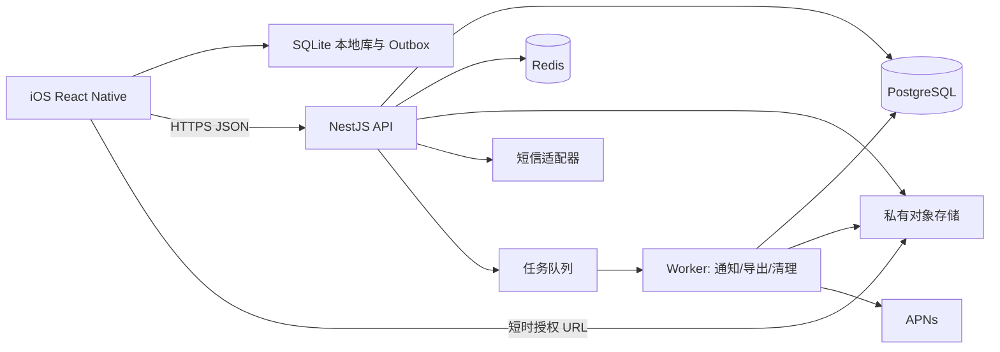

# 计划打卡 iOS V1 技术方案

| 项目 | 内容 |
| --- | --- |
| 文档状态 | 方案基线；开发前按第 18 节核对待确认项 |
| 版本 | V1.1，2026-09-27；补齐计划方向、换号验收与一次性任务原记录纠错 |
| 产品范围 | 中国大陆单一区域；首版仅交付 iOS，业务层预留 Android |
| 客户端 | React Native + TypeScript，Expo Development Build / Prebuild |
| 服务端 | TypeScript + NestJS + PostgreSQL；Redis 用于短时状态和异步任务 |
| 容量基线 | 约 1 万日活起步，可水平扩容 API 与 Worker |
| 输入文档 | [PRD](./PRD-计划打卡-iOS-v1.md)、[UI/UX 设计](./UIUX-计划打卡-iOS-v1.md)、[设计页面映射](./ui/plan-checkin-page-map.json)、[视觉节点树](./ui/plan-checkin-visual-tree.json) |

> 本文把需求文档与设计稿作为产品输入。文中的技术选型、接口字段、容量数字和运维目标属于本方案，不应反向理解为 PRD 原文。若产品规则冲突，以已确认的产品决定和 PRD 为准，并在开发前更新本文。

## 1. 目标、范围与验收口径

### 1.1 目标

交付一套可开发、可测试、可部署的前后端技术基线。它必须在跨时区、离线、多设备、规则变更及权限撤销时保持打卡与统计一致，同时让 32 张设计页面能落实到明确的数据和状态。

首版包含：手机号验证码登录、账户资料、计划与分组、三类计划打卡、补记与修订、照片和数值、统计、计划提醒、好友与逐计划分享、鼓励消息、完整 ZIP 导出、账号注销。首版 iOS 上线；Android 仅要求 TypeScript 业务层、API 与数据结构可复用，不纳入本期交付或验收。

### 1.2 非目标

不做公开动态、排行榜、群组共享、第三方登录、Web 管理端、实时聊天、复杂推荐算法、服务端图片编辑。短信供应商、对象存储供应商及部署云厂商通过接口替换，本文不绑定特定商业服务。

### 1.3 已确认的产品与工程决定

| 决定 | 本方案执行方式 |
| --- | --- |
| 手机号登录 | 大陆 `+86` 手机号与一次性短信验证码；新用户补用户名与昵称 |
| 固定日期完成率的今天 | 今天未提交不进入分母；今天有有效记录则进入统计，界面显示截止日期 |
| 计划时区 | 创建时记录 IANA 时区，创建后不可改；历史业务日期不随设备时区变化 |
| 一次性任务截止日 | 创建时仅允许计划时区的今天或未来 |
| 离线范围 | 允许新增、修改、补记打卡记录及附件暂存；计划规则、社交授权等写操作需联网 |
| 首版地区与容量 | 中国大陆单一区域，约 1 万日活作为初始容量与压测基线 |
| 数据导出 | ZIP 中含 CSV、JSON、私人照片和关系数据 |
| 一次性任务提醒 | 默认关闭 |
| 当天暂停/归档 | 立即取消当天尚未完成的打卡义务；已提交的历史记录保留 |
| 多设备同记录冲突 | 展示本机版和云端版，由用户选择；保留修订记录 |
| 账号注销 | 确认后立即停用登录及分享访问；30 天可撤销，期满永久删除业务数据和照片 |

### 1.4 质量目标（设计目标，非现状承诺）

| 指标 | 首版目标与测量方式 |
| --- | --- |
| API 可用性 | 月度 ≥99.9%，排除公告维护；由外部探测和服务端指标计算 |
| 核心读接口延迟 | 区域内 P95 <300 ms，按服务器处理时间测量；不含弱网传输 |
| 写入接口延迟 | P95 <500 ms；照片二进制上传单独计量 |
| 离线保存反馈 | 本地事务提交后立即显示“已保存在本机”，不将其误标为“已同步” |
| 数据恢复 | PostgreSQL RPO ≤15 分钟、RTO ≤4 小时；季度演练验证 |
| 可观测性 | 所有写操作具备 requestId、用户脱敏标识、幂等键、操作结果与延迟 |

以上数字在上线前用真实机型、网络及压测复核；未达标则以测量结果和改进计划更新发布门槛。

## 2. 来源映射与规则边界

| 业务领域 | 关键规则 | 主要实现位置 | 验收重点 |
| --- | --- | --- | --- |
| 固定日期计划 | 选定每周至少一天；仅有效日期生成应打卡；日常计划为七天全选 | 规则引擎、客户端日历、统计查询 | 非选定日不可提交；今天未提交不进完成率 |
| 每周目标计划 | 每周目标 1–7 次；自然周周一至周日；可超额但达成率封顶 | 规则引擎、周统计、提醒调度 | 不完整周不计达成和连续周数 |
| 一次性任务 | 仅“要做”方向；到期前待办、到期后逾期；可按时/迟完成、失败或取消 | 状态机、到期提醒 | 终态不可再打卡；逾期不产生每日缺卡 |
| 计划方向 | 循环计划可选“要做/不要做”；一次性仅“要做”；不要做的成功必须主动申报 | 创建校验、结果页文案、统计 | 不把未打开 App 自动算成功；不出现“已完成吸烟”式反义文案 |
| 补记/修订 | 只允许历史合法业务日期；一计划一日期最多一条有效记录 | 客户端表单、服务端校验、唯一索引 | 实际提交时间与业务日期分开，保留修订标记 |
| 规则变化 | 次日生效；历史按旧版本解释 | `plan_rule_versions` | 不重写历史统计口径 |
| 社交可见性 | 好友关系本身不授权；逐计划逐好友授权；照片与数值不分享 | 查询授权层、响应 DTO、对象存储签名 | 撤销/拉黑后历史记录立即不可读 |
| 离线 | 本地保存、重试、冲突可见 | SQLite outbox、幂等接口、冲突面板 | 无网可打卡、网络恢复后不重复生成 |
| 提醒 | 三类计划分别调度；暂停、归档、完成等状态停止提醒 | 客户端本地调度、服务端事件 | 每次规则/记录变化后重新计算 |
| 导出/注销 | 私有数据可完整导出；删除和注销撤销访问 | 后台导出/删除任务 | ZIP 内容、链接时效、注销后权限 |

页面实现以 [页面映射](./ui/plan-checkin-page-map.json) 的页面 ID/跳转关系为导航基线，以 [视觉节点树](./ui/plan-checkin-visual-tree.json) 的层级、文字、尺寸、颜色与组件边界为视觉核对基线。节点树中的像素坐标只用于设计对照，布局仍需适配安全区、动态字体与不同 iPhone 宽度。

## 3. 总体架构



业务核心采用单体模块化服务：认证、用户、计划、规则、打卡、统计、好友、分享、通知、导出和注销模块部署为同一 API 应用，后台 Worker 独立进程复用领域代码。初始容量不需要拆微服务；事务边界能覆盖计划和打卡写入。API 无状态，可按 CPU、内存和延迟扩容。PostgreSQL 是业务数据唯一权威；Redis 只放验证码限流、短时缓存与队列，不承载不可丢失的打卡事实。

### 3.1 技术选型与取舍

| 层 | 选择 | 依据/边界 |
| --- | --- | --- |
| iOS | React Native + TypeScript，Expo Development Build/Prebuild | 复用未来 Android 业务层，仍可配置原生权限与构建；不依赖 Expo Go 作为生产运行时。React Native 官方项目默认支持 TypeScript 与新架构：[TypeScript](https://reactnative.dev/docs/typescript)、[New Architecture](https://reactnative.dev/architecture/landing-page)。 |
| 导航和状态 | React Navigation、TanStack Query、轻量本地 UI store | 导航与服务端缓存分离；离线事实写入 SQLite，不把内存状态当持久层。依赖版本在脚手架时锁定并作兼容性验证。 |
| 本地库 | `expo-sqlite` + SQLCipher 配置；`expo-secure-store` 保存令牌与库密钥 | SQLite 支持持久化和 WAL，SQLCipher 需要自定义构建；SecureStore 使用 iOS Keychain。见 [SQLite](https://docs.expo.dev/versions/latest/sdk/sqlite/) 与 [SecureStore](https://docs.expo.dev/versions/latest/sdk/securestore/)。 |
| 通知 | `expo-notifications` 调度本地计划提醒、获取原生 APNs token；服务端直连 APNs 发送社交通知 | 避免把中国大陆首版的必需路径绑定到第三方推送中转；最终在真机与部署网络验证 APNs 可达性。见 [Expo Notifications](https://docs.expo.dev/versions/latest/sdk/notifications/)。 |
| API | NestJS REST + OpenAPI；输入 DTO 校验；领域服务与仓储分层 | 模块边界清晰，利于同一事务内处理规则与记录。NestJS 官方支持多种数据库接入：[数据库总览](https://docs.nestjs.com/data/overview)。 |
| SQL | PostgreSQL + Drizzle ORM，SQL migration | 数据约束与复杂日期查询用明确 SQL；迁移纳入代码评审。PostgreSQL 唯一性与事务行为由数据库保证：[约束](https://www.postgresql.org/docs/current/ddl-constraints.html)、[事务隔离](https://www.postgresql.org/docs/current/transaction-iso.html)。 |
| 文件 | 国内区域私有对象存储，S3 兼容接口 | 业务库仅保留对象 key、校验和、元信息；下载与上传短时授权。预签名上传原理见 [S3 官方文档](https://docs.aws.amazon.com/AmazonS3/latest/userguide/PresignedUrlUploadObject.html)。 |

依赖不写死未经验证的“最新版本”。首个代码里程碑用当时受支持的 React Native/Expo 组合创建真机样板，锁文件固定版本，完成 SQLite 加密、APNs token、相册权限、Release 构建四项冒烟后再扩展业务。

### 3.2 仓库与模块建议

```text
apps/
  mobile/                 # iOS RN 应用；后续可开 Android
  api/                    # NestJS HTTP API
  worker/                 # 后台任务与 APNs/导出/清理
packages/
  contracts/              # OpenAPI 生成类型及错误码
  domain/                 # 纯 TypeScript 日期规则/状态机/统计
  design-tokens/          # 从 UI/UX 与视觉节点树人工校准的 token
infra/
  migrations/             # PostgreSQL 迁移
  deploy/                 # IaC 与环境配置模板
docs/                     # 产品、设计、技术文档
```

`domain` 不直接访问数据库、网络、设备时间或系统时区；输入显式包含计划时区、业务日期、规则版本和服务器当前时间。客户端用它预览，服务端用它作最终校验；发布时通过同一套规则用例防止口径漂移。

## 4. 客户端方案

### 4.1 分层与页面落实

| 层 | 职责 | 禁止事项 |
| --- | --- | --- |
| 页面/组件 | 呈现设计稿状态、输入与无障碍语义 | 不自行计算服务端权威统计 |
| ViewModel/Use Case | 将页面动作映射到领域命令、处理加载/空/错误/冲突状态 | 不直接写网络请求或原始 SQL |
| Domain | 纯函数：日期合法性、计划状态、统计预览、文案状态 | 不读取设备时区作为既有计划的规则时区 |
| Repository | SQLite 读写、outbox、远端 API、缓存合并 | 不默默覆盖未同步的本地记录 |
| Platform | 通知、相册、文件、Keychain、网络状态 | 不承载业务规则 |

主导航、页面 ID、弹层和跳转按 `plan-checkin-page-map.json` 实现。页面组件至少覆盖设计文件的正常、空状态、加载、请求失败、离线、本地待同步、同步失败、冲突、权限关闭、字体放大状态。视觉 token 从设计稿提取后人工命名，如 `color.text.primary`、`spacing.card`、`radius.sheet`；设计节点 ID 记录在组件映射表，便于截图差异追踪。不能把原稿固定宽高直接写进全屏容器。

### 4.2 本地数据与渲染

本地 SQLite 表含 `local_plans`、`local_rule_versions`、`local_checkins`、`local_outbox`、`local_media`、`local_sync_cursor`、`local_permission_tombstones`。每个账户单独数据库文件，数据库密钥由系统 Keychain 管理；切换账户、注销或账户删除时清除数据库、缓存照片、密钥与通知。SQLite 开启 WAL、外键，迁移编号随应用版本管理。照片先复制到应用私有目录，记录文件 URI、大小、MIME、哈希及关联操作 ID；成功上传后按保留策略清理暂存文件。

页面优先读本地快照，网络返回后事务合并并刷新。计划、分享、好友等需联网的写操作使用“提交中”交互，服务器成功才更新权威状态；无网时明确提示不可操作。打卡记录本地事务同时写 `local_checkins` 和 `local_outbox`，失败时两者都不提交，防止出现“界面已保存但无法同步”的假成功。

同步标签统一为：`已保存在本机`、`同步中`、`已同步`、`同步失败·点击重试`、`存在冲突·选择版本`。这些标签与业务结果（成功、失败、跳过）分开；网络状态变化不能把业务结果改写。

### 4.3 手机号登录与会话

输入中国大陆手机号，服务端发送验证码并返回 `challengeId`、冷却时间和遮罩号码。验证码只在服务端校验，登录成功后返回短时 access token 与可轮换 refresh token；refresh token 放 Keychain，SQLite 不存明文令牌。新用户进入用户名唯一性检查与昵称填写；用户名唯一性以数据库约束为最终准绳，输入过程可做预检查但不能替代提交校验。账号设置提供更换手机号入口，要求验证当前身份与新号码；会话撤销、改手机号、注销均使旧 refresh token 失效。

### 4.4 日期、时间与数值输入

所有计划界面显示“按计划时区计算”，在与当前设备时区不同时展示时区提示。客户端提交 `businessDate`（`YYYY-MM-DD`）、`clientCreatedAt`（UTC）及计划/规则版本；服务端根据计划时区和规则重新判定日期合法性。日历禁用未来日期、固定计划非选定日、计划未生效/暂停/归档日；离线时基于已缓存规则预检，最终仍可能被服务器拒绝并出现可处理错误。数值使用十进制字符串加单位，不用浮点数直接累加；展示格式随界面，存储使用原始十进制值与单位标识。

### 4.5 无障碍与视觉验收

文字可随系统动态字体缩放；交互目标按 iOS 可点区域检查，状态不得仅靠颜色表达；图标按钮提供 VoiceOver 标签、状态和操作提示。输入、冲突选择、照片上传进度及同步失败需被辅助技术读到。适配刘海、底部 Home 指示条、键盘、深浅模式（若设计稿只覆盖一种，首版固定设计主题并确保系统对比度）。视觉验收选常用窄屏、标准屏、大屏三档 iPhone 做截图比对，重点核对布局、排版、间距、颜色和状态，不以像素级相等代替可读性。

## 5. 领域模型与状态机

### 5.1 共用定义

- **业务日期**：`businessDate` 是计划创建时固定 IANA 时区下的日历日期；服务端保存 `DATE`，实际发生/提交时间保存 UTC `TIMESTAMPTZ`。旅行或设备改时区不改变既有计划的业务日期。
- **日界线**：某业务日期的结束为该时区下一日 `00:00`（前闭后开）；不能简单使用固定 24 小时，因为夏令时可能变化。中国大陆首版用户也可在创建时处于其他 IANA 时区，规则引擎必须通用。
- **自然周**：业务时区周一 `00:00` 至下周一 `00:00`；以周一日期作为 `weekStartDate`。
- **规则版本**：创建时为 V1；修改计划从下一业务日期 `00:00` 生效。每条打卡引用解释该日期的规则版本；历史规则不被覆盖。
- **有效记录**：一个计划与一个业务日期最多一条当前有效记录；修改生成 revision，不额外增加当前记录数。删除计划是另一种生命周期操作。

### 5.2 计划状态

`active`、`paused`、`archived`、`deleted` 为主要生命周期。暂停/归档发生时，服务端记录 `effectiveAt` 与计划时区的 `effectiveBusinessDate`，立即停止产生尚未提交的当日义务、今日提醒及之后的义务；如当天已有已提交记录，则保留记录与其既有统计贡献，不自动删除或篡改。当天暂停或归档后即使当天又恢复，当天被取消的义务也不重新生成；新应打卡最早从下一业务日期开始。服务端以生命周期事件决定各日是否允许新打卡。补记只允许当时确属有效的历史日期。归档可查看历史，不可继续打卡；恢复归档需显式动作并生成新生命周期事件。`deleted` 对用户不可见，按删除流程清理。

### 5.3 固定日期计划

`weekdays` 为 ISO 1–7 且非空；每日即 `[1,2,3,4,5,6,7]`。在起止日期闭区间内、规则版本选择的周几且当日生命周期有效时生成 `due`。有效记录结果可为 `success`、`failure`、`skip`；无记录时今天为 `pending`，已结束的业务日期为 `unrecorded`。用户必须显式选择失败或跳过，系统不自动将未记录转成其中任何一种。非应打卡日期不接受新记录或补记。连续成功按相邻应打卡日计算，失败、跳过、未记录中断；每日计划可称“连续天数”，其他固定计划称“连续应打卡次数”。

循环计划方向为 `do`（要做）或 `avoid`（不要做）。两种方向都由用户主动选择 `success/failure/skip`，只是成功/失败的业务文案不同：要做的成功为已完成行为；不要做的成功为未发生原本要克制的行为。不要做的计划过了一天未打开 App 仍为 `unrecorded`，绝不能自动判成功。结果页按方向生成文案；计划名不适合直接拼句时使用“今天做到了/今天没有做到”的中性文案。一次性任务固定 `do`，拒绝 `avoid`。

### 5.4 每周目标计划

`weeklyTarget` 为 1–7 的整数；有效自然周内，用户可选择任意业务日期记录成功/失败/跳过，同一天最多一条有效记录。空白日期不产生“未记录”。只有整周均处于同一有效规则版本且未被计划起止、暂停、归档切断的周才进入达成率与连续周数；不完整周仅展示记录，不判失败。整周结束后，成功次数 `S` 满足 `S ≥ N` 为达成，否则未达成；展示达成率 `min(S/N, 1) × 100%`。周内目标达成后停止该周后续提醒，但仍可继续主动打卡。历史修订使 `S` 下降时重算本周提醒。

### 5.5 一次性任务

创建时 `dueDate` 必须 ≥计划时区的今天。状态 `pending` 在到期日结束前有效；过了到期日进入 `overdue`；逾期可选择 `late_completed`。到期前可 `completed`、`failed` 或 `cancelled`；失败和取消为终态，逾期选择失败/取消也为终态。终态禁止再次新建式提交，但误操作可修正**原终态记录**并保留修订审计；若是重新尝试，应新建任务。完成记录使用实际完成时间与业务日期；不产生逐日缺卡、固定计划连续打卡或每周达成统计。默认提醒关闭；开启时仅支持到期当天、提前 1 天或 3 天以及时间，若提醒落在创建时间之前则不调度。终态立即取消提醒。

### 5.6 补记、修订与统计

补记只能选择**严格早于**当前计划业务日期的日期；日期必须符合当时的规则版本与生命周期。修订允许修改既有记录，更新 `revision`、`updatedAt`、`isRevised`，并在审计表保存修改前后版本；原始 `createdAt` 不变。补记首次提交保存 `isBackfilled=true`；之后修订仍保留两个标记。好友分享视图可见状态、文字、失败原因和这两个标记，不见私人照片与数值。

固定计划完成率：统计窗口内 `successCount / (closedDueCount - skipCount)`。今天若无记录，既不进入 `closedDueCount`，也不计未记录；今天若有结果则按该结果计入。已结束的应打卡日无记录仍在分母，结果为未记录。分母为零时显示“暂无可计算数据”，不得显示 0%。统计响应带 `statisticsThroughBusinessDate`、`timezone`、分子、分母和规则版本覆盖范围；客户端不再自行猜测截止日。今日暂停/归档取消的未提交义务不进入分母；已有记录按原状保留。周统计只用完整周，未完成的当前周展示进度但不计失败。所有统计由服务端从权威记录和规则生成，可按计划/周缓存并在写入后失效。

## 6. 数据设计

### 6.1 核心表

| 表 | 关键字段 | 约束及用途 |
| --- | --- | --- |
| `users` | `id`, `phone_e164`, `username`, `nickname`, `avatar_key`, `status`, `created_at`, `deletion_due_at` | 手机号和规范化用户名分别唯一；手机号加密存储并建受控检索摘要 |
| `auth_challenges` | `id`, `phone_hash`, `code_hash`, `expires_at`, `attempts`, `consumed_at` | 短期有效；验证码不存明文 |
| `sessions` | `id`, `user_id`, `refresh_hash`, `device_id`, `expires_at`, `revoked_at` | 轮换 refresh token；可单设备撤销 |
| `devices` | `id`, `user_id`, `platform`, `apns_token`, `last_seen_at`, `notifications_enabled` | APNs token 变更时更新；失效后停发 |
| `groups` | `id`, `owner_id`, `name`, `sort_order` | 用户私有计划分组 |
| `plans` | `id`, `owner_id`, `group_id`, `kind`, `direction`, `title`, `timezone`, `start_date`, `end_date`, `due_date`, `status`, `revision`, `created_at` | 类型、方向与日期组合 CHECK；`one_time` 仅 `do`；时区创建后不可更新 |
| `plan_rule_versions` | `id`, `plan_id`, `version`, `effective_date`, `weekdays`, `weekly_target`, `numeric_config`, `created_at` | `UNIQUE(plan_id,version)`；版本时间不重叠；历史不可改 |
| `plan_lifecycle_events` | `id`, `plan_id`, `action`, `effective_at`, `business_date`, `seq` | 暂停/恢复/归档的时间与当日义务判定 |
| `checkins` | `id`, `plan_id`, `owner_id`, `business_date`, `result`, `note`, `failure_reason`, `numeric_value`, `numeric_unit`, `rule_version_id`, `is_backfilled`, `is_revised`, `revision`, `created_at`, `updated_at` | `UNIQUE(plan_id,business_date)`，当前有效记录唯一；数值用 `NUMERIC` |
| `checkin_revisions` | `id`, `checkin_id`, `revision`, `snapshot`, `actor_id`, `changed_at`, `reason` | 保存每次提交前后摘要；仅主人可读 |
| `one_time_resolutions` | `plan_id`, `resolution`, `resolved_business_date`, `resolved_at`, `note`, `revision` | `plan_id` 唯一；服务端按截止日推导按时/迟完成；失败/取消终态 |
| `one_time_resolution_revisions` | `plan_id`, `revision`, `snapshot`, `changed_at`, `reason` | 纠错原终态时保留前后版本，仅主人可读 |
| `media` | `id`, `owner_id`, `checkin_id`, `one_time_plan_id`, `object_key`, `sha256`, `mime`, `bytes`, `status` | 私有照片；`checkin_id` 与 `one_time_plan_id` 恰有一个非空，状态 `pending/ready/deleted` |
| `friend_requests` / `friendships` / `blocks` | 双方 ID、状态、时间 | 规范化用户对唯一；拉黑优先于好友 |
| `plan_shares` | `plan_id`, `friend_id`, `granted_at`, `revoked_at` | 仅活跃授权可读取；撤销保留审计事件但不保留读取权 |
| `encouragements` | `id`, `checkin_id`, `sender_id`, `owner_id`, `body`, `created_at` | 只有主人和发送好友可见，撤销分享后发送方也失去访问权限 |
| `reminder_settings` | `plan_id`, `enabled`, `weekdays`, `time_local`, `lead_days`, `revision` | 按类型限制字段和默认值 |
| `idempotency_keys` | `user_id`, `key`, `request_hash`, `status_code`, `response_json`, `expires_at` | 同键同请求回放首次响应；同键不同请求报错 |
| `change_log` | `seq`, `user_id`, `entity_type`, `entity_id`, `operation`, `payload_min`, `created_at` | `UNIQUE(user_id,seq)`；增量同步与撤销 tombstone，每账户递增 cursor |
| `export_jobs` / `deletion_jobs` | 作业状态、进度、对象 key、过期时间 | 后台任务可重试、可审计 |

对海量时间线查询建 `(owner_id, business_date DESC)`、`(plan_id, business_date DESC)`；分享查询建 `(friend_id, revoked_at, plan_id)`；`change_log` 建 `(user_id, seq)`。私有对象 key 随机生成，不能包含手机号或用户名。外键删除策略由迁移明确：计划删除异步清理私有照片和记录；关系/分享删除先提交权限撤销事件，再删除可见缓存。数据库 schema migration 均先在预发数据副本运行，禁止生产自动同步表结构。

关键约束由数据库兜底，示意如下；完整 migration 在实现阶段生成并经评审：

```sql
CREATE UNIQUE INDEX ux_checkins_plan_business_date
  ON checkins (plan_id, business_date);
CREATE UNIQUE INDEX ux_rule_version
  ON plan_rule_versions (plan_id, version);
CREATE UNIQUE INDEX ux_change_log_user_seq
  ON change_log (user_id, seq);
ALTER TABLE checkins ADD CONSTRAINT ck_checkin_result
  CHECK (result IN ('success', 'failure', 'skip'));
ALTER TABLE checkins ADD CONSTRAINT ck_checkin_revision
  CHECK (revision >= 1);
```

数据库拒绝只是最终防线，服务端仍须返回可理解的领域错误；不能把原始 SQL 异常直接展示给用户。

### 6.2 一致性与并发

所有写入在 PostgreSQL 事务内校验归属、权限、计划状态、规则版本和 `revision`。首次记录插入依赖 `(plan_id,business_date)` 唯一约束防重；修订使用 `UPDATE ... WHERE revision = :baseRevision` 的比较并交换。周统计、变更日志、幂等结果与业务写入同事务提交；照片上传本身不参加数据库事务，使用 `pending` 状态和清理作业处理孤儿对象。必要时对同一计划加行锁，防止规则编辑与打卡在同一日界线竞态。事务失败可重试可恢复错误，不能仅靠客户端防双击。

## 7. API 契约

### 7.1 通用规范

- 基础路径 `/api/v1`，HTTPS JSON；资源 ID 用 UUID，日期 `YYYY-MM-DD`，时刻 RFC 3339 UTC，时区 IANA 字符串，数值金额/计量用十进制字符串。
- 客户端写请求携带 `Idempotency-Key: UUID`、`X-Client-Request-Id`；修改资源携带 `baseRevision`。服务端返回 `requestId`、`serverTime`、资源 `revision`。分页使用 opaque cursor，不能依赖 offset 保持增量一致性。
- 错误体统一为 `{ code, message, requestId, details? }`。`message` 可展示但客户端主要按稳定 `code` 映射中文文案。用户输入错误 `400`，未认证 `401`，无权 `403`，不存在/不可见 `404`，版本冲突 `409`，限流 `429`，服务端错误 `5xx`。
- 敏感资源访问服务端每次重新做当前权限判断；不能相信客户端缓存的 `canView=true`。列表与详情都应用同一授权谓词。
- OpenAPI 文件由服务端代码生成并经 CI diff 检查；移动端使用生成的类型与手写领域映射，不从设计页面反推接口。

### 7.2 端点总览

| 领域 | 端点 | 目的 |
| --- | --- | --- |
| 登录 | `POST /auth/sms/challenges`, `POST /auth/sms/verify`, `POST /auth/refresh`, `POST /auth/logout` | 发送、验证、续期、登出 |
| 用户 | `GET /me`, `PATCH /me`, `GET /usernames/availability`, `POST /me/change-phone/challenge`, `POST /me/change-phone/confirm` | 资料与手机号维护；换号需验证当前身份与新号码 |
| 分组 | `GET /groups`, `POST /groups`, `PATCH /groups/{id}`, `DELETE /groups/{id}` | 用户私有分类，删组时计划转入默认分组 |
| 计划 | `GET /plans`, `POST /plans`, `GET /plans/{id}`, `PATCH /plans/{id}`, `POST /plans/{id}/pause`, `/resume`, `/archive`, `DELETE /plans/{id}` | 创建、编辑、生命周期、删除 |
| 打卡 | `GET /plans/{id}/calendar`, `PUT /plans/{id}/checkins/{businessDate}`, `GET /plans/{id}/checkins/{businessDate}`, `GET /plans/{id}/statistics`, `POST /plans/{id}/one-time-resolution`, `PATCH /plans/{id}/one-time-resolution` | 当日/补记/修订与统计；一次性终态新建和原记录纠错分离 |
| 照片 | `POST /media/upload-intents`, `POST /media/{id}/complete`, `DELETE /media/{id}`, `GET /media/{id}/download-url` | 授权上传、校验并绑定、私有下载 |
| 好友 | `GET /users/search?username=`, `POST /friend-requests`, `GET /friend-requests`, `POST /friend-requests/{id}/accept`, `DELETE /friends/{id}`, `POST /blocks`, `DELETE /blocks/{id}` | 精确/前缀用户名搜索与关系管理；不暴露手机号 |
| 分享/鼓励 | `PUT /plans/{id}/shares/{friendId}`, `DELETE /plans/{id}/shares/{friendId}`, `GET /friends/{id}/shared-plans`, `GET /shared-plans/{id}/checkins`, `POST /checkins/{id}/encouragements`, `GET /checkins/{id}/encouragements` | 逐计划授权、受限视图、鼓励 |
| 提醒 | `GET /plans/{id}/reminder`, `PUT /plans/{id}/reminder`, `POST /devices/push-token`, `GET/PATCH /me/notification-preferences` | 计划提醒与社交通知开关 |
| 同步 | `GET /sync/changes?cursor=&limit=`, `POST /sync/ack` | 增量变更、撤销和删除标记 |
| 数据权利 | `POST /me/exports`, `GET /me/exports/{id}`, `POST /me/deletion-request`, `POST /me/deletion-cancel`, `GET /me/deletion-status` | 导出与 30 天注销流程 |

### 7.3 核心请求示例

```http
PUT /api/v1/plans/6b3.../checkins/2026-09-27
Authorization: Bearer <access-token>
Idempotency-Key: 1f5d... 
Content-Type: application/json

{
  "result": "success",
  "note": "完成了今天的练习",
  "numeric": { "value": "35.5", "unit": "minute" },
  "mediaIds": ["e82..."],
  "baseRevision": 2,
  "clientCreatedAt": "2026-09-27T08:12:03Z",
  "clientOperationId": "0f1..."
}
```

```json
{
  "data": {
    "id": "9a7...",
    "planId": "6b3...",
    "businessDate": "2026-09-27",
    "result": "success",
    "isBackfilled": false,
    "isRevised": true,
    "revision": 3,
    "createdAt": "2026-09-27T08:00:00Z",
    "updatedAt": "2026-09-27T08:12:04Z",
    "syncSequence": 859
  },
  "requestId": "req_...",
  "serverTime": "2026-09-27T08:12:04Z"
}
```

不存在的记录允许 `baseRevision: 0`，已有记录要求当前修订号。`409 CHECKIN_CONFLICT` 返回服务端当前安全快照、`currentRevision`、本次请求摘要与冲突 ID；客户端本地原稿仍保留。用户选择“保留云端”则标记本地操作为已解决并合并云端；选择“用本机版本”时以最新 `currentRevision` 发新幂等操作，服务端将覆盖前版本记入 `checkin_revisions`。同一个 `Idempotency-Key` 重试必须返回首次结果；请求体不同则 `409 IDEMPOTENCY_KEY_REUSED`。

### 7.4 计划创建和规则更新

创建请求是类型判别联合：

```json
{
  "kind": "fixed",
  "direction": "do",
  "title": "跑步",
  "timezone": "Asia/Shanghai",
  "startDate": "2026-09-27",
  "endDate": null,
  "rule": { "weekdays": [1, 3, 5] },
  "reminder": { "enabled": true, "timeLocal": "20:00" }
}
```

`weekly` 只接受 `rule.weeklyTarget`，`one_time` 接受 `dueDate` 与默认关闭的提醒配置且 `direction` 只能是 `do`。服务端对互斥字段做严格校验，防止无效组合。`PATCH /plans/{id}` 返回 `effectiveDate`、新规则版本和客户端应重新调度提醒的标记；计划时区不可通过 PATCH 修改。标题、分组等非统计字段可以立即生效，影响应打卡日期、目标或数值约束的字段从下一业务日期生效。

一次性任务终态命令体为 `{ "resolution": "completed|failed|cancelled", "baseRevision": 0, "completedAt": "..." }`；服务端依收到时刻与计划时区判断是按时完成还是迟完成，不能由客户端自行指定 `late_completed`。`POST` 只用于首次生成终态；误操作纠错使用 `PATCH` 修改原 `one_time_resolutions` 行、递增 `revision` 并写修订审计，不可再 `POST` 第二条终态。两者均要求幂等键和版本号。失败原因若输入，只在本人记录及经授权的文字分享中展示；取消原因默认不公开。

### 7.5 错误码与界面动作

| code | 触发 | 客户端动作 |
| --- | --- | --- |
| `OTP_EXPIRED` / `OTP_INVALID` / `OTP_RATE_LIMITED` | 验证码问题 | 保留手机号，提示重发时间或剩余尝试 |
| `USERNAME_TAKEN` | 唯一索引冲突 | 定位用户名输入框 |
| `PLAN_DATE_INVALID` / `RULE_CHANGED` | 日期不合法或规则过期 | 读取最新计划并解释不能提交的原因；本机稿保留供复制 |
| `CHECKIN_CONFLICT` | 修订号不一致 | 打开双版本冲突选择，不自动覆盖 |
| `PLAN_NOT_ACTIVE` | 暂停、归档或删除 | 刷新状态；保留本机草稿，允许导出文本 |
| `SHARE_REVOKED` / `FRIEND_BLOCKED` | 分享权限变化 | 立即清除相关本地缓存并退出受限页面 |
| `MEDIA_NOT_READY` | 附件未完成上传 | 基础打卡可先同步，照片单独重试 |
| `CURSOR_EXPIRED` | 增量游标过旧 | 在保留 outbox 前提下重拉全量快照 |

## 8. 离线同步与多设备冲突

### 8.1 本地写入和重试顺序

1. 用户提交打卡，客户端基于已缓存规则预检；本地事务写入记录草稿与 outbox，立即显示“已保存在本机”。
2. 网络可用且会话有效时，按同一计划的本地操作顺序逐条发送；不同计划可并发，但每用户并发上限受控。指数退避加随机抖动，`429` 遵守 `Retry-After`。应用前台启动、恢复网络、登录续期时触发同步。
3. 服务器先检验幂等键，再按当前计划状态、业务日期、`baseRevision` 写事务。成功返回新修订与序号；客户端在本地事务里把 outbox 标记完成并替换临时 ID。网络响应丢失时用同幂等键重试。
4. 基础结果与照片分离：文本/结果先提交；图片通过 `upload-intent → 私有对象存储 → complete` 上传。照片失败只标记附件失败，不回滚已同步结果。
5. `409` 停止该记录后续操作，显示两版内容与创建/修改时间，让用户选择；其他记录继续同步。未解决冲突不悄悄合并。

后台同步只作机会性优化；iOS 可能推迟或不运行后台任务，不能保证几分钟内自动上传。应用打开或恢复网络时必定主动同步，并始终可手动重试。[Expo BackgroundTask 官方文档](https://docs.expo.dev/versions/latest/sdk/background-task/) 对系统调度的不确定性有明确说明。

### 8.2 增量拉取与权限撤销

`change_log` 对每个用户维护单调 `seq`。增量响应按 `seq` 升序，包含实体 upsert、删除 tombstone、分享撤销/拉黑事件以及 `nextCursor`。客户端先落库整页再推进 cursor；中断后可重复拉取而不重复应用。服务器始终按当前权限过滤数据；撤销分享写事务先更新授权，再提交收件人的撤销事件。已打开的好友页面在收到变更时关闭并清缓存。离线设备上的既有缓存只能在重新联网后清理，因此好友分享内容的本地缓存使用最小化、短期失效与账户加密；服务端保证撤销后再不能获取新数据或照片签名 URL，UI 文案不得承诺离线远端设备“立刻擦除”。

全量重建时先保全未同步 outbox 和本机附件，再清远端镜像表；完成后重放本地操作。账号注销/被封停时清理本地镜像，不再自动提交旧 outbox；用户可先在设备上导出未同步文本草稿，避免误以为已上云。

### 8.3 时间与冲突判定

业务合法性以服务端接收时间和计划时区为准，客户端时钟仅用于展示与诊断。无网时用户选择的“今天”可能在恢复网络后已经成为历史日期；若符合补记规则，服务端作为补记接受并标记 `isBackfilled`，否则返回可解释错误。对同一日期的两个离线新增请求，唯一索引只允许一个成功，另一个按版本冲突处理。选择本机版后的再次提交是新的显式修订，审计记录 `resolution_of_conflict_id`，因此可以追溯而不产生两条有效打卡。

## 9. 提醒与消息

### 9.1 计划提醒

提醒配置保存在服务端并增量同步。客户端只对当前设备调度未来有限窗口的本地通知；每条通知的稳定 ID 由 `planId + businessDate + reminderRevision` 派生。登录、应用回到前台、计划/打卡变化、通知权限变化与跨设备同步后，先取消过期 ID，再按服务器快照计算待调度项。通知点击只打开计划详情，所有显示数据仍重新校验权限和状态。系统通知权限拒绝时功能仍可使用，设置页显示开启引导，不反复弹系统授权。

| 类型 | 调度规则 | 取消条件 |
| --- | --- | --- |
| 固定日期 | 仅选定周几与有效日期，按计划时区的本地时间 | 当天有记录、当天暂停/归档、计划结束或删除、关闭提醒 |
| 每周目标 | 用户选定提醒周几；当前完整/进行中自然周未达到目标时调度 | 周内成功数达到目标、暂停/归档、计划结束或删除 |
| 一次性 | 默认关闭；到期日、提前 1 天或 3 天及指定时间；过去时刻不补发 | 完成、迟完成、失败、取消、暂停/归档或关闭提醒 |

本地通知由 iOS 调度并可按 ID 取消，见 [Apple 本地通知](https://developer.apple.com/documentation/usernotifications/scheduling-a-notification-locally-from-your-app)。跨设备在另一台设备完成任务后，在线设备收到变更即取消本地待发通知；长期离线设备无法立即获知，可能出现已完成后的旧提醒。此限制不能用静默推送承诺消除，通知文案只提示“查看计划”，不宣称尚未完成。上线前用双设备离线情景验证；若产品要求绝对跨设备实时取消，需改为服务端集中发送提醒并接受离线无提醒的代价。APNs 与本地通知的投递均非强保证，见 [Apple User Notifications](https://developer.apple.com/documentation/usernotifications)。

### 9.2 社交通知

好友请求、分享动态、鼓励消息三个开关独立。事件写入业务事务后的队列出站表，Worker 按接收人的当前关系、分享权限、开关与设备 token 再次校验后发送 APNs；不在事务内同步调用 APNs。短时间重复事件合并，通知 payload 不包含失败原因、私人照片、数值或完整笔记，锁屏只显示必要摘要。失败 token 按 APNs 返回码失效处理；消息中心以数据库事件为准，推送只作提醒。发送服务按 [Apple APNs 请求规范](https://developer.apple.com/documentation/usernotifications/sending-notification-requests-to-apns) 实现 token 鉴权、过期时间、折叠 ID 和重试。

## 10. 好友、分享与授权

用户名搜索默认精确匹配，允许明确输入后的有限前缀建议；响应只含用户名、昵称与可选头像，不返回手机号、计划或统计。好友请求接受后建立规范化的双向关系；拉黑优先于好友和分享，双方相关请求与分享入口立即失效。删除好友、撤销某计划分享、拉黑，均在单一事务写入权限变更和同步 tombstone。

读取好友计划的判定式为：`viewer != owner` 且当前双方为好友、互不拉黑、存在 `plan_shares(plan, viewer)` 活跃授权、计划未删除、账户未注销。每个列表项、详情、鼓励、导出和媒体 URL 生成都用同一个授权服务；不允许只在列表层过滤。分享开启前的预览必须显示将暴露的**既有**成功、失败、跳过、未记录状态与文字说明/失败原因，用户确认后才写授权。分享范围不包含照片、数值、其他计划、分组、私人统计；朋友侧接口使用专用 DTO 白名单，不能复用主人完整对象再删字段。鼓励消息仅主人和发送方可见，发送方在撤销分享或拉黑后失去读取权，主人仍可查看已收到内容。

照片仅主人可访问，签名下载 URL 生命周期短；服务端生成时核实当前账户与记录归属。旧 URL 在过期前无法由应用撤销，因此照片从不加入好友分享，注销/删除时同时删除对象。若未来扩展分享照片，需要改为代理下载或可撤销令牌，不能简单复用现有签名 URL。

## 11. 导出、删除与注销

### 11.1 完整 ZIP 导出

用户已登录后创建导出作业。Worker 从一致性快照读取本人资料、分组、计划与规则版本、生命周期、打卡当前记录和历史修订、私人照片元数据与照片文件、好友/请求/拉黑/授权关系、本人可见的鼓励消息、提醒偏好，输出 UTF-8 CSV 与 JSON，并附 `manifest.json`（生成时间、schema 版本、文件数量、SHA-256、字段说明）。不导出验证码、token、其他用户手机号或不属于本人的私有记录。照片按 `photos/<planId>/<checkinId>/<mediaId>.<ext>` 打包，ZIP 内路径不使用用户输入作为目录名。导出作业在私有对象存储保存，下载需重新认证并生成短时 URL；过期后清理 ZIP。大数据导出分段流式写入，设置单用户并发上限、总大小与失败重试，不把整个 ZIP 读入 API 内存。

### 11.2 删除单个计划

删除计划是不可逆的显式二次确认。API 首先在事务中撤销所有分享、写删除 tombstone、标记计划不可读并排队清理；后台清除该计划的记录、修订、数值、照片对象和提醒。归档只改变生命周期，历史保留。删除后好友读接口立即 `404`；物理对象清理可异步，但不得再签发下载 URL。客户端收到 tombstone 后清除本地镜像与通知。若 Worker 失败，作业重试并报警。

### 11.3 账号注销

用户确认注销后，服务端立即将账户设为 `deletion_pending`、撤销全部会话、禁用登录与社交读取、撤销所有分享、停止通知，记录 30 天到期时间。期间只开放通过同手机号重新验证后的专用撤销注销流程；普通业务 API 均拒绝。期满 Worker 先再次确认状态与到期时间，再删除云端业务数据及照片、关系和设备 token，并生成不可逆完成记录。备份中的数据按备份生命周期自然过期，恢复备份时必须重放删除墓碑，避免账号复活；具体备份留存周期在运营合规审查后固化。手机号在可撤销期内保留占用，防止新账户混淆。

30 天可撤销是本产品决定，实施前需由法务核对隐私政策与适用删除义务；在等待期仅为撤销目的保留必要数据，不再用于提醒、分享或分析。中国《个人信息保护法》包含查阅、复制和删除权要求，参见[工业和信息化部转载法条](https://www.miit.gov.cn/jgsj/zfs/fl/art/2022/art_515a4b20c12f430eab54bb4f56d89f56.html)。本文不将该等待期表述为已完成法律合规审查。

## 12. 安全、隐私与滥用防护

| 风险 | 控制 |
| --- | --- |
| 验证码枚举/轰炸 | 手机号、IP、设备维度发送与校验限流；统一响应避免账户存在性泄露；短有效期、尝试次数上限、验证码哈希存储；供应商回执与成本告警 |
| 会话盗用 | access token 短期有效、refresh token 哈希入库且轮换；Keychain 存储；异地异常/注销撤销所有会话；仅 HTTPS |
| 越权读取 | 所有资源以 ownerId/当前分享权限从数据库校验；接口对象级授权测试；朋友 DTO 白名单；私有 bucket 默认拒绝公共访问 |
| 离线数据泄露 | SQLite SQLCipher、Keychain 密钥、iOS 文件保护、应用锁屏快照遮罩敏感页面、退出登录清理；不在日志写明文手机号/笔记/照片 URL |
| 上传滥用 | MIME 魔数校验、大小和数量上限、图片重编码去 EXIF（如产品不需位置信息）、哈希校验、短时上传授权、孤儿文件清理 |
| 注入/重放 | 参数化 SQL、DTO 校验、幂等键、签名 URL 限定对象与操作、客户端不接收任意对象 key |
| 数据导出泄露 | 导出前再次认证、短时下载 URL、ZIP TTL、访问审计、不在推送或短信放下载链接 |
| 社交骚扰 | 好友请求与鼓励频控、拉黑即时生效、文本长度限制及必要的内容治理入口 |

安全验证以 [OWASP MASVS](https://mas.owasp.org/MASVS/) 的存储、认证、网络与隐私控制项为检查清单，并对 API 做对象级授权和速率限制测试。生产密钥放专用密钥管理服务，配置分环境隔离；APNs、短信、对象存储凭据不得进入客户端包或 Git。错误日志、链路追踪和分析事件只用脱敏/哈希用户标识，设置最短必要保留周期与访问审计。

## 13. 部署与运维

### 13.1 环境和拓扑

开发、预发、生产三环境隔离，生产部署在中国大陆单一区域的两个可用区：公网入口/WAF → 负载均衡 → 多副本 API；内网 PostgreSQL 主库与同步高可用副本、Redis、Worker、私有对象存储。数据库与对象存储定期备份并做跨可用区恢复演练。初始建议 API 2 个副本、Worker 2 个副本；CPU/内存和请求量不是唯一扩容信号，还要看 P95 延迟、数据库连接、队列滞留与短信/推送失败。业务流量增长到远高于 1 万日活时先基于实测扩容，不预先拆分服务。

生产配置以环境变量/密钥服务注入，IaC 管理网络、实例、数据库、对象存储权限与监控；数据库 migration 采用向前兼容的 expand → deploy → contract 流程。部署顺序是迁移兼容字段、服务端、客户端；旧客户端至少一个支持周期内可用。发布以 TestFlight 分组灰度，支持服务端 feature flag 和回滚应用版本；数据库回滚优先用兼容迁移，不依赖直接倒退数据。

### 13.2 监控与告警

监控 API 5xx、P95/P99、数据库锁等待/连接、Redis 可用性、outbox 同步失败与冲突率、媒体 orphan、导出/删除作业滞留、短信发送成功率、APNs 错误码、客户端崩溃与启动耗时。每条写入路径透传 requestId，业务日志带 `planId` 的不可逆摘要、操作类型、结果和版本号。告警分级：业务写入不可用、权限泄露疑似、注销清理超时为高优先；通知投递失败、视觉回归为较低优先。所有个人信息字段默认不进日志。

### 13.3 容量粗算与压测

以 1 万 DAU、每人每天平均 5 次读请求和 1 次写请求估算，日均约 6 万次 API 请求，平均不足 1 RPS；峰值按至少 50 倍均值建模，首轮压测目标 50 RPS 混合负载并留扩容余量。该计算只用于测试起点，不代表真实使用分布。压测分别覆盖首页计划列表、日历/统计聚合、同计划并发打卡、增量同步、好友分享列表、照片直传与导出作业。记录数据库查询计划和索引命中率；若 P95 超标，先查慢 SQL/连接池，再扩容 API。短信、APNs 与对象存储使用沙箱或限量真机验证，不在压测中对外发送。

## 14. 测试与验收矩阵

测试层级：`domain` 用纯函数表驱动测试覆盖日期/状态/统计；API 用真实 PostgreSQL 容器跑迁移与并发事务测试；移动端做关键交互与 SQLite 迁移测试；真机做通知、离线、相册、权限、动态字体与跨时区测试。只对有业务风险的路径写自动化用例，避免把界面实现细节逐项复制为测试。

| 编号 | 场景与步骤 | 预期结果 |
| --- | --- | --- |
| T01 | 固定计划选周一/周三，在周二尝试提交 | 客户端禁用，直接调 API 也返回 `PLAN_DATE_INVALID` |
| T02 | 固定计划今日无记录查看完成率，随后提交成功 | 提交前今日不进分母；提交后计入；返回统计截止日期与时区 |
| T03 | 已结束应打卡日无记录、失败、跳过各一 | 未记录/失败在分母，跳过不在分母；三者都中断连续成功 |
| T04 | 周三创建每周目标 3 次，本周只完成 1 次 | 本周显示进度，不计最终失败/连续周；下一个完整周才纳入 |
| T05 | 完整周目标 3 次，成功 4 次；再把一次成功修订为失败 | 达成率先为 100%，修订后仍 100%；若降到 2 次则未达成并重算提醒 |
| T06 | 修改固定周几或每周目标 | 修改从下一计划业务日期生效，历史日期仍用旧规则 |
| T07 | 今天未提交时暂停/归档 | 当日待打卡立即取消，日终不记未记录，通知取消；已提交的今日记录不删除 |
| T08 | 暂停期间尝试补记该日期；恢复后补记暂停前合法日期 | 前者拒绝，后者允许；恢复不追补取消的当日义务 |
| T09 | 创建一次性任务，截止日为昨天；到期后完成 | 创建拒绝过去日期；有效任务逾期完成显示迟完成，终态不再提醒 |
| T10 | 在历史合法日期补记并再次修订 | `businessDate` 与 `createdAt` 不混淆，`isBackfilled`、`isRevised` 同时为真；只存在一条有效记录 |
| T11 | 断网保存打卡与照片，强制退出并重启 | 结果和照片暂存仍在，本机保存状态正确；联网后基础记录先同步，照片独立上传 |
| T12 | 服务器已保存但客户端丢响应，原幂等键重试 | 返回首次结果，记录数和统计不翻倍 |
| T13 | 两台设备离线修改同一日期并分别同步 | 后到者收到冲突；显示两版，用户选择后只保留一条有效记录，修订历史可追溯 |
| T14 | 设备时区变化、夏令时切换、跨业务日边界 | 既有计划仍按创建时区判定日期；日界线使用时区库而非加 24 小时 |
| T15 | 只加好友而不分享计划；分享后查看历史失败原因 | 前者不可读；分享预览与朋友侧可读授权范围内的状态/文字/失败原因 |
| T16 | 分享后查询朋友侧 JSON、照片 URL 与数值字段 | 响应不含照片、数值、其他计划或私人统计；照片 URL 请求拒绝 |
| T17 | 撤销分享、删好友、拉黑时朋友已打开详情 | 服务端立即拒绝新读；在线客户端收到 tombstone 后清缓存和退出页面 |
| T18 | 计划提醒在打卡、周目标达成、暂停、归档、终态后 | 本机待发通知取消/重算；通知权限关闭不影响打卡 |
| T19 | 完整 ZIP 导出并校验 manifest | CSV/JSON/私人照片/关系数据齐全，哈希吻合，不含 token/验证码/他人手机号 |
| T20 | 注销后访问旧 token；30 天内撤销；期满运行删除 Worker | 旧 token 立即失效、分享不可读；撤销经短信验证恢复；到期后业务数据和对象被清理 |
| T21 | 多设备/弱网高并发写同计划同日 | 唯一约束维持单有效记录，冲突返回稳定错误，无重复通知或变更日志 |
| T22 | 旧版本升级到新客户端，数据库 migration 中途失败 | 可恢复/可重试，本机未同步 outbox 与附件不丢失 |

另外执行三类专项检查：① 设计稿 32 页与页面映射逐项勾选，建立“页面 ID → RN screen/component → API/state → 截图”的对照表；② 账号越权测试覆盖列表、详情、导出、对象 URL 和旧 cursor；③ 真实 iPhone 在无网、系统杀进程、通知权限拒绝、低电量、字体放大、时区切换条件下走完整主流程。

### 14.1 发布门槛

阻断级：T01–T20 核心场景通过；数据库迁移与备份恢复演练完成；所有分享/照片越权用例为零；注销清理作业可重试；真机 Release 构建通过；关键页面无内容遮挡；崩溃率与 API 指标达到第 1.4 节目标。T21/T22 若发现数据丢失或重复记录同样阻断。非阻断视觉细节需记录差异与修复版本，不得影响信息层级和可操作性。

## 15. 实施顺序与交付物

| 阶段 | 主要工作 | 可审查交付物/退出条件 |
| --- | --- | --- |
| M0 基线 | 建 monorepo、Expo 真机样板、NestJS、PostgreSQL/Redis、CI、OpenAPI、设计 token | iOS Release 构建；SQLite 加密、Keychain、APNs、相册四项冒烟通过 |
| M1 核心领域 | 实现账户、计划/规则版本、生命周期、打卡、统计纯函数与 migration | T01–T10、T14 在真实数据库和纯函数测试通过 |
| M2 客户端主流程 | 登录、首页、计划表单、日历、记录、统计、同步状态、视觉对齐 | 设计主链路可用；离线本机保存和恢复可演示 |
| M3 同步与媒体 | Outbox、幂等、冲突 UI、照片直传与清理 | T11–T13、T21–T22 通过，双设备真机演示 |
| M4 社交与提醒 | 好友、分享预览/授权、鼓励、三类通知 | T15–T18 与越权专项通过 |
| M5 数据权利与上线 | 导出、删除、注销、压测、备份恢复、灰度和隐私文案 | T19–T20、发布门槛与运营手册完成 |

每阶段同时更新 API schema、数据迁移、页面映射状态和测试结果。前后端可以在 OpenAPI 与领域规则冻结后并行开发；不能以静态设计稿替代真实同步/权限状态验收。

## 16. 主要风险与处置

| 风险 | 影响 | 处置/验证 |
| --- | --- | --- |
| React Native/Expo 某版本与 SQLCipher 或通知插件不兼容 | 离线安全、构建受阻 | M0 真机样板先验证并锁版本；必要时写原生模块，保留 RN 业务层 |
| iOS 对后台任务和通知投递无硬保证 | 延迟同步、提醒缺失或旧提醒 | 前台/网络恢复主动同步；明确本地状态；真机与双设备测试；监控 APNs 投递反馈 |
| 规则版本、暂停、时区造成统计口径分叉 | 用户看到不同完成率 | 服务端同一 `domain` 规则引擎；基于日期矩阵测试；统计响应包含口径元数据 |
| 多设备离线修改与附件并发 | 覆盖或重复照片 | 修订号比较并交换、显式冲突、照片状态机、幂等键与孤儿清理 |
| 分享撤销与旧缓存/旧 URL | 朋友看到过期内容 | 服务端每次授权；tombstone 清缓存；照片本就不分享；不承诺离线设备即时清除 |
| 30 天注销等待与删除义务 | 产品/法律解释冲突 | 上线前法务审核撤销期文案与清理计划；等待期停用处理；到期作业与备份墓碑演练 |
| 单区故障 | 服务不可用 | 双可用区、多副本、备份恢复与故障演练；跨区容灾列后续版本评估 |

## 17. 决策记录

| ID | 决定 | 理由/后果 |
| --- | --- | --- |
| ADR-01 | RN + TypeScript，首版仅 iOS | 满足用户选型并保留 Android 复用；需提前验证原生集成 |
| ADR-02 | NestJS 模块化单体 + PostgreSQL | 初期容量下事务和维护成本可控；以后可按模块拆分 |
| ADR-03 | SQLite 本地事实 + outbox，服务端最终权威 | 支持断网写入和明确同步状态；存在需处理的冲突 |
| ADR-04 | 规则版本与 IANA 计划时区不可变 | 避免历史业务日期和统计因设备变化漂移 |
| ADR-05 | 多设备冲突由用户选择 | 不静默丢失记录；客户端需完整冲突界面 |
| ADR-06 | 社交读取逐计划授权并实时校验 | 好友关系不等于计划可见；撤销立即阻断服务端读取 |
| ADR-07 | 照片私有直传、记录先于照片提交 | 弱网下保住基础打卡；需孤儿对象清理 |
| ADR-08 | 暂停/归档当日立即取消未提交义务 | 符合用户选择；已提交记录保留，统计须识别当日事件 |
| ADR-09 | 注销立即停用、30 天可撤销、期满删除 | 满足用户选择；上线前复核隐私与法务口径 |

## 18. 开发前核对清单

本轮产品问题已得到回答，技术方案按上述决定编制。进入编码前还需做以下**实施核对**，不改变已确认的业务规则：

1. 用真机样板确认所选 React Native/Expo 版本与 SQLCipher、Keychain、APNs、相册和 Release 构建兼容，并在锁文件记录确切版本。
2. 产品与设计核对设计文件 32 页的页面 ID、状态和缺失的异常/离线/冲突画面；必要时补设计，不临时改业务口径。
3. 安全与法务核对中国大陆短信接入、隐私政策、30 天注销撤销期、备份留存及个人信息处理告知；审查结论落到配置和用户文案。
4. 运维用预发演练验证备份恢复、导出 ZIP 清理、照片孤儿清理、账号注销及分享撤销的端到端行为。
5. 为实际选定的云资源记录区域、对象存储接口兼容性、短信供应商限额、APNs 出口可达性与容量压测基线。

## 19. 参考资料

- 产品输入：[PRD V1.1](./PRD-计划打卡-iOS-v1.md)、[UI/UX V1](./UIUX-计划打卡-iOS-v1.md)、[页面映射](./ui/plan-checkin-page-map.json)、[完整视觉节点树](./ui/plan-checkin-visual-tree.json)、[Pen 可编辑设计](./ui/plan-checkin.pen)。
- 官方技术资料：[React Native TypeScript](https://reactnative.dev/docs/typescript)、[React Native New Architecture](https://reactnative.dev/architecture/landing-page)、[Expo SQLite](https://docs.expo.dev/versions/latest/sdk/sqlite/)、[Expo SecureStore](https://docs.expo.dev/versions/latest/sdk/securestore/)、[Expo Notifications](https://docs.expo.dev/versions/latest/sdk/notifications/)、[Expo BackgroundTask](https://docs.expo.dev/versions/latest/sdk/background-task/)。
- 服务端与安全：[NestJS 数据库](https://docs.nestjs.com/data/overview)、[PostgreSQL 约束](https://www.postgresql.org/docs/current/ddl-constraints.html)、[PostgreSQL 事务隔离](https://www.postgresql.org/docs/current/transaction-iso.html)、[OWASP MASVS](https://mas.owasp.org/MASVS/)、[Apple User Notifications](https://developer.apple.com/documentation/usernotifications)、[S3 预签名上传](https://docs.aws.amazon.com/AmazonS3/latest/userguide/PresignedUrlUploadObject.html)。
