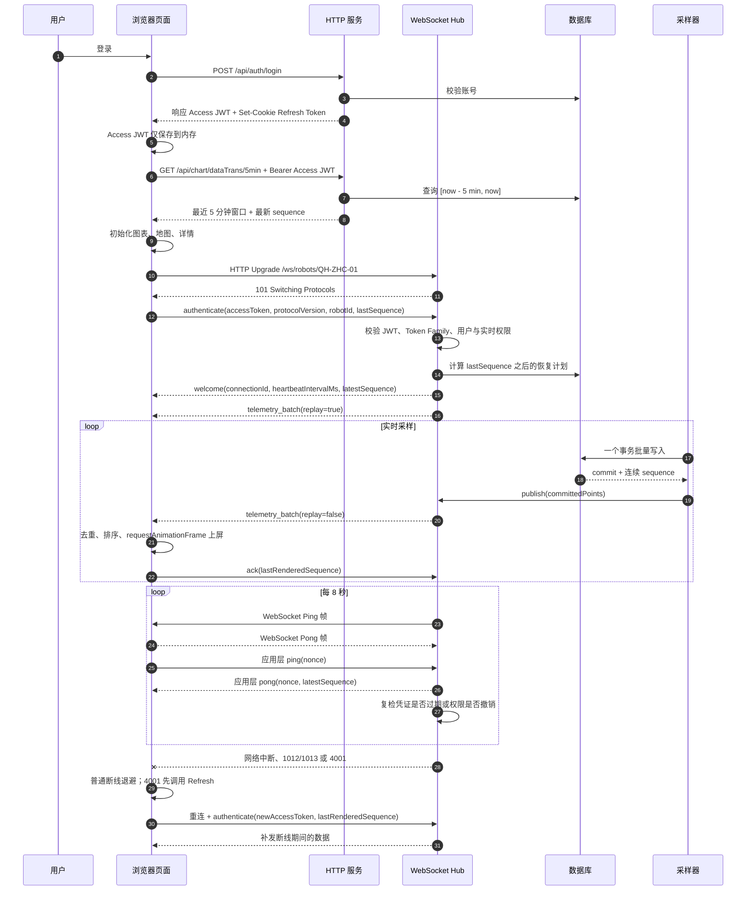

# 走航车实时数据完整链路：WebSocket、JWT 鉴权、心跳与指数退避重连

## 1. 先说明代码现状

这个项目中存在两套后端代码：

- **当前活动运行时：** `QHZHC_Server`，技术栈是 Node.js、Express、`ws` 和 SQLite。它已经实现 WebSocket 握手、双层心跳、指数退避重连、序号续传、缺口补发、HTTP 快照恢复和背压保护，但鉴权凭证是服务端生成的随机 Session Token，不是 JWT。
- **旧版参考运行时：** `legacy-reference/QHZHC_Server_Django`，技术栈是 Django、Channels、Simple JWT 和 PostgreSQL。它实现了 JWT Cookie 鉴权和按命令鉴权，但没有当前 Node.js 版本中的心跳、序号续传与退避重连能力。

因此，“WebSocket + JWT 鉴权 + 心跳 + 指数退避重连”的目标方案，不是当前某一个目录原样具备的能力，而是：

1. 使用短期 Access JWT，并且只保存在前端内存；
2. 使用 `HttpOnly` Refresh Cookie，并通过服务端状态实现单次轮换和 Token Family 重放撤销；
3. 采用当前 Node.js 版本的连接、心跳、续传、补洞、背压和渲染机制；
4. 将 WebSocket 鉴权移到连接成功后的第一条 `authenticate` 消息；
5. 增加 HTTP 自动刷新、权限撤销和 WebSocket 认证恢复状态。

详细设计见 [`Access JWT、单次 Refresh Token 与 WebSocket 首帧鉴权设计`](./superpowers/specs/2026-08-27-access-refresh-token-websocket-auth-design.md)。下文同时区分当前 Session 实现与待落地的目标实现。

## 2. 关键代码地图

| 职责 | 当前活动代码 |
| --- | --- |
| 服务启动与依赖装配 | [`QHZHC_Server/src/server/index.ts`](../QHZHC_Server/src/server/index.ts) |
| HTTP 登录与 Token 生命周期 | [`QHZHC_Server/src/server/app.ts`](../QHZHC_Server/src/server/app.ts)、[`auth.ts`](../QHZHC_Server/src/server/auth.ts) |
| WebSocket Upgrade、协议握手、心跳、补传、背压 | [`robot-socket-hub.ts`](../QHZHC_Server/src/server/robot-socket-hub.ts) |
| 消息协议与关闭码 | [`QHZHC_Server/src/shared/protocol.ts`](../QHZHC_Server/src/shared/protocol.ts) |
| 序号恢复计划 | [`QHZHC_Server/src/server/replay-plan.ts`](../QHZHC_Server/src/server/replay-plan.ts) |
| 事务写入、最近数据与序号查询 | [`QHZHC_Server/src/server/database.ts`](../QHZHC_Server/src/server/database.ts) |
| 数据生成后主动发布 | [`QHZHC_Server/src/server/simulator.ts`](../QHZHC_Server/src/server/simulator.ts) |
| 前端连接状态机、心跳、重连、HTTP 恢复 | [`QHZHC_Web/src/views/DataVisualization/services/realtimeClient.ts`](../QHZHC_Web/src/views/DataVisualization/services/realtimeClient.ts) |
| 前端乱序缓冲与去重 | [`OrderedTelemetryBuffer.ts`](../QHZHC_Web/src/views/DataVisualization/services/OrderedTelemetryBuffer.ts) |
| 前端按帧消费 | [`FrameTelemetryQueue.ts`](../QHZHC_Web/src/views/DataVisualization/services/FrameTelemetryQueue.ts) |
| 页面初始化与 5 分钟窗口 | [`dataVisualization.vue`](../QHZHC_Web/src/views/DataVisualization/dataVisualization.vue)、[`historyApi.ts`](../QHZHC_Web/src/views/DataVisualization/services/historyApi.ts) |
| 旧版 JWT Cookie 中间件 | [`legacy-reference/QHZHC_Server_Django/api_auth/middleware.py`](../legacy-reference/QHZHC_Server_Django/api_auth/middleware.py) |
| 旧版 WebSocket 权限检查 | [`legacy-reference/QHZHC_Server_Django/api_chart/consumers.py`](../legacy-reference/QHZHC_Server_Django/api_chart/consumers.py) |

## 3. 整体时序



## 4. 第 1 步：登录并建立认证上下文

### 4.1 当前活动代码

当前 `AuthService.login()` 的流程是：

1. 查询用户并校验密码；
2. 生成 32 字节随机 Token；
3. 数据库只保存 Token 的 SHA-256 摘要和过期时间；
4. HTTP 响应通过 `qhzhc_session` Cookie 返回原始 Token；
5. Cookie 设置 `HttpOnly`、`SameSite=Lax`、过期时间和根路径。

浏览器 JavaScript 不能读取 `HttpOnly` Cookie，但后续同源 HTTP 请求和 WebSocket Upgrade 请求会自动携带它。这比把凭证拼到 `?token=` 中更安全，因为 URL 更容易进入代理日志、浏览器记录和监控系统。

### 4.2 目标 Access JWT + Refresh Token 版本

登录接口签发短期 Access JWT，并在响应体中返回。前端只把它保存在模块内存。JWT 至少包含：

```ts
interface AccessClaims {
  sub: string;             // 用户 ID
  sid: string;             // Token Family ID
  role: "admin" | "operator";
  aud: "qhzhc-api";        // 受众
  iss: "qhzhc-auth";       // 签发方
  exp: number;             // 过期时间
  iat: number;             // 签发时间
  jti: string;             // Token 唯一 ID
}
```

Refresh Token 是高熵随机字符串，通过 `HttpOnly` Cookie 保存。服务端只保存其摘要，并把连续轮换产生的 Token 组织为 Token Family。

```ts
async function login(request, response) {
  const user = await verifyPassword(request.body);
  if (!user || !user.active) {
    return response.status(401).json({ code: "INVALID_CREDENTIALS" });
  }

  const refreshToken = randomBytes(32).toString("base64url");
  const familyId = randomUUID();
  const familyExpiresAt = Date.now() + 7 * 24 * 60 * 60 * 1000;
  await refreshTokens.create({
    tokenHash: sha256(refreshToken),
    familyId,
    userId: user.id,
    expiresAt: familyExpiresAt,
  });

  const accessToken = signJwt(
    {
      sub: String(user.id),
      sid: familyId,
      role: user.role,
    },
    env.JWT_SIGNING_KEY,
    {
      algorithm: "HS256",
      issuer: "qhzhc-auth",
      audience: "qhzhc-api",
      expiresIn: "15m",
      jwtid: randomUUID(),
    },
  );

  response.cookie("qhzhc_refresh", refreshToken, {
    httpOnly: true,
    secure: true,
    sameSite: "lax",
    path: "/api/auth",
    maxAge: 7 * 24 * 60 * 60 * 1000,
  });
  response.json({
    accessToken,
    accessTokenExpiresAt: Date.now() + 15 * 60 * 1000,
    user: publicProfile(user),
  });
}
```

Access JWT 用于短期身份校验；Refresh Token 只保存摘要，并在每次刷新时原子轮换。旧 Token 再次出现时，服务端撤销整个 Token Family。生产环境必须从 Secret 管理系统注入签名密钥，并固定允许的算法、`issuer` 和 `audience`。不能接受 JWT Header 自报的任意算法。

旧 Django 代码已经体现了核心过程：`LoginView` 使用 `RefreshToken.for_user(user).access_token` 生成 JWT，`JWTAuthMiddleware` 使用 `AccessToken(token)` 验签并读取 `user_id`，然后重新查询用户及 `is_active` 状态。

### 4.3 单次 Refresh Token 轮换

Access JWT 到期后，前端不读取 Refresh Token，而是调用刷新接口。浏览器自动携带 `HttpOnly` Cookie，服务端原子消费旧 Token 并返回一组新凭证：

```ts
async function refresh(request, response) {
  const oldToken = parseCookie(request.headers.cookie).qhzhc_refresh;
  if (!oldToken) return response.status(401).json({ code: "REFRESH_TOKEN_INVALID" });

  const rotation = database.rotateRefreshToken({
    oldTokenHash: sha256(oldToken),
    createToken: () => randomBytes(32).toString("base64url"),
  });

  if (rotation.kind === "reused") {
    database.revokeTokenFamily(rotation.familyId);
    return response.status(401).json({ code: "REFRESH_TOKEN_REUSED" });
  }
  if (rotation.kind !== "rotated") {
    return response.status(401).json({ code: rotation.code });
  }

  const accessToken = signAccessJwt(rotation.user, rotation.familyId);
  response.cookie("qhzhc_refresh", rotation.refreshToken, refreshCookieOptions);
  response.json({ accessToken, accessTokenExpiresAt: rotation.accessTokenExpiresAt });
}
```

前端使用一个全局 Promise 合并并发刷新。第一个 `401` 发起 Refresh，其余请求等待同一个结果；刷新成功后，每个原请求分别携带新 Access JWT 重试一次。

## 5. 第 2 步：完成 WebSocket HTTP Upgrade

WebSocket 建连并不是直接脱离 HTTP。浏览器先发送 HTTP/1.1 Upgrade 请求：

```http
GET /ws/robots/QH-ZHC-01 HTTP/1.1
Host: api.example.com
Origin: https://dashboard.example.com
Upgrade: websocket
Connection: Upgrade
Sec-WebSocket-Version: 13
Sec-WebSocket-Key: <random-base64>
```

目标方案在 Upgrade 阶段只完成传输层连接：

1. URL 是否匹配 `/ws/robots/:robotId`；
2. `Origin` 是否在前端域名白名单中；
3. 路径合法后调用 `handleUpgrade()`；
4. 新连接进入 `CONNECTED_UNAUTHENTICATED` 状态；
5. 5 秒内未完成首条消息鉴权就关闭连接。

```ts
server.on("upgrade", (request, socket, head) => {
  const url = new URL(request.url ?? "/", "https://api.example.com");
  const match = /^\/ws\/robots\/([A-Za-z0-9_-]+)$/.exec(url.pathname);
  if (!match) return rejectUpgrade(socket, 404);
  if (!allowedOrigins.has(request.headers.origin ?? "")) {
    return rejectUpgrade(socket, 403);
  }

  wss.handleUpgrade(request, socket, head, (webSocket) => {
    acceptUnauthenticatedConnection(webSocket, match[1]);
  });
});
```

当前 Node.js 代码对应 [`robot-socket-hub.ts` 第 57～77 行](../QHZHC_Server/src/server/robot-socket-hub.ts#L57-L77)，仍在 Upgrade 阶段校验 Session Cookie；目标实现会将用户鉴权移到连接后的第一条消息。

> 浏览器原生 `WebSocket` API 不能设置自定义 `Authorization` 请求头。本方案因此把内存 Access JWT 放进加密的 WSS 首条消息，不把 JWT 放进 URL，也不让 Refresh Token进入 WebSocket。

## 6. 第 3 步：完成应用层 `authenticate/welcome` 握手

HTTP Upgrade 只证明传输通道已经建立。用户身份、权限和业务协议由第一条应用消息统一验证。

### 6.1 客户端发送 `authenticate`

`onopen` 只表示 TCP/TLS 与 HTTP Upgrade 成功。客户端立即发送：

```json
{
  "type": "authenticate",
  "accessToken": "<access-jwt>",
  "protocolVersion": 1,
  "robotId": "QH-ZHC-01",
  "lastSequence": 12840
}
```

其中 `lastSequence` 必须是**最后已经完成页面消费的采样点序号**，不能是最后收到但仍在缓冲区中的序号。

### 6.2 服务端验证 `authenticate`

服务端接受连接后启动 5 秒定时器。5 秒内没有合法 `authenticate`，或者第一条消息不是 `authenticate`，就以协议错误关闭连接。服务端依次检查：

- Access JWT 的算法、签名、`iss`、`aud` 和 `exp`；
- `sid` 对应的 Token Family 是否有效；
- 用户是否存在且拥有实时数据权限；
- `protocolVersion` 必须等于当前协议版本；
- `robotId` 必须与 URL 中的车辆 ID 相同；
- `lastSequence` 必须是大于等于 0 的安全整数；
- 同一个连接只能初始化一次。

### 6.3 服务端返回 `welcome`

```json
{
  "type": "welcome",
  "protocolVersion": 1,
  "connectionId": "5d91...",
  "robotId": "QH-ZHC-01",
  "heartbeatIntervalMs": 8000,
  "latestSequence": 12847,
  "resumedFrom": 12840
}
```

收到 `welcome` 后，客户端才进入 `connected` 状态、清零重连次数并启动应用层心跳。这可以避免把“Socket 已打开”误判为“业务连接已就绪”。

## 7. 第 4 步：初始化最近 5 分钟数据

### 7.1 当前代码采用 HTTP 快照优先

页面进入实时模式时，执行顺序是：

1. `fetchFiveMinuteWindow()` 请求 `/api/chart/dataTrans/5min`；
2. 服务端令 `to = 请求时间或当前时间`，`from = to - 5 分钟`；
3. 数据库按时间范围查询，最多返回 300 个展示点；数据量过大时均匀采样并保留首尾；
4. 页面一次性初始化图表、2D/3D 地图、详情和天气定位；
5. 页面取窗口最后一点的 `sequence` 创建 `RealtimeClient`；
6. WebSocket `authenticate.lastSequence` 使用该值；
7. HTTP 查询完成到 WebSocket 建连之间的新数据，由服务端 replay 补齐。

核心伪代码：

```ts
async function enterRealtimeMode() {
  let initialSequence = 0;

  try {
    const window = await GET("/api/chart/dataTrans/5min");
    renderWholeWindow(window.data);
    initialSequence = window.data.at(-1)?.sequence ?? 0;
  } catch {
    // WebSocket 会从 0 尝试恢复，过大时再走 gap + HTTP 快照。
  }

  const client = new RealtimeClient({
    url: "wss://api.example.com/ws/robots/QH-ZHC-01",
    initialSequence,
    onPacket: appendRealtimePoints,
  });
  client.start();
}
```

这种“先快照、后订阅、用序号补齐中间空档”的方式，首屏完整且不会漏掉快照之后产生的数据。

### 7.2 服务端主动推送窗口的可选方案

如果要求所有初始化数据都由 WebSocket 主动推送，可把窗口要求放进 `authenticate`：

```json
{
  "type": "authenticate",
  "accessToken": "<access-jwt>",
  "protocolVersion": 1,
  "robotId": "QH-ZHC-01",
  "lastSequence": 0,
  "bootstrap": { "type": "time-window", "seconds": 300 }
}
```

服务端必须先确定快照水位，再查询窗口，避免快照和实时流之间丢数据：

```ts
async function handleAuthenticate(context, message) {
  const principal = await verifyAccessJwt(message.accessToken);
  assertTokenFamilyActive(principal.sid);
  authorizeCommand(principal, "telemetry:realtime", message.robotId);

  const watermark = database.latestSequence(message.robotId);
  const snapshot = database.queryRecentWindow({
    robotId: message.robotId,
    seconds: 300,
    throughSequence: watermark,
    limit: 300,
  });

  send(context, { type: "welcome", latestSequence: watermark, ...metadata });
  send(context, {
    type: "snapshot",
    firstSequence: snapshot.at(0)?.sequence ?? watermark,
    lastSequence: watermark,
    points: snapshot,
  });

  context.nextSequence = watermark + 1;
  context.initialized = true;
  flushBufferedLivePointsAfter(context, watermark);
}
```

关键不是“用 HTTP 还是 WebSocket”，而是快照必须带水位 `watermark`，后续实时流严格从 `watermark + 1` 开始。

当前活动代码没有 `snapshot` 消息；最近 5 分钟由 HTTP 返回，WebSocket 负责序号 replay 和后续实时推送。

## 8. 第 5 步：事务提交后主动推送实时采样点

当前模拟器默认每秒生成 20 点，每 250 ms 形成一个批次。完整路径是：

```text
TelemetrySimulator.tick()
  -> generate(count)
  -> AppDatabase.insertTelemetry(points)
  -> BEGIN IMMEDIATE
  -> INSERT，每点获得 sequence
  -> COMMIT
  -> RobotSocketHub.publish(committedPoints, status)
  -> 按 robotId 过滤
  -> telemetry_batch
```

必须先提交数据库，再广播。否则客户端可能收到一批最终被回滚的“幽灵数据”，断线后也无法从数据库 replay。

实时批次格式：

```json
{
  "type": "telemetry_batch",
  "batchId": "e87a...",
  "firstSequence": 12848,
  "lastSequence": 12852,
  "points": [],
  "sentAt": 1787800000000,
  "replay": false
}
```

当前服务端在单个连接的 `bufferedAmount` 超过 2 MiB 时使用 1013 关闭慢客户端。客户端随后从最后已确认序号恢复，避免服务端内存无限增长。

## 9. 第 6 步：保证有序、去重与断点续传

### 9.1 为什么必须有 `sequence`

时间戳可能重复、乱序或受设备时钟漂移影响，不能作为可靠游标。每个采样点必须有单调递增的 `sequence`：

- `sequence < expectedSequence`：重复数据，丢弃；
- `sequence === expectedSequence`：立即释放，并继续释放后续连续数据；
- `sequence > expectedSequence`：暂存，说明中间存在缺口。

当前 `OrderedTelemetryBuffer` 使用 `Map<sequence, point>` 完成这件事。

```ts
function ingest(points) {
  for (const point of points) {
    if (point.sequence < expectedSequence) continue;
    if (pending.has(point.sequence)) continue;
    pending.set(point.sequence, point);
  }

  const ordered = [];
  while (pending.has(expectedSequence)) {
    ordered.push(pending.get(expectedSequence));
    pending.delete(expectedSequence);
    expectedSequence += 1;
  }
  return ordered;
}
```

### 9.2 发现缺口后请求补发

例如客户端期望 101，却先收到 103、104：

```json
{
  "type": "resend",
  "fromSequence": 101,
  "toSequence": 102
}
```

服务端最多补发 5000 点，并把 replay 拆成每批最多 250 点。若数据已超出保留范围，或者请求量超过恢复预算，则发送：

```json
{
  "type": "gap",
  "requestedFrom": 101,
  "earliestAvailable": 500,
  "latestSequence": 9000,
  "action": "http-resync"
}
```

客户端收到 `gap` 后请求 `/api/telemetry/latest?limit=5000`，重置有序缓冲区并恢复。

### 9.3 `ack` 的定义

当前前端先经过以下流程：

```text
WebSocket 批次
  -> OrderedTelemetryBuffer
  -> FrameTelemetryQueue
  -> 页面 onPacket
  -> 更新最后序号
  -> ack(sequence)
```

`ack` 确认的是“已经交给页面消费的最后一点”，不是“已经从网卡收到的最后一点”。断线时最多重复，不会跳过仍未上屏的数据。

当前服务端只把 `acknowledgedSequence` 保存在连接上下文中，尚未持久化或用于下次恢复；真正的恢复游标来自客户端下一次 `authenticate.lastSequence`。

> 当前数据库的 `sequence` 是全表自增主键。项目只有一辆 `QH-ZHC-01` 时连续有效；扩展为多车并发写入后，应改成每车连续序号或 `(robotId, sequence)` 游标，否则不同车辆交错写入会被误判为缺口。

## 10. 第 7 步：双层心跳与权限失效检测

### 10.1 传输层心跳

服务端每 8 秒发送 WebSocket Ping 控制帧，浏览器协议栈自动回复 Pong。服务端先把 `protocolAlive` 置为 `false`，下一轮仍未收到 Pong 就 `terminate()`。

它解决的是半开连接：例如 Wi-Fi 已断开，但操作系统尚未及时通知应用层。

### 10.2 应用层心跳

客户端收到 `welcome` 后，每 8 秒发送：

```json
{
  "type": "ping",
  "nonce": "1787800000000",
  "sentAt": 1787800000000
}
```

服务端返回：

```json
{
  "type": "pong",
  "nonce": "1787800000000",
  "serverTime": 1787800000012,
  "latestSequence": 12852
}
```

应用心跳有 3 个作用：

1. 证明业务消息能够双向传输，而不只是 TCP 连接尚未关闭；
2. 可通过 `nonce` 计算往返时延；
3. 通过 `latestSequence` 判断服务端是否已有本地未收到的新数据。

客户端超过 `3 × heartbeatIntervalMs`，即默认 24 秒没有收到任何服务端消息，会主动以 4000 关闭连接并进入重连。

### 10.3 为什么心跳必须复检权限

JWT 验签成功只证明 Token 在签发时有效。以下变化不会自动改变已经签发的 JWT：

- 用户被禁用；
- 实时查看权限被撤销；
- 用户主动退出；
- 管理员要求强制下线；
- 密码修改后要求旧凭证失效。

目标实现使用 Access JWT 的 `sid` 关联 Token Family。服务端在每轮心跳或者敏感命令执行前复检：

```ts
async function revalidateAuthorization(context) {
  if (Date.now() >= context.expiresAt) {
    return close(context, 4001, "token expired");
  }

  if (!database.isTokenFamilyActive(context.familyId)) {
    return close(context, 4001, "token family revoked");
  }
  const user = database.findUserById(context.userId);
  if (!user) {
    return close(context, 4001, "user unavailable");
  }
  if (!canReadRealtime(user, context.robotId)) {
    return close(context, 4003, "permission revoked");
  }
}
```

只检查 JWT 的 `exp` 无法实现即时权限撤销。本方案在 Refresh Token 重放、用户登出或管理员撤销设备会话时标记整个 Family 失效。Access JWT 虽然仍能通过密码学验签，但会因为 `sid` 状态检查被拒绝。

当前 Node.js 版本每 8 秒用握手时保存的 Cookie 重新查询 Session，过期后以 4001 关闭。旧 Django JWT 版本只在连接时把用户写入 `scope.user`，不会自动发现连接期间发生的 Token 过期或权限撤销。

## 11. 第 8 步：指数退避重连

立即、无限频率重连会在服务故障时制造惊群。当前客户端采用带完全抖动（Full Jitter）的指数退避：

```ts
const ceiling = Math.min(15_000, 500 * 2 ** Math.min(attempt, 6));
const delay = Math.max(250, Math.round(ceiling * Math.random()));
attempt += 1;
setTimeout(connect, delay);
```

等待范围如下：

| 失败次数 | 上限 | 实际随机等待 |
| --- | ---: | ---: |
| 1 | 500 ms | 250～500 ms |
| 2 | 1000 ms | 250～1000 ms |
| 3 | 2000 ms | 250～2000 ms |
| 4 | 4000 ms | 250～4000 ms |
| 5 | 8000 ms | 250～8000 ms |
| 6 及以后 | 15000 ms | 250～15000 ms |

只有收到业务 `welcome` 后才把 `attempt` 清零。仅触发 `open` 不能清零，否则服务端持续拒绝 `authenticate` 时会退化为高频重试。

客户端还会根据运行环境控制重连：

- `navigator.onLine === false`：暂停计时，等待 `online`；
- 页面隐藏：主动断开并停止 `requestAnimationFrame` 队列；
- 页面重新可见：立即连接并从最后已上屏序号 replay；
- 页面销毁：设置 `stopped = true`，清理全部 Timer 和事件监听，不再重连。

## 12. 第 9 步：区分可恢复断线和认证失败

建议统一关闭码：

| 关闭码 | 含义 | 客户端动作 |
| ---: | --- | --- |
| 1000 | 页面离开或正常关闭 | 不重连 |
| 1006 | 异常断开，仅客户端可见 | 指数退避重连 |
| 1012 | 服务重启或模拟断网 | 指数退避重连 |
| 1013 | 客户端背压过高 | 退避后重连并 replay |
| 4000 | 客户端心跳超时 | 指数退避重连 |
| 4001 | Token 过期、撤销或用户失效 | 先刷新认证，失败则登录 |
| 4002 | 页面进入后台 | 回到前台后重连 |
| 4003 | 权限不足或已撤销 | 停止重连，展示无权限 |
| 4100 | 协议版本或报文错误 | 停止重连，要求升级客户端 |
| 4500 | 服务端业务错误 | 根据 `recoverable` 决定是否重连 |

JWT 过期不能和普通断网共用同一条重连路径。完整客户端状态机应包含 `auth-recovering`：

```ts
async function onClose(event) {
  clearHeartbeat();
  socket = null;

  if (stopped || event.code === 1000) return;

  if (event.code === 4001) {
    state = "auth-recovering";
    const refreshed = await refreshAccessTokenWithHttpOnlyCookie();
    if (refreshed) {
      attempt = 0;
      connect();
    } else {
      stop();
      clearLocalProfile();
      router.replace(`/login?redirect=${encodeURIComponent(currentRoute)}`);
    }
    return;
  }

  if (event.code === 4003 || event.code === 4100) {
    stop();
    state = event.code === 4003 ? "forbidden" : "protocol-error";
    return;
  }

  state = "disconnected";
  scheduleReconnect();
}
```

目标方案不在 Upgrade 阶段校验 Access JWT，因此认证失败会通过稳定的 WebSocket 关闭码返回，不依赖浏览器暴露 HTTP Upgrade 的 `401`。

## 13. 完整客户端伪代码

```ts
class StableRealtimeClient {
  state = "idle";
  socket = null;
  stopped = true;
  attempt = 0;
  heartbeatIntervalMs = 8_000;
  lastSeenAt = 0;
  lastRenderedSequence = 0;
  orderedBuffer = new OrderedTelemetryBuffer(1);
  frameQueue = new FrameTelemetryQueue((points) => this.commitFrame(points));

  async start() {
    if (!this.stopped) return;
    this.stopped = false;

    try {
      const snapshot = await fetchRecentFiveMinutes();
      renderSnapshot(snapshot.points);
      this.lastRenderedSequence = snapshot.points.at(-1)?.sequence ?? 0;
    } catch {
      // 仍然建立 WebSocket；由 replay 或 gap + HTTP 快照恢复。
    }
    this.orderedBuffer.reset(this.lastRenderedSequence + 1);

    this.connect();
  }

  connect() {
    if (this.stopped || this.socket || !navigator.onLine || document.hidden) return;
    this.state = "connecting";
    const socket = new WebSocket(buildWssUrl());
    this.socket = socket;

    socket.onopen = () => {
      socket.send(JSON.stringify({
        type: "authenticate",
        accessToken: accessTokenStore.getAccessToken(),
        protocolVersion: 1,
        robotId: "QH-ZHC-01",
        lastSequence: this.lastRenderedSequence,
      }));
    };

    socket.onmessage = (event) => {
      this.lastSeenAt = Date.now();
      const message = parseAndValidateServerMessage(event.data);

      if (message.type === "welcome") {
        this.attempt = 0;
        this.state = "connected";
        this.heartbeatIntervalMs = message.heartbeatIntervalMs;
        this.startHeartbeat();
      }

      if (message.type === "telemetry_batch") {
        const contiguous = this.orderedBuffer.ingest(message.points);
        this.frameQueue.enqueue(contiguous);
        const gap = this.orderedBuffer.currentGap();
        if (gap) this.send({ type: "resend", ...gap });
      }

      if (message.type === "gap") {
        this.recoverFromHttpSnapshot();
      }
    };

    socket.onclose = (event) => this.handleClose(event);
    socket.onerror = () => {
      this.state = "error";
      // 等待 close 作为统一清理和重连入口。
    };
  }

  commitFrame(points) {
    if (points.length === 0) return;
    appendToChartAndMap(points);
    this.lastRenderedSequence = points.at(-1).sequence;
    this.send({ type: "ack", sequence: this.lastRenderedSequence });
  }

  startHeartbeat() {
    clearInterval(this.heartbeatTimer);
    this.heartbeatTimer = setInterval(() => {
      if (Date.now() - this.lastSeenAt > this.heartbeatIntervalMs * 3) {
        this.socket?.close(4000, "heartbeat timeout");
        return;
      }
      const now = Date.now();
      this.send({ type: "ping", nonce: String(now), sentAt: now });
    }, this.heartbeatIntervalMs);
  }

  scheduleReconnect() {
    if (this.stopped || !navigator.onLine || document.hidden) return;
    const cap = Math.min(15_000, 500 * 2 ** Math.min(this.attempt, 6));
    const delay = Math.max(250, Math.round(Math.random() * cap));
    this.attempt += 1;
    this.reconnectTimer = setTimeout(() => this.connect(), delay);
  }
}
```

## 14. 完整服务端伪代码

```ts
class RobotSocketHub {
  clients = new Map();

  constructor(httpServer, database, authz) {
    httpServer.on("upgrade", (request, tcpSocket, head) => {
      const robotId = robotIdFrom(request.url);
      wss.handleUpgrade(request, tcpSocket, head, (webSocket) => {
        this.accept(webSocket, robotId);
      });
    });

    this.heartbeatTimer = setInterval(
      () => this.checkHeartbeatsAndAuthorization(),
      8_000,
    );
  }

  accept(socket, robotId) {
    const context = {
      socket,
      robotId,
      principal: null,
      initialized: false,
      protocolAlive: true,
      lastSeenAt: Date.now(),
      authTimer: setTimeout(
        () => socket.close(4100, "authentication timeout"),
        5_000,
      ),
    };

    socket.on("message", (raw) => this.onMessage(context, raw));
    socket.on("pong", () => {
      context.protocolAlive = true;
      context.lastSeenAt = Date.now();
    });
    socket.on("close", () => this.cleanup(context));
  }

  async handleAuthenticate(context, message) {
    const principal = await verifyAccessJwt(message.accessToken);
    assertTokenFamilyActive(principal.familyId);
    authorizeRealtime(principal, context.robotId);
    validateProtocolAndRobot(context, message);
    clearTimeout(context.authTimer);
    context.principal = principal;

    const plan = createReplayPlan(
      message.robotId,
      message.lastSequence,
      5_000,
    );
    this.send(context, welcomeFrom(plan));

    if (plan.kind === "replay") {
      for (const points of chunk(plan.points, 250)) {
        this.sendTelemetry(context, points, true);
      }
    } else if (plan.kind === "gap") {
      this.send(context, gapMessageFrom(plan));
    }

    context.initialized = true;
  }

  publishAfterCommit(points) {
    for (const context of this.clients.values()) {
      if (!context.initialized) continue;
      const matching = points.filter(
        (point) => point.robotId === context.principal.robotId,
      );
      if (matching.length > 0) this.sendTelemetry(context, matching, false);
    }
  }

  async checkHeartbeatsAndAuthorization() {
    for (const context of this.clients.values()) {
      if (!(await stillAuthorized(context.principal))) {
        context.socket.close(4001, "token expired or revoked");
        continue;
      }
      if (!context.protocolAlive || Date.now() - context.lastSeenAt > 30_000) {
        context.socket.terminate();
        continue;
      }
      context.protocolAlive = false;
      context.socket.ping();
    }
  }

  send(context, message) {
    if (context.socket.bufferedAmount > 2 * 1024 * 1024) {
      context.socket.close(1013, "client backpressure");
      return;
    }
    context.socket.send(JSON.stringify(message));
  }
}
```

## 15. 当前代码已做到与尚未做到的部分

| 能力 | 当前状态 | 说明 |
| --- | --- | --- |
| WebSocket HTTP Upgrade 鉴权 | 已实现 | 使用随机 Session Cookie，不是 JWT |
| 实时与历史细粒度权限 | 当前 Node.js 版本未实现 | 所有已登录用户都会得到两项权限；旧 Django 版本有字段级检查 |
| 内存 Access JWT | 待实现 | 响应体返回，前端模块内存保存 |
| 单次 Refresh Token | 待实现 | `HttpOnly` Cookie、原子轮换、重放撤销整个 Family |
| WebSocket 首帧鉴权 | 待实现 | Upgrade 后第一条 `authenticate` 消息完成鉴权 |
| 应用层 `hello/welcome` | 已实现，待升级 | 改为 `authenticate/welcome` 并加入 Access JWT 鉴权 |
| 最近 5 分钟首屏 | 已实现 | 通过 HTTP 获取，再用最新序号接 WebSocket |
| 事务后主动推送 | 已实现 | 提交成功后才发布批次 |
| 传输层与应用层心跳 | 已实现 | 默认每 8 秒，客户端 24 秒无消息主动断开 |
| 活动连接凭证过期检测 | 已实现于 Session 版本 | 服务端每轮心跳重新查 Session |
| 指数退避与随机抖动 | 已实现 | 250 ms 下限、15 秒上限 |
| 乱序、重复、缺口补发 | 已实现 | `sequence` + `resend` + `gap` |
| HTTP 快照兜底 | 已实现 | `/api/telemetry/latest?limit=5000` |
| 背压保护 | 已实现 | 超过 2 MiB 使用 1013 关闭 |
| WebSocket `Origin` 白名单 | 当前 Node.js 版本未实现 | 仍需限制允许建立连接的页面来源 |
| 4001 后自动刷新与重连 | 待实现 | Refresh 成功后携带新 Access JWT 首帧鉴权 |
| `ack` 持久化 | 未实现 | 当前只保存在连接内存中 |
| 多车辆独立连续序号 | 未实现 | 当前全表自增序号只适合单车数据流 |

还有一个代码细节：页面向 `startRealtime()` 传入了 `requestInitialHistory`，但 `RealtimeClientOptions` 没有这个字段，客户端也不会使用它。当前真实行为仍是“HTTP 最近 5 分钟窗口 + WebSocket 序号续传”，不是 WebSocket `history_data_5min` 首包。

## 16. 验证清单

至少需要覆盖以下自动化测试：

1. 登录返回内存 Access JWT 所需响应，并设置 `HttpOnly` Refresh Cookie；
2. Refresh Token 只能成功使用一次，旧 Token 重放时撤销整个 Family；
3. 多个并发 HTTP `401` 只触发一次 Refresh 请求；
4. WebSocket Upgrade 后首条消息不是 `authenticate` 时以 4100 关闭；
5. 伪造、过期或 Family 已撤销的 Access JWT 以 4001 关闭；
6. 协议版本错误、车辆 ID 不一致时以 4100 关闭；
7. 无实时权限用户以 4003 关闭；
8. 从 `lastSequence` 精确 replay，重复点不重复上屏；
9. 乱序批次在缺口到达后按序释放；
10. 缺口仍在保留区时 `resend` 成功，超出保留区时触发 HTTP 快照；
11. 事务回滚的数据不被发布；
12. 传输层 Pong 缺失或应用层消息超时后断开；
13. JWT 在连接期间过期、用户禁用、权限撤销时分别以 4001/4003 关闭；
14. 4001 刷新成功后只建立一个新连接，刷新失败后跳转登录；
15. 多客户端断线时重连时间被随机打散；
16. `bufferedAmount` 超限后以 1013 关闭并从最后已上屏序号恢复；
17. 页面切后台不继续堆积帧任务，回前台后能够补齐；
18. 2000 点/秒压力下，服务端内存、浏览器主线程耗时和端到端延迟满足指标。

当前已有测试覆盖 Cookie Upgrade 拒绝、序号 replay、事务后实时广播、协议结构、乱序恢复和按帧拆批；心跳超时、重连退避、4001 认证恢复、Origin 校验和权限撤销还需要补充。

## 17. 面试表达

可以把整套设计概括为：

> 用户先通过 HTTPS 登录，服务端在响应体返回短期 Access JWT，前端只保存在内存；长期 Refresh Token 是服务端可撤销的随机字符串，通过 `HttpOnly` Cookie 保存并且每次只能使用一次。HTTP API 使用 Bearer Access JWT，出现 `401` 时由全局单飞刷新逻辑轮换 Refresh Token 并重试原请求。浏览器建立 WebSocket 后，第一条 `authenticate` 消息携带 Access JWT、协议版本、车辆 ID 和最后已上屏序号；服务端完成 JWT、Token Family、权限和协议校验后才发送 `welcome` 与断线补发数据。首屏先加载最近 5 分钟快照，实时数据在数据库事务提交后批量推送，客户端按序号去重、补洞、分帧上屏并在消费后发送 `ack`。普通断网使用带随机抖动的指数退避；认证失效则先刷新 Access JWT，再重连并从 `lastSequence` 恢复。旧 Refresh Token 重放会撤销整个 Token Family，阻止攻击者和当前设备继续续期。
