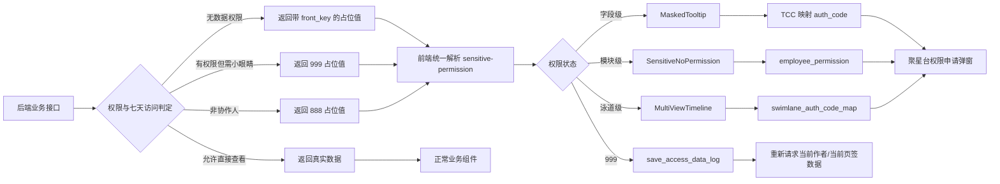

# 头达数据分级管控与监控预警——当前需求实现详细说明

> 整理日期：2026-07-30（Asia/Shanghai）  
> 代码仓库：`alliance-operation-mono`  
> 分析基线：`master@3bff60c27b`  
> 主要前端应用：`apps/alliance-operation-daren`  
> 需求一期合入：`d3ff1c5cc`（2026-05-07）  
> 需求二期合入：`7664593dd`（2026-06-02）

## 1. 资料范围

本说明以以下材料为依据：

1. [PRD：运营平台_作者运营_头达数据分级管控&监控预警](./01-PRD-运营平台_作者运营_头达数据分级管控与监控预警.md)
2. [技术文档：运营平台_作者运营_头达数据分级管控&监控预警](./02-技术文档-运营平台_作者运营_头达数据分级管控与监控预警.md)
3. [信息分级表（Markdown）](./03-信息分级表-LPCCoO.md)
4. [信息分级表（CSV）](./03-信息分级表-LPCCoO.csv)
5. 当前仓库 `alliance-operation-mono` 的实际代码与提交历史

边界说明：

- 当前仓库主要能确认前端实现和前端使用的 API 协议。
- 后端的字段加密、真实值裁剪、七天访问判定、导出裁剪、访问频率监控和预警任务，不在当前前端仓库内。本文会依据技术文档说明其职责，但不会把无法从本仓库验证的内容写成“已由当前代码完成”。
- 技术文档中的“一期先不做小眼睛/L4+”是早期方案。当前代码已经包含二期提交，因此本文以一期加二期后的现状为准。

## 2. 一句话结论

当前方案不是由前端自行判断某个业务数值是否敏感，而是由后端在原接口响应中返回带权限语义的占位值；前端统一解析占位协议，再通过 TCC 把字段标识映射为聚星台申请权限和系统模块权限，最终分别完成字段遮罩、模块拦截、协作人申请、小眼睛继续查看、泳道隐藏和数据刷新。

这套实现遵循一个关键安全原则：**真实敏感值是否下发由后端决定，前端只负责识别权限状态和呈现交互，不能把“前端隐藏 DOM”当成数据安全措施。**

## 3. 需求目标与当前完成边界

| 需求点 | 当前状态 | 实现位置/责任方 |
| --- | --- | --- |
| L4/L4+ 数据分级 | 有分类资料；前端消费分类结果 | 信息分级表、后端配置 |
| 无数据权限时展示 `****` | 已有前端统一解析和组件 | `components/sensitive-permission` |
| 字段级权限申请 | 已实现 | TCC `indicator_auth_config` + Garfish Bridge |
| 模块级权限校验 | 已实现 | `employee_permission` + 模块占位页 |
| 非协作人先申请协作关系 | 已实现前端交互 | `888` 标记 + `ApplyManageModal`/业务回调 |
| 有数据权限但需再次确认查看 | 已实现二期前端链路 | `999` 标记 + 小眼睛 |
| 点击小眼睛后记录访问 | 已实现前端调用 | `save_access_data_log` |
| 七天内直接返回真实值 | 前端依赖后端实现 | 后端按“操作人 × 作者”判断 |
| 违规处置泳道单独管控 | 已实现 | `swimlane_auth_code_map` |
| 无权限图表仍保持页面结构 | 已实现 | 预览/兜底趋势数据 + 权限遮罩 |
| 无权限导出字段不进入 Excel | 当前前端仓库无法确认 | 后端导出裁剪 |
| 查看频率超过阈值后预警 | 当前前端仓库未发现相关任务 | 后端日志、监控或离线任务 |
| 原查询链路后置统一加密 | 当前前端仓库无法确认 | 后端公共加密能力 |

## 4. 总体架构



整体上分为五层：

1. **后端数据安全层**：判断数据权限、协作关系和七天查看记录，决定返回真实值或占位值。
2. **占位协议层**：用字符串/整数/浮点数的固定前缀和尾部标记表达权限状态。
3. **前端权限运行时**：统一解析占位值、注册“申请权限”和“继续查看”处理器。
4. **业务交互层**：字段、模块、泳道、图表分别使用适合自己的无权限 UI。
5. **配置和权限服务层**：TCC 提供字段与权限点映射，`employee_permission` 提供模块状态，`save_access_data_log` 记录小眼睛访问。

## 5. 前后端占位协议

核心解析位于：

- `apps/alliance-operation-daren/src/components/sensitive-permission/runtime.ts`

当前代码支持的协议如下：

| 数据类型 | 占位形式 | 解析结果 | 前端动作 |
| --- | --- | --- | --- |
| 字符串 | `****<front_key>` | 无数据权限 | 根据 `front_key` 查 TCC 并申请数据权限 |
| 整数 | `-99999<front_key>` | 无数据权限 | 同上 |
| 浮点数 | `-99999.<front_key>` | 无数据权限 | 同上 |
| 字符串 | `****999` | 有数据权限，但本次需要继续查看 | 展示小眼睛，写访问日志 |
| 整数/浮点数 | 数值前缀后接 `999` | 有数据权限，但本次需要继续查看 | 同上 |
| 字符串 | `****888` | 非协作人 | 先申请成为作者协作人 |
| 整数/浮点数 | 数值前缀后接 `888` | 非协作人 | 同上 |
| 正常业务值 | 无占位前缀 | 已揭示 | 按原业务逻辑展示 |

解析后的主要状态为：

- `unauthorized / no_data_permission`
- `unauthorized / no_cooperation`
- `auth_hidden`
- 正常值不返回敏感状态

需要特别注意：

- 字符串必须是 `****` 后还有 payload 才会被当前运行时识别。裸 `****` 不会被 `parseSensitiveFieldState` 识别。
- 数值协议只在运行时值确实是 JavaScript `number` 时生效；如果接口层把数值占位序列化成字符串，则不会走整数/浮点数解析。
- `888` 和 `999` 是保留标记，后端不能把它们当普通 `front_key` 使用。
- 占位值只能表达权限状态，不能包含真实数据。

## 6. TCC 权限映射

字段和模块的权限映射使用 TCC key：

```text
indicator_auth_config
```

当前应用侧期望的配置结构为：

```json
[
  {
    "indicator_key": "live_pay_amt",
    "front_key": "live_pay_amt",
    "auth_level": "L4",
    "auth_code": "Dm12603240000001",
    "permission_code": "author_live_data.view"
  }
]
```

字段含义：

| 字段 | 用途 |
| --- | --- |
| `indicator_key` | 后端或业务指标标识；当前前端解析逻辑不以它作为 Map key |
| `front_key` | 占位 payload 与前端查询 TCC 使用的 key |
| `auth_level` | L4/L4+ 等分类信息；当前前端不直接用它做判断 |
| `auth_code` | 打开聚星台权限申请弹窗时的 `dimension_type` |
| `permission_code` | 调用 `employee_permission` 时使用的系统权限 key |

实现文件：

- `apps/alliance-operation-daren/src/components/sensitive-permission/config.ts`

实现细节：

1. 通过 `apiGetTccValue({ keys: ['indicator_auth_config'] })` 获取配置。
2. 支持 TCC 根值直接是数组，也支持 `{ configs }`、`{ data }`、`{ list }` 三种容器。
3. 将配置缓存为 `Map<front_key, config>`，避免每次渲染都请求 TCC。
4. 第一次找不到 key 时会强制刷新 TCC 再查一次，兼顾配置动态变更。
5. 字段申请读取 `auth_code`。
6. 模块校验读取 `permission_code`。
7. 配置缺失、接口错误或映射失败时不透出真实模块，模块权限路径按失败关闭处理。

字段申请最终调用：

```ts
window.GarfishBridge.actionBridge.showApplyDimensionPopup({
  dimension_type: authCode,
});
```

## 7. 字段级权限实现

字段级入口组件：

- `apps/alliance-operation-daren/src/components/sensitive-permission/components/masked-tooltip/index.tsx`
- 通用数值渲染：`apps/alliance-operation-daren/src/components/render-value/index.tsx`

处理流程：

1. 业务接口返回原字段值。
2. `parseSensitiveFieldState` 判断它是否为敏感占位。
3. 如果是正常值，沿用原格式化逻辑。
4. 如果是 `****<front_key>` 等无权限状态，页面显示浅色 `****` 和虚线下划线。
5. Hover 后提示“需申请相关数据权限”。
6. 点击“立即申请”，使用显式 `authCode`，或从字段值解析 `front_key`。
7. 通过 TCC 找到 `auth_code`，打开聚星台申请弹窗。
8. 如果是 `****888`，不走数据权限申请，改为调用业务传入的协作人申请回调。
9. 如果是 `****999`，展示闭眼图标，点击后进入小眼睛链路。

该组件已经接入多类页面，包括：

- 达人列表自定义列和交易指标
- 作者档案基础信息、风险信息、公司信息、用户画像
- 作者 L/S 等级、结算 GMV、里程碑
- 作者表现趋势指标卡和图表 Tooltip
- 直播核心数据、直播列表处罚标签
- 作品核心数据、作品分类
- 成交商品分析
- 违规/舆情等相关展示

前端的接入方式是识别接口原值，而不是维护一份“哪些字段需要隐藏”的硬编码白名单。字段分类和权限点发生变化时，应优先更新后端与 TCC，而不是在页面里增加新的安全判断。

## 8. 模块级权限实现

模块级公共方法：

- `requestSensitiveModulePermission`
- `getSensitiveModulePermissionState`
- `buildSensitiveModuleNoPermissionViewModel`
- `SensitiveNoPermission`

模块校验请求：

```ts
apiEmployeePermission({
  permission_keys: [permissionCode],
  author_id: authorId,
  author_id_for_eye_check: authorId,
});
```

响应中使用：

- `has_permission[permissionCode]`
- `need_eyes`
- `is_coo`

状态矩阵：

| `hasPermission` | `needEyes` | `isCoo` | 状态 | UI/动作 |
| --- | --- | --- | --- | --- |
| `undefined` | 任意 | 任意 | `loading` | 展示加载态 |
| `true` | `false` | 任意 | `viewable` | 请求并展示真实模块 |
| `true` | `true` | 任意 | `view_permission_required` | `****999`，按钮“继续查看” |
| `false` | 任意 | `true` | `no_data_permission` | `****<front_key>`，按钮“立即申请” |
| `false` | 任意 | `false` | `no_cooperation` | `****888`，按钮“申请协作人” |

当前明确使用公共模块校验的模块：

| 模块 | `front_key` | 当前处理 |
| --- | --- | --- |
| 体裁经营概览 | `genre_gmv_overview` | 只有 `hasPermission=true && needEyes=false` 才请求真实概览；无权限时用合成数据保留桑基图结构 |
| 新违规 Tab | `new_violation_tab` | 无权限时不挂载违规、舆情、人设、诉讼内容，整体展示无权限页 |
| 用户画像 | `user_info` | 用户画像接口和模块权限并发请求；真实内容是否显示仍以接口返回的 `authorized` 为直接门禁，模块权限结果用于选择申请/小眼睛/协作人动作 |

`SensitiveNoPermission` 会根据容器尺寸切换完整卡片和紧凑文案，避免在矮模块中出现大面积空白。

## 9. 小眼睛与七天查看链路

二期把技术文档早期“本期先不做”的小眼睛方案落到了当前前端代码中。

### 9.1 触发条件

后端返回 `999` 占位，或 `employee_permission.need_eyes=true`。

### 9.2 前端请求

点击小眼睛后调用：

```text
POST /api/buyin/admin/multistar/save_access_data_log
```

请求参数：

```json
{
  "author_id": "<当前作者 ID>"
}
```

实现位于：

- `apps/alliance-operation-daren/src/components/sensitive-permission/config.ts`

若没有显式传入作者 ID，详情页会从 URL 查询参数读取 `author_id`。作者列表中的字段会尽量把当前行作者 ID 传给组件，防止把访问记录写到错误作者。

### 9.3 成功后的刷新

应用没有一律整页刷新：

- 作者详情页在 `author-detail/index.tsx` 注册成功处理器。
- 点击前记录当前 Tab 的滚动位置。
- 作者档案 Tab 会重新请求基础信息和成长数据。
- 当前 Tab 的版本号加一，通过重新挂载触发其业务请求。
- 等待页面重新渲染后恢复滚动位置，并扣除吸顶头部高度。
- 作者列表页则重新请求列表。
- 如果当前页面没有注册成功处理器，公共逻辑才回退到 `window.location.reload()`。

这样既能让后端基于新写入的访问记录返回真实值，又避免用户在长详情页中丢失当前位置。

### 9.4 七天规则的责任边界

“点击一次后七天内默认展示”不由前端倒计时判断。前端只写访问日志并重新请求数据，后端负责：

1. 以“操作人 × 作者”为维度查询访问记录。
2. 判断记录是否在七天有效期内。
3. 有效时在原业务接口返回真实值。
4. 过期时重新返回 `999` 占位。

这个边界能避免通过修改浏览器时间、本地存储或前端状态绕过控制。

## 10. L4+ 与协作关系

当前前端使用 `888` 区分“没有数据权限”和“还不是该作者协作人”。

交互顺序是：

1. `is_coo=false` 或后端返回 `888`。
2. 页面展示“申请协作人”，而不是直接申请 L4+ 数据权限。
3. 点击后调用业务模块传入的 `onApply`/`onApplyManage`，通常打开 `ApplyManageModal` 或触发现有协作申请流程。
4. 成为协作人后重新查询，才进入数据权限或小眼睛判断。

这样避免向没有作者协作关系的用户暴露可申请的数据权限入口。

## 11. 泳道权限实现

违规处置泳道属于“单接口内的局部模块权限”，没有单独调用 `employee_permission`，而是消费泳道接口返回的：

```ts
swimlane_auth_code_map?: Record<SwimlaneType, string>;
is_coo?: boolean;
```

相关文件：

- `author-data-trend/swimlane-permission.ts`
- `author-data-trend/index.tsx`
- `author-data-trend/multi-view-trend/index.tsx`
- `libs/components/src/multi-view-timeline/index.tsx`

规则：

1. `swimlane_auth_code_map` 为空，视为全部泳道可展示。
2. 某个泳道存在非空 code，视为该泳道无权限。
3. code 为 `999` 时展示“继续查看”，点击小眼睛。
4. code 非 `999` 且 `is_coo=false` 时展示“申请协作人”。
5. code 非 `999` 且 `is_coo=true` 时，code 被直接作为 `authCode` 打开数据权限申请。
6. `MultiViewTimeline` 对无权限泳道不渲染真实点位，而是替换整个泳道 body，避免只覆盖视觉层却仍把敏感点位挂到 DOM。

违规泳道类型当前按 `SwimlaneType=6` 处理，临时 mock 开关已经是 `false`。

## 12. 图表和复合结构的处理

普通文本可以直接显示 `****`，但折线图、面积图、桑基图如果完全没有数据，会破坏页面布局，也无法让用户理解申请权限后能看到什么。因此当前实现使用“结构保留、数值不保留”的方式：

- 作者表现趋势：从聚合指标识别当前指标是否被遮罩。
- 无权限时构造预览趋势，保留时间轴和图表形状。
- Tooltip 和纵轴不展示原始敏感值，只显示 `****`。
- 图表上方覆盖 `SensitiveNoPermission`。
- 体裁经营概览使用固定合成数值绘制结构，同时 `displayMetrics` 全部为 `****`。
- 真实概览接口在模块可见前不会被调用。

合成/预览数据只能用于视觉占位，禁止从真实敏感数据变换生成，否则仍可能泄露趋势、比例或量级。

## 13. 共享组件中的第二套实现

仓库中还有一套共享版本：

- `libs/components/src/sensitive-permission`

它主要服务共享直播表格，例如直播处罚标签。

应用入口 `routes/layout.tsx` 会同时注册：

1. `apps/alliance-operation-daren` 的敏感权限处理器。
2. `libs/components` 的共享处理器。

共享版本与应用版本并不完全等价：

| 能力 | 应用版本 | 共享版本 |
| --- | --- | --- |
| 字符串 `****<key>` | 支持 | 支持 |
| `999` 小眼睛 | 支持 | 支持 |
| `888` 非协作人 | 支持 | 不支持 |
| 整数/浮点占位 | 支持 | 不支持 |
| 模块权限 | 支持 | 不支持 |
| 小眼睛成功后局部刷新 | 支持 | 不支持，直接整页刷新 |
| TCC `front_key` | 支持 | 支持 |
| TCC 拼写兼容 `fornt_key` | 不支持 | 支持 |

因此，新增功能应优先复用应用版本；若必须改共享版本，需要评估所有引用 `libs/components` 的应用，不能假设两套代码行为一致。

## 14. 与技术文档接口清单的对应关系

需求涉及的主要业务接口与当前前端接入方向如下：

| 业务模块 | 接口/数据源 | 典型敏感字段或模块 |
| --- | --- | --- |
| 作者基础信息 | `/api/buyin/admin/archive/base_info` | 近 30 天支付/发货/结算 GMV、舆情、安全与生态评级 |
| 作者表现趋势 | `/operate_monitor/get_author_performance` | 直播/视频支付与发货金额、直播 GPM |
| 操作泳道 | `/operate_monitor/swimlane` | 违规处置泳道，`swimlane_auth_code_map` |
| 体裁经营概览 | `/archive/genre_gmv_overview` | `genre_gmv_overview` 模块、支付/发货/结算 GMV |
| 直播核心指标 | `/live/core_indicators` | 直播 GMV、观看 GPM |
| 作品核心数据 | `/item/aggregate_indicator` | 视频支付/发货/退款、客单价、佣金 |
| 作品/直播列表 | 内容列表、直播间列表 | 非原创标签、违规处罚标签 |
| 新违规模块 | 多个违规/舆情/诉讼接口 | `new_violation_tab` |
| 成交商品分析 | `/promote_product/list` | 成交金额、订单数、趋势、直播/视频/橱窗金额 |
| 达人库列表和导出 | `/author_manage/search`、`/author_manage/export` 等 | 交易指标、自定义列 |
| 经营报告导出 | `/export_report` | 后端按权限裁剪 |

前端大量页面通过公共 `MaskedTooltip` 和渲染工具接入，因此同一个占位协议可以覆盖文本、金额、比例、标签、表格、图表和复杂模块。

## 15. 监控预警如何落地

PRD 同时要求对运营查看敏感数据的频率进行监控，超过阈值后预警。当前前端代码只负责产生小眼睛访问事件：

```text
操作人点击小眼睛
  -> save_access_data_log(author_id)
  -> 后端记录操作人、作者、时间等审计信息
```

完整预警能力应在后端或数据平台完成：

1. 访问日志必须包含操作人、作者、时间、环境和请求结果。
2. 明确统计窗口，例如每小时/每天。
3. 明确聚合维度，例如操作人、操作人 × 作者、部门。
4. 配置阈值和白名单。
5. 超阈值后向风控或业务负责人发送告警。
6. 保留审计查询和误报处理能力。

当前仓库未发现阈值配置、聚合任务、告警通知或审计看板代码，因此不能仅根据 `save_access_data_log` 的存在判定“监控预警已完整实现”。

## 16. 当前实现中的重点风险

### 16.1 `front_key` 与 `fornt_key` 拼写不一致

技术文档示例多处使用 `fornt_key`，但应用版本只读取 `front_key`；共享版本同时兼容两种拼写。

影响：

- 如果线上 TCC 仍使用 `fornt_key`，应用版本会跳过该条配置。
- 字段权限申请会提示“当前字段暂无可申请的权限配置”。
- 模块权限会因缺少配置按无权限关闭。

建议：

- 线上 TCC 统一改为 `front_key`。
- 或在应用版本短期兼容 `fornt_key`，并增加配置告警。

### 16.2 裸 `****` 与当前解析器不兼容

当前解析器要求 `****` 后存在 payload。`test-fixtures.ts` 仍把裸 `****` 命名为 `authorizedHidden`，但运行时代码不会解析它，说明 fixture 与现行协议存在偏差。

建议后端二期协议始终返回：

- 无权限：`****<front_key>`
- 需小眼睛：`****999`
- 非协作人：`****888`

不要再返回语义不明确的裸 `****`。

### 16.3 共享实现能力不完整

共享版本不支持数值占位和 `888`。如果共享直播表格未来接收到这些形式，会按普通值处理。

建议：

- 统一两套 runtime，或明确共享接口只返回字符串 `****<key>`/`****999`。
- 合并前增加对所有共享组件消费者的影响评估。

### 16.4 数值占位的运行时类型

应用版本只对 JavaScript `number` 解析 `-99999...`。需要确认 BAM/Thrift 到前端后没有把数值占位变成字符串。

建议在接口联调中分别覆盖：

- integer
- double/float
- string
- optional/null

### 16.5 用户画像的门禁来源

`UserInfoTable` 并发请求用户画像和模块权限，但最终是否隐藏表格直接依据用户画像接口的 `authorized`。模块权限结果主要决定无权限页面展示哪个动作。

这要求后端 `apiCustomerInfo.authorized` 与 `employee_permission` 的判断始终一致，否则可能出现状态文案与数据展示不一致。

### 16.6 缺少可执行单元测试

敏感权限目录目前只有 `test-fixtures.ts`，没有发现 `describe/it/test` 测试。核心协议解析、状态矩阵和 TCC 兼容主要依赖人工联调。

建议优先补充：

- 字符串、整数、浮点占位解析
- `888`、`999`、普通 `front_key`
- 裸 `****`、空 payload、异常值
- 模块状态矩阵
- TCC 多种容器和错误拼写
- 小眼睛成功/失败与刷新回退
- 泳道 map 为空、`999`、普通 auth code

### 16.7 后端安全能力不可由前端仓库证明

必须单独验证：

- 未授权接口响应中没有真实值。
- 七天过期后重新返回占位。
- 导出文件确实裁剪无权限字段。
- 访问日志不能伪造操作人身份。
- 预警阈值和通知链路真实生效。

## 17. 新增敏感字段/模块的标准接入步骤

### 17.1 新增字段级管控

1. 在信息分级表中确认等级、权限点、脱敏方案和接口。
2. 后端在原字段返回链路接入统一加密/后置处理。
3. 约定唯一 `front_key`。
4. 在 `indicator_auth_config` 配置 `front_key` 和 `auth_code`。
5. 确认无权限、需小眼睛、非协作人分别返回正确标记。
6. 前端业务组件使用 `MaskedTooltip` 或已有敏感渲染工具。
7. 涉及格式化、排序、比例、趋势计算时，必须先判断是否为敏感占位，再做数值运算。
8. 联调四种身份状态并检查网络响应中无真实值。

### 17.2 新增模块级管控

1. 为模块定义稳定的 `front_key`。
2. 在 TCC 同时配置 `auth_code` 和 `permission_code`。
3. 页面首次加载调用 `requestSensitiveModulePermission`。
4. 在 `viewable` 前不要请求或挂载真实敏感模块。
5. 用 `buildSensitiveModuleNoPermissionViewModel` 生成统一交互。
6. 非协作人接入业务协作申请回调。
7. 小眼睛成功后确认当前模块能重新拉取数据。

### 17.3 新增泳道或接口内局部模块

1. 后端在原接口返回 `权限对象 -> auth_code` 映射和 `is_coo`。
2. 前端把无权限对象整体替换成占位内容。
3. 不允许先渲染真实点位再通过 CSS 覆盖。
4. `999` 走小眼睛，普通 code 走权限申请，非协作人走协作申请。

### 17.4 生成接口代码

`src/bam/` 是生成目录。IDL/API 变更应通过仓库约定的 BAM 更新命令生成，不能手工修改生成文件。

## 18. 建议的验收矩阵

| 场景 | 后端返回/权限结果 | 预期前端表现 |
| --- | --- | --- |
| 有权限且七天内看过 | 真实值；`need_eyes=false` | 正常展示，无申请入口 |
| 有权限但七天内未看 | `999`；`need_eyes=true` | 展示 `****` 和小眼睛 |
| 点击小眼睛成功 | 日志接口成功 | 当前列表/Tab 重新请求并恢复位置 |
| 点击小眼睛失败 | 日志接口失败 | 提示失败，不显示真实值 |
| 协作人但无数据权限 | `<front_key>`；`is_coo=true` | 展示“立即申请” |
| 非协作人 | `888`；`is_coo=false` | 展示“申请协作人” |
| TCC 缺少 `auth_code` | 无映射 | 不打开空权限弹窗，提示配置缺失 |
| TCC 缺少 `permission_code` | 模块映射不完整 | 模块按无权限关闭 |
| 权限接口异常 | 请求失败 | 模块按无权限关闭，不透出真实内容 |
| 违规泳道 code=`999` | map 含泳道 6 | 隐藏点位，展示继续查看 |
| 违规泳道普通 code | map 含泳道 6 | 隐藏点位，按协作关系决定申请动作 |
| 导出无权限 | 后端命中脱敏字段 | Excel 不包含真实值和占位值 |
| 七天过期 | 后端访问记录过期 | 再次返回 `999` |
| 高频访问 | 超过阈值 | 后端/监控产生可追溯告警 |

验收时不能只检查页面截图，还应同时检查：

- 浏览器 Network 响应
- 小眼睛日志写入结果
- TCC 实际配置
- 聚星台申请参数
- 导出文件内容
- 七天边界时间
- 告警记录

## 19. 关键代码索引

### 公共能力

- `apps/alliance-operation-daren/src/components/sensitive-permission/runtime.ts`
- `apps/alliance-operation-daren/src/components/sensitive-permission/config.ts`
- `apps/alliance-operation-daren/src/components/sensitive-permission/module-permission.ts`
- `apps/alliance-operation-daren/src/components/sensitive-permission/components/masked-tooltip/index.tsx`
- `apps/alliance-operation-daren/src/components/sensitive-permission/components/sensitive-no-permission/index.tsx`
- `apps/alliance-operation-daren/src/components/render-value/index.tsx`

### 注册与刷新

- `apps/alliance-operation-daren/src/routes/layout.tsx`
- `apps/alliance-operation-daren/src/routes/authorManage/components/author-detail/index.tsx`
- `apps/alliance-operation-daren/src/routes/authorManage/components/author-list/index.tsx`

### 典型模块

- `.../author-profile/content-trait/business-overview/index.tsx`
- `.../violation/has-permission/has-permission.tsx`
- `.../author-profile/user-info/user-info-table.tsx`
- `.../author-data-trend/index.tsx`
- `.../author-data-trend/swimlane-permission.ts`
- `.../author-data-trend/multi-view-trend/index.tsx`
- `.../live-analysis/live-data/index.tsx`
- `.../work-analysis/work-core-data/index.tsx`
- `.../work-analysis/work-classification/index.tsx`
- `.../product-analysis/components/product-table/index.tsx`

### 共享组件

- `libs/components/src/sensitive-permission/runtime.ts`
- `libs/components/src/sensitive-permission/config.ts`
- `libs/components/src/live-table/utils.tsx`
- `libs/components/src/multi-view-timeline/index.tsx`

## 20. 最终判断

从当前前端仓库看，一期的字段/模块权限和二期的小眼睛、L4+、泳道控制已经形成了较完整的公共能力，并已覆盖达人列表、作者档案、趋势、直播、作品、商品、违规等主要页面。

要把整个 PRD 判定为完整闭环，还需要跨仓库确认三项后端事实：

1. 所有列入信息分级表的接口都在返回前完成了真实值替换或裁剪。
2. 七天查看记录、导出裁剪和身份校验已经按技术方案生效。
3. 访问频率统计、阈值规则和预警通知已部署并可审计。

在继续新增敏感字段前，最优先的工程治理事项是统一 `front_key/fornt_key` 配置契约、合并两套前端 runtime 的能力差异，并为占位协议和权限状态矩阵补齐自动化测试。
