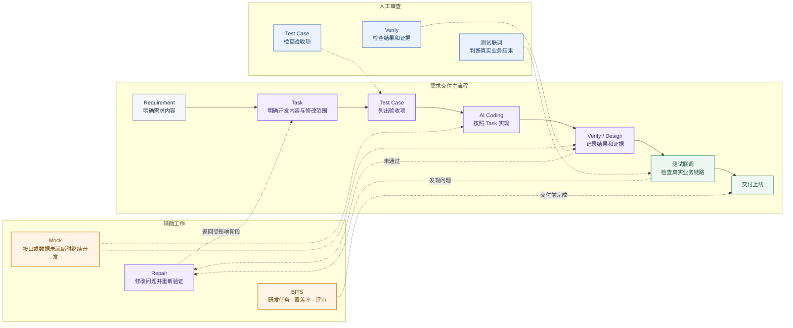
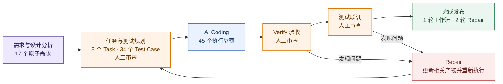
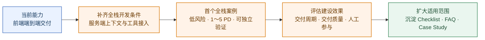

### 3.2 AI Coding 工作流搭建与业务实践

#### 3.2.1 产品介绍与建设目标

前端交付 Agent 工作流是一套面向电商前端业务需求的端到端 AI Coding 流程。工作流以 Meego 需求链接为入口，读取关联的需求文档、Figma 设计和代码仓库信息，依次完成需求分析、任务规划、代码实现、浏览器验收和任务交付。


团队在学习和使用 AI Coding 的过程中，调研并实践了 [Spec Kit](https://github.com/github/spec-kit)、[OpenSpec](https://github.com/Fission-AI/OpenSpec) 和 [Superpowers](https://github.com/obra/superpowers)等通用方案。这些公开通用方案采用规范驱动和分阶段执行的思路，为工作流设计提供了参考。但在具体的电商前端需求交付中效果不佳，存在以下不足：

1. **无法直接接入内部工具**

   现有公开通用方案没有提供 Meego、Lark CLI、Figma MCP / F2C、vmok 等内部工具的现成接入能力。需求资料、设计数据和页面运行环境需要另外配置，无法直接串入开发流程。

2. **缺少前后端并行开发所需的数据 Mock**

   后端接口尚未完成，或者测试环境暂时没有满足需求的数据时，现有方案缺少根据接口定义和测试项构造响应数据的固定流程，前端开发和初步验证仍会受到后端进度与环境数据限制。

3. **缺少浏览器主动验收环节**

   现有方案主要通过代码检查和自动化测试判断任务是否完成，缺少由浏览器主动打开业务页面，执行点击、输入、切换和提交等操作，检查页面展示与接口请求的前端验收过程。

4. **需求与设计分析不够深入**

   现有公开通用方案主要基于已经整理的需求描述开展规划，缺少对原始需求文档和 Figma 的完整读取与分析，难以在开发前明确页面范围、交互状态和设计要求，容易造成 Agent 对需求和设计的理解偏差。

基于上述问题，团队保留规范驱动和分阶段执行的思路，结合电商前端需求交付过程中沉淀的实践经验，并接入内部工具、MCP 和 CLI，形成能够适配业务需求的端到端 AI Coding 工作流。工作流的建设效果最终从三个方面衡量：

- **交付时间**：缩短整体交付周期。
- **交付质量**：提高交付结果的完整性和稳定性。
- **人工参与**：减少开发过程中的人工参与。

#### 3.2.2 整体设计与工作重点

##### 整体设计

| 建设目标     | 考虑方向                                                     |
| ------------ | ------------------------------------------------------------ |
| 缩短交付时间 | 可自动化处理和重复执行的工作原则上由 AI 完成。<br>Mock 减少等待接口和目标数据的时间；BITS 减少交付前的重复操作 |
| 提高交付质量 | Task 记录需求来源和修改范围；Test Case 明确验收断言；Verify 为每条断言记录结果和证据；Repair 修改 Verify、测试或联调发现的问题，并重新验证相关 Case |
| 减少人工参与 | 人工主要审查 Test Case、Verify 结果和测试联调结果，并确认提交和发布；需求分析、任务规划、代码实现、页面操作和问题修复由 AI 执行 |



| 工作重点                          | 核心目标                    | 解决问题                                                     | 解决方法                                                     |
| --------------------------------- | --------------------------- | ------------------------------------------------------------ | ------------------------------------------------------------ |
| 按 Test Case 规划并构建 Mock 规则 | 缩短交付时间 / 减少人工参与 | 缺少稳定依据来确定需要准备哪些响应规则，规则也难以与后续自动化验收准确匹配 | 在测试矩阵中声明 Case 与规则的对应关系，由 Verify / Design 按当前 Case 构建和使用规则 |
| 将 Verify 证据与 Test Case 对齐   | 提高交付质量                | Verify 结果没有逐条对应 Test Case 断言，无法确认是否完整验收 | 为每条断言记录实际结果和证据，存在缺项时不能通过             |
| 根据验收问题执行 Repair 并复验    | 提高交付质量                | 测试和联调发现问题后，只修改代码但没有重新验证               | 返回受影响环节完成修改，并重新执行相关 Case                  |
| 通过 BITS 完成交付前检查          | 缩短交付时间 / 减少人工参与 | 研发任务、覆盖率和评审处理需要人工反复操作                   | AI 执行重复步骤，人工审查处理结果并确认提交和发布            |

##### 工作重点一：按 Test Case 规划 Mock 规则

**核心目标**

前后端并行开发时，接口或目标数据可能尚未就绪。此时需要准备可被页面请求命中的 Mock 响应，使前端开发和自动化验收能够继续进行。

**关键问题**

同一个接口可能服务多个测试场景，所需 Mock 规则的数量并不等于接口数量。如果只根据接口定义批量构建规则，无法判断哪些响应会被后续自动化验收使用，也无法保证页面请求能够准确命中。

以作品列表接口为例，同一个接口需要支持两种测试场景：

```text
作品列表接口
├─ Case A：验证列表正常展示 → R-LIST-NORMAL
└─ Case B：验证列表空态展示 → R-LIST-EMPTY
```

两个 Case 使用同一个接口，但需要不同的返回数据。只按接口准备一条规则，后续验收无法确定应该返回列表数据还是空数据。**<u>因此，需要建立 Mock 规则与 Test Case 的对应关系，让每条规则都有明确的测试来源和使用场景</u>**。

**规范设计**

1. **建立规则映射。** 构建 Test Case Matrix 时，为每个依赖响应数据的 Case 填写 `apiName` 和 `ruleId`。`apiName` 标识目标接口，`ruleId` 标识当前场景需要的响应规则；不依赖响应数据的 Case 将 `ruleId` 标记为 `N/A`。

2. **约束映射关系。** 同一接口需要不同响应时，分别配置不同的 `ruleId`。一个验收目标需要多种响应时，拆分成多个 Test Case；多个 Case 使用相同的请求条件和响应内容时，可以复用同一条规则。

3. **按 Case 补齐规则。** Verify / Design 执行当前 Case 时读取映射。规则可用时直接加载；规则缺失或与接口响应不一致时，暂停当前 Case，完成规则的新增、修复和校验，再返回同一个 Case 继续验收并保存证据。


**结果沉淀**

```text
commands/
├── delivery:task.md                 # 生成 Task 和 Test Case Matrix，建立 Case 与 Mock 规则的映射
└── delivery:mock.md                 # 按当前 Case 构建或修复 Mock，完成后返回原验证流程

skills/
├── 10-test-case-planning/
│   ├── SKILL.md                     # 定义 Test Case、接口和 ruleId 的映射规范
│   └── test-case-matrix-template.md # 固定测试矩阵和 Mock 规则映射字段
└── bam-mock-runtime-generator/
    ├── SKILL.md                     # 定义 Mock 规则生成、命中、校验和清理流程
    ├── references/
    │   ├── mock-rule-design.md      # Mock 规则的拆分与复用方式
    │   ├── matching-algorithm.md    # 请求条件与 ruleId 的匹配规则
    │   ├── manifest-schema.md       # Mock Manifest 的字段约束
    │   └── gate-closure.md          # Mock 规则完成条件和失败处理
    └── scripts/
        ├── init-bam-mock.mjs        # 初始化 Mock 目录和基础结构
        ├── manifest-gates.mjs       # 检查规则、字段和状态是否完整
        ├── reapply-bam-mocks.mjs    # 重新应用已有 Mock 规则
        └── verify-bam-mock.mjs      # 校验规则能否被页面请求正确命中
```

**产物总结**

这组产物固定了 Test Case、接口和 Mock 规则之间的对应关系。接口或目标数据未就绪时，Agent 可以按当前 Case 准备并加载需要的响应，让前端开发和页面验收继续进行，减少人工逐个配置 Mock 的时间。


##### 工作重点二：将 Verify 证据与 Test Case 对齐

**核心目标**

这项工作的目标是让 Verify 的验证结果可信。一个 Test Case 通常包含多条功能或视觉断言，每条断言都要有实际结果和对应证据，只要存在断言未执行、结果未记录或证据缺失，当前 Case 就不能通过 Gate。Verify 的结论必须能够回到具体断言和证据文件，不能只保留一条总体的 `PASS`。

**关键问题**

Skill 中的流程和规范大多以自然语言描述，本质上仍是软约束。即使文件已经明确要求逐条验收和保存证据，Agent 在长任务中仍可能遗漏某项要求、用其他动作替代规定步骤，或者在记录不完整时直接判断任务完成。**<u>因此，设计重点是如何让 Agent 稳定执行 Skill</u>**。

**调研结论**

1. **Gate 是任务型 Skill 的关键环节**

Gate 负责控制任务是否完成。检查不通过时，需要拒绝放行，并返回失败规则、失败原因、补充位置和重新检查的位置。

**理由。** Agent 即使在执行中遗漏了某条规范，只要 Gate 没有被绕过，缺失的状态或证据仍会使检查失败。具体的失败信息可以把 Agent 拉回对应规则，减少重新查找问题的范围。

**调研依据。** [Claude Code Hooks 官方文档](https://code.claude.com/docs/en/hooks)给出了 `TaskCompleted` 的阻断示例：固定事件触发测试，退出码为 `2` 时任务不能完成。[Formal Skill](https://arxiv.org/abs/2605.19604) 在运行状态中保存验证结果、必需产物和失败原因，检查失败后返回修复阶段。[ACL 2024 的错误定位研究](https://aclanthology.org/2024.findings-acl.826/)还发现，直接提供正确的错误位置后，模型在五类推理任务中的修正结果均有提升。

```yaml
Gate状态:
  PASS:
    条件: 所有检查项和证据完整
    动作: 允许完成
  FAILED:
    rule_id: ASSERTION-02
    failure_reason: 缺少截图证据
    repair_from: 当前断言
    recheck_from: 当前 Case
```

2. **按可检查程度拆分 Skill 规范**

固定字段和状态放入模板、JSON 或 XML；重复且结果确定的检查交给脚本；需要理解上下文和判断业务语义的内容保留在自然语言中。

**理由。** 长篇自然语言需要 Agent 在每次执行时重新解释，字段、状态和完成条件容易被遗漏。模板和结构化字段可以固定产物形态，脚本可以检查字段和文件是否齐全。证据能否支持业务断言仍需要结合上下文判断，保留自然语言更合适。

**调研依据。** [OpenAI Skill Creator](https://github.com/openai/skills/blob/main/skills/.system/skill-creator/SKILL.md) 按任务自由度选择自然语言、参数化脚本或固定脚本，并用模板生成固定产物。[From Skill Text to Skill Structure](https://arxiv.org/abs/2604.24026) 将 Skill 的调用条件、执行阶段、工具动作和资源影响整理为结构化字段，便于检索和检查。[Let Me Speak Freely?](https://arxiv.org/abs/2408.02442) 则表明，严格格式可能影响复杂推理，因此判断过程和结构化记录需要分开。

```yaml
Verify证据验收Skill:
  结构化字段:
    - Test Case编号
    - 验收断言
    - 实际结果
    - 证据路径
    - 验收状态
  脚本检查:
    - 必填字段是否完整
    - 证据文件是否存在
    - 是否仍有未完成状态
  自然语言判断:
    - 证据是否支持断言
    - 未关闭问题是否影响结论
```

3. **执行产物随任务进度更新**

任务开始时先初始化全部检查项。每完成一个任务单元，立即写入当前结果、证据和状态，不能等到最后统一补写。

**理由。** 长任务结束后再补产物，需要依赖上下文回忆，容易漏掉中间步骤，也容易把尚未完成的内容写成已完成。增量记录保留了当前进度；任务中断后，可以从第一个未完成项继续。

**调研依据。** [Anthropic 长任务 Agent Harness](https://www.anthropic.com/engineering/effective-harnesses-for-long-running-agents) 会先把功能清单初始化为未通过，每次只处理一个功能，测试完成后立即更新功能状态和进度文件。新的执行轮次直接读取已有记录，不需要在任务末尾回忆前面的过程。

```yaml
验证任务: 敏感字段权限展示
初始状态:
  待执行: [TC-01, TC-02, TC-03]
第一次更新:
  已完成: [TC-01_无权限时显示脱敏值]
  证据: [TC-01.png]
  待执行: [TC-02, TC-03]
第二次更新:
  已完成: [TC-01, TC-02_申请入口正常打开]
  待执行: [TC-03]
第三次更新:
  已完成: [TC-01, TC-02, TC-03_获得权限后刷新数据]
  待执行: []
```

**规范设计**


1. **初始化结构化验收记录**

Verify 根据 Test Case Matrix 建立执行队列。每个 Case 开始前生成独立验收记录，并写入正向功能断言、反向功能断言、正向视觉断言、反向视觉断言和证据要求，初始状态统一为待执行。一条断言包含多个判断条件时，需要拆成可以独立验证的验收项；模板仍有占位内容时不能开始验收。

2. **逐条验证并增量记录**

Agent 按验收记录逐条执行。每完成一条断言，立即写入实际观察结果、验证动作、证据类型、证据文件位置和当前状态。截图、DOM、Network 和日志需要保存到任务目录；聊天图片、浏览器临时记录和“符合预期”等文字不能单独作为验收证据。

3. **完成断言与证据对账**

每条断言通过稳定标识关联实际结果和证据：

> **Test Case → Assertion → Observed Result → Evidence → Conclusion**

当前 Case 的每条断言都要有执行状态、实际结果和证据路径。记录没有闭合前，Agent 不能进入下一个 Case；执行中断后，从第一个未完成项继续。

4. **执行 Gate 并回收缺项**

- 断言未执行时，返回对应验收点补做验证。
- 已执行但没有记录时，补充记录或重新取证。
- 证据文件缺失或类型不匹配时，重新保存符合要求的证据。
- 实际结果不符合断言时，修复问题并复验当前 Case。
- 单 Case 记录与全局审计不一致时，重新完成证据对账。

Gate 未通过时，需要返回 `case_id`、`assertion_ref`、失败原因、补充位置和重新检查点。全部验收项完成、证据文件存在且记录一致后，当前 Case 才能通过；所有 Case 闭合后，Verify 阶段才能进入下一阶段。

**结果沉淀**

```text
commands/
└── delivery:verify.md                              # 组织 Case 队列、页面验证、证据对账和阶段 Gate

skills/
└── 06-debug-verification/
    ├── SKILL.md                                    # 定义 Verify 的逐 Case 执行和证据闭合规范
    ├── debug-verification-case-result.template.md  # 固定单 Case 的断言、结果和证据记录
    ├── debug-verification-report.template.md       # 固定 Verify 汇总、索引和全局审计结构
    └── browser-verify-runbook.template.json        # 保存可复跑的浏览器操作和证据目标
```

**产物总结**

这组产物要求 Agent 按 Test Case 逐项操作页面并保存证据，任何一项没有检查都不能通过 Verify。Verify 不再只给出“通过”结论，而是能够证明页面功能是否按需求完成，人工可以直接根据证据进行复核。

##### 工作重点三：根据验收问题执行 Repair 并复验

**核心目标**

不能期望 Agent 通过一轮执行完成全部交付。测试、联调或验收发现问题后，需要支持二次修正，并重新执行受影响的开发和验证环节，直到验收通过。

**核心问题**

返修不能只修改代码，相关的工作区产物也需要同步更新。否则需求、任务、Test Case 和验证记录仍停留在旧状态，无法代表当前代码的实际情况。

**规范设计**


1. **接收问题并保存快照**

读取验收问题，并在修改前保存当前工作区产物、代码和执行状态。后续修正、恢复和结果对比都以这份快照为基准。

2. **定位受影响阶段与产物**

逐项分析问题，确定最早受到影响的阶段，并列出需要更新的需求、方案、Task、Test Case、代码或验证记录。问题不能直接默认归入代码阶段。

3. **原位更新相关产物**

在现有工作区中更新受影响的阶段产物和代码，保留原有 Requirement、Task 和 Test Case 的对应关系，不另建一套平行记录。

4. **重新执行并验收**

从定位出的阶段开始重新执行后续流程，重跑受影响的 Test Case，并更新实际结果和验证证据。相关阶段 Gate 和 Repair 检查全部通过后，本轮修正才算完成。

5. **验收通过后写回结果**

整理问题、调整内容、解决结果和验收步骤，写回原验收问题。接收人可以按照写回的步骤直接完成复验。

**结果沉淀**

```text
commands/
└── delivery:repair.md                    # 编排快照、阶段回放、恢复和结果写回

skills/
└── delivery-acceptance-repair/
    ├── SKILL.md                          # 定义问题归因、原位更新、重新执行和闭环规则
    ├── repair-plan-template.md           # 固定影响分析、更新位置和阶段重跑计划
    └── scripts/
        ├── create-repair-snapshot.sh     # 修改前保存工作区和代码快照
        ├── resolve-repair-run.mjs        # 识别并复用同一问题的 Repair 记录
        ├── validate-repair-artifacts.mjs # 检查相关产物、阶段状态和验收结果
        └── rollback-repair-snapshot.sh   # 需要时恢复到 Repair 前状态
```

**产物总结**

这组产物把测试和联调问题统一送回 Repair 流程。Agent 修改问题后必须重新执行受影响的 Test Case，验证通过后才能结束；修改失败时可以恢复到返修前的状态。这样可以避免只改代码、不做复验，也让每次返修都有明确结果。

##### 工作重点四：通过 BITS 完成交付前检查

**核心目标**

在建立覆盖率自动化能力的基础上，继续把自动化范围扩展到评审评论的分析和处理，减少交付周期和人工参与成本。

**核心问题**

自动处理评审评论可以节省时间，但评审建议和 AI 的处理结果都可能存在偏差。为保证交付质量，人工审查需要保留为最后的 Review 节点；原评论、处理结果和回复内容确认后，才允许提交代码并关闭评论。

**规范设计**


1. **分析并判断评论**

AI 拉取 Codebase Assistant、Aime 和 CodeGuard 评论，对照需求、代码和 Test Case 判断问题属于接受、部分接受、拒绝或已修复，并保存每条判断的依据。

2. **完成修改和验证**

需要处理的问题由 AI 完成最小范围修改，并运行相关 Case、构建和代码检查。验证未通过时继续修正，不进入回复和提交阶段。

3. **逐条回复评审意见**

AI 针对每个 Thread 分别回复处理方式、原因和验证结果。拒绝或已修复的问题同样需要说明依据，不能使用一条汇总回复替代全部评论。

4. **人工审查并完成关闭**

人工统一审查原评论、AI 的处理判断、代码修改、验证结果和回复内容。需要调整时返回评论分析环节；确认后再由 AI 提交和推送代码，并逐个 Resolve 已成功回复的 Thread。

**结果沉淀**

```text
commands/
└── delivery:bits.md                            # 编排覆盖率优化、评审评论处理和授权边界

skills/
└── bits-dev-flow/
    ├── SKILL.md                                # 定义覆盖率和评审评论的自动处理流程
    ├── cr-modification-closure.template.json   # 记录评论判断、代码修改、验证和关闭状态
    ├── coverage-optimization-state.template.json      # 记录覆盖率优化轮次和当前状态
    ├── coverage-optimization-plan-round.template.md   # 固定每轮未覆盖代码分析和处理计划
    ├── coverage-exclusion-log.template.json    # 记录已处理文件及对应代码版本
    └── scripts/
        └── collect-huatuo-branch-coverage.js   # 获取华佗覆盖率和未覆盖代码明细
```

**产物总结**

这组产物把增量覆盖率和评审评论纳入同一套交付前检查。AI 自动定位覆盖缺口、操作页面补齐覆盖率，并逐条处理评审评论；人工在提交前统一检查处理结果。覆盖率和评审问题需要在交付前全部关闭，减少人工反复查看报告和处理评论的时间。

#### 3.2.3 已有成果与后续规划

##### 1. 已有成果

内容激励需求首次使用完整工作流进行交付，覆盖需求理解、任务规划、代码实现、验收、测试联调和发布。整个需求经过一轮完整工作流和两轮 Repair 完成上线，验证了当前方案能够支撑一个中小型前端需求的端到端交付。



建设结果按实际交付环节对比：

| 提效环节           | 提效目标                                   | 原处理方式                                                   | 工作流处理方式                                               | 提效结果                                                     |
| ------------------ | ------------------------------------------ | ------------------------------------------------------------ | ------------------------------------------------------------ | ------------------------------------------------------------ |
| 需求分析和任务拆分 | 缩短交付时间 / 减少人工参与                | 研发人员阅读需求文档、设计稿和代码，逐项整理功能、页面状态、开发任务和验收条件 | 工作流读取需求文档、设计稿和代码，生成功能拆分、开发任务和验收项；人工检查是否遗漏、任务边界是否合理 | 减少需求分析和任务规划阶段的人工操作及处理时间，人工由逐项整理改为集中审查 |
| 代码实现           | 缩短交付时间 / 减少人工参与                | 研发人员按照任务逐项编写代码、检查构建结果并记录进度；测试发现问题后继续人工修改 | 人工确认开发任务和验收条件后，工作流按照任务修改代码、执行代码检查并更新完成状态；人工保留代码审查和最终验收 | 减少代码实现阶段的人工投入                                   |
| 功能验收           | 缩短交付时间 / 减少人工参与 / 提高交付质量 | 研发人员手动操作页面并阅读代码，判断各项功能是否完成；发现问题后修改代码，再重新复现整个操作过程 | 工作流按照验收条件操作页面，记录实际结果和截图；结果不符合要求时保存失败位置，修改后重新执行相同场景，人工检查证据和验收结论 | 人工由逐项操作和阅读代码改为审查证据及结论，减少验收时间并降低功能遗漏风险 |
| 页面验收           | 缩短交付时间 / 减少人工参与 / 提高交付质量 | 页面开发完成后，研发人员逐项对照设计稿和实际页面；发现差异后，再检查组件和样式代码，修改并重新打开页面确认 | 工作流自动打开页面，把实际截图与设计稿对应区域进行核对；发现问题后修改代码并重新验收，人工检查修改前后的证据和最终结论 | 减少人工对照设计、检查代码和重复验收的时间；                 |
| Mock 与页面验收    | 缩短交付时间 / 减少人工参与                | 接口或目标数据未就绪时，研发人员手动构造返回数据，或者等待后端提供可用接口和测试数据；切换场景时需要再次修改 | 工作流根据测试场景生成并加载对应的 Mock 数据，再操作页面完成验收；真实接口留到联调阶段确认 | 缩短数据准备和页面调试时间，减少逐接口修改 Mock 数据的人工操作； |
| 测试问题定位和修复 | 缩短交付时间 / 减少人工参与 / 提高交付质量 | 测试发现问题后，研发人员重新复现，再从需求、接口请求和代码中逐步查找原因；代码修改完成后，相关任务和验收记录需要人工同步 | 工作流根据失败的验收项、请求记录和已有证据缩小问题范围，修改受影响的需求说明、任务、代码和验收项，再重新执行对应场景 | 缩短接口问题的定位和返修时间，减少人工逐层排查；接口约束、代码和验收项同步修正，问题通过复验并在上线前关闭 |
| 覆盖率与评审评论   | 缩短交付时间 / 减少人工参与 / 提高交付质量 | 研发人员手动查看覆盖率报告、定位未覆盖代码并操作页面；随后逐条分析评审评论，修改代码、验证并回复 | 工作流自动获取覆盖率和未覆盖代码，通过浏览器操作补齐覆盖；同时逐条判断评审评论，完成必要修改、验证和回复，人工最后统一审查 | 头达需求的覆盖率补齐和评审评论均由人工处理，共使用约 3 PD；内容激励使用工作流完成相同的交付前检查，使用约 4 小时，处理时间缩短约 83%； |
| 整体交付周期       | 缩短交付时间 / 减少人工参与 / 提高交付质量 | 需求分析、任务拆分、编码、验收、问题修复和交付前检查主要由研发人员逐项完成 | 工作流执行需求分析、任务拆分、代码实现、页面验收、问题修复以及交付前检查；人工负责审查关键结果、真实接口联调和发布确认 | 内容激励需求原人工开发方式预计需要 4 PD，实际使用工作流完成交付使用 2 PD，交付时间缩短 50% |

##### 2. 后续规划

当前工作流还存在以下不足：

1. **目前只覆盖前端开发。** 服务端的代码实现、接口验证和数据处理还没有接入工作流。
2. **验收场景覆盖不充足。** 当前工作流只在少量前端需求中完成了验证，还需要在不同类型、不同复杂度的需求中继续测试，确认各阶段在更多场景下都能稳定执行。
3. **前后端之间仍依靠人工衔接。** 接口调整、任务依赖和联调中发现的问题，需要人工分别通知前后端处理。
4. **还没有经过全栈需求验证。** 当前成果证明了工作流可以完成前端交付，但还不能证明它能够支撑前后端一体化开发。

根据团队当前规划，下一阶段将把已经验证的前端交付能力扩展到前后端协同开发，使需求分析、方案设计、前后端实现、联调、测试和发布能够在同一套 AI Coding 工作流中衔接。



下一阶段按照图中的四个步骤推进：

1. **补齐全栈开发条件。** 整理服务端项目的开发方式、接口和数据限制、测试要求、发布及回滚流程，让工作流能够理解并执行服务端任务。
2. **完成首个全栈需求。** 选择一个低风险、1～5 PD、能够独立验证的需求，完整执行需求分析、前后端开发、联调、测试和发布。
3. **检查实际效果。** 对比交付时间、问题数量和人工投入，确认哪些工作能够由 AI 执行，哪些环节仍需人工审查。
4. **继续完善和扩展。** 修正首个案例中发现的问题，整理 Checklist、FAQ 和 Case Study，再逐步用于更多业务需求。

---

## *问题：如何设计让 Agent 稳定执行的 Skill？（你遇到的最大难题是什么？）

最大的难题，是如何设计一套能够让 Agent 稳定执行的 Skill。无论是业务需求交付，还是 AI Coding 工作流建设，都会沉淀大量 Skill。但 Skill 主要由自然语言描述，本质上属于软约束。Agent 在执行长任务时，可能遗漏部分规范、跳过检查步骤，甚至在任务没有真正完成时提前结束。

通过对长任务 Agent 的调研，我总结出三个结论：

1. **Gate 是任务型 Skill 的关键环节。**

   即使 Agent 在执行过程中遗漏了部分要求，只要最终 Gate 没有通过，就不能判定任务完成。Gate 还需要返回具体的失败项和失败原因，引导 Agent 回到对应环节定位并修复问题。

2. **用脚本、结构化字段和模板替代部分自然语言做确定性规范。**

   固定的输入、输出、状态和完成条件，可以写入模板或结构化字段；结果明确、可以自动检查的规则，则交给脚本处理；需要结合上下文判断的内容，继续保留自然语言。

   OpenAI 的 Skill Creator 也建议确定性规范选择自然语言、参数化脚本或固定脚本。 可以让AI的执行更稳定

3. **执行产物要随着任务进度增量更新。**

   不能等到任务全部结束后，再依赖上下文一次性补充所有记录。Anthropic 的长任务 Agent Harness 也强调，要把关键状态持久化保存，并在完成每个任务单元后及时更新，从而避免上下文压缩或任务中断造成信息丢失。

在具体设计中，我会先让 Agent 初始化一份结构化的验收合同。验收合同中的每个字段对应一个验收项，Agent 每完成一项，就立即填写实际结果、证据和状态。

任务完成前，再通过脚本检查：

- 必填字段是否完整；
- 通过正则化的方式去判断字段格式或字段值是否符合要求；
- 证据文件是否存在；
- 是否还有未完成或失败的验收项。

只要存在缺失项，Gate 就会返回失败，并指出具体需要修复的位置。这样，Skill 中不需要反复用大量自然语言强调同一套规范，只需要明确说明：任务开始时初始化验收合同，执行过程中持续更新，任务结束前运行验收脚本，只有 Gate 通过才能完成任务。

不过，这种方案只能降低 Agent 绕过门禁的概率，不能完全杜绝。因为如果“是否运行脚本”仍由自然语言要求，门禁本身依然属于软约束。要形成真正的硬约束，就需要把检查接入 Hook 或底层工作流节点：验收失败时，系统不允许进入下一个阶段。

这套方法也在 拜访 Skill 优化中进行了实践。优化前，Skill 主要依赖大量自然语言规范，生成的拜访提案格式不稳定；优化后，通过验收合同、验收脚本和文档模板固定产物结构，生成结果基本能够与模板保持一致。这个案例说明，结构化产物、增量记录和 Gate 检查能够提高 Skill 执行结果的一致性。因此，后续设计其他 Skill 时，我也会继续沿用这些原则。


## *问题：如何根据需求生成 Test Case？主要需要从哪些方面考虑？

**回答：**

生成 Test Case 时，需要根据需求拆分不同的业务场景，**一个 test case 的划分并明确每个场景的前置条件、操作步骤和预期结果**。

例如，投达数据权限需求包含四种状态：无数据权限、无协作人权限、确认查看和真实数据展示。这四种状态的触发条件和页面结果都不同，因此需要分别拆成四个 Test Case 进行验收，不能合并成一个测试项。

我主要从两个方面考虑：一是新增功能是否正确，二是存量功能是否受到影响。

新增功能测试还要分为两类：

- 功能验收：验证权限判断、按钮点击、接口调用和后续操作是否符合预期。
- 视觉验收：验证操作后的页面变化是否正确。例如点击按钮后应该出现什么弹窗，接口加载完成后列表应该展示哪些列，以及每一列的名称和内容是否符合设计。

其次是回归测试。回归测试主要验证本次代码改动是否破坏了原有功能，尤其要检查改动文件、公共组件及其关联页面中已有的交互和展示是否仍然正常。


## *问题：按照 Test Case 构建 Mock 规则，具体目标是什么？

按照 Test Case 构建 Mock 规则，最终目标是：**在后端接口尚未实现的情况下，让前端 AI 仍然能够继续完成前端开发和浏览器验收。**

具体来说，就是让 AI 在进行自动化验收时，能够根据当前 Test Case 的要求自动构建 Mock 数据，并确保页面请求能够命中对应的 Mock 规则。

- 那么这里需要强调的一点就是mock不是通过提前批量一次性生成的，而是在验收的时候根据验收项的需求去实时生成mock

**<u>AI 验收某个 Test Case 时，如果真实接口无法返回所需数据，AI 就会为当前 Test Case 构建对应的 Mock 规则。会先操作真实页面</u>**，获取页面实际调用的接口、请求字段和字段值，同时根据 Test Case 明确期望的响应结果，建立规则文件。

规则文件主要记录以下映射关系：

> Test Case → 接口及请求条件 → Mock 响应

这套流程不是提前批量生成 Mock，而是在逐条验收时按需构建。AI 会尽量获取真实的请求和响应结构，把真实的请求字段和字段值作为规则的命中条件，再对响应内容做最小修改，使它符合当前 Test Case 的预期。

这样，每条 Mock 规则都有明确对应的验收场景。AI 再次操作页面时，真实请求可以准确命中规则；命中后，控制台会输出相应日志，作为本次自动化验收的证据。

​    

## 问题：AI Coding 工作流里的 Task 和 Test Case 也是 AI 生成的，你怎么保证它没有理解错需求，或者漏掉验收场景？

首先，工作流规范要求生成 Test Case 时必须回读 PRD 和技术方案，并保证每一个原子需求都有对应的测试验收点。这样可以通过需求和 Test Case 的映射关系，检查有没有需求未被覆盖。

但是规范本身只是一层约束，AI 在执行过程中仍然可能理解错需求，或者漏掉某些验收场景。所以 Test Case 是人工审查的一个重要节点。人工需要对照需求文档检查测试点，判断 AI 对需求的理解有没有偏差，验收范围是否完整。

如果这一阶段没有发现遗漏，问题也可能在后面的测试联调中暴露。发现问题后，再通过 Repair 阶段回到对应的需求、Task 或 Test Case 进行补充和修复，然后重新执行验证。

所以，这套工作流并不是完全依赖 AI 自己检查自己。AI 负责需求拆解、用例生成和后续执行，人工负责审查关键 Test Case 和验收结果。人工审查仍然是不可缺少的一部分。


## 问题：在实际开发中，怎么控制需求外改动，并确认已有功能没有被破坏？

首先，在**<u>任务规划阶段</u>**，每个 Task 都会关联对应的需求，以及预计修改的代码文件、接口和功能范围。规范也会明确要求，不能修改与当前 Task 无关的业务逻辑。

但规范属于软约束，AI 在实际编码过程中不一定能够完全遵守，仍然可能出现需求外改动。所以代码完成后，还需要通过 **<u>Git Diff 审查实际变更</u>**：一方面确认修改是否在本次需求范围内，另一方面确认这些修改是否真正实现了对应需求。

最后再通过**<u>回归测试检查</u>**已有功能有没有被破坏。回归范围主要包括两部分：一部分是与当前修改直接相关的存量功能，另一部分是系统的核心业务链路。

比如修改了头达数据权限的公共组件，所有接入这个组件的主要页面都需要重新验收，确认原有的权限判断、遮盖展示和操作流程没有受到影响。同时还要检查进入达人库、打开作者详情页、切换相关页面等核心流程能否正常使用。

在本地开发阶段，重点回归与当前改动直接相关的功能；在发布前，再通过完整的回归测试用例检查核心业务链路。整个控制过程可以概括为：先用 Task 限定修改范围，再通过 Git Diff 检查实际改动，最后用回归测试确认存量功能没有被破坏。


## 问题：如何根据 Test Case 构建 Mock 规则的

这个流程首先要解决一个问题：在自动化验收时，AI 不能通过 Test Case ID 或 Rule ID 直接命中 Mock 规则，只能通过真实请求中的接口名称、请求字段和字段值进行匹配。

#### 第一步：建立 Test Case、请求条件和 Mock 规则之间的映射

整体映射关系是：

> Test Case → Rule ID → 接口名称和请求条件 → Mock 响应 → 验收结果

不同的 Mock 响应必须通过不同的请求字段或字段值进行区分。

例如，需要分别验证“无数据权限”和“无协作人权限”两个场景。我们可以配置作者 A 返回无数据权限，作者 B 返回无协作人权限。这样，不同的作者 ID 就会命中不同的 Mock 规则，并返回对应的响应。

每个 Test Case 都有对应的 Rule ID。AI 执行“无数据权限”用例时，会使用作者 A 进入页面，页面发出的真实请求会携带作者 A 的 ID，从而命中第一条规则；执行“无协作人权限”用例时，则使用作者 B，命中第二条规则。

所以，验收映射不能只包含 Test Case ID 和 Rule ID，还必须把请求字段和 Mock 响应关联起来。

#### 第二步：获取真实的请求和响应

构建 Mock 规则时，需要尽可能基于页面真实发送的请求和接口的真实响应。

获取真实请求，是因为 Test Case 使用的请求字段必须能够由页面实际发出。否则，即使规则本身没有问题，浏览器验收时也无法构造对应的请求，自然无法命中规则。

获取真实响应，是为了确认页面真正依赖的数据结构。如果完全由 AI 随机生成响应，很容易出现字段缺失、字段类型错误或数据结构不完整等问题。即使请求命中了 Mock 规则，页面也可能无法正常渲染。

因此，Mock 规则不会全部提前生成。在 Verify 阶段验收某个测试项时，如果该用例需要 Mock 数据，工作流会先暂停验收，构建并加载对应的 Mock 规则，完成后再继续验收。

#### 第三步：集中记录 Mock 规则

为了保证规则生成的稳定性，每条 Mock 规则都需要记录在统一的规则清单中。清单采用简化的结构，主要记录：

- 对应的 Test Case 和 Rule ID；
- 调用的接口；
- 用于匹配的请求字段；
- 命中后返回的 Mock 响应；
- 页面预期呈现的结果。

工作流会根据这份清单生成并加载真正运行的 Mock 规则，避免请求条件、响应数据和验收标准分散在不同位置，导致相互对不上。

#### 第四步：验证规则是否真正命中

规则生成后会写入 Mock 规则文件。页面请求命中规则时，控制台会输出对应的 `HIT` 日志，记录命中的接口、Rule ID、请求字段和 Mock 响应。

这条日志一方面可以帮助我们判断请求是否命中了预期规则；另一方面也是 AI Agent 验收时的一项证据，用来证明页面确实调用了对应接口，并获得了预期响应。

#### 主要难点和重点

第一个难点是如何让 AI 在执行 Test Case 时，知道应该使用什么请求字段，才能准确命中对应的 Mock 规则。

第二个难点是保证 Mock Skill 的稳定性。每条规则都要基于真实页面获取请求和响应，并建立 Test Case、Rule ID、请求条件和 Mock 响应之间的完整映射。

第三个难点是处理不稳定情况。例如，一个 Test Case 同时命中多条规则时，需要直接报错；如果遇到无法正常请求的写接口，则需要通过兜底方案生成对应的响应和模板规则。


## 问题：为什么没有选择内部已有的一些 Mock 工具？

我调研了 BAM Mock 和 Bifrost 等网络层 Mock 工具，最后选择了代码级 Mock。

主要原因是，代码级 Mock 直接以 BAM 接口为处理入口，可以直接拿到接口名称、请求对象和真实响应。命中规则后，不需要重新构造整份响应，只需要在真实响应的基础上修改当前 Test Case 需要的字段。规则生成、命中验证和验收后的清理，也可以放在同一套 AI Coding 工作流中完成。相比重新适配一套外部代理环境，这种方式在当前项目中的接入成本更低。

在 Mock Skill 的设计中，我更关注的是 Mock 规则与 Test Case 之间的映射关系。也就是要解决两个问题：第一，AI 在浏览器中执行某个 Test Case 时，怎样通过真实请求中的字段稳定命中对应规则；第二，怎样基于真实接口响应做最小修改，使 Mock 响应尽量接近真实数据结构。

这套设计并不只适用于代码级 Mock。如果换成 Bifrost 等网络层 Mock，整体流程仍然类似：

```
Test Case
→ 确定请求字段
→ 浏览器发出真实请求
→ 获取真实响应作为基准
→ 对响应做最小修改
→ 写入网络层 Mock 规则
→ 执行页面验收
```

两者真正的区别主要在命中验证的位置。

网络层 Mock 并不是不能判断规则是否命中。例如，Bifrost 可以通过流量记录查询命中的规则。但这些证据保存在代理工具中，AI 需要额外查询代理流量，再把流量记录与当前 Test Case 对应起来。

当前的代码级 Mock 会直接在浏览器控制台输出 `[BAM_MOCK_HIT]` 日志，其中包含接口名称、Rule ID、请求字段和 Mock 响应。AI 可以在同一次浏览器验收中读取日志并检查页面结果，验证链路更短，也更容易接入工作流门禁。

所以，最终选择代码级 Mock，并不是因为网络层 Mock 做不到，而是代码级 Mock更容易与当前的 Test Case、浏览器验收和证据校验形成一套完整流程。


## 问题：怎么避免 AI 只保存一份证据，就直接把当前 Test Case 判断为通过？

首先，Verify 并不是把“有没有截图”作为唯一的验收标准。不同的 Test Case 和验收断言，需要的证据类型并不一样。比如验证页面展示时，可以使用截图或者 DOM；验证接口请求时，需要查看 Network 记录；验证 Mock 规则是否命中时，则需要查看控制台日志。因此，证据必须和当前要验证的内容相匹配，不能用一张页面截图证明所有结果。

其次，验收文档除了保存证据，还要求用自然语言记录实际观察结果，也就是说明执行了什么操作，以及页面、接口或者数据实际发生了什么。这样人工在审查时，不需要只依赖一张截图去猜测当时的验证过程。

最后，AI 需要把验收断言、实际观察结果和对应证据放在一起进行判断，再得出最终的验收结论。不能因为存在一张截图或一份日志，就直接判断当前 Test Case 通过。

所以，一个 Test Case 的完整验收关系是：

> 验收断言 → 实际观察结果 → 对应证据 → 验收结论

只有实际结果符合验收断言，并且证据能够支持这个结果时，当前 Test Case 才能通过。只要观察结果、证据或验收结论之间没有对齐，就需要重新验证或者补充证据。


## 问题：怎么证明它是在提效，而不是把开发过程变得更复杂？

首先要明确 AI Coding 工作流的定位。它主要用于完整前端需求的端到端交付。如果只是修改一个按钮样式或者调整一个简单组件，就没有必要使用整套工作流，否则确实会增加额外成本。

对于完整的业务需求，我们把交付过程拆成需求分析、任务规划、代码实现、结果验收和最终交付几个阶段。这些环节本来就是标准研发流程中需要完成的，工作流只是把它们串联起来，并明确每个阶段的输入、输出和通过条件。

判断工作流是否提效，可以看三个方面。

第一是交付周期。比如，传统开发一个需求可能需要 3 PD，使用 AI Coding 工作流后，如果能够缩短到 2 PD，就说明整体交付时间得到了压缩。

第二是人工参与成本。传统开发中，需求拆解、Mock 数据准备、增量覆盖率检查和问题修复都包含大量重复操作。把这些固定流程沉淀成 Skill 后，可以由 AI 执行，人工主要负责审查 Test Case、验收证据和最终代码。发现问题后，也可以让 AI 回到对应阶段继续修复，减少人工重复处理的时间。

第三是交付质量。除了检查功能是否实现，还要看验收结果有没有对应证据，以及上线前后的回归测试是否通过。工作流会执行本地验收、测试联调和发布前回归。如果发现问题，可以根据前面保存的 Test Case 和验收证据，快速定位到对应需求和代码位置，减少重新排查和修复的成本。

因此，这套工作流的价值不只是让 AI 写代码更快，而是减少端到端交付中的重复操作，并降低问题定位和修复成本。内容激励需求也实际跑通了这套流程，验证了它在完整业务需求中的提效价值。


## 问题：你目前在 AI Coding 工作流上取得了哪些成果？后续的发展规划是什么？

当前这套前端 AI Coding 工作流已经在“内容激励”需求中得到了完整实践，并且完成了真实的需求交付。这个需求原本预计需要 3 PD，实际通过工作流用了 2 PD，这说明它不只是流程设计，而是已经具备辅助完成中小型前端需求的能力。

后续团队希望把提效范围从前端扩大到全栈，因此相关成果已经交接给全栈 AI Coding 团队统一建设。团队在前期已经把  工作流的相关内容沉淀成了 Skill 和文档。这些成果可以作为全栈工作流的前端基础，  来帮助他们进行全栈 Ai Coding 开发


后续是在当前前端工作流已经验证有效的基础上，把能力进一步后端开发。最终持续观察平均研发投入是否降低、交付质量是否稳定，以及这些经验能否被团队复用。

根据[全栈规划](https://bytedance.larkoffice.com/wiki/PUcvwPYw3iV2P4k1b9zc3pgPnyg)，后续主要分为三个阶段。

后续的三个阶段，其实是在把当前前端工作流已经走通的路径，进一步复制到全栈开发中。

第一阶段是做好 AI-friendly 的工程准备。通俗来说，就是把原来分散在代码、文档和个人经验里的工程知识，整理成 AI 能找到、能理解、也能按照要求执行的规则。例如，前后端仓库入口在哪里、项目怎么启动和调试、核心业务是什么、接口和数据怎么使用，以及开发完成后需要满足哪些质量要求。

这和当前前端工作流的建设方式是相似的。当前工作流已经通过 Skill 提前告诉 AI 前端需求应该怎么开发、接口未完成时怎么 Mock、完成后怎么验收。全栈工作流需要在这个基础上，再补充后端仓库、接口、数据和权限等内容，让 AI 和跨栈研发不需要依赖其他同学反复讲解，也能快速理解项目。

第二阶段是跑通一个全栈 Case。也就是选择一个风险较低、能够独立验收的真实需求，让一名研发在 AI 的辅助下完成前端、后端、联调、测试和上线的完整流程。这个阶段主要是验证现有规则是否真的可用，同时发现全栈工作流还缺少哪些能力。

第三阶段是扩大到更多 Case。一个 Case 跑通只能说明这套方法在当前需求中可用，还不能说明它适用于其他类型的需求。因此，需要继续用不同类型的需求进行验证，再把反复出现的问题和有效做法沉淀下来。

其中，Skill 是可以让 AI 重复执行的标准流程；FAQ 就是常见问题和对应的解决方法；Checklist 就是必须逐项确认的检查清单。

之所以要把实践经验沉淀成 Checklist，是因为很多问题并不是不会开发，而是在执行过程中漏掉了某个步骤。例如忘记确认接口权限、忘记验证存量功能，或者上线前没有完成回归测试。如果这些经验只写在复盘文档里，下一名研发或 AI 执行时仍然可能遗漏；把它们变成 Checklist，就可以在开发、测试和上线等关键节点逐项检查，避免相同问题重复发生。


## 问题：你是否调研过公司内部的一些 AI 工作流工具？为什么还要搭建这套工作流？

有。我主要实践过 TTADK，也实践过 Spec Kit、OpenSpec 和 Superpowers 等通用 AI Coding 方案。

这些工具主要提供通用的研发能力，但团队希望搭建的是一套面向电商前端垂直场景、能够真正执行和验证的 AI Coding 工作流。我们对这些通用方案都做过尝试，但直接用于电商前端需求交付时，效果并不理想。因为它们不会默认加载具体工程规范和内部工具，功能上也无法直接解决数据 Mock、设计稿对齐和验收证据校验等问题。

因此，团队把实际交付中积累的经验中逐步整理成一套面向电商前端的 AI Coding 工作流。例如，把 Figma 设计节点与需求拆分结果对应起来；通过浏览器逐项验证功能和视觉效果；在后端接口尚未完成时，由 AI 根据 Test Case 生成 Mock 数据，支持前端继续完成开发和验证。

这套工作流建立在现有通用工具和前端交付经验之上，并不是重新建设一套通用研发平台。它已经在“内容激励”需求中完成了端到端实践，证明能够在真实的电商前端需求中跑通交付流程，并取得提效效果。

后续，团队希望把这套前端 AI Coding 工作流扩展为面向内容电商业务的全栈 AI Coding 工作流，补充后端仓库、接口和数据链路，并接入前端物料及电商业务知识库，让 AI 能够理解并交付更完整的业务链路。

