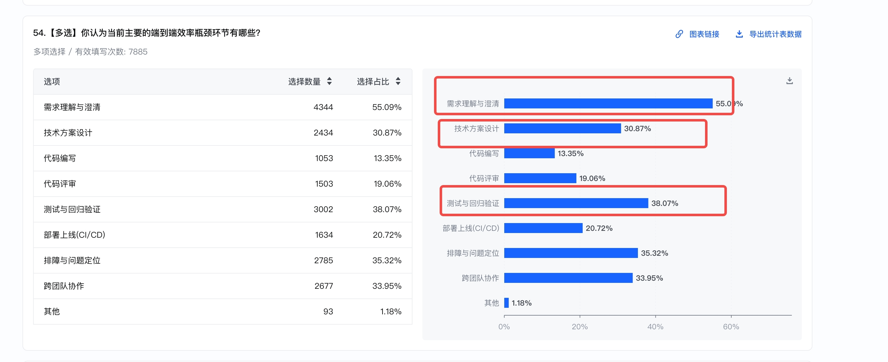
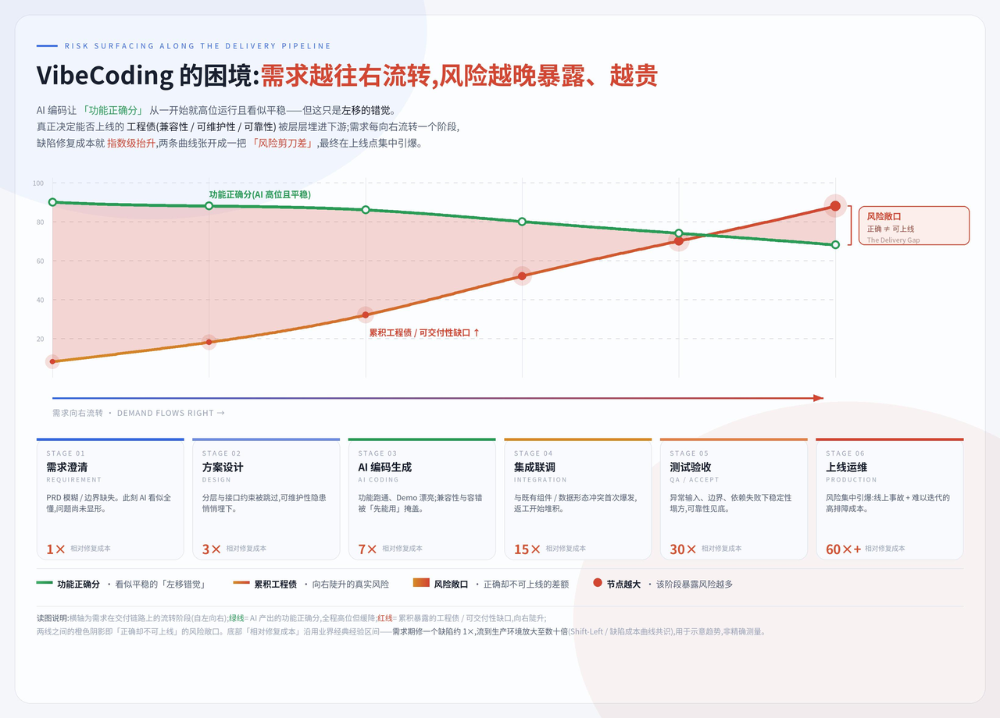
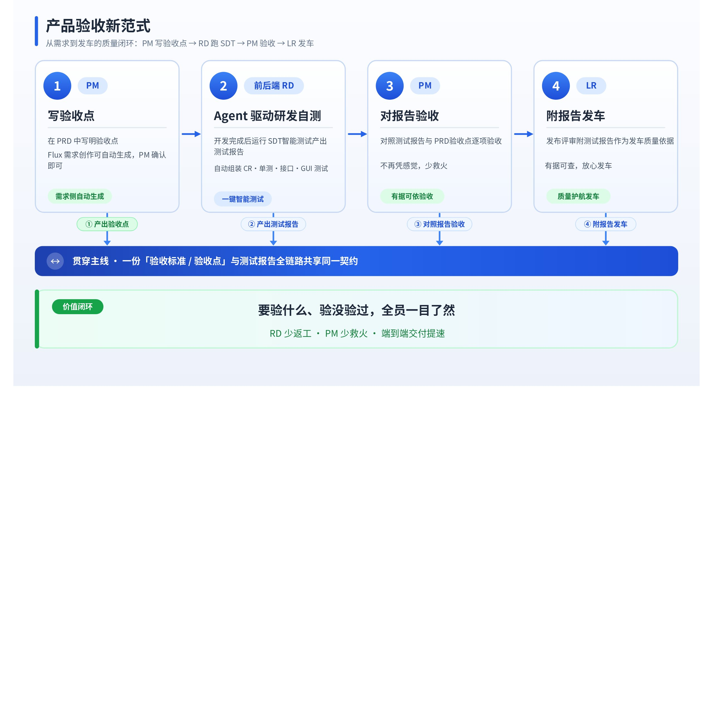
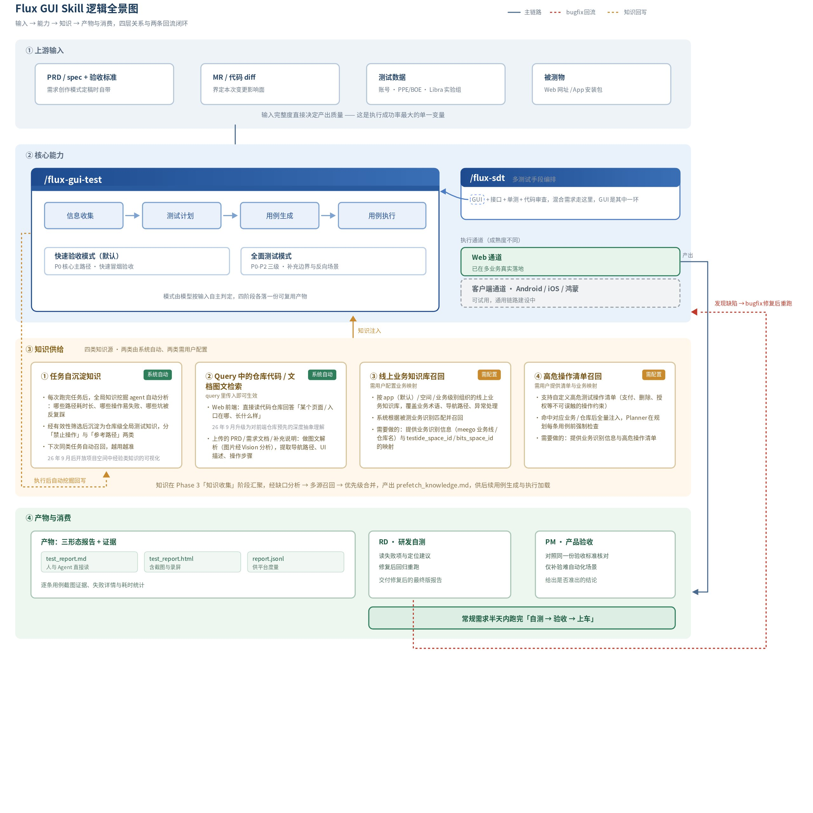
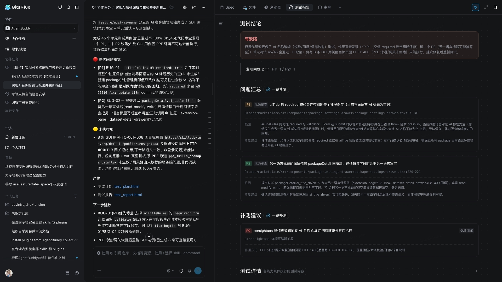
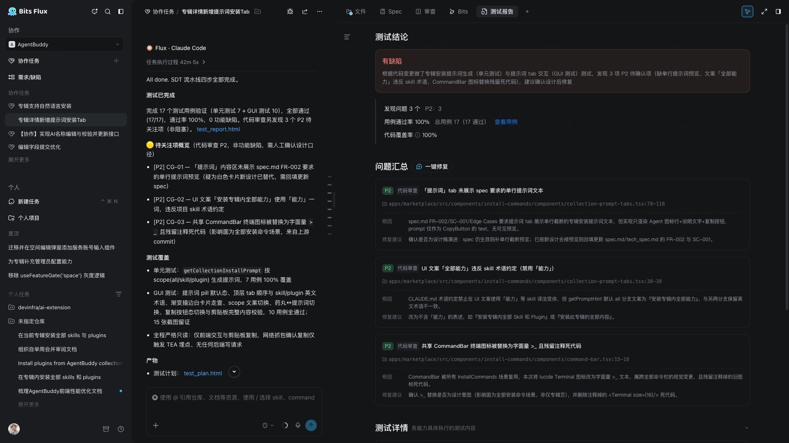
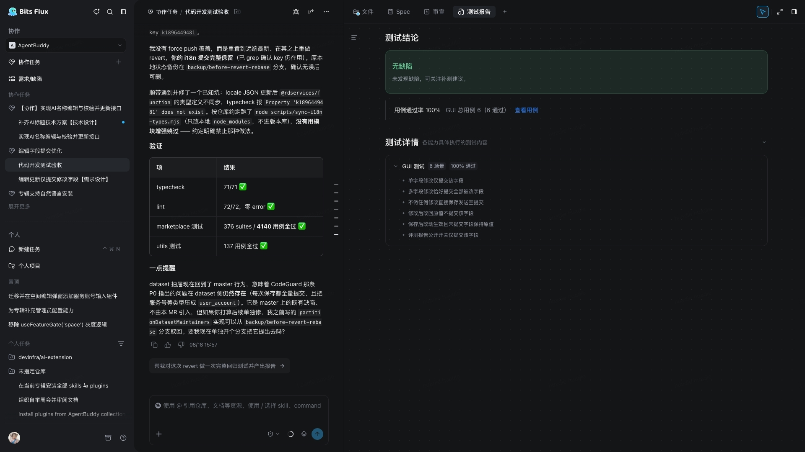
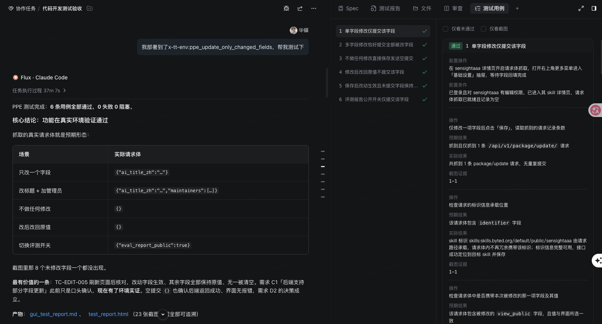

# 产品验收新范式：Agentbuddy团队实践

## 一、先看全局：局部提效不等于端到端提效

一个朴素的观察正在被反复验证：**局部提效不等于端到端提效**。编码被 AI 显著加速后，需求澄清、设计走查、联调、验收、发布并没有同步变快，最慢的环节决定交付节奏。字节 26 年中研发效能调研指向同一处：被认为是端到端瓶颈的环节，排在最前的**恰恰不是代码编写**：需求理解与澄清 55.09% 第一、测试与回归验证 38.07% 第二，代码编写仅 13.35%。**瓶颈在链路的一头一尾，不在中间。**

位置还决定代价：同一个缺陷在需求阶段修约 1x，拖到集成联调放大到 15x、测试验收 30x、上线之后 60x 以上。AI 编码让“功能正确分”始终高位运行，但决定能否上线的兼容性、可维护性、可靠性被层层埋进下游，风险只是**暴露得更晚、也更贵**。所以继续加速编码换不来端到端提速，抓手在于**把不一致与不确定性尽早暴露**；而“做到什么程度才算对”，正是最该左移、又最常被忽略的一环。

## 二、落到我们身上：验收成了那个最慢的环节

> [Agentbuddy](https://skills.bytedance.net/for-you) 是字节内部的 Skill 市场，本文主要讲这支产研团队在研发流程上踩过的坑和最终的解法。

Agentbuddy 作为一支重度使用 AI coding 的产研团队，我们真切感受到了开发提速，也撞上了它的副作用：**开发速度快了，交付节奏却没跟着快起来**。

**我们自己踩过的一个 badcase**：在某次大型需求中，验收环节**集中暴露了大量基础 bug（100+）**，不是需求做错，而是“做到什么算对”从没被同一份文档说清，开发按 A 理解、PM 心里想的是 B，一个需求来回好几轮才收口。

复盘下来，我们发现这条链路上最容易被忽视、又最关键的一环，是**验收标准**。它回答“做到什么程度才算对”。可现实中它往往散落在聊天记录、评审口头结论和个人经验里，导致需求、开发、验收几处根本对不齐：

| 环节 | 问题 |
|-|-|
| **需求创作及评审** | 需求说得含糊，“怎样算做好”讲不清，问题拖到开发完才冒出来，反复返工 |
| **研发自测** | 自己动手点、靠记性覆盖，测过什么没留痕，相关影响面回归一遍成本高 |
| **PM 验收** | PM 收到一个 PPE 环境、凭经验手点测试，与 RD 测的可能重复、可能漏测 |

## 三、解法：验收标准作为唯一依据，让“要什么”与“测什么”同源

在需求阶段就把“验收标准”写清楚，让开发、测试、验收全都照着这同一份标准走，不散落在各处聊天里。

白板原始节点：[`whiteboard-01.raw.json`](产品验收新范式：Agentbuddy团队实践.assets/whiteboard-01.raw.json)

| 阶段 | 怎么做（由 Flux 原生能力承接） | 验收标准在这一环的作用 | 价值 |
|-|-|-|-|
| **① 需求创作与评审**：拒绝模糊需求进开发 | 用 [需求创作模式](https://flux.bytedance.net/new) 做需求，建议引入业务代码仓、与 Agent 持续澄清；PRD 定稿时 Flux **自动生成验收标准**，跟着需求评审一起过一遍，PM 确认即可，如有更新需[保持验收标准同步](https://bytedance.larkoffice.com/docx/Q5m9dPhXBoHncDx9IiVcfTFRnwf#share-EdHndAgnqo7bUAxNEGbcqKXtnHf) | 定稿时讲清“做到什么算对”，尽早暴露需求本身的不一致与不确定性 | 大家看的是同一份标准，需求、开发、验收不再各说各话 |
| **② 编码与研发自测**：Agent 驱动，不靠手点 | 用 [SDD 需求驱动开发](https://bytedance.larkoffice.com/wiki/TMncwycfCiTOO7kObXRckkk3nnf#share-CtF2dXS0foJB9bxBRZvcV8XFnoe) 完成编码；开发完成后用 [SDT 智能测试](https://bytedance.larkoffice.com/wiki/TMncwycfCiTOO7kObXRckkk3nnf#share-JDeedy4pOoGGOXxn6UYcsoDKnBg)，依据同一份验收标准、结合代码变更动态组装 CR、单测、接口、[GUI 测试](https://bytedance.larkoffice.com/wiki/LBEJw8IBHikqRLkRcSNcLGPPnVb)，一键跑通并沉淀截图证据 | 开发不用再东奔西走对细节、翻聊天记录；SDT 直接照标准里写好的场景跑，连带把容易被牵连的老功能一起测了 | 测得更全、还留下截图证据，从“手点”变“自动跑”，也不用等 QA 排期 |
| **③ 产品验收与发车**：在清晰的范围下验收 | PM **结合测试报告按需验收**，只对自动化难构造的场景做补充人工复测，通过后进入发布；需要多人协同时一键“去协作”，由**协作管家**以“上线”为目标推进全流程 | 对着同一份标准一条条核对，不再靠个人经验和临场感觉，是否通过一目了然 | PM 从“逐条手点”变成“看报告 + 补几个盲点”，测试报告成为发车的质量依据 |

白板原始节点：[`whiteboard-02.raw.json`](产品验收新范式：Agentbuddy团队实践.assets/whiteboard-02.raw.json)

**注：评审之后若有需求调整，需要同步更新 PRD 和验收标准。**

验收标准前置，只解决了“第一次说清”。真正的漏点在评审之后，评审现场常常就把方案改了：某个字段砍掉、某个交互换掉、某个边界重新定义。可 PRD 和验收标准往往还停在评审前的版本，开发照着旧标准做、PM 照着旧标准验，前面攒下的一致性又漏光了。

过去这一步靠人肉回写：PM 会后翻录屏、对纪要，逐条改 PRD、再逐条改验收标准。改一次要小半天，久而久之**很多人索性就不改了**：“反正大家心里知道改了什么”，于是标准再次退回聊天记录和个人记忆里。

现在这一步交给 Agent：在 Flux 里**把会议纪要直接发给 Agent**，它会比对纪要与现有 PRD 的差异，把变更点回写进 PRD 正文，并同步更新受影响的验收标准（改判定口径、增删用例、标记待定项），PM 只需 Review 差异、确认定稿。**PRD 保真、验收标准是对的**，才是这套范式能持续跑下去的前提。否则下游 SDT 跑的是过期用例，验收核对的是过期口径。

## 四、收益：常规需求半天内跑完自测到上车

最直观的收益是效率：把验收标准前置、自测交给 SDT、验收对着报告走之后，我们发现**一个需求的 RD 自测、PM 验收、功能上车基本能在半天内完成**，不需要开发与验收之间反复返工。

> **半天内跑完一个需求的“自测 → 验收 → 上车”**
>
> - **RD 自测**：依据验收标准跑 SDT，自动出测试报告；
> - **PM 验收**：对照测试报告与验收标准逐条核对，不再从零构造场景、逐条手验；
> - **功能上车**：验收通过即发车，测试报告作为质量依据，不再反复返工。

**前端 RD 实践案例分享**（Agentbuddy 前端 RD：华蝶）

| 任务链接 | 场景 | 用户原声 / 关键信息 | 测试报告结论 |
|-|-|-|-|
| <https://flux.bytedance.net/task/85288098086329947?panel=detail&view=sdt-report> | 有效拦截问题。 | 基于需求标准生成技术 Spec 后，SDT 覆盖了代码审查、单元测试和 GUI 测试。测试发现 aiTitleRules.required 语义与保留语言标题逻辑存在不一致，同时发现保留语言标题字段可能在提交时被清空，属于需求标准中“标题规则 / 多语言保留”相关风险 | 有缺陷。发现 2 个问题：1 个 P1、1 个 P2。SDT 有效拦截了功能逻辑与需求标准不一致的问题，并给出修复建议与补测建议。 |
| <https://flux.bytedance.net/task/84988579918453558?panel=detail&view=bits> | 有效验证功能相关场景通过。 | 前置需求标准明确了“专辑详情新增提示词安装 Tab”的展示、交互、文案和安装能力要求。基于该标准生成技术 Spec 后，SDT 针对单元测试与 GUI 测试进行验证，覆盖提示词生成、页面展示、文案一致性、安装入口、分享 CommandBar 等场景 | 有缺陷。总计 17 个用例全部通过，但发现 3 个 P2 待确认问题，主要集中在提示词文案、UI 文案表述和 CommandBar 复用影响范围。说明 SDT 不仅验证主功能可用，也能发现需求标准落地过程中的细节偏差。 |
| <https://flux.bytedance.net/task/86036726270731967?panel=detail&view=sdt-report> | 有效验证功能相关场景通过。  | 针对代码开发测试验收场景，需求标准中明确了多字段修改、只读字段、公开开关、校验逻辑等 GUI 行为。基于 Spec 生成测试后，SDT 覆盖 6 个 GUI 用例，验证单字段、多字段、不可修改字段、公开开关和保存后的显示逻辑 | 无缺陷。GUI 测试 6 个场景 100% 通过，未发现缺陷。说明基于需求标准生成的技术 Spec 能够沉淀为可执行 SDT 用例，并有效验证功能相关场景。 |

这几个 Good Case 的共性是：先前置沉淀需求标准，再基于需求标准生成技术 Spec，最后让 SDT 围绕 Spec 做验证。这样一方面能把需求中的关键规则转化成可执行测试点，另一方面也能在代码实现阶段拦截“看起来能跑、但和需求标准不一致”的问题。从结果看，SDT 既能发现 P1 / P2 类实现偏差，也能验证核心功能场景 100% 通过。

1. **能拦截问题**：比如 AI 名称编辑场景里，SDT 识别出 P1 / P2 缺陷和未覆盖链路。
2. **能证明通过**：比如代码开发测试验收场景里，SDT 给出了 typecheck、lint、单测、GUI 场景均通过的证据。
3. **能辅助人工验收**：比如提示词安装 Tab 场景，主流程通过，但 SDT 继续暴露文案、交互、设计一致性问题，帮助人工聚焦确认点。

当需求标准和技术 Spec 足够清晰时，SDT 可以从“补充测试工具”升级为“研发交付前的自动验收层”，既能证明功能通过，也能提前拦截缺陷和遗漏场景。

## 五、如何复制：把范式搬到你的团队

这不是一次性的巧合，而是一套可迁移、能对外复用的研发范式。支撑它跑起来的是 **Bits Flux：Agent 驱动全流程的“多人 + 多 Agent”协作平台**。知识沉淀、需求创作、代码开发、测试验证、发布上线都在同一个 AI 原生工作宿主里，上文三段闭环的每一环都有原生能力直接承接，不用额外搭工具。想直接上手，可以对照这份入门实践：[研发入门 Bits Flux 的 AI 开发协作实践](https://bytedance.larkoffice.com/wiki/XMQTw4BI6iBEqtkRAv0co3BMnMg)。

放回开头那张行业图景来看，这套实践的意义也更清楚：**它让 AI 承担的交付环节从 1 个扩到 3 个**，原本只有编码，现在 Spec 编写与研发自测也交给了 Agent；同时**把 PM 验收从“逐条手点”升级成“看报告 + 补盲点”**。瓶颈不在编码，所以答案也不在继续加速编码，而在把链路两头的环节一个个交出去。

与之匹配的是人的角色变化：PM 不再是流程末端的手工验收员，而是**领域意图的 Owner**，把模糊问题变成 Agent 可消费的验收标准，然后负责目标、风险和最终确认。

> 当编码变得廉价，**把需求讲清、把验收做实**才是交付提速的真正杠杆。Flux 让需求自带验收标准、SDT 让自测变跑批、验收报告让 PM 只做该做的判断，任何团队都能照此把“需求—测试—验收”跑成一个高速、可溯源的闭环。
