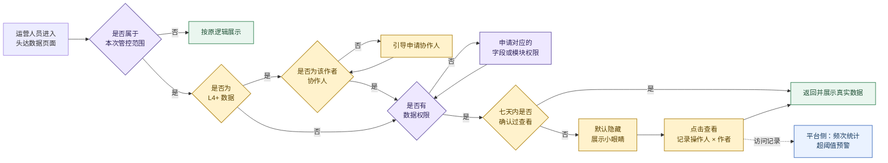
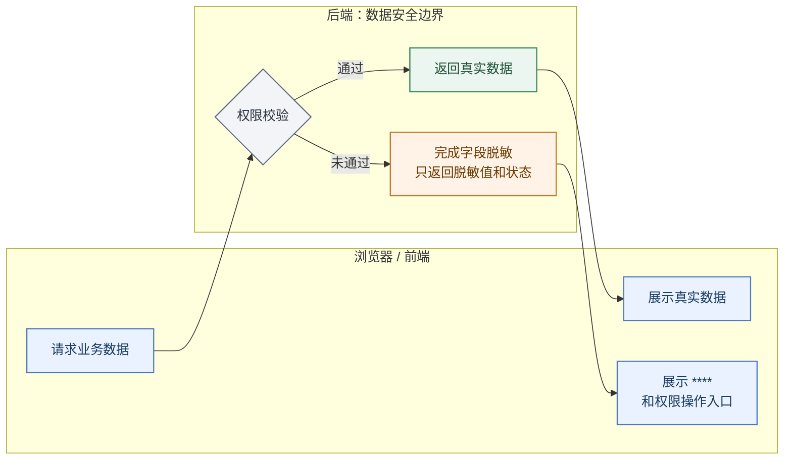
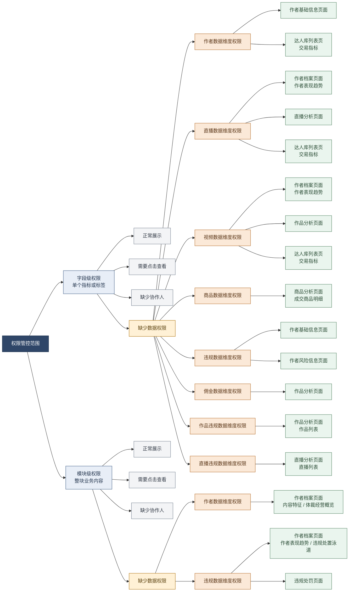
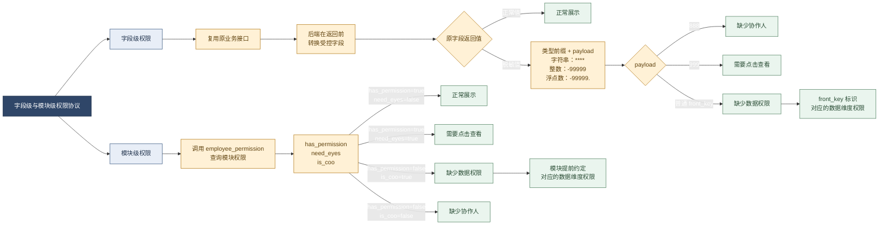
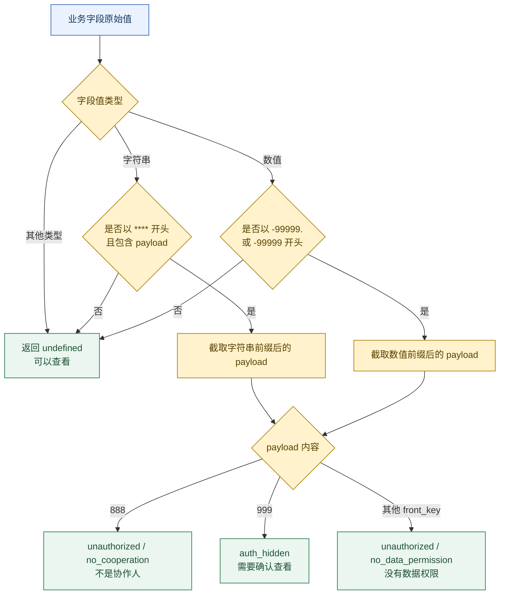
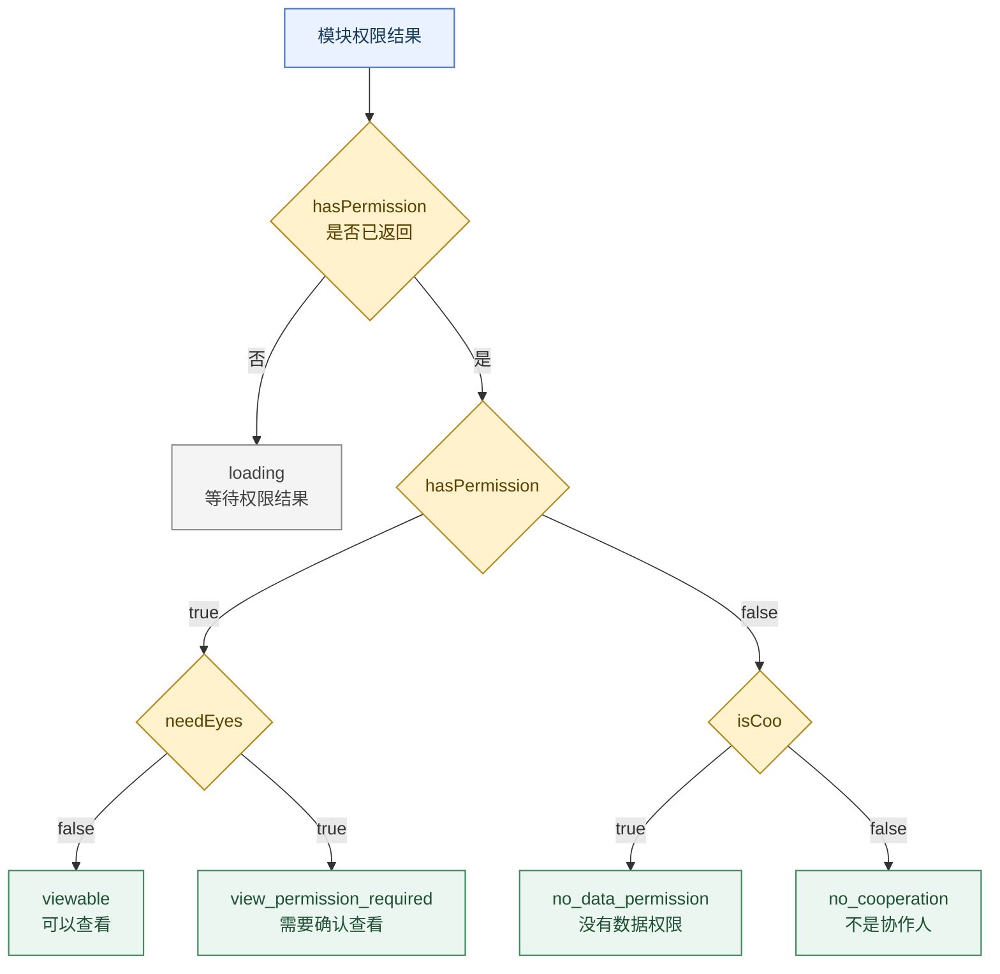

### 3.1 《运营平台\_作者运营\_头达数据分级管控&监控预警》

#### 3.1.1 业务介绍

##### 背景

一次外部舆情事件中，媒体持续引用和传播平台头部达人的销量、销售额等交易数据。这说明现有链路在查询权限、导出限制和访问记录方面仍不够完善，存在敏感数据被非必要查看、对外传播后又难以追溯的问题。因此，平台启动头达数据分级管控专项，对敏感数据实行分级授权，并补齐查看记录和异常访问预警能力。

##### 业务目标

本次管控的核心目标是**根据访问者身份和数据权限，控制头达敏感数据的可见范围**。页面将敏感数据的访问与展示分为四种状态：非协作人、无数据权限、待确认查看和展示真实数据。运营人员进入页面后，系统具体访问决策链如下：




判断结果会直接反映在页面上，分为字段和模块两种粒度。字段粒度只隐藏当前敏感值，保留周边业务信息；模块粒度隐藏整块敏感内容，保留模块位置和下一步操作入口。页面有以下三种受限状态。

###### 1. 非协作人：L4+ 数据需先申请协作人

访问 L4+ 数据时，如果当前人员不是该作者的协作人，页面不展示真实数据，并提供“申请协作人”入口。

**字段粒度：**敏感值显示为 `****`，鼠标移入后说明暂无查看权限，并提供“申请协作人”入口。


**模块粒度：**整个模块不展示真实内容，页面保留模块区域，并提供“申请协作人”按钮。


###### 2. 无数据权限：需先申请对应权限

当前人员没有对应的数据权限时，页面不展示真实数据，并提供权限申请入口。

**字段粒度：**敏感值显示为 `****`，鼠标移入后提示该字段为敏感信息，并提供“立即申请”入口。


**模块粒度：**整个模块使用无权限页面覆盖，用户可在模块内直接发起权限申请。


###### 3. 已有数据权限：待主动确认查看

当前人员已有数据权限，但近 7 天没有主动确认过查看时，真实数据仍默认隐藏。确认查看后，页面展示真实数据，并记录本次查看行为。

**字段粒度：**敏感值显示为 `****`，用户点击小眼睛后查看真实值。


**模块粒度：**模块保留原有页面结构，并用遮罩覆盖敏感内容；用户点击“继续查看”后展示真实数据。


##### 项目职能

前端开发（独立交付）。

#### 3.1.2 技术方案

##### 1. 安全边界：真实数据必须在后端完成保护

**核心问题：**需要脱敏的数据未通过权限校验时，真实值不能下发到浏览器。如果后端先返回真实数据，再由前端隐藏，仍然可以通过抓包或浏览器调试工具获取，页面上的遮罩无法解决数据泄露风险。 因此，<u>**如何保证真实数据的安全性？**</u>

设计方案：后端负责权限校验和字段脱敏。权限校验通过时返回真实数据；未通过时只返回脱敏结果和权限状态。**<u>前端不接触无权限的真实值，只负责识别后端返回状态、展示结果并提供后续操作入口。</u>**把安全边界放在后端响应之前。未通过权限校验的真实数据不会进入网络响应，也不会到达浏览器。




##### 2. 权限复杂度：字段级权限和模块级权限分开设计

**核心问题：**

权限管控包含两种管控粒度、四种权限状态和多类数据维度。

- 字段级权限控制分散在各页面中的单个指标或标签，模块级权限控制整块业务内容。

- 两种粒度都可能出现正常展示、需要点击查看、缺少数据权限和缺少协作人四种状态；

- 缺少数据权限时，还要继续确定对应的数据维度权限。同一个页面可能包含多个数据维度，同一个数据维度也可能分布在多个页面中。

因此， **<u>确认后端进行权限校验以后，后端返回协议如何设计？</u>** 





###### 设计方案：字段复用业务接口，模块先查询权限

- 字段本身可以承载权限信息，因此继续复用原业务接口。后端在返回前将受控字段转换为正常值或脱敏值，前端直接从字段值中识别状态。

- 模块没有可以承载状态的单一字段，因此在加载业务数据前，先调用 `employee_permission` 查询模块权限。



###### 字段级返回协议

由于**<u>一个字段从接口返回到最终展示，会经过多层组件</u>**。以作者详情页“作者表现趋势”中的“直播支付 GMV”为例

```text
接口数据进入页面后
  → 作者表现趋势（AuthorDataTrend）
  → 指标列表（MetricCardList）
  → 单个指标卡（MetricCardItem）
  → 权限提示组件（MaskedTooltip）
```

这说明如果将脱敏值与 `front_key` 分成两个字段，每层组件都要同时传递两项内容，任何一层漏传都会丢失字段标识：

```text
分开传递：value="****"，front_key="live_pay_amt"
合并传递：value="****live_pay_amt"
```

因此，字段协议采用**<u>“固定前缀 + payload”</u>**的组合。字段经过多个组件时仍只需要传递一个 `value`，避免字段标识在中间丢失。

固定前缀与原字段类型匹配；payload 为 `888`、`999` 时表示权限状态，其他值作为 `front_key`，标识字段对应的数据维度权限。

| 原字段类型 | 缺少数据权限         | 缺少协作人   | 需要点击查看 | 正常展示     |
| ---------- | -------------------- | ------------ | ------------ | ------------ |
| 字符串     | `****<front_key>`    | `****888`    | `****999`    | 返回原字符串 |
| 整数       | `-99999<front_key>`  | `-99999888`  | `-99999999`  | 返回原整数   |
| 浮点数     | `-99999.<front_key>` | `-99999.888` | `-99999.999` | 返回原浮点数 |

###### 模块级权限协议

模块权限控制的是一整块内容，没有单一字段可以承载 `****<front_key>`，**<u>因此在业务数据加载前先调用独立的权限查询接口</u>**。

```text
【接口请求】

接口：employee_permission

参数：
- permission_keys：[permission_code]  // 当前模块对应的权限点
- author_id：author_id                // 当前作者
- author_id_for_eye_check：author_id  // 用于判断是否需要点击查看


【接口返回】

- has_permission[permission_code]：true / false  // 当前用户是否拥有该模块的数据权限
- need_eyes：true / false  // 当前作者的数据是否需要点击查看
- is_coo：true / false  // 当前用户是否为该作者的协作人
```

前端根据三个字段的组合确定页面状态，再决定是否加载模块数据。

| 接口字段组合                               | 页面状态     | 后续处理               |
| ------------------------------------------ | ------------ | ---------------------- |
| `has_permission=true` 且 `need_eyes=false` | 正常展示     | 加载并展示模块业务数据 |
| `has_permission=true` 且 `need_eyes=true`  | 需要点击查看 | 不加载真实模块内容     |
| `has_permission=false` 且 `is_coo=true`    | 缺少数据权限 | 不加载真实模块内容     |
| `has_permission=false` 且 `is_coo=false`   | 缺少协作人   | 不加载真实模块内容     |

当模块状态为“缺少数据权限”时，不需 要再从接口返回值中解析数据维度。模块在接入时已经约定对应的数据维度权限，例如体裁经营概览对应作者数据维度权限，违规处罚页面对应违规数据维度权限。

##### 3. 配置维护：权限 code 调整时只修改 TCC 映射

**核心问题：**

页面需要一个标识来确定字段或模块对应的数据权限。如果直接使用权限平台的 code 作为页面标识，code 发生调整后，页面传参、字段协议和权限组件都需要修改，并重新发布代码。 因此，**<u>权限 code 调整后，如何避免需要修改代码？</u>**

**设计方案：**页面和前后端协议统一使用稳定的 `front_key`。平台 code 不直接写入页面，而是通过 TCC 的 `indicator_auth_config` 维护与 `front_key` 的对应关系：

```text
接口： apiGetTccValue
请求： keys = ["indicator_auth_config"]
返回： data["indicator_auth_config"]

页面传入 front_key
  → apiGetTccValue 获取 indicator_auth_config
  → 按 front_key 匹配配置
  → 申请权限时使用 auth_code
  → 查询模块权限时使用 permission_code
```

| 配置字段          | 含义                           |
| ----------------- | ------------------------------ |
| `indicator_key`   | 后端处理的业务指标             |
| `front_key`       | 页面和前后端协议使用的稳定标识 |
| `auth_level`      | 数据权限等级                   |
| `auth_code`       | 申请数据权限时使用的平台 code  |
| `permission_code` | 查询模块权限时使用的平台 code  |

这样，页面只依赖稳定的 `front_key`。平台 code 发生变化时，只需要更新 TCC 配置，不需要修改和重新发布前端代码。

```text
调整前：front_key → 原平台 code
调整后：front_key → 新平台 code
```

##### 4. 权限操作：四种状态如何逐步进入正常展示

**核心问题：<u>权限状态确定后，前端如何完成后续操作并最终展示真实数据？</u>**

**设计方案：**四种状态按照“缺少协作人—缺少数据权限—需要确认查看—正常展示”的顺序流转。

1. **缺少协作人：**运营人员点击申请成为协作人，前端提交作者和申请信息，后端记录申请信息并发起协作人申请。权限平台审批通过后，页面刷新并重新判断权限状态。
2. **缺少数据权限：**运营人员点击申请数据权限，前端提交 `front_key` 并调用 `apiGetTccValue`。后端返回 `indicator_auth_config`，获取对应的 `auth_code`，前端根据`auth_code`申请数据权限。审批通过后，页面再次刷新并重新判断。
3. **需要确认查看：**运营人员点击小眼睛，前端调用 `apiSaveAccessDataLog`，后端记录运营人员、作者和查看时间。记录成功后，前端刷新页面并重新请求业务数据。
4. **正常展示：**后端确认当前权限状态后返回真实数据，前端直接展示。


#### 3.1.3 实现要点

##### 要点一：将各页面重复的权限处理提取为公共能力

###### 1. 当前问题

**核心问题：<u>权限管控覆盖范围广</u>。**需求横跨多个页面，分布在表格、指标卡、详情项和整块业务模块中，同时包含字段级和模块级两种管控方式。如果由页面分别实现，每个位置都要重复处理状态判断和权限管控，**<u>因此，如何实现页面不同位置的权限统一管控？</u>**。

###### 2. 设计框架

- **判断来源不同，保留两条链路。**字段级从业务字段原始值中解析状态；模块级根据权限接口结果判断状态。
- **管控逻辑相同，统一放到公共层。**两条链路的判断来源不同，但后续管控逻辑一致，因此由公共方法和公共组件统一处理。
- **页面只负责传入业务数据。**字段传入原始值，模块传入 `fieldKey` 和 `authorId`，权限判断和处理由公共层完成。


###### 3. 字段级与模块级判断链路

###### 字段级权限判断链路

字段级权限主要由 `parseSensitiveMask` 从业务字段值中解析，处理过程分为三层：

1. `parseSensitiveMask` 识别没有命中占位协议时返回 `undefined`，对应“可以查看”。
2. `parseSensitiveMask` 根据数据类型识别占位前缀：字符串使用 `****`，数值使用 `-99999.` 或 `-99999`。数值先判断浮点前缀，避免被整数前缀提前截断。
3. `resolveMaskedPayload` 解析前缀后的 payload：`888` 表示“不是协作人”，`999` 表示“需要确认查看”，其他值作为 `front_key`，表示“没有数据权限”。



```ts
function resolveMaskedPayload(rawPayload) {
  const payload = rawPayload.trim();

  if (payload === '888') {
    return { type: 'unauthorized', reason: 'no_cooperation' };
  }
  if (payload === '999') {
    return { type: 'auth_hidden' };
  }
  return {
    type: 'unauthorized',
    reason: 'no_data_permission',
    fieldKey: payload,
  };
}

function parseSensitiveMask(value) {
  if (typeof value === 'string') {
    if (value.startsWith('****') && value.length > 4) {
      return resolveMaskedPayload(value.slice(4));
    }
  }

  if (typeof value === 'number') {
    const normalized = String(value);
    if (normalized.startsWith('-99999.') && normalized.length > 7) {
      return resolveMaskedPayload(normalized.slice(7));
    }
    if (normalized.startsWith('-99999') && normalized.length > 6) {
      return resolveMaskedPayload(normalized.slice(6));
    }
  }

  return undefined;
}
```

###### 模块级权限判断链路

模块级权限主要由 `getSensitiveModulePermissionState` 直接解析结构化权限结果：

1. `hasPermission=true` 时继续判断 `needEyes`：不需要确认查看时为 `viewable`，需要确认查看时为 `view_permission_required`。
2. `hasPermission=false` 时继续判断 `isCoo`：已经是协作人时为 `no_data_permission`，不是协作人时为 `no_cooperation`。
3. 权限结果尚未返回时为 `loading`，仅表示判断过程中的过渡状态，不计入最终四种权限状态。



```ts
function getSensitiveModulePermissionState(permission) {
  if (permission?.hasPermission === undefined) {
    return 'loading';
  }

  if (permission.hasPermission) {
    return permission.needEyes
      ? 'view_permission_required'
      : 'viewable';
  }

  return permission.isCoo
    ? 'no_data_permission'
    : 'no_cooperation';
}
```

##### 要点二：用公共组件统一权限展示和操作

###### 1. 核心问题

**核心问题：如何统一处理不同权限状态。**同一个字段或模块需要处理多种受限状态，每种状态对应不同的权限内容和后续操作。如果为每种状态分别编写判断和组件，调用方需要自行选择处理方式，逻辑会被拆散，也会增加重复代码。

###### 2. 设计框架

1. **只替换需要权限管控的内容。**字段需要权限处理时，将原字段值替换为 `MaskedTooltip`；模块需要权限处理时，将原业务模块替换为 `SensitiveNoPermission`，页面其他内容保持不变。
2. **在公共组件内部统一处理权限状态。**组件根据当前状态选择对应的权限内容和操作入口，统一处理确认查看、协作人申请和数据权限申请。


###### 3. 字段级组件：MaskedTooltip

**如何替换：**页面先判断字段是否命中脱敏协议。普通字段沿用原来的展示方式；需要权限处理时，在原字段位置使用 `MaskedTooltip`，不改变表格、指标卡和详情项中的其他内容。

**内部处理：**`MaskedTooltip` 通过 `parseSensitiveFieldState` 获取字段权限状态，再选择对应的权限内容和操作入口。缺少协作人时调用页面传入的 `onApply`；缺少数据权限和需要确认查看时，进入公共的数据权限申请或确认查看链路。页面不再分别编写三种状态分支。


==原图 - 权限状态截图 - 代码==

```tsx
function renderField(value) {
  if (!isSensitiveMaskedValue(value)) {
    return value;
  }

  return (
    <MaskedTooltip
      maskedValue={value}
      authorId={authorId}
      onApply={openCooperationModal}
    />
  );
}

function MaskedTooltip({ maskedValue, authorId, onApply }) {
  const state = parseSensitiveFieldState(maskedValue);

  return renderFieldPermission({
    state,
    actions: {
      no_cooperation: onApply,
      no_data_permission: applySensitivePermission,
      auth_hidden: () => requestSensitiveViewPermission(authorId),
    },
  });
}
```

###### 4. 模块级组件：SensitiveNoPermission

**如何替换：**页面取得模块权限状态后，可以查看时继续使用原业务模块；需要权限处理时，用 `SensitiveNoPermission` 替换整个模块内容，模块外的页面内容保持不变。

**内部处理：**`SensitiveNoPermission` 接收模块状态和 `fieldKey`，再选择对应的权限内容和操作入口。三类权限操作与字段级组件保持一致，调用方不需要根据状态切换不同组件。

```tsx
function renderModule(permissionState) {
  if (permissionState === 'viewable') {
    return <BusinessModule />;
  }

  return (
    <SensitiveNoPermission
      permissionState={permissionState}
      fieldKey={fieldKey}
      onApply={openCooperationModal}
    />
  );
}

function SensitiveNoPermission({ permissionState, fieldKey, onApply }) {
  return renderModulePermission({
    state: permissionState,
    actions: {
      no_cooperation: onApply,
      no_data_permission: () => applySensitivePermission(fieldKey),
      auth_hidden: requestSensitiveViewPermission,
    },
  });
}
```


##### 要点三：分别实现三类权限操作

###### 1. 核心问题

**三类权限操作依赖的能力不同。**数据权限申请依赖权限平台弹窗，协作人申请依赖页面内的申请弹窗，确认查看后还需要更新当前页面的数据。**因此，如何分别实现三类权限操作？**

###### 2. 依赖关系

三类操作分别依赖外部宿主平台、当前业务页面以及后端与页面的配合，具体接入方式不同。下图只说明这一问题，三类操作的实现分别在后文展开。


###### 3. 数据权限申请：调用宿主平台弹窗

数据权限申请弹窗由宿主平台提供，不是当前项目渲染的 React 组件。宿主平台通过 `window.GarfishBridge.actionBridge.showApplyDimensionPopup` 开放调用入口，因此页面不需要放置弹窗，也不需要维护弹窗的显示状态。

1. 公共组件调用 `applySensitivePermission`，传入字段权限标识 `fieldKey`；已有 `authCode` 的场景可以直接传入。
2. 全局方法通过 TCC 将 `fieldKey` 转换为权限平台使用的 `authCode`。
3. `GarfishBridge` 将 `authCode` 作为权限类型传给宿主平台，由宿主平台打开并处理数据权限申请弹窗。

```ts
const authCode = input.authCode ?? resolveAuthCodeByTCC(input.fieldKey);

window.GarfishBridge.actionBridge.showApplyDimensionPopup({
  dimension_type: authCode,
});
```

宿主平台已经提供了不依赖具体页面的弹窗能力，因此数据权限申请可以由全局方法统一处理。

###### 4. 协作人申请：由当前页面打开申请弹窗

存量代码中，作者列表和作者详情分别维护自己的协作申请弹窗，因此本次需求无需重新实现一套弹窗，而是复用两处页面原有的申请能力。页面把“打开当前弹窗”的方法统一作为 `onApply` 传给公共权限组件；公共组件识别到“缺少协作人”后只调用 `onApply()`，不关心页面使用哪一种弹窗。


```tsx
<MaskedTooltip onApply={onApply} />
```

**作者列表：接入原有的单作者协作申请链路。**作者列表页面已经渲染 `operationModals`，其中包含协作申请弹窗。

```tsx
// operationModals 已经渲染在作者列表页面中
{operationModals}
```

本次需求新增 `triggerSingleCooperateApply` 作为连接方法，将当前行的达人信息交给存量 `handleOperate`。`handleOperate` 可以修改弹窗状态，使 `operationModals` 中已有的协作申请弹窗显示出来。

```ts
const onApply = () => triggerSingleCooperateApply(record);

triggerSingleCooperateApply: author => {
  void handleOperate(AuthorOperateType.Cooperate, author);
};

// 简化伪代码：handleOperate 修改已有弹窗的显示状态
handleOperate(AuthorOperateType.Cooperate, author) {
  查询协作申请信息(author);
  setModalProps({
    visible: true,
    operateType: AuthorOperateType.Cooperate,
  });
}
```

**作者详情：控制当前业务 Tab 中的 `ApplyManageModal`。**`ApplyManageModal` 没有统一渲染在作者详情主组件中，而是由需要协作申请能力的业务 Tab 分别渲染。每个 Tab 使用自己的 `applyModalVisible` 管理显示状态，并将修改该状态的方法作为 `onApply` 传给公共权限组件。

```tsx
const [applyModalVisible, setApplyModalVisible] = useState(false);

const handleApplyManage = () => {
  setApplyModalVisible(true);
};

<ApplyManageModal
  author_id={authorId}
  visible={applyModalVisible}
  onClose={() => setApplyModalVisible(false)}
/>
```

两条链路最终都由当前页面打开已有的协作申请弹窗：作者列表通过 `handleOperate` 控制列表弹窗，作者详情通过 `setApplyModalVisible` 控制当前 Tab 的 `ApplyManageModal`。公共权限组件只提供统一入口，页面继续负责弹窗状态和后续申请流程。

###### 5. 确认查看：记录操作并刷新当前页面

确认查看后不能直接把原来的脱敏内容替换为真实值。前端先调用 `apiSaveAccessDataLog` 保存“操作人查看当前作者”的记录；保存成功后，再执行当前页面预先注册的刷新方法，重新请求后端数据。记录失败时不进入刷新链路，页面继续保持脱敏状态。


**作者列表：通过 `getList(false)` 重新查询当前列表。** `getList` 是作者列表原有的取数方法，会读取当前页码、筛选条件、排序方式和赛道，调用 `apiAuthorSearch` 重新查询，并用返回结果更新 `authorList`。列表状态变化后，表格随之重新渲染。传入 `false` 表示不将页码重置为第一页，从而保留当前查询位置。

```ts
setSensitiveViewPermissionSuccessHandler(async () => {
  await getList(false);
  return true;
});

// 简化伪代码
getList(reload = true) {
  if (reload) pageNo = 1;
  const result = await apiAuthorSearch(getParams());
  setAuthorList(result);
}
```

**作者详情：通过 `forceRefreshTab` 重挂载当前 Tab。** `forceRefreshTab` 将当前 Tab 在 `tabRefreshVersionMap` 中的版本号加一。版本号参与 Tab 外层 `Fragment` 的 `key`；版本号变化后 `key` 也会变化，React 会重新挂载当前 Tab，Tab 内原有的数据请求随之重新执行。

```tsx
const forceRefreshTab = currentTab => {
  setTabRefreshVersionMap(prev => ({
    ...prev,
    [currentTab]: (prev[currentTab] ?? 0) + 1,
  }));
};

const version = tabRefreshVersionMap[currentTab] ?? 0;

<Fragment key={`${currentTab}-${version}`}>
  {RenderTabContent}
</Fragment>
```

如果当前页面没有注册刷新方法，则使用 `window.location.reload()` 整页刷新兜底，避免页面继续展示旧的权限状态。

前面的权限判断、页面渲染和申请链路完成后，需求进入联调和交付。本次改动涉及 16 个接口、12 个页面或模块，以及多种权限状态。调试时需要反复修改接口响应，交付前还要反复查看增量覆盖率、定位未覆盖代码。继续手动处理会花费大量时间，因此将这两类重复工作分别整理为 Mock Skill 和前端增量覆盖率 Skill，交由 AI 按固定规则执行。


##### 要点四：将重复交付工作沉淀为 Skill

###### Mock Skill：批量切换权限状态

**解决的问题**：

本次需求涉及多个接口和大量受控字段。同一种权限状态需要同时修改字段级和模块级返回。人工 Mock 时，需要逐个找到接口响应、修改对应字段，再检查是否遗漏；每次切换状态都要重新处理。

**核心目标**：

只指定一种权限状态，由 AI 按统一规则批量修改所有受控接口的本地响应，使同一轮调试中的字段和模块使用相同的权限状态。

**Skill 规范设计**：

Chrome Local Overrides 可以读取本地目录中的响应文件，并用本地响应替换原接口返回。基于这一能力，每个受控接口统一记录响应文件、字段或模块的改写位置，以及正常展示、无数据权限、非协作人和待确认查看四种状态的改写规则。

切换状态时，Skill 读取这些规则，由 AI 批量修改并替换 Overrides 关联目录中的响应文件。刷新页面后，Chrome 直接加载修改后的响应。接口规则和状态映射集中维护，Skill 负责统一修改和替换，Chrome Local Overrides 负责加载文件。

**规范图：**


###### 前端增量覆盖率 Skill：自动定位覆盖缺口

**解决的问题**：

权限改动分散在多个页面和公共组件中。手动检查覆盖率时，需要反复打开文件报告、查找未覆盖代码行，再回到页面操作对应功能。报告刷新后，还要重新判断下一个缺口，步骤重复且容易漏掉分支。

**核心目标**：

让 AI 自动定位覆盖缺口，再通过 Chrome DevTools MCP 操作真实页面，触发未覆盖的代码分支并刷新覆盖率结果。

**Skill 规范设计**：

Skill 先调用华佗 `branch/files` 获取变更文件覆盖率，再通过 `branch/code` 定位未覆盖行。覆盖率未达到 90% 时，过滤没有新增代码的文件和生成代码，选择未覆盖行最多的文件。AI 根据未覆盖代码和验收项确定页面操作路径，再调用 Chrome DevTools MCP 在真实页面完成点击、切换和提交等操作。

查询接口保持真实请求；涉及数据写入时，在浏览器网络层返回 Mock 响应，避免产生真实业务数据。页面操作完成后重新获取华佗报告，继续处理下一个覆盖缺口，达到 90% 后结束。

**规范图：**


#### 3.1.4 项目总结

##### 项目成果

1. **交付结果**：一期、二期均完成上线，运行期间无明显问题。
2. **覆盖结果**：根据 PRD 信息分级表的风控安全评级统计，共包含 58 个 L3、51 个 L4 和 13 个 L4+ 数据项；本项目覆盖其中 64 个 L4/L4+ 敏感数据项，涉及 16 个接口和 12 个页面/模块，敏感数据项覆盖率为 100%。
3. **使用结果**：小眼睛查看链路上线后累计生成 **4,486 条访问记录**；数据权限申请链路能够拦截无权限访问并引导用户发起审批，线上已产生实际审批记录。
4. **技术成果**：沉淀权限 Mock Skill 和前端增量覆盖率 Skill，分别用于批量切换四种权限状态，以及自动获取覆盖率、定位未覆盖代码并刷新结果；

##### 个人成果

###### 做得好（收获经验）

1. **复杂需求需要先读完整调用链**：先确认现有组件、接口调用、状态来源和页面刷新方式，再决定复用或新增，避免重复实现已有能力。
2. **学会沉淀可复用的技术**：将多页面共用的权限判断和展示逻辑整理为公共组件，将反复执行的 Mock 和覆盖率检查整理为 Skill，不只解决当前页面的问题。

###### 做得不足（待改进）

1. **代码审查不够仔细**：部分问题在测试阶段才暴露，导致返工。后续在提测前集中核对需求、接口和主要页面链路。
2. **扩展设计过多**：部分参数和判断没有实际使用。后续以当前需求和实际调用方为边界，不提前实现没有明确场景的逻辑。


# 头达数据分级管控

## 问题：在头达数据分级管控的需求评审中，你是否提出过相关的修改意见？


有，我主要从敏感数据的覆盖范围和无权限状态下的图表展示两个方面提出了修改意见。

第一，敏感数据的覆盖范围不够完整。

作者等级和当前结算金额会同时展示在达人库列表和作者详情页中，但两个页面的数据来源不同：达人库列表通过作者搜索接口获取数据，作者详情页则通过作者等级详情接口获取数据。

最初的需求文档只要求管控作者搜索接口中的敏感字段，没有覆盖作者详情页使用的接口。这就可能导致列表中的结算金额已经脱敏，但进入作者详情页后仍然可以看到。因此，我提出不能只按照单个接口梳理敏感字段，还要检查敏感数据在各个页面中的展示位置，保证所有入口都被完整覆盖。

第二，无数据权限时，图表应该如何展示。

如果没有对图表进行单独处理，无权限的数据点可能会被统一处理成 0，最终显示成一条全零的折线。这样不仅视觉效果不好，还容易让用户误以为真实业务数据就是 0，而不是当前没有查看权限。

最终的方案是生成一条与真实数据无关的占位曲线，保留图表的基本结构；同时在图表上增加毛玻璃遮罩、无权限插图和权限申请入口，让用户能够明确区分“数据为 0”和“没有查看权限”这两种状态。


## 问题：在技术方案讨论中，你主要提出或参与了哪些内容？

我主要参与了三个方面的讨论。

第一，明确安全边界。

对于没有查看权限的用户，服务端不应该把真实数据下发到浏览器。这样即使用户通过抓包工具查看接口响应，也无法获得真实的敏感数据。这个原则在方案讨论中比较容易达成共识。

第二，讨论字段权限的返回方式。

方案没有新增单独的权限字段，而是 然后是通过字段加标识的方式来判断该字段是否有权限，。这样一方面可以复用原有的数据结构，减少接口改造成本；另一方面，字段在前端多个组件之间传递时，能够降低单独传递权限字段时被遗漏的风险。

第三，提出模块权限可能被绕过的问题。

按照当时的设计，前端会先调用权限查询接口，确认用户有权限后，再请求真实的业务数据。但如果用户通过 Mock 工具把权限接口的结果修改为“有权限”，前端就可能继续请求真实数据。我当时向 Server 端和产品提出了这个风险。不过，经过讨论，大家认为当前的安全边界不需要覆盖具有平台登录态、并且主动使用抓包或 Mock 工具篡改接口结果的场景，因此没有进一步调整这部分方案。


## 问题：将各页面重复的权限处理逻辑提取成公共能力，它的技术难点是什么？

这部分的技术难点，主要在于如何划分公共能力和页面能力的边界。

最大的技术难点是**合理划分公共能力与页面能力的边界**—— 既要把通用逻辑沉淀下来、减少重复代码，又不能为了兼容所有特例把公共层做得过于臃肿，反而降低稳定性和可维护性。

具体处理的时候，我主要遵循三个原则：

第一，判断来源不同的链路不强行合并。字段级权限是从业务字段值里解析状态，模块级权限是从独立接口里获取状态，两者的判断入口完全不一样。所以公共层保留了两条独立的判断链路，各自做状态解析；只是把后续的状态映射、展示样式、操作入口统一收敛到对应的公共组件里。这样既统一了管控逻辑，也没有违背两种权限的原生设计。

第二，存量功能优先复用、最小改造。比如协作人申请弹窗，作者列表和详情页本来就有各自的实现和状态管理，没法统一收口成全局方法。我就没有强行重构存量逻辑，而是在公共组件里定义统一的触发入口，由页面把 “打开弹窗” 的方法作为回调传进来。公共组件只负责在 “缺少协作人” 的状态下调用这个回调，不关心页面内部弹窗怎么渲染、怎么提交。这样接入成本最低，也不会破坏原有功能的稳定性。

第三，特殊场景不强行塞入公共组件。比如作者经营体裁的图表模块，虽然也在管控范围内，但它需要对图表里每个数据点单独做脱敏，不是整块替换成无权限组件的模式。这种特例我就放在页面层单独处理，没有为了这一个场景在公共组件里额外加分支判断。否则公共组件会越来越臃肿。

整体的思路就是：通用逻辑坚决下沉，差异化逻辑保留在页面侧，平衡好复用性和复杂度，不让公共能力因为过度兼容变得难用。


## 问题：公共组件设计过程中的难点是什么？

这部分的主要难点是保证公共组件的稳定性。

公共组件会被多个页面复用，一旦组件逻辑出现问题，所有接入页面的权限判断和页面展示都可能受到影响，问题的影响范围比较大。

因此，每次修改公共组件后，都需要对所有接入页面进行回归验证，检查不同权限状态下的页面展示、原有数据渲染和后续操作是否正常，避免公共组件的改动导致存量功能出现能力退化。


## 问题：**公共组件** **`SensitiveNoPermission`** 使用 `ResizeObserver` 读取容器尺寸是什么作用？

这里使用的是 `ResizeObserver`。具体实现可以分成两层：公共组件根据容器尺寸调整内部布局。

如果整个模块没有权限，把原来的内容区域替换成无权限组件。组件会读取容器尺寸：

- 高度小于 80 像素时，使用紧凑布局，只显示提示文案和文字形式的申请入口；
- 高度足够时，使用普通布局，展示提示文案和申请按钮；
- 宽度不小于 350 像素且高度不小于 200 像素时，再额外展示无权限插图。

 那么效果其实在3.1.3的第一张图里是可以看到的。这里违规处置这里其实是模块权限，用的是模块的公共组件，但它没有显示图片和按钮，就直接使用的提示文案和文案形式的一个申请入口。


## 问题：如果多个页面或组件都进行了注册，怎么避免方法相互覆盖？

当前的页面注册的刷新方法只有两类，一类是在作者列表下的刷新，另一种是在作者详情页的页面中注册的刷新方法，它们之间并不会相互影响，是因为作者详情页通过 `window.open` 打开新的业务标签页，不是在当前单页应用中直接进行路由跳转。作者列表、不同的作者详情页分别运行在独立的页面实例中，各自拥有独立的 JavaScript 运行环境和全局变量。

因此，作者列表和多个作者详情页可以同时存在，并分别维护自己的刷新方法。它们的全局方法并不共享，所以不会出现一个详情页的注册操作覆盖作者列表或另一个详情页刷新方法的情况。

#### 追问：既然申请协作人权限可以通过参数传入，为什么刷新方法不也通过参数传递？

从代码可靠性来看，通过参数传递刷新方法会更明确。哪个组件发起权限申请，就执行这个组件传入的刷新方法，不需要依赖模块级变量，也不存在刷新方法被其他组件覆盖的问题。

但是，当前权限入口分布在列表字段、详情模块和 Tooltip 等多层组件中。如果通过参数传递，就需要把 `getList` 或详情页的刷新方法**从页面顶层逐层传入所有权限组件，不仅改造范围比较大，后续新增权限入口时也容易漏传。**

因此，当前方案选择由页面统一注册刷新方法。作者列表页只需要注册一次 `getList`，作者详情页只需要注册一次当前详情模块的刷新方法，内部权限组件不需要关心具体应该刷新哪个页面。

#### 追问：既然刷新方法采用了全局注册，为什么协作人申请没有使用同样的方式？

协作人申请并不是本次字段脱敏需求新增的功能。作者列表页原本就有 `triggerSingleCooperateApply`，作者详情页也已经有 `handleApplyManage`、申请弹窗以及完整的申请流程。这些存量能力通过 `applyManage`、`onApply` 等回调参数在组件之间传递。

本次接入公共权限组件时，AI 继续复用了这条存量链路：也就是将 onApply 方法作为回调参数传递给公共组件，再由作者列表页或作者详情页执行原来的申请逻辑。这样不需要重新改造申请弹窗、作者参数和页面状态的处理方式。

所以，这里没有使用全局注册，并不是因为全局方式无法实现，而是 AI 在分析现有代码后，选择了改动更小的兼容方案：保留原有的 `onApply` 回调链路，只让公共权限组件接入并调用它。


#### 追问：如果多个详情页也不是独立的浏览器标签页，如何保证刷新方法不会相互覆盖？

  最简单的方式就是通过全参来为每个详情页提供独立的回调方法，更合适的方案是为每个详情页 提供独立的 Context：

```
详情页 A
└── Context：refreshHandler = 刷新列表
    └── 公共组件 A

详情页 B
└── Context：refreshHandler = 刷新作者详情
    └── 公共组件 B
```

公共组件只会读取离自己最近的 Context，因此：

- 公共组件 A 只会刷新列表；
- 公共组件 B 只会刷新作者详情；
- 即使两个 Tab 同时挂载，刷新方法也不会相互覆盖；
- Tab 关闭以后，它对应的 Context 和刷新方法会一起销毁。

 

另一种方式是继续使用全局刷新方法，但不在每个页面或组件初始化时进行注册，而是在页面切换时更新当前的刷新方法。

具体来说，可以监听 Tab 的切换事件。当用户切换到某个详情页时，通过 `activeIndex` 记录当前处于激活状态的页面。`useEffect` 监听 `activeIndex` 的变化：活跃页面发生切换后，先清除上一个页面注册的刷新方法，再注册当前页面对应的刷新方法。

整体流程如下：

```
用户切换 Tab
→ 更新 activeIndex
→ useEffect 监听到活跃页面变化
→ 清除上一个页面的刷新方法
→ 注册当前页面的刷新方法
```

这样即使多个详情页同时处于挂载状态，全局也只会保留当前活跃页面的刷新方法，从而避免调用到非活跃页面的旧刷新逻辑。


## 问题：你提到部分问题直到测试阶段才暴露，具体是什么问题？为什么会导致返工？

**回答：**

主要是误改了存量代码中的已有功能。

例如，在改造作者详情页时，误删了“作者等级变更记录”的入口，导致用户无法查看作者等级的历史变更。这个入口不属于本次需求的改造范围，因此在开发和代码审查阶段，主要关注的是新增权限功能是否符合预期，没有对相关存量功能进行完整的回归测试。这个问题直到测试阶段才被发现，最后需要恢复入口并重新验证相关功能，因此产生了返工。

这也是使用 AI 开发时比较常见、同时不容易发现的一类问题。AI 在验收时通常会重点关注当前需求新增或修改的测试项。如果没有进行回归测试，或者回归测试覆盖不够完整，一些被意外修改的存量功能就很难被及时发现。


## 问题：你提到存在部分参数和判断没有实际使用，具体是什么问题？

**回答：**

主要问题是在设计方法时设置了过多的可选参数，但这些参数在后续接入中并没有实际使用。

例如，`MaskedTooltip` 提供了字段标识 `fieldKey` 和权限编码 `authCode` 等可选参数及其判断逻辑。但实际上，`fieldKey` 可以通过公共权限判断方法直接从 `value` 中解析出来，不需要由页面单独传入，因此相关的参数和判断逻辑没有被使用。

在使用 AI 开发时，AI 可能会考虑过多未来的接入方式，提前增加一些扩展参数。虽然这些参数不会直接影响当前功能，但会增加不必要的判断分支，也会干扰后续的二次开发。

例如，原本只需要传入一个 `maskedValue`，AI 看到方法中存在多个可选参数后，可能会尝试补全所有参数。即使页面没有提供明确的 `fieldKey`，AI 也可能从接口返回结果中选择一个相似字段作为 `fieldKey`。

如果后续逻辑是“传入了 `fieldKey` 就优先使用，不再从 `value` 中解析”，那么一旦 AI 传入了错误的 `fieldKey`，整个权限判断链路就会出错。
