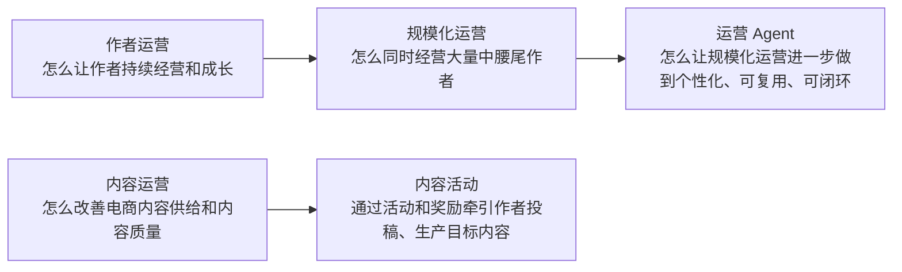
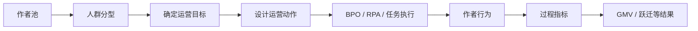
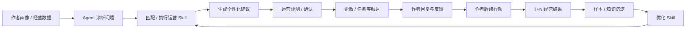

# 电商运营业务与运营 Agent 答辩问答手册

> 用途：实习生转正答辩 / 业务理解复习 / 评审追问准备  
> 组织方式：按照“基础概念 → 作者运营 → 内容运营 → 规模化运营 → 运营 Agent → 术语表”的顺序展开。  
> 回答原则：先说明“为什么”，再解释“是什么”，最后用例子说明“怎么做、解决什么问题”。

---

## 一、先建立整体业务框架

在进入具体问题前，可以先记住下面这条主线：



其中：

- **作者运营**的对象是作者，核心关注作者能否持续开播、投稿、选品、成交和成长。
- **内容运营**的对象是内容生态，核心关注平台上生产了什么内容、内容质量如何、怎样增加优质内容供给。
- **规模化运营**属于作者运营的一种组织和执行方式，重点解决作者数量非常大时如何扩大服务覆盖。
- **运营 Agent**不是独立于作者运营的新业务，而是为规模化作者运营提供新的执行和学习能力。

---

# 二、基础业务概念

## Q1：什么是“运营”？

**回答：**

运营可以理解为：**围绕一个明确的业务目标，持续分析现状、选择目标对象、设计策略、推动执行，再根据结果调整下一轮动作。**

它不是简单地“发消息”“做活动”或者“看数据”，这些都只是运营动作。完整的运营过程通常是：

```text
明确目标
→ 找到目标人群 / 内容
→ 判断当前问题
→ 设计运营策略
→ 推动执行
→ 看过程数据和结果
→ 调整下一轮策略
```

例如，目标是“让一批近 7 天没有开播、但过去有成交的作者重新经营”，运营需要先找到这批人，再判断他们为什么不播，然后选择开播激励、货品推荐、经营建议等不同策略，最后观察作者有没有重新开播、有没有成交。

所以一句话概括：

> **运营负责让业务目标真正发生，通过持续的策略和执行改变用户、作者或内容的行为。**

---

## Q2：什么是“产品”？

**回答：**

产品主要负责：**把业务中的问题和流程抽象成稳定、可重复使用的系统能力。**

例如，运营过去通过表格记录“哪些达人由谁负责”，产品发现这个动作长期存在，而且涉及大量人和团队，就可以建设“达人库”，把达人归属、认领、协作和流转做成线上能力。

因此，产品更关注：

- 用户是谁；
- 用户有什么问题；
- 哪些流程值得系统化；
- 系统应该提供什么功能；
- 规则、交互和数据如何组织；
- 功能上线后是否真正解决问题。

一句话概括：

> **运营更多是在使用策略推动业务结果，产品更多是在建设工具和机制，让这些业务动作能够更高效、稳定地执行。**

---

## Q3：运营和产品最核心的区别是什么？

**回答：**

可以从“策略”和“能力”两个角度理解：

| 对比项 | 运营 | 产品 |
| --- | --- | --- |
| 主要关注 | 怎么把业务目标做出来 | 怎么把业务问题做成系统能力 |
| 常见工作 | 分人群、定策略、做活动、触达、复盘 | 设计功能、流程、规则、权限、数据能力 |
| 典型产出 | 运营方案、人群策略、活动、执行结果 | PRD、产品功能、平台能力 |
| 时间尺度 | 可能随业务目标不断变化 | 更强调长期、稳定、可复用 |
| 例子 | 选择一批 S2 作者做开播召回 | 建设人群管理、BPO 任务、RPA 触达系统 |

但是二者不是割裂的。

例如规模化运营中：

```text
运营：
定义“什么作者需要被运营、应该做什么”

产品：
把“人群管理、任务分配、批量触达、效果回收”做成平台能力
```

所以答辩中可以说：

> **运营负责定义“做什么、为什么做”，产品负责把高频、稳定的运营方式沉淀成“怎么高效地做”。**

---

# 三、作者运营

## Q4：什么是作者运营？

**回答：**

作者运营主要围绕电商作者的经营周期开展，通过**建联触达、任务牵引、货品撮合、咨询服务等运营动作**，推动作者持续产生有效经营行为，提升内容供给、流量转化和交易贡献。

可以把作者经营简单拆成几个关键动作：

```text
进入电商
→ 开始经营
→ 开播 / 投稿
→ 选择合适商品
→ 获得流量
→ 产生成交
→ 持续经营并成长
```

作者运营要做的，就是在作者经营过程中发现卡点并提供对应帮助。

例如：

- 新作者开通电商权限后一直没有成交，可以通过任务或选品帮助其完成第一次动销；
- 一个历史成交不错的作者最近没有开播，需要判断是经营意愿下降、没有合适货品，还是其他原因；
- 一个作者有流量但成交较差，可以进一步分析选品、转化等问题。

因此，作者运营不等于“联系作者”。

> **作者运营是找到合适的作者，判断其经营问题，提供对应运营动作，并持续观察作者有没有经营和成长。**

**资料依据：**《规模化运营 onepage》《实习生转正答辩》。

---

## Q5：作者运营主要有哪些业务内容？

**回答：**

从当前资料看，可以将作者运营理解为以下几类核心工作。

### 1. 作者管理

先解决：

> 哪些作者属于哪个团队？由谁负责？

这部分包括达人归属、认领、协作、跨团队流转等，主要由达人库承载。

### 2. 建联和触达

需要建立运营和作者之间的联系，例如企微建联，并通过消息、任务等方式把运营动作传递给作者。

### 3. 任务牵引

根据作者当前阶段，让作者完成某个明确动作，例如：

- 参加活动；
- 开播；
- 投稿；
- 领取任务；
- 完成某个经营目标。

### 4. 货品撮合

帮助作者找到更合适的商品、商家或货盘，提高“有商品可卖”和“商品适合作者”的概率。

### 5. 经营诊断和成长

根据作者数据判断问题，例如：

```text
GMV下降
→ 是供给减少？
→ 还是流量下降？
→ 还是转化下降？
```

再匹配对应的运营方法。

### 6. 咨询和服务

作者经营过程中还会产生规则、权限、商品、内容等问题，需要运营或服务团队承接。

因此可以用一句话总结作者运营：

> **先管理好作者关系，再围绕作者的经营问题，通过触达、任务、货品、咨询和诊断等方式推动作者持续经营和成长。**

---

## Q6：什么是达人库？

**回答：**

达人库是作者运营中**管理达人及其运营归属关系的核心工具**。

平台作者数量非常大，而且不同作者可能由不同团队负责。如果没有统一系统，很容易出现：

- 这个作者到底归哪个团队？
- 谁正在负责？
- 谁可以协作？
- 作者等级或赛道变化后该转给谁？
- 过去为什么发生过团队变化？

达人库就是为了解决这类问题。

它统一管理：

```text
达人
↕
运营人员
↕
运营团队
```

并通过规则和人工操作完成达人在不同运营团队之间的归属和流转。

一句话概括：

> **达人库首先解决的不是“怎么经营作者”，而是“作者归谁管、谁来服务、关系怎么流转”。**

**资料依据：**《电商内容生态达人库白皮书》。

---

## Q7：达人库具体包含哪些部分？

**回答：**

当前达人库主要可以分成三个层次。

### 1. 电商达人库

用于查看**全量电商达人**。

可以查看达人信息、当前归属团队、历史流转等，是全局的达人查看入口。

### 2. 团队达人库

面向 KA、规模化运营等团队。

团队管理员可以：

- 查看团队达人；
- 给运营分配达人；
- 认领达人；
- 在团队或赛道之间转移达人；
- 处理跨团队申请。

### 3. 我的达人库

面向单个运营人员。

用于管理：

- 我认领的达人；
- 我的重点达人；
- 我协作的达人；
- 我查看或管理过的达人。

所以它们的关系可以理解为：

```text
电商达人库：平台视角看全部达人
        ↓
团队达人库：团队视角管理本团队达人
        ↓
我的达人库：运营个人管理自己负责的达人
```

---

## Q8：达人为什么需要在不同团队之间流转？

**回答：**

因为作者不是固定不变的。

随着经营变化，作者的：

- 身份；
- S 等级；
- 所属赛道；
- 引入状态；
- 业务价值

都可能变化。

例如，一个原来由规模化团队服务的作者，成长为更高价值作者后，可能需要转入 KA 团队进行更精细的服务。

达人库通过规则判断作者变化，并支持自动或人工调整归属。

因此所谓“达人流转”，本质上是：

> **作者发生变化以后，让负责他的运营团队也跟着变化。**

这样才能保证作者一直进入合适的运营体系。

---

## Q9：什么是 KA 作者？和规模化作者有什么区别？

**回答：**

从当前业务资料可以明确的是：

- 规模化运营主要面向 S0-S3 这一大批中腰尾、成长和拉新作者；
- S4+ 作者数量更少，但单个作者交易价值更高；
- S4+ 更偏向 KA / 头部作者的精细化运营。

可以理解为：

```text
S4+ / KA 作者
数量少、单体价值高
→ 更适合深度 1v1、资源协调、长期经营规划

S0-S3 规模化作者
数量非常大
→ 更强调分层、批量服务、自动化能力
```

需要注意：当前资料并没有完整定义所有 S4+ 作者的组织归属，所以答辩时不要自行扩大为“所有 S4+ 一定属于某个固定团队”。

---

## Q10：什么是 S 等级？

**回答：**

S 等级是业务中用于表示作者成长或经营价值分层的一套等级体系，例如 S1、S2、S3、S4、S5。

当前达人库资料明确提到：

- S4 / S5 属于较高价值分层；
- 规模化运营重点覆盖 S0-S3；
- 不同等级会影响作者分工和运营方式。

在答辩中不需要自行解释具体算法，因为当前提供的资料没有完整给出 S 等级计算公式。

可以只回答：

> **S 等级是作者经营分层，用于帮助业务区分不同经营阶段和价值的作者，并决定采用什么样的运营方式。**

---

## Q11：什么叫“撮合”？

**回答：**

撮合就是：

> **让合适的作者和合适的商品、商家建立匹配。**

因为作者有流量，不代表随便选一个商品都能卖得好。

例如：

```text
美妆作者
+
适合其粉丝人群的美妆商品
→ 更有可能产生交易
```

所以撮合关注的不只是“有没有商品”，还要关注：

- 商品是否适合这个作者；
- 商品佣金和竞争力如何；
- 作者是否愿意推广；
- 最终是否产生动销。

---

## Q12：什么叫“动销”？

**回答：**

动销指的是商品或作者**真正产生交易**。

例如：

```text
作者开通电商权限
≠ 已经动销

作者挂了商品
≠ 已经动销

作者产生真实订单 / GMV
= 发生动销
```

因此在新作者成长中常见的一条路径是：

```text
有权限
→ 有经营
→ 能动销
→ 持续增长
```

---

# 四、内容运营

## Q13：什么是内容运营？

**回答：**

内容运营主要围绕**电商内容供给和内容质量**开展。

当前电商内容希望围绕“真实、丰富、发现”的内容心智改善平台内容生态，因此内容运营需要先明确什么是有价值的电商内容，再通过内容识别、评级、运营干预和创作牵引，让平台产生更多优质内容。

可以简单理解成两件事：

### 第一，看清楚平台上有什么内容

例如：

- 当前有多少电商视频；
- 哪些是优质内容；
- 哪些内容质量较差；
- 内容带来了多少播放、种草或交易价值。

### 第二，引导作者生产更多目标内容

例如：

- 通过内容评级和流量策略“扶优打差”；
- 通过热点运营引导作者参与话题；
- 通过内容活动和 DOU+ 奖励鼓励作者投稿。

所以一句话概括：

> **作者运营关注“把作者经营好”，内容运营关注“让平台产生更多符合目标的优质电商内容”。**

**资料依据：**《内容运营 OnePage》。

---

## Q14：内容运营主要包含哪些业务？

**回答：**

当前资料中重点包括三类能力：

### 1. 视频管理

帮助运营查看平台内容供给和数据表现，例如视频数据、价值、处罚和评级结果。

### 2. 内容评级

建立内容标准，对视频进行机审、人审和运营修正，并根据评级结果进行后续应用。

典型链路是：

```text
制定优质标准
→ 内容评级
→ 内容打标
→ 流量 / 策略应用
→ 向作者透传
→ 验证价值
```

### 3. 热点运营

运营查看热点、分析热点与作者的匹配关系，然后定向触达作者，牵引其围绕热点投稿。

因此内容运营并不是单纯“审核内容”，而是：

> **通过标准、评级和运营手段调整整个电商内容供给结构。**

---

## Q15：什么是内容活动？

**回答：**

内容活动是内容运营中用于**牵引作者投稿和优质内容生产**的一种运营手段。

运营会先设定活动目标，例如：

- 促投稿；
- 促全域成交价值；
- 鼓励买家秀；
- 鼓励某类优质 UGC 内容。

然后定义：

```text
哪些作者 / 内容可以参加
→ 满足什么条件可以获奖
→ 奖励什么
→ 怎么下发奖励
```

当前内容活动主要使用 DOU+ 资源作为激励。

例如：

> 运营想增加“春季好物开箱”类内容，可以创建一个活动，只允许目标作者参与，要求作品满足指定话题或内容评级，再对符合条件的作品发放 DOU+ 流量资源。

所以一句话概括：

> **内容活动就是把内容运营目标设计成一套“参与条件 + 内容要求 + 奖励规则”，用资源激励作者完成目标内容生产。**

**资料依据：**《运营平台_内容活动使用指南》。

---

## Q16：内容活动的完整流程是什么？

**回答：**

当前平台整体流程可以概括为：

```text
活动配置
→ 奖励配置
→ 关联触达渠道
→ 活动审批
→ 作者投稿 / 产生内容
→ 筛选符合条件的作品或作者
→ 奖励投放
→ 数据查看
→ 后续数据回收
```

其中活动创建重点解决三个问题：

### 1. 活动要做什么？

配置：

- 活动名称；
- 活动目标；
- 活动周期；
- 关联项目和预算。

### 2. 谁能够获得奖励？

配置准入门槛，例如：

- 指定作者人群；
- 买家秀；
- 标记；
- 好物清单；
- 内容评级；
- 关联话题；
- 电商意图。

### 3. 奖励怎么发？

可以根据：

- 指定条件；
- 权重排名；
- 人工提报

等方式决定奖励对象。

---

## Q17：什么是 DOU+？为什么内容活动会使用 DOU+？

**回答：**

DOU+ 是可以为创作者短视频或直播提供流量扶持的工具。

当前内容活动中主要有：

- **DOU+ 币**：直接投放到具体作品；
- **DOU+ 券**：发给作者，由作者后续使用。

内容运营的目标之一是增加目标内容供给，因此可以使用流量资源作为激励：

```text
作者生产目标内容
→ 满足活动规则
→ 获得 DOU+ 奖励
→ 内容获得更多流量支持
```

它本质上是一种运营资源。

---

# 五、规模化运营

## Q18：什么是规模化运营？

**回答：**

规模化运营不是和作者运营完全独立的另一项业务。

它仍然是作者运营，只是解决的是：

> **当作者数量达到百万甚至千万量级时，怎么让有限的运营人员同时覆盖更多作者。**

当前规模化运营主要面向 S0-S3 的腰尾、成长和拉新作者，希望通过产品化和自动化能力扩大作者服务规模，并推动作者成长。

可以直接对比：

```text
作者运营：
怎么让一个作者经营得更好？

规模化运营：
怎么让大量作者同时经营得更好？
```

因此可以写成：

> **规模化运营 = 作者运营 × 分层分群 × 标准化策略 × 批量执行 × 数据复盘。**

**资料依据：**《规模化运营 onepage》。

---

## Q19：为什么需要规模化运营？

**回答：**

因为作者数量和人工运营能力之间存在非常明显的矛盾。

资料中提到：

- S1-S3 作者超过 300 万；
- S0 作者超过 8000 万；
- 过去主要依赖 40+ 运营和 120+ BPO；
- S2.5+ 作者运营渗透约 50%；
- S2 约 27.39%；
- S1 不足 5%。

这说明：

> **即使人工运营对单个作者很有效，也不可能靠人工逐个覆盖如此大的作者池。**

因此规模化运营要解决的是：

```text
作者数量非常大
+
运营 / BPO 人力有限
↓
必须通过分层、工具和自动化扩大服务覆盖
```

---

## Q20：规模化运营主要解决哪些问题？

**回答：**

从早期建设看，主要解决三类基础问题。

### 1. 运营谁、谁负责？

以前作者分群和归属缺少统一线上口径。

因此建设**运营人群管理**，建立：

```text
作者人群
→ 运营 POC
→ BPO 小组
```

的权责关系。

### 2. 重点作者怎么持续深度服务？

S2.5+ 等重点作者需要 BPO 长期跟进，但任务、记录和复盘过去比较依赖线下。

因此建设**BPO 任务系统**，把：

```text
任务创建
→ 分配
→ 执行
→ 跟进
→ 完成判定
→ 结果回收
```

线上化。

### 3. 长尾作者怎么扩大覆盖？

靠 BPO 逐个企微建联、逐个发送消息无法扩大规模。

因此建设**企微 RPA**，完成：

- 批量建联；
- 批量触达；
- 会话承接；
- 自动化执行。

---

## Q21：规模化运营的业务具体是怎么做的？

**回答：**

可以用下面的链路理解：



例如，对“S2 视频作者”可以做：

```text
找到产能和 GMV 较高的人群
→ 判断需要提升投稿还是动销
→ 通过任务、社群服务、撮合、内容范式等动作牵引
→ 看挂车投稿、动销和作者跃迁
```

Q3 OKR 中使用过一个很典型的表达：

> **人群分型 → 运营动作 → 成长因子过程指标牵引 → 结果指标提升。**

这基本就是规模化运营的工作逻辑。

---

## Q22：规模化运营当前有哪些核心模块？

**回答：**

当前可以重点记三个模块。

### 1. 运营人群管理

目的：解决“运营谁、谁负责、效果怎么样”。

主要能力：

- 按标签和规则划分人群；
- 明确人群对应的运营 POC；
- 继续拆分细分人群；
- 查看人群指标和人群变化。

### 2. BPO 任务系统

目的：让重点作者的人工深度运营变得可管理、可跟踪。

主要能力：

- 创建任务；
- 分配 BPO；
- 提供作者上下文；
- 记录跟进；
- 查看完成情况；
- 回收业务指标。

### 3. 企微 RPA

目的：扩大建联和触达规模。

主要能力：

- 托管企微账号；
- 大批量建联作者；
- 批量群发；
- 同步消息；
- 承接标准咨询；
- 复杂问题再交给 BPO。

---

## Q23：什么是 BPO？

**回答：**

BPO 是 **Business Process Outsourcing，业务流程外包**。

在这里可以简单理解为：

> **由外包服务团队按照运营制定的规则和任务，实际跟进和服务作者。**

运营和 BPO 的职责不一样：

```text
运营：
决定目标、人群、策略、任务和效果判断

BPO：
按任务和 SOP 执行作者沟通、跟进和反馈
```

例如：

> 运营决定“这批 S2.5+ 作者需要做开播召回”，BPO 负责联系具体作者，了解情况、给出信息、持续跟进并记录结果。

所以一句话：

> **运营负责想怎么运营，BPO 负责把需要人工执行的运营动作做下去。**

---

## Q24：什么是 RPA？

**回答：**

RPA 是 **Robotic Process Automation，机器人流程自动化**。

这里的“机器人”不是物理机器人，而是用程序按照固定规则自动完成重复操作。

规模化运营中的企微 RPA 主要用于：

- 批量建联作者；
- 批量发送消息；
- 群发任务；
- 消息同步；
- 固定流程执行。

例如：

```text
给 10 万作者发送活动提醒
```

如果让 BPO 一个人一个人发，成本很高。

RPA 可以根据规则自动批量执行。

所以一句话：

> **RPA 解决“重复动作怎么自动做”，它擅长执行，但本身不擅长复杂判断。**

---

## Q25：BPO、RPA、Agent 有什么区别？

**回答：**

可以用“理解能力”和“执行规模”来区分。

| 方式 | 优点 | 局限 |
| --- | --- | --- |
| BPO | 能理解复杂情况、可以深入沟通 | 人力有限，成本高 |
| RPA | 可批量执行，速度快，成本低 | 更依赖固定规则，不擅长个性化判断 |
| Agent | 能结合数据和上下文进行诊断、选择策略、生成个性化内容 | 需要控制质量、风险和效果 |

一个最直观的例子：

> 1 万个作者近 7 天没有开播。

RPA 更适合：

```text
给 1 万人批量发送统一提醒
```

BPO 更适合：

```text
挑出其中 100 个重点作者逐个沟通原因
```

运营 Agent 想做到：

```text
先分析每位作者的数据
→ 判断各自为什么没播
→ 不同问题匹配不同建议
→ 再批量触达
```

---

## Q26：规模化运营已经有 BPO 和 RPA，为什么还不够？

**回答：**

因为早期规模化运营主要解决的是：

> **“能不能覆盖更多作者。”**

但扩大规模之后，会暴露新的问题：

### 问题一：批量运营不够个性化

一批人可以使用同一个策略，但同一人群里的作者真实问题仍然不同。

例如都是“7 天未开播”：

- A 作者可能没有合适货；
- B 作者可能经营意愿降低；
- C 作者可能刚入驻不会操作；
- D 作者可能过去 GMV 很高，但最近遇到特殊问题。

如果全部发同一句话，虽然触达规模很大，但效果未必好。

### 问题二：运营经验难复用

资深运营知道“看到什么数据应该怎么判断”，但经验可能存在：

- 人脑中；
- 聊天记录里；
- 会议纪要里；
- 零散案例里。

新人很难直接复用。

### 问题三：运营效果没有真正闭环

发送成功不代表运营有效。

还需要继续回答：

```text
作者看了吗？
→ 回复了吗？
→ 采纳了吗？
→ 执行了吗？
→ 开播 / 投稿了吗？
→ GMV 改善了吗？
```

这些数据如果散在不同系统中，就很难判断一次运营到底有没有价值。

---

# 六、为什么要设计运营 Agent？

## Q27：运营 Agent 最核心想解决什么问题？

**回答：**

运营 Agent 的核心目标不是简单“给运营写文案”，而是：

> **让规模化运营从“规模化触达”进一步升级为“规模化的个性化作者成长服务”。**

它主要针对规模化运营的三个问题：

```text
问题1：批量策略不够个性化
→ Agent 对每位作者进行诊断

问题2：运营经验难复用
→ 把方法沉淀为 Skill 和案例

问题3：效果难判断
→ 打通触达、反馈和后验经营结果
```

最终希望做到：

```text
作者数据
→ 诊断
→ 策略
→ 触达
→ 反馈
→ 行为结果
→ 判断策略效果
→ 优化策略
```

---

## Q28：运营 Agent 的设计思想是什么？

**回答：**

可以概括为三点。

### 1. 不直接追求“全自动”，先建立人机协作

运营方法会被批量应用到很多作者。

如果 Skill 或诊断有问题，影响可能被快速放大。

因此当前思路是：

```text
Agent 生成
→ 运营试运行和审核
→ 确认后再批量执行
```

而不是一开始就完全放开。

### 2. 不只自动执行，要让运营可以修改方法

不同业务人群的方法不同，因此系统不是只提供一个固定 Agent。

运营可以针对自己负责的人群调整诊断 Skill。

### 3. 不只看输出，要看后续真实效果

Agent 给出的建议好不好，不能只看文案是否合理，还要看：

```text
达人是否采纳
→ 是否行动
→ 行动是否有效
→ 是否带来 GMV / 跃迁
```

所以它必须是一条长期的数据闭环。

---

## Q29：运营 Agent 的整体框架是什么？

**回答：**

可以用这张图理解：



这里最重要的不是某一个节点，而是最后：

```text
结果
→ 重新影响下一轮策略
```

所以才叫“闭环”。

---

# 七、运营 Agent 每一项具体工作是什么？

## Q30：工作一——Agent 的“诊断”具体是什么意思？

**回答：**

诊断就是：

> **读取作者数据，判断作者当前经营卡点是什么。**

例如一个作者：

```text
近 7 天开播时长下降 50%
进房率基本正常
转化率基本正常
历史 GMV 较高
```

那么问题可能主要在：

> **供给减少 / 没有持续开播**

而不是流量和转化。

Agent 可以进一步输出：

```text
问题：近期直播供给明显下降
判断依据：开播时长下降，但流量和转化相对稳定
建议：优先恢复开播频次
```

### 解决的问题

过去运营需要逐个打开多个页面看数据。

Agent 希望先承担大量基础的数据读取和初步判断。

---

## Q31：工作二——为什么要用 Skill？

**回答：**

Skill 可以理解成：

> **把某一类运营方法整理成 Agent 可以执行的规则和流程。**

例如“账号诊断 Skill”可以规定：

```text
先看哪些作者指标
→ 如何判断主要问题
→ 不同问题对应哪些建议
→ 输出格式是什么
```

为什么不能只让模型自由回答？

因为业务运营要求稳定。

同样一批作者，不能每次都依赖模型临时发挥。

Skill 的作用就是把运营方法沉淀下来，让它：

- 可复用；
- 可修改；
- 可评测；
- 可发布；
- 可版本管理。

---

## Q32：为什么不同运营还需要自己的专属 Skill？

**回答：**

因为不同运营负责的：

- 人群；
- 赛道；
- 体裁；
- 经营目标

可能不同。

例如：

```text
运营 A：负责美妆直播
运营 B：负责服饰短视频
```

两个人对作者的诊断重点可能不同。

因此当前设计允许运营拥有自己的 `账号诊断_{运营uid}` 版本，而不是所有运营共同修改同一份线上 Skill。

### 解决的问题

1. 避免多人修改互相覆盖；
2. 允许不同人群使用差异化方法；
3. 便于试验和对比不同版本。

---

## Q33：工作三——运营是怎么修改 Skill 的？

**回答：**

当前方案通过 AIME 承接运营交互。

运营可以直接用自然语言提出修改，例如：

> “对于历史 GMV 高、近 7 天没有开播的作者，先判断是否缺少合适货品，再判断开播意愿。”

系统通过 `skillCreator`：

```text
找到当前运营的专属 Skill
→ 读取原内容
→ 理解运营修改要求
→ 修改当前草稿
```

所以运营不需要直接写代码或手动改复杂配置。

### 解决的问题

把过去：

```text
运营发现方法需要改
→ 提需求
→ 产品 / 研发修改
```

逐渐变成：

```text
运营自己描述策略
→ Agent 帮助修改 Skill
```

---

## Q34：什么是 AIME？它在运营 Agent 中是什么角色？

**回答：**

在当前方案中，可以把 AIME 理解成：

> **运营与 Agent 交互、理解意图并编排不同 Skill 的入口。**

例如运营说：

> “修改账号诊断 Skill。”

AIME 负责识别这是一个“修改 Skill”的任务，再交给 `skillCreator`。

运营说：

> “试一下这个效果。”

则继续进入评测流程。

因此：

```text
AIME
= 运营交互入口 + Skill 编排入口

小应
= 实际业务诊断 / 运行链路的一部分
```

二者不要混成同一个东西。

---

## Q35：工作四——Skill 改完以后为什么不能直接上线？

**回答：**

因为这个 Skill 可能会应用到一大批作者。

一旦错误批量放大，风险很高。

所以当前设计增加：

```text
修改
→ 试运行
→ 看样本
→ 运营确认
→ 发布
```

运营先选择几个 UID 或一个人群包进行仿真。

系统使用和线上相近的模型、调度和 Skill 执行链路跑出结果，例如：

```text
作者 A：诊断 + 建议
作者 B：诊断 + 建议
作者 C：诊断 + 建议
```

运营看完以后：

- 满意 → 发布；
- 不满意 → 回去继续改 Skill。

### 解决的问题

> **防止一个未经验证的运营方法直接影响整批作者。**

---

## Q36：什么是 skillEvaluator？

**回答：**

`skillEvaluator` 主要承接 Skill 修改后的：

- 评测；
- 测试版本生成；
- PPE 部署；
- 仿真结果回传；
- 满意后的 online 发布；
- 批量下发。

可以记成：

```text
skillCreator
负责“怎么改”

skillEvaluator
负责“改完以后怎么试、怎么确认、怎么发布”
```

---

## Q37：工作五——什么是“人群绑定”？

**回答：**

人群绑定就是明确：

> **这个 Skill 应该应用到哪些作者。**

当前 MVP 简化为：

- 人群包；
- UID；
- UID 数组。

例如：

```text
Skill：S2 视频作者召回诊断
绑定人群：
“历史有成交、近 7 天未开播”的作者人群包
```

这样小应在执行时就知道这批作者应该使用哪个运营版本。

### 解决的问题

避免：

> 一个运营策略无差别作用到所有作者。

---

## Q38：什么是 UID？什么是人群包？

**回答：**

### UID

作者的唯一标识。

可以理解成系统识别一个作者的 ID。

### 人群包

根据某些条件提前圈出来的一批作者。

例如：

```text
条件：
近 7 天未开播
AND
历史 30 天有成交
AND
S2 作者
```

满足条件的作者集合就可以形成一个人群包。

---

## Q39：工作六——Agent 怎么实现个性化触达？

**回答：**

传统批量触达更像：

```text
1 万作者
→ 同一段消息
```

Agent 希望变成：

```text
同一人群
↓
每个作者先诊断
↓
按各自问题生成建议
↓
再批量发送
```

例如，同样属于“近 7 天未开播”：

```text
作者 A：
缺少合适商品
→ 推荐选品 / 撮合

作者 B：
开播频次下降
→ 开播恢复建议

作者 C：
有经营行为但转化变差
→ 转化问题诊断
```

### 解决的问题

> **让“批量”不再等于“所有人说同一句话”。**

---

## Q40：当前 1v1 和批量场景有什么区别？

**回答：**

按照 MVP 当前口径：

### 1v1 场景

系统生成可复制的内容，但**不直接代替运营发送**。

流程：

```text
Agent 生成
→ AIME 展示
→ 运营复制
→ 运营自己到企微发送
```

### 批量场景

人群包或 UID 数组对应的 Skill 经过评测并发布 online 后，可以进入批量下发链路。

因此要明确：

> **当前 MVP 还不是所有场景完全自动发送。**

---

## Q41：工作七——为什么要回收达人回复？

**回答：**

因为“消息发出去”并不能说明诊断正确。

例如：

```text
Agent：
“建议你增加开播频率。”

作者：
“最近不是不想播，是一直没有适合我的货。”
```

这个回复说明：

> 原来的问题判断可能错了。

下一步应该从“开播激励”切换到“选品 / 撮合”。

所以回复可以帮助运营发现：

- 诊断错误；
- 建议不适用；
- 作者新的需求；
- 线上 badcase。

### 解决的问题

让运营从：

```text
单向推消息
```

变成：

```text
触达
→ 作者反馈
→ 调整判断
```

---

## Q42：什么是 badcase？

**回答：**

badcase 就是：

> **Agent 输出或执行结果不符合业务预期的案例。**

例如：

- 诊断错了；
- 使用了不适合的人群策略；
- 文案表达有问题；
- 忽略了作者的重要数据；
- 推荐了作者无法执行的动作。

badcase 不是只记录“失败”，更重要的是分析：

> **为什么失败，以及 Skill 应该在哪里改。**

---

## Q43：工作八——为什么还要做“效果回收”？

**回答：**

因为回复也不是最终结果。

作者可能回复：

> “好的，我知道了。”

但他最后什么都没做。

所以真正要继续看：

```text
是否触达
→ 是否回复
→ 是否采纳
→ 是否执行
→ 行动有没有效果
```

例如一个“恢复开播”建议：

```text
T+1：是否重新开播
T+7：开播次数 / 时长是否增加
T+30：GMV 是否改善
```

这才可以判断运营动作是不是有效。

### 解决的问题

从：

> “消息发出去了”

升级到：

> **“这个运营动作到底有没有改变作者经营。”**

---

## Q44：什么是 T+1、T+7、T+30？

**回答：**

T 表示某个运营动作发生的时间点。

- T+1：动作发生 1 天后；
- T+7：7 天后；
- T+30：30 天后。

因为作者经营结果可能不会马上出现，所以需要在不同时间窗口观察。

例如今天发了选品建议：

```text
当天：
作者回复

T+1：
是否选品

T+7：
是否开播 / 投稿

T+30：
GMV 是否持续变化
```

---

## Q45：工作九——知识库 / 样本库是干什么的？

**回答：**

它的作用是把每一次服务过程真正保存下来。

例如记录：

```text
这个作者当时是什么画像
→ 用了哪个 Skill 版本
→ Agent 给了什么建议
→ 作者怎么回复
→ 运营是否采纳
→ 后来做了什么
→ 最终结果怎么样
```

这些数据经过清洗后，可以形成：

- 正样本；
- 负样本；
- badcase；
- 有效运营案例；
- 典型作者特征。

再用于：

- 改 Skill；
- 做 Agent 评测；
- 提炼公共运营经验。

---

## Q46：为什么运营 Agent 不只是“知识库 + 大模型”？

**回答：**

因为知识库只能回答：

> **过去有哪些经验。**

但运营 Agent 还必须完成真实业务动作：

```text
读取作者数据
→ 判断问题
→ 选择策略
→ 调业务工具
→ 触达
→ 回收回复
→ 跟踪结果
```

因此它不是简单问答系统。

知识库只是其中的一个输入和沉淀层。

---

# 八、什么叫“诊断—触达—反馈—效果回收”闭环？

## Q47：这四个环节分别是什么？

**回答：**

### 1. 诊断

判断作者当前问题。

例如：

> 最近 GMV 下降主要因为开播减少。

### 2. 触达

把对应运营建议真正传给作者。

例如：

> 通过企微发送恢复开播和商品建议。

### 3. 反馈

作者如何回应。

例如：

> “最近没有合适商品。”

### 4. 效果回收

继续观察作者后来有没有行动，以及业务结果有没有变化。

例如：

```text
是否选品
→ 是否重新开播
→ 是否成交
→ GMV 是否提升
```

---

## Q48：为什么一定要叫“闭环”？

**回答：**

因为结果必须回到下一轮决策里。

```text
诊断
→ 触达
→ 回复
→ 行为
→ 经营结果
→ 判断策略是否有效
→ 修改 Skill
→ 下一轮继续使用
```

如果只有：

```text
诊断 → 生成文案
```

那只是 AI 助手。

如果只有：

```text
生成 → 批量发送
```

那更像智能 RPA。

只有当：

> **真实结果能够反过来调整下一次运营方法**

才构成真正的运营闭环。

---

# 九、运营 Agent 的建设规划

## Q49：运营 Agent 为什么要分阶段建设？

**回答：**

因为“Agent 自主运营作者”需要很多基础条件：

- 要有完整数据；
- 要先沉淀运营方法；
- 要知道方法是否有效；
- 要能安全批量执行；
- 最后才能逐步减少人工确认。

所以不能直接从人工运营跳到完全自动 Agent。

整体可以理解为五个阶段：

```text
阶段 1：先留下数据
阶段 2：沉淀运营方法
阶段 3：找到真正有效的方法
阶段 4：让 Agent 主动运营
阶段 5：让 Agent 长期经营作者
```

---

## Q50：第一阶段——数据基建期解决什么？

**回答：**

目标是：

> **把原来没有稳定记录的运营动作和结果留痕。**

需要记录：

- 谁服务了谁；
- 做了什么运营动作；
- 作者怎么反馈；
- 最后有什么结果。

为什么先做这个？

因为：

> **没有数据，就无法判断策略有效性，更谈不上让 Agent 学习。**

可以记成：

```text
第一阶段先回答：
“过去到底发生了什么？”
```

---

## Q51：第二阶段——运营模式沉淀期解决什么？

**回答：**

目标是：

> **把“运营怎么做”从人的经验变成可执行的 Skill。**

运营开始从：

```text
自己看数据
→ 自己想
→ 自己写
```

变成：

```text
Agent 生成
→ 运营微调
→ 采纳 / 不采纳
```

这一阶段重点不是让 Agent 自主运营，而是先让标准化方法可复用。

回答的问题是：

> **“遇到这种作者问题，一般应该怎么做？”**

---

## Q52：第三阶段——有效动作提炼期解决什么？

**回答：**

前面已经积累很多：

```text
作者
×
运营动作
×
结果
```

这时候开始判断：

> **什么作者使用什么方法效果最好？**

例如：

```text
历史高 GMV + 最近断播
+
先解决货品问题
→ 恢复开播率明显更高
```

这就可能成为一个值得扩大使用的策略。

回答的问题是：

> **“哪些方法真的有效？”**

---

## Q53：第四阶段——Agent 主动运营期是什么？

**回答：**

这是从“人驱动机器”转向“机器主动发现”的阶段。

以前：

```text
运营扫池子
→ 发现问题
→ 调 Agent
```

以后：

```text
Agent 自动看数据
→ 发现风险 / 机会
→ 生成诊断和动作
→ 标准场景直接推进
```

运营主要：

- review Agent 的动作；
- 处理难例；
- 处理风险场景；
- 调整策略。

可以理解为：

> **人主机辅 → 机主人辅。**

---

## Q54：第五阶段——个性化成长服务是什么？

**回答：**

最终目标不是给作者“一次建议”，而是长期经营作者。

例如：

```text
作者当前处于 S1
↓
先帮助完成首次动销
↓
再提高投稿 / 开播频率
↓
再优化选品和转化
↓
根据结果继续调整
↓
推动成长和跃迁
```

Agent 根据每个作者的状态制定成长路线，并根据实时反馈调整下一步。

所以最终从：

> **Agent 单点干预**

升级成：

> **Agent 全周期成长规划。**

---

# 十、当前 MVP 和长期目标要怎么区分？

## Q55：现在的运营 Agent 已经能自动经营作者了吗？

**回答：**

不能这么说。

当前 MVP 的重点是：

> **运营试用 + 把链路跑通。**

当前主要做的是：

```text
运营修改 Skill
→ 选择样本 / 人群
→ 仿真评测
→ 人工确认
→ 发布
→ 批量触达
→ 回收回复
→ 沉淀数据
```

并且：

- 1v1 当前仍由运营自己复制到企微发送；
- 基础评测集服务本期不是完整建设范围；
- 自动写入正式知识库也不是本期完整能力；
- 复杂权限和部分平台化能力仍属于后续。

所以答辩时一定要区分：

> **“当前正在建设什么”** 和 **“长期最终想达到什么”。**

---

## Q56：长期运营和 Agent 的角色分别是什么？

**回答：**

长期希望发生以下变化。

### Agent

更多承担：

- 扫描作者状态；
- 发现问题；
- 数据诊断；
- 标准化策略执行；
- 个性化沟通；
- 跟进；
- 数据记录。

### 运营

更多承担：

- 定义业务目标；
- 调整 Skill；
- 判断策略有效性；
- 处理难例和高风险场景；
- 做服务质量控制；
- 优化运营方法。

因此运营不会简单“被 Agent 替代”。

更准确地说：

> **运营从大量重复执行中释放出来，工作重心向策略、判断和质量管理移动。**

---

# 十一、运营 Agent 如何衡量是否建设成功？

## Q57：不能只看模型效果，那应该看什么？

**回答：**

可以分四个层次。

### 1. 运营效率和覆盖

看：

- 能服务多少作者；
- 一个运营能管理多少作者；
- 人工耗时是否下降。

### 2. 经验沉淀质量

看：

- 服务记录是否完整；
- 有效案例是否沉淀；
- Skill 是否能够复用。

### 3. 策略应用质量

看：

- 建议采纳率；
- 作者行动完成率；
- badcase 率。

### 4. 最终业务结果

看：

- 运营动作有效率；
- 作者跃迁；
- GMV 增量；
- 服务池和对照人群是否产生差异。

所以：

> **Agent 输出得像不像人不是最终目标，真正目标是作者是否行动、经营是否改善。**

---

# 十二、答辩中可能被继续追问的问题

## Q58：为什么不用 RPA 继续扩展，而一定需要 Agent？

**回答：**

RPA 擅长：

> **“规则确定以后，重复执行。”**

但运营中的关键问题经常不是固定流程，而是：

> **“这个作者现在到底是什么问题，应该使用哪一种策略？”**

例如两个作者都 7 天未播：

- 一个缺商品；
- 一个没有经营意愿。

RPA 可以给两个人发消息，但它本身不擅长通过多维数据判断应该发什么。

因此：

```text
RPA：扩大执行规模
Agent：提高判断和个性化能力
```

二者不是互相替代，而是可以组合。

---

## Q59：既然 BPO 能做精细运营，为什么不多招 BPO？

**回答：**

因为作者池规模远大于人工服务能力。

资料中 S1-S3 作者已经超过 300 万，S0 更大。

即使增加 BPO，人效仍然受：

- 工作时间；
- 培训成本；
- 服务一致性；
- 人员变化；
- 管理成本

限制。

所以重点不是完全取消人工，而是：

> **把大量标准化工作交给系统和 Agent，让 BPO 集中处理真正需要人工判断的重点和复杂问题。**

---

## Q60：为什么不能一开始就让 Agent 自动发送？

**回答：**

因为运营策略会被批量放大。

如果：

- 数据读取错；
- Skill 规则错；
- 生成内容不合适；

一个错误可能同时影响大量作者。

因此早期需要：

```text
版本隔离
→ 仿真
→ 样本检查
→ 人工确认
→ 再发布
```

这是批量 Agent 场景中的风险控制。

---

## Q61：为什么要让运营自己调 Skill，而不是研发维护一个统一 Skill？

**回答：**

因为运营方法变化快，而且不同人群方法不同。

如果所有策略变化都需要研发：

```text
运营发现问题
→ 提需求
→ 排期
→ 研发修改
→ 上线
```

迭代速度会非常慢。

让运营能够在安全范围内自己调 Skill，可以把高频业务策略变化从研发需求中释放出来。

但仍然需要：

- 版本控制；
- 评测；
- 人工确认；
- 发布门禁。

---

## Q62：怎么证明一条运营建议真的有效，而不是作者本来就会增长？

**回答：**

这属于后验效果评估问题。

最基础可以看：

```text
动作前后的行为和经营变化
```

更严格时还需要：

- 对照人群；
- AB 实验；
- 同类作者对比；
- 控制时间窗口和其他运营动作。

因此“建议后 GMV 上升”只是相关性证据，不一定能完全证明因果。

答辩中可以说：

> **当前闭环首先解决数据可追溯，后续更严格的策略有效性判断还需要结合实验和对照机制。**

---

## Q63：为什么不仅看达人回复率？

**回答：**

因为回复率只是沟通过程指标。

一个作者回复：

> “收到。”

不代表：

- 他接受建议；
- 他实际执行；
- 经营结果改善。

所以应该逐层观察：

```text
曝光 / 触达
→ 回复
→ 采纳
→ 行动
→ 行动有效
→ GMV / 跃迁
```

越往后越接近真实业务价值。

---

## Q64：运营 Agent 和“小应”的关系是什么？

**回答：**

从当前方案可以理解成：

- **运营 Agent**：面向运营侧的策略生产、调试、评测、发布和闭环建设；
- **小应**：已有的 AI 业务能力和执行链路，可以承接实际账号诊断、批量下发等；
- **长期规划**：两者逐步融合，由 AI 小应更多直接承接作者服务，运营主要调试和优化成长策略 Skill。

所以不要简单说：

> “运营 Agent 就是小应。”

更准确的是：

> **当前运营 Agent 重点建设运营如何定义、验证和迭代 Agent 策略，而小应承担实际业务能力执行的一部分；长期会逐步形成统一的作者服务 Agent。**

---

# 十三、常见业务术语表

## Q65：什么是 GMV？

**回答：**

GMV（Gross Merchandise Volume）通常指一定时间内产生的商品交易总额，是电商业务最常见的交易规模指标之一。

在当前业务中，它常用来观察：

- 作者交易贡献；
- 运营动作是否带来成交；
- 作者是否成长。

---

## Q66：什么是 PV / VV / Load？

**回答：**

在内容和流量场景中：

- **PV**：页面 / 内容曝光或访问次数，具体口径以业务数据定义为准；
- **VV**：Video View，视频播放量；
- **Load**：业务中常用于描述内容加载 / 分发占比或流量指标，具体计算口径需要以对应看板定义为准。

答辩中如果评委继续追问具体公式，应以内部看板口径回答，不建议自行推测。

---

## Q67：什么是 UGC？

**回答：**

UGC 是 **User Generated Content，用户生产内容**。

例如用户或作者自行创作的：

- 视频；
- 图文；
- 买家秀

都可以属于 UGC。

---

## Q68：什么是 POC？

**回答：**

POC 在组织协作语境里常指 **Point of Contact，主要对接人 / 负责人**。

例如：

> 某个人群对应一个运营 POC。

意思是：

> 这批作者由这个运营作为主要责任人。

---

## Q69：什么是 SOP？

**回答：**

SOP 是 **Standard Operating Procedure，标准作业流程**。

它用于明确：

```text
什么情况下
→ 做什么
→ 按什么顺序
→ 做到什么程度算完成
```

例如 BPO 运营重点作者时，可以按照统一 SOP 进行沟通和跟进。

---

## Q70：什么是 Skill？

**回答：**

在当前运营 Agent 语境里，Skill 可以理解为：

> **把某一类运营能力和执行方法组织成 Agent 可以重复执行的模块。**

例如：

- 账号诊断 Skill；
- 作者成长策略 Skill。

它通常会约束：

- 输入什么数据；
- 怎么判断；
- 调哪些工具；
- 输出什么结果。

---

## Q71：什么是 trace？

**回答：**

trace 可以理解为：

> **一次 Agent 执行过程中留下的过程记录。**

例如：

```text
收到了什么输入
→ 使用哪个 Skill 版本
→ 调用了什么能力
→ 中间结果是什么
→ 最后输出什么
```

它用于：

- 定位 badcase；
- 复盘 Agent 为什么这样判断；
- 做评测和质量分析。

---

## Q72：什么是 PPE / online 版本？

**回答：**

在当前 Skill 发布流程中：

- **PPE**：用于测试或仿真的预发布环境；
- **online**：真正允许线上业务使用的正式版本。

这样可以把：

```text
试一试
```

和：

```text
真正发给作者
```

隔离开。

---

## Q73：什么是知识库，什么是样本库？

**回答：**

两者在当前方案中作用有所不同。

### 知识库

更强调：

- 可查阅的业务知识；
- 成熟经验；
- 规则；
- 案例。

### 样本库

更强调具体实例：

```text
输入是什么
→ Agent 怎么处理
→ 人工反馈是什么
→ 最终结果是什么
```

可用于：

- Skill 优化；
- Agent 评测；
- badcase 分析；
- 模型优化。

---

# 十四、答辩时推荐的“整条业务主线”回答

如果评委让你从头到尾说明这块业务，可以使用下面这套逻辑：

> **第一，作者运营解决的是作者经营问题。**平台通过建联、任务、货品撮合、咨询和经营诊断等方式，让作者持续开播、投稿、选品和成交。作者数量很多，因此首先需要达人库管理“作者属于哪个团队、由谁负责、发生变化以后怎么流转”。
>
> **第二，规模化运营解决的是作者数量太大的问题。**平台 S0-S3 作者数量巨大，不可能全部依赖运营和 BPO 做 1v1 服务，因此建设运营人群、BPO 任务和企微 RPA：通过人群分层明确责任，重点作者由 BPO 深度服务，长尾作者通过自动化工具扩大建联和触达。
>
> **第三，规模化以后又出现新的问题。**虽然可以批量圈人、批量执行，但同一人群中的每个作者问题仍然不同；优秀运营经验难以复用；同时消息发出去之后，很难继续判断作者是否采纳、是否行动以及最终经营是否改善。
>
> **第四，因此继续建设运营 Agent。**运营可以把自己的诊断方法沉淀成 Skill，Agent 根据每个作者的真实数据批量完成个性化诊断和建议；上线前先通过样本仿真和人工确认控制风险，再通过企微等渠道触达；触达以后继续回收达人回复、行动和 T+N 经营结果，把有效和无效案例沉淀下来，再反过来优化 Skill。
>
> **最终目标不是简单用 AI 替代运营，而是让运营从大量扫数据、写消息和重复跟进中释放出来，把工作重点转向策略设计、有效性判断和复杂问题处理，让规模化运营从“规模化触达”升级到“规模化的个性化作者成长服务”。**

---

# 十五、资料依据与使用边界

本问答主要根据以下内部资料整理：

1. 《实习生转正答辩》
2. 《规模化运营 onepage》
3. 《2026 年 Q3 季度 OKR - 规模化运营》
4. 《电商内容生态达人库白皮书》
5. 《内容运营 OnePage》
6. 《运营平台_内容活动使用指南》
7. 《达人成长 数据 & 知识库建设规划 OnePage》
8. 《运营 Agent 建设技术方案初版》

其中“运营 / 产品的通用定义”属于为答辩理解补充的通用业务解释，不是上述内部文档的原文。

对于当前资料没有明确给出完整定义的内容，例如：

- S 等级的完整计算方式；
- 所有 S4+ 作者精确的组织归属规则；
- PV / Load 的完整数据公式；
- 最终策略因果评估方法；

文档中均没有自行补造固定口径。答辩遇到进一步追问时，应以业务正式文档或对应数据看板的最新定义为准。
